# Java 基础面试总结 · 吃透版

> 整理基础：`Java基础面试总结.md`
> 风格：**设计动机 → 历史演化 → 源码剖析 → 并发/灾难场景 → 线上事故 → 面试深度追问**
> 目标：不只是背结论，而是理解每一个设计决策背后的"为什么"
> 适用：中高级 Java 后端 / 基础八股 / 面试

---

## 视觉规范说明

| 标记 | 含义 | 优先级 |
|------|------|--------|
| 🔴 **必背核心** | 面试必答，底层原理 | ⭐⭐⭐⭐⭐ |
| 🟠 **重点理解** | 高频考点，源码级路径 | ⭐⭐⭐⭐ |
| 🟡 **加分项** | 拔高内容 | ⭐⭐⭐ |
| 🟢 **避坑提醒** | 实战陷阱 + 线上事故 | ⭐⭐⭐ |

> 💡 **建议**：第一遍只看 🔴，把骨架建起来；第二遍看 🟠；第三遍 🟡🟢 拔高与避坑。

---

## 全文大纲

```
第一部分 · 数据类型与基础 ⭐⭐⭐⭐
    1. 基本数据类型 8 种
    2. 自动装箱/拆箱与缓存陷阱
    3. String / StringBuilder / StringBuffer 深度解析
    4. String 常量池与 intern

第二部分 · 面向对象 ⭐⭐⭐⭐⭐
    5. 封装/继承/多态（设计动机 + JVM实现 + vtable源码）
    6. 重载 vs 重写（静态分派 vs 动态分派源码级）
    7. 抽象类 vs 接口（演化史 + 菱形继承问题）
    8. == vs equals vs hashCode（HashMap依赖链 + 线上事故）

第三部分 · 集合框架 ⭐⭐⭐⭐⭐
    9. 集合体系总览 + 选型决策树
    10. ArrayList 源码级剖析（扩容 + fail-fast + 线上事故）
    11. HashMap 深度剖析（JDK7→8演化 + 并发灾难 + 红黑树）
    12. ConcurrentHashMap（分段锁→CAS演化 + size()实现 + 扩容协助）

第四部分 · 异常体系与泛型
    13. 异常分类与处理（设计哲学 + 最佳实践 + 线上事故）
    14. 泛型与类型擦除（编译器魔法 + 桥方法 + PECS深度）

第五部分 · 反射与动态代理
    15. 反射机制（源码路径 + 性能基准 + 安全突破）
    16. JDK动态代理 vs CGLIB（字节码生成 + Spring选择策略 + 性能对比）

第六部分 · Java IO 模型
    17. BIO / NIO / AIO
    18. NIO 三大组件

第七部分 · JDK 新特性
    19. JDK 8 核心特性
    20. Stream API 深度
    21. 虚拟线程（JDK 21）

第八部分 · 面试官深度追问 20 题（每题200+字完整作答）
```

---


# 第一部分 · 数据类型与基础

## 1. 基本数据类型

### 1.1 🔴 8 种基本类型速记表

| 类型 | 字节 | 位数 | 范围 | 默认值 | 包装类 |
|------|------|------|------|--------|--------|
| `byte` | 1 | 8 | -128 ~ 127 | 0 | Byte |
| `short` | 2 | 16 | -32768 ~ 32767 | 0 | Short |
| `int` | 4 | 32 | -2^31 ~ 2^31-1 | 0 | Integer |
| `long` | 8 | 64 | -2^63 ~ 2^63-1 | 0L | Long |
| `float` | 4 | 32 | IEEE 754 | 0.0f | Float |
| `double` | 8 | 64 | IEEE 754 | 0.0d | Double |
| `char` | 2 | 16 | 0 ~ 65535 | '\u0000' | Character |
| `boolean` | 1/4 | - | true/false | false | Boolean |

> 🟠 **boolean 的大小**：JVM 规范没有明确定义。单独使用时可能是 4 字节（当 int 处理），boolean 数组中每个元素 1 字节。HotSpot 中 boolean 字段在对象中占 1 字节，但局部变量在栈帧中占 4 字节（JVM 操作数栈最小单位是 int）。

### 1.2 🔴 基本类型 vs 包装类

| 维度 | 基本类型 | 包装类 |
|------|---------|--------|
| 存储位置 | ==栈/对象内== | ==堆==（对象） |
| 默认值 | 有（0/false） | null |
| 泛型 | ❌ 不能用 | ✅ `List<Integer>` |
| 比较 | `==` 比较值 | `==` 比较地址 |
| 性能 | 快 | 慢（拆装箱开销） |

---

## 2. 自动装箱/拆箱

### 2.1 🔴 原理与源码

```java
// 自动装箱: 编译器自动调用 valueOf
Integer a = 100;  // → Integer.valueOf(100)

// 自动拆箱: 编译器自动调用 xxxValue
int b = a;        // → a.intValue()
```

### 2.2 🔴 Integer 缓存池（-128 ~ 127）源码

```java
// java.lang.Integer.IntegerCache
private static class IntegerCache {
    static final int low = -128;
    static final int high;  // 默认 127
    static final Integer[] cache;

    static {
        // ★ 可通过 -XX:AutoBoxCacheMax=<size> 调整上限
        int h = 127;
        String integerCacheHighPropValue =
            VM.getSavedProperty("java.lang.Integer.IntegerCache.high");
        if (integerCacheHighPropValue != null) {
            int i = parseInt(integerCacheHighPropValue);
            i = Math.max(i, 127);  // 最小127
            h = Math.min(i, Integer.MAX_VALUE - (-low) - 1);
        }
        high = h;
        cache = new Integer[(high - low) + 1];
        int j = low;
        for (int k = 0; k < cache.length; k++)
            cache[k] = new Integer(j++);  // ★ 类加载时就创建好
    }
}

public static Integer valueOf(int i) {
    if (i >= IntegerCache.low && i <= IntegerCache.high)
        return IntegerCache.cache[i + (-IntegerCache.low)];  // ★ 命中缓存
    return new Integer(i);  // 超出范围 new 新对象
}
```

### 2.3 🔴 经典面试题

```java
Integer a = 127, b = 127;
a == b   // ✅ true (缓存池同一对象)

Integer c = 128, d = 128;
c == d   // ❌ false (new 出不同对象)

Integer e = new Integer(127);
Integer f = new Integer(127);
e == f   // ❌ false (直接 new 绕过缓存)

// 🟢 避坑：包装类比较永远用 equals()！
```

### 2.4 🟢 自动拆箱 NPE 线上事故

> 🟢 **事故还原**：
> - 某电商系统，订单金额字段用 `Integer amount` 存储
> - 前端未传金额时，amount = null
> - 后端代码：`if (order.getAmount() > 0)` → 自动拆箱 → NPE
> - **影响**：批量创建订单接口全部 500，持续 15 分钟
> - **根因**：`order.getAmount()` 返回 null，与 int 比较时自动拆箱调用 `null.intValue()`
> - **修复**：`if (order.getAmount() != null && order.getAmount() > 0)`
> - **教训**：数据库允许 null 的数值字段，Java 代码中必须先判空再运算

```java
// 三元运算符陷阱
Integer a = null;
int b = (a != null) ? a : 0;  // 安全
int c = true ? a : 0;          // ❌ NPE! 编译器统一类型为 int，自动拆箱
```

---

## 3. String 深度解析

### 3.1 🔴 String 不可变的设计动机

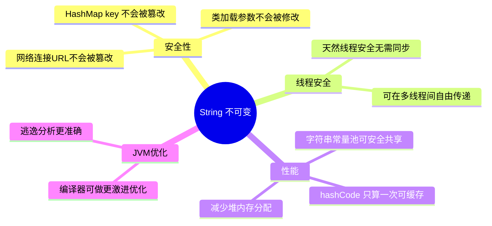
```mermaid
mindmap
  root((String 不可变))
    安全性
      HashMap key 不会被篡改
      类加载参数不会被修改
      网络连接URL不会被篡改
    线程安全
      天然线程安全无需同步
      可在多线程间自由传递
    性能
      hashCode 只算一次可缓存
      字符串常量池可安全共享
      减少堆内存分配
    JVM优化
      编译器可做更激进优化
      逃逸分析更准确
```

**三重保证机制**：

```java
// 1. final 修饰类 → 不能被继承（子类可能破坏不可变性）
public final class String {
    // 2. private final char[] value → 引用不可变
    //    (JDK 9+ 改为 private final byte[] value + byte coder)
    private final char[] value;

    // 3. 所有"修改"方法都返回新 String
    public String substring(int beginIndex) {
        return new String(value, beginIndex, subLen);
    }
}
```

### 3.2 🔴 String / StringBuilder / StringBuffer 对比

| 维度 | String | StringBuilder | StringBuffer |
|------|--------|---------------|--------------|
| 可变性 | ==不可变== | 可变 | 可变 |
| 线程安全 | ✅（不可变） | ❌ | ✅（synchronized） |
| 性能 | 拼接慢（创建新对象） | ⭐ 最快 | 较慢（加锁开销） |
| 场景 | 少量字符串操作 | ==单线程大量拼接== | 多线程拼接（少见） |
| 底层 | `final byte[]` | 继承 AbstractStringBuilder | 继承 AbstractStringBuilder |

### 3.3 🔴 String 常量池演化史

| JDK 版本 | 常量池位置 | 原因 |
|---------|-----------|------|
| JDK 6 | ==永久代（PermGen）== | 方法区的一部分 |
| JDK 7 | ==堆内存== | 永久代空间小，容易 OOM |
| JDK 8+ | ==堆内存==（元空间替代永久代） | 永久代被移除 |

```java
String s1 = "abc";                    // 常量池（编译期确定）
String s2 = new String("abc");        // 堆中新对象
String s3 = s1.intern();              // 返回常量池引用
s1 == s2        // false
s1 == s3        // true
s1.equals(s2)   // true
```

### 3.4 🟡 JDK 9+ Compact Strings

```java
// JDK 9 将 char[] 改为 byte[] + coder
private final byte[] value;
private final byte coder;  // 0=LATIN1(1字节/字符), 1=UTF16(2字节/字符)
// 纯 ASCII 字符串内存减半
```

---


# 第二部分 · 面向对象

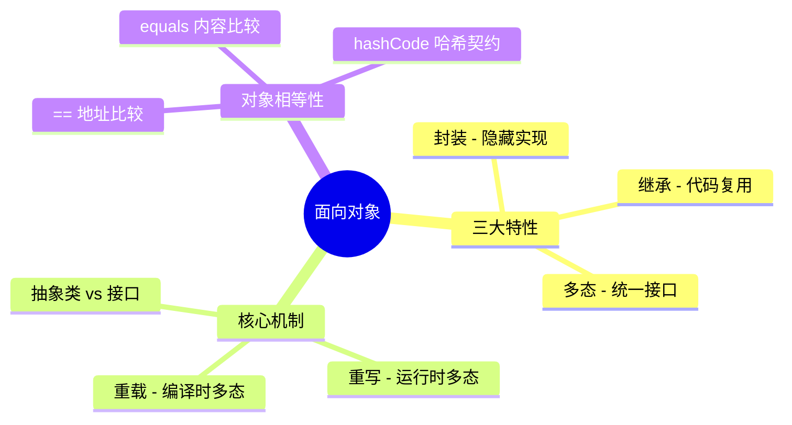
```mermaid
mindmap
  root((面向对象))
    三大特性
      封装 - 隐藏实现
      继承 - 代码复用
      多态 - 统一接口
    核心机制
      重载 - 编译时多态
      重写 - 运行时多态
      抽象类 vs 接口
    对象相等性
      == 地址比较
      equals 内容比较
      hashCode 哈希契约
```

---

## 4. 三大特性 · 吃透版

### 4.1 🔴 为什么需要面向对象？（设计动机）

> **历史演化**：
> - **面向过程（C）**：函数+数据分离，大型项目维护困难，修改一个数据结构影响所有函数
> - **面向对象（Java/C++）**：数据+行为封装在一起，通过继承复用，通过多态扩展
> - **本质解决的问题**：==代码的可维护性、可扩展性、可复用性==

### 4.2 🔴 多态的 JVM 实现原理（源码级）

> 🔴 **核心**：运行时多态通过 ==invokevirtual 指令 + 虚方法表(vtable)== 实现

```java
Animal animal = new Dog();  // 向上转型
animal.eat();               // 调用哪个 eat()？

// 字节码：
// aload_1
// invokevirtual #4  // Method Animal.eat:()V
// 但运行时会根据实际类型 Dog 查找 vtable
```

**vtable 虚方法表机制**：

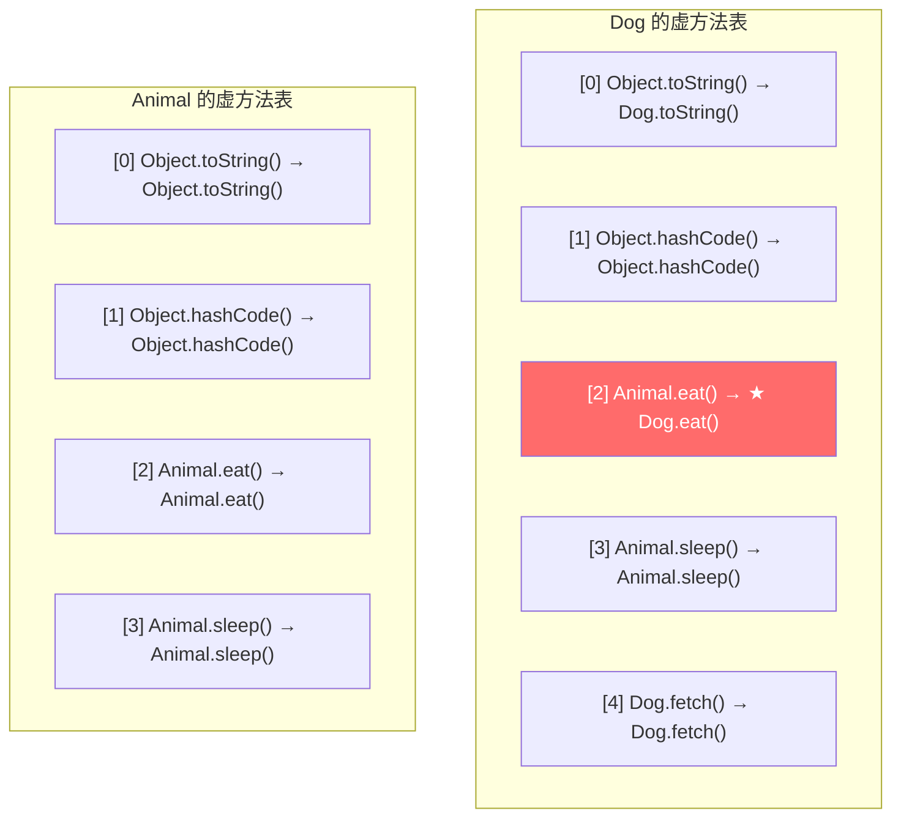
```mermaid
flowchart TB
    subgraph Dog_vtable["Dog 的虚方法表"]
        V1["[0] Object.toString() → Dog.toString()"]
        V2["[1] Object.hashCode() → Object.hashCode()"]
        V3["[2] Animal.eat() → ★ Dog.eat()"]
        V4["[3] Animal.sleep() → Animal.sleep()"]
        V5["[4] Dog.fetch() → Dog.fetch()"]
    end

    subgraph Animal_vtable["Animal 的虚方法表"]
        A1["[0] Object.toString() → Object.toString()"]
        A2["[1] Object.hashCode() → Object.hashCode()"]
        A3["[2] Animal.eat() → Animal.eat()"]
        A4["[3] Animal.sleep() → Animal.sleep()"]
    end

    style V3 fill:#ff6b6b,color:#fff
```

**HotSpot 源码中 vtable 的构建**（C++）：

```cpp
// hotspot/src/share/vm/oops/klassVtable.cpp
void klassVtable::initialize_vtable() {
    // 1. 先拷贝父类的 vtable
    // 2. 遍历子类方法，如果签名与父类相同（重写），替换 vtable 中的入口
    // 3. 如果是新方法，追加到 vtable 末尾
    if (is_overriding(super_method, target_method)) {
        put_method_at(target_method, index);  // ★ 替换父类方法入口
    }
}
```

> 🟠 **关键理解**：
> - 每个类在方法区有一个 vtable（类加载时构建）
> - `invokevirtual` 执行时：获取对象头的类型指针 → 找到 Klass → 在 vtable 中按索引查方法
> - 索引在编译时确定（常量池解析），所以查表是 ==O(1)== 的
> - **final/private/static 方法不进 vtable**（不能被重写，直接 invokestatic/invokespecial）

### 4.3 🔴 多态的并发场景分析

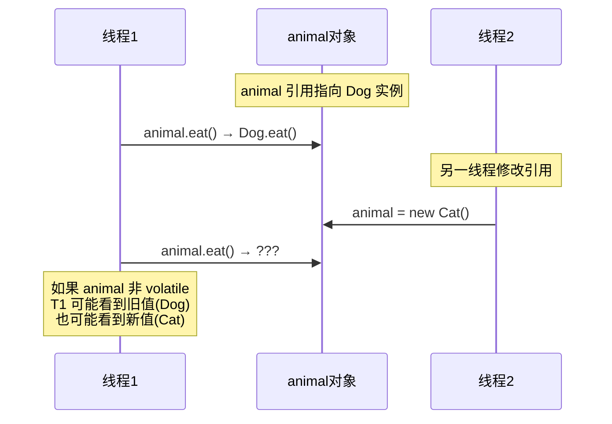
```mermaid
sequenceDiagram
    participant T1 as 线程1
    participant Obj as animal对象
    participant T2 as 线程2

    Note over Obj: animal 引用指向 Dog 实例
    T1->>Obj: animal.eat() → Dog.eat()
    Note over T2: 另一线程修改引用
    T2->>Obj: animal = new Cat()
    T1->>Obj: animal.eat() → ???
    Note over T1: 如果 animal 非 volatile<br/>T1 可能看到旧值(Dog)<br/>也可能看到新值(Cat)
```

> 🟢 **避坑**：多态对象引用如果在多线程间共享且会被修改，必须加 `volatile` 或同步机制。

### 4.4 🟠 访问修饰符

| 修饰符 | 本类 | 同包 | 子类 | 其他包 |
|--------|:----:|:----:|:----:|:------:|
| private | ✅ | ❌ | ❌ | ❌ |
| default(缺省) | ✅ | ✅ | ❌ | ❌ |
| protected | ✅ | ✅ | ✅ | ❌ |
| public | ✅ | ✅ | ✅ | ✅ |

> 📝 **记忆口诀**：「私默保公」→ 本包子外，一路放开

### 4.5 面试深度追问：多态的实现条件是什么？为什么 static 方法不能多态？

> **完整回答（200+ 字）**：
>
> 运行时多态需要三个条件：①继承或实现接口 ②子类重写父类方法 ③父类引用指向子类对象。底层通过 invokevirtual 指令实现——该指令在运行时根据操作数栈顶对象的**实际类型**（而非声明类型）去查找虚方法表中对应方法的入口地址。
>
> static 方法不能多态，原因是 static 方法通过 **invokestatic** 指令调用，该指令在编译时就确定了调用目标（因为 static 方法属于类而非实例，不存在"实际类型"的概念）。static 方法不会出现在 vtable 中，JVM 直接根据声明类型解析方法。
>
> **面试加分**：private 方法使用 invokespecial（编译时绑定），final 方法虽然用 invokevirtual 但 JIT 可以做虚调用去虚化（devirtualization），直接内联为静态调用，性能接近 invokestatic。

---

## 5. 重载 vs 重写 · 静态分派 vs 动态分派

### 5.1 🔴 必背对照表

| 维度 | 重载（Overload） | 重写（Override） |
|------|------------------|------------------|
| 位置 | ==同一个类==内 | ==子类==中 |
| 方法名 | 相同 | 相同 |
| 参数列表 | ==必须不同== | ==必须相同== |
| 返回值 | 无要求 | 相同或==协变类型== |
| 访问权限 | 无要求 | ≥ 父类 |
| 异常 | 无要求 | ≤ 父类 |
| 绑定时机 | ==编译时==（静态分派） | ==运行时==（动态分派） |
| JVM 指令 | invokevirtual（但编译时已确定签名） | invokevirtual（运行时查 vtable） |

### 5.2 🔴 静态分派源码证明

```java
class Animal {}
class Dog extends Animal {}

class Test {
    void say(Animal a) { System.out.println("Animal"); }
    void say(Dog d) { System.out.println("Dog"); }

    public static void main(String[] args) {
        Animal x = new Dog();  // 静态类型=Animal, 实际类型=Dog
        new Test().say(x);     // ★ 输出 "Animal"
    }
}
```

> 🔴 **为什么输出 "Animal"？**
>
> 重载方法的选择在**编译期**完成，编译器只看==静态类型==（声明类型）。
> `x` 的声明类型是 `Animal` → 编译器选择 `say(Animal)` → 字节码中写死了方法描述符 `say:(LAnimal;)V`

```
// 字节码:
invokevirtual #7  // Method say:(LAnimal;)V
// 注意：签名在编译时就确定了，运行时不会因为 x 实际是 Dog 而选 say(Dog)
```

### 5.3 🟠 动态分派源码证明

```java
class Animal { void eat() { print("Animal eat"); } }
class Dog extends Animal { void eat() { print("Dog eat"); } }

Animal a = new Dog();
a.eat();  // ★ 输出 "Dog eat"
```

> invokevirtual 执行流程：
> 1. 找到操作数栈顶的对象引用 → 获得实际类型 Dog
> 2. 在 Dog 的 vtable 中查找 `eat:()V`
> 3. 找到 → 调用 Dog.eat()
> 4. 找不到 → 去父类找（向上搜索）

### 5.4 🟢 重写的线上事故案例

> 🟢 **事故还原**：
> - 某支付系统，父类 `PaymentHandler.validate()` 校验金额 > 0
> - 子类 `CryptoPaymentHandler` 重写了 `validate()` 但==忘记调用 super.validate()==
> - 结果：加密支付通道接受了金额为 0 的订单，产生大量异常流水
> - **根因**：重写时未遵循 LSP（里氏替换原则），子类行为弱于父类约束
> - **修复**：validate 改用模板方法模式，基础校验不可跳过
>
> ```java
> // 修复后：模板方法模式
> public abstract class PaymentHandler {
>     public final void validate(Order order) {  // final 不可重写
>         if (order.getAmount() <= 0) throw new BizException("金额非法");
>         doCustomValidate(order);  // 子类扩展点
>     }
>     protected abstract void doCustomValidate(Order order);
> }
> ```

---

## 6. 抽象类 vs 接口 · 演化史与设计哲学

### 6.1 🔴 历史演化

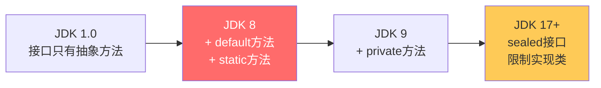
```mermaid
flowchart LR
    A["JDK 1.0<br/>接口只有抽象方法"] --> B["JDK 8<br/>+ default方法<br/>+ static方法"]
    B --> C["JDK 9<br/>+ private方法"]
    C --> D["JDK 17+<br/>sealed接口<br/>限制实现类"]

    style B fill:#ff6b6b,color:#fff
    style D fill:#feca57
```

> 🟠 **为什么 JDK 8 要加 default 方法？**
>
> 核心动机：==向后兼容==。Collection 接口要加 `stream()` 方法，如果是纯抽象方法，所有已有的实现类都要改代码——这在生态中不可接受。default 方法允许接口添加新方法而不破坏现有实现。

### 6.2 🔴 全面对比

| 维度 | 抽象类 | 接口 (JDK 8+) |
|------|--------|---------------|
| 关键字 | `abstract class` | `interface` |
| 构造器 | ✅ 有 | ❌ 无 |
| 成员变量 | 任意修饰符 | ==public static final== |
| 方法 | 抽象 + 具体均可 | 抽象 + default + static + private(JDK9) |
| 继承 | ==单继承== | ==多实现== |
| 设计语义 | ==is-a==（是什么） | ==can-do/has-a==（能做什么） |
| 状态 | ✅ 可以有实例变量（状态） | ❌ 不能有实例变量 |

### 6.3 🟠 菱形继承（Diamond Problem）与解决

```java
interface A { default void hello() { print("A"); } }
interface B extends A { default void hello() { print("B"); } }
interface C extends A { default void hello() { print("C"); } }

// 菱形冲突：D 同时实现 B 和 C，两个 hello() 冲突
class D implements B, C {
    @Override
    public void hello() {
        B.super.hello();  // ★ 必须显式选择，否则编译报错
    }
}
```

> 🔴 **Java 解决菱形继承的规则**：
> 1. **类优先**：类中的方法优先于接口 default 方法
> 2. **子接口优先**：更具体的接口优先（B extends A，则 B 的 default 优先于 A）
> 3. **编译报错**：如果上两条无法确定，必须在实现类中显式重写

### 6.4 🔴 选型决策树

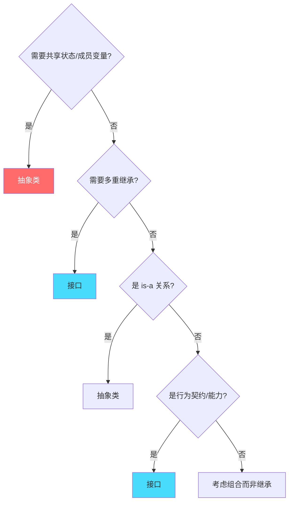
```mermaid
flowchart TD
    A{需要共享状态/成员变量?} -->|是| B[抽象类]
    A -->|否| C{需要多重继承?}
    C -->|是| D[接口]
    C -->|否| E{是 is-a 关系?}
    E -->|是| F[抽象类]
    E -->|否| G{是行为契约/能力?}
    G -->|是| H[接口]
    G -->|否| I[考虑组合而非继承]

    style B fill:#ff6b6b,color:#fff
    style D fill:#48dbfb
    style H fill:#48dbfb
```

### 6.5 面试深度追问：接口的 default 方法能否访问成员变量？如果两个接口有同名 default 方法怎么办？

> **完整回答（200+ 字）**：
>
> default 方法**不能**访问实例变量（接口中不能定义实例变量，只有 public static final 常量）。但 default 方法可以调用接口中的其他抽象方法（因为实现类一定会实现它们），从而间接获取状态——这正是模板方法模式在接口中的体现。
>
> 如果一个类实现了两个接口且它们有同名 default 方法（签名完全相同），编译器会报错 "inherits unrelated defaults"，必须在实现类中显式重写该方法。可以通过 `InterfaceA.super.method()` 选择调用哪个接口的默认实现。
>
> **面试加分**：这与 C++ 的虚继承不同——C++ 通过 virtual 关键字在运行时解决菱形继承，而 Java 选择在编译时强制程序员显式解决冲突，更安全但灵活性稍低。JDK 17 的 sealed interface 进一步控制了接口的实现范围，使得 pattern matching 更安全。

---

## 7. == vs equals vs hashCode · 深度剖析

### 7.1 🔴 三者关系与 HashMap 依赖链

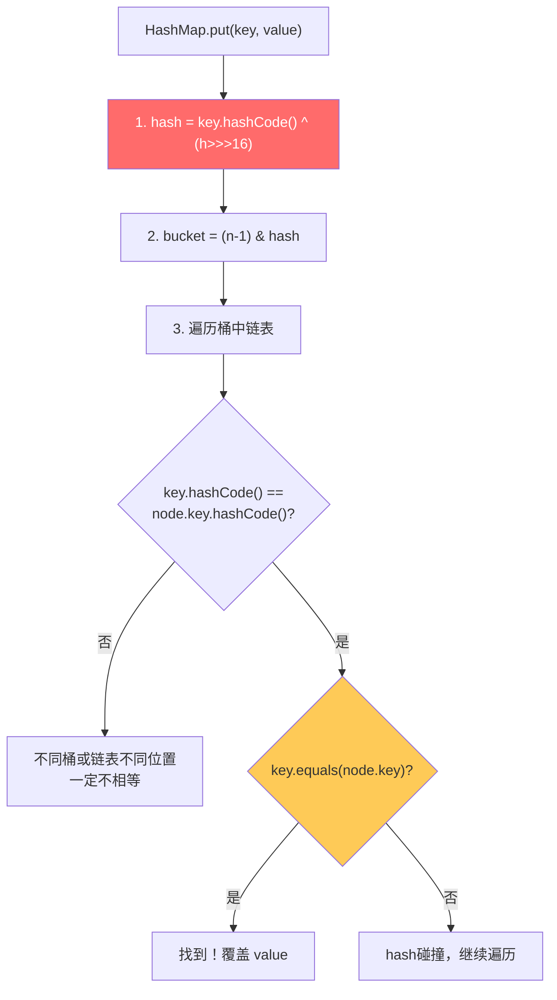
```mermaid
flowchart TD
    A["HashMap.put(key, value)"] --> B["1. hash = key.hashCode() ^ (h>>>16)"]
    B --> C["2. bucket = (n-1) & hash"]
    C --> D["3. 遍历桶中链表"]
    D --> E{"key.hashCode() ==<br/>node.key.hashCode()?"}
    E -->|否| F["不同桶或链表不同位置<br/>一定不相等"]
    E -->|是| G{"key.equals(node.key)?"}
    G -->|是| H["找到！覆盖 value"]
    G -->|否| I["hash碰撞，继续遍历"]

    style B fill:#ff6b6b,color:#fff
    style G fill:#feca57
```

> 🔴 **HashMap 对 equals/hashCode 的依赖**：
> - **先 hashCode**：定位桶 → 缩小搜索范围
> - **再 equals**：桶内精确匹配 → 确定是否同一个 key
> - 如果重写 equals 不重写 hashCode → ==两个 "相等" 的对象可能落在不同桶 → get 时找不到==

### 7.2 🔴 Object.hashCode() 源码

```cpp
// hotspot/src/share/vm/runtime/synchronizer.cpp
// HotSpot 默认的 hashCode 生成策略 (hashCode=5 即 Xorshift)
static inline intptr_t get_next_hash(Thread* self, oop obj) {
    intptr_t value = 0;
    // hashCode 策略由 -XX:hashCode=N 控制
    if (hashCode == 0) {
        // Park-Miller 随机数
        value = os::random();
    } else if (hashCode == 5) {
        // ★ JDK 8 默认：Xorshift 算法
        unsigned t = self->_hashStateX;
        t ^= (t << 11);
        self->_hashStateX = self->_hashStateY;
        // ... Xorshift 生成伪随机数
        value = v ^ (v >> 19) ^ (t ^ (t >> 8));
    }
    // ... 其他策略
    return value;
}
```

> 🟠 **关键理解**：
> - Object 默认 hashCode ==不是内存地址==！是伪随机数（JDK 8 HotSpot 默认）
> - 首次调用后缓存在==对象头 MarkWord==（25 位，无锁状态）
> - 调用过默认 hashCode 的对象==不能进入偏向锁==（MarkWord 空间冲突）

### 7.3 🔴 正确重写 equals + hashCode

```java
public class User {
    private String name;
    private int age;

    @Override
    public boolean equals(Object o) {
        if (this == o) return true;                           // 1. 同引用
        if (o == null || getClass() != o.getClass()) return false;  // 2. 类型
        User user = (User) o;
        return age == user.age && Objects.equals(name, user.name);  // 3. 字段
    }

    @Override
    public int hashCode() {
        return Objects.hash(name, age);  // ★ 用同样的字段计算
        // Objects.hash 内部: 31 * result + element.hashCode()
    }
}
```

> 🔴 **equals 五大规则**：自反性、对称性、传递性、一致性、非空性

### 7.4 🟢 线上事故：重写 equals 未重写 hashCode 导致缓存失效

> 🟢 **事故还原**：
> - 某风控系统，用 `UserRiskKey(userId, riskType)` 作为 HashMap 的 key 做本地缓存
> - 开发只重写了 equals（比较 userId + riskType），==没重写 hashCode==
> - 结果：`map.get(new UserRiskKey(123, "FRAUD"))` 永远返回 null
> - **原因**：两个 "相等" 的 key 的 hashCode 不同 → 落在不同桶 → get 找不到
> - **影响**：本地缓存 100% miss → 全部穿透到风控引擎 → 风控引擎过载 → 响应超时
> - **修复**：加上 `@Override public int hashCode() { return Objects.hash(userId, riskType); }`
> - **预防**：Lombok 的 `@EqualsAndHashCode` 或 IDE 生成时两个必须一起生成

### 7.5 面试深度追问：如果对象作为 HashMap 的 key 后修改了参与 hashCode 计算的字段，会发生什么？

> **完整回答（200+ 字）**：
>
> 如果对象已经存入 HashMap，之后修改了参与 hashCode/equals 计算的字段，会导致**内存泄漏**——该对象永远无法被 get 到，也无法被 remove，但仍然被 Map 的 Node 引用着，GC 无法回收。
>
> 原理：put 时根据旧 hashCode 定位到桶 A；修改字段后，新 hashCode 指向桶 B；调用 get 时用新 hashCode 去桶 B 找——当然找不到。调用 remove 同理。但对象实际还在桶 A 中，只是永远不会被访问到了。
>
> **面试加分**：这就是为什么强烈建议 HashMap 的 key 使用**不可变对象**（String、Integer 等）。如果必须用可变对象做 key，要确保参与 hashCode 的字段在 put 之后不被修改。实际上，Effective Java 建议：hashCode 的计算字段应该是 final 的。

---


# 第三部分 · 集合框架

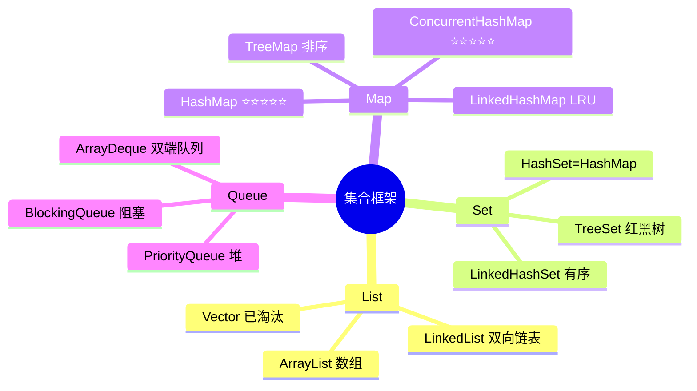
```mermaid
mindmap
  root((集合框架))
    List
      ArrayList 数组
      LinkedList 双向链表
      Vector 已淘汰
    Set
      HashSet=HashMap
      LinkedHashSet 有序
      TreeSet 红黑树
    Map
      HashMap ⭐⭐⭐⭐⭐
      ConcurrentHashMap ⭐⭐⭐⭐⭐
      LinkedHashMap LRU
      TreeMap 排序
    Queue
      PriorityQueue 堆
      ArrayDeque 双端队列
      BlockingQueue 阻塞
```

---

## 8. 集合体系总览与选型

### 8.1 🔴 选型决策树

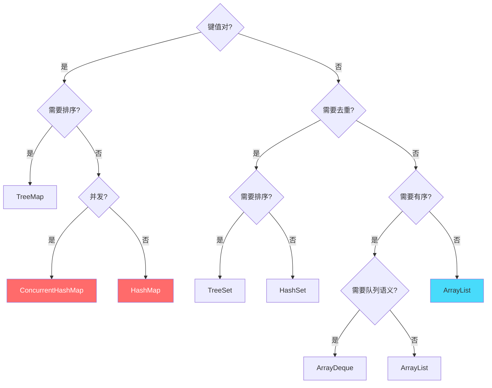
```mermaid
flowchart TD
    A{键值对?} -->|是| B{需要排序?}
    A -->|否| C{需要去重?}

    B -->|是| D[TreeMap]
    B -->|否| E{并发?}
    E -->|是| F[ConcurrentHashMap]
    E -->|否| G[HashMap]

    C -->|是| H{需要排序?}
    C -->|否| I{需要有序?}

    H -->|是| J[TreeSet]
    H -->|否| K[HashSet]

    I -->|是| L{需要队列语义?}
    I -->|否| M[ArrayList]

    L -->|是| N[ArrayDeque]
    L -->|否| O[ArrayList]

    style F fill:#ff6b6b,color:#fff
    style G fill:#ff6b6b,color:#fff
    style M fill:#48dbfb
```

---

## 9. ArrayList 源码级剖析

### 9.1 🔴 核心源码

```java
public class ArrayList<E> extends AbstractList<E> implements List<E>, RandomAccess {
    private static final int DEFAULT_CAPACITY = 10;      // ★ 默认容量
    transient Object[] elementData;                      // ★ 底层数组
    private int size;                                    // 实际元素数量
    protected transient int modCount = 0;                // ★ 修改计数器(fail-fast)
}
```

### 9.2 🔴 扩容机制源码

```java
// JDK 11 源码
private Object[] grow(int minCapacity) {
    int oldCapacity = elementData.length;
    if (oldCapacity > 0 || elementData != DEFAULTCAPACITY_EMPTY_ELEMENTDATA) {
        int newCapacity = ArraysSupport.newLength(oldCapacity,
                minCapacity - oldCapacity, // minimum growth
                oldCapacity >> 1);          // ★ preferred growth = 0.5倍 → 总共1.5倍
        return elementData = Arrays.copyOf(elementData, newCapacity);
    } else {
        return elementData = new Object[Math.max(DEFAULT_CAPACITY, minCapacity)];
    }
}
```

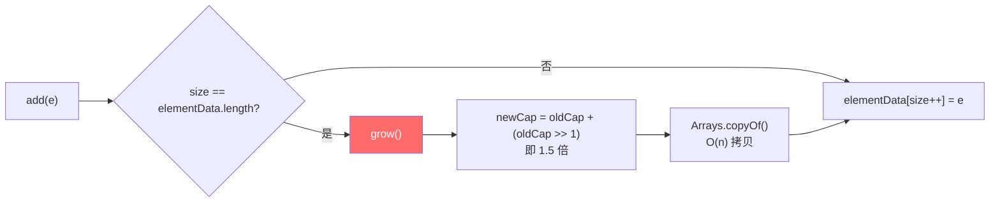
```mermaid
flowchart LR
    A["add(e)"] --> B{"size == elementData.length?"}
    B -->|否| C["elementData[size++] = e"]
    B -->|是| D["grow()"]
    D --> E["newCap = oldCap + (oldCap >> 1)<br/>即 1.5 倍"]
    E --> F["Arrays.copyOf()<br/>O(n) 拷贝"]
    F --> C

    style D fill:#ff6b6b,color:#fff
```

### 9.3 🔴 fail-fast 机制源码

```java
// ArrayList 的迭代器
private class Itr implements Iterator<E> {
    int expectedModCount = modCount;  // ★ 创建迭代器时记录 modCount

    public E next() {
        checkForComodification();     // ★ 每次 next() 都检查
        // ...
    }

    final void checkForComodification() {
        if (modCount != expectedModCount)  // ★ 被修改过！
            throw new ConcurrentModificationException();
    }
}
```

### 9.4 🟢 线上事故：forEach 中修改集合

> 🟢 **事故还原**：
> - 某订单系统，遍历订单列表时删除已取消的订单
> ```java
> // ❌ 错误写法
> for (Order order : orders) {
>     if (order.isCancelled()) {
>         orders.remove(order);  // ConcurrentModificationException!
>     }
> }
> ```
> - **影响**：定时任务每分钟执行一次清理，上线后全部报错
> - **根因**：增强 for 底层是 Iterator，remove 操作修改了 modCount 但没更新 expectedModCount
> - **修复方案**：
> ```java
> // ✅ 正确写法1: Iterator.remove()
> Iterator<Order> it = orders.iterator();
> while (it.hasNext()) {
>     if (it.next().isCancelled()) it.remove();  // 同步更新 expectedModCount
> }
>
> // ✅ 正确写法2: removeIf (JDK 8+)
> orders.removeIf(Order::isCancelled);
>
> // ✅ 正确写法3: Stream filter
> orders = orders.stream().filter(o -> !o.isCancelled()).collect(toList());
> ```

### 9.5 🔴 ArrayList vs LinkedList 完整 trade-off

| 维度 | ArrayList | LinkedList |
|------|-----------|------------|
| 底层 | ==Object[] 数组== | ==双向链表== |
| 随机访问 | ==O(1)== | O(n) |
| 头部插入 | O(n)（System.arraycopy） | ==O(1)== |
| 尾部插入 | ==O(1) 均摊== | O(1) |
| 中间插入 | O(n) | O(n)（查找O(n)+插入O(1)） |
| 内存占用 | 连续，有预留空间浪费 | 每节点额外 prev+next 各 8B(64位) |
| CPU 缓存 | ==缓存友好==（连续内存） | 缓存不友好（节点分散） |
| 扩容 | 1.5 倍 + 拷贝 | 无需扩容 |
| RandomAccess 标记 | ✅ 有 | ❌ 无 |

> 🔴 **结论**：==99% 场景用 ArrayList==。原因：
> 1. CPU 缓存行（Cache Line）64 字节，连续数组预取效率极高
> 2. LinkedList 每个节点额外 24~40 字节开销（对象头+两个指针）
> 3. 即使"频繁插入"，如果需要先查找位置，LinkedList 也是 O(n)
> 4. Java 官方文档也建议：" ArrayList is generally preferable"

---

## 10. HashMap 深度剖析 · 吃透版

### 10.1 🔴 设计动机与演化

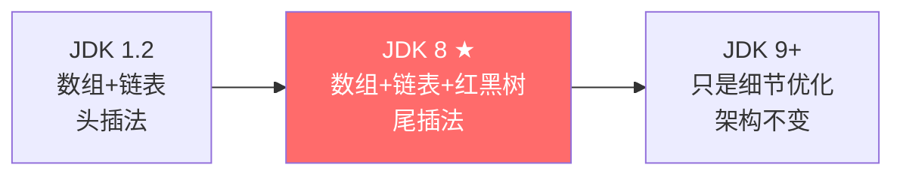
```mermaid
flowchart LR
    A["JDK 1.2<br/>数组+链表<br/>头插法"] --> B["JDK 8 ★<br/>数组+链表+红黑树<br/>尾插法"]
    B --> C["JDK 9+<br/>只是细节优化<br/>架构不变"]

    style B fill:#ff6b6b,color:#fff
```

> 🔴 **为什么 JDK 8 引入红黑树？**
>
> - Hash 冲突严重时，链表退化为 O(n) 查找
> - 恶意构造 hashCode 碰撞（HashDoS 攻击）可以让 HashMap 性能降到 O(n²)
> - 红黑树保证最坏 O(log n)，防止 DoS 攻击和极端冲突场景

### 10.2 🔴 数据结构

```
┌─────────────────────────────────────────────────────────────┐
│  Node<K,V>[] table  (默认长度 16)                            │
├─────────────────────────────────────────────────────────────┤
│  [0] → null                                                 │
│  [1] → Node(hash,k1,v1) → Node(hash,k2,v2) → null         │
│  [2] → null                                                 │
│  [5] → TreeNode(红黑树根) → 左右子树...                      │
│  [7] → Node(hash,k3,v3) → null                             │
│  ...                                                        │
│  [15] → null                                                │
├─────────────────────────────────────────────────────────────┤
│  树化条件: 链表长度 ≥ 8 且 数组长度 ≥ 64                      │
│  退化条件: 红黑树节点 ≤ 6                                    │
└─────────────────────────────────────────────────────────────┘
```

### 10.3 🔴 hash 扰动函数——为什么要高低位异或？

```java
static final int hash(Object key) {
    int h;
    return (key == null) ? 0 : (h = key.hashCode()) ^ (h >>> 16);
    //                         ↑ 高16位XOR低16位
}
```

> 🔴 **设计动机**：
> - 桶定位公式 `(n-1) & hash`，当 n=16 时只用到 hash 的低 4 位
> - 如果不扰动，hashCode 高位的信息完全丢失 → 碰撞率高
> - XOR 高低 16 位 → 让高位也参与定位 → 碰撞率降低
> - 为什么用 XOR 不用 AND/OR？XOR 混合度最高（0和1各 50%概率）

### 10.4 🔴 put 完整流程源码

```java
final V putVal(int hash, K key, V value, boolean onlyIfAbsent, boolean evict) {
    Node<K,V>[] tab; Node<K,V> p; int n, i;

    // ★ 步骤1: table 为空则初始化
    if ((tab = table) == null || (n = tab.length) == 0)
        n = (tab = resize()).length;

    // ★ 步骤2: 桶为空直接放入
    if ((p = tab[i = (n - 1) & hash]) == null)
        tab[i] = newNode(hash, key, value, null);
    else {
        Node<K,V> e; K k;
        // ★ 步骤3: key相同(hash==且equals) → 准备覆盖
        if (p.hash == hash &&
            ((k = p.key) == key || (key != null && key.equals(k))))
            e = p;
        // ★ 步骤4: 红黑树节点
        else if (p instanceof TreeNode)
            e = ((TreeNode<K,V>)p).putTreeVal(this, tab, hash, key, value);
        // ★ 步骤5: 链表尾插
        else {
            for (int binCount = 0; ; ++binCount) {
                if ((e = p.next) == null) {
                    p.next = newNode(hash, key, value, null);
                    if (binCount >= TREEIFY_THRESHOLD - 1) // ★ ≥7 即链表长度达8
                        treeifyBin(tab, hash);             // 树化
                    break;
                }
                if (e.hash == hash &&
                    ((k = e.key) == key || (key != null && key.equals(k))))
                    break;  // 链表中找到相同key
                p = e;
            }
        }
        // 覆盖旧值
        if (e != null) {
            V oldValue = e.value;
            if (!onlyIfAbsent || oldValue == null) e.value = value;
            return oldValue;
        }
    }
    ++modCount;
    // ★ 步骤6: 超过阈值则扩容
    if (++size > threshold) resize();
    return null;
}
```

### 10.5 🔴 扩容 resize 的精妙设计

```java
// JDK 8 扩容时元素重新分配的优化
// 不需要重新计算 hash！只看 hash 在 oldCap 对应位是 0 还是 1

// 例: oldCap = 16 (二进制 10000)
// hash & oldCap:
//   == 0 → 留在原位 (low 链表)
//   != 0 → 移到 原位置 + oldCap (high 链表)
```

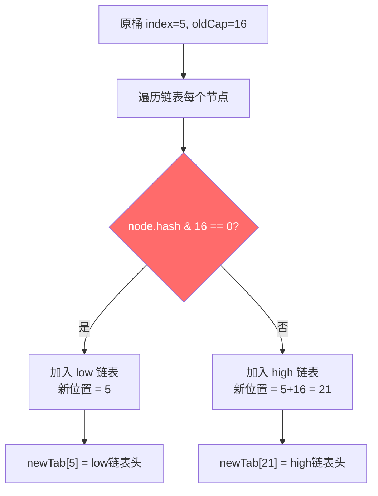
```mermaid
flowchart TD
    A["原桶 index=5, oldCap=16"] --> B["遍历链表每个节点"]
    B --> C{"node.hash & 16 == 0?"}
    C -->|是| D["加入 low 链表<br/>新位置 = 5"]
    C -->|否| E["加入 high 链表<br/>新位置 = 5+16 = 21"]
    D --> F["newTab[5] = low链表头"]
    E --> G["newTab[21] = high链表头"]

    style C fill:#ff6b6b,color:#fff
```

> 🔴 **为什么这个优化成立？**
> - oldCap = 16: (16-1) & hash = 取低 4 位
> - newCap = 32: (32-1) & hash = 取低 5 位
> - 新增的第 5 位 = hash & 16 (即 hash & oldCap)
> - 如果第 5 位是 0，低 4 位不变 → 位置不变
> - 如果第 5 位是 1，新位置 = 旧位置 + 16

### 10.6 🔴 JDK 7 并发死循环（头插法的灾难）

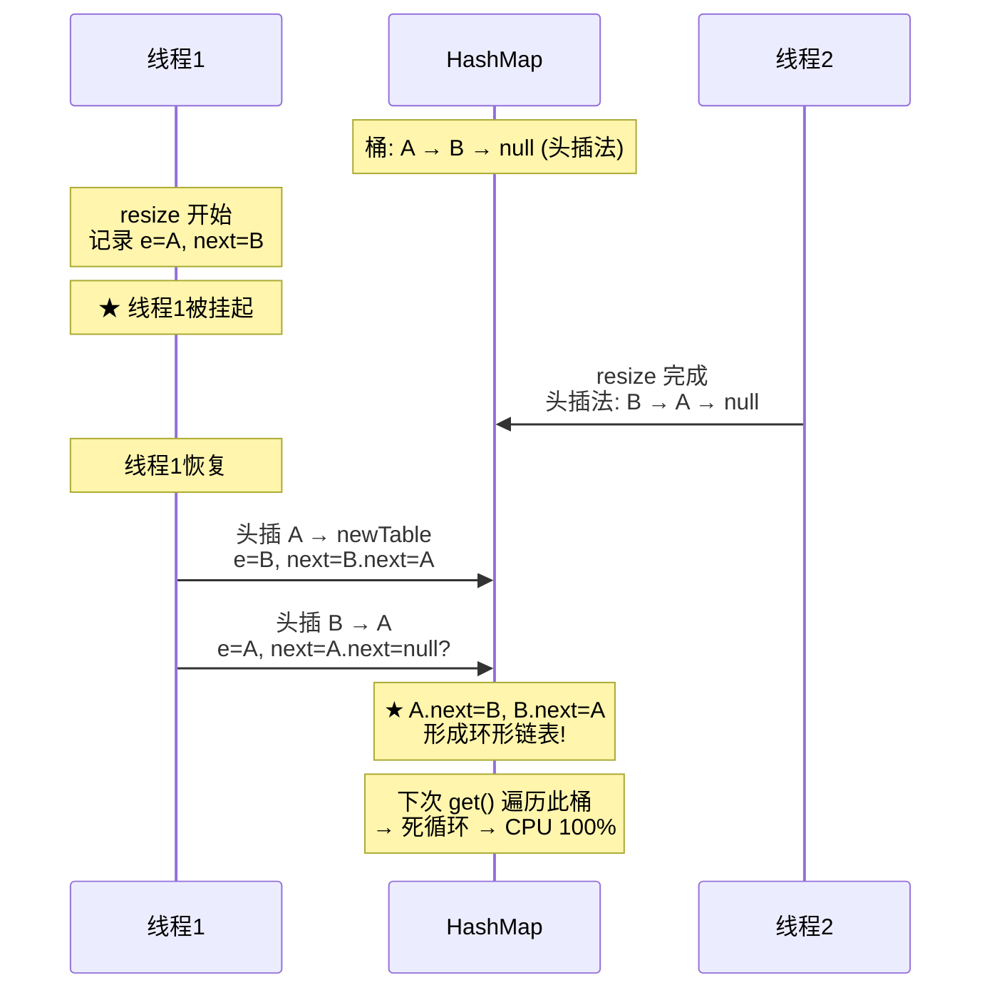
```mermaid
sequenceDiagram
    participant T1 as 线程1
    participant HM as HashMap
    participant T2 as 线程2

    Note over HM: 桶: A → B → null (头插法)
    Note over T1: resize 开始<br/>记录 e=A, next=B
    Note over T1: ★ 线程1被挂起
    T2->>HM: resize 完成<br/>头插法: B → A → null
    Note over T1: 线程1恢复
    T1->>HM: 头插 A → newTable<br/>e=B, next=B.next=A
    T1->>HM: 头插 B → A<br/>e=A, next=A.next=null?
    Note over HM: ★ A.next=B, B.next=A<br/>形成环形链表!
    Note over HM: 下次 get() 遍历此桶<br/>→ 死循环 → CPU 100%
```

> 🟢 **真实线上事故**：
> - 某社交应用，用户信息缓存用 HashMap（多线程环境未加锁）
> - 大促期间并发增加 → 触发扩容 → 两个线程同时 resize
> - 形成环形链表 → get 操作死循环 → CPU 100% → 服务不可用
> - **持续时间**：30 分钟（人工重启才恢复）
> - **修复**：改用 ConcurrentHashMap
> - **JDK 8 已修复**：改为尾插法，不会形成环。但仍有==数据覆盖==问题（两线程同时 put 到同一空桶）

### 10.7 🔴 面试必问 5 连击

| 问题 | 深度答案 |
|------|---------|
| 为什么容量是 2 的幂 | `(n-1)&hash` 等价于 `hash%n`，位运算比取模快 10 倍+；保证所有桶都可被映射到 |
| 为什么负载因子 0.75 | 泊松分布下，0.75 时桶中平均元素数 0.5，链表长度 ≥8 概率仅 0.00000006；太大冲突多，太小浪费空间 |
| 为什么树化阈值是 8 | 泊松分布 λ=0.5 时 P(k≥8)≈0.00000006，正常使用几乎不会树化；但恶意碰撞时能防 DoS |
| 线程不安全表现 | JDK7: 头插法死循环；JDK8: 数据覆盖（两线程同时 put 空桶）/ size 不准 / 树化过程中断 |
| key 为 null | HashMap 可以（hash(null)=0 放 0 号桶）；ConcurrentHashMap ==不可以==（无法区分 key 不存在 和 value 为 null） |

### 10.8 🟡 红黑树简要

> 🟡 **红黑树五条性质**（面试加分）：
> 1. 节点是红色或黑色
> 2. 根节点是黑色
> 3. 叶子节点（NIL）是黑色
> 4. 红色节点的子节点必须是黑色（不能连续红色）
> 5. 从任意节点到叶子的所有路径包含相同数量的黑色节点
>
> **保证**：最长路径不超过最短路径的 2 倍 → 近似平衡 → O(log n)

---

## 11. ConcurrentHashMap · 吃透版

### 11.1 🔴 演化史——为什么从分段锁改为 CAS+synchronized

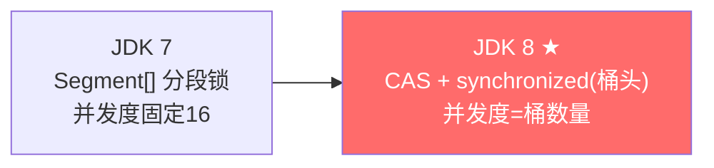
```mermaid
flowchart LR
    A["JDK 7<br/>Segment[] 分段锁<br/>并发度固定16"] --> B["JDK 8 ★<br/>CAS + synchronized(桶头)<br/>并发度=桶数量"]

    style B fill:#ff6b6b,color:#fff
```

> 🔴 **JDK 7 分段锁的问题**：
> 1. 并发度固定（默认 16），不能动态扩展
> 2. Segment 继承 ReentrantLock，==每个 Segment 是独立的 HashMap==，结构复杂
> 3. 扩容时只扩单个 Segment 内部，不够灵活
> 4. size() 需要锁所有 Segment（先尝试无锁统计 2 次，不一致则全锁）

### 11.2 🔴 JDK 8 put 流程源码

```java
final V putVal(K key, V value, boolean onlyIfAbsent) {
    if (key == null || value == null) throw new NullPointerException();
    int hash = spread(key.hashCode());  // ★ 高低位异或 + 强制最高位为0
    int binCount = 0;

    for (Node<K,V>[] tab = table;;) {
        Node<K,V> f; int n, i, fh;

        if (tab == null || (n = tab.length) == 0)
            tab = initTable();                           // ★ CAS 初始化

        else if ((f = tabAt(tab, i = (n-1) & hash)) == null) {
            // ★ 空桶: CAS 放入（无锁）
            if (casTabAt(tab, i, null, new Node<>(hash, key, value)))
                break;
        }
        else if ((fh = f.hash) == MOVED)
            tab = helpTransfer(tab, f);                  // ★ 帮助扩容

        else {
            V oldVal = null;
            synchronized (f) {                           // ★ 锁桶头节点
                if (tabAt(tab, i) == f) {               // double-check
                    if (fh >= 0) {                      // 链表
                        binCount = 1;
                        for (Node<K,V> e = f;; ++binCount) {
                            K ek;
                            if (e.hash == hash &&
                                ((ek = e.key) == key || key.equals(ek))) {
                                oldVal = e.val;
                                if (!onlyIfAbsent) e.val = value;
                                break;
                            }
                            Node<K,V> pred = e;
                            if ((e = e.next) == null) {
                                pred.next = new Node<>(hash, key, value);
                                break;
                            }
                        }
                    } else if (f instanceof TreeBin) {  // 红黑树
                        binCount = 2;
                        // TreeBin 内部操作
                    }
                }
            }
            if (binCount >= TREEIFY_THRESHOLD) treeifyBin(tab, i);
        }
    }
    addCount(1L, binCount);  // ★ 计数 + 判断是否扩容
    return null;
}
```

### 11.3 🔴 size() 的高性能实现——LongAdder 思想

```java
// ConcurrentHashMap 的计数机制
private transient volatile long baseCount;          // 基础计数
private transient volatile CounterCell[] counterCells;  // 分段计数器

// 类似 LongAdder 的设计:
// 低竞争: CAS 更新 baseCount
// 高竞争: CAS baseCount 失败 → 随机选一个 CounterCell 加 1
// size() = baseCount + Σ(counterCells[i].value)
```

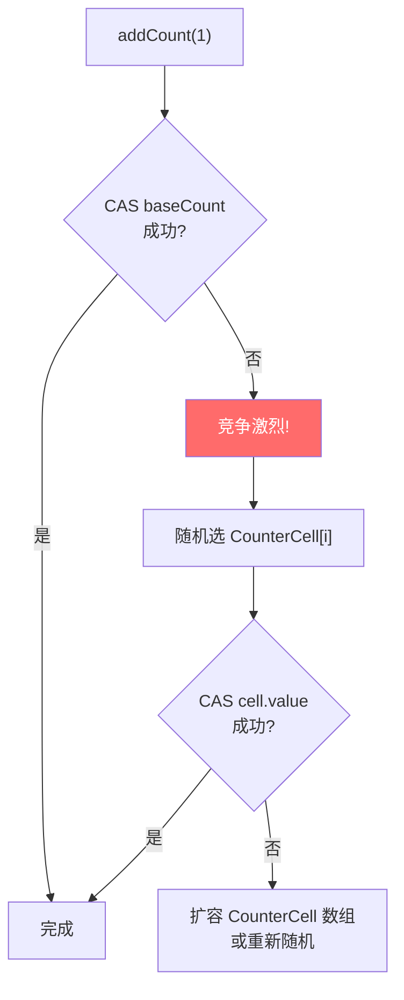
```mermaid
flowchart TD
    A["addCount(1)"] --> B{"CAS baseCount<br/>成功?"}
    B -->|是| C[完成]
    B -->|否| D["竞争激烈!"]
    D --> E["随机选 CounterCell[i]"]
    E --> F{"CAS cell.value<br/>成功?"}
    F -->|是| C
    F -->|否| G["扩容 CounterCell 数组<br/>或重新随机"]

    style D fill:#ff6b6b,color:#fff
```

### 11.4 🟠 协助扩容（helpTransfer）

> 🟠 **设计精妙之处**：扩容不是单线程完成的！
> - 线程 A 触发扩容，创建 nextTable（2倍大小）
> - 线程 B put 时发现桶头 hash==MOVED → ==主动帮助迁移数据==
> - 每个线程负责一段桶的迁移（stride 步长，最小 16）
> - 迁移完的桶放一个 ForwardingNode（hash=MOVED）

### 11.5 🟢 避坑：ConcurrentHashMap 不是万能的

```java
// ❌ 错误：check-then-act 非原子
if (!map.containsKey(key)) {
    map.put(key, value);  // 两步之间可能被其他线程插入！
}

// ✅ 正确：用原子方法
map.putIfAbsent(key, value);
map.computeIfAbsent(key, k -> createValue(k));
```

### 11.6 面试深度追问：ConcurrentHashMap 的 key 和 value 为什么不能是 null？

> **完整回答（200+ 字）**：
>
> 这是 Doug Lea 的设计决策，核心原因是**二义性问题**。在并发环境下，`map.get(key)` 返回 null 时无法区分两种情况：①key 不存在 ②key 存在但 value 是 null。在 HashMap 中可以用 `containsKey()` 再确认，但在 ConcurrentHashMap 中，在调用 `get` 和 `containsKey` 之间，其他线程可能已经修改了 Map，导致结果不可靠。
>
> 对于 key 为 null 的问题：null 的 hashCode 是 0，这本身没问题，但 Doug Lea 认为如果 key 可以是 null，那么整个 API 的语义会更复杂且容易出错。HashMap 允许 null key 是因为它不考虑并发；ConcurrentHashMap 为了 API 语义清晰，直接禁止。
>
> **面试加分**：ConcurrentHashMap 源码第一行就是 `if (key == null || value == null) throw new NullPointerException()`。如果业务确实需要表达"不存在"，可以用一个特殊的 sentinel 对象代替 null。

---


# 第四部分 · 异常体系与泛型

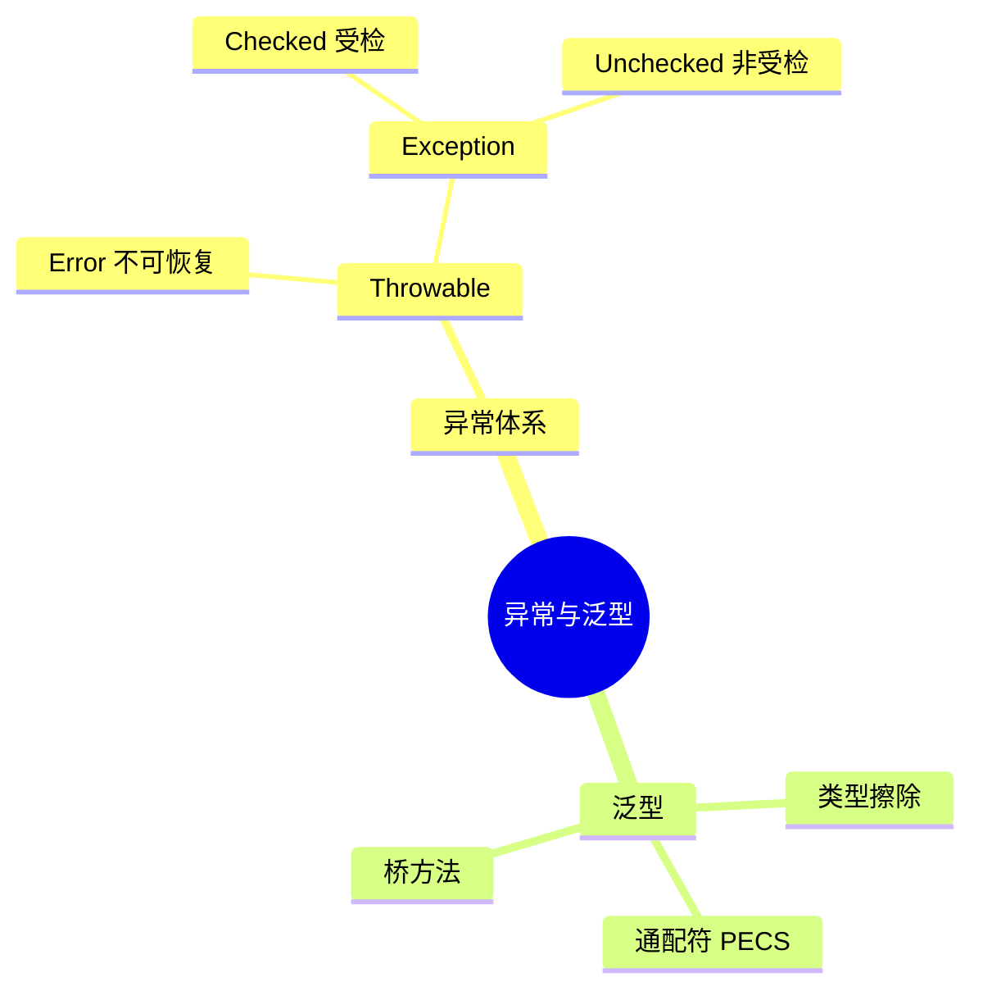
```mermaid
mindmap
  root((异常与泛型))
    异常体系
      Throwable
        Error 不可恢复
        Exception
          Checked 受检
          Unchecked 非受检
    泛型
      类型擦除
      通配符 PECS
      桥方法
```

---

## 12. 异常体系 · 吃透版

### 12.1 🔴 异常体系设计动机

> **为什么需要异常机制？（历史演化）**
> - **C 语言时代**：函数通过返回 -1/NULL 表示错误 → 调用者必须每次检查返回值 → 容易遗忘 → 错误被悄悄吞掉
> - **Java 异常机制**：将错误处理与正常逻辑分离 → 编译器强制处理（受检异常）→ 不会遗漏
> - **现代趋势**：减少受检异常（Spring/Kotlin 全用非受检）→ 开发效率优先

### 12.2 🔴 异常分类

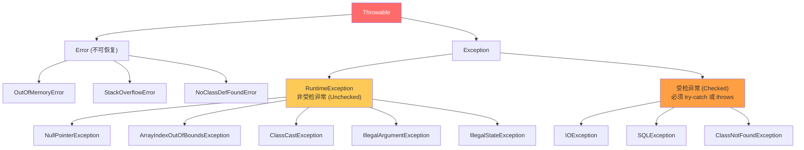
```mermaid
flowchart TB
    T["Throwable"] --> E["Error (不可恢复)"]
    T --> Ex["Exception"]

    E --> OOM["OutOfMemoryError"]
    E --> SOE["StackOverflowError"]
    E --> NCDFE["NoClassDefFoundError"]

    Ex --> RE["RuntimeException<br/>非受检异常 (Unchecked)"]
    Ex --> CE["受检异常 (Checked)<br/>必须 try-catch 或 throws"]

    RE --> NPE["NullPointerException"]
    RE --> AIOOBE["ArrayIndexOutOfBoundsException"]
    RE --> CCE["ClassCastException"]
    RE --> IAE["IllegalArgumentException"]
    RE --> ISE["IllegalStateException"]

    CE --> IOE["IOException"]
    CE --> SQLE["SQLException"]
    CE --> CNFE["ClassNotFoundException"]

    style T fill:#ff6b6b,color:#fff
    style RE fill:#feca57
    style CE fill:#ff9f43
```

### 12.3 🔴 受检 vs 非受检 完整 trade-off

| 维度 | 受检异常 (Checked) | 非受检异常 (Unchecked) |
|------|-------------------|----------------------|
| 继承 | Exception（非 RuntimeException） | RuntimeException / Error |
| 编译检查 | ✅ 必须 try-catch 或 throws | ❌ 不强制 |
| 语义 | ==可预见、可恢复== | ==编程错误、逻辑缺陷== |
| 典型 | IOException, SQLException | NPE, ClassCastException |
| Spring | 几乎不用（DataAccessException 是非受检） | 全面使用 |
| 优点 | 不会遗漏错误处理 | 代码简洁，不用到处 try-catch |
| 缺点 | 代码臃肿，接口污染（throws 传播） | 容易遗漏处理 |

> 🟠 **现代最佳实践**：
> - 业务异常用==自定义非受检异常==（继承 RuntimeException）
> - 在最外层统一捕获（@ControllerAdvice / 全局异常处理器）
> - 受检异常在当前层 catch 后转为非受检异常向上抛

### 12.4 🔴 finally 执行机制——字节码级别

```java
// 面试经典：try 中 return，finally 也执行
public int test() {
    try {
        return 1;  // ① 计算返回值=1，存入局部变量表的临时slot
    } finally {
        return 2;  // ② finally 的 return 覆盖临时slot! → 返回2
    }
}
```

> 🔴 **字节码层面**：编译器将 finally 块的代码==复制到每个可能的退出路径==（正常return路径、异常路径）。
> 如果 finally 中有 return，它会覆盖 try/catch 中的返回值。

```java
// 更精妙的面试题：
public int test() {
    int x = 1;
    try {
        return x;      // 返回值 = 1（已经计算并保存了）
    } finally {
        x = 2;         // 修改局部变量 x，但返回值已经保存了
    }
    // 最终返回 1！不是 2！
    // 因为 return x 时已经把 x 的值(1)存入了临时slot
    // finally 修改的是局部变量 x，不影响已保存的返回值
}
```

### 12.5 🟢 线上事故：异常被吞导致数据不一致

> 🟢 **事故还原**：
> - 某支付系统，转账逻辑在 try-catch 中：
> ```java
> try {
>     accountDao.debit(fromAccount, amount);   // 扣款成功
>     accountDao.credit(toAccount, amount);    // 入账抛异常！
> } catch (Exception e) {
>     log.error("转账异常", e);  // ❌ 只记日志，没有回滚！
> }
> ```
> - **影响**：用户 A 被扣款但用户 B 没有入账 → 资金丢失
> - **根因**：catch 后只打日志没有重新抛出，事务没有回滚（Spring @Transactional 捕获到异常才回滚）
> - **修复**：catch 后 `throw new BizException("转账失败", e)` 让事务回滚
> - **教训**：永远不要吞异常！要么重新抛出，要么确保有补偿机制

### 12.6 🟡 try-with-resources 的 Suppressed Exceptions

```java
// 如果 try 块和 close() 都抛异常
try (MyResource res = new MyResource()) {
    res.doSomething();  // 抛 IOException
}
// close() 也抛 IOException
// → 主异常是 doSomething 的 IOException
// → close 的异常变为 suppressed exception
// → 通过 e.getSuppressed() 获取
```

### 12.7 面试深度追问：NoClassDefFoundError 和 ClassNotFoundException 的区别？

> **完整回答（200+ 字）**：
>
> 两者都和类加载失败有关，但触发时机和含义完全不同：
>
> **ClassNotFoundException**（受检异常）：主动加载类时找不到。触发点是 `Class.forName("xxx")`、`ClassLoader.loadClass("xxx")` 等反射加载操作。说明 classpath 中没有这个类的 .class 文件。属于 Exception，可以 catch 恢复。
>
> **NoClassDefFoundError**（错误）：编译时存在但运行时找不到。典型场景：代码中直接 `new SomeClass()`，编译通过（编译时 classpath 有），但运行时 classpath 没有（依赖未打包/版本冲突）。JVM 在解析类引用时发现类定义不存在，抛 Error。另一个触发场景：类的静态初始化块（`<clinit>`）抛异常 → 类加载失败 → 后续使用该类时抛 NoClassDefFoundError。
>
> **面试加分**：NoClassDefFoundError 还可能由"类加载器隔离"导致——两个 ClassLoader 加载的同名类不是同一个 Class 对象，互相引用时会报此错。这在 OSGi、Tomcat 多应用部署中常见。

---

## 13. 泛型与类型擦除 · 吃透版

### 13.1 🔴 为什么 Java 选择类型擦除？（设计动机）

> 🔴 **历史原因**：
> - JDK 1.5 引入泛型时，已有大量非泛型的遗留代码（如 `List` 而非 `List<String>`）
> - 如果像 C# 那样做==具现化泛型==（运行时保留类型），则无法和旧代码兼容
> - 选择==类型擦除==：编译时检查类型安全 → 编译后擦除泛型信息 → 运行时和旧代码完全兼容
> - **代价**：运行时丢失类型信息 → 不能 `new T()` / `instanceof T`

### 13.2 🔴 擦除规则

```java
// 编译前
public class Box<T extends Comparable<T>> {
    private T value;
    public T get() { return value; }
}

// 编译后（擦除为上界）
public class Box {
    private Comparable value;          // T → 上界 Comparable
    public Comparable get() { return value; }
}
// 如果没有上界（<T>），擦除为 Object
```

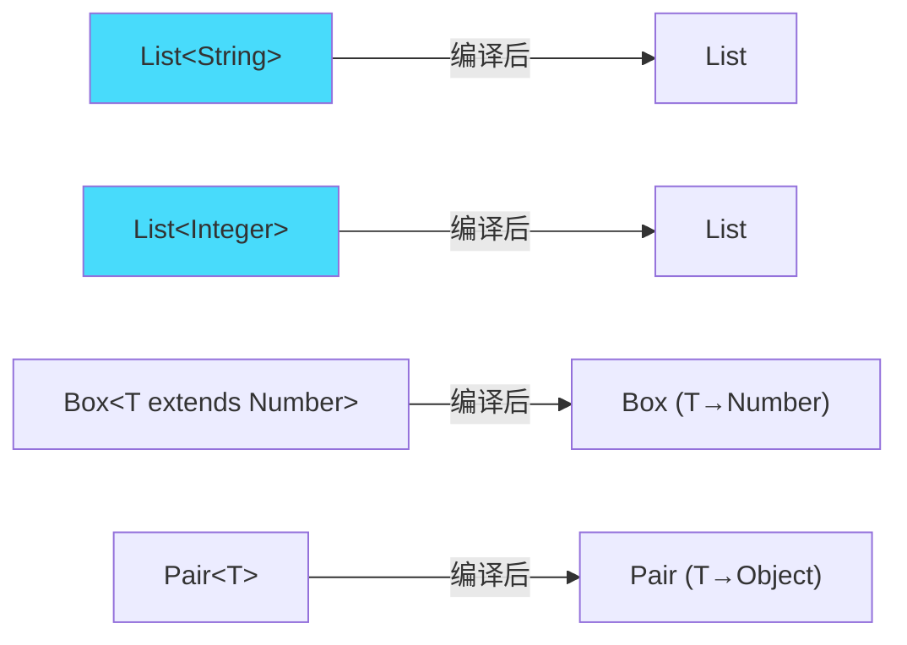
```mermaid
flowchart LR
    A["List&lt;String&gt;"] -->|编译后| B["List"]
    C["List&lt;Integer&gt;"] -->|编译后| D["List"]
    E["Box&lt;T extends Number&gt;"] -->|编译后| F["Box (T→Number)"]
    G["Pair&lt;T&gt;"] -->|编译后| H["Pair (T→Object)"]

    style A fill:#48dbfb
    style C fill:#48dbfb
```

### 13.3 🔴 因为擦除不能做的事

```java
// ❌ 不能 new T()
// 擦除后不知道 T 的构造器
public <T> T create() {
    return new T();  // 编译错误
}
// ✅ 正确做法：传入 Class<T>
public <T> T create(Class<T> clazz) throws Exception {
    return clazz.getDeclaredConstructor().newInstance();
}

// ❌ 不能 instanceof T
if (obj instanceof T) { }  // 编译错误
// ✅ 正确做法：传入 Class<T>
if (clazz.isInstance(obj)) { }

// ❌ 不能创建泛型数组
T[] arr = new T[10];  // 编译错误
// ✅ 正确做法
T[] arr = (T[]) new Object[10];  // unchecked warning
// 或
T[] arr = (T[]) Array.newInstance(clazz, 10);
```

### 13.4 🔴 PECS 原则深度解析

> 🔴 **Producer Extends, Consumer Super**

```java
// ★ 为什么 extends 只能读不能写？
List<? extends Number> list = new ArrayList<Integer>();
Number n = list.get(0);  // ✅ 读：取出的一定是 Number 或子类
// list.add(1);           // ❌ 写：编译器不知道 list 实际是 List<Integer>
//                        //    还是 List<Double>，放 Integer 可能不安全

// ★ 为什么 super 只能写不能读？
List<? super Integer> list2 = new ArrayList<Number>();
list2.add(1);            // ✅ 写：放 Integer 一定安全（Number/Object都能装Integer）
// Integer i = list2.get(0);  // ❌ 读：取出可能是 Number，不能赋给 Integer
Object o = list2.get(0);      // ✅ 只能当 Object 读
```

**Collections.copy 是 PECS 的完美示范**：

```java
// 源码
public static <T> void copy(List<? super T> dest,    // 消费者：写入
                             List<? extends T> src) {  // 生产者：读取
    for (int i = 0; i < src.size(); i++) {
        dest.set(i, src.get(i));  // 从 src 读(extends)，写入 dest(super)
    }
}
```

### 13.5 🟠 桥方法（Bridge Method）

```java
// 擦除后的冲突
interface Comparable<T> {
    int compareTo(T o);  // 擦除后: int compareTo(Object o)
}

class MyString implements Comparable<MyString> {
    @Override
    public int compareTo(MyString o) { return 0; }
    // 擦除后签名: int compareTo(MyString o)
    // 但接口擦除后是: int compareTo(Object o)
    // ★ 签名不匹配！编译器自动生成桥方法:
    // public int compareTo(Object o) { return compareTo((MyString)o); }
}
```

> 🟠 **桥方法的作用**：确保擦除后的字节码仍然满足多态（vtable 中方法签名必须匹配）

### 13.6 🟡 获取运行时泛型信息（Type Token 技巧）

```java
// 虽然擦除了，但某些位置保留了泛型信息：
// 1. 类继承/实现的泛型参数
// 2. 字段声明的泛型
// 3. 方法参数/返回值的泛型

// Type Token 技巧（Jackson/Gson 使用）
TypeReference<List<User>> typeRef = new TypeReference<List<User>>() {};
// 通过匿名子类的 getGenericSuperclass() 获取 List<User> 的类型信息
// 因为"类继承的泛型"在字节码中保留了（Class 文件的 Signature 属性）
```

### 13.7 面试深度追问：泛型方法和泛型类有什么区别？什么时候用泛型方法？

> **完整回答（200+ 字）**：
>
> 泛型类在**类级别**声明类型参数（`class Box<T>`），所有实例方法可以使用 T，但 T 在创建对象时确定且不能改变。泛型方法在**方法级别**声明类型参数（`<E> void method(E e)`），每次调用时独立推断 E 的类型。
>
> 什么时候用泛型方法？当泛型参数只在某个方法中使用时，没必要让整个类带泛型。例如 `Collections.sort(List<T>)` 是泛型方法而非泛型类，因为 Collections 是工具类，不需要实例化时指定类型。
>
> 另一个场景：静态方法不能使用类的泛型参数（因为泛型参数属于实例，static 方法没有实例），此时必须声明为泛型方法：`static <T> T getInstance(Class<T> clazz)`。
>
> **面试加分**：泛型方法的类型推断由编译器完成（JDK 8 的目标类型推断更强大），如果推断失败可以显式指定：`Collections.<String>emptyList()`。Kotlin/Scala 中有 reified 泛型（内联函数中保留类型信息），弥补了 Java 擦除的不足。

---


# 第五部分 · 反射与动态代理

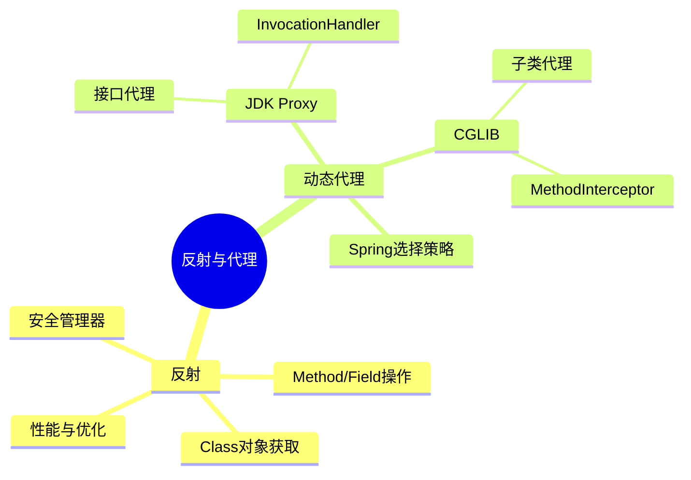
```mermaid
mindmap
  root((反射与代理))
    反射
      Class对象获取
      Method/Field操作
      性能与优化
      安全管理器
    动态代理
      JDK Proxy
        接口代理
        InvocationHandler
      CGLIB
        子类代理
        MethodInterceptor
      Spring选择策略
```

---

## 14. 反射机制 · 源码级理解

### 14.1 🔴 为什么需要反射？（设计动机）

> **核心问题**：编写框架代码时，==不知道用户会写什么类==。
>
> - Spring IOC：只知道配置文件/注解中的类名字符串 → 需要根据字符串创建对象
> - MyBatis：只知道 SQL 结果集的列名 → 需要动态设置 POJO 字段
> - Jackson：只知道 JSON 的 key → 需要动态调用 setter/直接写字段
>
> **反射的本质**：==在运行时检查和操作类的结构==（类名、方法、字段、注解等）

### 14.2 🔴 获取 Class 对象的三种方式——区别

| 方式 | 代码 | 是否触发类初始化 | 场景 |
|------|------|:---------------:|------|
| `Class.forName()` | `Class.forName("com.User")` | ✅ 执行 `<clinit>` | JDBC驱动加载 |
| `.class` 字面量 | `User.class` | ❌ 不会 | 编译时已知类 |
| `getClass()` | `obj.getClass()` | — (已有实例) | 运行时判断类型 |

```java
// Class.forName 触发初始化的证明
class MyClass {
    static { System.out.println("init!"); }  // 类加载时执行
}

Class.forName("MyClass");  // ★ 输出 "init!"
// MyClass.class;           // 不输出（不触发初始化）
```

### 14.3 🔴 反射核心操作源码路径

```java
Class<?> clazz = Class.forName("com.example.User");

// ★ 创建实例（JDK 9+ 推荐用 getDeclaredConstructor）
Object obj = clazz.getDeclaredConstructor().newInstance();

// ★ 获取/设置字段
Field field = clazz.getDeclaredField("name");
field.setAccessible(true);   // 关闭访问检查（性能提升 + 突破 private）
field.set(obj, "Tom");
String name = (String) field.get(obj);

// ★ 调用方法
Method method = clazz.getDeclaredMethod("setAge", int.class);
method.setAccessible(true);
method.invoke(obj, 25);

// ★ 获取注解
MyAnnotation anno = clazz.getAnnotation(MyAnnotation.class);
```

### 14.4 🔴 setAccessible 原理——为什么能突破 private？

```java
// java.lang.reflect.AccessibleObject
public void setAccessible(boolean flag) {
    if (flag) checkPermission();  // 安全管理器检查
    this.override = flag;         // ★ 只是设了一个标志位!
}

// Method.invoke 中:
public Object invoke(Object obj, Object... args) {
    if (!override) {              // ★ 如果 override=false 才检查权限
        checkAccess(obj, clazz, modifiers);
    }
    // 实际调用...
}
```

> 🔴 **关键理解**：`setAccessible(true)` 不是"修改了类的访问权限"，而是"告诉反射框架跳过访问检查"。类本身的 private 修饰符不变。

### 14.5 🔴 反射性能基准测试

```java
// 典型性能对比（JMH 基准）
// 直接调用:            ~3 ns/op
// 反射(无setAccessible):  ~100 ns/op (30倍+)
// 反射(setAccessible):    ~20 ns/op  (7倍)
// MethodHandle:           ~5 ns/op   (接近直接调用)
```

> 🟠 **反射慢的四个原因**：
> 1. **权限检查**：每次 invoke 都检查调用者是否有权限（setAccessible 可跳过）
> 2. **参数装箱**：invoke(Object, Object[])，基本类型要装箱为 Object
> 3. **无法内联**：JIT 无法将反射调用内联优化（不知道目标方法是谁）
> 4. **方法查找**：getDeclaredMethod 涉及数组遍历匹配（应该缓存 Method 对象）

### 14.6 🟠 反射性能优化手段

| 手段 | 效果 | 原理 |
|------|------|------|
| `setAccessible(true)` | ==4~7 倍提速== | 跳过每次调用的权限检查 |
| 缓存 Method/Field | 避免重复查找 | getDeclaredMethod 内部是数组遍历 |
| `MethodHandle` (JDK 7+) | ==接近直接调用== | JVM 可以内联优化 |
| 生成字节码（ASM/CGLIB） | 直接调用速度 | 编译时确定目标方法 |
| `VarHandle` (JDK 9+) | 高性能字段访问 | 替代 Unsafe + 反射 |

### 14.7 🟢 线上事故：反射突破安全导致 OOM

> 🟢 **事故还原**：
> - 某中间件通过反射读取 `Throwable.stackTrace` 字段做日志脱敏
> - 代码每次调用都执行 `clazz.getDeclaredField("stackTrace")`（==没有缓存==）
> - 高频异常场景下（如熔断器大量拒绝）→ 每秒百万次 getDeclaredField
> - getDeclaredField 内部会创建 Field 对象的**副本**（防止修改原始结构）
> - 结果：大量 Field 对象产生 → Young GC 频繁 → STW 增长 → 最终 OOM
> - **修复**：将 Field 对象缓存为 static final

```java
// ❌ 错误：每次调用都查找
public String getStackTrace(Throwable t) {
    Field f = Throwable.class.getDeclaredField("stackTrace"); // 每次new Field
    f.setAccessible(true);
    return Arrays.toString((StackTraceElement[]) f.get(t));
}

// ✅ 正确：缓存 Field 对象
private static final Field STACK_TRACE_FIELD;
static {
    try {
        STACK_TRACE_FIELD = Throwable.class.getDeclaredField("stackTrace");
        STACK_TRACE_FIELD.setAccessible(true);
    } catch (NoSuchFieldException e) { throw new RuntimeException(e); }
}
```

---

## 15. 动态代理 · 吃透版

### 15.1 🔴 为什么需要动态代理？（设计动机）

> **静态代理的问题**：每个被代理类都要手写一个代理类 → 类爆炸
>
> ```java
> // 10 个 Service 接口 × 3 种增强（日志/事务/缓存）= 30 个代理类！
> ```
>
> **动态代理**：==在运行时动态生成代理类的字节码==，一个 InvocationHandler 搞定所有增强

### 15.2 🔴 JDK 动态代理原理——生成了什么？

```java
// 创建代理
UserService proxy = (UserService) Proxy.newProxyInstance(
    UserService.class.getClassLoader(),
    new Class[]{UserService.class},
    new LogHandler(target)
);
```

**JVM 实际生成的代理类**（反编译）：

```java
// ★ 运行时生成的 $Proxy0 类
public final class $Proxy0 extends Proxy implements UserService {
    private static Method m3;  // UserService.save 方法

    static {
        m3 = Class.forName("UserService").getMethod("save", User.class);
    }

    public $Proxy0(InvocationHandler h) { super(h); }

    @Override
    public void save(User user) {
        // ★ 所有方法调用都转发给 InvocationHandler
        this.h.invoke(this, m3, new Object[]{user});
    }
}
```

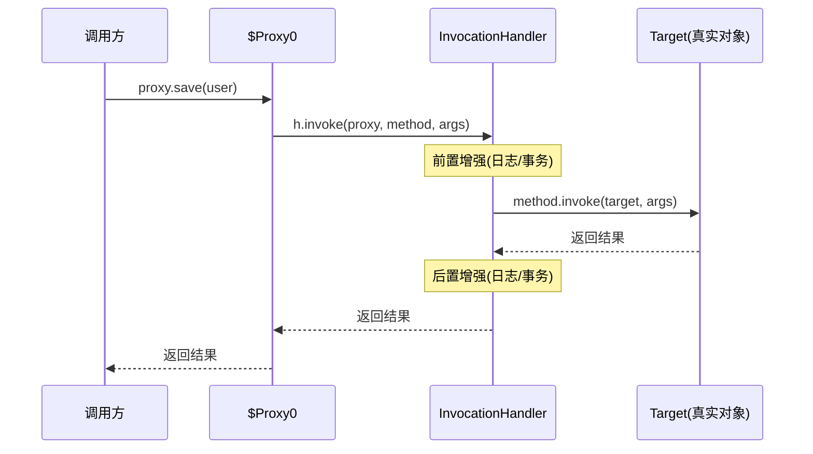
```mermaid
sequenceDiagram
    participant C as 调用方
    participant P as $Proxy0
    participant H as InvocationHandler
    participant T as Target(真实对象)

    C->>P: proxy.save(user)
    P->>H: h.invoke(proxy, method, args)
    Note over H: 前置增强(日志/事务)
    H->>T: method.invoke(target, args)
    T-->>H: 返回结果
    Note over H: 后置增强(日志/事务)
    H-->>P: 返回结果
    P-->>C: 返回结果
```

### 15.3 🔴 CGLIB 原理——子类继承

```java
Enhancer enhancer = new Enhancer();
enhancer.setSuperclass(UserServiceImpl.class);  // ★ 设置父类
enhancer.setCallback((MethodInterceptor) (obj, method, args, proxy) -> {
    System.out.println("Before");
    Object result = proxy.invokeSuper(obj, args);  // ★ 调用父类方法（非反射）
    System.out.println("After");
    return result;
});
UserServiceImpl proxy = (UserServiceImpl) enhancer.create();
```

**CGLIB 生成的类**（简化）：

```java
// 运行时通过 ASM 生成
public class UserServiceImpl$$EnhancerByCGLIB extends UserServiceImpl {
    private MethodInterceptor callback;

    @Override
    public void save(User user) {
        // 转发给 MethodInterceptor
        callback.intercept(this, saveMethod, new Object[]{user}, methodProxy);
    }
}
```

### 15.4 🔴 JDK 代理 vs CGLIB 完整 trade-off

| 维度 | JDK 动态代理 | CGLIB |
|------|-------------|-------|
| 原理 | ==反射 + 实现接口== | ==ASM 字节码生成子类== |
| 要求 | 目标类==必须实现接口== | 目标类==不能是 final==，方法不能 final |
| 生成类 | 实现目标接口 | 继承目标类 |
| 方法调用 | ==method.invoke()（反射）== | ==FastClass 索引直接调用（无反射）== |
| 创建速度 | 快（只生成一个接口实现） | 慢（ASM 生成字节码较复杂） |
| 调用速度 | JDK 8+ 优化后差距很小 | 略快（FastClass 直接调用） |
| Spring 默认 | SpringBoot 1.x 有接口用 JDK | ==SpringBoot 2.x+ 默认全用 CGLIB== |

### 15.5 🟠 Spring AOP 的代理选择策略

```mermaid
flowchart TD
    A["Spring 创建代理"] --> B{"proxyTargetClass=true?<br/>(SpringBoot 2.x 默认 true)"}
    B -->|是| C["CGLIB 代理"]
    B -->|否| D{"目标类实现了接口?"}
    D -->|是| E["JDK 动态代理"]
    D -->|否| F["CGLIB 代理"]

    style C fill:#ff6b6b,color:#fff
```

> 🟠 **为什么 SpringBoot 2.x 默认用 CGLIB？**
> - JDK 代理只能代理接口方法 → 如果注入类型是具体类（非接口）会报错
> - CGLIB 代理具体类 → 注入接口或具体类都能用 → 更不容易出错
> - 性能差距在 JDK 8+ 已经很小

### 15.6 🟠 CGLIB FastClass 机制（避免反射）

```java
// CGLIB 为每个被代理类生成 FastClass
// FastClass 内部是一个大 switch，根据方法索引直接调用
// 而不是通过 Method.invoke（反射）

// 伪代码：
public class UserServiceImpl$$FastClassByCGLIB {
    public Object invoke(int methodIndex, Object obj, Object[] args) {
        switch (methodIndex) {
            case 0: return ((UserServiceImpl)obj).save((User)args[0]);
            case 1: return ((UserServiceImpl)obj).delete((Long)args[0]);
            // ...
        }
    }
}
// ★ 直接强转调用，没有反射开销！
```

### 15.7 🟢 线上事故：CGLIB 代理 + final 方法导致增强失效

> 🟢 **事故还原**：
> - 某服务的 `OrderService.createOrder()` 方法加了 `@Transactional`
> - 开发人员为了"防止子类重写"，将方法声明为 `final`
> - 结果：CGLIB 生成的子类==无法重写 final 方法== → 事务增强失效 → 方法内异常不回滚
> - **影响**：订单创建失败但库存已扣减 → 数据不一致
> - **根因**：CGLIB 通过继承+重写实现代理，final 方法不可重写 → 调用直接走原方法
> - **修复**：去掉 final 修饰符
> - **教训**：Spring AOP 代理的类和方法都不能是 final；如果真要 final，考虑 AspectJ 编译时织入

### 15.8 🟡 JDK 动态代理的局限与 MethodHandle 替代

> 🟡 **JDK 动态代理的局限**：
> 1. 只能代理接口（不能代理具体类）
> 2. 代理类内部方法调用不会触发增强（this.xxx() 不走代理）
> 3. 性能：Method.invoke 有反射开销
>
> **MethodHandle（JDK 7+）**：
> - 可以直接引用方法，类似 C 的函数指针
> - JVM 可以对其做内联优化
> - 性能接近直接调用（比反射快 5~10 倍）

### 15.9 面试深度追问：Spring 中同一个类内部方法调用事务为什么不生效？如何解决？

> **完整回答（200+ 字）**：
>
> Spring AOP 基于代理实现（不管 JDK 还是 CGLIB）。当外部调用 `proxy.methodA()` 时，进入代理逻辑，可以增强。但如果 `methodA()` 内部调用 `this.methodB()`（this 是原始对象，不是代理对象），`methodB()` 的调用**不经过代理** → 事务/缓存等增强不生效。
>
> **解决方案**：
> 1. **注入自身**：`@Autowired private OrderService self;`，然后调用 `self.methodB()`
> 2. **AopContext**：`((OrderService) AopContext.currentProxy()).methodB()`（需开启 `exposeProxy=true`）
> 3. **拆分到不同类**：将 methodB 移到另一个 Service（推荐，符合单一职责）
> 4. **AspectJ 编译时织入**：不依赖代理，直接在字节码中织入增强（最彻底但配置复杂）
>
> **面试加分**：这是代理模式的固有限制。本质是因为 `this` 永远指向原始对象而非代理对象。Kotlin 的 `@JvmStatic` 和 Spring 的 `@Async` 同样有这个问题。

---


# 第六部分 · Java IO 模型

## 16. BIO / NIO / AIO

### 16.1 🔴 三种 IO 模型对比

| 模型 | 全称 | 特点 | Java 实现 | 适用 |
|------|------|------|-----------|------|
| BIO | Blocking IO | ==同步阻塞==，一连接一线程 | InputStream/OutputStream | 连接少 |
| NIO | Non-blocking IO | ==同步非阻塞==，多路复用 | Channel+Buffer+Selector | 连接多、短操作 |
| AIO | Async IO | ==异步非阻塞==，回调通知 | AsynchronousChannel | 连接多、长操作 |

### 16.2 🔴 BIO 的问题

```mermaid
flowchart LR
    C1[Client 1] --> T1[Thread 1]
    C2[Client 2] --> T2[Thread 2]
    C3[Client 3] --> T3[Thread 3]
    CN[Client N] --> TN[Thread N]

    style TN fill:#ff6b6b,color:#fff
```

> 🔴 **BIO 致命缺陷**：每个连接独占一个线程。10000 个连接 → 10000 个线程 → ==OOM==
>
> 即使用线程池限制线程数，线程在等待 IO 时仍然阻塞占用资源，CPU 利用率低。

### 16.3 🔴 NIO 三大组件

```mermaid
flowchart TB
    S[Selector<br/>多路复用器] --> C1[Channel 1<br/>SocketChannel]
    S --> C2[Channel 2<br/>SocketChannel]
    S --> C3[Channel 3<br/>SocketChannel]

    C1 --> B1[Buffer<br/>ByteBuffer]
    C2 --> B2[Buffer]
    C3 --> B3[Buffer]

    style S fill:#ff6b6b,color:#fff
```

| 组件 | 作用 | 关键 API |
|------|------|---------|
| **Channel** | 双向数据管道 | FileChannel, SocketChannel, ServerSocketChannel |
| **Buffer** | 数据容器 | ByteBuffer (position/limit/capacity/flip/clear) |
| **Selector** | ==一个线程管理多个 Channel== | select() 获取就绪事件 |

### 16.4 🟠 Buffer 状态转换

```
写模式:                           读模式 (flip后):
┌──────────────────────────┐      ┌──────────────────────────┐
│ data data data ░░░░░░░░░ │      │ data data data ░░░░░░░░░ │
└──────────────────────────┘      └──────────────────────────┘
0        ↑position    ↑capacity   0  ↑position  ↑limit  ↑capacity
         (写到哪了)                   (从头读)   (能读到哪)

flip(): position → 0, limit → 原 position (写→读)
clear(): position → 0, limit → capacity (清空重写)
compact(): 未读数据移到头部，position 紧跟其后 (部分读)
```

### 16.5 🟡 零拷贝

> 🟡 **加分**：NIO 的 `FileChannel.transferTo()` 利用 OS 的 ==sendfile== 系统调用：
>
> - 传统 IO：磁盘 → 内核缓冲 → 用户缓冲 → Socket 缓冲 → 网卡（==4 次拷贝、4 次上下文切换==）
> - 零拷贝：磁盘 → 内核缓冲 → 网卡（==2 次拷贝、2 次上下文切换==，DMA 辅助）
>
> **Netty、Kafka、RocketMQ** 都大量使用零拷贝提升吞吐。

---

# 第七部分 · JDK 新特性

## 17. JDK 8 核心特性

### 17.1 🔴 Lambda 表达式

```java
@FunctionalInterface
interface Converter<F, T> { T convert(F from); }

Converter<String, Integer> converter = Integer::parseInt;  // 方法引用
```

### 17.2 🔴 四大核心函数式接口

| 接口 | 方法 | 用途 | 示例 |
|------|------|------|------|
| `Function<T,R>` | `R apply(T t)` | 转换 | `map(x -> x*2)` |
| `Predicate<T>` | `boolean test(T t)` | 判断 | `filter(x -> x>0)` |
| `Consumer<T>` | `void accept(T t)` | 消费 | `forEach(System.out::println)` |
| `Supplier<T>` | `T get()` | 提供 | `orElseGet(() -> new User())` |

---

## 18. Stream API 深度

### 18.1 🔴 Stream 操作分类

```mermaid
flowchart LR
    A[数据源] --> B[中间操作<br/>lazy 惰性]
    B --> C[终端操作<br/>触发执行]

    subgraph 中间操作
        B1[filter]
        B2[map]
        B3[flatMap]
        B4[sorted]
        B5[distinct]
    end

    subgraph 终端操作
        C1[collect]
        C2[forEach]
        C3[reduce]
        C4[count]
    end
```

### 18.2 🔴 map vs flatMap

```java
// map: 一对一
List<String> names = users.stream().map(User::getName).toList();

// flatMap: 一对多展平
List<String> words = lines.stream()
    .flatMap(line -> Arrays.stream(line.split(" ")))
    .toList();
```

### 18.3 🟠 Collectors 常用收集器

```java
// 分组
Map<String, List<User>> byDept = users.stream()
    .collect(Collectors.groupingBy(User::getDept));

// toMap (注意 key 冲突!)
Map<Long, User> map = users.stream()
    .collect(Collectors.toMap(User::getId, Function.identity(),
        (v1, v2) -> v1));  // ★ 第三个参数处理冲突

// joining
String csv = users.stream().map(User::getName)
    .collect(Collectors.joining(", "));
```

### 18.4 🟢 Stream 避坑

> 🟢 **注意事项**：
> 1. Stream ==不能重复消费==
> 2. ==parallelStream== 不一定快（ForkJoinPool 共享，IO 操作会阻塞公共池）
> 3. Stream 中副作用操作（修改外部变量）线程不安全
> 4. `toMap` 时 key 重复会抛 IllegalStateException（必须传 mergeFunction）

---

## 19. 虚拟线程（JDK 21）

### 19.1 🔴 平台线程 vs 虚拟线程

| 维度 | 平台线程 | 虚拟线程 |
|------|---------|---------|
| 映射 | 1:1 OS 线程 | ==M:N==（多虚拟线程复用少量 OS 线程） |
| 栈 | ~1MB 固定 | ~几KB 按需增长 |
| 数量 | 千~万级 | ==百万级== |
| 调度 | OS 内核 | ==JVM 用户态 ForkJoinPool== |
| 阻塞代价 | 浪费 OS 线程 | 只 unmount，不阻塞载体线程 |

### 19.2 🔴 使用方式

```java
// 创建虚拟线程
Thread.startVirtualThread(() -> doWork());

// Executor
try (var executor = Executors.newVirtualThreadPerTaskExecutor()) {
    IntStream.range(0, 1_000_000).forEach(i ->
        executor.submit(() -> { Thread.sleep(1000); return i; }));
}
```

### 19.3 🟠 适用与限制

> ✅ **适用**：IO 密集型（HTTP、DB、文件）
>
> ❌ **不适用**：
> - CPU 密集型（虚拟线程让出时机少）
> - `synchronized` 长时间持有（pin 住载体线程）→ 改用 ReentrantLock
> - 大量 ThreadLocal（百万虚拟线程 × ThreadLocal = OOM）

---


# 第八部分 · 面试官深度追问 20 题

## 🔴 答题模板 STAR-S

```
S - Situation: 背景
T - Task: 问题/任务
A - Action: 方案（技术细节）
R - Result: 结果（量化）
S - Summary: 总结延伸
```

---


### Q1: HashMap 和 Hashtable 的区别？为什么 Hashtable 被淘汰？

> **完整回答**：
>
> 表面区别有三：①Hashtable 线程安全（方法级 synchronized），HashMap 不安全；②HashMap 允许 null key/value，Hashtable 不允许；③HashMap 初始容量 16 扩容 2 倍，Hashtable 初始 11 扩容 2n+1。
>
> 但本质原因是**性能**：Hashtable 锁的是整个 Map 对象（`synchronized(this)`），所有读写操作互斥——10 个线程同时读也要排队。而 ConcurrentHashMap 在 JDK 8 中锁粒度是单个桶头节点，读操作完全无锁（volatile Node），性能提升 10~100 倍。
>
> **面试加分**：Hashtable 的 hash 直接用 `key.hashCode() % table.length`（取模运算），而 HashMap 用 `(n-1) & hash`（位运算），后者快约 10 倍。这也是 HashMap 要求容量为 2 的幂的原因。

---

### Q2: String 的 intern() 方法有什么作用？什么场景下使用？

> **完整回答**：
>
> `intern()` 的作用是将字符串放入常量池并返回常量池中的引用。如果常量池已有该字符串（equals 判断），直接返回池中引用；否则在池中创建一份引用（JDK 7+ 不拷贝，直接把堆中对象的引用放入池中）。
>
> 使用场景：大量重复字符串时节省内存。例如读取 CSV 文件的"省份"列，几千万行但省份只有 30 多个，intern 后所有相同省份字符串共享一个对象。Twitter 曾通过 intern 节省了数百 GB 内存。
>
> **注意**：不能滥用！JDK 6 中常量池在永久代，intern 过多会导致 PermGen OOM。JDK 7+ 在堆中，但频繁 intern 仍有性能开销（需要查找 StringTable，底层是 HashTable，有锁竞争）。
>
> **面试加分**：`-XX:StringTableSize` 可以调整 StringTable 的大小（默认 60013），如果 intern 使用量大应适当增大以减少 hash 碰撞。

---

### Q3: ArrayList 的 subList 有什么坑？

> **完整回答**：
>
> `subList()` 返回的是原 List 的一个**视图（View）**，不是独立副本。它们共享底层数组：①修改 subList 会影响原 List ②修改原 List（结构性修改如 add/remove）后使用 subList 会抛 ConcurrentModificationException ③subList 持有原 List 的引用，可能导致内存泄漏（原 List 无法被 GC）。
>
> 安全做法：如果需要独立副本，用 `new ArrayList<>(list.subList(from, to))`。
>
> **面试加分**：Arrays.asList() 也有类似问题——返回的是 Arrays 内部的 ArrayList（非 java.util.ArrayList），不支持 add/remove，且修改数组会影响 List。

---

### Q4: 为什么重写 equals 时建议用 getClass() 而不是 instanceof？

> **完整回答**：
>
> 用 `instanceof` 判断类型时，父类对象 equals 子类对象可能返回 true（子类 instanceof 父类成立），这会**破坏对称性**：`parent.equals(child)` 为 true 但 `child.equals(parent)` 可能为 false（如果子类有额外字段参与 equals）。
>
> 用 `getClass()` 严格要求类型完全一致，保证对称性。但缺点是子类和父类对象永远不相等，这在某些 ORM 框架中有问题（Hibernate 代理对象的 getClass 是代理类）。
>
> Effective Java 建议：如果类是 final 的，用 instanceof 没问题（没有子类）；否则用 getClass 更安全。或者将 equals 声明为 final 防止子类破坏契约。

---

### Q5: ConcurrentHashMap 在 JDK 8 中 put 操作的锁粒度是什么？

> **完整回答**：
>
> JDK 8 的 ConcurrentHashMap put 操作分三种情况：①桶为空时用 **CAS**（无锁）直接放入新节点；②桶正在扩容（hash==MOVED）时**帮助扩容**（无锁，多线程协作）；③桶不为空且不在扩容时，用 **synchronized 锁住桶的头节点**（链表第一个节点或红黑树根）。
>
> 锁粒度是==单个桶（bin）==，理论并发度等于数组长度（默认 16，扩容后更大）。相比 JDK 7 的 Segment（固定 16 段，每段内部是完整的 HashMap），粒度细了一个数量级。
>
> **面试加分**：为什么不用 CAS 而用 synchronized？因为桶内链表/红黑树操作涉及多步修改（遍历+修改 next 指针+可能树化），CAS 无法保证复合操作的原子性。而 JDK 8 对 synchronized 做了大量优化（偏向锁→轻量级锁→重量级锁），无竞争时性能接近 CAS。

---


### Q6: 泛型中 List<?> 和 List<Object> 有什么区别？

> **完整回答**：
>
> `List<?>` 是**无界通配符**，表示"某种未知类型的 List"；`List<Object>` 是**确定类型**，表示"元素类型就是 Object 的 List"。
>
> 关键区别：`List<String>` 可以赋给 `List<?>`（通配符兼容任何类型参数），但不能赋给 `List<Object>`（泛型不协变，`List<String>` 不是 `List<Object>` 的子类型）。
>
> `List<?>` 几乎只能读（取出为 Object）不能写（除了 null），用于"只关心是 List，不关心元素类型"的场景（如 `list.size()`、`list.clear()`）。`List<Object>` 可读可写，用于确实需要存放 Object 的场景。
>
> **面试加分**：`List`（Raw Type）和 `List<?>` 也不同——Raw Type 完全绕过泛型检查（编译器只给 warning），`List<?>` 仍然有编译时类型约束（不能 add 非 null 值）。

---

### Q7: 反射可以修改 final 字段吗？

> **完整回答**：
>
> 在 JDK 8 及之前，可以通过 `field.setAccessible(true)` + `field.set(obj, value)` 修改非 static final 字段。但从 JDK 12 开始逐步限制，JDK 17+ 默认禁止（强封装），需要加 `--add-opens` JVM 参数。
>
> 对于 static final 字段：即使反射"修改成功"，JVM 可能已经在编译时将常量内联到使用处（编译期常量折叠），导致修改了 Field 但读到的值不变。对于 `static final String` 这类编译期常量，反射修改几乎无效。
>
> **面试加分**：JDK 9 引入模块系统后，非 opened 模块的内部类不能被反射访问。Spring/Hibernate 等框架需要在 module-info 中 `opens` 相关包，或使用 `--add-opens` 启动参数。这是 Java 平台模块化的"强封装"策略。

---

### Q8: JDK 动态代理为什么只能代理接口？能否代理具体类？

> **完整回答**：
>
> JDK 动态代理生成的类 `$Proxy0` 必须 `extends Proxy`（Proxy 是固定父类，持有 InvocationHandler 引用）。Java 只支持单继承，`$Proxy0` 继承了 Proxy 就不能再继承目标类 → 只能通过 `implements` 目标接口来实现代理。
>
> 如果要代理具体类（无接口），必须用 CGLIB（生成目标类的子类）或 ByteBuddy/Javassist 等字节码操作框架。
>
> **面试加分**：JDK 16+ 引入了 hidden class，Proxy 生成的代理类默认是 hidden class（不能通过类名被发现）。另外，JDK 16 的 `java.lang.reflect.Proxy` 已经支持在模块化环境中创建代理，通过 `Proxy.newProxyInstance` 的第一个参数（ClassLoader）控制代理类的可见性。

---

### Q9: HashMap 的红黑树什么时候退化为链表？为什么退化阈值是 6 而不是 8？

> **完整回答**：
>
> 当红黑树节点数 ≤ 6 时退化为链表（`UNTREEIFY_THRESHOLD = 6`）。退化发生在 resize 扩容后——扩容时红黑树会被拆分到两个桶中，如果某个桶中的节点数 ≤ 6，则从 TreeNode 退化为普通 Node 链表。
>
> 为什么不是 8（和树化阈值相同）？如果阈值相同，当链表长度在 7~8 之间波动时（频繁插入删除），会反复触发树化→退化→树化→退化，这种**抖动**的性能开销很大（树化是 O(n log n) 的）。设置一个缓冲区间（6~8），避免反复转换。
>
> **面试加分**：树化阈值 8 的选择基于泊松分布——负载因子 0.75 时，单个桶中放 8 个元素的概率约为 0.00000006，几乎不会发生。所以红黑树更多是防御性设计（防 HashDoS 攻击），正常使用几乎不会触发。

---

### Q10: NIO 中 Selector 的 epoll 空轮询 Bug 是什么？

> **完整回答**：
>
> 这是 Linux 内核 epoll 的一个著名 Bug（JDK-6670302）：在某些情况下，`Selector.select()` 本应阻塞等待事件，但却立即返回 0（没有就绪事件）。如果代码是 `while(true) { selector.select(); ... }`，就会变成 CPU 100% 的空循环。
>
> 触发条件：连接被对端 RST（重置）后，epoll 可能将该 fd 报告为 POLLHUP/POLLERR 事件，但 NIO 的 Selector 没有将其转换为 SelectionKey 的 ready ops → `select()` 返回 0 但不阻塞。
>
> Netty 的修复方案：记录连续空轮询次数，超过阈值（默认 512）后**重建 Selector**（创建新 Selector，将旧的 SelectionKey 迁移过去）。
>
> **面试加分**：JDK 官方在不同版本中尝试修复（如 JDK 6u4），但由于是内核层面的问题，没有完全解决。Netty 的重建策略是工程上的 workaround。

---


### Q11: 虚拟线程中为什么不建议用 synchronized？

> **完整回答**：
>
> 虚拟线程遇到阻塞操作（如 IO）时会**unmount**（从载体线程上卸载），让载体线程去执行其他虚拟线程。但如果虚拟线程持有 `synchronized` 锁时发生阻塞，它**无法 unmount**——因为 synchronized 的 monitor 与载体线程绑定（对象头中存的是载体线程 ID），卸载会导致锁状态不一致。
>
> 这种情况叫 **pinning**（钉住）：虚拟线程被钉在载体线程上，该载体线程被阻塞浪费，违背了虚拟线程的设计初衷。解决方案：用 `ReentrantLock` 替代 synchronized（ReentrantLock 不与特定 OS 线程绑定，虚拟线程可以正常 unmount）。
>
> **面试加分**：可以通过 `-Djdk.tracePinnedThreads=full` 启动参数检测 pinning 发生的位置。JDK 未来版本计划修复此限制（Project Loom 路线图中有提到）。

---

### Q12: parallelStream 的底层线程池是什么？有什么风险？

> **完整回答**：
>
> parallelStream 默认使用 `ForkJoinPool.commonPool()`——整个 JVM 共享一个公共线程池（大小 = CPU 核数 - 1）。风险：①所有 parallelStream、CompletableFuture（默认）共享该池，一个慢任务会阻塞其他所有并行流；②如果在 parallelStream 中做 IO 操作（如 HTTP 调用），线程被阻塞 → 公共池耗尽 → 整个应用的并行能力瘫痪。
>
> 解决方案：对 IO 密集型任务，自定义 ForkJoinPool 提交：
> ```java
> ForkJoinPool customPool = new ForkJoinPool(32);
> customPool.submit(() -> list.parallelStream().map(this::httpCall).toList()).get();
> ```
>
> **面试加分**：parallelStream 适合 CPU 密集型 + 数据量大（万级以上）的场景。小数据量反而因为线程调度开销变慢。最佳实践是用 JMH 做基准测试确认性能是否提升。

---

### Q13: Object 类有哪些方法？各自的作用？

> **完整回答**：
>
> Object 有 11 个方法：
> - `toString()`: 返回对象字符串表示（默认 类名@hashCode十六进制）
> - `equals(Object)`: 对象相等判断（默认比较地址）
> - `hashCode()`: 返回哈希值（HashMap 依赖）
> - `clone()`: 浅拷贝（需实现 Cloneable，否则抛 CloneNotSupportedException）
> - `getClass()`: 返回运行时 Class 对象（native 方法，final 不可重写）
> - `finalize()`: GC 前调用（JDK 9 已标记 @Deprecated，不要使用）
> - `wait()` / `wait(long)` / `wait(long, int)`: 线程等待（释放锁）
> - `notify()`: 唤醒一个等待线程
> - `notifyAll()`: 唤醒所有等待线程
>
> **面试加分**：wait/notify 必须在 synchronized 块内调用（需要先持有 monitor），否则抛 IllegalMonitorStateException。finalize 的替代方案是 `Cleaner`（JDK 9+）或 try-with-resources。

---

### Q14: HashMap 的 key 可以是可变对象吗？有什么风险？

> **完整回答**：
>
> 技术上可以，但非常危险。如果对象作为 key 放入 HashMap 后，修改了参与 hashCode 计算的字段，会导致：①该 entry 无法被 get 找到（新 hashCode 指向不同的桶）；②无法被 remove（同理）；③但 entry 仍在 Map 中占用内存 → **内存泄漏**。
>
> 更严重的是，如果另一个 key 恰好落在同一个桶中且 equals 返回 true，可能出现数据覆盖或幽灵数据。这类 bug 极难排查，因为表现是间歇性的。
>
> **最佳实践**：HashMap 的 key 使用**不可变对象**（String、Integer、枚举）。如果必须用自定义对象，确保参与 hashCode/equals 的字段是 final 的。

---

### Q15: try-catch 有性能损耗吗？为什么有人说"不要在循环中 try-catch"？

> **完整回答**：
>
> 在**没有异常抛出**时，try-catch 几乎零开销。JVM 使用异常表（Exception Table）机制——每个方法有一张表记录 try 的范围和对应的 catch 处理器地址。正常执行时不会查这个表，只在异常抛出时才用。
>
> 真正的开销在**异常抛出时**：①创建异常对象（填充栈帧 fillInStackTrace 很贵，要遍历整个调用栈）②在异常表中查找匹配的 handler ③栈展开（unwind）。所以性能建议是：不要用异常做流程控制（如循环中用 NPE 判断循环结束）。
>
> "不要在循环中 try-catch" 其实是误解——try-catch 本身不影响循环性能，但如果循环中频繁抛出异常（如数万次 parseInt 失败），则确实很慢。正确做法：先 validate 再操作，而不是 catch 异常。
>
> **面试加分**：JIT 编译器可以对 try 块做正常的优化（内联、逃逸分析等），try-catch 不会阻止优化。`-XX:-OmitStackTraceInFastThrow` 参数控制是否对重复异常优化（HotSpot 对同一位置反复抛出的异常会省略 stackTrace）。

---


### Q16: Spring 中 @Transactional 的失效场景有哪些？

> **完整回答**：
>
> @Transactional 基于 AOP 代理实现，以下场景会失效：
> ①**自调用**：同类中方法 A 调 this.methodB()，不走代理 → B 的事务不生效
> ②**方法非 public**：CGLIB/JDK 代理只增强 public 方法
> ③**异常被吞**：catch 了异常没 re-throw，Spring 感知不到异常 → 不回滚
> ④**异常类型不匹配**：默认只回滚 RuntimeException/Error，受检异常不回滚（需配置 rollbackFor）
> ⑤**类未被 Spring 管理**：手动 new 的对象不是代理
> ⑥**final/static 方法**：CGLIB 无法重写
> ⑦**多线程**：新线程不在同一个事务上下文中
>
> **面试加分**：@Transactional 的 propagation 属性也容易出问题——REQUIRES_NEW 会挂起外层事务，如果内层事务超时会导致外层事务的数据库连接一直被持有 → 连接池耗尽。

---

### Q17: Java 中深拷贝和浅拷贝的区别？如何实现深拷贝？

> **完整回答**：
>
> **浅拷贝**：只复制对象本身和基本类型字段，引用类型字段仍指向同一个对象（Object.clone() 默认行为）。修改拷贝对象的引用字段会影响原对象。
>
> **深拷贝**：递归复制对象及其所有引用的对象，完全独立。实现方式：
> ①手动递归 clone 每个引用字段
> ②**序列化/反序列化**（最简单）：对象 → 字节流 → 新对象
> ```java
> // 通过序列化实现深拷贝
> ByteArrayOutputStream bos = new ByteArrayOutputStream();
> new ObjectOutputStream(bos).writeObject(original);
> Object copy = new ObjectInputStream(
>     new ByteArrayInputStream(bos.toByteArray())).readObject();
> ```
> ③使用 JSON 工具：`JSON.parseObject(JSON.toJSONString(obj), Obj.class)`
> ④Apache Commons 的 `SerializationUtils.clone()`
>
> **面试加分**：clone() 方法在现代 Java 中不推荐使用（Effective Java Item 13）。推荐用拷贝构造器或静态工厂方法实现拷贝。

---

### Q18: Java 中的 SPI 机制是什么？ServiceLoader 的原理？

> **完整回答**：
>
> SPI（Service Provider Interface）是 Java 内置的服务发现机制：定义接口的模块不提供实现，由第三方 jar 提供实现，通过配置文件注册。典型案例：JDBC 驱动（java.sql.Driver）、SLF4J 日志实现。
>
> 原理：`ServiceLoader.load(MyInterface.class)` 会扫描 classpath 下所有 jar 的 `META-INF/services/com.example.MyInterface` 文件，文件内容是实现类的全限定名。然后通过反射（Class.forName + newInstance）创建实例。
>
> 缺点：①无法按需加载（一次加载所有实现）②没有 IoC 容器的注入能力 ③配置文件方式不够灵活。所以 Spring 用自己的 `spring.factories`（SpringBoot 2.x）/ `AutoConfiguration.imports`（SpringBoot 3.x）替代。
>
> **面试加分**：Dubbo 的扩展 SPI 机制（@SPI + @Adaptive）在 Java SPI 基础上加了按 key 获取、依赖注入、AOP 包装等能力，解决了原生 SPI 的不足。

---

### Q19: final、finally、finalize 的区别？

> **完整回答**：
>
> 三个完全不同的概念，只是名字类似：
>
> **final**：修饰符。修饰类（不可继承）、方法（不可重写）、变量（不可重新赋值）。final 变量在并发中保证可见性（JMM 语义：构造函数中对 final 字段的写入，对其他线程可见）。
>
> **finally**：异常处理机制。try-catch-finally 中 finally 块几乎一定执行（除非 System.exit/JVM 崩溃/死循环/守护线程被杀）。用于释放资源（JDK 7+ 推荐 try-with-resources 替代）。
>
> **finalize**：Object 的方法（JDK 9 已 @Deprecated）。GC 回收对象前调用，但执行时机不确定、可能导致对象"复活"（在 finalize 中重新建立引用）、严重影响 GC 性能。替代方案：`Cleaner`（JDK 9+）或 `PhantomReference + ReferenceQueue`。
>
> **面试加分**：finalize 方法的对象在 GC 时不能直接回收，需要先放入 F-Queue 由 Finalizer 线程执行 finalize()，下次 GC 时才真正回收——至少多活一个 GC 周期。

---

### Q20: Java 8 的 Optional 怎么正确使用？有哪些反模式？

> **完整回答**：
>
> Optional 用于表达"值可能不存在"的语义，避免显式 null 检查和 NPE。
>
> **正确用法**：
> ```java
> Optional<User> opt = userService.findById(id);
> String name = opt.map(User::getName).orElse("Unknown");
> opt.ifPresent(user -> sendEmail(user));
> User user = opt.orElseThrow(() -> new BizException("用户不存在"));
> ```
>
> **反模式**（不要这样做）：
> ①`opt.get()` 不检查直接 get → NoSuchElementException，比 NPE 更难排查
> ②`Optional.of(null)` → 直接 NPE，应用 `Optional.ofNullable()`
> ③Optional 作为方法参数（增加调用方复杂度）
> ④Optional 作为类的字段（Optional 不可序列化）
> ⑤`if (opt.isPresent()) opt.get()` → 回到了 null 检查的写法，没有利用函数式 API
>
> **面试加分**：Optional 设计初衷是用于**方法返回值**，明确告诉调用方"结果可能为空"。不要过度使用——简单的 null 检查有时比 Optional 链式调用更清晰。

---

## 🟡 加分弹药库

> **深度延伸方向**（面试官可能追问）：
> 1. **String.intern() 在不同 JDK 版本的行为差异**（JDK6 永久代 vs JDK7+ 堆中引用）
> 2. **HashMap 红黑树的左旋/右旋/变色细节**
> 3. **ConcurrentHashMap 的 size() 计数实现**（baseCount + CounterCell，类似 LongAdder）
> 4. **JDK 动态代理生成的 $Proxy0 类完整结构**
> 5. **NIO 的 epoll/select/poll 区别**（事件驱动 vs 轮询 / fd 数量限制）
> 6. **Record 类型（JDK 14+）vs Lombok @Data**
> 7. **Sealed Class（JDK 17）+ Pattern Matching 的组合用法**
> 8. **MethodHandle vs Reflection 性能对比及使用场景**

---

*吃透版整理完成，祝面试顺利！*
