# Java 基础面试总结 · 深度增强版

> 整理基础：`Java基础面试总结.md`
> 风格：**大纲 → 细分知识点 → 图解 → 关键源码 → 面试官追问 + 答题模板**
> 适用：中高级 Java 后端 / 基础八股 / 面试

---

## 视觉规范说明

| 标记 | 含义 | 优先级 |
|------|------|--------|
| 🔴 **必背核心** | 面试必答，底层原理 | ⭐⭐⭐⭐⭐ |
| 🟠 **重点理解** | 高频考点，源码级路径 | ⭐⭐⭐⭐ |
| 🟡 **加分项** | 拔高内容 | ⭐⭐⭐ |
| 🟢 **避坑提醒** | 实战陷阱 | ⭐⭐⭐ |
| `==高亮==` | 关键术语 / 数值 | 强化记忆 |

> 💡 **建议**：第一遍只看 🔴，把骨架建起来；第二遍看 🟠；第三遍 🟡🟢 拔高与避坑。

---

## 全文大纲

```
第一部分 · 数据类型与基础 ⭐⭐⭐⭐
    1. 基本数据类型 8 种
    2. 自动装箱/拆箱与缓存陷阱
    3. String / StringBuilder / StringBuffer 深度解析
    4. String 常量池与 intern

第二部分 · 面向对象 ⭐⭐⭐⭐⭐
    5. 封装/继承/多态
    6. 重载 vs 重写
    7. 抽象类 vs 接口
    8. == vs equals vs hashCode

第三部分 · 集合框架 ⭐⭐⭐⭐⭐
    9. 集合体系总览
    10. ArrayList vs LinkedList
    11. HashMap 深度剖析（JDK8）
    12. ConcurrentHashMap 实现演化

第四部分 · 异常体系与泛型
    13. 异常分类与处理
    14. 泛型与类型擦除

第五部分 · 反射与动态代理
    15. 反射机制
    16. JDK 动态代理 vs CGLIB

第六部分 · Java IO 模型
    17. BIO / NIO / AIO
    18. NIO 三大组件

第七部分 · JDK 新特性
    19. JDK 8 核心特性
    20. Stream API 深度
    21. 虚拟线程（JDK 21）

第八部分 · 面试官高频追问 Top 30
    STAR-S 答题模板 + 加分弹药库
```

---


# 第一部分 · 数据类型与基础

## 1. 基本数据类型

### 1.1 🔴 8 种基本类型速记表

| 类型 | 字节 | 位数 | 范围 | 默认值 | 包装类 |
|------|------|------|------|--------|--------|
| `byte` | 1 | 8 | -128 ~ 127 | 0 | Byte |
| `short` | 2 | 16 | -32768 ~ 32767 | 0 | Short |
| `int` | 4 | 32 | -2^31 ~ 2^31-1 | 0 | Integer |
| `long` | 8 | 64 | -2^63 ~ 2^63-1 | 0L | Long |
| `float` | 4 | 32 | IEEE 754 | 0.0f | Float |
| `double` | 8 | 64 | IEEE 754 | 0.0d | Double |
| `char` | 2 | 16 | 0 ~ 65535 | '\u0000' | Character |
| `boolean` | 1/4 | - | true/false | false | Boolean |

> 🟠 **boolean 的大小**：JVM 规范没有明确定义。单独使用时可能是 4 字节（当 int 处理），boolean 数组中每个元素 1 字节。

### 1.2 🔴 基本类型 vs 包装类

| 维度 | 基本类型 | 包装类 |
|------|---------|--------|
| 存储位置 | ==栈/对象内== | ==堆==（对象） |
| 默认值 | 有（0/false） | null |
| 泛型 | ❌ 不能用 | ✅ `List<Integer>` |
| 比较 | `==` 比较值 | `==` 比较地址 |
| 性能 | 快 | 慢（拆装箱开销） |

---

## 2. 自动装箱/拆箱

### 2.1 🔴 原理

```java
// 自动装箱: 编译器自动调用 valueOf
Integer a = 100;  // → Integer.valueOf(100)

// 自动拆箱: 编译器自动调用 xxxValue
int b = a;        // → a.intValue()
```

### 2.2 🔴 Integer 缓存池（-128 ~ 127）

```java
// IntegerCache 源码
private static class IntegerCache {
    static final int low = -128;
    static final int high;  // 默认 127，可通过 JVM 参数调整
    static final Integer cache[];

    static {
        high = 127; // 可通过 -XX:AutoBoxCacheMax=<size> 调整上限
        cache = new Integer[(high - low) + 1];
        int j = low;
        for (int k = 0; k < cache.length; k++)
            cache[k] = new Integer(j++);
    }
}

public static Integer valueOf(int i) {
    if (i >= IntegerCache.low && i <= IntegerCache.high)
        return IntegerCache.cache[i + (-IntegerCache.low)];  // ★ 缓存命中
    return new Integer(i);  // 超出范围 new 新对象
}
```

### 2.3 🔴 经典面试题

```java
Integer a = 127, b = 127;
a == b   // ✅ true (缓存池同一对象)

Integer c = 128, d = 128;
c == d   // ❌ false (new 出不同对象)

Integer e = new Integer(127);
Integer f = new Integer(127);
e == f   // ❌ false (直接 new 绕过缓存)

// 🟢 避坑：包装类比较永远用 equals()！
```

### 2.4 🟢 自动拆箱 NPE 陷阱

```java
Integer x = null;
int y = x;  // ❌ NullPointerException！拆箱调用 x.intValue()

// 三元运算符陷阱
Integer a = null;
int b = (a != null) ? a : 0;  // 安全
int c = true ? a : 0;          // ❌ NPE! 编译器统一类型为 int，自动拆箱
```

---

## 3. String 深度解析

### 3.1 🔴 String 不可变的三重保证

```mermaid
flowchart TD
    A[String 不可变] --> B[1. final 修饰类<br/>不能被继承]
    A --> C[2. private final char[] value<br/>JDK9改byte[]<br/>引用不可变]
    A --> D[3. 没有暴露修改方法<br/>所有操作返回新String]

    style A fill:#ff6b6b,color:#fff
```

> 🔴 **为什么设计为不可变？**
> 1. ==安全==：String 常作为 HashMap 的 key、类加载的参数，可变会导致严重问题
> 2. ==线程安全==：不可变天然线程安全，无需同步
> 3. ==hashCode 缓存==：String 重写了 hashCode，不可变保证 hash 值只算一次
> 4. ==字符串常量池==：不可变才能安全共享

### 3.2 🔴 String / StringBuilder / StringBuffer 对比

| 维度 | String | StringBuilder | StringBuffer |
|------|--------|---------------|--------------|
| 可变性 | ==不可变== | 可变 | 可变 |
| 线程安全 | ✅（不可变） | ❌ | ✅（synchronized） |
| 性能 | 拼接慢（创建新对象） | ⭐ 最快 | 较慢（加锁开销） |
| 场景 | 少量字符串操作 | ==单线程大量拼接== | 多线程拼接（少见） |

### 3.3 🔴 String 常量池

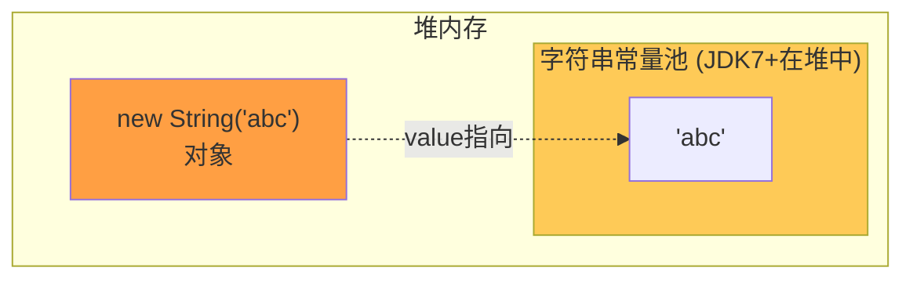

```java
String s1 = "abc";                    // 常量池（编译期确定）
String s2 = new String("abc");        // 堆中新对象 + 常量池的"abc"
String s3 = s1.intern();              // 返回常量池引用
String s4 = new String("abc").intern();

s1 == s2        // false (一个池、一个堆)
s1 == s3        // true  (都是常量池引用)
s1 == s4        // true  (intern 返回池引用)
s1.equals(s2)   // true  (内容相同)
```

### 3.4 🟠 `new String("abc")` 创建了几个对象？

> 🟠 **经典答案**：==1 个或 2 个==
> - 如果常量池已有 "abc" → 只在堆上 new 1 个 String 对象
> - 如果常量池没有 "abc" → 常量池创建 1 个 + 堆上 new 1 个 = 2 个

### 3.5 🟡 JDK 9+ String 底层优化

> 🟡 **Compact Strings**：JDK 9 将 `char[]` 改为 `byte[]` + `coder` 标记：
> - Latin1 字符（ASCII）：每字符 1 字节（节省一半内存）
> - 非 Latin1（中文等）：每字符 2 字节（UTF-16）
>
> ```java
> // JDK 9+
> private final byte[] value;
> private final byte coder;  // 0=LATIN1, 1=UTF16
> ```

---


# 第二部分 · 面向对象

## 4. 三大特性

### 4.1 🔴 封装 / 继承 / 多态

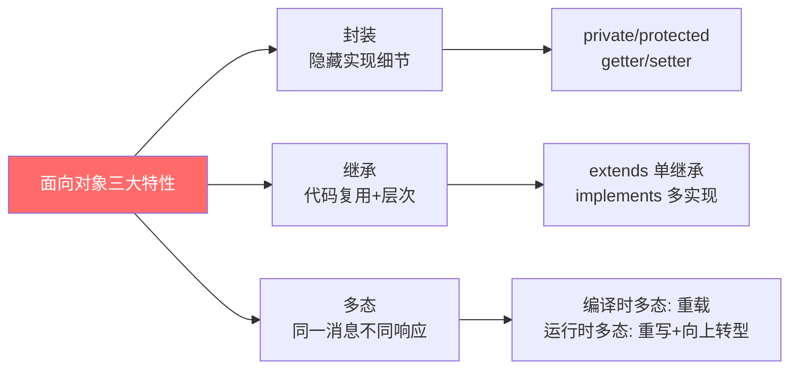

### 4.2 🔴 多态的实现条件

> 🔴 **运行时多态三要素**：
> 1. ==继承==（或实现接口）
> 2. ==重写==（子类覆盖父类方法）
> 3. ==向上转型==（父类引用指向子类对象）

```java
Animal animal = new Dog();  // 向上转型
animal.eat();               // 调用 Dog.eat()（动态绑定）

// 底层: invokevirtual 指令在运行时根据对象的实际类型
// 查找虚方法表(vtable)确定调用哪个方法
```

### 4.3 🟠 访问修饰符

| 修饰符 | 本类 | 同包 | 子类 | 其他包 |
|--------|:----:|:----:|:----:|:------:|
| private | ✅ | ❌ | ❌ | ❌ |
| default(缺省) | ✅ | ✅ | ❌ | ❌ |
| protected | ✅ | ✅ | ✅ | ❌ |
| public | ✅ | ✅ | ✅ | ✅ |

---

## 5. 重载 vs 重写

### 5.1 🔴 必背对照表

| 维度 | 重载（Overload） | 重写（Override） |
|------|------------------|------------------|
| 位置 | ==同一个类==内 | ==子类==中 |
| 方法名 | 相同 | 相同 |
| 参数列表 | ==必须不同==（类型/数量/顺序） | ==必须相同== |
| 返回值 | 无要求 | 相同或==协变类型==（子类） |
| 访问权限 | 无要求 | ≥ 父类（不能更严格） |
| 异常 | 无要求 | ≤ 父类（不能抛更广） |
| 绑定时机 | ==编译时==（静态分派） | ==运行时==（动态分派） |
| 关键字 | 无注解要求 | 推荐 `@Override` |

### 5.2 🟠 编译时 vs 运行时绑定

```java
class Animal { void eat() { print("Animal eat"); } }
class Dog extends Animal { void eat() { print("Dog eat"); } }

Animal a = new Dog();
a.eat();  // "Dog eat" — 运行时根据实际类型 Dog 绑定

// 重载是编译时确定:
void test(Animal a) { print("Animal"); }
void test(Dog d) { print("Dog"); }

Animal x = new Dog();
test(x);  // "Animal" — 编译时看声明类型 Animal
```

---

## 6. 抽象类 vs 接口

### 6.1 🔴 全面对比（JDK 8+）

| 维度 | 抽象类 | 接口 |
|------|--------|------|
| 关键字 | `abstract class` | `interface` |
| 构造器 | ✅ 有 | ❌ 无 |
| 成员变量 | 任意修饰符 | ==public static final== |
| 方法 | 抽象 + 具体均可 | 抽象 + default + static + private(JDK9) |
| 继承 | ==单继承== | ==多实现== |
| 设计语义 | ==is-a==（是什么） | ==can-do==（能做什么） |
| 适用 | 有共同状态/行为的基类 | 定义能力/契约 |

### 6.2 🟠 JDK 8/9 接口新能力

```java
public interface MyInterface {
    // 抽象方法
    void doSomething();

    // JDK 8: default 方法（有实现体）
    default void doDefault() {
        helper();
        System.out.println("default impl");
    }

    // JDK 8: static 方法
    static void doStatic() {
        System.out.println("static in interface");
    }

    // JDK 9: private 方法（供 default 复用）
    private void helper() {
        System.out.println("private helper");
    }
}
```

### 6.3 🟢 何时用抽象类、何时用接口

> 🟢 **选型指南**：
> - 需要==共享状态==（成员变量）→ 抽象类
> - 需要==多重继承能力== → 接口
> - 定义==行为契约== → 接口
> - 有==模板方法==（固定骨架 + 可变步骤）→ 抽象类

---

## 7. == vs equals vs hashCode

### 7.1 🔴 三者关系

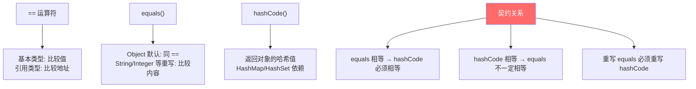

### 7.2 🔴 为什么重写 equals 必须重写 hashCode

```java
// 不重写 hashCode 的后果:
class Person {
    String name;
    @Override
    public boolean equals(Object o) {
        return this.name.equals(((Person)o).name);
    }
    // ❌ 没重写 hashCode
}

Person p1 = new Person("Tom");
Person p2 = new Person("Tom");
p1.equals(p2);  // true

Set<Person> set = new HashSet<>();
set.add(p1);
set.contains(p2);  // ❌ false! 因为 hashCode 不同，查的桶不一样
```

### 7.3 🟠 正确重写 equals 的五大规则

> 🟠 **equals 契约**（必须满足）：
> 1. **自反性**：`x.equals(x) == true`
> 2. **对称性**：`x.equals(y) == y.equals(x)`
> 3. **传递性**：x=y, y=z → x=z
> 4. **一致性**：多次调用结果不变
> 5. **非空性**：`x.equals(null) == false`

```java
// 标准写法
@Override
public boolean equals(Object o) {
    if (this == o) return true;                    // 同一引用
    if (o == null || getClass() != o.getClass()) return false;  // 类型检查
    Person person = (Person) o;
    return Objects.equals(name, person.name) && age == person.age;
}

@Override
public int hashCode() {
    return Objects.hash(name, age);  // 用相同字段计算
}
```

---


# 第三部分 · 集合框架

## 8. 集合体系总览

### 8.1 🔴 集合架构图

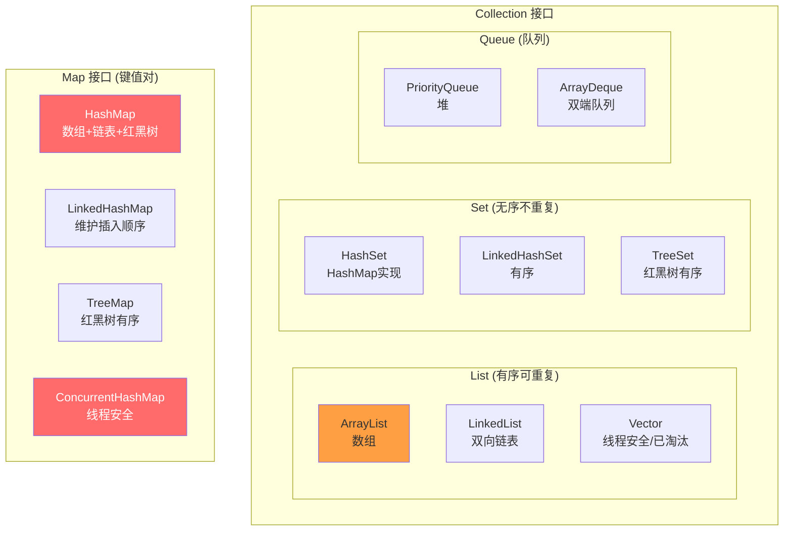

### 8.2 🟠 如何选择集合

| 需求 | 推荐 |
|------|------|
| 随机访问多 | `ArrayList` |
| 频繁插入删除 | `LinkedList` |
| 去重 | `HashSet` |
| 去重 + 有序 | `LinkedHashSet` / `TreeSet` |
| 键值对 | `HashMap` |
| 键值对 + 有序 | `LinkedHashMap`(插入序) / `TreeMap`(排序) |
| 并发安全 | `ConcurrentHashMap` / `CopyOnWriteArrayList` |

---

## 9. ArrayList 深度解析

### 9.1 🔴 核心参数

```java
public class ArrayList<E> {
    private static final int DEFAULT_CAPACITY = 10;    // 默认初始容量
    transient Object[] elementData;                    // ★ 底层数组
    private int size;                                  // 实际元素数量
}
```

### 9.2 🔴 扩容机制

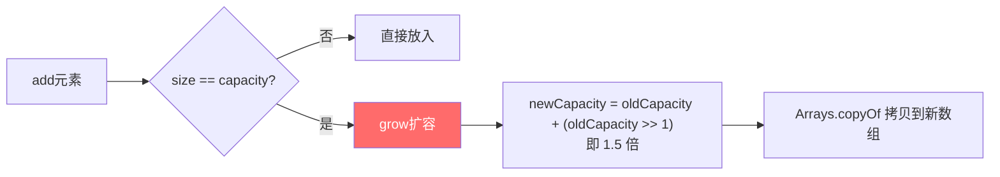

```java
// 扩容源码 (JDK 11)
private Object[] grow(int minCapacity) {
    int oldCapacity = elementData.length;
    int newCapacity = oldCapacity + (oldCapacity >> 1);  // ★ 1.5 倍
    if (newCapacity < minCapacity) newCapacity = minCapacity;
    return elementData = Arrays.copyOf(elementData, newCapacity);
}
```

### 9.3 🔴 ArrayList vs LinkedList

| 维度 | ArrayList | LinkedList |
|------|-----------|------------|
| 底层 | ==Object[] 数组== | ==双向链表== |
| 随机访问 | ==O(1)== | O(n) |
| 头部插入 | O(n)（数组搬移） | ==O(1)== |
| 尾部插入 | ==O(1) 均摊== | O(1) |
| 内存 | 连续，==缓存友好== | 不连续，每节点额外 prev+next 指针 |
| 扩容 | 1.5 倍 | 无需扩容 |
| 实现接口 | List, RandomAccess | List, Deque |

> 🟢 **实践**：==99% 场景用 ArrayList==，因为缓存局部性好、随机访问快。LinkedList 只在频繁头部插入且不需要随机访问时考虑。

---

## 10. HashMap 深度剖析（JDK 8）

### 10.1 🔴 数据结构

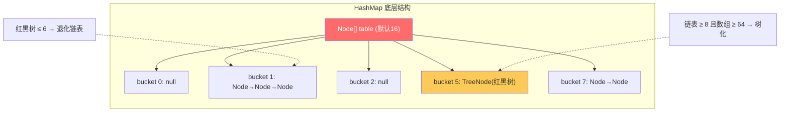

### 10.2 🔴 核心参数

| 参数 | 值 | 含义 |
|------|---|------|
| `DEFAULT_INITIAL_CAPACITY` | ==16== | 默认初始容量 |
| `MAXIMUM_CAPACITY` | 2^30 | 最大容量 |
| `DEFAULT_LOAD_FACTOR` | ==0.75== | 默认负载因子 |
| `TREEIFY_THRESHOLD` | ==8== | 链表树化阈值 |
| `UNTREEIFY_THRESHOLD` | ==6== | 红黑树退化阈值 |
| `MIN_TREEIFY_CAPACITY` | ==64== | 树化最小数组容量 |

### 10.3 🔴 put 流程详解

```mermaid
flowchart TD
    A[put key,value] --> B["hash = (h=key.hashCode()) ^ (h>>>16)<br/>扰动函数"]
    B --> C["i = (n-1) & hash 定位桶"]
    C --> D{table[i] == null?}
    D -->|是| E[直接放入新 Node]
    D -->|否| F{key 相同?<br/>hash==且equals}
    F -->|是| G[覆盖 value]
    F -->|否| H{是 TreeNode?}
    H -->|是| I[红黑树插入]
    H -->|否| J[链表尾插法]
    J --> K{链表长度 ≥ 8?}
    K -->|是| L{数组长度 ≥ 64?}
    L -->|是| M[树化为红黑树]
    L -->|否| N[扩容 resize]
    K -->|否| O[插入完成]
    E --> P{++size > threshold?}
    G --> P
    I --> P
    O --> P
    M --> P
    P -->|是| N
    P -->|否| Q[完成]

    style B fill:#ff6b6b,color:#fff
    style M fill:#feca57
```

### 10.4 🔴 hash 扰动函数

```java
static final int hash(Object key) {
    int h;
    return (key == null) ? 0 : (h = key.hashCode()) ^ (h >>> 16);
}
// 高16位 XOR 低16位: 让高位也参与桶定位运算
// 因为 (n-1) & hash 在 n 较小时只用到低位
```

### 10.5 🔴 扩容机制（resize）

> 🔴 **核心**：
> - 新容量 = ==旧容量 × 2==
> - 新阈值 = 新容量 × 负载因子
> - 元素重新分配：`hash & oldCap == 0` → 原位；否则 → ==原位 + oldCap==

```java
// JDK 8 扩容优化：不需要重新 hash
// 只看 hash 值在新增的那一位(oldCap 对应的位)是 0 还是 1
// 例: oldCap=16(10000), hash & 10000:
//   == 0 → 留在原位 (low 链)
//   != 0 → 移到 原位+16 (high 链)
```

### 10.6 🔴 面试必问 5 连击

| 问题 | 答案 |
|------|------|
| 为什么容量是 2 的幂 | `(n-1) & hash` 等价于 `hash % n`，位运算更快 |
| 为什么负载因子 0.75 | 时间和空间的折中（泊松分布下冲突概率最优） |
| 为什么树化阈值是 8 | 泊松分布下链表长度达 8 概率仅 ==0.00000006== |
| 线程不安全的表现 | JDK7 头插法死循环；JDK8 数据覆盖丢失 |
| key 能否为 null | HashMap 可以（放 0 号桶）；ConcurrentHashMap ==不可以== |

### 10.7 🟠 JDK 7 vs JDK 8 HashMap 对比

| 维度 | JDK 7 | JDK 8 |
|------|-------|-------|
| 数据结构 | 数组 + 链表 | 数组 + 链表 + ==红黑树== |
| 插入方式 | ==头插法==（并发死循环） | ==尾插法==（安全） |
| 扩容 | 重新计算 hash | ==hash & oldCap 判断== |
| hash 函数 | 4 次位运算 + 5 次异或 | 1 次位运算 + 1 次异或 |

---

## 11. ConcurrentHashMap

### 11.1 🔴 JDK 7 vs JDK 8 实现

| 维度 | JDK 7 | JDK 8 |
|------|-------|-------|
| 结构 | ==Segment[] + HashEntry[]== | ==Node[] + 链表/红黑树== |
| 锁粒度 | 分段锁（Segment 继承 ReentrantLock） | ==CAS + synchronized(桶头节点)== |
| 并发度 | 默认 16 个 Segment | 理论无限（桶级别） |
| size() | 多次不加锁统计，不一致则全锁 | ==baseCount + CounterCell[]== |

### 11.2 🔴 JDK 8 put 流程

```java
// 简化版核心逻辑
final V putVal(K key, V value, boolean onlyIfAbsent) {
    if (key == null || value == null) throw new NullPointerException();
    int hash = spread(key.hashCode());
    for (Node<K,V>[] tab = table;;) {
        Node<K,V> f; int n, i, fh;
        if (tab == null)
            tab = initTable();                          // 初始化
        else if ((f = tabAt(tab, i = (n-1) & hash)) == null) {
            if (casTabAt(tab, i, null, new Node<>(hash, key, value)))
                break;                                  // ★ CAS 放入空桶
        } else if ((fh = f.hash) == MOVED)
            tab = helpTransfer(tab, f);                 // ★ 帮助扩容
        else {
            synchronized (f) {                          // ★ 锁桶头节点
                // 链表或红黑树操作
            }
        }
    }
    addCount(1L, binCount);                            // 计数
    return null;
}
```

### 11.3 🟠 为什么不用 Hashtable / Collections.synchronizedMap

> 🟠 **性能对比**：
> - `Hashtable`：全方法 synchronized，==锁整个表==，并发性极差
> - `synchronizedMap`：包装类，==锁整个 Map 实例==
> - `ConcurrentHashMap`：==锁单个桶==，读操作大部分无锁（volatile Node）

---


# 第四部分 · 异常体系与泛型

## 12. 异常体系

### 12.1 🔴 异常分类图

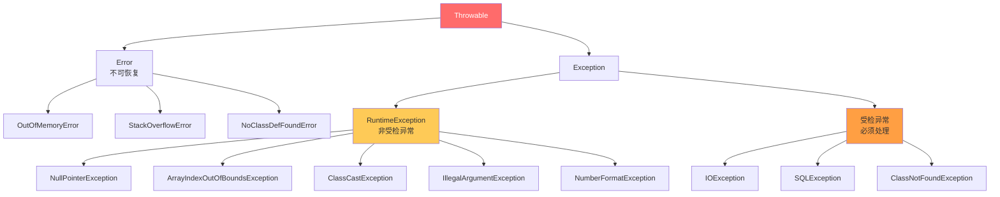

### 12.2 🔴 受检 vs 非受检

| 维度 | 受检异常 (Checked) | 非受检异常 (Unchecked) |
|------|-------------------|----------------------|
| 继承 | Exception（非 RuntimeException） | RuntimeException |
| 编译检查 | ✅ 必须 try-catch 或 throws | ❌ 不强制处理 |
| 典型 | IOException, SQLException | NPE, ClassCastException |
| 语义 | 可预见、可恢复的异常 | 编程错误、逻辑缺陷 |

### 12.3 🟠 finally 执行顺序

```java
// 面试题: try 中有 return，finally 还执行吗?
public int test() {
    try {
        return 1;       // ① 计算返回值 → ② 存临时变量
    } finally {
        return 2;       // ③ finally 的 return 会覆盖 try 的! 返回 2
    }
}

// 🟢 避坑: 永远不要在 finally 里 return!
// 正确做法:
public int test() {
    int result;
    try {
        result = 1;
        return result;
    } finally {
        // 清理资源，不要 return
        close();
    }
}
```

### 12.4 🟡 try-with-resources（JDK 7+）

```java
// 自动关闭 AutoCloseable 资源
try (InputStream is = new FileInputStream("a.txt");
     OutputStream os = new FileOutputStream("b.txt")) {
    // 使用资源
} catch (IOException e) {
    // 处理异常
}
// 编译器自动在 finally 中调用 close()
// 关闭顺序: 后声明的先关闭 (os → is)
```

---

## 13. 泛型

### 13.1 🔴 类型擦除

> 🔴 **核心**：Java 泛型是==编译期==的类型检查，运行时会==擦除==为原始类型（Raw Type）。

```java
// 编译前
List<String> list = new ArrayList<>();
list.add("hello");
String s = list.get(0);

// 编译后（擦除后）
List list = new ArrayList();
list.add("hello");
String s = (String) list.get(0);  // 编译器自动插入强转
```

> 🔴 **因为擦除，所以不能做**：
> - `new T()` — 不知道 T 是什么
> - `instanceof T` — 运行时没有 T 信息
> - `new T[]` — 同上
> - 静态字段/方法使用类泛型参数

### 13.2 🔴 通配符与 PECS 原则

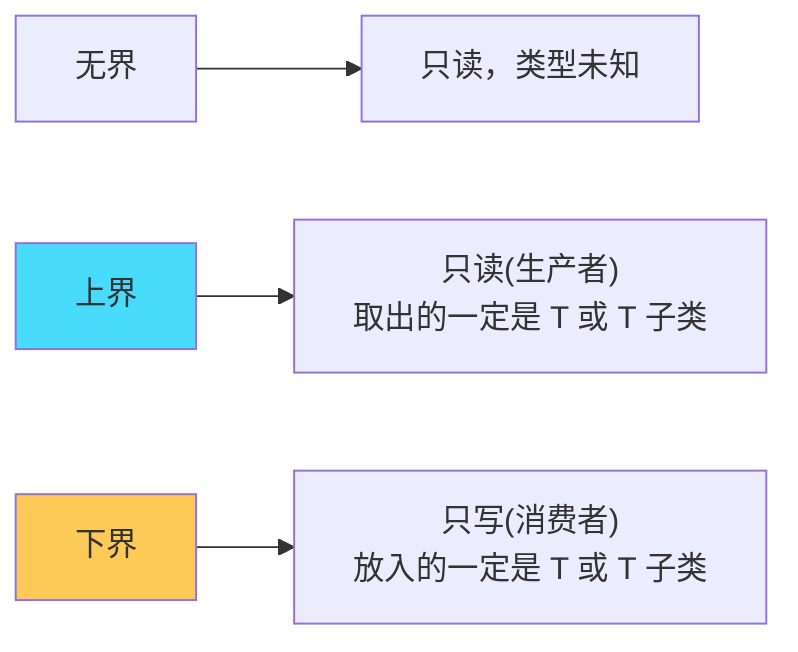

> 🔴 **PECS 原则**：==Producer Extends, Consumer Super==

```java
// Producer - 用 extends（只读）
public void copy(List<? extends Number> src) {
    Number n = src.get(0);  // ✅ 可以读
    // src.add(1);          // ❌ 不能写（不知道具体类型）
}

// Consumer - 用 super（只写）
public void fill(List<? super Integer> dest) {
    dest.add(1);            // ✅ 可以写
    // Integer i = dest.get(0); // ❌ 取出只能是 Object
}

// Collections.copy 源码就是 PECS 的典范
public static <T> void copy(List<? super T> dest, List<? extends T> src)
```

### 13.3 🟡 泛型的桥方法

```java
// 类型擦除后可能出现方法签名冲突，编译器自动生成桥方法
interface Comparable<T> {
    int compareTo(T o);
}

class MyClass implements Comparable<MyClass> {
    public int compareTo(MyClass o) { return 0; }
    // 编译器自动生成:
    // public int compareTo(Object o) { return compareTo((MyClass)o); }  // 桥方法
}
```

---

# 第五部分 · 反射与动态代理

## 14. 反射机制

### 14.1 🔴 获取 Class 对象的三种方式

```java
// 方式1: Class.forName (触发类初始化)
Class<?> clazz = Class.forName("com.example.User");

// 方式2: .class (不触发初始化)
Class<?> clazz = User.class;

// 方式3: getClass() (已有实例)
Class<?> clazz = user.getClass();
```

### 14.2 🔴 反射核心操作

```java
Class<?> clazz = Class.forName("com.example.User");

// 创建实例
Object obj = clazz.getDeclaredConstructor().newInstance();

// 获取字段
Field field = clazz.getDeclaredField("name");
field.setAccessible(true);   // 破除 private
field.set(obj, "Tom");

// 获取方法
Method method = clazz.getDeclaredMethod("setAge", int.class);
method.setAccessible(true);
method.invoke(obj, 25);
```

### 14.3 🟠 反射的应用场景

| 场景 | 例子 |
|------|------|
| 框架 | Spring IOC 容器根据类名反射创建 Bean |
| ORM | MyBatis 将结果集映射到 POJO |
| 序列化 | Jackson/Gson 通过反射读写字段 |
| AOP | 动态代理通过反射调用目标方法 |
| 注解处理 | 运行时读取注解配置 |

### 14.4 🟢 反射的性能问题

> 🟢 **反射慢的原因**：
> 1. 需要校验访问权限
> 2. 参数需要装箱/拆箱
> 3. 无法 JIT 内联优化
> 4. 方法查找需遍历
>
> **优化手段**：
> - `setAccessible(true)` 跳过权限检查（==提速 4~7 倍==）
> - 缓存 Method/Field 对象
> - 使用 MethodHandle（JDK 7+，接近直接调用性能）

---

## 15. 动态代理

### 15.1 🔴 JDK 动态代理 vs CGLIB

| 维度 | JDK 动态代理 | CGLIB |
|------|-------------|-------|
| 原理 | ==反射 + Proxy.newProxyInstance== | ==ASM 字节码生成子类== |
| 要求 | 目标类==必须实现接口== | 目标类==不能是 final== |
| 性能 | JDK 8+ 已优化，差距不大 | 生成的字节码直接调用，无反射 |
| Spring 默认 | 有接口用 JDK 代理 | 无接口用 CGLIB（SpringBoot 2.x 默认全用 CGLIB） |

### 15.2 🔴 JDK 动态代理实现

```java
public class LogInvocationHandler implements InvocationHandler {
    private final Object target;

    public LogInvocationHandler(Object target) {
        this.target = target;
    }

    @Override
    public Object invoke(Object proxy, Method method, Object[] args) throws Throwable {
        System.out.println("Before: " + method.getName());
        Object result = method.invoke(target, args);    // 反射调用真实方法
        System.out.println("After: " + method.getName());
        return result;
    }
}

// 创建代理
UserService proxy = (UserService) Proxy.newProxyInstance(
    target.getClass().getClassLoader(),
    target.getClass().getInterfaces(),
    new LogInvocationHandler(target)
);
```

### 15.3 🟠 CGLIB 实现

```java
Enhancer enhancer = new Enhancer();
enhancer.setSuperclass(UserServiceImpl.class);
enhancer.setCallback((MethodInterceptor) (obj, method, args, proxy) -> {
    System.out.println("Before");
    Object result = proxy.invokeSuper(obj, args);   // 调用父类方法
    System.out.println("After");
    return result;
});
UserServiceImpl proxy = (UserServiceImpl) enhancer.create();
```

---


# 第六部分 · Java IO 模型

## 16. BIO / NIO / AIO

### 16.1 🔴 三种 IO 模型对比

| 模型 | 全称 | 特点 | Java 实现 | 适用 |
|------|------|------|-----------|------|
| BIO | Blocking IO | ==同步阻塞==，一连接一线程 | InputStream/OutputStream | 连接少 |
| NIO | Non-blocking IO | ==同步非阻塞==，多路复用 | Channel+Buffer+Selector | 连接多、短操作 |
| AIO | Async IO | ==异步非阻塞==，回调通知 | AsynchronousChannel | 连接多、长操作 |

### 16.2 🔴 BIO 的问题

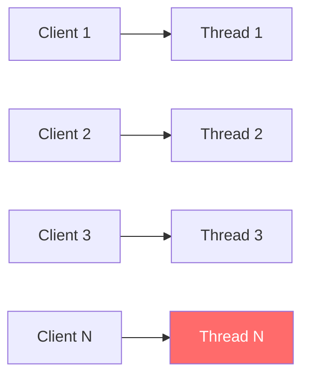

> 🔴 **BIO 致命缺陷**：每个连接独占一个线程。10000 个连接 → 10000 个线程 → ==OOM==
>
> 即使用线程池，线程在 IO 等待时仍然阻塞，CPU 利用率低。

### 16.3 🔴 NIO 三大组件

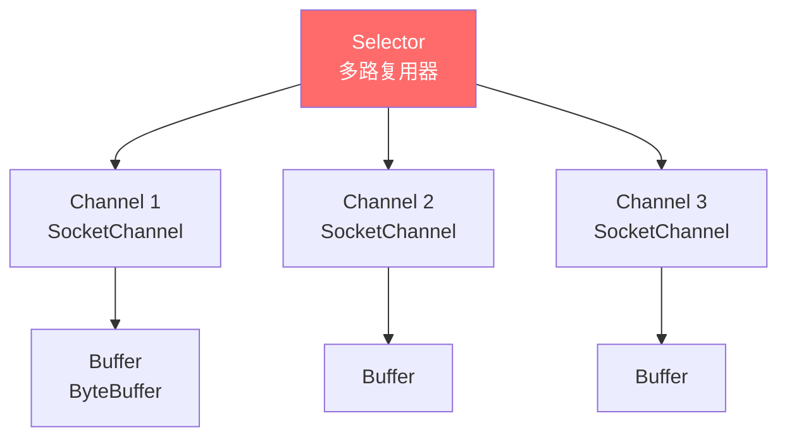

| 组件 | 作用 | 关键 API |
|------|------|---------|
| **Channel** | 双向数据管道 | FileChannel, SocketChannel, ServerSocketChannel |
| **Buffer** | 数据容器 | ByteBuffer (position/limit/capacity/flip/clear) |
| **Selector** | ==一个线程管理多个 Channel== | select() 获取就绪事件 |

### 16.4 🟠 Buffer 状态转换

```
写模式:                           读模式 (flip后):
┌──────────────────────────┐      ┌──────────────────────────┐
│ data data data ░░░░░░░░░ │      │ data data data ░░░░░░░░░ │
└──────────────────────────┘      └──────────────────────────┘
0        ↑position    ↑capacity   0  ↑position  ↑limit  ↑capacity
         (写到哪了)                   (从头读)   (能读到哪)

flip(): position → 0, limit → 原 position
clear(): position → 0, limit → capacity
compact(): 未读数据移到头部，position 紧跟其后
```

### 16.5 🟡 零拷贝

> 🟡 **加分**：NIO 的 `FileChannel.transferTo()` 利用 OS 的 ==sendfile== 系统调用，数据不经过用户空间，直接从文件到 Socket：
>
> - 传统 IO：磁盘 → 内核缓冲 → 用户缓冲 → Socket 缓冲 → 网卡（4 次拷贝）
> - 零拷贝：磁盘 → 内核缓冲 → 网卡（==2 次拷贝==，DMA 辅助）
>
> **Netty、Kafka、RocketMQ** 都大量使用零拷贝。

---

# 第七部分 · JDK 新特性

## 17. JDK 8 核心特性

### 17.1 🔴 Lambda 表达式

```java
// 函数式接口: 只有一个抽象方法的接口
@FunctionalInterface
interface Converter<F, T> {
    T convert(F from);
}

// Lambda 写法
Converter<String, Integer> converter = s -> Integer.parseInt(s);
// 方法引用
Converter<String, Integer> converter = Integer::parseInt;
```

### 17.2 🔴 四大核心函数式接口

| 接口 | 方法 | 用途 | 示例 |
|------|------|------|------|
| `Function<T,R>` | `R apply(T t)` | 转换 | `map(x -> x*2)` |
| `Predicate<T>` | `boolean test(T t)` | 判断 | `filter(x -> x>0)` |
| `Consumer<T>` | `void accept(T t)` | 消费 | `forEach(System.out::println)` |
| `Supplier<T>` | `T get()` | 提供 | `orElseGet(() -> new User())` |

---

## 18. Stream API 深度

### 18.1 🔴 Stream 操作分类

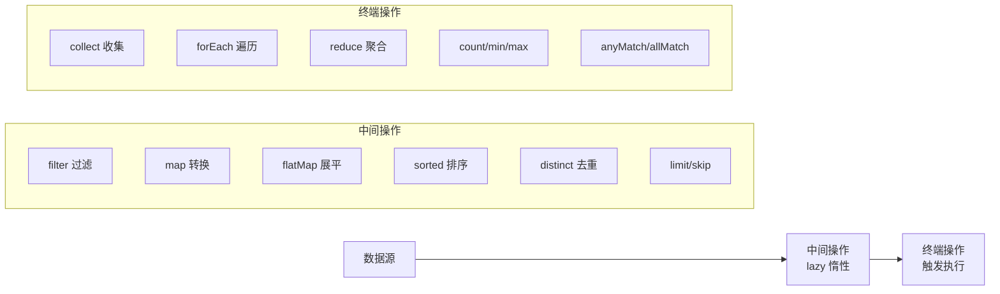

### 18.2 🔴 map vs flatMap

```java
// map: 一对一转换
List<String> names = users.stream()
    .map(User::getName)        // User → String
    .collect(Collectors.toList());

// flatMap: 一对多展平
List<String> words = lines.stream()
    .flatMap(line -> Arrays.stream(line.split(" ")))  // 一行 → 多个单词
    .collect(Collectors.toList());
```

### 18.3 🟠 Collectors 常用收集器

```java
// toList / toSet / toMap
Map<Long, User> userMap = users.stream()
    .collect(Collectors.toMap(User::getId, Function.identity()));

// groupingBy 分组
Map<String, List<User>> byDept = users.stream()
    .collect(Collectors.groupingBy(User::getDept));

// partitioningBy 分区 (true/false 两组)
Map<Boolean, List<User>> partition = users.stream()
    .collect(Collectors.partitioningBy(u -> u.getAge() > 30));

// joining 拼接
String names = users.stream()
    .map(User::getName)
    .collect(Collectors.joining(", ", "[", "]"));  // [Tom, Jerry, Alice]

// 统计
DoubleSummaryStatistics stats = orders.stream()
    .collect(Collectors.summarizingDouble(Order::getAmount));
// stats.getSum() / getAverage() / getMax() / getMin() / getCount()
```

### 18.4 🟢 Stream 避坑

> 🟢 **注意事项**：
> 1. Stream ==不能重复消费==，终端操作后即关闭
> 2. ==parallelStream== 不一定快（小数据量、IO 操作反而慢）
> 3. 修改源集合可能抛 ConcurrentModificationException
> 4. Stream 操作是==惰性==的，没有终端操作不会执行

---

## 19. 虚拟线程（JDK 21）

### 19.1 🔴 平台线程 vs 虚拟线程

| 维度 | 平台线程 | 虚拟线程 |
|------|---------|---------|
| 映射 | 1:1 映射 OS 线程 | ==M:N 映射==（多个虚拟线程复用少量 OS 线程） |
| 栈大小 | ~1MB（固定） | ~几 KB（按需增长） |
| 创建数量 | 千~万 | ==百万级== |
| 调度 | OS 内核调度 | ==JVM 用户态调度== |
| 阻塞代价 | 浪费 OS 线程资源 | 只暂停虚拟线程，不阻塞载体线程 |

### 19.2 🔴 使用方式

```java
// 创建虚拟线程
Thread vt = Thread.startVirtualThread(() -> {
    System.out.println("Running in virtual thread");
});

// 使用 ExecutorService
try (var executor = Executors.newVirtualThreadPerTaskExecutor()) {
    for (int i = 0; i < 1_000_000; i++) {
        executor.submit(() -> {
            Thread.sleep(Duration.ofSeconds(1));
            return "done";
        });
    }
}  // 自动等待所有任务完成

// StructuredTaskScope (结构化并发, Preview)
try (var scope = new StructuredTaskScope.ShutdownOnFailure()) {
    Future<User> user = scope.fork(() -> fetchUser(id));
    Future<Order> order = scope.fork(() -> fetchOrder(id));
    scope.join();
    scope.throwIfFailed();
    return new Response(user.resultNow(), order.resultNow());
}
```

### 19.3 🟠 适用与不适用场景

> 🟠 **适用**：==IO 密集型==（HTTP 调用、DB 查询、文件读写）
>
> ❌ **不适用**：
> - ==CPU 密集型==（虚拟线程让出时机少，无优势）
> - 使用 ==synchronized== 长时间持有锁（会 pin 住载体线程）
> - 大量 ==ThreadLocal==（百万虚拟线程 × ThreadLocal = 内存爆炸）

---

# 第八部分 · 面试官高频追问 Top 30

## 🔴 STAR-S 答题模板

```
S - Situation: 背景（一句话）
T - Task: 任务/问题
A - Action: 你的方案（技术细节）
R - Result: 结果（量化数据）
S - Summary: 总结/延伸
```

## 面试追问清单

| # | 追问 | 答题关键词 |
|---|------|-----------|
| 1 | HashMap 底层原理 | 数组+链表+红黑树 / hash扰动 / 1.5倍扩容 / 树化8退化6 |
| 2 | HashMap put 流程 | hash→定位桶→空桶CAS/冲突链表尾插/树化 |
| 3 | HashMap 扩容机制 | 2倍 / hash & oldCap 判断新位置 |
| 4 | ConcurrentHashMap 如何保证线程安全 | JDK8: CAS+synchronized锁桶头 / volatile Node |
| 5 | ArrayList 扩容 | 1.5倍 / Arrays.copyOf / 建议初始化指定容量 |
| 6 | ArrayList vs LinkedList | 数组vs链表 / 随机访问O(1)vs插入O(1) / 缓存友好 |
| 7 | String 为什么不可变 | final class + private final byte[] + 无修改方法 |
| 8 | String/StringBuilder/StringBuffer | 不可变vs可变 / 线程安全 / 性能 |
| 9 | == 和 equals 区别 | 地址vs内容 / 重写equals必须重写hashCode |
| 10 | 接口和抽象类区别 | 多实现vs单继承 / is-a vs can-do / default方法 |
| 11 | 自动装箱缓存 | Integer -128~127 / valueOf源码 / 比较用equals |
| 12 | 受检异常vs非受检 | 编译检查 / RuntimeException / IOException |
| 13 | finally一定执行吗 | System.exit/守护线程被杀 外几乎一定执行 |
| 14 | 泛型擦除的影响 | 不能new T / 不能instanceof / 桥方法 |
| 15 | PECS 原则 | extends只读 / super只写 / Collections.copy |
| 16 | 反射的性能优化 | setAccessible / 缓存Method / MethodHandle |
| 17 | JDK代理vs CGLIB | 接口vs子类 / Proxy vs ASM / Spring选择策略 |
| 18 | BIO/NIO/AIO | 阻塞vs非阻塞 / Selector多路复用 / 回调 |
| 19 | NIO Buffer 的 flip | position→0, limit→原position / 写转读 |
| 20 | 零拷贝原理 | sendfile / FileChannel.transferTo / Kafka应用 |
| 21 | Stream map vs flatMap | 一对一 vs 一对多展平 |
| 22 | parallelStream 注意事项 | ForkJoinPool.commonPool / IO不适用 / 线程安全 |
| 23 | Optional 使用 | orElse/orElseGet/map/flatMap / 避免 get() |
| 24 | 虚拟线程原理 | M:N调度 / 用户态 / IO密集适用 |
| 25 | 虚拟线程的限制 | synchronized pin / ThreadLocal内存 / CPU密集无优势 |
| 26 | JDK 8 有哪些新特性 | Lambda/Stream/Optional/default方法/日期API |
| 27 | 方法引用的四种形式 | 类::静态方法/对象::实例方法/类::实例方法/构造器 |
| 28 | HashMap 为什么线程不安全 | JDK7死循环(头插) / JDK8数据覆盖 |
| 29 | 如何让 HashMap 线程安全 | ConcurrentHashMap / Collections.synchronizedMap |
| 30 | Object 类有哪些方法 | toString/equals/hashCode/clone/wait/notify/finalize/getClass |

---

## 🟡 加分弹药库

> **深度延伸方向**（面试官可能追问）：
> 1. **String.intern() 在不同 JDK 版本的行为差异**（JDK6 在永久代，JDK7+ 在堆中）
> 2. **HashMap 的红黑树是怎么保持平衡的**（左旋/右旋/变色）
> 3. **ConcurrentHashMap 的 size() 是怎么计算的**（baseCount + CounterCell LongAdder 思想）
> 4. **JDK 动态代理生成的类长什么样**（$Proxy0 继承 Proxy 实现目标接口）
> 5. **NIO 的 epoll 和 select/poll 区别**（事件驱动 vs 轮询 / fd 数量限制）
> 6. **Record 类型（JDK 14+）和 Lombok @Data 的区别**

---

*整理完成，祝面试顺利！*
