# 分布式技术面试总结 · 吃透版

> 整理基础:`分布式技术面试总结.md`
> 深度标准：参照`分布式锁_吃透版_样板.md`，每个知识点都有完整的"为什么"链条
> 风格：**大纲 → 细分知识点 → 源码 → 时序图 → 事故案例 → 面试官追问完整回答**
> 适用：中高级 Java 后端 / 分布式架构面试

---

## 视觉规范说明

| 标记 | 含义 | 优先级 |
|------|------|--------|
| 🔴 **必背核心** | 面试必答，底层原理，八股文核心 | ⭐⭐⭐⭐⭐ |
| 🟠 **重点理解** | 高频考点，源码级关键路径 | ⭐⭐⭐⭐ |
| 🟡 **加分项** | 拔高内容，扩展知识 | ⭐⭐⭐ |
| 🟢 **避坑提醒** | 实战陷阱，翻车场景 | ⭐⭐⭐ |

> 💡 **建议**：第一遍只看 🔴 部分；第二遍看 🟠 加深；第三遍看 🟡🟢 拔高与避坑。

---


## 全文大纲

```
第一部分 · Redis (高频⭐⭐⭐⭐⭐)
    1. 线程模型与高性能本质
    2. 5 大数据结构 + 底层实现
    3. 持久化：RDB / AOF / 混合
    4. 过期策略与内存淘汰
    5. 分布式锁完整方案
    6. 缓存三大问题（穿透/击穿/雪崩）
    7. 主从 / 哨兵 / 集群
    8. Redis 6 多线程 IO
    9. 缓存与DB双写一致性

第二部分 · 消息队列
    10. Kafka 架构与高性能
    11. RabbitMQ 与交换机
    12. RocketMQ 与事务消息
    13. MQ 通用问题（可靠性/顺序/重复消费）

第三部分 · 存储与搜索
    14. MySQL 分库分表 (ShardingSphere)
    15. ElasticSearch 架构与倒排索引

第四部分 · 协调与通信
    16. ZooKeeper 与 ZAB
    17. Netty 线程模型与零拷贝

第五部分 · 面试官高频追问 + 答题模板
    Top 30 题 + STAR-S 模板 + 加分弹药库
```

---


# 第一部分 · Redis

## 1. Redis 线程模型与高性能本质

### 1.1 设计动机：为什么 Redis 选择单线程？

> 🔴 **核心问题**：2009 年 antirez 设计 Redis 时，为什么选择单线程而不是多线程？

**历史背景**：
- 2009 年主流数据库（MySQL/PostgreSQL）都是多线程架构
- Memcached 也是多线程（libevent + worker thread pool）
- antirez 的观察：对于**内存数据库**，瓶颈不在 CPU，而在 **网络IO** 和 **内存访问**

**设计决策链**：
```
观察：内存操作极快(ns级) → CPU不是瓶颈
      ↓
推论：多线程带来的锁竞争开销 > 多线程带来的并行收益
      ↓
决策：单线程串行执行命令，避免所有并发问题
      ↓
优化：用IO多路复用(epoll)补偿单线程的IO等待
      ↓
结果：单线程达到 10万+ QPS，远超大多数场景需求
```

**如果不用单线程会怎样（反证）**：
- 每个 GET/SET 都要加锁保护 dict/skiplist → CAS 或 mutex 开销 ~50ns/次
- 10万 QPS 时，单锁竞争开销 ≈ 5ms/s，多锁又增加死锁风险
- Memcached 多线程方案需要 CAS 乐观锁（`gets`/`cas` 命令），编程模型复杂
- Redis 用单线程一刀切：**零锁开销 + 极简编程模型 + 天然命令级原子性**

**深入理解"天然命令级原子性"**：
- 在多线程数据库中，两个线程同时执行 `INCR counter` 需要加锁保证读-改-写是原子的
- Redis 单线程下，命令是一个接一个执行的，不存在"执行到一半被打断"的情况
- 这意味着 `INCR`、`LPUSH`、`HSET` 等复合操作天然原子——不需要任何额外同步机制
- 这也是为什么 Redis 可以用简单的 `SET NX` 实现分布式锁、用 `INCR` 实现计数器——它们在语义上就是原子的

> 🟠 **重点理解**：单线程不是"简单"的选择，而是**精确的工程权衡**。Redis 的单线程带来了：
> - 无锁设计 → 代码简单、bug 少
> - 无上下文切换 → CPU cache 命中率高
> - 原子执行 → 天然事务语义（单命令级别）


### 1.2 一图看懂线程模型演化

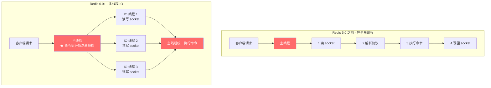

**文字总结**：6.0 之前——从读 socket 到写回 socket 全由一个主线程完成；6.0 之后——只有"执行命令"这一步保持单线程，读写 socket 的工作分给了多个 IO 线程并行做。这样既保留了命令执行的无锁优势，又解决了网络 IO 的带宽瓶颈。

**为什么"执行命令"不能多线程化？**
- 如果两个线程同时执行 `DEL key1` 和 `GET key1`，结果取决于执行顺序——需要加锁
- Redis 的数据结构（dict、skiplist等）本身不是线程安全的，多线程并发修改需要大量改造
- 一旦加锁，锁的粒度选择极为复杂：粗粒度（全局锁）= 退回单线程；细粒度（per-key锁）= 死锁风险+内存开销
- 所以 Redis 选择了"网络IO并行化 + 命令执行串行化"的最优折中点


### 1.3 🔴 必背核心：Redis 为什么快（五因素深度解析）

| # | 原因 | 深度解释 | 量化数据 |
|---|------|---------|---------|
| 1 | **纯内存操作** | DRAM 随机读取延迟 ~100ns，SSD ~100μs，HDD ~10ms | 内存比磁盘快 ==10万倍== |
| 2 | **单线程无锁** | 无 mutex/CAS 开销，无上下文切换(每次切换 ~5μs)，CPU L1/L2 cache 命中率高 | 节省 30%+ CPU |
| 3 | **IO 多路复用** | Linux epoll：单线程管理万级 fd，只有就绪的 fd 才处理 | 10万连接仅占 ~40MB |
| 4 | **高效数据结构** | SDS O(1) strlen、跳表 O(logN)、intset 紧凑排列 | 比通用 HashMap 省 50%+ 内存 |
| 5 | **RESP 协议** | 文本协议，解析简单(逐行读取)，无需复杂序列化 | 解析成本 < 1μs/命令 |

#### 深入：epoll 为什么高效？

**工作原理三步走**：

```c
// Linux epoll 核心三调用
int epfd = epoll_create(1);                    // 1. 创建 epoll 实例(内核维护红黑树+就绪链表)
epoll_ctl(epfd, EPOLL_CTL_ADD, fd, &event);   // 2. 注册 fd 到红黑树(O(logN))
int n = epoll_wait(epfd, events, max, timeout);// 3. 阻塞等待就绪事件(O(1)从就绪链表取)

// Redis 事件循环核心 (ae.c)
void aeMain(aeEventLoop *eventLoop) {
    eventLoop->stop = 0;
    while (!eventLoop->stop) {
        aeProcessEvents(eventLoop, AE_ALL_EVENTS);
    }
}
```

**epoll 内部数据结构**：
```
epoll 实例内部:
┌─────────────────────────────────────┐
│  红黑树 (rbr)                        │ ← 存储所有注册的 fd（高效增删改 O(logN)）
│  ├── fd=3 (events=EPOLLIN)          │
│  ├── fd=7 (events=EPOLLIN|EPOLLOUT) │
│  └── fd=12 (events=EPOLLIN)         │
├─────────────────────────────────────┤
│  就绪链表 (rdllist)                   │ ← 有事件的 fd 自动加入此链表
│  └── fd=7 → fd=3                    │    epoll_wait 只遍历此链表 → O(1)
└─────────────────────────────────────┘
```

**核心优势解释**：当网卡收到数据时，内核通过回调函数将对应的 fd 加入就绪链表。`epoll_wait` 只需要检查这个链表是否为空——如果有就绪事件直接返回，不需要遍历所有连接。这就是为什么 10 万连接中只有 100 个活跃时，epoll 也只处理这 100 个。

**回调注册的底层原理**：当调用 `epoll_ctl(ADD)` 注册 fd 时，内核在该 fd 对应的设备驱动中注册一个回调函数 `ep_poll_callback`。当网卡收到数据触发硬中断→软中断→协议栈处理后，内核发现这个 socket fd 有注册的 epoll 回调，就执行这个回调将 fd 加入就绪链表。整个过程是==事件驱动==的，不是轮询的。

**epoll vs select/poll 对比**：

| 维度 | select | poll | epoll |
|------|--------|------|-------|
| fd 上限 | 1024(FD_SETSIZE) | 无限(链表) | 无限(红黑树) |
| 每次调用 | 全量拷贝 fd_set 到内核 | 全量拷贝 pollfd 到内核 | ==无需拷贝==(内核维护) |
| 就绪检查 | O(N) 遍历所有 fd | O(N) 遍历所有 fd | ==O(1) 回调通知== |
| 触发方式 | 水平触发(LT) | 水平触发(LT) | 水平/==边缘触发(ET)== |
| 10万连接100活跃 | 扫描10万次 | 扫描10万次 | ==只返回100个== |

> 🟠 **水平触发(LT) vs 边缘触发(ET)**：
> - LT：只要 fd 可读/可写就一直通知（安全但可能重复通知）
> - ET：只在状态**变化**时通知一次（高效但必须一次读完，否则不再通知）
> - Redis 使用 LT 模式（代码简单，不会漏数据）；Nginx 使用 ET 模式（极致性能）


### 1.4 🟠 重点理解：6.0 为什么引入多线程？

**问题演化**：
```
Redis 5.x 时代的瓶颈发现：
  - 命令执行(内存操作)：~100ns/命令 → 不是瓶颈
  - 网络IO(read/write)：~10μs/次 → ★ 成为瓶颈！
  - 大 value 场景(如 100KB)：网络IO占比 > 90%
```

**如果不引入多线程IO会怎样**：
- 单线程处理网络读写，100KB 的 value 一次 read() 耗时约 10μs
- 单线程极限: 1s / 10μs = 10万 QPS（理论上限，实际更低）
- 随着 5G/万兆网卡普及，网络带宽不再是瓶颈，但单线程**处理**带宽能力成为天花板
- 如果不改架构，只能靠 Cluster 分片横向扩展（增加运维成本）

**解决思路**：只把网络 IO 多线程化，命令执行保持单线程

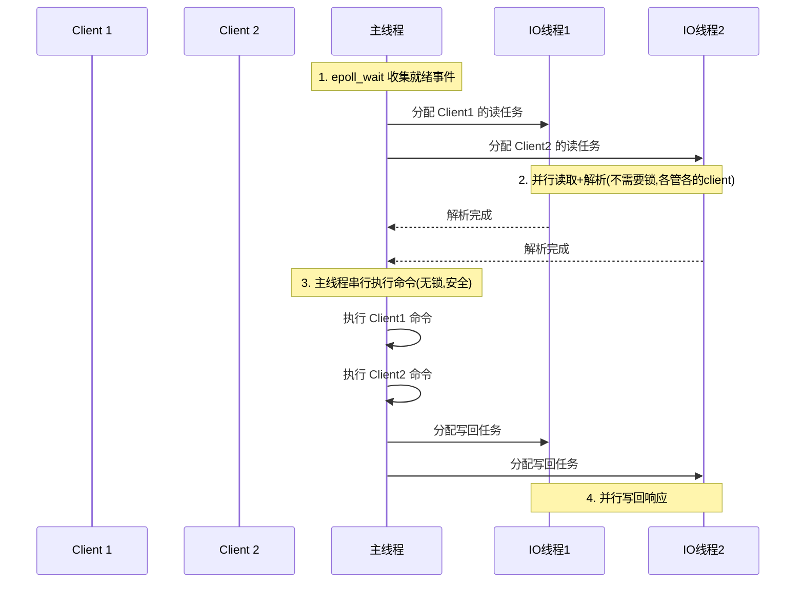

**文字总结**：IO 线程之间不共享数据——每个 IO 线程只负责自己分配到的那些 client 的 socket 读写，不需要任何锁。主线程通过原子变量标记"读取完成/写回完成"来同步，用自旋等待(busy-wait)代替锁，延迟更低。

**配置方式**：
```bash
# redis.conf (6.0+)
io-threads-do-reads yes      # IO 线程处理读(默认只处理写)
io-threads 4                 # IO线程数，推荐 CPU核数-1，不超过8
```

**性能数据**：
| 配置 | GET QPS | SET QPS | 提升 |
|------|---------|---------|------|
| io-threads 1(默认) | 10万 | 8万 | 基准 |
| io-threads 4 | 20万+ | 15万+ | ~2倍 |
| io-threads 8 | 25万+ | 18万+ | 收益递减 |

> 🟢 **避坑：多线程IO不是万能的**
> - value < 1KB 的小对象场景，提升不明显（网络IO本身很快，瓶颈在命令执行）
> - CPU密集型命令（SORT、ZUNIONSTORE）无法加速（仍是主线程执行）
> - 开启后增加了代码复杂度和调试难度
> - **什么时候该开**：监控 `INFO` 中 CPU 使用率 < 50% 但 QPS 已到极限，且 `instantaneous_input_kbps` 很高时


### 1.5 🟠 三个后台线程（bio）— "单线程"的真相

> 🟠 **重点**：说"Redis 是单线程"并不完全准确。更准确的说法是"**命令执行是单线程**"。Redis 内部有 3 个后台线程处理耗时操作：

| 后台线程 | 功能 | 为什么需要它 |
|---------|------|-------------|
| `bio_close_file` | 异步关闭文件描述符 | AOF 重写完成后关闭旧文件，避免阻塞主线程 |
| `bio_aof_fsync` | 异步执行 AOF fsync | everysec 策略下 fsync 由后台线程执行，不阻塞写命令 |
| `bio_lazy_free` | 异步释放大对象 | `UNLINK` 命令和 `lazyfree-lazy-eviction` 的大 key 删除 |

**为什么大 key 删除需要异步？**
```
DEL 一个 100万元素的 Hash:
  → 主线程逐个释放 entry 内存 → 可能耗时 1~2 秒
  → 期间所有客户端请求排队等待 → 相当于 Redis 卡死 1~2 秒

UNLINK 同样的 Hash:
  → 主线程只从 keyspace 字典移除引用(O(1)) → 几微秒
  → bio_lazy_free 线程在后台慢慢释放内存 → 不影响主线程
```

### 1.6 🟢 线上事故案例：KEYS * 导致全站502

> 🟢 **事故还原**：
> - **业务**：某社交App用户信息缓存，单实例 Redis 8GB，QPS 5万
> - **起因**：运维排查问题时在生产Redis执行 `KEYS user:*`（约200万个key）
> - **现象**：命令执行耗时 3.2 秒，期间所有客户端请求排队等待
> - **影响**：5万 QPS × 3.2秒 = 16万请求超时，网关触发熔断，全站502持续5秒
> - **根因**：KEYS 是 O(N) 命令，单线程模型下阻塞所有请求
> - **修复**：
>   1. 禁用危险命令：`rename-command KEYS ""`
>   2. 用 `SCAN` 替代(游标迭代，每次只处理小批量，不阻塞)
>   3. 加 Redis 慢查询告警：`slowlog-log-slower-than 10000`(10ms)
>   4. 生产环境只允许通过从节点做扫描类操作

**SCAN vs KEYS 原理对比**：
| | KEYS pattern | SCAN cursor MATCH pattern COUNT n |
|---|---|---|
| 遍历方式 | 一次扫完所有 key | 分批扫，每次只扫一部分(COUNT建议) |
| 阻塞时间 | O(N)，N=总key数 | 每次 O(COUNT)，微秒级 |
| 返回保证 | 一定返回全部匹配 | 可能重复/遗漏（渐进式Hash扩容时） |
| 生产安全 | ❌ 绝对禁止 | ✅ 安全（配合去重使用） |

**SCAN 为什么可能重复或遗漏——渐进式rehash详解**：
Redis 的 dict 使用渐进式 rehash：当负载因子过高时，不是一次性迁移所有 bucket，而是每次操作（GET/SET/SCAN）时顺带迁移几个 bucket。SCAN 遍历时 dict 可能正在 rehash（同时存在 ht[0] 和 ht[1] 两个哈希表）：
- **重复**：key 从 ht[0] 迁移到 ht[1] 后，如果 SCAN 先扫了 ht[0] 的旧位置，后来又扫到 ht[1] 的新位置
- **遗漏极少**：SCAN 使用"反转二进制迭代"（reverse binary iteration）算法，保证在 rehash 过程中**不会遗漏任何 key**（Redis 源码注释明确说明），但可能重复

**生产使用 SCAN 的正确姿势**：
```java
Set<String> allKeys = new HashSet<>();  // 去重
String cursor = "0";
do {
    ScanResult<String> result = redis.scan(cursor, "user:*", 100);
    allKeys.addAll(result.getResult());  // HashSet自动去重
    cursor = result.getCursor();
} while (!"0".equals(cursor));  // cursor回到0表示遍历完毕
```


### 1.7 面试官追问（深度回答）

**Q1: Redis 单线程为什么这么快，瓶颈在哪？**

> 🔴 **完整回答（200+字）**：
>
> Redis 单线程能达到 10 万+ QPS，核心原因有五：纯内存操作（ns 级延迟）、单线程避免锁竞争和上下文切换、IO 多路复用（epoll 单线程管理万级连接）、精心设计的数据结构（SDS/跳表/压缩列表）、以及简洁的 RESP 文本协议。
>
> 瓶颈主要在两方面：一是**网络带宽**，当 value 较大（>10KB）或连接数极高时，网络 IO 成为主要耗时，这正是 Redis 6.0 引入多线程 IO 的原因；二是**单 key 大操作**，如 `HGETALL` 一个百万 field 的 Hash、`SORT` 大列表等 O(N) 命令会阻塞主线程。CPU 几乎不是瓶颈，所以单台机器加 CPU 核心对 Redis 性能提升不大，要靠 Cluster 水平扩展。
>
> **面试加分点**：可以提到 Redis 其实有三个后台线程（bio_close_file、bio_aof_fsync、bio_lazy_free）处理耗时的后台任务，所以说"Redis 是单线程"更准确的表述是"**命令执行是单线程**"。

**Q2: Redis 6.0 多线程默认开启吗？什么时候该开？**

> 🟠 **完整回答**：
>
> 默认关闭。需要显式配置 `io-threads-do-reads yes` 和 `io-threads N` 才生效。开启的判断标准：监控发现 Redis 实例 CPU 使用率不高（<50%）但 QPS 已经到瓶颈（10万+），且 `INFO` 中 `instantaneous_input_kbps` 较高（网络是瓶颈），此时开启多线程 IO 有明显收益。
>
> 不适合开启的场景：小 value（<1KB）读写、CPU 密集型 Lua 脚本、已有读写分离架构的场景。建议在测试环境压测验证效果后再上生产。io-threads 数不超过 CPU 核数的一半（留资源给操作系统和其他进程），且不超过 8（收益递减，调度开销增大）。

---

## 2. 5 大数据结构 + 底层实现

### 2.1 设计动机：为什么 Redis 要自己实现数据结构？

**C 标准库的不足**：
- `char*` 字符串：没有长度信息（O(N) strlen）、不二进制安全（\0 截断）、缓冲区溢出风险
- 没有通用的有序集合、集合操作库
- 通用数据结构对内存利用率低（大量指针、对齐浪费）

**Redis 的设计哲学**：==为每种数据量级选择最优的底层编码==

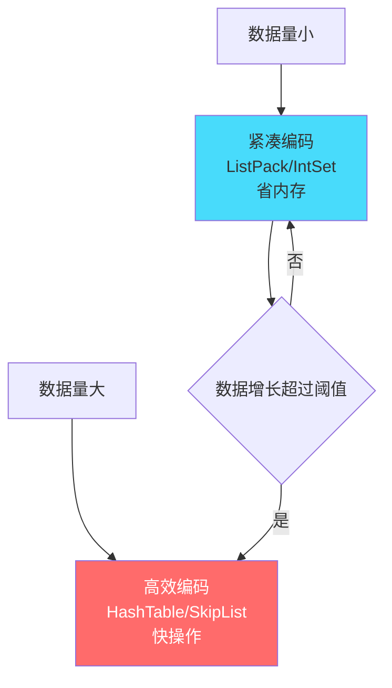

**为什么不一律用高效编码？** 因为 HashTable 和 SkipList 每个 entry 都有 dictEntry 指针(24字节)或多层跳表指针。当元素只有几个时，紧凑编码（连续内存）反而更快（CPU cache 友好）且更省内存。只有元素增多后，紧凑编码的 O(N) 遍历才成为劣势，此时自动升级到高效编码。

**CPU Cache 友好性的量化理解**：
```
L1 Cache 访问:     ~1ns    (4 CPU周期)
L2 Cache 访问:     ~3ns    (12 CPU周期)
L3 Cache 访问:     ~10ns   (40 CPU周期)
主内存 访问:       ~100ns   (400 CPU周期)  ← 差100倍!

一个 cache line = 64 字节
ListPack(连续内存): 10个小元素(<64字节) → 一次cache line读取全部数据
HashTable(指针跳转): 10个entry → 10次指针解引用 → 可能10次cache miss → 10×100ns = 1μs
```

**编码转换是不可逆的**：一旦从紧凑编码升级为 HashTable/SkipList，即使后来元素又减少了也不会降级回去。原因：降级需要重建整个紧凑结构，且可能触发频繁的"升→降→升"抖动。Redis 选择"只升不降"的简单策略。


### 2.2 🔴 必背核心对照表

| 类型 | 命令 | 底层实现(Redis 7) | 编码转换阈值 | 典型场景 |
|------|------|------------------|-------------|---------|
| **String** | `SET/GET/INCR` | ==SDS==(int/embstr/raw) | 44字节(embstr→raw) | 缓存、计数器、分布式锁 |
| **List** | `LPUSH/RPOP/LRANGE` | ==QuickList==(listpack节点链) | - | 消息队列、最近列表 |
| **Hash** | `HSET/HGET` | ==ListPack==(小) / ==HashTable==(大) | 128个field / value>64B | 对象存储、购物车 |
| **Set** | `SADD/SMEMBERS/SINTER` | ==IntSet==(纯整数小) / ==HashTable== | 128个元素 / 非整数 | 标签、共同好友、抽奖 |
| **ZSet** | `ZADD/ZRANGE` | ==ListPack==(小) / ==SkipList+HashTable==(大) | 128个元素 / member>64B | 排行榜、延迟队列 |

> 🟠 **Redis 7 变化**：ziplist 被 listpack 替代，修复了 ziplist 的级联更新（cascade update）问题。面试时说 ziplist 也对（老版本），但提到 listpack 是加分项。

### 2.3 🔴 SDS（Simple Dynamic String）源码剖析

```c
// Redis 7 的 SDS 实现 (sds.h)
// 根据字符串长度选择不同的 header 节省内存
struct __attribute__ ((__packed__)) sdshdr8 {
    uint8_t len;        // 已用长度（O(1) 获取strlen）
    uint8_t alloc;      // 分配的总容量（不含header和\0）
    unsigned char flags; // 低3位表示type（sdshdr5/8/16/32/64）
    char buf[];         // 实际数据（柔性数组）
};

struct __attribute__ ((__packed__)) sdshdr16 {
    uint16_t len;
    uint16_t alloc;
    unsigned char flags;
    char buf[];
};
// 还有 sdshdr32、sdshdr64 用于超大字符串
```

**为什么要 5 种 header 而不是统一用一种？**
```
字符串长度 < 256:     用 sdshdr8  → header 仅 3 字节
字符串长度 < 65536:   用 sdshdr16 → header 仅 5 字节
字符串长度 < 4GB:     用 sdshdr32 → header 仅 9 字节

如果统一用 sdshdr64:   header 固定 17 字节
Redis 中 90%+ 的 key/value 长度 < 256，省下的 14 字节/key × 百万级 key = 13MB!
```

**SDS vs C字符串 完整对比**：

| 维度 | C 字符串 `char*` | SDS |
|------|-----------------|-----|
| 获取长度 | O(N) 遍历到 \0 | ==O(1)== 读 len 字段 |
| 二进制安全 | ❌ (\0 截断) | ==✅== (按 len 判断结束) |
| 缓冲区溢出 | ❌ 需手动 realloc | ==✅== 自动扩容 |
| 修改N次字符串 | N 次 realloc | ==≤N 次==(空间预分配) |
| 内存释放 | 直接 free | ==惰性释放==(保留free空间) |

**空间预分配策略**：
```c
// sds.c - sdsMakeRoomFor
if (newlen < SDS_MAX_PREALLOC)   // SDS_MAX_PREALLOC = 1MB
    newlen *= 2;                  // 小于1MB：翻倍
else
    newlen += SDS_MAX_PREALLOC;   // 大于1MB：只加1MB
```

> 🟠 **为什么这样设计？** 小字符串增长快（翻倍），减少频繁 realloc；大字符串避免浪费（每次只加1MB）。这和 Java ArrayList 的 1.5 倍扩容、Go slice 的 2 倍扩容是同一思想。

**空间预分配的实际效果**：
```
假设不断 APPEND "x" 到一个空字符串:
  无预分配: 每次APPEND都realloc → N次APPEND = N次系统调用(每次O(N)复制) → 总O(N²)
  有预分配: 翻倍扩容 → N次APPEND 只需 logN 次realloc → 均摊O(1)/次

实测: 对1000字节的SDS做APPEND操作:
  无预分配: ~50次realloc
  有预分配: ~10次realloc(每次翻倍:1→2→4→8→16→32→64→128→256→512→1024)
```

**惰性释放(lazy free space)的工作原理**：
当 SDS 缩短时（如 `SETRANGE` 缩短字符串），Redis 不立即 `realloc` 缩容，而是保留多余空间（`alloc - len` = free 空间）。下次如果字符串又增长，这些 free 空间可以直接使用，避免了"缩容后又扩容"的反复 realloc。需要真正释放时可用 `OBJECT ENCODING` 触发重新编码或等内存淘汰。


### 2.4 🔴 String 的三种编码

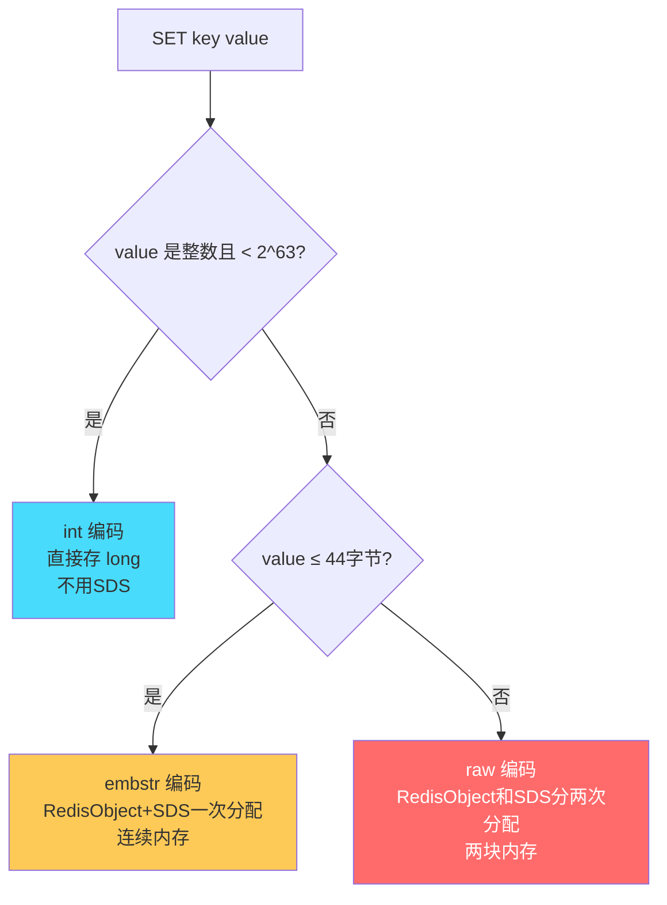

**为什么 embstr 阈值是 44？**
```
RedisObject: 16 bytes (type:4bit + encoding:4bit + lru:24bit + refcount:32bit + ptr:64bit)
sdshdr8:     3 bytes (len:1 + alloc:1 + flags:1)
字符串内容:   ? bytes
\0 结尾:     1 byte
jemalloc 分配 64 字节对齐(最小分配单位)

64 - 16 - 3 - 1 = 44 字节 ← embstr 最大长度
```

> 🟡 **加分**：embstr 只需一次内存分配（RedisObject 和 SDS 连续存储），CPU cache 友好（一次缓存行就能读到整个对象）。但 embstr 是只读的——任何修改操作（如 APPEND）会先转成 raw 再修改，因为连续内存无法原地扩展。

**三种编码的内存占用对比（存储数字 "12345"）**：
```
int 编码:
  RedisObject(16字节) → ptr 直接存整数值12345(不分配额外内存)
  总占用: 16字节

embstr 编码(如存 "hello"):
  RedisObject(16字节) + sdshdr8(3字节) + "hello"(5字节) + '\0'(1字节) = 25字节
  一次malloc分配,连续内存

raw 编码(如存50字符的字符串):
  RedisObject(16字节) → ptr指向 → sdshdr8(3字节) + 数据(50字节) + '\0'(1字节) = 70字节
  两次malloc,两块内存(RedisObject一块,SDS一块)
```

**int 编码的共享对象优化**：Redis 启动时预先创建了 0~9999 共 10000 个整数对象。当多个 key 的 value 是这个范围内的整数时，它们共享同一个 RedisObject（引用计数 refcount > 1），不重复分配内存。这就是为什么小整数计数器非常省内存。

### 2.5 🟠 QuickList：List 的底层实现（Redis 7）

**为什么不直接用双向链表或纯 listpack？**

| 方案 | 问题 |
|------|------|
| 纯双向链表 | 每个节点需要 prev+next 两个指针(16字节)，元素小时指针开销比数据还大 |
| 纯 listpack(ziplist) | 连续内存，中间插入需要 memmove 整块数据，超过一定大小后极慢 |
| ==QuickList(折中)== | 多个 listpack 用双向链表串起来，兼顾内存和性能 |

```
QuickList 结构:
┌──────────┐    ┌──────────┐    ┌──────────┐
│listpack-1│<-->│listpack-2│<-->│listpack-3│
│[A,B,C,D] │    │[E,F,G,H] │    │[I,J]     │
│(连续内存) │    │(连续内存) │    │(连续内存) │
└──────────┘    └──────────┘    └──────────┘
每个 listpack 最多存 list-max-listpack-size 个元素(默认-2=8KB)
```

```c
// quicklist.h - 核心结构
typedef struct quicklist {
    quicklistNode *head;      // 链表头
    quicklistNode *tail;      // 链表尾
    unsigned long count;      // 所有 listpack 的元素总数
    unsigned long len;        // quicklistNode 节点数
    signed int fill : QL_FILL_BITS;  // 每个 listpack 的大小限制
    unsigned int compress : QL_COMP_BITS; // 两端不压缩的节点数
} quicklist;

typedef struct quicklistNode {
    struct quicklistNode *prev;  // 前驱
    struct quicklistNode *next;  // 后继
    unsigned char *entry;        // 指向 listpack
    size_t sz;                   // listpack 总字节数
    unsigned int count : 16;     // listpack 内元素数
    unsigned int encoding : 2;   // RAW=1 或 LZF压缩=2
} quicklistNode;
```

> 🟠 **compress 参数的作用**：`list-compress-depth 1` 表示链表两端各保留 1 个节点不压缩（因为 LPUSH/RPOP 频繁访问两端），中间节点用 LZF 算法压缩节省内存。适合"两头热、中间冷"的访问模式。

**QuickList 的操作复杂度分析**：
| 操作 | 复杂度 | 原理 |
|------|--------|------|
| LPUSH/RPUSH | O(1) | 直接在头/尾listpack追加 |
| LPOP/RPOP | O(1) | 从头/尾listpack删除 |
| LINDEX n | O(N) | 从头遍历到第n个（跨多个listpack节点） |
| LINSERT | O(N) | 找到位置后在listpack中间插入(可能触发分裂) |
| LLEN | O(1) | QuickList.count字段直接返回 |

**fill 参数（list-max-listpack-size）的含义**：
- 正数（如64）：每个listpack最多存64个元素
- 负数（默认-2）：按字节限制——-1=4KB, -2=8KB, -3=16KB, -4=32KB, -5=64KB
- 为什么默认-2(8KB)？一个内存页通常4KB，8KB=2个内存页，CPU预取友好且不至于单个listpack过大导致中间插入时memmove开销过大

### 2.6 🟠 IntSet：Set 的紧凑整数编码

```c
// intset.h
typedef struct intset {
    uint32_t encoding;  // 编码方式: INTSET_ENC_INT16/INT32/INT64
    uint32_t length;    // 元素个数
    int8_t contents[];  // ★ 有序整数数组(紧凑排列,无指针)
} intset;
```

**IntSet 的升级机制**（不可逆）：

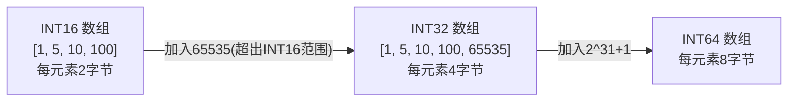

**为什么升级不可降级？**
- 降级需要遍历所有元素判断最大值是否能用小编码 → O(N) 开销
- 升级只在 ADD 时偶尔发生，频率极低
- 不降级避免了"升级→降级→再升级"的抖动

**IntSet 查找复杂度**：O(logN) 二分查找（有序数组）。当元素不超过 128 个时，二分查找 < 7 次比较，比 HashTable 的哈希计算还快且无哈希冲突。


### 2.7 🔴 ZSet 跳表（SkipList）源码级理解

**为什么选跳表而不是红黑树？**

| 维度 | 红黑树 | 跳表 |
|------|--------|------|
| 查找复杂度 | O(logN) | O(logN) |
| 范围查询 | 需要中序遍历(递归/栈) | ==天然有序链表，直接遍历next指针== |
| 实现复杂度 | 极复杂（左旋/右旋/染色，代码500+行） | ==简单（随机层级+链表，代码100行）== |
| 内存占用 | 每节点3指针+颜色位 | 平均每节点1.33指针(p=0.25) |
| 并发友好 | 需要复杂锁(插入可能旋转子树) | ==局部锁/CAS 更容易(只修改相邻节点)== |
| 调试友好 | 很难直观打印结构 | ==直接打印各层链表== |

> 🔴 **antirez 的选择逻辑**：Redis 的 ZRANGEBYSCORE、ZRANGEBYLEX 等范围操作是核心场景。跳表的范围查询只需要定位起点后沿 Level 0 链表遍历，而红黑树需要反复找中序后继。对于"排行榜取 Top 10"这种典型操作，跳表代码简洁且高效。

**跳表结构图**：
```
Level 4:  HEAD ──────────────────────────────────────── 9 ──── NIL
Level 3:  HEAD ────────────── 4 ────────────────────── 9 ──── NIL
Level 2:  HEAD ──── 2 ─────── 4 ──── 6 ──────────── 9 ──── NIL
Level 1:  HEAD ─ 1 ─ 2 ─ 3 ─ 4 ─ 5 ─ 6 ─ 7 ─ 8 ─ 9 ──── NIL

查找 score=7 的路径:
  从 HEAD Level4 → 9(太大,下降)
  → Level3 → 4 → 9(太大,下降)
  → Level2 → 6 → 9(太大,下降)
  → Level1 → 7 ✅ 找到!
  总比较次数: ~logN
```

**Redis 跳表源码关键结构**：
```c
// server.h
typedef struct zskiplistNode {
    sds ele;                          // member 值(SDS字符串)
    double score;                     // ★ 分数(排序依据)
    struct zskiplistNode *backward;   // 后退指针(只有Level 0有,用于ZREVRANGE)
    struct zskiplistLevel {
        struct zskiplistNode *forward; // 前进指针
        unsigned long span;            // ★ 跨度(到forward节点跨过多少元素,用于ZRANK)
    } level[];                         // 柔性数组，层级数随机决定
} zskiplistNode;

typedef struct zskiplist {
    struct zskiplistNode *header, *tail;
    unsigned long length;             // 节点数量
    int level;                        // 当前最大层级
} zskiplist;
```

**span 字段的精妙用途——O(logN) 计算 RANK**：
```
查找 member="E" 的排名:
  从 HEAD 沿查找路径走，累加每一步的 span 值
  例: HEAD(span=2) → NodeA(span=3) → NodeE
  rank = 2 + 3 = 5 (E 是第 5 个元素)

如果没有 span，计算 RANK 需要从头遍历 → O(N)
```

**随机层级算法**：
```c
// t_zset.c - zslRandomLevel
#define ZSKIPLIST_MAXLEVEL 32    // 最大32层(支持2^32=42亿个元素)
#define ZSKIPLIST_P 0.25         // 晋升概率 25%

int zslRandomLevel(void) {
    int level = 1;
    // 每次有 25% 概率升一层
    while ((random()&0xFFFF) < (ZSKIPLIST_P * 0xFFFF))
        level += 1;
    return (level < ZSKIPLIST_MAXLEVEL) ? level : ZSKIPLIST_MAXLEVEL;
}
// 统计期望: Level 1=100%, Level 2=25%, Level 3=6.25%, Level 4=1.56%...
// 平均每个节点 1/(1-0.25) = 1.33 个指针
```

> 🟠 **为什么 p=0.25 而不是 0.5？**
> - p=0.5 时平均每个节点 2 个指针，查找比较次数最少但内存大
> - p=0.25 时平均每个节点 1.33 个指针，==省33%内存==，查找多约 1 次比较(可忽略)
> - Redis 选择了内存效率优先（内存数据库的核心诉求）

**ZSet 为什么同时用 SkipList + HashTable？**

```c
// server.h - ZSet 的底层结构(大数据量时)
typedef struct zset {
    dict *dict;       // HashTable: member → score (O(1) 查分数)
    zskiplist *zsl;   // SkipList:  按 score 排序 (O(logN) 范围查询)
} zset;
```

| 操作 | 用哪个结构 | 复杂度 | 如果只有跳表 |
|------|-----------|--------|-------------|
| ZSCORE key member | dict | O(1) | 需要遍历跳表找member → O(N) |
| ZRANK key member | zskiplist (span累加) | O(logN) | O(logN) |
| ZRANGE key 0 10 | zskiplist (从头遍历) | O(logN + M) | O(logN + M) |
| ZADD key score member | 两个都写 | O(logN) | O(logN) |
| ZREM key member | 两个都删 | O(logN) | 找member需O(N) |

> **结论**：dict 保证了 ZSCORE 和 ZREM 的 O(1) 定位能力，跳表保证了范围操作和排名计算。两者互补，空间换时间。


### 2.8 🟠 ListPack：ziplist 的继任者

**ziplist 的致命缺陷——级联更新**：

ziplist 每个 entry 的 `prevlen` 字段记录前一个 entry 的长度。当前一个 entry 长度 < 254 时 prevlen 用 1 字节，≥ 254 时用 5 字节。

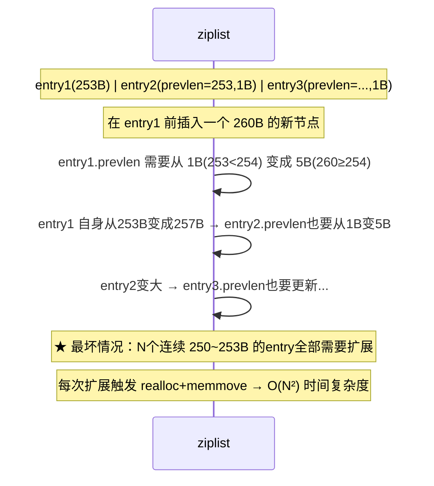

**listpack 的改进**：
```
ziplist entry:  [prevlen | encoding | data]  ← prevlen 依赖前一个节点
listpack entry: [encoding | data | backlen]  ← backlen 只记录自己的总长度

从后向前遍历:
  ziplist:   读当前 entry 的 prevlen → 向前跳 prevlen 字节
  listpack:  读当前 entry 末尾的 backlen → 向前跳 backlen 字节(跳到前一个entry的末尾)
```

**核心区别**：listpack 的 backlen 记录的是**自己**的长度，不依赖邻居。所以任何节点的增删改都不会影响其他节点的元数据 → ==彻底消除级联更新==。

**性能影响的量化**：
- ziplist 级联更新最坏情况：N 个连续 250~253 字节的 entry → 一次中间插入触发 N 次 realloc + N 次 memmove → O(N²)
- listpack 任何操作：只影响被操作的那个 entry → O(1) 元数据更新（但仍需 memmove 后面的数据）
- 实测：1000 个 entry 的 ziplist 在最坏情况下插入耗时 ~10ms；listpack 在相同场景耗时 ~0.1ms（差100倍）

**为什么 Redis 7 才替换而不是更早？**
- listpack 方案在 2017 年就由 antirez 提出（Redis 5.0 开始用于 Stream）
- 但替换 ziplist 涉及大量存量代码（Hash/ZSet/List 的紧凑编码全在用 ziplist）
- Redis 7 做了完整的 API 兼容层替换，确保向后兼容 RDB 文件格式

### 2.9 🟡 数据结构选型决策树

```mermaid
flowchart TD
    A[需求分析] --> B{需要排序/排名?}
    B -->|是| C[ZSet<br/>ZADD+ZRANGE]
    B -->|否| D{需要去重?}
    D -->|是| E{需要交集/并集?}
    E -->|是| F[Set<br/>SINTER/SUNION]
    E -->|否| G{数据是对象(多字段)?}
    G -->|是| H[Hash<br/>HSET/HGET]
    G -->|否| I[Set 或 String]
    D -->|否| J{需要队列语义?}
    J -->|是| K[List(BLPOP)<br/>或 Stream]
    J -->|否| L[String<br/>SET/GET/INCR]

    style C fill:#ff6b6b,color:#fff
    style F fill:#48dbfb
    style H fill:#feca57
```

**记忆口诀（场景→结构）**：
```
计数限流   → String INCR/DECR (原子操作,天然线程安全)
分布式锁   → String SET NX PX (原子设置+判断+过期)
对象存储   → Hash (用户资料、商品信息——部分读写O(1))
社交关系   → Set (共同好友SINTER、推荐SDIFF、判断关注SISMEMBER O(1))
排行榜     → ZSet (ZADD score + ZREVRANGE——跳表O(logN)插入+范围O(M))
延迟队列   → ZSet (score=到期时间戳，ZRANGEBYSCORE 0 now 取到期任务)
消息队列   → Stream (5.0+,消费组+ACK+持久化) 或 List BLPOP(简单场景)
位统计     → Bitmap (签到/在线状态——512MB可表示42亿个bit)
基数统计   → HyperLogLog (UV/独立IP——固定12KB,误差0.81%)
地理位置   → GeoHash (附近的人——底层是ZSet,score是52位geohash值)
```

---

## 3. 持久化：RDB / AOF / 混合

### 3.1 设计动机：为什么内存数据库需要持久化？

**没有持久化的后果**：
```
Redis 重启 → 内存清空 → 所有缓存丢失
  → 所有请求打到 DB → DB 被打挂 → 缓存雪崩！
```

**如果 Redis 只是纯缓存（可丢失），还需要持久化吗？**
- 即使是纯缓存，冷启动时缓存全空会导致"雪崩"
- 有持久化可以快速恢复，避免 DB 被打挂的过渡期
- 所以**生产环境几乎都要开启持久化**，区别只是保证程度

**两种持久化哲学**：
| 哲学 | 实现 | 类比 | 核心trade-off |
|------|------|------|-------------|
| "拍照片" | RDB 快照 | 定期给整个内存拍一张全量照片 | 恢复快但可能丢数据 |
| "记日记" | AOF 日志 | 每个写操作都记一笔流水账 | 数据全但恢复慢 |

**为什么不能只用一种？**
- 只用 RDB：快照间隔内的写入全丢（默认 5 分钟触发一次 bgsave → 最多丢 5 分钟数据）
- 只用 AOF：文件体积大（所有历史命令），恢复时逐条回放极慢（10GB AOF 恢复可能要几分钟）
- 混合模式（4.0+）：RDB 做全量（体积小恢复快）+ AOF 做增量（补全 RDB 后到现在的命令）→ 兼得二者优势


### 3.2 🔴 三种持久化对比

| 维度 | RDB | AOF | 混合(4.0+) |
|------|-----|-----|------------|
| 文件格式 | `dump.rdb` 二进制压缩 | `appendonly.aof` 文本命令 | RDB头 + AOF尾 |
| 恢复速度 | ⭐⭐⭐⭐⭐ 快(直接加载二进制) | ⭐⭐ 慢(逐条回放命令) | ⭐⭐⭐⭐ 较快 |
| 文件大小 | ⭐⭐⭐⭐⭐ 最小(LZF压缩) | ⭐⭐ 最大(命令文本冗余) | ⭐⭐⭐⭐ 较小 |
| 数据完整性 | ⭐⭐ 可能丢5分钟 | ⭐⭐⭐⭐⭐ 最多丢1秒 | ⭐⭐⭐⭐⭐ 最多丢1秒 |
| fork阻塞 | 有(bgsave) | 有(bgrewriteaof) | 有(重写时) |
| CPU消耗 | 低(只在快照时) | 中(持续写盘) | 中 |
| 推荐用途 | 灾备、迁移、从节点 | 单用不推荐 | ==⭐ 生产首选== |

### 3.3 🔴 RDB 原理：bgsave + COW（Copy-On-Write）

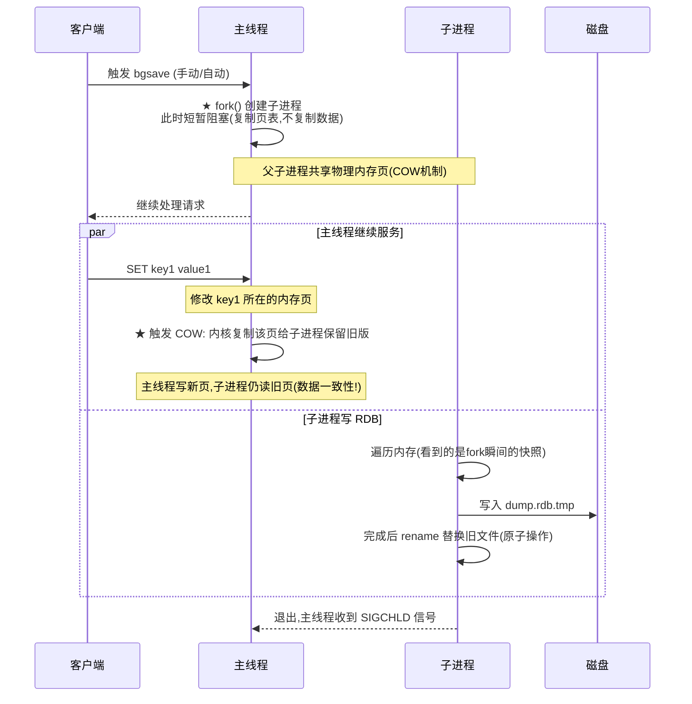

**文字总结**：fork() 不复制物理内存，只复制页表（虚拟地址→物理地址的映射表）。父子进程共享同一份物理内存。只有当父进程（主线程）修改某页时，内核才会复制那一页给子进程保留旧数据——这就是 Copy-On-Write。所以子进程看到的永远是 fork 瞬间的内存快照，保证了 RDB 数据一致性。

**COW 的底层机制详解**：
```
fork() 时发生了什么:
  1. 内核创建子进程的进程描述符(task_struct)
  2. 复制父进程的页表(虚拟地址→物理地址映射) ← 页表本身很小(几MB)
  3. ★ 将父子进程的所有页表项都标记为"只读"(Read-Only)
  4. 不复制任何物理内存页 ← 这就是为什么fork很快

父进程写入某页时发生了什么:
  1. CPU 尝试写入一个"只读"页 → 触发 Page Fault(缺页异常)
  2. 内核的缺页处理程序检查: 这是COW页(有多个进程映射)
  3. 内核分配一个新物理页,复制旧页内容到新页
  4. 更新父进程的页表项指向新页(标记为可写)
  5. 子进程的页表项仍指向旧页(数据不变,保持fork瞬间快照)
  6. 父进程在新页上执行写入 → 成功

关键洞察: COW的开销和"bgsave期间被修改的key数量"成正比,而非总key数量
```

**COW 的代价与监控**：
| 场景 | 额外内存开销 | 原因 |
|------|------------|------|
| 纯读业务(bgsave期间无写) | 几乎 0 | 只复制页表(几MB) |
| 高写入场景(50%key被修改) | 最多 ==2倍内存== | 所有修改页都要复制 |
| 一般场景(10%key被修改) | 额外 10%~20% | 只有被写的页复制 |

```bash
# 监控 COW 开销
INFO persistence
# latest_fork_usec: 上次 fork 耗时(微秒)
# 经验: 1GB 内存 ≈ fork 20ms, 10GB ≈ 200ms, 30GB ≈ 600ms+
```

> 🟢 **避坑**：大内存实例（30GB+）fork 时复制页表耗时可达 ==数百毫秒甚至秒级==。
> - **建议**：单实例内存不超过 10GB（fork < 200ms）
> - **Linux 优化**：确保 `vm.overcommit_memory=1`（允许 fork 成功）
> - **监控**：`INFO` 中的 `latest_fork_usec` 字段 > 500ms 需要告警


### 3.4 🔴 AOF 三种刷盘策略（深度分析）

**AOF 写入的两步过程**：
```
用户空间                    内核空间                    硬件
┌──────────┐  write()    ┌──────────┐  fsync()    ┌──────┐
│ aof_buf  │ ─────────→ │Page Cache│ ─────────→ │ 磁盘  │
│(Redis内存)│ (μs级,快)   │(内核内存) │ (ms级,慢)   │      │
└──────────┘             └──────────┘             └──────┘
                          ↑ 断电丢失!               ✅ 持久化
```

**关键理解**：`write()` 只是把数据从用户空间拷贝到内核 Page Cache，如果此时断电，Page Cache 中未刷盘的数据会丢失。`fsync()` 强制将 Page Cache 写入磁盘，等磁盘确认后才返回。

| 策略 | `write()` | `fsync()` | 丢失风险 | 性能 |
|------|-----------|-----------|---------|------|
| `always` | 每条命令 | 每条命令 | 几乎不丢 | 最差(~1000 QPS) |
| `everysec` ⭐ | 每条命令 | 每秒一次(bio后台线程) | ==最多丢1秒== | 中(~10万 QPS) |
| `no` | 每条命令 | OS 决定(~30s) | 可能丢30秒 | 最好(~12万 QPS) |

> 🟠 **everysec 是怎么做到的**：主线程每次执行完写命令后，调用 `write()` 将命令追加到 Page Cache（很快，不阻塞）。后台 bio_aof_fsync 线程每秒调用一次 `fsync()`（慢，但不影响主线程）。所以主线程不会被 fsync 阻塞，性能接近不开 AOF。

### 3.5 🟠 AOF 重写机制深入

**为什么需要重写？**
```
AOF 持续追加的问题：
  SET counter 1    →   文件中有 100 条 INCR counter
  INCR counter          但最终效果等价于一条 SET counter 101
  INCR counter          文件越来越大(几十GB)
  ...                   恢复时回放 100 条命令(几十秒)
  INCR counter

重写后：
  SET counter 101  →   1 条命令等价(文件从10GB→几百MB)
                       恢复从几十秒→几秒
```

**重写流程**：
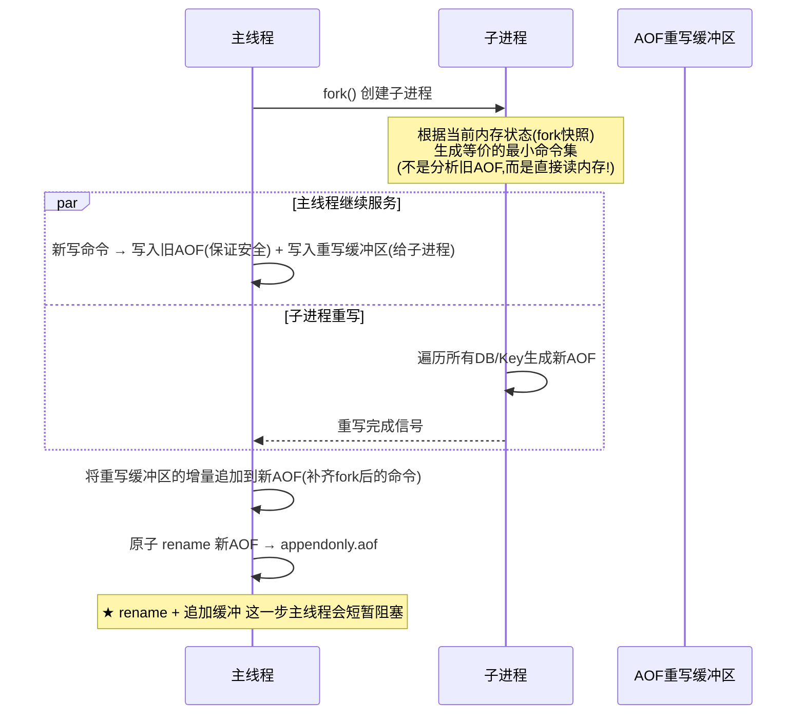

**文字总结**：重写不是"压缩旧AOF文件"，而是子进程直接根据内存中的数据状态，生成最精简的命令集。比如一个 Hash 有 1000 个 field，不管历史上 HSET 了多少次，重写后就是一条 `HSET key f1 v1 f2 v2 ...`。

**为什么重写时"新写命令要同时写两个地方"？**
- 写旧 AOF 文件：==安全保障==。如果重写过程中 Redis 崩溃，旧 AOF 仍然完整可恢复（新 AOF 还没写完是不完整的）
- 写重写缓冲区：==完整性保障==。子进程基于 fork 瞬间的快照生成新 AOF，fork 后到重写完成之间的写命令必须追加到新 AOF 尾部，否则新 AOF 缺少这段数据

**为什么用 rename 原子替换？**
- 如果直接覆写旧文件，写到一半崩溃 → 旧 AOF 被破坏且新 AOF 不完整 → 数据丢失
- rename 是文件系统的原子操作（POSIX 保证）：要么成功（旧文件立即被新文件替代），要么失败（旧文件不变）
- 不存在"写到一半"的中间状态

> 🟢 **线上事故：AOF 重写导致主从延迟飙升**
> - **场景**：32GB Redis 实例，AOF 重写时 fork 占用 1.5s，期间主线程阻塞
> - **现象**：客户端请求超时，从节点复制延迟突增
> - **修复**：
>   1. 降低 `auto-aof-rewrite-percentage` 从 100 到 50（更频繁但每次更快，因为增量少）
>   2. 开启 `no-appendfsync-on-rewrite yes`（重写期间主线程不等fsync，降低磁盘IO竞争）
>   3. 将实例拆分为多个小实例（每个 ≤ 8GB，fork < 200ms）

### 3.6 🔴 混合持久化（4.0+生产首选）

```bash
# redis.conf
aof-use-rdb-preamble yes   # ★ 开启混合持久化
```

**混合文件结构**：
```
appendonly.aof 文件内容:
┌──────────────────────────────────────────┐
│          RDB 格式数据(二进制压缩)          │  ← 全量快照,恢复时直接加载(秒级)
├──────────────────────────────────────────┤
│          AOF 格式命令(文本)               │  ← 重写后到现在的增量(通常只有几秒的命令)
└──────────────────────────────────────────┘
```

**恢复流程**：
1. 检测文件头是否是 `REDIS` 魔数 → 是 RDB 格式头部
2. 加载 RDB 部分（快速恢复绝大部分数据，秒级）
3. 回放 AOF 尾部（补齐重写后的增量，通常只有几百条命令）
4. 恢复完成

**为什么混合模式是最优解？**
| 维度 | 纯RDB | 纯AOF | 混合 |
|------|-------|-------|------|
| 恢复速度 | 1秒(直接加载) | 60秒(回放所有命令) | ==2秒==(加载RDB+少量回放) |
| 数据安全 | 丢5分钟 | 丢1秒 | ==丢1秒==(AOF尾部保证) |
| 文件大小 | 最小 | 最大 | 较小(RDB压缩+少量AOF) |

> 🔴 **生产配置模板**：
```bash
# 持久化最佳配置
appendonly yes                       # 开启AOF
appendfsync everysec                 # 每秒刷盘(性能与安全平衡)
aof-use-rdb-preamble yes            # ★ 混合持久化
auto-aof-rewrite-percentage 100     # 文件增长100%时触发重写
auto-aof-rewrite-min-size 64mb      # 文件至少64MB才触发重写
no-appendfsync-on-rewrite yes       # 重写期间不阻塞fsync
rdbcompression yes                  # RDB使用LZF压缩
rdbchecksum yes                     # RDB校验(防止文件损坏)
```

---

## 4. 过期策略与内存淘汰

### 4.1 设计动机：为什么需要过期策略？

**问题**：Redis 作为缓存使用时，不可能无限增长。需要两个机制：
1. **过期删除**：key 设了 TTL，到期后怎么清理？
2. **内存淘汰**：内存满了（没设过期的 key 也占着），怎么腾空间？

**如果没有过期策略会怎样？**
- 所有设了 TTL 的 key 到期后仍占内存 → 内存只增不减
- 最终 maxmemory 满了 → 触发淘汰策略（可能淘汰还没过期的热点key）
- 或者报错（noeviction 策略下所有写入失败）

### 4.2 🔴 过期信息存在哪？— expires 字典

```c
// server.h - 每个DB有两个字典
typedef struct redisDb {
    dict *dict;       // ★ 主字典: key → value (所有key都在这里)
    dict *expires;    // ★ 过期字典: key → 过期时间戳(毫秒)
    // ...
} redisDb;
```

**关键设计**：过期信息不是存在 value 里面，而是单独一个 dict 存储。这样：
- 判断一个 key 是否过期：O(1) 在 expires 字典查
- 不影响 value 的编码（value 不需要额外字段）
- expires 和 dict 共享 key 的 SDS 指针（不复制，节省内存）


### 4.3 🔴 过期 key 的三种处理机制

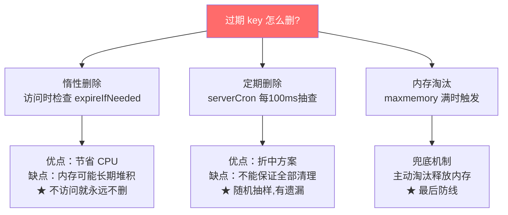

**为什么不用"到期立即删除"（定时器方案）？**
- 每个设了 TTL 的 key 创建一个定时器 → 百万级 key 就有百万个定时器
- 定时器用最小堆/时间轮管理，到期时触发删除
- 问题：==CPU 开销极大==（管理百万定时器 + 高频触发回调），且删除操作可能抢占主线程
- Redis 选择了"惰性 + 定期"的组合：CPU 友好，内存略有浪费但可接受

**三种策略的设计哲学对比**：
```
定时删除(未采用): 时间换空间 — 最快释放内存,但CPU开销大(定时器管理)
惰性删除:       空间换时间 — 完全不主动删,访问时顺带检查(CPU零额外开销)
定期删除:       折中方案   — 定时抽样删除一批(CPU可控,内存也不至于太膨胀)

Redis 实际方案 = 惰性删除(被动) + 定期删除(主动限量) → 平衡CPU和内存
```

**惰性删除的"内存泄漏"风险**：
如果大量 key 设了 TTL 但再也没人访问（如用户注册验证码），惰性删除永远不会触发 → 这些 key 成为"幽灵 key"占着内存。这就是为什么必须配合定期删除——它每100ms主动抽查一批，发现过期的就删。两者配合才能保证"无主过期key"不会无限累积。

**惰性删除源码**：
```c
// db.c - expireIfNeeded (每次访问key时调用)
int expireIfNeeded(redisDb *db, robj *key) {
    if (!keyIsExpired(db, key)) return 0;  // 没过期，正常返回
    
    // ★ 过期了！
    if (server.masterhost != NULL) return 1;  // slave不主动删(等master同步DEL)
    
    // 删除key + 传播DEL命令给从节点 + 触发keyspace通知
    deleteExpiredKeyAndPropagate(db, key);
    return 1;
}
```

**定期删除源码**：
```c
// expire.c - activeExpireCycle（serverCron 每100ms调用一次）
void activeExpireCycle(int type) {
    for (j = 0; j < dbs_per_call; j++) {
        do {
            // 每次随机取 20 个设了过期的 key
            num = dictGetSomeKeys(db->expires, keys, ACTIVE_EXPIRE_CYCLE_LOOKUPS_PER_LOOP);
            
            for (i = 0; i < num; i++) {
                if (activeExpireCycleTryExpire(db, keys[i], now)) {
                    expired++;  // 过期了就删
                }
            }
            // ★ 如果过期比例 > 25%，继续抽查（说明过期key很多）
            // 如果 < 25%，说明大部分key还活着，停止（节省CPU）
        } while (expired > ACTIVE_EXPIRE_CYCLE_LOOKUPS_PER_LOOP / 4);
        
        // 超时保护: 不能超过 timelimit(默认25ms)，避免影响主线程
        if (timelimitExceeded()) break;
    }
}
```

> 🟠 **关键理解**：定期删除是**随机采样+概率清理**的自适应算法：
> - 过期 key 多时：连续循环多次，快速清理
> - 过期 key 少时：一轮就退出，几乎不消耗 CPU
> - 有超时保护（25ms），不会无限占用主线程

### 4.4 🔴 8 种内存淘汰策略（源码级理解）

```bash
# redis.conf
maxmemory 4gb                    # 设置内存上限
maxmemory-policy allkeys-lru     # ★ 生产推荐
```

| 策略 | 范围 | 算法 | 适用场景 |
|------|------|------|---------|
| `noeviction` | - | 不淘汰,写入直接报错OOM | ==默认==,仅不能丢数据时 |
| `allkeys-lru` ⭐ | 所有key | 近似LRU | ==通用缓存,推荐== |
| `allkeys-lfu` | 所有key | 近似LFU | 热点明显(Redis 4.0+) |
| `allkeys-random` | 所有key | 随机 | 无明显访问规律 |
| `volatile-lru` | 有TTL的key | 近似LRU | 永久key+临时key混存 |
| `volatile-lfu` | 有TTL的key | 近似LFU | 同上,热点区分 |
| `volatile-random` | 有TTL的key | 随机 | 同上 |
| `volatile-ttl` | 有TTL的key | TTL最短优先 | 临近过期的优先淘汰 |

### 4.5 🟠 LRU 的近似实现（为什么不用真正的LRU链表？）

**真正LRU的问题**：
```
标准 LRU 实现: 双向链表 + HashMap
  - 每次 GET/SET → 把节点移到链表头部(最近访问)
  - 淘汰时 → 删除链表尾部(最久没访问)
  
Redis 如果用真LRU:
  - 百万级 key：每个节点 2个指针(prev+next) = 16字节/key → 额外16MB
  - 每次命令都要操作链表(移动节点) → 额外 CPU 开销
  - 链表操作需要锁(如果将来多线程) → 复杂度增加
```

**Redis 的近似 LRU**——用 24bit 时间戳 + 随机采样：
```c
// server.h - RedisObject 结构(每个value都是这个)
typedef struct redisObject {
    unsigned type:4;       // 数据类型(string/list/hash/set/zset)
    unsigned encoding:4;   // 编码方式(int/embstr/raw/...)
    unsigned lru:LRU_BITS; // ★ 24 bit! 记录最后访问时间(秒级精度)
    int refcount;          // 引用计数
    void *ptr;             // 指向实际数据
} robj;
// LRU_BITS = 24, 可以表示 2^24 秒 ≈ 194 天的时间循环
```

**采样淘汰流程**：
```mermaid
flowchart TD
    A[写入时发现内存超限] --> B[随机采样 N 个 key<br/>N = maxmemory-samples 默认5]
    B --> C[比较它们的 lru 字段(最后访问时间)]
    C --> D[淘汰 lru 最小的那个(最久没访问)]
    D --> E{内存够了?}
    E -->|否| B
    E -->|是| F[完成,继续执行写命令]
```

> 🟡 **淘汰池(eviction pool)优化(Redis 3.0+)**：维护一个大小为 16 的候选池。每次采样的 key 与池中已有的比较，只保留最应该被淘汰的。相当于多轮采样的累积效果，准确率接近真正 LRU（实测 maxmemory-samples=10 时几乎和真 LRU 一致）。

**淘汰池工作原理详解**：
```
淘汰池 = 一个大小16的有序数组(按idle时间排序)

触发淘汰时:
  1. 随机采样 maxmemory-samples(5) 个key
  2. 计算每个key的idle时间(当前时间 - lru字段记录的最后访问时间)
  3. 尝试将这5个key插入淘汰池:
     - 如果pool未满 → 直接插入(按idle时间排序)
     - 如果pool已满 → 只有idle时间比池中最小的还大的才能挤进来
  4. 从池中取idle最大的(最久没访问) → 淘汰它
  5. 关键: 池中的key是跨多轮采样累积的!

效果举例:
  第1次采样5个key: idle=[10s, 30s, 5s, 20s, 8s] → 池中最大idle=30s
  第2次采样5个key: idle=[50s, 3s, 15s, 7s, 12s] → 池中最大idle=50s
  ...多轮累积后, 池中保存的就是全局idle最大的那些key → 近似真正LRU

vs 不用池(Redis 2.x):
  每次只从5个采样中选idle最大的 → 小样本偏差大
  淘汰池通过累积多轮采样, 相当于把样本量放大了N倍
```

**maxmemory-samples 值的选择**：
| 值 | 准确度 | CPU开销 | 推荐 |
|----|--------|---------|------|
| 3 | ~85% 接近真LRU | 极低 | 极端性能敏感 |
| 5(默认) | ~92% 接近真LRU | 低 | ==通用推荐== |
| 10 | ~99% 接近真LRU | 中 | 对淘汰准确度要求高 |
| 20+ | ~100% | 高(每次采样20个key) | 几乎不必要 |

### 4.6 🟠 LFU 的对数计数器（Redis 4.0+）

**LRU 的不足**：只看"最近一次"访问时间，不看"访问频率"。一个历史热点数据很久没访问一次后就可能被淘汰，而一个只访问过一次的冷数据因为"最近"访问过而留下。

**LFU 编码**（复用 lru 字段的 24 bit）：
```
24 bit = 高16位(ldt) + 低8位(logc)
  ldt: Last Decrement Time — 上次衰减时间(分钟级精度)
  logc: Logarithmic Counter — 对数计数器(0~255)
```

**为什么用对数计数而不是线性计数？**
- 8 bit 线性计数最多到 255 → 超高频key无法区分
- 对数计数：logc=255 可以代表约 ==100万次== 访问
- 用概率递增：访问越多，counter 增长越慢（类似"边际递减"）

```c
// 计数器增长(概率增长,不是每次+1)
uint8_t LFULogIncr(uint8_t counter) {
    if (counter == 255) return 255;      // 上限不再增长
    double r = (double)rand()/RAND_MAX;  // 随机数 [0,1)
    double baseval = counter - LFU_INIT_VAL;  // LFU_INIT_VAL = 5(新key初始值)
    if (baseval < 0) baseval = 0;
    double p = 1.0/(baseval * server.lfu_log_factor + 1); // ★ 概率递减!
    // counter越大 → baseval越大 → p越小 → 越难+1
    if (r < p) counter++;
    return counter;
}
```

**衰减机制——避免"旧热点"永远不淘汰**：
```c
// 随时间衰减: 每过 lfu_decay_time 分钟, counter-1
unsigned long LFUDecrAndReturn(robj *o) {
    unsigned long ldt = o->lru >> 8;        // 上次衰减时间
    unsigned long counter = o->lru & 255;    // 当前计数
    // 过了多少个衰减周期
    unsigned long num_periods = LFUTimeElapsed(ldt) / server.lfu_decay_time;
    if (num_periods) counter = (counter > num_periods) ? counter - num_periods : 0;
    return counter;
}
// 效果: 一个 key 如果 1小时 没访问, counter 会从 20 衰减到 14(假设decay_time=10min)
//       最终变成 0,可以被淘汰
```

> 🟠 **LRU vs LFU 决策**：
> | 场景 | 选择 | 原因 |
> |------|------|------|
> | 通用缓存(无明显热点) | allkeys-lru | 简单有效，最近访问的大概率还会访问 |
> | 热点数据明显(电商首页商品) | allkeys-lfu | 频繁访问的商品不会被偶尔的冷数据挤掉 |
> | 定期批量导入(报表数据刷缓存) | allkeys-lru | LFU 批量导入的数据counter一下子涨高,难淘汰 |

### 4.7 🟢 线上事故：volatile-lru 导致数据丢失

> 🟢 **事故还原**：
> - **业务**：某订单服务用 Redis 存两类数据——缓存(有TTL)和业务计数器(无TTL永久)
> - **配置**：`maxmemory-policy volatile-lru`（只淘汰有TTL的key）
> - **问题**：所有缓存key都没设TTL(开发忽略了 EXPIRE)
> - **结果**：内存满了，volatile-lru 找不到任何有TTL的key，==行为等同 noeviction，所有写入直接报错==！
> - **影响**：订单写入全部失败持续 10 分钟
> - **教训**：
>   1. 使用 `allkeys-lru` 更安全（不依赖开发者是否设置TTL）
>   2. 必须有 maxmemory 使用率监控（> 80% 预警）
>   3. 所有缓存key强制设置TTL（代码规范+CodeReview检查）
>   4. volatile-* 策略只适合"明确知道哪些key有TTL"的架构

---


## 5. 分布式锁完整方案

> 📌 本章节的"吃透版"详见 `分布式锁_吃透版_样板.md`，此处为精华摘要+补充内容。

### 5.1 🔴 为什么需要分布式锁？

```
单机锁(synchronized/ReentrantLock) → 只管一个 JVM 内的线程(锁在对象头/AQS)
分布式锁(Redis/ZK/etcd) → 管所有 JVM 实例的线程(锁在共享存储)
```

**核心四要求**：互斥性(同一时刻只一个持有) + 无死锁(TTL兜底) + 容错性(部分节点故障仍可用) + 归属性(unique_value防误删)

### 5.2 🔴 演化史：三代方案

| 代数 | 方案 | 缺陷 | 后果 |
|------|------|------|------|
| ❌ 第一代 | `SETNX` + `EXPIRE` 两条命令 | 非原子，crash后死锁 | SETNX成功后还没EXPIRE就宕机→永久锁 |
| ❌ 第二代 | Lua 脚本包装 | 可行但多余 | Redis 2.6.12已有更优方案 |
| ✅ 第三代 | `SET key value NX PX ms` | ==当前标准== | 一条命令原子完成(单线程保证) |

### 5.3 🔴 核心命令 + Lua释放

```bash
# 加锁(原子: 不存在才设置 + 设过期)
SET lock:order:123 "uuid-abc" NX PX 30000

# 释放锁(Lua保证原子: 检查归属 + 删除)
if redis.call("GET", KEYS[1]) == ARGV[1] then
    return redis.call("DEL", KEYS[1])
else
    return 0
end
```

**为什么释放必须用 Lua 而不能 GET+DEL？** 如果 GET 和 DEL 之间锁恰好过期、被别人获取，你的 DEL 就会误删别人的锁。Lua 脚本在 Redis 单线程中原子执行，GET 和 DEL 之间不可能插入其他命令。

**误删场景的时序还原**：
```
时间线:
  T1: ClientA SET lock "uuid-A" NX PX 30000 → 获得锁
  T2: ClientA 执行业务(超过30s...)
  T3: 锁自动过期(TTL到了) → lock被删
  T4: ClientB SET lock "uuid-B" NX PX 30000 → 获得锁
  T5: ClientA 业务终于完成,准备释放锁

如果用 GET + DEL (非原子):
  T5.1: ClientA GET lock → 返回"uuid-B"(≠"uuid-A") → 正确,不删除 ✅

但是如果:
  T5.1: ClientA GET lock → 返回"uuid-A"(锁还没过期呢,要删除)
  T5.2: ★ 此刻锁恰好过期 + ClientB 拿到锁(在GET和DEL之间!)
  T5.3: ClientA DEL lock → 删除了ClientB的锁! ❌ 互斥性被破坏!

Lua脚本为什么安全:
  GET和DEL在同一个Lua脚本中 → Redis单线程保证执行期间不会有其他命令插入
  → T5.2的场景不可能发生
```

### 5.4 🔴 Redisson 看门狗机制

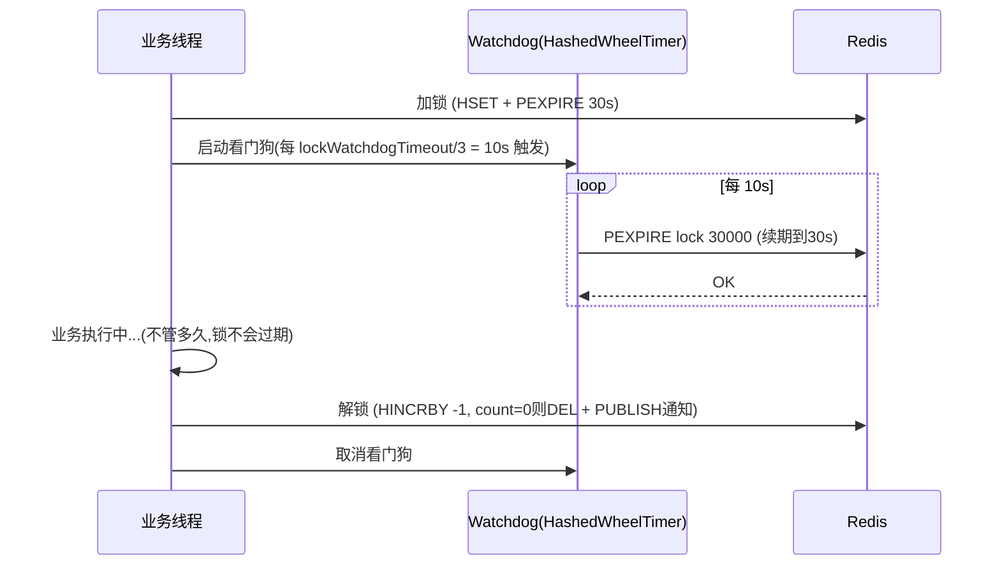

**核心源码要点**：
- 用 **Hash** 而不是 String：`HSET lock:order:123 "uuid:threadId" 1`
- 支持**可重入**：同一线程再次加锁 count+1，unlock时 count-1
- `lock()` 不传超时 → 启用看门狗 ✅
- `lock(10, SECONDS)` 传了超时 → ==不启用看门狗== ⚠️（10s后一定释放）
- **JVM 崩溃时**：看门狗线程随之死亡 → 无人续期 → 30s后锁自动释放 → 不会死锁

**为什么用 Hash 实现可重入而不是简单的 String？**
```
String方案(不可重入):
  SET lock "uuid" NX → 同一线程再次SET NX → 失败!(因为key已存在)
  → 自己持有的锁自己都进不去 → 递归调用/嵌套方法死锁

Hash方案(可重入):
  HSET lock "uuid:threadId" 1       → 加锁(field=线程标识, value=重入次数)
  再次加锁: HINCRBY lock "uuid:threadId" 1  → value变2(重入+1)
  解锁:     HINCRBY lock "uuid:threadId" -1  → value变1
  再解锁:   HINCRBY lock "uuid:threadId" -1  → value变0 → DEL lock
  
  判断是否是自己的锁: HEXISTS lock "uuid:threadId" → 1(是自己的)
```

**看门狗(Watchdog)的实现细节**：
- 底层用 Netty 的 `HashedWheelTimer` 时间轮实现定时任务（比 ScheduledExecutorService 更适合大量短期定时任务）
- 续期间隔 = `lockWatchdogTimeout / 3` = 30s / 3 = 每10s续期一次
- 续期内容：Lua 脚本执行 `PEXPIRE lock 30000`（重新设置30s过期）
- 续期前会检查锁是否还是自己持有（HEXISTS），如果不是就停止续期
- 如果续期的 Redis 调用超时/失败，下一个10s还会再试——只要 JVM 还活着就一直续

### 5.5 🟠 主从切换丢锁问题

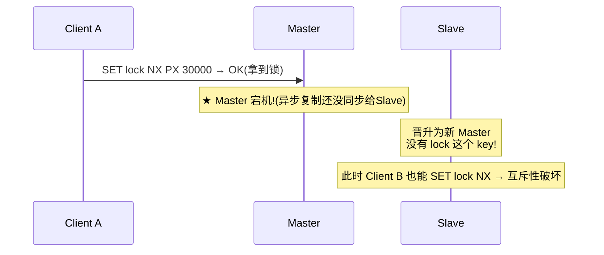

**概率与应对**：
- 概率：主从复制延迟(1~10ms) × Master宕机概率 ≈ 百万分之一
- 一般业务（防重复提交）：==可接受==，加 DB 唯一索引兜底
- 金融强一致：==不可接受==，改用 ZK/etcd（CP系统，写入需过半确认）

### 5.6 🔴 Redis锁 vs ZK锁 vs etcd锁 决策

| 维度 | Redis(Redisson) | ZooKeeper | etcd |
|------|----------------|-----------|------|
| 一致性 | AP(可能丢锁) | ==CP(强一致)== | ==CP(强一致)== |
| 性能 | 10万+/s | 1万/s | 3万/s |
| 锁释放 | TTL过期 | Session断开自动释放 | Lease过期 |
| 公平性 | 非公平(抢占) | ==公平(顺序节点)== | 公平(Revision) |
| 适用 | 高并发容忍极小概率丢锁 | 强一致、公平锁 | K8s生态 |

**决策树**：
```
需要强一致(金融/绝对不能重复)? → 是 → ZK/etcd
                             → 否 → Redis + DB兜底(乐观锁/唯一索引)
```

---

## 6. 缓存三大问题（穿透/击穿/雪崩）

### 6.1 🔴 一图概览

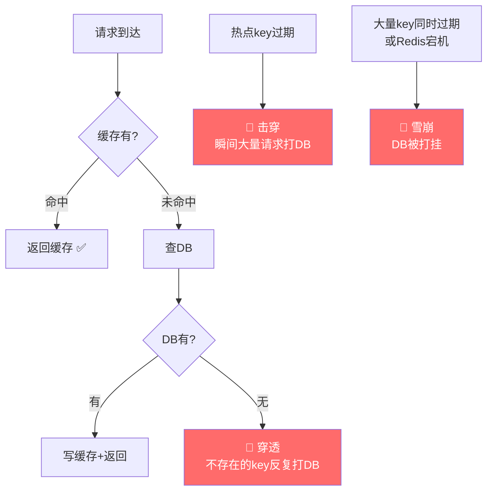

**三者核心区别**：
| 问题 | 本质 | 特征 |
|------|------|------|
| 穿透 | 数据**根本不存在** | 同一个不存在的key被反复请求 |
| 击穿 | 数据存在但**热点key过期** | 单个key瞬间大量请求 |
| 雪崩 | **大面积**缓存失效 | 大量key同时过期或Redis宕机 |


### 6.2 🔴 缓存穿透 — 深度剖析

**定义**：请求的 key 在缓存和 DB 中都不存在，每次都穿透到 DB。

**攻击场景**：恶意用户用 `id=-1` 或随机UUID 大量请求，绕过缓存直接打DB。

**解决方案对比**：

| 方案 | 原理 | 优点 | 缺点 | 适用 |
|------|------|------|------|------|
| 空值缓存 | DB查不到也缓存null(短TTL 5min) | 简单直接 | 大量不同key会撑爆缓存 | 正常业务偶尔穿透 |
| ==布隆过滤器== ⭐ | 所有合法ID预加载到BloomFilter | 高效O(K),内存极小 | 有误判(~1%),不能删除 | 恶意攻击防护 |
| 接口校验+限流 | 参数合法性、签名、IP限流 | 根本防护 | 需要前端配合 | API网关层 |

**布隆过滤器原理**：
- 本质：一个 bit 数组(m bits) + K 个哈希函数
- 添加元素：K 个哈希函数分别计算位置，将这些位置的 bit 置 1
- 查询元素：K 个位置都是 1 → "可能存在"；有一个是 0 → "一定不存在"
- 误判原因：不同元素的哈希值可能重合（bit 被多个元素共用）

**布隆过滤器工作示意**：
```
假设 m=16(16个bit), K=3(3个哈希函数)

添加元素 "user:1001":
  hash1("user:1001") % 16 = 3  → bit[3] = 1
  hash2("user:1001") % 16 = 7  → bit[7] = 1
  hash3("user:1001") % 16 = 11 → bit[11] = 1

  bit数组: [0,0,0,1,0,0,0,1,0,0,0,1,0,0,0,0]
                 ↑           ↑         ↑

查询 "user:9999"(不存在):
  hash1("user:9999") % 16 = 3  → bit[3] = 1 ✓
  hash2("user:9999") % 16 = 5  → bit[5] = 0 ✗ → 一定不存在!
  → 直接拒绝,不查DB

查询 "user:2222"(不存在但误判):
  hash1("user:2222") % 16 = 3  → bit[3] = 1 ✓ (被user:1001设置的)
  hash2("user:2222") % 16 = 7  → bit[7] = 1 ✓ (被user:1001设置的)
  hash3("user:2222") % 16 = 11 → bit[11]= 1 ✓ (被user:1001设置的)
  → 三个位都是1 → 判断"可能存在" → 放行查DB → DB也没有 → 误判!
```

> 🔴 **核心语义**：
> - 布隆过滤器说"不存在" → ==一定不存在==（无漏判）—— 可以安全拒绝
> - 布隆过滤器说"存在" → ==可能存在==（有误判，概率可控）—— 放过去查DB

**误判率公式**：`p ≈ (1 - e^(-kn/m))^k`，其中 n=元素数, m=bit数, k=哈希函数数。通常 m/n=10(每元素10bit) + k=7 时，误判率约 0.82%。

### 6.3 🔴 缓存击穿 — 互斥锁 + 逻辑过期两种方案

**定义**：单个热点 key 突然过期，瞬间大量请求打到 DB。

**方案1：互斥锁（强一致,可能等待）**：
```java
public Object queryWithMutex(String key) {
    Object value = redis.get(key);
    if (value != null) return value;

    // 尝试获取互斥锁
    String lockKey = "lock:rebuild:" + key;
    boolean locked = redis.opsForValue().setIfAbsent(lockKey, "1", 10, TimeUnit.SECONDS);
    
    if (locked) {
        try {
            // 双重检查(获取锁后再查一次,可能已被其他线程重建)
            value = redis.get(key);
            if (value != null) return value;
            
            value = db.query(key);  // 查DB
            redis.set(key, value != null ? value : "NULL", 30, TimeUnit.MINUTES);
            return value;
        } finally {
            redis.delete(lockKey);
        }
    } else {
        Thread.sleep(50);          // 没抢到锁,短暂等待
        return queryWithMutex(key); // 递归重试(获取其他线程重建的缓存)
    }
}
```

**方案2：逻辑过期（高可用,返回旧数据）**：
```java
// 缓存永不真正过期(TTL=-1),在value内部存逻辑过期时间
public Object queryWithLogicalExpire(String key) {
    CacheData cacheData = redis.get(key);
    if (cacheData == null) return null;
    
    if (cacheData.getExpireTime().isAfter(LocalDateTime.now())) {
        return cacheData.getData();  // 未逻辑过期，直接返回
    }
    
    // 逻辑过期了,异步重建(只有一个线程去重建)
    String lockKey = "lock:rebuild:" + key;
    if (redis.opsForValue().setIfAbsent(lockKey, "1", 10, SECONDS)) {
        executor.submit(() -> {  // 异步线程重建
            try {
                Object newData = db.query(key);
                CacheData newCache = new CacheData(newData, LocalDateTime.now().plusMinutes(30));
                redis.set(key, newCache); // 更新缓存(永不真正过期)
            } finally { redis.delete(lockKey); }
        });
    }
    return cacheData.getData();  // ★ 返回旧数据(稍过时但可用,不阻塞)
}
```

**两种方案选型**：
| | 互斥锁方案 | 逻辑过期方案 |
|---|---|---|
| 一致性 | ✅ 强(等到最新数据) | ⚠️ 弱(可能返回旧数据) |
| 可用性 | ⚠️ 可能等待(锁竞争) | ✅ 高(永远有数据返回) |
| 适用 | 数据强一致要求(库存/价格) | 容忍短暂不一致(排行榜/推荐) |

### 6.4 🔴 缓存雪崩 — 全方位防护

**两种触发原因 + 对应方案**：

| 原因 | 方案 | 实现 |
|------|------|------|
| 大量key同时过期 | ==TTL加随机扰动== | `expireTime + random(0, 300s)` |
| 大量key同时过期 | 后台预刷新 | 过期前5分钟异步分批重建 |
| Redis宕机 | ==多级缓存== | 本地缓存(Caffeine) + Redis + DB |
| Redis宕机 | 高可用集群 | 主从+哨兵 / Cluster |
| 通用 | ==熔断限流== | 限制到DB的并发QPS在DB承受范围内 |
| 通用 | 降级策略 | 返回兜底数据/默认值(如默认商品列表) |

**多级缓存架构**：
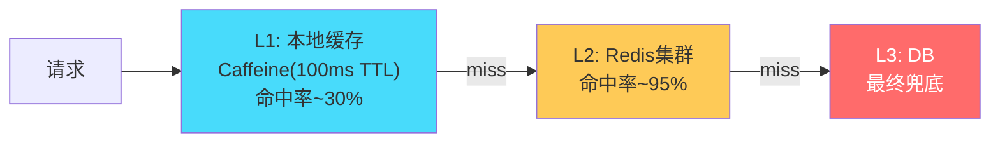

**为什么本地缓存设极短TTL(100ms~1s)?** 避免分布式环境下本地缓存和Redis不一致时间过长。100ms TTL意味着最多不一致100ms，对大多数业务可接受。热点数据在100ms内被大量命中，有效减少Redis请求。

### 6.5 🔴 缓存与DB双写一致性

**四种策略淘汰**：
| 策略 | 问题 | 结论 |
|------|------|------|
| 先更新缓存,再更新DB | DB失败时缓存是脏数据 | ❌ |
| 先更新DB,再更新缓存 | 并发写时ABA覆盖 | ❌ |
| 先删缓存,再更新DB | 删后读线程加载旧值到缓存 | ❌ |
| ==先更新DB,再删缓存== ⭐ | 极端情况短暂不一致(概率极低) | ✅ Cache Aside Pattern |

**Cache Aside Pattern 为什么用"删"而不是"更"？**
```
并发写场景下"更新缓存"的问题:
  线程A: 更新DB(name='A') → 网络延迟...
  线程B: 更新DB(name='B') → 更新缓存(name='B')
  线程A: ...延迟结束 → 更新缓存(name='A')  ← 覆盖了B的更新！
  结果: DB是'B'(正确), 缓存是'A'(错误!) → 不一致

"删除缓存"没有这个问题:
  不管谁先删,下次读都会从DB加载最新值
```

**终极方案：订阅Binlog异步删缓存**：
```mermaid
flowchart LR
    A[业务服务] -->|1.更新DB| B[MySQL]
    A -->|2.删缓存(可能失败)| C[Redis]
    B -->|3.Binlog| D[Canal]
    D -->|4.解析变更的key| E[MQ]
    E -->|5.消费| F[缓存清理服务]
    F -->|6.删缓存+失败重试| C
```

**为什么 Canal 方案最可靠？**
- 步骤2删缓存失败 → Canal 兜底（DB binlog不会丢）
- MQ 保证消息可靠投递（失败重试）
- 缓存清理服务幂等（多删不影响正确性）
- 最终一致性有保证（延迟通常 < 100ms）

**Canal 的工作原理深入**：
```
Canal 伪装成 MySQL 的 Slave:
  1. Canal 向 Master 发送 dump 协议请求
  2. Master 收到请求后将 binlog 推送给 Canal(和推送给真正Slave一样)
  3. Canal 解析 binlog(ROW格式): 拿到变更的表名、主键、变更前后的列值
  4. Canal 将解析后的变更事件发送到 MQ(Kafka/RocketMQ)
  5. 消费者从 MQ 读取变更事件 → 提取 key → 删除对应的 Redis 缓存

为什么基于 binlog 而不是业务代码触发?
  - 业务代码可能遗漏(新同事不知道要删缓存)
  - 直接修改DB(运维SQL)不经过业务代码 → 缓存不一致
  - Canal 监控的是DB最终状态变更,无论谁/怎么改的都能感知到
  - 解耦: 业务代码完全不需要关心缓存更新逻辑
```

**Cache Aside Pattern 极端不一致的概率分析**：
```
先更新DB再删缓存, 什么时候会不一致?
  条件: 读请求在"DB更新后"和"缓存删除前"之间恰好执行(读到旧缓存)
  这个窗口有多大? = 一次 DEL 命令的网络+执行时间 ≈ 0.1ms
  
  不一致概率 ≈ (并发读QPS × 窗口时间) / 总时间
  假设 10万QPS: 100000 × 0.0001s / 1s = 10 次/秒 (实际更低因为DEL很快)
  不一致持续时间 = 缓存TTL(如5分钟) → 这才是真正的风险

  所以生产中: Cache Aside + 较短的TTL(如5min) + Canal异步补偿 → 几乎无感知
```

---


## 7. 主从 / 哨兵 / 集群

### 7.1 🔴 三种部署模式演化

```
单机 → 容量不够/没有高可用
  ↓ 解决数据备份+读写分离
主从复制 → 读写分离/数据备份，但不能自动故障转移(Master挂了需人工切)
  ↓ 解决自动故障转移
哨兵 Sentinel → 自动故障转移，但容量受限于单Master内存
  ↓ 解决容量水平扩展
Cluster → 分片扩容 + 自动故障转移（终极形态）
```

| 模式 | 容量 | 高可用 | 适用 | 典型规模 |
|------|------|--------|------|---------|
| 单机 | 单机内存 | ❌ | 开发测试 | <1GB |
| 主从 | 单机内存 | ❌(手动切) | 读写分离 | <16GB |
| 哨兵 | 单机内存 | ✅(自动切) | 中小规模 | <16GB |
| Cluster | ==多机内存之和== | ✅ | 大规模 | 16GB~TB级 |

### 7.2 🔴 主从复制流程（PSYNC2 完整机制）

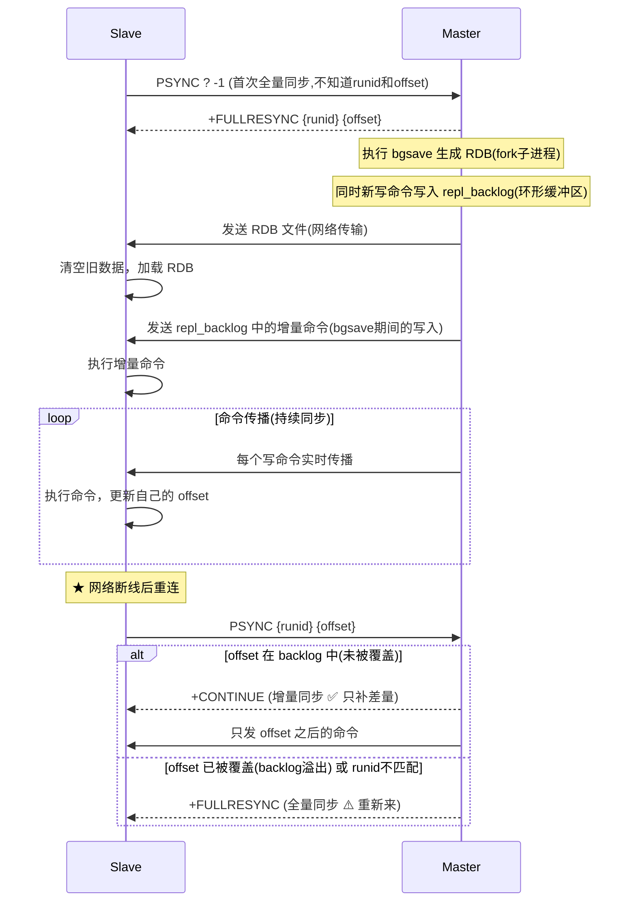

**PSYNC2 改进（Redis 4.0+）——解决"主从切换后必须全量"的问题**：

Redis 4.0 之前：Slave 记录的是 Master 的 runid。如果 Master 宕机、另一个 Slave 晋升为新 Master（新 runid），旧 Slave 的 PSYNC 会因 runid 不匹配而强制全量同步。

Redis 4.0 PSYNC2 改进：
- 引入 `replid2`（第二个复制 ID）：Slave 晋升时，将旧 Master 的 replid 存为 replid2
- 当旧 Slave 重连新 Master 时，新 Master 检查 replid2 能匹配 → 允许增量同步
- **效果**：主从切换后不再强制全量同步，大幅减少切换时的网络开销

**repl_backlog 环形缓冲区**：
```
┌─────────────────────────────────────────┐
│  repl_backlog (默认 1MB，生产建议设大)    │
│  ┌───┬───┬───┬───┬───┬───┬───┬───┐     │
│  │CMD│CMD│CMD│CMD│CMD│CMD│   │   │     │
│  └───┴───┴───┴───┴───┴───┴───┴───┘     │
│       ↑                   ↑              │
│   slave_offset      master_repl_offset   │
│                                          │
│  差值 = 需要补的增量                       │
│  如果 slave_offset 已被新数据覆盖(绕了一圈) │
│  → 只能全量同步                           │
└─────────────────────────────────────────┘
```

> 🟠 **生产建议**：`repl-backlog-size` 设为 `写QPS × 平均命令大小 × 最大容忍断线时长`。
> 例：写QPS=5000，命令平均100B，最大容忍60s断线 → 5000 × 100 × 60 = 30MB。
> 设太小 → 断线稍久就全量同步（浪费带宽+阻塞）。设太大 → 浪费内存。

### 7.3 🔴 Sentinel 哨兵选主机制

```mermaid
flowchart TD
    A[Sentinel定时PING Master] --> B{超过 down-after-milliseconds 无响应?}
    B -->|是| C[主观下线 SDOWN<br/>单个Sentinel认为Master挂了]
    C --> D[向其他Sentinel询问: 你也觉得挂了吗?]
    D --> E{超过 quorum 个Sentinel同意?}
    E -->|是| F[客观下线 ODOWN<br/>★ 多数同意,确认Master真的挂了]
    F --> G[Sentinel之间Raft选举Leader<br/>谁来执行故障转移]
    G --> H[Leader Sentinel 执行故障转移]
    H --> I["选新Master规则(按优先级):<br/>1.过滤不可用/断线过久的slave<br/>2.slave-priority最高的<br/>3.复制偏移量最大的(数据最新)<br/>4.runid字典序最小的"]
    I --> J[对选中的Slave执行 SLAVEOF NO ONE]
    J --> K[通知其他Slave指向新Master: SLAVEOF new-master]
    K --> L[发布 +switch-master 事件<br/>客户端(Jedis/Lettuce)感知切换更新连接]

    style F fill:#ff6b6b,color:#fff
    style I fill:#feca57
```

**文字总结——选主的核心逻辑**：先排除不可用的（断线久、落后多的Slave），然后在剩余候选中按"priority > offset > runid"三级排序选出最优。offset最大意味着数据最新，当 Leader 可以避免数据丢失最多。

> 🟢 **避坑：脑裂(Split Brain)**
> - **场景**：网络分区导致部分Sentinel联系不上Master，但Master其实还活着还在接受写入
> - **风险**：旧Master继续写、新Master也在写 → 两份数据不一致 → 恢复后旧Master降为Slave，期间的写入丢失
> - **防护配置**：
> ```bash
> min-replicas-to-write 1      # Master至少要有1个Slave在同步才允许写入
> min-replicas-max-lag 10      # Slave延迟不超过10s
> # 效果: 被隔离的旧Master发现没有Slave连着,自动拒绝写入 → 数据不会不一致
> ```


### 7.4 🔴 Cluster 集群分片

> 🔴 **核心**：16384 个哈希槽(slot)，`CRC16(key) % 16384` 决定 key 属于哪个槽。每个节点负责一部分槽。

**Gossip 协议——节点间如何通信？**

Cluster 不依赖外部协调(如ZK)，节点之间通过 **Gossip 协议** 交换信息：

| 消息类型 | 发送时机 | 内容 |
|---------|---------|------|
| PING | 每秒随机选几个节点 | 自己的状态 + 随机带几个其他节点信息 |
| PONG | 收到PING后回复 | 同上 |
| MEET | 新节点加入时 | 通知已有节点"我来了" |
| FAIL | 确认某节点故障 | 广播"节点X挂了" |

**Gossip 的优缺点**：
- 优点：去中心化、最终一致、容错强（不依赖单点）
- 缺点：信息传播有延迟（O(logN) 轮才能传遍所有节点）、带宽消耗（大集群时PING频繁）

**Gossip 协议的传播数学原理**：
```
Gossip 传播模型类似"传染病传播":
  每轮: 每个已知信息的节点随机告诉1个不知道的节点
  N个节点: 需要 O(logN) 轮才能传遍所有节点

具体: 100节点集群
  - 每秒每个节点随机PING 1~2个其他节点
  - 一个新信息(如节点故障)从产生到所有节点都知道: ~7轮(log2(100)≈7)
  - 每轮间隔1s → 约7s所有节点才知道(最坏情况)
  
  这就是为什么 cluster-node-timeout 默认15s:
    要给Gossip足够时间传播"我觉得X挂了"的消息
    如果设太小(如2s) → 信息还没传播完就做决定 → 误判
```

**Gossip vs 集中式注册中心(如ZK)的trade-off**：
| 维度 | Gossip(Redis Cluster) | 集中式(ZK/etcd) |
|------|----------------------|-----------------|
| 单点故障 | 无(去中心化) | 有(需ZK集群高可用) |
| 信息传播速度 | O(logN)秒延迟 | ==实时==(Watch通知) |
| 带宽消耗 | 每节点定期PING(O(N)) | 只在变更时通知(O(1)) |
| 实现复杂度 | 中(需处理不一致) | 高(Raft/ZAB共识) |
| 适合规模 | 中(≤1000节点) | 小中(≤100~500节点) |

**故障检测机制**：
```
节点A PING 节点B → 超过 cluster-node-timeout(默认15s) 无响应
  → 节点A 标记B为 PFAIL(疑似故障)
  → 节点A 通过Gossip传播"我觉得B挂了"
  → 如果过半的 Master 节点都标记B为PFAIL
  → B被标记为 FAIL(确认故障)
  → 如果B是Master且有Slave → Slave发起选举晋升
```

**MOVED vs ASK 重定向**：

| 类型 | 含义 | 客户端行为 | 触发场景 |
|------|------|-----------|---------|
| MOVED | slot 已永久迁移到新节点 | ==更新本地slot映射表== | slot迁移完成后 |
| ASK | slot 正在迁移中(还没完成) | 只这一次去新节点找,不更新映射 | slot正在迁移过程中 |

**为什么是 16384 个 slot？**

> 🟡 antirez 在 GitHub issue 中解释了三个原因：
> 1. **心跳包大小**：每个节点广播 slot bitmap，16384 bit = 2KB。如果65536 slot → 8KB。100节点集群每秒心跳流量：2KB×100 = 200KB vs 8KB×100 = 800KB
> 2. **集群设计上限 ≤ 1000 节点**：16384/1000 ≈ 16 slot/节点，粒度已经足够细
> 3. **slot 通常连续分配**：bitmap 压缩效果好（连续1的run-length编码）

### 7.5 🟢 Cluster 限制与避坑

| 限制 | 原因 | 解决方案 |
|------|------|---------|
| 不支持多key命令跨槽(MGET跨槽报错) | 不同key可能在不同节点,无法原子执行 | ==Hash Tag==: `{user1}:name`、`{user1}:age` |
| 不支持跨槽事务(MULTI/EXEC) | 同上 | Hash Tag强制同槽 |
| 不支持SELECT多DB | 集群模式只有db0(简化设计) | 用key前缀区分业务 |
| Lua脚本key必须在同一节点 | 不能跨节点执行脚本 | Hash Tag |
| 发布订阅全集群广播 | PUBLISH消息发送到所有节点(不是只给订阅者的节点) | 大规模PubSub用独立Redis |

**Hash Tag 原理**：
```bash
# {} 内的部分作为hash计算依据,其余部分忽略
SET {user:1001}:name "张三"    # slot = CRC16("user:1001") % 16384 = 5649
SET {user:1001}:age  25        # slot = CRC16("user:1001") % 16384 = 5649 ← 同一个slot!
MGET {user:1001}:name {user:1001}:age  # ✅ 在同一节点,可以执行
```

---

## 8. Redis 6.0 多线程 IO（补充）

### 8.1 🟠 完整执行流程

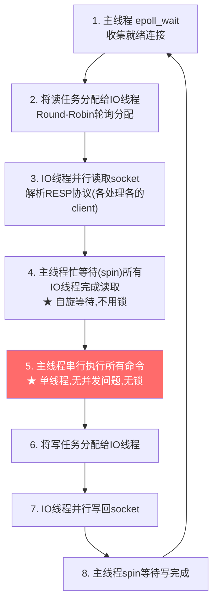

> 🟠 **关键设计细节**：
> - 主线程和IO线程之间==没有用互斥锁==，而是用**原子变量+忙等待(spin)**同步
> - 为什么不用锁？因为锁有调度延迟(线程可能sleep再唤醒)，spin延迟更低更可控
> - 为什么可以spin？因为IO线程处理一批client的read/write很快(μs级)，spin时间极短
> - IO线程之间也不共享数据——每个IO线程处理自己分配到的client列表

### 8.2 🟢 多线程IO不能解决的问题

| 问题 | 原因 | 解决方案 |
|------|------|---------|
| 单key大操作(HGETALL 100万field) | 命令执行仍单线程 | 拆分大Hash为多个小Hash |
| CPU密集Lua脚本 | 同上 | 简化Lua,或用Module(可在独立线程) |
| 大key删除(DEL 大Hash) | 同上 | ==UNLINK==异步删除(4.0+ bio线程释放) |
| 集群容量不足 | 单实例内存有限 | Cluster水平扩展 |

---

## 9. 缓存与DB双写一致性（补充章节）

> 已在 6.5 节详细阐述 Cache Aside Pattern 和 Canal 方案，此处补充 **延迟双删** 的细节。

### 9.1 🟠 延迟双删详解

```java
// 延迟双删方案
public void updateWithDoubleDelete(String key, Object newValue) {
    redis.delete(key);                    // 第1次删(清除可能的旧缓存)
    db.update(newValue);                  // 更新DB
    Thread.sleep(500);                    // ★ 等待:让可能正在读旧DB并写缓存的线程完成
    redis.delete(key);                    // 第2次删(清除那个线程可能写入的旧缓存)
}
```

**为什么要 sleep 500ms？**
- 如果有读线程在你更新DB之前读了旧值，正准备写入缓存
- 你更新完DB+第一次删缓存后，那个读线程才把旧值写入缓存
- 500ms 后第二次删除，就能清掉这个旧缓存
- 500ms ≈ "一次读DB+写缓存"的最大耗时（需要根据业务调整）

**延迟双删的局限**：
- sleep 阻塞线程（可改为异步延迟队列）
- 500ms 内仍然不一致（只是最终一致）
- 第二次删除也可能失败 → 仍需 Canal 兜底

**延迟双删的异步改进版**：
```java
// 生产级实现: 不阻塞线程,用延迟队列异步执行第二次删除
public void updateWithAsyncDoubleDelete(String key, Object newValue) {
    redis.delete(key);                    // 第1次删
    db.update(newValue);                  // 更新DB
    
    // 异步延迟删除(不阻塞当前线程)
    delayQueue.add(new DelayTask(() -> {
        redis.delete(key);               // 第2次删(500ms后执行)
    }, 500, TimeUnit.MILLISECONDS));
}

// 延迟队列可以用:
//   - RocketMQ 延迟消息(最可靠,失败有重试)
//   - Redis ZSET(score=执行时间,定时扫描)
//   - ScheduledExecutorService(简单但进程重启丢失)
```

**各种双写一致性方案的最终选型结论**：
```
数据一致性要求:
  弱(可容忍秒级不一致) → Cache Aside(先更新DB再删缓存) + 合理TTL
  中(尽量减少不一致) → 延迟双删 + 异步消息队列
  强(不可容忍任何不一致) → Canal监听Binlog异步删缓存(最终一致最可靠)
  极强(实时一致) → 读写锁(性能差,极少用) 或 不用缓存(只走DB)
  
生产推荐:
  90%场景: Cache Aside + TTL 5min + Canal兜底 → 简单可靠
  加分: 热点key用逻辑过期方案(永不真正过期,异步刷新)
```

---

# 第二部分 · 消息队列

## 10. Kafka 架构与高性能

### 10.1 设计动机：Kafka 解决什么问题？

**LinkedIn 2011年面临的挑战**：
- 每天数十亿条日志/事件数据，现有MQ(ActiveMQ)吞吐不足、堆积就崩
- 需要同时服务**实时消费**(监控)和**离线分析**(Hadoop)
- 现有MQ消费完消息就删除，无法重复消费/回溯

**Kafka 的设计理念——像日志系统而不是传统MQ**：
```
传统MQ(RabbitMQ): 消费后删除 → 不能回溯，不能多消费者各自消费
Kafka:          消息持久化到磁盘，按时间/大小保留 → 可回溯，多Consumer各自维护offset
```

**设计目标**：
```
高吞吐(百万级/s) + 持久化(磁盘) + 水平扩展(Partition) + 消费回溯(Offset) + 多订阅者
```


### 10.2 🔴 整体架构图

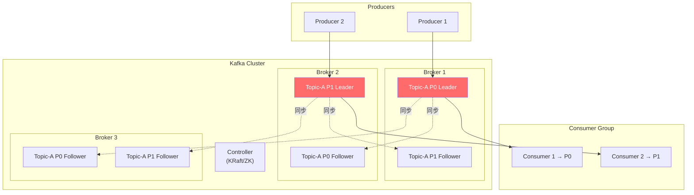

**文字总结**：Producer 只写 Leader Partition；Follower 从 Leader 拉取数据做副本；Consumer Group 中每个 Consumer 消费固定的 Partition（不会重复消费）。Controller 负责管理元数据（Partition分配、Leader选举）。

### 10.3 🔴 核心概念深度解释

| 概念 | 本质 | 为什么这样设计 | 如果没有它会怎样 |
|------|------|--------------|----------------|
| **Topic** | 逻辑消息通道 | 按业务隔离 | 所有消息混在一起无法管理 |
| **Partition** | ==有序追加日志文件== | ★ 并行度的核心! N个Partition = N路并行 | 单Partition是吞吐瓶颈 |
| **Replica** | Partition的副本 | 容灾,Leader挂了从ISR选新Leader | 数据丢失,无高可用 |
| **ISR** | 与Leader同步的副本集 | acks=all只需ISR确认(不等慢副本) | 等所有副本→慢副本拖累整体 |

**ISR 机制的深入理解**：
- ISR = In-Sync Replicas，指当前和 Leader "保持同步" 的副本集合（包括 Leader 自己）
- "保持同步"的定义：Follower 的复制进度落后 Leader 不超过 `replica.lag.time.max.ms`（默认30s）
- 如果一个 Follower 30s 内没有向 Leader 发起 fetch 请求 → 被踢出 ISR → 不再参与 acks=all 的确认
- 被踢出后如果赶上了进度 → 重新加入 ISR（动态变化）

**为什么不等所有副本而是只等 ISR？**
```
假设3副本: Leader + Follower1(正常) + Follower2(网络慢/磁盘IO高)

如果要求 ALL 副本确认:
  Leader写入: 1ms
  Follower1同步: 5ms
  Follower2同步: 500ms(慢!) ← 整条链路被拖到500ms
  → 一个慢副本拖累所有写入性能

ISR 机制:
  Follower2 落后 > 30s → 被踢出ISR → ISR=[Leader, Follower1]
  acks=all 只需 Leader+Follower1 确认: 5ms 完成
  Follower2 慢慢追赶, 追上后重新加入ISR
  → 慢副本不影响正常写入, 只是暂时少了一个副本的保护
```
| **Offset** | 消息在Partition内的序号 | Consumer靠Offset追踪进度 | 无法知道消费到哪里了 |
| **Consumer Group** | 消费者组 | 组内Partition独占,组间独立消费 | 消息被重复消费或无法并行 |
| **Segment** | Partition的物理分段 | 便于清理旧数据(直接删文件) | 单文件无限增长无法清理 |

### 10.4 🔴 高性能 5 大核心技术

> 🔴 **记忆口诀**：`顺序写 + 零拷贝 + 批量 + 分区 + 索引`

#### 技术1：顺序写磁盘

```
磁盘性能对比:
  HDD 随机写:  ~100 IOPS → ~400KB/s
  HDD 顺序写:  ~100MB/s            ← 差250倍!
  SSD 随机写:  ~10,000 IOPS → ~40MB/s
  SSD 顺序写:  ~500MB/s            ← 差12倍!
  
关键洞察: 磁盘顺序写性能 ≈ 内存随机写性能!
```

**为什么顺序写这么快？**
- HDD：磁头不需要寻道（seek time ≈ 0），直接在当前位置写
- SSD：顺序写利用了SSD的写入缓冲和Page对齐，减少擦除次数
- 操作系统：顺序写触发预读(read-ahead)和写合并(write-behind)优化

Kafka 的消息文件是**只追加(append-only)**的日志，永远在文件末尾写入。

**深入理解 HDD 顺序写为什么和内存接近**：
```
HDD 一次随机写的时间组成:
  寻道时间(seek): ~5ms (磁头移动到目标磁道)
  旋转延迟(rotational): ~4ms (等待目标扇区转到磁头下)
  传输时间(transfer): ~0.01ms (实际写入数据)
  总计: ~9ms/次 → IOPS ≈ 111

HDD 顺序写:
  寻道时间: 0 (磁头已经在正确位置,下一个扇区就是要写的)
  旋转延迟: 0 (连续扇区,不需要等转)
  传输时间: 纯带宽上限 → ~150MB/s
  
  9ms的寻道+旋转开销被完全消除 → 性能提升100倍以上!
  OS 层面还会将多次小写合并成一次大IO(write-behind buffering)
```

**Kafka 利用 OS Page Cache 的巧妙设计**：
- Kafka 不自己管理缓存，而是直接用 `mmap` 或 `write()` 让 OS 管理 Page Cache
- 写入时：数据进入 Page Cache → OS 异步刷盘（fsync 策略可配置）
- 读取时：Consumer 消费的通常是"刚写入不久"的数据 → 大概率还在 Page Cache 中 → 不需要读磁盘
- 效果：生产 + 消费 都在内存层面完成，磁盘只做持久化备份（异步写入）

#### 技术2：零拷贝（sendfile）

```mermaid
flowchart LR
    subgraph 传统方式["传统读文件发网络(4次拷贝+2次上下文切换)"]
        A1[磁盘] -->|"1.DMA拷贝"| K1[内核缓冲区]
        K1 -->|"2.CPU拷贝"| U1[用户缓冲区]
        U1 -->|"3.CPU拷贝"| K2[Socket缓冲区]
        K2 -->|"4.DMA拷贝"| N1[网卡]
    end

    subgraph 零拷贝["sendfile零拷贝(2次DMA拷贝,0次CPU拷贝)"]
        A2[磁盘] -->|"1.DMA拷贝"| PC[Page Cache]
        PC -->|"2.DMA scatter-gather"| N2[网卡]
    end

    style PC fill:#ff6b6b,color:#fff
```

**文字总结**：传统方式数据经过4次拷贝（磁盘→内核→用户→Socket→网卡），其中2次是CPU拷贝（慢且占CPU）。sendfile 让数据在内核空间直接从 Page Cache 传到网卡，完全绕过用户空间，CPU不参与数据搬运。

**为什么绕过用户空间就快了？**
```
传统方式的4次拷贝为什么慢:
  ① 磁盘→内核(DMA拷贝): DMA控制器做,不占CPU → 快
  ② 内核→用户(CPU拷贝): CPU逐字节搬运 + 两次上下文切换(用户态↔内核态) → 慢!
  ③ 用户→Socket缓冲(CPU拷贝): 同上 → 慢!
  ④ Socket→网卡(DMA拷贝): DMA控制器做 → 快

每次上下文切换开销:
  保存/恢复寄存器、刷新TLB、切换内存映射 → ~5μs/次
  传统方式4次切换: 20μs 纯开销(和数据量无关)

sendfile 只有2次DMA拷贝 + 0次CPU拷贝 + 2次上下文切换:
  总开销: ~10μs + DMA时间
  省了: 2次CPU拷贝(大value如100KB时CPU拷贝耗时显著) + 2次上下文切换
```

**scatter-gather DMA（Linux 2.4+进一步优化）**：
- 普通 sendfile：还需要内核将 Page Cache 数据拷贝到 Socket 缓冲区（仍有1次CPU拷贝）
- scatter-gather DMA：网卡支持直接从多个不连续内存位置（Page Cache）收集数据发送 → ==真正0次CPU拷贝==
- Kafka + Linux 2.4+ + 支持 scatter-gather 的网卡 = 极致零拷贝

**Java 层面**：`FileChannel.transferTo()` → Linux `sendfile()` 系统调用

> 🔴 **关键**：这是 Kafka **消费吞吐超高**的核心原因。Consumer 拉取消息时，Broker 直接从磁盘（实际是 Page Cache）零拷贝发送到网络。

#### 技术3：批量处理 + 压缩

```java
// Producer 配置
props.put("batch.size", 16384);        // 批次大小 16KB
props.put("linger.ms", 5);             // 等待5ms凑批(不是来一条发一条)
props.put("compression.type", "lz4"); // 整批压缩再发送

// 效果: 1000条100B小消息 → 压缩成1个~30KB网络包
// 减少: 网络往返次数(1000次→1次)、磁盘IO次数、协议头开销
```

**为什么 linger.ms 不是越大越好？**
- linger.ms=0：来一条发一条（延迟最低,吞吐最差）
- linger.ms=5：等5ms凑批（延迟+5ms,吞吐提升10倍+）
- linger.ms=100：等100ms（延迟高,批量大但业务可能无法接受）
- 通常 5~50ms 是最佳平衡

#### 技术4：分区并行

```
一个Consumer Group内, Partition数 = 最大并行度:
  6 Partitions + 6 Consumers → 每人消费1个, 吞吐=6×单机
  6 Partitions + 3 Consumers → 每人消费2个, 吞吐=3×单机
  6 Partitions + 8 Consumers → 2个空闲(浪费), 吞吐=6×单机

结论: Consumer数量 > Partition数 没有意义(多的空闲)
```

#### 技术5：稀疏索引

```
.log 文件 (实际消息,顺序追加)     .index 文件 (稀疏索引,不是每条都建)
┌────────────────┐              ┌──────────────────┐
│ offset=0, pos=0│              │ offset=0 → pos=0 │
│ offset=1       │              │ offset=4 → pos=320│ ← 每隔4KB建一条
│ offset=2       │              │ offset=8 → pos=640│
│ offset=3       │              └──────────────────┘
│ offset=4,pos320│
│ ...            │              查找 offset=6:
└────────────────┘              1. 二分查找 index: 4 ≤ 6 < 8 → pos=320
                                2. 从 pos=320 开始顺序扫描2条 → 找到6
```

**为什么用稀疏索引而不是每条都建？**
- 每条消息都建索引 → 索引文件和数据文件一样大（浪费空间）
- 稀疏索引只需 O(logN) 二分 + 少量顺序扫描 → 性能足够且省空间

**稀疏索引的查找过程详解**：
```
查找 offset=1000006 的消息:

Step 1: 定位Segment文件(文件名就是起始offset)
  文件列表: 00000000000000000000.log (offset 0~999999)
            00000000000001000000.log (offset 1000000~1999999)  ← 在这个文件
            
Step 2: 在对应的 .index 文件中二分查找
  00000000000001000000.index:
    [相对offset=0, 物理位置=0]
    [相对offset=4, 物理位置=320]
    [相对offset=8, 物理位置=640]   ← 最大的 ≤ 6 的索引项
    [相对offset=12, 物理位置=960]
    
  二分找到: 相对offset=4(物理位置320) ≤ 目标相对offset=6 < 相对offset=8

Step 3: 从物理位置320开始顺序扫描
  读 pos=320 的消息: offset=1000004(不是目标,继续)
  读下一条: offset=1000005(不是目标,继续)
  读下一条: offset=1000006 → 找到!

总IO次数: 1次index读取(二分O(logN)) + 最多K次顺序扫描(K=索引间隔)
```

**为什么稀疏索引"足够快"？**
- 索引文件很小（每4KB数据只建一条索引=每条索引8字节），通常整个文件都在 Page Cache 中
- 二分查找在内存中执行：~0.1μs
- 顺序扫描最多几条消息（索引间隔内的消息数），也在 Page Cache 中
- 总体查找延迟：< 1ms（和全量索引相比差异可忽略）


### 10.5 🔴 ACK 机制与数据可靠性

| acks | 含义 | 丢消息风险 | 性能 | 适用 |
|------|------|-----------|------|------|
| 0 | 不等任何确认(fire and forget) | 高(网络丢包就丢) | 最快 | 日志采集(可丢) |
| 1 | Leader写入本地日志即确认 | 中(Leader挂了ISR未同步完) | 中 | 一般业务 |
| ==all(-1)== ⭐ | ISR全部副本写入才确认 | ==极低== | 稍慢 | 金融/订单 |

**acks=all 的完整可靠配置**：
```bash
# Producer
acks=all                                  # ISR全部确认
retries=Integer.MAX_VALUE                 # 无限重试(配合幂等)
enable.idempotence=true                   # ★ 幂等Producer(PID+SeqNum去重)
max.in.flight.requests.per.connection=5   # 配合幂等使用(不影响顺序)

# Broker
min.insync.replicas=2                     # ★ ISR至少2个才接受写入
unclean.leader.election.enable=false      # ★ 不允许非ISR副本当Leader(防数据丢失)
default.replication.factor=3              # 副本数3
```

> 🟢 **避坑：min.insync.replicas 的含义**
> - 这个参数的意思是"在acks=all时,至少需要多少个ISR副本确认"
> - 如果ISR只剩Leader一个(其他Follower都掉队了),min.insync.replicas=2 → Producer写入报错 `NotEnoughReplicasException`
> - 这是**设计意图**：宁可拒绝写入也不降低数据安全性

### 10.6 🟠 Producer 分区策略

| 策略 | 触发条件 | 行为 | 适用 |
|------|---------|------|------|
| 指定Partition | 代码中明确指定 | 直接发到指定Partition | 明确知道要发哪里 |
| ==按Key哈希== | 指定了key | `murmur2(key) % numPartitions` | 同key有序(userId/orderId) |
| 粘性分区(2.4+) | 无key | 一批消息发同一Partition(凑满batch后换) | 默认策略,提高批量效率 |
| 轮询(旧默认) | 无key(2.4前) | Round-Robin | 均匀分布但批量小 |

**为什么2.4+改为粘性分区？**
- 轮询：每条消息可能去不同Partition → 每个Partition的batch都很小 → 批量效果差
- 粘性：连续N条消息发同一Partition → 这个Partition的batch快速填满 → 一次发送,效率高
- 切换时机：当前batch满了/linger.ms到了 → 换一个Partition

### 10.7 🔴 消费者 Rebalance 深入

**触发场景及原因**：
1. Consumer 加入/退出 Group（最常见）
2. Consumer 心跳超时（`session.timeout.ms` 默认45s内无心跳）
3. Consumer 处理太慢（`max.poll.interval.ms` 默认5min内没有再次poll）
4. 订阅的 Topic Partition 数变化（扩容Partition）

**Rebalance 的代价——为什么称为"毒药"？**
- ==STW==：整个消费组暂停消费（所有Partition取消分配）
- 重新分配后可能导致**重复消费**（已处理但未提交offset的消息再次被拉取）
- 典型耗时：几秒到几十秒（取决于组内Consumer数量和协调延迟）
- 期间消息持续积压

**分配策略对比**：

| 策略 | Rebalance行为 | 影响 |
|------|-------------|------|
| RangeAssignor(默认) | 全部取消→全部重分配 | 所有Consumer暂停 |
| RoundRobinAssignor | 全部取消→全部重分配 | 同上 |
| StickyAssignor | 尽量保持原分配,只迁移必要的 | 减少变动 |
| ==CooperativeStickyAssignor== ⭐ | ==增量式==:先revoke部分→再assign | ==最小影响,推荐== |

**CooperativeStickyAssignor 为什么影响最小？**
```
传统(Eager)Rebalance:
  所有Consumer → 取消所有Partition → 重新分配 → 所有人暂停

协作式(Cooperative)Rebalance:
  第一轮: 只revoke需要迁移的Partition → 其他Partition不受影响(继续消费!)
  第二轮: 将revoke的Partition分配给新Consumer → 只有迁移的少数Partition暂停
```

**具体示例对比(3个Consumer, 6个Partition, Consumer-C加入)**：
```
初始分配: Consumer-A=[P0,P1], Consumer-B=[P2,P3], 新Consumer-C加入

Eager Rebalance(传统):
  Step1: A取消P0,P1 + B取消P2,P3 → 全部Partition暂停消费(STW!)
  Step2: 重新分配 → A=[P0,P1], B=[P2,P3], C=[P4,P5]
  如果要均衡: A=[P0,P1], B=[P2,P3], C=[P0?,P2?] → 需要从A和B各拿一个
  全程: 所有6个Partition都暂停了! (即使4个不需要动)

Cooperative Rebalance:
  Step1(第一轮Rebalance):
    计算新分配方案: A=[P0,P1], B=[P2,P3] → A=[P0], B=[P2,P3], C=[P1]
    只revoke需要迁移的: A revoke P1 → A继续消费P0, B继续消费P2,P3 ✅
    P1暂时无人消费(只有这一个暂停!)
  Step2(第二轮Rebalance):
    将P1分配给C → C开始消费P1
    全程: 只有P1暂停了几秒, 其他5个Partition完全不受影响!
```

### 10.8 🟢 线上事故：Rebalance 风暴

> 🟢 **事故还原**：
> - **业务**：订单处理消费者组，6个Consumer，处理逻辑含RPC调用(平均200ms/条)
> - **配置**：`max.poll.records=500`，`max.poll.interval.ms=300000`(5min)
> - **问题**：某次下游服务响应变慢(2s/条)，500条 × 2s = 1000s > 5min
> - **连锁反应**：Consumer超时被踢出 → 触发Rebalance → 分配给别人 → 别人也超时 → 又Rebalance
> - **结果**：消费完全停止30分钟，积压百万消息
> - **修复**：
>   1. 降低 `max.poll.records` 到 50（每次少取,处理快）
>   2. 增大 `max.poll.interval.ms` 到 600000（容忍更久）
>   3. 下游调用加超时(3s) + 熔断(快速失败不等待)
>   4. 使用 CooperativeStickyAssignor 减少Rebalance影响

### 10.9 🔴 顺序保证机制

**三种顺序级别**：
| 级别 | 实现 | 代价 | 适用 |
|------|------|------|------|
| 全局有序 | 单Partition | 牺牲并行度(吞吐=单机上限) | 极少用(全局流水号) |
| ==业务有序== ⭐ | 同key同Partition | 业务key相同的有序,不同key并行 | 订单状态变更/用户操作 |
| 无序 | 无key(粘性分区) | 最大吞吐 | 日志/metrics |

```java
// 同一用户的消息进同一Partition(保证用户维度有序)
producer.send(new ProducerRecord<>("order-events",
    String.valueOf(userId),  // ★ key=userId → hash到固定Partition
    orderEvent));
```

> 🟠 **乱序陷阱**：`retries > 0` 且 `max.in.flight.requests.per.connection > 1` 时：
> - batch1发送失败重试中，batch2已发送成功 → 乱序
> - 解决：开启 `enable.idempotence=true`（底层用 PID+SeqNum 保证单Partition内顺序+去重）

### 10.10 🟡 KRaft 模式（去ZooKeeper）

**为什么去ZK？**
| 问题 | 用ZK | 用KRaft |
|------|------|---------|
| 运维 | 额外维护一套ZK集群(3~5节点) | Kafka自包含,无外部依赖 |
| 元数据瓶颈 | ZK单节点处理所有元数据变更 | 多Controller分担 |
| 扩展性 | 百万Partition时ZK Watch压力大 | 基于日志的状态机,线性扩展 |
| 启动速度 | 需要从ZK全量加载元数据 | 本地快照+增量日志恢复 |

**KRaft 架构(Kafka 3.3+ 生产可用)**：
```
Controller 节点(3~5个): 用 Raft 协议管理集群元数据
  - 一个 Active Controller(Leader)
  - 其余是 Standby(Follower)
  - 元数据变更写入内部 __cluster_metadata Topic(Raft日志)

Broker 节点: 从 Controller 拉取元数据(订阅变更)
  - 不再直接连接 ZooKeeper
  - 本地缓存元数据,减少网络请求
```

---

## 11. RabbitMQ 与交换机

### 11.1 🔴 核心模型

```mermaid
flowchart LR
    P[Producer] -->|"消息+RoutingKey"| EX{Exchange}
    EX -->|"BindingKey匹配"| Q1[Queue 1]
    EX -->|"BindingKey匹配"| Q2[Queue 2]
    Q1 --> C1[Consumer 1]
    Q2 --> C2[Consumer 2]

    style EX fill:#ff6b6b,color:#fff
```

> 🔴 **与 Kafka 的根本区别**：
> - Kafka: Producer → Topic → Partition → Consumer（简单直接，消费者拉取）
> - RabbitMQ: Producer → Exchange → Queue → Consumer（路由灵活，Broker推送/拉取都支持）
> - Exchange 是 RabbitMQ 的核心抽象——**消息路由引擎**

### 11.2 🔴 4 种交换机对比

| 类型 | 路由规则 | 典型场景 | 不用它会怎样 |
|------|---------|---------|------------|
| **Direct** | RoutingKey ==完全匹配== BindingKey | 点对点精确路由 | 每个业务建一个Topic(Kafka方式) |
| **Fanout** | 忽略RoutingKey,==广播==所有绑定Queue | 注册→邮件+积分+日志 | 每个订阅者都要建Topic |
| **Topic** | 通配符匹配(`*`一词,`#`多词) | 灵活路由:`order.*.created` | 代码层面做条件判断过滤 |
| **Headers** | 按消息Header KV属性匹配 | 几乎不用(性能差) | - |

**Topic Exchange 通配符规则详解**：
```
BindingKey 格式: word.word.word (点分隔的单词列表)
通配符:
  * = 恰好匹配一个单词
  # = 匹配零个或多个单词

示例:
  BindingKey = "order.*.created"
    匹配: order.food.created ✅, order.electronics.created ✅
    不匹配: order.created ❌(少了一个单词), order.food.item.created ❌(多了一个)
    
  BindingKey = "order.#"
    匹配: order.created ✅, order.food.created ✅, order.food.item.created ✅, order ✅
    即: 以"order"开头的任何路由键

  BindingKey = "#" → 匹配所有(等同于Fanout)
  BindingKey = "order.food.created" (无通配符) → 等同于Direct精确匹配

选型结论:
  只需要精确路由 → Direct(性能最好,路由O(1)哈希查找)
  一对多广播 → Fanout(最简单,不看RoutingKey)
  灵活条件路由 → Topic(按业务域分层,如 {业务}.{子域}.{事件})
```

### 11.3 🔴 消息可靠性三段保障

```mermaid
flowchart LR
    A["① Publisher Confirm<br/>Producer→Broker到达确认"] --> B["② 持久化<br/>Exchange+Queue+Message<br/>都设durable"]
    B --> C["③ Consumer ACK<br/>手动确认处理完成"]

    style A fill:#ff6b6b,color:#fff
    style B fill:#ff6b6b,color:#fff
    style C fill:#ff6b6b,color:#fff
```

**如果缺少任何一段**：
- 缺①：Producer发出去不知道Broker收没收到(网络丢包/Broker崩溃时消息丢失)
- 缺②：Broker重启后消息没了(只在内存中)
- 缺③：Consumer取出消息后还没处理就崩溃→消息丢失(已从Queue删除)

### 11.4 🟠 死信队列（DLX）与 Quorum Queue

**消息变成"死信"的三种情况**：
1. Consumer reject/nack 且 `requeue=false`（处理失败不重试）
2. 消息 TTL 过期（排队太久没被消费）
3. 队列满了（超过 `x-max-length`）

**Quorum Queue（3.8+推荐,替代镜像队列）**：

| 维度 | 镜像队列(旧) | Quorum Queue(新) |
|------|------------|----------------|
| 一致性协议 | GM(自研,弱一致) | ==Raft(强一致)== |
| 数据安全 | 可能脑裂丢消息 | Raft保证不丢 |
| 性能 | 中 | 中(略低于镜像但可接受) |
| 持久化 | 可选 | ==强制持久化== |
| 毒消息处理 | 无 | ==内置delivery-limit== |
| 推荐 | 不再推荐 | ==生产首选== |

**Quorum Queue 为什么更可靠？**
- 基于 Raft 协议：写入需过半节点确认（和 ZK 的 ZAB 类似）
- 不会出现镜像队列的"sync"延迟（Raft 天然保证副本一致）
- 内置毒消息处理：消息被 nack 超过 `x-delivery-limit` 次自动进死信

---

## 12. RocketMQ 与事务消息

### 12.1 🔴 整体架构

```mermaid
flowchart TB
    subgraph NameServer["NameServer集群(无状态,互不通信)"]
        NS1[NS1]
        NS2[NS2]
    end

    subgraph Broker["Broker集群"]
        BM1["Master1<br/>CommitLog"]
        BS1["Slave1"]
        BM2["Master2<br/>CommitLog"]
        BS2["Slave2"]
    end

    P[Producer] -.路由发现.-> NS1
    P -->|发消息| BM1
    C[Consumer] -.路由发现.-> NS1
    C -->|拉消息| BM1

    BM1 -.主从同步.-> BS1
    BM1 --30s心跳--> NS1

    style BM1 fill:#ff6b6b,color:#fff
    style BM2 fill:#ff6b6b,color:#fff
```

**NameServer vs ZooKeeper 的设计取舍**：
| 维度 | NameServer | ZooKeeper |
|------|-----------|-----------|
| 一致性 | AP(最终一致) | CP(强一致) |
| 复杂度 | 极简(几千行代码) | 复杂(ZAB协议) |
| 节点间通信 | ==不通信==(各自维护) | 需要选举+同步 |
| Broker注册 | 每个Broker向所有NS注册 | 只注册一次(ZK同步) |
| 路由更新延迟 | 最大30s(心跳周期) | 实时(Watch通知) |

**为什么选AP而非CP？** 路由信息的短暂不一致只会导致极少量消息发到旧Broker（重试即可恢复），不会丢消息。换来的是架构极简、无单点、无脑裂。

**深入理解"路由不一致不会丢消息"**：
```
场景: Broker1 宕机, NameServer1 已更新路由(去掉Broker1), 但 NameServer2 还没更新(30s心跳周期)

Producer 向 NameServer2 查路由 → 还能看到 Broker1 → 向 Broker1 发消息 → 连接失败
  → Producer 本地重试(retry到其他Broker) → 消息不丢 ✅

Consumer 向 NameServer2 查路由 → 还能看到 Broker1 → 尝试拉消息 → 连接失败
  → Consumer 下一个30s刷新路由 → 看不到Broker1了 → 从其他Broker消费
  → 期间的消息在Broker1的Slave上(如果有) 或等Broker1恢复后继续消费

结论: 路由不一致的影响 = 几次重试 + 最多30s的消费中断
      不需要强一致(CP)来保证正确性 → AP足够
```

### 12.2 🟠 CommitLog 存储结构

**与 Kafka 的存储区别**：
```
Kafka:  每个 Topic-Partition 一个日志文件(分散存储)
RocketMQ: ★ 所有Topic的消息混写一个CommitLog(集中存储)
         + 每个Topic-Queue单独维护ConsumeQueue(逻辑索引)
```

```
CommitLog (1GB/文件,顺序写):
┌─────────┬─────────┬─────────┬─────────┐
│TopicA-Q0│TopicB-Q1│TopicA-Q0│TopicC-Q0│  ← 所有Topic混合追加
└─────────┴─────────┴─────────┴─────────┘

ConsumeQueue (每个Topic-Queue一个,存索引):
TopicA-Q0: [offset=0, commitlog_pos=0, size=200]
           [offset=1, commitlog_pos=5000, size=180]
           每条索引固定20字节(offset+物理偏移+大小)
```

**为什么所有消息混写一个文件？**
- 单文件追加写 = 绝对的磁盘顺序写（哪怕有100个Topic）
- 如果像Kafka每Partition一个文件,100个Partition就是100路随机写(HDD上性能骤降)
- 代价：读取时需要通过ConsumeQueue索引定位 → 多一次索引查找(但索引很小,常驻PageCache)

**Kafka vs RocketMQ 存储设计的深层trade-off**：
```
Kafka(每Partition独立文件):
  优势: 消费时直接顺序读(Consumer按Partition线性扫描,天然顺序IO)
  劣势: Topic数量多时(>64个Topic×N个Partition), 大量文件轮流写入 → 退化为随机写
  适合: Topic数量有限, 每个Topic吞吐很高(日志/数据管道)
  
RocketMQ(所有Topic混写CommitLog):
  优势: 无论多少Topic,写入始终是一个文件的顺序追加 → 写性能恒定
  劣势: 消费时需要先查ConsumeQueue索引再定位CommitLog → 多一次寻址(可能随机读)
  适合: Topic数量极多(电商场景上千个Topic), 写入密集
  
量化对比:
  64个Partition写入: Kafka顺序写 ≈ RocketMQ(差异不大)
  500个Partition写入: Kafka性能下降50%+, RocketMQ性能不变

结论: Topic少(<100)用Kafka; Topic多(>100)RocketMQ写入更稳定
```

### 12.3 🔴 事务消息流程（面试重中之重）

```mermaid
sequenceDiagram
    participant P as Producer
    participant B as Broker
    participant DB as 业务DB

    P->>B: 1. 发送半消息(Half Message)
    Note over B: 存入内部Topic: RMQ_SYS_TRANS_HALF_TOPIC<br/>对Consumer不可见
    B-->>P: 2. 半消息ACK(存储成功)

    P->>DB: 3. 执行本地事务(如：扣款)
    
    alt 事务成功
        P->>B: 4a. COMMIT → Broker将半消息转存到目标Topic(Consumer可见)
    else 事务失败
        P->>B: 4b. ROLLBACK → Broker标记半消息删除
    else Producer宕机/网络异常(没收到二次确认)
        loop 每60s回查(最多15次)
            B->>P: 5. checkLocalTransaction(msgId)
            P->>DB: 查询本地事务状态(如: SELECT order WHERE id=x)
            DB-->>P: 已存在/不存在
            P->>B: COMMIT 或 ROLLBACK
        end
    end
```

**为什么事务消息能保证最终一致性（四种场景分析）**：
| 场景 | 结果 | 一致性 |
|------|------|--------|
| 本地事务成功 + COMMIT成功 | Consumer收到消息 | ✅ 一致 |
| 本地事务成功 + COMMIT丢失 | Broker回查→发现已成功→COMMIT | ✅ 最终一致 |
| 本地事务失败 + ROLLBACK | 消息永远不投递 | ✅ 一致 |
| Producer永久宕机 | 回查15次无响应→默认ROLLBACK | ⚠️ 需人工补偿 |

### 12.4 🟠 消费重试机制

```
消费失败后的重试策略(RocketMQ独有):
  第1次重试: 10s后
  第2次重试: 30s后
  第3次重试: 1min后
  第4次重试: 2min后
  ...
  第16次重试: 2h后
  16次都失败 → 进入死信队列(%DLQ%consumerGroup)

实现原理:
  失败的消息被重新投递到 %RETRY%consumerGroup Topic
  每次重试设置不同的 delayLevel
  最终超限进入 %DLQ% Topic
```

**为什么用递增间隔而不是固定间隔？**
- 第一次失败可能是暂时的(网络抖动) → 10s后重试大概率成功
- 多次失败说明是系统问题 → 延长间隔避免无意义的重复冲击
- 16次(约4h)后仍失败 → 大概率需要人工介入 → 进死信

### 12.5 🟡 三大MQ选型对比

| 维度 | Kafka | RocketMQ | RabbitMQ |
|------|-------|----------|----------|
| 单机吞吐 | ==百万级== | 十万级 | 万级 |
| 消息延迟 | ms级(批量导致) | ==ms级== | ==μs级(最低)== |
| 事务消息 | 简单支持 | ==★ 完整方案(半消息+回查)== | ❌ |
| 延迟消息 | ❌ 需自己实现 | ✅ 18个固定级别 | TTL+DLX模拟 |
| 消息回溯 | ✅ offset任意重置 | ✅ 时间戳回溯 | ❌(消费即删) |
| 适用 | **日志/大数据/流处理** | **金融/电商/订单** | **复杂路由/低延迟** |

**一句话选型**：
- 需要**百万吞吐+流处理** → Kafka
- 需要**事务消息+重试+延迟消息** → RocketMQ
- 需要**复杂路由+AMQP标准+低延迟** → RabbitMQ

---

## 13. MQ 通用问题

### 13.1 🔴 消息丢失：全链路三段防护

| 环节 | Kafka | RocketMQ | RabbitMQ |
|------|-------|----------|----------|
| Producer→Broker | acks=all + retries | sendResult检查+重试 | Publisher Confirm |
| Broker内部 | replica≥3 + min.insync≥2 | 同步刷盘(SYNC_FLUSH)或同步复制 | Quorum Queue(Raft) |
| Broker→Consumer | 手动commitSync | 手动ACK + 重试 | 手动basicAck |

### 13.2 🔴 重复消费：幂等设计（4种方案）

> 🔴 **核心认知**：MQ ==无法保证 Exactly Once==（网络是不可靠的）。At Least Once（至少投递一次）是基本保证，因此 Consumer 端必须实现幂等。

| 幂等方案 | 实现 | 适用场景 |
|---------|------|---------|
| ==DB唯一索引== | `INSERT ... ON DUPLICATE KEY` | 创建类操作 |
| ==状态机== | `UPDATE SET status=2 WHERE status=1`(匹配不到就不执行) | 状态变更 |
| ==去重表/Redis== | `SET msgId NX EX 86400`(已处理的msgId记下来) | 通用去重 |
| ==乐观锁== | `UPDATE SET amount=X WHERE version=V` | 金额变更 |

**推荐组合**：Redis 快速去重（O(1)判断）+ DB 唯一索引兜底（Redis 极小概率误判时 DB 拦截）

**四种幂等方案的工作原理详解**：

**方案1: DB唯一索引**
```sql
-- 场景: 创建订单(消息可能重复投递)
-- 利用订单号唯一索引,第二次INSERT自动失败
INSERT INTO orders(order_id, user_id, amount) VALUES('ORD-001', 1001, 99.9);
-- 重复插入时: Duplicate entry 'ORD-001' for key 'uk_order_id' → 忽略即可

-- 或用UPSERT语义(MySQL)
INSERT INTO orders(...) VALUES(...) ON DUPLICATE KEY UPDATE updated_at=NOW();
```
- 适用：创建类操作（下单、注册、发券）
- 优点：数据库层面100%幂等，无需额外组件
- 缺点：只适合INSERT场景，UPDATE操作不适用

**方案2: 状态机**
```sql
-- 场景: 订单从"待支付"→"已支付"(消息重复投递)
UPDATE orders SET status='PAID', pay_time=NOW() 
WHERE order_id='ORD-001' AND status='PENDING';  -- ★ 状态前置条件
-- 第一次: status=PENDING → 匹配 → 更新成功(affected_rows=1)
-- 第二次: status=PAID(已经改了) → 不匹配 → 更新0行(幂等!)
```
- 适用：状态流转类操作（支付回调、物流状态更新）
- 原理：状态只能单向流转（PENDING→PAID），已经到了目标状态的不会再变
- 优点：无额外存储，利用业务本身的状态约束

**方案3: 去重表/Redis**
```java
// 场景: 通用消息去重(任何类型的消息)
String msgId = message.getMsgId();
Boolean isNew = redis.opsForValue().setIfAbsent("dedup:" + msgId, "1", 24, TimeUnit.HOURS);
if (!isNew) {
    return; // 已处理过,直接跳过(幂等)
}
try {
    processMessage(message);  // 真正的业务处理
} catch (Exception e) {
    redis.delete("dedup:" + msgId);  // 处理失败要删去重标记,允许重试
    throw e;
}
```
- 适用：通用场景，不想改业务SQL
- 24h TTL：MQ 重复投递通常在几秒~几分钟内，24h足够覆盖

**方案4: 乐观锁**
```sql
-- 场景: 扣减库存(消息重复投递)
UPDATE products SET stock = stock - 1, version = version + 1
WHERE product_id = 'P001' AND version = 5;  -- ★ 版本号校验
-- 第一次: version=5 → 匹配 → 扣减成功, version变6
-- 第二次: version=6(已变) → 不匹配 → 更新0行(幂等!)
```
- 适用：数值变更类操作（扣款、扣库存、加积分）
- 注意：version 来自消息体（消费时带上），不是每次查DB获取

### 13.3 🟢 消息积压处理方案

> 🟢 **应急三步走**：

| 步骤 | 操作 | 时效 |
|------|------|------|
| 1 | ==扩容Consumer==（Partition数允许范围内） | 分钟级见效 |
| 2 | 降级非核心消费逻辑（关推荐/日志/异步统计） | 立即见效 |
| 3 | 限流上游Producer（背压/降级接口） | 防止继续恶化 |

**预防**：
- 消费者 lag 监控：`consumer_lag > 10000` 黄色预警 → 自动扩容
- Consumer 内部异步化：接收消息后投入线程池异步处理（注意offset提交时机）
- Partition 提前规划：预留 2~3 倍的 Partition（后续无法无缝减少Partition）

---


# 第三部分 · 存储与搜索

## 14. MySQL 分库分表（ShardingSphere）

### 14.1 设计动机：什么时候该分？

> 🔴 **经验阈值**（非绝对标准，取决于具体业务和硬件）：
> - 单表行数 > ==500万== 或 数据量 > ==2GB==：B+Tree 层级增加，查询开始变慢
> - 单库写QPS > ==1000==：MySQL单实例写入瓶颈（InnoDB锁竞争）
> - 单库连接数 > ==1000==：连接池耗尽，新请求排队

**不要过早分库分表！分表带来的复杂度**：
```
分表前：一条 SQL 搞定
分表后：路由(哪个库哪个表?) + SQL改写(表名替换) + 多库执行(并行/串行) 
       + 结果归并(排序/分页/聚合) + 分布式ID(不能用auto_increment) 
       + 跨库Join(不支持) + 分页(深翻页难题) + 分布式事务(跨库一致性)
```

**分表前应先尝试的优化**：
1. 索引优化（覆盖索引、联合索引）
2. 读写分离（主写从读）
3. 垂直分表（大字段拆出去）
4. 归档冷数据（3个月前的数据迁到历史表）
5. 以上都不够了 → 才考虑水平分表

### 14.2 🔴 ShardingSphere 执行流程

```mermaid
flowchart LR
    A["原SQL<br/>SELECT * FROM t_order<br/>WHERE user_id=100<br/>ORDER BY create_time<br/>LIMIT 10"] --> B["1.SQL解析<br/>(ANTLR4语法树)"]
    B --> C["2.SQL路由<br/>user_id%2=0<br/>→ ds_0.t_order_0"]
    C --> D["3.SQL改写<br/>t_order → t_order_0"]
    D --> E["4.SQL执行<br/>并行发到目标数据源"]
    E --> F["5.结果归并<br/>流式归并/内存归并"]
    F --> G[返回最终结果]

    style C fill:#ff6b6b,color:#fff
    style F fill:#ff6b6b,color:#fff
```

**路由的核心作用**：根据 SQL 中的分片键值，计算出应该访问哪个库的哪个表。如果 SQL 中没有分片键（如 `SELECT * FROM t_order WHERE status=1`），则需要==全库扫描==（广播路由）——这是分库分表最大的性能陷阱。

**五步执行流程的深入理解**：
```
Step 1: SQL解析 (ANTLR4语法树)
  将SQL文本转为抽象语法树(AST)
  提取: 表名=t_order, 条件=user_id=100, 排序=create_time, 分页=LIMIT 10
  
Step 2: SQL路由 (★ 最关键的一步)
  根据分片策略计算目标:
    分片算法: user_id % 2 = 100 % 2 = 0
    数据源路由: 0 → ds_0
    表路由: 0 → t_order_0
    如果没有分片键 → 广播到所有库所有表(性能灾难!)

Step 3: SQL改写
  逻辑表名 → 物理表名: t_order → t_order_0
  分页改写: LIMIT 10 → LIMIT 10(单库直接路由不需要改)
  如果是广播路由: LIMIT 100,10 → LIMIT 0,110(每个库都要多取!)

Step 4: SQL执行
  将改写后的SQL发到目标数据源(可能是单库也可能是多库并行)
  ShardingSphere 使用连接池管理各数据源的连接

Step 5: 结果归并
  单库路由: 直接返回结果(无需归并,最高效!)
  多库路由: 流式归并(ORDER BY) 或 内存归并(GROUP BY/聚合函数)
```

**性能差异的量化**：
```
有分片键(精确路由): 命中单库单表 → 等同于普通SQL性能 → ~5ms
无分片键(广播路由): 假设4库×4表=16个分片 → 并行查16次+结果归并 → ~50ms+
带分页的广播路由:  LIMIT 10000,10 → 每个分片返回10010条 → 16×10010=16万行在内存排序 → 可能OOM!
```

### 14.3 🔴 分片键选择（面试重点）

> 🔴 **分片键选择黄金法则**：
> 1. 必须是**查询条件中高频出现**的字段（否则每次查询都全库扫描）
> 2. 尽量选**分布均匀**的字段（避免数据倾斜→某库数据量远超其他）
> 3. 最好是**不可变**的字段（user_id比status好，否则修改后要跨库迁移）
> 4. 最好能**覆盖多种查询场景**（user_id同时满足"按用户查"和"按用户分页"）

**常见选择**：
| 业务 | 分片键 | 原因 |
|------|--------|------|
| 用户表 | user_id | 几乎所有操作都带user_id |
| 订单表 | user_id(非order_id) | 用户查"我的订单"是最高频场景 |
| 商品表 | 一般不分表(数据量有限) | 商品总数通常 < 千万 |

### 14.4 🔴 分页问题（经典难题）

**问题本质**：`LIMIT 10000, 10` 在分库后，每个库都不知道全局的第10000条在哪。

**ShardingSphere 的做法**：
```
将 LIMIT 10000, 10 改写为 LIMIT 0, 10010 发到每个库
每个库返回 10010 条 → 应用层合并 N*10010 条 → 全局排序 → 取第10001~10010条
```

**生产解决方案**：

| 方案 | 思路 | 推荐度 |
|------|------|--------|
| ==禁止深翻页== | 产品层面限制最多100页 | ⭐⭐⭐⭐⭐ 根本解决 |
| ==游标分页(seek)== | `WHERE id > last_id LIMIT 10` | ⭐⭐⭐⭐⭐ 首选 |
| ES辅助 | 数据同步到ES做搜索分页 | ⭐⭐⭐⭐ 搜索场景 |
| 二次查询 | 先查各库min/max,再精确查 | ⭐⭐ 复杂 |

### 14.5 🔴 分布式ID方案

| 方案 | 原理 | 优点 | 缺点 | 推荐度 |
|------|------|------|------|--------|
| UUID | 随机128bit | 简单无依赖 | ==无序→B+Tree页分裂==,36字符太长 | ❌ |
| ==Snowflake== ⭐ | 64bit:时间戳+机器+序号 | 趋势递增、本地生成、高性能 | 时钟回拨 | ⭐⭐⭐⭐⭐ |
| 号段模式(Leaf) | 从DB批量取ID段缓存本地 | 绝对递增、可容灾 | 需额外服务 | ⭐⭐⭐⭐ |
| Redis INCR | 原子自增 | 简单高性能 | Redis单点/持久化风险 | ⭐⭐⭐ |

**Snowflake 64bit结构**：
```
┌──┬──────────────────────────────────────┬──────────┬──────────────┐
│0 │ 41bit 时间戳(ms,从自定义起始时间)      │ 10bit 机器│ 12bit 序列号 │
│  │ 可用 2^41 ms ≈ 69年                   │ 1024节点  │ 4096/ms/节点 │
└──┴──────────────────────────────────────┴──────────┴──────────────┘
单机每毫秒生成 4096 个ID → 单机每秒 409.6万 ID
```

**Snowflake 的时钟回拨问题及解决方案**：
```
时钟回拨场景: NTP时间同步时将系统时间往回调了(如调回了3秒)
  → 新生成的时间戳 < 之前生成的时间戳
  → 可能生成重复ID!(同一毫秒+同一机器+序号重叠)

解决方案(按推荐度排序):
  1. 等待追上: 发现时钟回拨就拒绝生成,等到时间追上之前的最大时间戳再继续
     缺点: 回拨期间无法生成ID(可能几秒不可用)
     
  2. Leaf-Snowflake方案(美团):
     - 启动时从ZK获取上次最后的时间戳
     - 如果当前时间 < ZK存储的时间戳 → 认为发生回拨 → 报警+拒绝启动
     - 运行中定期将当前时间戳写入ZK(用于下次启动比对)
     
  3. 备用机器位:
     - 10bit机器ID中预留几bit作为"回拨序号"
     - 每次检测到回拨, 回拨序号+1 → 等同于换了一台"虚拟机器" → ID不会重复
     
  4. 百度UidGenerator: 用未来时间预生成ID(启动时一次性填满RingBuffer)
     → 运行时直接从Buffer取,完全不依赖当前时钟
```

**为什么UUID不适合做数据库主键？**
```
UUID: "550e8400-e29b-41d4-a716-446655440000" (128bit, 36字符)

问题1: B+Tree页分裂
  InnoDB的B+Tree按主键有序组织
  UUID随机 → 新记录随机插入B+Tree中间 → 频繁页分裂 → 写入性能下降50%+
  Snowflake趋势递增 → 新记录总是追加到B+Tree末尾 → 顺序写入,无分裂

问题2: 空间浪费
  UUID 36字符 = 36字节(存储) + 索引中每个指针都带36字节
  Snowflake 8字节(BIGINT) → 索引更小 → 相同内存容纳更多索引 → 查询更快

问题3: 可读性
  UUID: 550e8400-e29b-41d4-a716-446655440000 (无法看出时间/机器信息)
  Snowflake: 解码后可看出生成时间+机器ID(便于排查问题)
```

---

## 15. ElasticSearch 架构与倒排索引

### 15.1 🔴 核心概念与写入流程

**为什么 ES 是"近实时(NRT)"而不是实时？**

```mermaid
sequenceDiagram
    participant C as Client
    participant P as Primary Shard
    participant R as Replica Shard

    C->>P: PUT /index/_doc/1 {...}
    P->>P: 1. 写入 In-Memory Buffer(内存)
    P->>P: 2. 写入 Translog(fsync到磁盘,防丢)
    P-->>C: 201 Created(写入成功,但还不能搜索到!)
    
    Note over P: ★ 每1秒 Refresh(默认)
    P->>P: Buffer → 新 Segment(Lucene不可变文件)
    Note over P: 此时文档才能被搜索到! (NRT延迟=1秒)
    
    Note over P: 每30分钟或Translog>512MB → Flush
    P->>P: Segment持久化磁盘 + 清空Translog
    
    Note over P: 后台 Merge
    P->>P: 多个小Segment合并为大Segment(提升查询性能)
```

**文字总结**：写入时文档先进内存Buffer+Translog。每1秒Refresh一次——Buffer中的文档生成新的Segment，此时才能被搜索到。这就是"近实时"的由来：最新写入的文档最多1秒后才可搜索。可以手动调用 `_refresh` API 立即可见，但影响性能。

### 15.2 🔴 倒排索引（核心原理）

**正排 vs 倒排**：
```
正排索引(MySQL B+Tree): DocID → 文档内容 (适合 WHERE id=1)
倒排索引(ES Lucene):   Term → DocID列表 (适合 WHERE content LIKE '%分布式%')
```

**倒排索引三层结构**：
```
┌─────────────────────────────────────────────────┐
│ Term Index (FST前缀树,常驻内存)                   │ ← 快速定位Term在Dictionary的位置
│   "分" → block 3                                 │    内存中只占 ~50MB/亿条
│   "布" → block 7                                 │
├─────────────────────────────────────────────────┤
│ Term Dictionary (有序词条,磁盘+PageCache)          │ ← 存储所有唯一词条
│   block3: [分布式, 分布, 分析, ...]               │    支持二分查找
├─────────────────────────────────────────────────┤
│ Posting List (倒排表,磁盘)                        │ ← 每个词条对应的文档列表
│   "分布式" → [Doc1, Doc3, Doc7, Doc15, ...]      │    包含DocID+位置+词频
│   使用 FOR 压缩 + Roaring Bitmap 做交集           │    查询性能极高
└─────────────────────────────────────────────────┘
```

**为什么用 FST(Finite State Transducer) 做 Term Index？**
- Trie树：空间浪费（每个字符一个节点）
- HashMap：无法前缀查询、内存大
- FST：==共享前缀+共享后缀==，压缩率极高（相比Trie节省50%+内存），且支持前缀查询

**FST 的工作原理图解**：
```
存储词条: ["cat", "car", "card", "care", "do", "dog"]

Trie 树(只共享前缀):
  c → a → t (cat)
         → r (car)
            → d (card)
            → e (care)
  d → o (do)
       → g (dog)
  节点数: 13个

FST(共享前缀+共享后缀):
  c → a → t ←──┐
         → r → d│ (共享后缀'd')
            → e│
  d → o ←──────┘
       → g
  比Trie少存储重复的后缀字符 → 节点更少,内存更小
  
  实际效果: 1亿个英文词条
    HashMap:  ~3GB 内存
    Trie:    ~800MB 内存
    FST:     ~300MB 内存 (压缩率最高)
```

**Posting List 的压缩算法(FOR - Frame of Reference)**：
```
原始 DocID 列表: [1000003, 1000005, 1000012, 1000020, 1000035]
  每个DocID 4字节 × 5 = 20字节

Step 1: 差值编码(delta encoding)
  [1000003, 2, 7, 8, 15]  ← 只存差值(第一个存原值)
  差值都很小!

Step 2: 位压缩(bit packing)
  最大差值=15, 需要4个bit就够(2^4=16>15)
  5个差值 × 4bit = 20bit = 2.5字节
  压缩比: 20字节 → ~6字节 (含第一个原值的4字节)

Step 3: 分块压缩
  每256个DocID为一块, 块内用相同bit宽度
  块间可以二分查找 → O(logN)定位
```

**为什么 ES 查询能这么快——核心链路延迟分析**：
```
用户搜索"分布式 锁":
  1. 分词: "分布式", "锁" → ~0.01ms(内存)
  2. Term Index(FST)定位: ~0.01ms(内存中)  
  3. Term Dictionary查找: ~0.05ms(大概率在PageCache)
  4. 加载Posting List: ~0.1ms(FOR压缩,数据量小)
  5. Posting List交集(AND): Roaring Bitmap → ~0.05ms(内存位运算)
  6. BM25打分TopN: ~0.1ms
  总计: < 1ms (全在内存/PageCache中完成)
  
  对比MySQL LIKE '%分布式%锁%': 全表扫描 → 百万行 ~500ms+
```

### 15.3 🔴 深度分页解决方案

| 方案 | 原理 | 适用 | 限制 |
|------|------|------|------|
| from+size | 每Shard取from+size条→协调节点排序 | 浅翻页(<1万) | ==深翻页内存爆炸== |
| ==Search After== ⭐ | 基于上一页最后一条的排序值 | 实时翻页 | 不能跳页 |
| Scroll | 快照游标(服务端维护上下文) | 全量导出/报表 | 不实时+消耗资源 |
| PIT + Search After | Point In Time快照+游标 | 实时+一致性 | ES 7.10+ |

```bash
# Search After 示例(游标翻页)
GET /order/_search
{
  "size": 10,
  "sort": [{"create_time": "desc"}, {"_id": "asc"}],  // 必须有唯一排序字段
  "search_after": [1700000000, "order_abc123"]         // 上一页最后一条的sort值
}
```

**为什么 Search After 高效？** 每个 Shard 利用排序值定位起始位置（类似B+Tree seek），只返回 size 条，不需要取前 from+size 条。10 个 Shard 只返回 10×10=100 条，而非 from+size 场景的 10×(from+size) 条。

**from+size vs Search After 的深度对比**：
```
场景: 10个Shard, 查第10001~10010条(第1001页,每页10条)

from+size 方案(from=10000, size=10):
  Coordinating Node → 每个Shard: "给我前10010条"
  每个Shard返回10010条 → 总共100100条到Coordinating Node
  Coordinating Node 在内存中排序100100条 → 取第10001~10010条
  → 内存占用: 100100条 × 每条~200B ≈ 20MB(一次请求!)
  → 如果from=100000: 1001000条 × 200B ≈ 200MB → 可能OOM

Search After 方案(search_after=[上一页最后的sort值]):
  Coordinating Node → 每个Shard: "给我sort值 > [1700000000, 'order_abc123'] 的前10条"
  每个Shard利用倒排索引+BKD树快速定位起始位置 → 只返回10条
  总共100条到Coordinating Node → 排序取Top10
  → 内存占用: 100条 × 200B = 20KB(恒定! 不随页数增长)
  → 第1页和第100万页的性能完全一样!

代价: 不能跳页(必须知道上一页最后的sort值)
解决: 产品设计用"下一页/加载更多"交互(天然适配)
```

### 15.4 🟠 Segment 合并策略

**为什么需要合并？**
- 每次Refresh生成一个小Segment → 随时间Segment数量爆炸（几百上千个）
- 查询时需要搜索所有Segment → Segment越多查询越慢
- 已删除的文档只是标记删除（.del文件）→ 合并时才真正物理删除释放空间

**合并策略**：
```
TieredMergePolicy(默认):
  Level 0: 小Segment(几MB) → 10个合并为1个
  Level 1: 中Segment(几十MB) → 10个合并为1个  
  Level 2: 大Segment(几百MB) → ...
  max_merged_segment: 5GB(超过此大小的不再合并)

force merge API: POST /index/_forcemerge?max_num_segments=1
  → 强制合并为1个Segment(全量重写,极耗资源,只在只读索引上用)
```

### 15.5 🟠 分词器选择

| 分词器 | 适用 | 效果 | 场景 |
|--------|------|------|------|
| standard | 英文/通用 | "Hello World" → [hello, world] | 默认 |
| ik_smart | 中文粗粒度 | "中华人民共和国" → [中华人民共和国] | 查询时用(精准匹配意图) |
| ik_max_word | 中文细粒度 | "中华人民共和国" → [中华人民,中华,人民共和国,...] | 索引时用(覆盖更多) |
| keyword | 不分词 | "ABC-123" → [ABC-123] | 精确匹配(订单号/手机号) |

> 🟢 **最佳实践**：写入用 `ik_max_word`（尽可能多分词），查询用 `ik_smart`（精准匹配用户意图）。这样搜索"中华人民"能匹配到"中华人民共和国"的文档。

---


# 第四部分 · 协调与通信

## 16. ZooKeeper 与 ZAB

### 16.1 设计动机：ZooKeeper 解决什么问题？

**分布式系统的协调难题**（如果没有 ZK 会怎样）：
- 多节点如何就"谁是Leader"达成一致？ → 各自为政,脑裂
- 配置变更如何通知所有节点？ → 轮询(延迟高+浪费资源)
- 分布式锁如何避免死锁？ → MySQL行锁(性能极差)

**ZooKeeper 定位**：==分布式协调服务==，提供一致性的小型数据存储 + Watch通知机制。不是用来存大数据的（每个ZNode默认限制1MB）。

### 16.2 🔴 4 种 ZNode 类型

| 类型 | 生命周期 | 特点 | 典型用途 |
|------|---------|------|---------|
| 持久节点 PERSISTENT | 永久存在(显式删除才消失) | 最基本类型 | 配置存储(/configs/db.url) |
| 持久顺序 PERSISTENT_SEQ | 永久+名称自动追加递增序号 | 序号全局递增 | 分布式队列 |
| ==临时节点 EPHEMERAL== | Session结束自动删除 | ★ 不能有子节点 | 服务注册(节点挂→节点消失→服务下线) |
| ==临时顺序 EPHEMERAL_SEQ== | Session结束删+序号 | ★ 分布式锁核心 | 公平锁(按创建顺序排队) |

**临时节点为什么是服务注册的最佳选择？**
- 服务启动 → 创建临时节点 `/services/order/192.168.1.1:8080`
- 服务正常运行 → Session 保持（定时心跳续约）→ 节点存在
- 服务崩溃 → 无心跳 → Session 过期 → 节点自动删除 → 客户端Watch到变化 → 更新服务列表
- 无需额外的"注销"逻辑，崩溃也能自动下线

### 16.3 🔴 Watch 机制的一次性语义

> 🔴 **关键理解**：ZK 的 Watch 是==一次性的==——触发一次后就失效，需要重新注册。

**为什么设计成一次性？**
- 如果Watch是持久的,服务端需要为每个客户端维护Watch列表 → 内存膨胀
- 持久Watch在高频变更场景(每秒变化10次)会产生大量通知 → 网络风暴
- 一次性Watch让客户端可以"按需关注"——收到通知后决定是否继续Watch

**Watch 的使用模式**：
```java
// 正确用法: 收到通知后重新注册Watch
public void watchNode(String path) {
    byte[] data = zk.getData(path, event -> {
        // Watch触发了(节点数据变化/删除)
        if (event.getType() == EventType.NodeDataChanged) {
            processChange(path);
            watchNode(path);  // ★ 重新注册Watch(否则后续变化收不到)
        }
    }, null);
}
```

**Watch 的时序保证**：
- 客户端**先收到Watch通知**，然后才能读到新数据
- 不会出现"读到了新数据但没收到通知"的情况
- Watch 通知中**不包含变更后的数据**（需要客户端主动getData）— 避免大数据传输

### 16.4 🔴 ZAB 协议（两种模式）

**消息广播模式（正常工作时）**：
```mermaid
sequenceDiagram
    participant C as Client
    participant L as Leader
    participant F1 as Follower1
    participant F2 as Follower2

    C->>L: 写请求(create /config/db.url "jdbc:...")
    L->>L: 生成 Proposal(zxid=epoch:counter递增)
    L->>F1: 发送 Proposal
    L->>F2: 发送 Proposal
    F1->>F1: 写入事务日志
    F1-->>L: ACK
    F2->>F2: 写入事务日志
    F2-->>L: ACK
    Note over L: 收到过半ACK(含自己) → 提交
    L->>F1: 发送 COMMIT
    L->>F2: 发送 COMMIT
    L-->>C: 返回成功
```

**文字总结**：类似2PC但更轻量——不需要全部确认，过半即可。Leader 是唯一的提议者（所有写请求转发给Leader），Follower只能投票。zxid 是64位（高32位epoch表示选举轮次 + 低32位counter递增），保证全局有序。

**ZAB vs 2PC vs Raft 的核心区别**：
| 维度 | 2PC | ZAB | Raft |
|------|-----|-----|------|
| 协调者 | 固定协调者 | Leader(可选举) | Leader(可选举) |
| 确认要求 | ==全部== | ==过半== | ==过半== |
| 协调者故障 | 阻塞(参与者不知道commit还是abort) | 重新选举(新Leader有最新数据) | 重新选举 |
| 日志顺序 | 无全局序 | zxid全局有序 | term+index全局有序 |
| 适用 | 分布式事务 | 状态机复制(ZK) | 状态机复制(etcd/Consul) |

**ZAB 如何保证"不丢已提交的数据"和"不提交已丢弃的数据"**：
```
场景1: 旧Leader已COMMIT的数据不能丢
  旧Leader收到过半ACK → 发送COMMIT → 然后宕机
  过半节点已经有这条数据(写入事务日志)
  新Leader选举: 选zxid最大的 → 新Leader一定有这条数据 → 同步给其他Follower → 不丢

场景2: 旧Leader未COMMIT的数据必须丢弃
  旧Leader发了Proposal但还没收到过半ACK就宕机
  只有少数节点有这条数据(不到过半)
  新Leader选举: 选zxid最大的 → 如果新Leader没有这条数据(过半节点没有)
  → 新Leader的TRUNCATE操作: 命令少数节点删除这条数据(回滚到一致状态)
```

**epoch 的作用——防止"旧Leader复活"**：
- 每次选举 epoch+1（类似 Raft 的 term）
- 旧 Leader 网络恢复后，发现当前 epoch > 自己记录的 epoch → 自动降为 Follower
- 如果旧 Leader 还尝试发送 Proposal（带旧 epoch），Follower 会拒绝（epoch 不匹配）
- 保证任何时刻最多只有一个有效 Leader

**崩溃恢复模式（Leader故障时）**：

选举规则：==先比 zxid(大优先) → 再比 myid(大优先)==

```
为什么数据新(zxid大)的优先当Leader?
  → 因为zxid大意味着它拥有最新的已提交事务
  → 选它当Leader,丢失的数据最少(可能只丢最后一个未过半确认的)
  → 其他Follower从新Leader同步缺失的事务即可恢复一致
```

### 16.5 🔴 Session 管理与心跳

```
Client ←→ ZK Server 的 Session 生命周期:
  1. 客户端连接ZK → 建立Session(带sessionId + sessionTimeout)
  2. 正常运行 → 客户端定时发送心跳(tickTime的2/3间隔)
  3. 网络抖动 → 心跳超时(在sessionTimeout内) → Session仍然有效
  4. 恢复连接 → 用sessionId重新连接 → Session继续
  5. 超过sessionTimeout仍无心跳 → Session过期 → 临时节点删除 → Watch触发
```

**sessionTimeout 的设置权衡**：
| 值 | 影响 |
|----|------|
| 太短(如2s) | 网络轻微抖动就被判死→临时节点删除→服务"闪烁"注销/注册 |
| 太长(如60s) | 服务真的挂了要等60s才被发现 → 这段时间请求仍然路由到死节点 |
| 推荐 | 生产环境 10~30s（兼顾灵敏度和稳定性） |

### 16.6 🔴 ZK 分布式锁实现与羊群效应

**标准实现（避免惊群）**：
```mermaid
flowchart TD
    A["Client A 加锁"] --> B["在/lock/下创建临时顺序节点<br/>/lock/seq-0001"]
    B --> C{"我是最小节点?<br/>(getChildren→排序→比较)"}
    C -->|是| D["获得锁 ✅"]
    C -->|否| E["Watch前一个节点(只watch seq-0000)<br/>★ 不是watch父节点!"]
    E --> F["收到前节点删除事件(前者释放锁/崩溃)"]
    F --> C
    
    D --> G["业务完成,删除自己的节点"]
    G --> H["后面排队的节点收到Watch通知 → 轮到它了"]
```

**为什么 Watch 前一个节点而不是 Watch 锁节点(/lock)？**

| 方式 | 行为 | 问题 |
|------|------|------|
| Watch /lock 目录 | 锁释放时**所有等待者**同时被唤醒 | ==惊群效应==：100个等待者同时抢→99个失败→99个重新Watch |
| Watch 前一个节点 | 锁释放时**只唤醒下一个** | ✅ 公平且高效：O(1)通知 |

### 16.7 🟢 ZK 的局限性

| 局限 | 原因 | 解决方案 |
|------|------|---------|
| 不适合存大数据 | ZNode默认1MB限制,设计用于协调 | 大数据存MySQL/Redis |
| 写性能有限(~1万QPS) | 每次写要Leader提议+过半同步 | 读多写少的场景用ZK |
| 选举期间不可用 | Leader故障到新Leader选出(200ms~数秒) | 客户端做重试 |
| 大量Watch+临时节点开销 | Session管理消耗CPU和内存 | 控制客户端数量(<1万) |

---

## 17. Netty 线程模型与零拷贝

### 17.1 设计动机：为什么需要Netty？

**Java 原生 NIO 的痛点**（不用Netty会怎样）：
| 痛点 | 后果 |
|------|------|
| API复杂(Selector/Channel/Buffer三件套) | 入门门槛高,代码量大(写个Echo Server要100行) |
| ByteBuffer共用读写指针,需flip()切换 | 极易忘记flip→读出空数据(最常见bug) |
| Linux下epoll空轮询bug(JDK bug 6670302) | CPU 100%假死(NIO selector.select()提前返回) |
| 没有解决粘包/拆包 | 每个开发者自己实现协议解析(重复造轮子) |
| 没有连接池/心跳/重连/流控 | 生产级使用需要大量额外开发 |

**Netty 的价值**：在 NIO 之上封装了高性能+易用的网络框架，屏蔽底层复杂性。Dubbo/gRPC/ES/Kafka客户端/RocketMQ 底层都用 Netty。

### 17.2 🔴 主从 Reactor 模型

```mermaid
flowchart TB
    subgraph Boss["Boss Group (1个EventLoop)"]
        BL["BossEventLoop<br/>职责: 只做Accept新连接<br/>绑定ServerSocketChannel"]
    end

    subgraph Worker["Worker Group (N个EventLoop, N=CPU×2)"]
        W1["EventLoop-1<br/>管理Channel-A,C,E<br/>(一个Channel绑定一个EL,终身不变)"]
        W2["EventLoop-2<br/>管理Channel-B,D,F"]
        W3["EventLoop-3<br/>管理Channel-G,H"]
    end

    Client["Client连接"] -->|accept| BL
    BL -->|"注册到Worker(轮询选一个)"| W1
    BL -->|注册| W2

    W1 --> P1["ChannelPipeline:<br/>Decode→Business→Encode"]

    style BL fill:#ff6b6b,color:#fff
    style W1 fill:#feca57
    style W2 fill:#feca57
    style W3 fill:#feca57
```

> 🔴 **核心设计思想**：
> - **BossGroup**：专门Accept连接（不做IO处理），一般1个线程
> - **WorkerGroup**：处理IO读写+执行Handler，默认 CPU核数×2 个线程
> - **一个Channel终身绑定一个EventLoop**：所有该Channel的事件(read/write/close)都由同一个线程处理 → ==天然无锁==（同一Channel的操作不会并发）
> - **一个EventLoop管理多个Channel**：epoll多路复用，单线程高效处理多连接

### 17.3 🔴 EventLoop 内部——任务调度机制

```
每个 EventLoop = 1个线程 + 1个Selector + 1个TaskQueue + 1个ScheduledTaskQueue

事件循环:
  while(true) {
    1. selector.select(timeout)  // IO事件
    2. processSelectedKeys()     // 处理IO事件(read/write/accept)
    3. runAllTasks(timeout)      // 处理TaskQueue中的任务(非IO任务)
  }

TaskQueue 的用途:
  - 其他线程提交给该EventLoop的任务(跨线程安全投递)
  - ctx.channel().eventLoop().execute(() -> {...})
  - 延迟任务/定时任务(看门狗心跳等)
```

**为什么需要 TaskQueue？**
- 业务线程想操作Channel(如主动推送)，但Channel绑定在另一个EventLoop线程
- 直接跨线程操作Channel → 并发问题
- 正确做法：往该Channel的EventLoop的TaskQueue里提交任务 → EventLoop线程安全执行

**TaskQueue 实现线程安全的原理**：
```java
// Netty源码简化 (SingleThreadEventExecutor)
// TaskQueue 是一个 MPSC(多生产者单消费者) 无锁队列
private final Queue<Runnable> taskQueue = PlatformDependent.newMpscQueue();

// 任何线程调用 execute() 投递任务
public void execute(Runnable task) {
    boolean inEventLoop = inEventLoop();  // 当前线程是否就是EventLoop线程
    taskQueue.add(task);                  // 无锁入队(CAS)
    if (!inEventLoop) {
        startThread();                    // 确保EventLoop线程在运行
    }
}

// EventLoop 线程循环中:
// 1. select() 等待IO事件
// 2. processSelectedKeys() 处理IO
// 3. runAllTasks() → 从taskQueue中取出所有task执行(单线程消费,无锁)
```

**关键设计**：多个业务线程可以同时往 TaskQueue 投递任务（多生产者），但只有 EventLoop 线程消费任务（单消费者）。MPSC 队列用 CAS 实现无锁入队，比 synchronized 更高效。这保证了所有 Channel 操作最终都在绑定的 EventLoop 线程中串行执行——无需加锁。

### 17.4 🔴 ChannelPipeline 责任链

```
Pipeline 内部是双向链表:
  入站(Inbound): 数据从网络→应用, Head→Tail方向
  出站(Outbound): 数据从应用→网络, Tail→Head方向

Socket Read → HeadContext → Decoder → BusinessHandler → TailContext
                                                 ↓ (ctx.writeAndFlush)
Socket Write ← HeadContext ← Encoder ← ←←←←←←←←←←←←←←←←←←←←←←←←
```

> 🔴 **关键API区分**：
> - `ctx.fireChannelRead(msg)`：传给**下一个** InboundHandler
> - `ctx.write(msg)`：传给**上一个** OutboundHandler
> - `ctx.channel().write(msg)`：从Pipeline尾部开始走(经过所有OutboundHandler)
> - 如果业务Handler直接调 `ctx.write()` 而不是 `ctx.channel().write()`，会跳过前面的OutboundHandler

### 17.5 🔴 Netty 零拷贝（4种层次）

| 技术 | 层级 | 原理 | 效果 |
|------|------|------|------|
| ==DirectByteBuf== | 用户态 | 分配堆外内存(OS可直接访问) | 避免JVM堆→内核的拷贝 |
| ==CompositeByteBuf== | 用户态 | 多个Buffer逻辑组合,不物理复制 | 协议头+body合并零拷贝 |
| ==FileRegion== | 内核态 | 包装`transferTo()` → sendfile() | 文件传输绕过用户态 |
| ==slice/duplicate== | 用户态 | 共享底层byte数组,只调指针 | 切片无需复制 |

**DirectByteBuf 为什么能减少拷贝？**
```
堆内存(HeapByteBuf):
  JVM堆对象 → GC可能移动对象 → 传给内核前必须拷贝到固定位置(堆外)

堆外内存(DirectByteBuf):
  直接分配在JVM堆外(malloc) → 地址固定 → 内核可直接DMA读取
  省掉了"堆→堆外"这一次拷贝
  
代价: 堆外内存分配/释放比堆内慢(不经过JVM GC,需要手动管理)
解决: Netty的PooledByteBufAllocator池化复用
```

**GC 对网络IO的影响——为什么堆外内存是必须的**：
```
JVM GC 导致的问题:
  Minor GC: ~5ms STW → 这段时间所有网络IO暂停
  Major GC: ~100ms+ STW → 连接超时、心跳失败
  
  更隐蔽的问题——对象移动(compacting GC):
    HeapByteBuf 指向 byte[] 对象在堆中
    GC后 byte[] 可能被移动到新地址(内存整理)
    如果正在进行系统调用 write(byte[]) → 指针失效 → 必须先复制到堆外固定位置

  堆外内存(DirectByteBuf)完全不受GC影响:
    地址永远固定 → 可以直接传给内核 → 零额外拷贝
    生命周期由 Netty 引用计数控制(release()时立即回收,不等GC)
```

**CompositeByteBuf 的实战场景**：
```java
// 场景: 协议头(20字节) + 消息体(1000字节) 需要一起发送

// 传统做法(有拷贝):
ByteBuf merged = alloc.buffer(1020);
merged.writeBytes(header);  // 复制20字节
merged.writeBytes(body);    // 复制1000字节 ← 1020字节的内存拷贝!

// CompositeByteBuf(零拷贝):
CompositeByteBuf composite = alloc.compositeBuffer();
composite.addComponent(true, header);  // 只加引用,不复制数据
composite.addComponent(true, body);    // 只加引用,不复制数据
// 逻辑上是一个连续的Buffer, 物理上仍是两块独立内存
// 写入socket时: Netty用gathering write → 一次系统调用发送多个buffer
```

### 17.6 🔴 ByteBuf vs NIO ByteBuffer

| 维度 | NIO ByteBuffer | Netty ByteBuf |
|------|----------------|---------------|
| 读写指针 | ==共用position(读前要flip,写前要clear)== | ==分离readerIndex/writerIndex== ⭐ |
| 扩容 | 固定大小,不能扩(要手动创建更大的再拷贝) | ==自动扩容==(按需倍增) |
| 池化 | 不支持 | ==PooledByteBufAllocator==(jemalloc算法,减少GC) |
| 引用计数 | 不支持 | ==retain()/release()==(精确控制生命周期) |
| 堆外内存 | DirectByteBuffer(用完等GC回收,不及时) | DirectByteBuf(引用计数归零立即回收) |

### 17.7 🔴 粘包/拆包解决方案

**问题根因**：TCP是==流协议==，发送方发3次不代表接收方收3次。TCP只保证字节流有序到达，不保留消息边界。

**粘包/拆包的深入理解**：
```
应用层发送3条消息: [MSG1=100B] [MSG2=50B] [MSG3=200B]

TCP可能的实际接收情况(取决于Nagle算法、网络、接收缓冲区):
  情况1(粘包): [MSG1+MSG2=150B] [MSG3=200B]   ← 前两条粘在一起收
  情况2(拆包): [MSG1前50B] [MSG1后50B+MSG2] [MSG3=200B] ← MSG1被拆成两次收
  情况3(混合): [MSG1+MSG2+MSG3前100B] [MSG3后100B] ← 粘包+拆包

为什么会粘包?
  - Nagle算法: 发送方将多个小包合并成一个大包再发(减少网络往返)
  - 接收方缓冲区: TCP只在缓冲区有数据时通知应用层,可能一次通知多条消息

为什么会拆包?
  - 消息超过MSS(Maximum Segment Size,通常1460B): TCP自动拆成多个segment
  - 接收方read()时缓冲区只有部分数据: 只读到半条消息

核心认知: TCP不是"消息协议"而是"字节流协议"
  → 应用层必须自己定义消息边界(这就是Netty解码器做的事)
```

**Netty 四种开箱即用的解码器**：

| 解码器 | 原理 | 适用 | 缺点 |
|--------|------|------|------|
| FixedLengthFrameDecoder | 固定长度切割 | 定长协议 | 短消息浪费(需填充) |
| DelimiterBasedFrameDecoder | 分隔符切割(\n等) | 文本协议 | 数据中不能含分隔符 |
| ==LengthFieldBasedFrameDecoder== ⭐ | 长度字段指示消息体长度 | ==通用二进制协议== | 需协议配合 |
| LineBasedFrameDecoder | 按行(\n或\r\n)切割 | HTTP/Redis | 只适合文本 |

```java
// LengthFieldBasedFrameDecoder — 最通用的方案
// 协议格式: [4字节长度][消息体]
pipeline.addLast(new LengthFieldBasedFrameDecoder(
    1048576,  // maxFrameLength: 最大帧1MB(防止恶意超大包)
    0,        // lengthFieldOffset: 长度字段从第0字节开始
    4,        // lengthFieldLength: 长度字段占4字节(可表示4GB)
    0,        // lengthAdjustment: 长度值是否需要调整
    4         // initialBytesToStrip: 解码后跳过4字节长度字段(不传给业务)
));
```

### 17.8 🟠 内存池 PooledByteBufAllocator

**为什么需要池化？**
- 每次网络读写都需要分配ByteBuf → 高并发下频繁malloc/free → 内存碎片+GC压力
- 池化：预先分配大块内存(Arena)，按需切割小块给ByteBuf使用，归还时放回池中
- 算法：参考 jemalloc（Facebook的高性能内存分配器）

```
Pool 结构:
  PoolArena(每个线程绑定一个,避免锁竞争)
  ├── PoolChunk (16MB大块,用完整二叉树管理)
  │   ├── Page (8KB,分配≥8KB的请求)
  │   └── SubPage (<8KB的小对象,进一步切割)
  └── 多个 PoolChunk 组成链表
```

**池化 vs 非池化的性能差异**：
```
非池化(UnpooledByteBufAllocator):
  每次分配: malloc(系统调用) → ~1μs
  每次释放: free(系统调用) → ~1μs + 可能触发GC(堆外内存)
  10万QPS,每请求分配/释放1个ByteBuf: 20万次系统调用/s → CPU开销显著
  
池化(PooledByteBufAllocator):
  ThreadLocal绑定Arena → 无锁分配(大多数情况)
  Chunk中按二叉树分配Page → ~100ns(纯内存操作,无系统调用)
  释放时放回Pool(标记为可用) → ~50ns
  → 性能提升10倍+, 且内存碎片少(Chunk内部管理)
  
实测(Netty官方benchmark):
  非池化 + 堆外: 分配+释放 ~2000ns/次
  池化 + 堆外:   分配+释放 ~200ns/次
  池化 + 堆内:   分配+释放 ~100ns/次
```

**为什么每个线程绑定一个 Arena？**
- 如果所有线程共享一个 Arena → 分配时需要加锁 → 锁竞争（高并发下严重）
- 每线程一个 Arena → 各自在自己的 Arena 中分配 → 无需加锁（ThreadLocal）
- Arena 数量默认 = min(CPU核数×2, 运行时线程数)，避免Arena过多浪费内存

### 17.9 🟢 避坑：业务Handler阻塞EventLoop

> 🟢 **事故场景**：
> - 在 WorkerGroup 的 Handler 中直接做 DB 查询（耗时 50ms）
> - 该 EventLoop 管理了 1000 个 Channel
> - DB查询期间 EventLoop 线程被阻塞 → 1000个Channel的所有事件(包括心跳)都排队
> - 结果：==所有连接超时断开==

**解决方案**：
```java
// 方案1: 业务Handler使用独立线程池(推荐)
EventExecutorGroup businessGroup = new DefaultEventExecutorGroup(32);
pipeline.addLast(businessGroup, new MyBusinessHandler());
// 该Handler的执行从EventLoop切换到businessGroup的线程 → 不阻塞IO

// 方案2: Handler内部异步化
ctx.channel().eventLoop().execute(() -> {
    // 提交异步任务,当前Handler立即返回
    CompletableFuture.supplyAsync(() -> doSlowBusiness(req), bizPool)
        .thenAccept(resp -> ctx.writeAndFlush(resp));
});
```

---


# 第五部分 · 面试官高频追问 Top 30

## 18. 通用答题套路 STAR-S

> **S** Scenario — 一句话场景锚定（面试官问的是什么场景）
> **T** Theory — 给结论/分类（直接回答核心观点）
> **A** Architecture — 画核心流程（说清楚机制/架构）
> **R** Reference — 关键源码/配置（展示深度）
> **S** So-what — 引申实战（踩坑/对比/选型依据）

---

## 19. Redis Top 10 追问

### Q1: Redis 为什么这么快？

> 🔴 **完整回答**：五因素——纯内存(ns级延迟)、单线程无锁(无上下文切换)、IO多路复用(epoll管理万级连接)、高效数据结构(SDS/跳表/listpack)、RESP协议解析简单。瓶颈在网络IO(大value)和O(N)命令(阻塞主线程)。6.0多线程IO解决网络瓶颈。实际有3个后台线程,所以更准确说"命令执行单线程"。

### Q2: Redis 持久化怎么选？

> 🔴 **完整回答**：生产用混合持久化(`aof-use-rdb-preamble yes`)。重写时前半RDB格式(恢复快)+后半AOF格式(丢失少)。恢复速度≈纯RDB,数据安全≈纯AOF。关键配置：`appendfsync everysec`(性能安全平衡)、`no-appendfsync-on-rewrite yes`(重写期不阻塞)。单用RDB可能丢5分钟,单用AOF恢复太慢。

### Q3: 主从切换会丢数据吗？

> 🟠 **完整回答**：会。Redis主从是异步复制,Master写完未同步就宕机→新Master缺数据。缓解：`min-replicas-to-write 1 + min-replicas-max-lag 10`(无活跃Slave时拒绝写入)。根本解决：Redis是缓存/加速层不是数据真相,重要数据必须有DB持久化兜底。

### Q4: Redis 分布式锁有什么坑？

> 🔴 **完整回答**：四大坑——①误删(释放时Lua校验unique_value)；②超时(Redisson看门狗续期)；③主从丢锁(AP系统,强一致用ZK)；④非可重入(Redisson用Hash+计数)。生产最佳：`lock.lock()`(不传参启用看门狗)+finally unlock()+DB乐观锁兜底。

### Q5: 缓存与DB双写一致性？

> 🔴 **完整回答**：Cache Aside Pattern——先更新DB再删缓存。为什么删不是更？并发写时"更新缓存"会ABA覆盖。极端不一致(概率极低)方案：延迟双删(sleep后再删一次)或Canal监听Binlog异步删缓存(最终一致,最可靠)。强一致用读写锁但性能差。

### Q6: BigKey 有什么危害？

> 🟢 **完整回答**：String>10KB或集合>5000元素。三大危害：阻塞主线程(O(N)操作)、内存倾斜(Cluster分片不均)、网络拥塞(单次传输占满带宽)。排查：`redis-cli --bigkeys`(从节点执行)。处理：拆分大Hash、UNLINK异步删除(4.0+)、HSCAN替代HGETALL。

### Q7: Redis 怎么实现延迟队列？

> 🟠 **完整回答**：ZSet,score存到期时间戳。轮询线程用`ZRANGEBYSCORE 0 now`取到期消息,`ZREM`原子获取(防重复)。缺点：轮询有延迟(最多1秒)。更好：Redisson DelayedQueue(封装完善)或Redis Stream(7.0+内置)。

### Q8: HyperLogLog 原理？

> 🟡 **完整回答**：基数估算算法,核心思想是观察哈希值二进制前导零的最大长度(统计学上前导零越多≈样本越大)。Redis用16384个桶(每桶6bit=12KB),各自独立统计,最终调和平均。误差~0.81%,固定12KB内存可统计亿级UV。适合不需精确值+数据量大+内存敏感的场景。

---

## 20. MQ Top 10 追问

### Q9: Kafka 怎么保证消息不丢？

> 🔴 **完整回答**：三层——①Producer: acks=all+retries+幂等；②Broker: replication.factor=3+min.insync.replicas=2+unclean.leader.election=false；③Consumer: 关闭自动提交+手动commitSync。唯一风险：ISR只剩1个时Leader挂,但min.insync=2会拒绝写入防止这种情况。

### Q10: Kafka Rebalance 优化？

> 🟠 **完整回答**：Rebalance=消费组STW+可能重复消费。优化：①CooperativeStickyAssignor(增量式rebalance,只迁移必要的Partition)；②调大session.timeout.ms/max.poll.interval.ms(避免误判)；③减少max.poll.records(每次少取快处理)；④static membership(group.instance.id,重启不触发rebalance)。

### Q11: RocketMQ 事务消息流程？

> 🔴 **完整回答**：①发半消息到Broker(对Consumer不可见)→②执行本地事务→③成功COMMIT(消息可见)/失败ROLLBACK(消息删除)→④如果二次确认丢失,Broker每60s回查本地事务状态(最多15次)。保证"本地事务与消息发送"原子性。适用：订单创建→通知积分/物流的最终一致性。

### Q12: 重复消费怎么解决？

> 🔴 **完整回答**：MQ无法Exactly Once,业务必须幂等。四种：①DB唯一索引(创建操作)；②状态机(`WHERE status=旧`,匹配不到=已处理)；③Redis去重(`SET msgId NX`)；④乐观锁(`WHERE version=V`)。推荐组合：Redis快速去重+DB唯一索引兜底。

### Q13: Kafka vs RocketMQ vs RabbitMQ？

> 🟡 **完整回答**：日志/大数据/流处理→Kafka(百万吞吐)；金融/电商/事务消息→RocketMQ(功能最全);复杂路由/低延迟/Spring→RabbitMQ(AMQP标准)。团队已有哪个优先复用(运维成本最大)。

---

## 21. 存储/搜索/协调 Top 10 追问

### Q14: 分库分表后分页怎么处理？

> 🔴 **完整回答**：经典难题——LIMIT 10000,10需要每库返回10010条合并排序。生产方案：①禁止深翻页(产品限制前100页)——根本解决；②游标分页(`WHERE id > last_id LIMIT 10`)——首选,O(1)效率；③ES辅助做搜索分页——搜索场景。ShardingSphere内部用流式归并(归并排序merge阶段)。

### Q15: 分布式ID怎么选？

> 🟠 **完整回答**：Snowflake(64bit:时间戳+机器+序号)——本地生成、趋势递增、单机400万/s,缺点是时钟回拨。号段模式(Leaf-Segment)——绝对递增、需额外服务。选型：追求简单无依赖→Snowflake(配合回拨处理方案)；追求绝对递增→号段模式。

### Q16: ES 倒排索引原理？

> 🔴 **完整回答**：三层结构——Term Index(FST压缩前缀树,常驻内存,快速定位)→Term Dictionary(有序词条,磁盘)→Posting List(词条→文档ID列表+位置+词频)。查询流程:用户输入→分词→Term Index定位→找Posting List→合并(AND交集/OR并集)→BM25打分→返回TopN。PostingList用FOR压缩+Roaring Bitmap做高效交集。

### Q17: ES 深度分页？

> 🔴 **完整回答**：`from=10000`时每个Shard返回10010条给Coordinating Node合并——极耗资源。解决：Search After(基于上一页排序值做游标,每Shard只返回size条)。缺点不能跳页。产品设计用"加载更多"交互(天然适配)。全量导出用Scroll/PIT。

### Q18: ZAB 协议核心？

> 🔴 **完整回答**：两模式——消息广播(Leader收到写请求→Proposal(带递增zxid)→广播Follower→过半ACK→COMMIT)；崩溃恢复(Leader故障→LOOKING→投票选举(zxid大优先→myid大优先)→新Leader→数据同步→恢复广播)。zxid=64位(高32位epoch+低32位counter)。和Raft类似但ZAB是先广播再commit(2阶段)。

### Q19: ZK锁 vs Redis锁？

> 🟠 **完整回答**：核心区别是一致性模型。Redis=AP(异步复制可能丢锁,百万分之一概率),ZK=CP(写入过半确认不丢锁)。ZK天然公平(顺序节点),Redis非公平(抢占)。ZK客户端崩溃Session过期自动释放(更优雅),Redis靠TTL(有等待窗口)。ZK性能只有Redis 1/10。90%场景Redis+DB兜底,金融用ZK。

### Q20: Netty 粘包拆包？

> 🔴 **完整回答**：TCP是流协议无消息边界。Netty四种解码器：FixedLength(定长)、Delimiter(分隔符)、LineBasedFrame(按行)、==LengthFieldBasedFrame==(★推荐,消息头带长度字段)。生产首选LengthFieldBasedFrameDecoder,配置5个参数适配各种协议。

---

## 22. 综合追问 Top 10

### Q21: 高可用缓存架构？

> 🟡 **完整回答**：四层防护——①多级缓存(Caffeine本地100ms TTL→Redis Cluster→DB)；②Redis高可用(Cluster+每Master配Slave,自动故障转移)；③降级(Redis不可用时限流到DB承受范围,非核心返回兜底数据)；④监控(内存>80%预警,命中率<90%排查,慢查询>10ms告警)。加分：缓存预热+Binlog异步更新+热点探测。

### Q22: 分布式事务方案？

> 🟡 **完整回答**：
> | 方案 | 一致性 | 性能 | 侵入性 | 适用 |
> |------|--------|------|--------|------|
> | 2PC/XA | 强一致 | 低 | 低 | 跨库事务 |
> | TCC | 强一致 | 中 | 高(三接口) | 资金类 |
> | SAGA | 最终一致 | 高 | 中 | 长事务 |
> | ==RocketMQ事务消息== | 最终一致 | 高 | 低 | 电商通用 |
> | ==Seata AT== | 强一致 | 高 | 极低 | 微服务 |
>
> 选型：强一致+低侵入→Seata AT；最终一致+简单→RocketMQ事务消息。

### Q23: CAP 和 BASE？

> 🟡 **完整回答**：CAP——分布式系统中C(一致性)A(可用性)P(分区容忍)只能满足两个。网络分区不可避免(P必须保),实际是C和A权衡。CP=ZK/etcd(宁可不可用保一致)；AP=Redis/Eureka(宁可不一致保可用)。BASE是AP的妥协——基本可用+软状态+最终一致。实际工程：核心(支付)选CP,非核心(推荐)选AP。

### Q24: 限流算法？

> 🟡 **完整回答**：四种——固定窗口(简单但临界突刺)、滑动窗口(精确但内存大)、==令牌桶==(允许突发,Guava RateLimiter)、漏桶(严格匀速)。接口限流推荐令牌桶(应对正常突发);流量整形推荐漏桶(平滑输出)。分布式限流用Redis+Lua实现滑动窗口。

### Q25: Redis慢查询排查？

> 🟢 **完整回答**：①`SLOWLOG GET 10`查慢查询；②`redis-cli --bigkeys`查大key(从节点)；③`INFO commandstats`每种命令耗时；④`LATENCY DOCTOR`(6.2+)自动诊断。常见原因+修复：O(N)命令→SCAN替代；大key→拆分+UNLINK；fork阻塞→实例<10GB；网络→Pipeline批量。

### Q26: Kafka消息积压？

> 🟢 **完整回答**：应急三步——①扩容Consumer(Partition数范围内)；②降级非核心消费逻辑；③限流Producer(背压)。根因定位：Consumer处理慢？→优化/加并行。下游超时？→熔断降级。Rebalance？→调配置。预防：lag监控+自动扩容+Partition预规划。

### Q27: 设计一个MQ？

> 🟡 **STAR-S回答**：存储层→参考Kafka顺序写+分段+稀疏索引；网络层→Netty高性能IO+批量；消费管理→Consumer Group+Partition分配+Offset存储；高可用→Leader-Follower+ISR+自动故障转移；协调→Raft做Controller选举。核心trade-off：同步刷盘(可靠但慢) vs 异步刷盘(快但可能丢)。

### Q28: RPC还是MQ？

> 🟠 **完整回答**：需要同步结果(查询/调用)→RPC(Dubbo/gRPC)；不需要同步结果(通知/日志)→MQ；流量突刺→MQ削峰；一对多→MQ发布订阅。本质区别：RPC=强耦合+实时；MQ=松耦合+异步+持久化。

### Q29: Redis集群扩容？

> 🟠 **完整回答**：本质是槽迁移——新节点加入→reshard分配slot→逐key迁移(MIGRATE原子)→更新slot映射。迁移期间对客户端透明(ASK重定向)。注意：低峰操作(迁移有性能损耗)、大key迁移可能阻塞(用COPY REPLACE)。

### Q30: 最终一致性怎么保证？

> 🟡 **完整回答**：核心=补偿机制。常见实现：①本地消息表(业务+消息表同事务→定时扫描发MQ)；②RocketMQ事务消息(半消息+回查)；③SAGA+补偿(每步有反向操作)；④对账系统(定时比对两系统数据,不一致走修复)。组合使用：MQ保证异步一致+对账兜底+人工终极兜底。

---

## 23. 加分项弹药库

### 23.1 🟡 CAP 各系统分类

| 系统 | 倾向 | 分区时行为 |
|------|------|-----------|
| Redis Cluster | AP | 部分槽不可用,其他正常 |
| ZooKeeper | CP | 选举期间拒绝服务 |
| Eureka | AP | 节点间数据可能不一致 |
| Nacos | AP/CP可切换 | 服务注册AP,配置管理CP |
| etcd | CP | Raft保证一致性 |
| Elasticsearch | AP | 部分Shard不可用仍能查询 |
| MySQL(半同步) | CP | 主库不可用时无法写入 |

### 23.2 🟡 一致性级别金字塔

```
强一致性 (Linearizability)          ← ZK/etcd 每次读都能读到最新写入
    ↓
顺序一致性 (Sequential)             ← Raft/ZAB 操作有全局序
    ↓
因果一致性 (Causal)                 ← 向量时钟,有因果关系的操作有序
    ↓
最终一致性 (Eventual)               ← Redis主从/DNS 最终会一致但不知道多久
    ↓
弱一致性                            ← UDP广播 不保证顺序
```

### 23.3 🟡 排查工具速查

| 场景 | 工具/命令 |
|------|----------|
| Redis慢查询 | `SLOWLOG GET` / `LATENCY DOCTOR` |
| Redis大key | `redis-cli --bigkeys` / `MEMORY USAGE key` |
| Kafka消费延迟 | `kafka-consumer-groups.sh --describe --group X` |
| ES索引状态 | `_cat/indices?v` / `_cat/shards?v` |
| ES查询调优 | `_search?explain=true` / Profile API |
| Java线程 | `jstack pid` / Arthas `thread -n 5` |
| ZK状态 | `echo stat | nc localhost 2181` / `mntr` |
| 网络抓包 | `tcpdump -i eth0 port 6379` / Wireshark |

---

## 24. 终极记忆地图

```mermaid
mindmap
  root((分布式技术))
    Redis
      高性能5要素(内存+单线程+epoll+数据结构+RESP)
      5种数据结构+底层(SDS/QuickList/ListPack/SkipList/IntSet)
      持久化(RDB COW/AOF三策略/混合=生产首选)
      过期(惰性+定期采样)+淘汰(LRU近似/LFU对数)
      分布式锁(SET NX PX/Redisson看门狗/ZK对比)
      缓存三问(穿透:布隆/击穿:互斥锁/雪崩:TTL随机+多级缓存)
      双写一致(Cache Aside/Canal Binlog)
      部署(主从PSYNC2/哨兵选主/Cluster Gossip+16384slot)
      6.0多线程IO(读写并行+命令串行)
    消息队列
      Kafka(顺序写+零拷贝+批量+分区+ISR/Rebalance/KRaft)
      RocketMQ(CommitLog混写/事务消息半消息+回查/消费重试)
      RabbitMQ(4种Exchange/Confirm+ACK/Quorum Queue)
      通用(防丢三段/幂等四方案/积压处理)
    存储搜索
      MySQL分库分表(ShardingSphere/分片键/分页/分布式ID Snowflake)
      ES(倒排索引FST+PostingList/NRT写入/SearchAfter/Segment合并)
    协调通信
      ZK(ZNode四类型/Watch一次性/ZAB广播+恢复/Session/分布式锁避免惊群)
      Netty(主从Reactor/EventLoop TaskQueue/Pipeline/4种零拷贝/LengthField解码)
```

---

## 结语

本文按"吃透级别"深度完善，每个知识点包含：

- 🔴 **必背核心**：设计动机("为什么需要") → 核心原理("怎么工作") → 源码关键行
- 🟠 **重点理解**：为什么这样设计("如果不这么做会怎样") → 对比trade-off → 并发时序
- 🟡 **加分项**：历史演化 → 争议分析 → 延伸知识
- 🟢 **避坑提醒**：真实事故还原 → 根因 → 修复方案

**复习节奏建议**：
1. 第一遍：只看 🔴 部分，搭骨架（2~3小时）
2. 第二遍：补 🟠，理解源码路径和"为什么"（3~4小时）
3. 第三遍：扫 🟡🟢，准备拔高追问（1~2小时）
4. 临场：每章 mermaid 图记牢，面试时手画；追问时用 STAR-S 框架回答

> 祝面试顺利，Offer 满满。
