# 分布式技术面试总结 · 吃透版

> 整理基础:`分布式技术面试总结.md`
> 深度标准：参照`分布式锁_吃透版_样板.md`，每个知识点都有完整的"为什么"链条
> 风格：**大纲 → 细分知识点 → 源码 → 时序图 → 事故案例 → 面试官追问完整回答**
> 适用：中高级 Java 后端 / 分布式架构面试

---

## 视觉规范说明

| 标记 | 含义 | 优先级 |
|------|------|--------|
| 🔴 **必背核心** | 面试必答，底层原理，八股文核心 | ⭐⭐⭐⭐⭐ |
| 🟠 **重点理解** | 高频考点，源码级关键路径 | ⭐⭐⭐⭐ |
| 🟡 **加分项** | 拔高内容，扩展知识 | ⭐⭐⭐ |
| 🟢 **避坑提醒** | 实战陷阱，翻车场景 | ⭐⭐⭐ |

> 💡 **建议**：第一遍只看 🔴 部分；第二遍看 🟠 加深；第三遍看 🟡🟢 拔高与避坑。

---


## 全文大纲

```
第一部分 · Redis (高频⭐⭐⭐⭐⭐)
    1. 线程模型与高性能本质
    2. 5 大数据结构 + 底层实现
    3. 持久化：RDB / AOF / 混合
    4. 过期策略与内存淘汰
    5. 分布式锁完整方案
    6. 缓存三大问题（穿透/击穿/雪崩）
    7. 主从 / 哨兵 / 集群
    8. Redis 6 多线程 IO
    9. 缓存与DB双写一致性

第二部分 · 消息队列
    10. Kafka 架构与高性能
    11. RabbitMQ 与交换机
    12. RocketMQ 与事务消息
    13. MQ 通用问题（可靠性/顺序/重复消费）

第三部分 · 存储与搜索
    14. MySQL 分库分表 (ShardingSphere)
    15. ElasticSearch 架构与倒排索引

第四部分 · 协调与通信
    16. ZooKeeper 与 ZAB
    17. Netty 线程模型与零拷贝

第五部分 · 面试官高频追问 + 答题模板
    Top 30 题 + STAR-S 模板 + 加分弹药库
```

---


# 第一部分 · Redis

## 1. Redis 线程模型与高性能本质

### 1.1 设计动机：为什么 Redis 选择单线程？

> 🔴 **核心问题**：2009 年 antirez 设计 Redis 时，为什么选择单线程而不是多线程？

**历史背景**：
- 2009 年主流数据库（MySQL/PostgreSQL）都是多线程架构
- Memcached 也是多线程（libevent + worker thread pool）
- antirez 的观察：对于**内存数据库**，瓶颈不在 CPU，而在 **网络IO** 和 **内存访问**

**设计决策链**：
```
观察：内存操作极快(ns级) → CPU不是瓶颈
      ↓
推论：多线程带来的锁竞争开销 > 多线程带来的并行收益
      ↓
决策：单线程串行执行命令，避免所有并发问题
      ↓
优化：用IO多路复用(epoll)补偿单线程的IO等待
      ↓
结果：单线程达到 10万+ QPS，远超大多数场景需求
```

> 🟠 **重点理解**：单线程不是"简单"的选择，而是**精确的工程权衡**。Redis 的单线程带来了：
> - 无锁设计 → 代码简单、bug 少
> - 无上下文切换 → CPU cache 命中率高
> - 原子执行 → 天然事务语义（单命令级别）

### 1.2 一图看懂线程模型演化

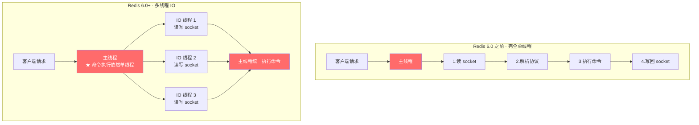


### 1.3 🔴 必背核心：Redis 为什么快（五因素深度解析）

| # | 原因 | 深度解释 | 量化数据 |
|---|------|---------|---------|
| 1 | **纯内存操作** | DRAM 随机读取延迟 ~100ns，SSD ~100μs，HDD ~10ms | 内存比磁盘快 ==10万倍== |
| 2 | **单线程无锁** | 无 mutex/CAS 开销，无上下文切换(每次切换 ~5μs)，CPU L1/L2 cache 命中率高 | 节省 30%+ CPU |
| 3 | **IO 多路复用** | Linux epoll：单线程管理万级 fd，只有就绪的 fd 才处理 | 10万连接仅占 ~40MB |
| 4 | **高效数据结构** | SDS O(1) strlen、跳表 O(logN)、intset 紧凑排列 | 比通用 HashMap 省 50%+ 内存 |
| 5 | **RESP 协议** | 文本协议，解析简单(逐行读取)，无需复杂序列化 | 解析成本 < 1μs/命令 |

#### 深入：epoll 为什么高效？

```c
// Linux epoll 核心三调用
int epfd = epoll_create(1);                    // 创建 epoll 实例
epoll_ctl(epfd, EPOLL_CTL_ADD, fd, &event);   // 注册感兴趣的 fd
int n = epoll_wait(epfd, events, max, timeout);// 等待就绪事件

// Redis 事件循环核心 (ae.c)
void aeMain(aeEventLoop *eventLoop) {
    eventLoop->stop = 0;
    while (!eventLoop->stop) {
        aeProcessEvents(eventLoop, AE_ALL_EVENTS);
    }
}
```

**epoll vs select/poll 对比**：

| 维度 | select | poll | epoll |
|------|--------|------|-------|
| fd 上限 | 1024 | 无限(链表) | 无限(红黑树) |
| 每次调用 | 全量拷贝 fd_set | 全量拷贝 pollfd | 无需拷贝(内核维护) |
| 就绪检查 | O(N) 遍历 | O(N) 遍历 | ==O(1) 回调通知== |
| 触发方式 | 水平触发 | 水平触发 | 水平/边缘触发 |

> 🟠 **重点**：epoll 用**红黑树**存储所有注册的 fd，用**就绪链表**存放有事件的 fd。`epoll_wait` 只返回就绪链表，不需要遍历所有连接。

### 1.4 🟠 重点理解：6.0 为什么引入多线程？

**问题演化**：
```
Redis 5.x 时代的瓶颈发现：
  - 命令执行(内存操作)：~100ns/命令 → 不是瓶颈
  - 网络IO(read/write)：~10μs/次 → ★ 成为瓶颈！
  - 大 value 场景(如 100KB)：网络IO占比 > 90%
```

**解决思路**：只把网络 IO 多线程化，命令执行保持单线程

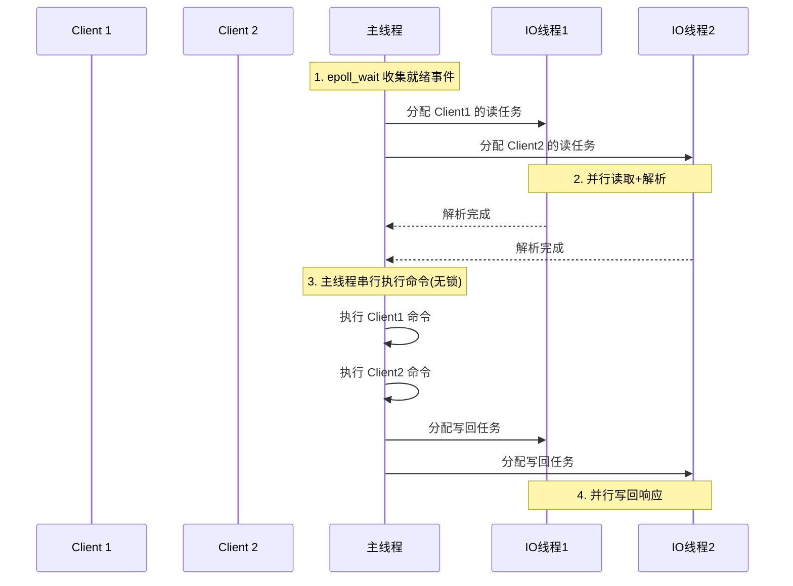

**配置方式**：
```bash
# redis.conf (6.0+)
io-threads-do-reads yes      # IO 线程处理读(默认只处理写)
io-threads 4                 # IO线程数，推荐 CPU核数-1，不超过8
```

**性能数据**：
| 配置 | GET QPS | SET QPS | 提升 |
|------|---------|---------|------|
| io-threads 1(默认) | 10万 | 8万 | 基准 |
| io-threads 4 | 20万+ | 15万+ | ~2倍 |
| io-threads 8 | 25万+ | 18万+ | 收益递减 |

> 🟢 **避坑：多线程IO不是万能的**
> - value < 1KB 的小对象场景，提升不明显（网络IO本身很快）
> - CPU密集型命令（SORT、ZUNIONSTORE）无法加速（仍是主线程执行）
> - 开启后增加了代码复杂度和调试难度


### 1.5 🟢 线上事故案例：KEYS * 导致全站502

> 🟢 **事故还原**：
> - **业务**：某社交App用户信息缓存，单实例 Redis 8GB，QPS 5万
> - **起因**：运维排查问题时在生产Redis执行 `KEYS user:*`（约200万个key）
> - **现象**：命令执行耗时 3.2 秒，期间所有客户端请求排队等待
> - **影响**：5万 QPS × 3.2秒 = 16万请求超时，网关触发熔断，全站502持续5秒
> - **根因**：KEYS 是 O(N) 命令，单线程模型下阻塞所有请求
> - **修复**：
>   1. 禁用危险命令：`rename-command KEYS ""`
>   2. 用 `SCAN` 替代(游标迭代，每次只处理小批量)
>   3. 加 Redis 慢查询告警：`slowlog-log-slower-than 10000`(10ms)

### 1.6 面试官追问（深度回答）

**Q1: Redis 单线程为什么这么快，瓶颈在哪？**

> 🔴 **完整回答（200+字）**：
>
> Redis 单线程能达到 10 万+ QPS，核心原因有五：纯内存操作（ns 级延迟）、单线程避免锁竞争和上下文切换、IO 多路复用（epoll 单线程管理万级连接）、精心设计的数据结构（SDS/跳表/压缩列表）、以及简洁的 RESP 文本协议。
>
> 瓶颈主要在两方面：一是**网络带宽**，当 value 较大（>10KB）或连接数极高时，网络 IO 成为主要耗时，这正是 Redis 6.0 引入多线程 IO 的原因；二是**单 key 大操作**，如 `HGETALL` 一个百万 field 的 Hash、`SORT` 大列表等 O(N) 命令会阻塞主线程。CPU 几乎不是瓶颈，所以单台机器加 CPU 核心对 Redis 性能提升不大，要靠 Cluster 水平扩展。
>
> **面试加分点**：可以提到 Redis 其实有三个后台线程（bio_close_file、bio_aof_fsync、bio_lazy_free）处理耗时的后台任务，所以说"Redis 是单线程"更准确的表述是"**命令执行是单线程**"。

**Q2: Redis 6.0 多线程默认开启吗？什么时候该开？**

> 🟠 **完整回答**：
>
> 默认关闭。需要显式配置 `io-threads-do-reads yes` 和 `io-threads N` 才生效。开启的判断标准：监控发现 Redis 实例 CPU 使用率不高（<50%）但 QPS 已经到瓶颈（10万+），且 `INFO` 中 `instantaneous_input_kbps` 较高（网络是瓶颈），此时开启多线程 IO 有明显收益。
>
> 不适合开启的场景：小 value（<1KB）读写、CPU 密集型 Lua 脚本、已有读写分离架构的场景。建议在测试环境压测验证效果后再上生产。

---

## 2. 5 大数据结构 + 底层实现

### 2.1 设计动机：为什么 Redis 要自己实现数据结构？

**C 标准库的不足**：
- `char*` 字符串：没有长度信息（O(N) strlen）、不二进制安全（\0 截断）、缓冲区溢出风险
- 没有通用的有序集合、集合操作库
- 通用数据结构对内存利用率低（大量指针、对齐浪费）

**Redis 的设计哲学**：==为每种数据量级选择最优的底层编码==

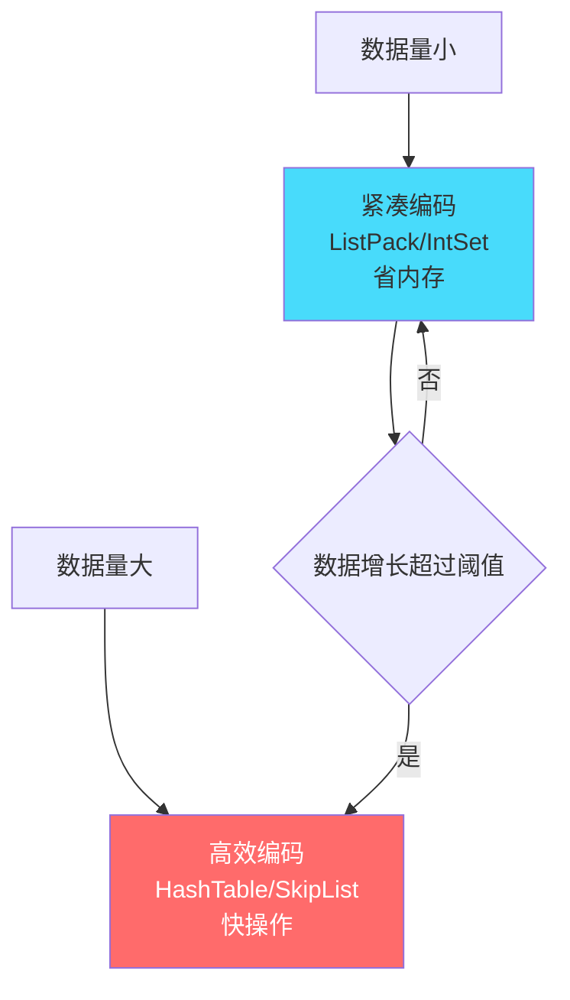


### 2.2 🔴 必背核心对照表

| 类型 | 命令 | 底层实现(Redis 7) | 编码转换阈值 | 典型场景 |
|------|------|------------------|-------------|---------|
| **String** | `SET/GET/INCR` | ==SDS==(int/embstr/raw) | 44字节(embstr→raw) | 缓存、计数器、分布式锁 |
| **List** | `LPUSH/RPOP/LRANGE` | ==QuickList==(listpack节点链) | - | 消息队列、最近列表 |
| **Hash** | `HSET/HGET` | ==ListPack==(小) / ==HashTable==(大) | 128个field / value>64B | 对象存储、购物车 |
| **Set** | `SADD/SMEMBERS/SINTER` | ==IntSet==(纯整数小) / ==HashTable== | 128个元素 / 非整数 | 标签、共同好友、抽奖 |
| **ZSet** | `ZADD/ZRANGE` | ==ListPack==(小) / ==SkipList+HashTable==(大) | 128个元素 / member>64B | 排行榜、延迟队列 |

> 🟠 **Redis 7 变化**：ziplist 被 listpack 替代，修复了 ziplist 的级联更新（cascade update）问题。面试时说 ziplist 也对（老版本），但提到 listpack 是加分项。

### 2.3 🔴 SDS（Simple Dynamic String）源码剖析

```c
// Redis 7 的 SDS 实现 (sds.h)
// 根据字符串长度选择不同的 header 节省内存
struct __attribute__ ((__packed__)) sdshdr8 {
    uint8_t len;        // 已用长度（O(1) 获取strlen）
    uint8_t alloc;      // 分配的总容量（不含header和\0）
    unsigned char flags; // 低3位表示type（sdshdr5/8/16/32/64）
    char buf[];         // 实际数据（柔性数组）
};

struct __attribute__ ((__packed__)) sdshdr16 {
    uint16_t len;
    uint16_t alloc;
    unsigned char flags;
    char buf[];
};
// 还有 sdshdr32、sdshdr64 用于超大字符串
```

**SDS vs C字符串 完整对比**：

| 维度 | C 字符串 `char*` | SDS |
|------|-----------------|-----|
| 获取长度 | O(N) 遍历到 \0 | ==O(1)== 读 len 字段 |
| 二进制安全 | ❌ (\0 截断) | ==✅== (按 len 判断结束) |
| 缓冲区溢出 | ❌ 需手动 realloc | ==✅== 自动扩容 |
| 修改N次字符串 | N 次 realloc | ==≤N 次==(空间预分配) |
| 内存释放 | 直接 free | ==惰性释放==(保留free空间) |

**空间预分配策略**：
```c
// sds.c - sdsMakeRoomFor
if (newlen < SDS_MAX_PREALLOC)   // SDS_MAX_PREALLOC = 1MB
    newlen *= 2;                  // 小于1MB：翻倍
else
    newlen += SDS_MAX_PREALLOC;   // 大于1MB：只加1MB
```

> 🟠 **为什么这样设计？** 小字符串增长快（翻倍），减少频繁 realloc；大字符串避免浪费（每次只加1MB）。

### 2.4 🔴 String 的三种编码

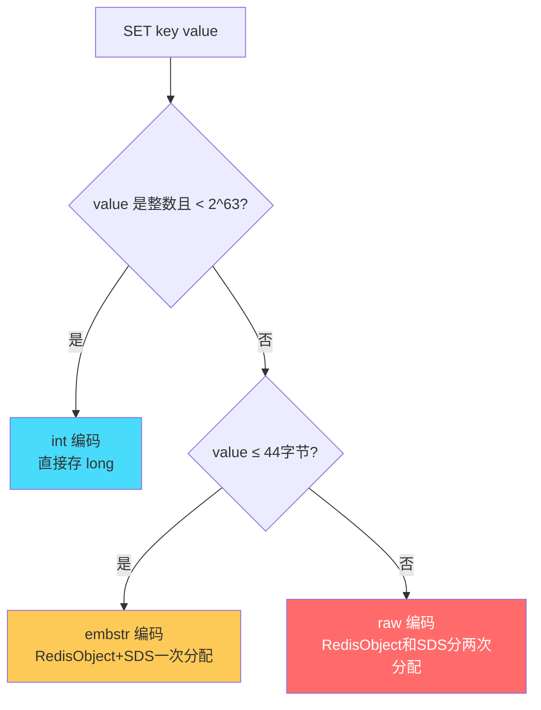

**为什么 embstr 阈值是 44？**
```
RedisObject: 16 bytes (type:4 + encoding:4 + lru:24 + refcount:4 + ptr:8)
sdshdr8:     3 bytes (len:1 + alloc:1 + flags:1)
字符串内容:   ? bytes
\0 结尾:     1 byte
jemalloc 分配 64 字节对齐

64 - 16 - 3 - 1 = 44 字节 ← embstr 最大长度
```

> 🟡 **加分**：embstr 只需一次内存分配（RedisObject 和 SDS 连续存储），CPU cache 友好。但 embstr 是只读的——任何修改操作会先转成 raw 再修改。


### 2.5 🔴 ZSet 跳表（SkipList）源码级理解

**为什么选跳表而不是红黑树？**

| 维度 | 红黑树 | 跳表 |
|------|--------|------|
| 查找复杂度 | O(logN) | O(logN) |
| 范围查询 | 需要中序遍历 | ==天然有序链表，直接遍历== |
| 实现复杂度 | 极复杂（左旋/右旋/染色） | ==简单（随机层级+链表）== |
| 内存占用 | 每节点3指针+颜色 | 平均每节点2指针(1/(1-p)) |
| 并发友好 | 需要复杂锁 | ==局部锁/CAS 更容易== |

> 🔴 antirez 原话：_"They are not very memory intensive. It's up to you basically. Changing parameters about the probability of a node to have a given number of levels will make then less memory intensive than btrees."_

**跳表结构图**：
```
Level 4:  HEAD ──────────────────────────────────────── 9 ──── NIL
Level 3:  HEAD ────────────── 4 ────────────────────── 9 ──── NIL
Level 2:  HEAD ──── 2 ─────── 4 ──── 6 ──────────── 9 ──── NIL
Level 1:  HEAD ─ 1 ─ 2 ─ 3 ─ 4 ─ 5 ─ 6 ─ 7 ─ 8 ─ 9 ──── NIL
```

**Redis 跳表源码关键结构**：
```c
// server.h
typedef struct zskiplistNode {
    sds ele;                          // member 值(SDS)
    double score;                     // ★ 分数(排序依据)
    struct zskiplistNode *backward;   // 后退指针(只有Level 0有)
    struct zskiplistLevel {
        struct zskiplistNode *forward; // 前进指针
        unsigned long span;            // ★ 跨度(用于计算RANK)
    } level[];                         // 柔性数组，层级
} zskiplistNode;

typedef struct zskiplist {
    struct zskiplistNode *header, *tail;
    unsigned long length;             // 节点数量
    int level;                        // 当前最大层级
} zskiplist;
```

**随机层级算法**：
```c
// t_zset.c - zslRandomLevel
#define ZSKIPLIST_MAXLEVEL 32    // 最大32层
#define ZSKIPLIST_P 0.25         // 晋升概率 25%

int zslRandomLevel(void) {
    int level = 1;
    // 每次有 25% 概率升一层
    while ((random()&0xFFFF) < (ZSKIPLIST_P * 0xFFFF))
        level += 1;
    return (level < ZSKIPLIST_MAXLEVEL) ? level : ZSKIPLIST_MAXLEVEL;
}
```

> 🟠 **为什么 p=0.25 而不是 0.5？**
> - p=0.5 时平均每个节点 2 个指针，查找最快但内存大
> - p=0.25 时平均每个节点 1.33 个指针，==省33%内存==，查找多一次比较(可忽略)
> - Redis 选择了内存效率优先

**ZSet 为什么同时用 SkipList + HashTable？**

```c
// server.h - ZSet 的底层结构
typedef struct zset {
    dict *dict;       // HashTable: member → score (O(1) 查分数)
    zskiplist *zsl;   // SkipList:  按 score 排序 (O(logN) 范围查询)
} zset;
```

| 操作 | 用哪个结构 | 复杂度 |
|------|-----------|--------|
| ZSCORE key member | dict | O(1) |
| ZRANK key member | zskiplist (span累加) | O(logN) |
| ZRANGE key 0 10 | zskiplist (从头遍历) | O(logN + M) |
| ZADD key score member | 两个都写 | O(logN) |

### 2.6 🟠 ListPack：ziplist 的继任者

**ziplist 的致命缺陷——级联更新**：

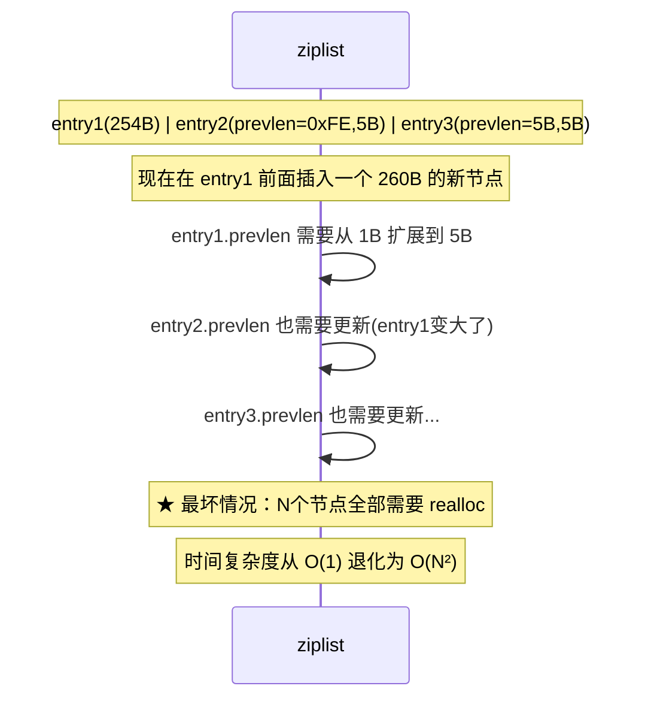

**listpack 的改进**：
- 每个 entry 只记录自己的长度，不记录前一个的长度
- 从后向前遍历通过 entry 末尾的 backlen 实现
- ==彻底消除级联更新问题==

### 2.7 🟡 数据结构选型决策树

```mermaid
flowchart TD
    A[需求分析] --> B{需要排序/排名?}
    B -->|是| C[ZSet<br/>ZADD+ZRANGE]
    B -->|否| D{需要去重?}
    D -->|是| E{需要交集/并集?}
    E -->|是| F[Set<br/>SINTER/SUNION]
    E -->|否| G{数据是对象(多字段)?}
    G -->|是| H[Hash<br/>HSET/HGET]
    G -->|否| I[Set 或 String]
    D -->|否| J{需要队列语义?}
    J -->|是| K[List(BLPOP)<br/>或 Stream]
    J -->|否| L[String<br/>SET/GET/INCR]

    style C fill:#ff6b6b,color:#fff
    style F fill:#48dbfb
    style H fill:#feca57
```

**记忆口诀**：
```
计数限流   → String INCR/DECR
分布式锁   → String SET NX PX
对象存储   → Hash (用户资料、商品信息)
社交关系   → Set (共同好友SINTER、推荐SDIFF)
排行榜     → ZSet (ZADD score + ZREVRANGE)
延迟队列   → ZSet (score=到期时间戳)
消息队列   → Stream (5.0+) 或 List BLPOP
位统计     → Bitmap (签到、在线状态)
基数统计   → HyperLogLog (UV、独立IP)
地理位置   → GeoHash (附近的人)
```

---

## 3. 持久化：RDB / AOF / 混合

### 3.1 设计动机：为什么内存数据库需要持久化？

**没有持久化的后果**：
```
Redis 重启 → 内存清空 → 所有缓存丢失
  → 所有请求打到 DB → DB 被打挂 → 缓存雪崩！
```

**两种持久化哲学**：
| 哲学 | 实现 | 类比 |
|------|------|------|
| "拍照片" | RDB 快照 | 定期给整个内存拍一张全量照片 |
| "记日记" | AOF 日志 | 每个写操作都记一笔流水账 |

### 3.2 🔴 三种持久化对比

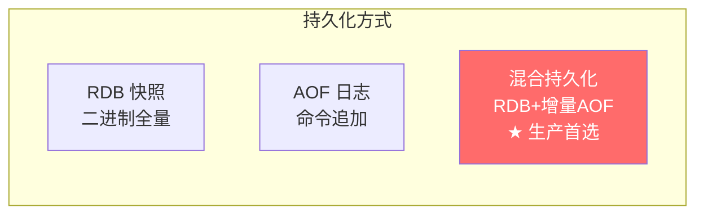

| 维度 | RDB | AOF | 混合(4.0+) |
|------|-----|-----|------------|
| 文件格式 | `dump.rdb` 二进制压缩 | `appendonly.aof` 文本命令 | RDB头 + AOF尾 |
| 恢复速度 | ⭐⭐⭐⭐⭐ 快(直接加载) | ⭐⭐ 慢(回放所有命令) | ⭐⭐⭐⭐ 较快 |
| 文件大小 | ⭐⭐⭐⭐⭐ 最小(压缩) | ⭐⭐ 最大(命令冗余) | ⭐⭐⭐⭐ 较小 |
| 数据完整性 | ⭐⭐ 可能丢5分钟 | ⭐⭐⭐⭐⭐ 最多丢1秒 | ⭐⭐⭐⭐⭐ 最多丢1秒 |
| fork阻塞 | 有(bgsave) | 有(bgrewriteaof) | 有(重写时) |
| CPU消耗 | 低(只在快照时) | 中(持续写盘) | 中 |
| 推荐用途 | 灾备、迁移、从节点 | 单用不推荐 | ==⭐ 生产首选== |


### 3.3 🔴 RDB 原理：bgsave + COW（Copy-On-Write）

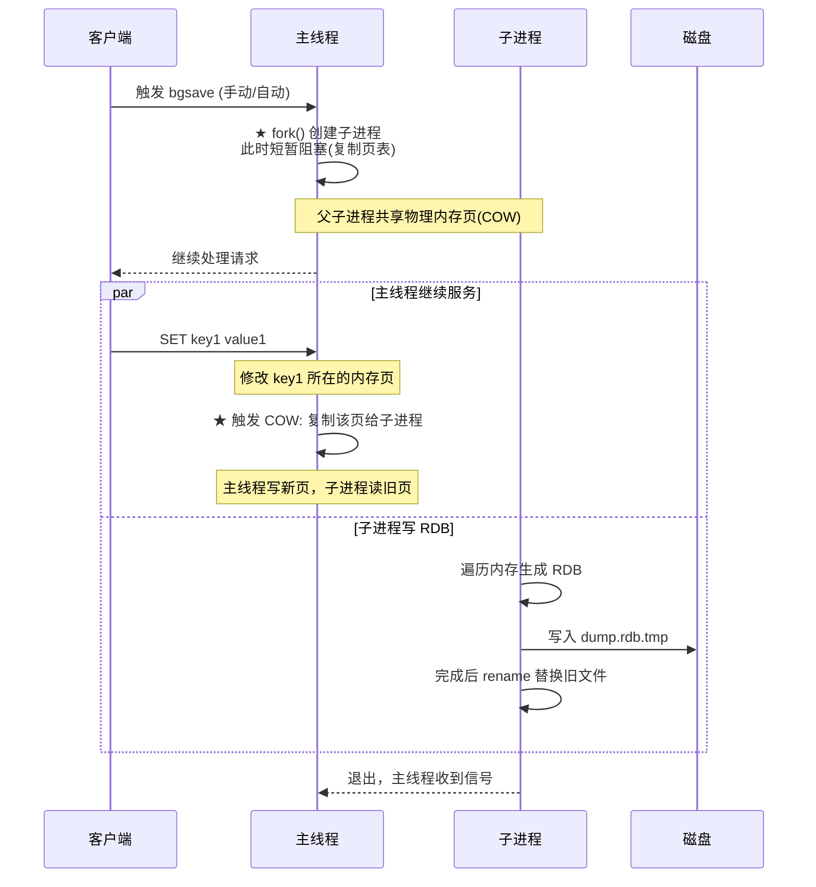

**关键源码**：
```c
// rdb.c - rdbSaveBackground
int rdbSaveBackground(char *filename) {
    if ((childpid = redisFork(CHILD_TYPE_RDB)) == 0) {
        // ★ 子进程
        retval = rdbSave(filename, rsi);
        exitFromChild((retval == C_OK) ? 0 : 1);
    } else {
        // ★ 父进程继续服务
        server.rdb_child_pid = childpid;
    }
}
```

**COW 的代价**：
| 场景 | 内存开销 |
|------|---------|
| 纯读业务(bgsave期间无写) | 几乎 0（只有页表复制） |
| 高写入场景(50%key被修改) | 最多 ==2倍内存==（所有修改页都复制一份） |
| 一般场景(10%key被修改) | 额外 10%~20% 内存 |

> 🟢 **避坑**：大内存实例（30GB+）fork 时复制页表耗时可达 ==数百毫秒甚至秒级==。
> - **建议**：单实例内存不超过 10GB
> - **监控**：`INFO` 中的 `latest_fork_usec` 字段

### 3.4 🔴 AOF 三种刷盘策略（深度分析）

```c
// aof.c - 刷盘核心逻辑
void flushAppendOnlyFile(int force) {
    // 将 aof_buf 写入 AOF 文件
    nwritten = aofWrite(server.aof_fd, server.aof_buf, sdslen(server.aof_buf));
    
    // 根据策略决定是否 fsync
    if (server.aof_fsync == AOF_FSYNC_ALWAYS) {
        redis_fsync(server.aof_fd);  // ★ 每次写都 fsync
    } else if (server.aof_fsync == AOF_FSYNC_EVERYSEC) {
        if (time(NULL) - server.aof_last_fsync >= 1)
            aof_background_fsync(server.aof_fd);  // ★ 后台线程 fsync
    }
    // AOF_FSYNC_NO: 不主动 fsync，由 OS 决定
}
```

| 策略 | `write()` | `fsync()` | 丢失风险 | 性能 |
|------|-----------|-----------|---------|------|
| `always` | 每条命令 | 每条命令 | 几乎不丢 | 最差(~1000 QPS) |
| `everysec` ⭐ | 每条命令 | 每秒一次(后台线程) | ==最多丢1秒== | 中(~10万 QPS) |
| `no` | 每条命令 | OS 决定(~30s) | 可能丢30秒 | 最好(~12万 QPS) |

> 🟠 **write vs fsync 的区别**：
> - `write()`：数据从用户空间 → 内核 Page Cache（很快，µs级）
> - `fsync()`：数据从 Page Cache → 磁盘（慢，ms级，等待磁盘确认）
> - 如果只 write 不 fsync，断电时 Page Cache 中的数据会丢失

### 3.5 🟠 AOF 重写机制深入

**为什么需要重写？**
```
AOF 持续追加：
  SET k 1    →   10 条 SET 命令
  SET k 2        只有最后一条有意义
  SET k 3        文件越来越大
  ...            恢复越来越慢
  SET k 10

重写后：
  SET k 10   →   1 条命令等价
```

**重写流程**：
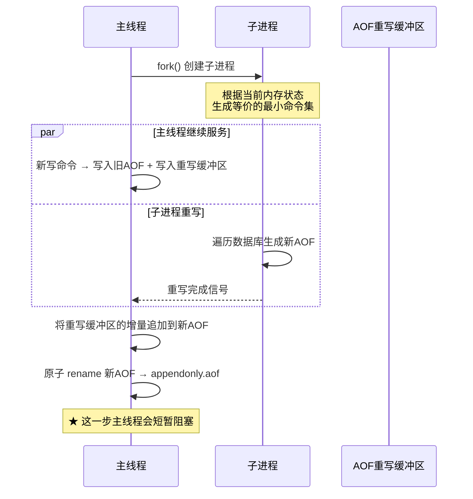

> 🟢 **线上事故：AOF 重写导致主从延迟飙升**
> - **场景**：32GB Redis 实例，AOF 重写时 fork 占用 1.5s，期间主线程阻塞
> - **现象**：客户端请求超时，从节点复制延迟突增
> - **修复**：
>   1. 降低 `auto-aof-rewrite-percentage` 从 100 到 50（更频繁但更快）
>   2. 开启 `no-appendfsync-on-rewrite yes`（重写期间不 fsync，降低磁盘IO）
>   3. 将实例拆分为多个小实例（每个 ≤ 8GB）

### 3.6 🔴 混合持久化（4.0+生产首选）

```bash
# redis.conf
aof-use-rdb-preamble yes   # ★ 开启混合持久化
```

**混合文件结构**：
```
┌──────────────────────────────────────────┐
│          RDB 格式数据(二进制)              │  ← 全量快照，恢复快
├──────────────────────────────────────────┤
│          AOF 格式命令(文本)               │  ← 重写后的增量，丢失少
└──────────────────────────────────────────┘
```

**恢复流程**：
1. 加载 RDB 头部（快速恢复绝大部分数据）
2. 回放 AOF 尾部（补齐重写后的增量，通常只有几秒的命令）
3. 恢复完成

> 🔴 **生产配置模板**：
```bash
# 持久化最佳配置
appendonly yes
appendfsync everysec
aof-use-rdb-preamble yes
auto-aof-rewrite-percentage 100
auto-aof-rewrite-min-size 64mb
no-appendfsync-on-rewrite yes
rdbcompression yes
rdbchecksum yes
```

---

## 4. 过期策略与内存淘汰

### 4.1 设计动机：为什么需要过期策略？

**问题**：Redis 作为缓存使用时，不可能无限增长。需要两个机制：
1. **过期删除**：key 设了 TTL，到期后怎么清理？
2. **内存淘汰**：内存满了（没设过期的 key 也占着），怎么腾空间？

### 4.2 🔴 过期 key 的三种处理机制

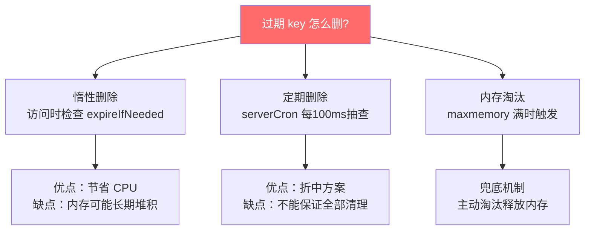

**惰性删除源码**：
```c
// db.c - expireIfNeeded
int expireIfNeeded(redisDb *db, robj *key) {
    if (!keyIsExpired(db, key)) return 0;  // 没过期，不处理
    
    // ★ 过期了！
    if (server.masterhost != NULL) return 1;  // slave不主动删(等master同步DEL)
    
    // 删除key + 传播DEL命令给从节点
    deleteExpiredKeyAndPropagate(db, key);
    return 1;
}
```

**定期删除源码**：
```c
// expire.c - activeExpireCycle（每100ms调用一次）
void activeExpireCycle(int type) {
    for (j = 0; j < dbs_per_call; j++) {
        do {
            // 每次随机取 20 个设了过期的 key
            num = dictGetSomeKeys(db->expires, keys, ACTIVE_EXPIRE_CYCLE_LOOKUPS_PER_LOOP);
            
            for (i = 0; i < num; i++) {
                if (activeExpireCycleTryExpire(db, keys[i], now)) {
                    expired++;  // 过期了就删
                }
            }
            // ★ 如果过期比例 > 25%，继续抽查（说明过期key很多）
        } while (expired > ACTIVE_EXPIRE_CYCLE_LOOKUPS_PER_LOOP / 4);
    }
}
```

> 🟠 **关键理解**：定期删除不是全量扫描！是**随机采样+概率清理**：
> - 每次随机取 20 个 key 检查
> - 如果其中超过 25%（5个）过期了，说明过期 key 很多，继续抽查
> - 直到过期比例 < 25% 或超时（默认 25ms），才停止


### 4.3 🔴 8 种内存淘汰策略（源码级理解）

```bash
# redis.conf
maxmemory 4gb
maxmemory-policy allkeys-lru    # ★ 生产推荐
```

| 策略 | 范围 | 算法 | 适用场景 | 性能 |
|------|------|------|---------|------|
| `noeviction` | - | 不淘汰,直接报错 | ==默认==,仅缓存不可丢时 | - |
| `allkeys-lru` ⭐ | 所有key | 近似LRU | ==通用缓存,推荐== | O(1) |
| `allkeys-lfu` | 所有key | 近似LFU | 热点明显,Redis 4.0+ | O(1) |
| `allkeys-random` | 所有key | 随机 | 无规律访问 | O(1) |
| `volatile-lru` | 有TTL的key | 近似LRU | 永久key+临时key混存 | O(1) |
| `volatile-lfu` | 有TTL的key | 近似LFU | 同上 | O(1) |
| `volatile-random` | 有TTL的key | 随机 | 同上 | O(1) |
| `volatile-ttl` | 有TTL的key | TTL最短优先 | 临近过期的优先淘汰 | O(1) |

### 4.4 🟠 LRU 的近似实现（为什么不用真正的LRU链表？）

**真正LRU的问题**：
- 维护一个双向链表，每次访问把节点移到头部
- 百万级 key 场景：每次GET都要修改链表指针 → ==额外的内存开销 + CPU开销==
- 链表本身占内存（每个节点 2个指针 = 16 字节/key）

**Redis 的近似 LRU**：
```c
// server.h - RedisObject 结构
typedef struct redisObject {
    unsigned type:4;      // 数据类型
    unsigned encoding:4;  // 编码方式
    unsigned lru:LRU_BITS; // ★ 24 bit! 记录最后访问时间
    int refcount;
    void *ptr;
} robj;

// 每次访问 key 时更新 lru 字段
// evict.c - 淘汰时随机采样比较
```

**采样淘汰流程**：
```mermaid
flowchart TD
    A[内存满了,需要淘汰] --> B[随机采样 N 个 key<br/>N = maxmemory-samples 默认5]
    B --> C[比较它们的 lru 字段]
    C --> D[淘汰 lru 最小(最久没访问)的那个]
    D --> E{内存够了?}
    E -->|否| B
    E -->|是| F[完成]
```

> 🟡 **加分**：Redis 3.0 引入了**淘汰池(eviction pool)**优化：维护一个大小为 16 的候选池，每次采样的 key 放入池中与已有的比较，保留最该淘汰的。效果接近真正LRU，但只用了 O(1) 空间。

### 4.5 🟠 LFU 的对数计数器

```c
// Redis 4.0+ LFU 编码(复用 lru 字段的 24 bit)
// 高 16 bit: ldt (Last Decrement Time) - 上次衰减时间
// 低 8 bit:  logc (Logarithmic Counter) - 对数计数器(0~255)

// 计数器增长(不是简单+1,而是概率增长)
uint8_t LFULogIncr(uint8_t counter) {
    if (counter == 255) return 255;      // 上限
    double r = (double)rand()/RAND_MAX;
    double baseval = counter - LFU_INIT_VAL;  // LFU_INIT_VAL = 5
    if (baseval < 0) baseval = 0;
    double p = 1.0/(baseval*server.lfu_log_factor+1); // ★ 概率递减!
    if (r < p) counter++;
    return counter;
}
```

**LFU 衰减机制**：
```c
// 随时间衰减，避免历史热点永远不被淘汰
unsigned long LFUDecrAndReturn(robj *o) {
    unsigned long ldt = o->lru >> 8;        // 上次衰减时间
    unsigned long counter = o->lru & 255;    // 当前计数
    unsigned long num_periods = server.lfu_decay_time ?
        LFUTimeElapsed(ldt) / server.lfu_decay_time : 0;
    if (num_periods) counter = (counter > num_periods) ? counter - num_periods : 0;
    return counter;
}
```

> 🟠 **LRU vs LFU 决策**：
> | 场景 | 选择 | 原因 |
> |------|------|------|
> | 通用缓存 | allkeys-lru | 简单有效，最近访问的大概率还会访问 |
> | 热点数据明显(电商首页) | allkeys-lfu | 频繁访问的商品不会被偶尔的冷数据挤掉 |
> | 定期批量导入(报表) | allkeys-lru | LFU 的旧数据计数器衰减慢，反而不好 |

### 4.6 🟢 线上事故：volatile-lru 导致数据丢失

> 🟢 **事故还原**：
> - **业务**：某订单服务用 Redis 存两类数据——缓存数据(有TTL)和业务计数器(无TTL永久)
> - **配置**：`maxmemory-policy volatile-lru`（只淘汰有TTL的key）
> - **问题**：所有缓存key都没设TTL(开发忽略)
> - **结果**：内存满了，volatile-lru 找不到任何有TTL的key，==行为等同 noeviction，所有写入直接报错==！
> - **影响**：订单写入全部失败持续 10 分钟，直到告警发现
> - **教训**：
>   1. 使用 `allkeys-lru` 更安全（不依赖开发者设置TTL）
>   2. 必须有 maxmemory 使用率监控和告警（> 80% 预警）
>   3. 所有缓存key强制设置TTL（代码规范+CodeReview检查）

---

## 5. 分布式锁完整方案

> 📌 本章节的"吃透版"详见 `分布式锁_吃透版_样板.md`，此处为精华摘要+补充内容。

### 5.1 🔴 为什么需要分布式锁？

```
单机锁(synchronized/ReentrantLock) → 只管一个 JVM 内的线程
分布式锁(Redis/ZK/etcd) → 管所有 JVM 实例的线程
```

**核心四要求**：互斥性 + 无死锁(TTL) + 容错性 + 归属性(unique_value)

### 5.2 🔴 演化史：三代方案

| 代数 | 方案 | 缺陷 |
|------|------|------|
| ❌ 第一代 | `SETNX` + `EXPIRE` 两条命令 | 非原子，crash后死锁 |
| ❌ 第二代 | Lua 脚本包装 | 可行但多余 |
| ✅ 第三代 | `SET key value NX PX ms` | ==当前标准==，一条命令原子完成 |

### 5.3 🔴 核心命令 + Lua释放

```bash
# 加锁
SET lock:order:123 "uuid-abc" NX PX 30000

# 释放锁(Lua保证原子)
if redis.call("GET", KEYS[1]) == ARGV[1] then
    return redis.call("DEL", KEYS[1])
else
    return 0
end
```

**为什么 Lua 是原子的？** Redis 单线程执行 Lua 脚本时，整个脚本作为一个命令，期间不处理其他客户端请求。

### 5.4 🔴 Redisson 看门狗机制

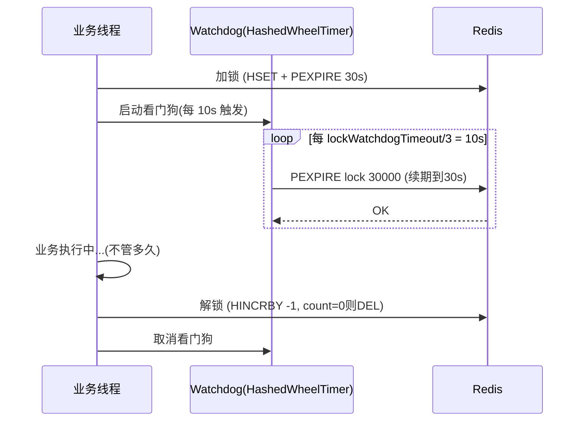

**核心源码要点**：
- 用 **Hash** 而不是 String：`HSET lock:order:123 "uuid:threadId" 1`
- 支持**可重入**：同一线程再次加锁 count+1
- `lock()` 不传超时 → 启用看门狗 ✅
- `lock(10, SECONDS)` 传了超时 → ==不启用看门狗== ⚠️

### 5.5 🟠 主从切换丢锁问题

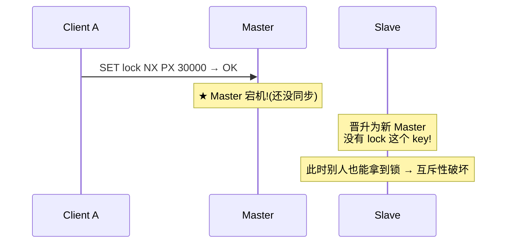

**概率**：主从复制延迟(1~10ms) × Master宕机概率 ≈ 百万分之一
**结论**：一般业务可接受；金融强一致用 ZK/etcd

### 5.6 🔴 Redis锁 vs ZK锁 vs etcd锁 决策

| 维度 | Redis(Redisson) | ZooKeeper | etcd |
|------|----------------|-----------|------|
| 一致性 | AP(可能丢锁) | ==CP(强一致)== | ==CP(强一致)== |
| 性能 | 10万+/s | 1万/s | 3万/s |
| 锁释放 | TTL过期 | Session断开自动释放 | Lease过期 |
| 公平性 | 非公平(抢占) | ==公平(顺序节点)== | 公平(Revision) |
| 适用 | 高并发容忍极小概率丢锁 | 强一致、公平锁 | K8s生态 |

**决策树**：
```
需要强一致? → 是 → ZK/etcd
             → 否 → Redis + DB兜底(乐观锁/唯一索引)
```

---

## 6. 缓存三大问题（穿透/击穿/雪崩）

### 6.1 🔴 一图概览

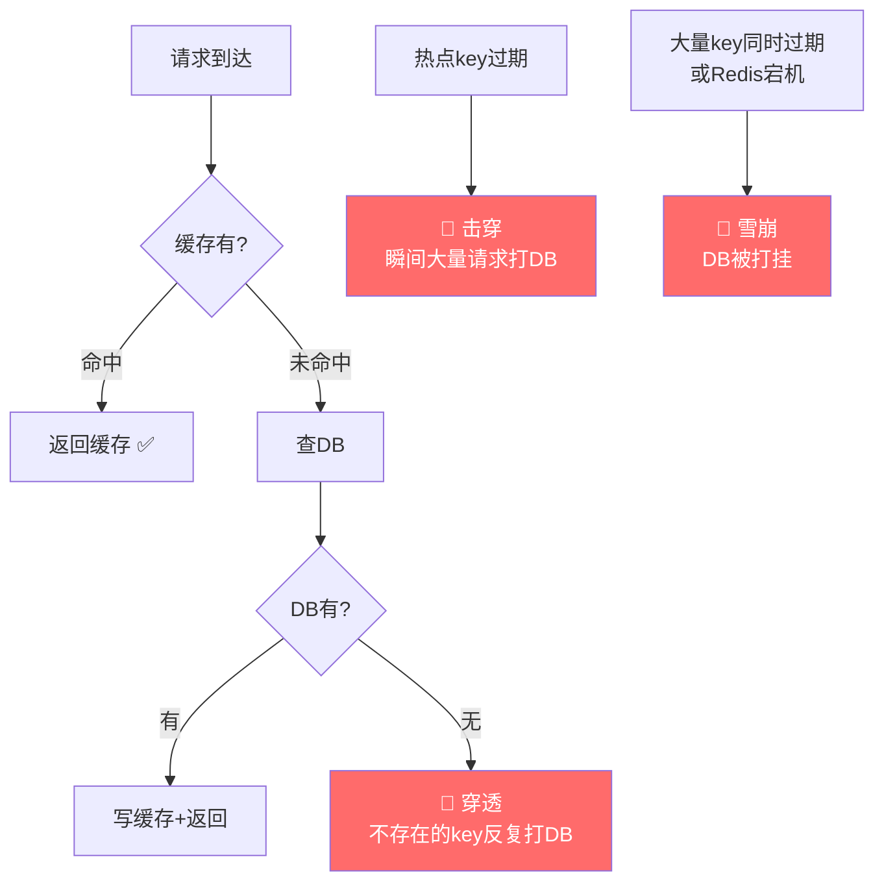


### 6.2 🔴 缓存穿透 — 深度剖析

**定义**：请求的 key 在缓存和 DB 中都不存在，每次都穿透到 DB。

**攻击场景**：恶意用户用 `id=-1` 或随机UUID 大量请求，绕过缓存直接打DB。

**解决方案对比**：

| 方案 | 原理 | 优点 | 缺点 | 适用 |
|------|------|------|------|------|
| 空值缓存 | 查不到也缓存null，设短TTL(5min) | 简单直接 | 大量不同key会撑爆缓存 | 正常业务穿透 |
| ==布隆过滤器== ⭐ | 所有合法ID加入BloomFilter | 高效(O(K))、内存极小 | 有误判(~1%)、不能删除 | 恶意攻击防护 |
| 接口校验+限流 | 参数合法性、签名、IP限流 | 根本防护 | 需要前端配合 | API网关层 |

**布隆过滤器原理**：
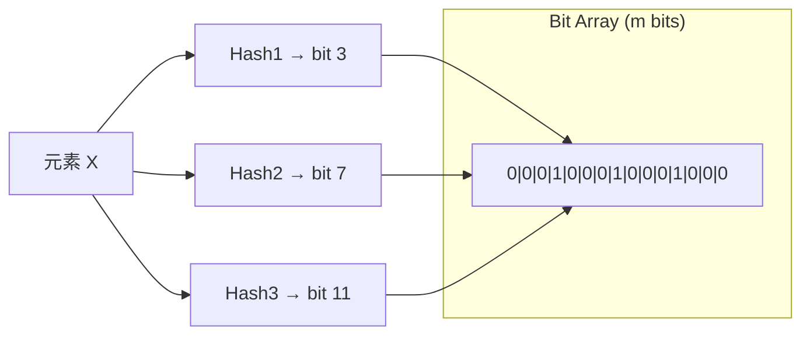

> 🔴 **核心语义**：
> - 布隆过滤器说"不存在" → ==一定不存在==（无漏判）
> - 布隆过滤器说"存在" → ==可能存在==（有误判，概率可控）

**Java 实现(Redisson BloomFilter)**：
```java
// 初始化
RBloomFilter<Long> bloomFilter = redisson.getBloomFilter("user:ids");
bloomFilter.tryInit(10_000_000L, 0.01); // 1千万元素，1%误判率

// 启动时加载所有合法ID
userDao.selectAllIds().forEach(bloomFilter::add);

// 查询前先过布隆
public User getUser(Long userId) {
    if (!bloomFilter.contains(userId)) {
        return null;  // ★ 一定不存在，直接拒绝
    }
    // 查缓存 → 查DB → 写缓存
    ...
}
```

### 6.3 🔴 缓存击穿 — 互斥锁方案源码

**定义**：单个热点 key 突然过期，瞬间大量请求打到 DB。

**互斥锁方案（完整Java代码）**：
```java
public Object queryWithMutex(String key) {
    // 1. 查缓存
    Object value = redis.get(key);
    if (value != null) return value;

    // 2. 缓存未命中，尝试获取互斥锁
    String lockKey = "lock:rebuild:" + key;
    boolean locked = redis.opsForValue()
        .setIfAbsent(lockKey, "1", 10, TimeUnit.SECONDS);
    
    if (locked) {
        try {
            // 3. 双重检查(获取锁后再查一次缓存)
            value = redis.get(key);
            if (value != null) return value;
            
            // 4. 查DB + 写缓存
            value = db.query(key);
            if (value != null) {
                redis.set(key, value, 30, TimeUnit.MINUTES);
            } else {
                redis.set(key, "NULL", 5, TimeUnit.MINUTES); // 空值缓存
            }
            return value;
        } finally {
            redis.delete(lockKey);  // 5. 释放锁
        }
    } else {
        // 6. 没抢到锁，等待后重试
        Thread.sleep(50);
        return queryWithMutex(key);  // 递归重试
    }
}
```

**逻辑过期方案（适合实时性要求不高的场景）**：
```java
// value 中存 逻辑过期时间
public class CacheData {
    private Object data;
    private LocalDateTime expireTime;  // 逻辑过期时间
}

public Object queryWithLogicalExpire(String key) {
    CacheData cacheData = redis.get(key);
    if (cacheData == null) return null;
    
    if (cacheData.getExpireTime().isAfter(LocalDateTime.now())) {
        return cacheData.getData();  // 未过期，直接返回
    }
    
    // 逻辑过期了，异步重建
    String lockKey = "lock:rebuild:" + key;
    if (redis.opsForValue().setIfAbsent(lockKey, "1", 10, SECONDS)) {
        // 异步线程重建缓存
        executor.submit(() -> {
            try {
                Object newData = db.query(key);
                CacheData newCache = new CacheData(newData, 
                    LocalDateTime.now().plusMinutes(30));
                redis.set(key, newCache);
            } finally {
                redis.delete(lockKey);
            }
        });
    }
    return cacheData.getData();  // ★ 返回旧数据(稍微过时但可用)
}
```

### 6.4 🔴 缓存雪崩 — 全方位防护

**两种触发原因**：
1. 大量 key 同时过期（定时刷缓存导致）
2. Redis 实例宕机

**解决方案矩阵**：

| 原因 | 方案 | 实现 |
|------|------|------|
| 同时过期 | ==TTL加随机扰动== | `expireTime + random(0, 300s)` |
| 同时过期 | 错峰更新 | 后台定时分批刷新，不等过期 |
| Redis宕机 | ==多级缓存== | 本地缓存(Caffeine) + Redis + DB |
| Redis宕机 | 高可用集群 | 主从+哨兵 / Cluster |
| 通用 | ==熔断限流== | Sentinel/Resilience4j 限制到DB的QPS |
| 通用 | 降级策略 | 返回兜底数据/默认值 |

**多级缓存架构**：
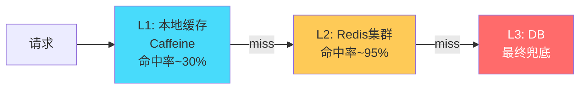

### 6.5 🟢 线上事故：缓存雪崩导致支付系统瘫痪

> 🟢 **事故还原**：
> - **业务**：支付系统缓存用户账户信息，每晚00:00定时全量刷新(先删再写)
> - **配置**：10万用户缓存，TTL统一设为24h，00:00集中过期+重建
> - **现象**：00:00:00 10万key同时过期，重建期间5秒内DB QPS从200飙到5万
> - **结果**：MySQL连接池耗尽，支付接口全部超时3分钟
> - **修复**：
>   1. TTL加随机：`24h + random(0, 1h)`
>   2. 改为渐进式预热：后台线程提前5分钟分批刷新
>   3. 加本地缓存Caffeine兜底（即使Redis全挂也有本地数据）
>   4. 加DB层限流：通过信号量限制并发查询数

### 6.6 面试追问

**Q: 缓存与DB双写一致性怎么保证？**

> 🔴 **完整回答（200+字）**：
>
> 核心方案是 **Cache Aside Pattern**：写操作先更新DB再删除缓存（不是更新缓存）。原因：如果两个并发写 A 和 B，更新缓存可能导致后写DB的A反而把缓存设成旧值（ABA问题）。删除缓存则让下次读自动加载最新值。
>
> 极端情况：删缓存失败怎么办？两种进阶方案：
> 1. **延迟双删**：写DB后删一次缓存，sleep 500ms 再删一次（覆盖读线程可能写入的旧缓存）
> 2. **订阅Binlog**：用 Canal 监听 MySQL binlog，异步删除对应缓存（最终一致性，可靠性最高）
>
> ```mermaid
> flowchart LR
>     A[写请求] --> B[更新DB]
>     B --> C[删除缓存]
>     B --> D[Canal监听Binlog]
>     D --> E[MQ]
>     E --> F[消费者删缓存<br/>失败重试]
> ```
>
> **面试加分**：强一致场景（金融），可以用 Redis + DB 在同一个分布式事务里（但性能差），或者用读写锁（Redisson RReadWriteLock）保证读写互斥。

---

## 7. 主从 / 哨兵 / 集群

### 7.1 🔴 三种部署模式演化

```
单机 → 容量不够/没有高可用
  ↓
主从复制 → 读写分离/数据备份，但不能自动故障转移
  ↓
哨兵 Sentinel → 自动故障转移，但容量受限于单机
  ↓
Cluster → 分片扩容 + 自动故障转移（终极形态）
```

| 模式 | 容量 | 高可用 | 适用 |
|------|------|--------|------|
| 单机 | 单机内存 | ❌ | 开发测试 |
| 主从 | 单机内存 | ❌(手动切) | 读写分离 |
| 哨兵 | 单机内存 | ✅(自动切) | 中小规模(<16GB) |
| Cluster | ==多机内存== | ✅ | 大规模(>16GB) |


### 7.2 🔴 主从复制流程（源码级理解）

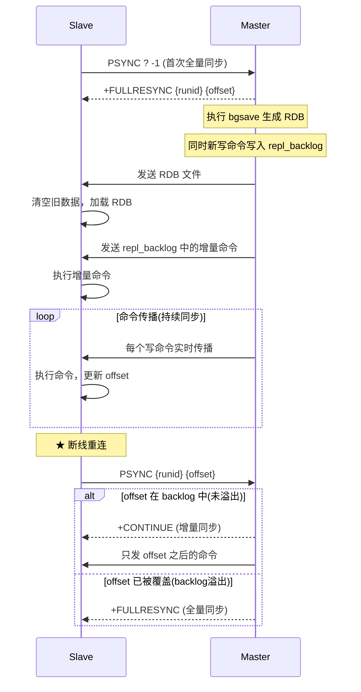

**repl_backlog 环形缓冲区**：
```
┌─────────────────────────────────────────┐
│  repl_backlog (默认 1MB)                 │
│  ┌───┬───┬───┬───┬───┬───┬───┬───┐     │
│  │CMD│CMD│CMD│...│CMD│CMD│   │   │     │
│  └───┴───┴───┴───┴───┴───┴───┴───┘     │
│       ↑                   ↑              │
│   master_repl_offset   slave_offset      │
│                                          │
│  如果 slave_offset 被追上(覆盖),         │
│  只能全量同步                             │
└─────────────────────────────────────────┘
```

> 🟠 **生产建议**：`repl-backlog-size` 设为 `写QPS × 平均命令大小 × 断线预期时长`。例如写QPS=1000，命令平均100B，最大容忍30s断线 → 设为 3MB。

### 7.3 🔴 Sentinel 哨兵选主机制

```mermaid
flowchart TD
    A[Sentinel定时PING Master] --> B{超过 down-after-milliseconds 无响应?}
    B -->|是| C[主观下线 SDOWN<br/>单个Sentinel认为Master挂了]
    C --> D[向其他Sentinel询问]
    D --> E{超过 quorum 个Sentinel同意?}
    E -->|是| F[客观下线 ODOWN<br/>★ 确认Master真的挂了]
    F --> G[Sentinel之间Raft选举Leader]
    G --> H[Leader Sentinel 执行故障转移]
    H --> I[选新Master规则:<br/>1.过滤不可用slave<br/>2.slave-priority最高<br/>3.复制偏移量最大(数据最新)<br/>4.runid最小(字典序)]
    I --> J[对选中的Slave执行 SLAVEOF NO ONE]
    J --> K[通知其他Slave指向新Master]
    K --> L[发布 +switch-master 事件<br/>客户端感知切换]

    style F fill:#ff6b6b,color:#fff
    style I fill:#feca57
```

> 🟢 **避坑：脑裂(Split Brain)**
> - **场景**：网络分区导致部分Sentinel联系不上Master，但Master其实还活着
> - **风险**：旧Master继续接受写入，新Master也在接受写入 → 数据不一致
> - **防护**：
> ```bash
> # 旧Master如果发现自己的slave数量不够，拒绝写入
> min-replicas-to-write 1      # 至少1个slave在同步
> min-replicas-max-lag 10      # slave延迟不超过10s
> ```

### 7.4 🔴 Cluster 集群分片

> 🔴 **核心**：16384 个哈希槽(slot)，`CRC16(key) % 16384` 决定 key 属于哪个槽。

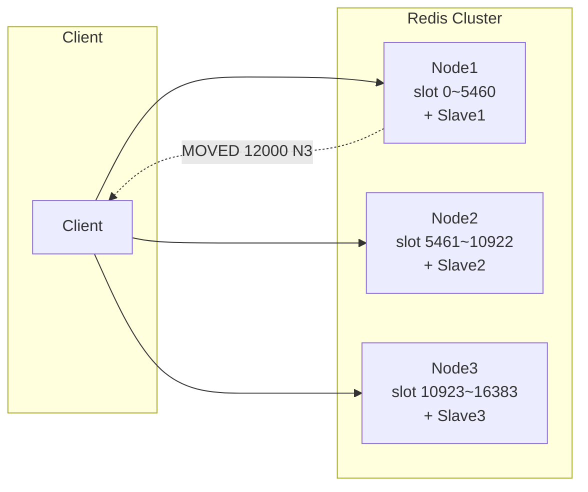

**MOVED vs ASK 重定向**：

| 类型 | 含义 | 客户端行为 |
|------|------|-----------|
| MOVED | slot 永久迁移到新节点 | 更新本地slot映射表，下次直接访问新节点 |
| ASK | slot 正在迁移中（还没完成） | 只这一次去新节点找，下次还访问旧节点 |

**为什么是 16384 个 slot？**

> 🟡 antirez 的三个原因：
> 1. **心跳包大小**：每个节点广播自己的 slot bitmap，16384 bit = 2KB；如果65536 = 8KB，集群100节点时心跳流量翻4倍
> 2. **集群规模设计目标 ≤ 1000节点**：16384/1000 ≈ 16 slot/节点，粒度足够细
> 3. **压缩率**：slot 通常连续分配，bitmap 压缩效果好

### 7.5 🟢 Cluster 限制与避坑

| 限制 | 原因 | 解决方案 |
|------|------|---------|
| 不支持多key命令(MGET跨槽) | 不同key可能在不同节点 | ==Hash Tag==: `{user1}:name`、`{user1}:age` |
| 不支持跨槽事务 | 同上 | Hash Tag强制同槽 |
| 不支持SELECT多DB | 集群模式只有db0 | 用key前缀区分业务 |
| Lua脚本key必须在同一节点 | 不能跨节点执行 | Hash Tag |

**Hash Tag 示例**：
```bash
# {} 内的部分作为hash计算依据
SET {user:1001}:name "张三"    # slot = CRC16("user:1001") % 16384
SET {user:1001}:age  25        # 同一个 slot!
MGET {user:1001}:name {user:1001}:age  # ✅ 可以了
```

---

## 8. Redis 6.0 多线程 IO（补充）

### 8.1 🟠 完整执行流程

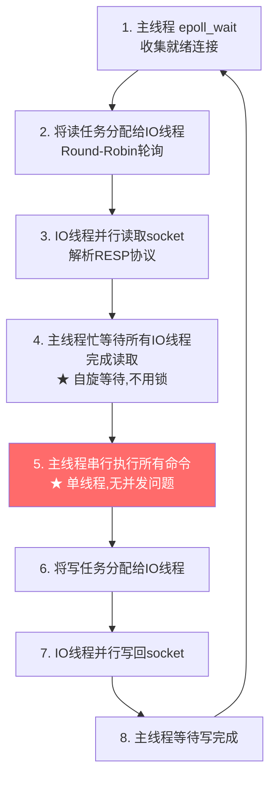

> 🟠 **关键设计**：主线程和IO线程之间==没有用锁==，而是用**原子变量+忙等待(spin)**同步。这避免了锁的开销，但要求IO线程处理速度快（否则主线程空转浪费CPU）。

### 8.2 🟢 多线程IO不能解决的问题

| 问题 | 原因 | 解决方案 |
|------|------|---------|
| 单key大操作(HGETALL 100万field) | 命令执行仍单线程 | 拆分大Hash为多个小Hash |
| CPU密集Lua脚本 | 同上 | 简化Lua,或用Module |
| 大key删除(DEL 大Hash) | 同上 | ==UNLINK==异步删除(4.0+) |
| 集群容量不足 | 单实例内存有限 | Cluster水平扩展 |

---

## 9. 缓存与DB双写一致性（补充章节）

### 9.1 🔴 四种策略对比

| 策略 | 流程 | 一致性 | 问题 |
|------|------|--------|------|
| 先更新DB,再更新缓存 | DB→Cache | ❌ 并发下ABA | 两个写并发,缓存值不确定 |
| 先更新缓存,再更新DB | Cache→DB | ❌ DB失败缓存脏 | 缓存新值但DB是旧值 |
| ==先更新DB,再删缓存== ⭐ | DB→DEL | ✅ 最终一致 | 极端情况短暂不一致 |
| 先删缓存,再更新DB | DEL→DB | ❌ 更容易不一致 | 删后读线程加载旧值 |

### 9.2 🔴 Cache Aside Pattern 详解

```mermaid
sequenceDiagram
    participant W as 写线程
    participant R as 读线程
    participant Cache as Redis
    participant DB as MySQL

    Note over W: 写操作
    W->>DB: UPDATE user SET name='新' WHERE id=1
    W->>Cache: DEL user:1
    
    Note over R: 读操作
    R->>Cache: GET user:1
    Cache-->>R: nil (miss)
    R->>DB: SELECT * FROM user WHERE id=1
    DB-->>R: {name:'新'}
    R->>Cache: SET user:1 {name:'新'} EX 1800
```

**极端不一致场景**（概率极低）：
```mermaid
sequenceDiagram
    participant R as 读线程
    participant W as 写线程
    participant Cache as Redis
    participant DB as MySQL

    R->>Cache: GET key → miss
    R->>DB: SELECT → 旧值 V1
    Note over R: ★ 读线程此时被挂起(GC/调度)
    W->>DB: UPDATE → 新值 V2
    W->>Cache: DEL key
    Note over R: 读线程恢复
    R->>Cache: SET key V1 (旧值!)
    Note over Cache: ★ 缓存是旧值V1, DB是新值V2
```

> 🟠 **为什么这个概率极低？** 需要"读线程DB查询完但还没写缓存"的瞬间，恰好有写线程完成了"更新DB+删缓存"。而且写DB通常比读DB慢得多，所以这个时序几乎不会发生。

**终极方案：订阅Binlog异步删缓存**：
```mermaid
flowchart LR
    A[业务服务] -->|1.更新DB| B[MySQL]
    A -->|2.删缓存(可能失败)| C[Redis]
    B -->|3.Binlog| D[Canal]
    D -->|4.解析变更| E[MQ(RocketMQ)]
    E -->|5.消费消息| F[缓存清理服务]
    F -->|6.删缓存(重试保证)| C
```

---


# 第二部分 · 消息队列

## 10. Kafka 架构与高性能

### 10.1 设计动机：Kafka 解决什么问题？

**LinkedIn 2011年面临的挑战**：
- 每天数十亿条日志/事件数据
- 现有MQ(ActiveMQ)吞吐不足、堆积就崩
- 需要同时服务实时消费和离线分析

**Kafka 设计目标**：
```
高吞吐(百万级/s) + 持久化(磁盘存储) + 水平扩展(Partition) + 消费回溯(Offset)
```

### 10.2 🔴 整体架构图

```mermaid
flowchart TB
    subgraph Producers
        P1[Producer 1]
        P2[Producer 2]
    end

    subgraph Kafka_Cluster["Kafka Cluster"]
        subgraph Broker1["Broker 1"]
            T1P0L["Topic-A P0 Leader"]
            T1P1F["Topic-A P1 Follower"]
        end
        subgraph Broker2["Broker 2"]
            T1P0F["Topic-A P0 Follower"]
            T1P1L["Topic-A P1 Leader"]
        end
        subgraph Broker3["Broker 3"]
            T1P0F2["Topic-A P0 Follower"]
            T1P1F2["Topic-A P1 Follower"]
        end
        Controller["Controller<br/>(KRaft/ZK)"]
    end

    subgraph Consumers["Consumer Group"]
        C1[Consumer 1 → P0]
        C2[Consumer 2 → P1]
    end

    P1 --> T1P0L
    P2 --> T1P1L
    T1P0L -.同步.-> T1P0F
    T1P0L -.同步.-> T1P0F2
    T1P1L -.同步.-> T1P1F
    T1P1L -.同步.-> T1P1F2
    T1P0L --> C1
    T1P1L --> C2

    style T1P0L fill:#ff6b6b,color:#fff
    style T1P1L fill:#ff6b6b,color:#fff
    style Controller fill:#feca57
```

### 10.3 🔴 核心概念深度解释

| 概念 | 本质 | 为什么这样设计 |
|------|------|--------------|
| **Topic** | 逻辑消息通道 | 按业务隔离(order-topic, log-topic) |
| **Partition** | ==有序追加日志文件== | ★ 并行度的核心! N个Partition = N路并行 |
| **Replica** | Partition的副本 | 容灾，Leader挂了从Follower选新Leader |
| **ISR** | 与Leader保持同步的副本集 | ACK=all时只需ISR全部确认 |
| **Offset** | 消息在Partition内的位置 | 消费者靠Offset追踪进度,支持回溯 |
| **Consumer Group** | 消费者组 | 组内每个Partition只分配一个Consumer |
| **Segment** | Partition的物理分段文件 | 便于清理旧数据(按时间/大小滚动) |

### 10.4 🔴 高性能 5 大核心技术

> 🔴 **记忆口诀**：`顺序写 + 零拷贝 + 批量 + 分区 + 索引`

#### 技术1：顺序写磁盘

**为什么顺序写能媲美内存？**
```
磁盘随机写：~100 IOPS (HDD) → 几百 KB/s
磁盘顺序写：~100MB/s (HDD)、600MB/s (SSD)
内存随机写：~10GB/s

关键洞察：磁盘顺序写 ≈ 内存随机写的性能!
```

Kafka 的消息文件是**只追加(append-only)**的日志：
```
Segment file (.log):
┌─────┬─────┬─────┬─────┬─────┬─────┐
│MSG 1│MSG 2│MSG 3│MSG 4│MSG 5│ ... │ → 只在末尾追加
└─────┴─────┴─────┴─────┴─────┴─────┘
```

#### 技术2：零拷贝（sendfile）

```mermaid
flowchart LR
    subgraph 传统方式["传统读文件发网络(4次拷贝)"]
        A1[磁盘] -->|1.DMA| K1[内核缓冲区]
        K1 -->|2.CPU| U1[用户缓冲区]
        U1 -->|3.CPU| K2[Socket缓冲区]
        K2 -->|4.DMA| N1[网卡]
    end

    subgraph 零拷贝["sendfile零拷贝(2次拷贝)"]
        A2[磁盘] -->|1.DMA| PC[Page Cache]
        PC -->|2.DMA scatter-gather| N2[网卡]
    end

    style PC fill:#ff6b6b,color:#fff
```

**Java层面**：
```java
// Kafka 使用 FileChannel.transferTo() 实现零拷贝
// 底层调用 sendfile() 系统调用
FileChannel fileChannel = new FileInputStream(segmentFile).getChannel();
fileChannel.transferTo(position, count, socketChannel);
```

> 🔴 **关键**：消费者拉取消息时，数据从**磁盘直接DMA到网卡**，完全绕过用户空间。这是 Kafka 消费吞吐超高的核心原因。

#### 技术3：批量处理

```java
// Producer 配置
props.put("batch.size", 16384);        // 批次大小 16KB
props.put("linger.ms", 5);             // 等待5ms凑批
props.put("compression.type", "lz4"); // 整批压缩

// 效果：1000条小消息 → 压缩成1个网络包发送
// 减少网络往返、减少磁盘IO次数
```

#### 技术4：分区并行

```
Topic: order-events (6 Partitions)

Partition 0 ──── Consumer 1 ──┐
Partition 1 ──── Consumer 2    ├── 并行消费
Partition 2 ──── Consumer 3    │
Partition 3 ──── Consumer 4    │
Partition 4 ──── Consumer 5    │
Partition 5 ──── Consumer 6 ──┘

吞吐 ≈ 单Partition吞吐 × Partition数
```

#### 技术5：稀疏索引

```
.log 文件 (实际消息)        .index 文件 (稀疏索引)
┌────────────────┐         ┌──────────────────┐
│ offset=0, pos=0│         │ offset=0 → pos=0 │
│ offset=1       │         │ offset=4 → pos=320│ ← 每隔4KB建一条
│ offset=2       │         │ offset=8 → pos=640│
│ offset=3       │         └──────────────────┘
│ offset=4,pos320│
│ ...            │         查找 offset=6:
└────────────────┘         1. 二分查找 index: 4 ≤ 6 < 8
                           2. 从 pos=320 开始顺序扫描
```

### 10.5 🔴 ACK 机制与数据可靠性

| acks | 含义 | 丢消息风险 | 性能 | 适用 |
|------|------|-----------|------|------|
| 0 | 不等确认 | 高(网络丢包就丢) | 最快 | 日志采集(可丢) |
| 1 | Leader写入即ack | 中(Leader挂可能丢) | 中 | 一般业务 |
| ==all(-1)== ⭐ | ISR全部写入 | ==极低== | 稍慢 | 金融/订单 |

**acks=all 的完整可靠配置**：
```bash
# Producer
acks=all
retries=Integer.MAX_VALUE
max.in.flight.requests.per.connection=5  # 配合幂等使用
enable.idempotence=true                   # 幂等Producer

# Broker
min.insync.replicas=2                     # ★ ISR至少2个才接受写入
unclean.leader.election.enable=false      # ★ 不允许非ISR副本当Leader
default.replication.factor=3              # 副本数3
```

> 🟢 **避坑：min.insync.replicas 的陷阱**
> - 如果设为2，但ISR只剩1个(其他Follower掉队) → Producer写入报错 `NotEnoughReplicasException`
> - 这是**故意设计**：宁可拒绝写入也不丢数据


### 10.6 🔴 ISR 机制源码级理解

```mermaid
sequenceDiagram
    participant P as Producer
    participant L as Leader (Broker 1)
    participant F1 as Follower 1 (ISR)
    participant F2 as Follower 2 (ISR)
    participant F3 as Follower 3 (非ISR,落后太多)

    P->>L: 发送消息 (acks=all)
    L->>L: 写入本地日志
    L->>F1: 等待 Follower 拉取(pull)
    L->>F2: 等待 Follower 拉取(pull)
    F1-->>L: 确认同步 ✅
    F2-->>L: 确认同步 ✅
    Note over F3: 落后超过 replica.lag.time.max.ms<br/>被踢出 ISR
    L-->>P: ACK (ISR全部确认)
```

**ISR 收缩与扩张**：
```
正常: ISR = {Leader, F1, F2, F3}
F3 落后 > 30s: ISR = {Leader, F1, F2}  ← 收缩
F3 追上来: ISR = {Leader, F1, F2, F3}  ← 扩张

关键配置:
replica.lag.time.max.ms=30000  # 落后30s踢出ISR
```

### 10.7 🔴 消费者 Rebalance 深入

**触发场景**：
1. Consumer 加入/退出 Group
2. Consumer 心跳超时(`session.timeout.ms` 默认45s)
3. Consumer 处理太慢(`max.poll.interval.ms` 默认5min)
4. 订阅的 Topic Partition 数变化

**Rebalance 的代价**：
- ==STW（Stop The World）==：整个消费组暂停消费
- 典型耗时：几秒到几十秒
- 期间消息积压

**四种分配策略对比**：

| 策略 | 原理 | Rebalance影响 | 推荐 |
|------|------|-------------|------|
| RangeAssignor | 按Topic的Partition范围分配 | 全量重分配 | 默认 |
| RoundRobinAssignor | 轮询所有Partition | 全量重分配 | - |
| StickyAssignor | 尽量保持原分配 | 只迁移必要的 | ✅ |
| ==CooperativeStickyAssignor== ⭐ | 协作式,分两轮rebalance | ==最小影响== | ==Kafka 2.4+ 推荐== |

**优化Rebalance的关键配置**：
```bash
# 避免误判Consumer挂了
session.timeout.ms=45000          # 心跳超时(不要太短)
heartbeat.interval.ms=15000       # 心跳间隔
max.poll.interval.ms=300000       # poll间隔上限(处理慢)
max.poll.records=500              # 每次poll的最大消息数

# 使用协作式分配
partition.assignment.strategy=org.apache.kafka.clients.consumer.CooperativeStickyAssignor
```

### 10.8 🟢 线上事故：Rebalance 风暴导致消费延迟

> 🟢 **事故还原**：
> - **业务**：订单处理消费者组，6个Consumer，处理逻辑含RPC调用(平均200ms/条)
> - **配置**：`max.poll.records=500`，`max.poll.interval.ms=300000`(5min)
> - **问题**：某次下游服务响应变慢(2s/条)，500条处理需要 500×2s = 1000s > 5min
> - **现象**：Consumer被判定超时踢出Group → 触发Rebalance → 其他Consumer接管又超时 → 连续Rebalance
> - **结果**：消费完全停止30分钟，积压百万消息
> - **修复**：
>   1. 降低 `max.poll.records` 到 50
>   2. 增大 `max.poll.interval.ms` 到 600000
>   3. 下游调用加超时(3s) + 熔断
>   4. 分离快慢消费(不同Group)

### 10.9 🔴 顺序保证机制

```mermaid
flowchart TD
    A[Kafka 顺序保证] --> B[Partition内有序<br/>★ 物理保证:追加写]
    A --> C[全局有序:单Partition<br/>牺牲并行度]
    A --> D[业务有序:同key同Partition<br/>★ 推荐]

    style B fill:#ff6b6b,color:#fff
    style D fill:#ff6b6b,color:#fff
```

```java
// 同一用户的消息进同一Partition
producer.send(new ProducerRecord<>(
    "order-events",
    String.valueOf(userId),  // ★ key → hash → partition
    orderEvent
));
```

> 🟠 **但是！有个坑**：`retries > 0` 且 `max.in.flight.requests.per.connection > 1` 时，重试可能导致乱序。解决：开启幂等Producer（`enable.idempotence=true`，底层用 PID+SeqNum 保证单Partition内exactly-once顺序）。

### 10.10 🟡 KRaft 模式（去ZooKeeper）

**为什么去ZK？**
- ZK 集群是额外的运维负担
- ZK 的元数据更新成为扩展瓶颈(百万级Partition场景)
- ZK Watcher 机制在大规模集群下有惊群问题

**KRaft 架构**：
```
Kafka 3.3+ (生产可用):
  Controller 节点(3~5个) 使用 Raft 协议管理元数据
  Broker 从 Controller 拉取元数据
  不再依赖 ZooKeeper
  
优势:
  - 架构简化(少运维一套ZK集群)
  - 支持百万级Partition(元数据管理更高效)
  - 启动/恢复更快
```

---

## 11. RabbitMQ 与交换机

### 11.1 🔴 核心模型

```mermaid
flowchart LR
    P[Producer] -->|Routing Key| EX{Exchange}
    EX -->|Binding Key 匹配| Q1[Queue 1]
    EX -->|Binding Key 匹配| Q2[Queue 2]
    Q1 --> C1[Consumer 1]
    Q2 --> C2[Consumer 2]

    style EX fill:#ff6b6b,color:#fff
```

> 🔴 **核心区别**：RabbitMQ 的 Producer ==不直接发到 Queue==，而是发到 Exchange，由 Exchange 根据路由规则分发。这提供了灵活的消息路由能力。

### 11.2 🔴 4 种交换机对比

| 类型 | 路由规则 | 匹配方式 | 典型场景 |
|------|---------|---------|---------|
| **Direct** | RoutingKey ==完全匹配== BindingKey | 精确 | 点对点(订单→订单服务) |
| **Fanout** | 忽略RoutingKey,==广播==所有绑定Queue | 广播 | 发布订阅(注册→邮件+积分+日志) |
| **Topic** | 通配符匹配(`*`一个词,`#`多个词) | 模糊 | 灵活路由(`order.*.created`) |
| **Headers** | 按消息Header属性匹配 | KV | 几乎不用(性能差) |

**Topic 通配符示例**：
```
Binding Key          Routing Key          匹配?
order.*.created      order.cn.created     ✅ (* = cn)
order.#              order.cn.vip.created ✅ (# = cn.vip.created)
order.*.created      order.created        ❌ (* 必须有一个词)
```

### 11.3 🔴 消息可靠性三段保障

```mermaid
flowchart LR
    A["1.Publisher Confirm<br/>生产端→Broker确认"] --> B["2.持久化<br/>Exchange+Queue+Message"]
    B --> C["3.Consumer ACK<br/>消费端手动确认"]

    style A fill:#ff6b6b,color:#fff
    style B fill:#ff6b6b,color:#fff
    style C fill:#ff6b6b,color:#fff
```

**完整Java代码**：
```java
// 1. Publisher Confirm (异步确认，性能更好)
channel.confirmSelect();
channel.addConfirmListener(new ConfirmListener() {
    @Override
    public void handleAck(long deliveryTag, boolean multiple) {
        // 消息已到达 Exchange ✅
    }
    @Override
    public void handleNack(long deliveryTag, boolean multiple) {
        // 消息未到达，需要重发 ⚠️
        retryPublish(deliveryTag);
    }
});

// 2. 持久化
channel.exchangeDeclare("order.exchange", "direct", true); // durable=true
channel.queueDeclare("order.queue", true, false, false, null); // durable=true
AMQP.BasicProperties props = new AMQP.BasicProperties.Builder()
    .deliveryMode(2)  // persistent
    .build();
channel.basicPublish("order.exchange", "order.create", props, msg.getBytes());

// 3. 手动ACK
channel.basicConsume("order.queue", false, (tag, delivery) -> {
    try {
        processMessage(delivery.getBody());
        channel.basicAck(tag, false);                // ✅ 确认
    } catch (RetryableException e) {
        channel.basicNack(tag, false, true);         // ↻ 重回队列重试
    } catch (FatalException e) {
        channel.basicNack(tag, false, false);        // → 进死信队列
    }
});
```

### 11.4 🟠 死信队列（DLX）机制

**消息变成"死信"的三种情况**：
1. 消费者 reject/nack 且 `requeue=false`
2. 消息 TTL 过期
3. 队列满了(超过 `x-max-length`)

```mermaid
flowchart LR
    P[Producer] --> EX[业务Exchange]
    EX --> Q[业务Queue<br/>x-dead-letter-exchange=dlx<br/>x-message-ttl=60000]
    Q --> C[Consumer]
    C -->|nack requeue=false| Q
    Q -->|死信| DLX[死信Exchange]
    DLX --> DLQ[死信Queue]
    DLQ --> DC[死信Consumer<br/>告警/人工处理]

    style DLX fill:#ff6b6b,color:#fff
    style DLQ fill:#feca57
```

**利用 DLX 实现延迟队列**：
```bash
# 方案：消息设TTL → 过期变死信 → 路由到消费队列
# 缺点：如果队头消息TTL最长，后面短TTL的也出不来（队头阻塞）
# 解决：RabbitMQ 3.8+ 用 延迟插件(rabbitmq_delayed_message_exchange)
```

### 11.5 🟢 避坑与事故

> 🟢 **事故：autoAck=true 导致订单丢失**
> - **场景**：订单消费者配置 `autoAck=true`，消费逻辑含DB写入
> - **问题**：消息取出后立即ACK，但DB写入失败(超时)
> - **结果**：消息已确认(从Queue删除)，但业务没处理成功 → 订单丢失
> - **修复**：改为手动ACK，DB写入成功后才确认

> 🟢 **普通集群 vs 镜像队列**：
> - 普通集群：只复制元数据(Exchange/Queue定义)，==消息只在一个节点==
> - 镜像队列(`ha-mode: all`)：消息复制到所有节点，真正高可用
> - RabbitMQ 3.8+ 推荐 ==Quorum Queue==（基于Raft，替代镜像队列）

---

## 12. RocketMQ 与事务消息

### 12.1 🔴 整体架构

```mermaid
flowchart TB
    subgraph NameServer["NameServer集群(无状态)"]
        NS1[NS1]
        NS2[NS2]
    end

    subgraph Broker["Broker集群"]
        BM1["Master1<br/>CommitLog"]
        BS1["Slave1"]
        BM2["Master2<br/>CommitLog"]
        BS2["Slave2"]
    end

    P[Producer] -.路由发现.-> NS1
    P -->|发消息| BM1
    C[Consumer] -.路由发现.-> NS1
    C -->|拉消息| BM1

    BM1 -.主从同步.-> BS1
    BM2 -.主从同步.-> BS2
    BM1 --30s心跳--> NS1
    BM2 --30s心跳--> NS2

    style BM1 fill:#ff6b6b,color:#fff
    style BM2 fill:#ff6b6b,color:#fff
```

**与Kafka架构对比**：

| 维度 | Kafka | RocketMQ |
|------|-------|----------|
| 元数据管理 | ZK/KRaft(有状态) | ==NameServer(无状态)== |
| 存储结构 | 每Partition一个日志文件 | ==所有Topic共享CommitLog== |
| 消费模式 | Pull | Pull(长轮询模拟Push) |
| 事务消息 | 0.11+简单支持 | ==完整半消息+回查== |
| 延迟消息 | 不原生支持 | 18个固定级别 |

### 12.2 🔴 事务消息流程（面试重中之重）

```mermaid
sequenceDiagram
    participant P as Producer
    participant B as Broker
    participant DB as 业务DB

    P->>B: 1. 发送半消息(Half Message)
    Note over B: 半消息存入内部Topic<br/>(RMQ_SYS_TRANS_HALF_TOPIC)<br/>对Consumer不可见
    B-->>P: 2. ACK(半消息存储成功)

    P->>DB: 3. 执行本地事务(如：扣款)
    
    alt 事务成功
        P->>B: 4a. COMMIT
        Note over B: 将半消息转存到目标Topic<br/>Consumer可见
    else 事务失败
        P->>B: 4b. ROLLBACK
        Note over B: 删除半消息
    else Producer宕机/网络异常
        Note over B: ★ 没收到二次确认!
        loop 每60s回查(最多15次)
            B->>P: 5. checkLocalTransaction(msgId)
            P->>DB: 查询本地事务状态
            DB-->>P: 已提交/未提交
            P->>B: COMMIT 或 ROLLBACK
        end
    end
```

**Java 实现**：
```java
TransactionMQProducer producer = new TransactionMQProducer("tx-group");
producer.setTransactionListener(new TransactionListener() {
    
    @Override
    public LocalTransactionState executeLocalTransaction(Message msg, Object arg) {
        // ★ 执行本地事务
        try {
            OrderDTO order = (OrderDTO) arg;
            orderService.createOrder(order);  // 写DB
            return LocalTransactionState.COMMIT_MESSAGE;
        } catch (Exception e) {
            log.error("本地事务失败", e);
            return LocalTransactionState.ROLLBACK_MESSAGE;
        }
    }

    @Override
    public LocalTransactionState checkLocalTransaction(MessageExt msg) {
        // ★ Broker回查：你的事务到底成功没？
        String orderId = msg.getKeys();
        Order order = orderDao.findById(orderId);
        if (order != null && order.getStatus() == OrderStatus.CREATED) {
            return LocalTransactionState.COMMIT_MESSAGE;
        } else {
            return LocalTransactionState.ROLLBACK_MESSAGE;
        }
    }
});
```

> 🟠 **为什么事务消息能保证最终一致性？**
> - 本地事务成功 + 半消息COMMIT → Consumer收到消息 → 最终一致
> - 本地事务成功但COMMIT丢失 → Broker回查 → 发现已成功 → COMMIT → 最终一致
> - 本地事务失败 → ROLLBACK → 消息永远不投递 → 一致
> - Producer彻底宕机 → 回查15次无响应 → 默认ROLLBACK → 一致（需要人工补偿）

### 12.3 🔴 顺序消息

```java
// Producer: 同一OrderId → 同一MessageQueue
SendResult result = producer.send(msg, new MessageQueueSelector() {
    @Override
    public MessageQueue select(List<MessageQueue> mqs, Message msg, Object arg) {
        Long orderId = (Long) arg;
        int index = (int)(orderId % mqs.size());
        return mqs.get(index);
    }
}, order.getId());

// Consumer: 顺序消费(单线程消费同一Queue)
consumer.registerMessageListener(new MessageListenerOrderly() {
    @Override
    public ConsumeOrderlyStatus consumeMessage(
            List<MessageExt> msgs, ConsumeOrderlyContext context) {
        // ★ 同一Queue串行执行,保证顺序
        for (MessageExt msg : msgs) {
            processOrderEvent(msg);
        }
        return ConsumeOrderlyStatus.SUCCESS;
    }
});
```

### 12.4 🟡 三大MQ选型对比

| 维度 | Kafka | RocketMQ | RabbitMQ |
|------|-------|----------|----------|
| 单机吞吐 | ==百万级== | 十万级 | 万级 |
| 消息延迟 | ms级(批量导致) | ==ms级== | ==μs级(最低)== |
| 顺序消息 | 单Partition有序 | ==完美支持== | 单Queue单Consumer |
| 事务消息 | 简单支持 | ==★ 完整方案== | ❌ |
| 延迟消息 | ❌ 需自己实现 | ✅ 18级别 | TTL+DLX模拟 |
| 消息回溯 | ✅ offset重置 | ✅ 时间戳 | ❌ |
| 协议 | 自定义 | 自定义 | ==AMQP标准== |
| 生态 | 大数据(Flink/Spark) | ==阿里生态== | Spring生态 |
| 运维 | 中(需ZK/KRaft) | 中(NameServer) | 低(Erlang自带) |
| **适用** | **日志/大数据/流** | **金融/电商/订单** | **复杂路由/低延迟** |

---

## 13. MQ 通用问题

### 13.1 🔴 消息丢失：全链路防护

```mermaid
flowchart LR
    subgraph 生产端
        P[Producer]
    end
    subgraph Broker
        B[Broker集群]
    end
    subgraph 消费端
        C[Consumer]
    end

    P -->|"① Confirm/acks=all<br/>确保到达Broker"| B
    B -->|"② 持久化+副本<br/>确保不丢"| B
    B -->|"③ 手动ACK<br/>确保处理完"| C

    style P fill:#feca57
    style B fill:#ff6b6b,color:#fff
    style C fill:#feca57
```

| 环节 | Kafka | RocketMQ | RabbitMQ |
|------|-------|----------|----------|
| 生产→Broker | acks=all + retries | sendResult检查 | Publisher Confirm |
| Broker内部 | replica≥3 + min.insync≥2 | 同步刷盘/同步复制 | 镜像队列/Quorum Queue |
| Broker→消费 | 手动commitSync | ACK | 手动basicAck |


### 13.2 🔴 重复消费：幂等设计（4种方案）

> 🔴 **核心**：MQ ==无法保证 Exactly Once==（网络是不可靠的），必须靠业务幂等。

| 幂等方案 | 实现 | 适用场景 |
|---------|------|---------|
| ==DB唯一索引== | `INSERT ... ON DUPLICATE KEY` | 创建类操作(订单、用户) |
| ==状态机== | `UPDATE SET status=2 WHERE status=1` | 状态变更(支付、审批) |
| ==去重表/Redis== | `SET msgId NX EX 86400` | 通用去重 |
| ==乐观锁== | `UPDATE SET amount=X WHERE version=V` | 金额变更(余额、库存) |

**完整去重示例**：
```java
public void handleMessage(MessageExt msg) {
    String msgId = msg.getMsgId();
    
    // 1. Redis去重(快速判断)
    Boolean isNew = redis.opsForValue()
        .setIfAbsent("msg:consumed:" + msgId, "1", 24, TimeUnit.HOURS);
    if (!Boolean.TRUE.equals(isNew)) {
        log.info("消息已消费过,跳过: {}", msgId);
        return;  // 幂等：重复消息直接跳过
    }
    
    try {
        // 2. 处理业务(DB层再加唯一索引兜底)
        processBusiness(msg);
    } catch (DuplicateKeyException e) {
        // DB唯一索引拦住了（Redis判断有极小窗口的竞态）
        log.info("DB唯一索引拦截重复: {}", msgId);
    } catch (Exception e) {
        // 业务失败，删除Redis标记，允许下次重试
        redis.delete("msg:consumed:" + msgId);
        throw e;
    }
}
```

### 13.3 🔴 消息顺序保证总结

```
全局有序(严格): 单Partition + 单Consumer (牺牲并行度)
业务有序(推荐): 同业务key → 同Partition → 同Consumer
局部有序(折中): 多Partition + 消费端本地排序
```

### 13.4 🟢 消息积压处理方案

> 🟢 **线上事故：促销活动消息积压300万**
> - **场景**：双11零点，下单量暴涨10倍，Consumer处理不过来
> - **现象**：消费lag从0涨到300万，延迟超过30分钟
> - **应急方案**（按优先级执行）：

| 步骤 | 操作 | 效果 |
|------|------|------|
| 1 | ==扩容Consumer==（Partition数允许范围内） | 立即提升消费速度 |
| 2 | 降级非核心消费逻辑（关推荐、关日志） | 减少单条处理时间 |
| 3 | 临时Topic中转：快速消费旧消息转存到新Topic | 释放原Topic |
| 4 | 限流上游Producer（MQ背压） | 防止继续恶化 |

**预防措施**：
```bash
# 监控告警
consumer_lag > 10000 → 黄色预警
consumer_lag > 100000 → 红色告警 + 自动扩容
```

### 13.5 面试追问

**Q: Kafka 怎么实现 Exactly Once？**

> 🟡 **完整回答（200+字）**：
>
> Kafka 的 Exactly Once 分两个层面：
>
> **1. Producer → Broker（幂等Producer）**：
> 开启 `enable.idempotence=true`，每个Producer实例分配一个PID(Producer ID)，每条消息带序列号。Broker 端对同一PID+Partition维护已接收的最大SeqNum，重复序列号的消息自动丢弃。这保证了单Partition内的Exactly Once。
>
> **2. 跨Partition原子写入（事务）**：
> 通过 `transactional.id` 开启事务模式，支持跨多Partition原子写入：要么全部成功，要么全部回滚。消费端配合 `isolation.level=read_committed` 只读已提交的消息。
>
> **3. Consumer端业务级Exactly Once**：
> Kafka本身只能保证"至少一次投递"。真正的业务级Exactly Once需要：Offset和业务操作在同一个事务里提交（如将Offset存入业务DB，和业务数据同一个事务）。
>
> **面试加分**：Kafka Streams 的 `processing.guarantee=exactly_once_v2` 封装了上述逻辑，流处理场景开箱即用。

---

# 第三部分 · 存储与搜索

## 14. MySQL 分库分表（ShardingSphere）

### 14.1 设计动机：什么时候该分？

> 🔴 **经验阈值**（非绝对标准）：
> - 单表行数 > ==500万== 或 数据量 > ==2GB==：查询开始变慢
> - 单库写QPS > ==1000==：MySQL单实例写入瓶颈
> - 单库连接数 > ==1000==：连接池耗尽

**不要过早分库分表！** 分表带来的复杂度远超想象：
```
分表前：一条 SQL 搞定
分表后：路由 + 改写 + 多库执行 + 归并 + 分布式ID + 跨库Join + 分页 + 事务...
```

### 14.2 🔴 垂直 vs 水平

```mermaid
flowchart TD
    A[分库分表策略] --> B[垂直拆分]
    A --> C[水平拆分]

    B --> B1["垂直分库<br/>按业务拆<br/>(用户库/订单库/商品库)"]
    B --> B2["垂直分表<br/>按字段拆<br/>(主表: id+name+核心字段<br/>扩展表: id+大text+blob)"]

    C --> C1["水平分库<br/>同表分到多个库<br/>(db0.t_order, db1.t_order)"]
    C --> C2["水平分表<br/>同库内分多表<br/>(t_order_0, t_order_1, ...)"]

    style A fill:#ff6b6b,color:#fff
```

**垂直拆分的本质**：==降低单表/单库的复杂度==
**水平拆分的本质**：==解决数据量太大的问题==

### 14.3 🔴 ShardingSphere 执行流程

```mermaid
flowchart LR
    A["原SQL<br/>SELECT * FROM t_order<br/>WHERE user_id=100<br/>ORDER BY create_time<br/>LIMIT 10"] --> B["1.SQL解析<br/>(ANTLR4语法树)"]
    B --> C["2.SQL路由<br/>user_id % 2 = 0<br/>→ ds_0.t_order_0"]
    C --> D["3.SQL改写<br/>t_order → t_order_0<br/>LIMIT 10 → LIMIT 0,10"]
    D --> E["4.SQL执行<br/>并行发到各数据源"]
    E --> F["5.结果归并<br/>流式归并/内存归并<br/>排序+分页+聚合"]
    F --> G[返回最终结果]

    style C fill:#ff6b6b,color:#fff
    style F fill:#ff6b6b,color:#fff
```

### 14.4 🔴 分片键选择（面试重点）

| 策略 | 算法 | 优点 | 缺点 | 适用 |
|------|------|------|------|------|
| ==哈希取模== ⭐ | `hash(key) % N` | 数据均匀 | 扩容需迁移数据 | 通用(user_id) |
| 范围分片 | `id 1~1000万→db0` | 易扩容、范围查询快 | 热点(最新数据集中) | 时间序列(日志) |
| 一致性哈希 | hash环 | 扩容只动1/N数据 | 实现复杂 | 缓存层 |

> 🔴 **分片键选择黄金法则**：
> 1. 必须是**查询条件中高频出现**的字段（否则全库扫描）
> 2. 尽量选**分布均匀**的字段（避免数据倾斜）
> 3. 最好是**不可变**的字段（user_id比status好）

### 14.5 🔴 分页问题（经典难题）

**问题本质**：`LIMIT 10000, 10` 在分库后，每个库都不知道全局的第10000条在哪。

```mermaid
sequenceDiagram
    participant App as 应用层
    participant DB0 as 数据库0
    participant DB1 as 数据库1

    App->>DB0: SELECT * ORDER BY time LIMIT 0, 10010
    App->>DB1: SELECT * ORDER BY time LIMIT 0, 10010
    DB0-->>App: 返回 10010 条
    DB1-->>App: 返回 10010 条
    App->>App: 合并 20020 条<br/>全局排序<br/>取第 10001~10010 条
    Note over App: ★ 深翻页时内存爆炸!
```

**解决方案**：

| 方案 | 思路 | 适用 |
|------|------|------|
| ==禁止深翻页== ⭐ | 产品层面限制最多100页 | 所有场景(根本解决) |
| ==游标分页(seek)== ⭐ | `WHERE id > last_id LIMIT 10` | 翻下一页(无法跳页) |
| 二次查询 | 先查各库的min/max，再精确查 | 允许跳页的场景 |
| ES辅助 | 把数据同步到ES，ES做分页 | 搜索+分页场景 |

```java
// 游标分页示例
SELECT * FROM t_order 
WHERE user_id = ? AND id > #{lastId}  -- ★ 基于上一页最后一条的ID
ORDER BY id ASC 
LIMIT 10
```

### 14.6 🟠 跨库Join解决方案

| 方案 | 说明 | 限制 |
|------|------|------|
| ==绑定表== | 关联表用相同分片键(order和order_item都按user_id分) | 需提前设计 |
| ==广播表== | 小字典表全库都有一份(省市区、配置表) | 表要小且不常变 |
| ==应用层Join== | 拆成两次查询，内存合并 | 数据量不能太大 |
| ==冗余字段== | 把需要Join的字段冗余到主表 | 数据一致性维护 |

### 14.7 🔴 分布式ID方案

| 方案 | 原理 | 优点 | 缺点 |
|------|------|------|------|
| UUID | 随机128bit | 简单、无依赖 | ==无序==,B+Tree频繁页分裂 |
| ==Snowflake== ⭐ | 64bit: 时间戳+机器+序号 | 趋势递增、性能高 | 时钟回拨问题 |
| 号段模式(Leaf) | 从DB批量获取一段ID | 高性能、可容灾 | 需额外服务 |
| Redis INCR | 原子自增 | 简单高性能 | Redis单点 |

**Snowflake 64bit结构**：
```
┌──┬─────────────────────────────────────┬──────────┬──────────────┐
│0 │ 41bit 时间戳(ms)                     │ 10bit 机器│ 12bit 序列号 │
│  │ 可用69年                              │ 1024节点  │ 4096/ms      │
└──┴─────────────────────────────────────┴──────────┴──────────────┘
```

> 🟢 **时钟回拨解决方案**：
> 1. 检测到回拨 → 抛异常拒绝生成（简单粗暴）
> 2. 容忍小幅回拨（<5ms）→ 等待追上
> 3. 使用NTP平滑调整而非跳变

---

## 15. ElasticSearch 架构与倒排索引

### 15.1 🔴 整体架构

```mermaid
flowchart TB
    subgraph Cluster["ES Cluster"]
        subgraph Node1["Node1 (Master+Data)"]
            P0["Index-A Shard0 Primary"]
            R1["Index-A Shard1 Replica"]
        end
        subgraph Node2["Node2 (Data)"]
            R0["Index-A Shard0 Replica"]
            P1["Index-A Shard1 Primary"]
        end
        subgraph Node3["Node3 (Coordinating)"]
            CO[协调节点<br/>路由+归并]
        end
    end

    Client[Client] -->|请求| CO
    CO -.路由.-> P0
    CO -.路由.-> P1

    style P0 fill:#ff6b6b,color:#fff
    style P1 fill:#ff6b6b,color:#fff
    style CO fill:#feca57
```

### 15.2 🔴 核心概念（对比MySQL）

| ES | MySQL类比 | 说明 |
|----|----------|------|
| Index | Database | 逻辑索引 |
| Document | Row | 一条JSON文档 |
| Field | Column | 字段 |
| Mapping | Schema | 字段类型定义(创建后不可改) |
| Shard | 分表 | 索引分片,==创建时确定不可改== |
| Replica | 从库 | 分片副本(提高可用性+读性能) |
| Segment | - | Lucene最小存储单元(不可变) |

### 15.3 🔴 倒排索引（核心原理）

**正排 vs 倒排**：
```
正排索引(MySQL B+Tree): 文档ID → 文档内容 (适合按ID查)
倒排索引(ES):          词条(Term) → 文档ID列表 (适合全文搜索)
```

```mermaid
flowchart LR
    subgraph 构建倒排
        D1["Doc1: '分布式系统设计'"]
        D2["Doc2: '分布式锁实现'"]
        D3["Doc3: '系统架构设计'"]
    end
    
    subgraph 倒排索引
        T1["'分布式' → [Doc1, Doc2]"]
        T2["'系统' → [Doc1, Doc3]"]
        T3["'设计' → [Doc1, Doc3]"]
        T4["'锁' → [Doc2]"]
        T5["'架构' → [Doc3]"]
    end

    D1 & D2 & D3 -->|分词+建索引| T1 & T2 & T3 & T4 & T5
```

**倒排索引的组成**：
```
Term Dictionary (词典):  所有唯一词条,排序存储,支持二分查找
Term Index (词条索引):   FST(有限状态转换器)压缩的前缀树,常驻内存
Posting List (倒排表):   每个词条对应的文档ID列表 + 位置 + 词频
```

> 🟠 **为什么倒排索引搜索快？**
> 1. Term Index 常驻内存（FST压缩后极小）
> 2. 通过Term Index快速定位到Term Dictionary的位置
> 3. 再通过Term Dictionary找到Posting List
> 4. Posting List用跳表(Skip List)加速合并(AND/OR)

### 15.4 🔴 写入流程（NRT近实时）

```mermaid
sequenceDiagram
    participant C as Client
    participant Coord as Coordinating Node
    participant P as Primary Shard
    participant R as Replica Shard

    C->>Coord: PUT /index/_doc/1 {...}
    Coord->>Coord: hash(_routing) % shard_num → 确定Primary
    Coord->>P: 转发到Primary Shard
    P->>P: 1. 写入 In-Memory Buffer
    P->>P: 2. 写入 Translog (fsync保证)
    P-->>Coord: Primary写入成功
    P->>R: 异步同步到Replica
    R-->>P: Replica确认
    Coord-->>C: 201 Created

    Note over P: ★ 每1秒 Refresh
    P->>P: Buffer → 新Segment (可搜索!)
    Note over P: ★ 每30分钟 Flush
    P->>P: Segment持久化磁盘 + 清空Translog
    Note over P: 后台 Merge
    P->>P: 合并小Segment → 大Segment
```

**关键时间节点**：
| 事件 | 时机 | 作用 |
|------|------|------|
| Refresh | ==每1秒== | Buffer→Segment，文档可搜索（==NRT=近实时==） |
| Translog fsync | 每次写入 | 防止宕机丢数据（类比MySQL redo log） |
| Flush | 每30分钟/Translog>512MB | Segment持久化，清空Translog |
| Merge | 后台自动 | 合并小Segment提升查询性能 |

### 15.5 🔴 深度分页解决方案

**问题**：`from=10000, size=10` → 每个Shard返回10010条 → Coordinating Node合并排序 → 极慢!

| 方案 | 原理 | 适用 | 限制 |
|------|------|------|------|
| from+size | 全量取回排序 | 浅翻页(<1万) | 深翻页性能爆炸 |
| ==Search After== ⭐ | 基于上一页排序值 | 实时翻页 | 不能跳页 |
| Scroll | 游标快照(维持在Shard) | 全量导出/报表 | 不实时+消耗资源 |
| PIT + Search After | 7.10+ 增强版 | 实时+一致性快照 | 版本要求 |

```bash
# Search After 示例
GET /order/_search
{
  "size": 10,
  "sort": [
    {"create_time": "desc"},
    {"_id": "asc"}           // ★ 必须有唯一排序字段
  ],
  "search_after": [1700000000, "order_abc123"]  // 上一页最后一条的sort值
}
```

### 15.6 🟠 分词器选择

| 分词器 | 适用 | 示例 |
|--------|------|------|
| standard | 英文(按空格/标点) | "Hello World" → [hello, world] |
| ik_smart | 中文粗粒度 | "中华人民共和国" → [中华人民共和国] |
| ik_max_word | 中文细粒度 | "中华人民共和国" → [中华人民, 中华, 人民共和国, ...] |
| keyword | 不分词 | "ABC-123" → [ABC-123] (精确匹配) |

> 🟢 **最佳实践**：写入用 `ik_max_word`（尽可能多分词，覆盖更多搜索词），查询用 `ik_smart`（精准匹配用户意图）。

---


# 第四部分 · 协调与通信

## 16. ZooKeeper 与 ZAB

### 16.1 设计动机：ZooKeeper 解决什么问题？

**分布式系统的协调难题**：
- 多节点如何就"谁是Leader"达成一致？
- 配置变更如何通知所有节点？
- 分布式锁如何避免死锁？

**ZooKeeper 定位**：==分布式协调服务==，提供一致性的小型数据存储 + 通知机制。

### 16.2 🔴 数据模型（ZNode树）

```mermaid
flowchart TD
    R["/"] --> S["/services"]
    R --> L["/locks"]
    R --> C["/configs"]
    S --> S1["/services/order"]
    S1 --> S1A["192.168.1.1:8080<br/>(临时节点)"]
    S1 --> S1B["192.168.1.2:8080<br/>(临时节点)"]
    L --> L1["/locks/order_123"]
    L1 --> L1A["lock-0000000001<br/>(临时顺序)"]
    L1 --> L1B["lock-0000000002<br/>(临时顺序)"]
    C --> C1["/configs/db.url<br/>= jdbc:mysql://..."]

    style S1A fill:#feca57
    style S1B fill:#feca57
    style L1A fill:#48dbfb
    style L1B fill:#48dbfb
```

### 16.3 🔴 4 种 ZNode 类型

| 类型 | 生命周期 | 特点 | 典型用途 |
|------|---------|------|---------|
| 持久节点 PERSISTENT | 永久存在 | 显式删除才消失 | 配置存储 |
| 持久顺序 PERSISTENT_SEQ | 永久+自增序号 | 名称自动追加递增数字 | 分布式队列 |
| ==临时节点 EPHEMERAL== | Session结束自动删 | ★ 不能有子节点 | 服务注册(心跳) |
| ==临时顺序 EPHEMERAL_SEQ== | Session结束删+序号 | ★ 分布式锁核心 | 公平锁 |

### 16.4 🔴 ZAB 协议（两种模式）

```mermaid
flowchart TD
    A[ZAB 协议] --> B["消息广播模式<br/>(正常工作)"]
    A --> C["崩溃恢复模式<br/>(Leader故障)"]

    B --> B1[Leader收到写请求]
    B1 --> B2[生成 Proposal + 全局递增 zxid]
    B2 --> B3[广播给所有 Follower]
    B3 --> B4[等待过半 ACK]
    B4 --> B5[发送 COMMIT]
    B5 --> B6[所有节点提交]

    C --> C1[检测到Leader失联]
    C1 --> C2[所有节点进入LOOKING状态]
    C2 --> C3[选举: 比zxid → 比myid]
    C3 --> C4[新Leader当选]
    C4 --> C5[数据同步(补齐差异)]
    C5 --> B

    style B fill:#feca57
    style C fill:#ff6b6b,color:#fff
```

### 16.5 🔴 Leader 选举详解

```mermaid
sequenceDiagram
    participant S1 as Server1 (myid=1, zxid=8)
    participant S2 as Server2 (myid=2, zxid=8)
    participant S3 as Server3 (myid=3, zxid=7)

    Note over S1,S3: Leader 故障,进入 LOOKING 状态
    
    S1->>S1: 投自己 (1, zxid=8)
    S2->>S2: 投自己 (2, zxid=8)
    S3->>S3: 投自己 (3, zxid=7)

    S1->>S2: 我投(1, 8)
    S2->>S1: 我投(2, 8)
    S3->>S1: 我投(3, 7)
    S3->>S2: 我投(3, 7)

    Note over S1,S3: 选举规则: 先比zxid(大优先) → 再比myid(大优先)
    Note over S1: 收到(2,8): zxid相同, myid 2>1 → 改投(2,8)
    Note over S3: 收到(2,8): zxid 8>7 → 改投(2,8)
    
    Note over S2: 收到过半投票 → 成为 Leader!
    S2->>S1: 我是Leader
    S2->>S3: 我是Leader
    Note over S3: 同步数据: zxid 7→8
```

> 🔴 **选举规则记忆**：==数据新(zxid大) 优先于 编号大(myid大)==。因为数据越新的节点当Leader，丢失的数据越少。

### 16.6 🔴 ZK 分布式锁 vs Redis 锁

**ZK锁实现原理**：
```mermaid
flowchart TD
    A["Client A 加锁"] --> B["在/lock/下创建临时顺序节点<br/>/lock/seq-0001"]
    B --> C{"我是最小节点?"}
    C -->|是| D["获得锁 ✅"]
    C -->|否| E["Watch前一个节点<br/>(只watch seq-0000)"]
    E --> F["收到前节点删除通知"]
    F --> C
    
    D --> G["业务完成,删除节点"]
    G --> H["后面的节点收到通知"]
```

**为什么Watch前一个而不是Watch锁节点？**
- Watch锁节点：锁释放时所有等待者同时被唤醒（==惊群效应==）
- Watch前一个：只唤醒下一个等待者（==公平+高效==）

**完整对比**：
| 维度 | Redis锁 | ZK锁 |
|------|---------|------|
| 一致性 | AP(可能丢锁) | ==CP(强一致)== |
| 性能 | 10万/s | 1万/s |
| 死锁防护 | TTL过期 | Session断开自动删 |
| 公平性 | 非公平 | ==天然公平(顺序节点)== |
| 实现 | SET NX + Lua | 临时顺序节点 + Watch |
| 适用 | 高并发,容忍极小丢锁 | 强一致,金融场景 |

### 16.7 🔴 典型应用场景

| 场景 | 实现方式 | 核心机制 |
|------|---------|---------|
| 服务注册发现 | 服务启动创建临时节点,客户端Watch | 临时节点 + Watch通知 |
| 配置中心 | 持久节点存配置,客户端Watch变更 | Watch + getData |
| 分布式锁 | 临时顺序节点,最小获锁 | EPHEMERAL_SEQUENTIAL |
| 集群选主 | 抢创建同名临时节点 | 创建成功者为Leader |
| 分布式队列 | 顺序节点入队,最小出队 | PERSISTENT_SEQUENTIAL |

### 16.8 🟢 ZK 的局限性

> 🟢 **避坑**：
> - **不适合存大数据**：每个ZNode默认限制1MB，设计用于协调而非存储
> - **写性能有限**：每次写都要Leader提议+过半同步，~1万QPS
> - **选举期间不可用**：Leader故障到新Leader选出(~200ms~数秒)期间无法处理请求
> - **Session管理开销**：大量临时节点 + 频繁Session创建/销毁会给集群带来压力

---

## 17. Netty 线程模型与零拷贝

### 17.1 设计动机：为什么需要Netty？

**Java 原生 NIO 的痛点**：
```
1. API 复杂（Selector/Channel/Buffer 三件套使用繁琐）
2. ByteBuffer 共用读写指针，需要 flip() 切换（极易出bug）
3. 空轮询 bug（epoll 在某些Linux内核下CPU 100%）
4. 没有解决粘包/拆包
5. 没有连接池、心跳、重连等高级功能
```

**Netty 的价值**：在 NIO 之上封装高性能网络框架，屏蔽底层复杂性。

### 17.2 🔴 主从 Reactor 模型

```mermaid
flowchart TB
    subgraph Boss["Boss Group (1个EventLoop)"]
        BL["BossEventLoop<br/>职责: Accept新连接"]
    end

    subgraph Worker["Worker Group (N个EventLoop, N=CPU×2)"]
        W1["EventLoop-1<br/>管理Channel-A,C,E"]
        W2["EventLoop-2<br/>管理Channel-B,D,F"]
        W3["EventLoop-3<br/>管理Channel-G,H"]
    end

    Client["Client连接"] -->|accept| BL
    BL -->|注册| W1
    BL -->|注册| W2
    BL -->|注册| W3

    W1 --> P1["Pipeline:<br/>Decode→Business→Encode"]
    W2 --> P2["Pipeline:<br/>Decode→Business→Encode"]

    style BL fill:#ff6b6b,color:#fff
    style W1 fill:#feca57
    style W2 fill:#feca57
    style W3 fill:#feca57
```

> 🔴 **核心设计**：
> - **BossGroup**：专门Accept连接，一般1个线程够了
> - **WorkerGroup**：处理IO读写+业务，默认 CPU核数×2 个线程
> - **一个Channel绑定一个EventLoop**：整个生命周期不会切换线程（==无锁化==）
> - **一个EventLoop管理多个Channel**：多路复用

### 17.3 🔴 核心组件关系

```mermaid
flowchart TD
    B[ServerBootstrap] --> BG[BossGroup<br/>NioEventLoopGroup]
    B --> WG[WorkerGroup<br/>NioEventLoopGroup]
    BG --> EL1[EventLoop = Thread + Selector + TaskQueue]
    WG --> EL2[EventLoop]
    WG --> EL3[EventLoop]
    EL2 --> CH1[Channel = NioSocketChannel]
    EL2 --> CH2[Channel]
    CH1 --> PP[ChannelPipeline = 双向链表]
    PP --> H1[InboundHandler: 解码]
    PP --> H2[InboundHandler: 业务]
    PP --> H3[OutboundHandler: 编码]
```

### 17.4 🔴 ChannelPipeline 责任链

```mermaid
flowchart LR
    subgraph Pipeline["ChannelPipeline"]
        direction LR
        Head[HeadContext] -->|入站→| I1[Decoder<br/>ByteToMessage]
        I1 --> I2[BusinessHandler<br/>处理业务]
        I2 --> O1[Encoder<br/>MessageToByte]
        O1 --> Tail[TailContext]
        Tail -.出站←.-> O1
        O1 -.出站←.-> Head
    end

    IN[Socket Read] --> Head
    Tail -.-> OUT[Socket Write]
```

> 🔴 **入站(Inbound)**：数据从网络到应用，Head→Tail 方向
> **出站(Outbound)**：数据从应用到网络，Tail→Head 方向
> **ctx.fireChannelRead()**：传给下一个InboundHandler
> **ctx.write()**：传给上一个OutboundHandler

### 17.5 🔴 Netty 零拷贝（4种）

| 技术 | 层级 | 原理 | 效果 |
|------|------|------|------|
| ==DirectByteBuf== | 用户态 | 分配堆外内存(OS直接访问) | 避免JVM堆→内核态的一次拷贝 |
| ==CompositeByteBuf== | 用户态 | 多个Buffer逻辑组合,不物理复制 | 协议头+body合并零开销 |
| ==FileRegion== | 内核态 | 包装`transferTo()` → sendfile() | 文件传输绕过用户态 |
| ==slice/duplicate== | 用户态 | 共享底层数组,只调指针 | 切片无需复制 |

```java
// CompositeByteBuf 示例：合并HTTP头和body
CompositeByteBuf composite = Unpooled.compositeBuffer();
composite.addComponents(true, headerBuf, bodyBuf);
// ★ 没有任何数据拷贝! 只是逻辑视图组合

// FileRegion 示例：高效文件传输
FileRegion region = new DefaultFileRegion(fileChannel, 0, fileLength);
ctx.writeAndFlush(region);
// ★ 底层调用 sendfile()，文件数据不经过用户空间
```

### 17.6 🔴 ByteBuf vs NIO ByteBuffer

| 维度 | NIO ByteBuffer | Netty ByteBuf |
|------|----------------|---------------|
| 读写指针 | ==共用position(读后要flip)== | ==分离readerIndex/writerIndex== ⭐ |
| 扩容 | 固定大小,不能扩 | ==自动扩容== |
| 池化 | 不支持 | ==PooledByteBufAllocator== (减少GC) |
| 引用计数 | 不支持 | ==retain/release== (精确释放) |
| 堆外内存 | DirectByteBuffer | DirectByteBuf (更易用) |
| 组合 | 不支持 | CompositeByteBuf |

```
ByteBuf 内部布局:
+-------------------+------------------+------------------+
| discardable bytes |  readable bytes  |  writable bytes  |
| (已读,可回收)      |  (待读数据)       |  (可写空间)       |
+-------------------+------------------+------------------+
0      <=      readerIndex   <=   writerIndex    <=    capacity
```

### 17.7 🔴 粘包/拆包解决方案

**问题根因**：TCP是==流协议==，没有消息边界。

```
发送方: [MSG1][MSG2][MSG3]
接收方可能收到:
  粘包: [MSG1MSG2][MSG3]      ← 两条粘在一起
  拆包: [MSG1前半][MSG1后半MSG2] ← 一条被拆开
```

**四种解码器**：

| 解码器 | 原理 | 适用 |
|--------|------|------|
| FixedLengthFrameDecoder | 固定长度切割 | 定长协议 |
| DelimiterBasedFrameDecoder | 分隔符切割 | 文本协议(\n, \r\n) |
| ==LengthFieldBasedFrameDecoder== ⭐ | 长度字段指示消息体长度 | ==通用二进制协议== |
| LineBasedFrameDecoder | 按行切割 | HTTP/Redis协议 |

```java
// LengthFieldBasedFrameDecoder 是最通用的
// 协议格式: [长度字段4字节][消息体N字节]
pipeline.addLast(new LengthFieldBasedFrameDecoder(
    1048576,  // maxFrameLength: 最大帧1MB
    0,        // lengthFieldOffset: 长度字段从第0字节开始
    4,        // lengthFieldLength: 长度字段占4字节
    0,        // lengthAdjustment: 长度值不需要调整
    4         // initialBytesToStrip: 解析后跳过4字节长度字段
));
```

### 17.8 🟢 避坑：业务Handler阻塞EventLoop

> 🟢 **事故场景**：
> - 在 WorkerGroup 的 Handler 中直接做 DB 查询（耗时 50ms）
> - 该 EventLoop 管理了 1000 个 Channel
> - 1000 个连接都要等这个 DB 查询完才能处理 → ==全部卡住==

**解决方案**：
```java
// 方案1: 业务Handler使用独立线程池
EventExecutorGroup businessGroup = new DefaultEventExecutorGroup(32);
pipeline.addLast(businessGroup, new MyBusinessHandler());

// 方案2: Handler内部异步化
public class MyHandler extends SimpleChannelInboundHandler<Request> {
    private ExecutorService bizPool = Executors.newFixedThreadPool(64);
    
    @Override
    protected void channelRead0(ChannelHandlerContext ctx, Request req) {
        bizPool.submit(() -> {
            Response resp = doHeavyBusiness(req);  // 异步处理
            ctx.writeAndFlush(resp);               // 写回
        });
    }
}
```

---


# 第五部分 · 面试官高频追问 Top 30

## 18. 通用答题套路 STAR-S

> **S** Scenario — 一句话场景锚定
> **T** Theory — 给结论/分类
> **A** Architecture — 画核心流程
> **R** Reference — 关键源码/配置
> **S** So-what — 引申实战(踩坑/对比)

---

## 19. Redis Top 10 追问

### Q1: Redis 为什么这么快？

> 🔴 **完整回答**：
>
> Redis 单机 QPS 可达10万+，核心原因有五点：

>
> 第一，纯内存操作，内存读写延迟在纳秒级，比磁盘快10万倍；第二，单线程命令执行，避免了锁竞争、上下文切换的开销，CPU cache命中率极高；第三，IO多路复用（Linux epoll），单线程可管理数万连接，只处理就绪的fd；第四，精心设计的数据结构——SDS的O(1) strlen、跳表的O(logN)查找、intset的紧凑内存布局；第五，RESP文本协议解析简单快速。
>
> 瓶颈在网络IO（大value场景）和单key大操作（O(N)命令阻塞主线程）。Redis 6.0 引入多线程IO正是解决网络瓶颈。CPU几乎不是瓶颈。
>
> **面试加分**：Redis 实际有3个后台线程(bio)处理关闭文件、AOF fsync、惰性删除大key，所以更准确说法是"命令执行单线程"。

### Q2: Redis 持久化怎么选？

> 🔴 **完整回答**：
>
> 生产环境推荐混合持久化（`aof-use-rdb-preamble yes`）。原理是AOF重写时，前半部分用RDB格式存全量快照（恢复快），后半部分用AOF格式存增量命令（丢失少）。
>
> 单用RDB：可能丢5分钟数据（两次bgsave间隔的数据），适合灾备和数据迁移。单用AOF：文件大、恢复慢（逐条回放），但最多丢1秒（everysec策略）。混合兼顾两者优点。
>
> 关键配置：`appendfsync everysec`（性能和安全的最佳平衡）、`no-appendfsync-on-rewrite yes`（重写期间不阻塞主线程fsync）。

### Q3: 主从切换会丢数据吗？怎么解决？

> 🟠 **完整回答**：
>
> 会。Redis主从复制是异步的，Master写完未同步到Slave就宕机时，新Master(原Slave)会缺少这部分数据。
>
> 缓解方案：配置 `min-replicas-to-write 1` + `min-replicas-max-lag 10`，要求至少1个Slave延迟不超过10秒才允许Master写入。如果所有Slave都落后超过10s，Master会拒绝写入（牺牲可用性保一致性）。但这不是完美方案——有个窗口期仍可能丢。
>
> 根本解决：对于绝对不能丢的数据（金融），不应该只放Redis，必须有DB持久化兜底。Redis定位是缓存/加速层，不是数据真相。

### Q4: Redis 分布式锁有什么坑？

> 🔴 **完整回答**：
>
> 四大坑必须知道：
> 1. **误删**：释放锁时必须用Lua脚本校验unique_value再DEL，否则可能删掉别人的锁；
> 2. **超时**：业务执行时间超过锁TTL，锁提前释放导致并发问题——解决方案是用Redisson看门狗自动续期；
> 3. **主从丢锁**：Redis是AP系统，Master写入后宕机未同步到Slave，新Master上锁不存在——强一致用ZK；
> 4. **非可重入**：原生SET NX不支持可重入，Redisson用Hash+计数器解决。
>
> 生产最佳实践：Redisson `lock.lock()`（不传参启用看门狗）+ finally `unlock()` + DB乐观锁兜底。

### Q5: 缓存与DB双写一致性？

> 🔴 **完整回答**：
>
> 标准方案是 Cache Aside Pattern：写操作先更新DB再删除缓存。为什么删而不是更新？因为并发写时"更新缓存"会导致后写DB的请求反而把缓存设成旧值。删缓存让下次读自动加载最新值。
>
> 极端情况（读线程加载了旧值到缓存）概率极低，因为需要"读DB慢于写DB"的时序。如果仍不放心：方案1——延迟双删（sleep 500ms再删一次）；方案2——Canal监听Binlog异步删缓存（最终一致，最可靠）。
>
> **面试加分**：真正的强一致性方案是读写都加分布式锁（Redisson RReadWriteLock），但性能差，通常不需要。

### Q6: BigKey 有什么危害？怎么处理？

> 🟢 **完整回答**：
>
> BigKey定义：String > 10KB，集合类型 > 5000元素。三大危害：
> 1. 阻塞主线程（O(N)操作如HGETALL、DEL大key）
> 2. 内存倾斜（Cluster模式下某个分片内存远超其他）
> 3. 网络拥塞（单次传输占满带宽影响其他请求）
>
> 排查：`redis-cli --bigkeys`（生产环境在从节点执行）或 `MEMORY USAGE key`。
>
> 处理：
> - 拆分：大Hash拆成多个小Hash（`user:{id}:basic`、`user:{id}:ext`）
> - 异步删除：`UNLINK`替代`DEL`（Redis 4.0+，后台线程异步释放内存）
> - 渐进操作：`HSCAN`/`SSCAN`替代`HGETALL`/`SMEMBERS`

### Q7: Redis 怎么实现延迟队列？

> 🟠 **完整回答**：
>
> 最佳方案：ZSet，score存到期时间戳（毫秒）。轮询线程定期用 `ZRANGEBYSCORE` 取到期的消息处理。
>
> ```java
> // 投递延迟消息
> redis.zadd("delay:queue", System.currentTimeMillis() + 30000, msgId);
> // 消费线程(每秒轮询)
> Set<String> msgs = redis.zrangeByScore("delay:queue", 0, System.currentTimeMillis());
> for (String msgId : msgs) {
>     if (redis.zrem("delay:queue", msgId) > 0) { // 原子获取
>         process(msgId);
>     }
> }
> ```
>
> 缺点：轮询有延迟（最多1秒）。更好方案：Redisson DelayedQueue（封装好的API）或 Redis Stream（7.0+）。

### Q8: HyperLogLog 为什么只用12KB就能统计亿级UV？

> 🟡 **完整回答**：
>
> HyperLogLog是基数估算算法。核心思想：随机哈希后观察二进制前导零的最大长度，统计学上前导零越多说明样本越大。Redis用16384个桶（每桶6bit），总共12KB。每个桶独立统计，最终取调和平均。
>
> 误差率约0.81%，对UV统计完全够用。适合"不需要精确值、数据量大、内存敏感"的场景（如页面UV、独立IP数）。不适合需要精确去重或需要知道具体元素的场景。

---

## 20. MQ Top 10 追问

### Q9: Kafka 怎么保证消息不丢？

> 🔴 **完整回答**：
>
> 三层防护：
> 1. **Producer端**：`acks=all`（ISR全部确认）+ `retries=MAX`（网络异常重试）+ `enable.idempotence=true`（防重复）
> 2. **Broker端**：`replication.factor=3`（3副本）+ `min.insync.replicas=2`（至少2个ISR）+ `unclean.leader.election.enable=false`（不允许非ISR当Leader）
> 3. **Consumer端**：关闭自动提交（`enable.auto.commit=false`），业务成功后手动`commitSync()`
>
> 这样即使Leader挂了，也有ISR里的Follower顶上且不丢数据。唯一风险是ISR只剩1个（Leader本身）时Leader挂了，但这时min.insync.replicas=2会拒绝写入，从源头阻止。

### Q10: Kafka Rebalance 的影响和优化？

> 🟠 **完整回答**：
>
> Rebalance期间整个消费组STW（暂停消费），典型耗时几秒到几十秒。触发原因：Consumer加入/退出、心跳超时、poll间隔超时。
>
> 优化措施：
> 1. 使用 `CooperativeStickyAssignor`（Kafka 2.4+），分批rebalance而非全量重分配
> 2. 调大 `session.timeout.ms=45000`、`max.poll.interval.ms=300000` 避免误判
> 3. 减少 `max.poll.records`（每次少取一些，处理快就不会超时）
> 4. 静态成员（`group.instance.id`）：Consumer重启不触发rebalance

### Q11: RocketMQ 事务消息流程？

> 🔴 **完整回答**：
>
> RocketMQ事务消息是最经典的分布式最终一致性方案。流程：
> 1. Producer发送半消息（Half Message）到Broker，此时对Consumer不可见
> 2. Broker确认收到后，Producer执行本地事务（如DB扣款）
> 3. 本地事务成功→发COMMIT（半消息转为正式消息,Consumer可见）；失败→ROLLBACK（删除半消息）
> 4. 如果Producer宕机没有二次确认，Broker每60秒回查一次（最多15次），Producer检查本地事务状态再决定COMMIT/ROLLBACK
>
> 这保证了"本地事务与消息发送"的原子性。适用场景：订单创建成功后通知积分服务、物流服务等最终一致的业务。

### Q12: 消息队列重复消费怎么解决？

> 🔴 **完整回答**：
>
> MQ无法保证Exactly Once（网络是不可靠的），At Least Once是基本保证，所以业务端必须实现幂等。四种方案：
> 1. **DB唯一索引**：消息含orderId，INSERT时唯一索引拦截重复
> 2. **状态机**：`UPDATE SET status='已支付' WHERE status='待支付'`，已支付再来就匹配不到
> 3. **去重表/Redis**：`SET msg:consumed:{msgId} NX EX 86400`，已处理的消息ID记录下来
> 4. **乐观锁**：`UPDATE SET balance=balance-100 WHERE version=V`，version不匹配就失败
>
> 推荐组合：Redis快速去重 + DB唯一索引兜底（Redis有极小概率漏判）。

### Q13: Kafka vs RocketMQ vs RabbitMQ 怎么选？

> 🟡 **完整回答**：
>
> 一句话选型：
> - **日志采集、大数据流处理、事件溯源** → Kafka（吞吐王，百万/s）
> - **电商订单、金融交易、需要事务消息** → RocketMQ（功能全，阿里生态）
> - **复杂路由规则、低延迟要求、Spring生态** → RabbitMQ（路由灵活，AMQP标准）
>
> 如果团队技术栈已有某一个，优先复用（运维成本是最大成本）。初创团队推荐RocketMQ（功能最全面、中文文档丰富）。

---

## 21. 存储/搜索/协调 Top 10 追问

### Q14: 分库分表后怎么处理分页？

> 🔴 **完整回答**：
>
> 这是分库分表最经典的难题。`LIMIT 10000, 10` 在分库后，每个库都不知道全局第10000条在哪。
>
> 正确做法是从每个库取前10010条，应用层合并排序取第10001~10010条。但深翻页时数据量爆炸（10个库×10010条=10万条内存排序）。
>
> 生产方案：
> 1. **禁止深翻页**（产品层面限制前100页）— 最根本的解决
> 2. **游标分页**：`WHERE id > last_id ORDER BY id LIMIT 10`，基于上一页最后ID翻页，不用OFFSET
> 3. **ES辅助**：数据同步到ES做搜索和分页，MySQL只做精确ID查询
>
> **面试加分**：ShardingSphere内部用的是"流式归并"——对结果集按排序字段做归并排序（类似归并排序的merge阶段），不完全加载到内存。

### Q15: 分布式ID 选Snowflake还是号段模式？

> 🟠 **完整回答**：
>
> Snowflake优点：本地生成、高性能（单机400万/s）、趋势递增、无外部依赖。缺点：时钟回拨问题（NTP调整可能导致ID重复或拒绝生成）。
>
> 号段模式（如美团Leaf）优点：不依赖本机时钟、ID绝对递增、可预分配（缓存两个号段做到无阻塞）。缺点：需要额外的ID服务和DB。
>
> 选型建议：
> - 追求简单且无外部依赖 → Snowflake（百度UidGenerator/美团Leaf-Snowflake有回拨处理）
> - 追求绝对递增且能容忍多一个服务 → 号段模式（美团Leaf-Segment）
> - 小规模 → Redis INCR 也够用

### Q16: ES 倒排索引原理？

> 🔴 **完整回答**：
>
> 倒排索引是ES全文搜索的根基。正排索引是"文档→词"的映射（适合按ID查），倒排索引是"词→文档列表"的映射（适合按词查）。
>
> 组成三层：Term Index（FST压缩前缀树,常驻内存,快速定位Term Dictionary位置）→ Term Dictionary（所有唯一词条,有序存储,磁盘）→ Posting List（每个词条对应的文档ID列表+位置+词频,磁盘）。
>
> 查询流程：用户输入"分布式锁" → 分词器拆成[分布式, 锁] → 通过Term Index定位到Term Dictionary → 找到两个词的Posting List → 合并（AND取交集,OR取并集）→ BM25打分排序 → 返回Top N。
>
> **面试加分**：Posting List用Frame of Reference压缩（差值编码+分块）+ Roaring Bitmap做交集运算，效率极高。

### Q17: ES 深度分页解决方案？

> 🔴 **完整回答**：
>
> `from=10000, size=10` 时，每个Shard返回10010条给Coordinating Node，合并排序后取最终10条。5个Shard = 50050条在Coordinating Node内存排序，极其耗资源。
>
> 解决方案首选 Search After：基于上一页最后一条的排序值做游标翻页，每个Shard只需返回10条。缺点是不能跳页（只能翻下一页）。
>
> Scroll适合全量导出（如生成报表），不适合用户翻页（维护Search Context消耗资源且不实时）。
>
> 根本解决：产品设计上禁止深翻页，改用"加载更多"交互（天然适合Search After）。

### Q18: ZooKeeper ZAB 协议核心？

> 🔴 **完整回答**：
>
> ZAB是ZooKeeper的一致性协议，保证所有节点数据一致。两种模式：
>
> **消息广播**（正常工作）：Leader收到写请求→生成Proposal(带全局递增zxid)→广播给所有Follower→等待过半ACK→发COMMIT→所有节点提交。本质是简化的2PC（不需要全部确认，过半即可）。
>
> **崩溃恢复**（Leader故障）：所有节点进入LOOKING状态→投票选举（先比zxid大小，再比myid）→过半同意→新Leader当选→数据同步（补齐差异的事务）→切回消息广播模式。
>
> **面试加分**：ZAB和Raft很像但有区别——ZAB先广播再commit（2阶段），Raft是appendEntry+commit合一。ZAB的zxid是64位（高32位epoch+低32位计数），epoch类似Raft的term。

### Q19: ZK 分布式锁 vs Redis 分布式锁？

> 🟠 **完整回答**：
>
> 核心区别在一致性模型。Redis是AP系统，主从异步复制可能丢锁（百万分之一概率）。ZK是CP系统，写入需过半Follower确认，不存在丢锁。
>
> ZK锁是天然公平的（顺序节点，先到先得），Redis锁是非公平的（抢占式）。ZK锁在客户端崩溃时通过Session过期自动释放（更优雅），Redis靠TTL过期（有个等待窗口）。
>
> 但ZK性能只有Redis的1/10（~1万/s vs ~10万/s），且ZK选举期间不可用（几百毫秒）。
>
> 选型结论：90%场景用Redis（Redisson）+ DB兜底就够了。金融/支付等绝对不能丢锁的场景用ZK。

### Q20: Netty 怎么解决粘包拆包？

> 🔴 **完整回答**：
>
> TCP是流协议没有消息边界，需要应用层定义消息格式。Netty提供四种开箱即用的解码器：
>
> 1. **FixedLengthFrameDecoder**：固定长度切割，简单但浪费（短消息要填充）
> 2. **DelimiterBasedFrameDecoder**：按分隔符（如\n）切割，适合文本协议
> 3. **LengthFieldBasedFrameDecoder**（★推荐）：消息头带长度字段，通用且高效
> 4. **LineBasedFrameDecoder**：按行切割，HTTP/Redis RESP协议用
>
> 生产首选 LengthFieldBasedFrameDecoder，配置5个参数（maxFrameLength, lengthFieldOffset, lengthFieldLength, lengthAdjustment, initialBytesToStrip）即可适配各种协议格式。


---

## 22. 综合追问 Top 10

### Q21: 怎么设计一个高可用的缓存架构？

> 🟡 **完整回答（200+字）**：
>
> 高可用缓存架构需要多层防护：
>
> **第一层：多级缓存**。本地缓存（Caffeine，热点数据100ms级TTL）→ 分布式缓存（Redis Cluster）→ DB。即使Redis全挂，本地缓存仍能挡住部分流量。
>
> **第二层：Redis高可用**。Cluster模式（16384槽分片+每个Master配Slave），自动故障转移。跨机房部署时用Redis Enterprise或自建跨机房复制。
>
> **第三层：降级策略**。Redis不可用时，限流到DB的QPS在DB承受范围内，非核心接口返回兜底数据。
>
> **第四层：监控告警**。监控Redis内存使用率（>80%预警）、命中率（<90%排查）、慢查询（>10ms告警）、连接数等。
>
> **面试加分**：缓存预热（启动时主动加载热点数据）、缓存更新（监听Binlog异步更新）、热点探测（动态识别热点key加本地缓存）。

### Q22: 分布式事务有哪些方案？怎么选？

> 🟡 **完整回答**：
>
> | 方案 | 一致性 | 性能 | 侵入性 | 适用场景 |
> |------|--------|------|--------|---------|
> | 2PC/XA | 强一致 | 低(阻塞) | 低 | 传统数据库(跨库转账) |
> | TCC | 强一致 | 中 | ==高==(Try/Confirm/Cancel三个接口) | 资金类(可回滚) |
> | SAGA | 最终一致 | 高 | 中(每步有补偿) | 长事务(旅游订机票+酒店) |
> | ==本地消息表== | 最终一致 | 高 | 低 | 通用异步解耦 |
> | ==RocketMQ事务消息== ⭐ | 最终一致 | 高 | ==低== | 电商(扣款+通知) |
> | ==Seata AT== ⭐ | 强一致 | 高 | ==极低==(无侵入) | Spring Cloud微服务 |
>
> 选型决策：
> - 需要强一致 + 低侵入 → Seata AT
> - 需要强一致 + 可回滚 → TCC
> - 允许最终一致 + 简单 → RocketMQ事务消息
> - 允许最终一致 + 无MQ → 本地消息表+定时补偿

### Q23: CAP 和 BASE 怎么理解？

> 🟡 **完整回答**：
>
> **CAP**：分布式系统中，一致性(Consistency)、可用性(Availability)、分区容忍(Partition tolerance)三者只能满足两个。由于网络分区不可避免（P必须保），实际是在C和A之间权衡：
> - CP系统（ZooKeeper/etcd）：宁可不可用也要保一致
> - AP系统（Redis/Eureka）：宁可数据不一致也要保可用
>
> **BASE**：AP系统的妥协策略——Basically Available（基本可用：降级）+ Soft State（软状态：允许中间状态）+ Eventually Consistent（最终一致性：通过异步补偿达到一致）。
>
> 实际工程中：核心链路（支付）选CP，非核心链路（推荐、日志）选AP。Nacos很有代表性——服务注册用AP（高可用优先），配置管理用CP（一致性优先）。

### Q24: 限流算法怎么选？

> 🟡 **完整回答**：
>
> | 算法 | 原理 | 优点 | 缺点 | 适用 |
> |------|------|------|------|------|
> | 固定窗口计数器 | 时间窗口内计数 | 简单 | 临界突刺(窗口边缘2倍流量) | 粗粒度限流 |
> | ==滑动窗口== | 时间切片统计 | 平滑 | 内存占用多 | 精确限流 |
> | ==令牌桶== ⭐ | 匀速放令牌,请求取令牌 | 允许突发流量 | 实现稍复杂 | API限流(Guava) |
> | 漏桶 | 请求入桶,匀速出桶 | 严格匀速 | 不允许突发 | 平滑流量(MQ消费) |
>
> 分布式限流：Redis + Lua 实现滑动窗口（或用Sentinel/Spring Cloud Gateway内置）。

### Q25: 如何排查Redis慢查询？

> 🟢 **完整回答**：
>
> 1. `SLOWLOG GET 10`：查看最近10条慢查询（默认>10ms记录）
> 2. `redis-cli --bigkeys`：排查大key（在从节点执行）
> 3. `INFO commandstats`：统计每种命令的调用次数和耗时
> 4. `LATENCY DOCTOR`（Redis 6.2+）：自动诊断延迟原因
> 5. `CLIENT LIST`：查看连接状态，是否有大量阻塞连接
>
> 常见原因和解决：
> - O(N)命令(KEYS/HGETALL) → 改用SCAN/HSCAN
> - 大key操作 → 拆分+UNLINK
> - fork阻塞(bgsave/aof-rewrite) → 降低实例内存(<10GB)
> - 网络延迟 → 使用Pipeline批量操作

### Q26: Kafka 消息积压怎么处理？

> 🟢 **完整回答**：
>
> 分三个层面：
>
> **应急处理**（先止血）：
> 1. 临时扩容Consumer实例（Partition数允许范围内）
> 2. 降级非核心消费逻辑（关日志/推荐，只保核心业务）
> 3. 如果Partition不够，新建临时Topic+更多Partition，用桥接Consumer把积压消息转移
>
> **根因定位**：
> - Consumer处理慢？→ 优化业务逻辑/增加并行度
> - 下游服务超时？→ 加超时+熔断+降级
> - Rebalance频繁？→ 调整配置避免误判
>
> **长期预防**：
> - 监控consumer lag（`kafka-consumer-groups.sh --describe`）
> - lag > 阈值自动告警 + 自动扩容
> - 流量预估+提前Partition规划

### Q27: 怎么设计一个消息队列？（系统设计题）

> 🟡 **完整回答（STAR-S框架）**：
>
> **S(Scenario)**：需要一个支持百万QPS、消息持久化、支持消费组的消息队列。
>
> **T(Theory)**：核心挑战是高吞吐持久化和消费管理。
>
> **A(Architecture)**：
> 1. **存储层**：参考Kafka，顺序写+分段文件+稀疏索引。每个Topic分Partition，Partition内是append-only log。
> 2. **网络层**：Netty实现高性能IO，支持批量收发。
> 3. **消费管理**：Consumer Group + Partition分配 + Offset存储（内部Topic或外部DB）
> 4. **高可用**：Leader-Follower复制 + ISR机制 + 自动故障转移
> 5. **协调**：Raft做元数据管理（Controller选举、Partition分配）
>
> **R(Reference)**：零拷贝(sendfile)、mmap、Page Cache利用、批量压缩。
>
> **S(So-what)**：权衡点——消息可靠性（同步刷盘 vs 异步刷盘）和性能是核心trade-off。

### Q28: 微服务间通信选RPC还是MQ？

> 🟠 **完整回答**：
>
> | 维度 | RPC(Dubbo/gRPC) | MQ(Kafka/RocketMQ) |
> |------|----------------|-------------------|
> | 通信模式 | 同步请求-响应 | 异步发布-订阅 |
> | 耦合度 | 强耦合(知道对方接口) | 松耦合(只知道Topic) |
> | 实时性 | 实时(ms级响应) | 非实时(有延迟) |
> | 可靠性 | 失败立即知道 | 消息持久化不丢 |
> | 适用 | 需要立即得到结果 | 不需要立即结果/削峰 |
>
> 选型原则：
> - 查询操作(查用户、查订单) → RPC
> - 命令操作且不需要同步结果(发通知、记日志) → MQ
> - 流量突刺需要削峰 → MQ
> - 一对多通知 → MQ(发布订阅)

### Q29: Redis 集群扩容缩容怎么做？

> 🟠 **完整回答**：
>
> Redis Cluster扩容本质是**槽迁移(slot migration)**：把部分slot从旧节点迁到新节点。
>
> 流程：
> 1. 新节点加入集群（`CLUSTER MEET`）
> 2. 分配slot（`redis-cli --cluster reshard`）
> 3. 逐个slot迁移：源节点标记MIGRATING，目标标记IMPORTING
> 4. 逐key迁移（MIGRATE命令，原子性）
> 5. 迁移完成后更新slot映射
>
> **迁移期间对客户端透明**：客户端访问正在迁移的slot时，源节点返回ASK重定向到目标节点。迁移完成后返回MOVED永久重定向。
>
> 注意：迁移期间性能略有下降（key逐个搬运），建议在低峰期操作。大key迁移可能阻塞（用`MIGRATE ... COPY REPLACE`异步迁移）。

### Q30: 如何保证分布式系统的最终一致性？

> 🟡 **完整回答**：
>
> 最终一致性的核心是**补偿机制**——允许短暂不一致，通过异步手段最终达到一致。
>
> 常见实现模式：
> 1. **本地消息表**：业务操作+写消息表在同一个DB事务 → 定时任务扫描消息表发MQ → 下游消费
> 2. **事务消息(RocketMQ)**：半消息+本地事务+回查，框架级保证
> 3. **SAGA+补偿**：每步操作有对应补偿接口，失败时反向执行
> 4. **对账系统**：定时对账两个系统的数据，不一致的走修复流程
>
> 实践中通常组合使用：MQ保证异步一致 + 对账系统兜底 + 人工审核终极兜底。

---

## 23. 加分项弹药库

### 23.1 🟡 CAP 各系统分类

| 系统 | 倾向 | 分区时行为 |
|------|------|-----------|
| Redis (Cluster) | AP | 部分槽不可用,其他正常服务 |
| ZooKeeper | CP | 选举期间拒绝服务 |
| Eureka | AP | 节点间数据可能不一致 |
| Nacos | AP/CP可切换 | 服务注册AP,配置管理CP |
| etcd | CP | Raft保证一致性 |
| Elasticsearch | AP(默认) | 部分Shard不可用仍能查询 |
| MySQL (主从) | CP(半同步) | 主库不可用时无法写入 |

### 23.2 🟡 一致性级别金字塔

```
强一致性 (Linearizability)          ← ZK/etcd
    ↓
顺序一致性 (Sequential)             ← Raft/ZAB
    ↓
因果一致性 (Causal)                 ← 向量时钟
    ↓
最终一致性 (Eventual)               ← Redis主从/DNS
    ↓
弱一致性                            ← UDP广播
```


### 23.3 🟡 分布式事务方案速查

| 方案 | 一致性 | 性能 | 复杂度 | 适用 |
|------|--------|------|--------|------|
| 2PC/XA | 强一致 | 低 | 中 | 跨库事务 |
| TCC | 强一致 | 中 | 高 | 资金类 |
| SAGA | 最终一致 | 高 | 中 | 长事务 |
| 本地消息表 | 最终一致 | 高 | 中 | 通用 |
| RocketMQ事务消息 ⭐ | 最终一致 | 高 | 低 | 电商 |
| Seata AT ⭐ | 强一致 | 高 | 低 | 微服务 |

### 23.4 🟡 限流算法对比

| 算法 | 特点 | 实现 | 适用 |
|------|------|------|------|
| 固定窗口 | 简单,有临界突刺 | 计数器 | 粗粒度 |
| 滑动窗口 | 平滑,精确 | Redis ZSet | API限流 |
| ==令牌桶== ⭐ | 允许突发 | Guava RateLimiter | 接口限流 |
| 漏桶 | 严格匀速 | 队列 | 流量整形 |

### 23.5 🟡 排查工具速查

| 场景 | 工具/命令 |
|------|----------|
| Redis慢查询 | `SLOWLOG GET` / `LATENCY DOCTOR` |
| Redis大key | `redis-cli --bigkeys` / `MEMORY USAGE` |
| Kafka消费延迟 | `kafka-consumer-groups.sh --describe` |
| ES索引性能 | `_cat/indices?v` / `Profile API` |
| Java线程 | `jstack` / Arthas `thread` |
| ZK状态 | `echo stat | nc localhost 2181` |
| 网络抓包 | `tcpdump` / Wireshark |

---

## 24. 终极记忆地图

```mermaid
mindmap
  root((分布式技术))
    Redis
      高性能5要素
      5种数据结构+底层
      持久化(RDB/AOF/混合)
      8种淘汰策略(LRU/LFU)
      分布式锁(Redisson看门狗)
      缓存三大问题+双写一致性
      主从/哨兵/Cluster
      多线程IO(6.0+)
    消息队列
      Kafka
        顺序写+零拷贝
        ISR+ACK
        Rebalance优化
        KRaft去ZK
      RocketMQ
        事务消息(半消息+回查)
        顺序消息
      RabbitMQ
        4种Exchange
        Confirm+ACK+DLX
      通用问题
        防丢(三段保障)
        幂等(4种方案)
        积压处理
    存储搜索
      MySQL分库分表
        ShardingSphere流程
        分片键+分页+Join
        分布式ID(Snowflake)
      ElasticSearch
        倒排索引原理
        NRT写入流程
        深度分页(SearchAfter)
    协调通信
      ZooKeeper
        ZAB(广播+恢复)
        Leader选举(zxid>myid)
        分布式锁(临时顺序+Watch)
      Netty
        主从Reactor
        Pipeline责任链
        4种零拷贝
        粘包拆包解码器
```

---

## 结语

本文按"吃透级别"深度完善，每个知识点包含：

- 🔴 **必背核心**：设计动机 → 核心原理 → 源码关键行
- 🟠 **重点理解**：为什么这样设计 → 对比trade-off → 并发时序
- 🟡 **加分项**：历史演化 → 争议分析 → 延伸知识
- 🟢 **避坑提醒**：真实事故还原 → 根因 → 修复方案

**复习节奏建议**：
1. 第一遍：只看 🔴 部分，搭骨架（1~2小时）
2. 第二遍：补 🟠，理解源码路径（2~3小时）
3. 第三遍：扫 🟡🟢，准备拔高追问（1小时）
4. 临场：每章 mermaid 图记牢，面试时手画

> 祝面试顺利，Offer 满满。
