# 分布式技术面试总结 · 深度增强版

> 整理基础:`分布式技术面试总结.md`
> 风格:**大纲 → 细分知识点 → 图解 → 关键源码 → 面试官追问 + 答题模板**
> 适用:中高级 Java 后端 / 分布式架构面试

---

## 视觉规范说明

为了帮助你**有侧重地背诵**,本文档使用统一的视觉等级标记:

| 标记 | 含义 | 优先级 |
|------|------|--------|
| 🔴 **必背核心** | 面试必答,底层原理,八股文核心 | ⭐⭐⭐⭐⭐ |
| 🟠 **重点理解** | 高频考点,源码级关键路径 | ⭐⭐⭐⭐ |
| 🟡 **加分项** | 拔高内容,扩展知识 | ⭐⭐⭐ |
| 🟢 **避坑提醒** | 实战陷阱,翻车场景 | ⭐⭐⭐ |
| `==高亮==` | 关键术语 / 数值 | 标记重点 |
| **加粗** | 表格内强调 | 强化记忆 |

> 💡 **建议**:第一遍只看 🔴 部分,把骨架建起来;第二遍看 🟠 加深;第三遍看 🟡🟢 拔高与避坑。

---

## 全文大纲

```
第一部分 · Redis (高频⭐⭐⭐⭐⭐)
    1. 线程模型与高性能本质
    2. 5 大数据结构 + 底层
    3. 持久化:RDB / AOF / 混合
    4. 过期策略与内存淘汰
    5. 分布式锁完整方案
    6. 缓存三大问题(穿透/击穿/雪崩)
    7. 主从 / 哨兵 / 集群
    8. Redis 6 多线程 IO

第二部分 · 消息队列
    9. Kafka 架构与高性能
    10. RabbitMQ 与交换机
    11. RocketMQ 与事务消息
    12. MQ 通用问题(可靠性/顺序/重复消费)

第三部分 · 存储与搜索
    13. MySQL 分库分表 (ShardingSphere)
    14. ElasticSearch 架构与倒排索引

第四部分 · 协调与通信
    15. ZooKeeper 与 ZAB
    16. Netty 线程模型与零拷贝

第五部分 · 面试官高频追问 + 答题模板
    Top 30 题 + STAR-S 模板 + 加分弹药库
```

---

# 第一部分 · Redis

## 1. Redis 线程模型与高性能本质

### 1.1 一图看懂线程模型演化

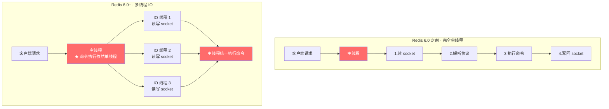

### 1.2 🔴 必背核心:Redis 为什么快

> 🔴 **核心五问**:`内存 + 单线程 + IO 多路复用 + 高效数据结构 + 优秀编码协议 (RESP)`

| # | 原因 | 一句话解释 |
|---|------|-----------|
| 1 | **纯内存操作** | ==内存读写比磁盘快 10 万倍== |
| 2 | **单线程避免竞态** | 不需要锁、上下文切换、CPU 缓存命中率高 |
| 3 | **IO 多路复用** | ==epoll== (Linux) / kqueue (BSD),单线程管理万级连接 |
| 4 | **高效数据结构** | SDS / 跳表 / 压缩列表,O(1) ~ O(logN) |
| 5 | **RESP 协议** | 文本协议,解析快、易调试 |

### 1.3 🟠 重点理解:为什么 6.0 引入多线程?

> 🟠 **重点**:命令执行依然是**单线程**(避免锁),只把"网络 IO 读写"的部分多线程化(收发数据 + 协议解析)。

**何时受益**:网络是瓶颈时(大 value、流量大),CPU 是瓶颈时(单 key 计算密集)无效。

**配置方式**:
```bash
# redis.conf
io-threads-do-reads yes      # IO 线程也处理读
io-threads 4                 # 一般为 CPU 核数 - 1
```

### 1.4 🟢 避坑提醒

> 🟢 **避坑 1**:不要在 Redis 里执行 `KEYS *` / `FLUSHALL` / 大 hash 的 `HGETALL`,这些 O(N) 命令会**阻塞主线程**,所有请求都要排队。
>
> 🟢 **避坑 2**:不要把 Redis 当数据库用,**没有 ACID**,极端情况下会丢数据(下面持久化章节细说)。

### 1.5 面试官追问

**Q1: Redis 单线程为什么这么快,瓶颈在哪?**
> 🔴 内存 + epoll + 数据结构。瓶颈一般是网络带宽(因此 6.0 开了 IO 多线程)和单 key 操作(无法并行)。**CPU 几乎不是瓶颈**,所以单台机器再加 CPU 提升不大,要靠集群水平扩展。

**Q2: Redis 6.0 多线程默认开启吗?**
> 🟡 **默认关闭**。需要显式 `io-threads-do-reads yes` 才生效。生产环境建议至少开 IO 线程读。

---

## 2. 5 大数据结构 + 底层实现

### 2.1 🔴 必背核心对照表

| 类型 | 命令 | 底层实现(Redis 7) | 典型场景 |
|------|------|------------------|---------|
| **String** | `SET/GET/INCR` | ==SDS==(动态字符串) | 缓存、计数器、分布式锁、Session |
| **List** | `LPUSH/RPOP/LRANGE` | ==QuickList==(链表+ListPack) | 简单消息队列、最近列表、文章评论 |
| **Hash** | `HSET/HGET` | ==ListPack==(小) / ==HashTable==(大) | 对象存储(用户资料)、购物车 |
| **Set** | `SADD/SMEMBERS/SINTER` | ==IntSet==(纯整数小) / ==HashTable== | 标签、共同好友、抽奖去重 |
| **ZSet** | `ZADD/ZRANGE` | ==ListPack==(小) / ==SkipList+HashTable==(大) | 排行榜、延迟队列、带权重排序 |

> 🟠 **重点**:Redis 7 把原来的 `ziplist` 改成了 `listpack`,修复了 ziplist 的级联更新问题,但面试时说 ziplist 也对(老版本)。

### 2.2 🔴 SDS(Simple Dynamic String)结构

```c
struct sdshdr {
    int len;            // 已用长度,O(1) 取 strlen
    int free;           // 剩余容量,预分配减少 realloc
    char buf[];         // 实际字符数据,二进制安全
};
```

> 🟠 **对比 C 字符串**:
> - O(1) 获取长度(C 是 O(N))
> - **二进制安全**(可存图片、序列化数据)
> - 杜绝缓冲区溢出(自动扩容)
> - 减少 realloc 次数(空间预分配 + 惰性释放)

### 2.3 🔴 ZSet 跳表(SkipList)

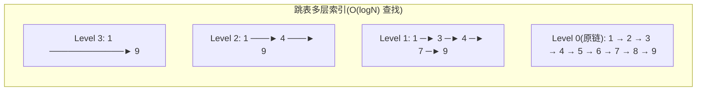

> 🔴 **核心**:跳表用空间换时间,在有序链表上加多层索引,**查找/插入/删除都是 O(logN)**,实现远比红黑树简单。
>
> 🟡 **加分**:Redis ZSet 同时用 SkipList + HashTable,前者按 score 排序、范围查找;后者按 member O(1) 取 score。

### 2.4 🟠 数据结构选型记忆口诀

```
计数器        → String INCR
分布式锁      → String SET NX
对象存储      → Hash
社交关系/标签 → Set (并集/交集)
排行榜        → ZSet (按分数排序)
消息队列(简易)→ List BLPOP / Stream
延迟队列      → ZSet score 存到期时间戳
布隆过滤器    → Bitmap / 模块 RedisBloom
```

---

## 3. 持久化:RDB / AOF / 混合

### 3.1 🔴 三种持久化对比

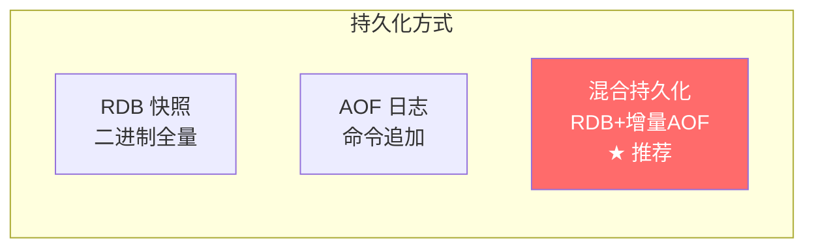

| 维度 | RDB | AOF | 混合(4.0+) |
|------|-----|-----|------------|
| 文件 | `dump.rdb` 二进制 | `appendonly.aof` 文本命令 | RDB 头 + AOF 尾 |
| 恢复速度 | ⭐⭐⭐⭐⭐ 快 | ⭐⭐ 慢(回放命令) | ⭐⭐⭐⭐ 较快 |
| 文件大小 | ⭐⭐⭐⭐⭐ 小 | ⭐⭐ 大 | ⭐⭐⭐⭐ 较小 |
| 数据完整性 | ⭐⭐ 可能丢分钟级 | ⭐⭐⭐⭐⭐ 最多丢 1 秒 | ⭐⭐⭐⭐⭐ 最多丢 1 秒 |
| 触发 | `save`/`bgsave` 或定时 | 每条写命令追加 | 重写时 RDB,平时 AOF |
| 推荐 | 灾备、迁移 | 单用不推荐 | ⭐ **生产首选** |

### 3.2 🔴 AOF 三种刷盘策略

> 🔴 **核心**:`appendfsync` 配置决定数据丢失风险

| 策略 | 含义 | 性能 | 丢失风险 |
|------|------|------|---------|
| `always` | 每条命令 fsync | 最差 | 几乎不丢 |
| `everysec` ⭐ **默认** | 每秒 fsync | 中等 | ==最多丢 1 秒== |
| `no` | OS 决定何时刷 | 最好 | 可能丢 30 秒 |

```bash
# redis.conf
appendonly yes
appendfsync everysec
auto-aof-rewrite-percentage 100   # AOF 翻倍时重写
auto-aof-rewrite-min-size 64mb
```

### 3.3 🟠 重点理解:bgsave 是怎么不阻塞主线程的?

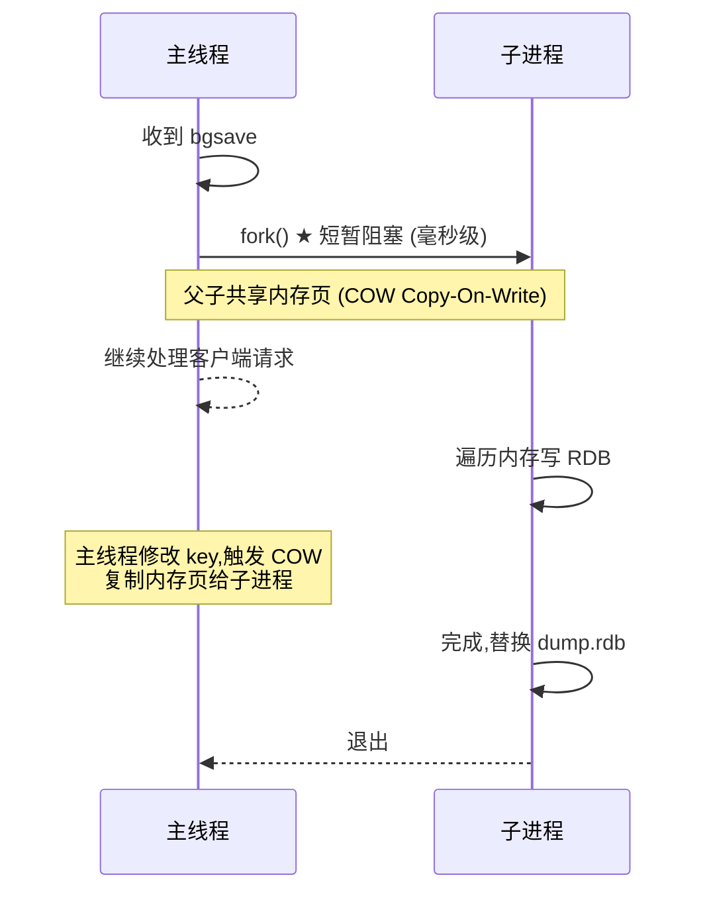

> 🟠 **重点**:`fork()` 是写时复制(COW),只有内存页被修改才会真正复制,所以 fork 本身很快。但**fork 时主线程会短暂阻塞**(复制页表),内存越大越久。
>
> 🟢 **避坑**:大内存实例(如 30GB+)fork 会卡数百毫秒甚至秒级。建议 ==单实例不超过 10GB==。

### 3.4 🟡 加分项:AOF 重写机制

AOF 文件会越来越大,Redis 自动 ==BGREWRITEAOF==:

```
旧 AOF: SET k 1; SET k 2; SET k 3
重写后:  SET k 3              ← 只保留最终状态
```

实现:fork 子进程,根据当前内存状态生成新 AOF,期间新命令同时写到内存缓冲和旧 AOF,完成后用新文件替换旧文件。

---

## 4. 过期策略与内存淘汰

### 4.1 🔴 三种过期 key 处理

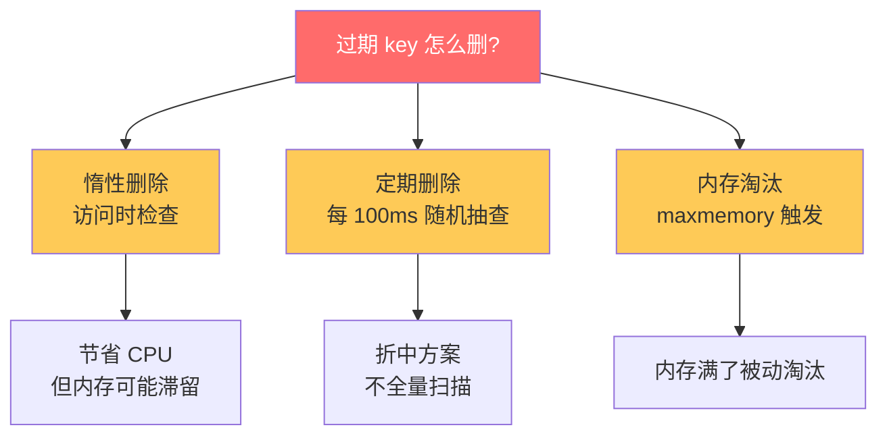

> 🔴 **核心**:Redis 用 ==惰性删除 + 定期删除== 组合,既不浪费 CPU 全量扫描,又防止内存堆积。**只有 maxmemory 触发后才会启动主动淘汰策略**。

### 4.2 🔴 8 种内存淘汰策略

> 🔴 **必记**:这是面试**最高频**的一道题。

```bash
# redis.conf
maxmemory 4gb
maxmemory-policy allkeys-lru
```

| 策略 | 范围 | 算法 | 适用场景 |
|------|------|------|---------|
| `noeviction` | - | 不淘汰 | ==默认==,内存满直接报错(写入失败) |
| `allkeys-lru` ⭐ | 所有 key | 最近最少使用 | 通用缓存场景,**推荐** |
| `allkeys-lfu` | 所有 key | 最少访问频次 | Redis 4.0+,热点数据明显时更好 |
| `allkeys-random` | 所有 key | 随机 | 无特定淘汰策略 |
| `volatile-lru` | 设了过期时间的 key | LRU | 同时存在永久和临时数据 |
| `volatile-lfu` | 设了过期时间的 key | LFU | 同上,4.0+ |
| `volatile-random` | 设了过期时间的 key | 随机 | 同上 |
| `volatile-ttl` | 设了过期时间的 key | TTL 最短优先 | 临近过期的优先淘汰 |

### 4.3 🟠 LRU vs LFU

| | LRU(Least Recently Used) | LFU(Least Frequently Used) |
|---|------|------|
| 关注 | **时间维度**:最近多久没访问 | **频率维度**:总共访问了多少次 |
| 缺点 | 偶然访问的 key 不会淘汰 | 历史热点冷却后还占着内存 |
| Redis 实现 | 24 bit 时钟戳近似 LRU(随机采样) | 8bit 计数器(对数衰减)+ 16bit 时间 |

> 🟡 **加分**:Redis 的 LRU 是**近似 LRU**,默认每次随机采样 5 个 key 比较"最不近期访问"的淘汰,可以通过 `maxmemory-samples` 调大提高精度但增加 CPU。

---

## 5. 分布式锁完整方案

### 5.1 🔴 核心命令

> 🔴 **背下来**:`SET resource_name unique_value NX PX 30000`

```bash
SET lock:order:123 abc-uuid-456 NX PX 30000
# NX: not exists 才设置(获取锁)
# PX 30000: 30 秒过期(自动释放)
# unique_value: 标识当前持有者(释放时校验)
```

### 5.2 🔴 释放锁必须用 Lua

> 🔴 **核心**:`GET + DEL` 不是原子操作!必须用 Lua 脚本:

```lua
-- 释放锁脚本
if redis.call("GET", KEYS[1]) == ARGV[1] then
    return redis.call("DEL", KEYS[1])
else
    return 0
end
```

> 🟢 **避坑**:不校验 unique_value 直接 DEL,可能**误删别人的锁**:线程 A 拿锁→业务卡顿超过 30s→锁过期→线程 B 拿锁→线程 A 醒来 DEL 删的是 B 的锁。

### 5.3 🟠 完整流程图

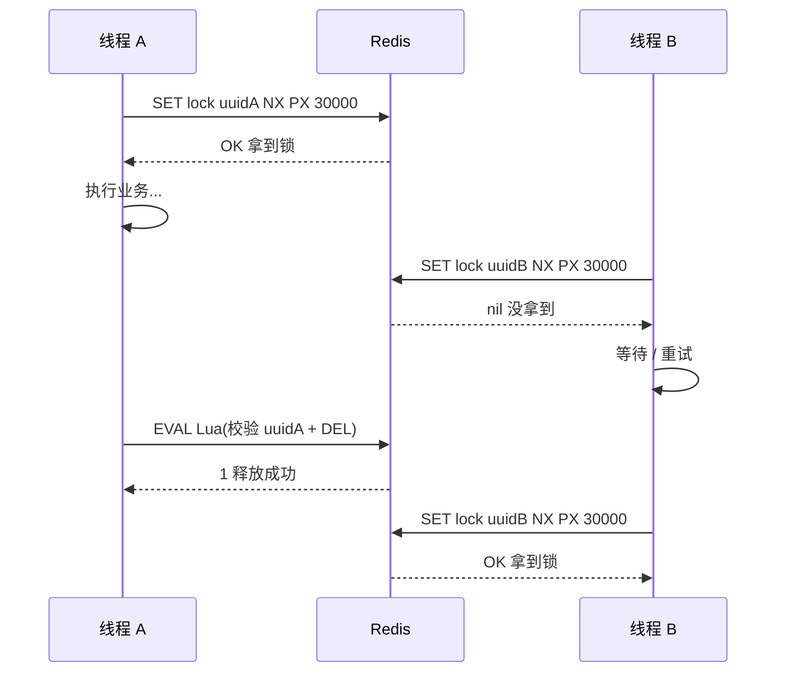

### 5.4 🔴 Redisson 看门狗机制

> 🔴 **必懂**:Redisson 是 Java 最常用的 Redis 锁库,核心是 ==看门狗(Watchdog)== 自动续期。

```java
// Redisson 用法
RLock lock = redisson.getLock("order:123");
lock.lock();              // ★ 默认 30s 过期,每 10s 自动续期到 30s
try {
    // 业务逻辑(哪怕很慢也不会超时)
} finally {
    lock.unlock();        // 主动释放,看门狗停止
}
```

**看门狗工作原理**:

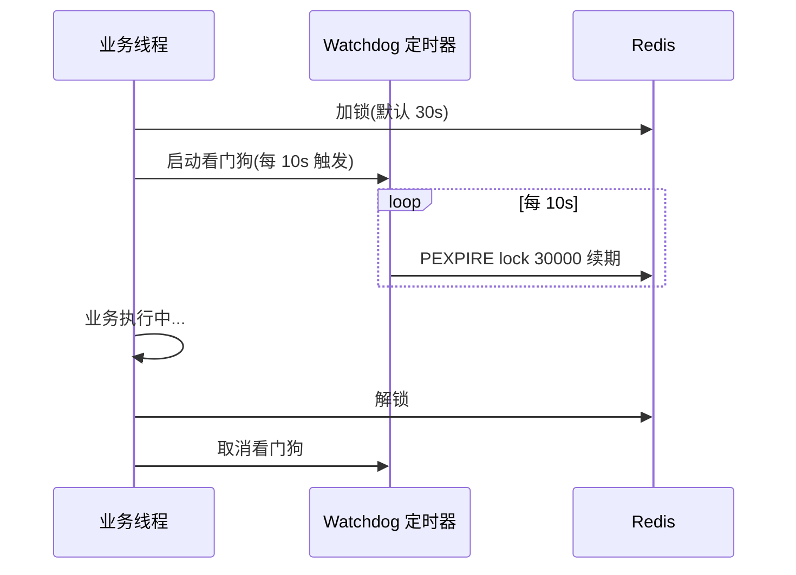

> 🟢 **避坑**:`lock(time, unit)` 显式传超时则**不启用看门狗**,过期就过期。

### 5.5 🟡 加分项:RedLock 算法

单点 Redis 锁存在主从切换丢锁问题。RedLock 提出在 ==N 个独立的 Master== 上加锁,过半成功才算拿到:

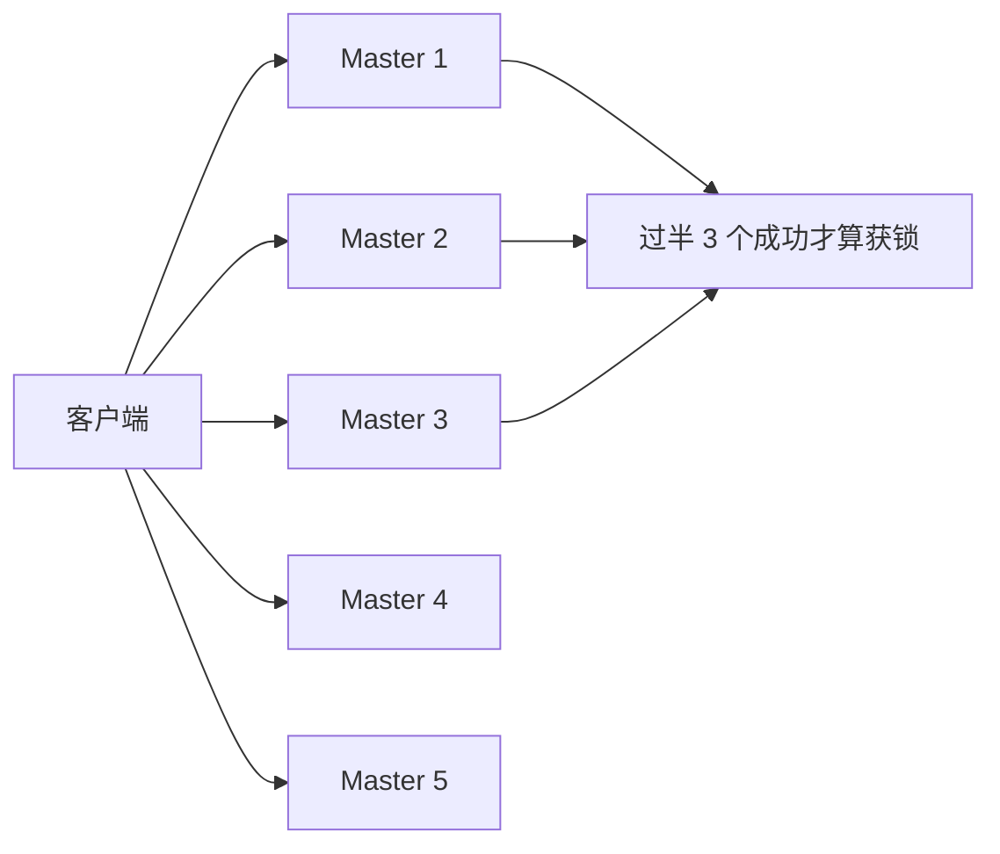

> 🟠 **争议**:Martin Kleppmann 与 antirez 之间著名的 RedLock 论战。结论是 RedLock 在严格场景下仍有问题,生产中**强一致建议用 ZooKeeper / etcd**,Redis 锁更适合**性能优先、容忍极小概率丢锁**的场景。

### 5.6 面试官追问

**Q1: Redis 锁过期时间怎么设?**
> 🟠 **核心**:不能简单设固定值。短了业务没执行完锁就过期,长了出问题恢复慢。**正确做法是用 Redisson 看门狗自动续期**,业务结束主动释放。

**Q2: 集群模式下 SET NX 还可靠吗?**
> 🟢 **风险点**:写到 master 后 master 挂了,此时 slave 可能还没同步,新 master 选出后锁丢失。**Redis 是 AP 系统**,绝对一致性达不到。要强一致用 ZK。

---

## 6. 缓存三大问题

### 6.1 🔴 一图概览

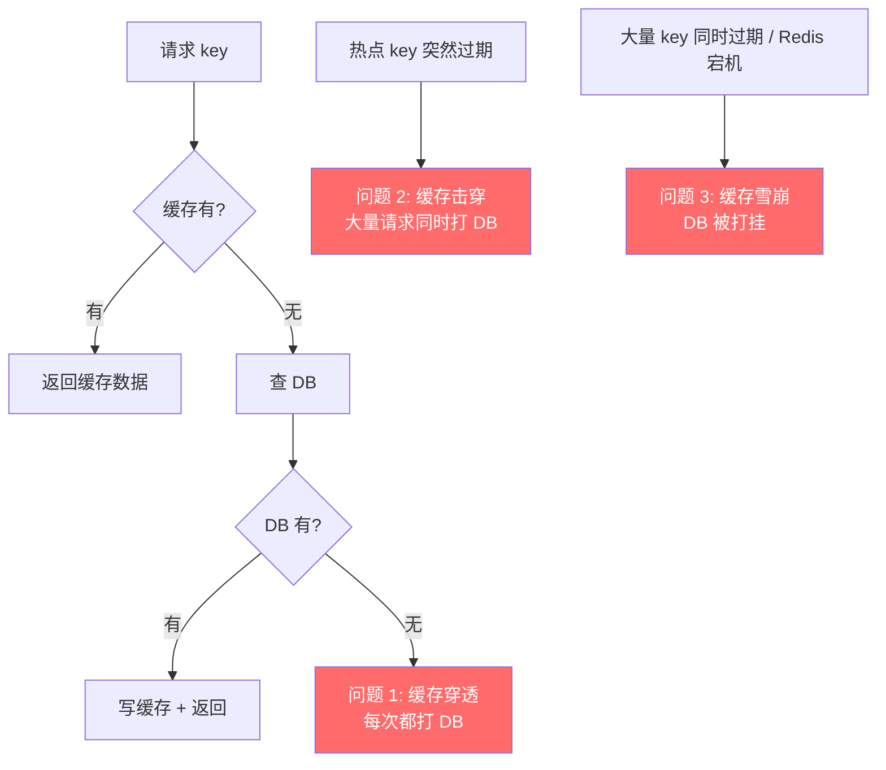

### 6.2 🔴 缓存穿透 — 查不存在的 key

**症状**:不断请求 `id=-1` 这种 DB 也没有的 key,每次都穿透到 DB。

**解决方案**:

| 方案 | 原理 | 优缺点 |
|------|------|-------|
| ==空值缓存== | DB 查不到也缓存一个 null,设短 TTL(5min) | 简单,但攻击者用大量不同 key 仍会爆缓存 |
| ⭐ ==布隆过滤器== | 启动时把所有合法 ID 加进 BloomFilter,查询前先问 | 高效,有极小误判率,无法删除元素 |
| 接口校验 | 参数合法性、限流、签名 | 业务侧防护 |

> 🟠 **布隆过滤器**:用 K 个哈希函数把元素映射到 bit 数组的 K 个位置。"==可能存在(有误判)、一定不存在==(无漏判)"。

### 6.3 🔴 缓存击穿 — 单个热点 key 过期

**症状**:一个被高频访问的 key 突然过期,瞬间全部请求穿到 DB。

**解决方案**:

| 方案 | 实现 | 缺点 |
|------|------|------|
| ⭐ ==互斥锁(分布式锁)== | 缓存 miss 时 setnx 抢锁,只有抢到的查 DB,其他等待 | 复杂度高,响应稍慢 |
| ==永不过期== | 不设 TTL,后台异步刷新 | 数据时效性差 |
| 逻辑过期 | value 中带过期标记,异步重建 | 实现复杂 |

```java
// 互斥锁伪代码
public Object queryWithMutex(String key) {
    Object value = redis.get(key);
    if (value != null) return value;

    // 双重检查 + 抢锁
    String lockKey = "lock:" + key;
    if (redis.setnx(lockKey, "1", 10, SECONDS)) {
        try {
            value = redis.get(key);             // 双检
            if (value != null) return value;
            value = db.query(key);
            redis.set(key, value, 30, MINUTES);
            return value;
        } finally {
            redis.del(lockKey);
        }
    } else {
        Thread.sleep(50);
        return queryWithMutex(key);              // 自旋重试
    }
}
```

### 6.4 🔴 缓存雪崩 — 大量 key 同时失效

**症状**:① 大量 key 设了相同 TTL 同时失效;② Redis 宕机。

**解决方案**:

| 类型 | 方案 |
|------|------|
| TTL 集体到期 | ==TTL 加随机扰动==:`expireTime + random(0, 300)` |
| Redis 宕机 | ==高可用集群==(主从+哨兵 / Cluster);本地缓存(Caffeine)双层兜底 |
| 通用 | ==熔断限流==(Sentinel / Hystrix);**异步重建 + 降级** |

### 6.5 🟢 三大问题速记

> 🟢 **背诵口诀**:
> - 穿透:**查不到** → 布隆过滤器
> - 击穿:**单点过期** → 互斥锁
> - 雪崩:**集体过期** → 随机 TTL + 集群

---

## 7. 主从 / 哨兵 / 集群

### 7.1 🔴 三种部署模式对比

| 模式 | 角色 | 容量 | 高可用 | 适用 |
|------|------|------|--------|------|
| **单机** | 1 个 master | 单机内存 | ❌ | 开发测试 |
| **主从复制** | 1 master + N slave | 单机内存 | ❌(挂了要手动切) | 读写分离 |
| **哨兵 Sentinel** | 主从 + ==哨兵自动选主== | 单机内存 | ✅ | 中小规模 |
| **Cluster** | ==分片== + 主从 + 自动选主 | 多机内存(16384 槽) | ✅ | 大规模 |

### 7.2 🔴 主从复制流程

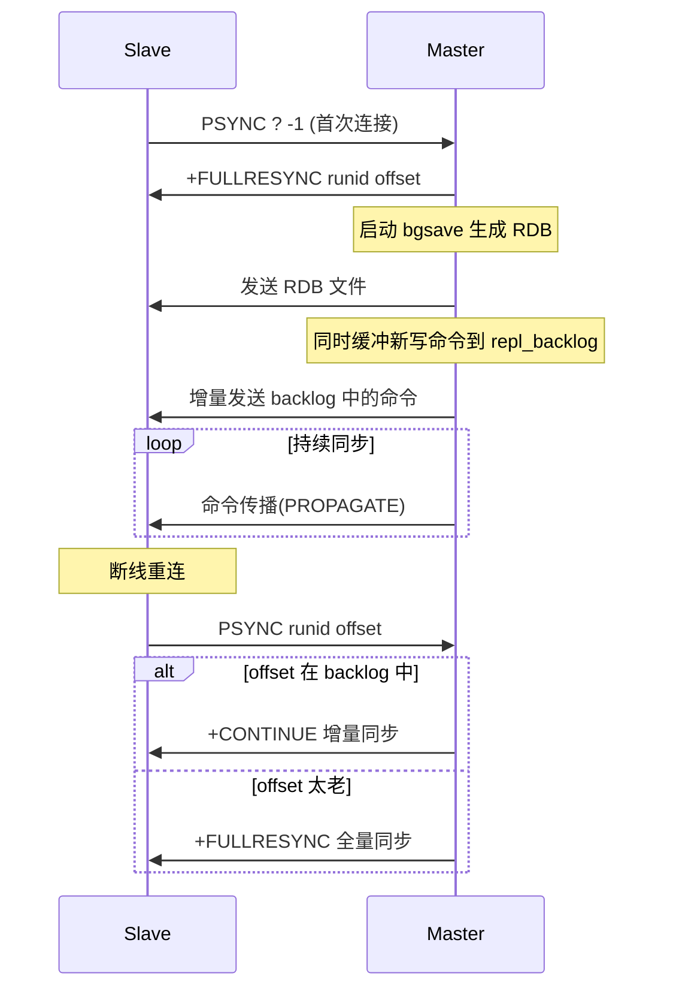

> 🟠 **核心**:Redis 2.8+ 支持 ==部分重同步(PSYNC)==,通过 `runid + offset + repl_backlog` 实现断线后只补差量。

### 7.3 🔴 Sentinel 哨兵选主

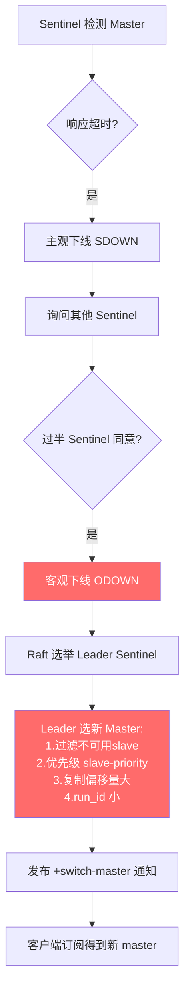

### 7.4 🔴 Cluster 集群分片

> 🔴 **核心**:Cluster 用 ==16384 个哈希槽(slot)== 分片,每个 key 通过 `CRC16(key) % 16384` 决定属于哪个槽。

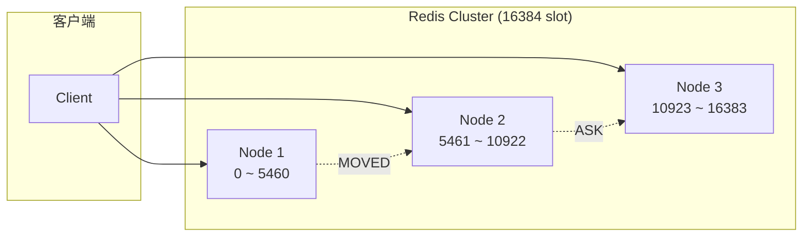

> 🟠 **重点**:为啥是 ==16384 而不是 65536==?
> - 心跳包要带槽位图,16384 / 8 = 2KB,65536 = 8KB,心跳包变大影响性能
> - 16384 对一般集群规模(几千节点)足够

> 🟢 **避坑**:Cluster 模式下:
> - **不支持多 key 命令**(MGET / MSET 跨槽会报错),除非用 ==Hash Tag== `{user1}:name` `{user1}:age` 强制同槽
> - **不支持事务跨槽**

### 7.5 🟡 加分项:为什么是 16384

```c
// cluster.h
#define CLUSTER_SLOTS 16384
```

> 🟡 节选自作者 antirez 在 GitHub 的回复:
> 1. ==消息头大小==:每个节点都要广播自己负责的槽位图(bitmap),16384 bit = 2KB,65536 = 8KB,集群规模大时心跳数据量翻倍
> 2. **集群规模设计目标 ≤ 1000 节点**,16384 / 1000 ≈ 16 槽/节点,粒度足够
> 3. ==压缩率高==:bitmap 在节点数少、槽位连续时压缩率高,16384 比 65536 更友好

---

## 8. Redis 6 多线程 IO

### 8.1 🟠 主线程职责图

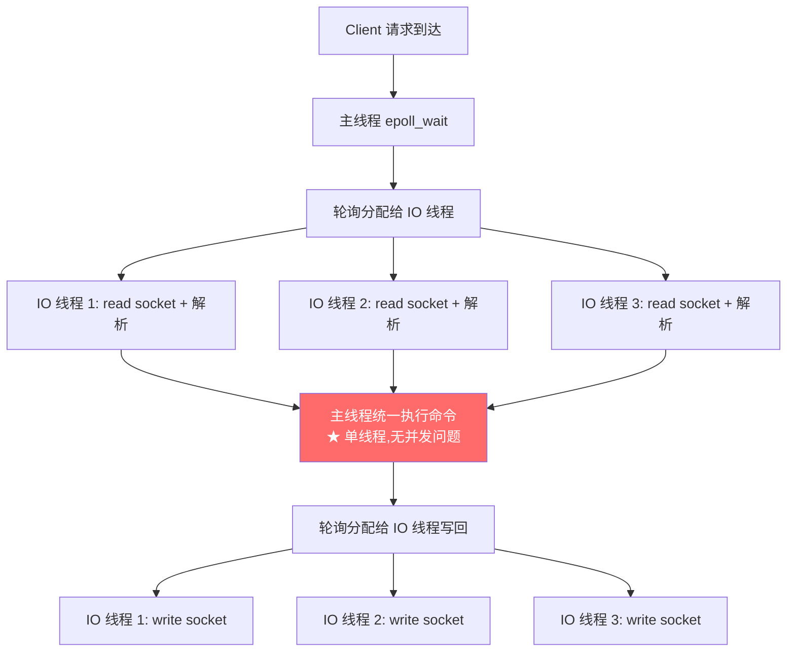

### 8.2 🟢 多线程 IO 不能解决什么?

> 🟢 **避坑**:多线程 IO **不能加速单 key 操作**(如 `HGETALL` 大 hash)。命令执行依然单线程。如果是 CPU 瓶颈,要靠 Cluster 水平扩展。

---


# 第二部分 · 消息队列

## 9. Kafka 架构与高性能

### 9.1 🔴 整体架构图

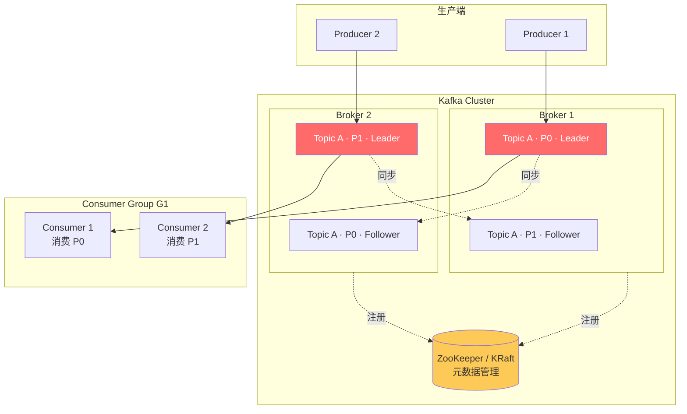

### 9.2 🔴 核心概念表

| 概念 | 解释 | 关键数字 |
|------|------|---------|
| **Broker** | Kafka 节点(进程) | 一般 3+ 起步 |
| **Topic** | 逻辑消息分类 | 一个业务一个 topic |
| **Partition** | Topic 物理分片,**每个 partition 是一个有序追加日志** | 决定**并行度** |
| **Replica** | 分区副本,分 Leader / Follower | 一般 ==replica.factor=3== |
| **ISR** | In-Sync Replicas,与 leader 同步的副本集合 | ⭐ ACK 写入此集合才算成功 |
| **Offset** | 消息在分区内的位置编号 | 单调递增 |
| **Consumer Group** | 消费组,组内 partition 唯一分配 | ==P 数 ≥ Consumer 数== |

### 9.3 🔴 高性能 5 大原因

> 🔴 **背诵口诀**:`顺序写 + 零拷贝 + 批量 + 分区 + 索引`

| # | 技术 | 原理 | 性能提升 |
|---|------|------|---------|
| 1 | **顺序写磁盘** | 只追加不修改,磁盘顺序 IO ≈ 内存随机 IO | 600MB/s |
| 2 | **零拷贝(sendfile)** | ==DMA== 直接从 PageCache 到网卡,跳过用户态 | CPU 拷贝从 4 次降到 2 次 |
| 3 | **批量发送/拉取** | 累积一批消息一起处理,减少网络往返 | 10x 吞吐 |
| 4 | **分区并行** | 多 partition 多线程并行写读 | 线性扩展 |
| 5 | **稀疏索引** | `.index` 文件每隔 4KB 建一条索引,二分查找 | 内存占用低 |

### 9.4 🔴 零拷贝深入

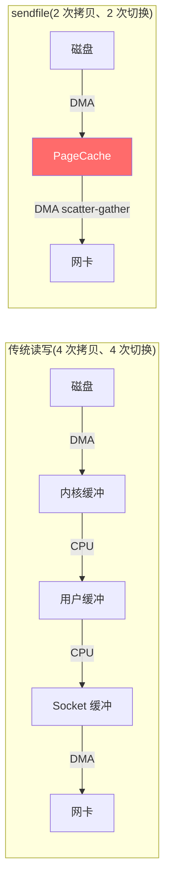

> 🔴 **核心**:`sendfile()` 系统调用让数据**绕过用户空间**,直接在内核完成磁盘→网卡传输。Java 中通过 ==`FileChannel.transferTo()`== 实现。

### 9.5 🔴 顺序保证三层

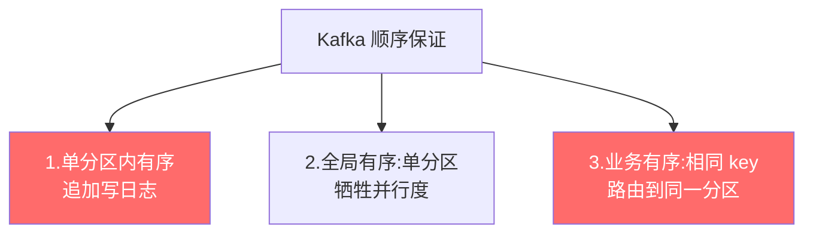

```java
// 业务有序:同一 user 的消息进同一分区
producer.send(new ProducerRecord<>("topic",
    String.valueOf(userId),  // ★ key 决定分区
    payload));
```

### 9.6 🔴 ACK 三种级别

> 🔴 **必懂**:`acks` 配置决定**消息可靠性**

```bash
# producer.properties
acks=0    # 不等确认,可能丢消息(性能最高)
acks=1    # leader 写入即 ack(默认,leader 挂了可能丢)
acks=all  # ⭐ 所有 ISR 写入才 ack(最可靠,性能稍低)
```

> 🟠 **重点**:`acks=all` 配合 `min.insync.replicas=2` 才能真正避免丢消息(单副本写入失败会拒绝)。

### 9.7 🔴 ISR 机制

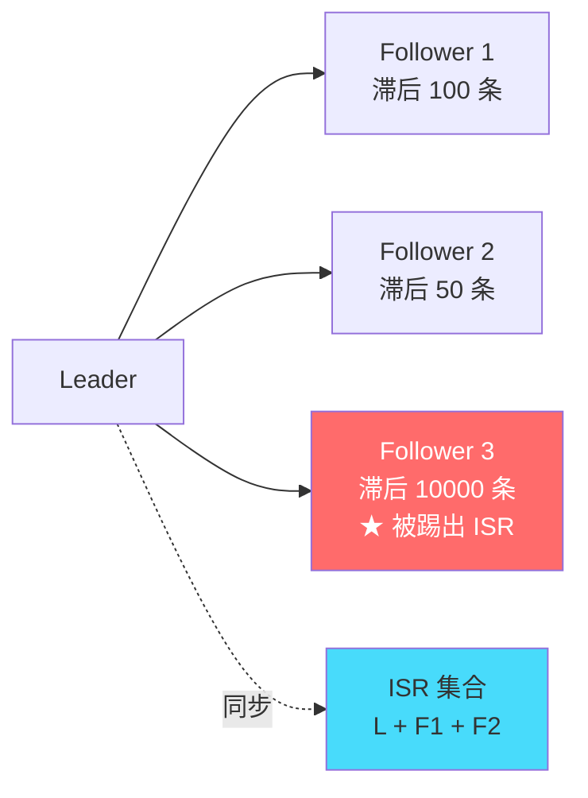

> 🔴 **核心**:ISR(In-Sync Replicas)= 正在同步的副本集合。Follower 落后超过 `replica.lag.time.max.ms`(默认 30s)会被踢出 ISR。**Leader 挂了只从 ISR 选新 leader**,保证不丢已 ack 消息。

### 9.8 🔴 消费者重平衡(Rebalance)

> 🔴 **必懂**:消费组成员变化时(加入/退出),Kafka 重新分配 partition,期间**整个消费组停止消费**(Stop The World)。

**触发场景**:
1. 消费者加入或退出
2. 订阅的 topic 数量变化
3. partition 数量变化
4. ⚠️ ==消费者心跳超时(`session.timeout.ms` 默认 10s)==

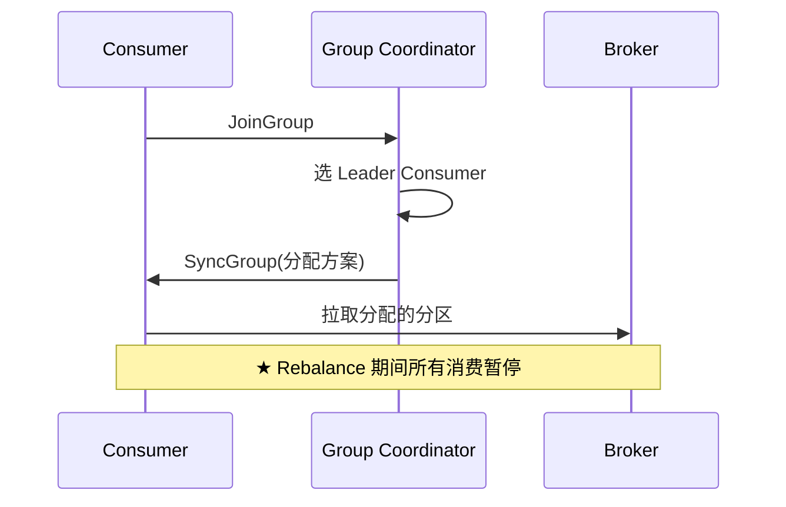

**分配策略**:
| 策略 | 算法 | 特点 |
|------|------|------|
| `RangeAssignor` ⭐ 默认 | 按 partition 范围平均分给 consumer | 简单但不均衡 |
| `RoundRobinAssignor` | 轮询分配 | 更均衡 |
| `StickyAssignor` | 黏性分配,尽量保持原状 | ==Rebalance 影响最小== |
| `CooperativeStickyAssignor` | 协作式 sticky,分批 rebalance | Kafka 2.4+ **推荐** |

### 9.9 🟠 重复消费 vs 消息丢失

| 问题 | 原因 | 解决 |
|------|------|------|
| ==重复消费== | 自动提交 offset 但还没处理完崩溃,新 consumer 重头读 | **手动提交 offset** + ==幂等性==(业务唯一键去重) |
| ==消息丢失== | 自动提交 offset 后业务处理失败 | 关闭自动提交,业务成功后再 `commitSync()` |

```java
// 推荐写法
props.put("enable.auto.commit", "false");
while (true) {
    ConsumerRecords<String, String> records = consumer.poll(Duration.ofMillis(100));
    for (ConsumerRecord<String, String> r : records) {
        try {
            handle(r);
        } catch (Exception e) {
            // 不提交 offset,下次 poll 还会拿到
            return;
        }
    }
    consumer.commitSync();  // ★ 全部处理完才提交
}
```

### 9.10 🟡 加分项:Kafka 为什么不用 ZooKeeper(KRaft)

> 🟡 **加分**:Kafka 2.8+ 引入 ==KRaft== 模式,用 Raft 协议替代 ZK 管理元数据。
> - **优点**:架构简化,运维简单,支持百万级分区
> - **现状**:Kafka 3.3+ KRaft 生产可用,4.0 计划完全移除 ZK 依赖

---

## 10. RabbitMQ 与交换机

### 10.1 🔴 核心模型

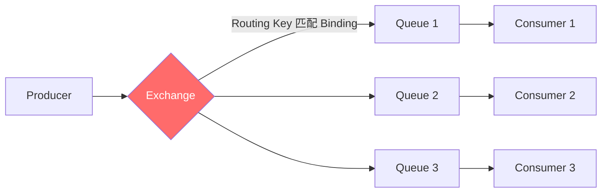

> 🔴 **核心**:`Producer → Exchange → Binding → Queue → Consumer`,**Producer 不直接发到 Queue**。

### 10.2 🔴 4 种交换机

| 类型 | 路由规则 | 典型场景 |
|------|---------|---------|
| **Direct** ⭐ | RoutingKey **完全匹配** Binding key | 点对点路由(订单创建 → 订单服务) |
| **Fanout** | 忽略 key,**广播**到所有绑定的 Queue | 发布订阅(用户注册 → 通知服务/积分服务/日志服务) |
| **Topic** ⭐ | RoutingKey **通配符匹配**(`*` 一段、`#` 多段) | 灵活路由(`order.*.created`) |
| **Headers** | 按消息 Header 匹配,性能差 | 几乎不用 |

### 10.3 🔴 消息可靠性三段保障


```java
// 1. Publisher Confirm (生产者确认)
channel.confirmSelect();
channel.basicPublish("exchange", "key", null, msg.getBytes());
channel.waitForConfirmsOrDie();

// 2. 持久化:durable=true (Queue) + deliveryMode=2 (Message)
channel.queueDeclare("queue", true, false, false, null);
channel.basicPublish("ex", "key",
    MessageProperties.PERSISTENT_TEXT_PLAIN, msg.getBytes());

// 3. 手动 ACK
channel.basicConsume("queue", false /*autoAck=false*/, (tag, msg) -> {
    try {
        process(msg);
        channel.basicAck(tag, false);              // ✅ 确认
    } catch (Exception e) {
        channel.basicNack(tag, false, true);       // ↻ 重回队列
    }
});
```

### 10.4 🟠 死信队列(DLX)

> 🟠 **重点**:消息变成"死信"的三种情况:
> 1. ==消费失败被 nack/reject 且 requeue=false==
> 2. ==消息 TTL 过期==
> 3. ==队列满了==(超过 max-length)

死信会被路由到指定的 ==Dead Letter Exchange==,实现:
- **重试机制**:失败消息进重试队列,延迟重试
- **延迟队列**:借助 TTL + DLX 实现延迟消息(==RabbitMQ 原生不支持延迟,需插件==)

```bash
# 队列配置死信
x-dead-letter-exchange: dlx.exchange
x-dead-letter-routing-key: dlx.key
x-message-ttl: 60000     # 60s 过期变死信
```

### 10.5 🟢 避坑

> 🟢 **避坑 1**:RabbitMQ 集群分**普通集群**(只复制元数据)和 ==镜像队列==(复制消息),只有镜像队列才有真正高可用。
>
> 🟢 **避坑 2**:`autoAck=true` 一旦 consumer 取走消息就标记完成,处理失败会丢消息。**生产环境必须用手动 ACK**。

---

## 11. RocketMQ 与事务消息

### 11.1 🔴 整体架构

```mermaid
flowchart TB
    subgraph NameServer集群["NameServer 集群(无状态)"]
        NS1[NameServer 1]
        NS2[NameServer 2]
    end

    subgraph Broker集群["Broker 集群"]
        BM1[Master 1]
        BS1[Slave 1]
        BM2[Master 2]
        BS2[Slave 2]
    end

    P[Producer] --> NS1
    P --> BM1
    P --> BM2

    C[Consumer] --> NS1
    C --> BM1
    C --> BM2

    BM1 -.同步/异步复制.-> BS1
    BM2 -.同步/异步复制.-> BS2

    BM1 --注册路由信息--> NS1
    BM1 --注册路由信息--> NS2

    style NS1 fill:#feca57
    style NS2 fill:#feca57
    style BM1 fill:#ff6b6b,color:#fff
    style BM2 fill:#ff6b6b,color:#fff
```

> 🔴 **核心组件**:
> - **NameServer**:无状态注册中心(替代 ZK,更轻量)
> - **Broker**:存储消息,Master/Slave 主备
> - **Producer / Consumer**:从 NameServer 拿路由,直连 Broker

### 11.2 🔴 4 种消息类型

| 类型 | 用途 | 示例 |
|------|------|------|
| **普通消息** | 一般业务异步通信 | 用户注册成功 → 发邮件 |
| **顺序消息** | 同一业务严格有序(如订单状态机:创建→支付→发货) | 同一 OrderId 入同一队列 |
| **延迟消息** | 定时触发(==18 个固定级别==,不支持任意时长) | 30 分钟未支付取消 |
| **事务消息** ⭐ | 本地事务 + MQ 强一致 | 扣款 + 通知积分服务 |

### 11.3 🔴 事务消息流程(重中之重)

> 🔴 **必懂**:RocketMQ 事务消息是面试**最经典**的分布式事务方案。

```mermaid
sequenceDiagram
    participant P as Producer
    participant MQ as Broker
    participant DB as 业务 DB

    P->>MQ: 1. 发送半消息(Half Message)
    Note over MQ: 半消息对消费者不可见
    MQ-->>P: 2. ACK 收到半消息

    P->>DB: 3. 执行本地事务<br/>(扣款)
    alt 事务成功
        P->>MQ: 4. COMMIT
        Note over MQ: 半消息变正式消息
        MQ->>P: 投递给 Consumer
    else 事务失败
        P->>MQ: 4. ROLLBACK
        Note over MQ: 删除半消息
    else 网络异常,P 没回复
        Note over MQ: 5. 定时回查
        MQ->>P: checkLocalTransaction(msg)
        P->>DB: 查询本地事务状态
        DB-->>P: 已提交 / 未提交
        P->>MQ: COMMIT 或 ROLLBACK
    end
```

```java
TransactionMQProducer producer = new TransactionMQProducer("group");
producer.setTransactionListener(new TransactionListener() {
    @Override
    public LocalTransactionState executeLocalTransaction(Message msg, Object arg) {
        try {
            // 执行本地事务
            db.update(...);
            return LocalTransactionState.COMMIT_MESSAGE;
        } catch (Exception e) {
            return LocalTransactionState.ROLLBACK_MESSAGE;
        }
    }

    @Override
    public LocalTransactionState checkLocalTransaction(MessageExt msg) {
        // 回查:Broker 找上来问"事务到底成功没?"
        boolean done = db.checkOrderStatus(msg.getKeys());
        return done ? LocalTransactionState.COMMIT_MESSAGE
                    : LocalTransactionState.ROLLBACK_MESSAGE;
    }
});
```

### 11.4 🟠 顺序消息

> 🟠 **重点**:RocketMQ 有 ==MessageQueueSelector==,把同一 OrderId 的消息发到同一队列。

```java
producer.send(msg, new MessageQueueSelector() {
    @Override
    public MessageQueue select(List<MessageQueue> mqs, Message msg, Object arg) {
        Long orderId = (Long) arg;
        return mqs.get((int) (orderId % mqs.size()));
    }
}, orderId);
```

消费端使用 ==`MessageListenerOrderly`==(单线程消费同一队列):

```java
consumer.registerMessageListener(new MessageListenerOrderly() {
    @Override
    public ConsumeOrderlyStatus consumeMessage(List<MessageExt> msgs, ConsumeOrderlyContext ctx) {
        // 同一队列单线程串行消费
        return ConsumeOrderlyStatus.SUCCESS;
    }
});
```

### 11.5 🟡 加分:Kafka vs RocketMQ vs RabbitMQ

| 维度 | Kafka | RocketMQ | RabbitMQ |
|------|-------|----------|----------|
| 单机吞吐 | ⭐⭐⭐⭐⭐ 百万级 | ⭐⭐⭐⭐ 十万级 | ⭐⭐⭐ 万级 |
| 时延 | 毫秒级 | 毫秒级 | 微秒级 |
| 顺序消息 | 单分区有序 | ⭐ 完美支持 | 单队列单消费者 |
| 事务消息 | ⭐ 0.11+ 支持 | ⭐⭐ 完整方案 | ❌ |
| 延迟消息 | ❌ | ⭐ 18 级别 | 需 TTL+DLX 模拟 |
| 消息回溯 | ⭐⭐ offset 重置 | ⭐⭐ 时间戳 | ❌ |
| 适用 | 大数据日志 | 金融订单 | 业务复杂路由 |

---

## 12. MQ 通用问题

### 12.1 🔴 消息丢失:全链路防丢

```mermaid
flowchart LR
    A[Producer] -->|1.confirm/ack| B[Broker]
    B -->|2.持久化到磁盘| B
    B -->|3.主从同步| B
    B -->|4.投递+消费 ACK| C[Consumer]

    style A fill:#feca57
    style B fill:#ff6b6b,color:#fff
    style C fill:#feca57
```

| 环节 | 防丢手段 |
|------|---------|
| 生产端 → Broker | ==Confirm 机制== / ack=all |
| Broker 内部 | ==消息持久化==(刷盘)+ 副本机制 |
| Broker → 消费端 | ==消费 ACK 手动确认== |

### 12.2 🔴 重复消费:幂等设计

> 🔴 **核心**:MQ **不能保证 Exactly Once**,必须靠业务幂等。

| 幂等方案 | 实现 |
|---------|------|
| ==唯一约束== | DB 唯一索引(orderId)拒绝重复插入 |
| ==状态机== | 订单状态只能从"创建" → "已支付",已支付再来直接忽略 |
| ==去重表== | 单独表记录消息 msgId,Redis SET NX 也可 |
| ==乐观锁== | 带 version 字段的 update |

### 12.3 🔴 消息顺序

```
全局顺序:单 partition + 单 consumer (牺牲并发)
业务顺序:同业务 key → 同 partition (推荐)
```

### 12.4 🟢 消息积压怎么处理?

> 🟢 **应急方案**(面试可背):
> 1. **临时扩容 Consumer**:partition 数 = consumer 数,先提升消费速度
> 2. **partition 不足时**:新建临时 topic,临时 consumer 把积压消息搬过去再分发
> 3. **降级处理**:跳过非核心消息,只处理重要的
> 4. **持久化日志**:积压超过 retention 会被删,先把消息写到外部存储

### 12.5 面试官追问

**Q1: Kafka 怎么做到 Exactly Once?**
> 🟡 Kafka 0.11+ 引入幂等 Producer + 事务 API:
> - **幂等 Producer**:`enable.idempotence=true`,通过 PID + Sequence Number 去重
> - **事务消息**:跨多 partition 原子写入,支持 ==read_committed== 隔离级别
>
> 但跨外部系统的"业务级 Exactly Once"仍要靠业务幂等。

**Q2: 削峰填谷怎么落地?**
> 🟠 **核心**:用 MQ 异步化,把流量洪峰削到 MQ,Consumer 按自身能力慢慢消费。例如秒杀:HTTP 请求只做"入队"+ 返回排队号,后台 Consumer 控制库存扣减速率。


---

# 第三部分 · 存储与搜索

## 13. MySQL 分库分表 (ShardingSphere)

### 13.1 🔴 何时该分?

> 🔴 **经验值**:
> - 单表 ==超过 500 万行== / 单表 ==超过 2GB==,查询开始变慢
> - 单库连接数撑不住、写 QPS 超过 1000(单实例 MySQL 上限)

### 13.2 🔴 垂直 vs 水平

```mermaid
flowchart TD
    A[分库分表] --> B[垂直拆分<br/>按业务/字段拆]
    A --> C[水平拆分<br/>按行拆]

    B --> B1[垂直分库:<br/>用户库 / 订单库 / 商品库]
    B --> B2[垂直分表:<br/>主表 + 扩展表<br/>(冷热字段分离)]

    C --> C1[水平分库:<br/>同一表分到多个库]
    C --> C2[水平分表:<br/>同一库内分多个表<br/>(t_order_0, t_order_1)]

    style A fill:#ff6b6b,color:#fff
```

### 13.3 🔴 ShardingSphere 处理流程

```mermaid
flowchart LR
    A[原 SQL<br/>SELECT * FROM t_order WHERE user_id=100] --> B[1.SQL 解析]
    B --> C[2.SQL 路由<br/>user_id % 2 = 0 → ds_0]
    C --> D[3.SQL 改写<br/>t_order → t_order_0]
    D --> E[4.SQL 执行<br/>并行多库]
    E --> F[5.结果归并<br/>排序/分页/聚合]
    F --> G[返回结果]

    style B fill:#ff6b6b,color:#fff
    style C fill:#ff6b6b,color:#fff
    style D fill:#ff6b6b,color:#fff
    style F fill:#ff6b6b,color:#fff
```

### 13.4 🔴 分片键选择

| 分片策略 | 算法 | 优点 | 缺点 |
|---------|------|------|------|
| ==哈希分片== ⭐ | `mod(hash(key))` | 数据均衡 | 扩容时需 ==大量数据迁移== |
| 范围分片 | 按时间 / ID 区间 | 易扩容、范围查询快 | 数据**倾斜**(热点) |
| 一致性哈希 | hash 环 | 扩容只动 1/N 数据 | 实现复杂,可能偏斜 |
| 复合分片 | 多字段组合 | 灵活 | 复杂 |

> 🟢 **避坑**:分片键要选 ==查询时常用的字段==(如 user_id),否则会 ==全库扫描==(广播查询)。

### 13.5 🔴 分页问题(经典面试题)

> 🔴 **核心难点**:`SELECT * FROM t_order ORDER BY create_time LIMIT 10000, 10` 在分库分表下**不能简单地每库 LIMIT 10010**。

**错误做法**:每库 `LIMIT 10000, 10` → 合并 → 取前 10
- ❌ 漏数据:可能跨库的前 10010 名不在每个库的前 10010

**正确做法**:每库 `LIMIT 0, 10010` → 全部取回 → 内存排序 → 取第 10001~10010
- ⚠️ 内存爆炸:深翻页时每库都要返回 10010 条

**最佳实践**:

| 方案 | 思路 |
|------|------|
| ==禁止深翻页== ⭐ | 业务限制最多翻 100 页 |
| 游标分页 | `WHERE id > last_id LIMIT 10`,无 OFFSET |
| 二次查询 | 先查 ID,再按 ID 回查具体数据 |

### 13.6 🟠 跨库 Join 怎么办?

> 🟠 **重点**:跨库 JOIN 是分库分表最大痛点。三种方案:

| 方案 | 说明 |
|------|------|
| ==绑定表== | 把有关联的表分到同一库(如订单和订单项按 user_id 分) |
| ==广播表== | 字典表全库都有一份(如省市区) |
| ==应用层 JOIN== | 拆成两次查询,内存合并 |

### 13.7 🟢 分布式 ID 方案

> 🟢 **必懂**:分库分表后自增 ID 不可用,需要全局唯一 ID。

| 方案 | 优点 | 缺点 |
|------|------|------|
| UUID | 简单 | ==无序==,B+Tree 频繁分裂,性能差 |
| ==Snowflake== ⭐ | 趋势递增,64bit(时间戳+机器ID+序列号) | ==时钟回拨== 问题 |
| 数据库自增 | 简单 | 单点瓶颈 |
| 号段模式(Leaf) | 批量获取,性能高 | 需要额外服务 |
| Redis INCR | 高性能 | Redis 单点 |

**Snowflake 64bit 结构**:
```
┌─┬───────────────────────────────────────────┬──────────┬──────────┐
│0│  41 bit 时间戳(毫秒)                       │ 10bit 机器│ 12bit 序号│
└─┴───────────────────────────────────────────┴──────────┴──────────┘
  ↑                                            ↑          ↑
 符号位                                      最多 1024 节点  每毫秒 4096 ID
```

---

## 14. ElasticSearch 架构与倒排索引

### 14.1 🔴 整体架构

```mermaid
flowchart TB
    subgraph 集群["ES Cluster"]
        subgraph Node1["Node 1 (Master + Data)"]
            P1A["Index A · Shard 0 (Primary)"]
            R2A["Index A · Shard 1 (Replica)"]
        end
        subgraph Node2["Node 2 (Data)"]
            R1A["Index A · Shard 0 (Replica)"]
            P2A["Index A · Shard 1 (Primary)"]
        end
        subgraph Node3["Node 3 (Coordinating)"]
        end
    end

    Client[客户端] -->|任意节点都可以接请求| Node3
    Node3 -.路由查询.-> P1A
    Node3 -.路由查询.-> P2A

    style P1A fill:#ff6b6b,color:#fff
    style P2A fill:#ff6b6b,color:#fff
    style R1A fill:#feca57
    style R2A fill:#feca57
```

### 14.2 🔴 核心概念对照(类比 RDBMS)

| ES | 类似 MySQL | 解释 |
|----|-----------|------|
| **Index** | Database / Table | 索引 |
| **Type** | Table | 7.x 已废弃,只支持 `_doc` |
| **Document** | Row | 一条数据(JSON) |
| **Field** | Column | 字段 |
| **Mapping** | Schema | 字段类型定义 |
| **Shard** | 分库分表 | 索引分片,**写时确定不可改** |
| **Replica** | 从库 | 分片副本 |

### 14.3 🔴 倒排索引(Inverted Index)

> 🔴 **核心**:这是 ES 能快速全文搜索的根本原因。

**正排 vs 倒排**:
```
正排索引(传统 DB):
  doc1 → "我爱北京天安门"
  doc2 → "天安门上太阳升"

倒排索引:
  我       → [doc1]
  爱       → [doc1]
  北京     → [doc1]
  天安门   → [doc1, doc2]   ← 查"天安门" O(1) 命中
  上       → [doc2]
  太阳升   → [doc2]
```

```mermaid
flowchart LR
    subgraph 索引构建
        D[文档] --> T[Tokenizer 分词]
        T --> F[过滤(停用词/小写化)]
        F --> I[倒排索引<br/>Term → Posting List]
    end

    subgraph 查询
        Q[查询词] --> T2[同一分词器]
        T2 --> L[查 Term Dictionary]
        L --> R[拿到 Posting List<br/>= 文档 ID 列表]
        R --> S[BM25 相关性打分]
    end

    style I fill:#ff6b6b,color:#fff
    style L fill:#ff6b6b,color:#fff
```

### 14.4 🔴 写入流程

```mermaid
sequenceDiagram
    participant C as Client
    participant N as Coordinating Node
    participant P as Primary Shard
    participant R as Replica Shard

    C->>N: PUT /index/_doc/1
    N->>N: 计算路由 shard = hash(_id) % primary_count
    N->>P: 转发到 Primary
    P->>P: 1.写 In-Memory Buffer + Translog
    Note over P: ★ Buffer 1秒后 Refresh<br/>生成 Segment 可搜索
    P->>R: 同步给 Replica
    R-->>P: ack
    P-->>N: 成功
    N-->>C: 200
    Note over P: ★ 30 分钟 / 512MB Flush<br/>Segment 持久化,清空 Translog
```

> 🔴 **关键概念**:
> - ==Refresh==:每 1 秒一次,生成新 Segment,使新文档**可被搜索**(==NRT 近实时==)
> - ==Flush==:每 30 分钟或 Translog 512MB,把内存 Segment **持久化磁盘**
> - ==Merge==:后台合并小 Segment 提升查询性能

### 14.5 🔴 分词器

| 分词器 | 用途 | 示例 |
|--------|------|------|
| `standard` | 默认,英文友好 | "Hello World" → ["hello", "world"] |
| `keyword` | 不分词,整体当 term | "北京天安门" → ["北京天安门"] |
| `ik_smart` ⭐ | IK 中文,粗粒度 | "北京天安门" → ["北京", "天安门"] |
| `ik_max_word` | IK 中文,细粒度 | "北京天安门" → ["北京", "天安门", "天安", "门"] |

> 🟢 **避坑**:**写入时分词器和查询时分词器要一致**,否则搜不到。一般写入用 `ik_max_word`(更细),查询用 `ik_smart`(更准)。

### 14.6 🔴 深度分页问题

> 🔴 **核心**:`from + size` 在深度分页时性能爆炸。

**为什么慢?** ES 是分布式的,要从每个 shard 取 `from + size` 条,然后协调节点合并排序。`from=10000` 就要从每 shard 取 10010 条,**N 个 shard 合并排序 N×10010 条**。

**解决方案**:

| 方案 | 适用 | 缺点 |
|------|------|------|
| ==Search After== ⭐ | 实时性高,业务翻页 | 不支持随机跳页 |
| Scroll | 全量导出(报表) | ==消耗资源大,不实时== |
| PIT(Point In Time) | ES 7.10+,Search After 加强版 | 7.10 之前不可用 |

```bash
# Search After 用法
GET /index/_search
{
  "size": 10,
  "sort": [{"create_time": "desc"}, {"_id": "asc"}],
  "search_after": [1700000000, "doc_xxx"]   # 上一页最后一条的排序值
}
```

### 14.7 🟠 查询语法速记

```bash
# 1.全文匹配
{ "query": { "match": { "title": "搜索内容" } } }

# 2.精确匹配(不分词)
{ "query": { "term": { "status": 1 } } }

# 3.bool 组合
{ "query": {
    "bool": {
      "must":     [...],   # AND
      "should":   [...],   # OR
      "must_not": [...],   # NOT
      "filter":   [...]    # AND 不打分,有缓存,推荐
}}}

# 4.聚合
{ "aggs": {
    "avg_age": { "avg": { "field": "age" } },
    "by_dept": {
      "terms": { "field": "dept.keyword" },
      "aggs": { "max_salary": { "max": { "field": "salary" } } }
}}}
```

> 🟠 **重点**:`filter` 不打分但有缓存,精确条件优先放 filter。`must` 会打分但更慢。

### 14.8 🟡 加分:ES 与 Lucene 关系

> 🟡 ES 底层是 Lucene。
> - **Lucene**:单机全文搜索库
> - **ES**:基于 Lucene 的**分布式集群方案**,提供 RESTful API、副本、分片、聚合

---

# 第四部分 · 协调与通信

## 15. ZooKeeper 与 ZAB

### 15.1 🔴 数据模型

```mermaid
flowchart TD
    R["/"] --> A["/services"]
    R --> B["/locks"]
    A --> A1["/services/order"]
    A --> A2["/services/user"]
    A1 --> AA1["/services/order/instance-1<br/>(临时节点 EPHEMERAL)"]
    A1 --> AA2["/services/order/instance-2<br/>(临时节点 EPHEMERAL)"]
    B --> BB["/locks/order_123"]

    style AA1 fill:#feca57
    style AA2 fill:#feca57
```

> 🔴 **核心**:ZK 是个**树形目录结构**,节点叫 ==ZNode==,可以存数据(默认 1MB 上限)。

### 15.2 🔴 4 种 ZNode

| 类型 | 特点 | 用途 |
|------|------|------|
| **持久节点** | 创建后一直存在 | 配置中心 |
| **持久顺序节点** | 持久 + 自动追加序号 | 分布式队列 |
| **临时节点** | session 结束自动删除 | ⭐ 服务注册(实例下线自动剔除) |
| **临时顺序节点** | 临时 + 序号 | ⭐ 分布式锁 |

### 15.3 🔴 ZAB 协议(ZooKeeper Atomic Broadcast)

> 🔴 **核心**:ZAB 是 ZK 的一致性协议,有两种模式:

```mermaid
flowchart TD
    A[ZAB 协议] --> B[消息广播<br/>Leader 正常工作]
    A --> C[崩溃恢复<br/>Leader 故障]

    B --> B1[1.Leader 收到写请求]
    B1 --> B2[2.生成 Proposal 全局 zxid]
    B2 --> B3[3.广播给所有 Follower]
    B3 --> B4[4.过半 ACK]
    B4 --> B5[5.Leader 发 COMMIT]
    B5 --> B6[6.Follower 提交]

    C --> C1[1.检测 Leader 失联]
    C1 --> C2[2.LOOKING 状态投票]
    C2 --> C3[3.选 zxid 最大者]
    C3 --> C4[4.数据同步差量]
    C4 --> C5[5.切回消息广播]

    style B fill:#feca57
    style C fill:#ff6b6b,color:#fff
```

### 15.4 🔴 Leader 选举

> 🔴 **必懂**:选举过程

```mermaid
sequenceDiagram
    participant S1 as Server 1 (myid=1)
    participant S2 as Server 2 (myid=2)
    participant S3 as Server 3 (myid=3)

    Note over S1,S3: 启动时全部 LOOKING 状态
    S1->>S1: 投自己 (1, zxid=0)
    S2->>S2: 投自己 (2, zxid=0)
    S3->>S3: 投自己 (3, zxid=0)

    S1->>S2: 我投 (1,0)
    S1->>S3: 我投 (1,0)
    S2->>S1: 我投 (2,0)
    S2->>S3: 我投 (2,0)
    S3->>S1: 我投 (3,0)
    S3->>S2: 我投 (3,0)

    Note over S1,S3: 选举规则:zxid 大的优先 → myid 大的优先
    S1->>S1: 改投 (3,0)
    S2->>S2: 改投 (3,0)

    Note over S3: 收到过半票,成为 Leader
    S3->>S1: 我是 Leader
    S3->>S2: 我是 Leader
```

> 🔴 **选举规则**:`先比 zxid(数据新旧)→ 再比 myid(配置序号)`,过半通过。

### 15.5 🔴 应用场景

| 场景 | 实现 |
|------|------|
| ==分布式锁== | 创建临时顺序节点,序号最小者获锁,其他监听前一个节点 |
| ==服务注册发现== | 服务启动时注册临时节点,client 监听父节点变化 |
| 配置中心 | 持久节点存配置,client Watch 节点变更 |
| 集群选主 | 抢创建同名临时节点,创建成功者为 Leader |
| 命名服务 | 顺序节点全局唯一编号 |

**ZK 分布式锁实现**:
```mermaid
flowchart LR
    C1[Client 1] -->|create EPHEMERAL_SEQ| L1["/lock/n_0001"]
    C2[Client 2] -->|create EPHEMERAL_SEQ| L2["/lock/n_0002"]
    C3[Client 3] -->|create EPHEMERAL_SEQ| L3["/lock/n_0003"]

    L1 -->|序号最小,获锁| OK[执行]
    L2 -->|监听 n_0001| W1[等待]
    L3 -->|监听 n_0002| W2[等待]
```

> 🟠 **重点**:相比 Redis 锁,**ZK 锁是 CP**(强一致),session 失效自动释放,但**性能更低**(写要过半同步)。

### 15.6 🟡 加分:CAP 视角对比

| 系统 | C 一致性 | A 可用性 | P 分区容忍 | 倾向 |
|------|---------|---------|-----------|------|
| Redis | 弱 | 高 | 高 | ==AP== |
| ZooKeeper | 强 | 中(选举期不可用) | 高 | ==CP== |
| Eureka | 弱 | 高 | 高 | AP |
| Nacos | 可选 | 可选 | 高 | AP/CP 切换 |

---

## 16. Netty 线程模型与零拷贝

### 16.1 🔴 主从 Reactor 模型

```mermaid
flowchart TB
    subgraph BossGroup["Boss Group(主 Reactor)"]
        BL[BossEventLoop<br/>1个线程]
    end

    subgraph WorkerGroup["Worker Group(从 Reactor)"]
        W1[WorkerEventLoop 1]
        W2[WorkerEventLoop 2]
        W3[WorkerEventLoop 3]
        W4[WorkerEventLoop 4]
    end

    Client[客户端连接] -->|1.accept| BL
    BL -->|2.分配 Channel| W1
    BL -->|2.分配 Channel| W2
    BL -->|2.分配 Channel| W3
    BL -->|2.分配 Channel| W4

    W1 -->|3.read+处理| H1[ChannelPipeline]
    H1 --> H2[InboundHandler 1]
    H2 --> H3[InboundHandler 2]
    H3 --> H4[OutboundHandler]

    style BL fill:#ff6b6b,color:#fff
    style W1 fill:#feca57
    style W2 fill:#feca57
    style W3 fill:#feca57
    style W4 fill:#feca57
```

> 🔴 **核心**:
> - **Boss Group**:专门 accept 新连接,一般 1 个线程
> - **Worker Group**:处理 IO 读写,默认 ==CPU 核数 × 2== 个线程
> - **每个 EventLoop = 1 个线程 + 1 个 Selector + 任务队列**,绑定固定 Channel

### 16.2 🔴 核心组件

| 组件 | 职责 |
|------|------|
| **EventLoopGroup** | 线程池,管理 EventLoop |
| **EventLoop** | 单线程 + Selector,处理 N 个 Channel |
| **Channel** | 网络连接抽象(NioSocketChannel) |
| **ChannelPipeline** | 责任链,组织 Handler |
| **ChannelHandler** | 业务处理器(Inbound/Outbound) |
| **ByteBuf** | Netty 自己的字节缓冲(替代 NIO ByteBuffer) |

### 16.3 🔴 ChannelPipeline 责任链

```mermaid
flowchart LR
    subgraph Pipeline["ChannelPipeline (双向链表)"]
        H1[Head] -->|Inbound 入站| I1[InboundHandler 1<br/>解码]
        I1 --> I2[InboundHandler 2<br/>业务处理]
        I2 --> O1[OutboundHandler 1<br/>编码]
        O1 --> H2[Tail]
        H2 -.Outbound 出站.-> O1
        O1 -.Outbound 出站.-> H1
    end

    Read[Channel Read] --> H1
    H2 -.write.-> Write[Channel Write]

    style I1 fill:#48dbfb
    style I2 fill:#48dbfb
    style O1 fill:#feca57
```

> 🔴 **核心**:
> - ==Inbound== 入站(读):Head → Tail 方向(编号小的在前)
> - ==Outbound== 出站(写):Tail → Head 方向(编号大的在前)
> - **ChannelHandlerContext** 串起 pipeline 节点

### 16.4 🔴 Netty 零拷贝(4 种)

> 🔴 **必懂**:Netty 的"零拷贝"是**用户态优化**,与 OS 的 sendfile 含义不同。

| 技术 | 解释 |
|------|------|
| ==DirectBuffer== | 堆外内存,避免 JVM 堆 ↔ 内核态拷贝 |
| ==CompositeByteBuf== | 多个 ByteBuf 逻辑合并,无需物理复制 |
| ==FileRegion== | 包装 `transferTo()`,底层 sendfile 系统调用 |
| ==slice / wrap== | 共享底层数组,只调整指针,不复制数据 |

### 16.5 🔴 ByteBuf vs ByteBuffer

| 维度 | NIO ByteBuffer | Netty ByteBuf |
|------|----------------|----------------|
| 读写指针 | ==共用 position(读完要 flip)== | ==分离 readerIndex / writerIndex== ⭐ |
| 容量 | 固定 | 可动态扩容 |
| 池化 | 不支持 | ⭐ ==支持池化(PooledByteBufAllocator)== |
| 引用计数 | 不支持 | ⭐ 支持(retain/release) |

```
Netty ByteBuf 内部布局:
+--------------------+----------------------+--------+
|  已读数据(可丢弃)   |   可读数据(待消费)    | 可写区 |
+--------------------+----------------------+--------+
0          readerIndex            writerIndex      capacity
```

### 16.6 🟠 编解码与粘包/拆包

> 🟠 **重点**:TCP 是 ==流式协议==,没有消息边界,会发生:
> - **粘包**:多个消息粘在一起
> - **拆包**:一个消息分多次到达

**解决方案**:
```java
ChannelPipeline p = ch.pipeline();
// 1. 定长解码
p.addLast(new FixedLengthFrameDecoder(1024));
// 2. 分隔符解码
p.addLast(new DelimiterBasedFrameDecoder(8192, Delimiters.lineDelimiter()));
// 3. 长度字段解码 ⭐ 通用
p.addLast(new LengthFieldBasedFrameDecoder(
    1024 * 1024,  // maxFrameLength
    0, 4,          // lengthFieldOffset, lengthFieldLength
    0, 4));        // lengthAdjustment, initialBytesToStrip
```

### 16.7 🟢 Netty 经典使用方姿势

```java
// 1. 服务端启动模板
EventLoopGroup boss = new NioEventLoopGroup(1);
EventLoopGroup worker = new NioEventLoopGroup();
try {
    ServerBootstrap b = new ServerBootstrap();
    b.group(boss, worker)
     .channel(NioServerSocketChannel.class)
     .option(ChannelOption.SO_BACKLOG, 1024)
     .childOption(ChannelOption.TCP_NODELAY, true)
     .childHandler(new ChannelInitializer<SocketChannel>() {
         @Override
         protected void initChannel(SocketChannel ch) {
             ChannelPipeline p = ch.pipeline();
             p.addLast(new LengthFieldBasedFrameDecoder(...));
             p.addLast(new MyDecoder());
             p.addLast(new MyBusinessHandler());  // 业务 handler
         }
     });
    ChannelFuture f = b.bind(8080).sync();
    f.channel().closeFuture().sync();
} finally {
    boss.shutdownGracefully();
    worker.shutdownGracefully();
}
```

> 🟢 **避坑**:业务 Handler 中如果有阻塞操作(如 DB 查询),要用 ==独立线程池== 处理,否则会阻塞 EventLoop,导致连接断流:
> ```java
> EventExecutorGroup business = new DefaultEventExecutorGroup(16);
> p.addLast(business, new MyBusinessHandler());
> ```

---


# 第五部分 · 面试官高频追问 Top 30

## 17. 通用答题套路 STAR-S

> **S** Scenario 一句话场景锚定 → **T** Theory 给结论/分类 → **A** Architecture 画核心流程 → **R** Reference 关键源码/配置 → **S** So-what 引申到实战(踩坑/对比)

---

## 18. Redis Top 10

### Q1. Redis 为什么这么快?

> 🔴 **STAR-S 答**:
> S — 单机 QPS 10 万级
> T — 五大原因:**内存 + 单线程 + IO 多路复用 + 高效数据结构 + RESP 协议**
> A — epoll 监听 → 主线程串行执行命令(无锁、无上下文切换)→ 数据结构 SDS / 跳表 / 压缩列表
> R — 6.0 引入多线程 IO,但**命令执行依然单线程**
> S — 瓶颈在网络和单 key 操作,不在 CPU

### Q2. Redis 持久化怎么选?

> 🔴 **核心**:**生产推荐混合持久化(RDB + AOF)**,既快速恢复又少丢数据。
> - 单用 RDB:可能丢分钟级数据
> - 单用 AOF:恢复慢、文件大
> - 混合:`aof-use-rdb-preamble yes`,新文件 = RDB 头 + 增量 AOF

### Q3. Redis 主从同步怎么做?

> 🟠 **核心**:`PSYNC runid offset`,通过 ==repl_backlog 环形缓冲== 实现增量同步。
> - 首次连接 → 全量同步(RDB + 增量缓冲)
> - 断线重连 → 增量同步(如果 offset 还在 backlog 里)

### Q4. Redis 主从切换会丢数据吗?

> 🟢 **会**。Redis 异步复制,master 写完未同步到 slave 就挂掉,新选出的 slave 会丢这部分数据。
> 缓解:`min-replicas-to-write 1` + `min-replicas-max-lag 10`,要求至少 1 个 slave 滞后不超过 10s 才允许写入。

### Q5. Redis 集群 16384 槽位为什么不是 65536?

> 🟡 antirez 答:① 心跳包带槽位图大小(16384/8=2KB,65536=8KB);② 集群规模 ≤ 1000 节点足够;③ bitmap 压缩率高。

### Q6. Redis 分布式锁有什么坑?

> 🔴 **必答四点**:
> 1. ==误删==:必须用 Lua 脚本校验 unique_value 再 DEL
> 2. ==超时==:业务超过过期时间 → 用 Redisson 看门狗自动续期
> 3. ==主从切换丢锁==:Redis 是 AP,极端情况会丢锁(强一致用 ZK)
> 4. ==死锁==:进程崩溃没释放 → 必须设置 PX 过期时间兜底

### Q7. Redis 里 BigKey 有什么危害?

> 🟢 **三大危害**:
> 1. **阻塞**:O(N) 命令(HGETALL、SMEMBERS)阻塞主线程
> 2. **内存倾斜**:某分片占用过大,集群不均衡
> 3. **网络拥塞**:单次拉取消耗带宽
> 排查:`redis-cli --bigkeys`,处理:拆分 key、用 SCAN 渐进式扫描

### Q8. 缓存与 DB 双写一致性怎么保证?

> 🔴 **核心方案**:==Cache Aside Pattern==
> - **写**:先更新 DB,再 ==删除== 缓存(不是更新缓存)
> - **读**:先查缓存,miss 后查 DB 再写缓存
>
> ⚠️ **极端情况**:删除缓存失败 / 并发更新导致脏数据
> 进阶:**延迟双删**(写后 sleep 几百毫秒再删一次)、**订阅 Binlog**(canal)异步删缓存

### Q9. Redis 怎么实现延迟队列?

> 🟠 **方案对比**:
> | 方案 | 实现 |
> |------|------|
> | ZSet | score 存到期时间戳,定时轮询 ZRANGEBYSCORE |
> | Redis Stream + Consumer Group | 7.0+,原生支持 |
> | Redisson DelayedQueue | 封装好的客户端 API |

### Q10. Redis 如何统计 UV?

> 🟡 **三种方案**:
> | 方案 | 内存 | 精度 |
> |------|------|------|
> | Set | 大(N 元素 N 内存) | ✅ 100% 精确 |
> | Bitmap | 中(用户 ID 作下标) | 100% 精确,但 ID 要连续 |
> | ==HyperLogLog== ⭐ | 极小(12KB 估算亿级) | 0.81% 误差 |

```bash
PFADD uv:20260524 user_1 user_2 user_3
PFCOUNT uv:20260524              # 估算总数
```

---

## 19. MQ Top 10

### Q11. Kafka 为什么这么快?

> 🔴 **5 大原因**(背诵):**顺序写 + 零拷贝 sendfile + 批量处理 + 分区并行 + 稀疏索引**

### Q12. Kafka 怎么保证消息不丢?

> 🔴 **三层防护**:
> 1. **生产端**:`acks=all` + `retries=Integer.MAX_VALUE` + 幂等 Producer
> 2. **Broker**:`replica.factor>=3` + `min.insync.replicas>=2` + `unclean.leader.election=false`(不允许非 ISR 当 leader)
> 3. **消费端**:关闭自动提交,业务成功再 `commitSync()`

### Q13. Kafka 消息顺序怎么保证?

> 🔴 **三层**:
> - **单分区有序**(物理保证)
> - **全局有序**:单分区 + 单消费者(牺牲并发)
> - **业务有序**:相同 key 路由同一分区(推荐)

### Q14. Kafka 重平衡(Rebalance)有什么影响?

> 🟠 **STW 期间消费组停止消费**。优化:
> 1. 用 `CooperativeStickyAssignor`(Kafka 2.4+)分批 Rebalance
> 2. 调大 `session.timeout.ms` 避免误判
> 3. 调大 `max.poll.interval.ms` 避免业务慢导致踢出

### Q15. RocketMQ 事务消息流程?

> 🔴 **STAR-S 答**:
> A — 半消息(Half) → 本地事务 → COMMIT/ROLLBACK → 异常时 Broker 回查
> R — `TransactionListener.executeLocalTransaction` + `checkLocalTransaction`
> S — 经典分布式事务方案,适合"扣款 + 通知积分"这类业务

### Q16. RabbitMQ 如何保证消息不丢?

> 🔴 **三段保障**:
> 1. **生产端**:Publisher Confirm
> 2. **Broker**:Exchange / Queue / Message 三处都设 durable
> 3. **消费端**:手动 ACK(autoAck=false)

### Q17. 消息队列重复消费怎么解决?

> 🔴 **核心:幂等性**。MQ 不能保证 Exactly Once,业务必须做幂等:
> - DB 唯一索引(orderId)
> - Redis SET NX(消息 ID 去重)
> - 状态机(已支付状态再来直接忽略)

### Q18. 消息积压怎么处理?

> 🟢 **三步法**:
> 1. ==临时扩容== Consumer(partition 数允许范围内)
> 2. ==临时 topic 中转==:partition 用满了,新建 topic+消费者把积压消息搬过去
> 3. ==降级==:跳过非核心,只处理重要的

### Q19. Kafka vs RocketMQ vs RabbitMQ 怎么选?

| 场景 | 选型 |
|------|------|
| 大数据日志、流处理 | Kafka |
| 金融交易、事务消息 | RocketMQ |
| 复杂路由、低延迟微服务 | RabbitMQ |

### Q20. 消息中间件的 Exactly Once 怎么实现?

> 🟡 **加分**:
> - **Producer**:`enable.idempotence=true` + 事务 API
> - **Broker → Consumer**:offset 与业务原子提交(同一 DB 事务里)
> - **业务**:幂等设计兜底

---

## 20. 存储/搜索/协调 Top 10

### Q21. 分库分表怎么做?

> 🔴 **STAR-S 答**:
> S — 数据量超过 500w 单表性能下降
> T — 垂直分库(按业务)+ 水平分表(按数据行)
> A — ShardingSphere 处理流程:解析 → 路由 → 改写 → 执行 → 归并
> R — 分片键选 user_id;Snowflake 全局 ID
> S — 跨库 JOIN 用绑定表/广播表;深翻页禁止/游标分页

### Q22. 分布式 ID 方案?

> 🔴 **首选 Snowflake**:64bit = 1bit 符号 + 41bit 时间戳 + 10bit 机器 + 12bit 序号。
> 注意 ==时钟回拨== 问题:可缓存最后时间戳,回拨时报错或等待。

### Q23. 跨库 Join 怎么处理?

> 🟠 **三种方案**:
> 1. ==绑定表==:有关联的表分片键一致,JOIN 落到同库
> 2. ==广播表==:小字典表全库都有
> 3. ==应用层 Join==:拆两次查询,内存合并

### Q24. ES 倒排索引原理?

> 🔴 **STAR-S**:
> A — 文档 → 分词 → 词典(Term)→ 倒排表(Posting List)
> R — 查询时同样分词 → 词典定位 → 拿到文档 ID 列表 → BM25 打分排序
> S — 写时分词、查时分词必须一致

### Q25. ES 深度分页解决方案?

> 🔴 **首选 Search After**(实时翻页),次选 Scroll(全量导出)。**禁止业务上深翻页**,这是根本解决。

### Q26. ES 写入流程?

> 🟠 **关键时间点**:
> - **Refresh 1s**:Buffer → Segment,可搜索(NRT)
> - **Translog**:写入即同步,容灾用
> - **Flush 30min**:Segment 持久化,清空 Translog
> - **Merge**:后台合并 Segment

### Q27. ZooKeeper ZAB 协议?

> 🔴 **两种模式**:
> - **消息广播**:Leader 工作时,2PC 过半提交
> - **崩溃恢复**:Leader 故障,选 zxid 最大者
> 选举规则:**zxid 大优先,zxid 相同则 myid 大优先**

### Q28. ZooKeeper 实现分布式锁?

> 🟠 **核心**:临时顺序节点 + Watcher
> 1. 在 `/lock` 下创建 `EPHEMERAL_SEQUENTIAL` 节点
> 2. 序号最小者获锁
> 3. 其他节点 Watch 自己的前一个节点
> 4. 前节点删除时,被唤醒,再判断自己是否最小

> 🟢 **优势**:CP 强一致,session 失效自动释放,**不会出现 Redis 锁那样的主从切换丢锁问题**

### Q29. Netty 怎么解决粘包拆包?

> 🔴 **三种解码器**:
> 1. `FixedLengthFrameDecoder` 定长
> 2. `DelimiterBasedFrameDecoder` 分隔符
> 3. ==`LengthFieldBasedFrameDecoder`== ⭐ 长度字段(通用)

### Q30. Netty 零拷贝有哪些?

> 🔴 **4 种**:
> 1. **DirectBuffer**(堆外内存)
> 2. **CompositeByteBuf**(逻辑合并)
> 3. **FileRegion**(transferTo / sendfile)
> 4. **slice/wrap**(共享底层数组)

---

## 21. 加分项弹药库

### 21.1 🟡 CAP 与 BASE

| 理论 | 内涵 |
|------|------|
| **CAP** | 一致性 / 可用性 / 分区容忍,**只能选 2** |
| **BASE** | 基本可用 + 软状态 + 最终一致,CAP 中 AP 系统的妥协 |

### 21.2 🟡 一致性级别

```
强一致性(Linearizability)
    ↓
顺序一致性(Sequential Consistency)
    ↓
因果一致性(Causal Consistency)
    ↓
最终一致性(Eventual Consistency)
    ↓
弱一致性
```

### 21.3 🟡 分布式事务方案对比

| 方案 | 一致性 | 性能 | 复杂度 |
|------|--------|------|--------|
| ==2PC== | 强一致 | 低 | 中 |
| ==3PC== | 强一致 | 低 | 高 |
| ==TCC== | 强一致 | 中 | ⭐ 高(Try/Confirm/Cancel) |
| ==SAGA== | 最终一致 | 高 | 中(长事务+补偿) |
| ==本地消息表== | 最终一致 | 高 | 中 |
| ==RocketMQ 事务消息== ⭐ | 最终一致 | 高 | 低(框架封装) |
| ==Seata AT 模式== ⭐ | 强一致 | 高 | 低(无侵入) |

### 21.4 🟡 限流算法

| 算法 | 特点 | 实现 |
|------|------|------|
| **计数器** | 简单,临界突刺 | 内存计数 |
| **滑动窗口** | 解决临界 | Redis ZSet |
| ==**令牌桶**== ⭐ | 允许突发 | Guava RateLimiter |
| ==**漏桶**== | 严格匀速 | 队列 |
| Redis + Lua | 分布式 | Sentinel / Spring Cloud Gateway |

### 21.5 🟡 排查工具速查

| 场景 | 工具 |
|------|------|
| Redis 慢查询 | `SLOWLOG GET`、`LATENCY DOCTOR` |
| Redis 大 key | `redis-cli --bigkeys` |
| Kafka 消费延迟 | `kafka-consumer-groups.sh --describe` |
| ES 索引性能 | `_cat/indices?v`、`Profile API` |
| Java 线程问题 | `jstack`、`Arthas thread` |
| ZK 状态 | `echo stat \| nc localhost 2181` |

---

## 22. 终极记忆地图

```mermaid
mindmap
  root((分布式技术))
    Redis
      高性能5要素
      5种数据结构
      持久化(RDB/AOF/混合)
      8种淘汰策略
      分布式锁(Redisson)
      缓存三大问题
      主从/哨兵/集群
    消息队列
      Kafka(高吞吐)
        顺序写零拷贝
        ISR&ACK
        Rebalance
      RocketMQ(事务消息)
        半消息+回查
      RabbitMQ(交换机)
        Direct/Fanout/Topic
        DLX死信
      通用
        防丢/幂等/积压
    存储搜索
      MySQL分库分表
        ShardingSphere
        分片键/分页/JoinSnowflake
      ElasticSearch
        倒排索引
        Refresh/Flush/Merge
        Search After
    协调通信
      ZooKeeper
        ZAB协议
        Leader选举
        分布式锁(CP)
      Netty
        主从Reactor
        ChannelPipeline
        粘包拆包
        4种零拷贝
```

---

## 结语

这份增强版加入了 ==视觉等级== 帮助有侧重地背诵:

- 🔴 **必背核心**:面试**直接问**的题,先把这些吃透
- 🟠 **重点理解**:**追问到这一层**才稳,源码级路径
- 🟡 **加分项**:**拉开差距**的内容,适合中高级岗
- 🟢 **避坑提醒**:实战陷阱,体现工程经验

**建议复习节奏**:
1. **第一遍**:只读 🔴 部分,把骨架建起来(预计 1 小时)
2. **第二遍**:补 🟠,理解每个核心机制的源码路径(2 小时)
3. **第三遍**:扫 🟡🟢,准备拔高与避坑(1 小时)
4. **临场**:每章 mermaid 图记牢,口述时手画

> 祝面试顺利,Offer 满满。 — 整理者
