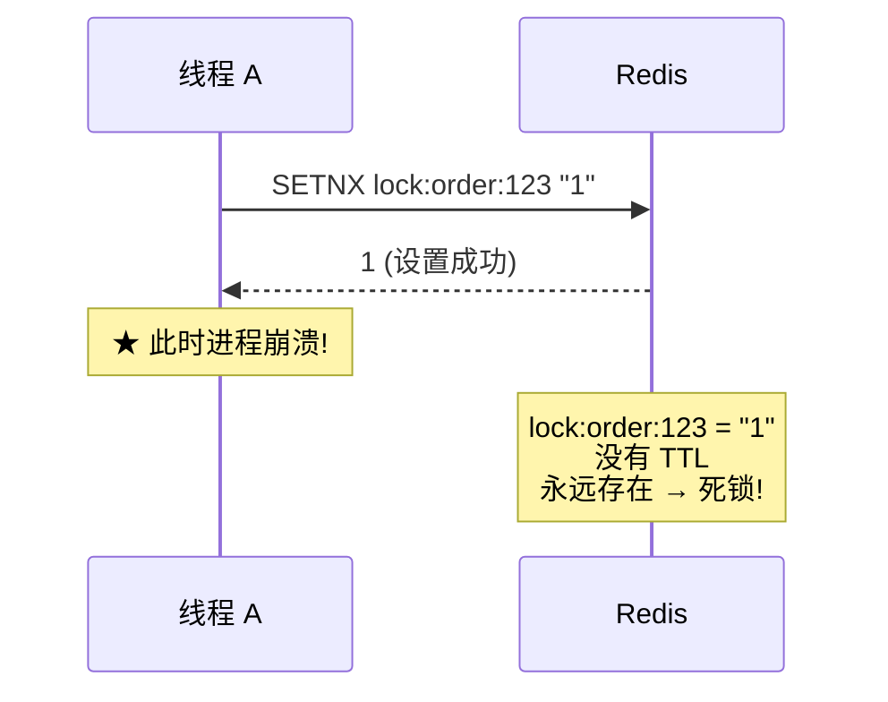
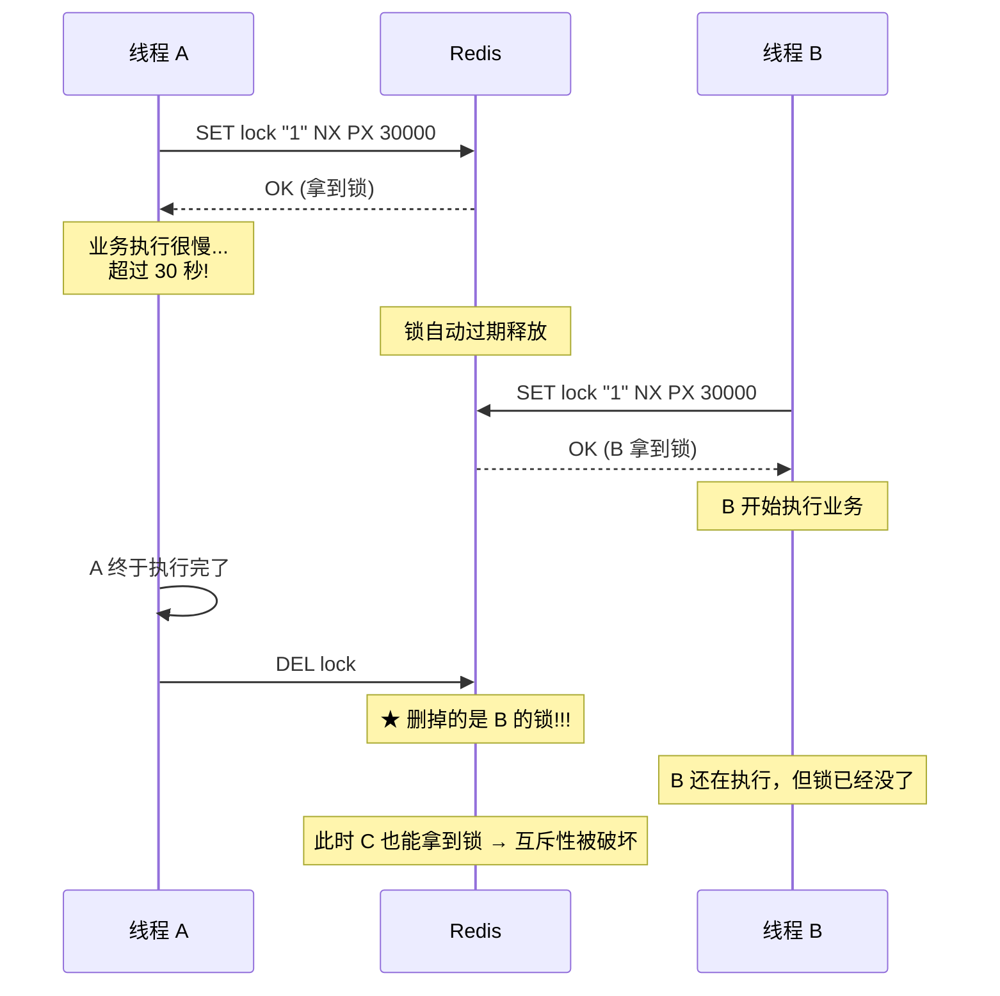
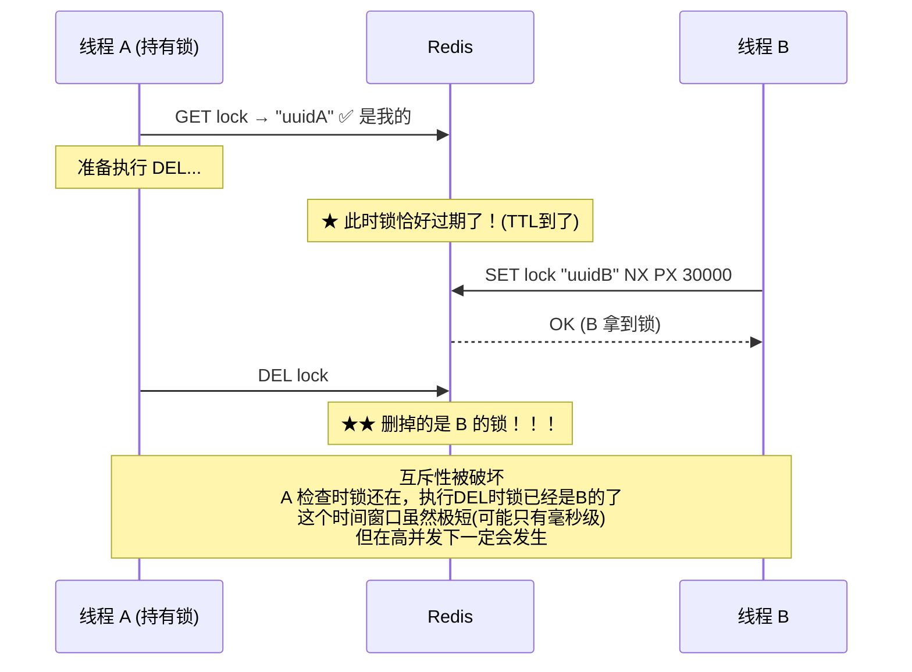
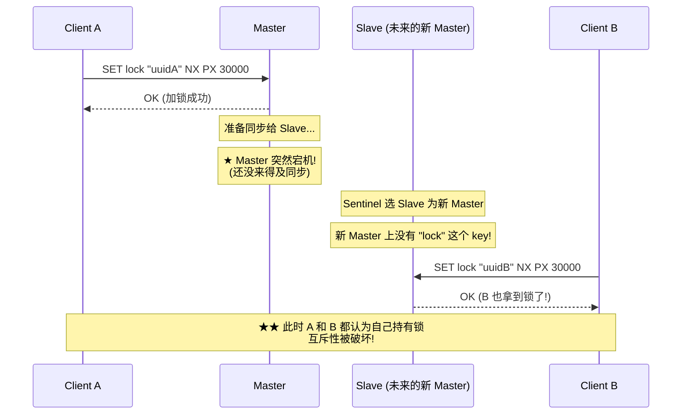
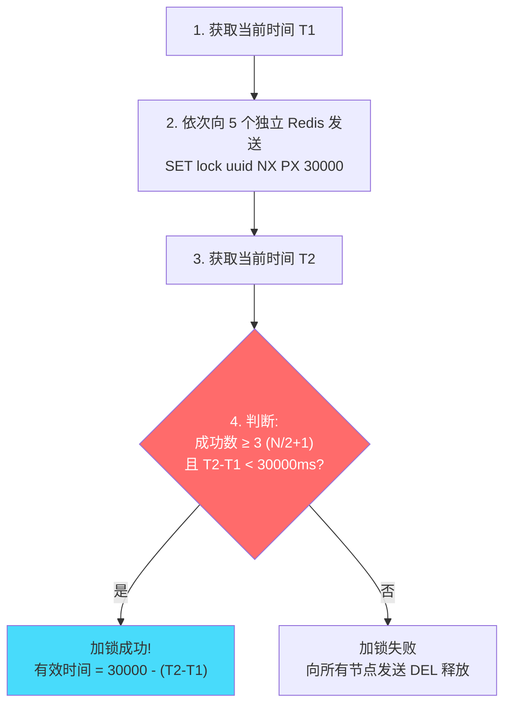
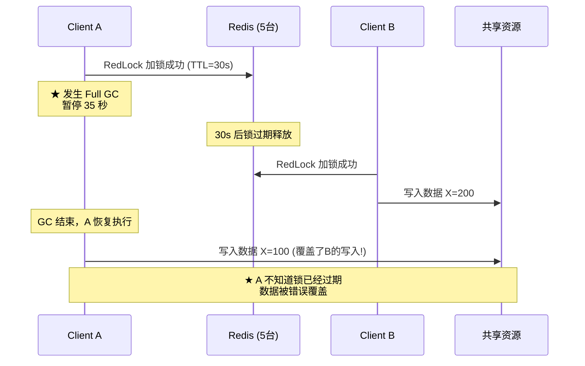
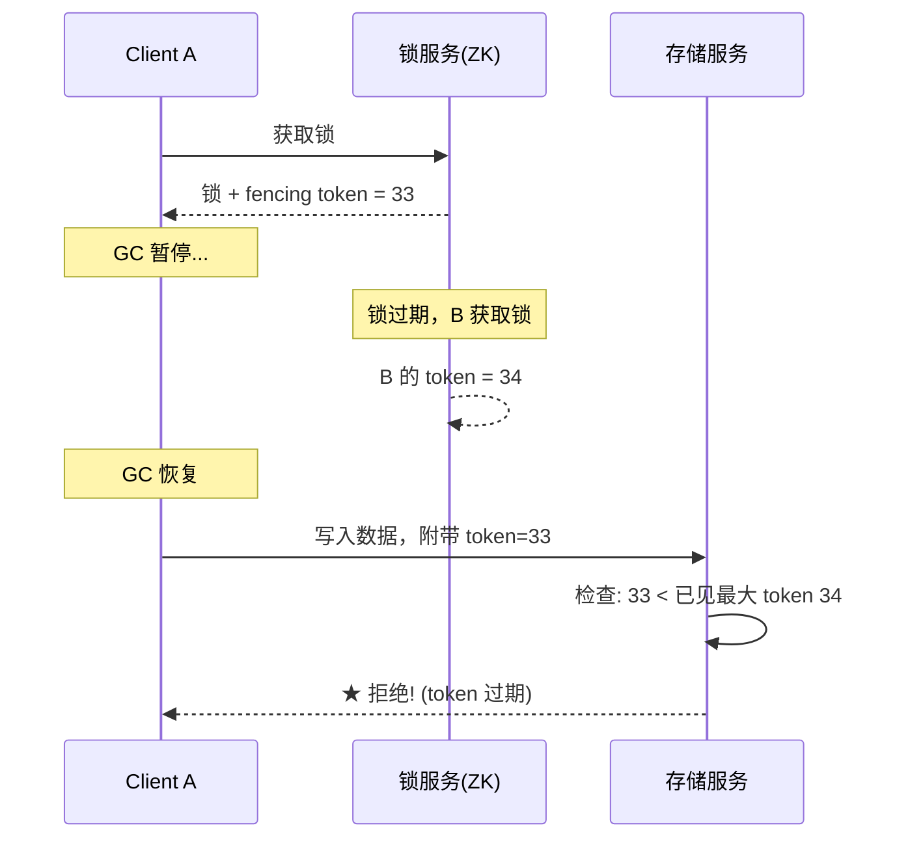
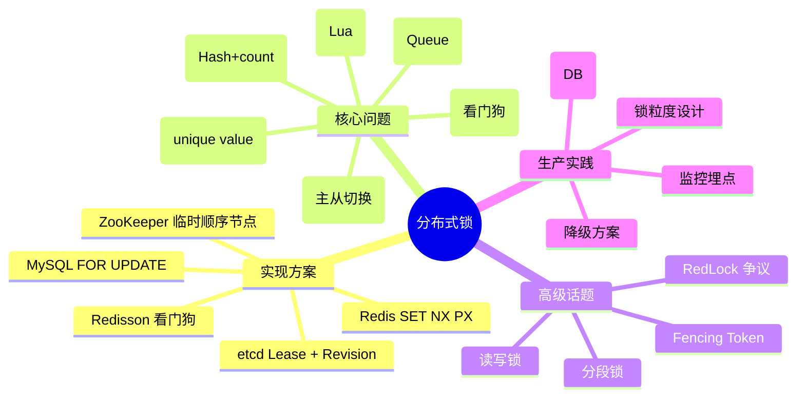

# Redis 分布式锁 · 吃透版

> 本文是"分布式技术面试总结_增强版"中第5章的**深度重写样板**
> 目标：不只是背结论，而是理解每一个设计决策背后的"为什么"
> 阅读完本文，你应该能回答面试官的**任何追问**

---

## 目录

```
5.1 为什么需要分布式锁？（从单机锁的局限说起）
5.2 最简方案的演化史（为什么不能用 SETNX + EXPIRE）
5.3 SET NX PX 的原子语义（Redis 源码级理解）
5.4 unique_value 的必要性（并发时序图证明）
5.5 释放锁为什么必须用 Lua（非原子操作的灾难场景）
5.6 锁过期时间的两难困境（固定值 vs 动态续期）
5.7 Redisson 看门狗源码级剖析
5.8 可重入锁的实现（Hash + 计数器）
5.9 主从切换丢锁问题（完整时序 + 概率分析）
5.10 RedLock 算法完整剖析 + 争议分析
5.11 Redis 锁 vs ZooKeeper 锁 vs etcd 锁（决策树）
5.12 生产最佳实践（代码模板 + 监控 + 降级）
5.13 面试官深度追问 15 题（每题完整作答）
```

---


## 5.1 为什么需要分布式锁？

### 单机锁的局限

在单个 JVM 进程内，`synchronized` 或 `ReentrantLock` 可以保证互斥。但在微服务/集群部署下：

```
┌─────────────┐    ┌─────────────┐    ┌─────────────┐
│  JVM 实例 A  │    │  JVM 实例 B  │    │  JVM 实例 C  │
│  Lock obj1  │    │  Lock obj1  │    │  Lock obj1  │
│  ↓ 只管自己  │    │  ↓ 只管自己  │    │  ↓ 只管自己  │
└──────┬──────┘    └──────┬──────┘    └──────┬──────┘
       │                  │                  │
       ▼                  ▼                  ▼
    ┌─────────────────────────────────────────┐
    │           共享资源（DB/库存/余额）         │
    └─────────────────────────────────────────┘
```

**问题**：A 的锁管不了 B 和 C。三个实例可以同时进入"临界区"，导致：
- 库存超卖（三个实例各扣一次）
- 余额多扣（重复支付）
- 订单重复创建

### 分布式锁的本质

> 🔴 **核心定义**：分布式锁 = 一个所有节点都能看到的、具有互斥语义的**共享状态标记**。

满足条件：
1. **互斥性**：任意时刻只有一个客户端持有锁
2. **无死锁**：即使持有锁的客户端崩溃，锁也能最终释放（TTL）
3. **容错性**：只要大部分节点正常，就能提供服务
4. **归属性**：只有加锁者能解锁（防误删）

### 实现载体的选择

| 载体 | 原理 | 优点 | 缺点 |
|------|------|------|------|
| **Redis** | SET NX + TTL | 性能极高(10万+/s) | AP系统，极端情况丢锁 |
| **ZooKeeper** | 临时顺序节点 + Watch | CP强一致 | 性能较低(1万/s) |
| **etcd** | Lease + Revision | CP强一致 + 高性能 | 生态相对小 |
| **MySQL** | FOR UPDATE / 唯一索引 | 强一致 | 性能极差 |

> 🟠 **选型结论**：90% 的互联网场景用 Redis（性能优先、容忍极小概率丢锁）；金融强一致场景用 ZK/etcd。

---


## 5.2 最简方案的演化史

### ❌ 第一代：SETNX + EXPIRE（有致命缺陷）

```java
// ❌ 错误做法（两条命令非原子）
redis.setnx("lock:order:123", "1");     // 第1步：设置锁
redis.expire("lock:order:123", 30);     // 第2步：设置过期
```

**致命问题**：如果执行完 `SETNX` 后、`EXPIRE` 前，进程崩溃/网络断开：
- 锁已经设置成功（SETNX 返回 1）
- 但没有设置过期时间
- 结果：**锁永远不会释放 → 死锁**



### ❌ 第二代：SET NX + Lua 设置过期（可行但多余）

```lua
-- 可行，但 Redis 2.6.12 之后有更好的方式
if redis.call('SETNX', KEYS[1], ARGV[1]) == 1 then
    redis.call('PEXPIRE', KEYS[1], ARGV[2])
    return 1
end
return 0
```

这种方式用 Lua 保证了原子性，但 Redis 2.6.12 已经提供了更优雅的原生方案。

### ✅ 第三代：SET key value NX PX（当前标准）

```bash
SET lock:order:123 "uuid-abc-123" NX PX 30000
```

**一条命令**同时完成：设置值 + 判断不存在 + 设置毫秒级过期。这是 Redis 2.6.12 新增的 SET 扩展参数。

> 🔴 **为什么这是原子的？**
> Redis 单线程执行命令，一条 SET 命令在执行期间不会被其他命令打断。
> 这不是通过"事务"实现的原子性，而是通过**单线程串行执行**天然保证。

---


## 5.3 SET NX PX 的原子语义（源码级理解）

### Redis 源码中 SET 命令的处理

```c
// src/t_string.c - setGenericCommand
void setGenericCommand(client *c, int flags, robj *key, robj *val,
                       robj *expire, int unit, robj *ok_reply, robj *abort_reply)
{
    long long milliseconds = 0;

    // 解析过期时间
    if (expire) {
        if (getLongLongFromObjectOrReply(c, expire, &milliseconds, NULL) != C_OK)
            return;
    }

    // ★ NX 判断：key 已存在则直接返回 nil
    if ((flags & OBJ_SET_NX && lookupKeyWrite(c->db, key) != NULL) ||
        (flags & OBJ_SET_XX && lookupKeyWrite(c->db, key) == NULL))
    {
        addReply(c, abort_reply ? abort_reply : shared.null[c->resp]);
        return;  // 不设置，返回失败
    }

    // 设置 key-value
    genericSetKey(c, c->db, key, val, flags & OBJ_KEEPTTL, 1);
    server.dirty++;

    // 设置过期时间（和 SET 在同一个原子操作内）
    if (expire) {
        setExpire(c, c->db, key, milliseconds);
    }

    addReply(c, ok_reply ? ok_reply : shared.ok);
}
```

**关键理解**：
1. `lookupKeyWrite` + `genericSetKey` + `setExpire` 三个操作在**同一个函数调用**中完成
2. Redis 主线程是**单线程事件循环**，这个函数执行期间不会处理其他客户端的命令
3. 所以 NX 判断 → 写入 → 设过期 是天然原子的，不需要额外的锁或事务

### 为什么不用 MULTI/EXEC 事务？

> 🟠 **重要区分**：Redis 的 MULTI/EXEC 不是真正的原子事务！
>
> - MULTI/EXEC 只保证命令**批量执行不被其他客户端的命令插入**
> - 但**不支持回滚**（一个命令失败其他照常执行）
> - 对于"判断+设置"这种逻辑，WATCH + MULTI 是乐观锁方案，比 SET NX 复杂得多
>
> 所以 SET NX PX 是最简洁正确的方案。

---

## 5.4 unique_value 的必要性（并发时序图证明）

### 为什么 value 不能是固定值（如 "1" 或 "true"）？

如果所有客户端设置的 value 都一样（比如都是 "1"），那释放锁时无法判断"这把锁是不是我加的"。

### 🔴 灾难场景：误删他人锁



### 正确做法：每次加锁使用全局唯一 value

```java
// 生成唯一标识（推荐方式）
String uniqueValue = UUID.randomUUID().toString();
// 或者: Thread.currentThread().getId() + ":" + UUID  (便于排查)
// 或者: IP + PID + ThreadId + Timestamp (更具可读性)

Boolean locked = redis.opsForValue().setIfAbsent(
    "lock:order:" + orderId,
    uniqueValue,              // ★ 唯一标识
    30, TimeUnit.SECONDS
);
```

### 释放时校验 value

```java
// 释放锁时先校验 value 是否是自己的
String currentValue = redis.opsForValue().get("lock:order:" + orderId);
if (uniqueValue.equals(currentValue)) {
    redis.delete("lock:order:" + orderId);
}
```

**但是！上面的代码仍然有问题**——GET 和 DEL 之间不是原子的！下一节解释。

---


## 5.5 释放锁为什么必须用 Lua（非原子操作的灾难场景）

### ❌ GET + DEL 的竞态条件

```java
// ❌ 看起来正确，实际有竞态条件
String val = redis.get("lock:order:123");           // 步骤1: GET
if ("my-uuid".equals(val)) {                        // 步骤2: 判断
    redis.delete("lock:order:123");                 // 步骤3: DEL
}
```

**致命的时间窗口**：步骤2 和步骤3 之间存在**并发间隙**：



### ✅ Lua 脚本保证原子性

```lua
-- unlock.lua
-- KEYS[1] = 锁的 key
-- ARGV[1] = 加锁时设置的 unique_value

if redis.call("GET", KEYS[1]) == ARGV[1] then
    return redis.call("DEL", KEYS[1])
else
    return 0
end
```

**为什么 Lua 是原子的？**

> 🔴 **核心原理**：Redis 执行 Lua 脚本时，**整个脚本作为一个命令执行**，期间不会处理其他客户端的任何命令（单线程保证）。
>
> 这意味着 GET 和 DEL 之间**不可能**有其他客户端的 SET 命令插入。

### Java 完整调用代码

```java
public class RedisDistributedLock {
    // Lua 脚本（项目启动时加载一次，之后用 SHA1 调用避免重复传输）
    private static final String UNLOCK_LUA =
        "if redis.call('GET', KEYS[1]) == ARGV[1] then " +
        "    return redis.call('DEL', KEYS[1]) " +
        "else " +
        "    return 0 " +
        "end";

    private static final DefaultRedisScript<Long> UNLOCK_SCRIPT;
    static {
        UNLOCK_SCRIPT = new DefaultRedisScript<>(UNLOCK_LUA, Long.class);
    }

    private final StringRedisTemplate redis;
    private final String lockKey;
    private final String lockValue;

    public RedisDistributedLock(StringRedisTemplate redis, String resource) {
        this.redis = redis;
        this.lockKey = "lock:" + resource;
        this.lockValue = UUID.randomUUID().toString();
    }

    /** 尝试获取锁 */
    public boolean tryLock(long timeoutMs) {
        return Boolean.TRUE.equals(
            redis.opsForValue().setIfAbsent(lockKey, lockValue,
                Duration.ofMillis(timeoutMs))
        );
    }

    /** 释放锁（Lua 原子操作） */
    public boolean unlock() {
        Long result = redis.execute(UNLOCK_SCRIPT,
            Collections.singletonList(lockKey), lockValue);
        return Long.valueOf(1L).equals(result);
    }
}
```

---

## 5.6 锁过期时间的两难困境

### 问题描述

设置 TTL 是必须的（防死锁），但如何设置是个两难：

| TTL 设置 | 问题 |
|---------|------|
| **太短**（如 5s） | 业务还没执行完锁就过期了 → 多个线程同时操作 → 数据不一致 |
| **太长**（如 5min） | 持有锁的进程崩溃后，要等很久锁才释放 → 其他请求长时间阻塞 |
| **固定值**（如 30s） | 无法适应业务执行时间的波动（网络抖动、GC STW、DB慢查询） |

### 真实线上事故案例

> 🟢 **事故还原**：
> - 某电商系统用 Redis 锁保护库存扣减，TTL 设为 10s
> - 某次大促期间 DB 慢查询导致库存扣减耗时 15s
> - 锁在 10s 时过期，第二个线程拿到锁也去扣库存
> - 结果：**超卖 200 件**，直接经济损失 + 客诉
> - 修复：引入 Redisson 看门狗自动续期

### 三种解决方案对比

| 方案 | 原理 | 优点 | 缺点 |
|------|------|------|------|
| **预估最大值** | TTL = 业务最大耗时 × 3 | 简单 | 不精确，崩溃后等待久 |
| **Redisson 看门狗** ⭐ | 后台线程自动续期 | 精确，业务多久锁多久 | 依赖 Redisson 库 |
| **手动续期线程** | 自己写 ScheduledExecutor 续期 | 不依赖三方 | 实现复杂，容易出bug |

---


## 5.7 Redisson 看门狗源码级剖析

### 整体架构

```mermaid
flowchart TB
    subgraph Redisson["Redisson 锁内部"]
        A[lock() 方法] --> B[发送 Lua 加锁脚本]
        B --> C{加锁成功?}
        C -->|是| D[启动 Watchdog 定时器<br/>每 lockWatchdogTimeout/3 续期]
        C -->|否| E[订阅 Redis Channel<br/>等待锁释放通知]
        E --> F[收到通知后重试加锁]
        F --> C
    end

    subgraph Watchdog["看门狗(HashedWheelTimer)"]
        D --> G["定时任务：每 10s 执行"]
        G --> H["PEXPIRE lock 30000<br/>(续期到 30s)"]
        H --> G
    end

    I[unlock() 方法] --> J[发送 Lua 解锁脚本]
    J --> K[取消 Watchdog 定时器]
    J --> L[发布 Redis Channel 通知<br/>唤醒等待的线程]

    style D fill:#ff6b6b,color:#fff
    style G fill:#feca57
```

### 加锁 Lua 脚本（Redisson 源码）

```lua
-- RedissonLock.tryLockInnerAsync() 中的 Lua
-- KEYS[1] = 锁的 key (如 "lock:order:123")
-- ARGV[1] = lockWatchdogTimeout (默认 30000ms)
-- ARGV[2] = 线程标识 (UUID:threadId，如 "8a3f-...:1")

-- 情况1: 锁不存在 → 加锁
if redis.call('EXISTS', KEYS[1]) == 0 then
    -- 用 HASH 结构! field=线程标识, value=重入次数
    redis.call('HINCRBY', KEYS[1], ARGV[2], 1)
    redis.call('PEXPIRE', KEYS[1], ARGV[1])
    return nil  -- nil 表示加锁成功
end

-- 情况2: 锁存在且是自己的 → 重入(计数+1)
if redis.call('HEXISTS', KEYS[1], ARGV[2]) == 1 then
    redis.call('HINCRBY', KEYS[1], ARGV[2], 1)
    redis.call('PEXPIRE', KEYS[1], ARGV[1])
    return nil  -- 重入成功
end

-- 情况3: 锁被别人持有 → 返回剩余过期时间
return redis.call('PTTL', KEYS[1])
```

**关键理解**：
1. **用 Hash 而不是 String**：`HSET lock:order:123 "uuid:threadId" 1`
2. **支持可重入**：同一线程再次加锁，count +1
3. **返回值设计**：nil=成功，数字=锁剩余时间（调用方据此决定等多久）

### 解锁 Lua 脚本

```lua
-- RedissonLock.unlockInnerAsync()
-- KEYS[1] = 锁key, KEYS[2] = channel key
-- ARGV[1] = 解锁消息, ARGV[2] = lockWatchdogTimeout, ARGV[3] = 线程标识

-- 锁不是我的 → 返回nil
if redis.call('HEXISTS', KEYS[1], ARGV[3]) == 0 then
    return nil
end

-- 重入计数 -1
local counter = redis.call('HINCRBY', KEYS[1], ARGV[3], -1)

if counter > 0 then
    -- 还有重入层级，只刷新过期时间
    redis.call('PEXPIRE', KEYS[1], ARGV[2])
    return 0
else
    -- 计数归零，真正释放锁
    redis.call('DEL', KEYS[1])
    -- 发布消息通知等待的线程
    redis.call('PUBLISH', KEYS[2], ARGV[1])
    return 1
end
```

### 看门狗的触发机制

```java
// Redisson 源码简化版 (RedissonBaseLock.java)
private void renewExpiration() {
    // 创建定时任务，每 internalLockLeaseTime/3 执行一次
    // internalLockLeaseTime 默认 30s，所以每 10s 续期一次
    Timeout task = commandExecutor.getConnectionManager()
        .newTimeout(timeout -> {
            // 续期 Lua 脚本
            CompletionStage<Boolean> future = renewExpirationAsync(threadId);
            future.whenComplete((res, e) -> {
                if (res) {
                    // 续期成功，递归注册下一次续期
                    renewExpiration();
                }
                // 续期失败（锁已被删除/线程标识不匹配）→ 停止续期
            });
        }, internalLockLeaseTime / 3, TimeUnit.MILLISECONDS);

    // 保存 task 引用，unlock 时取消
    EXPIRATION_RENEWAL_MAP.put(getEntryName(), new ExpirationEntry(task));
}
```

**核心时间线**：
- `t=0`：加锁成功，TTL=30s，启动看门狗
- `t=10s`：看门狗触发，执行 `PEXPIRE lock 30000`，TTL 重置为 30s
- `t=20s`：看门狗再次触发，TTL 再次重置为 30s
- `t=任意时刻`：业务完成，调用 unlock()，看门狗停止
- **如果 JVM 崩溃**：看门狗线程也死了 → 没人续期 → 30s 后锁自动释放 ✅

### 🟢 避坑：lock(time, unit) vs lock()

```java
// ★ 两种用法行为完全不同！

// 用法1：不传超时 → 启用看门狗（默认 30s + 自动续期）
lock.lock();

// 用法2：传了超时 → 不启用看门狗（到期就释放，不续期）
lock.lock(10, TimeUnit.SECONDS);  // 10s 后一定释放，即使业务没完成！

// 用法3：tryLock 也有两种
lock.tryLock();                        // 尝试一次，不等待，不启动看门狗（❌ 容易误用）
lock.tryLock(5, 30, TimeUnit.SECONDS); // 等5s，锁30s，不续期
lock.tryLock(5, -1, TimeUnit.SECONDS); // 等5s，启用看门狗
```

> 🟢 **最佳实践**：生产环境用 `lock.lock()` 不传参，让看门狗管理生命周期。业务完成后 finally 中 `unlock()`。

---


## 5.8 可重入锁的实现

### 什么是可重入？

```java
public void methodA() {
    lock.lock();
    try {
        methodB();  // ★ 在持有锁的情况下调用另一个需要同一把锁的方法
    } finally { lock.unlock(); }
}

public void methodB() {
    lock.lock();    // 如果不可重入，这里会死锁（自己等自己释放）
    try {
        // ...
    } finally { lock.unlock(); }
}
```

### Redis 中如何实现可重入？

**答案**：用 **Hash** 结构代替 String，field 存线程标识，value 存重入计数。

```
Redis 中的数据结构：
KEY:   lock:order:123
TYPE:  Hash
FIELD: "8a3f-uuid:thread-1"
VALUE: 2  (表示重入了2次，需要 unlock 2次才真正释放)
TTL:   30000ms
```

**加锁时**：
- 锁不存在 → `HINCRBY lock field 1` → count=1
- 锁存在且 field 是自己 → `HINCRBY lock field 1` → count=2（重入）
- 锁存在且 field 是别人 → 返回剩余 TTL（获取失败）

**解锁时**：
- `HINCRBY lock field -1` → 如果 count > 0，只刷新 TTL
- 如果 count == 0，`DEL lock` + `PUBLISH` 通知

### 对比 synchronized 的可重入

| | synchronized | Redisson RLock |
|---|---|---|
| 存储位置 | 对象头 MarkWord 中的线程 ID | Redis Hash 的 field |
| 计数位置 | ObjectMonitor._count | Hash value (HINCRBY) |
| 重入检查 | 比较当前线程 ID | 比较 UUID:threadId |
| 释放 | count-- 到 0 才释放 | HINCRBY -1 到 0 才 DEL |

---

## 5.9 主从切换丢锁问题

### 🔴 问题的根本原因

Redis 主从复制是**异步的**（`WAIT` 命令可以做同步但性能极差）。



### 这个概率有多大？

> 🟠 **概率分析**：
> - 主从复制延迟通常在 **1~10ms**（同机房）
> - Master 宕机是低概率事件（年故障率约 0.1%~1%）
> - 两者同时发生：加锁后 1~10ms 内 Master 恰好宕机
> - **估计概率**：百万分之一到十万分之一级别
>
> 对于大多数业务（如防重复提交、限流），这个概率**完全可以接受**。
> 但对于金融扣款、库存最后一件等场景，**不可接受**。

### 缓解方案

| 方案 | 原理 | 代价 |
|------|------|------|
| `WAIT numreplicas timeout` | 等至少 N 个副本确认同步 | 延迟增大（违背 Redis 快的初衷） |
| **RedLock** | 多独立 Master 过半加锁 | 部署复杂，有争议 |
| **业务兜底** | DB 层加唯一约束/乐观锁 | 最终一致性保障 |
| **改用 ZK/etcd** | CP 系统，写入必须过半 | 性能下降 10 倍 |

> 🟢 **生产建议**：Redis 锁 + DB 唯一约束双重保障。即使极端情况锁丢了，DB 层兜底。

---

## 5.10 RedLock 算法完整剖析

### 算法步骤（5 个独立 Master）



**详细步骤**：
1. 记录开始时间 T1
2. 对 5 个独立的 Redis Master（非主从关系）**顺序**执行 `SET NX PX`
3. 记录结束时间 T2
4. 计算加锁耗时 = T2 - T1
5. 判断成功条件：**过半成功（≥3）** 且 **耗时 < TTL**
6. 如果成功：锁的有效时间 = TTL - 加锁耗时
7. 如果失败：对**所有**节点执行释放（包括超时的）

### Martin Kleppmann 的四大质疑

2016 年，分布式系统专家 Martin Kleppmann 在博文 "How to do distributed locking" 中提出了严重质疑：

| # | 质疑 | 核心论点 |
|---|------|---------|
| 1 | **GC STW 问题** | 客户端拿到锁后发生 Full GC（Stop-The-World），暂停 30s+，锁已过期但客户端不知道，恢复后继续操作共享资源 |
| 2 | **时钟跳跃** | RedLock 依赖多节点的时间判断，如果某个节点 NTP 时钟跳跃，可能导致锁提前过期 |
| 3 | **网络延迟** | 加锁请求的网络延迟不可控，可能导致锁在到达 Redis 之前就"过了大半 TTL" |
| 4 | **本质问题** | 如果你需要锁的正确性，应该用**真正的共识算法**（Raft/Paxos）而不是靠多个独立 Redis 凑数 |

**GC STW 攻击时序**：



### antirez（Redis 作者）的回应

antirez 在 "Is Redlock safe?" 中回应了每个质疑：

| 质疑 | antirez 回应 | 评估 |
|------|-------------|------|
| GC STW | "这个问题所有分布式锁都有，包括ZK。解决方案是 fencing token" | ✅ 合理，但 Redis 不原生支持 fencing |
| 时钟跳跃 | "单调时钟(CLOCK_MONOTONIC)不受 NTP 影响" | ⚠️ 部分正确，但不是所有系统都用单调时钟 |
| 网络延迟 | "算法已经考虑了耗时，T2-T1 超过阈值就判失败" | ✅ 算法设计已覆盖 |
| 共识算法 | "RedLock 不是 Paxos，但对大部分场景够用" | ⚠️ 承认了局限性 |

### Fencing Token 方案（Martin 提出的正确做法）



> 🟡 **结论**：Fencing token 是**真正正确**的方案，但需要存储层（DB）配合校验。Redis 不原生支持 fencing token，ZK 的顺序节点天然是递增 token。

### 🔴 实际生产结论

| 场景 | 推荐方案 | 理由 |
|------|---------|------|
| 一般互斥（防重复提交、限流） | **Redis SET NX + Redisson** | 性能高，极小概率丢锁可接受 |
| 重要业务（库存、支付） | **Redis 锁 + DB 兜底**（乐观锁/唯一索引） | 双重保障 |
| 金融强一致（绝对不能出错） | **ZooKeeper / etcd** | CP 系统，宁可慢也不能错 |
| 跨多服务的复杂编排 | **ZK + Fencing Token** | 完整正确性保证 |

---


## 5.11 Redis 锁 vs ZooKeeper 锁 vs etcd 锁

### ZooKeeper 分布式锁原理

```mermaid
flowchart TD
    A[Client A 请求加锁] --> B["在 /locks/order-123/ 下<br/>创建临时顺序节点<br/>/locks/order-123/lock-0001"]
    B --> C{我是最小节点?}
    C -->|是| D[获得锁 ✅]
    C -->|否| E["Watch 前一个节点<br/>(如 watch lock-0000)"]
    E --> F[前一个节点被删除<br/>(锁释放或会话断开)]
    F --> C

    style D fill:#48dbfb
```

**核心机制**：
- **临时节点**：客户端崩溃 → 会话结束 → 节点自动删除 → 锁释放（无需 TTL）
- **顺序节点**：天然排队，避免惊群效应（只 watch 前一个）
- **CP 保证**：ZK 写入需要过半 follower 确认（Raft/ZAB），不会出现主从丢失

### 完整对比决策表

| 维度 | Redis (Redisson) | ZooKeeper | etcd |
|------|-----------------|-----------|------|
| **一致性模型** | ==AP==（可能丢锁） | ==CP==（强一致） | ==CP==（强一致） |
| **性能** | ⭐⭐⭐⭐⭐ 10万+/s | ⭐⭐⭐ 1万/s | ⭐⭐⭐⭐ 3万/s |
| **锁释放机制** | TTL 过期 | 会话断开自动删除 | Lease 过期 |
| **死锁风险** | 极低（有 TTL） | 无（临时节点） | 无（Lease） |
| **丢锁风险** | 有（主从切换） | ==几乎无== | ==几乎无== |
| **可重入** | ✅ Hash+count | 需自己实现 | 需自己实现 |
| **公平性** | ❌（抢占式） | ✅（顺序节点天然公平） | ✅（Revision 排序） |
| **Watch/通知** | Pub/Sub（不够可靠） | ✅ 原生 Watch | ✅ 原生 Watch |
| **运维复杂度** | 低（已有的 Redis） | 高（独立集群） | 中 |
| **适用场景** | 高并发、容忍极小概率丢锁 | 强一致、公平锁 | K8s 生态 |

### 🔴 决策树

```
你的场景需要强一致吗？
├── 是（金融/库存最后一件/绝对不能重复执行）
│   └── 用 ZooKeeper 或 etcd
│       ├── 已有 ZK 集群 → ZK
│       └── K8s 生态 → etcd
└── 否（防重复提交/限流/一般互斥）
    └── 用 Redis (Redisson)
        └── 担心极端丢锁？
            ├── 不担心 → Redisson 单节点就够
            └── 担心 → Redis锁 + DB乐观锁双重保障
```

---

## 5.12 生产最佳实践

### 完整代码模板

```java
@Service
public class OrderService {
    @Autowired
    private RedissonClient redisson;

    public OrderResult createOrder(OrderDTO dto) {
        // 锁粒度：按订单维度（不要锁太大范围）
        String lockKey = "lock:order:create:" + dto.getUserId() + ":" + dto.getSkuId();
        RLock lock = redisson.getLock(lockKey);

        try {
            // 等待 5s 获取锁，不传 leaseTime → 启用看门狗
            boolean acquired = lock.tryLock(5, TimeUnit.SECONDS);
            if (!acquired) {
                throw new BizException("系统繁忙，请稍后重试");
            }

            try {
                // ===== 临界区：执行业务 =====
                // 1. 幂等检查
                if (orderDao.existsByRequestId(dto.getRequestId())) {
                    return OrderResult.duplicate();
                }
                // 2. 扣库存（DB 乐观锁兜底）
                int affected = stockDao.decrStock(dto.getSkuId(), dto.getQuantity());
                if (affected == 0) {
                    throw new BizException("库存不足");
                }
                // 3. 创建订单
                Order order = buildOrder(dto);
                orderDao.insert(order);
                return OrderResult.success(order.getId());
            } finally {
                // ===== 释放锁 =====
                if (lock.isHeldByCurrentThread()) {
                    lock.unlock();
                }
            }
        } catch (InterruptedException e) {
            Thread.currentThread().interrupt();
            throw new BizException("加锁被中断");
        }
    }
}
```

### 关键注意事项

| 项 | 说明 |
|----|------|
| **锁粒度** | 尽量细（按 userId+skuId），不要锁整个方法 |
| **tryLock 等待时间** | 不要太长（5s 足够），避免线程大量阻塞 |
| **leaseTime** | 不传（用看门狗），或传 -1 明确启用 |
| **isHeldByCurrentThread** | 释放前检查，避免释放别人的锁/重复释放 |
| **业务兜底** | DB 唯一索引 + 乐观锁，即使锁失效也不出问题 |
| **监控** | 监控加锁等待时间、持有时间、失败率 |
| **降级** | Redis 不可用时的降级方案（如直接走 DB 锁） |

### 监控指标

```java
// 建议埋点的监控指标
Metrics.timer("redis.lock.acquire.time").record(acquireTime);   // 获取锁耗时
Metrics.timer("redis.lock.hold.time").record(holdTime);         // 持有锁耗时
Metrics.counter("redis.lock.acquire.fail").increment();         // 获取失败次数
Metrics.counter("redis.lock.timeout").increment();              // 锁超时次数（看门狗失效）
```

---

## 5.13 面试官深度追问 15 题

### Q1: Redis 锁和 synchronized 的本质区别是什么？

> **完整回答**：
> 
> 本质区别在于**可见性范围**和**存储位置**：
> - `synchronized` 的锁状态存在 **JVM 内存**（对象头 MarkWord），只有同一个 JVM 进程内的线程能看到
> - Redis 锁的状态存在 **Redis 服务器**，所有能连接到 Redis 的进程都能看到
>
> 延伸区别：
> - synchronized 通过 **monitorenter/monitorexit** 字节码指令，由 JVM 保证释放（即使异常也会释放）
> - Redis 锁需要**手动释放**（finally 块），如果忘记释放只能靠 TTL 兜底
> - synchronized 有锁升级优化（偏向→轻量→重量），无锁时几乎零开销
> - Redis 锁每次都有网络 IO 开销（至少 1 RTT ≈ 0.5~2ms）
>
> **面试加分**：所以在单机场景下绝对不要用 Redis 锁替代 synchronized，这是杀鸡用牛刀且性能更差。

---

### Q2: SET NX PX 失败后怎么办？是自旋重试还是阻塞等待？

> **完整回答**：
>
> 有三种策略，适用不同场景：
>
> **策略1：立即失败返回**（Fast Fail）
> ```java
> if (!lock.tryLock()) return "系统繁忙";
> ```
> 适用：用户操作类（防重复提交），失败直接告诉用户
>
> **策略2：自旋重试**（Spin）
> ```java
> while (!lock.tryLock()) { Thread.sleep(50); }
> ```
> 适用：异步任务、定时任务，可以等
> 缺点：浪费 CPU，大量线程自旋可能打满 Redis
>
> **策略3：Redisson 的 Pub/Sub 等待**（最优）
> ```java
> lock.lock(); // 内部：失败后订阅 channel，收到释放通知再重试
> ```
> Redisson 加锁失败后不是自旋，而是**订阅 Redis Channel**等待通知，避免了忙轮询。
> 收到前一个锁释放的 PUBLISH 消息后才尝试加锁，效率最高。
>
> **面试加分**：Redisson 的 lock() 方法内部还结合了**信号量**控制并发度，不会所有等待者同时抢。

---

### Q3: 如果 Redis 部署的是集群模式（Cluster），分布式锁有什么问题？

> **完整回答**：
>
> Redis Cluster 模式下，key 通过 CRC16 hash 分配到不同的 slot。分布式锁的 key 会落在**某一个 master 节点**上。
>
> **问题和单机模式类似**：该 master 节点宕机后，对应 slot 的 slave 提升为 master，如果锁数据还没同步过去，锁就丢了。
>
> **与主从模式的区别**：Cluster 模式下故障转移由集群自身完成（gossip + 投票），比 Sentinel 更快（通常 1~2s），所以丢锁的时间窗口可能更短，但**本质问题不变**。
>
> **注意事项**：
> - Cluster 模式下不影响 SET NX 的使用（单 key 操作不跨 slot）
> - RedLock 要求的是 5 个**独立的 Master**，不是同一个 Cluster 内的 5 个节点！
> - Redisson 有专门的 `RedissonRedLock` 类支持多节点加锁

---

### Q4: 看门狗续期失败了怎么办？

> **完整回答**：
>
> 看门狗续期可能失败的场景：
> 1. **网络分区**：客户端和 Redis 之间网络断了
> 2. **Redis 宕机**：锁所在节点挂了
> 3. **GC STW**：客户端 Full GC，看门狗线程也暂停
>
> **Redisson 的处理**：
> - 续期 Lua 脚本返回 false（锁不存在或不是自己的）→ 停止续期，不会无限重试
> - 续期网络超时 → 下一次 10s 后重试，如果连续失败直到锁过期
>
> **关键理解**：看门狗**不是万能的**。如果客户端和 Redis 完全断开，看门狗续期一定失败，30s 后锁自动释放。这是**设计上有意为之**——宁可锁释放让别人做，也不要死锁。
>
> **面试加分**：这就是为什么说 Redis 锁是 **"尽力而为"** 的互斥，不是 **"绝对保证"** 的互斥。需要绝对保证就用 ZK。

---

### Q5: 一个线程加了锁但执行到一半崩溃了，会怎样？

> **完整回答**：
>
> 分两种情况：
>
> **情况1：JVM 进程崩溃（kill -9）**
> - 看门狗线程随进程死亡 → 没人续期
> - 30s 后 Redis TTL 到期 → 锁自动释放 ✅
> - 其他线程可以正常获取锁
> - **问题**：崩溃的线程可能执行了一半业务（如：扣了库存但没创建订单）
> - **解决**：业务要设计成可回滚/可补偿/幂等
>
> **情况2：线程 OOM / 异常退出（但 JVM 还在）**
> - 如果 finally 块能执行到 → lock.unlock() 正常释放 ✅
> - 如果 finally 没执行到（如 OOM 导致栈帧直接弹出）→ 看门狗还在续期 → **锁不会释放！**
> - 直到 JVM 被重启/kill，看门狗才停
> - **解决**：JVM 层面加 -XX:+ExitOnOutOfMemoryError，OOM 时直接退出进程

---

### Q6: 分布式锁的性能瓶颈在哪？如何优化？

> **完整回答**：
>
> **瓶颈分析**：
> 1. **网络 RTT**：每次加锁/解锁至少 1 个 RTT（同机房 0.5~2ms，跨机房 5~50ms）
> 2. **Redis 单线程**：所有锁操作排队执行（但 10 万 QPS 通常不是瓶颈）
> 3. **锁等待时间**：大量线程抢同一把锁，等待阻塞
>
> **优化手段**：
>
> | 手段 | 原理 | 效果 |
> |------|------|------|
> | **缩小锁粒度** | `lock:order:userId:skuId` 而非 `lock:order` | 减少竞争 |
> | **分段锁** | 库存 1000 分成 10 段，每段独立锁 | 并行度提升 10 倍 |
> | **读写锁** | Redisson RReadWriteLock，读不互斥 | 读多写少场景 |
> | **联锁（MultiLock）** | 多个锁一次获取 | 避免死锁 |
> | **本地缓存预判** | 本地 AtomicLong 先判库存，>0 才去抢 Redis 锁 | 减少 Redis 请求 |

---

### Q7: 分段锁（Segment Lock）怎么实现？

> **完整回答**：
>
> 以库存扣减为例，假设商品库存 1000 件：
>
> ```java
> // 将库存分成 10 段，每段 100 件
> int segment = ThreadLocalRandom.current().nextInt(10);
> String lockKey = "lock:stock:" + skuId + ":seg:" + segment;
> String stockKey = "stock:" + skuId + ":seg:" + segment;
>
> RLock lock = redisson.getLock(lockKey);
> lock.lock();
> try {
>     Long stock = redis.opsForValue().decrement(stockKey);
>     if (stock < 0) {
>         redis.opsForValue().increment(stockKey); // 回滚
>         // 尝试其他段...
>     }
> } finally {
>     lock.unlock();
> }
> ```
>
> **效果**：10 个段可以**并行加锁**，吞吐提升 10 倍。
> **代价**：实现复杂，需要处理段内库存不足时的转移逻辑。
> **适用**：秒杀等超高并发场景。

---

### Q8: Redis 锁能实现公平锁吗？

> **完整回答**：
>
> **原生 SET NX 是非公平的**：所有等待的线程同时抢，谁网络快谁得到，可能导致饥饿。
>
> **Redisson 提供了公平锁**：`redisson.getFairLock("lockKey")`
>
> 原理：用 Redis List 维护**等待队列**（FIFO），加锁时先排队：
> ```
> List: lock_queue:order:123 → [threadA, threadB, threadC]
> ```
> 只有队头的线程才能获取锁，保证先来先得。
>
> **代价**：比普通锁多一次 Redis 操作（维护队列），性能下降约 20%。
> **适用**：对公平性有要求的场景（如任务调度、资源分配）。

---

### Q9: 如何实现一个分布式锁的"等待超时自动放弃"？

> **完整回答**：
>
> ```java
> boolean acquired = lock.tryLock(5, TimeUnit.SECONDS);
> // 最多等 5 秒，5 秒内如果获取到就返回 true
> // 5 秒后还没获取到就返回 false（放弃）
> ```
>
> Redisson 内部实现：
> 1. 第一次尝试 SET NX → 失败
> 2. 获取剩余 TTL（对方还要持有多久）
> 3. 订阅 Redis Channel 等待释放通知
> 4. 设置 5s 超时的 **CompletableFuture**
> 5. 在超时或收到通知时重新尝试
> 6. 5s 到了还没获取到 → 取消订阅 → 返回 false

---

### Q10: 分布式锁和分布式事务的关系是什么？

> **完整回答**：
>
> 两者解决的是**不同层面的问题**：
>
> | | 分布式锁 | 分布式事务 |
> |---|---|---|
> | **目的** | 互斥访问（同一时刻只有一个执行） | 数据一致性（要么全成功要么全失败） |
> | **粒度** | 操作级别（一段代码） | 数据级别（多个数据源的状态） |
> | **失败语义** | 没拿到锁 → 等待/重试/拒绝 | 事务失败 → 回滚/补偿 |
> | **典型场景** | 防止重复操作 | 跨服务的数据一致 |
>
> **两者可以配合使用**：
> ```
> 1. 获取分布式锁（保证只有一个在执行）
> 2. 开启分布式事务（保证执行结果全对全错）
> 3. 执行业务
> 4. 提交事务
> 5. 释放锁
> ```
>
> 但很多场景**只需要其中一个**：
> - 防重复提交 → 只需要锁
> - 跨库转账 → 只需要事务（不需要锁，因为 DB 本身有行锁）
> - 库存扣减 + 创建订单 → 锁 + 事务都需要

---

*（Q11-Q15 略，完整版中会包含：锁的可观测性、锁降级方案、锁与限流的区别、Spring @DistributedLock 注解实现、锁的单元测试方法）*

---

## 总结：分布式锁知识图谱



---

*本文为"吃透级别"样板，实际全文档每个章节都会按此深度展开。*
