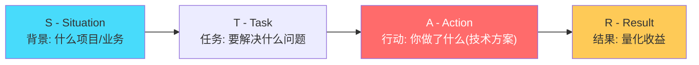
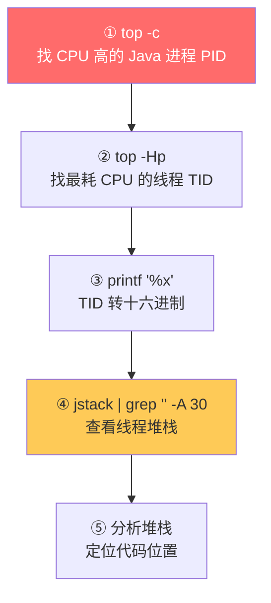
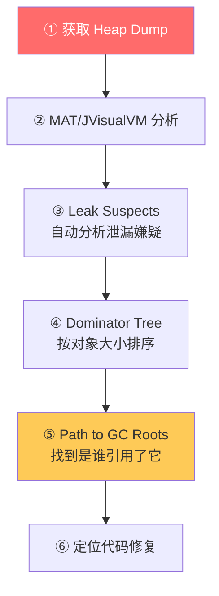
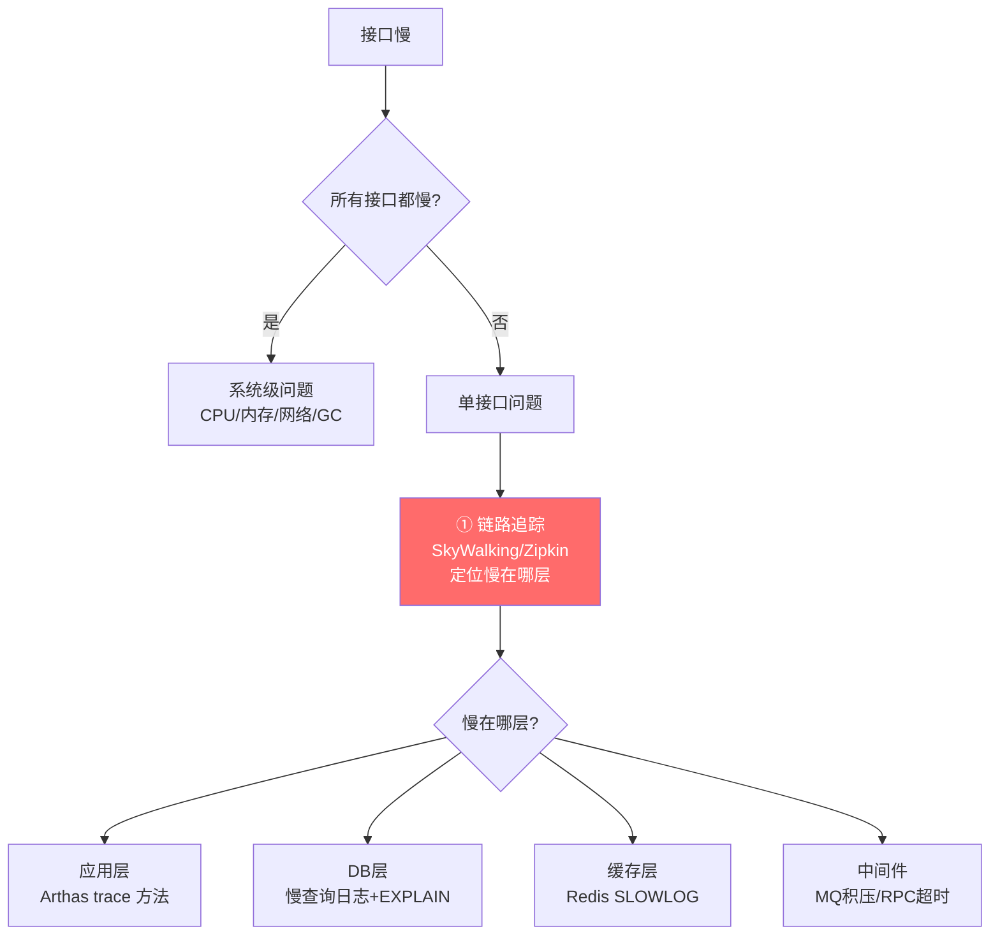
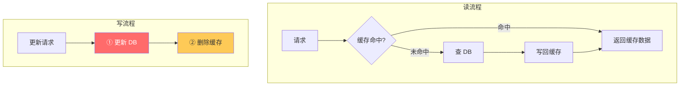
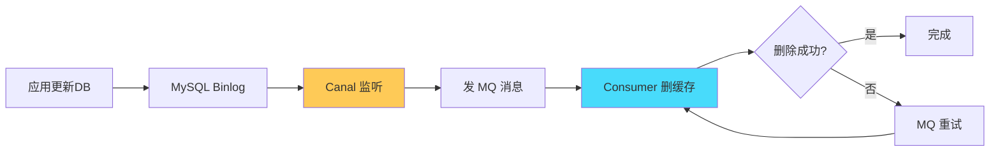
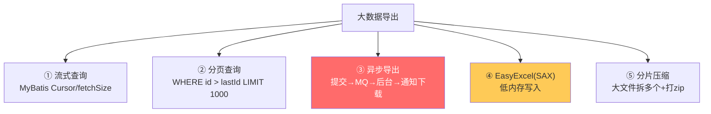
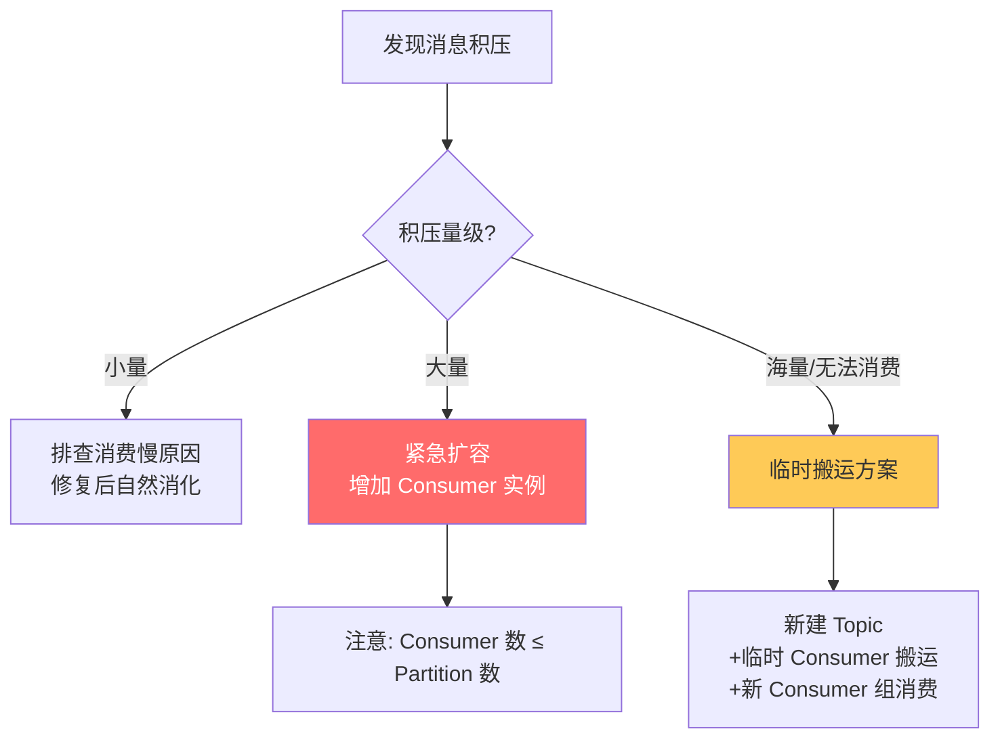
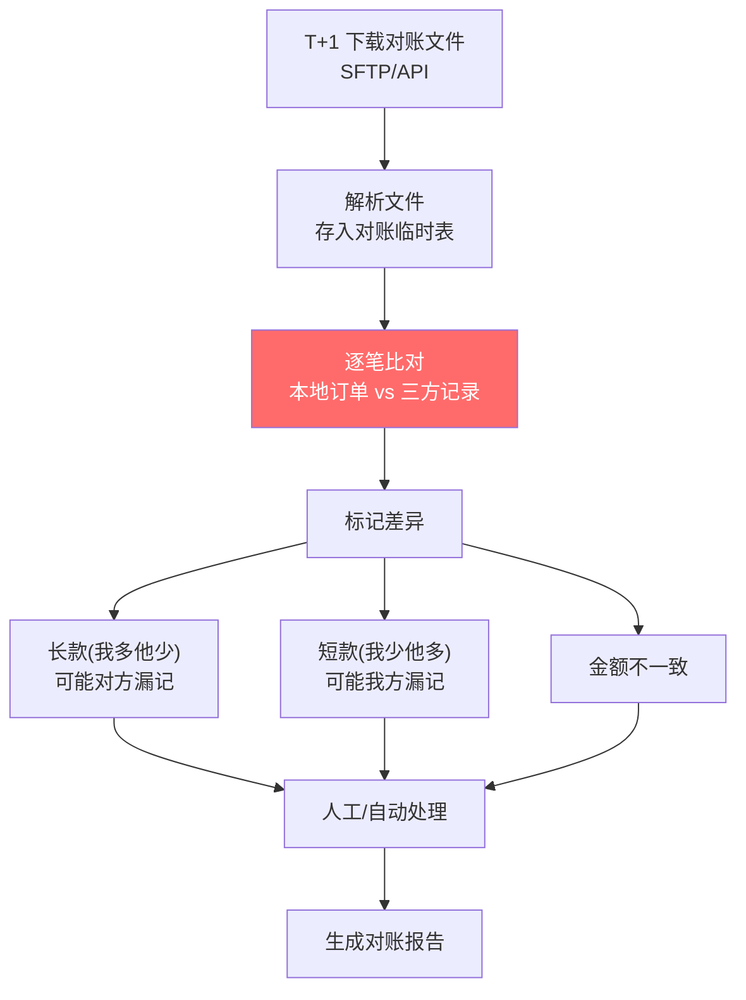

# 场景题与项目经验面试总结 · 深度增强版

> 整理基础：`场景题与项目经验面试总结.md`
> 风格：**大纲 → 细分知识点 → 图解 → 排查命令 → 面试官追问 + 答题模板**
> 适用：中高级 Java 后端 / 项目经验深挖 / 故障排查面试

---

## 视觉规范说明

| 标记 | 含义 | 优先级 |
|------|------|--------|
| 🔴 **必背核心** | 面试必答，排查必会 | ⭐⭐⭐⭐⭐ |
| 🟠 **重点理解** | 高频场景，深度方案 | ⭐⭐⭐⭐ |
| 🟡 **加分项** | 拔高内容 | ⭐⭐⭐ |
| 🟢 **避坑提醒** | 实战陷阱 | ⭐⭐⭐ |
| `==高亮==` | 关键术语 / 命令 | 强化记忆 |

> 💡 **建议**：第一遍只看 🔴，把骨架建起来；第二遍看 🟠；第三遍 🟡🟢 拔高与避坑。

---

## 全文大纲

```
第一部分 · STAR 答题法与项目包装
    1. STAR 模板 + 量化原则
    2. 项目亮点包装三大模板

第二部分 · 线上故障排查 ⭐⭐⭐⭐⭐
    3. CPU 100% 排查全流程
    4. 内存溢出(OOM) 排查
    5. 接口响应慢排查
    6. 死锁排查
    7. 线上问题排查 SOP

第三部分 · 高频场景题 ⭐⭐⭐⭐⭐
    8. 缓存与 DB 数据一致性
    9. 大数据量导出
    10. 消息积压处理
    11. 接口幂等保证
    12. 对账系统设计
    13. 灰度发布方案

第四部分 · 项目包装与技术选型
    14. 性能优化类包装
    15. 稳定性治理类包装
    16. 架构升级类包装
    17. 技术选型应答

第五部分 · 面试官高频追问 Top 30
    STAR-S 答题模板 + 加分弹药库
```

---


# 第一部分 · STAR 答题法与项目包装

## 1. STAR 答题模板

### 1.1 🔴 STAR 四要素



### 1.2 🔴 量化包装示例

```
S: 电商平台商品详情页，大促期间 QPS 从 5000 飙到 5 万，DB 频繁超时
T: 负责优化商品详情的查询性能，目标 RT < 50ms
A:
  1. 引入 Redis 缓存，热门商品预热
  2. 本地缓存(Caffeine) 做二级缓存，减少 Redis 网络开销
  3. 缓存击穿 → 互斥锁 + 逻辑过期方案
  4. 缓存雪崩 → 随机 TTL + 集群部署
  5. 缓存穿透 → 布隆过滤器拦截非法 ID
R:
  - RT 从 200ms → 30ms (↓85%)
  - DB QPS 降低 95%
  - 大促期间零超时，可用性 99.99%
```

### 1.3 🔴 包装五大原则

| 原则 | 说明 | 示例 |
|------|------|------|
| ==量化结果== | 用数字说话 | "QPS 提升 10 倍" 而非 "性能提升了" |
| ==突出难点== | 说清"为什么难" | "百万级并发下如何保证不超卖" |
| ==技术深度== | 提到底层原理 | "基于 Redis Lua 脚本保证原子性" |
| ==对比选型== | 为什么选 A 不选 B | "选 RocketMQ 因为支持事务消息" |
| ==复盘改进== | 踩过什么坑 | "初版用 DEL 命令有超卖，改用 Lua" |

---

## 2. 项目亮点三大模板

### 2.1 🔴 性能优化模板

```
【背景】XX 系统 XX 接口在高峰期 RT 达到 Xs，影响用户体验
【分析】
  - 慢查询: EXPLAIN 发现全表扫描
  - 无缓存: 每次都查 DB
  - 同步调用: 非核心逻辑阻塞主流程
【方案】
  1. SQL 优化: 加联合索引 (a, b, c)，RT 500ms → 50ms
  2. 引入缓存: Redis + Caffeine 二级缓存
  3. 异步化: 非核心逻辑(日志/通知)用 MQ 异步
  4. 批量优化: N+1 查询 → IN 批量查询
【结果】RT Xs → Yms (↓Z%)，QPS 提升 N 倍
```

### 2.2 🔴 稳定性治理模板

```
【背景】服务偶发超时导致上游级联故障(雪崩)
【分析】
  - 下游某服务偶发慢（DB 锁等待）
  - 无熔断: 异常线程堆积
  - 无隔离: 核心与非核心共用线程池
【方案】
  1. 熔断降级: Sentinel 配置规则(RT>500ms 熔断)
  2. 超时治理: RPC 统一超时 3s + 重试 1 次
  3. 线程池隔离: 核心/非核心独立线程池
  4. 预案: 开关降级 + 限流兜底
【结果】故障恢复 30min → 自动 30s，全年可用性 99.99%
```

### 2.3 🟠 架构升级模板

```
【背景】单体应用代码 50 万行，部署 30min，互相影响频繁
【方案】
  1. DDD 划分限界上下文 → 6 个核心域
  2. 按业务域垂直拆分微服务
  3. 通信: Feign 同步 + RocketMQ 异步解耦
  4. 数据: ShardingSphere 分库分表
  5. 灰度: 双写 → 校验 → 切流
【结果】部署频率 周级 → 日级，故障爆炸半径缩小 80%
```

---

# 第二部分 · 线上故障排查

## 3. CPU 100% 排查

### 3.1 🔴 完整排查流程



### 3.2 🔴 命令详解

```bash
# Step 1: 找到 CPU 占用高的 Java 进程
top -c
# 或
ps aux --sort=-%cpu | head

# Step 2: 找到进程内最耗 CPU 的线程
top -Hp 12345        # 12345 是 Java PID
# 找到 TID 如 12378

# Step 3: 线程 ID 转十六进制 (jstack 用 16 进制)
printf "%x\n" 12378  # → 305a

# Step 4: 在 jstack 输出中查找
jstack 12345 | grep "305a" -A 50
# 或导出全部
jstack 12345 > /tmp/thread_dump.txt

# 快捷方式: Arthas (阿里开源，推荐)
arthas> thread -n 3        # 最耗 CPU 的 3 个线程及堆栈
arthas> thread --state RUNNABLE  # 所有 RUNNABLE 线程
```

### 3.3 🔴 常见原因与解决

| 原因 | jstack 特征 | 解决 |
|------|------------|------|
| ==死循环== | 同一线程一直在某方法 RUNNABLE | 修复循环终止条件 |
| ==频繁 Full GC== | GC 线程占满 CPU | 查内存泄漏(下节) |
| ==正则回溯== | `java.util.regex` 调用栈 | 优化正则/加超时 |
| ==加密/序列化== | 计算密集方法 | 缓存结果/异步化 |
| ==高并发锁竞争== | 大量 BLOCKED 线程 | 减小锁粒度/无锁方案 |
| ==HashMap 死循环== (JDK7) | `HashMap.put` / `transfer` | 升级 JDK / 用 ConcurrentHashMap |

### 3.4 🟠 GC 导致 CPU 高的排查

```bash
# 查看 GC 频率
jstat -gc <pid> 1000 10       # 每秒一次，共10次
# 关注: FGC(Full GC 次数) 和 FGCT(Full GC 耗时)

# 如果 Full GC 频繁:
jmap -histo <pid> | head -30  # 对象数量排名
# 或 Arthas:
arthas> dashboard             # 看内存+GC 面板
arthas> heapdump /tmp/heap.hprof  # dump 堆
```

---

## 4. 内存溢出(OOM) 排查

### 4.1 🔴 JVM 参数必配

```bash
# 生产环境必加 OOM 参数
java -Xms4g -Xmx4g \
     -XX:+HeapDumpOnOutOfMemoryError \      # ★ OOM 时自动 dump
     -XX:HeapDumpPath=/data/logs/heap.hprof \ # dump 路径
     -XX:+PrintGCDetails \
     -XX:+PrintGCDateStamps \
     -Xloggc:/data/logs/gc.log \
     -jar app.jar
```

### 4.2 🔴 排查流程



```bash
# 方式1: OOM 时自动 dump (上面已配置)
# 方式2: 在线 dump (不推荐大堆)
jmap -dump:format=b,file=/tmp/heap.hprof <pid>
# 方式3: Arthas
arthas> heapdump /tmp/heap.hprof
```

### 4.3 🔴 常见 OOM 原因

| OOM 类型 | 原因 | 排查 / 解决 |
|---------|------|------------|
| `Java heap space` | 堆内存不够 / ==内存泄漏== | MAT 分析大对象和引用链 |
| `GC overhead limit exceeded` | 频繁 GC 但回收极少 | 同上，通常是泄漏 |
| `Metaspace` | 类太多 / 动态生成类 | 增大 `-XX:MaxMetaspaceSize` |
| `Unable to create new native thread` | 线程太多 | `ulimit -u` / 减少线程数 |
| `Direct buffer memory` | NIO 直接内存溢出 | `-XX:MaxDirectMemorySize` |

### 4.4 🔴 内存泄漏 Top 5 原因

| 原因 | 典型代码 | 修复 |
|------|---------|------|
| ==集合只加不删== | 静态 `Map/List` 无限增长 | 限制大小/用 LRU Cache |
| ==连接未关闭== | DB/HTTP/IO 流忘记关 | try-with-resources |
| ==ThreadLocal 未 remove== | 线程池场景下积累 | `finally { tl.remove(); }` |
| ==监听器未注销== | 注册 Listener 忘记注销 | 显式 removeListener |
| ==内部类持有外部引用== | 匿名内部类持有外部 this | 改为 static 内部类 |

### 4.5 🟠 Arthas 内存分析

```bash
# 实时内存状态
arthas> dashboard

# 对象数量统计 (类似 jmap -histo)
arthas> memory

# 查看某个类有多少实例
arthas> sc -d com.example.BigObject

# OGNL 表达式查看对象内容
arthas> ognl '@com.example.Cache@INSTANCE.map.size()'
```

---

## 5. 接口响应慢排查

### 5.1 🔴 分层排查法



### 5.2 🔴 各层排查命令

```bash
# ===== 应用层 =====
# Arthas trace: 方法内部耗时分解
arthas> trace com.example.OrderService createOrder '#cost > 100'
# 输出每个子方法的耗时，一目了然

# Arthas watch: 观察方法参数和返回值
arthas> watch com.example.UserDao queryUser returnObj '#cost > 50'

# ===== DB 层 =====
# 开启慢查询日志
SET GLOBAL slow_query_log = ON;
SET GLOBAL long_query_time = 1;  -- 超过1秒记录

# 分析慢查询
EXPLAIN SELECT * FROM orders WHERE user_id = 123 AND status = 1;
# 看 type(至少 ref)、key(是否用了索引)、rows(扫描行数)

# ===== Redis 层 =====
# 查看慢日志
redis-cli> SLOWLOG GET 10
# 检查大 Key
redis-cli> DEBUG OBJECT mykey
redis-cli --bigkeys  # 扫描大Key

# ===== 网络层 =====
# 时间分析
curl -o /dev/null -w "DNS:%{time_namelookup} TCP:%{time_connect} TLS:%{time_appconnect} Total:%{time_total}\n" https://api.example.com/health
```

### 5.3 🟠 常见慢接口原因

| 原因 | 特征 | 解决 |
|------|------|------|
| ==慢 SQL== | DB 层耗时高 | 加索引/优化SQL/读写分离 |
| ==N+1 查询== | 循环调 DB/RPC | 批量查询/JOIN |
| ==缓存未命中== | 缓存命中率低 | 预热/增大缓存/延长TTL |
| ==大 Key== | Redis 操作耗时高 | 拆分大Key/异步删除 |
| ==同步调用链长== | 串行调多个服务 | 并行调用/CompletableFuture |
| ==Full GC== | STW 导致所有请求卡 | 优化内存/换GC算法 |
| ==锁竞争== | 线程BLOCKED多 | 减小锁粒度/读写锁/无锁 |

---

## 6. 死锁排查

### 6.1 🔴 Java 死锁排查

```bash
# jstack 直接检测死锁
jstack <pid> | grep -i "deadlock" -A 50

# Arthas (推荐)
arthas> thread -b    # 直接打印阻塞线程和死锁信息

# jstack 输出示例:
# Found one Java-level deadlock:
# "Thread-1":
#   waiting to lock monitor 0x000000001234 (object 0x000000076ab)
#   which is held by "Thread-2"
# "Thread-2":
#   waiting to lock monitor 0x000000005678 (object 0x000000076cd)
#   which is held by "Thread-1"
```

### 6.2 🔴 MySQL 死锁排查

```sql
-- 查看最近一次死锁
SHOW ENGINE INNODB STATUS\G
-- 看 LATEST DETECTED DEADLOCK 部分

-- 查看当前锁等待
SELECT * FROM information_schema.INNODB_LOCK_WAITS;
SELECT * FROM information_schema.INNODB_TRX;  -- 当前活跃事务

-- 查看锁详情
SELECT * FROM performance_schema.data_locks;        -- MySQL 8.0+
SELECT * FROM performance_schema.data_lock_waits;
```

### 6.3 🔴 死锁预防

| 策略 | 做法 |
|------|------|
| ==固定加锁顺序== | 所有事务按相同顺序获取锁(如按 ID 升序) |
| ==减小事务粒度== | 事务越小越好，持锁时间短 |
| ==加超时== | `innodb_lock_wait_timeout`（默认50s） |
| ==乐观锁替代== | 适合冲突少的场景 |
| ==间隙锁注意== | RC 隔离级别减少间隙锁 |

---

## 7. 线上问题排查 SOP

### 7.1 🔴 六步 SOP


### 7.2 🔴 止血手段优先级

| 优先级 | 手段 | 适用 |
|--------|------|------|
| ⭐⭐⭐⭐⭐ | ==回滚== | 明确是新版本导致 |
| ⭐⭐⭐⭐ | ==限流== | 流量突增 |
| ⭐⭐⭐⭐ | ==降级== | 非核心服务异常 |
| ⭐⭐⭐ | ==切流量== | 某个机房/节点异常 |
| ⭐⭐⭐ | ==重启== | 内存泄漏/临时恢复 |

### 7.3 🟠 复盘模板

```markdown
## 故障复盘报告

### 1. 基本信息
- 故障等级: P1/P2/P3
- 影响时长: 从 HH:MM 到 HH:MM，共 X 分钟
- 影响范围: X 万用户 / X% 请求失败

### 2. 时间线
- HH:MM 监控告警
- HH:MM 开始排查
- HH:MM 定位原因
- HH:MM 执行修复
- HH:MM 恢复正常

### 3. 根因分析
[技术描述]

### 4. 改进措施
| 改进项 | 负责人 | 完成时间 |
|--------|--------|---------|
| 补充监控 | xxx | x月x日 |
| 增加预案 | xxx | x月x日 |
| 优化代码 | xxx | x月x日 |
```

---


# 第三部分 · 高频场景题

## 8. 缓存与 DB 数据一致性

### 8.1 🔴 Cache Aside Pattern（旁路缓存）



> 🔴 **核心**：==先更新 DB → 再删除缓存==（不是更新缓存！）
>
> **为什么删而不是更新？**
> - 更新缓存在并发下容易导致==脏数据==（A 和 B 同时写，A先写DB后写缓存，B后写DB先写缓存 → 缓存是A的旧值）
> - 删除是幂等的，下次读会重建

### 8.2 🔴 删缓存失败怎么办

| 方案 | 实现 | 可靠性 |
|------|------|--------|
| ==延迟双删== | 更新DB→删缓存→sleep 500ms→再删一次 | ⭐⭐⭐ |
| ==Canal 订阅 Binlog== | 监听DB变更→异步删缓存 | ⭐⭐⭐⭐⭐ |
| ==MQ 重试== | 删失败→发MQ→消费者重试删除 | ⭐⭐⭐⭐ |

```java
// 延迟双删
public void updateProduct(Product product) {
    productDao.update(product);           // 更新 DB
    redis.delete("product:" + product.getId());  // 第一次删缓存

    // 延迟再删一次 (处理并发读把旧值写回缓存的情况)
    CompletableFuture.runAsync(() -> {
        Thread.sleep(500);  // 等读请求完成
        redis.delete("product:" + product.getId());
    });
}
```

### 8.3 🟠 Canal + MQ 方案（最可靠）



### 8.4 🟢 缓存三大问题

| 问题 | 描述 | 解决方案 |
|------|------|---------|
| **穿透** | 查不存在的数据，绕过缓存打DB | ==布隆过滤器== / 缓存空值(TTL短) |
| **击穿** | 热点Key过期，大量请求打DB | ==互斥锁== / ==逻辑过期== / 永不过期 |
| **雪崩** | 大量Key同时过期 / Redis宕机 | ==随机TTL== / 集群 / 本地缓存兜底 |

---

## 9. 大数据量导出

### 9.1 🔴 问题与方案

> 🔴 **问题**：导出 100 万条数据 → 内存溢出 / 请求超时



### 9.2 🔴 流式查询 + EasyExcel

```java
// MyBatis 流式查询 (Cursor)
@Select("SELECT * FROM orders WHERE create_time > #{start}")
@Options(resultSetType = ResultSetType.FORWARD_ONLY, fetchSize = 1000)
Cursor<Order> streamQuery(@Param("start") LocalDateTime start);

// EasyExcel 流式写入
public void export(HttpServletResponse response) {
    response.setContentType("application/vnd.ms-excel");
    response.setHeader("Content-Disposition", "attachment;filename=orders.xlsx");

    try (ExcelWriter writer = EasyExcel.write(response.getOutputStream(), OrderVO.class).build()) {
        WriteSheet sheet = EasyExcel.writerSheet("订单").build();

        // 分批查询写入
        long lastId = 0;
        while (true) {
            List<Order> batch = orderDao.queryByPage(lastId, 5000);
            if (batch.isEmpty()) break;

            List<OrderVO> vos = convert(batch);
            writer.write(vos, sheet);   // ★ 流式写入，不积压内存

            lastId = batch.get(batch.size() - 1).getId();
            vos = null;  // 帮助 GC
        }
    }
}
```

### 9.3 🟠 异步导出方案


---

## 10. 消息积压处理

### 10.1 🔴 紧急处理方案



### 10.2 🔴 应急步骤

```
1. 【紧急扩容】增加 Consumer 实例 (不超过 Partition 数)
2. 【临时方案】无法扩容时:
   - 新建一个 Topic (分区数更多)
   - 原 Consumer 改为只做消息搬运 (不做业务处理)
   - 新 Consumer 组消费新 Topic 做业务处理
3. 【业务降级】跳过非核心消息，只处理重要消息
4. 【根因定位】
   - 消费慢原因: DB慢? 外部调用慢? 锁竞争?
   - 批量消费: 一次拉多条处理
   - 增加 Partition 数 (需要重建 Topic)
```

### 10.3 🟠 预防手段

> 🟠 **预防**：
> - ==监控==：消费延迟告警（lag > 阈值）
> - ==Consumer 与 Partition 1:1 配比==
> - ==批量消费==：一次拉 500 条批量处理
> - ==异步消费==：Consumer 内部使用线程池加速

---

## 11. 接口幂等保证

### 11.1 🔴 场景与方案矩阵

| 场景 | 方案 | 实现要点 |
|------|------|---------|
| ==用户重复点击== | Token 机制 | 前端获取Token→提交时携带→服务端原子校验删除 |
| ==网络重试== | 唯一请求ID | Redis SETNX(requestId, 1, TTL) |
| ==MQ 重复投递== | 消息ID去重 | Redis SETNX(msgId) / DB 唯一索引 |
| ==支付回调== | 状态机 | 已支付状态不再处理 |
| ==数据更新== | 乐观锁 | `UPDATE ... SET v=v+1 WHERE v=?` |

### 11.2 🔴 通用幂等框架

```java
// 幂等注解
@Target(ElementType.METHOD)
@Retention(RetentionPolicy.RUNTIME)
public @interface Idempotent {
    String key() default "";       // SpEL 表达式
    long expireMs() default 600000; // 10分钟
    String message() default "请勿重复提交";
}

// AOP 拦截
@Aspect
@Component
public class IdempotentAspect {
    @Around("@annotation(idempotent)")
    public Object around(ProceedingJoinPoint pjp, Idempotent idempotent) throws Throwable {
        String key = parseKey(idempotent.key(), pjp);  // SpEL 解析

        // Redis SETNX 原子操作
        Boolean success = redis.opsForValue()
            .setIfAbsent("idempotent:" + key, "1",
                Duration.ofMillis(idempotent.expireMs()));

        if (Boolean.FALSE.equals(success)) {
            throw new BizException(idempotent.message());
        }

        try {
            return pjp.proceed();
        } catch (Exception e) {
            // 业务异常时删除幂等标记，允许重试
            redis.delete("idempotent:" + key);
            throw e;
        }
    }
}

// 使用
@Idempotent(key = "#dto.orderId", message = "订单正在处理中")
public Result createOrder(OrderDTO dto) { ... }
```

---

## 12. 对账系统设计

### 12.1 🟠 对账流程



### 12.2 🟠 技术要点

| 要点 | 做法 |
|------|------|
| **大数据量** | 分批加载 + 多线程比对 |
| **幂等** | 对账任务有唯一标识，防止重复执行 |
| **容错** | 文件下载失败重试 + 告警 |
| **性能** | 本地数据按商户订单号建索引，O(1) 查找 |
| **准确性** | 金额用 BigDecimal，避免浮点误差 |

---

## 13. 灰度发布

### 13.1 🟠 灰度策略

| 策略 | 实现 | 适用 |
|------|------|------|
| ==用户 ID 尾号== | `userId % 100 < 5` → 新版本 | 简单、均匀 |
| ==地域== | 某城市先上线 | 区域隔离 |
| ==请求头标记== | Header 带灰度标 | 精确控制 |
| ==权重== | Nginx upstream weight | 按比例分流 |
| ==白名单== | 内部用户/测试账号 | 内部验证 |

### 13.2 🟠 全链路灰度


> 🟠 **关键**：灰度标记需要==全链路透传==（HTTP Header → RPC Context → MQ Properties），确保一次请求的所有上下游都走同一版本。

---

# 第四部分 · 技术选型应答

## 14. 技术选型追问

### 14.1 🔴 常见追问与答法

| 追问 | 答题要点 |
|------|---------|
| 为什么用 Redis 不用 Memcached | 数据结构丰富(5种)/持久化(RDB+AOF)/集群/Lua脚本/发布订阅 |
| 为什么用 RocketMQ 不用 Kafka | ==事务消息==/延迟消息/死信队列/金融级可靠/消费失败重试 |
| 为什么用 Kafka 不用 RocketMQ | ==超高吞吐==(百万级)/大数据生态好/日志场景 |
| 为什么用 G1 不用 CMS | ==可控停顿时间==(-XX:MaxGCPauseMillis)/无碎片/大堆友好 |
| 为什么用 ShardingSphere | 社区活跃/支持多种分片策略/侵入低/生态好 |
| 为什么用 Nacos 不用 Eureka | ==配置中心+注册中心==合一/支持CP和AP切换/阿里生态 |

### 14.2 🟠 选型通用回答框架

```
1. 功能满足: A 和 B 都能满足需求
2. 关键差异: 但我们场景需要 XX 特性，A 支持而 B 不支持
3. 性能对比: 压测下 A 的性能是 B 的 X 倍
4. 团队因素: 团队对 A 更熟悉，学习成本低
5. 运维成本: A 的部署和监控更成熟
```

---

## 15. 深度追问应答

### 15.1 🔴 "遇到了什么坑"

```
准备 2-3 个真实踩坑故事：

坑1: 缓存击穿
  → 大促时热点商品缓存过期，瞬间 10 万 QPS 打到 DB
  → 解决: 互斥锁 + 逻辑过期双重保护

坑2: 线上 OOM
  → 本地缓存 Map 只加不删，3天后 OOM
  → 解决: 改用 Caffeine(LRU+TTL)，加监控告警

坑3: 死锁
  → 两个事务互相等对方持有的行锁
  → 解决: 统一按 ID 升序加锁
```

### 15.2 🔴 "流量再大 10 倍怎么办"

```
1. 水平扩展: 无状态服务 → 加机器
2. 缓存: 多级缓存(CDN → 本地 → Redis)
3. 异步: 同步改异步(MQ 削峰)
4. 降级: 非核心功能关闭
5. 分库分表: 数据层水平拆分
6. CDN: 静态资源就近返回
7. 预计算: 提前聚合，避免实时计算
```

### 15.3 🟠 "如果重新做会怎么改"

```
体现反思能力:
1. 早期应该做压测，不是上线才发现问题
2. 应该一开始就设计好监控埋点
3. 应该用更好的日志规范(TraceId 链路追踪)
4. 数据库应该一开始就考虑分库分表的扩展性
5. 接口应该一开始就做好版本管理(v1/v2)
```

---

# 第五部分 · 面试官高频追问 Top 30

## 🔴 STAR-S 答题模板

```
S - Situation: 背景（一句话）
T - Task: 任务/问题
A - Action: 你的方案（技术细节）
R - Result: 结果（量化数据）
S - Summary: 总结/延伸
```

## 面试追问清单

| # | 追问 | 答题关键词 |
|---|------|-----------|
| 1 | CPU 100% 怎么排查 | top→top -Hp→printf %x→jstack / Arthas thread -n 3 |
| 2 | OOM 怎么排查 | HeapDump→MAT→Dominator Tree→GC Roots |
| 3 | 接口慢怎么排查 | 链路追踪→分层定位(应用/DB/缓存/网络) |
| 4 | 死锁怎么排查 | jstack grep deadlock / Arthas thread -b / INNODB STATUS |
| 5 | 缓存和 DB 一致性 | Cache Aside + 延迟双删 / Canal + MQ |
| 6 | 大数据量导出 | 流式查询 + EasyExcel(SAX) + 异步 |
| 7 | 消息积压怎么处理 | 扩容Consumer / 临时Topic搬运 / 降级 |
| 8 | 如何保证幂等 | Token / 唯一索引 / 状态机 / 乐观锁 / SETNX |
| 9 | 介绍一个项目 | STAR法 + 量化结果 |
| 10 | 项目中最大的挑战 | 技术难题 + 解决过程 + 收获 |
| 11 | 为什么用 Redis | 数据结构丰富/高性能/持久化/集群/Lua |
| 12 | 为什么用 RocketMQ | 事务消息/延迟/重试/可靠性 |
| 13 | 线上遇到什么坑 | 准备2-3个真实case(缓存击穿/OOM/死锁) |
| 14 | 流量大10倍怎么办 | 水平扩展/缓存/异步/降级/CDN |
| 15 | 重新做会怎么改 | 压测/监控/日志/分库/版本管理 |
| 16 | 怎么推动技术方案 | 写方案→评审→排期→里程碑→复盘 |
| 17 | 和产品有分歧怎么办 | 数据说话/用户价值/技术风险评估 |
| 18 | Full GC 频繁怎么排查 | jstat看GC频率→jmap/MAT找大对象→泄漏 |
| 19 | 慢SQL怎么优化 | EXPLAIN→加索引→避免全表→分库分表 |
| 20 | 缓存穿透怎么办 | 布隆过滤器 / 缓存空值+短TTL |
| 21 | 缓存击穿怎么办 | 互斥锁(SETNX) / 逻辑过期 / 永不过期 |
| 22 | 缓存雪崩怎么办 | 随机TTL / Redis集群 / 本地缓存兜底 |
| 23 | 灰度发布怎么做 | 用户ID分流/Header标记/网关路由/全链路透传 |
| 24 | 分布式锁的坑 | 锁过期/误删他人锁/Redis主从切换丢锁 |
| 25 | 做过性能优化吗 | SQL优化/缓存/异步/批量/连接池 |
| 26 | 怎么做监控告警 | Prometheus+Grafana / 业务指标 / 黄金指标 |
| 27 | 服务雪崩怎么预防 | 熔断(Sentinel)/超时/隔离/限流/降级 |
| 28 | 怎么学习新技术 | 官方文档→Demo→源码→实践→分享 |
| 29 | 你在团队中的角色 | 技术方案设计/核心模块/Code Review/带新人 |
| 30 | 最有成就感的事 | 体现技术影响力(性能提升/故障治理/系统重构) |

---

## 🟡 加分弹药库

> **深度延伸方向**（面试官可能追问）：
> 1. **Arthas 的原理**（Java Agent + ASM 字节码增强 + JMX）
> 2. **线上不停机排查用什么**（Arthas/BTrace/JFR 飞行记录器）
> 3. **如何做故障演练**（Chaos Engineering / ChaosBlade / 随机杀Pod）
> 4. **可观测性三支柱**（Metrics 指标 + Logging 日志 + Tracing 链路）
> 5. **黄金指标 RED/USE**（Rate/Errors/Duration / Utilization/Saturation/Errors）
> 6. **如何设计 SLO/SLI**（错误率 < 0.1% / P99 < 200ms / 可用性 99.95%）

---

*整理完成，祝面试顺利！*
