# Java 并发编程面试总结 · 深度增强版

> 整理基础:`并发编程面试总结.md`
> 风格:**大纲 → 细分知识点 → 图解 → 关键源码 → 面试官追问 + 答题模板**
> 适用:中高级 Java 后端 / 并发八股 / JVM 面试

---

## 视觉规范说明

| 标记 | 含义 | 优先级 |
|------|------|--------|
| 🔴 **必背核心** | 面试必答,底层原理 | ⭐⭐⭐⭐⭐ |
| 🟠 **重点理解** | 高频考点,源码级路径 | ⭐⭐⭐⭐ |
| 🟡 **加分项** | 拔高内容 | ⭐⭐⭐ |
| 🟢 **避坑提醒** | 实战陷阱 | ⭐⭐⭐ |
| `==高亮==` | 关键术语 / 数值 | 强化记忆 |

> 💡 **建议**:第一遍只看 🔴,把骨架建起来;第二遍看 🟠;第三遍 🟡🟢 拔高与避坑。

---

## 全文大纲

```
第一部分 · 并发基础(必懂理论)
    1. 进程/线程/协程,并发 vs 并行
    2. 线程生命周期与状态转换
    3. 创建线程的 4 种方式
    4. wait/notify/sleep/yield 区分

第二部分 · JMM 与可见性 ⭐⭐⭐⭐⭐
    5. JMM 模型与三大特性
    6. volatile 原理(可见性/有序性)
    7. happens-before 8 大规则
    8. 内存屏障与重排序

第三部分 · 锁机制 ⭐⭐⭐⭐⭐
    9. synchronized 实现原理与锁升级
    10. CAS 与 Atomic 原子类
    11. AQS 框架与 ReentrantLock
    12. ReentrantReadWriteLock / StampedLock

第四部分 · 高级并发工具
    13. JUC 三剑客(Semaphore / CountDownLatch / CyclicBarrier)
    14. ThreadLocal 与 InheritableThreadLocal
    15. Future / CompletableFuture 异步编程
    16. 并发容器(ConcurrentHashMap / CopyOnWrite)

第五部分 · 线程池与高性能
    17. ThreadPoolExecutor 7 参数与执行流程
    18. ForkJoinPool 与工作窃取
    19. Disruptor 无锁队列

第六部分 · 面试官高频追问 Top 30
    STAR-S 答题模板 + 加分弹药库
```

---

# 第一部分 · 并发基础

## 1. 进程 / 线程 / 协程

### 1.1 🔴 三者对比

| 维度 | 进程 | 线程 | 协程 |
|------|------|------|------|
| 资源 | 独立内存空间 | 共享进程内存 | 共享线程栈 |
| 调度 | 操作系统 | 操作系统 | ==用户态自调度== |
| 切换开销 | 大(MMU 切换) | 中(寄存器切换) | ⭐ 极小(函数调用级) |
| 并发数 | 几百~几千 | 千~万 | ⭐ ==百万级== |
| Java 实现 | OS 进程 | OS 线程 1:1 映射 | Loom Virtual Thread (JDK 21+) |

### 1.2 🟠 并发 vs 并行

> 🟠 **关键区别**:
> - **并发(Concurrency)**:同一时间段内多任务交替执行(单核也能并发)
> - **并行(Parallelism)**:同一时刻多任务真的同时执行(必须多核)

```
单核 CPU 并发:    A→B→A→B→A→B (时间片切换)
多核 CPU 并行:    A┐
                   │ 同时
                  B┘
```

### 1.3 🔴 为什么要用多线程

> 🔴 **三大动因**:
> 1. ==充分利用多核==,提升 CPU 利用率(科学计算、图像处理)
> 2. ==减少响应时间==,异步化 IO 等待(下载、HTTP 请求)
> 3. ==解耦业务模块==,如下单后异步发短信、写日志

### 1.4 🟢 多线程一定快吗?

> 🟢 **不一定**!以下场景反而变慢:
> - **任务过小**:线程切换开销 > 计算时间
> - **CPU 密集型且线程数远大于核数**:大量切换浪费 CPU
> - **频繁竞争锁**:线程互相阻塞
>
> **经验值**:
> - CPU 密集型:线程数 = ==CPU 核数 + 1==
> - IO 密集型:线程数 = ==CPU 核数 × 2 ~ 核数 / (1 - 阻塞系数)==

---

## 2. 线程生命周期

### 2.1 🔴 6 大状态(Java 视角)

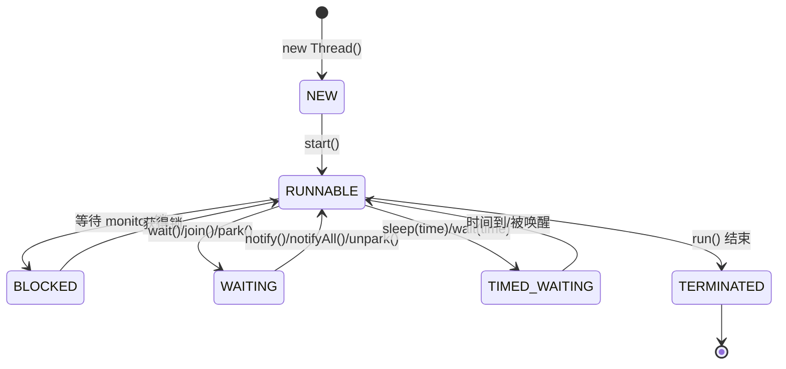

> 🔴 **核心 6 状态**(`Thread.State` 枚举):
> - `NEW` 新建
> - `RUNNABLE` ==包含 OS 的 ready 和 running 两个子状态==
> - `BLOCKED` 等待 synchronized 锁
> - `WAITING` 无限等待(wait/join 无超时)
> - `TIMED_WAITING` 超时等待
> - `TERMINATED` 结束

### 2.2 🟠 BLOCKED vs WAITING 区别

> 🟠 **关键区别**:
> - **BLOCKED**:**被动**等待 ==synchronized== 锁(JVM 决定唤醒)
> - **WAITING**:**主动**等待信号(`wait()` / `LockSupport.park()`,需要 notify/unpark 唤醒)

```java
// BLOCKED 案例
synchronized(lock) { ... }  // 拿不到锁就 BLOCKED

// WAITING 案例
synchronized(lock) {
    lock.wait();           // 主动 WAITING
}
LockSupport.park();        // WAITING
```

---

## 3. 创建线程的 4 种方式

### 3.1 🔴 速记表

| 方式 | 写法 | 返回值 | 推荐度 |
|------|------|--------|--------|
| 继承 Thread | `class T extends Thread` | 无 | ⭐ |
| 实现 Runnable | `new Thread(() -> {})` | 无 | ⭐⭐⭐ |
| 实现 Callable + FutureTask | `new FutureTask<>(callable)` | ⭐ 有返回值 | ⭐⭐⭐⭐ |
| **线程池** ⭐ | `executor.submit(task)` | Future | ⭐⭐⭐⭐⭐ |

> 🟢 **避坑**:**生产环境不要直接 `new Thread()`**,无法管理生命周期,极易 OOM。强制使用线程池。

### 3.2 🔴 Runnable vs Callable

```java
// Runnable - 无返回值,不能抛检查异常
@FunctionalInterface
public interface Runnable {
    void run();
}

// Callable - 有返回值,可以抛检查异常
@FunctionalInterface
public interface Callable<V> {
    V call() throws Exception;
}
```

> 🟠 **使用 Callable 的标准姿势**:
> ```java
> ExecutorService pool = Executors.newFixedThreadPool(4);
> Future<String> future = pool.submit(() -> {
>     Thread.sleep(1000);
>     return "result";
> });
> String result = future.get(3, TimeUnit.SECONDS);  // 阻塞等待
> ```

---

## 4. wait / notify / sleep / yield 大对比

### 4.1 🔴 必背对照表

| 方法 | 所属类 | 释放锁 | 唤醒方式 | 用途 |
|------|--------|--------|---------|------|
| `wait()` | **Object** | ✅ ==释放== | notify/notifyAll | 在同步块内等待条件 |
| `notify()` | Object | ❌ 不释放(出同步块才释) | - | 唤醒**一个**等待线程 |
| `notifyAll()` | Object | ❌ 不释放 | - | 唤醒**所有**等待线程 |
| `sleep(ms)` | **Thread** | ❌ ==不释放== | 时间到 | 让出 CPU 但持有锁 |
| `yield()` | Thread | ❌ 不释放 | OS 调度 | 提示让出 CPU(不保证) |
| `join()` | Thread | ❌ 不释放 | 目标线程结束 | 等另一个线程结束 |
| `LockSupport.park()` | LockSupport | ❌ | unpark() | 更灵活的等待/唤醒 |

> 🔴 **背诵口诀**:`wait 释锁、sleep 不释、wait 在 Object、sleep 在 Thread`

### 4.2 🟠 wait/notify 必须在同步块内

```java
synchronized (lock) {
    while (!condition) {       // ★ 一定要 while 不要 if(虚假唤醒)
        lock.wait();
    }
    // 业务
}

synchronized (lock) {
    lock.notifyAll();
}
```

> 🟢 **避坑 1**:wait 必须用 `while` 包裹,防 ==虚假唤醒(spurious wakeup)==
>
> 🟢 **避坑 2**:`wait/notify` 必须在 `synchronized` 同步块内,否则抛 `IllegalMonitorStateException`

### 4.3 🟡 经典生产者消费者

```java
public class BlockingBuffer<T> {
    private final Queue<T> queue = new LinkedList<>();
    private final int capacity;

    public BlockingBuffer(int capacity) { this.capacity = capacity; }

    public synchronized void put(T item) throws InterruptedException {
        while (queue.size() == capacity) {
            wait();                    // 满了等待
        }
        queue.offer(item);
        notifyAll();                   // 唤醒消费者
    }

    public synchronized T take() throws InterruptedException {
        while (queue.isEmpty()) {
            wait();                    // 空了等待
        }
        T item = queue.poll();
        notifyAll();                   // 唤醒生产者
        return item;
    }
}
```

---

# 第二部分 · JMM 与可见性

## 5. JMM 模型

### 5.1 🔴 一图看懂 JMM

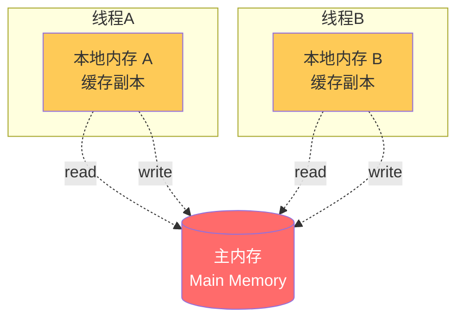

> 🔴 **核心**:
> - **主内存**:所有变量(实例字段、静态字段、数组元素)的存储位置
> - **本地内存**:线程的缓存(对应 ==CPU 缓存 / 寄存器==)
> - JMM 定义了线程与主内存间的 ==8 大原子操作==(read/load/use/assign/store/write/lock/unlock)

### 5.2 🔴 三大特性 + 解决方案

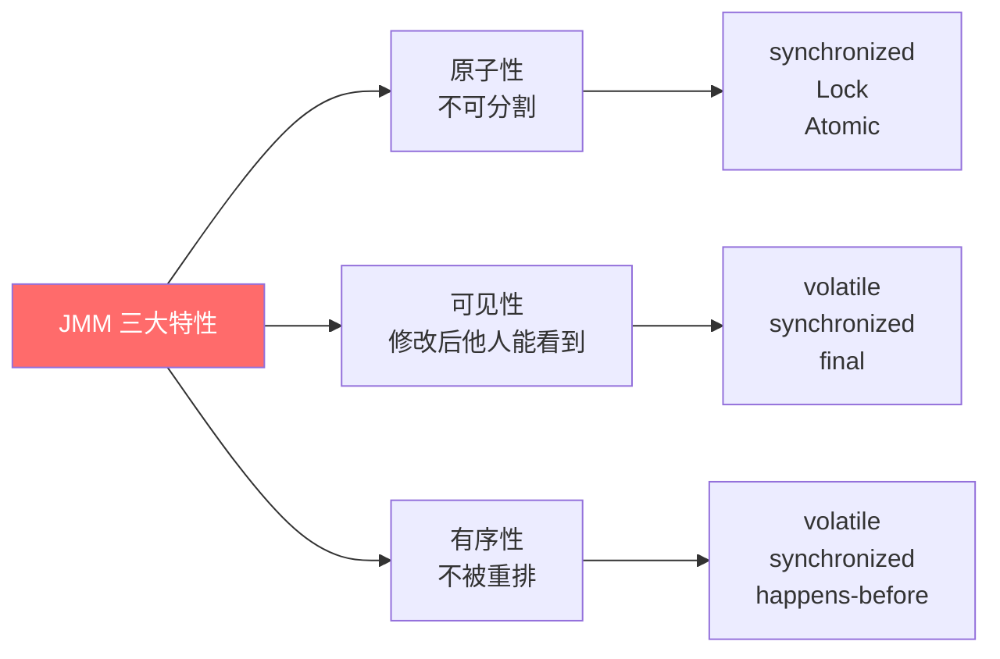

| 特性 | 定义 | 破坏例子 | 解决 |
|------|------|---------|------|
| **原子性** | 操作不可分割 | `i++` (read+modify+write) | `synchronized` / `Atomic` / `Lock` |
| **可见性** | 一个线程修改对其他立即可见 | `boolean flag = true` 主线程修改其他线程读不到 | `volatile` / `synchronized` |
| **有序性** | 程序按代码顺序执行 | 编译器 / CPU 重排序 | `volatile` / `happens-before` |

### 5.3 🟢 线程不安全实例

```java
// ❌ i++ 不是原子操作
private int count = 0;
public void inc() { count++; }  // 多线程调用结果错误

// ✅ 修复 1:synchronized
public synchronized void inc() { count++; }

// ✅ 修复 2:AtomicInteger
private AtomicInteger count = new AtomicInteger();
public void inc() { count.incrementAndGet(); }
```

---

## 6. volatile 原理

### 6.1 🔴 volatile 两大作用

> 🔴 **必背**:
> 1. ✅ ==保证可见性==(写后立即刷主内存,读时从主内存重新加载)
> 2. ✅ ==禁止指令重排序==(在 volatile 读写前后插入内存屏障)
> 3. ❌ ==不保证原子性==!(`volatile int i; i++` 仍线程不安全)

### 6.2 🔴 volatile 底层实现

```mermaid
flowchart TD
    A[volatile 写] --> B[StoreStore 屏障]
    B --> C[volatile 写指令]
    C --> D[StoreLoad 屏障]
    D --> E[lock; addl 0,(rsp)<br/>★ 强制刷缓存 + 失效其他 CPU 缓存]

    style E fill:#ff6b6b,color:#fff
```

> 🟠 **重点**:JVM 通过 ==`lock` 前缀汇编指令== 实现 volatile,作用:
> 1. 锁住内存总线(早期 CPU)/ 缓存行(现代 CPU,**MESI 协议**)
> 2. 强制把当前处理器的写缓冲刷到主内存
> 3. 让其他处理器的缓存失效(下次读会重新从主内存加载)

### 6.3 🔴 4 种内存屏障

| 屏障 | 作用 |
|------|------|
| `LoadLoad` | 屏障前的读 完成前,屏障后的读不能开始 |
| `StoreStore` | 屏障前的写 完成前,屏障后的写不能开始 |
| `LoadStore` | 屏障前的读 完成前,屏障后的写不能开始 |
| `StoreLoad` ⭐ 重 | 屏障前的写完成 + 失效其他 CPU 缓存 后,屏障后的读才能开始 |

### 6.4 🔴 双重检查锁定(DCL)单例

> 🔴 **必背 + 必懂为什么要 volatile**

```java
public class Singleton {
    // ★ 必须 volatile
    private static volatile Singleton instance;

    public static Singleton getInstance() {
        if (instance == null) {                    // 第一次检查(无锁)
            synchronized (Singleton.class) {
                if (instance == null) {            // 第二次检查(有锁)
                    instance = new Singleton();    // ⚠️ 这一步分 3 个机器指令
                }
            }
        }
        return instance;
    }
}
```

> 🟠 **为什么要 volatile?**
> `instance = new Singleton()` 实际是 3 步:
> ```
> 1. 分配内存
> 2. 调用构造函数初始化
> 3. 把内存地址赋给 instance
> ```
> 没有 volatile,JVM 可能 ==重排为 1→3→2==,其他线程看到 `instance != null` 但还没初始化,拿到半成品对象!

### 6.5 🟢 volatile 适用场景

> 🟢 **何时用 volatile?**
> 1. ==状态标志位==(boolean 开关)
> 2. ==单次发布==(DCL 单例)
> 3. ==独立观察==(读多写少的简单数据)
>
> ❌ **不适用**:`volatile int i; i++` 这种**复合操作**,要用 Atomic。

---

## 7. happens-before 原则

### 7.1 🔴 8 大规则(必背)

> 🔴 **核心**:happens-before 不是说"前面的操作先于后面发生",而是 =="前面操作的结果对后面操作可见且不被重排"==。

| # | 规则名 | 含义 |
|---|--------|------|
| 1 | **程序顺序规则** | 同一线程内,写在前面的代码 hb 后面的 |
| 2 | **监视器锁规则** | unlock hb 后续对同一锁的 lock |
| 3 | **volatile 规则** | volatile 写 hb 后续对该变量的读 |
| 4 | **传递性** | A hb B,B hb C → A hb C |
| 5 | **start 规则** | `Thread.start()` hb 该线程内的所有操作 |
| 6 | **join 规则** | 线程内的所有操作 hb 其他线程从 `join()` 返回 |
| 7 | **interrupt 规则** | `interrupt()` hb 被中断线程检测到中断 |
| 8 | **finalize 规则** | 对象构造完成 hb finalize() |

### 7.2 🟠 经典应用例子

```java
// volatile + 程序顺序 + 传递性 = 完整可见性
class Box {
    int x;
    volatile boolean ready;        // ★ volatile

    void writer() {
        x = 42;                    // 操作 1
        ready = true;              // 操作 2 (volatile 写)
    }
    void reader() {
        if (ready) {               // 操作 3 (volatile 读)
            assert x == 42;        // ✅ 必然成立
        }
    }
}
// 程序顺序:1 hb 2,3 hb assert
// volatile:2 hb 3
// 传递性:1 hb assert ✅
```

---

## 8. 内存屏障与重排序

### 8.1 🟠 三种重排序

```mermaid
flowchart LR
    A[源代码] --> B[1.编译器重排]
    B --> C[2.指令级并行重排<br/>(CPU 重排)]
    C --> D[3.内存系统重排<br/>(写缓冲 + 失效队列)]
    D --> E[最终执行结果]

    style B fill:#feca57
    style C fill:#feca57
    style D fill:#feca57
```

> 🟠 **三层重排**:都是为了优化性能,但可能让多线程程序产生意外结果。Java 通过 ==as-if-serial== 保证单线程不重排,但**多线程下需要 happens-before 保护**。

### 8.2 🟡 实战:经典重排序问题

```java
class ReorderExample {
    int a = 0;
    boolean flag = false;     // 没用 volatile

    void writer() {
        a = 1;          // 1
        flag = true;    // 2
    }
    void reader() {
        if (flag) {     // 3
            int i = a;  // 4: 可能读到 a=0 ❌
        }
    }
}
```

> 🟢 **避坑**:看似 1→2→3→4,但 1 和 2 没有依赖关系,可能被重排为 2→1。reader 看到 `flag=true` 但 `a` 还是 0。

---

# 第三部分 · 锁机制

## 9. synchronized 实现原理

### 9.1 🔴 三种使用方式

| 用法 | 锁对象 | 例子 |
|------|--------|------|
| 修饰**实例方法** | ==this 当前实例== | `synchronized void m()` |
| 修饰**静态方法** | ==Class 对象== | `static synchronized void m()` |
| 修饰**代码块** | 指定对象 | `synchronized(lock) { }` |

> 🟢 **避坑**:静态方法和实例方法的锁是**不同的两个锁**!

### 9.2 🔴 锁升级路径(JDK 6+ 优化)

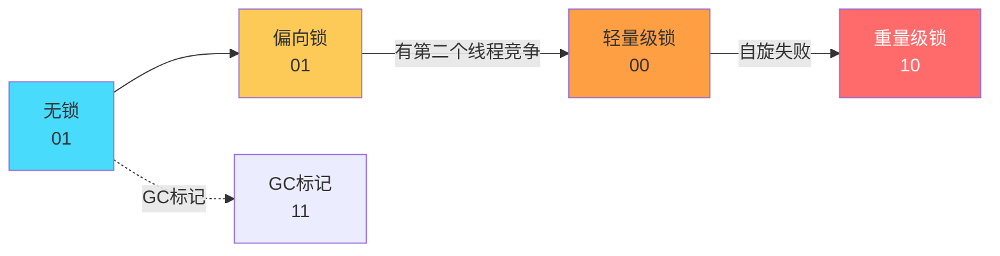

| 状态 | 标志位 | 触发 | 性能 |
|------|--------|------|------|
| **无锁** | 01 | 初始 | - |
| **偏向锁** | 01 | 只有一个线程进入 | ⭐⭐⭐⭐⭐ 最快 |
| **轻量级锁** | 00 | 多线程交替进入(无竞争) | ⭐⭐⭐⭐ CAS 自旋 |
| **重量级锁** | 10 | 自旋失败 / 高竞争 | ⭐⭐ 阻塞唤醒(慢) |

### 9.3 🔴 对象头 MarkWord(64 位)

```
无锁状态:
┌─────────────────────────────────────────┬───┬─┐
│  unused 25 │ identity_hashcode 31 │  ─  │00 │1│
└─────────────────────────────────────────┴───┴─┘

偏向锁:
┌─────────────────────────────┬─────┬───┬─┐
│ thread_id 54 │ epoch 2 │ ─ │  ─  │01 │1│
└─────────────────────────────┴─────┴───┴─┘
                              ↑
                         偏向锁标志(1)

轻量级锁:
┌────────────────────────────────────┬───┐
│  ptr_to_lock_record 62             │00 │
└────────────────────────────────────┴───┘
            指向线程栈帧中的 Lock Record

重量级锁:
┌────────────────────────────────────┬───┐
│  ptr_to_heavyweight_monitor 62     │10 │
└────────────────────────────────────┴───┘
            指向 ObjectMonitor
```

### 9.4 🔴 monitorenter / monitorexit

> 🔴 **必懂**:`synchronized 代码块`编译后:

```java
public void sync() {
    synchronized (this) {
        // 临界区
    }
}

// 编译后字节码
public void sync();
    Code:
       0: aload_0
       1: dup
       2: astore_1
       3: monitorenter        ← 加锁
       4: // 临界区
       8: aload_1
       9: monitorexit         ← 正常退出释放
      10: goto    18
      13: astore_2
      14: aload_1
      15: monitorexit         ← ★ 异常退出也释放
      16: aload_2
      17: athrow
      18: return
```

> 🟠 **重点**:`monitorenter` 对 ObjectMonitor 计数 +1(可重入),`monitorexit` -1。计数到 0 才真正释放。

### 9.5 🔴 ObjectMonitor 结构

```c
// HotSpot 源码 ObjectMonitor.hpp
class ObjectMonitor {
    void *  _owner;        // 持有锁的线程
    int     _count;        // 重入次数
    WaitSet  _WaitSet;     // wait() 进入的等待队列
    ContentionList _cxq;   // 竞争锁失败进入的队列
    EntryList _EntryList;  // 待唤醒队列
    // ...
};
```

```mermaid
flowchart TD
    T1[新线程进入] --> CXQ[ContentionList<br/>竞争队列]
    CXQ --> EL[EntryList<br/>候选队列]
    EL --> WIN[竞争 _owner 成功]

    WAIT[wait()] --> WS[WaitSet<br/>等待队列]
    WS -.notify.-> EL
    WS -.notifyAll.-> EL

    style WIN fill:#ff6b6b,color:#fff
```

### 9.6 🟡 锁消除 / 锁粗化

> 🟡 **加分**:JIT 编译器优化
> - **锁消除**:逃逸分析发现锁不会被多线程访问 → 直接去掉(如局部 StringBuffer)
> - **锁粗化**:循环内反复加锁 → 提到循环外只加一次

```java
// 锁消除案例
public String concat(String s1, String s2) {
    StringBuffer sb = new StringBuffer();   // sb 不会逃逸
    sb.append(s1);                          // 编译后会去掉 synchronized
    sb.append(s2);
    return sb.toString();
}

// 锁粗化案例
for (int i = 0; i < 1000; i++) {
    synchronized (lock) { /* ... */ }       // JIT 可能粗化为外层一次加锁
}
```

---

## 10. CAS 与 Atomic

### 10.1 🔴 CAS 三要素

> 🔴 **CAS = Compare And Swap**:`(V, Expected, NewValue)` 三个参数,V 等于 Expected 才更新为 NewValue。

```
CAS(V, Expected, NewValue):
    if (V == Expected) {
        V = NewValue;
        return true;
    }
    return false;        // 失败,通常自旋重试
```

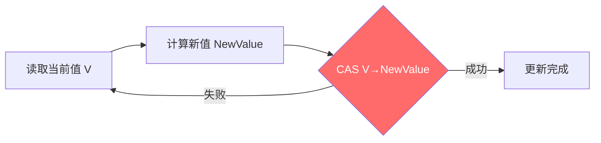

### 10.2 🔴 CAS 底层实现

> 🔴 **核心**:Java 的 CAS 通过 ==`Unsafe.compareAndSwapXxx()`== 调用 native 方法,底层是 ==`lock cmpxchg`== 汇编指令(x86),保证原子性。

```java
// AtomicInteger#incrementAndGet
public final int incrementAndGet() {
    return U.getAndAddInt(this, VALUE, 1) + 1;
}

// Unsafe#getAndAddInt
public final int getAndAddInt(Object o, long offset, int delta) {
    int v;
    do {
        v = getIntVolatile(o, offset);
    } while (!compareAndSetInt(o, offset, v, v + delta));   // ★ 自旋 CAS
    return v;
}
```

### 10.3 🔴 CAS 三大问题

| 问题 | 描述 | 解决 |
|------|------|------|
| ==**ABA 问题**== | A→B→A,CAS 看不出中间变化 | `AtomicStampedReference`(版本号) |
| ==**自旋开销**== | 高竞争下大量空转浪费 CPU | LongAdder 分段 / 改用锁 |
| ==**单变量限制**== | 只能保证一个变量原子 | `AtomicReference` 包装多个字段 |

### 10.4 🟠 ABA 问题示例

```java
// AtomicStampedReference - 带版本戳
AtomicStampedReference<Integer> ref = new AtomicStampedReference<>(100, 0);

int[] stampHolder = new int[1];
Integer current = ref.get(stampHolder);
int oldStamp = stampHolder[0];

// CAS 时同时校验版本
boolean success = ref.compareAndSet(current, current + 1, oldStamp, oldStamp + 1);
```

### 10.5 🔴 LongAdder vs AtomicLong

> 🔴 **重点对比**:高并发下 ==LongAdder 比 AtomicLong 快得多==。

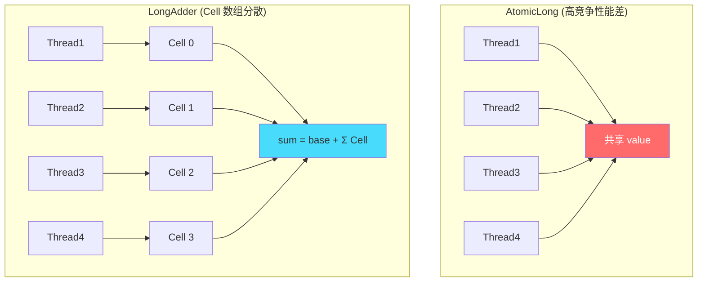

> 🟠 **核心**:LongAdder 把单点竞争分散到 Cell 数组,每个线程操作不同 Cell,**牺牲 sum() 实时一致性换吞吐**。读取时累加所有 Cell。

| | AtomicLong | LongAdder |
|---|------------|-----------|
| 写性能 | 高竞争差(全部 CAS 同一变量) | ⭐ 高竞争极佳 |
| 读 sum() | O(1) 直接读 | O(N) 累加 Cell |
| 适用 | 低竞争 / 需要精确 get-and-set | 高并发计数(QPS、PV) |

---

## 11. AQS 框架与 ReentrantLock

### 11.1 🔴 AQS 是什么

> 🔴 **AQS = AbstractQueuedSynchronizer**:JUC 几乎所有锁/同步器的基类。提供:
> - ==int 类型的 state== 状态值
> - ==FIFO 双向队列== 管理等待线程
> - 模板方法,子类实现 `tryAcquire / tryRelease`

### 11.2 🔴 AQS 数据结构

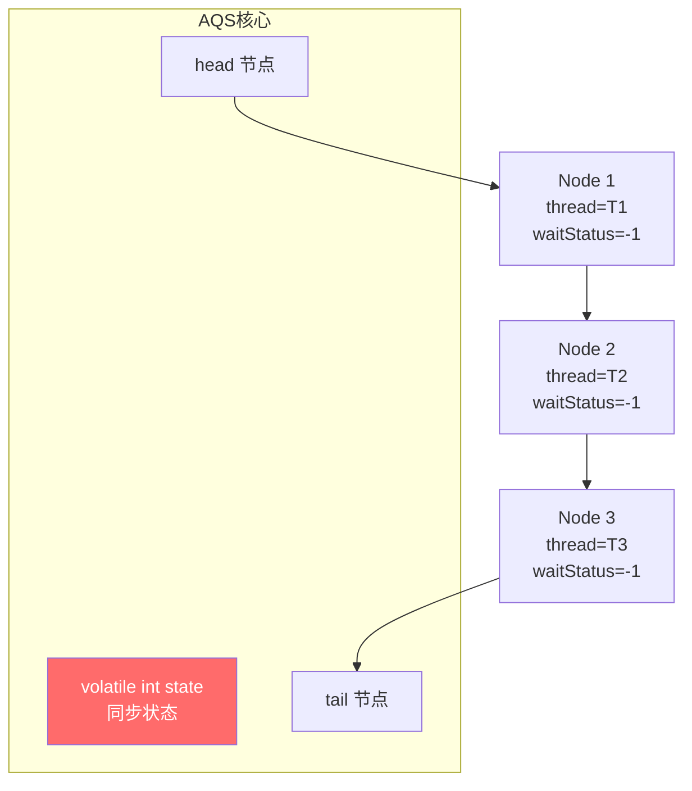

```java
public abstract class AbstractQueuedSynchronizer {
    private volatile int state;          // ★ 核心状态
    private transient Node head;
    private transient Node tail;

    static final class Node {
        volatile int waitStatus;
        volatile Node prev, next;
        volatile Thread thread;
        // ...
        static final int CANCELLED =  1;  // 取消
        static final int SIGNAL    = -1;  // 后继需要被唤醒
        static final int CONDITION = -2;  // 在条件队列
        static final int PROPAGATE = -3;  // 共享模式传播
    }
}
```

### 11.3 🔴 acquire 流程(获取锁)

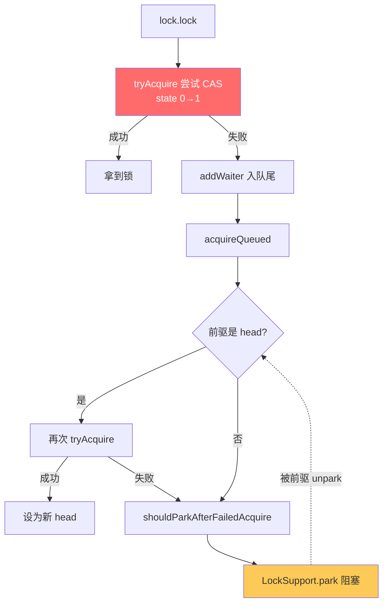

### 11.4 🔴 release 流程(释放锁)

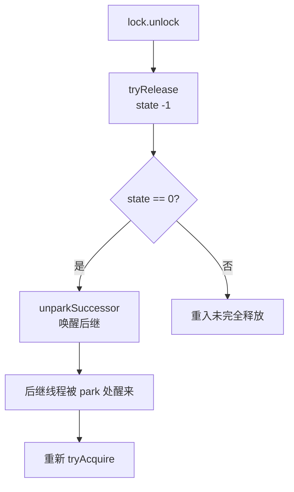

### 11.5 🔴 ReentrantLock 公平 vs 非公平

```java
// 默认非公平锁
ReentrantLock lock = new ReentrantLock();

// 公平锁
ReentrantLock fairLock = new ReentrantLock(true);
```

| | 公平锁 | 非公平锁 ⭐ 默认 |
|---|--------|----------------|
| 抢锁顺序 | 严格 FIFO | 抢占式,新来线程先尝试 CAS |
| 性能 | ⭐⭐ 慢(每次都查队列) | ⭐⭐⭐⭐⭐ 快(可能直接 CAS 成功) |
| 饥饿风险 | ⭐ 无 | ⭐⭐ 可能饥饿 |
| 吞吐量 | 低 | 高 |

```java
// FairSync.tryAcquire 多了一步:hasQueuedPredecessors() 检查队列前面有无线程
protected final boolean tryAcquire(int acquires) {
    final Thread current = Thread.currentThread();
    int c = getState();
    if (c == 0) {
        if (!hasQueuedPredecessors() &&        // ★ 公平锁多这一步
            compareAndSetState(0, acquires)) {
            setExclusiveOwnerThread(current);
            return true;
        }
    } else if (current == getExclusiveOwnerThread()) {
        setState(c + acquires);                 // 重入
        return true;
    }
    return false;
}
```

### 11.6 🔴 ReentrantLock vs synchronized

> 🔴 **必背对照表**

| 维度 | ReentrantLock | synchronized |
|------|---------------|--------------|
| 实现 | ==Java 代码(AQS)== | ==JVM 内置 monitor== |
| 公平锁 | ✅ 支持 | ❌ |
| 可中断 | ✅ `lockInterruptibly()` | ❌ |
| 超时获取 | ✅ `tryLock(timeout)` | ❌ |
| 条件变量 | ✅ ==多个 Condition== | ❌ 只有 wait/notify |
| 释放 | ⚠️ 必须 finally 手动 | JVM 自动(异常也释放) |
| 锁优化 | 无 | ✅ 偏向→轻量→重量级 |
| 性能 | 早期更快,JDK 6+ 差不多 | JDK 6+ 优化后接近 |

### 11.7 🟠 Condition 实现等待/通知

```java
private ReentrantLock lock = new ReentrantLock();
private Condition notFull  = lock.newCondition();
private Condition notEmpty = lock.newCondition();

public void put(T item) throws InterruptedException {
    lock.lock();
    try {
        while (queue.size() == capacity) {
            notFull.await();          // 类似 wait
        }
        queue.offer(item);
        notEmpty.signal();            // 类似 notify
    } finally { lock.unlock(); }
}
```

> 🟠 **重点**:相比 wait/notify,Condition 可以创建**多个等待队列**(notFull / notEmpty),`signal()` 可以精确唤醒目标条件的线程,**避免假唤醒和惊群**。

---

## 12. ReentrantReadWriteLock / StampedLock

### 12.1 🔴 ReadWriteLock(读写锁)

> 🔴 **核心**:**读读共享、读写互斥、写写互斥**。适合 ==读多写少== 场景。

```java
ReentrantReadWriteLock rwLock = new ReentrantReadWriteLock();
Lock readLock  = rwLock.readLock();
Lock writeLock = rwLock.writeLock();

// 读
readLock.lock();
try {
    // 多个读线程可以并发
} finally { readLock.unlock(); }

// 写
writeLock.lock();
try {
    // 独占
} finally { writeLock.unlock(); }
```

> 🟠 **state 高低位**:RWLock 用 32 位 state,**高 16 位记录读锁数,低 16 位记录写锁重入数**。

### 12.2 🟠 锁降级

> 🟠 **重点**:写锁可以**降级**为读锁(获写后再获读再释写),反过来不行。

```java
writeLock.lock();
try {
    // 写
    readLock.lock();              // ★ 在写锁内拿读锁
} finally {
    writeLock.unlock();           // 降级为读锁
}
try {
    // 读
} finally {
    readLock.unlock();
}
```

### 12.3 🟡 StampedLock(JDK 8+)

> 🟡 **加分**:StampedLock 提供 ==乐观读== 模式,无锁读取后再校验,性能极高。

```java
StampedLock sl = new StampedLock();

// 乐观读
long stamp = sl.tryOptimisticRead();
double currentX = x, currentY = y;     // 读
if (!sl.validate(stamp)) {              // 校验期间是否有写入
    stamp = sl.readLock();              // 升级为悲观读
    try {
        currentX = x; currentY = y;
    } finally {
        sl.unlockRead(stamp);
    }
}
```

> 🟢 **避坑**:StampedLock **不可重入**!且 ReadLock 不能升级为 WriteLock。


---

# 第四部分 · 高级并发工具

## 13. JUC 三剑客

### 13.1 🔴 速记对比表

| 工具 | 用途 | 能否复用 | 类比 |
|------|------|---------|------|
| **Semaphore** | ==限流== / 资源池 | ✅ | 停车场限位 |
| **CountDownLatch** | 等待 N 个任务完成 | ❌ ==一次性== | 倒计时门 |
| **CyclicBarrier** | N 个线程互相等待 | ✅ | 集合点 |

### 13.2 🔴 Semaphore 信号量

```java
// 同时只允许 3 个线程访问
Semaphore semaphore = new Semaphore(3);

public void doSomething() throws InterruptedException {
    semaphore.acquire();              // 拿到许可证
    try {
        // 临界区
    } finally {
        semaphore.release();          // 归还
    }
}
```

> 🟠 **常用场景**:
> - 数据库连接池(限制最大连接数)
> - 限流器(每秒最多 N 个请求)
> - 资源池

### 13.3 🔴 CountDownLatch 倒计时门闩

> 🔴 **场景**:主线程等所有子任务完成后再继续

```java
CountDownLatch latch = new CountDownLatch(5);

for (int i = 0; i < 5; i++) {
    new Thread(() -> {
        try {
            // 子任务
        } finally {
            latch.countDown();        // 计数 -1
        }
    }).start();
}

latch.await();                        // 阻塞直到计数 0
System.out.println("所有子任务已完成");
```

> 🟢 **避坑**:CountDownLatch **不能重置**,计数到 0 就废了。要重用请改 CyclicBarrier。

### 13.4 🔴 CyclicBarrier 循环栅栏

> 🔴 **场景**:N 个线程互相等待全部到齐后一起继续

```java
CyclicBarrier barrier = new CyclicBarrier(3,
    () -> System.out.println("所有线程已到齐"));     // 屏障动作

for (int i = 0; i < 3; i++) {
    new Thread(() -> {
        try {
            // 准备工作
            barrier.await();          // 到达栅栏,等其他线程
            // 一起继续
        } catch (Exception e) {}
    }).start();
}
```

### 13.5 🟠 CountDownLatch vs CyclicBarrier

| 维度 | CountDownLatch | CyclicBarrier |
|------|----------------|---------------|
| 动作 | 一个线程等多个线程 | 多个线程互相等 |
| 可重用 | ❌ | ✅ `barrier.reset()` |
| 实现 | ==基于 AQS== 共享模式 | ==基于 ReentrantLock + Condition== |
| 计数操作 | `countDown()` 减 1 | `await()` 自动减 1 |
| 屏障动作 | 无 | ✅ 可指定 Runnable |

### 13.6 🟡 Phaser 进阶版

> 🟡 **加分**:Phaser 可以理解为 ==支持动态注册参与者的 CyclicBarrier==,适合分阶段任务(每阶段参与者可变)。

---

## 14. ThreadLocal

### 14.1 🔴 核心作用

> 🔴 **三大用途**:
> 1. ==线程隔离==:每线程独立副本
> 2. ==隐式传参==:Spring 事务的 Connection、TraceId
> 3. ==避免锁竞争==:SimpleDateFormat 等线程不安全类

### 14.2 🔴 数据结构(必懂)

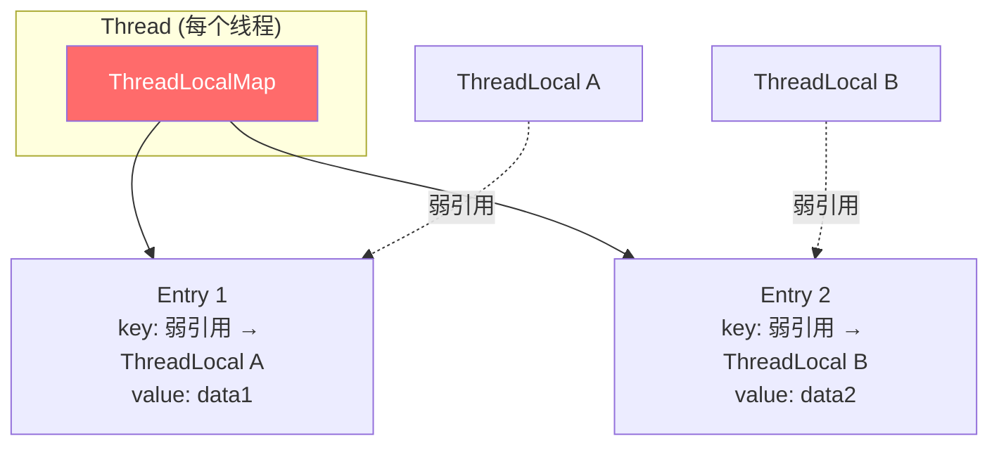

> 🔴 **关键**:
> - 每个 `Thread` 持有一个 `ThreadLocalMap`(不是 ThreadLocal 持有 Map!)
> - `ThreadLocalMap.Entry` 的 ==key 是 ThreadLocal 的弱引用,value 是强引用==
> - **key 弱引用是为了避免 ThreadLocal 无法回收**(如果是强引用,只要 Thread 活着 ThreadLocal 就一直在)

### 14.3 🔴 内存泄漏问题

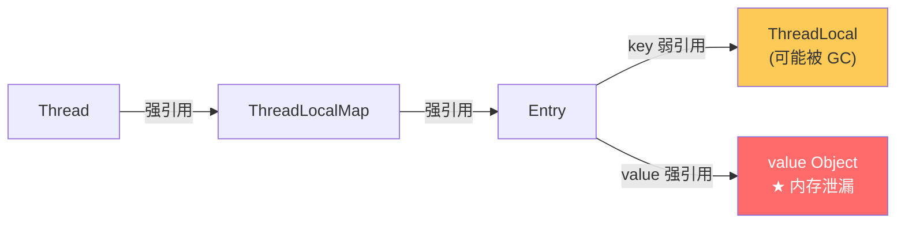

> 🔴 **核心**:
> 1. ThreadLocal 实例如果没有强引用(比如 method 退出后,局部变量 `tl` 失效)→ ==被 GC 回收==
> 2. 但 Entry 的 ==value 是强引用==,而 Thread 还活着 → value 永远不释放
> 3. 尤其在 ==线程池场景==,线程不死,泄漏积累
>
> 🟢 **避坑**:**必须在 finally 里 `tl.remove()`**

```java
// 标准用法
ThreadLocal<User> tl = new ThreadLocal<>();
try {
    tl.set(user);
    // 业务
} finally {
    tl.remove();        // ★ 必须!
}
```

### 14.4 🔴 hash 冲突解决

> 🔴 **重点**:HashMap 用拉链法,但 ==ThreadLocalMap 用开放定址法(线性探测)==,因为:
> - 每个 ThreadLocal 都有自己的 `threadLocalHashCode`,冲突概率低
> - 数组结构内存连续,缓存友好
> - 不需要额外链表节点

```java
// ThreadLocal#nextHashCode 黄金分割数,减少冲突
private static final int HASH_INCREMENT = 0x61c88647;
```

### 14.5 🟠 InheritableThreadLocal

> 🟠 **场景**:子线程能继承父线程的 ThreadLocal 值。

```java
InheritableThreadLocal<String> tl = new InheritableThreadLocal<>();
tl.set("父线程数据");

new Thread(() -> {
    System.out.println(tl.get());     // ✅ 子线程能拿到 "父线程数据"
}).start();
```

> 🟢 **避坑**:`InheritableThreadLocal` 在 ==线程池== 中不会更新(线程复用,只在创建时复制一次)。

### 14.6 🟡 TransmittableThreadLocal(阿里 TTL)

> 🟡 **加分**:阿里开源的 ==TransmittableThreadLocal== 解决了线程池场景下的传递问题。

```java
TransmittableThreadLocal<String> tl = new TransmittableThreadLocal<>();
tl.set("traceId-123");

ExecutorService ttlPool = TtlExecutors.getTtlExecutorService(originalPool);
ttlPool.submit(() -> {
    System.out.println(tl.get());     // ✅ 拿到 traceId-123
});
```

---

## 15. Future / CompletableFuture

### 15.1 🔴 Future 局限

> 🔴 **三大缺陷**:
> 1. ==`get()` 阻塞== 无法异步回调
> 2. ==无法编排== 多个 Future
> 3. ==无法处理异常==(只能 try-catch get)

### 15.2 🔴 CompletableFuture 三大优势

```java
// 1. 异步执行 + 回调
CompletableFuture.supplyAsync(() -> queryUser(id))
                 .thenApply(user -> user.getName())
                 .thenAccept(System.out::println)
                 .exceptionally(ex -> { log.error("err", ex); return null; });

// 2. 多任务编排
CompletableFuture<String> f1 = CompletableFuture.supplyAsync(() -> "Hello");
CompletableFuture<String> f2 = CompletableFuture.supplyAsync(() -> "World");
CompletableFuture<String> result = f1.thenCombine(f2, (a, b) -> a + " " + b);

// 3. 异常处理
CompletableFuture.supplyAsync(() -> {
    if (fail) throw new RuntimeException("err");
    return "ok";
}).handle((res, ex) -> ex != null ? "default" : res);
```

### 15.3 🔴 常用 API 速查

| API | 作用 |
|-----|------|
| `supplyAsync(Supplier)` | 异步执行有返回值 |
| `runAsync(Runnable)` | 异步执行无返回值 |
| `thenApply(Function)` | 同步串行,转换结果 |
| `thenApplyAsync(...)` | ==异步串行==(用 ForkJoinPool 或自定义池) |
| `thenAccept(Consumer)` | 串行消费,无返回 |
| `thenRun(Runnable)` | 串行执行,不关心结果 |
| `thenCombine(other, BiFunction)` | ==两个完成后合并== |
| `thenCompose(Function)` | 串联另一个 CompletableFuture(扁平化) |
| `allOf(...)` | ==等所有完成== |
| `anyOf(...)` | ==任一完成立即返回== |
| `exceptionally(Function)` | 异常处理(只在异常时触发) |
| `handle(BiFunction)` | ==无论成败都触发==,可改写结果 |

### 15.4 🟢 线程池选择避坑

> 🟢 **避坑**:不指定 Executor 时,默认用 ==ForkJoinPool.commonPool==!该池对并行计算友好,但**不适合 IO 密集**。

```java
// ❌ 默认用 commonPool,IO 任务会卡死整个 JVM
CompletableFuture.supplyAsync(() -> httpCall());

// ✅ 指定独立线程池
ExecutorService ioPool = Executors.newFixedThreadPool(50);
CompletableFuture.supplyAsync(() -> httpCall(), ioPool);
```

### 15.5 🟠 实战:并行调用多个接口

```java
// 同时调用 3 个接口,等全部完成后聚合
CompletableFuture<UserInfo>    userF  = CompletableFuture.supplyAsync(() -> userService.get(id));
CompletableFuture<List<Order>> orderF = CompletableFuture.supplyAsync(() -> orderService.list(id));
CompletableFuture<Wallet>      walletF= CompletableFuture.supplyAsync(() -> walletService.get(id));

CompletableFuture<Void> all = CompletableFuture.allOf(userF, orderF, walletF);
all.join();   // 等全部完成

UserDetail detail = new UserDetail(userF.get(), orderF.get(), walletF.get());
```

---

## 16. 并发容器

### 16.1 🔴 容器对比一览

| 容器 | 线程安全 | 实现 | 适用 |
|------|---------|------|------|
| `HashMap` | ❌ | 数组+链表+红黑树 | 单线程 |
| `Hashtable` | ✅ | 全方法 synchronized | 性能差,已淘汰 |
| `Collections.synchronizedMap` | ✅ | 包装类,锁全表 | 性能差 |
| ⭐ `ConcurrentHashMap` | ✅ | ==CAS + synchronized 锁桶== | 高并发首选 |
| `ConcurrentSkipListMap` | ✅ | ==跳表== | 有序 + 并发 |
| ⭐ `CopyOnWriteArrayList` | ✅ | 写时复制 | ==读多写极少== |
| `ConcurrentLinkedQueue` | ✅ | CAS 链表 | 无界非阻塞 |
| `ArrayBlockingQueue` | ✅ | 数组 + 一把锁 | 有界阻塞 |
| `LinkedBlockingQueue` | ✅ | 链表 + 两把锁 | 有界/无界阻塞 |

### 16.2 🔴 ConcurrentHashMap 实现演化


### 16.3 🔴 JDK 7 分段锁

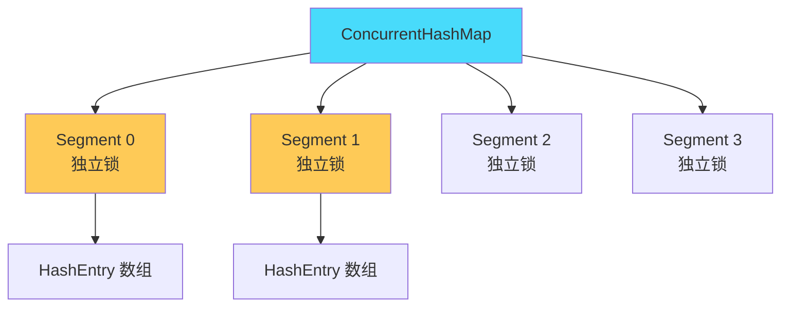

> 🟠 **JDK 7 思路**:把整张表分成 N(默认 16)个 Segment,每个 Segment 独立加锁。==并发度 = Segment 数==。

### 16.4 🔴 JDK 8 CAS + synchronized

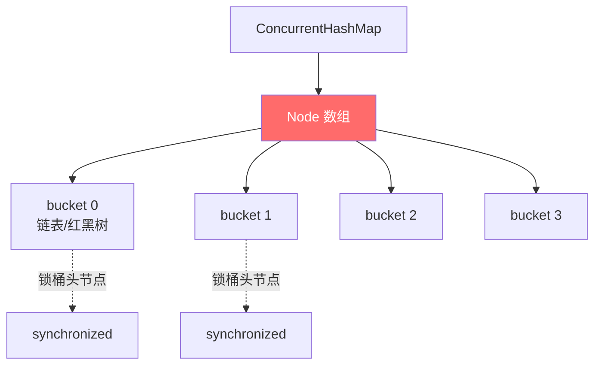

> 🔴 **核心**:JDK 8 抛弃 Segment,直接锁 ==Node 数组的桶头节点==,**并发度 = 桶数**(默认 16,自动扩容)。

```java
// putVal 核心逻辑
final V putVal(K key, V value, boolean onlyIfAbsent) {
    int hash = spread(key.hashCode());
    for (Node<K,V>[] tab = table;;) {
        Node<K,V> f; int n, i, fh;
        if (tab == null || (n = tab.length) == 0)
            tab = initTable();
        else if ((f = tabAt(tab, i = (n - 1) & hash)) == null) {
            // ★ 桶为空,CAS 直接放入
            if (casTabAt(tab, i, null, new Node<>(hash, key, value, null)))
                break;
        }
        else if ((fh = f.hash) == MOVED)        // 正在扩容,帮助迁移
            tab = helpTransfer(tab, f);
        else {
            synchronized (f) {                  // ★ 锁桶头节点
                // 链表 / 红黑树插入
            }
        }
    }
    addCount(1L, binCount);                     // CAS + CounterCell
    return null;
}
```

### 16.5 🔴 size 实现:CounterCell

> 🟠 **重点**:JDK 8 的 `size()` 用 ==CounterCell 数组分散计数==,类似 LongAdder。

```java
// 简化版
public int size() {
    long sum = baseCount;
    for (CounterCell cell : counterCells) {
        if (cell != null) sum += cell.value;
    }
    return (int) sum;
}
```

### 16.6 🔴 CopyOnWriteArrayList

> 🔴 **核心**:写时复制,适合 ==读远多于写==。

```java
// add 时复制整个数组
public boolean add(E e) {
    final ReentrantLock lock = this.lock;
    lock.lock();
    try {
        Object[] elements = getArray();
        int len = elements.length;
        Object[] newElements = Arrays.copyOf(elements, len + 1);   // ★ 复制
        newElements[len] = e;
        setArray(newElements);                                      // 替换引用
        return true;
    } finally { lock.unlock(); }
}

// 读完全无锁,直接读 volatile 数组
public E get(int index) {
    return (E) getArray()[index];
}
```

> 🟢 **避坑**:
> - **写性能极差**(每次 O(N) 复制),只适合**读多写极少**的场景(如配置、白名单)
> - **不能保证强一致性**:读拿到的可能是旧数组的快照(通常无所谓)
> - **内存放大**:写时短暂占两份内存

### 16.7 🟡 BlockingQueue 家族

| 实现 | 容量 | 内部锁 | 特点 |
|------|------|--------|------|
| `ArrayBlockingQueue` | ==有界== | ⭐ 一把锁 | 数组实现 |
| `LinkedBlockingQueue` | 默认 Integer.MAX_VALUE | ⭐ ==两把锁(头尾分离)== | 链表,吞吐高 |
| `SynchronousQueue` | 0 | - | ==无缓冲==,直接交付 |
| `PriorityBlockingQueue` | 无界 | 一把锁 | 堆,优先级 |
| `DelayQueue` | 无界 | 一把锁 | 延迟队列 |
| `LinkedTransferQueue` | 无界 | ==无锁(CAS+park)== | 高性能 |

---

# 第五部分 · 线程池与高性能

## 17. ThreadPoolExecutor 7 参数

### 17.1 🔴 必背构造方法

```java
public ThreadPoolExecutor(
    int corePoolSize,                            // ★ 1. 核心线程数
    int maximumPoolSize,                         // ★ 2. 最大线程数
    long keepAliveTime,                          //   3. 非核心空闲存活时间
    TimeUnit unit,                               //   4. 时间单位
    BlockingQueue<Runnable> workQueue,           // ★ 5. 任务队列
    ThreadFactory threadFactory,                 //   6. 线程工厂(命名/守护)
    RejectedExecutionHandler handler             // ★ 7. 拒绝策略
);
```

### 17.2 🔴 任务执行流程(生死攸关)

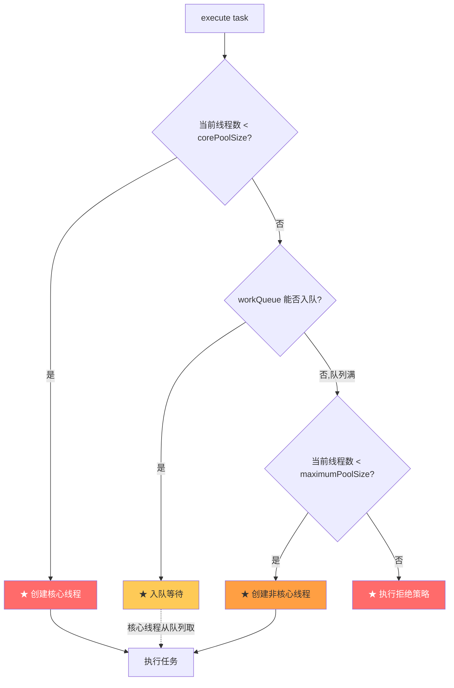

> 🔴 **核心顺序**(背诵):==**核心线程 → 队列 → 非核心线程 → 拒绝策略**==

### 17.3 🟢 经典踩坑

> 🟢 **避坑**:多数人**误以为**先用满 maximumPoolSize 才入队,**实际是先入队**!这导致用 `LinkedBlockingQueue(Integer.MAX_VALUE)` 时永远不会触发 maximumPoolSize。

### 17.4 🔴 4 种拒绝策略

| 策略 | 行为 | 适用 |
|------|------|------|
| ⭐ `AbortPolicy` | ==默认==,抛 `RejectedExecutionException` | 严肃业务 |
| `CallerRunsPolicy` | ==让调用者线程执行==(限流回压) | 允许慢、不能丢的场景 |
| `DiscardPolicy` | 默默丢弃 | 日志、不重要任务 |
| `DiscardOldestPolicy` | 丢弃队列最老的,把新任务塞进来 | 实时数据,只关心最新 |

> 🟡 **加分**:生产中常 ==自定义拒绝策略==:
> - 记录日志报警
> - 持久化到 DB / MQ 兜底
> - 触发降级开关

### 17.5 🔴 4 种工作队列

| 队列 | 特点 | 适用 |
|------|------|------|
| `ArrayBlockingQueue(N)` | 有界数组 | 严控资源 |
| ⭐ `LinkedBlockingQueue` | ==默认无界(危险)== | 注意必须传容量 |
| `SynchronousQueue` | 0 容量,直接转交 | `newCachedThreadPool` 用,会无限创建线程 |
| `PriorityBlockingQueue` | 无界优先级队列 | 任务有优先级 |

### 17.6 🟢 Executors 工具类的坑

> 🟢 **阿里规约禁止**直接用 `Executors`:

| 方法 | 风险 |
|------|------|
| `newFixedThreadPool` | LinkedBlockingQueue 无界 → ==OOM== |
| `newSingleThreadExecutor` | 同上 → OOM |
| `newCachedThreadPool` | SynchronousQueue + 最大 Integer.MAX_VALUE → ==OOM== |
| `newScheduledThreadPool` | 工作队列 DelayedWorkQueue 无界 → OOM |

**正确做法**:始终用 `new ThreadPoolExecutor(...)` 显式指定有界队列。

### 17.7 🔴 线程池大小公式

> 🔴 **经验值**:
> - **CPU 密集型**:线程数 = ==`CPU核数 + 1`==
> - **IO 密集型**:线程数 = ==`CPU核数 × 2`== 或 `CPU核数 / (1 - 阻塞系数)`
>   - 阻塞系数:线程花在等待 IO 的时间比例,典型 0.8 ~ 0.9
> - **混合型**:可以拆成两个池

```java
int corePoolSize = Runtime.getRuntime().availableProcessors() * 2;
ThreadPoolExecutor pool = new ThreadPoolExecutor(
    corePoolSize, corePoolSize * 2,
    60L, TimeUnit.SECONDS,
    new LinkedBlockingQueue<>(1000),
    new ThreadFactoryBuilder().setNameFormat("biz-pool-%d").build(),
    new ThreadPoolExecutor.CallerRunsPolicy()
);
```

### 17.8 🟠 线程池状态

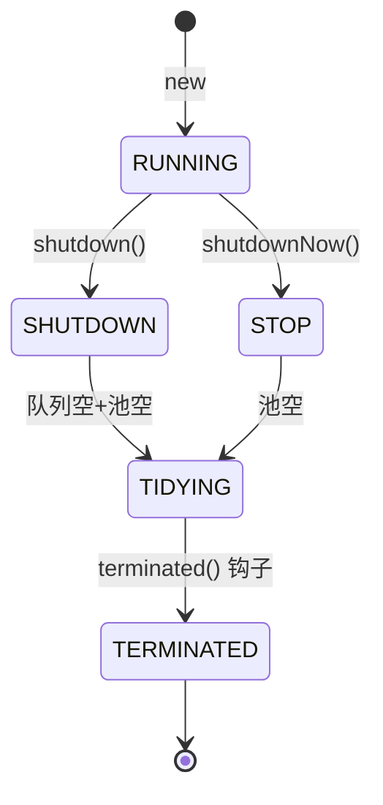

| 状态 | 含义 |
|------|------|
| `RUNNING` | 正常运行 |
| `SHUTDOWN` | 不再接新任务,继续处理队列中的 |
| `STOP` | 不接新任务,**中断**正在执行的 |
| `TIDYING` | 任务全部完成 |
| `TERMINATED` | terminated() 执行完 |

> 🟠 **关键**:`ctl` 字段用 ==int 高 3 位存状态,低 29 位存线程数==,通过原子 CAS 修改。

### 17.9 🟡 线程池监控

```java
ThreadPoolExecutor pool = ...;
pool.getActiveCount();          // 活跃线程数
pool.getQueue().size();          // 队列任务数
pool.getCompletedTaskCount();    // 已完成任务数
pool.getLargestPoolSize();       // 历史峰值线程数
pool.getPoolSize();              // 当前池大小

// 钩子方法
new ThreadPoolExecutor(...) {
    @Override
    protected void beforeExecute(Thread t, Runnable r) { /* 前置 */ }
    @Override
    protected void afterExecute(Runnable r, Throwable t) { /* 后置 */ }
};
```

---

## 18. ForkJoinPool 与工作窃取

### 18.1 🔴 设计思想

> 🔴 **核心**:**分治 + 工作窃取(Work Stealing)**。每个 worker 有自己的 ==双端队列==(Deque),自己从头取,空闲时从别人队尾偷。

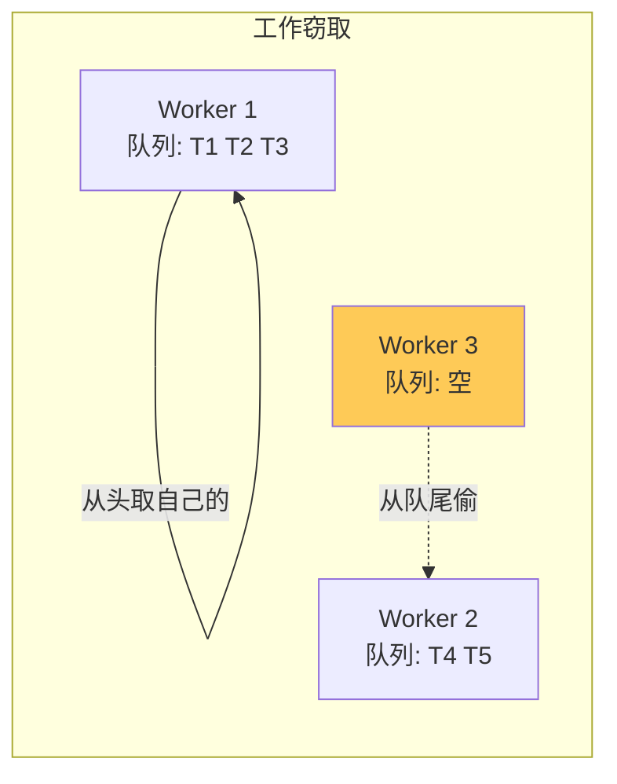

### 18.2 🔴 RecursiveTask 例子

```java
class SumTask extends RecursiveTask<Long> {
    private final long[] arr;
    private final int start, end;
    private static final int THRESHOLD = 1000;

    @Override
    protected Long compute() {
        if (end - start <= THRESHOLD) {
            // 小任务直接算
            long sum = 0;
            for (int i = start; i < end; i++) sum += arr[i];
            return sum;
        }
        int mid = (start + end) / 2;
        SumTask left  = new SumTask(arr, start, mid);
        SumTask right = new SumTask(arr, mid, end);
        left.fork();                   // 异步执行
        return right.compute() + left.join();   // 自己算右半,等左半
    }
}

// 调用
ForkJoinPool pool = ForkJoinPool.commonPool();
Long total = pool.invoke(new SumTask(arr, 0, arr.length));
```

### 18.3 🟢 ForkJoinPool 适用与避坑

> 🟡 **适用**:可拆分的纯 CPU 计算(图像处理、归并排序、并行 Stream)
>
> 🟢 **避坑**:
> - **不要在 fork-join 任务里做 IO**(阻塞 worker,影响整池)
> - 默认大小 = ==CPU 核数==,IO 多的话设大点

### 18.4 🟡 与 parallelStream 关系

> 🟡 **加分**:`parallelStream()` 底层就是 `ForkJoinPool.commonPool`!所以**所有 parallelStream 共用一个池**,慎用大计算或 IO。

```java
// ❌ 默认共用 commonPool
list.parallelStream().map(this::heavyWork).collect(toList());

// ✅ 用自定义 ForkJoinPool 隔离
ForkJoinPool pool = new ForkJoinPool(8);
pool.submit(() ->
    list.parallelStream().map(this::heavyWork).collect(toList())
).get();
```

---

## 19. Disruptor 无锁队列

### 19.1 🔴 为什么这么快

> 🔴 **5 大设计**:
> 1. ==RingBuffer== 环形数组,预分配,**无 GC**
> 2. ==无锁 CAS==(序列号 Sequence)
> 3. ==缓存行填充==(`@Contended`)消除 ==伪共享==
> 4. ==位运算==代替取模(数组大小必须 2 的幂,`& (size - 1)`)
> 5. ==批处理==,一次拿一批消费,减少切换

### 19.2 🟠 RingBuffer 模型

```mermaid
flowchart LR
    subgraph RingBuffer["RingBuffer 环形数组(大小=2^N)"]
        S0[slot 0] --> S1[slot 1]
        S1 --> S2[slot 2]
        S2 --> S3[slot 3]
        S3 --> S4[slot 4]
        S4 --> S5[slot 5]
        S5 --> S6[slot 6]
        S6 --> S7[slot 7]
        S7 -->|环形| S0
    end

    P[Producer<br/>seq=10] -.写到 slot 10 % 8 = 2.-> S2
    C[Consumer<br/>seq=8] -.读 slot 8 % 8 = 0.-> S0

    style RingBuffer fill:#48dbfb
```

### 19.3 🔴 伪共享问题

> 🔴 **关键概念**:CPU 缓存行(Cache Line)= ==64 字节==。多个变量恰好在同一缓存行,一个修改会让整个缓存行失效,引发 ==伪共享(False Sharing)==。

```java
// ❌ 伪共享
class Bad {
    volatile long a;       // 8 字节
    volatile long b;       // 8 字节,可能同缓存行
}
// 线程 1 改 a,线程 2 改 b,互相导致对方缓存失效

// ✅ 缓存行填充
class Good {
    volatile long a;
    long p1, p2, p3, p4, p5, p6, p7;   // 占满 56 字节
    volatile long b;
}

// JDK 8+ 注解(需 -XX:-RestrictContended)
class Better {
    @sun.misc.Contended volatile long a;
    @sun.misc.Contended volatile long b;
}
```

### 19.4 🟠 等待策略

| 策略 | 特点 | 适用 |
|------|------|------|
| `BlockingWaitStrategy` | 锁 + 条件变量 | CPU 友好,延迟高 |
| ⭐ `BusySpinWaitStrategy` | 自旋 | ==极低延迟,CPU 100%== |
| `YieldingWaitStrategy` | 自旋 + Thread.yield | 折中 |
| `SleepingWaitStrategy` | 自旋 + sleep | 折中 |

### 19.5 🟡 Disruptor vs BlockingQueue

| 维度 | Disruptor | LinkedBlockingQueue |
|------|-----------|--------------------|
| 吞吐 | ==600 万/秒== | 约 50 万/秒 |
| 延迟 | 纳秒级 | 微秒级 |
| GC | 几乎无 | 频繁 Node 创建 |
| 适用 | 高频交易、日志 | 通用 |

---


# 第六部分 · 面试官高频追问 Top 30

## 20. 通用答题套路 STAR-S

> **S** 一句话场景 → **T** 给结论/分类 → **A** 画图说原理 → **R** 关键源码/类名 → **S** 引申踩坑/对比

---

## 21. JMM / volatile Top 7

### Q1. JMM 三大特性是什么?

> 🔴 **必背**:
> - **原子性**:`synchronized` / `Atomic` / `Lock`
> - **可见性**:`volatile` / `synchronized`
> - **有序性**:`volatile` / `synchronized` / `happens-before`

### Q2. volatile 能保证原子性吗?

> 🔴 **不能**!`volatile int i; i++` 仍线程不安全(读-改-写 3 步)。原子性要用 `Atomic` / `synchronized`。

### Q3. volatile 是怎么保证可见性的?

> 🟠 **STAR-S**:
> A — 编译为 ==`lock` 前缀汇编==,该指令:① 锁缓存行(MESI 协议);② 把当前 CPU 写缓冲刷到主内存;③ 让其他 CPU 缓存失效
> R — `Unsafe.putXxxVolatile` / 内存屏障
> S — 因此读 volatile 变量必从主内存重新加载

### Q4. 双重检查锁定为什么要 volatile?

> 🔴 **核心**:`new Singleton()` 不是原子的,分 ==分配内存→初始化→赋引用== 3 步。重排后其他线程可能拿到 ==未初始化的对象==。volatile 禁止这种重排。

### Q5. happens-before 8 大规则?

> 🟠 程序顺序、监视器锁、volatile、传递性、start、join、interrupt、finalize。**不是说 A 时间上先于 B,而是 A 的结果对 B 可见**。

### Q6. 内存屏障有哪 4 种?

> 🟠 LoadLoad / StoreStore / LoadStore / StoreLoad,其中 ==StoreLoad 最重(全屏障)==,volatile 写后会插入。

### Q7. 什么是伪共享?怎么解决?

> 🟡 **伪共享**:多个变量在同一 ==64 字节缓存行==,互相导致缓存失效。解决:
> - 手动填充字段
> - JDK 8+ `@Contended` + `-XX:-RestrictContended`

---

## 22. 锁机制 Top 10

### Q8. synchronized 锁升级路径?

> 🔴 **核心**:无锁 → ==偏向锁== → ==轻量级锁(CAS 自旋)== → ==重量级锁(阻塞)==。MarkWord 标志位:01 偏向 / 00 轻量 / 10 重量。

### Q9. synchronized 修饰静态方法和实例方法的区别?

> 🔴 **不同的两把锁**!
> - 实例方法 → 锁 `this`
> - 静态方法 → 锁 `Class` 对象
>
> 同一个类的静态方法和实例方法**不互斥**(锁不同)。

### Q10. synchronized 和 ReentrantLock 怎么选?

> 🔴 **STAR-S**:
> - 简单互斥 → `synchronized`(JDK 6+ 优化后性能差不多,自动释放)
> - 需要 ==公平锁、可中断、超时、多 Condition== → `ReentrantLock`
> - **强烈建议**用 finally 释放,否则死锁

### Q11. CAS 是怎么保证原子性的?

> 🔴 **核心**:CPU 提供 ==`lock cmpxchg`== 单条汇编指令,锁缓存行 + 原子比较交换。Java 通过 `Unsafe.compareAndSwapXxx` 调用。

### Q12. CAS 有什么问题?

> 🔴 **三大**:
> 1. ==ABA 问题== → `AtomicStampedReference` 加版本号
> 2. ==自旋开销== → 高竞争用 LongAdder 或锁
> 3. ==只能保证单变量== → `AtomicReference` 包装多字段

### Q13. AQS 的核心设计?

> 🟠 **STAR-S**:
> A — 基于 ==`volatile int state`== + ==CLH 双向队列==,模板方法模式
> R — `tryAcquire / tryRelease` 子类实现;`acquire` 失败入队 → park 阻塞 → 前驱 unpark 唤醒
> S — ReentrantLock / Semaphore / CountDownLatch / RWLock 都基于 AQS

### Q14. ReentrantLock 公平 vs 非公平?

> 🟠 **核心**:非公平默认,新来线程**先尝试 CAS** 抢锁,抢不到再入队。公平锁多了 ==`hasQueuedPredecessors()`== 检查队列,严格 FIFO。
>
> 性能:非公平 ⭐⭐⭐⭐⭐,公平 ⭐⭐(吞吐低但无饥饿)

### Q15. 读写锁的锁降级?

> 🟡 **加分**:写锁可以"不释放写锁直接拿读锁",释放写锁后变成读锁。**反过来不行**(读升级为写会死锁)。

### Q16. LongAdder 为什么比 AtomicLong 快?

> 🔴 **核心**:把单点竞争**分散到 Cell 数组**,每线程操作不同 Cell,牺牲 sum() 实时一致性换吞吐。高并发计数器首选。

### Q17. synchronized 在 JDK 6 之前为什么慢?

> 🟡 **原因**:JDK 6 之前 synchronized 直接走 ObjectMonitor(用户态↔内核态切换、阻塞),代价大。
>
> JDK 6 引入 ==偏向锁、轻量级锁、自适应自旋==,大多数场景接近 ReentrantLock。

---

## 23. 并发工具 Top 8

### Q18. CountDownLatch vs CyclicBarrier?

> 🔴 **核心**:
> - CountDownLatch:**一个等多个**,一次性,基于 AQS 共享模式
> - CyclicBarrier:**多个互相等**,可重用,基于 ReentrantLock + Condition
> - 还有 `Phaser`(可动态注册参与者)

### Q19. Semaphore 怎么实现限流?

> 🟠 **核心**:`acquire(n)` 拿 n 个许可证,拿不够就阻塞。配合 ==令牌桶算法== 可做接口限流(每秒往里 release 固定数量)。

### Q20. ThreadLocal 内存泄漏怎么发生?

> 🔴 **STAR-S**:
> A — Entry 的 key 是 ThreadLocal 弱引用,value 强引用。ThreadLocal 被 GC 后,key=null 但 value 仍持有。在线程池中线程不死,泄漏积累
> S — 必须 `try-finally tl.remove()`

### Q21. ThreadLocal 子线程能继承吗?

> 🟠 默认**不能**。要继承用 `InheritableThreadLocal`(创建子线程时复制)。但**线程池**场景因为复用线程,InheritableThreadLocal 也失效,要用阿里 ==TransmittableThreadLocal==。

### Q22. CompletableFuture 怎么并行调用多个接口?

> 🔴 **标准模板**:
> ```java
> CompletableFuture.allOf(f1, f2, f3).join();
> Result r = combine(f1.get(), f2.get(), f3.get());
> ```
> 注意指定 ==独立 Executor==,不要用默认 commonPool!

### Q23. ConcurrentHashMap JDK 7 vs 8?

> 🔴 **演化**:
> - **JDK 7**:Segment 分段锁,默认 16 个 Segment,**并发度 = Segment 数**
> - **JDK 8**:抛弃 Segment,==CAS + synchronized 锁桶头节点==,**并发度 = 桶数**(默认 16,自动扩容)
> - **size**:JDK 8 用 ==CounterCell== 数组分散计数

### Q24. CopyOnWriteArrayList 适用什么场景?

> 🟠 **读多写极少**(配置、白名单)。写时复制整数组,**写性能 O(N)**;读完全无锁。
>
> 🟢 **避坑**:不要用于频繁修改场景,内存放大且写慢。

### Q25. ArrayBlockingQueue vs LinkedBlockingQueue?

| | ArrayBlockingQueue | LinkedBlockingQueue |
|---|---|---|
| 数据结构 | 数组 | 链表 |
| 锁 | 一把锁 | ==头尾两把锁== |
| 容量 | 必须指定 | 可不指定(默认 Integer.MAX,危险) |
| 性能 | 中 | 高(头尾分离) |

---

## 24. 线程池 Top 7

### Q26. 线程池 7 大参数?执行流程?

> 🔴 **必背**:
> - 7 参数:`corePool / maxPool / keepAlive / unit / workQueue / threadFactory / handler`
> - 流程:**核心线程 → 队列 → 非核心线程 → 拒绝策略**
> - **常见错误**:误以为先用满 maximumPoolSize 才入队

### Q27. Executors 为什么不推荐?

> 🔴 **阿里规约禁止**:
> - `newFixedThreadPool` / `newSingleThreadExecutor`:LinkedBlockingQueue 无界 → OOM
> - `newCachedThreadPool`:最大 Integer.MAX_VALUE 线程 → OOM
> - `newScheduledThreadPool`:DelayedWorkQueue 无界 → OOM
>
> **正解**:始终 `new ThreadPoolExecutor(...)` 显式指定参数。

### Q28. 线程池大小怎么设?

> 🔴 **公式**:
> - **CPU 密集**:`核数 + 1`
> - **IO 密集**:`核数 × 2` 或 `核数 / (1 - 阻塞系数)`(典型 0.8 ~ 0.9)
>
> **实战做法**:压测找到 P99 延迟拐点。

### Q29. 4 种拒绝策略?

> 🔴 `AbortPolicy`(默认抛异常)/ `CallerRunsPolicy`(调用者执行,起回压效果)/ `DiscardPolicy`(默默丢)/ `DiscardOldestPolicy`(丢最老的)。
>
> 生产推荐 ==自定义== 拒绝策略:报警 + 持久化 + 降级。

### Q30. ForkJoinPool 工作窃取怎么实现?

> 🟠 每个 worker 一个 ==双端队列==,自己从头取(LIFO 缓存友好),空闲时从别人队尾偷(FIFO,减少冲突)。`parallelStream` 默认共用 ForkJoinPool.commonPool。

---

## 25. 加分项弹药库

### 25.1 🟡 死锁 4 大必要条件 + 排查

> 🟡 **背诵**:
> 1. ==互斥==:资源同时只能被一个线程占
> 2. ==请求与保持==:占有资源同时请求新资源
> 3. ==不可剥夺==:不能强制抢
> 4. ==循环等待==:多线程循环等对方持有的锁
>
> **破坏一个就能避免**!最常用:破坏循环等待 → ==按相同顺序加锁==。

**排查工具**:
- `jstack <pid>` → "Found one Java-level deadlock"
- `jconsole` / `VisualVM` 一键检测
- `Arthas thread -b` 找死锁

### 25.2 🟡 ThreadLocalMap 面试细节

| 细节 | 答案 |
|------|------|
| 数据结构 | 数组(开放定址) |
| 解决 hash 冲突 | ==线性探测==(不是拉链法) |
| 扩容阈值 | `size >= threshold = 2/3 × len` |
| 清理时机 | get/set 时探测路径上 ==清除 key=null 的过期 Entry== |

### 25.3 🟡 锁优化技巧

```java
// 1. 减小锁粒度
// ❌ synchronized(this) { ... 大量代码 ... }
// ✅ synchronized(specificLock) { ... 关键 ... }

// 2. 锁分离
// 读多写少 → ReentrantReadWriteLock
// 高频计数 → LongAdder

// 3. 使用 ThreadLocal 避免共享
// 4. 用不可变对象(Immutable)免锁
// 5. CAS 替代锁(短临界区)
```

### 25.4 🟡 高级:虚拟线程(Loom)

> 🟡 **JDK 21 LTS**:虚拟线程(Virtual Thread)= ==M:N 协程模型==,在少量平台线程上调度百万级虚拟线程。

```java
// JDK 21+
Thread.startVirtualThread(() -> {
    // 阻塞 IO 不会浪费 OS 线程
    httpClient.get(url);
});

// 或用专门的 Executor
ExecutorService executor = Executors.newVirtualThreadPerTaskExecutor();
```

> 🟢 **特点**:
> - **Pin 问题**:在 synchronized / native 代码中会 pin 到平台线程,失去优势 → 改用 ReentrantLock
> - 适合 ==IO 密集型==,不适合 CPU 密集

### 25.5 🟡 排查工具速查

| 场景 | 工具 |
|------|------|
| 看线程状态 | `jstack <pid>` / `Arthas thread` |
| 死锁检测 | `jstack` "deadlock" 关键字 / jconsole |
| CPU 100% | `top -Hp <pid>` 找线程 → `jstack` 找方法 |
| 锁持有时间长 | `Arthas trace` |
| 监控线程池 | Micrometer + Prometheus |

---

## 26. 终极记忆地图

```mermaid
mindmap
  root((Java 并发))
    基础
      进程线程协程
      6种线程状态
      4种创建方式
      wait_sleep_yield
    JMM
      三大特性
      volatile原理
      happens-before8规则
      内存屏障
    锁
      synchronized
        锁升级4级
        MarkWord
        ObjectMonitor
      CAS_Atomic
        ABA问题
        LongAdder
      AQS
        state_FIFO队列
        ReentrantLock
        ReadWriteLock
    并发工具
      Semaphore限流
      CountDownLatch一次性
      CyclicBarrier可循环
      ThreadLocal_TTL
      CompletableFuture编排
    并发容器
      ConcurrentHashMap
      CopyOnWrite
      BlockingQueue
    线程池
      7参数_4策略
      执行流程
      大小公式
      Executors_OOM
    高性能
      ForkJoinPool
      工作窃取
      Disruptor_伪共享
      虚拟线程
```

---

## 结语

这份增强版有 ==视觉等级== 标记,帮助有侧重地复习:

- 🔴 **必背核心**:面试**必答**,先吃透
- 🟠 **重点理解**:**追问层** 核心源码路径
- 🟡 **加分项**:**拉差距**的拔高内容
- 🟢 **避坑提醒**:体现工程经验

**复习节奏建议**:
1. **第一遍**:扫一遍所有 🔴 标签(约 1.5 小时),建立知识骨架
2. **第二遍**:精读 🟠 与配套源码、Mermaid 图(2 小时)
3. **第三遍**:浏览 🟡🟢,准备拔高与避坑(1 小时)
4. **临场**:重点回忆每章的图,口述时手画一遍

**学习路径**:JMM → 锁(synchronized → AQS → ReentrantLock)→ 并发容器 → 线程池 → 高级工具

> 祝面试顺利,Offer 满满。 — 整理者
