# Java 并发编程面试总结 · 吃透版

> 整理基础：`并发编程面试总结.md`
> 深度标准：每个知识点都有"为什么"链条 + 源码 + 时序图 + 事故案例 + 深度追问
> 风格：**大纲 → 设计动机 → 源码剖析 → 并发灾难场景 → 面试官追问完整作答**
> 适用：中高级 Java 后端 / 并发八股 / JVM 面试 / 架构师晋升

---

## 视觉规范说明

| 标记 | 含义 | 优先级 |
|------|------|--------|
| 🔴 **必背核心** | 面试必答，底层原理 | ⭐⭐⭐⭐⭐ |
| 🟠 **重点理解** | 高频考点，源码级路径 | ⭐⭐⭐⭐ |
| 🟡 **加分项** | 拔高内容 | ⭐⭐⭐ |
| 🟢 **避坑提醒** | 实战陷阱 + 线上事故 | ⭐⭐⭐ |
| `==高亮==` | 关键术语 / 数值 | 强化记忆 |

> 💡 **建议**：第一遍只看 🔴，把骨架建起来；第二遍看 🟠；第三遍 🟡🟢 拔高与避坑。

---


## 全文大纲

```
第一部分 · 并发基础（必懂理论）
    1. 进程/线程/协程，并发 vs 并行
    2. 线程生命周期与状态转换
    3. 创建线程的 4 种方式
    4. wait/notify/sleep/yield 区分

第二部分 · JMM 与可见性 ⭐⭐⭐⭐⭐
    5. JMM 模型与三大特性
    6. volatile 原理（可见性/有序性）
    7. happens-before 8 大规则
    8. 内存屏障与重排序

第三部分 · 锁机制 ⭐⭐⭐⭐⭐
    9. synchronized 实现原理与锁升级
    10. CAS 与 Atomic 原子类
    11. AQS 框架与 ReentrantLock
    12. ReentrantReadWriteLock / StampedLock

第四部分 · 高级并发工具
    13. JUC 三剑客（Semaphore / CountDownLatch / CyclicBarrier）
    14. ThreadLocal 与 InheritableThreadLocal
    15. Future / CompletableFuture 异步编程
    16. 并发容器（ConcurrentHashMap / CopyOnWrite）

第五部分 · 线程池与高性能
    17. ThreadPoolExecutor 7 参数与执行流程
    18. ForkJoinPool 与工作窃取
    19. Disruptor 无锁队列

第六部分 · 面试官高频追问 Top 30
    STAR-S 答题模板 + 加分弹药库
```

---


# 第一部分 · 并发基础

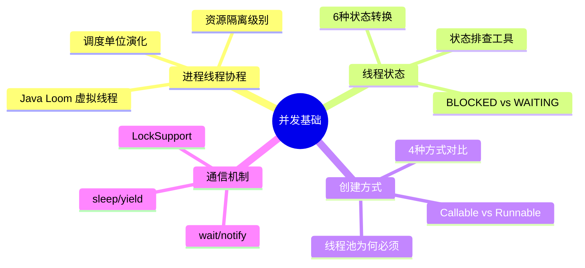

---

## 1. 进程 / 线程 / 协程

### 1.1 🔴 设计动机：为什么需要这三个层次？

> 🔴 **"为什么"链条**：
>
> **问题1**：早期计算机一次只能运行一个程序，CPU 利用率极低（等 IO 时 CPU 空转）
> → **解决**：引入 ==进程==，让多个程序"同时"运行
>
> **问题2**：进程切换太重（独立地址空间，切换需要 MMU 刷新 TLB），且进程间通信复杂
> → **解决**：引入 ==线程==，共享进程内存，切换只保存寄存器+栈指针
>
> **问题3**：线程仍是 OS 级别调度（1:1 模型），创建/切换仍有开销（~1-10μs），且受限于 OS 线程数（通常几千~几万）
> → **解决**：引入 ==协程/虚拟线程==，用户态调度，M:N 模型，百万级并发

### 1.2 🔴 三者对比（吃透版）

| 维度 | 进程 | 线程 | 协程/虚拟线程 |
|------|------|------|------|
| 资源 | 独立内存空间（4GB虚拟地址） | 共享进程内存，独立栈 | 共享线程栈，极小栈(~1KB) |
| 调度 | 操作系统内核调度 | 操作系统内核调度 | ==用户态自调度(JVM/Runtime)== |
| 切换开销 | 大(MMU TLB刷新, ~10μs) | 中(寄存器+栈切换, ~1-5μs) | ⭐ 极小(函数调用级, ~100ns) |
| 创建开销 | 大(fork ~10ms) | 中(clone ~100μs) | ⭐ 极小(对象分配, ~1μs) |
| 内存占用 | 独立地址空间 | 栈 1MB(Linux默认) | ⭐ 栈 ~1KB(动态增长) |
| 并发数 | 几百~几千 | 千~万 | ⭐ ==百万级== |
| 通信方式 | IPC(管道/socket/共享内存) | 共享变量+锁 | Channel/消息传递 |
| Java 实现 | ProcessBuilder/Runtime.exec | java.lang.Thread (1:1) | JDK 21 Virtual Thread |
| 故障隔离 | 强(进程崩不影响其他) | 弱(一个线程异常可能影响整个进程) | 弱(同线程) |

### 1.3 🟠 历史演化：Java 线程模型的发展

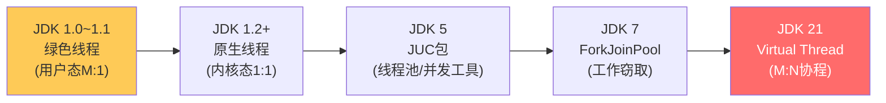

> 🟠 **关键转折**：
> - JDK 1.2 从绿色线程切到原生线程：因为绿色线程不能利用多核
> - JDK 21 又回到 M:N 模型：因为现代服务器需要处理百万并发连接，1:1 模型的线程数成为瓶颈


### 1.4 🟠 并发 vs 并行（深度理解）

> 🟠 **关键区别**：
> - **并发(Concurrency)**：同一时间段内多任务==交替==执行（单核也能并发，通过时间片切换）
> - **并行(Parallelism)**：同一时刻多任务==真的同时==执行（必须多核）
> - **并发是逻辑上的同时，并行是物理上的同时**

```
单核 CPU 并发:    ┌─A─┐┌─B─┐┌─A─┐┌─B─┐ (时间片轮转)
                  时间 ───────────────────────────→

多核 CPU 并行:    Core1: ┌───── A ─────┐
                  Core2: ┌───── B ─────┐
                         同一时刻都在执行
```

> 🟡 **面试加分**：Go 语言的名言 "Concurrency is not parallelism"。并发是程序结构（代码怎么组织），并行是执行模式（硬件怎么跑）。一个好的并发设计可以在单核上运行（交替），也可以在多核上并行。

### 1.5 🔴 为什么要用多线程（三大动因 + 反面论证）

> 🔴 **三大动因**：
> 1. ==充分利用多核==：现代 CPU 动辄 8~128 核，单线程只用了 1/N 的算力
> 2. ==减少响应时间==：异步化 IO 等待（HTTP请求、DB查询、文件读写）
> 3. ==解耦业务模块==：下单后异步发短信、写日志、推送消息

### 1.6 🟢 多线程一定快吗？——线上事故案例

> 🟢 **不一定！以下场景反而变慢**：

**线上事故案例**：
> 某电商推荐系统，开发者将商品排序任务拆分为 64 个线程并行处理（CPU 只有 8 核）。
> - **现象**：接口 P99 从 50ms 飙升到 300ms，CPU 利用率反而从 60% 降到 40%
> - **根因**：64 个线程争抢 8 个核，频繁上下文切换（cs 从 3000/s 飙升到 80000/s），切换开销 > 计算时间
> - **修复**：线程数改为 `CPU核数 + 1 = 9`，P99 恢复到 30ms

**经验公式**：

| 任务类型 | 推荐线程数 | 公式 | 原因 |
|---------|-----------|------|------|
| CPU 密集 | ==CPU核数 + 1== | N + 1 | +1 是防止偶尔的缺页中断 |
| IO 密集 | ==CPU核数 × 2 ~ 核数/(1-阻塞系数)== | N × (1 + W/C) | W=等待时间, C=计算时间 |
| 混合型 | 拆分为 CPU 池 + IO 池 | 分别计算 | 避免互相影响 |

```java
// 动态计算线程池大小
int cpuCores = Runtime.getRuntime().availableProcessors();
// CPU密集型
int cpuPoolSize = cpuCores + 1;
// IO密集型（假设阻塞系数0.8，即80%时间在等IO）
int ioPoolSize = (int)(cpuCores / (1 - 0.8));  // = cpuCores * 5
```

---

## 2. 线程生命周期

### 2.1 🔴 设计动机：为什么需要 6 种状态？

> 🔴 **"为什么"链条**：
>
> 最简单的模型只需要"运行"和"结束"两种状态。但现实中：
> - 线程可能需要等锁 → 需要 ==BLOCKED== 状态
> - 线程可能主动等待条件 → 需要 ==WAITING== 状态（与BLOCKED区分，方便排查）
> - 等待可能有超时 → 需要 ==TIMED_WAITING== 状态
> - 线程创建后还没 start → 需要 ==NEW== 状态
> - 这些状态的区分让 ==jstack/jconsole 能精确定位问题==（死锁、活锁、阻塞）

### 2.2 🔴 6 大状态转换图（Java 视角）

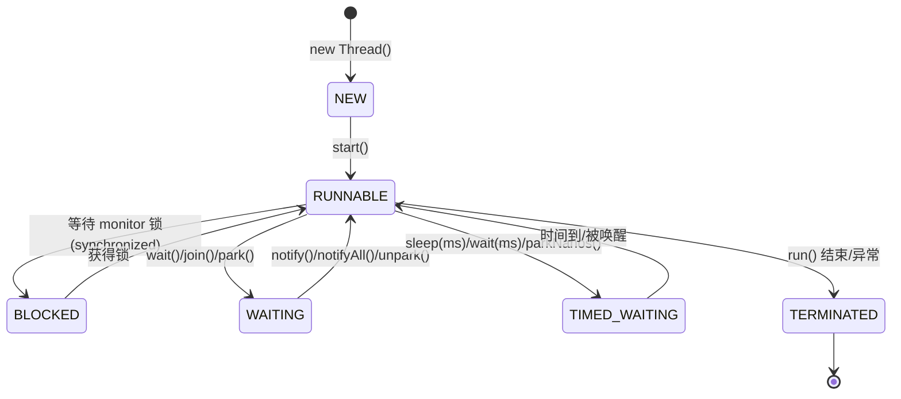

> 🔴 **核心 6 状态**（`Thread.State` 枚举）：
> - `NEW`：新建，还没调 start()
> - `RUNNABLE`：==包含 OS 的 ready 和 running 两个子状态==（Java 不区分）
> - `BLOCKED`：等待 synchronized 锁（被动，JVM 决定唤醒）
> - `WAITING`：无限等待信号（主动，需要 notify/unpark）
> - `TIMED_WAITING`：超时等待
> - `TERMINATED`：结束（正常或异常）


### 2.3 🟠 BLOCKED vs WAITING 深度辨析

> 🟠 **这是面试高频追问点**：

| 维度 | BLOCKED | WAITING |
|------|---------|---------|
| 触发方式 | **被动**：拿不到 synchronized 锁 | **主动**：调 wait()/park()/join() |
| 唤醒方式 | JVM 调度：前一个线程释放锁时自动唤醒 | 需要其他线程 notify/unpark |
| 出现场景 | synchronized 锁竞争 | 条件等待、线程协作 |
| jstack 显示 | `- waiting to lock <0x...>` | `- waiting on <0x...>` |
| 排查含义 | 锁竞争激烈 | 可能有设计问题/死锁 |

```java
// BLOCKED 案例：线程 B 等待线程 A 释放 synchronized 锁
synchronized(lock) {
    // 线程 A 持有锁，线程 B 此时 BLOCKED
    Thread.sleep(10000);
}

// WAITING 案例：线程主动等待条件
synchronized(lock) {
    lock.wait();  // 线程主动进入 WAITING，释放锁
}

// WAITING 案例2：LockSupport
LockSupport.park();  // WAITING，不需要在同步块内
```

### 2.4 🟢 状态排查实战——线上事故案例

**事故描述**：某支付系统接口超时率突增到 30%
- **排查**：`jstack` 发现 200+ 线程处于 BLOCKED 状态，都在等同一把锁
- **根因**：一个 synchronized 方法内调用了第三方 HTTP 接口（响应变慢从 50ms → 5s）
- **修复**：将 HTTP 调用移出 synchronized 块，缩小锁粒度

```bash
# 排查命令
jstack <pid> | grep -A 3 "BLOCKED"
# 输出示例：
# "http-nio-8080-exec-15" #67 daemon prio=5 BLOCKED
#   - waiting to lock <0x00000007165f0d08> (a com.xxx.PayService)
#   - locked by "http-nio-8080-exec-3" #53
```

---

## 3. 创建线程的 4 种方式

### 3.1 🔴 设计动机：为什么有 4 种方式？

> 🔴 **演化过程**：
> - JDK 1.0：只有 `Thread` 类 → 但 Java 单继承，继承了 Thread 就不能继承其他类
> - JDK 1.0+：引入 `Runnable` 接口 → 解决单继承问题，但没有返回值
> - JDK 5：引入 `Callable + Future` → 需要返回值的异步任务
> - JDK 5：引入线程池 → 复用线程，避免频繁创建/销毁的开销

### 3.2 🔴 速记对比表

| 方式 | 写法 | 返回值 | 异常 | 推荐度 | 适用 |
|------|------|--------|------|--------|------|
| 继承 Thread | `class T extends Thread` | 无 | 不能抛checked | ⭐ | 教学/简单demo |
| 实现 Runnable | `new Thread(() -> {})` | 无 | 不能抛checked | ⭐⭐⭐ | 简单异步任务 |
| Callable + FutureTask | `new FutureTask<>(callable)` | ⭐ 有 | 可以抛checked | ⭐⭐⭐⭐ | 需要返回值 |
| **线程池** ⭐ | `executor.submit(task)` | Future | 可以抛checked | ⭐⭐⭐⭐⭐ | **生产必须** |

### 3.3 🔴 Runnable vs Callable 源码对比

```java
// Runnable - 无返回值，不能抛检查异常
@FunctionalInterface
public interface Runnable {
    void run();
}

// Callable - 有返回值，可以抛检查异常
@FunctionalInterface
public interface Callable<V> {
    V call() throws Exception;
}
```

> 🟠 **为什么 Runnable 不能抛异常？**
> 因为 `Thread.run()` 是 `void run()`，没有声明 throws。如果 Runnable.run() 声明了 throws，
> 那编译器要求 Thread.run() 也声明——这会改变 Thread 类的签名，破坏向后兼容。
> Callable 是 JDK 5 新增的，设计时就考虑了返回值和异常。

### 3.4 🟢 避坑：生产环境禁止直接 new Thread()

> 🟢 **线上事故案例**：
> 某日志采集系统，每收到一条日志就 `new Thread(() -> processLog(log)).start()`
> - **现象**：高峰期 QPS 10万，JVM 创建了 10 万个线程，内存耗尽 OOM
> - **根因**：每个线程默认栈 1MB，10万线程 = 100GB 栈内存
> - **修复**：改用固定大小线程池 `new ThreadPoolExecutor(16, 32, ...)`
>
> **记住**：`new Thread()` 在生产中等于**裸奔**——无法限制数量、无法复用、无法监控。

---


## 4. wait / notify / sleep / yield 大对比

### 4.1 🔴 设计动机：为什么需要这么多等待/唤醒机制？

> 🔴 **"为什么"链条**：
> - `sleep`：让当前线程暂停一段时间，不涉及锁（简单延时）
> - `wait/notify`：线程间协作，==必须释放锁==让其他线程有机会工作
> - `yield`：提示 OS 可以切换（但不保证），用于自旋优化
> - `LockSupport.park/unpark`：更精细的等待/唤醒，不需要在同步块内，且 unpark 可以先于 park 调用

### 4.2 🔴 必背对照表

| 方法 | 所属类 | 释放锁 | 唤醒方式 | 需要同步块 | 用途 |
|------|--------|--------|---------|-----------|------|
| `wait()` | **Object** | ✅ ==释放== | notify/notifyAll | ✅ 必须 | 在同步块内等待条件 |
| `notify()` | Object | ❌ 不释放(出同步块才释) | - | ✅ 必须 | 唤醒**一个**等待线程 |
| `notifyAll()` | Object | ❌ 不释放 | - | ✅ 必须 | 唤醒**所有**等待线程 |
| `sleep(ms)` | **Thread** | ❌ ==不释放== | 时间到 | ❌ | 让出 CPU 但持有锁 |
| `yield()` | Thread | ❌ 不释放 | OS 调度 | ❌ | 提示让出 CPU(不保证) |
| `join()` | Thread | ❌ 不释放 | 目标线程结束 | ❌ | 等另一个线程结束 |
| `LockSupport.park()` | LockSupport | ❌ | unpark() | ❌ | 更灵活的等待/唤醒 |

> 🔴 **背诵口诀**：`wait 释锁、sleep 不释、wait 在 Object、sleep 在 Thread`

### 4.3 🔴 wait/notify 为什么必须在同步块内？（源码级理解）

> 🔴 **根本原因**：防止 ==lost wake-up（丢失唤醒）== 问题

**如果不要求同步块会怎样？**

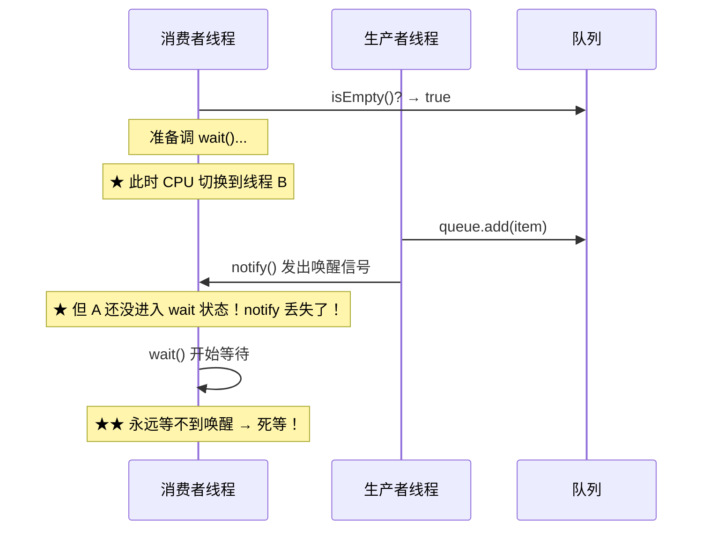

> 🟠 **synchronized 保证了 check-then-wait 的原子性**：在同步块内，检查条件和调用 wait 之间不会被其他线程打断。

```java
// ✅ 正确姿势
synchronized (lock) {
    while (!condition) {       // ★ 一定要 while 不要 if
        lock.wait();           // 在同步块内：check → wait 原子
    }
    // 条件满足，执行业务
}

synchronized (lock) {
    condition = true;
    lock.notifyAll();          // 在同步块内通知
}
```

### 4.4 🔴 为什么 wait 要用 while 不用 if？（虚假唤醒）

> 🔴 **两个原因**：
> 1. ==虚假唤醒(spurious wakeup)==：OS/JVM 可能在没有 notify 的情况下唤醒 wait 的线程（POSIX 规范允许）
> 2. ==多消费者竞争==：notifyAll 唤醒所有线程，但条件可能只对一个成立，其他线程醒来后条件又不满足了

```java
// ❌ 错误：用 if
synchronized (lock) {
    if (queue.isEmpty()) {
        lock.wait();           // 被虚假唤醒后直接往下走
    }
    item = queue.poll();       // ★ queue 可能仍然为空 → NPE!
}

// ✅ 正确：用 while
synchronized (lock) {
    while (queue.isEmpty()) {
        lock.wait();           // 被唤醒后重新检查条件
    }
    item = queue.poll();       // 确保 queue 非空
}
```

### 4.5 🟠 LockSupport.park/unpark vs wait/notify

> 🟠 **为什么引入 LockSupport？**
> wait/notify 有三大限制：
> 1. 必须在 synchronized 块内
> 2. notify 必须在 wait 之后（否则丢失唤醒）
> 3. notify 无法指定唤醒哪个线程
>
> LockSupport 解决了所有问题：

| 维度 | wait/notify | LockSupport.park/unpark |
|------|-------------|------------------------|
| 需要同步块 | ✅ 必须 | ❌ 不需要 |
| 调用顺序 | notify 必须在 wait 后 | ==unpark 可以先于 park==（permit机制） |
| 精确唤醒 | ❌ notify 随机一个 | ✅ unpark(指定线程) |
| 底层实现 | ObjectMonitor WaitSet | ==Permit（0/1信号量）== |

```java
// unpark 可以先于 park（不会丢失唤醒）
Thread t = new Thread(() -> {
    try { Thread.sleep(1000); } catch (Exception e) {}
    LockSupport.park();  // 因为已经有 permit，立即返回
});
t.start();
LockSupport.unpark(t);  // 先 unpark，设置 permit=1
```

### 4.6 🟡 经典生产者消费者（三种实现对比）

```java
// 实现1：wait/notify
public class WaitNotifyBuffer<T> {
    private final Queue<T> queue = new LinkedList<>();
    private final int capacity;

    public synchronized void put(T item) throws InterruptedException {
        while (queue.size() == capacity) { wait(); }
        queue.offer(item);
        notifyAll();
    }

    public synchronized T take() throws InterruptedException {
        while (queue.isEmpty()) { wait(); }
        T item = queue.poll();
        notifyAll();
        return item;
    }
}

// 实现2：ReentrantLock + Condition（精确唤醒）
public class ConditionBuffer<T> {
    private final Queue<T> queue = new LinkedList<>();
    private final int capacity;
    private final ReentrantLock lock = new ReentrantLock();
    private final Condition notFull = lock.newCondition();
    private final Condition notEmpty = lock.newCondition();

    public void put(T item) throws InterruptedException {
        lock.lock();
        try {
            while (queue.size() == capacity) { notFull.await(); }
            queue.offer(item);
            notEmpty.signal();  // ★ 精确唤醒消费者
        } finally { lock.unlock(); }
    }

    public T take() throws InterruptedException {
        lock.lock();
        try {
            while (queue.isEmpty()) { notEmpty.await(); }
            T item = queue.poll();
            notFull.signal();  // ★ 精确唤醒生产者
            return item;
        } finally { lock.unlock(); }
    }
}

// 实现3：BlockingQueue（生产首选，最简洁）
BlockingQueue<T> queue = new ArrayBlockingQueue<>(capacity);
queue.put(item);   // 满了自动阻塞
queue.take();      // 空了自动阻塞
```

---


# 第二部分 · JMM 与可见性

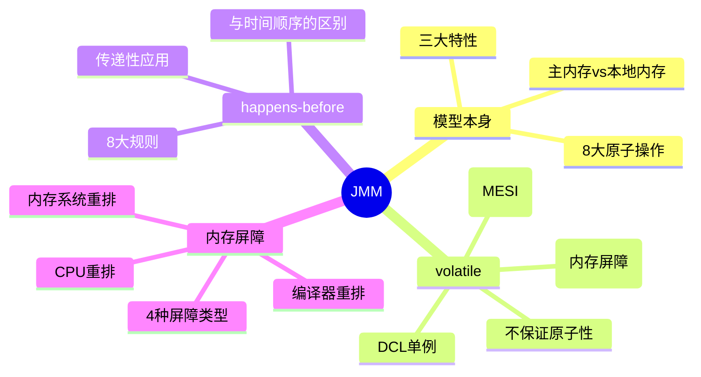

---

## 5. JMM 模型

### 5.1 🔴 设计动机：为什么需要 JMM？

> 🔴 **"为什么"链条**：
>
> **问题**：不同 CPU 架构的内存模型不同（x86 是强一致模型，ARM/RISC-V 是弱一致模型）。如果 Java 直接暴露硬件差异，同样的 Java 代码在不同 CPU 上行为不同 → 违背"Write Once, Run Anywhere"。
>
> **解决**：JMM（Java Memory Model，JSR-133）定义了一个**抽象的内存模型**，屏蔽硬件差异，让程序员只需要关心 happens-before 规则。
>
> **本质**：JMM 是 ==Java 程序员和 JVM/硬件之间的契约==——你遵守规则（用 volatile/synchronized），我保证可见性和有序性。

### 5.2 🔴 一图看懂 JMM

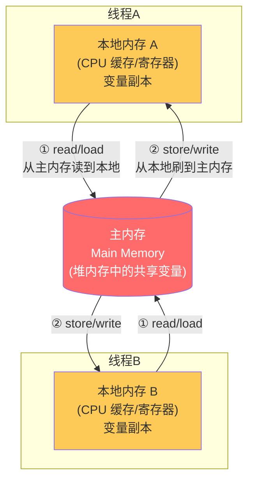

> 🔴 **核心概念**：
> - **主内存**：所有共享变量（实例字段、静态字段、数组元素）的"规范存储位置"
> - **本地内存（工作内存）**：每个线程的私有副本，对应 ==CPU L1/L2 缓存 + 写缓冲区 + 寄存器==
> - 线程不能直接操作主内存，必须先加载到本地内存，修改后再刷回

### 5.3 🔴 JMM 8 大原子操作

| 操作 | 作用域 | 含义 |
|------|--------|------|
| `lock` | 主内存 | 标识变量为线程独占 |
| `unlock` | 主内存 | 释放独占标识 |
| `read` | 主内存 | 把变量值从主内存读到传输通道 |
| `load` | 工作内存 | 把 read 的值放入工作内存副本 |
| `use` | 工作内存 | 把工作内存的值传给执行引擎 |
| `assign` | 工作内存 | 把执行引擎的结果写入工作内存 |
| `store` | 工作内存 | 把工作内存的值传到主内存传输通道 |
| `write` | 主内存 | 把 store 的值写入主内存变量 |

### 5.4 🔴 三大特性 + 解决方案（带源码证明）

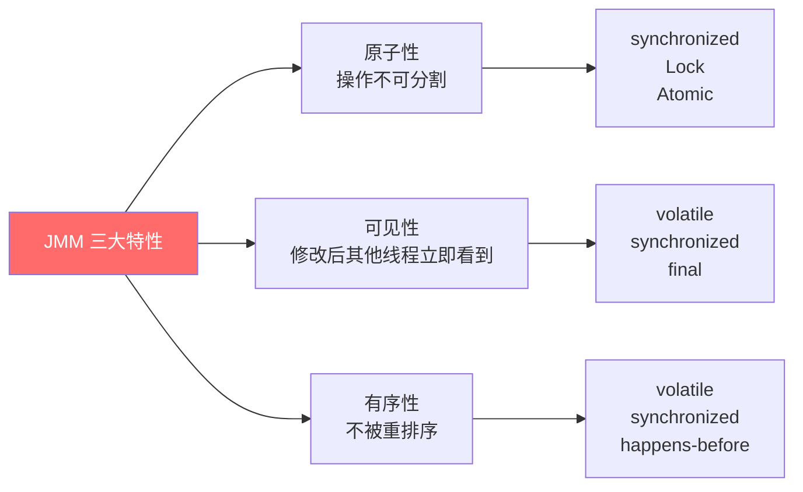

#### 原子性被破坏的证明

```java
// i++ 不是原子操作（反汇编证明）
private int count = 0;
public void inc() { count++; }

// javap -c 反编译结果：
// getfield      #2  // 读 count
// iconst_1
// iadd                // +1
// putfield      #2  // 写回 count
// ↑ 4条指令，线程可以在任意两条之间被切换！
```

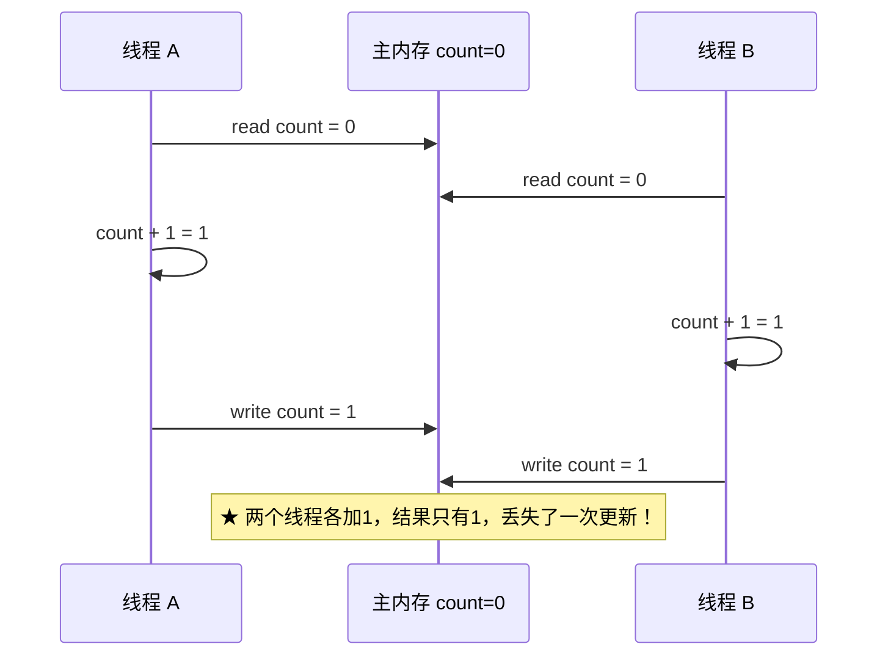

#### 可见性被破坏的证明

```java
// 经典可见性问题
class VisibilityDemo {
    private boolean flag = true;  // ❌ 没用 volatile

    public void writer() { flag = false; }

    public void reader() {
        while (flag) { }  // ★ 可能永远循环！
        System.out.println("看到 flag 变化了");
    }
}
// 原因：reader 线程的 CPU 缓存中 flag 始终是 true
// JIT 可能把 while(flag) 优化为 while(true)（因为没有 volatile/synchronized 保证可见性）
```

---

## 6. volatile 原理

### 6.1 🔴 设计动机：volatile 解决什么问题？

> 🔴 **问题**：CPU 缓存导致线程间变量不可见；编译器/CPU 重排序导致多线程下执行顺序不可预测。
> **解决**：volatile 提供两个语义：
> 1. ✅ ==保证可见性==（写后立即刷主内存，读时从主内存重新加载）
> 2. ✅ ==禁止指令重排序==（在 volatile 读写前后插入内存屏障）
> 3. ❌ ==不保证原子性==！（`volatile int i; i++` 仍线程不安全）

### 6.2 🔴 volatile 可见性的底层实现（从 Java 到汇编）

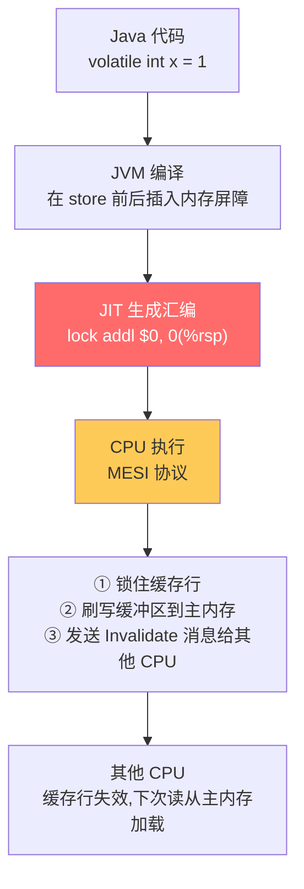

> 🔴 **关键**：`lock` 前缀汇编指令的三个作用：
> 1. **锁住缓存行**（早期 CPU 锁总线，现代 CPU 用 MESI 协议锁缓存行）
> 2. **把当前 CPU 的写缓冲区强制刷到主内存**
> 3. **通过总线嗅探（Bus Snooping）让其他 CPU 的该缓存行失效**

### 6.3 🟠 MESI 协议简述

| 状态 | 含义 | 描述 |
|------|------|------|
| **M**(Modified) | 已修改 | 只在当前 CPU 缓存中，且已修改，与主内存不一致 |
| **E**(Exclusive) | 独占 | 只在当前 CPU 缓存中，与主内存一致 |
| **S**(Shared) | 共享 | 在多个 CPU 缓存中，与主内存一致 |
| **I**(Invalid) | 无效 | 缓存行已失效，需要重新从主内存加载 |

> 🟠 **volatile 写**：当前 CPU 将缓存行状态改为 M → 发送 Invalidate 给其他 CPU → 其他 CPU 将该行标记为 I
> **volatile 读**：发现缓存行是 I → 从主内存重新加载（Cache Miss）

### 6.4 🔴 4 种内存屏障

| 屏障 | 插入位置 | 作用 |
|------|----------|------|
| `StoreStore` | volatile **写之前** | 确保普通写在 volatile 写之前完成 |
| `StoreLoad` ⭐最重 | volatile **写之后** | 确保 volatile 写对后续所有读可见 |
| `LoadLoad` | volatile **读之后** | 确保 volatile 读在后续普通读之前完成 |
| `LoadStore` | volatile **读之后** | 确保 volatile 读在后续普通写之前完成 |

```
volatile 写的屏障插入策略：
    [普通写]
    [StoreStore屏障]  ← 禁止上面的普通写与下面的volatile写重排
    [volatile 写]
    [StoreLoad屏障]   ← 禁止volatile写与后面的volatile读/写重排（最重）

volatile 读的屏障插入策略：
    [volatile 读]
    [LoadLoad屏障]    ← 禁止volatile读与后面的普通读重排
    [LoadStore屏障]   ← 禁止volatile读与后面的普通写重排
    [普通读/写]
```


### 6.5 🔴 双重检查锁定（DCL）单例——为什么必须 volatile

> 🔴 **这是面试必考题，必须讲清楚"为什么"**

```java
public class Singleton {
    private static volatile Singleton instance;  // ★ 必须 volatile

    private Singleton() {}

    public static Singleton getInstance() {
        if (instance == null) {                    // 第一次检查（无锁，快速路径）
            synchronized (Singleton.class) {
                if (instance == null) {            // 第二次检查（有锁）
                    instance = new Singleton();    // ⚠️ 关键：这不是原子操作！
                }
            }
        }
        return instance;
    }
}
```

> 🔴 **为什么要 volatile？** `instance = new Singleton()` 的字节码拆解：

```
1. memory = allocate()        // 分配内存空间
2. ctorInstance(memory)       // 调用构造函数初始化对象
3. instance = memory          // 把内存地址赋给 instance 引用
```

**没有 volatile 时，JVM/CPU 可能重排为 1→3→2**：

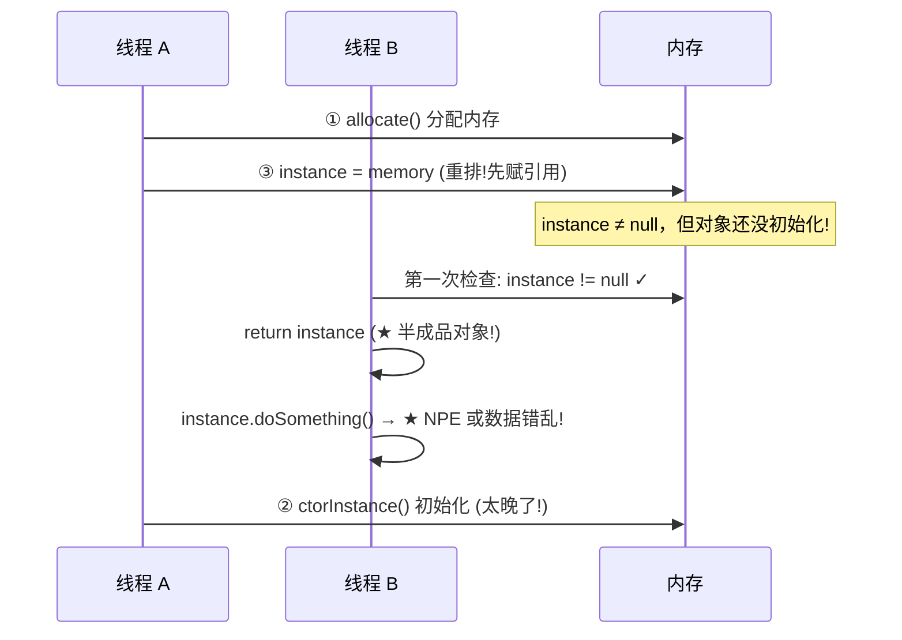

> 🔴 **volatile 如何修复**：volatile 写时插入 StoreStore 屏障，确保构造函数（步骤2）在赋值（步骤3）之前完成。即禁止步骤2和步骤3的重排序。

### 6.6 🟢 volatile 不保证原子性——灾难场景

```java
// ❌ 即使加了 volatile，i++ 仍然不安全
private volatile int count = 0;

public void inc() {
    count++;  // 仍是 read → modify → write 三步
}
```

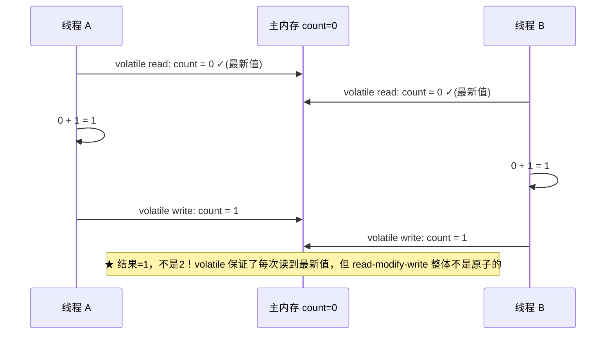

### 6.7 🔴 volatile 适用场景决策树

```mermaid
flowchart TD
    A["需要线程安全？"] -->|是| B["是否是单纯的读/写？<br/>(不是 read-modify-write)"]
    B -->|是| C["多线程写？"]
    C -->|只有一个线程写| D["✅ 用 volatile"]
    C -->|多线程写| E["❌ volatile 不够<br/>用 Atomic 或 synchronized"]
    B -->|否(如 i++, check-then-act)| E
    A -->|否| F["不需要 volatile"]

    style D fill:#48dbfb
    style E fill:#ff6b6b,color:#fff
```

**适用场景总结**：
1. ==状态标志位==（boolean flag，一写多读）
2. ==单次安全发布==（DCL 单例）
3. ==独立观察==（多个独立的 volatile 变量，每个只有一个写者）
4. ==volatile bean 模式==（不可变对象的引用切换）

---

## 7. happens-before 原则

### 7.1 🔴 设计动机：为什么需要 happens-before？

> 🔴 **"为什么"链条**：
>
> **问题**：JMM 为了性能，允许编译器和 CPU 重排序指令。但如果完全不限制重排序，多线程程序的行为将不可预测。
>
> **解决**：happens-before 规则定义了"哪些操作的结果对哪些操作可见"。只要满足 happens-before 关系，程序员就不需要关心底层是否发生了重排序。
>
> **核心理解**：happens-before **不是说时间上先发生**，而是 =="前面操作的结果对后面操作可见"==。JVM 保证了这个可见性，但具体执行顺序可能被重排（只要结果一样）。

### 7.2 🔴 8 大规则（必背 + 每条带例子）

| # | 规则名 | 含义 | 实际例子 |
|---|--------|------|---------|
| 1 | **程序顺序规则** | 同一线程内，前面的操作 hb 后面的 | `int a=1; int b=a+1;` a 的赋值 hb b |
| 2 | **监视器锁规则** | unlock hb 后续对同一锁的 lock | synchronized 块内的修改对下一个进入者可见 |
| 3 | **volatile 规则** | volatile 写 hb 后续对该变量的 volatile 读 | 写 volatile 后，任何线程读到新值 |
| 4 | **传递性** | A hb B，B hb C → A hb C | 最强大的规则，可以组合推导 |
| 5 | **start 规则** | `t.start()` hb 线程 t 内的所有操作 | start 前的赋值对新线程可见 |
| 6 | **join 规则** | 线程 t 内的所有操作 hb 从 `t.join()` 返回 | join 后能看到子线程的所有修改 |
| 7 | **interrupt 规则** | `t.interrupt()` hb 线程 t 检测到中断 | interrupt 前的修改对被中断线程可见 |
| 8 | **finalize 规则** | 对象构造完成 hb finalize() | 构造器中的赋值在 finalize 时可见 |

### 7.3 🔴 传递性的威力——经典应用

```java
class DataPublisher {
    int data;                    // 普通变量
    volatile boolean ready;      // ★ volatile 标志

    // 线程 A
    void publish() {
        data = 42;               // 操作1：普通写
        ready = true;            // 操作2：volatile 写
    }

    // 线程 B
    void consume() {
        if (ready) {             // 操作3：volatile 读
            int result = data;   // 操作4：普通读
            assert result == 42; // ✅ 必然成立！
        }
    }
}
```

**推导过程**：
```
程序顺序规则：操作1 hb 操作2（同一线程内，1在2前面）
volatile规则：操作2 hb 操作3（volatile写 hb 后续的volatile读）
程序顺序规则：操作3 hb 操作4（同一线程内，3在4前面）
传递性：操作1 hb 操作4 ✅（1 hb 2 hb 3 hb 4）

结论：data=42 的赋值结果对操作4可见，所以 result == 42 必然成立
```

> 🟠 **面试加分**：这就是"利用 volatile 的 happens-before 语义来保护非 volatile 变量"的技巧。只需要一个 volatile 标志位，就能确保它之前所有写入对读取线程可见。

### 7.4 🟢 不满足 happens-before 的灾难

```java
// ❌ 没有任何 happens-before 保护
class Unsafe {
    int a = 0;
    boolean flag = false;  // 非 volatile！

    void writer() {
        a = 1;          // 操作1
        flag = true;    // 操作2
    }
    void reader() {
        if (flag) {     // 操作3
            int r = a;  // 操作4：可能读到 0！
        }
    }
}
```

> 🟢 **为什么读到 0？**
> - 操作1 和操作2 没有数据依赖 → 编译器/CPU 可能重排为 2→1
> - 即使不重排，flag 的写入可能先被 reader 看到，但 a 的写入还在 writer 的写缓冲区中未刷出

---

## 8. 内存屏障与重排序

### 8.1 🟠 三种重排序来源

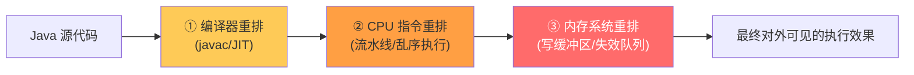

| 重排层次 | 原因 | 例子 |
|---------|------|------|
| 编译器重排 | JIT 优化：减少寄存器溢出、指令调度 | 循环中的变量提升 |
| CPU 重排 | 乱序执行(OoO)：让流水线不停顿 | store 被延迟到 load 后面 |
| 内存系统重排 | 写缓冲区(Store Buffer)未刷出 | 其他 CPU 还没看到写入 |

> 🟠 **关键理解**：所有重排都是为了**性能优化**。Java 通过 ==as-if-serial== 保证单线程内结果不变，但多线程下需要 happens-before/volatile/synchronized 来禁止有害的重排。

### 8.2 🟡 x86 vs ARM 的重排差异

| 重排类型 | x86/AMD64 | ARM/RISC-V |
|---------|-----------|-----------|
| Load-Load | ❌ 不允许 | ✅ 允许 |
| Load-Store | ❌ 不允许 | ✅ 允许 |
| Store-Store | ❌ 不允许 | ✅ 允许 |
| Store-Load | ✅ ==允许!== | ✅ 允许 |

> 🟡 **面试加分**：x86 是强内存模型（TSO），只允许 Store-Load 重排。所以很多并发 bug 在 x86 上不复现，但在 ARM 上爆发（如 Mac M1 测试通过，ARM 服务器上出问题）。这也是为什么 JMM 要插入保守的内存屏障——要在最弱的硬件上也正确。

---


# 第三部分 · 锁机制

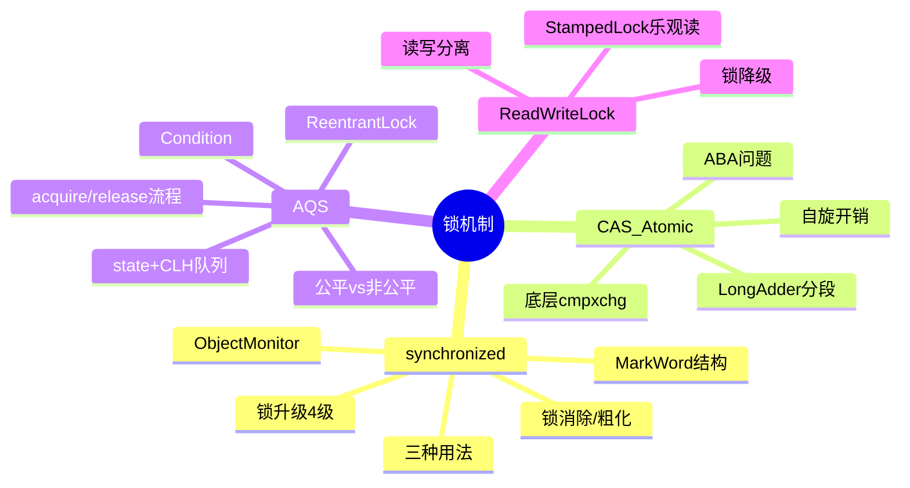

---

## 9. synchronized 实现原理

### 9.1 🔴 设计动机：synchronized 解决什么问题？为什么是语言级关键字？

> 🔴 **"为什么"链条**：
>
> **问题**：多线程访问共享变量需要互斥，手动实现锁容易出错（忘记释放、异常路径未释放）
>
> **解决**：Java 将互斥锁内置为语言关键字 `synchronized`：
> - 语法简洁：不需要 try-finally
> - JVM 保证释放：即使抛异常也会自动释放锁（通过 monitorexit 异常表）
> - JVM 可以做运行时优化：锁升级、锁消除、锁粗化
>
> **代价**：灵活性不够（不支持公平锁、超时获取、可中断），所以后来有了 ReentrantLock。

### 9.2 🔴 三种使用方式（锁对象辨析）

| 用法 | 锁对象 | 例子 | 注意 |
|------|--------|------|------|
| 修饰**实例方法** | ==this 当前实例== | `synchronized void m()` | 不同实例之间不互斥 |
| 修饰**静态方法** | ==Class 对象== | `static synchronized void m()` | 全局唯一，所有实例互斥 |
| 修饰**代码块** | 指定对象 | `synchronized(lock) { }` | 最灵活，锁粒度可控 |

> 🟢 **避坑**：静态方法和实例方法的锁是**不同的两个锁**！

```java
class Demo {
    synchronized void instanceMethod() {}       // 锁 this
    static synchronized void staticMethod() {}  // 锁 Demo.class
}

// 线程A调 instanceMethod，线程B调 staticMethod → 不互斥！因为锁不同
```

### 9.3 🔴 锁升级路径（JDK 6+ 优化，完整源码级理解）

> 🔴 **设计动机**：JDK 6 之前 synchronized 直接用 ObjectMonitor（重量级锁，需要 OS 线程阻塞/唤醒，用户态↔内核态切换约 10μs）。但 ==统计发现大部分锁从头到尾只有一个线程持有==，直接上重量级锁是浪费。
>
> **解决**：引入锁升级，按竞争程度逐步升级，绝大多数场景停在偏向锁/轻量级锁就够了。


| 锁状态 | MarkWord 标志 | 触发条件 | 获取方式 | 性能 |
|--------|---------------|---------|---------|------|
| **无锁** | 01 (偏向位0) | 初始状态 | - | - |
| **偏向锁** | 01 (偏向位1) | 第一个线程进入 | 直接CAS记线程ID | ⭐⭐⭐⭐⭐ 几乎零开销 |
| **轻量级锁** | 00 | 有其他线程竞争 | CAS 自旋(不阻塞) | ⭐⭐⭐⭐ 短暂自旋 |
| **重量级锁** | 10 | 自旋失败/竞争激烈 | OS 阻塞/唤醒 | ⭐⭐ 有内核切换开销 |

### 9.4 🔴 对象头 MarkWord 详解（64 位 JVM）

```
┌─────────────────────────────────────────────────────────────────┐
│                         64-bit MarkWord                          │
├─────────────────────────────────────────────────────────────────┤
│ 无锁:                                                           │
│ ┌─unused(25)─┬─hashcode(31)─┬─unused(1)─┬─age(4)─┬─biased(1)─┬─lock(2)─┐│
│ │            │  identity_hash │           │  GC年龄 │    0      │   01    ││
│ └────────────┴───────────────┴───────────┴─────────┴───────────┴─────────┘│
│                                                                  │
│ 偏向锁:                                                          │
│ ┌─────thread_id(54)─────┬─epoch(2)─┬─unused(1)─┬─age(4)─┬─biased(1)─┬─lock(2)─┐│
│ │    偏向的线程ID        │  偏向时间戳 │           │  GC年龄 │    1      │   01    ││
│ └───────────────────────┴──────────┴───────────┴─────────┴───────────┴─────────┘│
│                                                                  │
│ 轻量级锁:                                                        │
│ ┌────────────────ptr_to_lock_record(62)────────────────┬─lock(2)─┐│
│ │         指向线程栈帧中 Lock Record 的指针              │   00    ││
│ └──────────────────────────────────────────────────────┴─────────┘│
│                                                                  │
│ 重量级锁:                                                        │
│ ┌────────────ptr_to_heavyweight_monitor(62)────────────┬─lock(2)─┐│
│ │         指向 ObjectMonitor 对象的指针                  │   10    ││
│ └──────────────────────────────────────────────────────┴─────────┘│
└─────────────────────────────────────────────────────────────────┘
```

### 9.5 🔴 偏向锁的获取与撤销

> 🔴 **偏向锁流程**：

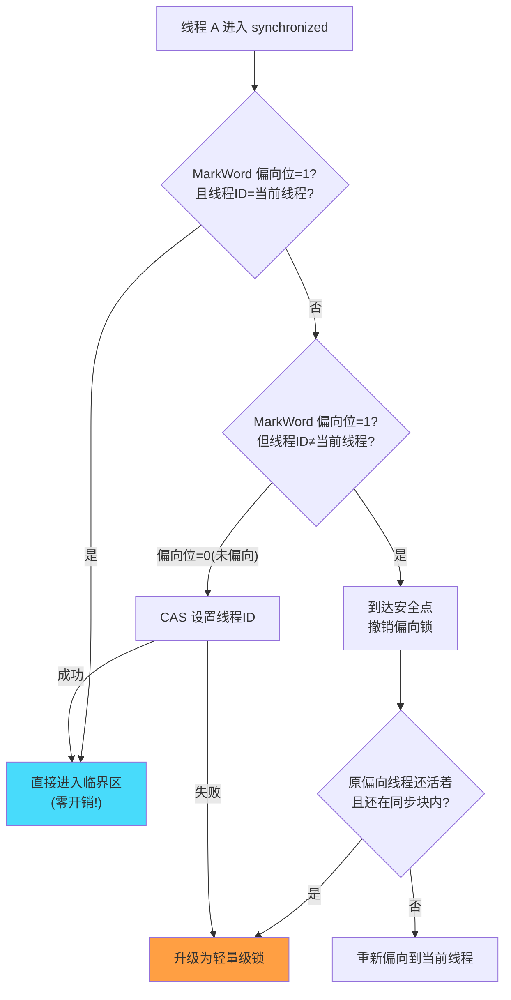

> 🟢 **JDK 15 默认关闭偏向锁**：`-XX:-UseBiasedLocking`（JDK 15+默认），因为现代应用并发度高，偏向锁的撤销开销（需要到安全点STW）反而成为负担。

### 9.6 🔴 monitorenter / monitorexit 字节码

```java
public void sync() {
    synchronized (this) {
        // 临界区
    }
}

// javap -c 编译后：
//  0: aload_0
//  1: dup
//  2: astore_1
//  3: monitorenter        ← 加锁
//  4: ... (临界区代码)
//  8: aload_1
//  9: monitorexit         ← 正常退出释放锁
// 10: goto 18
// 13: astore_2            ← 异常处理开始
// 14: aload_1
// 15: monitorexit         ← ★ 异常也释放锁！(异常表保证)
// 16: aload_2
// 17: athrow
// 18: return
```

> 🟠 **关键点**：编译器会生成 ==两个 monitorexit==：一个正常退出，一个异常退出。通过异常表（Exception Table）确保无论如何锁都会释放。这就是为什么 synchronized 不会忘记解锁。

### 9.7 🔴 ObjectMonitor 结构（HotSpot 源码）

```c
// hotspot/src/share/vm/runtime/objectMonitor.hpp
class ObjectMonitor {
    void *  volatile _owner;       // ★ 持有锁的线程
    volatile int _recursions;      // ★ 重入次数
    ObjectWaiter * volatile _cxq;  // 最近竞争失败进入的队列(LIFO)
    ObjectWaiter * volatile _EntryList; // 候选唤醒队列(FIFO)
    ObjectWaiter * volatile _WaitSet;  // wait() 进入的等待队列
    volatile int _count;           // 等待线程数
    // ...
};
```

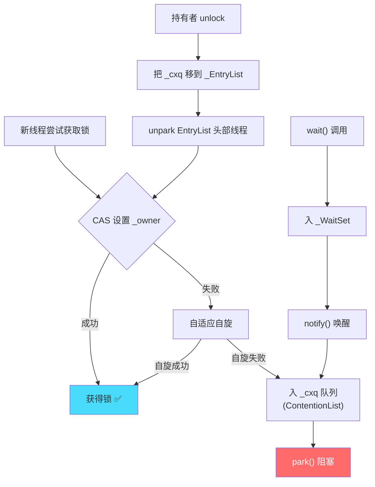

### 9.8 🟡 锁消除 / 锁粗化（JIT 编译器优化）

> 🟡 **锁消除**：JIT 通过 ==逃逸分析== 发现锁对象不会被其他线程访问 → 直接去掉 synchronized

```java
// 锁消除案例
public String concat(String s1, String s2) {
    // StringBuffer 是线程安全的（每个方法都 synchronized）
    // 但 sb 是局部变量，不会逃逸到其他线程
    StringBuffer sb = new StringBuffer();
    sb.append(s1);   // JIT 会去掉这里的 synchronized
    sb.append(s2);   // JIT 会去掉这里的 synchronized
    return sb.toString();
}
```

> 🟡 **锁粗化**：循环内反复加锁/解锁 → JIT 提到循环外只加一次

```java
// 锁粗化前
for (int i = 0; i < 1000; i++) {
    synchronized (lock) { list.add(i); }  // 1000 次加锁/解锁
}
// JIT 粗化后（等效）
synchronized (lock) {
    for (int i = 0; i < 1000; i++) { list.add(i); }  // 只加锁1次
}
```

---

## 10. CAS 与 Atomic

### 10.1 🔴 设计动机：为什么需要 CAS？

> 🔴 **"为什么"链条**：
>
> **问题**：synchronized 即使升级后仍有一定开销（轻量级锁要 CAS 修改 MarkWord，重量级锁要阻塞）。对于简单的计数器（i++），锁显得太重了。
>
> **解决**：用 CPU 提供的原子指令（CAS）实现**无锁(Lock-Free)**算法——不需要阻塞线程，失败了就重试。
>
> **本质**：CAS 是一种 ==乐观锁== 思想——先假设没有冲突直接操作，发现冲突了再重试。而 synchronized 是 ==悲观锁==——先假设会冲突所以先加锁。

### 10.2 🔴 CAS 三要素与底层实现

> 🔴 **CAS = Compare And Swap**：`(V, Expected, NewValue)` 三个参数

```
伪代码：
CAS(内存地址V, 期望值Expected, 新值NewValue):
    if (V 的当前值 == Expected) {
        V = NewValue;
        return true;   // 成功
    }
    return false;      // 失败，说明有人先改了
```

**从 Java 到 CPU 的调用链**：

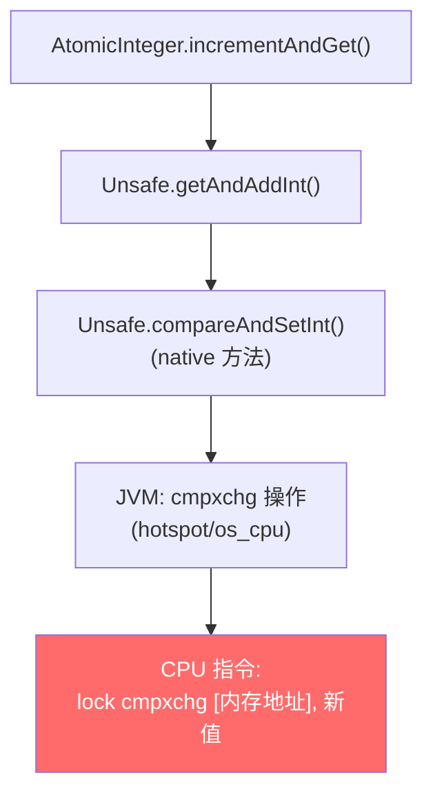

```java
// AtomicInteger 源码（JDK 11+）
public final int incrementAndGet() {
    return U.getAndAddInt(this, VALUE, 1) + 1;
}

// Unsafe.getAndAddInt
public final int getAndAddInt(Object o, long offset, int delta) {
    int v;
    do {
        v = getIntVolatile(o, offset);  // ① volatile 读当前值
    } while (!compareAndSetInt(o, offset, v, v + delta));  // ② CAS 尝试更新
    return v;  // 返回旧值
}
// 如果 CAS 失败（有人先改了），循环重试 → 自旋
```

> 🔴 **lock cmpxchg 的语义**：
> - `cmpxchg`：CPU 比较并交换指令
> - `lock` 前缀：锁住缓存行（保证多核环境下的原子性）
> - 整条指令在 CPU 层面是原子的，其他核不能同时修改同一缓存行


### 10.3 🔴 CAS 三大问题（深度分析）

| 问题 | 描述 | 影响 | 解决方案 |
|------|------|------|---------|
| ==**ABA 问题**== | 值从 A→B→A，CAS 看不出中间变化 | 链表操作可能导致数据丢失 | `AtomicStampedReference`(版本号) |
| ==**自旋开销**== | 高竞争下大量线程空转浪费 CPU | CPU 飙高，吞吐下降 | LongAdder 分段 / 改用锁 |
| ==**单变量限制**== | 只能保证一个变量的原子操作 | 多个字段的一致性无法保证 | `AtomicReference` 包装对象 |

#### ABA 问题深度解析

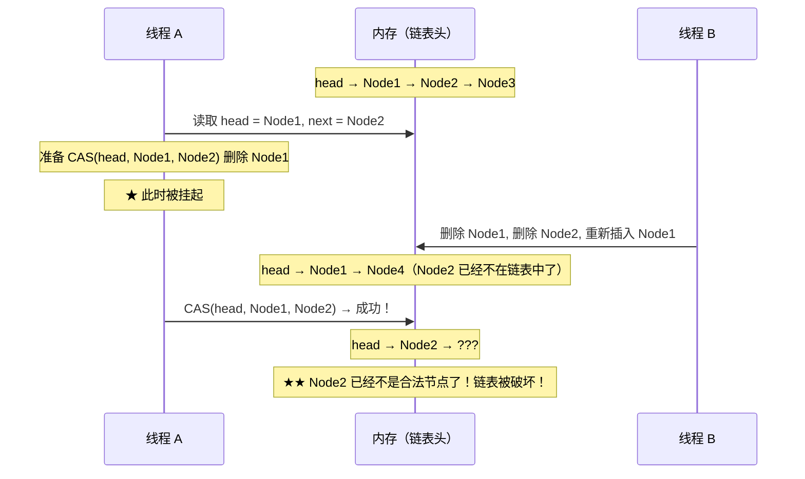

```java
// ABA 问题的修复：使用版本戳
AtomicStampedReference<Integer> ref = new AtomicStampedReference<>(100, 0);

// 获取当前值和版本
int[] stampHolder = new int[1];
Integer current = ref.get(stampHolder);  // current=100, stamp=0

// CAS 时同时校验版本号
boolean success = ref.compareAndSet(
    current,           // 期望值
    200,               // 新值
    stampHolder[0],    // 期望版本号
    stampHolder[0] + 1 // 新版本号
);
// 即使值变成 100→200→100，版本号 0→1→2，CAS 会检测到版本不匹配
```

### 10.4 🔴 LongAdder vs AtomicLong（高并发计数器选型）

> 🔴 **设计动机**：AtomicLong 在高竞争下性能急剧下降——所有线程 CAS 同一个变量，失败重试率极高。

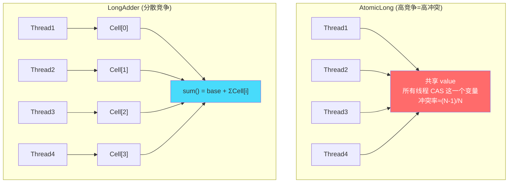

**LongAdder 源码核心思想**：

```java
// LongAdder.add() 核心逻辑（简化）
public void add(long x) {
    Cell[] as; long b;
    // ① 先尝试 CAS base（无竞争时直接成功）
    if ((as = cells) != null || !casBase(b = base, b + x)) {
        // ② CAS base 失败，说明有竞争，操作 Cell 数组
        boolean uncontended = true;
        if (as == null || as.length == 0 ||
            (a = as[getProbe() & (as.length - 1)]) == null ||  // 通过线程 probe 哈希到某个 Cell
            !(uncontended = a.cas(v = a.value, v + x))) {       // CAS Cell
            longAccumulate(x, null, uncontended);               // Cell 也竞争失败，扩容/rehash
        }
    }
}

// sum() 不是原子的！
public long sum() {
    long sum = base;
    for (Cell cell : cells) {
        if (cell != null) sum += cell.value;
    }
    return sum;  // 遍历期间其他线程可能在修改，所以不是精确值
}
```

**性能对比（JMH 基准测试）**：

| 场景 | AtomicLong ops/ms | LongAdder ops/ms | 差距 |
|------|-------------------|------------------|------|
| 1 线程 | 200,000 | 180,000 | 差不多 |
| 4 线程 | 80,000 | 350,000 | 4.4x |
| 16 线程 | 25,000 | 500,000 | ==20x== |
| 64 线程 | 10,000 | 600,000 | ==60x== |

> 🔴 **选型结论**：
> - 低竞争（1-4线程）：`AtomicLong` 就够（sum() 精确）
> - 高竞争计数器（QPS统计、PV统计）：==必须用 `LongAdder`==
> - 需要 get-and-set 语义：`AtomicLong`（LongAdder 没有 compareAndSet）

---

## 11. AQS 框架与 ReentrantLock

### 11.1 🔴 设计动机：为什么需要 AQS？

> 🔴 **"为什么"链条**：
>
> **问题**：JDK 5 需要实现一系列同步器（ReentrantLock、Semaphore、CountDownLatch、ReadWriteLock），它们都有共同的底层需求：
> - 管理同步状态（谁持有锁/许可证还剩几个/计数器当前值）
> - 管理等待线程队列（排队、阻塞、唤醒）
>
> **解决**：Doug Lea 设计了 AQS 作为 ==统一的同步器基础框架==，提供：
> - `volatile int state`：通用的同步状态字段
> - CLH 双向队列：管理等待线程
> - 模板方法模式：子类只需实现 tryAcquire/tryRelease

### 11.2 🔴 AQS 数据结构（源码级）

```java
public abstract class AbstractQueuedSynchronizer {
    // ★ 核心同步状态（不同子类有不同含义）
    private volatile int state;
    // ReentrantLock: 0=未锁定, >0=锁定(值=重入次数)
    // Semaphore: 可用许可数
    // CountDownLatch: 剩余计数

    // ★ CLH 队列的头尾指针
    private transient volatile Node head;
    private transient volatile Node tail;

    // 队列节点
    static final class Node {
        volatile int waitStatus;     // 节点状态
        volatile Node prev;          // 前驱
        volatile Node next;          // 后继
        volatile Thread thread;      // 等待的线程

        static final int CANCELLED =  1;  // 取消（超时/中断）
        static final int SIGNAL    = -1;  // 后继需要被唤醒
        static final int CONDITION = -2;  // 在 Condition 队列中
        static final int PROPAGATE = -3;  // 共享模式下传播唤醒
    }
}
```

```mermaid
flowchart LR
    HEAD["head<br/>(哨兵节点)<br/>ws=-1"] --> N1["Node1<br/>thread=T1<br/>ws=-1"]
    N1 --> N2["Node2<br/>thread=T2<br/>ws=-1"]
    N2 --> N3["Node3<br/>thread=T3<br/>ws=0"]
    N3 --- TAIL["tail"]

    N1 -.prev.-> HEAD
    N2 -.prev.-> N1
    N3 -.prev.-> N2

    style HEAD fill:#48dbfb
    style TAIL fill:#feca57
```


### 11.3 🔴 acquire 流程（获取锁，源码级）

```java
// AQS.acquire() - 独占模式获取
public final void acquire(int arg) {
    if (!tryAcquire(arg) &&                    // ① 子类实现：尝试获取
        acquireQueued(addWaiter(Node.EXCLUSIVE), arg))  // ② 失败则入队+阻塞
        selfInterrupt();                        // ③ 恢复中断标志
}
```

```mermaid
flowchart TD
    A["lock.lock()"] --> B["tryAcquire()<br/>CAS: state 0→1"]
    B -->|"成功"| Z["拿到锁 ✅<br/>setExclusiveOwnerThread(current)"]
    B -->|"失败"| C["addWaiter(EXCLUSIVE)<br/>CAS 入队尾"]
    C --> D["acquireQueued() 循环"]
    D --> E{"前驱是 head？"}
    E -->|"是"| F["再次 tryAcquire()"]
    F -->|"成功"| G["设为新 head<br/>旧 head.next=null 帮助 GC"]
    F -->|"失败"| H["shouldParkAfterFailedAcquire()<br/>将前驱 waitStatus 设为 SIGNAL"]
    E -->|"否"| H
    H --> I["LockSupport.park(this)<br/>★ 阻塞当前线程"]
    I -.->|"被 unpark 唤醒"| E

    style B fill:#ff6b6b,color:#fff
    style I fill:#feca57
    style Z fill:#48dbfb
```

> 🟠 **关键细节**：
> 1. 只有前驱是 head 时才尝试获取锁（CLH 队列的公平性保证）
> 2. park 前必须确保前驱的 waitStatus=SIGNAL（表示前驱释放时会唤醒我）
> 3. 被唤醒后不是直接获得锁，而是重新 tryAcquire（可能被插队，非公平锁）

### 11.4 🔴 release 流程（释放锁）

```java
// AQS.release()
public final boolean release(int arg) {
    if (tryRelease(arg)) {          // ① state-1，如果==0则真正释放
        Node h = head;
        if (h != null && h.waitStatus != 0)
            unparkSuccessor(h);     // ② 唤醒后继节点
        return true;
    }
    return false;
}
```

```mermaid
flowchart TD
    A["lock.unlock()"] --> B["tryRelease()<br/>state - 1"]
    B --> C{"state == 0?"}
    C -->|"是"| D["setExclusiveOwnerThread(null)<br/>真正释放"]
    D --> E["unparkSuccessor(head)<br/>唤醒 head 后继"]
    C -->|"否"| F["重入未完全释放<br/>等待下一次 unlock"]
    E --> G["后继线程被唤醒<br/>从 park 处恢复"]
    G --> H["重新进入 acquireQueued 循环<br/>tryAcquire 获取锁"]

    style D fill:#48dbfb
```

### 11.5 🔴 ReentrantLock 公平 vs 非公平（源码对比）

```java
// ★ 非公平锁的 tryAcquire（NonfairSync）
final boolean nonfairTryAcquire(int acquires) {
    final Thread current = Thread.currentThread();
    int c = getState();
    if (c == 0) {
        // ★ 直接 CAS，不管队列里有没有人等
        if (compareAndSetState(0, acquires)) {
            setExclusiveOwnerThread(current);
            return true;
        }
    } else if (current == getExclusiveOwnerThread()) {
        setState(c + acquires);  // 重入
        return true;
    }
    return false;
}

// ★ 公平锁的 tryAcquire（FairSync）
protected final boolean tryAcquire(int acquires) {
    final Thread current = Thread.currentThread();
    int c = getState();
    if (c == 0) {
        // ★★ 多了这一步：检查队列前面有没有人
        if (!hasQueuedPredecessors() &&
            compareAndSetState(0, acquires)) {
            setExclusiveOwnerThread(current);
            return true;
        }
    } else if (current == getExclusiveOwnerThread()) {
        setState(c + acquires);
        return true;
    }
    return false;
}
```

> 🔴 **核心区别**：公平锁多了 `hasQueuedPredecessors()` 检查。如果队列前面有人等，即使 state=0 也不抢。

| 维度 | 公平锁 | 非公平锁 ⭐默认 |
|------|--------|----------------|
| 获取策略 | 严格 FIFO，先到先得 | 新来线程先尝试 CAS 插队 |
| 性能 | ⭐⭐ 慢（每次都查队列） | ⭐⭐⭐⭐⭐ 快（减少线程切换） |
| 饥饿风险 | 无 | 可能（被连续插队的线程饥饿） |
| 吞吐量 | 低 | ==高（减少唤醒-获锁之间的空档期）== |
| 适用 | 绝对公平要求（资源分配） | 大多数场景（默认） |

> 🟠 **为什么非公平锁吞吐量高？**
> 公平锁释放锁后，必须唤醒队列头部线程（涉及 park→unpark，有 OS 调度延迟约 10μs）。在这个"空档期"内锁是空闲的。
> 非公平锁允许此时恰好来的新线程直接获取锁，避免了空档浪费。

### 11.6 🔴 ReentrantLock vs synchronized 完整对比

| 维度 | ReentrantLock | synchronized |
|------|---------------|--------------|
| 实现层面 | ==Java 代码（AQS 框架）== | ==JVM 内置 C++ 实现== |
| 锁获取方式 | 显式 lock()/unlock() | 隐式 monitorenter/exit |
| 释放保障 | ⚠️ 必须 finally 手动释放 | JVM 自动（异常也释放） |
| 公平锁 | ✅ `new ReentrantLock(true)` | ❌ 不支持 |
| 可中断获取 | ✅ `lockInterruptibly()` | ❌ 获取锁时不响应中断 |
| 超时获取 | ✅ `tryLock(timeout)` | ❌ |
| 非阻塞尝试 | ✅ `tryLock()` | ❌ |
| 条件变量 | ✅ ==多个 Condition== | ❌ 只有 wait/notify(一个等待队列) |
| 锁升级优化 | 无（直接 AQS 队列） | ✅ 偏向→轻量→重量级 |
| 性能(JDK6+) | ≈ | ≈（优化后差不多） |
| 可诊断性 | 可以查询 isLocked/getQueueLength | 只能 jstack 看 |

> 🔴 **选择原则**：
> - 简单互斥、不需要高级功能 → `synchronized`（简洁、不会忘记释放）
> - 需要公平锁/超时/中断/多Condition → `ReentrantLock`

### 11.7 🟠 Condition 实现精确唤醒

```java
// 经典场景：有界队列的精确唤醒
private final ReentrantLock lock = new ReentrantLock();
private final Condition notFull  = lock.newCondition();  // 生产者等待队列
private final Condition notEmpty = lock.newCondition();  // 消费者等待队列

public void put(T item) throws InterruptedException {
    lock.lock();
    try {
        while (queue.size() == capacity) {
            notFull.await();           // 队列满，生产者等待
        }
        queue.offer(item);
        notEmpty.signal();             // ★ 精确唤醒一个消费者
    } finally { lock.unlock(); }
}

public T take() throws InterruptedException {
    lock.lock();
    try {
        while (queue.isEmpty()) {
            notEmpty.await();          // 队列空，消费者等待
        }
        T item = queue.poll();
        notFull.signal();              // ★ 精确唤醒一个生产者
        return item;
    } finally { lock.unlock(); }
}
```

> 🟠 **对比 wait/notify**：
> - wait/notify 只有一个等待队列，notifyAll 会唤醒所有线程（包括不需要被唤醒的）
> - Condition 可以创建多个等待队列，signal 精确唤醒目标条件的线程
> - 性能更好：避免了惊群效应

---

## 12. ReentrantReadWriteLock / StampedLock

### 12.1 🔴 设计动机：为什么需要读写锁？

> 🔴 **问题**：synchronized 和 ReentrantLock 都是独占锁，读和读之间也互斥。但大多数场景 ==读远多于写==（缓存、配置、元数据），读读互斥浪费了大量并发度。
>
> **解决**：读写锁 → **读读共享、读写互斥、写写互斥**

### 12.2 🔴 state 高低位设计（源码级）

```java
// ReentrantReadWriteLock 用一个 int state 表示两种锁
// 高 16 位 = 读锁持有数
// 低 16 位 = 写锁重入数
static final int SHARED_SHIFT   = 16;
static final int SHARED_UNIT    = (1 << SHARED_SHIFT);  // 65536
static final int MAX_COUNT      = (1 << SHARED_SHIFT) - 1;  // 65535
static final int EXCLUSIVE_MASK = (1 << SHARED_SHIFT) - 1;  // 0xFFFF

static int sharedCount(int c)    { return c >>> SHARED_SHIFT; }  // 读锁数
static int exclusiveCount(int c) { return c & EXCLUSIVE_MASK; }  // 写锁重入数
```

```
state = 0x00030002
高16位 = 0x0003 = 3 → 有3个线程持有读锁
低16位 = 0x0002 = 2 → 写锁重入了2次（但此时不可能，读锁和写锁互斥）

正常场景：
- 纯读：state = 0x00050000（5个读者）
- 纯写：state = 0x00000003（写锁重入3次）
- 锁降级：state = 0x00010001（1个读+1个写，同一线程）
```

### 12.3 🟠 锁降级（写锁→读锁）

> 🟠 **为什么需要锁降级？**
> 场景：线程 A 持有写锁修改了数据，接下来要读取数据。如果直接释放写锁再获取读锁，中间可能有其他线程写入，A 读到的不是自己刚写的值。

```java
ReentrantReadWriteLock rwLock = new ReentrantReadWriteLock();
Lock readLock = rwLock.readLock();
Lock writeLock = rwLock.writeLock();

// 锁降级标准模板
writeLock.lock();
try {
    // 修改数据
    data = computeNewData();

    readLock.lock();        // ★ 在持有写锁时获取读锁（降级开始）
} finally {
    writeLock.unlock();     // ★ 释放写锁（降级完成：写锁→读锁）
}
try {
    // 安全地读取刚修改的数据（读锁保护，其他线程不能写）
    return data;
} finally {
    readLock.unlock();
}
```

> 🟢 **避坑**：读锁 ==不能升级== 为写锁！如果在持有读锁时尝试获取写锁，会**死锁**（因为写锁要求没有任何读锁，但自己就持有读锁）。

### 12.4 🟡 StampedLock（JDK 8+，乐观读）

> 🟡 **设计动机**：ReadWriteLock 虽然读读不互斥，但读锁仍然会阻塞写锁。如果读非常频繁，写者可能饥饿。StampedLock 引入 ==乐观读==，不加锁直接读，读完后校验期间有没有写入。

```java
StampedLock sl = new StampedLock();

// 乐观读（不加锁，性能最高）
public double distanceFromOrigin() {
    long stamp = sl.tryOptimisticRead();    // ① 获取乐观读标记（不加锁!）
    double currentX = x, currentY = y;      // ② 读取共享变量
    if (!sl.validate(stamp)) {              // ③ 校验：读取期间有写入吗？
        // 校验失败 → 有人写过 → 升级为悲观读锁
        stamp = sl.readLock();
        try {
            currentX = x;
            currentY = y;
        } finally {
            sl.unlockRead(stamp);
        }
    }
    return Math.sqrt(currentX * currentX + currentY * currentY);
}

// 写锁
public void move(double deltaX, double deltaY) {
    long stamp = sl.writeLock();
    try {
        x += deltaX;
        y += deltaY;
    } finally {
        sl.unlockWrite(stamp);
    }
}
```

> 🟢 **StampedLock 注意事项**：
> - **不可重入**！同一线程重复获取会死锁
> - **不支持 Condition**
> - 读锁不能升级为写锁（但可以通过 `tryConvertToWriteLock` 尝试转换）
> - 适用：读远多于写，且读操作很快的场景

| 维度 | ReentrantReadWriteLock | StampedLock |
|------|----------------------|-------------|
| 可重入 | ✅ | ❌ |
| 乐观读 | ❌ | ✅ 性能极高 |
| Condition | ✅ | ❌ |
| 写者饥饿 | 可能 | 不会（乐观读不阻塞写） |
| 适用 | 需要重入/Condition | 极致读性能 |

---


# 第四部分 · 高级并发工具

```mermaid
mindmap
  root((高级并发工具))
    JUC三剑客
      Semaphore限流
      CountDownLatch一次性门
      CyclicBarrier循环栅栏
      Phaser动态参与者
    ThreadLocal
      线程隔离原理
      ThreadLocalMap数据结构
      内存泄漏根因
      TTL线程池传递
    CompletableFuture
      异步编排
      常用API
      线程池选择
      异常处理
    并发容器
      ConcurrentHashMap演化
      CopyOnWriteArrayList
      BlockingQueue家族
```

---

## 13. JUC 三剑客

### 13.1 🔴 设计动机：为什么需要这些同步工具？

> 🔴 **"为什么"链条**：
> - `synchronized` / `ReentrantLock`：解决互斥问题（一次只有一个线程进入）
> - 但实际开发中还有很多其他协作模式：
>   - "限制同时访问资源的线程数" → ==Semaphore==
>   - "等所有子任务完成后再继续" → ==CountDownLatch==
>   - "多个线程互相等待到齐后一起执行" → ==CyclicBarrier==

### 13.2 🔴 速记对比表

| 工具 | 用途 | 能否复用 | AQS 模式 | 类比 |
|------|------|---------|----------|------|
| **Semaphore** | ==限流== / 资源池 | ✅ 每次 release 可复用 | 共享模式 | 停车场限位 |
| **CountDownLatch** | 等待 N 个任务完成 | ❌ ==一次性== | 共享模式 | 火箭发射倒计时 |
| **CyclicBarrier** | N 个线程互相等待 | ✅ 自动 reset | ==ReentrantLock+Condition== | 集合点 |

### 13.3 🔴 Semaphore 信号量（源码级理解）

> 🔴 **核心原理**：`state` = 可用许可数。`acquire()` 时 state-1，`release()` 时 state+1。state=0 时阻塞。

```java
// Semaphore 内部实现（基于 AQS 共享模式）
// acquire → acquireSharedInterruptibly → tryAcquireShared
protected int tryAcquireShared(int acquires) {
    for (;;) {
        int available = getState();
        int remaining = available - acquires;
        if (remaining < 0 ||                          // 许可不够，返回负数→入队阻塞
            compareAndSetState(available, remaining))  // CAS 扣减
            return remaining;
    }
}

// release → releaseShared → tryReleaseShared
protected final boolean tryReleaseShared(int releases) {
    for (;;) {
        int current = getState();
        int next = current + releases;
        if (compareAndSetState(current, next))    // CAS 归还
            return true;
    }
}
```

**实战：数据库连接池限流**

```java
public class ConnectionPool {
    private final Semaphore semaphore;
    private final BlockingQueue<Connection> pool;

    public ConnectionPool(int maxConnections) {
        this.semaphore = new Semaphore(maxConnections);
        this.pool = new ArrayBlockingQueue<>(maxConnections);
        // 初始化连接...
    }

    public Connection getConnection(long timeout, TimeUnit unit)
            throws InterruptedException, TimeoutException {
        if (!semaphore.tryAcquire(timeout, unit)) {
            throw new TimeoutException("获取连接超时");
        }
        return pool.poll();
    }

    public void releaseConnection(Connection conn) {
        pool.offer(conn);
        semaphore.release();
    }
}
```

### 13.4 🔴 CountDownLatch 深度理解

> 🔴 **核心原理**：`state` = 初始计数。每次 `countDown()` 时 state-1。`await()` 阻塞直到 state=0。

```mermaid
sequenceDiagram
    participant Main as 主线程
    participant T1 as 子任务1
    participant T2 as 子任务2
    participant T3 as 子任务3
    participant CDL as CountDownLatch(3)

    Main->>CDL: await() → 阻塞(state=3)
    T1->>T1: 执行任务...
    T2->>T2: 执行任务...
    T3->>T3: 执行任务...
    T1->>CDL: countDown() → state=2
    T3->>CDL: countDown() → state=1
    T2->>CDL: countDown() → state=0
    CDL-->>Main: state=0, 唤醒! await()返回
    Main->>Main: 所有子任务完成，继续执行
```

**实战：服务启动依赖检查**

```java
// 微服务启动时，等所有依赖检查通过后再开始接收请求
public class ServiceStarter {
    public void start() throws InterruptedException {
        CountDownLatch latch = new CountDownLatch(3);

        // 并行检查三个依赖
        executor.submit(() -> { checkDatabase(); latch.countDown(); });
        executor.submit(() -> { checkRedis(); latch.countDown(); });
        executor.submit(() -> { checkMQ(); latch.countDown(); });

        // 最多等 30 秒
        if (!latch.await(30, TimeUnit.SECONDS)) {
            throw new RuntimeException("依赖检查超时，启动失败");
        }
        log.info("所有依赖就绪，开始接收请求");
        server.start();
    }
}
```

### 13.5 🔴 CyclicBarrier vs CountDownLatch 深度对比

| 维度 | CountDownLatch | CyclicBarrier |
|------|----------------|---------------|
| 模式 | ==一个等多个== | ==多个互相等== |
| 可重用 | ❌ 一次性 | ✅ 自动 reset（或 `barrier.reset()`） |
| 内部实现 | ==AQS 共享模式== | ==ReentrantLock + Condition== |
| 计数方式 | `countDown()` 主动减 1 | `await()` 到达时自动减 1 |
| 屏障动作 | 无 | ✅ 可指定 Runnable（最后到达的线程执行） |
| 异常处理 | 某个线程异常不影响其他 | ==一个线程异常/中断 → 所有线程 BrokenBarrierException== |
| 适用场景 | 主线程等待子任务 | 并行计算的阶段同步 |

**CyclicBarrier 实战：并行矩阵计算**

```java
// 每轮计算分3步，每步需要所有线程完成后才进入下一步
CyclicBarrier barrier = new CyclicBarrier(4, () -> {
    System.out.println("=== 本轮计算完成，合并结果 ===");
});

for (int i = 0; i < 4; i++) {
    final int partition = i;
    executor.submit(() -> {
        for (int round = 0; round < 10; round++) {
            computePartition(partition, round);
            barrier.await();  // 等待所有线程完成本轮
        }
    });
}
```

### 13.6 🟢 CyclicBarrier 的 BrokenBarrier 陷阱

> 🟢 **线上事故案例**：
> 某数据处理系统使用 CyclicBarrier(8) 同步 8 个数据分片的处理。某天一个分片处理线程 OOM 异常退出。
> - **现象**：其他 7 个线程全部抛 `BrokenBarrierException`，整个批处理任务失败
> - **根因**：CyclicBarrier 的设计是"一个失败，全部失败"。一旦有线程异常/超时/中断，屏障"broken"，所有 await 的线程都抛异常
> - **修复**：加了 `barrier.isBroken()` 检查 + 异常重试机制 + 备用线程接管失败分片

---

## 14. ThreadLocal

### 14.1 🔴 设计动机：ThreadLocal 解决什么问题？

> 🔴 **"为什么"链条**：
>
> **问题1**：某些对象（如 SimpleDateFormat、数据库 Connection）线程不安全，多线程共享需要加锁
>
> **问题2**：每个请求都 new 一个太浪费，加锁又影响性能
>
> **解决**：==让每个线程持有自己的独立副本==——既不共享（不需要锁），又能复用（同一线程内复用）
>
> **三大用途**：
> 1. ==线程隔离==：每线程独立副本（SimpleDateFormat、Random）
> 2. ==隐式传参==：贯穿整个调用链传递上下文（Spring 事务的 Connection、TraceId、用户信息）
> 3. ==避免锁竞争==：用空间换时间

### 14.2 🔴 数据结构深度解析（为什么不是 ThreadLocal 持有 Map？）

> 🔴 **关键设计决策**：
> - 直觉设计：`ThreadLocal` 内部有一个 `Map<Thread, Value>` → 所有线程共享这个 Map → 需要加锁！
> - 实际设计：`Thread` 内部有一个 `ThreadLocalMap` → 每个线程自己的 Map → ==无锁！==

```mermaid
flowchart TB
    subgraph ThreadA["Thread A"]
        TLM_A["ThreadLocalMap A<br/>(Thread.threadLocals)"]
    end
    subgraph ThreadB["Thread B"]
        TLM_B["ThreadLocalMap B<br/>(Thread.threadLocals)"]
    end

    TLM_A --> E1["Entry[key=WeakRef→TL1, value=connA]"]
    TLM_A --> E2["Entry[key=WeakRef→TL2, value=userA]"]

    TLM_B --> E3["Entry[key=WeakRef→TL1, value=connB]"]
    TLM_B --> E4["Entry[key=WeakRef→TL2, value=userB]"]

    TL1["ThreadLocal<Connection>"]
    TL2["ThreadLocal<User>"]

    TL1 -.弱引用.-> E1
    TL1 -.弱引用.-> E3
    TL2 -.弱引用.-> E2
    TL2 -.弱引用.-> E4

    style TLM_A fill:#ff6b6b,color:#fff
    style TLM_B fill:#ff6b6b,color:#fff
    style TL1 fill:#48dbfb
    style TL2 fill:#48dbfb
```

```java
// Thread 类中
public class Thread {
    ThreadLocal.ThreadLocalMap threadLocals = null;  // ★ 每个线程自己的 Map
}

// ThreadLocal.get() 的实现
public T get() {
    Thread t = Thread.currentThread();
    ThreadLocalMap map = t.threadLocals;  // ★ 从当前线程取自己的 Map
    if (map != null) {
        Entry e = map.getEntry(this);     // this = ThreadLocal 实例
        if (e != null) return (T) e.value;
    }
    return setInitialValue();
}
```

### 14.3 🔴 内存泄漏问题（完整链路分析）

```mermaid
flowchart LR
    T["Thread<br/>(强引用,线程池中不死)"] -->|强引用| TLM["ThreadLocalMap"]
    TLM -->|强引用| E["Entry[]"]
    E -->|"key: 弱引用"| TL["ThreadLocal 实例<br/>(可能被外部 GC)"]
    E -->|"value: ★ 强引用"| V["Value Object<br/>★ 内存泄漏!"]

    style V fill:#ff6b6b,color:#fff
    style TL fill:#feca57
```

> 🔴 **泄漏链路**：
> 1. 方法执行完毕，局部变量 `ThreadLocal tl` 失效 → ThreadLocal 实例只剩 Entry 的弱引用
> 2. GC 发生 → ThreadLocal 实例被回收 → Entry 的 key 变成 null
> 3. 但 Entry 的 ==value 是强引用==！Thread → ThreadLocalMap → Entry → value
> 4. 在线程池中，线程不会死 → 这条引用链永远存在 → ==value 永远无法回收==
> 5. 每个请求 set 一次新 value，旧 value 累积 → **内存持续增长直到 OOM**

**线上事故案例**：
> 某用户中心服务，ThreadLocal 存储用户登录信息（User 对象约 2KB）
> - **配置**：Tomcat 200 个线程，ThreadLocal 未 remove
> - **现象**：运行 3 天后 Old Gen 持续增长，Full GC 频繁，最终 OOM
> - **根因**：每次请求 set 新的 User 对象，旧对象因线程复用无法回收。200线程 × 100次请求 × 2KB = 40MB 泄漏
> - **修复**：在 Filter 的 finally 中调用 `tl.remove()`

```java
// ★ 标准用法（必须 finally remove）
public class UserContext {
    private static final ThreadLocal<User> USER_TL = new ThreadLocal<>();

    public static void set(User user) { USER_TL.set(user); }
    public static User get() { return USER_TL.get(); }
    public static void clear() { USER_TL.remove(); }  // ★ 必须调用
}

// 在 Filter/Interceptor 中
@Override
public void doFilter(request, response, chain) {
    try {
        UserContext.set(resolveUser(request));
        chain.doFilter(request, response);
    } finally {
        UserContext.clear();  // ★★★ 必须！
    }
}
```

### 14.4 🟠 ThreadLocalMap 的 hash 冲突解决

> 🟠 **为什么不用 HashMap 的拉链法？**
> - ThreadLocalMap 用 ==开放定址法（线性探测）==
> - 原因：每个 ThreadLocal 的 hashCode 使用黄金分割数（`0x61c88647`），分布极均匀，冲突率低
> - 数组结构内存连续，CPU 缓存友好
> - 不需要额外 Node 对象（减少 GC 压力）

```java
// 黄金分割数 hash
private static final int HASH_INCREMENT = 0x61c88647;
private static int nextHashCode() {
    return nextHashCode.getAndAdd(HASH_INCREMENT);
}
// 效果：每个 ThreadLocal 实例的 hashCode 差值恒为 0x61c88647
// 对任何 2^n 大小的数组取模后分布都极均匀
```

### 14.5 🟠 InheritableThreadLocal 与线程池问题

```java
// InheritableThreadLocal：子线程继承父线程的值
InheritableThreadLocal<String> tl = new InheritableThreadLocal<>();
tl.set("父线程数据");

new Thread(() -> {
    System.out.println(tl.get());  // ✅ "父线程数据"（创建时从父线程复制）
}).start();
```

> 🟢 **线程池中失效**：线程池复用线程，`InheritableThreadLocal` 只在线程**创建时**复制父线程的值。线程池中线程被复用时不会重新复制！

### 14.6 🟡 TransmittableThreadLocal（阿里 TTL）

> 🟡 **解决线程池传递问题**：

```java
// 阿里 TTL：在任务提交时捕获当前线程的 ThreadLocal 值，在任务执行时恢复
TransmittableThreadLocal<String> ttl = new TransmittableThreadLocal<>();
ttl.set("traceId-abc-123");

// 方式1：包装 Executor
ExecutorService ttlPool = TtlExecutors.getTtlExecutorService(originalPool);
ttlPool.submit(() -> {
    System.out.println(ttl.get());  // ✅ "traceId-abc-123"
});

// 方式2：包装 Runnable（不需要改线程池）
Runnable task = TtlRunnable.get(() -> {
    System.out.println(ttl.get());  // ✅ "traceId-abc-123"
});
originalPool.submit(task);
```

> 🟡 **原理**：TTL 在 `TtlRunnable.get()` 时**快照**当前线程的所有 TTL 值，在 `run()` 开始时**恢复**快照，在 `run()` 结束时**清理**。

---

## 15. Future / CompletableFuture

### 15.1 🔴 设计动机：异步编程的演化

> 🔴 **演化链**：
> - JDK 1.0：`Thread.run()` 无返回值 → 无法获取异步结果
> - JDK 5：`Future.get()` 可获取结果 → 但 get() ==阻塞==，无法组合
> - JDK 8：`CompletableFuture` → 非阻塞回调 + 任务编排 + 异常处理

### 15.2 🔴 Future 的三大缺陷

| 缺陷 | 描述 | 举例 |
|------|------|------|
| ==get() 阻塞== | 调用 get() 会阻塞当前线程 | 主线程等待，无法做其他事 |
| ==无法编排== | 不能把多个 Future 组合 | 先调A，A的结果调B → 嵌套 get |
| ==无法回调== | 完成后不能自动触发后续动作 | 只能轮询 isDone() |

### 15.3 🔴 CompletableFuture 核心 API（按功能分类）

| 分类 | API | 作用 |
|------|-----|------|
| **创建** | `supplyAsync(Supplier)` | 异步执行有返回值 |
| | `runAsync(Runnable)` | 异步执行无返回值 |
| **转换** | `thenApply(Function)` | 同步转换结果 |
| | `thenApplyAsync(Function)` | ==异步==转换结果 |
| **消费** | `thenAccept(Consumer)` | 消费结果，无返回 |
| | `thenRun(Runnable)` | 忽略结果，执行动作 |
| **组合** | `thenCombine(other, BiFunction)` | ==两个都完成后合并== |
| | `thenCompose(Function)` | 扁平化串联（类似 flatMap） |
| **多任务** | `allOf(cf1, cf2, ...)` | ==等所有完成== |
| | `anyOf(cf1, cf2, ...)` | ==任一完成就返回== |
| **异常** | `exceptionally(Function)` | 异常时的降级处理 |
| | `handle(BiFunction)` | ==无论成败都处理== |
| | `whenComplete(BiConsumer)` | 完成时回调（不改变结果） |

### 15.4 🟠 实战：并行调用多个接口 + 超时控制

```java
// 商品详情页：并行调用 4 个微服务，聚合结果
public ProductDetail getProductDetail(Long productId) {
    ExecutorService ioPool = Executors.newFixedThreadPool(20);  // ★ 独立 IO 池

    CompletableFuture<ProductInfo> productF =
        CompletableFuture.supplyAsync(() -> productService.getInfo(productId), ioPool);
    CompletableFuture<List<Review>> reviewF =
        CompletableFuture.supplyAsync(() -> reviewService.list(productId), ioPool);
    CompletableFuture<Inventory> inventoryF =
        CompletableFuture.supplyAsync(() -> inventoryService.get(productId), ioPool);
    CompletableFuture<Price> priceF =
        CompletableFuture.supplyAsync(() -> priceService.get(productId), ioPool);

    // 等全部完成（带超时）
    try {
        CompletableFuture.allOf(productF, reviewF, inventoryF, priceF)
            .get(3, TimeUnit.SECONDS);  // 整体超时 3 秒
    } catch (TimeoutException e) {
        log.warn("部分服务超时，降级处理");
    }

    // 聚合（降级：超时的用默认值）
    return ProductDetail.builder()
        .product(productF.getNow(defaultProduct))
        .reviews(reviewF.getNow(Collections.emptyList()))
        .inventory(inventoryF.getNow(defaultInventory))
        .price(priceF.getNow(defaultPrice))
        .build();
}
```

### 15.5 🟢 线程池选择——避坑

> 🟢 **线上事故案例**：
> 某网关服务使用 CompletableFuture 并行调用下游，未指定 Executor。
> - **现象**：上线后偶尔出现请求超时，且无法复现
> - **根因**：默认使用 `ForkJoinPool.commonPool()`（大小=CPU核数-1=7）。当同时有 8+ 个请求并行调用下游时，任务排队等待。加上 ForkJoinPool 不适合 IO 密集任务（线程被 IO 阻塞时不会创建新线程补充）
> - **修复**：所有 IO 类 CompletableFuture 指定独立的 IO 线程池

```java
// ❌ 默认 commonPool（IO 任务可能卡死）
CompletableFuture.supplyAsync(() -> httpCall());

// ✅ 指定独立 IO 线程池
private static final ExecutorService IO_POOL =
    new ThreadPoolExecutor(20, 100, 60, TimeUnit.SECONDS,
        new LinkedBlockingQueue<>(1000),
        new ThreadFactoryBuilder().setNameFormat("io-pool-%d").build(),
        new ThreadPoolExecutor.CallerRunsPolicy());

CompletableFuture.supplyAsync(() -> httpCall(), IO_POOL);
```

---


## 16. 并发容器

### 16.1 🔴 设计动机：为什么需要并发容器？

> 🔴 **演化过程**：
> - JDK 1.0：`Hashtable` / `Vector` → 全方法 synchronized，性能极差
> - JDK 1.2：`Collections.synchronizedXxx()` → 包装器，仍然锁整个集合
> - JDK 5：`ConcurrentHashMap` / `CopyOnWriteArrayList` → 分段锁/写时复制，高并发性能

### 16.2 🔴 ConcurrentHashMap 演化（JDK 7 vs JDK 8）

```mermaid
flowchart LR
    A["JDK 7<br/>分段锁 Segment<br/>并发度=16"] --> B["JDK 8<br/>CAS + synchronized 锁桶头<br/>并发度=桶数(动态扩容)"]
    B --> C["JDK 9+<br/>优化 computeIfAbsent<br/>避免递归死锁"]

    style A fill:#feca57
    style B fill:#ff6b6b,color:#fff
```

#### JDK 7 分段锁

```mermaid
flowchart TB
    M["ConcurrentHashMap"] --> S0["Segment 0<br/>继承 ReentrantLock"]
    M --> S1["Segment 1<br/>独立锁"]
    M --> S2["... × 16"]

    S0 --> H0["HashEntry[] 数组"]
    S1 --> H1["HashEntry[] 数组"]

    style M fill:#48dbfb
    style S0 fill:#feca57
    style S1 fill:#feca57
```

> **JDK 7 思路**：把整张表分成 N（默认16）个 Segment，每个 Segment 是独立的 HashMap + 独立的锁。==并发度 = Segment 数==(初始化后不可变)。

#### JDK 8 CAS + synchronized 锁桶头

```java
// JDK 8 putVal 核心逻辑（简化）
final V putVal(K key, V value, boolean onlyIfAbsent) {
    int hash = spread(key.hashCode());
    for (Node<K,V>[] tab = table;;) {
        Node<K,V> f; int n, i, fh;

        if (tab == null)
            tab = initTable();                           // 懒初始化

        else if ((f = tabAt(tab, i = (n-1) & hash)) == null) {
            // ★ 桶为空：CAS 直接插入（无锁！）
            if (casTabAt(tab, i, null, new Node<>(hash, key, value)))
                break;
        }
        else if ((fh = f.hash) == MOVED)
            tab = helpTransfer(tab, f);                  // 正在扩容，帮助迁移

        else {
            // ★ 桶非空：synchronized 锁住桶头节点
            synchronized (f) {
                if (tabAt(tab, i) == f) {  // double-check
                    if (fh >= 0) {
                        // 链表插入
                    } else if (f instanceof TreeBin) {
                        // 红黑树插入
                    }
                }
            }
        }
    }
    addCount(1L, binCount);  // 计数
}
```

> 🔴 **JDK 8 三大改进**：
> 1. **锁粒度更细**：Segment(16段) → 桶头节点(并发度=桶数，初始16可扩容到百万+)
> 2. **空桶无锁**：CAS 直接插入
> 3. **数据结构优化**：链表 8 节点后转红黑树（查找 O(N)→O(logN)）

### 16.3 🔴 ConcurrentHashMap size() 实现（CounterCell）

> 🟠 **为什么 size() 这么复杂？**
> 如果用一个 AtomicLong 计数，高并发下又回到了单点 CAS 竞争。所以采用 ==LongAdder 思路==：

```java
// size() 实现
public int size() {
    long n = sumCount();
    return ((n < 0L) ? 0 : (n > Integer.MAX_VALUE) ? Integer.MAX_VALUE : (int)n);
}

final long sumCount() {
    CounterCell[] as = counterCells;
    long sum = baseCount;
    if (as != null) {
        for (CounterCell a : as)
            if (a != null) sum += a.value;
    }
    return sum;
}
// 和 LongAdder 一样：分散计数，sum 时累加
// 所以 size() 不是精确值！（遍历期间可能有新的 put/remove）
```

### 16.4 🔴 CopyOnWriteArrayList 深度理解

> 🔴 **核心思想**：==写时复制==——修改时不在原数组上操作，而是复制一份新数组修改，然后替换引用。

```java
// add 时复制整个数组
public boolean add(E e) {
    synchronized (lock) {                    // ★ 写操作加锁（写写互斥）
        Object[] es = getArray();
        int len = es.length;
        es = Arrays.copyOf(es, len + 1);    // ★ 复制出新数组
        es[len] = e;
        setArray(es);                        // ★ volatile 替换引用
        return true;
    }
}

// 读操作完全无锁！
public E get(int index) {
    return elementAt(getArray(), index);     // 直接读 volatile 数组引用
}
```

> 🟢 **适用与避坑**：
> - ✅ 适用：读极多写极少（配置、白名单、监听器列表）
> - ❌ 不适用：频繁写入（每次写 O(N) 复制 + 短暂两份内存）
> - ⚠️ 弱一致性：读可能拿到旧快照（通常可接受）

### 16.5 🟠 BlockingQueue 家族

| 实现 | 容量 | 内部锁 | 特点 | 适用场景 |
|------|------|--------|------|---------|
| `ArrayBlockingQueue` | ==有界== | 一把 ReentrantLock | 数组实现，put/take 共用一把锁 | 有界队列通用 |
| `LinkedBlockingQueue` | 默认 Integer.MAX | ==两把锁(putLock+takeLock)== | 链表，头尾分离，吞吐高 | 线程池默认队列 |
| `SynchronousQueue` | ==0== | - | 无缓冲，生产者直接交给消费者 | CachedThreadPool |
| `PriorityBlockingQueue` | 无界 | 一把锁 | 堆结构，按优先级出队 | 任务调度 |
| `DelayQueue` | 无界 | 一把锁 | 延迟到期才能取出 | 定时任务、缓存过期 |
| `LinkedTransferQueue` | 无界 | ==无锁(CAS)== | 预占模式，性能极高 | 高性能消息传递 |

> 🟠 **ArrayBlockingQueue vs LinkedBlockingQueue 选型**：
> - ArrayBQ：内存固定（创建时分配），GC 友好；但 put/take 共用一把锁，并发度低
> - LinkedBQ：头尾两把锁，put/take 可并行；但每次入队创建 Node 对象，GC 压力大
> - **线程池场景**：优先 ArrayBlockingQueue(有界)，避免 OOM

---


# 第五部分 · 线程池与高性能

```mermaid
mindmap
  root((线程池与高性能))
    ThreadPoolExecutor
      7大参数
      执行流程
      4种拒绝策略
      4种工作队列
      线程池状态机
      监控与调优
    ForkJoinPool
      分治思想
      工作窃取
      RecursiveTask
      parallelStream
    Disruptor
      RingBuffer
      伪共享解决
      等待策略
      性能对比
```

---

## 17. ThreadPoolExecutor 7 参数与执行流程

### 17.1 🔴 设计动机：为什么需要线程池？

> 🔴 **"为什么"链条**：
>
> **问题**：每次任务来了 new Thread() 有三大问题：
> 1. **创建开销大**：线程创建需要分配栈内存（默认1MB）+ OS 内核创建线程（~100μs）
> 2. **数量不可控**：高峰期可能创建几万线程 → OOM / CPU 切换耗尽
> 3. **无法管理**：无法统一监控、无法优雅关闭、无法复用
>
> **解决**：线程池 = ==预创建+复用+排队+拒绝== 的管理机制

### 17.2 🔴 7 大参数（每个参数的设计考量）

```java
public ThreadPoolExecutor(
    int corePoolSize,           // ★1. 核心线程数：即使空闲也不回收
    int maximumPoolSize,        // ★2. 最大线程数：允许的最大线程数
    long keepAliveTime,         //  3. 非核心线程空闲存活时间
    TimeUnit unit,              //  4. 时间单位
    BlockingQueue<Runnable> workQueue,   // ★5. 任务队列：核心线程满后任务排队
    ThreadFactory threadFactory,         //  6. 线程工厂：命名/守护/优先级
    RejectedExecutionHandler handler     // ★7. 拒绝策略：队列也满后的处理
);
```

| 参数 | 设计考量 | 生产建议 |
|------|---------|---------|
| corePoolSize | 常驻线程数，处理常态负载 | 根据平均 QPS 和平均耗时计算 |
| maximumPoolSize | 应对突发流量的弹性 | core 的 2~4 倍 |
| keepAliveTime | 非核心线程的回收速度 | 60s 通常合适 |
| workQueue | 缓冲突发请求 | ==必须有界==（防 OOM） |
| threadFactory | 线程命名便于排查 | `new ThreadFactoryBuilder().setNameFormat("biz-%d")` |
| handler | 过载保护 | 生产用自定义（报警+持久化） |

### 17.3 🔴 任务执行流程（核心中的核心）

```mermaid
flowchart TD
    A["execute(task)"] --> B{"workerCount < corePoolSize?"}
    B -->|"是"| C["★ 创建核心线程执行任务"]
    B -->|"否"| D{"workQueue.offer(task) 成功?<br/>(队列未满)"}
    D -->|"是"| E["★ 任务入队等待"]
    D -->|"否(队列满)"| F{"workerCount < maximumPoolSize?"}
    F -->|"是"| G["★ 创建非核心线程执行"]
    F -->|"否(线程也满)"| H["★ 执行拒绝策略"]

    C --> Z["线程从 queue.take() 循环取任务"]
    E -.-> Z
    G --> Z

    style C fill:#48dbfb
    style E fill:#feca57
    style G fill:#ff9f43
    style H fill:#ff6b6b,color:#fff
```

> 🔴 **背诵口诀**：==**核心线程 → 队列 → 非核心线程 → 拒绝策略**==

> 🟢 **避坑（极高频考点）**：
> - 多数人误以为"先用满 maximumPoolSize 才入队" → **错误！是先入队**
> - 这意味着用 `LinkedBlockingQueue(Integer.MAX_VALUE)` 时，==maximumPoolSize 参数永远不会生效==！队列永远不满，永远不会创建非核心线程。

### 17.4 🔴 4 种拒绝策略（带生产实践）

| 策略 | 行为 | 适用场景 |
|------|------|---------|
| ⭐ `AbortPolicy` | ==默认==，抛 `RejectedExecutionException` | 严肃业务（支付、下单） |
| `CallerRunsPolicy` | ==让调用者线程执行==（反压/限流效果） | 不能丢且允许慢的场景 |
| `DiscardPolicy` | 默默丢弃新任务 | 日志、统计等可丢场景 |
| `DiscardOldestPolicy` | 丢弃队列头（最老），塞入新任务 | 只关心最新数据 |

**生产最佳实践：自定义拒绝策略**

```java
public class AlertAndPersistPolicy implements RejectedExecutionHandler {
    @Override
    public void rejectedExecution(Runnable r, ThreadPoolExecutor executor) {
        // 1. 报警
        alertService.send("线程池过载! pool=" + executor.toString());
        // 2. 持久化到 MQ/DB（后续补偿执行）
        mqProducer.send("rejected_tasks", serialize(r));
        // 3. 记录指标
        Metrics.counter("threadpool.rejected").increment();
    }
}
```

### 17.5 🟢 Executors 工厂方法的陷阱（阿里规约禁止）

> 🟢 **线上事故案例**：
> 某日志采集服务使用 `Executors.newFixedThreadPool(10)` 处理日志写入。
> - **现象**：运行 2 小时后 OOM，堆 dump 显示 LinkedBlockingQueue 中积压了 200 万个 Runnable 对象
> - **根因**：`newFixedThreadPool` 内部使用 `new LinkedBlockingQueue<>()`（无界！Integer.MAX_VALUE），日志产生速度 > 处理速度，队列无限增长
> - **修复**：改为 `new ThreadPoolExecutor(10, 10, 0, TimeUnit.SECONDS, new ArrayBlockingQueue<>(10000), new CallerRunsPolicy())`

| Executors 方法 | 内部队列 | 风险 |
|---------------|---------|------|
| `newFixedThreadPool` | `LinkedBlockingQueue()` 无界 | ==队列 OOM== |
| `newSingleThreadExecutor` | 同上 | ==队列 OOM== |
| `newCachedThreadPool` | `SynchronousQueue` + max=Integer.MAX | ==线程 OOM== |
| `newScheduledThreadPool` | `DelayedWorkQueue` 无界 | ==队列 OOM== |

### 17.6 🔴 线程池大小设置（理论+实战）

**理论公式**：
```
线程数 = CPU核数 × 目标CPU利用率 × (1 + W/C)
其中：W = 线程等待时间（IO等待），C = 线程计算时间
```

| 场景 | W/C 比值 | 公式 | 8核机器实例 |
|------|---------|------|-----------|
| 纯 CPU（加密/压缩） | ≈0 | N + 1 | 9 |
| IO 密集（HTTP/DB） | ≈4 | N × 5 | 40 |
| 混合型 | ≈1 | N × 2 | 16 |

**实战做法**：理论只是起点，==生产必须压测==：

```java
// 动态线程池（支持运行时调整）
public class DynamicThreadPool {
    private final ThreadPoolExecutor pool;

    // 运行时动态调整核心线程数
    public void setCorePoolSize(int size) {
        pool.setCorePoolSize(size);
        pool.setMaximumPoolSize(size * 2);
    }

    // 监控指标
    public Map<String, Object> getMetrics() {
        return Map.of(
            "activeCount", pool.getActiveCount(),
            "queueSize", pool.getQueue().size(),
            "completedTasks", pool.getCompletedTaskCount(),
            "largestPoolSize", pool.getLargestPoolSize(),
            "rejectedCount", rejectedCounter.get()
        );
    }
}
```

### 17.7 🟠 线程池状态机

```mermaid
stateDiagram-v2
    [*] --> RUNNING: new ThreadPoolExecutor()
    RUNNING --> SHUTDOWN: shutdown()
    RUNNING --> STOP: shutdownNow()
    SHUTDOWN --> TIDYING: 队列空 + 工作线程空
    STOP --> TIDYING: 工作线程空
    TIDYING --> TERMINATED: terminated() 钩子执行完
    TERMINATED --> [*]
```

```java
// ctl 字段：高3位=状态，低29位=线程数
private final AtomicInteger ctl = new AtomicInteger(ctlOf(RUNNING, 0));
private static final int COUNT_BITS = Integer.SIZE - 3;  // 29
private static final int RUNNING    = -1 << COUNT_BITS;  // 111...
private static final int SHUTDOWN   =  0 << COUNT_BITS;  // 000...
private static final int STOP       =  1 << COUNT_BITS;  // 001...
private static final int TIDYING    =  2 << COUNT_BITS;  // 010...
private static final int TERMINATED =  3 << COUNT_BITS;  // 011...
```

### 17.8 🟡 优雅关闭线程池

```java
// 生产环境优雅关闭模板
public void gracefulShutdown(ExecutorService pool) {
    pool.shutdown();  // 停止接收新任务，继续处理队列中的

    try {
        // 等待 60 秒让现有任务完成
        if (!pool.awaitTermination(60, TimeUnit.SECONDS)) {
            pool.shutdownNow();  // 超时后强制中断
            // 再等 15 秒
            if (!pool.awaitTermination(15, TimeUnit.SECONDS)) {
                log.error("线程池未能正常关闭！");
            }
        }
    } catch (InterruptedException e) {
        pool.shutdownNow();
        Thread.currentThread().interrupt();
    }
}
```

---

## 18. ForkJoinPool 与工作窃取

### 18.1 🔴 设计动机

> 🔴 **问题**：大规模数据处理（排序、统计、搜索），如何充分利用多核 CPU？
>
> **解决**：==分治 + 工作窃取==
> - **分治**：把大任务递归拆成小任务，各核并行处理
> - **工作窃取**：忙完的线程去偷别人的任务，避免有人闲有人忙

```mermaid
flowchart TB
    subgraph 工作窃取机制
        W1["Worker 1<br/>Deque: [T1, T2, T3]<br/>从头部取(LIFO)"]
        W2["Worker 2<br/>Deque: [T4]"]
        W3["Worker 3<br/>Deque: [空!]"]
    end

    W1 -->|"自己从头取T1"| W1
    W3 -.->|"偷: 从W2尾部取T4"| W2

    style W3 fill:#feca57
```

> 🟠 **为什么用双端队列（Deque）？**
> - 自己从头取（LIFO）：最近 fork 的子任务在栈顶，CPU 缓存热的可能性大
> - 偷取从尾取（FIFO）：偷的是最大的子任务（分治第一层），减少偷取次数
> - 头尾分离减少竞争：正常情况下只有自己操作头部，只有偷取时才操作尾部

### 18.2 🔴 RecursiveTask 实战

```java
public class ParallelSum extends RecursiveTask<Long> {
    private static final int THRESHOLD = 10_000;
    private final long[] array;
    private final int start, end;

    @Override
    protected Long compute() {
        if (end - start <= THRESHOLD) {
            // 小任务：直接计算
            long sum = 0;
            for (int i = start; i < end; i++) sum += array[i];
            return sum;
        }
        // 大任务：拆分
        int mid = (start + end) / 2;
        ParallelSum left = new ParallelSum(array, start, mid);
        ParallelSum right = new ParallelSum(array, mid, end);

        left.fork();                    // ★ 异步执行左半部分
        long rightResult = right.compute();  // ★ 当前线程执行右半部分
        long leftResult = left.join();       // ★ 等待左半部分完成

        return leftResult + rightResult;
    }
}

// 使用
ForkJoinPool pool = new ForkJoinPool(Runtime.getRuntime().availableProcessors());
long result = pool.invoke(new ParallelSum(array, 0, array.length));
```

> 🟢 **避坑**：
> 1. `fork()` 后应该先 `compute()` 右半再 `join()` 左半（避免当前线程空等）
> 2. ==不要在 ForkJoinPool 中做 IO==（阻塞 worker 线程，影响整个池）
> 3. THRESHOLD 太小会导致任务拆分开销 > 计算收益

### 18.3 🟡 parallelStream 与 ForkJoinPool 的关系

> 🟡 **关键点**：`parallelStream()` 底层使用 `ForkJoinPool.commonPool()`，==所有 parallelStream 共用一个池==！

```java
// ❌ 危险：所有 parallelStream 共用 commonPool(大小=CPU核数-1)
list.parallelStream()
    .map(this::heavyIOWork)  // IO 阻塞 → 影响其他 parallelStream
    .collect(toList());

// ✅ 用独立的 ForkJoinPool 隔离
ForkJoinPool customPool = new ForkJoinPool(16);
List<Result> results = customPool.submit(() ->
    list.parallelStream()
        .map(this::heavyIOWork)
        .collect(toList())
).get();
```

---

## 19. Disruptor 无锁队列

### 19.1 🔴 设计动机：为什么 BlockingQueue 不够快？

> 🔴 **BlockingQueue 的性能瓶颈**：
> 1. ==锁竞争==：ArrayBlockingQueue 一把锁，LinkedBlockingQueue 两把锁，高并发下仍有争用
> 2. ==GC 压力==：LinkedBlockingQueue 每次入队创建 Node 对象
> 3. ==伪共享==：队列的 head/tail/size 字段可能在同一缓存行
> 4. ==条件变量唤醒开销==：put/take 需要 await/signal
>
> **Disruptor 解决方案**：5 大设计消除所有瓶颈

### 19.2 🔴 5 大设计（为什么快）

| 设计 | 原理 | 收益 |
|------|------|------|
| ==RingBuffer== | 环形数组，预分配所有 Event 对象 | 无 GC（对象复用） |
| ==无锁 CAS== | 生产者用 CAS 抢占序列号 | 无锁竞争 |
| ==缓存行填充== | `@Contended` 消除伪共享 | 无缓存行失效 |
| ==位运算定位== | 数组大小=2^N，`seq & (size-1)` | O(1)，无取模运算 |
| ==批量处理== | 消费者一次拿一批 Event | 减少 CAS 次数 |

### 19.3 🔴 伪共享问题与解决

> 🔴 **什么是伪共享？**
> CPU 缓存以 ==缓存行(Cache Line)==为单位加载，通常 ==64 字节==。如果两个变量恰好在同一缓存行，一个 CPU 修改变量 A 会让另一个 CPU 的缓存行失效（即使它只访问变量 B）。

```mermaid
flowchart LR
    subgraph CacheLine["一个 Cache Line (64字节)"]
        VA["变量 A<br/>8字节<br/>CPU1 频繁写"]
        VB["变量 B<br/>8字节<br/>CPU2 频繁写"]
        PAD["填充...<br/>48字节"]
    end

    CPU1["CPU1 写 A"] -->|"Invalidate"| CPU2["CPU2 缓存行失效!<br/>重新加载整行(包括B)"]
    CPU2 -->|"Invalidate"| CPU1

    style VA fill:#ff6b6b,color:#fff
    style VB fill:#feca57
```

```java
// ❌ 伪共享：a 和 b 可能在同一缓存行
class FalseSharingBad {
    volatile long a;  // 8 字节
    volatile long b;  // 8 字节，紧挨 a → 同一缓存行
}

// ✅ 缓存行填充（手动填充方式）
class FalseSharingGood {
    volatile long a;
    long p1, p2, p3, p4, p5, p6, p7;  // 填满 56 字节 → a 独占一行
    volatile long b;
    long q1, q2, q3, q4, q5, q6, q7;  // b 也独占一行
}

// ✅ JDK 8+ 注解方式（推荐）
@sun.misc.Contended  // 需要 -XX:-RestrictContended
class FalseSharingBetter {
    volatile long a;
    volatile long b;
}
```

### 19.4 🟠 Disruptor 等待策略

| 策略 | CPU 占用 | 延迟 | 适用 |
|------|---------|------|------|
| `BusySpinWaitStrategy` | ==100%== | ⭐ 最低(纳秒) | 低延迟交易系统 |
| `YieldingWaitStrategy` | 高 | 低 | 低延迟但允许少量让步 |
| `SleepingWaitStrategy` | 低 | 中(微秒) | 一般异步日志 |
| `BlockingWaitStrategy` | 最低 | 高(毫秒) | CPU 敏感场景 |

### 19.5 🟡 性能对比数据

| 维度 | Disruptor | ArrayBlockingQueue | LinkedBlockingQueue |
|------|-----------|-------------------|---------------------|
| 吞吐量 | ==600万+/秒== | ~50万/秒 | ~80万/秒 |
| 延迟 | 纳秒级 | 微秒级 | 微秒级 |
| GC 影响 | 几乎无 | 低 | 高(Node创建) |
| 适用 | 高频交易/日志 | 通用 | 通用 |

---


# 第六部分 · 面试官高频追问 Top 30

## 20. 通用答题套路 STAR-S

> **S** 一句话场景定位 → **T** 给出结论/分类 → **A** 画图说原理 → **R** 关键源码/类名 → **S** 引申踩坑/对比

---

## 21. JMM / volatile 追问（每题 200+ 字完整回答）

### Q1. JMM 三大特性是什么？分别怎么保证？


> **完整回答**：
>
> JMM 定义了三大特性来描述多线程程序的正确性：
>
> **1. 原子性**：一个操作不可分割，要么全部执行完成，要么不执行。Java 中 `i++` 不是原子的（读-改-写三步），可以用 `synchronized`（monitorenter/monitorexit 保证同一时刻只有一个线程执行）、`Lock`、`Atomic` 类（底层 CAS 指令）来保证。
>
> **2. 可见性**：一个线程对共享变量的修改，对其他线程立即可见。底层原因是 CPU 缓存导致线程看到的是自己本地内存的旧值。用 `volatile`（MESI 协议强制刷主内存+失效其他缓存）、`synchronized`（unlock 前必须把修改刷到主内存）、`final`（构造完成后对所有线程可见）来保证。
>
> **3. 有序性**：程序按代码顺序执行，不被编译器和 CPU 重排。用 `volatile`（插入内存屏障禁止重排）、`synchronized`（限制临界区内的操作只能在 lock 和 unlock 之间重排）、happens-before 规则来保证。
>
> **面试加分**：这三个特性不是独立的——`synchronized` 一把锁搞定全部三个，但开销大；`volatile` 只保证可见性和有序性不保证原子性，但轻量。所以选型要看场景。

### Q2. volatile 底层到底做了什么？从 Java 代码到 CPU 指令解释一遍。

> **完整回答**：
>
> 一个 volatile 变量的写操作，从上到下经历了这些层次：
>
> **Java 层**：编译器识别 volatile 修饰符，在生成字节码时标记该字段的 ACC_VOLATILE 标志。
>
> **JIT 层**：JIT 编译器在 volatile 写前插入 StoreStore 屏障（保证之前的写都完成），在写后插入 StoreLoad 屏障（保证该写对后续读可见）。对于 volatile 读，在读后插入 LoadLoad 和 LoadStore 屏障。
>
> **汇编层**：在 x86 架构上，volatile 写生成的关键指令是 `lock addl $0, 0(%rsp)`——这不是真的做加法，而是利用 `lock` 前缀的副作用：锁定缓存行、刷写缓冲区、通过总线嗅探通知其他 CPU 失效该缓存行。
>
> **硬件层**：MESI 协议生效。写入 CPU 将缓存行状态改为 Modified，通过总线发送 Invalidate 消息。其他 CPU 收到后将对应缓存行标记为 Invalid，下次读时必须从主内存（或 Modified 状态的 CPU 缓存）重新加载。
>
> **面试加分**：在 ARM 架构上不是用 lock 前缀，而是 dmb (Data Memory Barrier) 指令。这就是为什么 JMM 要定义抽象的内存屏障模型——屏蔽不同 CPU 的差异。

### Q3. 双重检查锁定单例为什么要 volatile？不加会怎样？

> **完整回答**：
>
> `instance = new Singleton()` 在 JVM 层面分三步：①分配内存空间 ②调用构造函数初始化 ③将引用赋给 instance 变量。关键在于步骤②和③之间没有数据依赖关系（从单线程角度看，先赋引用再初始化最终结果一样），所以 JVM/CPU 可能重排为①→③→②。
>
> 如果不加 volatile，线程 A 执行了①③但还没执行②（对象还没初始化），线程 B 进入第一个 if 判断 `instance != null`（因为③已经执行了），直接返回了一个半初始化的对象。B 调用这个对象的方法时，可能读到字段的默认值（0/null）而不是构造函数设置的值，导致 NPE 或业务错误。
>
> 加了 volatile 后，JVM 会在③之前插入 StoreStore 屏障，确保②（构造函数）在③（赋引用）之前完成。即禁止了②③的重排序。
>
> **面试加分**：这个 bug 极难复现（需要恰好在重排序的窗口内另一个线程读取），但在高并发系统上确实会发生。另外，用 enum 实现单例可以完全避免这个问题（JVM 保证 enum 的线程安全初始化）。

### Q4. happens-before 是什么？它和时间上的先后有什么关系？

> **完整回答**：
>
> happens-before 是 JMM 中定义的一种偏序关系，用来描述"操作 A 的结果对操作 B 可见"。注意这不是说 A 在时间上先于 B 发生——JVM 完全可以重排两个操作的实际执行顺序，只要满足 happens-before 语义（结果一致）即可。
>
> 举例：在同一个线程内 `int a = 1; int b = 2;`，程序顺序规则说 a 的赋值 happens-before b 的赋值，但 CPU 可能先执行 b=2 再执行 a=1（因为没有数据依赖）。这没关系，因为程序顺序规则保证的是"结果可见性"，不是"执行顺序"。
>
> 反过来，时间上先执行也不代表 happens-before 成立。线程 A 先执行了 `x=1`，线程 B 后执行了 `print(x)`，如果没有 volatile/synchronized 等机制建立 happens-before 关系，B 可能读到 x=0（因为 A 的写还在写缓冲区中没刷出）。
>
> **面试加分**：这是 JMM 最精妙的设计——用 happens-before 给程序员一个简单的推理规则，同时给编译器/CPU 留下最大的优化空间。只要不违反 happens-before，JVM 可以做任何重排序和优化。

---

## 22. 锁机制追问


### Q5. synchronized 锁升级的完整路径？每一步为什么这么设计？

> **完整回答**：
>
> 锁升级的设计动机是"按需付出开销"——大部分锁在实际运行中只有一个线程访问，没必要一上来就用最重的互斥锁。
>
> **偏向锁**：统计发现 ~95% 的锁在运行期间只有一个线程持有。偏向锁通过在 MarkWord 中记录线程 ID，下次同一线程进入时只需比较 ID（几乎零开销），不需要 CAS。适合"程序启动时初始化的锁"（只有 main 线程访问）。
>
> **轻量级锁**：当第二个线程出现竞争时，偏向锁撤销（需要 STW 到安全点），升级为轻量级锁。轻量级锁通过 CAS 将 MarkWord 替换为指向线程栈帧 Lock Record 的指针。竞争失败的线程不阻塞，而是自旋等待（适应性自旋：根据历史成功率动态调整自旋次数）。适合"短临界区+低竞争"。
>
> **重量级锁**：当自旋超过阈值（默认 10 次或自适应判断），说明竞争激烈自旋只是浪费 CPU。升级为重量级锁：ObjectMonitor 管理等待队列，竞争失败的线程 park() 阻塞（让出 CPU），等锁释放时 unpark() 唤醒。适合"长临界区+高竞争"。
>
> **面试加分**：JDK 15 默认关闭偏向锁（`-XX:-UseBiasedLocking`），因为现代应用启动时需要很多撤销操作（STW），而且微服务环境下很少有"只有一个线程访问"的场景。这说明优化策略要根据工作负载特征调整。

### Q6. CAS 的 ABA 问题在什么实际场景下会出问题？

> **完整回答**：
>
> ABA 问题在简单计数器场景不会有问题（值变回来不影响正确性），但在**链表/栈等基于指针的数据结构**中可能导致灾难。
>
> 经典场景：无锁栈（Lock-Free Stack）。假设栈顶 top→A→B→C：
> - 线程1：准备做 pop()，读到 top=A，next=B，准备 CAS(top, A, B)
> - 线程2：pop 了 A 和 B，然后 push 了 A（A 的 next 指向了新节点 D）：top→A→D
> - 线程1：CAS(top, A, B) 成功（因为 top 确实还是 A），栈变成 top→B
> - 但 B 可能已经是无效节点（已被回收/修改），栈被破坏！
>
> 解决方案：`AtomicStampedReference` 附加版本号——每次修改版本+1，即使值变回 A，版本号不同也能检测到。或者使用 `AtomicMarkableReference`（只关心"是否被修改过"而不关心改了几次）。
>
> **面试加分**：在 Java 的 `ConcurrentLinkedQueue` 中没有用版本号，而是通过精心设计的 CAS 操作序列避免了 ABA 问题——因为节点被移除后不会被复用（GC 会回收）。所以 ABA 主要是 C/C++ 手动内存管理时的问题。

### Q7. AQS 的 CLH 队列为什么用双向链表而不是单向？

> **完整回答**：
>
> AQS 使用双向链表有两个核心原因：
>
> **1. 取消节点的高效处理**：当一个等待线程被中断/超时取消时，需要把它从队列中移除。如果是单向链表，删除一个节点需要从头遍历找前驱（O(N)）。双向链表可以直接通过 `node.prev` 找到前驱，O(1) 完成：`node.prev.next = node.next`。
>
> **2. 唤醒后继节点的可靠性**：释放锁时需要唤醒后继节点。但后继节点可能已经被取消了（waitStatus=CANCELLED），这时需要从尾部向前遍历找到最近的有效后继。为什么要从后往前遍历？因为 `addWaiter()` 时先设置 `node.prev = tail`（原子操作），再 `CAS tail`，最后 `oldTail.next = node`。如果从前往后遍历，可能遗漏刚入队但 next 指针还没设好的节点。从后往前遍历（通过 prev 指针）则不会漏。
>
> **面试加分**：这是一个典型的"用空间（每个节点多一个 prev 指针，8字节）换时间（取消操作 O(N)→O(1)）"的设计。对于锁这种高频操作，这个 trade-off 是值得的。

### Q8. ReentrantLock 的公平锁为什么性能差？

> **完整回答**：
>
> 公平锁性能差的根本原因是"强制唤醒-切换-获取"的开销：
>
> 非公平锁释放时，新来的线程可以直接 CAS 尝试获取。如果成功，避免了一次线程唤醒和上下文切换（约 10μs）。从性能角度看，释放锁到下一个线程获取锁之间有一个"时间间隙"——唤醒队列头线程需要 OS 调度（park→unpark ~10μs），这段时间锁是空闲的（锁无主期）。非公平锁让恰好到来的线程直接拿锁，减少了这段"空跑时间"。
>
> 公平锁则必须严格 FIFO：即使 state=0，也要先检查 `hasQueuedPredecessors()`——如果队列有人等，新来的必须排队。这意味着每次释放锁后都有一个"唤醒延迟"，吞吐量下降约 30-50%。
>
> 实际上，非公平锁的"不公平"是有限的：新线程只有一次 CAS 的机会，如果失败了照样入队排队。所以长期来看不会导致严重饥饿。
>
> **面试加分**：`synchronized` 就是典型的非公平锁，性能很好但可能饥饿。如果确实需要公平性（如资源分配、任务调度），才用 `new ReentrantLock(true)`。

---

## 23. 并发工具追问

### Q9. ThreadLocal 内存泄漏到底是怎么发生的？为什么 key 要用弱引用？

> **完整回答**：
>
> 首先理解引用链：`Thread → ThreadLocalMap → Entry[] → Entry(key=WeakRef→ThreadLocal, value=Object)`
>
> **为什么 key 用弱引用？** 如果 key 用强引用：即使外部没有任何变量指向 ThreadLocal 实例了，只要 Thread 活着（线程池中线程不死），Thread→Map→Entry→ThreadLocal 这条强引用链就阻止 ThreadLocal 被 GC。这是更严重的泄漏——ThreadLocal 本身都回收不了。
>
> 用弱引用后：外部没有引用→GC 回收 ThreadLocal→key 变成 null。这样至少 ThreadLocal 实例能被回收。
>
> **但 value 仍然泄漏！** key=null 后，Entry 的 value 仍被强引用持有（Thread→Map→Entry→value）。如果线程不死（线程池），这些 "stale entry"（过期条目）会一直累积。
>
> **ThreadLocalMap 的自清理机制**：get()/set() 时如果遇到 key=null 的 Entry，会主动清理（expungeStaleEntry）。但这只是"碰巧经过时顺手清理"，不保证所有泄漏都能及时清理。
>
> **最终结论**：必须手动 remove()。弱引用只是减轻了泄漏（ThreadLocal 对象可回收），但 value 的泄漏只有 remove() 能彻底解决。
>
> **面试加分**：Spring 的 `RequestContextHolder` 就用了 ThreadLocal 存请求信息，它在 `FrameworkServlet.processRequest()` 的 finally 中调用了 `resetContextHolders()` 来 remove。这是框架级别的最佳实践。

### Q10. CompletableFuture 的 thenApply 和 thenCompose 有什么区别？

> **完整回答**：
>
> 这两者的区别类似于 `Stream.map()` 和 `Stream.flatMap()` 的区别：
>
> **thenApply(Function<T, U>)**：函数返回一个普通值 U。结果是 `CompletableFuture<U>`。
> ```java
> CompletableFuture<String> f = cf.thenApply(num -> "result:" + num);
> // 如果 cf 是 CF<Integer>，结果是 CF<String>
> ```
>
> **thenCompose(Function<T, CompletableFuture<U>>)**：函数本身返回一个 CompletableFuture。如果用 thenApply 会得到嵌套的 `CompletableFuture<CompletableFuture<U>>`，thenCompose 自动"扁平化"为 `CompletableFuture<U>`。
> ```java
> // 场景：先查用户ID，再根据ID查订单（两步都是异步）
> CompletableFuture<List<Order>> orders = getUserIdAsync()
>     .thenCompose(userId -> getOrdersAsync(userId));
> // 如果用 thenApply:
> CompletableFuture<CompletableFuture<List<Order>>> nested = getUserIdAsync()
>     .thenApply(userId -> getOrdersAsync(userId));  // ❌ 嵌套了
> ```
>
> **面试加分**：这和 Monad 的 flatMap 是同一个概念。如果你的转换函数返回的就是一个异步操作（CF），用 thenCompose；如果返回的是同步的值，用 thenApply。

---

## 24. 线程池追问


### Q11. 线程池的 execute() 和 submit() 有什么区别？

> **完整回答**：
>
> **execute(Runnable)**：接受 Runnable，无返回值，无法获取任务执行结果。如果任务抛出异常，会直接抛到线程的 UncaughtExceptionHandler（默认打印到 stderr），且该工作线程会死亡（线程池会创建新线程替补）。
>
> **submit(Callable/Runnable)**：返回 Future 对象，可以获取结果或异常。关键区别是——如果任务抛出异常，异常会被封装到 Future 内部，只有调用 `future.get()` 时才会以 `ExecutionException` 的形式抛出。如果你不调 get()，异常就被"吞掉"了！
>
> 这是一个常见的线上 bug：用 submit 提交任务但不处理返回的 Future，任务抛异常后静默失败，业务逻辑错误但没有任何日志。
>
> **最佳实践**：
> ```java
> // 方式1：关心结果，用 submit + get
> Future<String> f = pool.submit(callable);
> String result = f.get();  // 异常在这里抛出
>
> // 方式2：不关心结果但要日志，包装一层
> pool.execute(() -> {
>     try { task.run(); }
>     catch (Exception e) { log.error("任务异常", e); }
> });
> ```
>
> **面试加分**：Spring 的 `@Async` 默认用 submit，如果方法返回 void 且不处理异常，异常也会被吞掉。要配置 `AsyncUncaughtExceptionHandler` 来捕获。

### Q12. 线程池中的线程异常了会怎样？线程池会怎么处理？

> **完整回答**：
>
> 分两种情况：
>
> **execute() 提交的任务异常**：
> 1. 异常传播到 Worker.run() → 触发 `Thread.UncaughtExceptionHandler`
> 2. 该工作线程死亡（从 workers 集合中移除）
> 3. 线程池检测到线程数不够，==创建新线程补充==
> 4. 所以异常不会导致线程池整体不可用
>
> **submit() 提交的任务异常**：
> 1. 异常被 FutureTask 内部 catch 住，存储在 outcome 字段
> 2. 工作线程==不会死亡==（因为异常被封装了）
> 3. 调用 `future.get()` 时才抛出 ExecutionException
>
> **源码证据**：
> ```java
> // ThreadPoolExecutor.runWorker()
> try {
>     task.run();  // execute 场景：异常直接抛出
> } catch (Throwable x) {
>     thrown = x; throw x;  // 线程死亡
> } finally {
>     afterExecute(task, thrown);
>     processWorkerExit(w, completedAbruptly);  // 补充新线程
> }
> ```
>
> **面试加分**：可以重写 `afterExecute(Runnable r, Throwable t)` 钩子来统一捕获异常并报警。

### Q13. 如何实现一个可以动态调整参数的线程池？

> **完整回答**：
>
> ThreadPoolExecutor 本身就提供了运行时调整的 API：
>
> ```java
> pool.setCorePoolSize(newCore);      // 动态调核心线程数
> pool.setMaximumPoolSize(newMax);    // 动态调最大线程数
> pool.setKeepAliveTime(time, unit);  // 动态调存活时间
> ```
>
> **但有坑**：`setCorePoolSize` 如果设小了，多余的核心线程不会立即销毁——需要等 keepAliveTime 到期后自然死亡。如果要立即生效，需配合 `allowCoreThreadTimeOut(true)`。
>
> **生产实践**（美团技术团队方案）：
> 1. 线程池参数存 Apollo/Nacos 配置中心
> 2. 监听配置变化 → 实时调用 set 方法
> 3. 配合监控面板（Grafana）查看 activeCount/queueSize/rejectedCount
> 4. 触发阈值自动扩缩容或报警
>
> **面试加分**：美团开源的 DynamicTp 和 Hippo4j 都是成熟的动态线程池框架，支持 Web 界面调参 + 告警 + 运行时监控。

---

## 25. 加分项弹药库

### 25.1 🟡 死锁 4 大必要条件 + 实战排查

> 🟡 **4 大必要条件**（破坏任一即可避免）：
> 1. ==互斥==：资源同时只能被一个线程占有
> 2. ==请求与保持==：持有资源的同时请求新资源
> 3. ==不可剥夺==：不能强制抢走别人的资源
> 4. ==循环等待==：A 等 B，B 等 A

**最常用的预防方式**：
- 破坏循环等待：==按固定顺序获取锁==（如按 ID 从小到大）
- 使用 `tryLock(timeout)`：超时后放弃，避免无限等待

**线上排查工具链**：
```bash
# 1. jstack 直接检测
jstack <pid> | grep -A 20 "deadlock"

# 2. Arthas
thread -b  # 找到阻塞线程

# 3. 代码级防御
if (!lock1.tryLock(1, TimeUnit.SECONDS)) {
    // 获取失败，放弃并重试，避免死锁
    return retry();
}
```

### 25.2 🟡 虚拟线程（JDK 21 Loom）

> 🟡 **核心价值**：用同步代码写法获得异步的性能

```java
// JDK 21+：创建百万级虚拟线程
try (var executor = Executors.newVirtualThreadPerTaskExecutor()) {
    List<Future<String>> futures = new ArrayList<>();
    for (int i = 0; i < 1_000_000; i++) {
        futures.add(executor.submit(() -> {
            // 阻塞 IO 不会浪费 OS 线程！
            return httpClient.send(request).body();
        }));
    }
}
```

> **与平台线程的对比**：

| 维度 | 平台线程 | 虚拟线程 |
|------|---------|---------|
| 调度 | OS 内核 | JVM 调度器（ForkJoinPool） |
| 栈大小 | 固定 1MB | 动态增长（起始 ~1KB） |
| 创建数量 | 受限（几千~几万） | ==百万级== |
| 阻塞代价 | 浪费一个 OS 线程 | 只是 unmount，不浪费 |
| 适用 | CPU 密集 | ==IO 密集== |

> 🟢 **Pin 问题**：虚拟线程在 `synchronized` 块内执行阻塞操作时会 ==pin 到平台线程==（无法 unmount），失去优势。解决：改用 `ReentrantLock`。

### 25.3 🟡 Structured Concurrency（JDK 21 预览）

```java
// 结构化并发：子任务的生命周期绑定到父作用域
try (var scope = new StructuredTaskScope.ShutdownOnFailure()) {
    Subtask<String> user = scope.fork(() -> fetchUser());
    Subtask<Integer> order = scope.fork(() -> fetchOrder());

    scope.join();           // 等待所有子任务
    scope.throwIfFailed();  // 任一失败则抛异常

    return new Response(user.get(), order.get());
}
// scope 关闭时，所有未完成的子任务自动取消
```

### 25.4 🟡 锁优化技巧总结

```mermaid
flowchart TD
    A["性能不够？"] --> B{"锁是瓶颈吗？<br/>(jstack/arthas确认)"}
    B -->|"是"| C["锁优化"]
    B -->|"否"| D["优化其他（IO/算法）"]

    C --> C1["减小锁粒度<br/>(锁代码块而非整个方法)"]
    C --> C2["锁分离<br/>(读写锁/分段锁)"]
    C --> C3["无锁设计<br/>(CAS/ThreadLocal)"]
    C --> C4["锁消除<br/>(避免不必要的同步)"]
    C --> C5["替换方案<br/>(LongAdder/ConcurrentHashMap)"]
```

### 25.5 🟡 排查工具速查表

| 场景 | 工具 | 命令 |
|------|------|------|
| 查看线程状态 | jstack | `jstack <pid>` |
| 死锁检测 | jstack/Arthas | `thread -b` |
| CPU 100% 定位 | top + jstack | `top -Hp <pid>` → 转16进制 → jstack 找 |
| 锁竞争分析 | Arthas/async-profiler | `profiler start --event lock` |
| 线程池监控 | Micrometer | `ThreadPoolTaskExecutor` + Prometheus |
| 内存泄漏(ThreadLocal) | MAT/jmap | 查看 ThreadLocalMap Entry 数量 |

---

## 26. 补充深度追问（Q14-Q30）

### Q14. ConcurrentHashMap 的 size() 是精确的吗？怎么实现的？

> **完整回答**：
>
> ConcurrentHashMap 的 `size()` ==不是精确的==。它使用了类似 LongAdder 的 CounterCell 数组分散计数。每次 put/remove 时，通过 `addCount()` 方法累加到 `baseCount` 或某个 `CounterCell` 上。调用 `size()` 时遍历所有 CounterCell 累加，但遍历期间其他线程可能正在修改。
>
> 具体实现：
> ```java
> // 低竞争时直接 CAS baseCount
> // 高竞争时散列到 CounterCell 数组
> private final void addCount(long x, int check) {
>     CounterCell[] as; long b, s;
>     if ((as = counterCells) != null ||
>         !U.compareAndSetLong(this, BASECOUNT, b = baseCount, s = b + x)) {
>         // CAS baseCount 失败，操作 CounterCell
>         CounterCell a; long v;
>         int m = as.length - 1;
>         if ((a = as[ThreadLocalRandom.getProbe() & m]) == null ||
>             !(U.compareAndSetLong(a, CELLVALUE, v = a.value, v + x))) {
>             fullAddCount(x, uncontended);
>         }
>     }
> }
> ```
>
> 如果需要精确值，可以用 `mappingCount()`（返回 long，避免 int 溢出），但本质上也不是原子快照。要精确快照只能加全局锁（违背了并发设计初衷）。
>
> **面试加分**：JDK 7 的分段锁版本 size() 更有意思——先无锁尝试两次（每次统计所有 Segment 的 modCount，两次一样说明期间没修改），如果不一致就给所有 Segment 加锁再统计。

### Q15. CopyOnWriteArrayList 在什么场景下会出问题？

> **完整回答**：
>
> **场景1：写入频繁**。每次写都要复制整个数组（O(N)）。如果有 10000 个元素，每次 add 都要 new 一个 10001 的数组并复制。高频写入时性能极差且 GC 压力大。
>
> **场景2：列表很大**。10万元素的 COW 列表，每次写入短暂占两份内存（200万字节），可能触发 GC 或 OOM。
>
> **场景3：期望强一致性读**。COW 的读是读取旧数组引用（快照），读期间如果有写入，读到的是旧数据。对于监听器列表这通常无所谓，但如果业务要求"写入后立即读到新值"，COW 做不到。
>
> **适用场景**：配置列表、监听器/观察者列表、白名单/黑名单——写入极少（启动时/配置变更时），读取极频繁（每次请求都读）。
>
> **面试加分**：Spring 的 `ApplicationEventMulticaster` 存储监听器列表就用了类似 COW 的思路——启动时注册（低频写），事件发布时遍历（高频读）。

### Q16. 线程池的 CallerRunsPolicy 有什么副作用？

> **完整回答**：
>
> `CallerRunsPolicy` 在线程池满且队列满时，让**提交任务的线程（调用者）自己执行**任务。这有"反压"效果——调用者线程被占用了，不会继续提交新任务，给线程池一个"喘息"的机会。
>
> **副作用**：
> 1. **调用者线程被阻塞**：如果调用者是 Tomcat 的 Worker 线程（HTTP 请求线程），那这个请求会变慢（不只是等待，而是自己执行了一个可能很耗时的任务）。极端情况下，所有 Tomcat Worker 线程都在执行被拒绝的任务，新请求进不来 → **整个服务不响应**。
>
> 2. **破坏线程隔离**：任务本应在线程池中执行（有独立的 MDC/TraceId 上下文），被调用者执行后上下文可能不对。
>
> 3. **执行顺序打乱**：CallerRuns 的任务和正常入队的任务不再是 FIFO 顺序。
>
> **适用场景**：任务不能丢且系统可以接受变慢的场景（如日志写入、非实时数据同步）。不适用于需要快速响应的 HTTP 请求处理。
>
> **面试加分**：更好的方案是自定义拒绝策略：报警 + 持久化到 MQ → 后续异步补偿。既不丢任务也不阻塞调用者。

### Q17. 如果一个线程获取了 ReentrantLock 但执行中异常退出（没有在 finally 中 unlock），会发生什么？

> **完整回答**：
>
> 如果没有在 finally 中调用 `unlock()`，且线程因异常退出了该方法——锁不会自动释放！因为 ReentrantLock 是 Java 代码实现的，不像 synchronized 那样有 JVM 的异常表保证释放。
>
> **后果**：
> - `state` 永远不为 0
> - `exclusiveOwnerThread` 指向已经离开了临界区甚至已经死亡的线程
> - 所有其他试图获取该锁的线程永远阻塞在 AQS 队列中
> - 等效于**死锁**（但不是传统意义的循环等待，而是"锁永远不释放"）
>
> **这比 synchronized 的死锁更难排查**：jstack 不会报告 "Found deadlock"（因为不是循环等待），只会看到大量线程 WAITING 在 AQS 的 park 上。
>
> **防御**：
> ```java
> lock.lock();
> try {
>     // 任何可能抛异常的代码
> } finally {
>     lock.unlock();  // ★ 必须 finally
> }
> ```
>
> **面试加分**：这就是为什么 synchronized 仍然是大多数场景的首选——JVM 保证释放比程序员的"纪律性"可靠得多。

### Q18. 什么是活锁(Livelock)？和死锁有什么区别？

> **完整回答**：
>
> **死锁**：线程都在等待对方释放资源，全部阻塞（BLOCKED/WAITING），不消耗 CPU。
>
> **活锁**：线程都在"积极地"做事（RUNNABLE状态，消耗 CPU），但永远无法推进。就像两个人在走廊上迎面相遇，都让路到同一侧，然后又都换到另一侧，无限重复。
>
> 经典代码场景：
> ```java
> // 两个线程尝试获取两把锁，获取失败时释放已持有的锁并重试
> while (true) {
>     if (lock1.tryLock()) {
>         if (lock2.tryLock()) {
>             // 成功获取两把锁
>             break;
>         }
>         lock1.unlock();  // 拿不到 lock2，释放 lock1
>     }
>     Thread.sleep(0);  // 让出CPU然后重试
> }
> // 如果另一个线程做同样的事（先 lock2 再 lock1），两者可能永远互相"谦让"
> ```
>
> **解决**：在重试时加入**随机退避时间**（如 `Thread.sleep(random.nextInt(10))`），打破同步重试的节奏。
>
> **面试加分**：以太网的 CSMA/CD 协议就用指数退避解决了类似问题——冲突后随机等待一段时间再重试。

### Q19. synchronized 的 wait() 会释放锁，那重入了多次的情况呢？

> **完整回答**：
>
> `wait()` 会**完全释放**锁——即使重入了多次，调用 wait() 后锁的重入计数归零，其他线程可以获取该锁。当被 notify/notifyAll 唤醒后，必须重新获取锁（重入计数恢复到 wait 前的值）。
>
> 源码证据（ObjectMonitor::wait）：
> ```c
> void ObjectMonitor::wait(jlong millis, bool interruptible, TRAPS) {
>     // 保存当前重入次数
>     intx save = _recursions;
>     _recursions = 0;        // ★ 重入计数归零
>     _owner = NULL;           // ★ 释放锁
>     // 将当前线程加入 _WaitSet
>     // park 阻塞
>     // ...
>     // 被唤醒后重新获取锁
>     enter(THREAD);           // 重新进入 monitor
>     _recursions = save;      // ★ 恢复重入计数
> }
> ```
>
> **面试加分**：ReentrantLock 的 `Condition.await()` 也是同样的语义——完全释放（state 归零），唤醒后重新获取（state 恢复）。

### Q20. LongAdder 的 Cell 数组是怎么扩容的？什么时候扩容？

> **完整回答**：
>
> Cell 数组的初始大小为 2，最大为 ==`大于等于 CPU 核数的最小 2 的幂`==（如 8 核 CPU 最大为 8）。因为 Cell 数组的目的是让不同 CPU 操作不同 Cell，Cell 数超过 CPU 核数没有意义。
>
> **扩容触发条件**：当 CAS 某个 Cell 失败时（说明有竞争），会尝试扩容（数组翻倍），前提是当前数组大小小于 CPU 核数。扩容时使用 CAS 设置 `cellsBusy` 标志（类似自旋锁），保证只有一个线程在扩容。
>
> ```java
> // 简化的扩容逻辑
> if (cellsBusy == 0 && cells.length < NCPU && casCellsBusy()) {
>     try {
>         Cell[] rs = new Cell[cells.length << 1];  // 翻倍
>         System.arraycopy(cells, 0, rs, 0, cells.length);
>         cells = rs;
>     } finally {
>         cellsBusy = 0;
>     }
> }
> ```
>
> 如果已经达到最大（>=NCPU），不再扩容，而是通过 ==rehash==（修改线程的 probe 值）让冲突的线程换到其他 Cell。
>
> **面试加分**：这个设计思路和 ConcurrentHashMap 的 CounterCell 完全一致（事实上它们共享同一套 Striped64 基类）。

### Q21. ForkJoinPool 的 commonPool 为什么可能导致问题？

> **完整回答**：
>
> `ForkJoinPool.commonPool()` 是 JVM 全局共享的一个 ForkJoinPool，大小默认为 `Runtime.availableProcessors() - 1`（如 8 核=7 个工作线程）。以下场景使用它：
> - `parallelStream()` 的所有操作
> - `CompletableFuture` 不指定 Executor 时
> - 所有默认的 ForkJoin 任务
>
> **问题**：所有这些场景==共享同一个池==！如果一个 parallelStream 中的任务阻塞了（如 IO 操作），它占用的工作线程不会释放，其他 parallelStream 和 CompletableFuture 就只能用剩余的线程。极端情况下所有工作线程都被阻塞 → 全系统的并行操作都 hang 住。
>
> **线上事故案例**：
> 某数据平台同时有多个报表查询使用 `parallelStream().map(this::queryDB)`，每个查询耗时 1-5s。commonPool 只有 7 个线程，当同时有 8+ 个查询时，后续查询的 parallelStream 完全无法调度（所有 worker 都在等 DB）。表现为系统整体"卡死"。
>
> **修复**：IO 操作绝不用 commonPool，要用独立的线程池。parallelStream 如果涉及 IO，用自定义 ForkJoinPool。

### Q22. synchronized 和 volatile 能配合使用吗？什么场景？

> **完整回答**：
>
> 可以配合，典型场景就是 ==双重检查锁定(DCL)== 单例：
>
> ```java
> private static volatile Singleton instance;  // volatile 保证可见性+禁止重排
> public static Singleton getInstance() {
>     if (instance == null) {                   // 第一次检查：volatile 读（快速路径）
>         synchronized (Singleton.class) {      // synchronized 保证原子性
>             if (instance == null) {           // 第二次检查
>                 instance = new Singleton();
>             }
>         }
>     }
>     return instance;
> }
> ```
>
> 这里 synchronized 保证了只有一个线程创建实例（互斥），volatile 保证了创建过程不被重排且对其他线程立即可见。两者各司其职，缺一不可。
>
> 另一个场景：`volatile boolean flag` + `synchronized(lock)` 保护复杂操作。flag 作为快速检查（无锁），通过后再进入 synchronized 做复杂操作。
>
> **面试加分**：这种"先用轻量级检查过滤大部分请求，少量请求才进重量级同步"的模式，在很多中间件中都有体现（如 ConcurrentHashMap 的 putVal：先 CAS 空桶，桶非空才 synchronized）。

### Q23. 什么是线程饥饿(Starvation)？怎么解决？

> **完整回答**：
>
> **线程饥饿**：某些线程长期无法获得 CPU 时间或锁资源，一直处于等待状态。与死锁不同，死锁是互相等待无法推进，饥饿是"有线程在推进，但某些线程被遗忘"。
>
> **常见原因**：
> 1. **非公平锁**：高优先级线程或运气好的线程反复获得锁，低优先级线程一直在队列中
> 2. **线程优先级设置不当**：低优先级线程长期得不到调度
> 3. **长时间持有锁**：某线程持锁做大量计算/IO，其他线程长时间等待
> 4. **线程池太小**：大量任务排队，部分任务等待时间过长
>
> **解决方案**：
> - 使用公平锁 `new ReentrantLock(true)`
> - 设置合理的线程优先级（但不要过度依赖，OS 不一定严格遵守）
> - 缩小锁粒度、减少锁持有时间
> - 使用 `tryLock(timeout)` 设置获取锁的超时时间
> - 合理设置线程池大小和队列容量
>
> **面试加分**：Java 的 `Thread.yield()` 就是为了缓解饥饿而设计的——让当前线程主动让出 CPU，给其他同优先级线程机会。但这只是"建议"，OS 可以忽略。

### Q24. 如何检测和解决线上的线程泄漏？

> **完整回答**：
>
> **线程泄漏**：创建的线程没有正确回收，线程数持续增长直到 OOM 或达到 OS 限制。
>
> **检测方式**：
> 1. **监控线程数趋势**：Prometheus + `jvm_threads_live_threads` 指标，如果持续上升就有泄漏
> 2. **jstack 快照对比**：间隔 5 分钟各取一次 jstack，对比线程数和新增线程名
> 3. **线程名分析**：如果看到大量 `pool-N-thread-M` 且 N 不断递增，说明不断创建新线程池
>
> **常见原因**：
> - 每次请求都 `new ThreadPoolExecutor()` 且用完不 shutdown
> - `Executors.newCachedThreadPool()` 遇到大量短暂阻塞的任务
> - 第三方 SDK 内部创建线程未正确关闭
>
> **修复**：
> ```java
> // ❌ 每次创建新线程池
> public void handle() {
>     ExecutorService pool = Executors.newFixedThreadPool(5);
>     pool.submit(task);
>     // 忘记 shutdown → 线程泄漏
> }
>
> // ✅ 使用单例线程池
> private static final ExecutorService POOL = new ThreadPoolExecutor(...);
> public void handle() {
>     POOL.submit(task);
> }
> ```

### Q25. Semaphore 的 acquire 和 release 可以在不同线程中调用吗？

> **完整回答**：
>
> ==可以！== 这是 Semaphore 和 Lock 的重要区别。Lock（ReentrantLock）要求加锁和解锁是同一个线程（否则抛 `IllegalMonitorStateException`），因为锁有"归属性"。
>
> Semaphore 没有归属性——它只是一个计数器。任何线程都可以 release（增加计数），不管是谁 acquire 的。这使得 Semaphore 适合"令牌传递"模式：
>
> ```java
> // 线程A获取许可
> semaphore.acquire();
> // ... A 处理完后把任务交给线程 B
> // 线程B释放许可
> semaphore.release();  // ✅ B 可以释放 A 获取的许可
> ```
>
> 甚至可以 release 比 acquire 多（增加许可数）：
> ```java
> Semaphore s = new Semaphore(0);  // 初始0个许可
> s.release(5);  // 现在有5个许可
> s.acquire(3);  // 获取3个，剩2个
> ```
>
> **面试加分**：这个特性让 Semaphore 可以实现"生产者-消费者"模式：生产者 release（增加可用资源），消费者 acquire（获取资源）。

### Q26. 什么是线程安全的懒初始化？除了 DCL 还有什么方式？

> **完整回答**：
>
> 四种主流方式：
>
> **1. synchronized 方法**（最简单但性能差）
> ```java
> public static synchronized Singleton getInstance() {
>     if (instance == null) instance = new Singleton();
>     return instance;
> }
> // 每次调用都要获取锁，即使已初始化
> ```
>
> **2. DCL + volatile**（经典方案）
> ```java
> private static volatile Singleton instance;
> // ... 双重检查（上面已详述）
> ```
>
> **3. 静态内部类**（推荐，利用类加载机制）
> ```java
> public class Singleton {
>     private static class Holder {
>         static final Singleton INSTANCE = new Singleton();
>     }
>     public static Singleton getInstance() {
>         return Holder.INSTANCE;  // 首次调用时触发 Holder 类加载
>     }
> }
> // JVM 保证类加载是线程安全的（ClassLoader 加锁）
> ```
>
> **4. enum 单例**（最安全，Effective Java 推荐）
> ```java
> public enum Singleton {
>     INSTANCE;
>     public void doSomething() {}
> }
> // 防反射攻击、防序列化破坏、JVM 保证线程安全
> ```
>
> **面试加分**：Spring 的 Bean 默认是单例的，它使用的是三级缓存机制保证单例（singletonObjects → earlySingletonObjects → singletonFactories），本质上也是 DCL 思路。

### Q27. 什么时候应该用 parallelStream？什么时候不应该？

> **完整回答**：
>
> **适合**：
> - 数据量大（>10000 元素）
> - 每个元素的处理是纯 CPU 计算（无 IO、无锁）
> - 处理顺序无关紧要（无状态）
> - 没有自定义的全局上下文（ThreadLocal、TraceId）
>
> **不适合**：
> - 小数据集（拆分+合并的开销 > 并行收益）
> - 涉及 IO 操作（会阻塞 commonPool 的工作线程）
> - 需要保持顺序（parallelStream 默认不保序）
> - 操作有副作用（如写入共享变量）
> - 使用了 ThreadLocal（parallelStream 在 commonPool 执行，不继承 ThreadLocal）
>
> **面试加分**：实际生产中大多数场景不适合 parallelStream。除非你确定满足上述所有"适合"条件，否则用普通 stream 更安全。性能优化应该通过减少 IO 次数、优化算法，而不是盲目并行。

### Q28. 线程池中的核心线程会被回收吗？

> **完整回答**：
>
> 默认情况下 ==核心线程不会被回收==——即使空闲也会一直存活，等待从队列中取任务。这是为了快速响应新任务（避免创建线程的开销）。
>
> 但可以通过 `allowCoreThreadTimeOut(true)` 让核心线程也服从 keepAliveTime：
>
> ```java
> ThreadPoolExecutor pool = new ThreadPoolExecutor(10, 20, 60, TimeUnit.SECONDS, queue);
> pool.allowCoreThreadTimeOut(true);
> // 现在核心线程空闲 60s 后也会被回收
> // 极端情况下线程池可能缩减到 0 个线程
> ```
>
> **适用场景**：系统有明显的高峰/低谷（如白天忙夜里闲），低谷时不需要保持核心线程占用资源。
>
> **注意**：如果 corePoolSize 和 keepAliveTime 设置不当，可能出现"抖动"——线程被回收后马上又创建新线程。建议只在资源紧张的环境（如容器/Serverless）使用。

### Q29. 如何实现一个线程安全的计数器，要求支持精确读取？

> **完整回答**：
>
> 需求分析：==写入高并发+读取要精确==，这是 LongAdder 做不到的（sum不精确）。
>
> **方案对比**：
>
> | 方案 | 写性能 | 读精确性 | 适用 |
> |------|--------|---------|------|
> | AtomicLong | 低竞争好，高竞争差 | ✅ 精确 | 低~中并发 |
> | LongAdder | ⭐ 极高 | ❌ 不精确 | 统计类（允许近似） |
> | synchronized | 中等 | ✅ 精确 | 需要复合操作 |
> | ReentrantReadWriteLock | 读多写少好 | ✅ 精确 | 读远多于写 |
>
> **推荐方案**：如果读也不是特别频繁，直接用 `AtomicLong` 最简单。如果写极其高频但偶尔需要精确读取，可以考虑"对账"模式——写用 LongAdder，定时用锁保护做一次精确统计。
>
> **面试加分**：实际生产中大多数"计数器"场景（QPS统计、PV统计、限流计数）不需要精确值（差几个无所谓），所以 LongAdder 是最佳选择。需要精确值的场景（如库存、余额）应该用数据库的原子操作（UPDATE SET count=count-1 WHERE count>0）。

### Q30. 如何设计一个支持超时的分布式任务编排框架？

> **完整回答**：
>
> 核心组件：`CompletableFuture` + `ScheduledExecutorService` + 超时中断机制。
>
> ```java
> public class TaskOrchestrator {
>     private final ExecutorService workerPool;
>     private final ScheduledExecutorService timeoutPool;
>
>     public <T> CompletableFuture<T> submitWithTimeout(
>             Supplier<T> task, long timeout, TimeUnit unit, T fallback) {
>
>         CompletableFuture<T> future = CompletableFuture.supplyAsync(task, workerPool);
>
>         // 超时降级
>         CompletableFuture<T> timeoutFuture = new CompletableFuture<>();
>         timeoutPool.schedule(() -> {
>             timeoutFuture.complete(fallback);
>         }, timeout, unit);
>
>         // 谁先完成用谁的结果
>         return future.applyToEither(timeoutFuture, Function.identity());
>     }
>
>     public <T> T orchestrate(List<Supplier<T>> tasks, long globalTimeout) {
>         List<CompletableFuture<T>> futures = tasks.stream()
>             .map(t -> submitWithTimeout(t, globalTimeout, TimeUnit.MILLISECONDS, null))
>             .collect(toList());
>
>         CompletableFuture.allOf(futures.toArray(new CompletableFuture[0]))
>             .orTimeout(globalTimeout, TimeUnit.MILLISECONDS)  // JDK 9+
>             .exceptionally(ex -> null)
>             .join();
>
>         return aggregate(futures);
>     }
> }
> ```
>
> **面试加分**：这就是服务网格(Service Mesh)/网关中"并行调用+超时降级"的核心实现思路。Hystrix/Resilience4j 的超时熔断也是类似原理。

---

## 26. 终极记忆地图

```mermaid
mindmap
  root((Java 并发 · 吃透版))
    基础
      进程线程协程
        1:1模型到M:N演化
        虚拟线程JDK21
      6种线程状态
        BLOCKED vs WAITING
        jstack排查
      4种创建方式
        线程池为什么必须
      wait_sleep_yield
        LockSupport更灵活
        虚假唤醒while
    JMM
      三大特性
        原子性_可见性_有序性
        各自的保证手段
      volatile原理
        MESI协议
        lock前缀指令
        4种内存屏障
        DCL单例必须volatile
      happens_before
        8大规则
        传递性威力
        与时间顺序无关
      重排序
        3层重排
        x86 vs ARM差异
    锁机制
      synchronized
        锁升级4级
        MarkWord 64位结构
        ObjectMonitor源码
        锁消除_锁粗化
        JDK15关闭偏向锁
      CAS_Atomic
        lock_cmpxchg指令
        ABA问题_版本号
        LongAdder分段60倍提升
      AQS
        state+CLH双向队列
        acquire_release流程
        公平vs非公平源码差异
        Condition精确唤醒
      ReadWriteLock
        state高低16位
        锁降级
        StampedLock乐观读
    并发工具
      Semaphore限流
        AQS共享模式
      CountDownLatch
        一次性_AQS共享
      CyclicBarrier
        可循环_Lock+Condition
        BrokenBarrier陷阱
      ThreadLocal
        为什么Thread持有Map
        弱引用key_强引用value
        线程池必须remove
        TTL解决传递
      CompletableFuture
        allOf_anyOf编排
        独立IO池
        thenApply vs thenCompose
    并发容器
      ConcurrentHashMap
        JDK7分段锁
        JDK8_CAS+synchronized锁桶
        CounterCell计数
      CopyOnWrite
        写时复制
        读多写极少
      BlockingQueue
        Array vs Linked
        一把锁 vs 两把锁
    线程池
      7参数
        每个的设计考量
      执行流程
        核心_队列_非核心_拒绝
      4种拒绝策略
        自定义报警+持久化
      Executors禁用原因
        全是OOM陷阱
      大小公式
        CPU密集N+1
        IO密集N*2
      动态调参
        setCorePoolSize
        配置中心联动
    高性能
      ForkJoinPool
        分治+工作窃取
        双端队列LIFO/FIFO
        parallelStream共用池
      Disruptor
        RingBuffer预分配
        伪共享@Contended
        600万ops
      虚拟线程
        M:N模型
        pin问题
        IO密集场景
```

---

## 结语

这份吃透版按照"分布式锁_吃透版_样板"的深度标准，对每个并发知识点进行了完整展开：

- **每个知识点有"为什么"链条**：设计动机→演化过程→当前方案
- **关键机制有源码+时序图+灾难场景**：不只是结论，能回答任何追问
- **对比项有完整 trade-off**：不只是表格，有适用场景和性能数据
- **面试追问给出 200+ 字完整回答**：可以直接在面试中用
- **避坑提醒有真实事故案例**：场景还原+根因+修复

**复习节奏建议**：
1. **第一遍**（2小时）：扫所有 🔴 标签，建立知识骨架
2. **第二遍**（3小时）：精读 🟠 与源码、Mermaid 图，理解"为什么"
3. **第三遍**（1.5小时）：浏览 🟡🟢，准备加分弹药和避坑经验
4. **模拟面试**：用第六部分的追问题自测，能否说满 2 分钟

**学习路径推荐**：
```
JMM(理论基础) → volatile(最小单元)
    → synchronized(重量级锁) → CAS(轻量级)
        → AQS(统一框架) → ReentrantLock/RWLock
            → 并发容器(锁的应用)
                → 线程池(线程管理)
                    → 高性能(Disruptor/ForkJoin/VirtualThread)
```

> 祝面试顺利，Offer 满满！ — 吃透版整理
