# 微服务技术面试总结 · 深度增强版

> 整理基础:`微服务技术面试总结.md`
> 风格:**大纲 → 细分知识点 → 图解 → 关键源码 → 面试官追问 + 答题模板**
> 适用:中高级 Java 后端 / 微服务架构面试 / 阿里系技术栈

---

## 视觉规范说明

| 标记 | 含义 | 优先级 |
|------|------|--------|
| 🔴 **必背核心** | 面试必答,底层原理 | ⭐⭐⭐⭐⭐ |
| 🟠 **重点理解** | 高频考点,源码级路径 | ⭐⭐⭐⭐ |
| 🟡 **加分项** | 拔高内容 | ⭐⭐⭐ |
| 🟢 **避坑提醒** | 实战陷阱 | ⭐⭐⭐ |
| `==高亮==` | 关键术语 / 数值 | 强化记忆 |

> 💡 **建议**:第一遍看 🔴 建立骨架;第二遍看 🟠 加深;第三遍 🟡🟢 拔高与避坑。

---

## 全文大纲

```
第一部分 · 微服务基础理论
    1. 单体 → SOA → 微服务演进
    2. 微服务 12 要素与拆分原则
    3. CAP / BASE / 一致性级别

第二部分 · Spring Cloud Alibaba 全家桶
    4. Nacos:注册中心 + 配置中心
    5. Sentinel:限流降级熔断
    6. Spring Cloud Gateway:网关
    7. OpenFeign:声明式 RPC
    8. Seata:分布式事务

第三部分 · 服务通信与治理
    9. RPC 框架原理(Dubbo/gRPC)
    10. 负载均衡算法
    11. 服务降级与熔断模式
    12. 分布式链路追踪(Sleuth/SkyWalking)

第四部分 · 分布式核心问题
    13. 分布式 ID 方案
    14. 分布式锁三种实现对比
    15. 分布式事务 6 种方案
    16. 幂等性设计

第五部分 · 网关与安全
    17. 网关核心能力
    18. 认证授权(JWT/OAuth2)

第六部分 · 面试官高频追问 Top 30
    STAR-S 答题模板 + 加分弹药库
```

---

# 第一部分 · 微服务基础理论

## 1. 架构演进:单体 → SOA → 微服务

### 1.1 🔴 三代架构演化

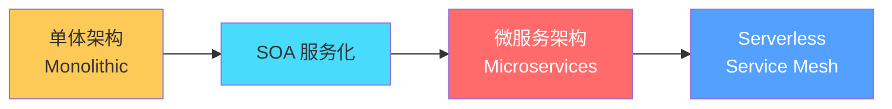

| 维度 | 单体 | SOA | 微服务 |
|------|------|-----|--------|
| 部署 | 一个 war | 一个或几个 | ==一个服务一个进程== |
| 数据库 | 共用一库 | 共用居多 | ==每服务一库== |
| 通信 | 进程内调用 | ESB / SOAP | REST / RPC / MQ |
| 团队 | 大团队共建 | 部门协作 | 小团队独立(2 pizza team) |
| 部署单元 | 整体发布 | 中等 | ⭐ ==独立可部署== |
| 复杂度 | 内部复杂 | 中等 | 分布式复杂(运维↑) |

### 1.2 🔴 微服务核心特征

> 🔴 **背诵**:**独立部署、独立数据库、独立技术栈、独立团队、轻量通信、自动化运维**

### 1.3 🟢 微服务的代价

> 🟢 **避坑**:微服务**不是银弹**,引入了:
> 1. ==分布式事务难==(跨服务一致性)
> 2. ==链路追踪难==(一个请求穿多个服务)
> 3. ==运维成本高==(N 个服务的监控、部署)
> 4. ==网络调用变多==(本地调用 → 远程调用)
> 5. ==数据一致性变难==(每服务一库)
>
> **建议**:小项目用单体即可,日活 10w+ 或团队 30+ 人再考虑拆。

---

## 2. 拆分原则与 12 要素

### 2.1 🔴 拆分原则(背诵)

> 🔴 **STAR-S 五原则**:
> 1. ==单一职责==:一个服务一个业务域(订单服务、用户服务)
> 2. ==高内聚低耦合==:服务内功能聚合,服务间解耦
> 3. ==独立自治==:独立部署、独立数据库、独立技术栈
> 4. ==演进式拆分==:从单体逐步剥离,**不要一开始就拆得过细**
> 5. ==团队边界对齐==:康威定律(组织结构 → 系统结构)

### 2.2 🟠 拆分维度

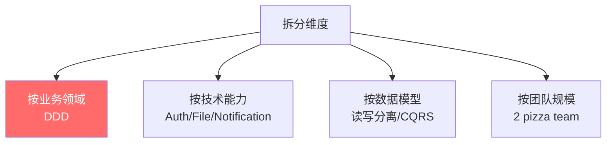

> 🟠 **DDD 子域分类**:
> - **核心域**:核心业务(订单、商品)
> - **支撑域**:辅助核心域(库存、价格)
> - **通用域**:多业务复用(用户、支付)

### 2.3 🟡 12 要素应用(The Twelve-Factor App)

> 🟡 **加分**:云原生应用规范

| # | 要素 | 含义 |
|---|------|------|
| 1 | 一份基准代码 | Git 一仓 |
| 2 | 显式声明依赖 | Maven/Gradle/package.json |
| 3 | ==配置存储于环境== | application.yml + profile |
| 4 | 后端服务作附加资源 | DB/Redis/MQ 通过 URL 访问 |
| 5 | 严格分离构建/发布/运行 | CI/CD |
| 6 | ==无状态进程== | Session 外置 Redis |
| 7 | 端口绑定提供服务 | 内嵌 Tomcat |
| 8 | ==并发横向扩展== | 多实例 + 负载均衡 |
| 9 | 易处理(快速启停) | 优雅关闭 |
| 10 | 开发环境与生产等价 | Docker |
| 11 | 日志当作数据流 | stdout + ELK |
| 12 | 后台管理任务也是一次性进程 | Job 也容器化 |

---

## 3. CAP 与 BASE

### 3.1 🔴 CAP 理论

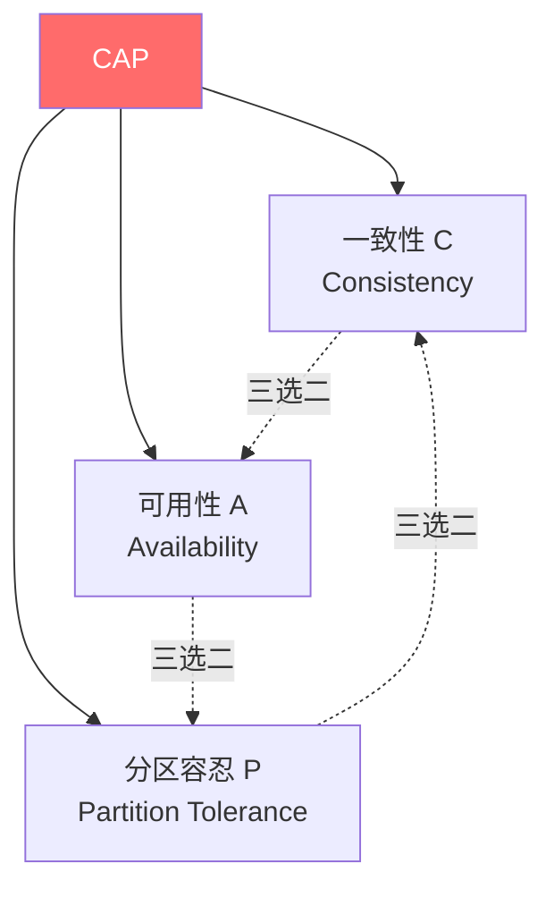

> 🔴 **核心**:分布式系统在 ==C(一致性)== 和 ==A(可用性)== 之间二选一,**P(分区容忍)必须保证**(网络一定会出问题)。

| 系统 | 倾向 | 例子 |
|------|------|------|
| **CP** | 强一致优先 | ZooKeeper、etcd、HBase |
| **AP** | 高可用优先 | Eureka、Cassandra、DynamoDB |
| **可切换** | 配置选择 | Nacos(默认 AP,可切 CP) |

### 3.2 🔴 BASE 理论

> 🔴 **核心**:CAP 中 AP 系统的妥协方案,达成 ==**最终一致性**==。

| 字段 | 含义 |
|------|------|
| **B**asically Available | 基本可用(降级、限流) |
| **S**oft state | 软状态(允许中间不一致) |
| **E**ventually consistent | 最终一致(经过一段时间收敛) |

### 3.3 🟠 一致性等级阶梯

```
强一致性(Linearizability)         ← Paxos / Raft
  ↓
顺序一致性(Sequential)
  ↓
因果一致性(Causal)
  ↓
最终一致性(Eventual)               ← 多数微服务
  ↓
弱一致性
```

---

# 第二部分 · Spring Cloud Alibaba 全家桶

## 4. Nacos:注册中心 + 配置中心

### 4.1 🔴 整体架构

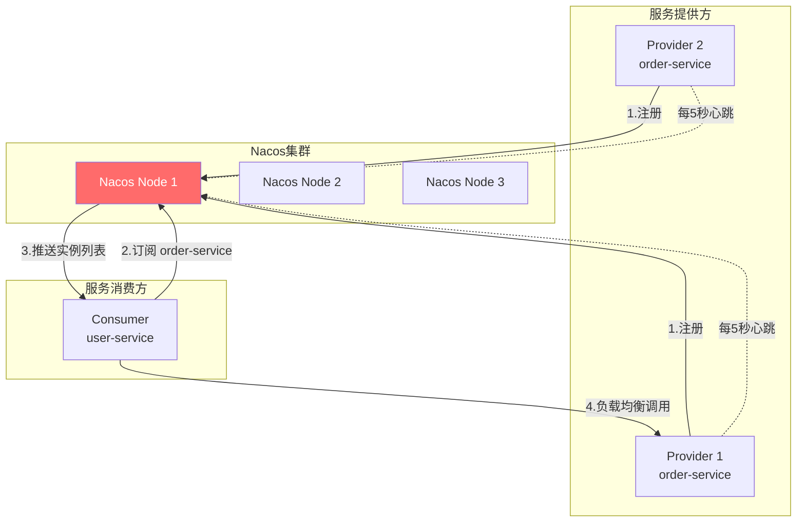

### 4.2 🔴 服务注册发现核心流程

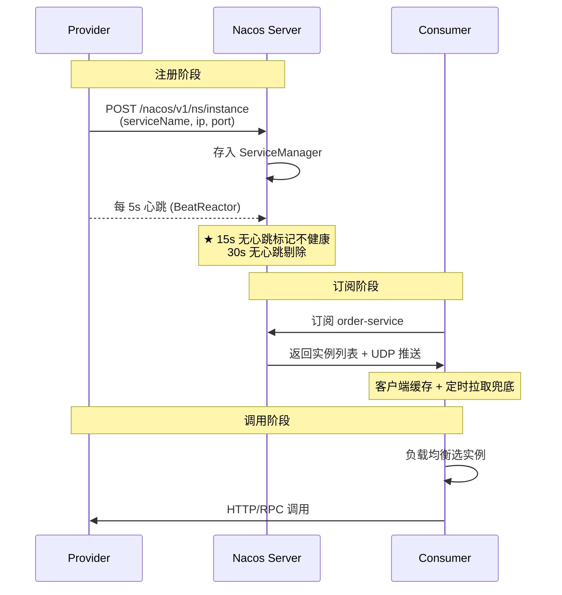

### 4.3 🔴 Nacos 配置中心

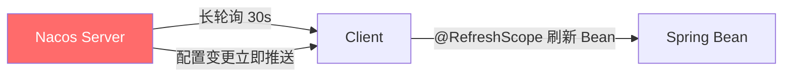

```java
// 配置中心使用
@RefreshScope                   // ★ 必须加,否则不会动态刷新
@RestController
public class ConfigController {
    @Value("${app.name}")
    private String name;        // Nacos 改了之后,@RefreshScope 重新生成代理 Bean
}

// 监听器方式(更可控)
@NacosConfigListener(dataId = "app-config")
public void onChange(String newConfig) {
    // 自定义处理
}
```

### 4.4 🟠 命名空间 / 分组 / DataId

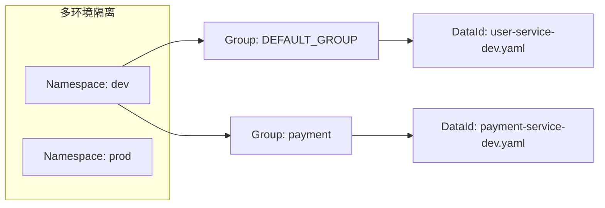

| 概念 | 用途 |
|------|------|
| **Namespace** | ==环境隔离==(dev/test/prod) |
| **Group** | ==业务/项目分组==(订单组 / 支付组) |
| **DataId** | 配置文件唯一 ID(`{name}-{profile}.{ext}`) |

### 4.5 🔴 Nacos vs Eureka vs ZooKeeper

| | Nacos | Eureka | ZooKeeper |
|---|-------|--------|-----------|
| 一致性 | ==AP/CP 切换== | AP | CP |
| 临时实例 | ✅ 心跳模式 | ✅ | ✅ session |
| 持久化实例 | ✅ ⭐ 支持 | ❌ | ✅ |
| 配置中心 | ⭐ 内置 | ❌ | ❌ |
| 健康检查 | 心跳 + TCP/HTTP | 心跳 | session |
| 控制台 | ⭐ 友好 | 简陋 | 无原生 |
| 推荐 | ⭐ 国内首选 | 已闭源(2.x 停止维护) | 老项目 |

### 4.6 🟠 Nacos AP/CP 模式

> 🟠 **重点**:
> - **临时实例(默认)** → ==Distro 协议== → AP
> - **持久化实例**(`ephemeral=false`)→ ==Raft 协议== → CP

```yaml
spring:
  cloud:
    nacos:
      discovery:
        ephemeral: false        # 切换到 CP(持久化实例)
```

### 4.7 🟢 避坑

> 🟢 **避坑 1**:Nacos 默认 ==临时实例==,客户端宕机 30 秒后剔除。生产建议短时心跳间隔。
>
> 🟢 **避坑 2**:`@RefreshScope` Bean 在配置变更时**销毁重建**,**不要在它里面持有耗资源的对象**(数据库连接池等)。

---

## 5. Sentinel:限流降级熔断

### 5.1 🔴 核心能力图

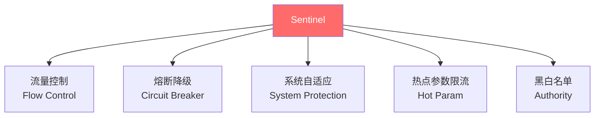

### 5.2 🔴 限流算法对比

| 算法 | 原理 | 优点 | 缺点 |
|------|------|------|------|
| **计数器** | 时间窗口内计数 | 简单 | ==临界突刺==(窗口切换) |
| **滑动窗口** | 多个小窗口 | 解决临界 | 实现稍复杂 |
| ⭐ **令牌桶** | 匀速生成令牌,请求消耗 | ==允许突发== | - |
| **漏桶** | 匀速漏出 | 严格匀速 | ==不允许突发== |

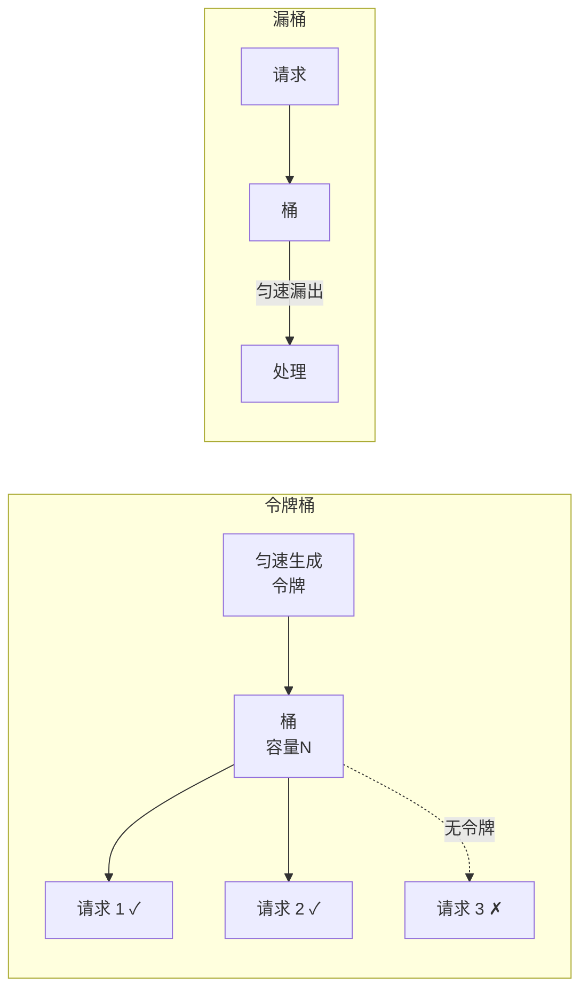

### 5.3 🔴 Sentinel 限流策略

```java
@SentinelResource(value = "orderQuery",
                  blockHandler = "blockHandler",
                  fallback = "fallback")
public Order query(Long id) {
    return orderService.get(id);
}

// 限流处理(BlockException)
public Order blockHandler(Long id, BlockException ex) {
    return Order.empty();
}

// 业务异常处理(其他 Throwable)
public Order fallback(Long id, Throwable ex) {
    return Order.empty();
}
```

| 阈值类型 | 含义 |
|---------|------|
| **QPS** | 每秒请求数 |
| **并发线程数** | 同时执行的线程数 |

| 流控效果 | 行为 |
|---------|------|
| ⭐ **直接拒绝** | 超阈值立即抛异常(默认) |
| ==**Warm Up**== | 冷启动,从 1/3 阈值逐步爬升,防止冷系统打挂 |
| **排队等待** | 匀速通过(漏桶) |

### 5.4 🔴 熔断降级策略

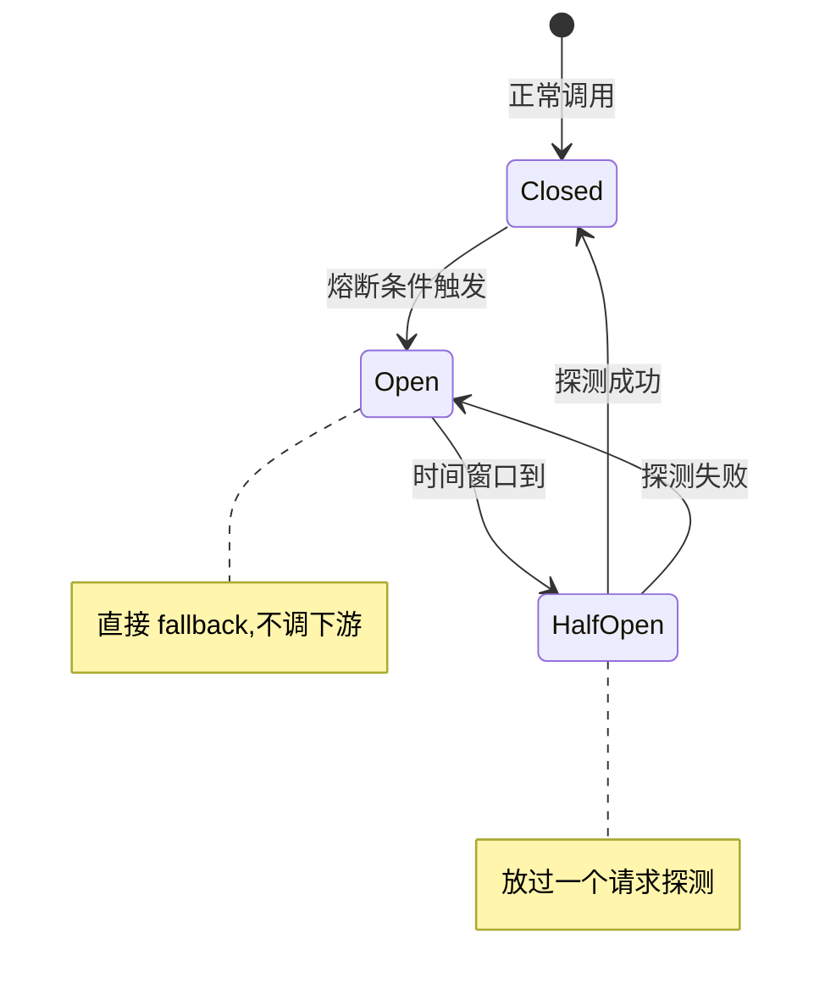

| 策略 | 含义 |
|------|------|
| ==**慢调用比例**== | RT > 阈值的比例超过限制 → 熔断 |
| ==**异常比例**== | 异常 / 总请求 > 阈值 → 熔断 |
| ==**异常数**== | 异常数超过阈值 → 熔断 |

### 5.5 🟠 滑动窗口实现

> 🟠 **重点**:Sentinel 用 ==滑动窗口== 统计 QPS。底层数据结构 `LeapArray`,把时间窗口切成 N 个 `Bucket`,每个 Bucket 记一段时间的指标。

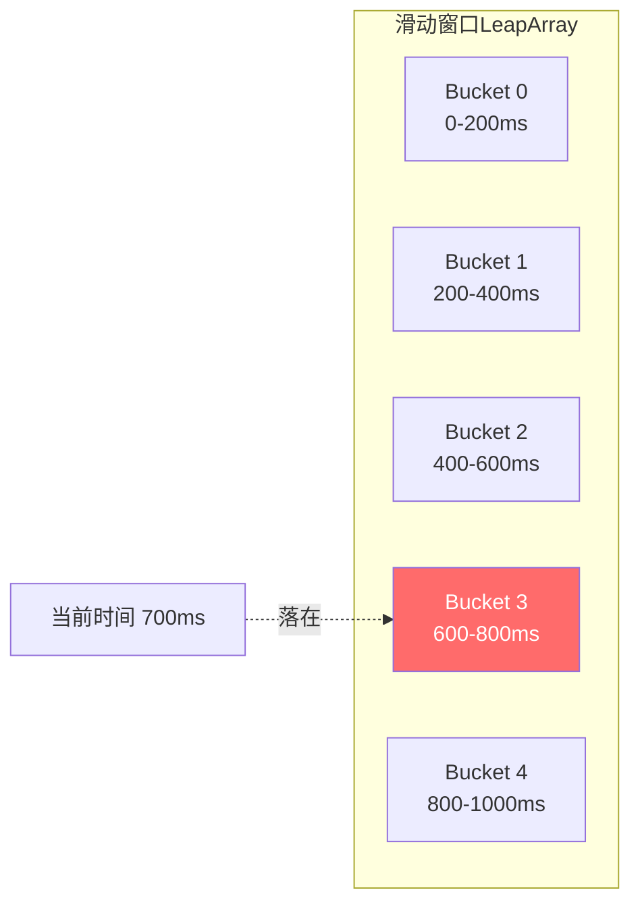

### 5.6 🟡 Sentinel vs Hystrix

| | Sentinel | Hystrix |
|---|----------|---------|
| 隔离方式 | 信号量 | ==线程池 / 信号量== |
| 限流 | ⭐ 多种规则 | 简单 |
| 实时统计 | 滑动窗口 | RxJava |
| 控制台 | ⭐ 友好 | 一般 |
| 状态 | 阿里维护 | ==2018 停止维护== |
| 推荐 | ⭐ 新项目用 | 老项目 |

### 5.7 🟢 避坑

> 🟢 **避坑**:`@SentinelResource` 的 `blockHandler` 与 `fallback` 区别:
> - `blockHandler` 处理 ==Sentinel 抛的 BlockException==(限流/熔断)
> - `fallback` 处理 ==业务异常==(自定义 Throwable)
> - 两个都配会**先匹配 blockHandler**

---

## 6. Spring Cloud Gateway

### 6.1 🔴 整体架构

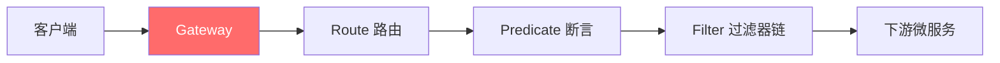

### 6.2 🔴 三大组件

| 组件 | 作用 |
|------|------|
| **Route 路由** | 由 ID + URI + Predicates + Filters 组成 |
| **Predicate 断言** | 路由匹配条件(路径/请求头/Cookie/时间) |
| **Filter 过滤器** | 修改请求/响应,前置 + 后置处理 |

### 6.3 🔴 配置示例

```yaml
spring:
  cloud:
    gateway:
      routes:
        - id: order-route
          uri: lb://order-service           # ★ lb 表示负载均衡
          predicates:
            - Path=/api/order/**            # 路径断言
            - Method=GET,POST
            - Header=X-Request-Id, \d+
          filters:
            - StripPrefix=2                 # 去掉前 2 段路径
            - AddRequestHeader=X-Source, gateway
            - name: RequestRateLimiter      # 限流过滤器
              args:
                key-resolver: '#{@userKeyResolver}'
                redis-rate-limiter.replenishRate: 10
                redis-rate-limiter.burstCapacity: 20
            - CircuitBreaker=orderCircuit   # 熔断
```

### 6.4 🟠 GatewayFilter 执行链路

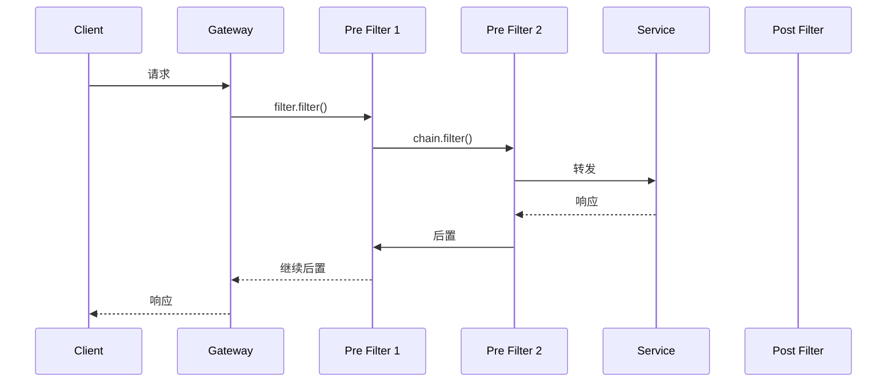

> 🟠 **核心**:Gateway 用 ==Reactor 响应式编程==,基于 Netty,**全异步非阻塞**,性能远超 Zuul 1.x。

### 6.5 🔴 内置 Predicate 速查

| Predicate | 示例 | 含义 |
|-----------|------|------|
| `Path` | `Path=/api/**` | URL 路径 |
| `Method` | `Method=GET,POST` | HTTP 方法 |
| `Header` | `Header=X-Token, \d+` | 请求头匹配 |
| `Cookie` | `Cookie=name, regex` | Cookie 匹配 |
| `Query` | `Query=foo, ba.` | 参数匹配 |
| `RemoteAddr` | `RemoteAddr=192.168.1.1/24` | 客户端 IP |
| `After/Before/Between` | `After=2026-01-01...` | 时间断言 |

### 6.6 🟠 自定义全局过滤器

```java
@Component
public class AuthGlobalFilter implements GlobalFilter, Ordered {

    @Override
    public Mono<Void> filter(ServerWebExchange exchange, GatewayFilterChain chain) {
        String token = exchange.getRequest().getHeaders().getFirst("Authorization");
        if (StringUtils.isEmpty(token)) {
            exchange.getResponse().setStatusCode(HttpStatus.UNAUTHORIZED);
            return exchange.getResponse().setComplete();
        }
        // 校验 token 后继续
        return chain.filter(exchange);
    }

    @Override
    public int getOrder() { return -1; }   // 越小越先执行
}
```

### 6.7 🟡 Gateway vs Zuul vs Nginx

| | Gateway | Zuul 1.x | Zuul 2.x | Nginx |
|---|---------|----------|----------|-------|
| 异步 | ⭐ Reactor | 同步阻塞 | 异步 | 异步 |
| 性能 | ⭐⭐⭐⭐⭐ | ⭐⭐ | ⭐⭐⭐⭐ | ⭐⭐⭐⭐⭐ |
| 集成 | Spring Cloud 原生 | 老 SC | Spring Cloud 不集成 | 独立 |
| 动态路由 | ⭐ 配置中心刷新 | 重启 | 支持 | reload |
| 推荐 | ⭐ 新项目 | 已淘汰 | 不集成 | 边缘网关 |

---

## 7. OpenFeign 声明式 RPC

### 7.1 🔴 核心原理

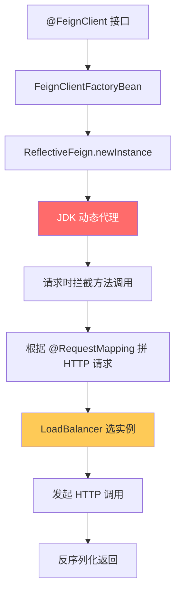

### 7.2 🔴 标准用法

```java
// 1. 接口声明
@FeignClient(
    name = "order-service",
    fallback = OrderFallback.class,           // 降级类
    configuration = FeignConfig.class          // 自定义配置
)
public interface OrderClient {

    @GetMapping("/order/{id}")
    Order getOrder(@PathVariable Long id);

    @PostMapping("/order")
    Order create(@RequestBody OrderDto dto);
}

// 2. 降级实现
@Component
public class OrderFallback implements OrderClient {
    @Override
    public Order getOrder(Long id) {
        return Order.empty();      // 降级返回
    }
    // ...
}

// 3. 启动类
@EnableFeignClients(basePackages = "com.demo.client")
@SpringBootApplication
public class App {}
```

### 7.3 🟠 Feign 调用流程

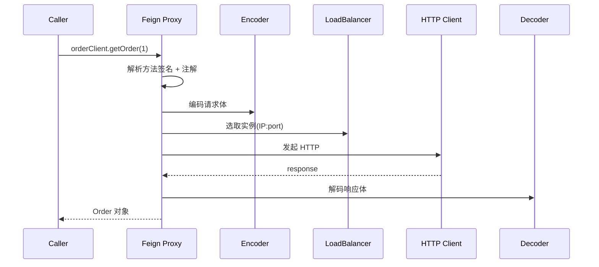

### 7.4 🔴 超时配置

```yaml
feign:
  client:
    config:
      default:                    # 全局
        connect-timeout: 5000     # 连接超时(ms)
        read-timeout: 10000       # 读取超时
      order-service:              # 单服务覆盖
        connect-timeout: 3000
        read-timeout: 5000
  httpclient:
    enabled: true                 # 启用 Apache HttpClient(替代 URLConnection)
    max-connections: 200
```

> 🟢 **避坑**:Feign 默认用 ==`HttpURLConnection`==,**性能差**,生产换成 ==Apache HttpClient== 或 OkHttp。

### 7.5 🟠 拦截器(Interceptor)

```java
// 透传 Token
@Bean
public RequestInterceptor authInterceptor() {
    return template -> {
        String token = RequestContextHolder.getRequestAttributes()
                .getRequest().getHeader("Authorization");
        if (token != null) {
            template.header("Authorization", token);
        }
    };
}
```

> 🟡 **加分**:常见拦截器场景:
> - 透传 Token / TraceId
> - 加签验签
> - 慢请求日志

### 7.6 🟢 Feign 与 Sentinel 整合

```yaml
feign:
  sentinel:
    enabled: true                  # ★ 开启
```

```java
@FeignClient(name = "order", fallback = OrderFallback.class)
public interface OrderClient { /* ... */ }
```

开启后,Feign 调用会被 Sentinel 接管,**资源名格式**:`GET:http://order/api/order/{id}`。

---

## 8. Seata 分布式事务

### 8.1 🔴 三大角色(必背)

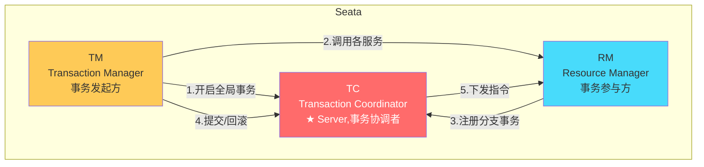

| 角色 | 职责 |
|------|------|
| **TC** | 全局协调者,通常单独部署 |
| **TM** | 业务发起方(`@GlobalTransactional`) |
| **RM** | 业务参与方(操作 DB) |

### 8.2 🔴 4 种模式对比

| 模式 | 一致性 | 侵入 | 性能 | 适用 |
|------|--------|------|------|------|
| ⭐ **AT** | 最终一致 | ==无侵入== | 高 | 关系型 DB(默认) |
| **TCC** | 强一致 | ==高(写 Try/Confirm/Cancel)== | 高 | 高一致要求 |
| **SAGA** | 最终一致 | 中 | 高 | 长事务 |
| **XA** | 强一致 | 低 | 低 | 数据库支持 XA |

### 8.3 🔴 AT 模式核心流程

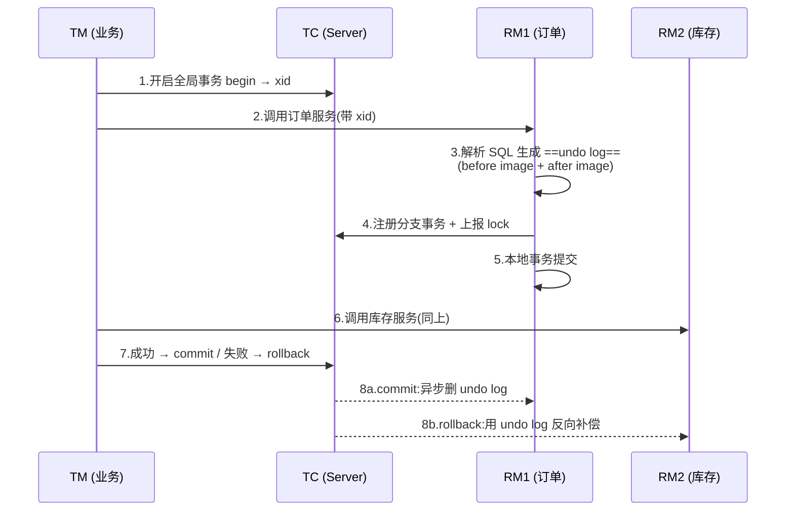

> 🔴 **AT 核心**:每条 SQL 执行时**自动**:
> 1. 拦截 SQL,先 ==SELECT 当前行(before image)==
> 2. 执行原 SQL
> 3. 再 ==SELECT 修改后(after image)==
> 4. 把 before/after 写到 ==`undo_log` 表==
> 5. 上报 TC 注册分支
> 6. 提交本地事务
>
> **回滚时**:用 undo_log 反向补偿原 SQL。

### 8.4 🟠 TCC 模式

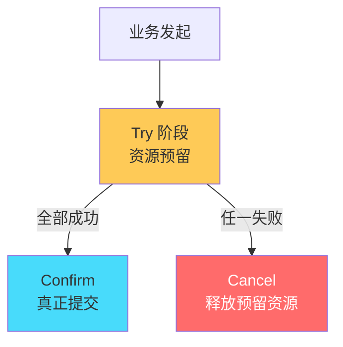

```java
// 接口(扣款)
public interface AccountTcc {
    @TwoPhaseBusinessAction(name = "decreaseAccount",
                            commitMethod = "confirm",
                            rollbackMethod = "cancel")
    boolean tryDecrease(@BusinessActionContextParameter("userId") Long userId,
                        @BusinessActionContextParameter("amount") BigDecimal amount);

    boolean confirm(BusinessActionContext ctx);   // 真正扣
    boolean cancel(BusinessActionContext ctx);    // 释放冻结
}
```

> 🟠 **TCC 核心**:开发者自己写 Try/Confirm/Cancel,业务侵入大但 ==无脏读、性能好==。

### 8.5 🟠 TCC 三大问题

> 🟠 **必懂**:
> 1. ==空回滚==:Try 没执行,Cancel 来了 → 防御:记录"事务已 cancel" 状态
> 2. ==悬挂==:Cancel 比 Try 先到 → 防御:Cancel 时检查 Try 状态
> 3. ==幂等==:Confirm/Cancel 可能重试 → 防御:操作记录唯一约束

### 8.6 🟡 SAGA 模式

> 🟡 **场景**:**长事务、多步骤**(如机票+酒店+租车),每步成功就提交,失败逆向补偿。

```
T1 → T2 → T3 → T4 → T5
                ↓ 失败
C5 ← C4 ← C3 ← C2 ← C1   (反向补偿)
```

### 8.7 🟢 Seata 架构图

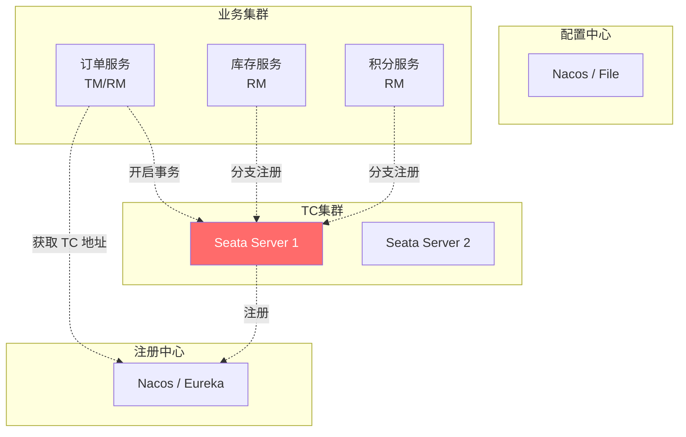

---


# 第三部分 · 服务通信与治理

## 9. RPC 框架原理

### 9.1 🔴 RPC 调用 6 步

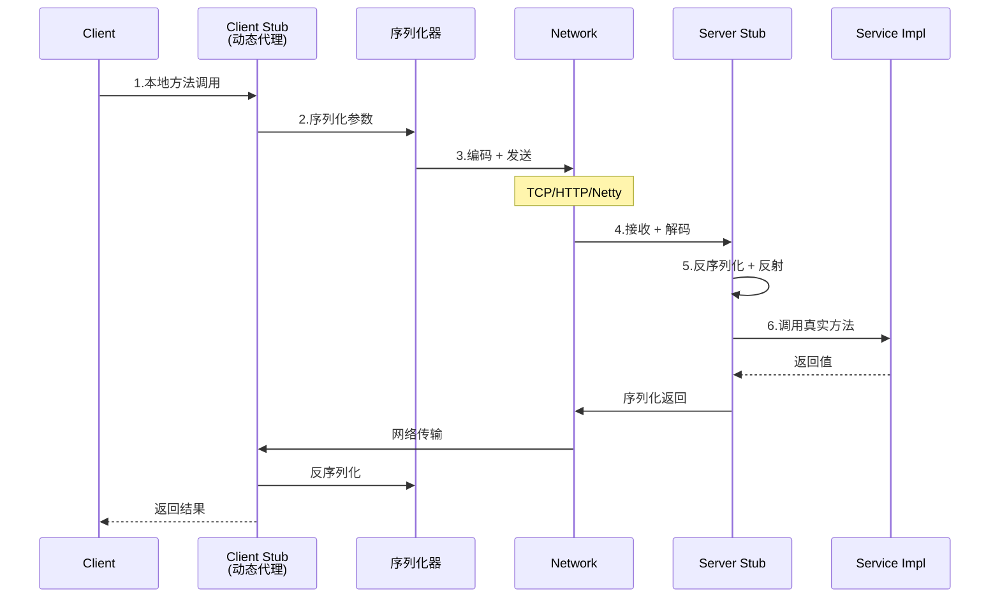

### 9.2 🔴 RPC 关键技术点

| 技术 | 选型 |
|------|------|
| **代理** | JDK 动态代理 / CGLIB / Javassist / ByteBuddy |
| **序列化** | ⭐ ==Protobuf== / Hessian / JSON / Kryo / Thrift |
| **网络** | ⭐ ==Netty== / Mina / OkHttp |
| **协议** | ==Dubbo== / gRPC / Thrift / 自定义 |
| **注册中心** | Nacos / ZooKeeper / etcd |
| **负载均衡** | 客户端 / 服务端 |
| **集群容错** | Failover / Failfast / Failsafe |

### 9.3 🔴 序列化对比

| 序列化 | 性能 | 体积 | 跨语言 | 可读性 | 适用 |
|--------|------|------|--------|--------|------|
| **JDK** | ⭐⭐ | ⭐⭐ | ❌ | ❌ | 几乎不用 |
| **JSON** | ⭐⭐⭐ | ⭐⭐⭐ | ✅ | ✅ | HTTP API |
| ==**Protobuf**== ⭐ | ⭐⭐⭐⭐⭐ | ⭐⭐⭐⭐⭐ | ✅ | ❌ | gRPC、高性能 RPC |
| **Hessian** | ⭐⭐⭐⭐ | ⭐⭐⭐⭐ | ✅ | ❌ | Dubbo 默认 |
| **Kryo** | ⭐⭐⭐⭐⭐ | ⭐⭐⭐⭐⭐ | ❌ | ❌ | Java 内部 |
| **Thrift** | ⭐⭐⭐⭐⭐ | ⭐⭐⭐⭐⭐ | ✅ | ❌ | 跨语言高性能 |

### 9.4 🟠 Dubbo 架构

```mermaid
flowchart TB
    Reg[注册中心<br/>Nacos/ZK]
    Provider[Provider<br/>服务提供方]
    Consumer[Consumer<br/>服务消费方]
    Monitor[监控中心]

    Provider -->|1.注册| Reg
    Consumer -->|2.订阅| Reg
    Reg -->|3.推送列表| Consumer
    Consumer -->|4.调用| Provider
    Consumer -.5.统计上报.-> Monitor
    Provider -.5.统计上报.-> Monitor

    style Reg fill:#feca57
    style Provider fill:#ff6b6b,color:#fff
    style Consumer fill:#48dbfb
```

### 9.5 🟠 Dubbo SPI 机制

> 🟠 **加分**:Dubbo 自研 SPI(扩展原生 Java SPI),特点:
> - **按需加载**(Java SPI 一次性全加载)
> - **支持 IOC**(扩展类的成员可被注入)
> - **支持 AOP**(Wrapper 类自动包装)
> - 通过 `@SPI` 注解 + `META-INF/dubbo/` 目录配置

```java
@SPI("dubbo")           // 默认实现
public interface Protocol {
    Exporter export(Invoker invoker);
    Invoker refer(URL url);
}

// META-INF/dubbo/com.alibaba.dubbo.rpc.Protocol
dubbo=com.alibaba.dubbo.rpc.protocol.dubbo.DubboProtocol
http=com.alibaba.dubbo.rpc.protocol.http.HttpProtocol
```

### 9.6 🟡 Dubbo vs gRPC

| | Dubbo | gRPC |
|---|-------|------|
| 协议 | Dubbo / HTTP | ==HTTP/2== |
| 序列化 | Hessian / Protobuf | ==Protobuf== |
| 跨语言 | 一般 | ⭐ 优秀(IDL 描述) |
| 流式 | 一般 | ⭐ 双向流 |
| 国内生态 | ⭐ 强大 | 较弱 |

---

## 10. 负载均衡算法

### 10.1 🔴 6 种常见算法

| 算法 | 原理 | 优缺点 |
|------|------|--------|
| ⭐ **轮询(Round Robin)** | 依次分配 | 简单,**不考虑实例性能差异** |
| **加权轮询** | 按权重分配 | 适合机器配置不同 |
| ==**随机**== | 完全随机 | 简单,数据量大时趋近平均 |
| ==**加权随机**== | 按权重随机 | Nacos / Ribbon 默认 |
| **最少连接** | 选当前连接数最少 | 适合长连接 |
| ==**一致性哈希**== ⭐ | 同一参数路由同一实例 | 缓存友好,扩缩容影响小 |
| **响应时间加权** | RT 越小权重越大 | 自适应 |

### 10.2 🔴 一致性哈希原理

```mermaid
flowchart TB
    subgraph Hash环["Hash 环 (0 ~ 2^32-1)"]
        N1[Node A<br/>hash=100]
        N2[Node B<br/>hash=200]
        N3[Node C<br/>hash=300]
        K1[Key 1<br/>hash=150]
        K2[Key 2<br/>hash=250]
        K3[Key 3<br/>hash=350]
    end

    K1 -->|顺时针找到下一个节点| N2
    K2 --> N3
    K3 --> N1

    style N1 fill:#ff6b6b,color:#fff
    style N2 fill:#feca57
    style N3 fill:#48dbfb
```

> 🔴 **核心**:节点 hash 到环上,key 顺时针找到第一个节点。==增删节点只影响相邻 1/N 数据==。
>
> 🟠 **虚拟节点**:为防止数据倾斜,每个物理节点映射成 ==N 个虚拟节点==(默认 160)。

### 10.3 🟠 客户端 vs 服务端负载均衡

```mermaid
flowchart LR
    subgraph 客户端LB["客户端负载均衡(Ribbon/LoadBalancer)"]
        C1[Client] --> S1[Server 1]
        C1 --> S2[Server 2]
        C1 --> S3[Server 3]
        Note1[客户端持有实例列表<br/>自己选]
    end

    subgraph 服务端LB["服务端负载均衡(Nginx/F5)"]
        C2[Client] --> LB[LB Server]
        LB --> S4[Server 1]
        LB --> S5[Server 2]
        LB --> S6[Server 3]
    end
```

| | 客户端 LB | 服务端 LB |
|---|-----------|-----------|
| 代表 | Ribbon / Spring Cloud LoadBalancer | Nginx / F5 / SLB |
| 实例感知 | 客户端缓存 + 注册中心 | LB 自己感知 |
| 性能 | ⭐ 减少一跳 | 多一跳 |
| 适用 | 微服务内部 | 边缘网关 |

---

## 11. 服务降级与熔断模式

### 11.1 🔴 三个核心概念

> 🔴 **背诵**:
> - **限流**:限制请求量,保护自己(如 1000 QPS)
> - **熔断**:下游故障时,直接拒绝调用(三态:Closed/Open/HalfOpen)
> - **降级**:返回兜底值/缓存数据,保证响应

### 11.2 🔴 熔断器三态机

```mermaid
stateDiagram-v2
    [*] --> Closed: 正常运行

    Closed --> Open: 失败率超阈值<br/>(异常比例 / 慢调用比例)
    note left of Closed: 统计请求,正常调用下游

    Open --> HalfOpen: 等待时间窗口
    note left of Open: 直接 fallback,不调下游

    HalfOpen --> Closed: 探测成功
    HalfOpen --> Open: 探测失败
    note left of HalfOpen: 放过 1 个请求探测
```

### 11.3 🟠 降级方式

| 类型 | 触发条件 | 兜底返回 |
|------|---------|---------|
| **熔断降级** | 失败率超阈值 | fallback 方法 |
| **限流降级** | QPS 超阈值 | "服务繁忙" |
| **手动降级** | 运维通过开关关掉非核心 | 静态数据 |
| **慢调用降级** | RT 超阈值 | 缓存数据 |
| **系统降级** | CPU/Load 超阈值 | 全局拒绝 |

### 11.4 🟢 降级清单(典型场景)

> 🟢 **背诵**:大促 / 故障时,**优先降级非核心**:
> - 评论、推荐、个性化广告 → 关
> - 商品详情页中的"猜你喜欢" → 关
> - 短信通知 → 异步队列
> - 数据分析、日志 → 缓存批量上报

---

## 12. 分布式链路追踪

### 12.1 🔴 核心概念

```mermaid
flowchart LR
    subgraph 一次完整调用
        A[Service A<br/>traceId=T1<br/>spanId=1] --> B[Service B<br/>traceId=T1<br/>spanId=2<br/>parentSpanId=1]
        B --> C[Service C<br/>traceId=T1<br/>spanId=3<br/>parentSpanId=2]
        B --> D[Service D<br/>traceId=T1<br/>spanId=4<br/>parentSpanId=2]
    end

    style A fill:#ff6b6b,color:#fff
```

> 🔴 **核心三概念**:
> - ==**traceId**==:整条调用链全局唯一
> - ==**spanId**==:每个服务节点唯一
> - ==**parentSpanId**==:父节点 spanId(构成树形)

### 12.2 🔴 主流框架对比

| 框架 | 特点 | 推荐 |
|------|------|------|
| **Sleuth + Zipkin** | Spring Cloud 原生 | 简单场景 |
| ⭐ **SkyWalking** | ==字节码增强,无侵入==,APM 全功能 | 国内主流 |
| **Pinpoint** | 韩国 Naver,强字节码 | 一般 |
| **Jaeger** | Uber 开源,云原生 | K8s 场景 |

### 12.3 🟠 SkyWalking 架构

```mermaid
flowchart LR
    subgraph 应用
        APP1[App 1<br/>+ Java Agent]
        APP2[App 2<br/>+ Java Agent]
    end

    subgraph SW后端["SkyWalking 后端"]
        OAP[OAP Server<br/>分析]
        ST[(存储<br/>ES/H2/MySQL)]
        UI[Web UI]
    end

    APP1 -->|gRPC 上报| OAP
    APP2 -->|gRPC 上报| OAP
    OAP --> ST
    UI --> OAP

    style OAP fill:#ff6b6b,color:#fff
```

> 🟠 **关键**:SkyWalking 用 ==Java Agent + 字节码增强==(ByteBuddy),**业务代码 0 侵入**,启动加 `-javaagent:skywalking-agent.jar`。

### 12.4 🟡 OpenTelemetry

> 🟡 **加分**:OpenTelemetry 是 CNCF 项目,**统一**了 Tracing / Metrics / Logging 的标准 API。各家 APM(SkyWalking、Jaeger、Datadog)都在适配,**未来标准方向**。

---

# 第四部分 · 分布式核心问题

## 13. 分布式 ID 方案

### 13.1 🔴 6 种方案对比

| 方案 | 全局唯一 | 趋势递增 | 性能 | 缺点 |
|------|---------|---------|------|------|
| **UUID** | ✅ | ❌ | ⭐⭐⭐⭐⭐ | ==无序==,存储/索引差 |
| **DB 自增** | ✅ | ✅ | ⭐⭐ | ==单点瓶颈== |
| **DB 多步长** | ✅ | ✅ | ⭐⭐⭐ | 步长固定 |
| **Redis INCR** | ✅ | ✅ | ⭐⭐⭐⭐ | Redis 单点 |
| ⭐ **Snowflake** | ✅ | ⭐ | ⭐⭐⭐⭐⭐ | ==时钟回拨== |
| **号段模式(Leaf)** | ✅ | ✅ | ⭐⭐⭐⭐⭐ | 实现复杂 |

### 13.2 🔴 Snowflake 算法

```
┌─┬───────────────────────────────────┬──────────┬──────────┐
│0│  41 bit 时间戳(毫秒)               │ 10bit 机器│ 12bit 序号│
│ │  支持 69 年                        │ 1024 节点 │ 每ms 4096│
└─┴───────────────────────────────────┴──────────┴──────────┘
```

```java
public synchronized long nextId() {
    long now = System.currentTimeMillis();
    if (now < lastTimestamp) {
        throw new RuntimeException("时钟回拨!");   // ★ 必须处理
    }
    if (now == lastTimestamp) {
        sequence = (sequence + 1) & SEQUENCE_MASK;
        if (sequence == 0) {
            now = nextMillis(lastTimestamp);     // 等到下一毫秒
        }
    } else {
        sequence = 0;
    }
    lastTimestamp = now;
    return ((now - twepoch) << 22)
         | (workerId << 12)
         | sequence;
}
```

### 13.3 🟠 时钟回拨处理

> 🟠 **重点**:Snowflake 致命问题。处理:
> 1. ==小幅回拨(< 5ms)==:等待时钟追上
> 2. ==大幅回拨==:抛异常 / 切换备用 workerId
> 3. ==美团 Leaf-snowflake==:用 ZK 持久化 workerId,启动时检查时钟

### 13.4 🟡 美团 Leaf

> 🟡 **加分**:Leaf 双方案
> - **Leaf-segment**:号段模式,DB 中表存当前最大 ID,每次取一段(默认 1000)缓存到内存,用完再取
> - **Leaf-snowflake**:改进 Snowflake,用 ZK 解决 workerId 分配 + 时钟回拨

```mermaid
flowchart LR
    subgraph 号段模式
        APP[App] --> CACHE1[内存号段 1<br/>1-1000]
        CACHE1 -.用完 90% 异步加载.-> CACHE2[内存号段 2<br/>1001-2000]
        CACHE1 --> DB[(DB:max_id=2000)]
        CACHE2 --> DB
    end

    style CACHE1 fill:#ff6b6b,color:#fff
    style CACHE2 fill:#feca57
```

---

## 14. 分布式锁三种实现对比

### 14.1 🔴 必背对比

| 实现 | 优点 | 缺点 | 适用 |
|------|------|------|------|
| ==**Redis**== ⭐ | 性能高、实现简单(SET NX) | ==AP 系统,极端情况丢锁== | 性能优先,容忍极小概率丢锁 |
| ==**ZooKeeper**== | CP 强一致、自动释放 | 性能较低、依赖 ZK 集群 | 强一致场景 |
| ==**MySQL**== | 简单、不依赖中间件 | 性能差、单点问题 | 低并发兜底 |

### 14.2 🔴 三种实现要点

```mermaid
flowchart TD
    subgraph Redis["Redis 实现"]
        R1[SET key uuid NX PX 30000]
        R2[Lua 脚本释放<br/>校验 uuid + DEL]
        R3[Redisson 看门狗续期]
    end

    subgraph ZK["ZooKeeper 实现"]
        Z1[创建临时顺序节点]
        Z2[判断序号最小者获锁]
        Z3[监听前一个节点]
        Z4[Session 失效自动释放]
    end

    subgraph MySQL["MySQL 实现"]
        M1[insert into lock(name) values(?)]
        M2[或 select for update]
        M3[try-finally delete from lock]
    end

    style Redis fill:#feca57
    style ZK fill:#48dbfb
    style MySQL fill:#ff9f43
```

### 14.3 🟠 RedLock 算法

> 🟠 **重点**:Redis 主从切换会丢锁,RedLock 通过在 ==N 个独立 master== 上加锁,过半成功才算获锁。

```mermaid
flowchart LR
    C[Client] --> M1[Master 1]
    C --> M2[Master 2]
    C --> M3[Master 3]
    C --> M4[Master 4]
    C --> M5[Master 5]

    M1 --> CHK{过半成功?<br/>≥ 3}
    M2 --> CHK
    M3 --> CHK
    M4 --> CHK
    M5 --> CHK

    CHK -->|是| OK[获锁成功]
    CHK -->|否| FAIL[释放所有]
```

> 🟢 **争议**:Martin Kleppmann 与 antirez 的 RedLock 论战 → 极端场景仍可能出问题。**强一致用 ZK**,Redis 锁适合性能优先场景。

### 14.4 🔴 ZK 分布式锁优势

> 🔴 **核心**:
> 1. ==CP 强一致==(过半同步)
> 2. ==自动释放==(session 失效)
> 3. **公平锁**(顺序节点)
> 4. **解决惊群**(只监听前一个节点)

### 14.5 🟢 实战选择

> 🟢 **决策树**:
> ```
> 是否对性能敏感?
>   是 → Redis(Redisson)
>   否 → ZooKeeper(强一致)
>
> 是否能容忍极小概率丢锁?
>   能 → Redis
>   不能 → ZK
> ```

---

## 15. 分布式事务 6 种方案

### 15.1 🔴 必背对比

| 方案 | 一致性 | 性能 | 复杂度 | 业务侵入 | 典型框架 |
|------|--------|------|--------|---------|---------|
| **2PC** | 强 | ⭐⭐ | 中 | 低 | XA |
| **3PC** | 强 | ⭐ | 高 | 低 | 少见 |
| ⭐ **TCC** | 强 | ⭐⭐⭐⭐ | 高 | ==高== | Seata-TCC |
| ⭐ **本地消息表** | 最终 | ⭐⭐⭐⭐⭐ | 中 | 中 | 自实现 |
| ⭐ **MQ 事务消息** | 最终 | ⭐⭐⭐⭐⭐ | 低 | 低 | RocketMQ |
| ⭐ **SAGA** | 最终 | ⭐⭐⭐⭐ | 中 | 中 | Seata-SAGA |
| ⭐ **Seata AT** | 最终 | ⭐⭐⭐⭐ | 低 | ==无== | Seata |

### 15.2 🔴 2PC(两阶段提交)

```mermaid
sequenceDiagram
    participant TM as 协调者
    participant R1 as 参与者 1
    participant R2 as 参与者 2

    Note over TM,R2: 阶段 1:Prepare
    TM->>R1: prepare?
    TM->>R2: prepare?
    R1-->>TM: yes (锁定资源)
    R2-->>TM: yes (锁定资源)

    Note over TM,R2: 阶段 2:Commit
    TM->>R1: commit
    TM->>R2: commit
    R1-->>TM: done
    R2-->>TM: done
```

> 🟢 **2PC 致命问题**:
> 1. ==同步阻塞==:Prepare 阶段所有参与者阻塞,资源锁住等待
> 2. ==协调者单点==:协调者挂了所有参与者卡死
> 3. ==数据不一致==:Commit 阶段部分成功部分失败

### 15.3 🔴 本地消息表(经典方案)

```mermaid
sequenceDiagram
    participant A as 服务 A<br/>订单
    participant DB as 业务 DB
    participant MQ as MQ
    participant B as 服务 B<br/>积分

    A->>DB: BEGIN<br/>1.创建订单<br/>2.写本地消息表(状态=待发送)<br/>COMMIT
    Note over A,DB: ★ 同一事务,要么都成功要么都失败

    A->>A: 后台 Job 扫描"待发送"
    A->>MQ: 3.投递消息
    MQ-->>A: ack
    A->>DB: 4.改状态=已发送

    MQ->>B: 5.推送
    B->>B: 6.加积分(幂等)
    B-->>MQ: ack
```

> 🔴 **核心**:利用 ==本地事务== 把"业务操作"和"消息投递记录"绑定到同一事务,通过 ==后台 Job 异步投递 + 重试== 保证消息最终送达。

### 15.4 🔴 RocketMQ 事务消息(强烈推荐)

参见 ==分布式技术_增强版== 文档中的 RocketMQ 章节。半消息 + 本地事务 + 回查机制,**框架封装好**,业务侵入最小。

### 15.5 🟠 各方案适用场景

```mermaid
flowchart TD
    A[选择方案] --> B{是否要求强一致?}
    B -->|是| C{业务能写 Try/Confirm/Cancel?}
    C -->|是| D[TCC]
    C -->|否| E[Seata AT]

    B -->|最终一致即可| F{是否有 MQ?}
    F -->|有 RocketMQ| G[MQ 事务消息]
    F -->|否| H[本地消息表]

    style D fill:#ff6b6b,color:#fff
    style E fill:#48dbfb
    style G fill:#feca57
    style H fill:#48dbfb
```

---

## 16. 幂等性设计

### 16.1 🔴 为什么要幂等?

> 🔴 **场景**:
> 1. ==MQ 重复消费==
> 2. ==前端重复点击==
> 3. ==网络超时重试==
> 4. ==Feign / Dubbo 重试==

### 16.2 🔴 5 种实现方案

| 方案 | 实现 | 适用 |
|------|------|------|
| ==**唯一索引**== ⭐ | DB 业务键唯一约束 | 创建类(订单 ID) |
| ==**乐观锁**== | `update set version=v+1 where v=v0` | 修改类 |
| ==**Token 令牌**== | 接口调前先获取 Token,提交时校验 | 提交表单防重复 |
| ==**分布式锁**== | Redis 加锁 | 高并发场景 |
| ==**状态机**== | 已支付状态再来 → 直接忽略 | 状态流转 |

### 16.3 🟠 Token 方案流程

```mermaid
sequenceDiagram
    participant U as 用户
    participant S as 服务

    U->>S: 1.GET /token
    S->>S: 2.生成 UUID 存 Redis<br/>SET token:xxx 1 EX 600
    S-->>U: 返回 token

    U->>S: 3.POST /order (Header: token=xxx)
    S->>S: 4.Lua 脚本原子操作:<br/>GET + DEL token
    alt token 存在
        S->>S: 5.执行业务
        S-->>U: 成功
    else token 已用 / 不存在
        S-->>U: 失败(重复提交)
    end
```

### 16.4 🟢 幂等避坑

> 🟢 **避坑**:
> 1. **GET 天然幂等**(只读),无需特殊处理
> 2. **DELETE 天然幂等**(删过的再删无影响),但要注意返回 ==204(无内容)== 不要 404
> 3. **PUT 应当幂等**(全量更新),区别于 PATCH(增量,不一定幂等)
> 4. **POST 默认不幂等**,需要业务保证

---

# 第五部分 · 网关与安全

## 17. 网关核心能力

### 17.1 🔴 网关 6 大职责

```mermaid
mindmap
  root((API 网关))
    路由转发
    负载均衡
    认证授权
    限流熔断
    日志监控
    协议转换
```

| 能力 | 说明 |
|------|------|
| ==**路由转发**== | URL → 后端服务 |
| ==**负载均衡**== | 客户端 LB |
| ==**认证授权**== | JWT 鉴权 / OAuth2 |
| ==**限流熔断**== | 配合 Sentinel |
| ==**日志监控**== | 全链路 traceId |
| ==**协议转换**== | gRPC ↔ HTTP / WebSocket |
| **黑白名单** | IP 限制 |
| **灰度发布** | 按权重 / 用户分流 |

### 17.2 🟠 灰度发布策略

```mermaid
flowchart LR
    Client[客户端] --> GW[Gateway]
    GW --> R{路由策略}
    R -->|90%| V1[v1.0 老版本]
    R -->|10%| V2[v2.0 新版本]
    R -->|Header: gray=true| V2

    style V2 fill:#ff6b6b,color:#fff
```

| 策略 | 实现 |
|------|------|
| **按权重** | 90% v1.0,10% v2.0 |
| **按 Header** | `X-Version: v2` 路由到新版 |
| **按用户** | 内部员工先行,VIP 后续 |
| **按 IP** | 灰度白名单 IP |
| **按地域** | 一线城市先 |

---

## 18. 认证授权

### 18.1 🔴 JWT(JSON Web Token)

```
JWT = base64(Header) . base64(Payload) . Signature

Header:    {"alg": "HS256", "typ": "JWT"}
Payload:   {"sub": "123", "name": "Tom", "exp": 1700000000}
Signature: HMACSHA256(base64(Header)+'.'+base64(Payload), secret)
```

```mermaid
sequenceDiagram
    participant C as Client
    participant S as Server
    participant DB as User DB

    C->>S: 1.POST /login (username/password)
    S->>DB: 2.校验
    DB-->>S: 成功
    S->>S: 3.生成 JWT(用 secret 签名)
    S-->>C: 4.返回 token
    Note over C: 存 localStorage / Cookie

    C->>S: 5.请求带 Authorization: Bearer xxx
    S->>S: 6.验签 + 校验 exp
    S-->>C: 返回业务数据
```

> 🔴 **JWT 优势**:
> - **无状态**:服务端不存 session,易扩展
> - **跨域友好**:前后端分离
> - **自带过期**:exp 字段
>
> 🟢 **避坑**:
> - **不存敏感信息**:Payload 只是 base64,可以解码看到
> - **Token 撤销难**:一旦签发,过期前都有效(可以维护黑名单 / 短 TTL + Refresh Token)
> - **secret 一定要够强**:防暴力破解

### 18.2 🔴 OAuth 2.0 四种模式

```mermaid
flowchart TD
    A[OAuth 2.0] --> B[授权码模式<br/>Authorization Code]
    A --> C[简化模式<br/>Implicit]
    A --> D[密码模式<br/>Resource Owner Password]
    A --> E[客户端模式<br/>Client Credentials]

    style B fill:#ff6b6b,color:#fff
```

| 模式 | 适用 | 特点 |
|------|------|------|
| ⭐ **授权码** | ==Web 应用== | 最安全,有 server 后台 |
| **简化** | 单页应用 | 已不推荐,改用 PKCE |
| **密码** | 高度信任的 first-party 应用 | 用户信任客户端 |
| **客户端** | ==服务间调用== | 没有用户的场景 |

### 18.3 🟠 OAuth 授权码模式流程

```mermaid
sequenceDiagram
    participant U as 用户
    participant C as 第三方应用
    participant A as 授权服务器
    participant R as 资源服务器

    U->>C: 1.访问应用
    C->>A: 2.重定向到授权页
    U->>A: 3.同意授权
    A-->>U: 4.重定向回 C(带 code)
    U-->>C: 携带 code 回调
    C->>A: 5.用 code 换 access_token
    A-->>C: access_token + refresh_token
    C->>R: 6.带 access_token 访问资源
    R-->>C: 返回数据
```

### 18.4 🟡 Spring Security 集成

```java
// JWT 过滤器
@Component
public class JwtFilter extends OncePerRequestFilter {
    @Override
    protected void doFilterInternal(HttpServletRequest req,
                                    HttpServletResponse res,
                                    FilterChain chain) throws ... {
        String token = req.getHeader("Authorization");
        if (token != null && token.startsWith("Bearer ")) {
            String jwt = token.substring(7);
            Claims claims = Jwts.parserBuilder()
                    .setSigningKey(secret).build()
                    .parseClaimsJws(jwt).getBody();
            UsernamePasswordAuthenticationToken auth =
                new UsernamePasswordAuthenticationToken(
                    claims.getSubject(), null, getAuthorities(claims));
            SecurityContextHolder.getContext().setAuthentication(auth);
        }
        chain.doFilter(req, res);
    }
}
```

---


# 第六部分 · 面试官高频追问 Top 30

## 19. 通用答题套路 STAR-S

> S 一句话场景 → T 给结论/分类 → A 画图说原理 → R 关键源码/类名 → S 引申踩坑/对比

---

## 20. 微服务基础 Top 5

### Q1. 单体 vs 微服务怎么选?

> 🔴 **核心**:不是越微越好。
> - **小项目 / 团队 < 10 人**:单体优先
> - **业务复杂 / 团队 > 30 人 / 多产品线**:微服务
> - **演进式拆分**:先模块化(Module Monolith)→ 数据隔离 → 物理拆分

### Q2. 微服务带来哪些复杂度?

> 🟠 **5 大代价**:
> 1. ==分布式事务难== → Seata / MQ 事务消息
> 2. ==链路追踪难== → SkyWalking
> 3. ==运维成本高== → K8s / 自动化
> 4. ==网络调用变多== → 负载均衡 / 熔断
> 5. ==数据一致性难== → 最终一致 / CDC

### Q3. CAP 怎么选?

> 🔴 **核心**:**P 必须保证**,在 C 和 A 之间二选一。
> - **配置中心 / 注册中心 / 锁服务** → CP(ZK / etcd)
> - **服务发现 / 业务系统** → AP(Nacos / Eureka)

### Q4. 拆分原则是什么?

> 🔴 **STAR-S**:**单一职责 + 高内聚低耦合 + 独立自治 + 演进式 + 团队边界**(康威定律)

### Q5. DDD 在微服务中怎么应用?

> 🟡 **加分**:
> - **限界上下文(Bounded Context)** = 微服务边界
> - **聚合根(Aggregate Root)**:事务一致性单元
> - **领域服务**:跨聚合的业务逻辑
> - **核心域 / 支撑域 / 通用域**:决定投入资源

---

## 21. Spring Cloud Alibaba Top 10

### Q6. Nacos 注册中心原理?

> 🔴 **STAR-S**:
> A — 服务启动注册到 Nacos → 5s 心跳 → 30s 失联剔除 → 客户端订阅 + UDP 推送 + 兜底拉取
> R — `BeatReactor` 心跳定时器、`ServiceManager` 服务管理
> S — 默认 AP 临时实例,可切 CP 持久化

### Q7. Nacos 配置中心怎么做到动态刷新?

> 🟠 **核心**:
> - 客户端 ==长轮询(默认 30s)==,期间配置变更立即返回
> - Spring Bean 加 ==`@RefreshScope`== 注解,变更后销毁旧 Bean,下次访问时重建
> - 高级用 `@NacosConfigListener` 自定义处理

### Q8. Nacos 与 Eureka 的区别?

> 🔴 **核心**:
> - **Eureka**:纯 AP,只做服务发现,功能单一
> - **Nacos**:==AP/CP 切换==,内置配置中心,控制台友好
> - **Nacos 2.x** 用 ==gRPC== 替代 HTTP,性能大幅提升

### Q9. Sentinel 限流原理?

> 🔴 **STAR-S**:
> A — 通过 ==`SphU.entry()`== 拦截调用 → 计入 ==滑动窗口(LeapArray)== → 检查规则
> R — 滑动窗口数据结构 `BucketLeapArray`
> S — 比 Hystrix 强:多种规则、热点参数、自适应保护

### Q10. Sentinel 熔断三态如何切换?

> 🟠 **核心**:Closed → Open(失败率 / 慢调用 / 异常数超阈值)→ HalfOpen(时间窗到放过 1 个探测)→ Closed/Open。

### Q11. Sentinel vs Hystrix?

> 🔴 **关键差异**:
> - Hystrix 已**停止维护**(2018)
> - Sentinel **国内主流**,规则更丰富,控制台友好
> - 隔离方式:Hystrix ==线程池+信号量==;Sentinel ==只信号量==(更轻量)

### Q12. Spring Cloud Gateway 和 Zuul 的区别?

> 🔴 **核心**:
> - **Gateway**:==Reactor 响应式==,基于 Netty,**全异步非阻塞**,性能高
> - **Zuul 1.x**:同步阻塞,性能差,已淘汰
> - Spring Cloud 自家推 Gateway

### Q13. OpenFeign 的工作原理?

> 🔴 **STAR-S**:
> A — `@EnableFeignClients` 扫描 → `FeignClientFactoryBean` 生成 BeanDefinition → JDK 动态代理 → 拦截方法调用 → 解析注解 → HTTP 调用
> R — `ReflectiveFeign.newInstance` 是入口
> S — 默认 HttpURLConnection 性能差,生产换 OkHttp / Apache HttpClient

### Q14. Seata AT 模式怎么实现自动回滚?

> 🔴 **核心**:每条 SQL 执行时自动:
> 1. ==before image== SELECT 当前数据
> 2. 执行业务 SQL
> 3. ==after image== SELECT 修改后数据
> 4. 写 ==undo_log== 表(同事务)
> 5. 注册分支 + 提交本地事务
>
> **回滚**:用 undo_log 反向补偿。

### Q15. TCC 模式有什么坑?

> 🟠 **三大坑**:
> 1. ==空回滚==:Try 没执行,Cancel 来了 → 防御:记录已 cancel 状态
> 2. ==悬挂==:Cancel 比 Try 先到 → 防御:Cancel 时检查 Try 状态
> 3. ==幂等==:Confirm/Cancel 可能重试 → 唯一约束

---

## 22. 通信与治理 Top 8

### Q16. RPC 和 HTTP 的区别?

> 🔴 **核心**:
> - **HTTP**:无状态、文本协议、跨语言、性能一般
> - **RPC**:多用二进制(Protobuf)、协议自定义、性能高
> - **本质**都是远程调用,区别在协议、序列化、传输层
> - **gRPC = HTTP/2 + Protobuf**,兼有两者优势

### Q17. Dubbo SPI 比 Java SPI 好在哪?

> 🟠 **加分**:
> - **按需加载**(Java SPI 全加载)
> - 支持 **IOC**(成员注入)
> - 支持 **AOP**(Wrapper 包装)
> - 注解 `@SPI("dubbo")` 指定默认值

### Q18. 一致性哈希和普通哈希的区别?

> 🔴 **核心**:
> - 普通哈希:`hash(key) % N`,N 变化时**几乎全部要迁移**
> - 一致性哈希:节点 hash 到环上,key 顺时针找节点,==增删节点只影响相邻 1/N 数据==
> - **虚拟节点**(默认 160)防数据倾斜

### Q19. 限流和熔断有什么区别?

> 🔴 **核心**:
> - **限流**:保护**自己**,限制流量,如 1000 QPS 拒绝多余
> - **熔断**:保护**下游**,下游故障时停止调用,直接 fallback
> - **降级**:在限流/熔断时返回兜底值

### Q20. 熔断器三态怎么实现?

> 🟠 **核心**:基于状态机
> - `Closed`:统计请求失败率,超阈值切 `Open`
> - `Open`:直接 fallback,等待时间窗口
> - `HalfOpen`:放过一个探测请求,成功 → Closed,失败 → Open

### Q21. 链路追踪三个核心字段?

> 🔴 **必背**:`traceId`(全链路) + `spanId`(节点) + `parentSpanId`(父节点),构成调用树。

### Q22. SkyWalking 是怎么做到无侵入的?

> 🟠 **加分**:基于 ==Java Agent + 字节码增强==(用 ByteBuddy)。启动加 `-javaagent:skywalking-agent.jar`,**业务代码 0 改动**。

### Q23. 服务雪崩怎么避免?

> 🔴 **三层防御**:
> 1. ==限流==:控制流入(Sentinel)
> 2. ==熔断==:阻止级联失败
> 3. ==降级==:返回兜底,优雅退化
> 4. 加上 ==服务隔离==(线程池 / 信号量)+ ==超时控制==

---

## 23. 分布式核心 Top 7

### Q24. 分布式 ID 方案怎么选?

> 🔴 **决策**:
> - **简单业务** → UUID(无序但简单)
> - **通用** → ==Snowflake==(趋势递增,高性能)
> - **强递增 + 高性能** → 美团 Leaf 号段模式

### Q25. Snowflake 时钟回拨怎么处理?

> 🟠 **三种**:
> 1. 小幅回拨(< 5ms):等待
> 2. 大幅回拨:抛异常 / 切换备用 workerId
> 3. ==Leaf-snowflake==:用 ZK 持久化 workerId + 启动校验

### Q26. Redis 锁、ZK 锁、MySQL 锁怎么选?

> 🔴 **决策树**:
> ```
> 性能敏感?
>   是 → Redis(Redisson 看门狗)
>   否 → ZK
> 强一致要求?
>   是 → ZK
>   否 → Redis
> 不想引入中间件?
>   → MySQL(注意性能)
> ```

### Q27. 分布式事务怎么选?

> 🔴 **决策**:
> - **强一致 + 业务可改造** → TCC
> - **强一致 + 不改业务** → ==Seata AT==
> - **最终一致 + 已有 RocketMQ** → ==MQ 事务消息==
> - **最终一致 + 长流程** → SAGA
> - **最终一致 + 简单场景** → 本地消息表

### Q28. 怎么保证幂等?

> 🔴 **5 大方案**:
> 1. ==DB 唯一索引==(创建类首选)
> 2. ==乐观锁 version==(修改类)
> 3. ==Token 防重==(表单提交)
> 4. ==分布式锁==(高并发)
> 5. ==状态机==(状态流转)

### Q29. JWT 有什么缺点?

> 🟢 **三大缺点**:
> 1. ==Token 撤销难==:签发后无法吊销 → 用短 TTL + Refresh Token / 黑名单
> 2. ==Payload 不加密==:base64 可解码 → 敏感信息别放
> 3. ==Token 体积大==:每次请求都带 → JSON 字段精简

### Q30. OAuth 2.0 授权码模式为啥要 code 而不直接给 token?

> 🟠 **安全考虑**:
> - 浏览器 redirect 时 token 会暴露在 URL,被 referer / 历史记录泄露
> - 用 code(一次性、短期)交换 token,**token 通过后台调用**,不经过浏览器
> - 进一步加 ==PKCE==(Code Verifier)防止 code 被截获

---

## 24. 加分项弹药库

### 24.1 🟡 服务网格(Service Mesh)

> 🟡 **加分**:Istio / Linkerd
> - 核心:==Sidecar 代理==(Envoy),业务代码 0 侵入
> - 流量管理、观测、安全 全部在 Sidecar
> - 与 K8s 深度集成

```mermaid
flowchart TB
    subgraph Pod1
        APP1[业务容器] --- SC1[Envoy Sidecar]
    end
    subgraph Pod2
        APP2[业务容器] --- SC2[Envoy Sidecar]
    end
    subgraph 控制平面
        ISTIO[Istio Control Plane]
    end

    SC1 -.网格通信.-> SC2
    ISTIO -.下发策略.-> SC1
    ISTIO -.下发策略.-> SC2

    style SC1 fill:#ff6b6b,color:#fff
    style SC2 fill:#ff6b6b,color:#fff
```

### 24.2 🟡 K8s 与微服务

| 能力 | K8s 实现 |
|------|---------|
| 服务发现 | ==Service== + DNS |
| 负载均衡 | ==kube-proxy / Ingress== |
| 配置管理 | ==ConfigMap / Secret== |
| 弹性伸缩 | ==HPA / VPA== |
| 健康检查 | Liveness / Readiness Probe |
| 滚动发布 | Deployment 自带 |

> 🟡 **趋势**:K8s 替代了部分 Spring Cloud 能力(注册发现、配置、路由),Spring Cloud Kubernetes 项目就是适配。

### 24.3 🟡 Spring Cloud 各组件演进

| 能力 | Netflix(已淘汰) | Alibaba | 官方推荐 |
|------|------------------|---------|---------|
| 注册中心 | Eureka | Nacos | ==Nacos== / Consul |
| 配置中心 | Config | Nacos | ==Nacos== |
| 限流熔断 | Hystrix | Sentinel | ==Resilience4j== / Sentinel |
| 网关 | Zuul 1.x | - | ==Spring Cloud Gateway== |
| 负载均衡 | Ribbon | - | ==Spring Cloud LoadBalancer== |
| 调用 | Feign | OpenFeign | OpenFeign |

### 24.4 🟢 排查工具速查

| 场景 | 工具 |
|------|------|
| 链路追踪 | SkyWalking / Zipkin |
| 日志聚合 | ELK (Elasticsearch + Logstash + Kibana) / Loki |
| 监控指标 | Prometheus + Grafana |
| Java 性能 | Arthas / JProfiler |
| 网络问题 | tcpdump / Wireshark |
| 容器问题 | `kubectl logs / describe / exec` |

### 24.5 🟡 高可用设计原则

> 🟡 **背诵**:
> 1. ==多副本==:无单点
> 2. ==无状态==:任意水平扩展
> 3. ==超时设置==:防止级联等待
> 4. ==重试 + 退避==:指数退避避免风暴
> 5. ==熔断隔离==:故障域最小化
> 6. ==优雅启停==:Liveness/Readiness Probe
> 7. ==灰度发布==:渐进式上线
> 8. ==容量预估==:压测 + 限流兜底

---

## 25. 终极记忆地图

```mermaid
mindmap
  root((微服务))
    基础理论
      演进史
      拆分原则
      CAP_BASE
      DDD
    SCA全家桶
      Nacos
        注册中心AP_CP
        配置中心长轮询
      Sentinel
        限流QPS_线程
        熔断3态
      Gateway
        Reactor异步
        Predicate_Filter
      OpenFeign
        动态代理
        HTTP_Client
      Seata
        AT_undo_log
        TCC_3阶段
        SAGA_补偿
    通信治理
      RPC原理
      负载均衡
        一致性哈希
      熔断降级
      链路追踪
        traceId_spanId
    分布式核心
      Snowflake_Leaf
      Redis_ZK锁
      6种事务方案
      幂等5方案
    网关安全
      网关6职责
      JWT_OAuth2
      灰度发布
    云原生
      ServiceMesh
      K8s_集成
```

---

## 结语

这份增强版有 ==视觉等级== 标记,帮助有侧重地复习:

- 🔴 **必背核心**:面试**必答**,先吃透
- 🟠 **重点理解**:**追问层** 核心源码路径
- 🟡 **加分项**:**拉差距**的拔高内容
- 🟢 **避坑提醒**:体现工程经验

**复习节奏建议**:
1. **第一遍**:扫一遍所有 🔴 标签(约 1.5 小时),建立微服务全景图
2. **第二遍**:精读 🟠,理解组件源码与协作机制(2 小时)
3. **第三遍**:浏览 🟡🟢,准备 ServiceMesh / K8s / 设计原则等拔高(1 小时)
4. **临场**:重点回忆每章 mermaid 图,口述时手画

**学习路径**:基础理论 → SCA 组件 → 通信治理 → 分布式问题 → 网关安全 → 云原生

> 祝面试顺利,Offer 满满。 — 整理者
