# Java性能调优面试总结 · 吃透版

> 整理基础：`性能调优面试总结.md`
> 深度标准：**吃透级别** — 不只给结论，给完整的"为什么"链条 + 源码 + 时序图 + 事故案例
> 适用：中高级 Java 后端 / 性能优化岗面试
> 阅读完本文，你应该能回答面试官关于性能调优的**任何追问**

---

## 视觉规范说明

| 标记 | 含义 | 优先级 |
|------|------|--------|
| 🔴 **必背核心** | 面试必答，底层原理，八股文核心 | ⭐⭐⭐⭐⭐ |
| 🟠 **重点理解** | 高频考点，源码级关键路径 | ⭐⭐⭐⭐ |
| 🟡 **加分项** | 拔高内容，扩展知识 | ⭐⭐⭐ |
| 🟢 **避坑提醒** | 实战陷阱，翻车场景 | ⭐⭐⭐ |

> 建议：第一遍只看 🔴 部分，把骨架建起来；第二遍看 🟠 加深；第三遍看 🟡🟢 拔高与避坑。

---


## 全文大纲

```
第一部分 · JVM (高频⭐⭐⭐⭐⭐)
    1. 内存区域与对象生命周期
    2. 垃圾回收算法与收集器
    3. G1 / ZGC 深入
    4. 类加载机制
    5. JVM 调优实战

第二部分 · MySQL (高频⭐⭐⭐⭐⭐)
    6. InnoDB 存储引擎核心
    7. 索引原理与优化
    8. 事务与锁机制
    9. SQL 优化实战

第三部分 · Tomcat (⭐⭐⭐)
    10. 架构与线程模型
    11. 性能调优参数

第四部分 · 面试官高频追问 + 答题模板
    Top 20 题 + STAR-S 模板（每题 200+ 字深度回答）
```

---


# 第一部分 · JVM

## 1. 内存区域与对象生命周期

### 1.1 🔴 必背核心：JVM 内存模型

#### 设计动机

> 🔴 **为什么 JVM 要划分内存区域？**
>
> JVM 内存划分的本质是**按数据的生命周期和访问特征分治管理**：
> - **堆**：存放对象实例，生命周期不确定，需要 GC 管理
> - **栈**：存放方法调用帧，生命周期随方法调用结束自动释放
> - **元空间**：存放类元数据，生命周期等同于类加载器
> - **程序计数器**：存放当前指令地址，线程切换时恢复执行位置
>
> 这种划分使得 GC 只需关注堆，栈的释放是确定性的（方法返回即释放），大大简化了内存管理复杂度。

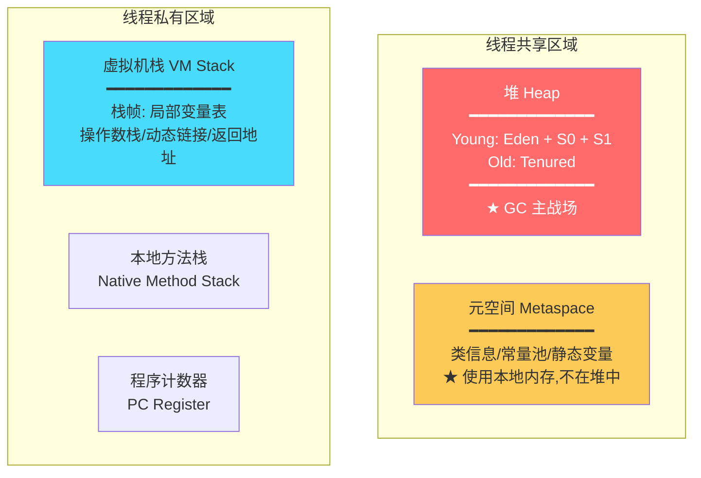
```mermaid
flowchart TB
    subgraph 线程共享["线程共享区域"]
        HEAP["堆 Heap<br/>━━━━━━━━━━━━━<br/>Young: Eden + S0 + S1<br/>Old: Tenured<br/>━━━━━━━━━━━━━<br/>★ GC 主战场"]
        META["元空间 Metaspace<br/>━━━━━━━━━━━━━<br/>类信息/常量池/静态变量<br/>★ 使用本地内存,不在堆中"]
    end

    subgraph 线程私有["线程私有区域"]
        STACK["虚拟机栈 VM Stack<br/>━━━━━━━━━━━━━<br/>栈帧: 局部变量表<br/>操作数栈/动态链接/返回地址"]
        NS["本地方法栈<br/>Native Method Stack"]
        PC["程序计数器<br/>PC Register"]
    end

    style HEAP fill:#ff6b6b,color:#fff
    style META fill:#feca57
    style STACK fill:#48dbfb
```


#### 历史演化：永久代 → 元空间

| 版本 | 类元数据存储 | 问题 |
|------|-------------|------|
| JDK 6 | 永久代（PermGen，堆内） | 大小固定，容易 OOM: PermGen space |
| JDK 7 | 永久代（字符串常量池移到堆） | 过渡方案 |
| JDK 8+ | 元空间（Metaspace，本地内存） | 不再受堆大小限制，按需扩展 |

> 🟠 **为什么要废弃永久代？**
> 1. **大小难以预估**：永久代需要 `-XX:MaxPermSize` 预设上限，设小了 OOM，设大了浪费
> 2. **GC 复杂**：永久代回收需要 Full GC，条件苛刻（类加载器无引用+无实例+Class 不可达）
> 3. **合并 HotSpot 与 JRockit**：JRockit 没有永久代概念，合并后统一为 Metaspace
> 4. **本地内存更灵活**：Metaspace 使用 mmap 分配，操作系统管理，弹性更好

#### 每个区域的 OOM 场景

| 区域 | OOM 类型 | 触发条件 | 典型场景 |
|------|----------|---------|---------|
| 堆 | `java.lang.OutOfMemoryError: Java heap space` | 对象过多/过大 | 内存泄漏、大集合 |
| 元空间 | `java.lang.OutOfMemoryError: Metaspace` | 类加载过多 | 动态代理、热部署 |
| 虚拟机栈 | `java.lang.StackOverflowError` | 栈帧过深 | 无限递归 |
| 直接内存 | `java.lang.OutOfMemoryError: Direct buffer memory` | NIO 堆外内存耗尽 | Netty 未 release |

---

### 1.2 🔴 堆内存分代模型

#### 设计动机：为什么要分代？

> 🔴 **弱分代假说（Weak Generational Hypothesis）**：
> - 绝大多数对象都是"朝生夕死"的（IBM 研究：98% 的对象在 Minor GC 时就死了）
> - 熬过越多次 GC 的对象越不容易死
>
> **结论**：把堆分成 Young 和 Old，对 Young 用高频快速的复制算法，对 Old 用低频但彻底的标记-整理。

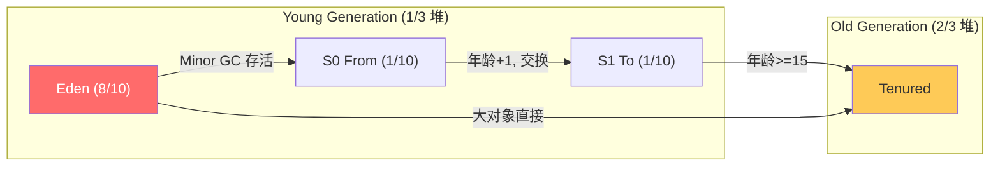
```mermaid
flowchart LR
    subgraph Young["Young Generation (1/3 堆)"]
        E["Eden (8/10)"]
        S0["S0 From (1/10)"]
        S1["S1 To (1/10)"]
    end

    subgraph Old["Old Generation (2/3 堆)"]
        T["Tenured"]
    end

    E -->|Minor GC 存活| S0
    S0 -->|年龄+1, 交换| S1
    S1 -->|年龄>=15| T
    E -->|大对象直接| T

    style E fill:#ff6b6b,color:#fff
    style T fill:#feca57
```


#### 对象晋升老年代的条件（源码级）

```java
// hotspot/src/share/vm/gc/shared/ageTable.cpp
// 动态年龄判定：如果 Survivor 中某个年龄段以下的对象总大小 > Survivor 空间的 50%
// 则该年龄及以上的对象直接晋升 Old（不需要等到 MaxTenuringThreshold）
uint ageTable::compute_tenuring_threshold(size_t desired_survivor_size) {
    size_t total = 0;
    uint age = 1;
    while (age < table_size) {
        total += sizes[age];  // 累加各年龄段大小
        if (total > desired_survivor_size) break;  // ★ 超过 50% 就停
        age++;
    }
    // 取 age 和 MaxTenuringThreshold 的较小值
    uint result = age < MaxTenuringThreshold ? age : MaxTenuringThreshold;
    return result;
}
```

> 🔴 **四种晋升老年代的条件**：
> 1. **年龄达到阈值**：`-XX:MaxTenuringThreshold=15`（默认 15，CMS 默认 6）
> 2. **动态年龄判定**：Survivor 中同龄及以下对象总大小 > Survivor 的 50%
> 3. **大对象直接进 Old**：`-XX:PretenureSizeThreshold=1m`（仅 Serial/ParNew 有效）
> 4. **Survivor 放不下**：Minor GC 后存活对象超过 Survivor 容量，直接进 Old

#### 🟢 避坑：动态年龄判定导致频繁 Full GC

> 🟢 **线上事故案例**：
> - **场景**：某订单服务，堆 4G，Young 1.3G，Survivor 各 130MB
> - **现象**：每次 Minor GC 后约 80MB 对象存活，年龄从 1 到 3 分布
> - **问题**：年龄 1+2+3 的对象总和 > 65MB（Survivor 的 50%），触发动态晋升
> - **结果**：大量年龄 3 的对象被送进 Old，Old 快速填满，频繁 Full GC（每分钟 2-3 次）
> - **修复**：增大 Survivor 空间 `-XX:SurvivorRatio=4`（Eden:S0:S1 = 4:1:1），或增大堆

> 🔴 **核心参数**：
> ```bash
> -Xms4g -Xmx4g                    # 堆初始/最大值（必须设相同，避免扩容STW）
> -XX:NewRatio=2                    # Old/Young = 2:1
> -XX:SurvivorRatio=8               # Eden/Survivor = 8:1:1
> -XX:MaxTenuringThreshold=15       # 晋升老年代的年龄阈值
> -XX:PretenureSizeThreshold=1m     # 大对象直接进 Old 的阈值
> -XX:TargetSurvivorRatio=50        # 动态年龄判定的 Survivor 使用率阈值
> ```

---

### 1.3 🔴 对象创建全过程（源码级剖析）

#### 完整时序

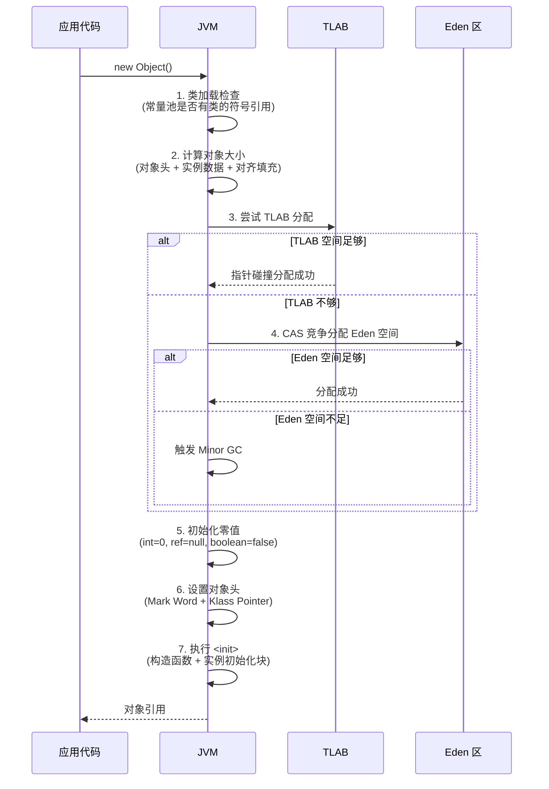
```mermaid
sequenceDiagram
    participant App as 应用代码
    participant JVM as JVM
    participant TLAB as TLAB
    participant Eden as Eden 区

    App->>JVM: new Object()
    JVM->>JVM: 1. 类加载检查<br/>(常量池是否有类的符号引用)
    JVM->>JVM: 2. 计算对象大小<br/>(对象头 + 实例数据 + 对齐填充)
    JVM->>TLAB: 3. 尝试 TLAB 分配
    alt TLAB 空间足够
        TLAB-->>JVM: 指针碰撞分配成功
    else TLAB 不够
        JVM->>Eden: 4. CAS 竞争分配 Eden 空间
        alt Eden 空间足够
            Eden-->>JVM: 分配成功
        else Eden 空间不足
            JVM->>JVM: 触发 Minor GC
        end
    end
    JVM->>JVM: 5. 初始化零值<br/>(int=0, ref=null, boolean=false)
    JVM->>JVM: 6. 设置对象头<br/>(Mark Word + Klass Pointer)
    JVM->>JVM: 7. 执行 <init><br/>(构造函数 + 实例初始化块)
    JVM-->>App: 对象引用
```


#### TLAB 深入（HotSpot 源码）

```cpp
// hotspot/src/share/vm/memory/threadLocalAllocBuffer.inline.hpp
HeapWord* ThreadLocalAllocBuffer::allocate(size_t size) {
    HeapWord* obj = top();           // 当前 TLAB 的分配指针
    if (pointer_delta(end(), obj) >= size) {
        // ★ TLAB 内空间充足：指针碰撞，无锁分配！
        set_top(obj + size);         // 移动指针
        return obj;
    }
    return NULL;  // TLAB 空间不足，需要走慢路径
}
```

> 🟠 **TLAB 的设计精妙之处**：
> - **为什么要 TLAB？** 多线程同时在 Eden 分配，如果用 CAS 竞争同一个指针，高并发下性能极差
> - **核心思路**：每个线程预分配一小块 Eden 空间（默认 Eden 的 1%），线程内分配无锁
> - **空间不足时**：申请新的 TLAB（需 CAS），或直接在 Eden 用 CAS 分配（大对象）
> - **浪费问题**：每个 TLAB 尾部可能有碎片（refill_waste），JVM 会统计并动态调整 TLAB 大小
>
> **相关参数**：
> ```bash
> -XX:+UseTLAB                  # 开启 TLAB（默认开启）
> -XX:TLABSize=512k             # TLAB 初始大小
> -XX:TLABRefillWasteFraction=64  # 允许浪费比例 = TLAB/64
> ```

#### 指针碰撞 vs 空闲列表

| 分配方式 | 条件 | 原理 | 对应收集器 |
|---------|------|------|-----------|
| **指针碰撞** | 内存规整（无碎片） | 移动分界指针 | Serial、ParNew、G1 |
| **空闲列表** | 内存不规整（有碎片） | 维护可用块链表 | CMS（标记-清除有碎片） |

---

### 1.4 🔴 对象头结构（64位 JVM 深入）

#### Mark Word 在不同状态下的位布局

```
64 bits Mark Word 布局：

无锁状态 (Normal):
┌──────────────────────────────────────────────────────────────┐
│ unused:25 │ hashCode:31 │ unused:1 │ age:4 │ biased:0 │ 01  │
└──────────────────────────────────────────────────────────────┘

偏向锁 (Biased):
┌──────────────────────────────────────────────────────────────┐
│ thread:54          │ epoch:2 │ unused:1 │ age:4 │ biased:1 │ 01  │
└──────────────────────────────────────────────────────────────┘

轻量级锁 (Lightweight Locked):
┌──────────────────────────────────────────────────────────────┐
│ ptr_to_lock_record:62                                    │ 00  │
└──────────────────────────────────────────────────────────────┘

重量级锁 (Heavyweight Locked):
┌──────────────────────────────────────────────────────────────┐
│ ptr_to_heavyweight_monitor:62                            │ 10  │
└──────────────────────────────────────────────────────────────┘

GC 标记 (Marked for GC):
┌──────────────────────────────────────────────────────────────┐
│ (empty)                                                  │ 11  │
└──────────────────────────────────────────────────────────────┘
```

> 🟠 **面试追问：为什么调用了 hashCode() 后偏向锁会被撤销？**
>
> 观察上面的位布局：偏向锁状态下 Mark Word 存的是 `thread:54 + epoch:2`，没有位置存 hashCode。
> 而一旦调用了 `Object.hashCode()`（identity hash code），必须在 Mark Word 中保存 31 位 hashCode。
> 两者布局冲突 → 只能撤销偏向锁，回到无锁/轻量级锁状态。
>
> 这也是为什么在同步代码块内不要调用 `hashCode()` 的原因之一——会导致锁膨胀。


#### 对象内存布局实例

```java
// 以下对象在 64 位 JVM（开启压缩指针）中的内存布局
public class User {
    int id;          // 4 bytes
    long timestamp;  // 8 bytes
    String name;     // 4 bytes (压缩指针)
    byte status;     // 1 byte
}

// 内存布局：
// [对象头 Mark Word]    8 bytes
// [Klass Pointer]      4 bytes (压缩指针)
// [id: int]            4 bytes
// [timestamp: long]    8 bytes
// [name: String ref]   4 bytes
// [status: byte]       1 byte
// [padding]            3 bytes (对齐到 8 的倍数)
// ──────────────────────────────
// Total:               32 bytes

// 使用 JOL 工具验证：
// java -jar jol-cli.jar internals com.example.User
```

> 🟡 **加分点**：使用 OpenJDK JOL（Java Object Layout）工具可以精确查看任何对象的内存布局。面试中提到这个工具说明你有实操经验。

### 1.5 🟢 避坑提醒（线上事故案例）

> 🟢 **事故案例 1：堆扩容导致长时间 STW**
> - **场景**：某交易服务，`-Xms512m -Xmx4g`（初始 512MB，最大 4GB）
> - **现象**：每天凌晨批处理时 GC 停顿突然变长（从 50ms 到 3s）
> - **根因**：批处理创建大量对象，堆从 512MB 扩容到 2GB，扩容期间需要 STW 来调整内部数据结构
> - **修复**：`-Xms4g -Xmx4g` 设为相同值，启动时一次性分配，避免运行时扩容
> - **教训**：**生产环境 Xms 必须等于 Xmx**

> 🟢 **事故案例 2：Metaspace 泄漏导致服务重启**
> - **场景**：某 Spring Boot 应用使用了大量动态代理（CGLIB）
> - **现象**：运行 3-5 天后出现 `OutOfMemoryError: Metaspace`
> - **根因**：每次热部署/动态代理都创建新 ClassLoader，旧 ClassLoader 不回收（被缓存引用）
> - **修复**：
>   1. 设置 `-XX:MaxMetaspaceSize=256m` 兜底
>   2. 排查代码中对 ClassLoader 的强引用
>   3. 添加 `-XX:+TraceClassLoading -XX:+TraceClassUnloading` 观察类加载/卸载
> - **教训**：Metaspace 不设上限 = 定时炸弹

> 🟢 **事故案例 3：压缩指针意外关闭导致内存暴增**
> - **场景**：某服务升级堆大小从 30GB 到 33GB
> - **现象**：升级后 RSS 从 35GB 暴增到 50GB+，OOM Kill
> - **根因**：堆 > 32GB 时压缩指针（CompressedOops）自动关闭，所有引用从 4 字节变 8 字节
> - **修复**：堆大小改回 31GB（或直接跳到 48GB 以上才有意义）
> - **教训**：**堆大小在 32GB 附近是性能悬崖**，要么 <32GB 用压缩指针，要么 >>32GB

---

## 2. 垃圾回收算法与收集器

### 2.1 🔴 判断对象是否存活

#### 设计动机：为什么用可达性分析而不是引用计数？


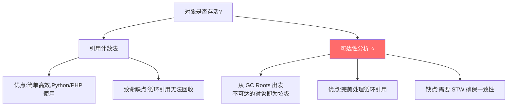
```mermaid
flowchart TD
    A[对象是否存活?] --> B[引用计数法]
    A --> C[可达性分析 ⭐]

    B --> B1[优点:简单高效,Python/PHP 使用]
    B --> B2[致命缺点:循环引用无法回收]

    C --> C1[从 GC Roots 出发<br/>不可达的对象即为垃圾]
    C --> C2[优点:完美处理循环引用]
    C --> C3[缺点:需要 STW 确保一致性]

    style C fill:#ff6b6b,color:#fff
```

> 🔴 **引用计数的循环引用问题**：
> ```java
> // 循环引用示例——引用计数法无法回收
> public class CircularRef {
>     Object ref;
>     public static void main(String[] args) {
>         CircularRef a = new CircularRef();
>         CircularRef b = new CircularRef();
>         a.ref = b;  // a 引用 b，b 计数 = 1
>         b.ref = a;  // b 引用 a，a 计数 = 1
>         a = null;   // a 计数 = 1（b.ref 还指着）
>         b = null;   // b 计数 = 1（a.ref 还指着）
>         // 引用计数法认为 ab 都不是垃圾（计数≠0）
>         // 但实际上已经无法从任何 GC Root 到达它们
>         System.gc(); // JVM 的可达性分析能正确回收
>     }
> }
> ```

> 🔴 **GC Roots 完整清单**：
> 1. **虚拟机栈**中引用的对象（局部变量、方法参数）
> 2. **方法区**中类静态属性引用的对象（static 字段）
> 3. **方法区**中常量引用的对象（static final 字段）
> 4. **本地方法栈**中 JNI（Native）引用的对象
> 5. JVM 内部引用（基本类型的 Class 对象、系统 ClassLoader、常驻异常对象等）
> 6. **所有被 synchronized 持有的对象**
> 7. JMXBean、JVMTI 注册的回调、本地代码缓存等

#### 三色标记法（并发 GC 的基础）

> 🟠 **为什么并发 GC 需要三色标记？**
>
> 在 STW 的 GC 中，标记是单线程/多线程独占完成的，不需要考虑对象引用关系变化。
> 但在 CMS/G1/ZGC 等**并发标记**的收集器中，GC 线程和应用线程同时运行，引用关系在标记过程中会变化。
> 三色标记法用于追踪标记进度：


```mermaid
flowchart LR
    W["白色<br/>未被扫描<br/>(可能是垃圾)"] --> G["灰色<br/>自身已标记<br/>但引用的对象<br/>还没全标完"]
    G --> B["黑色<br/>自身+引用的对象<br/>都已标完<br/>(确定存活)"]

    style W fill:#ffffff,stroke:#333
    style G fill:#cccccc,stroke:#333
    style B fill:#333333,color:#fff
```

> 🟠 **并发标记的漏标问题**（对象消失问题）：
>
> 如果同时满足以下两个条件，会出现**存活对象被误判为垃圾**：
> 1. 赋值器（应用线程）插入了一条从**黑色**对象到**白色**对象的引用
> 2. 赋值器删除了所有从**灰色**对象到该**白色**对象的引用
>
> **解决方案**：
> - **增量更新（Incremental Update）**：CMS 使用。记录黑色对象新增的引用，重新标记阶段重新扫描这些黑色对象
> - **原始快照（SATB, Snapshot At The Beginning）**：G1 使用。记录灰色对象删除的引用，保守地认为这些白色对象是存活的

---

### 2.2 🔴 四大垃圾回收算法

#### 完整 trade-off 分析


| 算法 | 适用代 | 时间复杂度 | 空间开销 | 碎片 | STW 时间 | 代表收集器 |
|------|--------|-----------|---------|------|---------|-----------|
| **标记-清除** | Old | O(存活+垃圾) | 无额外 | 有碎片 | 长（全堆扫描） | CMS |
| **标记-整理** | Old | O(存活) | 无额外 | 无碎片 | 最长（移动对象） | Serial Old, Parallel Old |
| **复制** | Young | O(存活) | 需要 To 空间 | 无碎片 | 短（只复制存活） | Serial, ParNew, PS |
| **分代收集** | 全堆 | 综合 | 综合 | 综合 | 综合最优 | G1, ZGC |

> 🔴 **记忆口诀：清整复分**
> - **清**（标记-清除）：简单但碎，CMS 的无奈之选
> - **整**（标记-整理）：无碎但慢，老年代兜底方案
> - **复**（复制）：快且无碎，但费空间，年轻代首选
> - **分**（分代收集）：扬长避短，现代 GC 的基础思想

#### 标记-清除的碎片灾难

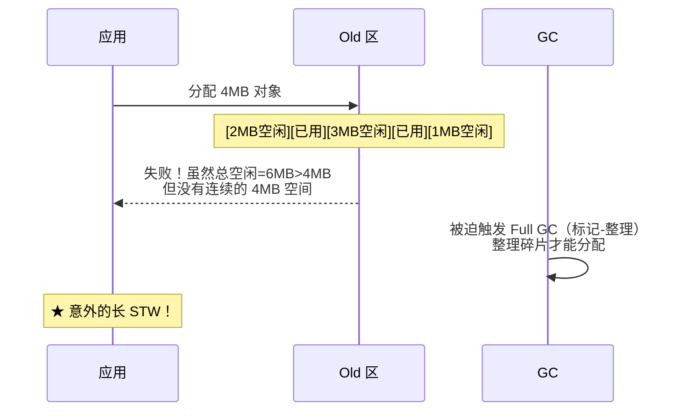
```mermaid
sequenceDiagram
    participant App as 应用
    participant Heap as Old 区
    participant GC as GC

    App->>Heap: 分配 4MB 对象
    Note over Heap: [2MB空闲][已用][3MB空闲][已用][1MB空闲]
    Heap-->>App: 失败！虽然总空闲=6MB>4MB<br/>但没有连续的 4MB 空间
    GC->>GC: 被迫触发 Full GC（标记-整理）<br/>整理碎片才能分配
    Note over App: ★ 意外的长 STW！
```

> 🟢 **线上事故**：CMS 碎片导致突发 Full GC
> - **场景**：某电商服务使用 CMS 收集器，Old 区 2GB
> - **现象**：服务运行 2-3 天后突然出现 8s+ 的 STW
> - **根因**：CMS 并发清除不整理，Old 区碎片化严重。大对象分配时找不到连续空间，触发 Serial Old 单线程 Full GC
> - **日志特征**：`[GC (Allocation Failure)] [ParNew: ... -> ...][CMS: concurrent mode failure]`
> - **修复**：
>   1. 迁移到 G1（Region 间复制，天然无碎片）
>   2. 临时方案：`-XX:CMSFullGCsBeforeCompaction=2`（每 2 次 Full GC 后整理一次）

---

### 2.3 🔴 垃圾收集器全家福

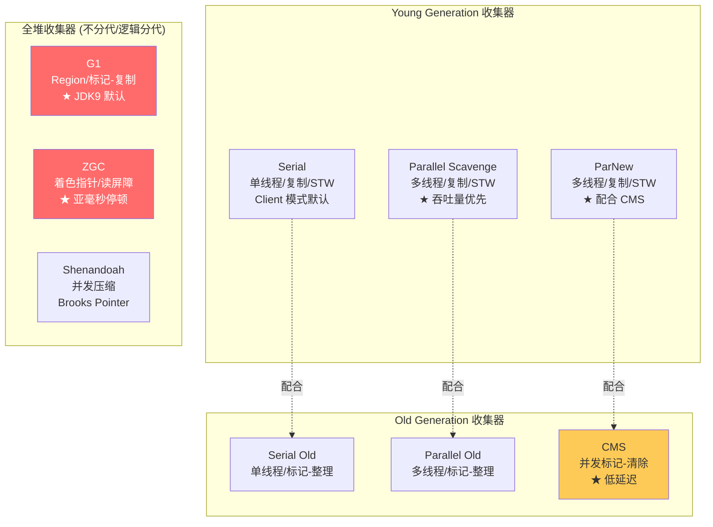
```mermaid
flowchart TB
    subgraph Young["Young Generation 收集器"]
        S[Serial<br/>单线程/复制/STW<br/>Client 模式默认]
        PN[ParNew<br/>多线程/复制/STW<br/>★ 配合 CMS]
        PS[Parallel Scavenge<br/>多线程/复制/STW<br/>★ 吞吐量优先]
    end

    subgraph Old["Old Generation 收集器"]
        SO[Serial Old<br/>单线程/标记-整理]
        PO[Parallel Old<br/>多线程/标记-整理]
        CMS[CMS<br/>并发标记-清除<br/>★ 低延迟]
    end

    subgraph 全堆["全堆收集器 (不分代/逻辑分代)"]
        G1[G1<br/>Region/标记-复制<br/>★ JDK9 默认]
        ZGC[ZGC<br/>着色指针/读屏障<br/>★ 亚毫秒停顿]
        SH[Shenandoah<br/>并发压缩<br/>Brooks Pointer]
    end

    S -.配合.-> SO
    PN -.配合.-> CMS
    PS -.配合.-> PO

    style G1 fill:#ff6b6b,color:#fff
    style ZGC fill:#ff6b6b,color:#fff
    style CMS fill:#feca57
```

#### 收集器演化时间线

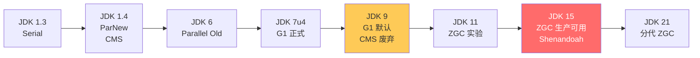
```mermaid
flowchart LR
    JDK1["JDK 1.3<br/>Serial"] --> JDK4["JDK 1.4<br/>ParNew<br/>CMS"]
    JDK4 --> JDK6["JDK 6<br/>Parallel Old"]
    JDK6 --> JDK7["JDK 7u4<br/>G1 正式"]
    JDK7 --> JDK9["JDK 9<br/>G1 默认<br/>CMS 废弃"]
    JDK9 --> JDK11["JDK 11<br/>ZGC 实验"]
    JDK11 --> JDK15["JDK 15<br/>ZGC 生产可用<br/>Shenandoah"]
    JDK15 --> JDK21["JDK 21<br/>分代 ZGC"]

    style JDK9 fill:#feca57
    style JDK15 fill:#ff6b6b,color:#fff
```

---

### 2.4 🔴 CMS 收集器深入（Concurrent Mark Sweep）

#### 设计动机

> 🔴 **CMS 解决什么问题？**
> 在 CMS 之前，Old 区只有 Serial Old 和 Parallel Old，都是完全 STW 的。
> 对于堆 4GB+ 的应用，Full GC 可能需要 5-10 秒，这对在线服务是不可接受的。
> CMS 的目标：**让 GC 的大部分工作与应用线程并发执行**，只在少量阶段短暂 STW。

#### 四阶段详细时序

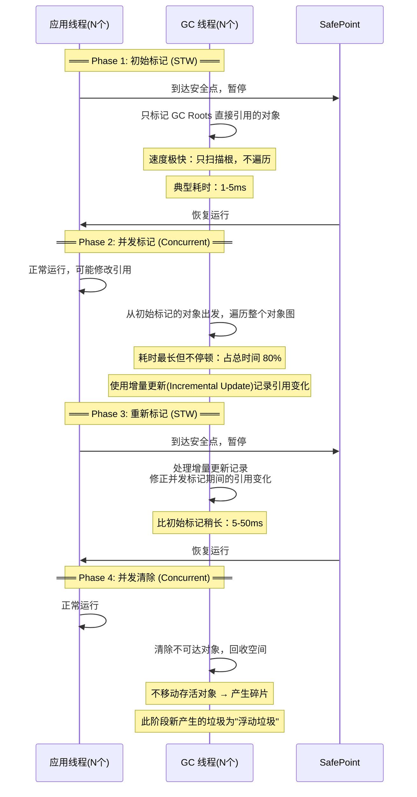
```mermaid
sequenceDiagram
    participant App as 应用线程(N个)
    participant GC as GC 线程(N个)
    participant OS as SafePoint

    Note over App,GC: ═══ Phase 1: 初始标记 (STW) ═══
    App->>OS: 到达安全点，暂停
    GC->>GC: 只标记 GC Roots 直接引用的对象
    Note over GC: 速度极快：只扫描根，不遍历
    Note over GC: 典型耗时：1-5ms
    OS->>App: 恢复运行

    Note over App,GC: ═══ Phase 2: 并发标记 (Concurrent) ═══
    App->>App: 正常运行，可能修改引用
    GC->>GC: 从初始标记的对象出发，遍历整个对象图
    Note over GC: 耗时最长但不停顿：占总时间 80%
    Note over GC: 使用增量更新(Incremental Update)记录引用变化

    Note over App,GC: ═══ Phase 3: 重新标记 (STW) ═══
    App->>OS: 到达安全点，暂停
    GC->>GC: 处理增量更新记录<br/>修正并发标记期间的引用变化
    Note over GC: 比初始标记稍长：5-50ms
    OS->>App: 恢复运行

    Note over App,GC: ═══ Phase 4: 并发清除 (Concurrent) ═══
    App->>App: 正常运行
    GC->>GC: 清除不可达对象，回收空间
    Note over GC: 不移动存活对象 → 产生碎片
    Note over GC: 此阶段新产生的垃圾为"浮动垃圾"
```


#### CMS 的五大缺陷及应对

| # | 缺陷 | 原因 | 应对方案 |
|---|------|------|---------|
| 1 | **内存碎片** | 标记-清除不整理 | `-XX:CMSFullGCsBeforeCompaction=N` |
| 2 | **浮动垃圾** | 并发清除阶段新产生的垃圾 | 提高触发阈值，预留空间 |
| 3 | **CPU 资源抢占** | 并发阶段 GC 线程与应用线程竞争 | GC 线程数 = (CPU核数+3)/4 |
| 4 | **Concurrent Mode Failure** | 并发收集时 Old 空间不足 | 降低 `-XX:CMSInitiatingOccupancyFraction`（默认 92%→建议 70%） |
| 5 | **Promotion Failure** | Young GC 后晋升到 Old 但 Old 碎片太多放不下 | 增大 Old 或迁移 G1 |

> 🟢 **Concurrent Mode Failure 事故案例**：
> - **场景**：某广告系统，堆 8GB，Old 约 5.3GB，CMS 触发阈值 92%
> - **现象**：高峰期突然出现 15s+ STW，Grafana 报警
> - **根因**：CMS 并发收集速度赶不上 Old 区增长速度。Old 使用率还没降下来，新对象又晋升进来，触发 Concurrent Mode Failure → 退化为 Serial Old 单线程 Full GC
> - **日志**：`[GC (CMS Initial Mark)] ... [CMS-concurrent-mark: 2.5s] ... [Full GC (Allocation Failure)] 15234ms`
> - **修复**：
>   1. 降低触发阈值：`-XX:CMSInitiatingOccupancyFraction=70`（提前触发 CMS）
>   2. 增大 Old 区：堆从 8GB 增到 12GB
>   3. 最终方案：迁移到 G1，彻底解决碎片问题

#### CMS 关键参数一览

```bash
-XX:+UseConcMarkSweepGC                    # 启用 CMS
-XX:CMSInitiatingOccupancyFraction=70      # Old 使用率达 70% 就触发 CMS
-XX:+UseCMSInitiatingOccupancyOnly         # 只用固定阈值，不自适应
-XX:+CMSParallelRemarkEnabled              # 重新标记阶段并行
-XX:+CMSScavengeBeforeRemark               # 重新标记前先做一次 Young GC（减少跨代引用扫描）
-XX:CMSFullGCsBeforeCompaction=2           # 每 2 次 Full GC 后做一次压缩整理
-XX:+UseCMSCompactAtFullCollection         # Full GC 时做压缩（JDK 9 后默认）
-XX:ConcGCThreads=4                        # 并发 GC 线程数
```

---

### 2.5 🟠 收集器选型决策树

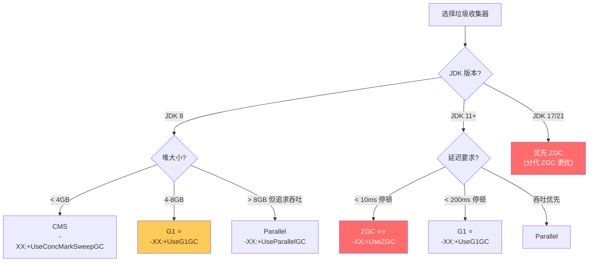
```mermaid
flowchart TD
    START["选择垃圾收集器"] --> Q1{"JDK 版本?"}
    Q1 -->|JDK 8| Q2{"堆大小?"}
    Q1 -->|JDK 11+| Q3{"延迟要求?"}
    Q1 -->|JDK 17/21| Q4["优先 ZGC<br/>(分代 ZGC 更优)"]

    Q2 -->|"< 4GB"| A1["CMS<br/>-XX:+UseConcMarkSweepGC"]
    Q2 -->|"4-8GB"| A2["G1 ⭐<br/>-XX:+UseG1GC"]
    Q2 -->|"> 8GB 但追求吞吐"| A3["Parallel<br/>-XX:+UseParallelGC"]

    Q3 -->|"< 10ms 停顿"| A4["ZGC ⭐⭐<br/>-XX:+UseZGC"]
    Q3 -->|"< 200ms 停顿"| A5["G1 ⭐<br/>-XX:+UseG1GC"]
    Q3 -->|"吞吐优先"| A6["Parallel"]

    style Q4 fill:#ff6b6b,color:#fff
    style A4 fill:#ff6b6b,color:#fff
    style A2 fill:#feca57
```

| 场景 | 推荐收集器 | 理由 | 典型 STW |
|------|-----------|------|---------|
| Web 应用（JDK 8，堆 4G） | G1 | 平衡延迟和吞吐 | 50-200ms |
| 微服务（JDK 17+，堆 2-8G） | ZGC | 亚毫秒停顿 | < 1ms |
| 大数据批处理（堆 16G+） | Parallel | 吞吐量最高 | 1-10s 但无所谓 |
| 金融交易（JDK 11+） | ZGC / Shenandoah | 极低延迟 | < 1ms |
| 客户端/嵌入式 | Serial | 最小 footprint | 可接受 |
| 遗留系统（JDK 8，堆 < 2G） | CMS | 成熟稳定 | 10-100ms |

---

## 3. G1 / ZGC 深入

### 3.1 🔴 G1 收集器核心原理

#### 设计动机：G1 解决了什么？

> 🔴 **G1 的设计目标**：
> 1. **可预测的停顿**：用户可以指定"在 M 毫秒内 GC 时间不超过 N 毫秒"
> 2. **无碎片**：Region 间用复制算法，不像 CMS 那样产生碎片
> 3. **大堆支持**：不需要分代大小的精确调优
>
> **核心创新**：把堆划分为大量等大的 Region，每次只选择回收价值最高的 Region（Garbage First = 优先回收垃圾最多的区域）


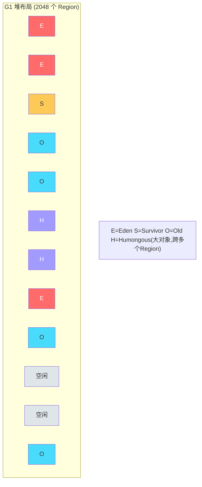
```mermaid
flowchart TB
    subgraph G1堆布局["G1 堆布局 (2048 个 Region)"]
        direction LR
        R1["E"] 
        R2["E"]
        R3["S"]
        R4["O"]
        R5["O"]
        R6["H"]
        R7["H"]
        R8["E"]
        R9["O"]
        R10["空闲"]
        R11["空闲"]
        R12["O"]
    end

    Note["E=Eden S=Survivor O=Old H=Humongous(大对象,跨多个Region)"]

    style R1 fill:#ff6b6b,color:#fff
    style R2 fill:#ff6b6b,color:#fff
    style R8 fill:#ff6b6b,color:#fff
    style R3 fill:#feca57
    style R4 fill:#48dbfb
    style R5 fill:#48dbfb
    style R9 fill:#48dbfb
    style R12 fill:#48dbfb
    style R6 fill:#a29bfe,color:#fff
    style R7 fill:#a29bfe,color:#fff
    style R10 fill:#dfe6e9
    style R11 fill:#dfe6e9
```

> 🔴 **G1 核心概念**：
> - **Region**：堆被划分为 ~2048 个大小相等的 Region（1MB~32MB，必须是 2 的幂）
> - **逻辑分代**：Region 不是固定属于某一代，而是动态切换角色（E→S→O→空闲）
> - **Humongous**：超过 Region 50% 的对象被视为大对象，分配到 H Region（连续多个）
> - **CSet（Collection Set）**：每次 GC 选择回收的 Region 集合
> - **RSet（Remembered Set）**：记录跨 Region 引用，避免全堆扫描

#### G1 的停顿预测模型

```java
// G1 使用衰减平均值（Decaying Average）预测每个 Region 的回收耗时
// hotspot/src/share/vm/gc/g1/g1Policy.cpp (简化)

// 预测回收一个 Region 的时间 = 扫描 RSet 时间 + 复制存活对象时间
double predict_region_elapsed_time(HeapRegion* hr) {
    double rset_scan_time = predict_rs_scan_time(hr->rem_set()->occupied());
    double copy_time = predict_object_copy_time(hr->live_bytes());
    return rset_scan_time + copy_time;
}

// 选择 CSet：贪心算法，按"垃圾率/回收耗时"排序，选到累计耗时接近 MaxGCPauseMillis
void select_cset() {
    sort_regions_by_gc_efficiency();  // 按回收效率降序排列
    double accumulated_time = 0;
    for (HeapRegion* hr : old_regions) {
        double predicted_time = predict_region_elapsed_time(hr);
        if (accumulated_time + predicted_time > MaxGCPauseMillis) break;
        add_to_cset(hr);
        accumulated_time += predicted_time;
    }
}
```

> 🟠 **为什么 MaxGCPauseMillis 不能设太小？**
> - 设太小（如 10ms）→ 每次只能回收很少的 Region → 垃圾回收速度赶不上分配速度
> - 最终导致 Mixed GC 无法回收足够空间 → 触发 Full GC（单线程，灾难性停顿）
> - **建议值**：200ms（默认）对大多数应用足够；极端低延迟场景设 50-100ms

### 3.2 🔴 G1 收集过程详解

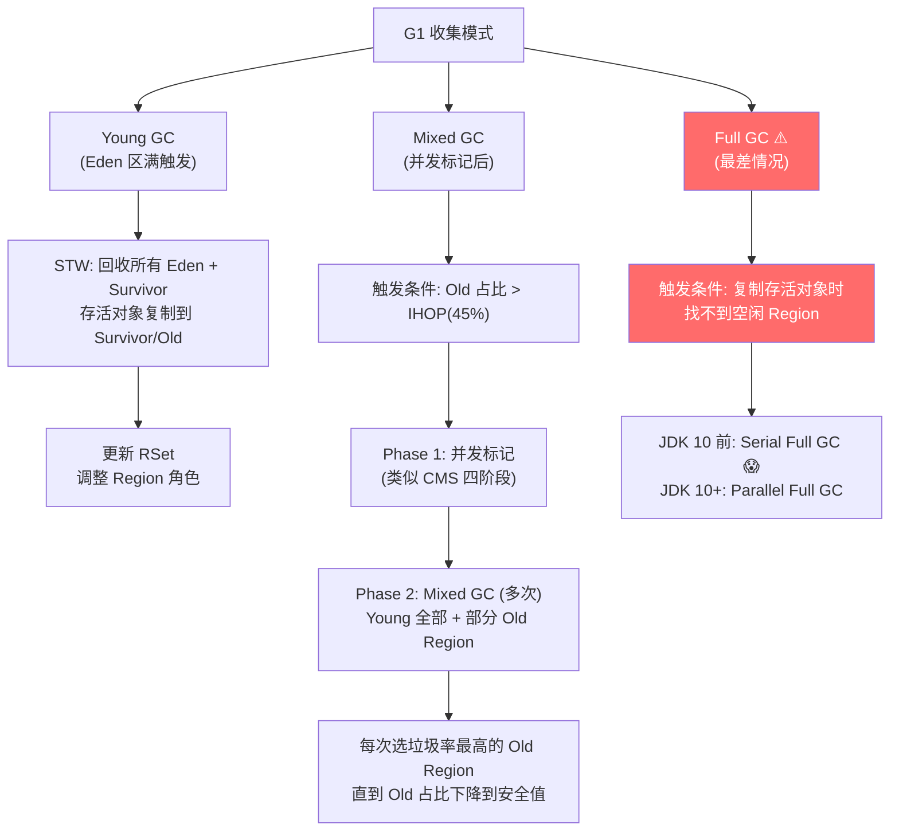
```mermaid
flowchart TD
    A["G1 收集模式"] --> B["Young GC<br/>(Eden 区满触发)"]
    A --> C["Mixed GC<br/>(并发标记后)"]
    A --> D["Full GC ⚠️<br/>(最差情况)"]

    B --> B1["STW: 回收所有 Eden + Survivor<br/>存活对象复制到 Survivor/Old"]
    B1 --> B2["更新 RSet<br/>调整 Region 角色"]

    C --> C0["触发条件: Old 占比 > IHOP(45%)"]
    C0 --> C1["Phase 1: 并发标记<br/>(类似 CMS 四阶段)"]
    C1 --> C2["Phase 2: Mixed GC (多次)<br/>Young 全部 + 部分 Old Region"]
    C2 --> C3["每次选垃圾率最高的 Old Region<br/>直到 Old 占比下降到安全值"]

    D --> D1["触发条件: 复制存活对象时<br/>找不到空闲 Region"]
    D1 --> D2["JDK 10 前: Serial Full GC 😱<br/>JDK 10+: Parallel Full GC"]

    style D fill:#ff6b6b,color:#fff
    style D1 fill:#ff6b6b,color:#fff
```

#### Young GC 详细过程

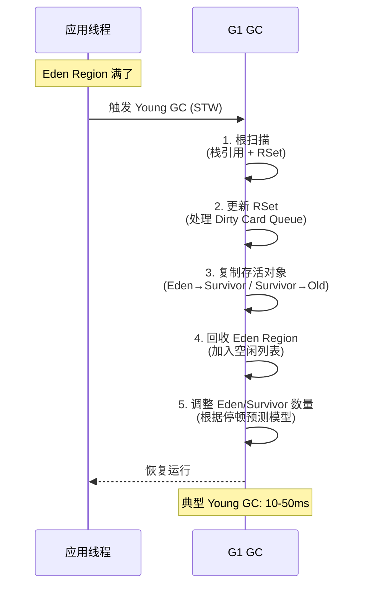
```mermaid
sequenceDiagram
    participant App as 应用线程
    participant G1 as G1 GC

    Note over App: Eden Region 满了
    App->>G1: 触发 Young GC (STW)

    G1->>G1: 1. 根扫描<br/>(栈引用 + RSet)
    G1->>G1: 2. 更新 RSet<br/>(处理 Dirty Card Queue)
    G1->>G1: 3. 复制存活对象<br/>(Eden→Survivor / Survivor→Old)
    G1->>G1: 4. 回收 Eden Region<br/>(加入空闲列表)
    G1->>G1: 5. 调整 Eden/Survivor 数量<br/>(根据停顿预测模型)

    G1-->>App: 恢复运行
    Note over G1: 典型 Young GC: 10-50ms
```

### 3.3 🟠 G1 中的 Remembered Set (RSet) 与 Card Table

#### 设计动机：跨代/跨 Region 引用问题

> 🟠 **问题**：Young GC 时只回收 Young Region，但 Old Region 可能引用了 Young Region 的对象。
> 如果不知道哪些 Old Region 引用了 Young Region，就不得不扫描整个 Old 区（太慢！）

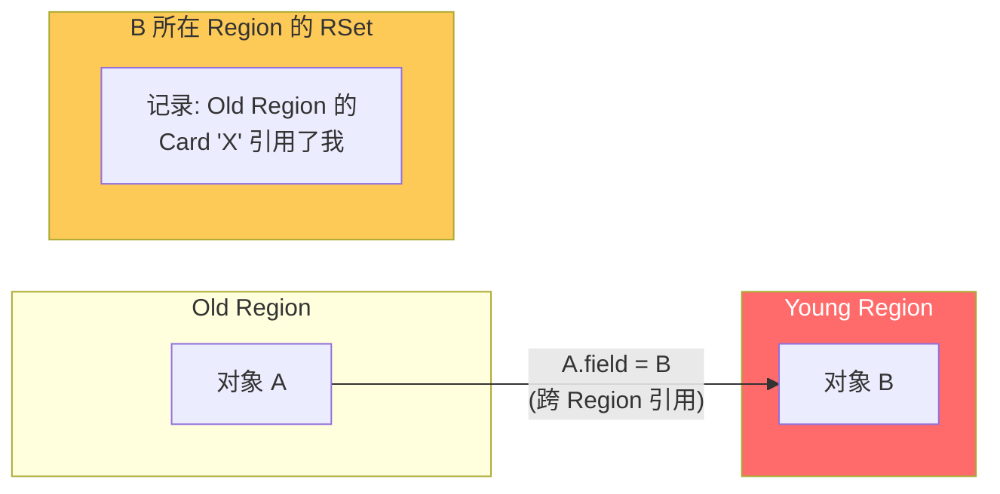
```mermaid
flowchart LR
    subgraph Old["Old Region"]
        OBJ_A["对象 A"]
    end
    subgraph Young["Young Region"]
        OBJ_B["对象 B"]
    end

    OBJ_A -->|"A.field = B<br/>(跨 Region 引用)"| OBJ_B

    subgraph RSet["B 所在 Region 的 RSet"]
        RS["记录: Old Region 的<br/>Card 'X' 引用了我"]
    end

    style Young fill:#ff6b6b,color:#fff
    style RSet fill:#feca57
```

> 🟠 **RSet + Card Table 的工作原理**：
> 1. 每个 Region 有一个 RSet，记录"谁引用了我"（Point-into）
> 2. 堆被划分为大量 512 字节的 Card，Card Table 记录每个 Card 是否"脏"（有跨 Region 引用）
> 3. 写屏障（Write Barrier）：每次引用赋值 `a.field = b` 时，如果 a 和 b 不在同一个 Region，标记对应 Card 为脏
> 4. 并发 Refinement 线程：异步处理脏 Card，更新目标 Region 的 RSet


#### 写屏障源码（HotSpot 简化）

```cpp
// 每次引用写入时的 Post Write Barrier
void oop_store(oop* field, oop new_value) {
    *field = new_value;  // 实际赋值

    // ★ 写屏障：检查是否跨 Region
    if (is_cross_region(field, new_value)) {
        // 将对应的 Card 加入 Dirty Card Queue
        CardTableModRefBS::dirty_card(field);
        // Refinement 线程会异步处理队列，更新 RSet
    }
}
```

> 🟢 **RSet 的空间开销**：
> - RSet 占整个堆内存的 **5%-20%**
> - Region 越小 / 跨 Region 引用越多 → RSet 越大
> - **监控方式**：GC 日志中的 `[Scan RS: Xms]` 如果很高，说明 RSet 过大
> - **优化**：增大 Region 大小（减少跨 Region 引用）或减少对象间的远距离引用

### 3.4 🔴 G1 关键参数与调优

```bash
# 基础参数
-XX:+UseG1GC                                 # 启用 G1
-XX:MaxGCPauseMillis=200                     # ★ 目标停顿时间(ms)，最核心的调优旋钮
-XX:G1HeapRegionSize=8m                      # Region 大小(1-32MB，必须是2的幂)
-XX:InitiatingHeapOccupancyPercent=45        # 触发并发标记的堆占比(IHOP)
-XX:G1MixedGCCountTarget=8                   # Mixed GC 分几次完成

# 高级参数
-XX:G1NewSizePercent=5                       # Young 区最小占比
-XX:G1MaxNewSizePercent=60                   # Young 区最大占比
-XX:G1MixedGCLiveThresholdPercent=85         # Region 存活率超过此值则不回收
-XX:G1ReservePercent=10                      # 预留空闲 Region（防止复制时无处可放）
-XX:ConcGCThreads=4                          # 并发标记线程数
-XX:ParallelGCThreads=8                      # STW 并行 GC 线程数
```

> 🟢 **G1 调优黄金法则**：
> 1. **不要手动设置 Young/Old 比例**：G1 会根据 MaxGCPauseMillis 自动调整
> 2. **主要调 MaxGCPauseMillis**：太大→延迟高；太小→吞吐低/可能 Full GC
> 3. **关注 Humongous 分配**：大对象直接进 Old Region，可能触发意外的 Mixed GC
> 4. **IHOP 不要设太高**：留给并发标记足够的时间

### 3.5 🟡 ZGC 深入（JDK 15+ 生产可用）

#### 设计动机

> 🟡 **ZGC 要解决什么？**
> G1 的停顿虽然可控（通常 50-200ms），但对于金融交易、实时广告等场景仍然太长。
> ZGC 的目标：**停顿时间不超过 1ms，且与堆大小无关**（16GB 和 16TB 一样快）。
>
> **核心创新**：把所有需要 STW 的工作（包括对象移动）都变成并发的。

#### ZGC 核心技术：着色指针

```
64 位指针中的布局（ZGC）：

┌───────────────────────────────────────────────────────────────────┐
│ 未使用:16 │ Finalizable:1 │ Remapped:1 │ Marked1:1 │ Marked0:1 │ 对象地址:44 │
└───────────────────────────────────────────────────────────────────┘
                    ↑ 4 个标志位（着色）             ↑ 44 位地址 = 16TB 寻址空间
```

> 🟡 **着色指针的精妙之处**：
> - 不需要额外的 Mark Bitmap 或 Card Table 来记录 GC 状态
> - GC 信息直接编码在指针中，读取对象时就能知道 GC 状态
> - 配合**多重映射（Multi-Mapping）**：同一物理内存映射到 3 个虚拟地址（Marked0/Marked1/Remapped）

#### ZGC 读屏障（Load Barrier）

```java
// 伪代码：ZGC 的读屏障
Object loadReference(Object* field) {
    Object ref = *field;  // 读取引用

    // ★ 检查指针颜色
    if (ref.isNotRemapped()) {
        // 指针指向的是旧地址（对象已经被移动了）
        ref = slowPath(ref);  // 自愈：更新指针到新地址
        *field = ref;         // 回写到原位置（下次读就不需要慢路径了）
    }
    return ref;
}
```

> 🟡 **为什么用读屏障而不是写屏障？**
> - G1/CMS 用**写屏障**：每次写入引用时记录（用于跨代引用追踪）
> - ZGC 用**读屏障**：每次读取引用时检查并自愈（用于并发移动对象后的指针更新）
> - 读屏障的代价：读操作略有开销（约 4%），但换来了**完全并发的对象移动**

#### G1 vs ZGC 完整对比

| 维度 | G1 | ZGC |
|------|----|----|
| 最大停顿 | 50-500ms | **< 1ms** |
| 支持堆大小 | 4-64 GB 最佳 | **8MB - 16TB** |
| 对象移动 | STW 阶段复制 | **并发移动（读屏障自愈）** |
| 内存映射 | 普通映射 | **Multi-Mapping（3份虚拟地址）** |
| 碎片处理 | Region 间复制 | **并发压缩** |
| 分代 | 逻辑分代 | **JDK 21 分代 ZGC** |
| 吞吐量 | ⭐⭐⭐⭐ | ⭐⭐⭐（读屏障有 ~4% 开销） |
| 延迟 | ⭐⭐⭐ | ⭐⭐⭐⭐⭐ |
| 适用 JDK | 9+ | 15+（生产），21+（分代 ZGC） |
| 参数调优 | 需要精细调优 | **几乎不需要调优** |

```bash
# ZGC 启动参数（极简）
-XX:+UseZGC
-XX:+ZGenerational              # JDK 21+ 分代 ZGC（强烈推荐）
-Xmx16g                         # 只需设置最大堆，其他 ZGC 自动管理
-Xlog:gc*:file=/var/log/gc.log  # GC 日志
```

---


## 4. 类加载机制

### 4.1 🔴 类加载过程（每阶段深入）


```mermaid
flowchart LR
    A["加载<br/>Loading"] --> B["验证<br/>Verification"]
    B --> C["准备<br/>Preparation"]
    C --> D["解析<br/>Resolution"]
    D --> E["初始化<br/>Initialization"]
    E --> F["使用<br/>Using"]
    F --> G["卸载<br/>Unloading"]

    style A fill:#ff6b6b,color:#fff
    style E fill:#ff6b6b,color:#fff

    linkStyle 0,1,2 stroke:#ff6b6b
```

> 🔴 **各阶段深入**：

| 阶段 | 做什么 | 关键源码/机制 | 面试关键点 |
|------|--------|-------------|-----------|
| **加载** | 读取字节流→Class对象 | `ClassLoader.loadClass()` → `defineClass()` | 可自定义读取来源（网络/加密/动态生成） |
| **验证** | 确保字节码安全合法 | 文件魔数(CAFEBABE)/版本/语义/字节码验证 | 可用 `-Xverify:none` 跳过（不推荐） |
| **准备** | 类变量分配内存+零值 | `static int a=10` → 此时 a=0 | **final static 在此阶段直接赋值** |
| **解析** | 符号引用→直接引用 | 常量池中的引用转为内存地址/偏移量 | 可能延迟到运行时（lazy resolution） |
| **初始化** | 执行 `<clinit>` | 静态代码块+静态变量按源码顺序赋值 | **保证线程安全**（JVM 内部加锁） |

#### `<clinit>` 的线程安全（单例模式的基础）

```java
// JVM 保证 <clinit> 只执行一次，且是线程安全的
// 这是"静态内部类单例"能工作的根本原因
public class Singleton {
    private Singleton() {}

    // 利用类加载的线程安全保证
    private static class Holder {
        static final Singleton INSTANCE = new Singleton();
        // <clinit> 中初始化 INSTANCE
        // JVM 保证 Holder 类只被加载一次
        // 且 <clinit> 执行时其他线程被阻塞
    }

    public static Singleton getInstance() {
        return Holder.INSTANCE; // 触发 Holder 类的初始化
    }
}
```

> 🟠 **HotSpot 中 `<clinit>` 的互斥实现**：
> ```cpp
> // InstanceKlass::initialize_impl() 简化
> void InstanceKlass::initialize_impl() {
>     // 获取初始化锁（每个类一把）
>     ObjectLocker ol(init_lock(), THREAD);
>     
>     if (is_initialized()) return;  // 已初始化，直接返回
>     if (is_being_initialized() && is_reentrant()) return;  // 递归初始化
>     
>     set_init_state(being_initialized);  // 标记"正在初始化"
>     // 其他线程到这里会看到 being_initialized 并等待
>     
>     call_class_initializer();  // 执行 <clinit>
>     
>     set_init_state(fully_initialized);  // 标记"初始化完成"
>     notify_all();  // 唤醒等待的线程
> }
> ```

### 4.2 🔴 双亲委派模型

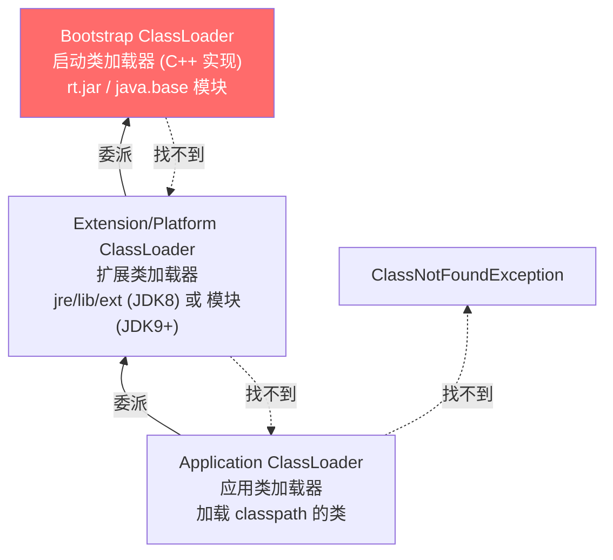
```mermaid
flowchart BT
    APP["Application ClassLoader<br/>应用类加载器<br/>加载 classpath 的类"] -->|委派| EXT["Extension/Platform ClassLoader<br/>扩展类加载器<br/>jre/lib/ext (JDK8) 或 模块(JDK9+)"]
    EXT -->|委派| BOOT["Bootstrap ClassLoader<br/>启动类加载器 (C++ 实现)<br/>rt.jar / java.base 模块"]

    BOOT -.找不到.-> EXT
    EXT -.找不到.-> APP
    APP -.找不到.-> THROW["ClassNotFoundException"]

    style BOOT fill:#ff6b6b,color:#fff
```

#### 源码级理解

```java
// java.lang.ClassLoader#loadClass（双亲委派的核心实现）
protected Class<?> loadClass(String name, boolean resolve) throws ClassNotFoundException {
    synchronized (getClassLoadingLock(name)) {
        // 1. 检查是否已经加载过
        Class<?> c = findLoadedClass(name);
        if (c == null) {
            try {
                // 2. ★ 先委派给父加载器
                if (parent != null) {
                    c = parent.loadClass(name, false);
                } else {
                    // 父为 null → 委派给 Bootstrap
                    c = findBootstrapClassOrNull(name);
                }
            } catch (ClassNotFoundException e) {
                // 父加载器抛异常 = 没找到
            }

            if (c == null) {
                // 3. 父加载器加载失败，自己尝试
                c = findClass(name);  // ★ 子类重写这个方法
            }
        }
        if (resolve) { resolveClass(c); }
        return c;
    }
}
```

> 🔴 **双亲委派的作用**：
> 1. **安全**：防止核心类被篡改（即使你写了 `java.lang.String`，也加载不了，因为 Bootstrap 已经加载了真正的）
> 2. **唯一性**：同一个类只会被加载一次（因为先检查 `findLoadedClass`）
> 3. **层次清晰**：避免类重复加载，保证类型系统的一致性

### 4.3 🟠 打破双亲委派的三大场景


| 场景 | 问题 | 解决方案 | 关键机制 |
|------|------|---------|---------|
| **SPI** | Bootstrap 加载了接口(JDBC Driver),但实现在应用 classpath | Thread Context ClassLoader | `Thread.currentThread().getContextClassLoader()` |
| **Tomcat** | 多个 WebApp 需要使用不同版本的同一个库 | WebappClassLoader 先加载自己的 | 重写 `loadClass()` 改变委派顺序 |
| **OSGi/JDK9 模块** | 复杂的模块依赖，不是简单的层级关系 | 网状委派/模块可见性 | `Layer` + `Module` |

#### SPI 打破双亲委派详解

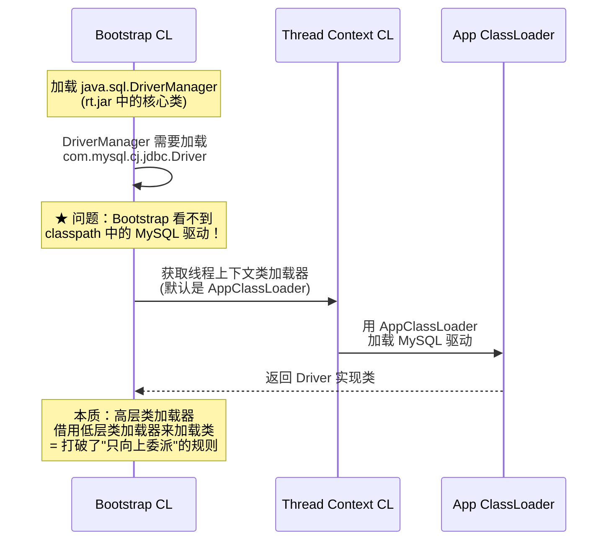
```mermaid
sequenceDiagram
    participant Boot as Bootstrap CL
    participant Thread as Thread Context CL
    participant App as App ClassLoader

    Note over Boot: 加载 java.sql.DriverManager<br/>(rt.jar 中的核心类)
    Boot->>Boot: DriverManager 需要加载<br/>com.mysql.cj.jdbc.Driver
    Note over Boot: ★ 问题：Bootstrap 看不到<br/>classpath 中的 MySQL 驱动！

    Boot->>Thread: 获取线程上下文类加载器<br/>(默认是 AppClassLoader)
    Thread->>App: 用 AppClassLoader<br/>加载 MySQL 驱动
    App-->>Boot: 返回 Driver 实现类

    Note over Boot: 本质：高层类加载器<br/>借用低层类加载器来加载类<br/>= 打破了"只向上委派"的规则
```

#### Tomcat 打破双亲委派

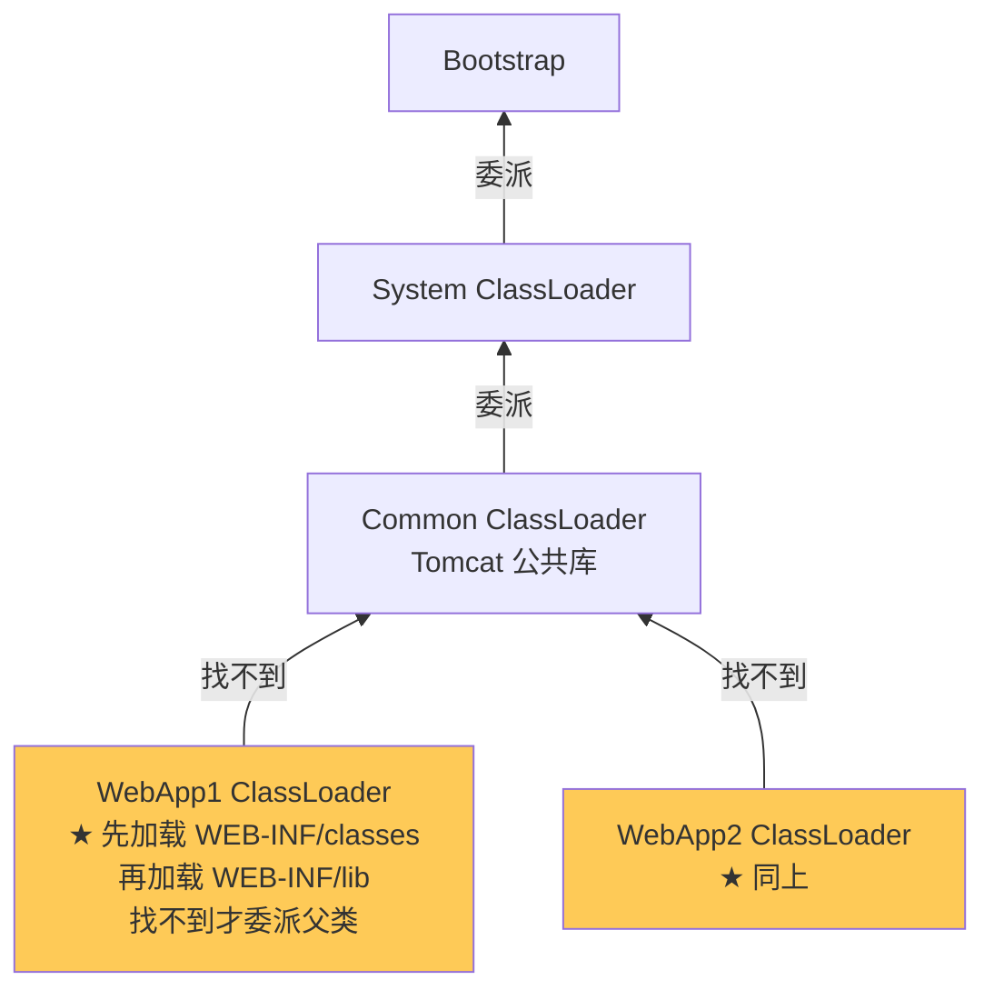
```mermaid
flowchart BT
    WCL1["WebApp1 ClassLoader<br/>★ 先加载 WEB-INF/classes<br/>再加载 WEB-INF/lib<br/>找不到才委派父类"] -->|找不到| CCL["Common ClassLoader<br/>Tomcat 公共库"]
    WCL2["WebApp2 ClassLoader<br/>★ 同上"] -->|找不到| CCL
    CCL -->|委派| SYS["System ClassLoader"]
    SYS -->|委派| BOOT["Bootstrap"]

    style WCL1 fill:#feca57
    style WCL2 fill:#feca57
```

> 🟠 **Tomcat WebappClassLoader 的加载顺序**（重写了 `loadClass`）：
> 1. 检查 JVM 缓存（`findLoadedClass`）
> 2. 检查是否是 JRE 核心类（`java.*`）→ 委派给 Bootstrap（不能打破！）
> 3. **先尝试加载自己的类**（WEB-INF/classes → WEB-INF/lib）
> 4. 找不到再委派给父加载器（Common ClassLoader）
>
> **效果**：WebApp1 用 Spring 5.x，WebApp2 用 Spring 6.x，互不干扰。

### 4.4 🟡 类加载器与内存泄漏

> 🟡 **类卸载条件（全部满足才能卸载）**：
> 1. 该类所有实例都已 GC
> 2. 加载该类的 ClassLoader 已被 GC
> 3. 该类的 java.lang.Class 对象没有被引用
>
> **为什么这经常导致 Metaspace 泄漏？**
> - Spring 的 BeanFactory 缓存了 Class 引用 → 条件 3 不满足
> - 线程的 ThreadLocal 可能持有 ClassLoader 引用 → 条件 2 不满足
> - 结果：大量重复部署后类永远无法卸载 → Metaspace OOM

> 🟢 **热部署导致 Metaspace 泄漏的排查**：
> ```bash
> # 1. 查看已加载类的数量
> jcmd <pid> VM.classloader_stats
> 
> # 2. 用 Arthas 查看类加载器实例
> classloader -l   # 列出所有类加载器及加载类数量
> 
> # 3. 查看重复定义的类
> sc -d com.example.MyClass  # 如果出现多个 ClassLoader，说明有泄漏
> ```

---

## 5. JVM 调优实战

### 5.1 🔴 调优方法论：不要盲目调参

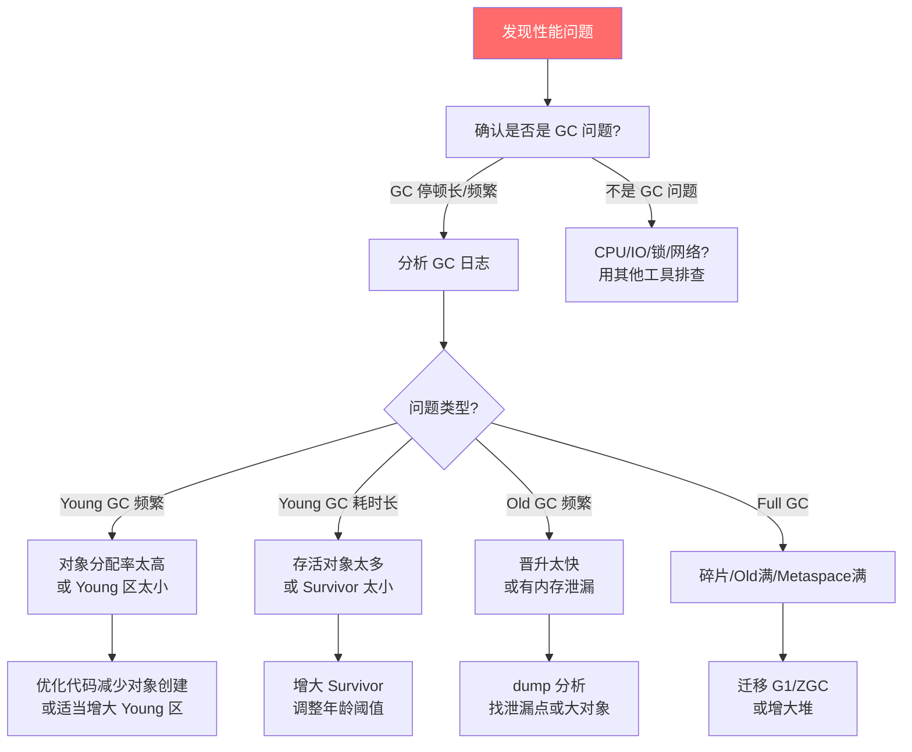
```mermaid
flowchart TD
    A["发现性能问题"] --> B["确认是否是 GC 问题?"]
    B -->|"GC 停顿长/频繁"| C["分析 GC 日志"]
    B -->|"不是 GC 问题"| D["CPU/IO/锁/网络?<br/>用其他工具排查"]

    C --> E{"问题类型?"}
    E -->|"Young GC 频繁"| F["对象分配率太高<br/>或 Young 区太小"]
    E -->|"Young GC 耗时长"| G["存活对象太多<br/>或 Survivor 太小"]
    E -->|"Old GC 频繁"| H["晋升太快<br/>或有内存泄漏"]
    E -->|"Full GC"| I["碎片/Old满/Metaspace满"]

    F --> F1["优化代码减少对象创建<br/>或适当增大 Young 区"]
    G --> G1["增大 Survivor<br/>调整年龄阈值"]
    H --> H1["dump 分析<br/>找泄漏点或大对象"]
    I --> I1["迁移 G1/ZGC<br/>或增大堆"]

    style A fill:#ff6b6b,color:#fff
```

> 🔴 **调优原则**：
> 1. **先定位瓶颈再调参**：不是所有性能问题都是 GC 导致的
> 2. **以数据为依据**：每次只改一个参数，对比前后指标
> 3. **优先升级 GC**：从 CMS→G1→ZGC 的收益远大于参数调优
> 4. **代码优化优先于 JVM 调优**：减少对象创建比调大堆更有效

### 5.2 🔴 OOM 排查流程（源码级）

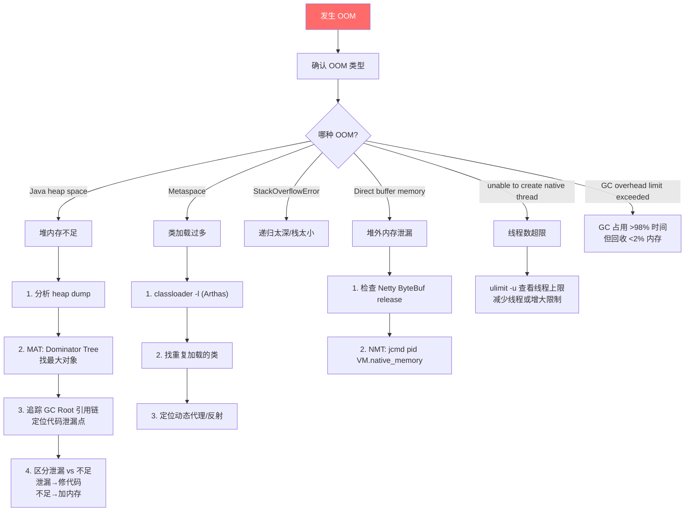
```mermaid
flowchart TD
    A["发生 OOM"] --> B["确认 OOM 类型"]
    B --> C{"哪种 OOM?"}

    C -->|"Java heap space"| D["堆内存不足"]
    C -->|"Metaspace"| E["类加载过多"]
    C -->|"StackOverflowError"| F["递归太深/栈太小"]
    C -->|"Direct buffer memory"| G["堆外内存泄漏"]
    C -->|"unable to create native thread"| H["线程数超限"]
    C -->|"GC overhead limit exceeded"| I["GC 占用 >98% 时间<br/>但回收 <2% 内存"]

    D --> D1["1. 分析 heap dump"]
    D1 --> D2["2. MAT: Dominator Tree<br/>找最大对象"]
    D2 --> D3["3. 追踪 GC Root 引用链<br/>定位代码泄漏点"]
    D3 --> D4["4. 区分泄漏 vs 不足<br/>泄漏→修代码<br/>不足→加内存"]

    E --> E1["1. classloader -l (Arthas)"]
    E1 --> E2["2. 找重复加载的类"]
    E2 --> E3["3. 定位动态代理/反射"]

    G --> G1["1. 检查 Netty ByteBuf release"]
    G1 --> G2["2. NMT: jcmd pid VM.native_memory"]

    H --> H1["ulimit -u 查看线程上限<br/>减少线程或增大限制"]

    style A fill:#ff6b6b,color:#fff
```


#### 内存泄漏 vs 内存不足的判断

> 🔴 **如何区分？看 Old 区增长趋势**：
> - **内存泄漏**：每次 Full GC 后 Old 区使用量的"基线"持续上升（无法回收的越来越多）
> - **内存不足**：Full GC 后 Old 区能降到较低水平，但业务高峰时不够用
>
> ```
> 内存泄漏的 GC 趋势:
> Old区使用率
> 100% ─────────────────────────────── ★ OOM!
>        ╱    ╱    ╱    ╱    ╱
>       ╱    ╱    ╱    ╱    ╱
>      ╱    ╱    ╱    ╱    ╱
>     ╱────╱────╱────╱────╱
>    ╱    ╱    ╱    ╱
>   ──────────────────────────── 时间 →
>   每次 Full GC 后的基线持续上升!
>
> 内存不足(非泄漏)的 GC 趋势:
> Old区使用率
> 100% ─ ─ ─ ─ ─ ─ ─ ─ ─ ─ ─ ─ ─ 
>      ╱╲   ╱╲   ╱╲   ╱╲   ╱╲
>     ╱  ╲ ╱  ╲ ╱  ╲ ╱  ╲ ╱  ╲
>    ╱    ╳    ╳    ╳    ╳    ╳
>   ╱    ╱╲   ╱╲   ╱╲   ╱╲
>   ──────────────────────────── 时间 →
>   Full GC 后能回到低水位，但频率太高
> ```

#### 🟢 线上事故：HashMap 导致的内存泄漏

> 🟢 **事故还原**：
> - **业务**：某用户画像服务，用 `HashMap<Long, UserProfile>` 做本地缓存
> - **配置**：堆 4GB，G1 收集器
> - **现象**：服务运行 48 小时后 OOM
> - **排查过程**：
>   1. MAT 打开 dump，Dominator Tree 显示一个 HashMap 占 3.2GB
>   2. HashMap 中有 500 万条数据（预期最多 10 万）
>   3. 代码中只有 `put` 没有 `remove`，且没有过期策略
>   4. 更致命的是：UserProfile 重写了 `equals` 但没重写 `hashCode` → 相同用户被重复 put
> - **修复**：
>   1. 改用 Caffeine/Guava Cache 替代裸 HashMap（自动过期+容量限制）
>   2. 正确重写 `hashCode()` 和 `equals()`
>   3. 添加缓存大小监控告警
> - **教训**：**裸 HashMap 做缓存 = 内存泄漏定时炸弹**

### 5.3 🔴 Arthas 实战指南

> 🔴 **Arthas 是阿里开源的 Java 在线诊断工具**，无需重启、无需修改代码，attach 到运行中的 JVM 即可诊断。

| 场景 | 命令 | 详解 |
|------|------|------|
| CPU 飙高 | `thread -n 3` | 显示 CPU 占用最高的 3 个线程堆栈 |
| 死锁 | `thread -b` | 直接定位死锁线程 |
| 方法慢 | `trace com.x.Service method` | 显示方法内部调用链路及每步耗时 |
| 方法返回值 | `watch com.x.Dao query returnObj` | 观察方法的返回值/入参/异常 |
| 热更新 | `redefine /tmp/MyClass.class` | 不重启替换类（线上紧急修复） |
| 反编译 | `jad com.x.Service` | 查看运行时实际加载的代码 |
| 类冲突 | `sc -d com.x.MyClass` | 查看类的加载信息（哪个 jar/哪个 ClassLoader） |
| 堆分析 | `heapdump /tmp/a.hprof` | 不触发 Full GC 的堆 dump |
| GC 监控 | `dashboard` | 实时面板：线程/内存/GC |

#### Arthas trace 实战示例

```bash
# 场景：某接口响应时间从 50ms 劣化到 2s，定位哪一步慢了

[arthas@12345]$ trace com.order.OrderService createOrder
`---ts=2024-06-15 10:30:45;thread_name=http-nio-8080-exec-5;
    `---[2156ms] com.order.OrderService:createOrder()
        +---[2ms] com.order.OrderService:validateParam()
        +---[1ms] com.order.OrderService:checkDuplicate()
        +---[2150ms] com.order.OrderService:deductStock()  ★ 就是这里！
        |   `---[2148ms] com.stock.StockDao:update()       ★ DB 慢查询
        `---[3ms] com.order.OrderService:saveOrder()

# 定位到 deductStock → DB 慢查询，接下来去看 MySQL slow log
```

### 5.4 🔴 线上 CPU 100% 排查（完整流程）

```bash
# ═══ 经典排查流程 ═══

# 1. 找到占 CPU 最高的 Java 进程
$ top -c
# PID=12345 %CPU=300% (多核 > 100% 正常)

# 2. 找到最耗 CPU 的线程
$ top -Hp 12345
# PID=12367 %CPU=99.5%

# 3. 转十六进制 (jstack 中线程 ID 是十六进制)
$ printf "%x\n" 12367
# 输出: 304f

# 4. jstack 抓取线程堆栈，搜索该线程
$ jstack 12345 | grep "0x304f" -A 30
"pool-1-thread-3" #15 prio=5 os_prio=0 tid=0x00007f... nid=0x304f runnable
   java.lang.Thread.State: RUNNABLE
        at java.util.HashMap.hash(HashMap.java:339)
        at java.util.HashMap.put(HashMap.java:612)
        at com.example.CacheManager.buildCache(CacheManager.java:45)  ★
        ...

# 或者直接用 Arthas（更简单）：
[arthas@12345]$ thread -n 1
```

> 🔴 **CPU 100% 常见原因**：
> | 原因 | 堆栈特征 | 解决方案 |
> |------|---------|---------|
> | 死循环 | 同一方法反复出现 | 修复循环条件 |
> | HashMap 并发问题 | `HashMap.put/resize` 无限循环 | 改用 ConcurrentHashMap |
> | 正则表达式回溯 | `Pattern.match` | 优化正则/加超时 |
> | 频繁 Full GC | GC 线程占满 CPU | GC 调优/内存泄漏修复 |
> | 大量线程自旋 | `Thread.yield/park` | 减少竞争/用队列 |

### 5.5 🟠 GC 日志分析

```bash
# JDK 8 格式（已废弃但仍常见）
-XX:+PrintGCDetails -XX:+PrintGCDateStamps -Xloggc:/var/log/gc.log

# JDK 9+ 统一日志框架（推荐）
-Xlog:gc*=info:file=/var/log/gc.log:time,uptime,level,tags:filecount=10,filesize=100m
```

#### G1 GC 日志解读

```
[2024-01-15T10:30:45.123+0800][info][gc] GC(123) Pause Young (Normal) (G1 Evacuation Pause)
[2024-01-15T10:30:45.123+0800][info][gc] GC(123)   Pre Evacuate Collection Set: 0.2ms
[2024-01-15T10:30:45.123+0800][info][gc] GC(123)   Merge Heap Roots: 0.3ms
[2024-01-15T10:30:45.123+0800][info][gc] GC(123)   Evacuate Collection Set: 18.5ms  ★ 复制存活对象
[2024-01-15T10:30:45.123+0800][info][gc] GC(123)   Post Evacuate Collection Set: 2.1ms
[2024-01-15T10:30:45.123+0800][info][gc] GC(123)   Eden regions: 50->0(50)  Survivor: 6->6(8)  Old: 120->125
[2024-01-15T10:30:45.145+0800][info][gc] GC(123) Pause Young (Normal) 22.5ms  ★ 总停顿

# ═══ 关键指标解读 ═══
# 1. GC 频率: 每分钟几次? (>1次/分钟 需关注)
# 2. 停顿时间: 22.5ms 对于 G1 正常 (>200ms 需优化)
# 3. Eden 回收率: 50 regions 全部回收 (正常)
# 4. Old 增长: 120→125 (每次涨 5 个 region，关注趋势)
# 5. Survivor 稳定: 6→6 (正常)
# 6. 是否有 Full GC: 搜索 "Pause Full" (应该为 0!)
# 7. Mixed GC 频率: 搜索 "Pause Young (Mixed)" (IHOP 触发)
```

> 🟠 **推荐工具**：
> - **GCViewer**：可视化分析 GC 日志，生成停顿时间/吞吐量图表
> - **GCEasy**（gceasy.io）：在线上传 GC 日志，自动分析并给出优化建议
> - **JDK Mission Control**：JFR 录制 + 分析

### 5.6 🟢 避坑提醒

> 🟢 **避坑 1：生产禁用 jmap -histo:live**
> - 它会触发 Full GC！在高流量环境下可能导致长时间 STW
> - **替代**：用 Arthas `heapdump`（不触发 GC 的快照）

> 🟢 **避坑 2：-XX:+PrintGCDetails 在 JDK 9+ 已废弃**
> - 使用 `-Xlog:gc*` 替代
> - 两者格式完全不同，解析工具要对应版本

> 🟢 **避坑 3：不要盲目调大堆**
> - 堆越大 → GC 扫描的对象越多 → 停顿越长（G1 除外）
> - 正确做法：先分析 GC 日志确认瓶颈，再针对性调整

> 🟢 **避坑 4：容器环境的内存陷阱**
> - Docker 容器限制 4GB，但 JVM 看到的是宿主机内存（JDK 8u191 之前）
> - JDK 8u191+/JDK 10+：`-XX:+UseContainerSupport`（默认开启）
> - **最佳实践**：显式设置 `-Xmx` 为容器内存的 **70-75%**（留给 Metaspace/直接内存/线程栈）

---


# 第二部分 · MySQL

## 6. InnoDB 存储引擎核心

### 6.1 🔴 InnoDB 架构全景

#### 设计动机

> 🔴 **InnoDB 为什么是 MySQL 的默认引擎？**
> - 支持事务（ACID）
> - 支持行级锁（高并发）
> - 支持外键
> - 支持崩溃恢复（WAL + Double Write）
> - MVCC 实现非锁定读
>
> MyISAM 虽然查询快但不支持事务/行锁，已逐渐淘汰。

```mermaid
flowchart TB
    subgraph 内存["内存结构 (Buffer Pool 为王)"]
        BP["Buffer Pool ⭐<br/>━━━━━━━━━━━━━<br/>数据页/索引页/undo页<br/>改进的 LRU 链表管理<br/>★ 性能核心：减少磁盘 IO"]
        CB["Change Buffer<br/>━━━━━━━━━━━━━<br/>非唯一辅助索引的延迟写<br/>合并 IO 减少随机写"]
        LB["Log Buffer<br/>━━━━━━━━━━━━━<br/>redo log 写入缓冲<br/>batch write 提高效率"]
        AHI["Adaptive Hash Index<br/>━━━━━━━━━━━━━<br/>热点数据自动建 Hash<br/>O(1) 查找"]
    end

    subgraph 磁盘["磁盘结构"]
        TS["表空间 Tablespace<br/>━━━━━━━━━━━━━<br/>系统表空间(ibdata1)<br/>独立表空间(.ibd)<br/>临时表空间"]
        REDO["Redo Log<br/>━━━━━━━━━━━━━<br/>环形写入(循环覆盖)<br/>★ WAL:崩溃恢复的保障"]
        UNDO["Undo Log<br/>━━━━━━━━━━━━━<br/>事务回滚<br/>MVCC 多版本读"]
        DW["Doublewrite Buffer<br/>━━━━━━━━━━━━━<br/>防止部分写(Partial Write)<br/>先写 DW 再写数据文件"]
    end

    BP -->|"Checkpoint 刷脏页"| TS
    LB -->|"fsync"| REDO
    BP -.->|"构建版本链"| UNDO

    style BP fill:#ff6b6b,color:#fff
    style REDO fill:#feca57
```

### 6.2 🔴 Buffer Pool 深入

#### 为什么 Buffer Pool 是 InnoDB 性能的核心？

> 🔴 **磁盘 IO 是数据库最大的瓶颈**。
> - 一次磁盘随机 IO ≈ 10ms（SSD ≈ 0.1ms）
> - 一次内存访问 ≈ 100ns（比磁盘快 10 万倍）
> - Buffer Pool 的目标：**让尽可能多的热数据留在内存中，避免磁盘 IO**
>
> **经验法则**：Buffer Pool 命中率 > 99% 才正常。<95% 说明内存严重不足。

```sql
-- 查看 Buffer Pool 命中率
SHOW GLOBAL STATUS LIKE 'Innodb_buffer_pool_read%';
-- 命中率 = 1 - (Innodb_buffer_pool_reads / Innodb_buffer_pool_read_requests) * 100%
-- reads: 从磁盘读取的次数
-- read_requests: 总读取请求数
```

#### 改进的 LRU 算法

```mermaid
flowchart LR
    subgraph LRU["Buffer Pool LRU 链表"]
        Young["Young 区(热数据)<br/>链表前 5/8<br/>高频访问的页"]
        Old["Old 区(冷数据)<br/>链表后 3/8<br/>新加载的页先放这里"]
    end

    READ["首次读取数据页"] -->|"放入 Old 区头部"| Old
    Old -->|"第二次访问<br/>且间隔 > innodb_old_blocks_time(1s)"| Young
    Young -->|"链表满时淘汰"| EVICT["从 Old 区尾部淘汰"]

    style Young fill:#ff6b6b,color:#fff
    style Old fill:#feca57
```

> 🟠 **为什么不用传统 LRU？**
>
> **问题场景**：全表扫描 `SELECT * FROM big_table`
> - 传统 LRU：全表扫描的数据页全部进入链表头部 → 热数据被挤到尾部被淘汰 → 缓存击穿
> - 改进 LRU：新页先放 Old 区，只有**间隔 1 秒后再次访问**才升到 Young 区
> - 全表扫描的页在 Old 区待一下就被淘汰了，不会影响 Young 区的热数据
>
> **关键参数**：
> ```sql
> innodb_old_blocks_pct = 37          -- Old 区占比（37% ≈ 3/8）
> innodb_old_blocks_time = 1000       -- 停留 Old 区多久才能升 Young（ms）
> innodb_buffer_pool_size = 8G        -- ★ Buffer Pool 大小（建议物理内存的 60-75%）
> innodb_buffer_pool_instances = 8    -- Buffer Pool 实例数（减少锁竞争）
> ```

#### 🟢 Buffer Pool 调优事故案例

> 🟢 **事故还原**：
> - **场景**：某 MySQL 实例，内存 32GB，Buffer Pool 默认 128MB
> - **现象**：应用 QPS 500 时 DB 响应时间 P99 = 200ms，磁盘 IOPS 打满
> - **根因**：Buffer Pool 太小，大量数据页需要从磁盘读取
> - **修复**：`innodb_buffer_pool_size = 24G`（32GB 的 75%）
> - **效果**：P99 从 200ms 降到 5ms，磁盘 IOPS 降低 90%
> - **教训**：**Buffer Pool 是 MySQL 调优的第一个旋钮**，很多性能问题的根因就是 Buffer Pool 太小

### 6.3 🔴 Redo Log 与 WAL 机制

#### 设计动机：为什么需要 Redo Log？

> 🔴 **核心问题**：如果每次修改都直接写磁盘数据文件（随机 IO），性能极差。
>
> **WAL 的解决思路**：
> 1. 修改先写 Redo Log（**顺序写**，速度是随机写的 100 倍+）
> 2. 然后返回成功（此时数据文件还是旧的）
> 3. 后台异步把修改应用到数据文件（Checkpoint）
> 4. 如果崩溃：用 Redo Log 重放未持久化的修改 → **数据不丢**

```mermaid
sequenceDiagram
    participant App as 应用
    participant BP as Buffer Pool
    participant LB as Log Buffer
    participant RL as Redo Log(磁盘)
    participant DF as 数据文件(磁盘)

    App->>BP: 1. UPDATE: 修改内存中的数据页
    Note over BP: 数据页变"脏"(内存≠磁盘)
    App->>LB: 2. 写 redo log 到 Log Buffer
    LB->>RL: 3. fsync 刷盘(顺序IO,极快!)
    Note over RL: ★ 此时事务可以返回成功
    RL-->>App: commit 成功

    Note over BP,DF: === 后台异步(Checkpoint) ===
    BP-->>DF: 4. 后台线程刷脏页(随机IO,慢)
    Note over DF: 数据文件最终一致

    Note over RL,DF: === 崩溃恢复 ===
    Note over RL: 如果步骤4之前崩溃:<br/>重启后用 Redo Log 重放修改<br/>→ 数据不丢!
```


#### Redo Log 刷盘策略深入

| `innodb_flush_log_at_trx_commit` | 行为 | 性能 | 数据安全 | 适用场景 |
|---|------|------|------|------|
| **1**（默认） | 每次 commit 都 fsync Redo Log | 最慢（每次 commit 一次磁盘 IO） | **最安全：不丢数据** | 金融/支付/核心业务 |
| **0** | 每秒 fsync 一次（不管 commit） | 最快 | 崩溃可能丢最近 1 秒数据 | 日志/监控/非核心 |
| **2** | commit 时写 OS 缓存，每秒 fsync | 中等 | OS 崩溃可能丢数据 | 一般业务 |

```mermaid
sequenceDiagram
    participant TX as 事务 commit
    participant LB as Log Buffer
    participant OS as OS Page Cache
    participant Disk as 磁盘

    Note over TX,Disk: === 值=1 (最安全) ===
    TX->>LB: write
    LB->>OS: write
    OS->>Disk: fsync ★ 每次 commit 都 fsync
    Disk-->>TX: commit 成功

    Note over TX,Disk: === 值=0 (最快) ===
    TX->>LB: write (完成即返回)
    Note over LB: 后台线程每秒: LB→OS→fsync
    Note over TX: ★ commit 不等 fsync

    Note over TX,Disk: === 值=2 (折中) ===
    TX->>LB: write
    LB->>OS: write ★ 到 OS 缓存就返回
    Note over OS: 后台每秒 fsync
```

> 🟠 **配合 `sync_binlog` 的"双 1 配置"**：
> ```sql
> innodb_flush_log_at_trx_commit = 1  -- redo log 每次 commit fsync
> sync_binlog = 1                      -- binlog 每次 commit fsync
> ```
> **含义**：每次事务提交都保证 redo log 和 binlog 都刷到磁盘。
> **代价**：每次 commit 至少 2 次 fsync（性能下降约 50%）
> **生产建议**：核心业务必须"双 1"；非核心可以 `sync_binlog=100` 提升性能。

#### Redo Log 的环形写入

```
Redo Log 文件组（默认 2 个文件，每个 48MB）：

┌─────────────┐  ┌─────────────┐
│ib_logfile0   │  │ib_logfile1   │
│             │  │             │
│  write_pos──┼──┼──►          │  write_pos: 当前写入位置
│             │  │             │
│  ◄──────────┼──┼──checkpoint │  checkpoint: 已刷脏页的位置
│             │  │             │
└─────────────┘  └─────────────┘

write_pos 追着 checkpoint 跑（环形）
如果 write_pos 追上 checkpoint → 必须停下来先刷脏页!（性能抖动!）
```

> 🟢 **避坑：Redo Log 太小导致频繁 Checkpoint**
> - **事故场景**：MySQL 默认 Redo Log 总大小 96MB（2×48MB），高写入量时 write_pos 很快追上 checkpoint
> - **现象**：TPS 突然降到接近 0，等待 Checkpoint 完成
> - **修复**：增大 Redo Log
> ```sql
> innodb_log_file_size = 1G        -- 每个文件 1GB
> innodb_log_files_in_group = 3    -- 3 个文件 = 总共 3GB
> ```
> - **MySQL 8.0.30+**：`innodb_redo_log_capacity = 4G` 统一设置

---

## 7. 索引原理与优化

### 7.1 🔴 B+Tree 索引结构

#### 设计动机：为什么用 B+Tree 而不是其他结构？

| 数据结构 | 查询复杂度 | 范围查询 | 磁盘友好度 | 为什么不选 |
|---------|-----------|---------|-----------|-----------|
| Hash | O(1) | ❌ 不支持 | ❌ | 不支持范围查询、排序 |
| 二叉搜索树 | O(logN) | ✅ | ❌ 太高 | 树高 logN 太高，IO 次数太多 |
| AVL/红黑树 | O(logN) | ✅ | ❌ 太高 | 同上，树高 20+ 层 |
| B-Tree | O(logN) | ✅ | ⭐ 较好 | 非叶子也存数据，扇出低 |
| **B+Tree** | O(logN) | ⭐⭐ | ⭐⭐ | **最优解** |

> 🔴 **B+Tree 的四大优势**（面试必答）：
> 1. **矮胖**：非叶子节点只存 key 不存 data → 单节点能存更多 key（扇出大）→ 树高仅 3-4 层
> 2. **磁盘友好**：一个节点 = 一个数据页（16KB），一次 IO 读一整个节点的所有 key
> 3. **范围查询高效**：叶子节点用双向链表连接，范围查询只需顺序遍历链表
> 4. **查询稳定**：所有数据都在叶子节点，任何查询的 IO 次数都等于树高

```mermaid
flowchart TB
    subgraph B_Plus_Tree["B+Tree (InnoDB 聚簇索引，3层可存2000万行)"]
        ROOT["根节点 (常驻内存)<br/>[20 | 50 | 80]<br/>一个页 16KB ≈ 存 1000+ 个 key"]
        N1["[5|10|15]"]
        N2["[25|30|40]"]
        N3["[55|60|70]"]
        N4["[85|90|95]"]
        L1["5→row | 10→row | 15→row"]
        L2["20→row | 25→row | 30→row"]
        L3["40→row | 50→row"]
        L4["55→row | 60→row | 70→row"]
        L5["80→row | 85→row | 90→row | 95→row"]

        ROOT --> N1
        ROOT --> N2
        ROOT --> N3
        ROOT --> N4
        N1 --> L1
        N2 --> L2
        N2 --> L3
        N3 --> L4
        N4 --> L5

        L1 -.双向链表.-> L2
        L2 -.-> L3
        L3 -.-> L4
        L4 -.-> L5
    end

    style ROOT fill:#ff6b6b,color:#fff
    style L1 fill:#feca57
    style L2 fill:#feca57
    style L3 fill:#feca57
    style L4 fill:#feca57
    style L5 fill:#feca57
```

#### 树高计算（面试常问）

> 🔴 **1 千万行数据，B+Tree 多高？**
>
> 假设：
> - 主键 bigint = 8 字节，指针 = 6 字节
> - 每个非叶子节点可存 key 数 = 16KB / (8+6) ≈ **1170 个 key**
> - 每个叶子节点存行数（假设行大小 1KB）= 16KB / 1KB ≈ **16 行**
>
> 计算：
> - 2 层：1170 × 16 = 18,720 行
> - **3 层**：1170 × 1170 × 16 = **2190 万行** ✅
> - 4 层：1170³ × 16 = 256 亿行
>
> **结论**：**千万级数据只需 3 次 IO**（根节点常驻内存，实际只需 2 次磁盘 IO）


### 7.2 🔴 聚簇索引 vs 非聚簇索引

#### 本质区别

| 维度 | 聚簇索引（主键索引） | 非聚簇索引（辅助索引/二级索引） |
|------|---------------------|-------------------------------|
| 叶子节点存储 | **完整行数据** | **主键值** |
| 每张表有几个 | 只有 **1 个** | 可以有多个 |
| 数据物理排序 | 按主键顺序存储 | 独立排序 |
| 查询效率 | 直接返回数据（无需回表） | 需要**回表**（二次查询主键索引） |
| 插入效率 | 顺序插入最优（自增主键） | 随机位置插入 |
| 构建基础 | 主键（或第一个唯一索引/隐藏 row_id） | 指定的索引列 |

```mermaid
flowchart LR
    Q["SELECT name, email<br/>FROM user WHERE age=25"]
    Q --> SI["辅助索引(age)<br/>叶子: age=25 → PK=7"]
    SI -->|"★ 回表"| PK["聚簇索引(主键)<br/>叶子: PK=7 → 完整行数据"]
    PK --> R["返回 name, email"]

    style SI fill:#feca57
    style PK fill:#ff6b6b,color:#fff
```

> 🔴 **回表的代价**：
> - 每次回表 = 额外一次 B+Tree 查找（1-3 次 IO）
> - 如果辅助索引返回 1000 行，回表 1000 次 → 1000 次随机 IO → 非常慢！
> - **优化器可能放弃索引**：如果预估回表行数太多（超过总行数的 20-30%），优化器宁可全表扫描

### 7.3 🔴 覆盖索引（避免回表的终极方案）

> 🔴 **核心**：查询的所有列都在索引中 → 不需要回表 → IO 大幅减少

```sql
-- 联合索引 (name, age, email)

-- ✅ 覆盖索引（不回表）
SELECT name, age, email FROM user WHERE name = 'Tom'
-- EXPLAIN Extra: Using index

-- ✅ 覆盖索引（SELECT 列和 WHERE 列都在索引中）
SELECT age FROM user WHERE name = 'Tom' AND age > 20
-- EXPLAIN Extra: Using where; Using index

-- ❌ 需要回表（phone 不在索引中）
SELECT name, age, phone FROM user WHERE name = 'Tom'
-- EXPLAIN Extra: (无 Using index)

-- ★ 优化技巧：把高频查询需要的列加入联合索引
-- 空间换时间，但要注意索引大小
```

> 🟠 **实际案例：覆盖索引优化报表查询**
> - **Before**：`SELECT user_id, order_amount, order_time FROM orders WHERE status=1 AND order_time>?`
> - **索引**：`idx_status(status)`
> - **问题**：走 status 索引后还需回表 50 万次拿 order_amount 和 order_time
> - **After**：建联合索引 `idx_status_time_amount(status, order_time, user_id, order_amount)`
> - **效果**：覆盖索引，零回表，查询时间从 8s 降到 200ms

### 7.4 🔴 索引失效场景（深度分析每个原因）

| # | 失效场景 | 根本原因 | 示例 | 验证方法 |
|---|---------|---------|------|---------|
| 1 | 前导通配符 | B+Tree 按从左到右有序，前导通配无法利用排序 | `LIKE '%abc'` | EXPLAIN type=ALL |
| 2 | 对列使用函数 | 索引存的是原值，函数结果不在索引中 | `WHERE YEAR(create_time)=2024` | 改用范围查询 |
| 3 | 对列做运算 | 同上 | `WHERE id + 1 = 10` | 改写为 `id = 9` |
| 4 | 隐式类型转换 | MySQL 把字符串转数字来比较，等于对列加了函数 | `WHERE phone = 13800138000`（phone 是 varchar） | 加引号 `'138...'` |
| 5 | OR 一侧无索引 | OR 两侧必须都能走索引才能用 index merge | `WHERE a=1 OR b=2`（b 无索引） | 给 b 加索引或拆分 |
| 6 | 不满足最左前缀 | 联合索引(a,b,c)的 B+Tree 按 a→b→c 排序 | `WHERE b=1 AND c=2`（跳过 a） | 建(b,c)单独索引 |
| 7 | 范围查询后列失效 | 范围条件破坏了后续列的有序性 | `WHERE a>1 AND b=2`（b 索引失效） | 调整联合索引列顺序 |
| 8 | NOT IN / != | 优化器判断扫描行数过多时放弃索引 | `WHERE status != 0`（如果 90% 是非 0） | 取决于数据分布 |

#### 隐式类型转换的源码级解释

```sql
-- 为什么 phone = 13800138000 会索引失效？（phone 是 varchar）
-- MySQL 的类型转换规则：字符串和数字比较时，把字符串转为数字

-- 实际执行相当于：
SELECT * FROM user WHERE CAST(phone AS UNSIGNED) = 13800138000
-- 等于对 phone 列加了函数 → 索引失效！

-- 反向场景：id = '123'（id 是 int）
-- MySQL 把 '123' 转为数字 123，不影响 id 列 → 索引不失效！
-- 规则：看转换是否施加在索引列上
```

> 🟢 **线上事故：隐式转换导致全表扫描**
> - **场景**：某接口突然变慢，P99 从 5ms 到 3s
> - **排查**：slow log 发现 `WHERE merchant_id = 10086`（merchant_id 是 varchar）
> - **原因**：新人写的代码没加引号，Java 的 Long 传入 MyBatis 自动变成数字
> - **影响**：百万行表全表扫描
> - **修复**：`WHERE merchant_id = '10086'`
> - **预防**：MyBatis 参数类型用 `#{id, jdbcType=VARCHAR}`

### 7.5 🟠 索引下推（Index Condition Pushdown, ICP）

#### 设计动机

> 🟠 **MySQL 5.6 之前的问题**：
> 联合索引只能利用到第一个范围条件之前的列。范围条件之后的列虽然在索引中，但不会在存储引擎层过滤。
>
> **ICP 的优化**：让存储引擎在扫描索引时就过滤掉不满足条件的记录，减少回表次数。

```sql
-- 联合索引 idx_name_age (name, age)
SELECT * FROM user WHERE name LIKE '张%' AND age = 25

-- 无 ICP（MySQL 5.5）:
-- 1. 存储引擎用索引找到所有 name LIKE '张%' 的记录（假设100条）
-- 2. 全部100条回表，取完整行数据
-- 3. Server 层过滤 age=25，最终返回3条
-- 回表次数：100 次！

-- 有 ICP（MySQL 5.6+）:
-- 1. 存储引擎用索引找到所有 name LIKE '张%' 的记录
-- 2. ★ 存储引擎同时在索引中检查 age=25（age 在联合索引里）
-- 3. 只有同时满足的3条才回表
-- 回表次数：3 次！减少 97%

-- EXPLAIN Extra: Using index condition
```

```mermaid
sequenceDiagram
    participant Server as MySQL Server层
    participant Engine as InnoDB 存储引擎
    participant Index as 联合索引(name,age)
    participant Data as 聚簇索引(数据)

    Note over Server,Data: === 无 ICP ===
    Server->>Engine: WHERE name LIKE '张%' AND age=25
    Engine->>Index: 扫描 name LIKE '张%' → 100 条
    loop 100 次回表
        Engine->>Data: 回表取完整行
    end
    Engine-->>Server: 返回 100 行
    Server->>Server: 过滤 age=25 → 3 行

    Note over Server,Data: === 有 ICP ===
    Server->>Engine: WHERE name LIKE '张%' AND age=25
    Engine->>Index: 扫描 name LIKE '张%'
    Engine->>Engine: ★ 在索引中检查 age=25<br/>97 条不满足直接跳过
    loop 3 次回表
        Engine->>Data: 回表取完整行
    end
    Engine-->>Server: 返回 3 行
```

---


## 8. 事务与锁机制

### 8.1 🔴 事务隔离级别与 MVCC

#### MVCC 实现原理（源码级）

> 🔴 **MVCC 三要素**：隐藏字段 + Undo Log 版本链 + ReadView

```
每行记录的隐藏字段：
┌─────────┬───────────────┬──────────────┬─────────────┐
│ 用户数据 │ DB_TRX_ID(6B) │ DB_ROLL_PTR(7B) │ DB_ROW_ID(6B) │
│          │ 最后修改的事务ID │ 指向 undo log │ 隐藏主键(无PK时) │
└─────────┴───────────────┴──────────────┴─────────────┘
```

```mermaid
flowchart LR
    subgraph 版本链["Undo Log 版本链"]
        V3["当前版本<br/>trx_id=100<br/>name='王五'"] -->|roll_ptr| V2["历史版本<br/>trx_id=80<br/>name='李四'"]
        V2 -->|roll_ptr| V1["最早版本<br/>trx_id=50<br/>name='张三'"]
    end

    RV["ReadView<br/>m_ids(活跃事务列表)=[90,100]<br/>min_trx_id=90<br/>max_trx_id=101<br/>creator_trx_id=95"]

    RV -->|"trx_id=100 在 m_ids 中<br/>→ 不可见"| V3
    RV -->|"trx_id=80 < min_trx_id(90)<br/>→ ✅ 可见!"| V2

    style V2 fill:#48dbfb
```

> 🔴 **ReadView 可见性判断规则**：
> ```
> 对于版本的 trx_id：
> 1. trx_id == creator_trx_id      → 可见（自己修改的）
> 2. trx_id < min_trx_id           → 可见（事务已提交）
> 3. trx_id >= max_trx_id          → 不可见（事务在 ReadView 之后开启）
> 4. min_trx_id <= trx_id < max_trx_id:
>    - trx_id 在 m_ids 中          → 不可见（事务还未提交）
>    - trx_id 不在 m_ids 中        → 可见（事务已提交）
> ```

> 🔴 **RC vs RR 的本质区别**：
> - **RC（Read Committed）**：**每次 SELECT 都生成新 ReadView** → 能看到其他事务的最新提交
> - **RR（Repeatable Read）**：**第一次 SELECT 生成 ReadView，后续复用** → 整个事务看到同一个快照

### 8.2 🔴 锁机制详解

```mermaid
flowchart TD
    A[InnoDB 锁分类] --> B[行级锁]
    A --> C[表级锁]

    B --> B1["Record Lock 记录锁<br/>锁住索引记录本身"]
    B --> B2["Gap Lock 间隙锁<br/>锁住索引记录之间的间隙<br/>★ 防止插入(防幻读)"]
    B --> B3["Next-Key Lock ⭐<br/>= Record Lock + Gap Lock<br/>★ InnoDB RR 默认锁类型"]

    C --> C1["意向锁 IS/IX<br/>表明事务想加行锁<br/>与表锁互斥判断用"]
    C --> C2["AUTO-INC Lock<br/>自增列插入时的表锁"]

    style B3 fill:#ff6b6b,color:#fff
```

#### Next-Key Lock 示例

```sql
-- 表数据 id: 1, 5, 10, 15, 20
-- RR 隔离级别下

-- 等值查询（命中）:
SELECT * FROM t WHERE id = 10 FOR UPDATE;
-- 加锁: Record Lock on id=10 (退化为记录锁，因为精确命中唯一索引)

-- 等值查询（未命中）:
SELECT * FROM t WHERE id = 12 FOR UPDATE;
-- 加锁: Gap Lock (10, 15) (不存在的值，只锁间隙)

-- 范围查询:
SELECT * FROM t WHERE id >= 10 AND id < 15 FOR UPDATE;
-- 加锁: Next-Key Lock (5,10] + Gap Lock (10,15)
-- 含义: id=10 的记录锁 + (5,10) 间隙锁 + (10,15) 间隙锁
```

> 🟢 **死锁事故案例**：
> - **场景**：订单系统，事务 A 先更新 order_id=1 再更新 order_id=2，事务 B 相反
> - **修复**：所有事务按 order_id 升序操作；加索引减少锁粒度；设置 `innodb_lock_wait_timeout=5`

### 8.3 🟠 死锁排查实战

```sql
-- 查看最近死锁
SHOW ENGINE INNODB STATUS\G
-- 找 LATEST DETECTED DEADLOCK 段

-- 关键配置
innodb_lock_wait_timeout = 5        -- 锁等待超时(秒)，默认50太长
innodb_deadlock_detect = ON         -- 死锁检测(默认ON)
-- 注意：高并发下死锁检测本身有开销（O(N²)），极端场景可关闭检测+缩短超时
```

> 🔴 **预防死锁三原则**：
> 1. **固定顺序**：所有事务按相同顺序操作资源
> 2. **加索引**：无索引 → 表锁 → 必死锁；有索引 → 行锁 → 减少冲突
> 3. **事务尽短**：事务内不做 RPC/HTTP 调用，减少持锁时间

---

## 9. SQL 优化实战

### 9.1 🔴 Explain 关键字段

| 字段 | 含义 | 关注点 |
|------|------|--------|
| **type** | 访问类型 | `system > const > eq_ref > ref > range > index > ALL` |
| **key** | 实际使用的索引 | NULL = 没用索引 |
| **key_len** | 索引使用长度 | 联合索引判断用了几列 |
| **rows** | 预估扫描行数 | 越小越好 |
| **filtered** | 条件过滤比例 | 100% = 所有行都满足 |
| **Extra** | 额外信息 | 最重要的诊断字段 |

> 🔴 **Extra 重要值速查**：
> | 值 | 含义 | 好坏 | 优化方向 |
> |---|------|------|---------|
> | Using index | 覆盖索引 | ✅ 最好 | 保持 |
> | Using index condition | 索引下推 ICP | ✅ 好 | 保持 |
> | Using where | Server 层过滤 | 中性 | 检查能否下推到索引 |
> | **Using filesort** | 额外排序 | ❌ | 建联合索引覆盖 ORDER BY |
> | **Using temporary** | 使用临时表 | ❌ | 优化 GROUP BY/DISTINCT |
> | Using MRR | Multi-Range Read 优化 | ✅ | 保持 |

### 9.2 🔴 分页优化

```sql
-- ❌ 深翻页慢查询（扫描 100万行再丢弃）
SELECT * FROM orders ORDER BY id LIMIT 1000000, 10
-- 实际扫描: 1000010 行! 返回: 10 行

-- ✅ 方案 1: 延迟关联（覆盖索引+子查询减少回表）
SELECT o.* FROM orders o
INNER JOIN (SELECT id FROM orders ORDER BY id LIMIT 1000000, 10) t
ON o.id = t.id;
-- 子查询走覆盖索引(只读id)，外层只回表10次

-- ✅ 方案 2: 游标分页（记住上次最大 ID）★ 推荐
SELECT * FROM orders WHERE id > #{lastMaxId} ORDER BY id LIMIT 10
-- 直接定位，不扫描前面的行

-- ✅ 方案 3: 业务限制
-- 禁止跳页（只有"上一页/下一页"），强制使用游标分页
```

> 🟠 **为什么 LIMIT 1000000, 10 慢？**
> MySQL 必须先读取前 1000010 行，然后丢弃前 100 万行只返回 10 行。
> 即使有索引，每行都需要回表取完整数据 → 100 万次随机 IO。

### 9.3 🔴 JOIN 优化

```mermaid
flowchart LR
    A["驱动表(小表)<br/>扫描全部行"] -->|"逐行去匹配"| B["被驱动表(大表)<br/>★ JOIN 字段必须有索引<br/>每次用索引查找"]

    style A fill:#feca57
    style B fill:#ff6b6b,color:#fff
```

> 🔴 **JOIN 优化四原则**：
> 1. **小表驱动大表**：`STRAIGHT_JOIN` 可强制指定驱动表顺序
> 2. **被驱动表 JOIN 字段必须有索引**：无索引 = Block Nested Loop Join（笛卡尔积到内存块比较，极慢）
> 3. **避免超过 3 表 JOIN**：阿里规范建议不超过 3 表
> 4. **优先 INNER JOIN**：优化器可自动选择最优驱动表顺序

### 9.4 🟠 慢查询优化流程

```mermaid
flowchart TD
    A["开启慢查询日志"] --> B["找到 Top N 慢 SQL<br/>(mysqldumpslow / pt-query-digest)"]
    B --> C["EXPLAIN 分析"]
    C --> D{"type?"}
    D -->|ALL| E["加索引"]
    D -->|index| F["优化为覆盖索引<br/>或加 WHERE 条件"]
    D -->|range+| G["检查 Extra"]

    G --> H{"Extra?"}
    H -->|filesort| I["建联合索引覆盖 ORDER BY"]
    H -->|temporary| J["优化 GROUP BY"]
    H -->|Using where| K["检查能否用更精确的索引"]

    E --> L["重新 EXPLAIN 验证"]
    I --> L
    J --> L

    style A fill:#ff6b6b,color:#fff
```

```sql
-- 慢查询配置
SET GLOBAL slow_query_log = ON;
SET GLOBAL long_query_time = 1;          -- 超过 1 秒记录
SET GLOBAL log_queries_not_using_indexes = ON;  -- 没用索引的也记录
```

---


# 第三部分 · Tomcat

## 10. 架构与线程模型

### 10.1 🔴 Tomcat 整体架构

```mermaid
flowchart TB
    subgraph Server["Server (Tomcat 实例)"]
        subgraph Service["Service"]
            subgraph Connector["Connector (连接器)"]
                EP["EndPoint<br/>监听端口,TCP连接管理"]
                PR["Processor<br/>HTTP 协议解析<br/>Request/Response 封装"]
                AD["Adapter<br/>CoyoteAdapter<br/>将请求转给容器"]
            end
            subgraph Container["Container (容器)"]
                ENG["Engine<br/>Servlet 引擎"]
                HOST["Host<br/>虚拟主机(localhost)"]
                CTX["Context<br/>一个 Web 应用(/app)"]
                WRP["Wrapper<br/>一个 Servlet"]
                ENG --> HOST --> CTX --> WRP
            end
            EP --> PR --> AD --> Container
        end
    end

    CLIENT["客户端请求"] --> EP

    style Connector fill:#feca57
    style Container fill:#ff6b6b,color:#fff
```

### 10.2 🔴 NIO 线程模型

```mermaid
sequenceDiagram
    participant Client as 客户端
    participant Acc as Acceptor(1线程)
    participant Pol as Poller(1-2线程)
    participant Worker as Worker线程池(200)
    participant Servlet as Servlet

    Client->>Acc: TCP 连接
    Acc->>Acc: accept() 获取 SocketChannel
    Acc->>Pol: 注册到 Poller 的 Selector
    Note over Pol: Selector.select() 监听 IO 事件
    Pol->>Pol: 数据就绪(READ事件)
    Pol->>Worker: 提交任务到线程池
    Worker->>Servlet: 调用 service() 方法
    Servlet-->>Worker: 返回响应
    Worker-->>Client: 写回响应

    Note over Acc: Acceptor 只管接受连接，非常轻量
    Note over Pol: Poller 用 NIO 多路复用，少量线程管理大量连接
    Note over Worker: Worker 才是真正执行业务的地方
```

> 🔴 **三种 IO 模式对比**：
> | 模式 | 线程模型 | 并发能力 | 适用场景 |
> |------|---------|---------|---------|
> | ~~BIO~~ (8.5已移除) | 一连接一线程 | 低（受线程数限制） | 已淘汰 |
> | **NIO** ⭐ 默认 | Acceptor + Poller + Worker | 高（多路复用） | 大多数场景 |
> | NIO2 (AIO) | 异步回调 | 高 | Linux 下与 NIO 差异不大 |
> | APR | 本地库（OpenSSL） | 最高 | HTTPS 密集场景 |

---

## 11. 性能调优参数

### 11.1 🔴 核心参数

```xml
<Connector port="8080"
           protocol="org.apache.coyote.http11.Http11NioProtocol"
           maxThreads="200"          <!-- ★ Worker 线程池最大线程数 -->
           minSpareThreads="25"      <!-- 最小空闲线程 -->
           acceptCount="100"         <!-- 全忙时等待队列长度，满则拒绝 -->
           connectionTimeout="20000" <!-- 连接超时(ms) -->
           maxConnections="10000"    <!-- Poller 最大管理连接数 -->
           compression="on"          <!-- 开启 gzip 压缩 -->
           compressionMinSize="2048" <!-- >2KB 才压缩 -->
/>
```

> 🔴 **maxThreads 设置公式**：
> - **CPU 密集型**：线程数 = CPU 核数 + 1
> - **IO 密集型**：线程数 = CPU 核数 × 2 × (1 + 平均IO等待时间/平均CPU计算时间)
> - **实践经验**：先设 200，压测观察 CPU 利用率（目标 70-80%），逐步调整
>
> **不是越大越好**：线程过多 → 上下文切换开销 > 业务收益 → 性能反降

### 11.2 🟠 Tomcat + JVM 配套参数

```bash
# setenv.sh
JAVA_OPTS="-server \
  -Xms2g -Xmx2g \
  -XX:+UseG1GC \
  -XX:MaxGCPauseMillis=200 \
  -XX:+HeapDumpOnOutOfMemoryError \
  -XX:HeapDumpPath=/tmp/tomcat_heap.hprof \
  -Xlog:gc*:file=/var/log/tomcat_gc.log:time"
```

### 11.3 🟢 避坑提醒

> 🟢 **避坑 1**：`acceptCount` 满了之后新连接被直接拒绝（TCP RST），客户端报 "Connection refused"。高并发时适当调大到 200-500。
>
> 🟢 **避坑 2**：生产环境务必关闭 **AJP Connector**（8009 端口）。CVE-2020-1938 幽灵猫漏洞允许通过 AJP 读取 webapp 任意文件。
>
> 🟢 **避坑 3**：Tomcat 的 WebappClassLoader **先加载自己的类**再委托父加载器（打破双亲委派），这会导致不同 WebApp 的同名类互相不可见。部署多应用时注意 jar 冲突。

---

# 第四部分 · 面试官高频追问 Top 20

## 12. 答题模板：STAR-S

> **S** Scenario（场景锚定）→ **T** Theory（结论/分类）→ **A** Architecture（核心流程/图）→ **R** Reference（关键数据/配置）→ **S** So-what（引申实战）

---

## 13. JVM 深度追问

### Q1. JVM 内存模型讲一下？各区域可能出什么问题？

> **完整回答（200+ 字）**：
>
> JVM 运行时内存分为五大区域。**线程共享**的有堆和元空间：堆存放所有对象实例，是 GC 的主战场，分为 Young（Eden+S0+S1）和 Old 两代；元空间存放类的元信息，使用本地内存而非堆内存，JDK 8 用它替代了永久代。**线程私有**的有虚拟机栈（每个方法一个栈帧，存放局部变量表/操作数栈）、本地方法栈（Native 方法）、程序计数器（当前执行的字节码行号）。
>
> 各区域的问题：堆不足抛 `Java heap space`，常因内存泄漏或对象过大；元空间不足抛 `Metaspace`，常因动态代理/反射创建大量类；栈溢出抛 `StackOverflowError`，常因深递归；直接内存不足抛 `Direct buffer memory`，常因 Netty ByteBuf 未 release。
>
> **面试加分**：提到 Xms=Xmx 避免扩容抖动、堆 >32GB 压缩指针关闭的性能悬崖、容器环境需要 `-XX:+UseContainerSupport`。

### Q2. G1 和 CMS 的核心区别？为什么 G1 能取代 CMS？

> **完整回答**：
>
> CMS 用标记-清除算法，虽然并发标记减少了 STW，但有三个无法解决的问题：**内存碎片**（不整理导致大对象分配触发 Full GC）、**Concurrent Mode Failure**（并发收集速度赶不上分配速度退化为 Serial Old）、**无法控制停顿时间**。
>
> G1 用 Region 化 + 标记-复制的方式彻底解决了这三个问题：Region 间复制天然无碎片；通过停顿预测模型（衰减平均值）控制每次 GC 只选择回收价值最高的若干 Region，从而将停顿控制在 `MaxGCPauseMillis` 范围内；即使触发 Full GC，JDK 10+ 也是并行的。
>
> **选型建议**：JDK 8 堆 4G+ 用 G1，JDK 11+ 追求极低延迟用 ZGC。CMS 已在 JDK 9 被标记废弃，JDK 14 正式移除。

### Q3. OOM 怎么排查？请描述完整流程

> **完整回答**：
>
> 第一步是**确认 OOM 类型**，不同类型排查方向完全不同。Heap space 走堆分析，Metaspace 走类加载分析，Direct memory 走堆外内存分析。
>
> 以最常见的 Heap space 为例：
> 1. **获取堆快照**：生产必须配置 `-XX:+HeapDumpOnOutOfMemoryError`，OOM 时自动 dump
> 2. **MAT 分析**：打开 dump 文件，先看 Leak Suspects 报告，再看 Dominator Tree 找最大对象
> 3. **追踪引用链**：从大对象找到 GC Root 的引用路径，定位代码中哪里持有了不该持有的引用
> 4. **区分泄漏 vs 不足**：看 Full GC 后 Old 区基线是否持续上升（上升=泄漏，稳定=内存不够）
> 5. **修复**：泄漏修代码（常见：缓存无过期、连接未关闭、监听器未注销）；不足则加内存或优化对象生命周期
>
> **面试加分**：提到用 Arthas 的 `heapdump` 替代 `jmap`（不触发 Full GC）、用 NMT（Native Memory Tracking）排查堆外泄漏。

### Q4. 线上 CPU 100% 怎么排查？

> **完整回答**：
>
> 经典四步：
> 1. `top -c` 找到 CPU 最高的 Java 进程 PID
> 2. `top -Hp PID` 找到最耗 CPU 的线程 TID
> 3. `printf "%x" TID` 转十六进制
> 4. `jstack PID | grep TID_HEX -A 30` 看线程在执行什么
>
> 或直接 Arthas `thread -n 3` 一步搞定。
>
> **常见原因及堆栈特征**：
> - 死循环：同一方法反复出现在堆栈中
> - HashMap 并发 resize 死循环：`HashMap.put` 或 `HashMap.transfer`
> - 正则表达式灾难性回溯：`Pattern.match` 消耗 CPU
> - 频繁 Full GC：GC 线程占满 CPU，`jstat -gc` 可确认
>
> **面试加分**：提到生产环境可以用 `async-profiler` 生成火焰图，可视化定位 CPU 热点。

### Q5. 频繁 Full GC 怎么分析？

> **完整回答**：
>
> Full GC 频繁说明 Old 区空间经常不足。排查思路：
>
> 1. **看 GC 日志**：确认 Full GC 触发原因（Allocation Failure / Metadata GC Threshold / System.gc()）
> 2. **Young GC 后存活太多**：Survivor 放不下 → 直接晋升 Old → Old 快速填满。解决：增大 Young 区或 Survivor
> 3. **大对象直接进 Old**：检查是否有大数组/大集合。解决：调 `PretenureSizeThreshold` 或优化代码
> 4. **内存泄漏**：Full GC 后 Old 使用率基线持续上升。解决：dump 分析找泄漏点
> 5. **Metaspace 触发**：`Metadata GC Threshold` 日志。解决：增大 MetaspaceSize
> 6. **代码显式调用 System.gc()**：加 `-XX:+DisableExplicitGC` 禁止

---

## 14. MySQL 深度追问

### Q6. B+Tree 为什么适合做索引？和 B-Tree 的区别？

> **完整回答**：
>
> B+Tree 相比 B-Tree 有三个关键改进：
> 1. **非叶子节点不存数据**：同样 16KB 的页能存更多 key（约 1170 个 vs B-Tree 约 100 个），扇出大 → 树更矮 → IO 更少
> 2. **叶子节点双向链表**：范围查询只需遍历链表，B-Tree 需要回溯到父节点
> 3. **所有数据在叶子节点**：查询路径长度稳定（都是树高），B-Tree 可能在中间节点就命中
>
> 磁盘友好性：一个 B+Tree 节点 = 一个磁盘页（16KB），一次 IO 加载整个节点。千万级数据树高仅 3 层 = 3 次 IO（根节点常驻内存实际只需 2 次）。
>
> 这也是为什么 Hash 索引虽然 O(1) 但不适合做通用索引——不支持范围查询、排序、最左前缀匹配。

### Q7. MVCC 是怎么实现的？RC 和 RR 的区别？

> **完整回答**：
>
> MVCC 通过**三个组件**实现无锁读：
> - **隐藏字段**：每行有 `DB_TRX_ID`（最后修改事务ID）和 `DB_ROLL_PTR`（指向 undo log 的上一个版本）
> - **Undo Log 版本链**：通过 roll_ptr 形成链表，保存历史版本
> - **ReadView**：事务读取时创建的快照，包含当前活跃事务列表，用于判断哪个版本对当前事务可见
>
> RC 和 RR 的区别仅在于 ReadView 的创建时机：RC 每次 SELECT 都创建新 ReadView（所以能看到其他事务最新的提交）；RR 只在第一次 SELECT 时创建，后续复用同一个（所以整个事务看到的数据一致）。
>
> RR 级别下的**幻读防护**通过 Next-Key Lock 实现：当前读（`SELECT FOR UPDATE`）不仅锁记录还锁间隙，阻止其他事务在间隙中插入新行。

### Q8. 索引失效的场景有哪些？如何验证？

> **完整回答**：
>
> 核心七种失效场景：前导通配符（`LIKE '%abc'`）、列上用函数（`WHERE YEAR(date)=2024`）、列做运算（`id+1=10`）、隐式类型转换（varchar 列传数字）、OR 一侧无索引、联合索引不满足最左前缀、范围查询后的列失效。
>
> 验证方法：`EXPLAIN` 看 type 是否为 ALL（全表扫描）或 key 是否为 NULL。
>
> **常被忽略的点**：`!=` 和 `NOT IN` 不一定失效，优化器会根据数据分布（选择性）决定。如果 `status != 0` 但 99% 的行 status 都不是 0，优化器宁可全表扫描（回表代价太高）。
>
> **面试加分**：MySQL 8.0 支持函数索引（`CREATE INDEX idx_year ON t((YEAR(create_time)))`），可以解决函数导致索引失效的问题。

### Q9. 慢 SQL 优化的完整流程？

> **完整回答**：
>
> 1. **发现**：开启 `slow_query_log`，设 `long_query_time=1`；或通过 APM 工具（SkyWalking/Pinpoint）发现慢接口
> 2. **分析**：`pt-query-digest` 聚合分析 slow log，找 Top N 慢 SQL
> 3. **诊断**：`EXPLAIN` 分析每条 SQL 的执行计划，重点看 type/key/rows/Extra
> 4. **优化**：根据诊断结果针对性优化——加索引（type=ALL）、覆盖索引（避免回表）、联合索引（消除 filesort）、改写 SQL（分页优化/子查询改 JOIN）
> 5. **验证**：优化后重新 EXPLAIN，确认指标改善
> 6. **监控**：上线后持续监控 P99 响应时间和 slow log

### Q10. InnoDB 为什么推荐自增主键？UUID 做主键有什么问题？

> **完整回答**：
>
> 自增主键的优势：
> 1. **顺序插入**：新行总是追加到 B+Tree 最右边的叶子节点，不会页分裂（性能稳定）
> 2. **空间紧凑**：bigint 占 8 字节，辅助索引叶子存主键值只需 8 字节
> 3. **写入性能**：减少 B+Tree 的节点分裂和旋转操作
>
> UUID 的问题：
> 1. **随机插入**：36 字节的随机值导致 B+Tree 叶子节点大量随机分裂，页利用率低（约 50%）
> 2. **空间浪费**：UUID 36 字节 vs bigint 8 字节，所有辅助索引叶子都要存主键，膨胀 4.5 倍
> 3. **比较性能**：字符串比较比整数比较慢
>
> **如果必须用 UUID**：用有序 UUID（如 MySQL 8.0 的 `UUID_TO_BIN(UUID(), 1)` 或雪花算法），保证时间递增性，避免随机插入问题。

---

## 15. Tomcat 追问

### Q11. Tomcat 线程模型？maxThreads 怎么设？

> **完整回答**：
>
> Tomcat NIO 模型有三层线程：**Acceptor**（1 个线程，accept TCP 连接）→ **Poller**（1-2 个线程，NIO Selector 多路复用监听 IO 事件）→ **Worker 线程池**（默认 200，执行 Servlet 业务逻辑）。
>
> maxThreads 设置没有银弹，取决于业务类型：CPU 密集型设 CPU 核数+1（更多线程只会增加上下文切换）；IO 密集型（DB 查询/HTTP 调用）设 CPU 核数×2~4，因为线程大部分时间在等 IO。
>
> 实践方法：初始 200，压测时观察 CPU 利用率。如果 CPU < 50% 且 QPS 到瓶颈 → 增加线程；如果 CPU > 80% → 线程已足够，瓶颈在其他地方。
>
> **注意**：微服务架构下大部分业务是 IO 密集的（调用其他服务/数据库），200-500 线程是常见范围。

### Q12. Tomcat 类加载器为什么打破双亲委派？

> **完整回答**：
>
> 标准双亲委派是"先问父加载器"，但 Tomcat 的 WebappClassLoader **先加载自己 WEB-INF/classes 和 WEB-INF/lib 的类**，找不到才委托父加载器。
>
> 原因：同一个 Tomcat 上可能部署多个 WebApp，每个应用可能使用不同版本的同一个库（如 App1 用 Spring 5，App2 用 Spring 6）。如果用标准双亲委派，Spring 只会被加载一次，两个应用共享，版本冲突。
>
> 通过每个 WebApp 独立的 ClassLoader + 优先加载自己的类，实现了**类隔离**——相同全限定名的类可以在不同 WebApp 中共存。
>
> 但注意：`java.*` 核心类仍然遵循双亲委派（安全性），只有应用级别的类才是先加载自己的。

---

## 16. 综合实战追问

### Q13. 一个接口突然变慢（P99 从 50ms 到 5s），怎么排查？

> **完整回答**：
>
> 按层级从外到内排查：
>
> 1. **确认范围**：是所有接口慢还是单个接口？全部慢可能是基础设施问题（网络/DB/GC）
> 2. **GC 排查**：先看 GC 日志/Grafana 的 GC 停顿指标。如果 Full GC 频繁 → JVM 调优
> 3. **线程池排查**：Tomcat 线程池是否打满？`jstack` 看线程状态，大量 WAITING/BLOCKED → 有锁或下游超时
> 4. **APM 链路追踪**：SkyWalking/Arthas trace 定位哪个方法耗时最长
> 5. **DB 排查**：slow log 看是否有慢查询。`SHOW PROCESSLIST` 看连接状态
> 6. **网络排查**：ping/telnet 下游服务延迟。DNS 解析是否变慢？
> 7. **资源排查**：CPU/内存/磁盘 IO/网络带宽是否到瓶颈
>
> **实际经验**：80% 的情况是 DB 慢查询或下游服务超时导致线程池打满。

### Q14. 如何设计一个 Java 应用的性能监控体系？

> **完整回答**：
>
> 三个层次：
> 1. **基础设施监控**：CPU/内存/磁盘/网络（Prometheus + node_exporter + Grafana）
> 2. **JVM 监控**：GC 次数/停顿时间/堆使用率/线程数（Micrometer + Prometheus + Grafana）
> 3. **应用监控**：接口 QPS/P99/错误率/慢调用链路（SkyWalking/Pinpoint/Jaeger）
>
> **关键告警指标**：
> - Full GC 次数 > 0 次/小时
> - Young GC 停顿 > 100ms
> - 堆使用率 > 80%
> - 接口 P99 > SLA 阈值
> - 线程池活跃线程 > 80% maxThreads
>
> **JVM 必配参数**：
> ```bash
> -XX:+HeapDumpOnOutOfMemoryError
> -XX:HeapDumpPath=/data/dumps/
> -Xlog:gc*:file=/data/logs/gc.log:time:filecount=10,filesize=100m
> ```

---

## 17. 终极记忆地图

```mermaid
mindmap
  root((性能调优))
    JVM
      内存模型(5区+各自OOM)
      对象创建(TLAB/CAS/零值/对象头)
      GC算法(清/整/复/分代)
      收集器(CMS→G1→ZGC演化)
      G1(Region/RSet/预测模型/Mixed GC)
      ZGC(着色指针/读屏障/<1ms)
      类加载(双亲委派/打破场景/泄漏)
      调优实战(Arthas/MAT/GC日志)
    MySQL
      InnoDB(Buffer Pool/WAL/Double Write)
      索引(B+Tree/聚簇/覆盖/失效7场景/ICP)
      事务(MVCC/ReadView/RC vs RR)
      锁(Record/Gap/Next-Key/死锁)
      优化(Explain/分页/JOIN/慢查询)
    Tomcat
      架构(Connector+Container)
      线程模型(Acceptor/Poller/Worker)
      调优(maxThreads/acceptCount/NIO)
      类加载(先自己后委派/类隔离)
```

---

## 结语

本文按**吃透级别**深度改写了性能调优的每个知识点：

- 🔴 **必背核心**：面试直接问的题，源码+时序图+原理链
- 🟠 **重点理解**：追问到这一层才稳，trade-off 分析
- 🟡 **加分项**：拉开差距的内容（ZGC着色指针、动态年龄判定源码）
- 🟢 **避坑提醒**：真实线上事故案例，体现工程经验

**复习建议**：
1. 第一遍：只读 🔴 部分（1 小时）
2. 第二遍：补 🟠 理解原理（1.5 小时）
3. 第三遍：扫 🟡🟢 拔高与避坑（40 分钟）
4. 临场：每章 mermaid 图记牢，白板面试时手画

> 祝面试顺利，Offer 满满。
