# Java性能调优面试总结 · 深度增强版

> 整理基础：`性能调优面试总结.md`
> 风格：**大纲 → 细分知识点 → 图解 → 关键配置 → 面试官追问 + 答题模板**
> 适用：中高级 Java 后端 / 性能优化岗面试

---

## 视觉规范说明

| 标记 | 含义 | 优先级 |
|------|------|--------|
| 🔴 **必背核心** | 面试必答，底层原理，八股文核心 | ⭐⭐⭐⭐⭐ |
| 🟠 **重点理解** | 高频考点，源码级关键路径 | ⭐⭐⭐⭐ |
| 🟡 **加分项** | 拔高内容，扩展知识 | ⭐⭐⭐ |
| 🟢 **避坑提醒** | 实战陷阱，翻车场景 | ⭐⭐⭐ |

> 💡 **建议**：第一遍只看 🔴 部分，把骨架建起来；第二遍看 🟠 加深；第三遍看 🟡🟢 拔高与避坑。

---

## 全文大纲

```
第一部分 · JVM (高频⭐⭐⭐⭐⭐)
    1. 内存区域与对象生命周期
    2. 垃圾回收算法与收集器
    3. G1 / ZGC 深入
    4. 类加载机制
    5. JVM 调优实战

第二部分 · MySQL (高频⭐⭐⭐⭐⭐)
    6. InnoDB 存储引擎核心
    7. 索引原理与优化
    8. 事务与锁机制
    9. SQL 优化实战

第三部分 · Tomcat (⭐⭐⭐)
    10. 架构与线程模型
    11. 性能调优参数

第四部分 · 面试官高频追问 + 答题模板
    Top 20 题 + STAR-S 模板
```

---


# 第一部分 · JVM

## 1. 内存区域与对象生命周期

### 1.1 🔴 必背核心：JVM 内存模型

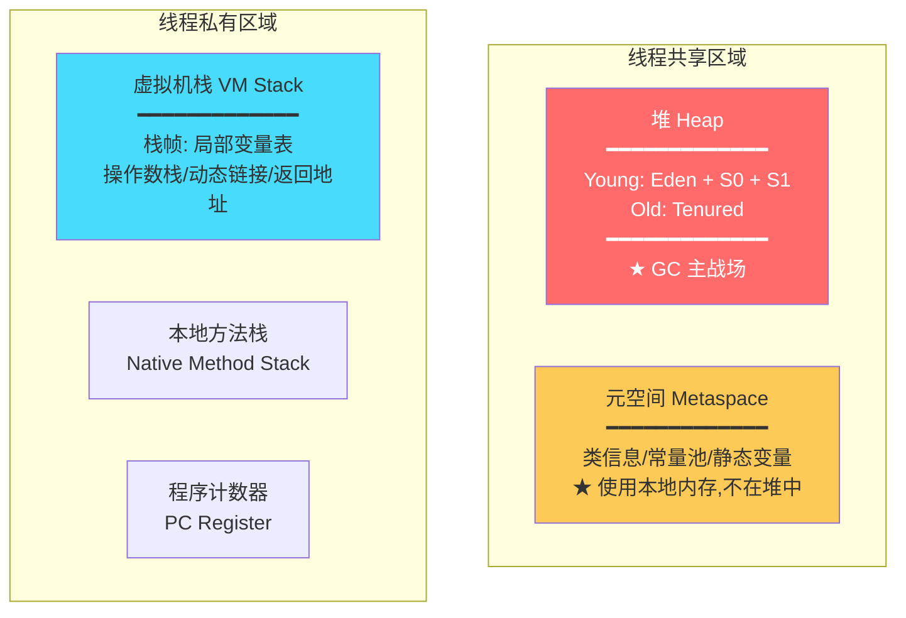

> 🔴 **核心五区**：堆（对象实例）、元空间（类元数据）、虚拟机栈（方法调用）、本地方法栈（Native）、程序计数器（行号指示器）
>
> 🟠 **重点**：JDK 8 移除永久代，用 ==Metaspace（本地内存）== 替代。不再受 `-XX:MaxPermSize` 限制，但要注意 `-XX:MaxMetaspaceSize` 防止类加载器泄漏。


### 1.2 🔴 堆内存分代模型

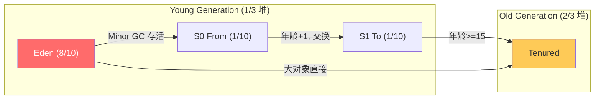

> 🔴 **核心参数**：
> - `-Xms` / `-Xmx`：堆初始/最大值（建议设相同，避免扩容抖动）
> - `-XX:NewRatio=2`：Old/Young = 2:1
> - `-XX:SurvivorRatio=8`：Eden/Survivor = 8:1:1
> - `-XX:MaxTenuringThreshold=15`：晋升老年代的年龄阈值

### 1.3 🔴 对象创建全过程

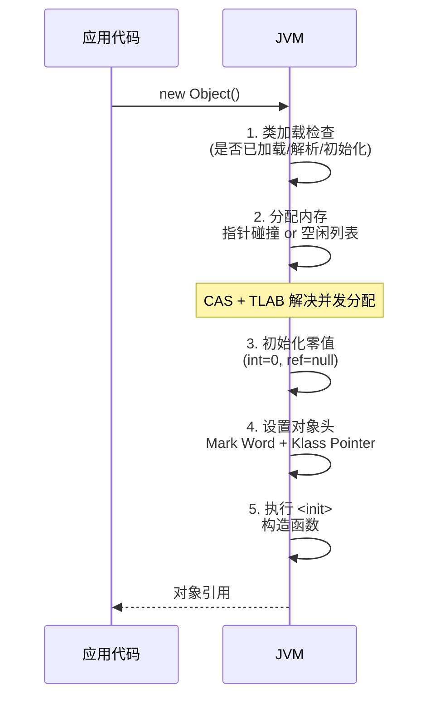

> 🟠 **重点**：
> - ==TLAB（Thread Local Allocation Buffer）==：每个线程预分配一块 Eden 空间，避免 CAS 竞争
> - ==指针碰撞==：内存规整时（Serial/ParNew）移动指针
> - ==空闲列表==：内存不规整时（CMS）维护可用列表

### 1.4 🔴 对象头结构（64位 JVM）

| 部分 | 位数 | 内容 |
|------|------|------|
| Mark Word | 64 bit | hashCode(31) + age(4) + 偏向锁标志(1) + 锁标志(2) |
| Klass Pointer | 32/64 bit | 指向类元数据（开压缩指针 32bit） |
| 数组长度 | 32 bit | 仅数组对象有 |

> 🟠 **Mark Word 在不同锁状态**：
> | 状态 | 存储内容 | 标志位 |
> |------|---------|--------|
> | 无锁 | hashCode + age | 01 |
> | 偏向锁 | ThreadID + epoch + age | 01 |
> | 轻量级锁 | 指向栈中 Lock Record 指针 | 00 |
> | 重量级锁 | 指向 Monitor 指针 | 10 |
> | GC 标记 | 空 | 11 |


### 1.5 🟢 避坑提醒

> 🟢 **避坑 1**：`-Xms` 和 `-Xmx` 不一致会导致堆扩容/缩容时 STW 更长。生产环境**必须设置相同值**。
>
> 🟢 **避坑 2**：元空间默认无上限（用系统内存），类加载器泄漏会吃光内存。设置 `-XX:MaxMetaspaceSize=256m` 兜底。
>
> 🟢 **避坑 3**：开启压缩指针（`-XX:+UseCompressedOops`，堆 <32GB 时默认开启）可节省约 30% 堆外内存。

---

## 2. 垃圾回收算法与收集器

### 2.1 🔴 判断对象是否存活

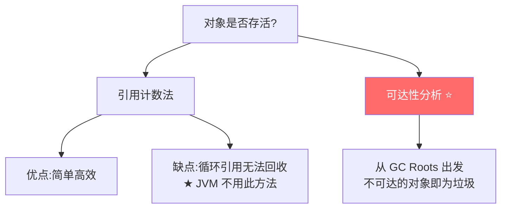

> 🔴 **GC Roots 包括**：
> 1. 虚拟机栈中引用的对象（局部变量）
> 2. 方法区中类静态属性引用的对象
> 3. 方法区中常量引用的对象
> 4. 本地方法栈中 JNI 引用的对象
> 5. 活跃线程的引用
> 6. synchronized 持有的对象

### 2.2 🔴 四大垃圾回收算法

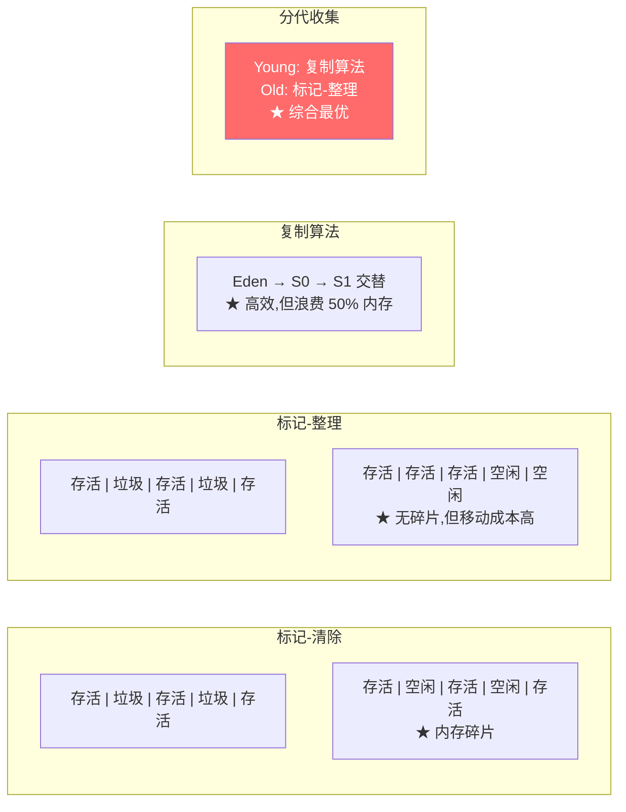

| 算法 | 用于 | 优点 | 缺点 |
|------|------|------|------|
| 标记-清除 | Old | 简单 | ==内存碎片== |
| 标记-整理 | Old | 无碎片 | 移动对象慢(STW) |
| 复制 | Young | 高效无碎片 | 浪费空间 |
| 分代收集 | 全堆 | 综合最优 | 需分代适配 |


### 2.3 🔴 垃圾收集器全家福

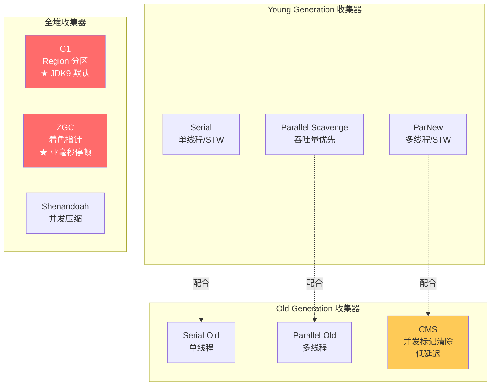

### 2.4 🔴 CMS 收集器（Concurrent Mark Sweep）

> 🔴 **核心**：以==最短停顿时间==为目标，适合对响应时间敏感的应用。

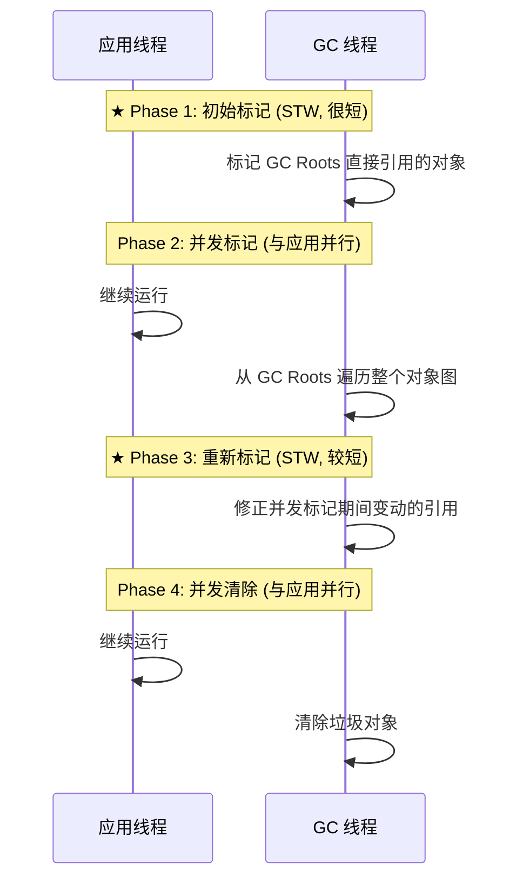

> 🟢 **CMS 缺点**：
> 1. ==内存碎片==：标记-清除算法不整理
> 2. ==浮动垃圾==：并发清除阶段新产生的垃圾要下次才能回收
> 3. ==CPU 敏感==：并发阶段占用 CPU 资源
> 4. ==Concurrent Mode Failure==：老年代空间不足触发 Serial Old 全量 STW

### 2.5 🟠 收集器选型指南

| 场景 | 推荐收集器 | 参数 |
|------|-----------|------|
| 小堆(< 4G) + 低延迟 | CMS | `-XX:+UseConcMarkSweepGC` |
| 中大堆(4-16G) | G1 ⭐ | `-XX:+UseG1GC` |
| 超大堆(> 16G) + 亚毫秒 | ZGC ⭐ | `-XX:+UseZGC` |
| 吞吐量优先(批处理) | Parallel | `-XX:+UseParallelGC` |
| 客户端/嵌入式 | Serial | `-XX:+UseSerialGC` |

---

## 3. G1 / ZGC 深入

### 3.1 🔴 G1 收集器核心原理

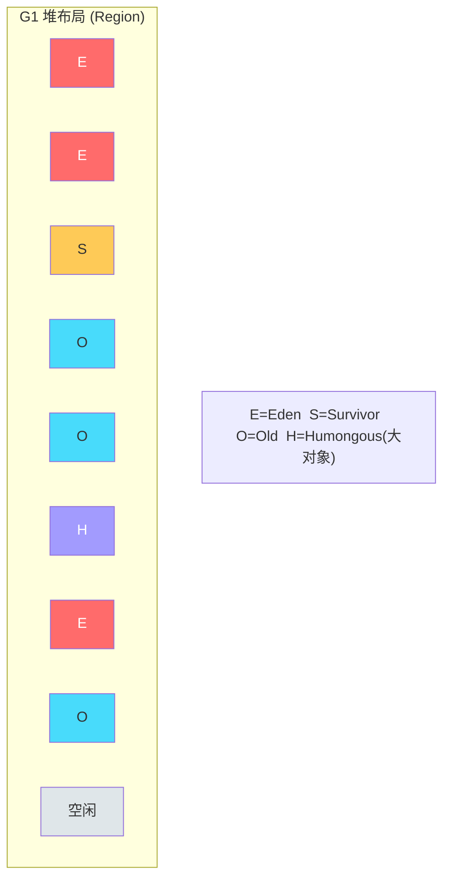

> 🔴 **G1 核心思想**：
> 1. 堆划分为 ==2048 个大小相等的 Region==（默认 1-32MB）
> 2. 每个 Region 可以是 Eden/Survivor/Old/Humongous
> 3. ==优先回收垃圾最多的 Region==（Garbage First）
> 4. 通过 ==预测模型== 控制停顿时间在目标范围内


### 3.2 🔴 G1 收集过程

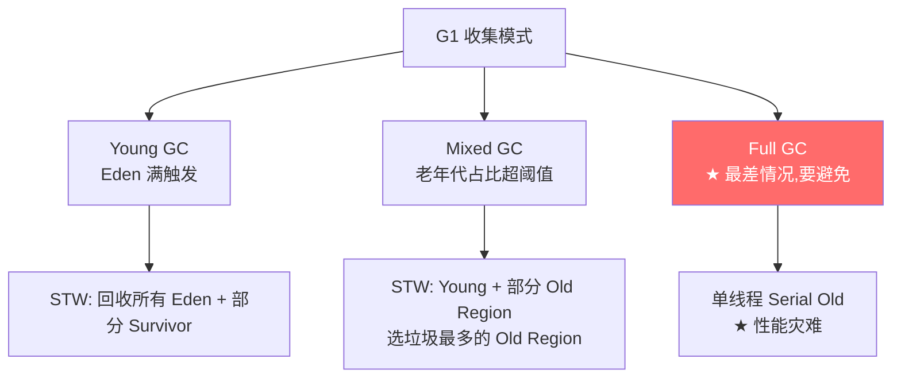

> 🔴 **关键参数**：
> ```bash
> -XX:+UseG1GC
> -XX:MaxGCPauseMillis=200        # ★ 目标停顿时间(ms)
> -XX:G1HeapRegionSize=8m         # Region 大小(1-32MB,必须是2的幂)
> -XX:InitiatingHeapOccupancyPercent=45  # 触发 Mixed GC 的老年代占比
> -XX:G1MixedGCCountTarget=8      # Mixed GC 分几次完成
> ```

### 3.3 🟠 G1 中的 Remembered Set (RSet)

> 🟠 **重点**：跨 Region 引用怎么处理？每个 Region 维护一个 ==RSet==，记录"谁引用了我"。

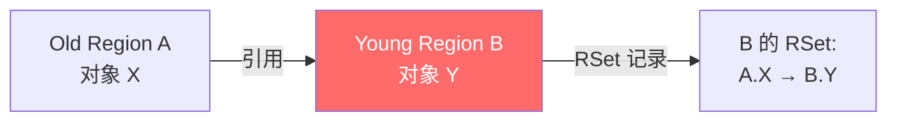

> 🟢 **避坑**：RSet 占堆内存约 ==5-20%==。Region 越小/跨区引用越多，RSet 越大。

### 3.4 🟡 ZGC 深入（JDK 15+ 生产可用）

> 🟡 **加分**：ZGC 是目前最先进的收集器，==停顿时间不超过 1ms==，与堆大小无关。

| 维度 | G1 | ZGC |
|------|----|----|
| 停顿时间 | 几十~几百 ms | ==< 1ms== |
| 堆大小 | 4-16 GB 最佳 | ==支持 TB 级== |
| 核心技术 | Region + 预测模型 | ==着色指针 + 读屏障== |
| JDK 版本 | JDK 9+ | JDK 15+（生产可用） |
| 参数 | `-XX:+UseG1GC` | `-XX:+UseZGC` |

> 🟡 **ZGC 核心技术**：
> - ==着色指针（Colored Pointer）==：在指针的高位存储 GC 状态信息（Marked0/Marked1/Remapped/Finalizable）
> - ==读屏障（Load Barrier）==：对象被读取时检查指针颜色，必要时自愈（Self-Healing）
> - ==并发转移==：对象移动时不需要 STW

---

## 4. 类加载机制

### 4.1 🔴 类加载过程

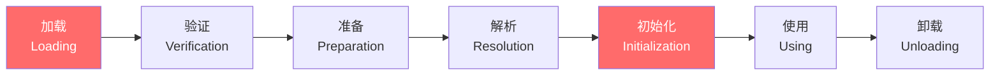

> 🔴 **各阶段核心**：
> | 阶段 | 做什么 | 关键点 |
> |------|--------|--------|
> | 加载 | 读取 .class 字节流，生成 Class 对象 | 可自定义 ClassLoader |
> | 验证 | 校验字节码合法性 | 文件格式/元数据/字节码/符号引用 |
> | 准备 | 为类变量分配内存并设零值 | ==static int a = 10 → 此时 a=0== |
> | 解析 | 符号引用 → 直接引用 | 类/字段/方法引用 |
> | 初始化 | 执行 `<clinit>`（静态代码块+静态变量赋值） | ==a=10 在这里赋值== |

### 4.2 🔴 双亲委派模型

```mermaid
flowchart BT
    APP[Application ClassLoader<br/>应用类加载器<br/>classpath] -->|委派| EXT[Extension ClassLoader<br/>扩展类加载器<br/>jre/lib/ext]
    EXT -->|委派| BOOT[Bootstrap ClassLoader<br/>启动类加载器 (C++)<br/>jre/lib]

    BOOT -.找不到.-> EXT
    EXT -.找不到.-> APP

    style BOOT fill:#ff6b6b,color:#fff
```

> 🔴 **核心**：先委托父加载器加载，父加载器加载不了才自己加载。
> - **作用**：防止核心类被篡改（如自定义 java.lang.String）
> - **破坏场景**：SPI（ServiceLoader）、Tomcat（每个 WebApp 独立类空间）、OSGi


### 4.3 🟠 Tomcat 打破双亲委派

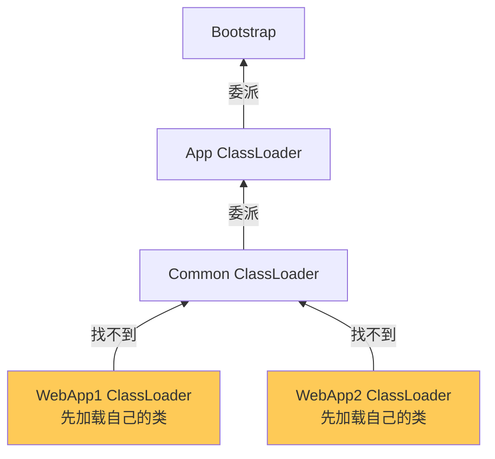

> 🟠 **重点**：Tomcat 的 WebappClassLoader **先加载自己的类**（WEB-INF/classes、WEB-INF/lib），找不到再委托父类。这样不同 Web 应用可以使用不同版本的同一个库。

### 4.4 🟡 加分：类加载器的初始化时机

> 🟡 **6 种触发类初始化的场景**（主动引用）：
> 1. `new` / `getstatic` / `putstatic` / `invokestatic`
> 2. 反射调用 `Class.forName()`
> 3. 初始化子类时，父类未初始化
> 4. 虚拟机启动时主类
> 5. JDK 7 动态语言支持（MethodHandle）
> 6. JDK 8 接口有 default 方法且实现类初始化

---

## 5. JVM 调优实战

### 5.1 🔴 调优工具全景

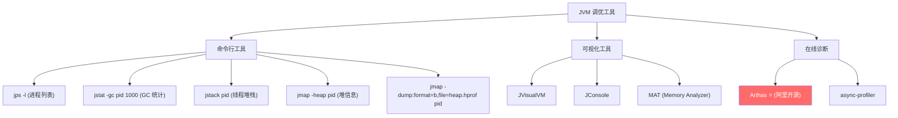

### 5.2 🔴 OOM 排查流程

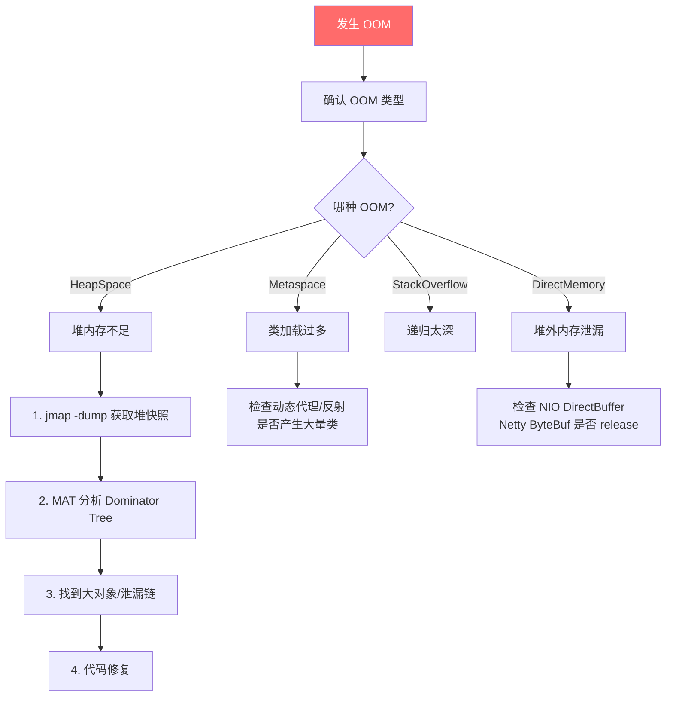

> 🔴 **必须配置的参数**：
> ```bash
> -XX:+HeapDumpOnOutOfMemoryError
> -XX:HeapDumpPath=/tmp/heap.hprof
> -XX:+PrintGCDetails -XX:+PrintGCDateStamps
> -Xloggc:/var/log/gc.log
> ```

### 5.3 🔴 Arthas 常用命令

| 命令 | 功能 | 场景 |
|------|------|------|
| `dashboard` | 总览（线程/内存/GC） | 快速诊断 |
| `thread -n 3` | CPU 占用最高的 3 个线程 | CPU 飙高 |
| `thread -b` | 找死锁 | 死锁排查 |
| `trace class method` | 方法调用链路耗时 | 慢请求定位 |
| `watch class method returnObj` | 观察方法返回值 | 逻辑问题排查 |
| `heapdump /tmp/a.hprof` | dump 堆快照 | 内存泄漏 |
| `sc -d ClassName` | 查看类加载信息 | 类冲突排查 |

### 5.4 🟠 GC 日志分析

```bash
# G1 GC 日志示例
[2024-01-15T10:30:45.123+0800] GC(123) Pause Young (Normal)
[2024-01-15T10:30:45.123+0800] GC(123)   Eden: 200M->0M  Survivors: 24M->28M  Heap: 600M->428M(1024M)
[2024-01-15T10:30:45.145+0800] GC(123) Pause Young (Normal) 22.5ms

# 关注指标:
# 1. GC 频率 (每分钟几次?)
# 2. 停顿时间 (22.5ms 是否可接受?)
# 3. 堆使用趋势 (是否持续增长? → 内存泄漏)
# 4. Full GC 次数 (应该为 0!)
```

### 5.5 🟢 避坑提醒

> 🟢 **避坑 1**：生产环境 ==禁止使用 jmap -histo:live==，它会触发 Full GC！用 Arthas 的 `heapdump` 替代。
>
> 🟢 **避坑 2**：`-XX:+PrintGCDetails` 在 JDK 9+ 已废弃，使用 `-Xlog:gc*` 替代。
>
> 🟢 **避坑 3**：调优原则是**先定位瓶颈再调参**，不要盲目调大堆（堆越大 GC 停顿越长）。


---

# 第二部分 · MySQL

## 6. InnoDB 存储引擎核心

### 6.1 🔴 InnoDB 架构全景

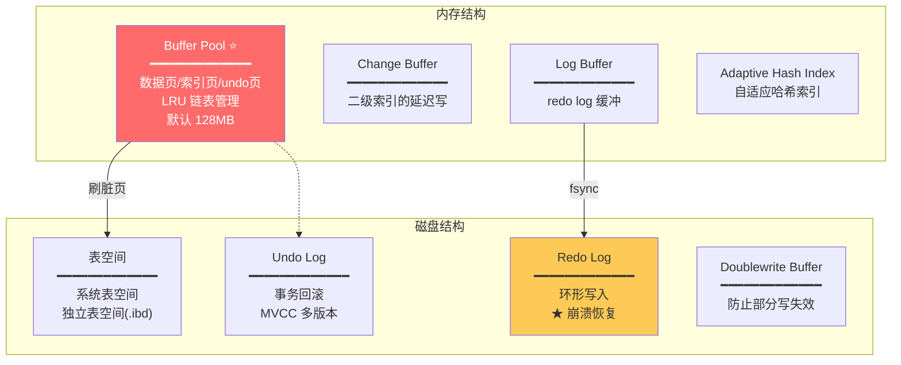

### 6.2 🔴 Buffer Pool 工作原理

> 🔴 **核心**：InnoDB 用 ==Buffer Pool== 缓存数据页，读写先走内存，再异步刷盘。

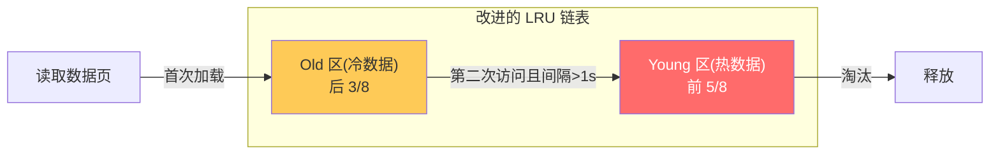

> 🟠 **为什么要分 Young/Old？**
> - 防止全表扫描（如 `SELECT *`）把热数据挤出去
> - 新页先放 Old 区，短时间内再次访问才升到 Young 区

### 6.3 🔴 Redo Log 与 WAL

> 🔴 **核心**：==WAL（Write-Ahead Logging）==——先写日志再写数据，保证崩溃恢复。

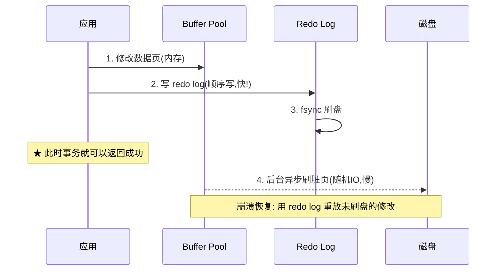

> 🔴 **Redo Log 刷盘策略**（`innodb_flush_log_at_trx_commit`）：
> | 值 | 行为 | 性能 | 安全 |
> |---|------|------|------|
> | ==1== ⭐ 默认 | 每次 commit 都 fsync | 最慢 | ==最安全(不丢数据)== |
> | 0 | 每秒 fsync | 最快 | 可能丢 1 秒数据 |
> | 2 | 每次 commit 写 OS 缓存,每秒 fsync | 中等 | OS 崩溃可能丢 |


---

## 7. 索引原理与优化

### 7.1 🔴 B+Tree 索引结构

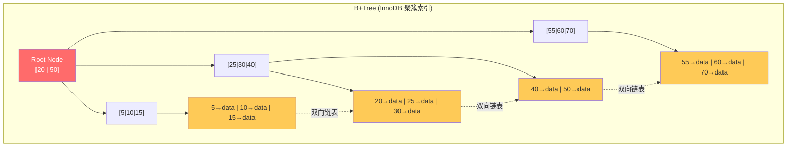

> 🔴 **B+Tree 特点**：
> 1. ==非叶子节点只存键值==，不存数据 → 单个节点能存更多 key → 树更矮
> 2. ==叶子节点包含所有数据==，用双向链表连接 → 范围查询高效
> 3. 树高一般 ==3-4 层==，即 3-4 次 IO 定位任何数据（千万级数据）

### 7.2 🔴 聚簇索引 vs 非聚簇索引

| 维度 | 聚簇索引（主键索引） | 非聚簇索引（辅助索引） |
|------|---------------------|---------------------|
| 叶子节点存 | ==完整行数据== | ==主键值== |
| 每表几个 | 只有 1 个 | 可以多个 |
| 查询 | 无需回表 | 需要==回表==（二次查询主键索引） |
| 插入 | 按主键顺序插入最优 | 随机位置插入 |


> 🔴 **回表**：辅助索引查到主键后，再去主键索引查完整数据。==覆盖索引可以避免回表==。

### 7.3 🔴 索引失效场景（必背）

| # | 失效场景 | 原因 | 示例 |
|---|---------|------|------|
| 1 | 前导通配符 | 无法利用 B+Tree 有序性 | `LIKE '%abc'` |
| 2 | 对列使用函数 | 索引存的是原值 | `WHERE SUBSTR(name,1,3)='abc'` |
| 3 | 对列做运算 | 同上 | `WHERE id + 1 = 10` |
| 4 | 隐式类型转换 | varchar 列用数字查 | `WHERE phone = 13800138000` |
| 5 | OR 条件无全索引 | OR 两侧必须都有索引 | `WHERE a=1 OR b=2`(b 无索引) |
| 6 | 不满足最左前缀 | 联合索引(a,b,c)跳过 a | `WHERE b=1 AND c=2` |
| 7 | 范围查询后列失效 | (a,b,c) 中 a 用 > | `WHERE a>1 AND b=2`(b 索引失效) |

> 🟢 **避坑**：`!=` 和 `NOT IN` 不一定失效！MySQL 优化器会根据==数据分布==决定是否用索引。用 `EXPLAIN` 验证。

### 7.4 🔴 覆盖索引

> 🔴 **核心**：查询的列全部在索引中，==不需要回表==。

```sql
-- 联合索引 (name, age)
-- ✅ 覆盖索引（不回表）
SELECT name, age FROM user WHERE name = 'Tom'
-- EXPLAIN extra: Using index

-- ❌ 需要回表
SELECT name, age, email FROM user WHERE name = 'Tom'
-- email 不在索引中，需要回表查主键索引
```

### 7.5 🟠 索引下推（Index Condition Pushdown, ICP）

> 🟠 **重点**：MySQL 5.6+ 优化，在存储引擎层就过滤不满足条件的记录，减少回表次数。

```sql
-- 联合索引 (name, age)
SELECT * FROM user WHERE name LIKE '张%' AND age = 25

-- 无 ICP: 存储引擎按 name LIKE '张%' 找到所有记录,全部回表后在 Server 层过滤 age
-- 有 ICP: 存储引擎同时检查 age=25,不满足的直接跳过,减少回表
-- EXPLAIN extra: Using index condition
```


---

## 8. 事务与锁机制

### 8.1 🔴 事务隔离级别与 MVCC

```mermaid
flowchart TD
    A[事务隔离级别] --> B["READ UNCOMMITTED<br/>脏读/不可重复读/幻读"]
    A --> C["READ COMMITTED (RC)<br/>解决脏读"]
    A --> D["REPEATABLE READ (RR) ⭐ 默认<br/>解决脏读+不可重复读"]
    A --> E["SERIALIZABLE<br/>全解决,但性能最差"]

    style D fill:#ff6b6b,color:#fff
```

> 🔴 **MVCC（Multi-Version Concurrency Control）**：
> - 每行记录有 ==隐藏字段==：`DB_TRX_ID`（事务ID）、`DB_ROLL_PTR`（回滚指针）
> - ==Undo Log==：记录数据修改前的版本，形成版本链
> - ==ReadView==：事务开启时生成的可见性判断快照

```mermaid
flowchart LR
    subgraph 版本链["Undo Log 版本链"]
        V3["当前版本<br/>trx_id=100"] --> V2["上一版本<br/>trx_id=80"]
        V2 --> V1["历史版本<br/>trx_id=50"]
    end

    RV["ReadView<br/>创建时活跃事务: [90,100]<br/>min_trx_id=90<br/>max_trx_id=101"]

    RV -->|"trx_id=100 在活跃列表中<br/>不可见!"| V3
    RV -->|"trx_id=80 < min(90)<br/>✅ 可见!"| V2

    style V2 fill:#48dbfb
```

> 🔴 **RC vs RR 的区别**：
> - **RC**：==每次 SELECT 都生成新 ReadView==（所以能看到其他已提交事务的修改）
> - **RR**：==只在第一次 SELECT 时生成 ReadView==（整个事务看到的是同一个快照）

### 8.2 🔴 锁机制详解

```mermaid
flowchart TD
    A[InnoDB 锁] --> B[行级锁]
    A --> C[表级锁]

    B --> B1["Record Lock<br/>锁单行"]
    B --> B2["Gap Lock<br/>锁间隙(防幻读)"]
    B --> B3["Next-Key Lock ⭐<br/>= Record + Gap"]

    C --> C1["意向锁<br/>IS / IX"]
    C --> C2["AUTO-INC Lock"]

    style B3 fill:#ff6b6b,color:#fff
```

> 🔴 **Next-Key Lock**：InnoDB 在 RR 级别下默认使用，锁定 ==记录本身 + 前面的间隙==，防止幻读。
>
> ```sql
> -- 假设表中有 id: 1, 5, 10, 15
> SELECT * FROM t WHERE id = 10 FOR UPDATE
> -- Record Lock: 锁 id=10 这一行
> -- 如果是范围查询:
> SELECT * FROM t WHERE id > 5 AND id < 12 FOR UPDATE
> -- Next-Key Lock: 锁 (5,10] + (10,15) 间隙
> ```

### 8.3 🔴 死锁排查

> 🔴 **死锁产生条件**：两个事务互相等待对方持有的锁。

```sql
-- 查看最近死锁
SHOW ENGINE INNODB STATUS\G

-- 关键配置
innodb_lock_wait_timeout = 50   -- 锁等待超时(秒)
innodb_deadlock_detect = ON     -- 死锁检测(默认开启)
```

> 🟢 **避坑**：
> - 事务内按==固定顺序==操作资源
> - 减少事务持有锁的时间（不要在事务里做 RPC）
> - 加索引减少锁的范围（无索引走表锁！）

---

## 9. SQL 优化实战

### 9.1 🔴 Explain 关键字段

| 字段 | 含义 | 关注点 |
|------|------|--------|
| **type** | 访问类型 | ==system > const > eq_ref > ref > range > index > ALL== |
| **key** | 实际使用的索引 | NULL 表示没用索引 |
| **rows** | 预估扫描行数 | 越小越好 |
| **Extra** | 额外信息 | 关注以下值 |

> 🔴 **Extra 重要值**：
> | 值 | 含义 | 好坏 |
> |---|------|------|
> | Using index | 覆盖索引 | ✅ 好 |
> | Using index condition | 索引下推 | ✅ 好 |
> | Using where | Server 层过滤 | 中性 |
> | ==Using filesort== | 额外排序 | ❌ 需优化 |
> | ==Using temporary== | 使用临时表 | ❌ 需优化 |

### 9.2 🔴 分页优化

```sql
-- ❌ 深翻页慢查询(扫描 100 万行再丢弃)
SELECT * FROM orders ORDER BY id LIMIT 1000000, 10

-- ✅ 方案 1: 延迟关联(覆盖索引 + 子查询)
SELECT * FROM orders 
WHERE id >= (SELECT id FROM orders ORDER BY id LIMIT 1000000, 1)
LIMIT 10

-- ✅ 方案 2: 游标分页(记住上次最大 ID)
SELECT * FROM orders WHERE id > 1000000 ORDER BY id LIMIT 10

-- ✅ 方案 3: 业务限制(禁止跳页,只允许下一页)
```

### 9.3 🔴 JOIN 优化

> 🔴 **核心**：MySQL 使用 ==Nested Loop Join（嵌套循环连接）==。

```mermaid
flowchart LR
    A["驱动表(小表)<br/>10 行"] -->|逐行匹配| B["被驱动表(大表)<br/>10000 行<br/>★ 必须有索引"]

    style A fill:#feca57
    style B fill:#ff6b6b,color:#fff
```

> 🔴 **JOIN 优化原则**：
> 1. ==小表驱动大表==：MySQL 优化器通常会自动选择
> 2. ==被驱动表的 JOIN 字段必须有索引==
> 3. ==避免 JOIN 表超过 3 个==
> 4. 尽量用 ==INNER JOIN==（优化器可自动调整驱动表顺序）

### 9.4 🟠 慢查询优化流程

```mermaid
flowchart TD
    A["发现慢 SQL<br/>(slow_query_log)"] --> B["EXPLAIN 分析"]
    B --> C{type 是什么?}
    C -->|ALL| D["加索引"]
    C -->|index| E["优化为覆盖索引"]
    C -->|range| F["检查索引选择性"]

    B --> G{Extra 有什么?}
    G -->|filesort| H["建联合索引<br/>避免排序"]
    G -->|temporary| I["优化 GROUP BY<br/>添加索引"]

    D --> J["重新 EXPLAIN 验证"]
    E --> J
    H --> J

    style A fill:#ff6b6b,color:#fff
```

> 🟠 **慢查询配置**：
> ```sql
> SET GLOBAL slow_query_log = ON;
> SET GLOBAL long_query_time = 1;          -- 超过 1 秒记录
> SET GLOBAL slow_query_log_file = '/var/log/mysql-slow.log';
> ```


---

# 第三部分 · Tomcat

## 10. 架构与线程模型

### 10.1 🔴 Tomcat 整体架构

```mermaid
flowchart TB
    subgraph Server["Server (1个)"]
        subgraph Service["Service"]
            subgraph Connector["Connector (连接器)<br/>处理网络连接"]
                EP["EndPoint<br/>TCP/IP 通信"]
                PR["Processor<br/>HTTP 协议解析"]
                AD["Adapter<br/>适配 Servlet 容器"]
            end
            subgraph Container["Container (容器)<br/>处理 Servlet 请求"]
                ENG["Engine"]
                HOST["Host (虚拟主机)"]
                CTX["Context (应用)"]
                WRP["Wrapper (Servlet)"]
            end
            Connector -->|Request/Response| Container
        end
    end

    CLIENT["Client"] --> Connector

    style Connector fill:#feca57
    style Container fill:#ff6b6b,color:#fff
```

### 10.2 🔴 NIO 线程模型

```mermaid
flowchart TB
    subgraph Tomcat_NIO["Tomcat NIO 线程模型"]
        ACC["Acceptor (1个线程)<br/>监听端口,接受连接"]
        POL["Poller (1-2个线程)<br/>Selector 多路复用<br/>监听 IO 事件"]
        WK["Worker 线程池 (200个)<br/>★ 执行 Servlet 业务逻辑"]
    end

    CLIENT["客户端连接"] -->|1. accept| ACC
    ACC -->|2. 注册到 Selector| POL
    POL -->|3. IO 就绪,分发| WK
    WK -->|4. 执行 Servlet| RESP["响应"]

    style WK fill:#ff6b6b,color:#fff
    style POL fill:#feca57
```

> 🔴 **三种 IO 模式对比**：
> | 模式 | 协议 | 特点 |
> |------|------|------|
> | BIO | `Http11Protocol` | 一连接一线程，并发低 |
> | ==NIO== ⭐ 默认 | `Http11NioProtocol` | 多路复用，适合长连接 |
> | APR | `Http11AprProtocol` | 本地库，性能最好但依赖多 |

---

## 11. 性能调优参数

### 11.1 🔴 核心参数速查

```xml
<!-- server.xml 关键配置 -->
<Connector port="8080" 
           protocol="org.apache.coyote.http11.Http11NioProtocol"
           maxThreads="200"          <!-- ★ 最大工作线程数 -->
           minSpareThreads="25"      <!-- 最小空闲线程 -->
           acceptCount="100"         <!-- 全忙时排队队列长度 -->
           connectionTimeout="20000" <!-- 连接超时(ms) -->
           maxConnections="10000"    <!-- NIO 最大连接数 -->
           compression="on"          <!-- 开启 gzip 压缩 -->
           compressionMinSize="2048" <!-- 超过 2KB 压缩 -->
/>
```

> 🔴 **参数含义**：
> | 参数 | 默认值 | 建议值 | 说明 |
> |------|--------|--------|------|
> | `maxThreads` | 200 | CPU 密集:CPU核数+1<br/>IO 密集:CPU核数×2 | Worker 线程数上限 |
> | `acceptCount` | 100 | 100-200 | 线程满时排队长度,超过拒绝 |
> | `maxConnections` | 10000(NIO) | 视并发 | 最大同时连接数 |
> | `connectionTimeout` | 20000 | 10000-30000 | 空闲连接超时 |

### 11.2 🟠 JVM 参数配置（Tomcat 专用）

```bash
# catalina.sh / setenv.sh
JAVA_OPTS="-server \
  -Xms2g -Xmx2g \
  -XX:+UseG1GC \
  -XX:MaxGCPauseMillis=200 \
  -XX:+HeapDumpOnOutOfMemoryError \
  -XX:HeapDumpPath=/tmp/tomcat_heap.hprof \
  -Xlog:gc*:file=/var/log/tomcat_gc.log:time"
```

### 11.3 🟢 避坑提醒

> 🟢 **避坑 1**：`maxThreads` 不是越大越好！线程过多 → 上下文切换开销大 → 性能反降。一般 200-500 足够。
>
> 🟢 **避坑 2**：Tomcat 默认 BIO 已在 8.5+ 移除，确保使用 NIO 协议。
>
> 🟢 **避坑 3**：生产环境务必关闭 ==AJP Connector==（CVE-2020-1938 幽灵猫漏洞）。


---

# 第四部分 · 面试官高频追问 Top 20

## 12. 通用答题套路 STAR-S

> **S** Scenario 一句话场景锚定 → **T** Theory 给结论/分类 → **A** Architecture 画核心流程 → **R** Reference 关键配置/数据 → **S** So-what 引申到实战

---

## 13. JVM Top 8

### Q1. JVM 内存模型讲一下？

> 🔴 **STAR-S 答**：
> S — Java 程序运行时内存划分
> T — 五大区域：堆(对象)、元空间(类)、虚拟机栈(方法调用)、本地方法栈(Native)、程序计数器
> A — 堆分 Young(Eden+S0+S1) 和 Old；JDK8 永久代→元空间(本地内存)
> R — `-Xms`/`-Xmx`/`-XX:MetaspaceSize`/`-XX:NewRatio`
> S — 实战中 Xms=Xmx 避免扩容抖动；MetaspaceSize 要设上限防泄漏

### Q2. 对象创建过程？

> 🔴 **核心**：类加载检查 → 分配内存(TLAB/CAS) → 零值初始化 → 设置对象头 → 执行构造函数
>
> **追问：TLAB 是什么？** 每线程预分配一块 Eden 空间，避免多线程 CAS 竞争，提高分配效率。

### Q3. 垃圾收集器怎么选？

> 🔴 **核心**：
> - 小堆(<4G) + 低延迟 → CMS
> - 中大堆(4-16G) → ==G1==（JDK9+ 默认）
> - 超大堆(>16G) → ==ZGC==（亚毫秒停顿）
> - 吞吐量优先(批处理) → Parallel

### Q4. G1 和 CMS 的区别？

> 🟠 **重点**：
> | 维度 | CMS | G1 |
> |------|-----|-----|
> | 算法 | 标记-清除 | 标记-整理(Region 间复制) |
> | 碎片 | ==有碎片== | ==无碎片== |
> | 停顿控制 | 不可预测 | ==可设 MaxGCPauseMillis== |
> | 适用堆 | <4G | 4-16G |
> | Full GC | Concurrent Mode Failure | Mixed GC 兜底 |

### Q5. OOM 怎么排查？

> 🔴 **三步法**：
> 1. 开启 `-XX:+HeapDumpOnOutOfMemoryError` 获取 dump 文件
> 2. MAT 工具分析 ==Dominator Tree==（占用最大的对象）
> 3. 找到 ==GC Roots 到大对象的引用链==，定位代码泄漏点

### Q6. 线上 CPU 100% 怎么排查？

> 🔴 **经典流程**：
> ```bash
> # 1. 找到 Java 进程 PID
> top -c    # 找 CPU 高的 Java 进程
> # 2. 找到最耗 CPU 的线程
> top -Hp <pid>   # 找线程 TID
> # 3. 转十六进制
> printf "%x\n" <tid>
> # 4. jstack 查看线程堆栈
> jstack <pid> | grep <tid_hex> -A 30
> # 或直接用 Arthas: thread -n 3
> ```

### Q7. 频繁 Full GC 怎么办？

> 🟠 **排查思路**：
> 1. ==看 GC 日志==：Old 区增长速度、Young GC 后存活对象大小
> 2. ==分析大对象==：是否有大对象直接进 Old？调 `-XX:PretenureSizeThreshold`
> 3. ==分析 Survivor==：对象是否过早晋升？调 `MaxTenuringThreshold`
> 4. ==内存泄漏==：dump 分析是否有对象不断增长不释放

### Q8. 类加载的双亲委派模型？什么时候会被打破？

> 🔴 **双亲委派**：先委托父加载器，防止核心类被篡改。
> **打破场景**：
> - ==SPI==：Bootstrap 加载了接口(如 JDBC Driver),但实现在应用 classpath → Thread.currentThread().getContextClassLoader()
> - ==Tomcat==：每个 WebApp 独立 ClassLoader，先加载自己的
> - ==OSGi==：网状委派

---

## 14. MySQL Top 8

### Q9. B+Tree 为什么适合做索引？

> 🔴 **四个原因**：
> 1. ==矮胖==：非叶子节点不存数据,单节点存更多 key,树高 3-4 层
> 2. ==磁盘友好==：节点大小=数据页(16KB),一次 IO 读一个节点
> 3. ==范围查询==：叶子节点双向链表,顺序遍历
> 4. ==稳定==：所有查询都到叶子节点,O(logN) 稳定

### Q10. 索引失效的场景？

> 🔴 **七大失效**（背诵）：
> 前导通配符、函数、运算、隐式转换、OR无全索引、不满足最左前缀、范围后列失效

### Q11. MVCC 是怎么实现的？

> 🔴 **三要素**：隐藏字段(trx_id/roll_ptr) + Undo Log 版本链 + ReadView 可见性判断
> - RC：每次 SELECT 新建 ReadView
> - RR：第一次 SELECT 建 ReadView，后续复用

### Q12. MySQL 死锁怎么解决？

> 🟠 **三招**：
> 1. 事务内按==固定顺序==操作同一组资源
> 2. 加索引减少锁的粒度（无索引=表锁）
> 3. 减少事务持有锁时间（事务内不做 RPC/IO）
> 
> 排查：`SHOW ENGINE INNODB STATUS\G` 看 LATEST DETECTED DEADLOCK

### Q13. 慢 SQL 怎么优化？

> 🔴 **流程**：
> 1. 开启 slow_query_log 找到慢 SQL
> 2. EXPLAIN 分析 type/key/rows/Extra
> 3. 针对性优化：加索引/改覆盖索引/分页优化/避免 SELECT *

### Q14. InnoDB 为什么推荐自增主键？

> 🟠 **原因**：
> 1. ==顺序插入==：B+Tree 叶子节点按顺序追加，不会页分裂
> 2. ==空间紧凑==：int/bigint 比 UUID(36字节) 省空间
> 3. ==辅助索引更小==：辅助索引叶子存主键值

### Q15. Redo Log 和 Binlog 的区别？

> 🟠 **对比**：
> | 维度 | Redo Log | Binlog |
> |------|----------|--------|
> | 层级 | InnoDB 引擎层 | MySQL Server 层 |
> | 内容 | 物理日志(数据页修改) | 逻辑日志(SQL/行变更) |
> | 写入方式 | 环形覆盖写 | 追加写(不覆盖) |
> | 用途 | ==崩溃恢复== | ==主从复制+数据恢复== |

### Q16. 大表如何添加索引？

> 🟡 **方案**：
> 1. ==Online DDL==（MySQL 5.6+）：`ALTER TABLE ... ADD INDEX ... ALGORITHM=INPLACE, LOCK=NONE`
> 2. ==gh-ost==：GitHub 开源工具,无锁 DDL
> 3. ==pt-online-schema-change==：Percona 工具

---

## 15. Tomcat Top 4

### Q17. Tomcat 线程模型？

> 🔴 **核心**：Acceptor(接受连接) → Poller(NIO Selector 多路复用) → Worker 线程池(执行 Servlet)

### Q18. maxThreads 设多少合适？

> 🟠 **公式**：
> - CPU 密集型：==线程数 = CPU 核数 + 1==
> - IO 密集型：==线程数 = CPU 核数 × 2 × (1 + IO 等待时间/CPU 计算时间)==
> - 实践：先设 200，通过压测观察 CPU 利用率和响应时间调整

### Q19. Tomcat 类加载器的特殊之处？

> 🟠 WebappClassLoader 打破双亲委派：先加载自己的类(WEB-INF/)，再委托父加载器。保证不同 Web 应用的类隔离。

### Q20. Tomcat 如何做性能调优？

> 🔴 **四个维度**：
> 1. ==线程池==：maxThreads/acceptCount/maxConnections
> 2. ==IO 模型==：确保用 NIO（8.5+ 默认）
> 3. ==JVM==：G1 收集器 + 合理堆大小
> 4. ==应用层==：开启 gzip 压缩、静态资源走 CDN/Nginx

---

## 16. 终极记忆地图

```mermaid
mindmap
  root((性能调优))
    JVM
      内存模型(5区)
      对象创建(5步)
      GC算法(4种)
      收集器(Serial/CMS/G1/ZGC)
      G1(Region/RSet/Mixed GC)
      ZGC(着色指针/读屏障)
      类加载(双亲委派)
      调优工具(Arthas/MAT)
      OOM排查(dump/MAT/引用链)
    MySQL
      InnoDB架构
        Buffer Pool(LRU)
        Redo Log(WAL)
        Undo Log(MVCC)
      索引
        B+Tree结构
        聚簇/非聚簇
        覆盖索引
        索引失效7场景
        索引下推ICP
      事务
        隔离级别(RR默认)
        MVCC(ReadView)
        锁(Record/Gap/Next-Key)
        死锁排查
      优化
        Explain分析
        分页优化
        JOIN优化
        慢查询流程
    Tomcat
      架构(Connector+Container)
      线程模型(Acceptor/Poller/Worker)
      IO模式(BIO/NIO/APR)
      调优参数(maxThreads/acceptCount)
      类加载(WebappClassLoader)
```

---

## 结语

这份增强版加入了 ==视觉等级== 帮助有侧重地背诵：

- 🔴 **必背核心**：面试**直接问**的题，先把这些吃透
- 🟠 **重点理解**：**追问到这一层**才稳，源码级路径
- 🟡 **加分项**：**拉开差距**的内容，适合中高级岗
- 🟢 **避坑提醒**：实战陷阱，体现工程经验

**建议复习节奏**：
1. **第一遍**：只读 🔴 部分，把骨架建起来（预计 40 分钟）
2. **第二遍**：补 🟠，理解每个核心机制的原理（1.5 小时）
3. **第三遍**：扫 🟡🟢，准备拔高与避坑（40 分钟）
4. **临场**：每章 mermaid 图记牢，口述时手画

> 祝面试顺利，Offer 满满。 — 整理者