# Java 性能调优面试总结 · 深度增强版

> 整理基础:`document/normal/性能调优面试总结.md`
> 风格:**大纲 → 细分知识点 → 图解 → 关键源码/参数 → 面试官追问 + 答题模板**
> 适用:中高级 Java 后端 / SRE / 性能优化岗

---

## 视觉规范

| 标记 | 含义 | 优先级 |
|------|------|--------|
| 🔴 **必背核心** | 面试必答,底层原理 | ⭐⭐⭐⭐⭐ |
| 🟠 **重点理解** | 高频追问,源码级路径 | ⭐⭐⭐⭐ |
| 🟡 **加分项** | 拔高内容 | ⭐⭐⭐ |
| 🟢 **避坑提醒** | 实战陷阱 | ⭐⭐⭐ |
| `==高亮==` | 关键术语 / 参数 | 强化记忆 |

> 💡 **建议**:第一遍看 🔴 + 关键参数;第二遍看 🟠 + 实战案例;第三遍 🟡🟢 拔高与避坑。

---

## 全文大纲

```
第一部分 · JVM 内存与对象 (核心基石)
   1. JVM 运行时数据区
   2. 对象创建与内存分配
   3. 对象内存布局与对象头
   4. 引用类型与可达性分析

第二部分 · 垃圾回收
   5. GC 算法 4 件套
   6. 分代收集 + 卡表 + 屏障
   7. 七大垃圾收集器演化
   8. G1 深度剖析
   9. ZGC / Shenandoah(亚毫秒级)

第三部分 · 类加载与字节码
   10. 类加载 7 阶段
   11. 双亲委派与自定义加载器
   12. 字节码与 JIT 编译

第四部分 · MySQL 性能调优
   13. InnoDB 架构与 B+Tree
   14. 索引设计与失效场景
   15. Explain 完全解读
   16. 事务隔离级别与 MVCC
   17. 锁机制与死锁
   18. SQL 优化实战

第五部分 · Tomcat / 容器调优
   19. Tomcat 架构与 NIO 模型
   20. Tomcat 调优参数
   21. 类加载器 + 热部署

第六部分 · 实战调优方法论
   22. CPU 100% 排查
   23. 内存泄漏排查
   24. GC 频繁排查
   25. 慢 SQL 排查
   26. 调优工具箱(Arthas/MAT/JFR)

第七部分 · 面试官高频追问 Top 30
   STAR-S 答题模板 + 加分弹药库
```

---

# 第一部分 · JVM 内存与对象

## 1. JVM 运行时数据区

### 1.1 🔴 5 大内存区域(必背)

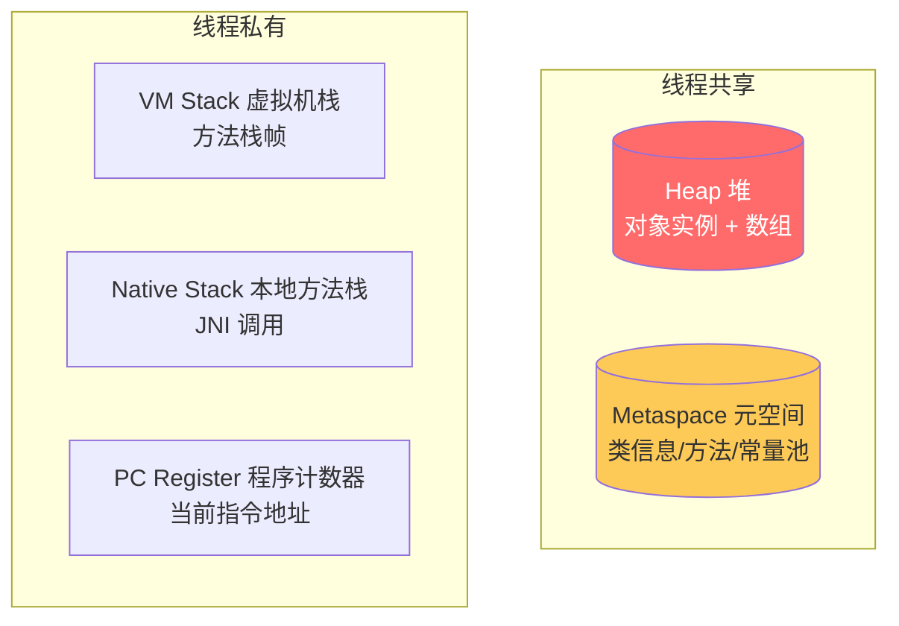

| 区域 | 线程 | 存什么 | OOM 类型 |
|------|------|--------|---------|
| ⭐ ==**Heap 堆**== | 共享 | 对象实例、数组 | `OutOfMemoryError: Java heap space` |
| ⭐ ==**Metaspace 元空间**== | 共享 | 类信息、方法、常量池(JDK 8+) | `OutOfMemoryError: Metaspace` |
| ==**VM Stack 虚拟机栈**== | 私有 | ==栈帧:局部变量表 + 操作数栈 + 动态链接 + 返回地址== | `StackOverflowError` / `OOM` |
| **Native Stack** | 私有 | C/C++ JNI 调用 | 同上 |
| **PC Register** | 私有 | 当前执行字节码地址 | 唯一不会 OOM |

### 1.2 🔴 JDK 7 → 8 关键变化

> 🔴 **必懂**:JDK 8 ==**移除永久代(PermGen),改用元空间(Metaspace)**==。

| 维度 | JDK 7 PermGen | JDK 8+ Metaspace |
|------|---------------|------------------|
| 位置 | ==JVM 堆内== | ==本地内存(Native)== |
| 大小限制 | `-XX:MaxPermSize`(固定) | `-XX:MaxMetaspaceSize`(默认无上限) |
| 字符串常量池 | PermGen | ==移到 Heap== |
| 类卸载 | 困难 | 容易 |
| OOM 表现 | `PermGen space` | `Metaspace` |

> 🟢 **避坑**:Metaspace 默认没上限,大量动态生成类(Groovy / CGLIB / Spring Boot 反射代理)会**用尽机器内存**!生产**必须**设 `-XX:MaxMetaspaceSize=256m`(根据规模)。

### 1.3 🟠 栈帧深入

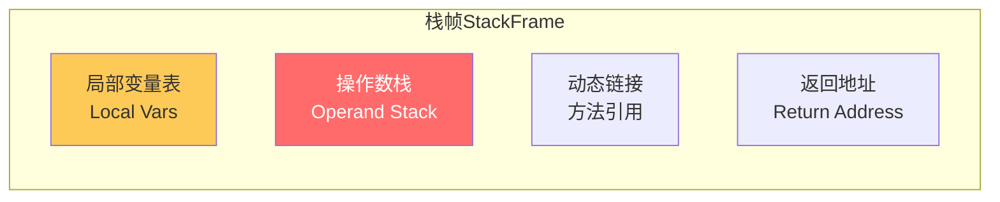

> 🟠 **重点**:
> - **局部变量表**:以 ==Slot 槽== 为单位,1 Slot = 32 bit。`long/double` 占 2 槽
> - **操作数栈**:JVM 是 ==**基于栈的指令集**==(`iadd` 弹两个数压结果),区别于 x86 寄存器架构
> - **栈深度**:每个线程默认栈大小 ==`-Xss512k`==(JDK 11+),递归过深会 `StackOverflowError`

### 1.4 🟢 直接内存(Direct Memory)

> 🟢 **避坑**:直接内存**不属于 JVM 5 大区**,但 OOM 排查必看。

`ByteBuffer.allocateDirect()` / Netty / NIO 用堆外内存:
- 减少 ==用户态↔内核态拷贝==(零拷贝基石)
- 不受 `-Xmx` 限制,但受 `-XX:MaxDirectMemorySize` 限制
- 默认 = `-Xmx`,**很容易忽视导致 OOM**

```bash
# 设置直接内存上限
-XX:MaxDirectMemorySize=512m
```

### 1.5 🔴 面试官追问

**Q: 字符串常量池在哪里?**
> 🔴 JDK 6 在 PermGen,JDK 7 移到 Heap,JDK 8+ 仍在 Heap。所以 `intern()` 行为变化:JDK 6 复制字符串到 PermGen,JDK 7+ 只存引用到堆里的字符串。

**Q: Class 对象在哪里?**
> 🟠 JDK 8+ Class 对象本身在 ==Heap==,Class 的元数据(方法字节码、字段信息)在 ==Metaspace==。

---

## 2. 对象创建与内存分配

### 2.1 🔴 对象创建 5 步

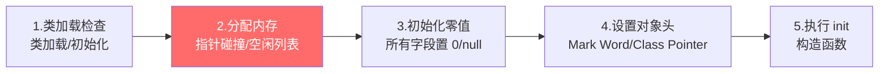

### 2.2 🔴 内存分配 2 种方式

| 方式 | 原理 | 适用 |
|------|------|------|
| ⭐ ==**指针碰撞**== | 已用内存放一边,空闲放一边,移动指针 | ==Serial / ParNew== 等规整堆 |
| ==**空闲列表**== | 维护可用块列表,找一块装得下的 | ==CMS== 等不规整堆 |

> 🟠 **并发分配冲突解决**:
> - **CAS + 重试**(原子指针)
> - ⭐ ==**TLAB(Thread Local Allocation Buffer)**==:每个线程在 Eden 预分配一小块"自留地",分配时无锁

### 2.3 🔴 TLAB 必懂

```bash
# TLAB 默认开启
-XX:+UseTLAB                 # 默认 true
-XX:TLABSize=1m              # 单个 TLAB 大小
-XX:+ResizeTLAB              # 允许动态调整
```

**TLAB 工作原理**:
1. 每个线程在 Eden 拿一块小内存(默认 1% Eden)
2. 对象分配在 TLAB 内,**完全无锁**
3. TLAB 用完了,在 Eden 申请新 TLAB(此时同步)
4. 大对象 / TLAB 装不下 → 直接分配在 Eden(同步)

### 2.4 🔴 对象进入老年代的 4 种情况

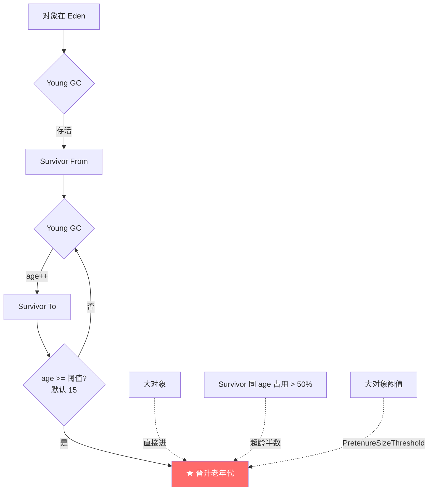

| 触发 | 参数 | 默认值 |
|------|------|--------|
| ⭐ ==**年龄达标**== | `-XX:MaxTenuringThreshold` | 15 |
| ⭐ ==**大对象直入**== | `-XX:PretenureSizeThreshold` | 0(关闭) |
| ⭐ ==**动态年龄判定**== | Survivor 同 age 之和 > 50% 则 ==**该 age 及以上全部晋升**== | - |
| ==**Survivor 装不下**== | 担保机制下放 | - |

> 🟢 **避坑**:`PretenureSizeThreshold` 只对 ==Serial / ParNew== 有效,G1/CMS 自有判断逻辑(humongous object)。

### 2.5 🟠 内存分配优化

> 🟠 **必懂 3 大优化**:

| 优化 | 含义 | 触发条件 |
|------|------|--------|
| ⭐ ==**TLAB 分配**== | 线程本地分配 | 默认开启 |
| ⭐ ==**栈上分配**== | 不逃逸的对象直接分到栈,GC 不管 | ==逃逸分析== `-XX:+DoEscapeAnalysis`(默认) |
| ==**标量替换**== | 把对象拆成基本类型,分散到栈 | ==逃逸分析== + `-XX:+EliminateAllocations` |

```java
// 栈上分配候选(对象不逃逸)
public void calc() {
    Point p = new Point(1, 2);   // p 不会被外部引用
    int sum = p.x + p.y;          // 用完即弃
}                                  // 编译后可能根本没创建对象,直接拆成 int x, int y 在栈上
```

### 2.6 🔴 面试官追问

**Q: new 一个对象的过程?**
> 🔴 5 步:**类加载检查 → 分配内存(TLAB 优先,指针碰撞 / 空闲列表)→ 初始化零值 → 设置对象头(Mark Word + Class Pointer)→ 执行 `<init>` 构造函数**。

**Q: 为什么 new 出来的对象字段会有默认值?**
> 🟠 因为第 3 步**初始化零值**(int=0, Object=null, boolean=false),保证字段访问不会读到脏数据。

---

## 3. 对象内存布局与对象头

### 3.1 🔴 对象三段结构

```
┌──────────────────────────────────────────────────────┐
│  对象头 Object Header                                │
│  ├── Mark Word (8B,锁信息/HashCode/GC age)           │
│  ├── Class Pointer (4B 压缩 / 8B,指向 Class 元数据)  │
│  └── Array Length (4B,仅数组对象有)                  │
├──────────────────────────────────────────────────────┤
│  实例数据 Instance Data                               │
│  ├── 父类字段 → 子类字段(按声明顺序)                 │
│  └── 8B 对齐                                         │
├──────────────────────────────────────────────────────┤
│  对齐填充 Padding (确保对象大小 8B 倍数)               │
└──────────────────────────────────────────────────────┘
```

### 3.2 🔴 Mark Word 64 位结构(高频)

```
无锁状态:
┌────────────────────────────────────┬─────┬───┬─┐
│  unused 25 │ identity_hashcode 31 │  ─  │ 00│ 1│
└────────────────────────────────────┴─────┴───┴─┘
                                         ↑
                                       锁标志位

偏向锁:
┌──────────────┬──────────┬─────┬───┬─┐
│ thread_id 54 │ epoch 2  │  ─  │ 01│ 1│
└──────────────┴──────────┴─────┴───┴─┘

轻量级锁:
┌────────────────────────────────────┬───┐
│  ptr_to_lock_record 62             │ 00│
└────────────────────────────────────┴───┘

重量级锁:
┌────────────────────────────────────┬───┐
│  ptr_to_heavyweight_monitor 62     │ 10│
└────────────────────────────────────┴───┘

GC 标记:
┌────────────────────────────────────┬───┐
│  ─                                  │ 11│
└────────────────────────────────────┴───┘
```

> 🟢 **避坑**:JDK 15+ ==偏向锁默认禁用==,JDK 18+ 完全移除。原因:现代场景多线程为常态,偏向锁的回收开销 > 收益。

### 3.3 🔴 压缩指针

> 🔴 **必懂**:64 位 JVM 默认 ==**压缩 OOP**==(`-XX:+UseCompressedOops`),Class Pointer 从 8B 压到 4B。

| 堆大小 | 压缩指针 | Class Pointer |
|-------|---------|---------------|
| ≤ 32GB | ✅ 自动开启 | 4B |
| > 32GB | ❌ 关闭 | 8B |

> 🟢 **经验**:堆 < 32GB 时省内存 + 减小 cache miss。**生产堆设到 31GB 比 33GB 反而更省**(避免压缩失效)。

### 3.4 🟡 用 JOL 看对象布局

```java
// 添加依赖 org.openjdk.jol:jol-core
import org.openjdk.jol.info.ClassLayout;

System.out.println(ClassLayout.parseInstance(new Object()).toPrintable());
```

输出示例:
```
java.lang.Object object internals:
 OFFSET  SIZE   TYPE DESCRIPTION
      0     4        (object header: mark)
      4     4        (object header: class)
      8     8        (object alignment gap)
Instance size: 16 bytes
```

### 3.5 🟢 缓存行对齐(伪共享)

> 🟢 **避坑**:CPU 缓存行 = 64 字节。多个高频写的字段在同一缓存行 → ==**False Sharing 伪共享**==。

```java
// ❌ 伪共享
class Bad {
    volatile long a;       // 8B
    volatile long b;       // 8B,可能同缓存行
}

// ✅ 缓存行填充
class Good {
    volatile long a;
    long p1, p2, p3, p4, p5, p6, p7;   // 56B
    volatile long b;
}

// JDK 8+ 注解
@sun.misc.Contended         // 需 -XX:-RestrictContended
class Best {
    volatile long a;
    volatile long b;
}
```

---

## 4. 引用类型与可达性分析

### 4.1 🔴 4 种引用强度

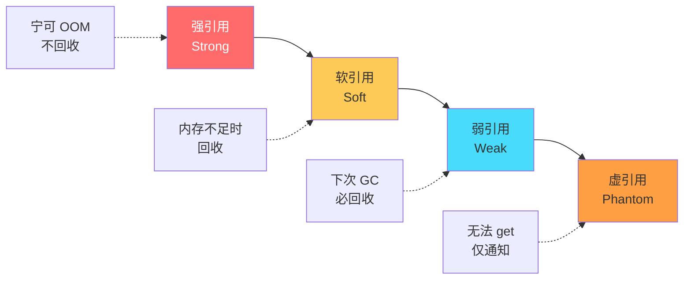

| 引用 | 回收时机 | 用途 |
|------|---------|------|
| ⭐ ==**强引用**== Strong | 永不回收(除非不可达) | 默认 `Object o = new Object()` |
| ==**软引用**== Soft | ==**内存不足时**== | 缓存(Spring `SoftReference` cache) |
| ⭐ ==**弱引用**== Weak | ==**下次 GC 必回收**== | `WeakHashMap` / `ThreadLocalMap` Entry key |
| ==**虚引用**== Phantom | 同弱引用,但 ==**get 永远返回 null**== | 跟踪对象回收(配合 `ReferenceQueue`),Cleaner |

### 4.2 🔴 GC Roots(可达性分析)

> 🔴 **必懂**:JVM 用 ==**可达性分析**==(不是引用计数)判断对象是否存活。从 ==**GC Roots**== 出发,遍历不到的就是垃圾。

**GC Roots 都有哪些?**

| 类型 | 例子 |
|------|------|
| ⭐ **VM Stack 局部变量** | 当前正在执行的方法局部变量 |
| ⭐ **方法区静态字段** | `static User staticUser` |
| ⭐ **方法区常量** | 字符串常量池 |
| **本地方法栈 JNI** | Native 引用 |
| **同步锁持有对象** | `synchronized(obj)` 的 obj |
| **JVM 内部引用** | Class、ClassLoader、Thread |

> 🟠 **重要**:Java 不用引用计数,因为==**循环引用**== 会导致泄漏。可达性分析能解决。

### 4.3 🟠 finalize() 与对象自救

> 🟢 **避坑**:`finalize()` ==**不可靠 + 不推荐 + JDK 9 已弃用**==。原因:
> 1. 执行时机不确定
> 2. 可能让对象"复活"导致状态错乱
> 3. Finalizer 线程优先级低,可能拖累 GC
>
> ==替代方案==:`try-with-resources` + `AutoCloseable` + `Cleaner`(JDK 9+)。

---


---

# 第二部分 · 垃圾回收

## 5. GC 算法 4 件套

### 5.1 🔴 必背 4 大算法

| 算法 | 原理 | 优点 | 缺点 | 适用 |
|------|------|------|------|------|
| ⭐ ==**标记-清除**== Mark-Sweep | 标记存活,清除死亡 | 简单 | ==**内存碎片**== | CMS 老年代 |
| ⭐ ==**标记-复制**== Copying | 把存活对象复制到另一半 | 无碎片、快 | ==**内存减半**== | Young GC(Eden + 2 Survivor) |
| ⭐ ==**标记-整理**== Mark-Compact | 标记后把存活对象向一端移动 | 无碎片、不浪费 | ==**移动慢**== | 老年代(Serial Old / Parallel Old) |
| ==**分代收集**== Generational | 按年龄分代,各用各算法 | 综合最优 | 实现复杂 | ⭐ 默认策略 |

### 5.2 🔴 标记-复制图解

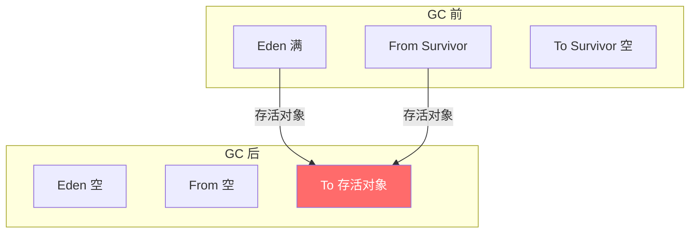

> 🟠 **重点**:Young GC 用 ==**8:1:1**==(Eden : S0 : S1),只浪费 10% 不是 50%。基于"==**朝生夕死**=="假设(98% 对象很快死掉)。

### 5.3 🟠 标记-整理 vs 标记-清除

```
标记-清除前:  [A][_][B][_][_][C][_][D]   ← 碎片,大对象分不下
标记-清除后:  [A][_][B][_][_][_][_][_]

标记-整理前:  [A][_][B][_][_][C][_][D]
标记-整理后:  [A][B][_][_][_][_][_][_]   ← 紧凑,无碎片
```

### 5.4 🔴 分代假设

> 🔴 **必懂 2 大假设**(GC 设计哲学):
> 1. ==**弱分代假设**==:绝大多数对象朝生夕死(Young GC 高效)
> 2. ==**强分代假设**==:熬过多次 GC 的对象越难死(Old 区少回收)

→ 推论:**Young 用复制,Old 用整理**。

---

## 6. 跨代引用与卡表 / 屏障

### 6.1 🔴 跨代引用问题

> 🔴 **必懂**:做 Young GC 时,**老年代里如果有指向 Eden 的引用**,GC Root 必须扫描整个老年代?那就慢爆了。

→ 解决:==**记忆集(Remembered Set)+ 卡表(Card Table)**==

### 6.2 🔴 卡表(Card Table)

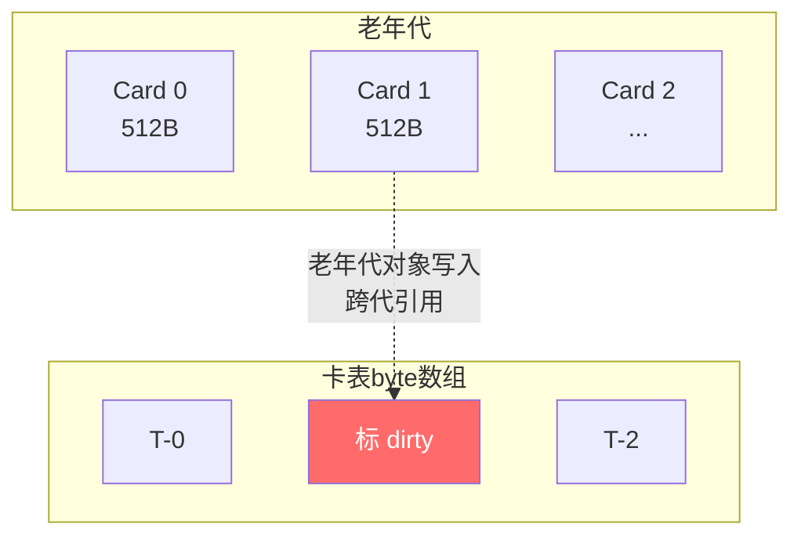

> 🔴 **核心**:把老年代分成 ==**512B 的 Card**==,每个 Card 在 ==Card Table 字节数组== 中对应 1 字节。
> - 老年代写引用时,通过 ==**写屏障(Write Barrier)**== 把对应 Card 标记为 ==**dirty**==
> - Young GC 时**只扫描 dirty Card**,无需全扫老年代

### 6.3 🟠 写屏障(Write Barrier)

```
// 伪代码,每次老年代对象赋值都触发
oop_field_store(obj, field, new_value):
    *field = new_value;          // 真实赋值
    card_table[hash(obj)] = DIRTY;   // ★ 标记 dirty card
```

> 🟠 **代价**:每次引用赋值多一条指令,但比扫描整个老年代快数千倍。

### 6.4 🟡 G1 的 RSet 与 SATB

> 🟡 **加分**:G1 不用全局 Card Table,而是每个 Region 一个 ==**Remembered Set**==,记录"谁指向我"。SATB(Snapshot-At-The-Beginning)是 G1 的并发标记算法,详见后文。

### 6.5 🟢 三色标记


> 🟠 **重点**:CMS / G1 / ZGC 都用三色标记。
> - **白色**:未被扫描(GC 结束时仍白 = 垃圾)
> - **灰色**:在扫描中
> - **黑色**:已扫描完
>
> ==**漏标问题**==:并发标记时,黑色对象新引用了白色对象,白色没机会变灰 → 错误回收。
> 解决:**Incremental Update(CMS)** / **SATB(G1)** + 写屏障。

---

## 7. 七大垃圾收集器演化

### 7.1 🔴 收集器全景图

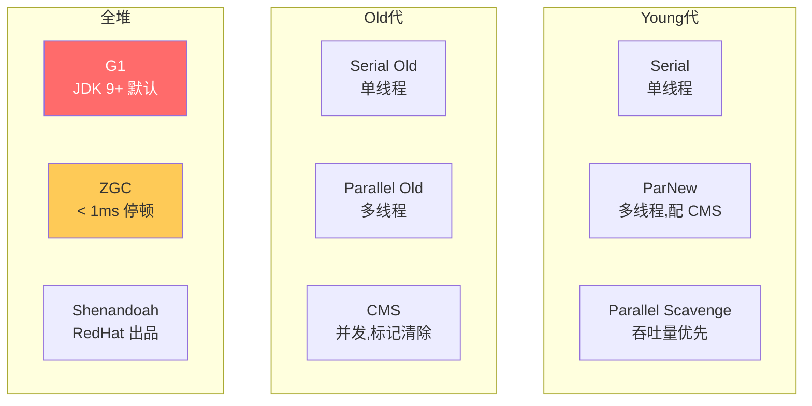

### 7.2 🔴 收集器组合(JDK 8 之前默认)

| 组合 | Young + Old | 特点 |
|------|------------|------|
| ⭐ Serial + Serial Old | 单线程 + 单线程 | client 模式 / 小内存 |
| ⭐ ParNew + CMS | 多线程 + 并发清除 | ==低延迟,Web 应用经典== |
| ⭐ Parallel Scavenge + Parallel Old | 多线程 + 多线程 | ==吞吐量优先,后台计算== |
| ⭐ G1 (JDK 9+ 默认) | 整体 Region | ==平衡延迟+吞吐== |

### 7.3 🔴 关键参数对照

```bash
# 选择收集器
-XX:+UseSerialGC               # Serial + Serial Old
-XX:+UseParNewGC               # ParNew + Serial Old(已废弃,JDK 9+)
-XX:+UseParallelGC             # Parallel Scavenge + Parallel Old(JDK 8 默认)
-XX:+UseConcMarkSweepGC        # ParNew + CMS(JDK 14 已移除)
-XX:+UseG1GC                   # G1(JDK 9+ 默认)
-XX:+UseZGC                    # ZGC(JDK 11+ 实验,JDK 15+ 生产可用)
-XX:+UseShenandoahGC           # Shenandoah(JDK 12+)
```

### 7.4 🔴 CMS 详解(经典面试)

> 🔴 **必懂**:CMS 是 ==**并发标记清除**==,目标是**最短 STW 停顿**。JDK 14 已被移除,但面试还高频考。

**CMS 4 阶段**:

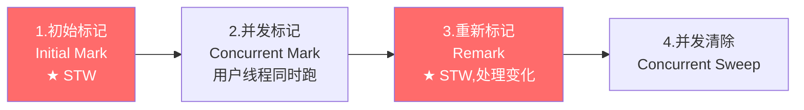

| 阶段 | STW? | 做什么 |
|------|------|--------|
| 初始标记 | ✅ 短 | 标记 GC Roots 直接关联 |
| 并发标记 | ❌ | 沿引用链遍历,与用户线程并发 |
| 重新标记 | ✅ 较短 | 处理并发期间变化的引用 |
| 并发清除 | ❌ | 清扫垃圾,与用户线程并发 |

> 🟢 **CMS 三大缺点**:
> 1. ==**占 CPU**== — 并发阶段挤占应用线程
> 2. ==**Concurrent Mode Failure**== — 老年代空间不足时,降级为 Serial Old(==Full GC==,长 STW)
> 3. ==**内存碎片**== — 标记-清除算法

### 7.5 🟠 Parallel vs CMS 选择

| 维度 | Parallel | CMS |
|------|---------|-----|
| 算法 | 标记-整理 | 标记-清除 |
| 目标 | ==吞吐量== | ==低延迟== |
| 多线程 | ✅ | ✅ 并发标记 |
| 适用 | 后台计算 / 数据处理 | Web / 在线服务 |

---

## 8. G1 深度剖析

### 8.1 🔴 G1 设计哲学

> 🔴 **必懂**:G1 = ==**Garbage-First**==,JDK 9+ 默认,目标 ==**可预测停顿时间**==(Pause Time Goal)。

**核心创新**:
1. ==**Region 化**==:把堆分成 N 个相等大小的 Region(默认 2048 个),不再有物理上的 Young/Old 分隔
2. ==**Garbage First**==:每次回收**垃圾最多**的 Region
3. ==**可预测停顿**==:`-XX:MaxGCPauseMillis=200` 用户设目标,G1 控制每次回收 Region 数

### 8.2 🔴 G1 内存布局

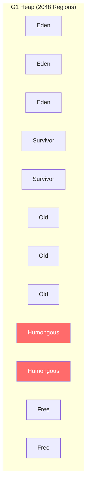

| Region 类型 | 含义 |
|------------|------|
| **Eden** | 新生代 Eden |
| **Survivor** | 新生代 Survivor |
| **Old** | 老年代 |
| ⭐ ==**Humongous**== | ==**对象 > Region 一半**== 时,直接分到 Humongous(可跨多个连续 Region) |
| **Free** | 空闲 |

> 🟢 **避坑**:Humongous 对象 ==**直接进 Old**== 而非 Young,且回收成本高(整理时要移动连续多 Region)。**避免大对象**(如长字符串、大数组)。

### 8.3 🔴 G1 三种 GC

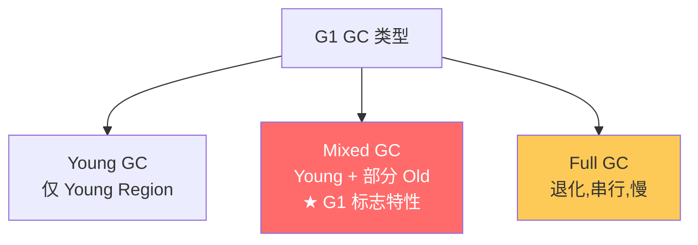

> 🔴 **核心**:
> - ==**Young GC**==:Eden 满了就 Young GC,STW,把存活对象复制到 Survivor 或 Old
> - ==**Mixed GC**==:堆占用达到 ==`-XX:InitiatingHeapOccupancyPercent=45`== 时,标记后回收 Young + 部分 Old(垃圾最多的 Region 优先)
> - ==**Full GC**==:Mixed GC 跟不上 → 退化全堆 GC,**单线程,极慢,要避免**

### 8.4 🔴 G1 工作流程


| 阶段 | STW? | 做什么 |
|------|------|--------|
| 初始标记 | ✅ 短 | 标记 GC Roots 直接对象,通常和 Young GC 一起 |
| 并发标记 | ❌ | 沿引用链遍历 |
| 最终标记 | ✅ 短 | SATB 处理并发期间变化 |
| 筛选回收 | ✅ 较长 | 排序 Region 按价值,选 ==Pause Time Goal 内能回收== 的 |

### 8.5 🔴 G1 关键参数

```bash
# 启用
-XX:+UseG1GC

# 停顿目标(★ G1 核心调优手段)
-XX:MaxGCPauseMillis=200       # 默认 200ms

# Region 大小(1MB ~ 32MB,2 的幂)
-XX:G1HeapRegionSize=8m        # 默认根据堆大小自动算

# Mixed GC 触发阈值(老年代占用)
-XX:InitiatingHeapOccupancyPercent=45   # 默认 45%

# Mixed GC 最多包含的老年代 Region 比例
-XX:G1MixedGCLiveThresholdPercent=85
-XX:G1OldCSetRegionThresholdPercent=10  # 每次 Mixed 最多回收 10% Old

# 并发线程数
-XX:ParallelGCThreads=8                  # STW 阶段
-XX:ConcGCThreads=2                      # 并发阶段
```

### 8.6 🟢 G1 调优心法

> 🟢 **避坑**:
> 1. ==**不要同时设 `-Xmn`**==(新生代大小)— G1 会自己动态调整
> 2. ==**MaxGCPauseMillis 别设太小**==(< 50ms)— 会频繁 GC,反而吞吐下降
> 3. ==**避免 Humongous 对象**== — 大数组、大缓存提前规划
> 4. ==**Full GC 是警报**== — 出现就要排查,不是正常现象

### 8.7 💡 G1 vs CMS 选择

| | G1 | CMS |
|---|----|-----|
| 算法 | ==标记-整理(局部 + 复制)== | ==标记-清除== |
| 碎片 | ❌ 无 | ✅ 有 |
| 大堆性能 | ⭐ 优秀(> 6GB) | 一般 |
| 可预测停顿 | ⭐ 支持 | 不支持 |
| 状态 | ⭐ JDK 9+ 默认 | ==JDK 14 已移除== |

---

## 9. ZGC / Shenandoah(亚毫秒级)

### 9.1 🔴 ZGC 核心特性

> 🔴 **必懂**:ZGC 是 ==**并发的、低延迟的、可伸缩的**== 垃圾收集器。
> - ==**STW < 1ms**==(JDK 16+ 后甚至 < 0.1ms)
> - 支持 ==**TB 级堆**==(8MB ~ 16TB)
> - JDK 11 实验,JDK 15 生产可用,JDK 21 ==**Generational ZGC**==(分代版,JDK 21 默认推荐)

### 9.2 🔴 ZGC 4 大黑科技

| 技术 | 说明 |
|------|------|
| ⭐ ==**着色指针 Colored Pointer**== | 用指针的高 4 位存 GC 信息(Marked0/Marked1/Remapped/Finalizable) |
| ⭐ ==**读屏障 Load Barrier**== | 每次读引用都校验颜色,触发并发整理 |
| ==**并发整理**== | 整个堆都是 Region,重定位与用户线程并发 |
| ==**多视图映射**== | 同一物理内存映射到 3 个虚拟地址(Mark0/Mark1/Remapped),实现"并发"标记 |

```
着色指针(64位):
┌──────┬──────┬──────────────────────────────────────┐
│ 4 高位│Heap前缀│           对象地址                    │
│ 颜色 │      │                                      │
└──────┴──────┴──────────────────────────────────────┘
```

### 9.3 🟠 ZGC vs G1

| | ZGC | G1 |
|---|-----|----|
| STW | ==< 1ms== | 10-200ms |
| 堆大小 | 8MB-16TB | 适合 < 64GB |
| 算法 | 染色指针 + 读屏障 | SATB + Card Table |
| CPU 开销 | 较高(读屏障) | 较低 |
| 推荐 | ==大内存 + 极低延迟== | 通用 |

### 9.4 🟡 Shenandoah

> 🟡 **加分**:RedHat 出品,**和 ZGC 思路类似**,但 OpenJDK 主推 ZGC。Shenandoah 用 ==**Brooks Pointer**== 转发指针实现并发。

### 9.5 🟢 何时升级到 ZGC

> 🟢 **建议**:
> - 堆 > 32GB → 考虑 ZGC
> - GC pause SLA < 10ms → 必须 ZGC
> - 已用 G1 但满足不了延迟需求 → ZGC
> - JDK 21 LTS + Generational ZGC = ==**新项目首选**==

### 9.6 🔴 面试官追问

**Q: ZGC 为啥这么快?**
> 🔴 三点:
> 1. ==**染色指针**==:GC 信息直接放指针上,不用 mark bit map
> 2. ==**读屏障**==:每次读对象引用时,触发并发整理(代价是读慢一点)
> 3. ==**全程并发**==:STW 阶段几乎不做工作

**Q: ZGC 有什么代价?**
> 🟠 ① 读屏障让读操作变慢(~10% throughput 下降);② 内存占用更高(指针多视图映射);③ JDK 17 之前不支持分代,大对象效率不如 G1。

---

# 第三部分 · 类加载与字节码

## 10. 类加载 7 阶段

### 10.1 🔴 必背:7 阶段

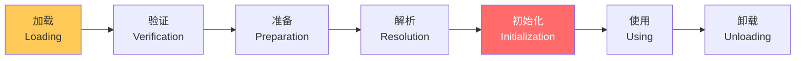

| 阶段 | 做什么 |
|------|--------|
| ⭐ **加载** | 通过类全限定名找到 class 字节流 → 转成方法区运行时数据 → 堆生成 Class 对象 |
| **验证** | 字节码合法性检查(防恶意 class) |
| ⭐ **准备** | 给**类静态变量**分配内存 + 设**零值**(`static int x = 5` 此时 x=0) |
| **解析** | 把符号引用替换为直接引用 |
| ⭐ ==**初始化**== | 执行 `<clinit>`(==静态变量赋值 + 静态代码块==),`x` 此时才变 5 |
| **使用** | 正常运行 |
| **卸载** | ClassLoader 不可达后,Class 卸载(罕见) |

### 10.2 🔴 触发初始化的 6 种情况

> 🔴 **必背**:JVM 规范规定 ==**6 种主动引用**== 才触发 `<clinit>`:

| 情况 | 例子 |
|------|------|
| ⭐ **new** | `new User()` |
| ⭐ **读静态字段** | `User.count` |
| ⭐ **写静态字段** | `User.count = 1`(final 常量除外) |
| ⭐ **调静态方法** | `User.create()` |
| **反射** | `Class.forName("User")` |
| **JVM 启动主类** | `main` 所在类 |

> 🟢 **避坑**:**被动引用不触发**:
> ```java
> // 1. 子类访问父类静态字段
> class A { static int x = 1; }
> class B extends A {}
> System.out.println(B.x);   // 只初始化 A,不初始化 B!
>
> // 2. 数组定义
> User[] users = new User[10];   // 不触发 User 初始化
>
> // 3. 常量
> System.out.println(MyClass.CONST);   // final + 编译期常量,不触发
> ```

### 10.3 🟠 `<clinit>` vs `<init>`

| | `<clinit>` | `<init>` |
|---|-----------|----------|
| 触发 | 类初始化时一次 | 每次 new |
| 内容 | static 字段赋值 + static 块 | 实例字段赋值 + 实例块 + 构造方法 |
| 父类先调 | ✅ 父类先 clinit | ✅ 父类构造先 |
| 加锁 | ==JVM 保证线程安全(单例双锁可省)== | 无 |

> 🟡 **加分**:`<clinit>` 加锁是 ==**线程安全单例模式 - 静态内部类法**== 的基础:
> ```java
> public class Singleton {
>     private Singleton() {}
>     private static class Holder {
>         static final Singleton INSTANCE = new Singleton();
>     }
>     public static Singleton getInstance() {
>         return Holder.INSTANCE;   // 线程安全 + 懒加载
>     }
> }
> ```

---

## 11. 双亲委派与自定义加载器

### 11.1 🔴 三大类加载器层级

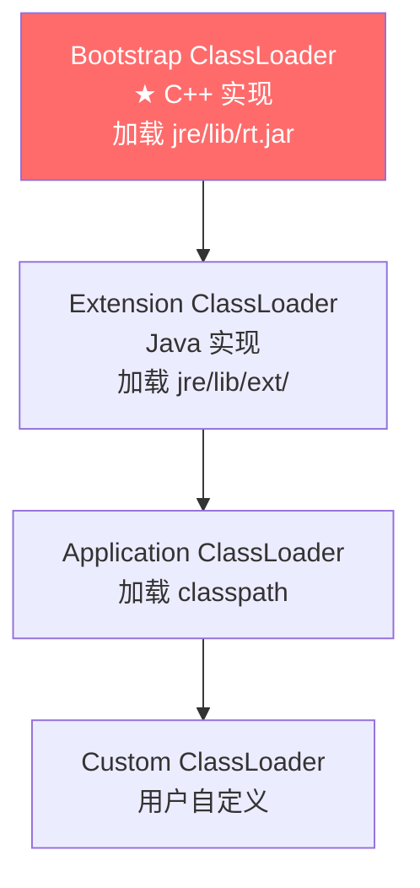

> 🔴 **JDK 9+ 变化**:
> - Extension ClassLoader 改名为 ==**Platform ClassLoader**==
> - 引入 ==**模块化(Jigsaw)**==

### 11.2 🔴 双亲委派模型

> 🔴 **必懂**:类加载请求**先委派给父加载器**,父加载不了再自己加载。

```python
def loadClass(name):
    # 1. 检查是否已加载
    c = findLoadedClass(name)
    if c: return c

    # 2. 委派给父加载器
    if parent != None:
        try:
            return parent.loadClass(name)
        except ClassNotFoundException:
            pass

    # 3. 父加载不了,自己加载
    return findClass(name)
```

### 11.3 🔴 双亲委派的 3 大好处

> 🔴 **必背**:
> 1. ==**避免类重复加载**==:父加载过的子不再加载
> 2. ==**保证核心类安全**==:你写个 `java.lang.String` 也加载不进来(BCL 已加载)
> 3. ==**沙箱隔离**==:不同 ClassLoader 加载的同名类不相等

### 11.4 🟠 破坏双亲委派的场景

> 🟠 **必懂**:双亲委派不是绝对的,有 3 种破坏:

| 场景 | 原因 |
|------|------|
| ⭐ ==**SPI 机制(JDBC/Spring)**== | BCL 加载的接口要调用具体实现(如 JDBC 驱动),用 ==Thread Context ClassLoader== 反向委派 |
| ⭐ ==**OSGi / 模块化容器**== | 各模块独立加载,实现热插拔,网状结构而非树状 |
| ⭐ ==**Tomcat WebappClassLoader**== | 每个 Web 应用一个 loader,先自己加载再委派父(隔离) |

### 11.5 🔴 Tomcat 类加载器架构

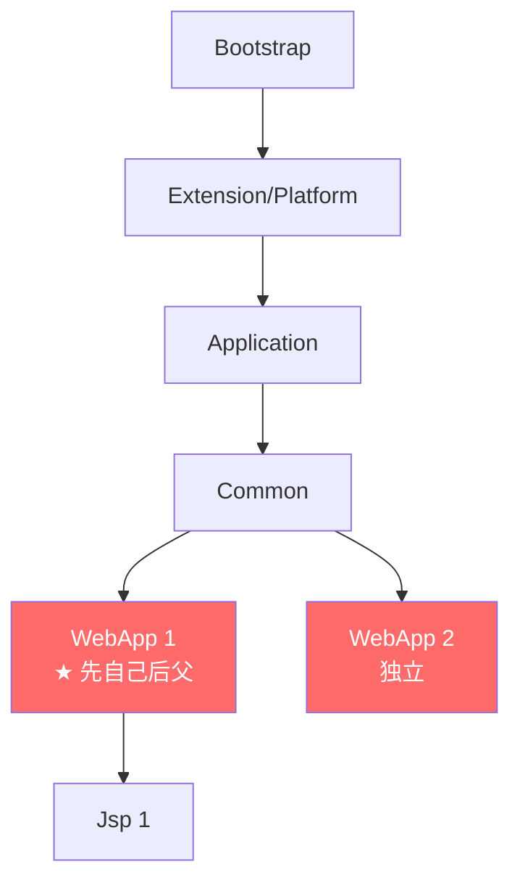

> 🟠 **关键**:
> - **Common**:所有 webapp 共享(servlet-api 等)
> - **WebappClassLoader**:每个 webapp 一个,实现 ==**应用隔离**==(同名类互不影响)
> - 加载顺序:Bootstrap → Common → ==**WebApp 自己**== → 父
> - **JSP ClassLoader**:支持 JSP 修改后热加载

### 11.6 🟢 自定义类加载器

```java
public class MyClassLoader extends ClassLoader {
    @Override
    protected Class<?> findClass(String name) throws ClassNotFoundException {
        byte[] data = loadClassData(name);   // 从加密 jar / 网络 / DB 加载字节码
        return defineClass(name, data, 0, data.length);
    }
}
```

**典型用途**:
- 加密 class(防反编译)
- 热部署(替换 ClassLoader 重新加载)
- 字节码增强(Javassist / ASM)

### 11.7 🔴 面试官追问

**Q: 不同 ClassLoader 加载同名类相等吗?**
> 🔴 ==**不相等**==!Class 的相等判断是 `(全限定名 + ClassLoader)` 联合主键。==`A instanceof B` 在跨 loader 时会返回 false==,这是 Tomcat / OSGi 沙箱隔离的基础。

**Q: SPI 怎么破坏双亲委派的?**
> 🟠 `ServiceLoader` 内部用 ==`Thread.currentThread().getContextClassLoader()`==,这是 ==**线程上下文 ClassLoader**==,可以指向 AppClassLoader。这样 BCL 加载的 `java.sql.Driver` 接口就能在运行时反向调用 AppClassLoader 加载的 `com.mysql.cj.jdbc.Driver` 实现。

---

## 12. 字节码与 JIT 编译

### 12.1 🔴 字节码基础

```java
// Hello.java
public class Hello {
    public static void main(String[] args) {
        int a = 1;
        int b = 2;
        int c = a + b;
    }
}

// javap -c Hello.class
public static void main(java.lang.String[]):
    iconst_1                // 常量 1 入栈
    istore_1                // 弹出存到 a (slot 1)
    iconst_2
    istore_2                // 存到 b
    iload_1                 // 加载 a
    iload_2                 // 加载 b
    iadd                    // 弹两个相加,结果入栈
    istore_3                // 存到 c
    return
```

> 🟠 **关键**:JVM 是 ==**基于栈的指令集**==(不是 x86 寄存器)。所有运算在 ==操作数栈== 上进行,通过 `iload/istore` 在栈和局部变量表间搬运。

### 12.2 🔴 JIT 编译器

> 🔴 **必懂**:HotSpot JVM 用 ==**解释 + JIT 混合模式**==。

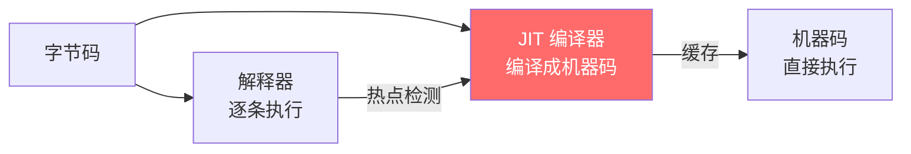

| 编译器 | 阶段 | 优化 |
|--------|------|------|
| ⭐ ==**C1**== Client | 快速编译,优化少 | 编译速度优先 |
| ⭐ ==**C2**== Server | 慢编译,深度优化 | 性能优先(老牌) |
| ⭐ ==**Graal**== | C2 替代品,Java 写 | JDK 17+ 实验,GraalVM 主力 |
| **AOT** | 启动前预编译 | GraalVM Native Image |

### 12.3 🔴 分层编译

> 🔴 **必懂**:JDK 8+ 默认 ==**分层编译**==(Tiered Compilation)。

```
Level 0: 解释执行(无 profiling)
Level 1: C1 编译(无 profiling)
Level 2: C1 编译(有限 profiling)
Level 3: C1 编译(完整 profiling)
Level 4: C2 编译(基于 profile 深度优化)
```

> 🟠 **代码热度计数**:方法被调用次数 / 循环回边次数,达到阈值就触发 JIT。

### 12.4 🟠 JIT 优化技术

| 优化 | 说明 |
|------|------|
| ⭐ ==**方法内联**== | 把小方法直接展开,省调用开销 |
| ⭐ ==**逃逸分析**== | 不逃逸对象 → 栈上分配 / 标量替换 / 锁消除 |
| ==**循环展开**== | 减少跳转 |
| ==**死代码消除**== | 永远走不到的分支去掉 |
| ==**常量传播**== | 编译期算出常量结果 |
| ==**类型推测**== | 单态调用直接走 |

```bash
# 查看 JIT 编译过程
-XX:+PrintCompilation                # 打印编译事件
-XX:+UnlockDiagnosticVMOptions
-XX:+PrintInlining                   # 打印内联
```

### 12.5 🟢 GraalVM Native Image

> 🟢 **加分**:GraalVM 把 Java AOT 编译成原生可执行文件。
> - **启动毫秒级**(传统 JVM 启动几秒)
> - **内存占用 1/10**
> - **缺点**:不支持反射(需配置)、构建慢、调试难
> - **场景**:Serverless / CLI / 微服务冷启动

### 12.6 🔴 面试官追问

**Q: JVM 跑 Java 比 C 慢吗?**
> 🟠 启动慢(JIT 预热),稳态后**不一定慢**:
> 1. JIT 基于运行时 profile 优化,可能比 C 静态优化更激进
> 2. 但内存管理(GC)是固定开销
> 3. 极致性能仍 C/C++/Rust 占优

**Q: 怎么让 Java 启动更快?**
> 🟡 4 招:
> 1. ==CDS / AppCDS==(Class Data Sharing,共享类元数据)
> 2. ==Tiered Compilation==(默认开启)
> 3. ==GraalVM Native Image==(AOT)
> 4. ==CRaC== (Coordinated Restore at Checkpoint,JDK 21+)

