# Java性能调优面试总结 · 吃透版

> 整理基础：`性能调优面试总结.md`
> 深度标准：**吃透级别** — 不只给结论，给完整的"为什么"链条 + 源码 + 时序图 + 事故案例
> 适用：中高级 Java 后端 / 性能优化岗面试
> 阅读完本文，你应该能回答面试官关于性能调优的**任何追问**

---

## 视觉规范说明

| 标记 | 含义 | 优先级 |
|------|------|--------|
| 🔴 **必背核心** | 面试必答，底层原理，八股文核心 | ⭐⭐⭐⭐⭐ |
| 🟠 **重点理解** | 高频考点，源码级关键路径 | ⭐⭐⭐⭐ |
| 🟡 **加分项** | 拔高内容，扩展知识 | ⭐⭐⭐ |
| 🟢 **避坑提醒** | 实战陷阱，翻车场景 | ⭐⭐⭐ |

> 建议：第一遍只看 🔴 部分，把骨架建起来；第二遍看 🟠 加深；第三遍看 🟡🟢 拔高与避坑。

---


## 全文大纲

```
第一部分 · JVM (高频⭐⭐⭐⭐⭐)
    1. 内存区域与对象生命周期
    2. 垃圾回收算法与收集器
    3. G1 / ZGC 深入
    4. 类加载机制
    5. JVM 调优实战

第二部分 · MySQL (高频⭐⭐⭐⭐⭐)
    6. InnoDB 存储引擎核心
    7. 索引原理与优化
    8. 事务与锁机制
    9. SQL 优化实战

第三部分 · Tomcat (⭐⭐⭐)
    10. 架构与线程模型
    11. 性能调优参数

第四部分 · 面试官高频追问 + 答题模板
    Top 20 题 + STAR-S 模板（每题 200+ 字深度回答）
```

---


# 第一部分 · JVM

## 1. 内存区域与对象生命周期

### 1.1 🔴 必背核心：JVM 内存模型

#### 设计动机

> 🔴 **为什么 JVM 要划分内存区域？**
>
> JVM 内存划分的本质是**按数据的生命周期和访问特征分治管理**：
> - **堆**：存放对象实例，生命周期不确定，需要 GC 管理
> - **栈**：存放方法调用帧，生命周期随方法调用结束自动释放
> - **元空间**：存放类元数据，生命周期等同于类加载器
> - **程序计数器**：存放当前指令地址，线程切换时恢复执行位置
>
> 这种划分使得 GC 只需关注堆，栈的释放是确定性的（方法返回即释放），大大简化了内存管理复杂度。
>
> 🔴 **如果不划分区域会怎样？** 所有数据混在一起，GC 无法区分"方法返回就该释放的临时数据"和"需要长期存活的对象"，只能逐字节扫描判断——复杂度爆炸、性能崩溃。分区让每种数据用最适合自己的释放策略：栈自动弹出、堆 GC 回收、Metaspace 随 ClassLoader 消亡。

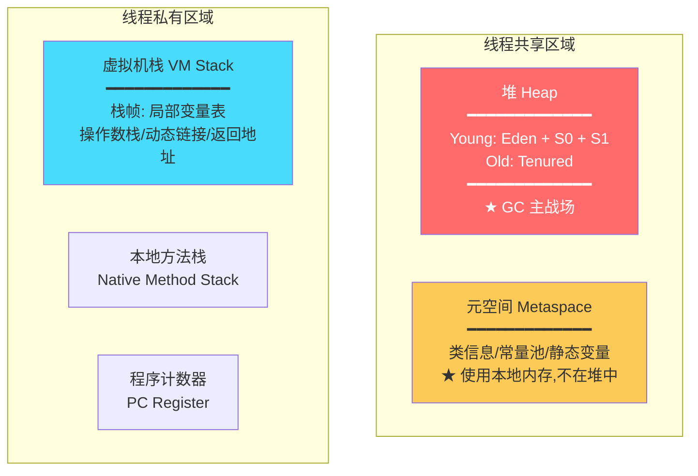
```mermaid
flowchart TB
    subgraph 线程共享["线程共享区域"]
        HEAP["堆 Heap<br/>━━━━━━━━━━━━━<br/>Young: Eden + S0 + S1<br/>Old: Tenured<br/>━━━━━━━━━━━━━<br/>★ GC 主战场"]
        META["元空间 Metaspace<br/>━━━━━━━━━━━━━<br/>类信息/常量池/静态变量<br/>★ 使用本地内存,不在堆中"]
    end

    subgraph 线程私有["线程私有区域"]
        STACK["虚拟机栈 VM Stack<br/>━━━━━━━━━━━━━<br/>栈帧: 局部变量表<br/>操作数栈/动态链接/返回地址"]
        NS["本地方法栈<br/>Native Method Stack"]
        PC["程序计数器<br/>PC Register"]
    end

    style HEAP fill:#ff6b6b,color:#fff
    style META fill:#feca57
    style STACK fill:#48dbfb
```

> 🔴 **图解文字总结**：JVM 内存分为"线程共享"和"线程私有"两大类。共享区放的是所有线程都能访问的数据（对象、类信息），需要 GC 和并发控制；私有区每个线程独立一份，不存在并发竞争，线程结束自动释放。


#### 栈帧内部结构详解

> 🔴 **每个方法调用对应一个栈帧，栈帧内部由四部分组成**：

| 组成部分 | 存放内容 | 关键特性 |
|---------|---------|---------|
| **局部变量表** | 方法参数 + 局部变量（基本类型存值，引用类型存指针） | 容量在**编译期**确定，以 slot 为最小单位（32位），long/double 占 2 slot |
| **操作数栈** | 字节码指令的工作台（如 `iadd` 从栈顶弹出两个 int 相加再压回） | 深度在**编译期**确定，不会超过 max_stack |
| **动态链接** | 当前方法所属类的运行时常量池引用，支持多态 | `invokevirtual` 在运行时通过动态链接确定实际目标方法 |
| **返回地址** | 方法正常返回时恢复调用者的 PC 计数器值 | 异常返回时通过异常表确定跳转地址 |

> 🟠 **为什么操作数栈的深度能在编译期确定？**
> 因为 Java 字节码是**强类型**的，每条指令消耗和产生多少个栈元素是固定的。编译器在生成字节码时可以静态计算出最大深度，写入 class 文件的 `max_stack` 属性。JVM 验证阶段会校验字节码不会越界。

#### 各区域存放数据汇总表

| 内存区域 | 存放的具体内容 | 线程属性 | 是否 GC |
|---------|--------------|---------|--------|
| **Eden** | 新创建的小对象 | 共享 | Minor GC |
| **Survivor (S0/S1)** | 经历过至少一次 Minor GC 的年轻对象 | 共享 | Minor GC |
| **Old (Tenured)** | 长期存活对象、大对象 | 共享 | Major/Full GC |
| **Metaspace** | 类的结构信息（字段/方法描述）、运行时常量池、静态变量、JIT 编译后的代码 | 共享 | 条件苛刻的卸载 |
| **虚拟机栈** | 栈帧（局部变量表、操作数栈、动态链接、返回地址） | 私有 | 方法返回自动释放 |
| **PC 寄存器** | 当前线程执行的字节码指令地址（Native 方法时为空） | 私有 | 不需要 |

#### 历史演化：永久代 → 元空间

| 版本 | 类元数据存储 | 问题 |
|------|-------------|------|
| JDK 6 | 永久代（PermGen，堆内） | 大小固定，容易 OOM: PermGen space |
| JDK 7 | 永久代（字符串常量池移到堆） | 过渡方案 |
| JDK 8+ | 元空间（Metaspace，本地内存） | 不再受堆大小限制，按需扩展 |

> 🟠 **为什么要废弃永久代？**
> 1. **大小难以预估**：永久代需要 `-XX:MaxPermSize` 预设上限，设小了 OOM，设大了浪费
> 2. **GC 复杂**：永久代回收需要 Full GC，条件苛刻（类加载器无引用+无实例+Class 不可达）
> 3. **合并 HotSpot 与 JRockit**：JRockit 没有永久代概念，合并后统一为 Metaspace
> 4. **本地内存更灵活**：Metaspace 使用 mmap 分配，操作系统管理，弹性更好
>
> 🟠 **如果没有这次改造会怎样？** 随着动态代理（Spring AOP、MyBatis）、热部署（Tomcat redeploy）等技术的普及，类加载数量越来越不可预测。永久代的固定上限会成为所有 Java 应用的定时炸弹——每个应用都得精确估算需要多少 PermGen，估错就 OOM。


#### 每个区域的 OOM 场景

| 区域 | OOM 类型 | 触发条件 | 典型场景 |
|------|----------|---------|---------|
| 堆 | `java.lang.OutOfMemoryError: Java heap space` | 对象过多/过大 | 内存泄漏、大集合 |
| 元空间 | `java.lang.OutOfMemoryError: Metaspace` | 类加载过多 | 动态代理、热部署 |
| 虚拟机栈 | `java.lang.StackOverflowError` | 栈帧过深 | 无限递归 |
| 直接内存 | `java.lang.OutOfMemoryError: Direct buffer memory` | NIO 堆外内存耗尽 | Netty 未 release |

> 🟠 **直接内存 OOM 的深层原因**：
> 直接内存（Direct Memory）通过 `ByteBuffer.allocateDirect()` 分配，不在 JVM 堆中而在操作系统本地内存。它由 `java.nio.Bits` 类中的静态变量 `reservedMemory` 追踪总量，超过 `-XX:MaxDirectMemorySize` 时抛 OOM。
>
> **为什么 Netty 容易出这个问题？** Netty 大量使用 PooledByteBufAllocator 管理堆外内存，如果业务代码忘记调用 `ReferenceCountUtil.release(buf)` 或 `buf.release()`，引用计数不归零，内存永远不会归还池——这不是 JVM GC 能管的事，必须手动释放。

---

### 1.2 🔴 堆内存分代模型

#### 设计动机：为什么要分代？

> 🔴 **弱分代假说（Weak Generational Hypothesis）**：
> - 绝大多数对象都是"朝生夕死"的（IBM 研究：98% 的对象在 Minor GC 时就死了）
> - 熬过越多次 GC 的对象越不容易死
>
> **结论**：把堆分成 Young 和 Old，对 Young 用高频快速的复制算法，对 Old 用低频但彻底的标记-整理。
>
> 🔴 **如果不分代会怎样？** 每次 GC 都必须扫描全堆（包括 98% 即将死去的临时对象和 2% 长期存活的对象），无法针对不同存活率选择最优算法。对于短命对象，复制算法最快（只复制 2% 存活的）；对于长命对象，标记-整理最优（存活率高时复制开销太大）。不分代意味着只能用一种"通用但不最优"的算法处理所有对象，GC 效率大幅下降、停顿时间显著增长。

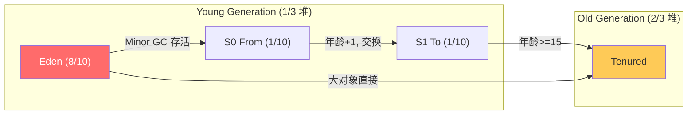
```mermaid
flowchart LR
    subgraph Young["Young Generation (1/3 堆)"]
        E["Eden (8/10)"]
        S0["S0 From (1/10)"]
        S1["S1 To (1/10)"]
    end

    subgraph Old["Old Generation (2/3 堆)"]
        T["Tenured"]
    end

    E -->|Minor GC 存活| S0
    S0 -->|年龄+1, 交换| S1
    S1 -->|年龄>=15| T
    E -->|大对象直接| T

    style E fill:#ff6b6b,color:#fff
    style T fill:#feca57
```

> 🔴 **图解文字总结**：新对象首先分配在 Eden，Minor GC 存活后进入 Survivor（S0/S1 交替使用），每熬过一次 GC 年龄+1，年龄达到阈值（默认15）或 Survivor 放不下时晋升到 Old。大对象跳过 Young 直接进 Old。


#### 各代存放什么对象

| 分代 | 存放对象类型 | 典型示例 |
|------|------------|---------|
| **Eden** | 新 new 出来的对象（绝大多数） | 方法内临时变量、DTO、StringBuilder |
| **Survivor** | 经历 1+ 次 Minor GC 仍存活的"少年"对象 | 请求作用域的缓存、正在使用的 Session |
| **Old** | 长期存活对象（年龄≥阈值）/ 大对象 / Survivor 放不下的对象 | Spring Bean、连接池对象、本地缓存、大数组 |

#### 对象晋升老年代的条件（源码级）

```java
// hotspot/src/share/vm/gc/shared/ageTable.cpp
// 动态年龄判定：如果 Survivor 中某个年龄段以下的对象总大小 > Survivor 空间的 50%
// 则该年龄及以上的对象直接晋升 Old（不需要等到 MaxTenuringThreshold）
uint ageTable::compute_tenuring_threshold(size_t desired_survivor_size) {
    size_t total = 0;
    uint age = 1;
    while (age < table_size) {
        total += sizes[age];  // 累加各年龄段大小
        if (total > desired_survivor_size) break;  // ★ 超过 50% 就停
        age++;
    }
    // 取 age 和 MaxTenuringThreshold 的较小值
    uint result = age < MaxTenuringThreshold ? age : MaxTenuringThreshold;
    return result;
}
```

> 🔴 **四种晋升老年代的条件**：
> 1. **年龄达到阈值**：`-XX:MaxTenuringThreshold=15`（默认 15，CMS 默认 6）
> 2. **动态年龄判定**：Survivor 中同龄及以下对象总大小 > Survivor 的 50%
> 3. **大对象直接进 Old**：`-XX:PretenureSizeThreshold=1m`（仅 Serial/ParNew 有效）
> 4. **Survivor 放不下**：Minor GC 后存活对象超过 Survivor 容量，直接进 Old
>
> 🟠 **动态年龄判定的设计意图**：如果某次 GC 后 Survivor 里挤满了同龄对象（例如一次请求高峰产生大量生命周期相似的对象），等它们全部到达 MaxTenuringThreshold 再晋升就太晚了——Survivor 早就溢出了。动态判定提前把这批对象送走，避免 Survivor 溢出导致更多对象直接晋升（恶性循环）。

#### 🟢 避坑：动态年龄判定导致频繁 Full GC

> 🟢 **线上事故案例**：
> - **场景**：某订单服务，堆 4G，Young 1.3G，Survivor 各 130MB
> - **现象**：每次 Minor GC 后约 80MB 对象存活，年龄从 1 到 3 分布
> - **问题**：年龄 1+2+3 的对象总和 > 65MB（Survivor 的 50%），触发动态晋升
> - **结果**：大量年龄 3 的对象被送进 Old，Old 快速填满，频繁 Full GC（每分钟 2-3 次）
> - **修复**：增大 Survivor 空间 `-XX:SurvivorRatio=4`（Eden:S0:S1 = 4:1:1），或增大堆
> - **教训**：Survivor 太小 + 每次存活量不少 = 动态年龄判定频繁触发 = Old 快速填满

> 🔴 **核心参数**：
> ```bash
> -Xms4g -Xmx4g                    # 堆初始/最大值（必须设相同，避免扩容STW）
> -XX:NewRatio=2                    # Old/Young = 2:1
> -XX:SurvivorRatio=8               # Eden/Survivor = 8:1:1
> -XX:MaxTenuringThreshold=15       # 晋升老年代的年龄阈值
> -XX:PretenureSizeThreshold=1m     # 大对象直接进 Old 的阈值
> -XX:TargetSurvivorRatio=50        # 动态年龄判定的 Survivor 使用率阈值
> ```

---


### 1.3 🔴 对象创建全过程（源码级剖析）

#### 完整时序

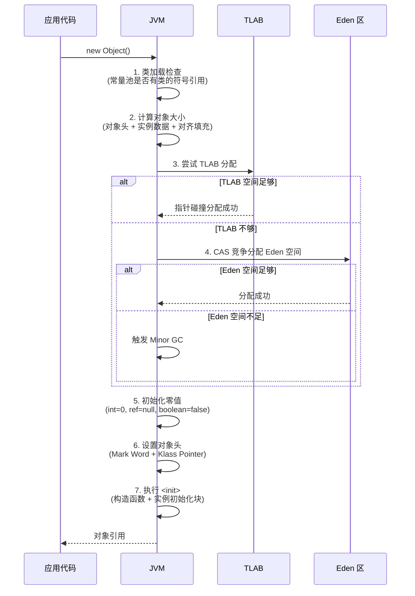
```mermaid
sequenceDiagram
    participant App as 应用代码
    participant JVM as JVM
    participant TLAB as TLAB
    participant Eden as Eden 区

    App->>JVM: new Object()
    JVM->>JVM: 1. 类加载检查<br/>(常量池是否有类的符号引用)
    JVM->>JVM: 2. 计算对象大小<br/>(对象头 + 实例数据 + 对齐填充)
    JVM->>TLAB: 3. 尝试 TLAB 分配
    alt TLAB 空间足够
        TLAB-->>JVM: 指针碰撞分配成功
    else TLAB 不够
        JVM->>Eden: 4. CAS 竞争分配 Eden 空间
        alt Eden 空间足够
            Eden-->>JVM: 分配成功
        else Eden 空间不足
            JVM->>JVM: 触发 Minor GC
        end
    end
    JVM->>JVM: 5. 初始化零值<br/>(int=0, ref=null, boolean=false)
    JVM->>JVM: 6. 设置对象头<br/>(Mark Word + Klass Pointer)
    JVM->>JVM: 7. 执行 <init><br/>(构造函数 + 实例初始化块)
    JVM-->>App: 对象引用
```

> 🔴 **对象创建六步口诀："检-算-分-零-头-构"**
> 1. **检**：类加载检查（常量池是否有类的符号引用，是否已加载）
> 2. **算**：计算对象大小（对象头 + 实例数据 + 对齐填充）
> 3. **分**：分配内存（TLAB 优先 → CAS 竞争 Eden → 触发 GC）
> 4. **零**：初始化零值（int=0, ref=null, boolean=false）
> 5. **头**：设置对象头（Mark Word + Klass Pointer）
> 6. **构**：执行 `<init>`（构造函数 + 实例初始化块）
>
> 🟠 **为什么零值初始化在构造函数之前？** 这保证了即使构造函数中没有显式赋值，字段也有确定的默认值（不是内存中的随机垃圾数据）。这是 Java 类型安全的基础——你不可能读到一个"未定义"的值。C/C++ 没有这个保证，所以存在未初始化变量的 bug。

#### TLAB 深入（HotSpot 源码）

```cpp
// hotspot/src/share/vm/memory/threadLocalAllocBuffer.inline.hpp
HeapWord* ThreadLocalAllocBuffer::allocate(size_t size) {
    HeapWord* obj = top();           // 当前 TLAB 的分配指针
    if (pointer_delta(end(), obj) >= size) {
        // ★ TLAB 内空间充足：指针碰撞，无锁分配！
        set_top(obj + size);         // 移动指针
        return obj;
    }
    return NULL;  // TLAB 空间不足，需要走慢路径
}
```

> 🟠 **TLAB 的设计精妙之处**：
> - **为什么要 TLAB？** 多线程同时在 Eden 分配，如果用 CAS 竞争同一个指针，高并发下 CAS 失败率极高（自旋浪费 CPU）。TLAB 把竞争从"所有线程抢一个指针"降维为"每个线程在自己的小区域内无锁分配"。
> - **核心思路**：每个线程预分配一小块 Eden 空间（默认 Eden 的 1%），线程内分配无锁
> - **空间不足时**：申请新的 TLAB（需 CAS），或直接在 Eden 用 CAS 分配（大对象）
> - **浪费问题**：每个 TLAB 尾部可能有碎片（refill_waste），JVM 会统计并动态调整 TLAB 大小
> - **如果没有 TLAB 会怎样？** 所有线程的 `new` 操作都在同一个 Eden 指针上 CAS 竞争。以 200 个并发线程为例，每次 CAS 失败的概率接近 100%，大量自旋导致 CPU 空转，对象分配速率骤降 10 倍以上。
>
> **相关参数**：
> ```bash
> -XX:+UseTLAB                  # 开启 TLAB（默认开启）
> -XX:TLABSize=512k             # TLAB 初始大小
> -XX:TLABRefillWasteFraction=64  # 允许浪费比例 = TLAB/64
> ```

#### 指针碰撞 vs 空闲列表

| 分配方式 | 条件 | 原理 | 对应收集器 |
|---------|------|------|-----------|
| **指针碰撞** | 内存规整（无碎片） | 移动分界指针 | Serial、ParNew、G1 |
| **空闲列表** | 内存不规整（有碎片） | 维护可用块链表 | CMS（标记-清除有碎片） |

> 🟠 **为什么分配方式取决于收集器？** 收集器决定了堆内存是否规整。如果用复制算法/标记-整理算法（Serial/ParNew/G1），回收后内存是连续的（已用|未用），用指针碰撞即可；如果用标记-清除算法（CMS），回收后内存是碎片化的（已用|空闲|已用|空闲），只能维护空闲列表。

---


### 1.4 🔴 对象头结构（64位 JVM 深入）

#### Mark Word 在不同状态下的位布局

```
64 bits Mark Word 布局：

无锁状态 (Normal):
┌──────────────────────────────────────────────────────────────┐
│ unused:25 │ hashCode:31 │ unused:1 │ age:4 │ biased:0 │ 01  │
└──────────────────────────────────────────────────────────────┘

偏向锁 (Biased):
┌──────────────────────────────────────────────────────────────┐
│ thread:54          │ epoch:2 │ unused:1 │ age:4 │ biased:1 │ 01  │
└──────────────────────────────────────────────────────────────┘

轻量级锁 (Lightweight Locked):
┌──────────────────────────────────────────────────────────────┐
│ ptr_to_lock_record:62                                    │ 00  │
└──────────────────────────────────────────────────────────────┘

重量级锁 (Heavyweight Locked):
┌──────────────────────────────────────────────────────────────┐
│ ptr_to_heavyweight_monitor:62                            │ 10  │
└──────────────────────────────────────────────────────────────┘

GC 标记 (Marked for GC):
┌──────────────────────────────────────────────────────────────┐
│ (empty)                                                  │ 11  │
└──────────────────────────────────────────────────────────────┘
```

> 🟠 **面试追问：为什么调用了 hashCode() 后偏向锁会被撤销？**
>
> 观察上面的位布局：偏向锁状态下 Mark Word 存的是 `thread:54 + epoch:2`，没有位置存 hashCode。
> 而一旦调用了 `Object.hashCode()`（identity hash code），必须在 Mark Word 中保存 31 位 hashCode。
> 两者布局冲突 → 只能撤销偏向锁，回到无锁/轻量级锁状态。
>
> 这也是为什么在同步代码块内不要调用 `hashCode()` 的原因之一——会导致锁膨胀。
>
> 🟠 **Mark Word 设计的精妙之处**：64 位空间被**复用**于不同状态——同一块内存，无锁时存 hashCode+年龄，偏向锁时存线程ID，轻量级锁时存栈中 Lock Record 指针，重量级锁时存 Monitor 指针。最后 2-3 位作为标志位区分当前状态。这种"联合体"式设计最大化了对象头的信息密度，避免了为每种锁状态额外分配内存。

#### 对象内存布局实例

```java
// 以下对象在 64 位 JVM（开启压缩指针）中的内存布局
public class User {
    int id;          // 4 bytes
    long timestamp;  // 8 bytes
    String name;     // 4 bytes (压缩指针)
    byte status;     // 1 byte
}

// 内存布局：
// [对象头 Mark Word]    8 bytes
// [Klass Pointer]      4 bytes (压缩指针)
// [id: int]            4 bytes
// [timestamp: long]    8 bytes
// [name: String ref]   4 bytes
// [status: byte]       1 byte
// [padding]            3 bytes (对齐到 8 的倍数)
// ──────────────────────────────
// Total:               32 bytes

// 使用 JOL 工具验证：
// java -jar jol-cli.jar internals com.example.User
```

> 🟡 **加分点：对齐填充的原因**。CPU 访问内存时以 **cache line**（通常 64 字节）为单位。如果一个对象的字段跨越两个 cache line，一次字段访问需要两次内存读取。8 字节对齐确保基本类型不会跨 cache line 边界，同时也让 GC 在遍历对象时用简单的指针算术就能找到下一个对象（`nextObj = thisObj + size`，size 必定是 8 的倍数）。

### 1.5 🟢 避坑提醒（线上事故案例）

> 🟢 **事故案例 1：堆扩容导致长时间 STW**
> - **场景**：某交易服务，`-Xms512m -Xmx4g`（初始 512MB，最大 4GB）
> - **现象**：每天凌晨批处理时 GC 停顿突然变长（从 50ms 到 3s）
> - **根因**：批处理创建大量对象，堆从 512MB 扩容到 2GB，扩容期间需要 STW 来调整内部数据结构（更新 Card Table、RSet 等 GC 元数据的映射关系）
> - **修复**：`-Xms4g -Xmx4g` 设为相同值，启动时一次性分配，避免运行时扩容
> - **教训**：**生产环境 Xms 必须等于 Xmx**

> 🟢 **事故案例 2：Metaspace 泄漏导致服务重启**
> - **场景**：某 Spring Boot 应用使用了大量动态代理（CGLIB）
> - **现象**：运行 3-5 天后出现 `OutOfMemoryError: Metaspace`
> - **根因**：每次热部署/动态代理都创建新 ClassLoader，旧 ClassLoader 不回收（被缓存引用）
> - **修复**：
>   1. 设置 `-XX:MaxMetaspaceSize=256m` 兜底
>   2. 排查代码中对 ClassLoader 的强引用
>   3. 添加 `-XX:+TraceClassLoading -XX:+TraceClassUnloading` 观察类加载/卸载
> - **教训**：Metaspace 不设上限 = 定时炸弹

> 🟢 **事故案例 3：压缩指针意外关闭导致内存暴增**
> - **场景**：某服务升级堆大小从 30GB 到 33GB
> - **现象**：升级后 RSS 从 35GB 暴增到 50GB+，OOM Kill
> - **根因**：堆 > 32GB 时压缩指针（CompressedOops）自动关闭，所有引用从 4 字节变 8 字节
> - **为什么是 32GB？** 压缩指针用 32 位表示对象地址，加上 8 字节对齐的 3 位右移，寻址范围 = 2^32 × 8 = 32GB。超过这个范围，32 位指针装不下了。
> - **修复**：堆大小改回 31GB（或直接跳到 48GB 以上才有意义）
> - **教训**：**堆大小在 32GB 附近是性能悬崖**，要么 <32GB 用压缩指针，要么 >>32GB

---


## 2. 垃圾回收算法与收集器

### 2.1 🔴 判断对象是否存活

#### 设计动机：为什么用可达性分析而不是引用计数？

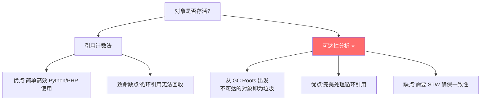
```mermaid
flowchart TD
    A[对象是否存活?] --> B[引用计数法]
    A --> C[可达性分析 ⭐]

    B --> B1[优点:简单高效,Python/PHP 使用]
    B --> B2[致命缺点:循环引用无法回收]

    C --> C1[从 GC Roots 出发<br/>不可达的对象即为垃圾]
    C --> C2[优点:完美处理循环引用]
    C --> C3[缺点:需要 STW 确保一致性]

    style C fill:#ff6b6b,color:#fff
```

> 🔴 **引用计数的工作原理与致命缺陷**：
>
> 引用计数的核心思路：每个对象维护一个计数器，有新引用指向它时 +1，引用失效时 -1，计数归零即回收。优点是**即时回收**（归零立刻释放），缺点是**循环引用永远无法归零**。
>
> ```java
> // 循环引用示例——引用计数法无法回收
> public class CircularRef {
>     Object ref;
>     public static void main(String[] args) {
>         CircularRef a = new CircularRef();
>         CircularRef b = new CircularRef();
>         a.ref = b;  // a 引用 b，b 计数 = 1
>         b.ref = a;  // b 引用 a，a 计数 = 1
>         a = null;   // a 计数 = 1（b.ref 还指着）
>         b = null;   // b 计数 = 1（a.ref 还指着）
>         // 引用计数法认为 ab 都不是垃圾（计数≠0）
>         // 但实际上已经无法从任何 GC Root 到达它们
>         System.gc(); // JVM 的可达性分析能正确回收
>     }
> }
> ```
>
> 🟠 **Python 怎么解决循环引用？** Python 主用引用计数（即时回收大部分对象），辅以**分代循环检测器**定期扫描找循环引用。代价是多了一层 GC 开销。Java 直接用可达性分析，一步到位。

> 🔴 **GC Roots 完整清单**（可达性分析的起点）：
> 1. **虚拟机栈**中引用的对象（局部变量、方法参数）
> 2. **方法区**中类静态属性引用的对象（static 字段）
> 3. **方法区**中常量引用的对象（static final 字段）
> 4. **本地方法栈**中 JNI（Native）引用的对象
> 5. JVM 内部引用（基本类型的 Class 对象、系统 ClassLoader、常驻异常对象等）
> 6. **所有被 synchronized 持有的对象**
> 7. JMXBean、JVMTI 注册的回调、本地代码缓存等
>
> 🟠 **为什么这些是 GC Roots？** 它们的共同特征是：**由 JVM 自身或正在执行的代码直接持有，生命周期不由 GC 管理**。从这些"确定存活"的节点出发遍历引用图，能到达的对象一定还被"有意义地使用着"。

#### 三色标记法（并发 GC 的基础）

> 🟠 **为什么并发 GC 需要三色标记？**
>
> 在 STW 的 GC 中，标记是独占完成的，不需要考虑对象引用关系变化。
> 但在 CMS/G1/ZGC 等**并发标记**的收集器中，GC 线程和应用线程同时运行，引用关系在标记过程中会变化。
> 三色标记法用于追踪标记进度：


```mermaid
flowchart LR
    W["白色<br/>未被扫描<br/>(可能是垃圾)"] --> G["灰色<br/>自身已标记<br/>但引用的对象<br/>还没全标完"]
    G --> B["黑色<br/>自身+引用的对象<br/>都已标完<br/>(确定存活)"]

    style W fill:#ffffff,stroke:#333
    style G fill:#cccccc,stroke:#333
    style B fill:#333333,color:#fff
```

> 🔴 **三色标记文字总结**：
> - **白色**：还没被 GC 线程访问到。标记结束后仍为白色的对象 = 垃圾。
> - **灰色**：GC 线程已经知道这个对象活着，但还没扫完它的所有引用字段。灰色对象是"标记波前"——GC 还需要继续从它出发往下扫。
> - **黑色**：已经完全处理完毕。GC 不会再重新扫描黑色对象。
>
> 🟠 **并发标记的漏标问题**（对象消失问题）：
>
> 如果同时满足以下两个条件，会出现**存活对象被误判为垃圾**（灾难！）：
> 1. 赋值器（应用线程）插入了一条从**黑色**对象到**白色**对象的引用
> 2. 赋值器删除了所有从**灰色**对象到该**白色**对象的引用
>
> **为什么两个条件同时满足才出问题？** 条件 1 让白色对象只能从黑色对象到达，但黑色不会被重新扫描；条件 2 让灰色对象到白色的路径断了，灰色继续扫也找不到它。结果：白色对象实际存活但 GC 认为它死了。
>
> **解决方案（打破任一条件即可）**：
> - **增量更新（Incremental Update）**：CMS 使用。打破条件 1——记录黑色对象新增的引用，重新标记阶段重新扫描这些黑色对象（让它们"变回灰色"）
> - **原始快照（SATB, Snapshot At The Beginning）**：G1 使用。打破条件 2——记录灰色对象删除的引用，保守地认为这些白色对象是存活的（即使引用断了也不回收）
>
> 🟠 **什么场景选什么方案？** 增量更新精度更高（少一些浮动垃圾），但重新标记阶段工作量大；SATB 重新标记快（只处理快照差异），但可能多保留一些本该回收的对象。G1 选择 SATB 正是因为它追求**可预测的短停顿**——重新标记阶段必须快。

---


### 2.2 🔴 四大垃圾回收算法

#### 完整 trade-off 分析

| 算法 | 适用代 | 时间复杂度 | 空间开销 | 碎片 | STW 时间 | 代表收集器 |
|------|--------|-----------|---------|------|---------|-----------|
| **标记-清除** | Old | O(存活+垃圾) | 无额外 | 有碎片 | 长（全堆扫描） | CMS |
| **标记-整理** | Old | O(存活) | 无额外 | 无碎片 | 最长（移动对象） | Serial Old, Parallel Old |
| **复制** | Young | O(存活) | 需要 To 空间 | 无碎片 | 短（只复制存活） | Serial, ParNew, PS |
| **分代收集** | 全堆 | 综合 | 综合 | 综合 | 综合最优 | G1, ZGC |

> 🔴 **每种算法的工作原理详解**：
>
> **标记-清除（Mark-Sweep）**：
> 1. 标记阶段：从 GC Roots 遍历，标记所有可达对象
> 2. 清除阶段：遍历整个堆，回收未标记的对象
> - 问题：回收后内存像"瑞士奶酪"——到处是不连续的小空洞（碎片）
> - 后果：大对象无法分配（总空闲够但找不到连续空间）→ 被迫触发 Full GC 整理
>
> **标记-整理（Mark-Compact）**：
> 1. 标记阶段：同上
> 2. 整理阶段：所有存活对象向一端滑动，清理边界以外的空间
> - 优点：无碎片
> - 代价：移动对象需要更新所有指向它的引用（STW 内完成，耗时最长）
> - 为什么 Old 区适合：Old 区存活率高（70-90%），复制算法浪费空间太多，但可以容忍较长的停顿（Full GC 频率低）
>
> **复制（Copying）**：
> 1. 把内存分为 From 和 To 两块（Eden:S0:S1 = 8:1:1 是优化后的比例）
> 2. 只从 From 中复制存活对象到 To，然后清空整个 From
> - 优点：只处理存活对象（Young 区存活率 <5%），速度极快且无碎片
> - 代价：需要额外 To 空间（但 Survivor 只占 Young 的 10%，可接受）
> - 为什么 Young 区适合：存活率极低时，复制的对象很少，几乎等于"清空 Eden"
>
> **分代收集**：不是一种新算法，而是组合策略——Young 用复制，Old 用标记-整理/标记-清除。

> 🔴 **记忆口诀：清整复分**
> - **清**（标记-清除）：简单但碎，CMS 的无奈之选（因为要并发，移动对象太复杂）
> - **整**（标记-整理）：无碎但慢，老年代兜底方案
> - **复**（复制）：快且无碎，但费空间，年轻代首选（存活率低所以复制量极小）
> - **分**（分代收集）：扬长避短，现代 GC 的基础思想

#### 标记-清除的碎片灾难

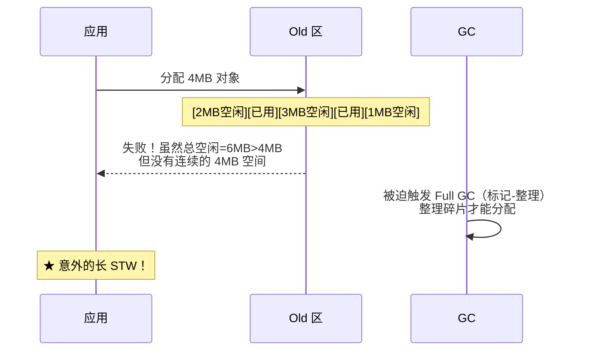
```mermaid
sequenceDiagram
    participant App as 应用
    participant Heap as Old 区
    participant GC as GC

    App->>Heap: 分配 4MB 对象
    Note over Heap: [2MB空闲][已用][3MB空闲][已用][1MB空闲]
    Heap-->>App: 失败！虽然总空闲=6MB>4MB<br/>但没有连续的 4MB 空间
    GC->>GC: 被迫触发 Full GC（标记-整理）<br/>整理碎片才能分配
    Note over App: ★ 意外的长 STW！
```

> 🟢 **线上事故**：CMS 碎片导致突发 Full GC
> - **场景**：某电商服务使用 CMS 收集器，Old 区 2GB
> - **现象**：服务运行 2-3 天后突然出现 8s+ 的 STW
> - **根因**：CMS 用标记-清除算法，并发清除不整理，Old 区碎片化严重。大对象（如序列化的报表数据）分配时找不到连续空间，触发 Serial Old 单线程 Full GC（标记-整理）
> - **日志特征**：`[GC (Allocation Failure)] [ParNew: ... -> ...][CMS: concurrent mode failure]`
> - **为什么 CMS 不用标记-整理？** 因为整理需要移动对象，移动对象必须更新所有引用——在并发环境下做这件事极其复杂（应用线程可能正在读那个对象的旧地址）。CMS 为了实现并发清除只能放弃整理。G1/ZGC 用 Region 间复制或读屏障解决了这个问题。
> - **修复**：
>   1. 迁移到 G1（Region 间复制，天然无碎片）
>   2. 临时方案：`-XX:CMSFullGCsBeforeCompaction=2`（每 2 次 Full GC 后整理一次）

---


### 2.3 🔴 垃圾收集器全家福

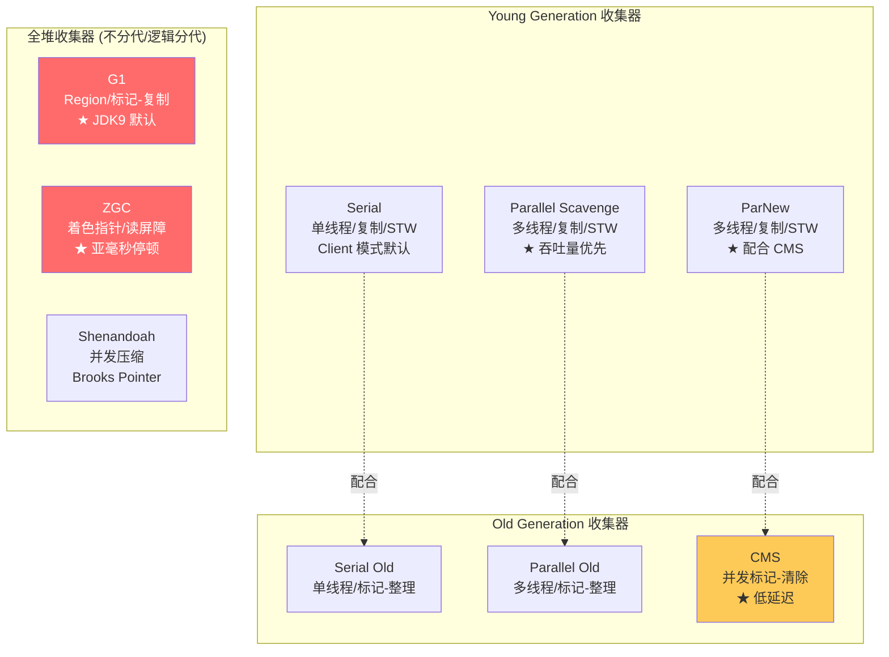
```mermaid
flowchart TB
    subgraph Young["Young Generation 收集器"]
        S[Serial<br/>单线程/复制/STW<br/>Client 模式默认]
        PN[ParNew<br/>多线程/复制/STW<br/>★ 配合 CMS]
        PS[Parallel Scavenge<br/>多线程/复制/STW<br/>★ 吞吐量优先]
    end

    subgraph Old["Old Generation 收集器"]
        SO[Serial Old<br/>单线程/标记-整理]
        PO[Parallel Old<br/>多线程/标记-整理]
        CMS[CMS<br/>并发标记-清除<br/>★ 低延迟]
    end

    subgraph 全堆["全堆收集器 (不分代/逻辑分代)"]
        G1[G1<br/>Region/标记-复制<br/>★ JDK9 默认]
        ZGC[ZGC<br/>着色指针/读屏障<br/>★ 亚毫秒停顿]
        SH[Shenandoah<br/>并发压缩<br/>Brooks Pointer]
    end

    S -.配合.-> SO
    PN -.配合.-> CMS
    PS -.配合.-> PO

    style G1 fill:#ff6b6b,color:#fff
    style ZGC fill:#ff6b6b,color:#fff
    style CMS fill:#feca57
```

> 🔴 **图解文字总结**：收集器分为三代——传统分代收集器（Young 和 Old 分别选一个配合使用）、G1（逻辑分代但物理上用 Region）、ZGC/Shenandoah（完全并发，几乎不 STW）。选择的核心 trade-off 是**吞吐量 vs 延迟**：Parallel 系列追求吞吐量（容忍长 STW），CMS/G1 追求低延迟，ZGC 追求极致低延迟。

#### 收集器演化时间线

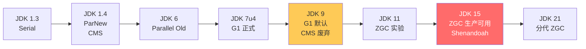
```mermaid
flowchart LR
    JDK1["JDK 1.3<br/>Serial"] --> JDK4["JDK 1.4<br/>ParNew<br/>CMS"]
    JDK4 --> JDK6["JDK 6<br/>Parallel Old"]
    JDK6 --> JDK7["JDK 7u4<br/>G1 正式"]
    JDK7 --> JDK9["JDK 9<br/>G1 默认<br/>CMS 废弃"]
    JDK9 --> JDK11["JDK 11<br/>ZGC 实验"]
    JDK11 --> JDK15["JDK 15<br/>ZGC 生产可用<br/>Shenandoah"]
    JDK15 --> JDK21["JDK 21<br/>分代 ZGC"]

    style JDK9 fill:#feca57
    style JDK15 fill:#ff6b6b,color:#fff
```

---

### 2.4 🔴 CMS 收集器深入（Concurrent Mark Sweep）

#### 设计动机

> 🔴 **CMS 解决什么问题？**
> 在 CMS 之前，Old 区只有 Serial Old 和 Parallel Old，都是完全 STW 的。
> 对于堆 4GB+ 的应用，Full GC 可能需要 5-10 秒，这对在线服务是不可接受的。
> CMS 的目标：**让 GC 的大部分工作与应用线程并发执行**，只在少量阶段短暂 STW。
>
> **核心创新**：把传统的"标记-清除"拆分为 4 个阶段，其中 2 个最耗时的阶段（并发标记+并发清除）与应用线程同时运行。
>
> **如果没有 CMS 会怎样？** 所有在线服务要么忍受秒级 STW（Parallel Old），要么把堆设得很小以缩短 GC 时间（但又导致频繁 GC）。CMS 是 Java 从"批处理语言"走向"在线服务语言"的关键一步。

#### 四阶段详细时序

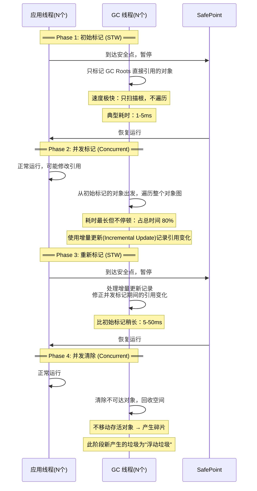
```mermaid
sequenceDiagram
    participant App as 应用线程(N个)
    participant GC as GC 线程(N个)
    participant OS as SafePoint

    Note over App,GC: ═══ Phase 1: 初始标记 (STW) ═══
    App->>OS: 到达安全点，暂停
    GC->>GC: 只标记 GC Roots 直接引用的对象
    Note over GC: 速度极快：只扫描根，不遍历
    Note over GC: 典型耗时：1-5ms
    OS->>App: 恢复运行

    Note over App,GC: ═══ Phase 2: 并发标记 (Concurrent) ═══
    App->>App: 正常运行，可能修改引用
    GC->>GC: 从初始标记的对象出发，遍历整个对象图
    Note over GC: 耗时最长但不停顿：占总时间 80%
    Note over GC: 使用增量更新(Incremental Update)记录引用变化

    Note over App,GC: ═══ Phase 3: 重新标记 (STW) ═══
    App->>OS: 到达安全点，暂停
    GC->>GC: 处理增量更新记录<br/>修正并发标记期间的引用变化
    Note over GC: 比初始标记稍长：5-50ms
    OS->>App: 恢复运行

    Note over App,GC: ═══ Phase 4: 并发清除 (Concurrent) ═══
    App->>App: 正常运行
    GC->>GC: 清除不可达对象，回收空间
    Note over GC: 不移动存活对象 → 产生碎片
    Note over GC: 此阶段新产生的垃圾为"浮动垃圾"
```

> 🔴 **四阶段文字总结（快速记忆）**：
> 1. **初始标记**（STW，极快）：只找 GC Roots 的直接孩子，1-5ms
> 2. **并发标记**（并发，最慢）：从孩子出发遍历整个对象图，占 80% 时间但不停顿
> 3. **重新标记**（STW，较快）：修正并发标记期间应用线程修改的引用关系，5-50ms
> 4. **并发清除**（并发）：删除垃圾对象，不停顿但不整理（产生碎片）
>
> 🟠 **为什么需要重新标记？** 并发标记阶段，应用线程在修改引用关系。比如：GC 已经把对象 A 标黑（认为处理完毕），但应用线程随后让 A 引用了新对象 B（白色）。如果不重新标记，B 会被误认为垃圾而被清除——这就是前面说的"漏标"问题。重新标记阶段扫描增量更新记录，把这些"黑色对象新增的白色引用"重新标记为存活。


#### CMS 的五大缺陷及应对

| # | 缺陷 | 原因 | 应对方案 |
|---|------|------|---------|
| 1 | **内存碎片** | 标记-清除不整理 | `-XX:CMSFullGCsBeforeCompaction=N` |
| 2 | **浮动垃圾** | 并发清除阶段新产生的垃圾本轮无法回收 | 提高触发阈值，预留空间 |
| 3 | **CPU 资源抢占** | 并发阶段 GC 线程与应用线程竞争 CPU | GC 线程数 = (CPU核数+3)/4 |
| 4 | **Concurrent Mode Failure** | 并发收集时 Old 空间不足（收集速度赶不上分配速度） | 降低 `-XX:CMSInitiatingOccupancyFraction`（默认 92%→建议 70%） |
| 5 | **Promotion Failure** | Young GC 后晋升到 Old 但 Old 碎片太多放不下连续空间 | 增大 Old 或迁移 G1 |

> 🟠 **浮动垃圾是什么？为什么不能当轮回收？**
> 并发清除阶段，应用线程还在运行，会产生新的"垃圾"对象。但这些对象是在标记阶段完成之后才变成垃圾的，GC 已经认为它们是"活的"（标记为黑色），所以本轮不会清除。它们只能等下一次 GC 清除。这些对象就叫"浮动垃圾"。
>
> **浮动垃圾要求 CMS 必须预留空间**：如果 Old 区 100% 满了才触发 CMS，并发阶段应用线程还要往 Old 区放对象（晋升+浮动垃圾），放不下就 Concurrent Mode Failure。所以 CMS 默认 92% 就触发（甚至建议 70%）。

> 🟢 **Concurrent Mode Failure 事故案例**：
> - **场景**：某广告系统，堆 8GB，Old 约 5.3GB，CMS 触发阈值 92%
> - **现象**：高峰期突然出现 15s+ STW，Grafana 报警
> - **根因**：CMS 并发收集速度赶不上 Old 区增长速度。Old 使用率还没降下来，新对象又晋升进来，触发 Concurrent Mode Failure → 退化为 Serial Old 单线程 Full GC
> - **日志**：`[GC (CMS Initial Mark)] ... [CMS-concurrent-mark: 2.5s] ... [Full GC (Allocation Failure)] 15234ms`
> - **修复**：
>   1. 降低触发阈值：`-XX:CMSInitiatingOccupancyFraction=70`（提前触发 CMS，留更多空间给并发阶段）
>   2. 增大 Old 区：堆从 8GB 增到 12GB
>   3. 最终方案：迁移到 G1，彻底解决碎片问题

#### CMS 关键参数一览

```bash
-XX:+UseConcMarkSweepGC                    # 启用 CMS
-XX:CMSInitiatingOccupancyFraction=70      # Old 使用率达 70% 就触发 CMS
-XX:+UseCMSInitiatingOccupancyOnly         # 只用固定阈值，不自适应
-XX:+CMSParallelRemarkEnabled              # 重新标记阶段并行
-XX:+CMSScavengeBeforeRemark               # 重新标记前先做一次 Young GC（减少跨代引用扫描）
-XX:CMSFullGCsBeforeCompaction=2           # 每 2 次 Full GC 后做一次压缩整理
-XX:+UseCMSCompactAtFullCollection         # Full GC 时做压缩（JDK 9 后默认）
-XX:ConcGCThreads=4                        # 并发 GC 线程数
```

> 🟠 **CMSScavengeBeforeRemark 的原理**：重新标记需要扫描所有 GC Roots，其中包括 Young 区对 Old 区的引用（跨代引用）。如果 Young 区有大量对象，扫描量大 → 重新标记慢。先做一次 Young GC 清空大部分 Young 区对象，然后再重新标记，扫描量显著减少。

---

### 2.5 🟠 收集器选型决策树

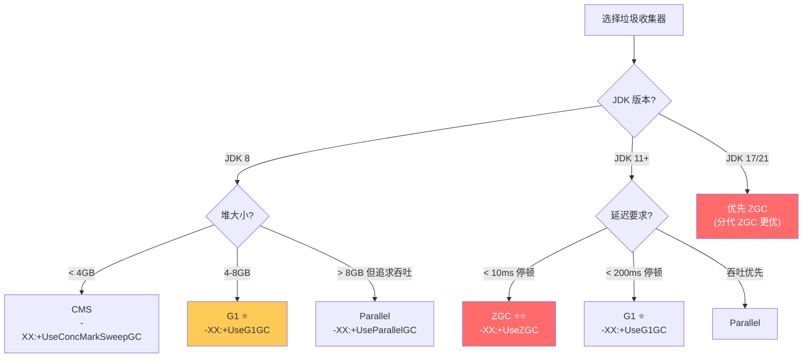
```mermaid
flowchart TD
    START["选择垃圾收集器"] --> Q1{"JDK 版本?"}
    Q1 -->|JDK 8| Q2{"堆大小?"}
    Q1 -->|JDK 11+| Q3{"延迟要求?"}
    Q1 -->|JDK 17/21| Q4["优先 ZGC<br/>(分代 ZGC 更优)"]

    Q2 -->|"< 4GB"| A1["CMS<br/>-XX:+UseConcMarkSweepGC"]
    Q2 -->|"4-8GB"| A2["G1 ⭐<br/>-XX:+UseG1GC"]
    Q2 -->|"> 8GB 但追求吞吐"| A3["Parallel<br/>-XX:+UseParallelGC"]

    Q3 -->|"< 10ms 停顿"| A4["ZGC ⭐⭐<br/>-XX:+UseZGC"]
    Q3 -->|"< 200ms 停顿"| A5["G1 ⭐<br/>-XX:+UseG1GC"]
    Q3 -->|"吞吐优先"| A6["Parallel"]

    style Q4 fill:#ff6b6b,color:#fff
    style A4 fill:#ff6b6b,color:#fff
    style A2 fill:#feca57
```

| 场景 | 推荐收集器 | 理由 | 典型 STW |
|------|-----------|------|---------|
| Web 应用（JDK 8，堆 4G） | G1 | 平衡延迟和吞吐 | 50-200ms |
| 微服务（JDK 17+，堆 2-8G） | ZGC | 亚毫秒停顿 | < 1ms |
| 大数据批处理（堆 16G+） | Parallel | 吞吐量最高 | 1-10s 但无所谓 |
| 金融交易（JDK 11+） | ZGC / Shenandoah | 极低延迟 | < 1ms |
| 客户端/嵌入式 | Serial | 最小 footprint | 可接受 |
| 遗留系统（JDK 8，堆 < 2G） | CMS | 成熟稳定 | 10-100ms |

> 🔴 **选型核心原则**：先确定约束条件（JDK 版本 → 可用收集器范围），再根据业务需求（延迟敏感 or 吞吐优先）选择。大多数现代 Java 服务用 G1 或 ZGC 是最佳选择。

---


## 3. G1 / ZGC 深入

### 3.1 🔴 G1 收集器核心原理

#### 设计动机：G1 解决了什么？

> 🔴 **G1 的设计目标**：
> 1. **可预测的停顿**：用户可以指定"在 M 毫秒内 GC 时间不超过 N 毫秒"（`-XX:MaxGCPauseMillis`）
> 2. **无碎片**：Region 间用复制算法，不像 CMS 那样产生碎片
> 3. **大堆支持**：不需要分代大小的精确调优
>
> **核心创新**：把堆划分为大量等大的 Region，每次只选择回收价值最高的 Region（Garbage First = 优先回收垃圾最多的区域）。
>
> **G1 为什么能做到"可预测停顿"？** 因为每个 Region 的回收耗时可以被预测（扫描 RSet 时间 + 复制存活对象时间），G1 用贪心算法选择"在目标时间内能回收最多垃圾"的 Region 集合。不像 CMS/Parallel 那样"要么不 GC，要么就 GC 整个 Old 区"。

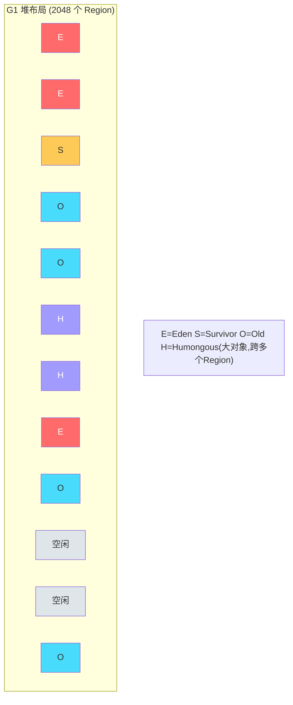
```mermaid
flowchart TB
    subgraph G1堆布局["G1 堆布局 (2048 个 Region)"]
        direction LR
        R1["E"] 
        R2["E"]
        R3["S"]
        R4["O"]
        R5["O"]
        R6["H"]
        R7["H"]
        R8["E"]
        R9["O"]
        R10["空闲"]
        R11["空闲"]
        R12["O"]
    end

    Note["E=Eden S=Survivor O=Old H=Humongous(大对象,跨多个Region)"]

    style R1 fill:#ff6b6b,color:#fff
    style R2 fill:#ff6b6b,color:#fff
    style R8 fill:#ff6b6b,color:#fff
    style R3 fill:#feca57
    style R4 fill:#48dbfb
    style R5 fill:#48dbfb
    style R9 fill:#48dbfb
    style R12 fill:#48dbfb
    style R6 fill:#a29bfe,color:#fff
    style R7 fill:#a29bfe,color:#fff
    style R10 fill:#dfe6e9
    style R11 fill:#dfe6e9
```

> 🔴 **G1 核心概念**：
> - **Region**：堆被划分为 ~2048 个大小相等的 Region（1MB~32MB，必须是 2 的幂）
> - **逻辑分代**：Region 不是固定属于某一代，而是动态切换角色（E→S→O→空闲）。一个 Region 本轮是 Eden，回收后变空闲，下一轮可能变成 Old。
> - **Humongous**：超过 Region 50% 的对象被视为大对象，分配到 H Region（连续多个）
> - **CSet（Collection Set）**：每次 GC 选择回收的 Region 集合——这是 G1 可控停顿的关键
> - **RSet（Remembered Set）**：记录跨 Region 引用，避免全堆扫描

#### G1 的停顿预测模型

```java
// G1 使用衰减平均值（Decaying Average）预测每个 Region 的回收耗时
// hotspot/src/share/vm/gc/g1/g1Policy.cpp (简化)

// 预测回收一个 Region 的时间 = 扫描 RSet 时间 + 复制存活对象时间
double predict_region_elapsed_time(HeapRegion* hr) {
    double rset_scan_time = predict_rs_scan_time(hr->rem_set()->occupied());
    double copy_time = predict_object_copy_time(hr->live_bytes());
    return rset_scan_time + copy_time;
}

// 选择 CSet：贪心算法，按"垃圾率/回收耗时"排序，选到累计耗时接近 MaxGCPauseMillis
void select_cset() {
    sort_regions_by_gc_efficiency();  // 按回收效率降序排列
    double accumulated_time = 0;
    for (HeapRegion* hr : old_regions) {
        double predicted_time = predict_region_elapsed_time(hr);
        if (accumulated_time + predicted_time > MaxGCPauseMillis) break;
        add_to_cset(hr);
        accumulated_time += predicted_time;
    }
}
```

> 🟠 **衰减平均值（Decaying Average）是什么？**
> 不是简单的历史平均，而是最近的数据权重更高的加权平均：`avg_new = α × actual + (1-α) × avg_old`。这样预测模型能快速适应负载变化（比如突发流量导致存活对象增多）。
>
> 🟠 **为什么 MaxGCPauseMillis 不能设太小？**
> - 设太小（如 10ms）→ 每次只能回收很少的 Region → 垃圾回收速度赶不上分配速度
> - 最终导致 Mixed GC 无法回收足够空间 → 触发 Full GC（JDK 10 前单线程，灾难性停顿）
> - **建议值**：200ms（默认）对大多数应用足够；极端低延迟场景设 50-100ms
> - **经验法则**：MaxGCPauseMillis 的下限 ≈ 单次 Young GC 的最小耗时（通常 20-30ms）

### 3.2 🔴 G1 收集过程详解

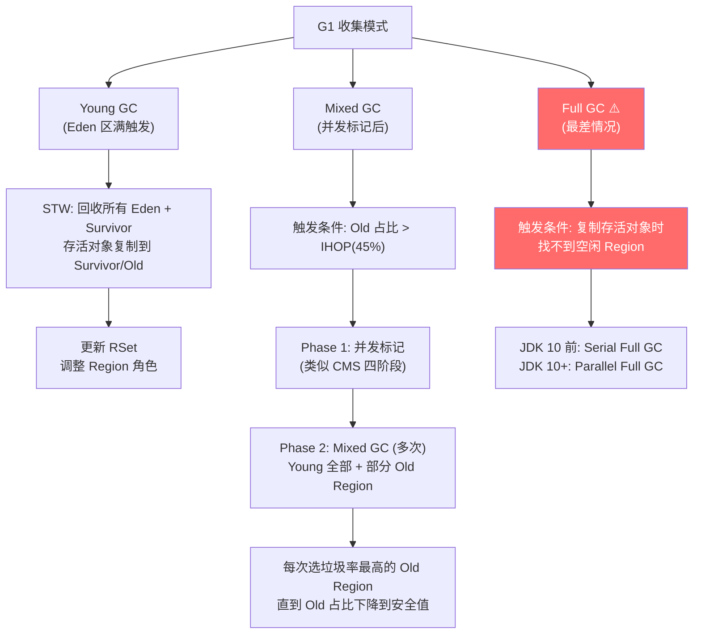
```mermaid
flowchart TD
    A["G1 收集模式"] --> B["Young GC<br/>(Eden 区满触发)"]
    A --> C["Mixed GC<br/>(并发标记后)"]
    A --> D["Full GC ⚠️<br/>(最差情况)"]

    B --> B1["STW: 回收所有 Eden + Survivor<br/>存活对象复制到 Survivor/Old"]
    B1 --> B2["更新 RSet<br/>调整 Region 角色"]

    C --> C0["触发条件: Old 占比 > IHOP(45%)"]
    C0 --> C1["Phase 1: 并发标记<br/>(类似 CMS 四阶段)"]
    C1 --> C2["Phase 2: Mixed GC (多次)<br/>Young 全部 + 部分 Old Region"]
    C2 --> C3["每次选垃圾率最高的 Old Region<br/>直到 Old 占比下降到安全值"]

    D --> D1["触发条件: 复制存活对象时<br/>找不到空闲 Region"]
    D1 --> D2["JDK 10 前: Serial Full GC<br/>JDK 10+: Parallel Full GC"]

    style D fill:#ff6b6b,color:#fff
    style D1 fill:#ff6b6b,color:#fff
```

#### Young GC 详细过程

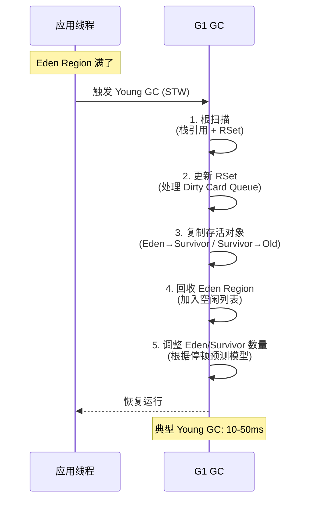
```mermaid
sequenceDiagram
    participant App as 应用线程
    participant G1 as G1 GC

    Note over App: Eden Region 满了
    App->>G1: 触发 Young GC (STW)

    G1->>G1: 1. 根扫描<br/>(栈引用 + RSet)
    G1->>G1: 2. 更新 RSet<br/>(处理 Dirty Card Queue)
    G1->>G1: 3. 复制存活对象<br/>(Eden→Survivor / Survivor→Old)
    G1->>G1: 4. 回收 Eden Region<br/>(加入空闲列表)
    G1->>G1: 5. 调整 Eden/Survivor 数量<br/>(根据停顿预测模型)

    G1-->>App: 恢复运行
    Note over G1: 典型 Young GC: 10-50ms
```

> 🟠 **Young GC 后为什么要动态调整 Eden 数量？**
> 如果上次 Young GC 耗时 180ms（接近 200ms 目标），G1 会减少 Eden Region 数量，这样下次 Young GC 要复制的存活对象更少，耗时更短。反之亦然。这就是 G1"自适应"的核心——不需要手动调 Young/Old 比例。

#### Mixed GC 过程深入

> 🔴 **Mixed GC 是 G1 独有的收集模式**：它既回收所有 Young Region，又回收部分 Old Region（选垃圾率最高的）。
>
> **触发条件**：堆占用率超过 IHOP（Initiating Heap Occupancy Percent，默认 45%）时启动并发标记。标记完成后，G1 知道了每个 Old Region 的存活率，然后连续执行多次 Mixed GC（默认分 8 次完成），每次选一批"回收效率最高"的 Old Region。
>
> **为什么分多次而不是一次全收？** 控制停顿！如果一次收完所有垃圾多的 Old Region，可能需要 500ms+。分成 8 次，每次 50ms 左右，用户体验更平滑。
>
> **Mixed GC 结束条件**：Old 区可回收空间占比低于 `G1HeapWastePercent`（默认 5%）时停止——剩下的 Region 垃圾太少，回收不划算。

### 3.3 🟠 G1 中的 Remembered Set (RSet) 与 Card Table

#### 设计动机：跨代/跨 Region 引用问题

> 🟠 **问题**：Young GC 时只回收 Young Region，但 Old Region 可能引用了 Young Region 的对象。
> 如果不知道哪些 Old Region 引用了 Young Region，就不得不扫描整个 Old 区（太慢！）。
>
> **如果没有 RSet 会怎样？** 每次 Young GC 都要扫描全部 Old 区来找跨 Region 引用。Old 区可能有几 GB 数据，扫描一遍需要几百毫秒——完全违背了 G1"可控停顿"的设计目标。RSet 用"空间换时间"的思路，预先记录好"谁引用了我"，GC 时直接查表即可。

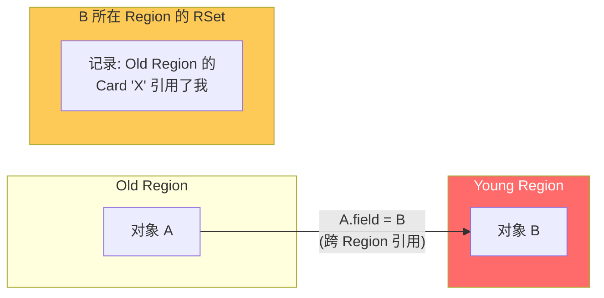
```mermaid
flowchart LR
    subgraph Old["Old Region"]
        OBJ_A["对象 A"]
    end
    subgraph Young["Young Region"]
        OBJ_B["对象 B"]
    end

    OBJ_A -->|"A.field = B<br/>(跨 Region 引用)"| OBJ_B

    subgraph RSet["B 所在 Region 的 RSet"]
        RS["记录: Old Region 的<br/>Card 'X' 引用了我"]
    end

    style Young fill:#ff6b6b,color:#fff
    style RSet fill:#feca57
```

> 🟠 **RSet + Card Table 的工作原理**：
> 1. 每个 Region 有一个 RSet，记录"谁引用了我"（Point-into 方式）
> 2. 堆被划分为大量 512 字节的 Card，Card Table 记录每个 Card 是否"脏"（有跨 Region 引用写入）
> 3. **写屏障（Write Barrier）**：每次引用赋值 `a.field = b` 时，JVM 插入一段额外代码检查 a 和 b 是否在同一个 Region。不同 Region → 标记对应 Card 为脏，加入 Dirty Card Queue
> 4. **并发 Refinement 线程**：异步处理 Dirty Card Queue，更新目标 Region 的 RSet
>
> **为什么用异步更新而不是立即更新 RSet？** 如果每次写引用都立即更新 RSet（涉及哈希表操作），写屏障的开销太大，影响应用性能。异步处理把开销从"关键路径"移到了"后台线程"。

#### 写屏障源码（HotSpot 简化）

```cpp
// 每次引用写入时的 Post Write Barrier
void oop_store(oop* field, oop new_value) {
    *field = new_value;  // 实际赋值

    // ★ 写屏障：检查是否跨 Region
    if (is_cross_region(field, new_value)) {
        // 将对应的 Card 加入 Dirty Card Queue
        CardTableModRefBS::dirty_card(field);
        // Refinement 线程会异步处理队列，更新 RSet
    }
}
```

> 🟢 **RSet 的空间开销与监控**：
> - RSet 占整个堆内存的 **5%-20%**（这是 G1 的"税"）
> - Region 越小 / 跨 Region 引用越多 → RSet 越大
> - **监控方式**：GC 日志中的 `[Scan RS: Xms]` 如果很高（>10ms），说明 RSet 过大
> - **优化**：增大 Region 大小（`-XX:G1HeapRegionSize=16m`）可减少跨 Region 引用
> - **对比**：CMS 的 Card Table 只记录 Old→Young 的引用（单向），G1 的 RSet 记录任意 Region 间的引用（双向），所以开销更大

### 3.4 🔴 G1 关键参数与调优

```bash
# 基础参数
-XX:+UseG1GC                                 # 启用 G1
-XX:MaxGCPauseMillis=200                     # ★ 目标停顿时间(ms)，最核心的调优旋钮
-XX:G1HeapRegionSize=8m                      # Region 大小(1-32MB，必须是2的幂)
-XX:InitiatingHeapOccupancyPercent=45        # 触发并发标记的堆占比(IHOP)
-XX:G1MixedGCCountTarget=8                   # Mixed GC 分几次完成

# 高级参数
-XX:G1NewSizePercent=5                       # Young 区最小占比
-XX:G1MaxNewSizePercent=60                   # Young 区最大占比
-XX:G1MixedGCLiveThresholdPercent=85         # Region 存活率超过此值则不回收(回收不划算)
-XX:G1ReservePercent=10                      # 预留空闲 Region（防止复制时无处可放）
-XX:ConcGCThreads=4                          # 并发标记线程数
-XX:ParallelGCThreads=8                      # STW 并行 GC 线程数
```

> 🟢 **G1 调优黄金法则**：
> 1. **不要手动设置 Young/Old 比例**（不要用 `-Xmn` 或 `-XX:NewRatio`）：G1 会根据 MaxGCPauseMillis 自动调整 Young Region 数量
> 2. **主要调 MaxGCPauseMillis**：太大→延迟高；太小→吞吐低/可能 Full GC
> 3. **关注 Humongous 分配**：大对象直接进 Old Region（甚至跨多个 Region），可能触发意外的并发标记和 Mixed GC。如果大对象频繁分配，考虑增大 Region 大小让它不再是 Humongous
> 4. **IHOP 不要设太高**：留给并发标记足够的时间。JDK 9+ 有自适应 IHOP（`-XX:+G1UseAdaptiveIHOP`），默认开启
> 5. **Full GC = 调优失败的信号**：G1 日志中出现 `Pause Full` 意味着 Mixed GC 没能及时回收足够空间，需要增大堆或降低 IHOP


### 3.5 🟡 ZGC 深入（JDK 15+ 生产可用）

#### 设计动机

> 🟡 **ZGC 要解决什么？**
> G1 的停顿虽然可控（通常 50-200ms），但对于金融交易、实时广告等场景仍然太长。
> ZGC 的目标：**停顿时间不超过 1ms，且与堆大小无关**（16GB 和 16TB 一样快）。
>
> **核心创新**：把所有需要 STW 的工作（包括对象移动）都变成并发的。
>
> **为什么 G1 做不到 <1ms？** G1 在复制存活对象时必须 STW（因为移动对象需要更新引用，如果应用线程同时读旧地址就会出错）。ZGC 用"着色指针 + 读屏障"让应用线程在读取被移动对象时**自动重定向到新地址**，从而允许移动操作与应用并发执行。

#### ZGC 核心技术：着色指针

```
64 位指针中的布局（ZGC）：

┌───────────────────────────────────────────────────────────────────┐
│ 未使用:16 │ Finalizable:1 │ Remapped:1 │ Marked1:1 │ Marked0:1 │ 对象地址:44 │
└───────────────────────────────────────────────────────────────────┘
                    ↑ 4 个标志位（着色）             ↑ 44 位地址 = 16TB 寻址空间
```

> 🟡 **着色指针的精妙之处**：
> - **传统做法**：GC 信息（是否标记、是否转发）存在对象头里 → 读取 GC 信息需要访问对象内存
> - **ZGC 做法**：GC 信息编码在**指针**本身 → 加载指针的同时就能知道 GC 状态（零额外访存！）
> - 配合**多重映射（Multi-Mapping）**：同一物理内存映射到 3 个虚拟地址（Marked0/Marked1/Remapped），通过指针中的标志位选择使用哪个虚拟地址。切换 GC 阶段只需改变"哪个标志位有效"即可。
>
> **类比理解**：想象你有一个房子（物理内存），但有三张不同颜色的门牌（三个虚拟地址）。GC 阶段切换时，只需宣布"今天走红色门牌进"，所有人用红色地址访问同一个房子。旧的蓝色门牌自动失效，下次有人用蓝色地址来访时触发读屏障完成重定位。

#### ZGC 读屏障（Load Barrier）

```java
// 伪代码：ZGC 的读屏障
Object loadReference(Object* field) {
    Object ref = *field;  // 读取引用

    // ★ 检查指针颜色（标志位是否是当前有效的）
    if (ref.isNotRemapped()) {
        // 指针指向的是旧地址（对象已经被移动了）
        ref = slowPath(ref);  // 自愈：查转发表找到新地址
        *field = ref;         // 回写到原位置（下次读就不需要慢路径了）
    }
    return ref;
}
```

> 🟡 **读屏障的"自愈"机制详解**：
> 1. GC 线程并发移动对象 A 从地址 0x100 到 0x200，在转发表中记录 0x100→0x200
> 2. 应用线程读取某个字段，发现指针仍指向 0x100（旧颜色标志位）
> 3. 触发读屏障慢路径：查转发表 → 得到新地址 0x200 → 更新指针颜色和地址
> 4. 把修正后的指针回写到字段中（self-healing）
> 5. 下次再读这个字段，指针已经是新的了，不再触发慢路径
>
> **性能影响**：首次访问被移动对象有额外开销（约 4% 的吞吐损失），但换来了**完全并发的对象移动**——这是 ZGC 能做到 <1ms 停顿的根本原因。

> 🟡 **为什么用读屏障而不是写屏障？**
> - G1/CMS 用**写屏障**：每次写入引用时记录变化（用于跨代引用追踪和 SATB/增量更新）
> - ZGC 用**读屏障**：每次读取引用时检查并自愈（用于并发移动对象后的指针更新）
> - **权衡**：读操作比写操作频繁得多，所以读屏障的触发次数更多。但每次触发的开销很低（只是检查几个标志位），而且自愈后不再触发。写屏障虽然触发少，但无法实现并发移动。

#### G1 vs ZGC 完整对比

| 维度 | G1 | ZGC |
|------|----|----|
| 最大停顿 | 50-500ms | **< 1ms** |
| 支持堆大小 | 4-64 GB 最佳 | **8MB - 16TB** |
| 对象移动 | STW 阶段复制 | **并发移动（读屏障自愈）** |
| 内存映射 | 普通映射 | **Multi-Mapping（3份虚拟地址）** |
| 碎片处理 | Region 间复制 | **并发压缩** |
| 分代 | 逻辑分代 | **JDK 21 分代 ZGC** |
| 吞吐量 | ⭐⭐⭐⭐ | ⭐⭐⭐（读屏障有 ~4% 开销） |
| 延迟 | ⭐⭐⭐ | ⭐⭐⭐⭐⭐ |
| 适用 JDK | 9+ | 15+（生产），21+（分代 ZGC） |
| 参数调优 | 需要精细调优 | **几乎不需要调优** |

> 🟡 **什么场景选 G1，什么场景选 ZGC？**
> - 选 G1：JDK 版本 < 15、需要稳定的生态支持、堆 4-32GB、能接受 100-200ms 偶尔停顿
> - 选 ZGC：JDK 15+、延迟极其敏感（金融/广告）、堆很大（>32GB）、追求"配一下参数就不管了"的简单运维

```bash
# ZGC 启动参数（极简——这就是 ZGC 的魅力）
-XX:+UseZGC
-XX:+ZGenerational              # JDK 21+ 分代 ZGC（强烈推荐，吞吐比非分代高 10-20%）
-Xmx16g                         # 只需设置最大堆，其他 ZGC 自动管理
-Xlog:gc*:file=/var/log/gc.log  # GC 日志
```

---


## 4. 类加载机制

### 4.1 🔴 类加载过程（每阶段深入）


```mermaid
flowchart LR
    A["加载<br/>Loading"] --> B["验证<br/>Verification"]
    B --> C["准备<br/>Preparation"]
    C --> D["解析<br/>Resolution"]
    D --> E["初始化<br/>Initialization"]
    E --> F["使用<br/>Using"]
    F --> G["卸载<br/>Unloading"]

    style A fill:#ff6b6b,color:#fff
    style E fill:#ff6b6b,color:#fff

    linkStyle 0,1,2 stroke:#ff6b6b
```

> 🔴 **各阶段深入**：

| 阶段 | 做什么 | 关键源码/机制 | 面试关键点 |
|------|--------|-------------|-----------|
| **加载** | 读取字节流→Class对象 | `ClassLoader.loadClass()` → `defineClass()` | 可自定义读取来源（网络/加密/动态生成） |
| **验证** | 确保字节码安全合法 | 文件魔数(CAFEBABE)/版本/语义/字节码验证 | 可用 `-Xverify:none` 跳过（不推荐） |
| **准备** | 类变量分配内存+零值 | `static int a=10` → 此时 a=0 | **final static 在此阶段直接赋值（ConstantValue 属性）** |
| **解析** | 符号引用→直接引用 | 常量池中的引用转为内存地址/偏移量 | 可能延迟到运行时（lazy resolution） |
| **初始化** | 执行 `<clinit>` | 静态代码块+静态变量按源码顺序赋值 | **保证线程安全**（JVM 内部加锁） |

> 🟠 **准备阶段的关键区分**：
> - `static int a = 10;` → 准备阶段 a=0，初始化阶段 a=10
> - `static final int b = 10;` → 准备阶段直接 b=10（因为 final+编译期可确定值，class 文件中有 ConstantValue 属性）
> - `static final String s = new String("x");` → 准备阶段 s=null，初始化阶段赋值（因为 new 不是编译期常量）
>
> **为什么要区分？** 编译器能确定的常量可以更早赋值（ConstantValue 优化），运行时才能确定的必须等到 `<clinit>` 执行。

#### `<clinit>` 的线程安全（单例模式的基础）

```java
// JVM 保证 <clinit> 只执行一次，且是线程安全的
// 这是"静态内部类单例"能工作的根本原因
public class Singleton {
    private Singleton() {}

    // 利用类加载的线程安全保证
    private static class Holder {
        static final Singleton INSTANCE = new Singleton();
        // <clinit> 中初始化 INSTANCE
        // JVM 保证 Holder 类只被加载一次
        // 且 <clinit> 执行时其他线程被阻塞
    }

    public static Singleton getInstance() {
        return Holder.INSTANCE; // 触发 Holder 类的初始化
    }
}
```

> 🟠 **HotSpot 中 `<clinit>` 的互斥实现**：
> ```cpp
> // InstanceKlass::initialize_impl() 简化
> void InstanceKlass::initialize_impl() {
>     // 获取初始化锁（每个类一把）
>     ObjectLocker ol(init_lock(), THREAD);
>     
>     if (is_initialized()) return;  // 已初始化，直接返回
>     if (is_being_initialized() && is_reentrant()) return;  // 递归初始化
>     
>     set_init_state(being_initialized);  // 标记"正在初始化"
>     // 其他线程到这里会看到 being_initialized 并等待
>     
>     call_class_initializer();  // 执行 <clinit>
>     
>     set_init_state(fully_initialized);  // 标记"初始化完成"
>     notify_all();  // 唤醒等待的线程
> }
> ```
>
> 🔴 **这段代码为什么重要？** 它保证了：（1）类只被初始化一次（多线程安全）；（2）其他线程等待初始化完成后才能使用该类；（3）支持递归初始化（A 的 clinit 中引用了 B，B 的 clinit 中又引用了 A）。这就是为什么"静态内部类单例"是线程安全的——不需要 synchronized，JVM 层面已经保证了。

### 4.2 🔴 双亲委派模型

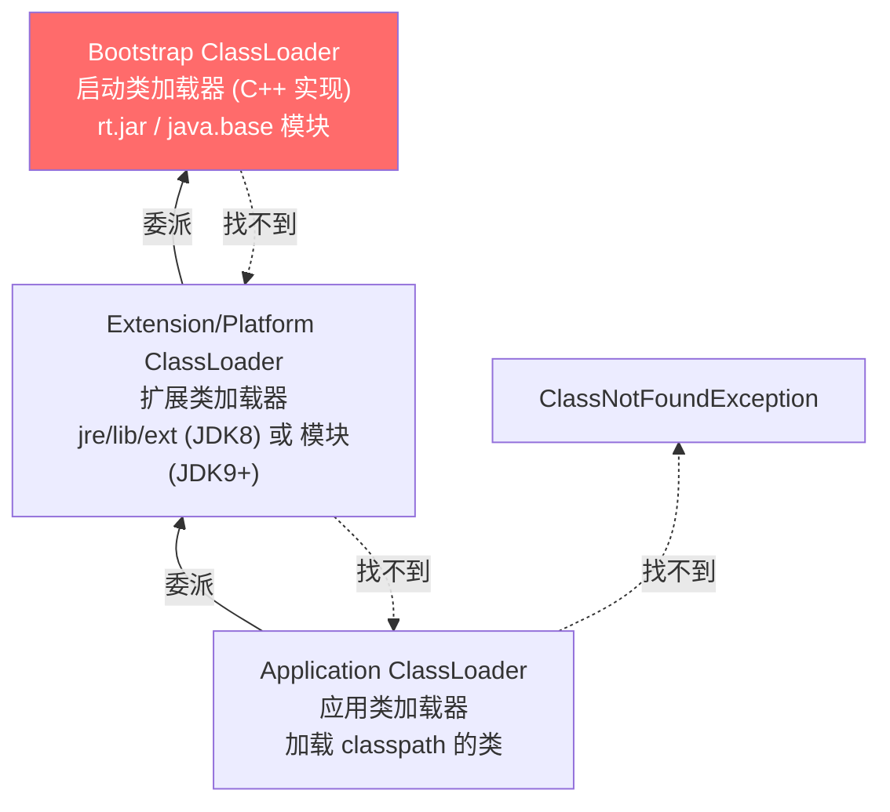
```mermaid
flowchart BT
    APP["Application ClassLoader<br/>应用类加载器<br/>加载 classpath 的类"] -->|委派| EXT["Extension/Platform ClassLoader<br/>扩展类加载器<br/>jre/lib/ext (JDK8) 或 模块(JDK9+)"]
    EXT -->|委派| BOOT["Bootstrap ClassLoader<br/>启动类加载器 (C++ 实现)<br/>rt.jar / java.base 模块"]

    BOOT -.找不到.-> EXT
    EXT -.找不到.-> APP
    APP -.找不到.-> THROW["ClassNotFoundException"]

    style BOOT fill:#ff6b6b,color:#fff
```

#### 源码级理解

```java
// java.lang.ClassLoader#loadClass（双亲委派的核心实现）
protected Class<?> loadClass(String name, boolean resolve) throws ClassNotFoundException {
    synchronized (getClassLoadingLock(name)) {
        // 1. 检查是否已经加载过
        Class<?> c = findLoadedClass(name);
        if (c == null) {
            try {
                // 2. ★ 先委派给父加载器
                if (parent != null) {
                    c = parent.loadClass(name, false);
                } else {
                    // 父为 null → 委派给 Bootstrap
                    c = findBootstrapClassOrNull(name);
                }
            } catch (ClassNotFoundException e) {
                // 父加载器抛异常 = 没找到
            }

            if (c == null) {
                // 3. 父加载器加载失败，自己尝试
                c = findClass(name);  // ★ 子类重写这个方法
            }
        }
        if (resolve) resolveClass(c);
        return c;
    }
}
```

> 🔴 **双亲委派的作用**：
> 1. **安全**：防止核心类被篡改（即使你写了 `java.lang.String`，也加载不了，因为 Bootstrap 已经加载了真正的）
> 2. **唯一性**：同一个类只会被加载一次（因为先检查 `findLoadedClass`）
> 3. **层次清晰**：避免类重复加载，保证类型系统的一致性
>
> 🔴 **如果没有双亲委派会怎样？** 任何人都可以写一个 `java.lang.String` 类放在 classpath 下，应用加载器直接加载它——你的所有字符串操作都走了"假的" String 类。恶意代码可以通过这种方式窃取敏感数据或绕过安全检查。双亲委派确保核心类永远来自可信的 Bootstrap 加载器。

### 4.3 🟠 打破双亲委派的三大场景

| 场景 | 问题 | 解决方案 | 关键机制 |
|------|------|---------|---------|
| **SPI** | Bootstrap 加载了接口(JDBC Driver),但实现在应用 classpath | Thread Context ClassLoader | `Thread.currentThread().getContextClassLoader()` |
| **Tomcat** | 多个 WebApp 需要使用不同版本的同一个库 | WebappClassLoader 先加载自己的 | 重写 `loadClass()` 改变委派顺序 |
| **OSGi/JDK9 模块** | 复杂的模块依赖，不是简单的层级关系 | 网状委派/模块可见性 | `Layer` + `Module` |

#### SPI 打破双亲委派详解

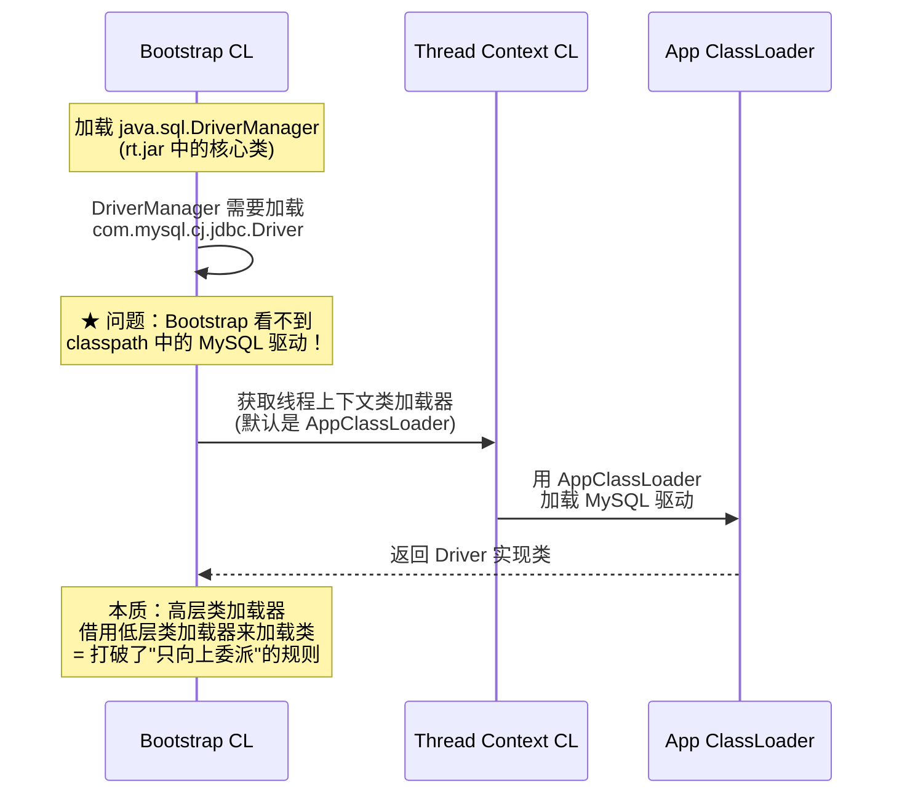
```mermaid
sequenceDiagram
    participant Boot as Bootstrap CL
    participant Thread as Thread Context CL
    participant App as App ClassLoader

    Note over Boot: 加载 java.sql.DriverManager<br/>(rt.jar 中的核心类)
    Boot->>Boot: DriverManager 需要加载<br/>com.mysql.cj.jdbc.Driver
    Note over Boot: ★ 问题：Bootstrap 看不到<br/>classpath 中的 MySQL 驱动！

    Boot->>Thread: 获取线程上下文类加载器<br/>(默认是 AppClassLoader)
    Thread->>App: 用 AppClassLoader<br/>加载 MySQL 驱动
    App-->>Boot: 返回 Driver 实现类

    Note over Boot: 本质：高层类加载器<br/>借用低层类加载器来加载类<br/>= 打破了"只向上委派"的规则
```

> 🟠 **SPI 打破双亲委派的本质**：双亲委派是"自底向上委派"（子→父），但 SPI 场景需要"自顶向下委托"（父→子）。Bootstrap 加载的 `DriverManager` 需要加载 classpath 中的 JDBC 驱动实现，但按照双亲委派规则它看不到子加载器的类路径。Thread Context ClassLoader 就是这个"后门"——让 DriverManager 能通过当前线程的上下文加载器"向下"加载。

#### Tomcat 打破双亲委派

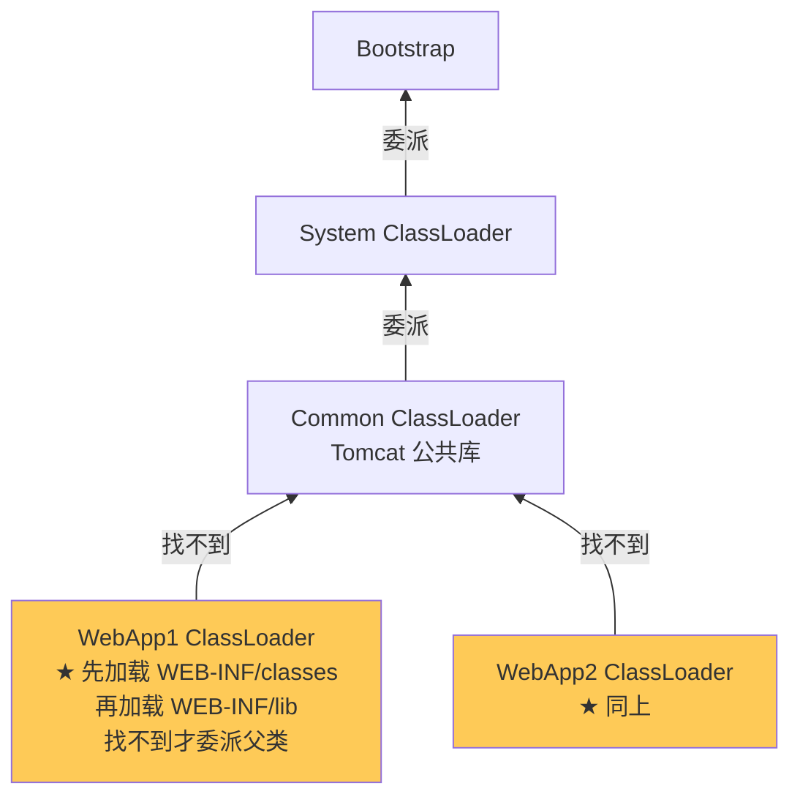
```mermaid
flowchart BT
    WCL1["WebApp1 ClassLoader<br/>★ 先加载 WEB-INF/classes<br/>再加载 WEB-INF/lib<br/>找不到才委派父类"] -->|找不到| CCL["Common ClassLoader<br/>Tomcat 公共库"]
    WCL2["WebApp2 ClassLoader<br/>★ 同上"] -->|找不到| CCL
    CCL -->|委派| SYS["System ClassLoader"]
    SYS -->|委派| BOOT["Bootstrap"]

    style WCL1 fill:#feca57
    style WCL2 fill:#feca57
```

> 🟠 **Tomcat WebappClassLoader 的加载顺序**（重写了 `loadClass`）：
> 1. 检查 JVM 缓存（`findLoadedClass`）
> 2. 检查是否是 JRE 核心类（`java.*`）→ 委派给 Bootstrap（不能打破！）
> 3. **先尝试加载自己的类**（WEB-INF/classes → WEB-INF/lib）
> 4. 找不到再委派给父加载器（Common ClassLoader）
>
> **效果**：WebApp1 用 Spring 5.x，WebApp2 用 Spring 6.x，互不干扰。
> **如果不打破双亲委派？** 两个 WebApp 的 Spring 类都会被 Common ClassLoader 加载一次——只有一个版本能存在。这对于需要部署多个应用的 Servlet 容器来说是不可接受的。

### 4.4 🟡 类加载器与内存泄漏

> 🟡 **类卸载条件（全部满足才能卸载）**：
> 1. 该类所有实例都已 GC
> 2. 加载该类的 ClassLoader 已被 GC
> 3. 该类的 java.lang.Class 对象没有被引用
>
> **为什么这经常导致 Metaspace 泄漏？**
> - Spring 的 BeanFactory 缓存了 Class 引用 → 条件 3 不满足
> - 线程的 ThreadLocal 可能持有 ClassLoader 引用 → 条件 2 不满足
> - 结果：大量重复部署后类永远无法卸载 → Metaspace OOM
>
> **为什么三个条件都需要满足？** 如果只卸载类但不回收 ClassLoader，ClassLoader 中缓存的其他类信息会变成悬挂指针；如果只回收 ClassLoader 但类还有实例存活，实例的 `getClass()` 会返回已失效的 Class 对象。三个条件确保"这个类真的完全没人用了"。

> 🟢 **热部署导致 Metaspace 泄漏的排查**：
> ```bash
> # 1. 查看已加载类的数量
> jcmd <pid> VM.classloader_stats
> 
> # 2. 用 Arthas 查看类加载器实例
> classloader -l   # 列出所有类加载器及加载类数量
> 
> # 3. 查看重复定义的类
> sc -d com.example.MyClass  # 如果出现多个 ClassLoader，说明有泄漏
> ```

---


## 5. JVM 调优实战

### 5.1 🔴 调优方法论：不要盲目调参

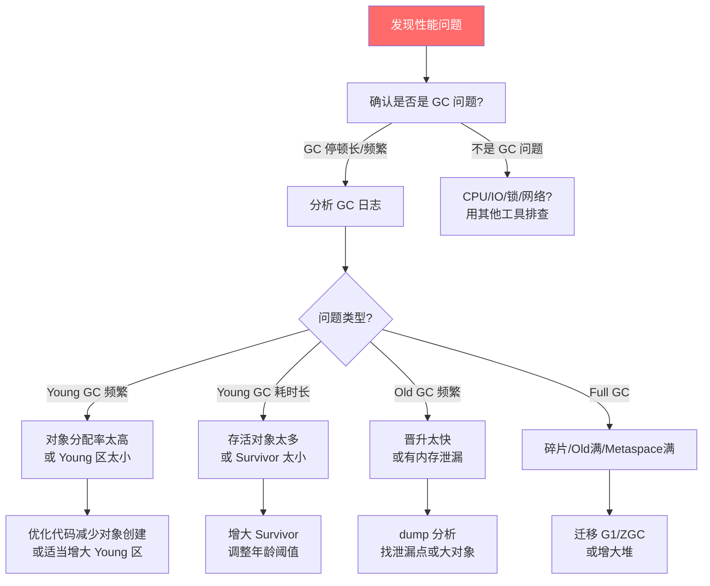
```mermaid
flowchart TD
    A["发现性能问题"] --> B["确认是否是 GC 问题?"]
    B -->|"GC 停顿长/频繁"| C["分析 GC 日志"]
    B -->|"不是 GC 问题"| D["CPU/IO/锁/网络?<br/>用其他工具排查"]

    C --> E{"问题类型?"}
    E -->|"Young GC 频繁"| F["对象分配率太高<br/>或 Young 区太小"]
    E -->|"Young GC 耗时长"| G["存活对象太多<br/>或 Survivor 太小"]
    E -->|"Old GC 频繁"| H["晋升太快<br/>或有内存泄漏"]
    E -->|"Full GC"| I["碎片/Old满/Metaspace满"]

    F --> F1["优化代码减少对象创建<br/>或适当增大 Young 区"]
    G --> G1["增大 Survivor<br/>调整年龄阈值"]
    H --> H1["dump 分析<br/>找泄漏点或大对象"]
    I --> I1["迁移 G1/ZGC<br/>或增大堆"]

    style A fill:#ff6b6b,color:#fff
```

> 🔴 **调优原则**：
> 1. **先定位瓶颈再调参**：不是所有性能问题都是 GC 导致的（CPU 飙高可能是死循环，接口慢可能是 DB 慢查询）
> 2. **以数据为依据**：每次只改一个参数，对比前后指标（GC 频率/停顿时间/吞吐量）
> 3. **优先升级 GC**：从 CMS→G1→ZGC 的收益远大于参数调优（换收集器可能一步到位，调参只能微调）
> 4. **代码优化优先于 JVM 调优**：减少对象创建比调大堆更有效（治本 vs 治标）
>
> 🔴 **什么时候该调优 JVM？** 当你已经排除了代码层面的问题（慢查询、死循环、锁竞争），且 GC 日志确实显示 GC 是瓶颈时。如果 GC 停顿占比 <5%，不要碰 JVM 参数——投入产出比极低。

### 5.2 🔴 OOM 排查流程（源码级）

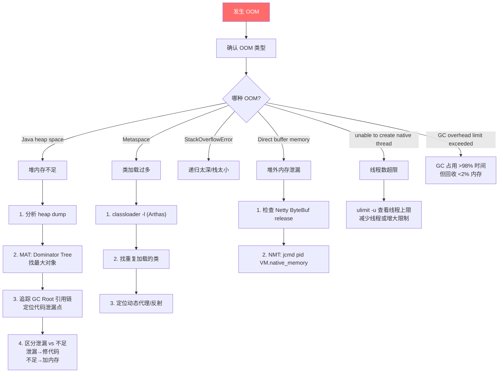
```mermaid
flowchart TD
    A["发生 OOM"] --> B["确认 OOM 类型"]
    B --> C{"哪种 OOM?"}

    C -->|"Java heap space"| D["堆内存不足"]
    C -->|"Metaspace"| E["类加载过多"]
    C -->|"StackOverflowError"| F["递归太深/栈太小"]
    C -->|"Direct buffer memory"| G["堆外内存泄漏"]
    C -->|"unable to create native thread"| H["线程数超限"]
    C -->|"GC overhead limit exceeded"| I["GC 占用 >98% 时间<br/>但回收 <2% 内存"]

    D --> D1["1. 分析 heap dump"]
    D1 --> D2["2. MAT: Dominator Tree<br/>找最大对象"]
    D2 --> D3["3. 追踪 GC Root 引用链<br/>定位代码泄漏点"]
    D3 --> D4["4. 区分泄漏 vs 不足<br/>泄漏→修代码<br/>不足→加内存"]

    E --> E1["1. classloader -l (Arthas)"]
    E1 --> E2["2. 找重复加载的类"]
    E2 --> E3["3. 定位动态代理/反射"]

    G --> G1["1. 检查 Netty ByteBuf release"]
    G1 --> G2["2. NMT: jcmd pid VM.native_memory"]

    H --> H1["ulimit -u 查看线程上限<br/>减少线程或增大限制"]

    style A fill:#ff6b6b,color:#fff
```

#### 内存泄漏 vs 内存不足的判断

> 🔴 **如何区分？看 Old 区增长趋势**：
> - **内存泄漏**：每次 Full GC 后 Old 区使用量的"基线"持续上升（无法回收的越来越多）
> - **内存不足**：Full GC 后 Old 区能降到较低水平，但业务高峰时不够用
>
> ```
> 内存泄漏的 GC 趋势:
> Old区使用率
> 100% ─────────────────────────────── ★ OOM!
>        ╱    ╱    ╱    ╱    ╱
>       ╱    ╱    ╱    ╱    ╱
>      ╱    ╱    ╱    ╱    ╱
>     ╱────╱────╱────╱────╱
>    ╱    ╱    ╱    ╱
>   ──────────────────────────── 时间 →
>   每次 Full GC 后的基线持续上升!
>
> 内存不足(非泄漏)的 GC 趋势:
> Old区使用率
> 100% ─ ─ ─ ─ ─ ─ ─ ─ ─ ─ ─ ─ ─ 
>      ╱╲   ╱╲   ╱╲   ╱╲   ╱╲
>     ╱  ╲ ╱  ╲ ╱  ╲ ╱  ╲ ╱  ╲
>    ╱    ╳    ╳    ╳    ╳    ╳
>   ╱    ╱╲   ╱╲   ╱╲   ╱╲
>   ──────────────────────────── 时间 →
>   Full GC 后能回到低水位，但频率太高
> ```
>
> 🟠 **为什么要区分？** 因为解决方案完全不同：泄漏要修代码（找到持有引用不释放的地方），不足可以加内存或优化对象生命周期。如果泄漏时只加内存，OOM 只是延迟发生而已。

#### 🟢 线上事故：HashMap 导致的内存泄漏

> 🟢 **事故还原**：
> - **业务**：某用户画像服务，用 `HashMap<Long, UserProfile>` 做本地缓存
> - **配置**：堆 4GB，G1 收集器
> - **现象**：服务运行 48 小时后 OOM
> - **排查过程**：
>   1. MAT 打开 dump，Dominator Tree 显示一个 HashMap 占 3.2GB
>   2. HashMap 中有 500 万条数据（预期最多 10 万）
>   3. 代码中只有 `put` 没有 `remove`，且没有过期策略
>   4. 更致命的是：UserProfile 重写了 `equals` 但没重写 `hashCode` → 相同用户被重复 put（不同 hashCode → 不同桶 → 不覆盖）
> - **修复**：
>   1. 改用 Caffeine/Guava Cache 替代裸 HashMap（自动过期+容量限制）
>   2. 正确重写 `hashCode()` 和 `equals()`
>   3. 添加缓存大小监控告警
> - **教训**：**裸 HashMap 做缓存 = 内存泄漏定时炸弹**。必须有容量限制+过期策略。

### 5.3 🔴 Arthas 实战指南

> 🔴 **Arthas 是阿里开源的 Java 在线诊断工具**，无需重启、无需修改代码，attach 到运行中的 JVM 即可诊断。它的价值在于：线上问题往往不可复现，不能重启、不能加日志、不能远程 debug——Arthas 是这种场景下唯一的选择。

| 场景 | 命令 | 详解 |
|------|------|------|
| CPU 飙高 | `thread -n 3` | 显示 CPU 占用最高的 3 个线程堆栈 |
| 死锁 | `thread -b` | 直接定位死锁线程（显示互相等待的锁） |
| 方法慢 | `trace com.x.Service method` | 显示方法内部调用链路及每步耗时（精确到 ms） |
| 方法返回值 | `watch com.x.Dao query returnObj` | 观察方法的返回值/入参/异常（不改代码不加日志） |
| 热更新 | `redefine /tmp/MyClass.class` | 不重启替换类（线上紧急修复，仅限方法体修改） |
| 反编译 | `jad com.x.Service` | 查看运行时实际加载的代码（确认部署是否正确） |
| 类冲突 | `sc -d com.x.MyClass` | 查看类的加载信息（哪个 jar/哪个 ClassLoader） |
| 堆分析 | `heapdump /tmp/a.hprof` | 不触发 Full GC 的堆 dump |
| GC 监控 | `dashboard` | 实时面板：线程/内存/GC |

#### Arthas trace 实战示例

```bash
# 场景：某接口响应时间从 50ms 劣化到 2s，定位哪一步慢了

[arthas@12345]$ trace com.order.OrderService createOrder
`---ts=2024-06-15 10:30:45;thread_name=http-nio-8080-exec-5;
    `---[2156ms] com.order.OrderService:createOrder()
        +---[2ms] com.order.OrderService:validateParam()
        +---[1ms] com.order.OrderService:checkDuplicate()
        +---[2150ms] com.order.OrderService:deductStock()  ★ 就是这里！
        |   `---[2148ms] com.stock.StockDao:update()       ★ DB 慢查询
        `---[3ms] com.order.OrderService:saveOrder()

# 定位到 deductStock → DB 慢查询，接下来去看 MySQL slow log
```

> 🟠 **Arthas 原理简述**：Arthas 通过 Java Agent 的 `Instrumentation` API attach 到目标 JVM，使用字节码增强（ASM）在目标方法前后插入计时/监控代码。这就是为什么它能在不修改源码、不重启的情况下做到方法级诊断。

### 5.4 🔴 线上 CPU 100% 排查（完整流程）

```bash
# ═══ 经典排查流程（任何 Java 面试官都会问）═══

# 1. 找到占 CPU 最高的 Java 进程
$ top -c
# PID=12345 %CPU=300% (多核 > 100% 正常)

# 2. 找到最耗 CPU 的线程
$ top -Hp 12345
# PID=12367 %CPU=99.5%

# 3. 转十六进制 (jstack 中线程 ID 是十六进制)
$ printf "%x\n" 12367
# 输出: 304f

# 4. jstack 抓取线程堆栈，搜索该线程
$ jstack 12345 | grep "0x304f" -A 30
"pool-1-thread-3" #15 prio=5 os_prio=0 tid=0x00007f... nid=0x304f runnable
   java.lang.Thread.State: RUNNABLE
        at java.util.HashMap.hash(HashMap.java:339)
        at java.util.HashMap.put(HashMap.java:612)
        at com.example.CacheManager.buildCache(CacheManager.java:45)  ★
        ...

# 或者直接用 Arthas（更简单）：
[arthas@12345]$ thread -n 1
```

> 🔴 **CPU 100% 常见原因及堆栈特征**：
> | 原因 | 堆栈特征 | 解决方案 |
> |------|---------|---------|
> | 死循环 | 同一方法反复出现在堆栈中（如 while(true) 内的业务代码） | 修复循环条件 |
> | HashMap 并发 resize 死链 | `HashMap.put` → `HashMap.resize` → `HashMap.transfer` 无限循环 | 改用 ConcurrentHashMap |
> | 正则表达式灾难性回溯 | `Pattern.match` 或 `Matcher.find` 长时间占 CPU | 优化正则（避免嵌套量词）/加超时 |
> | 频繁 Full GC | GC 线程占满 CPU（线程名含 "GC"） | GC 调优/内存泄漏修复 |
> | 大量线程自旋 | `Thread.yield` / `Unsafe.park` / 自旋锁 | 减少竞争/用队列 |
>
> 🟠 **HashMap 并发死链的原理（JDK 7）**：JDK 7 的 HashMap resize 时用头插法转移链表节点。两个线程同时 resize，可能导致链表形成环（A→B→A）。后续任何对这个桶的遍历（get/put）都会无限循环。JDK 8 改用尾插法修复了这个问题，但 HashMap 仍然**不是线程安全的**——并发写可能丢数据。

### 5.5 🟠 GC 日志分析

```bash
# JDK 8 格式（已废弃但仍常见）
-XX:+PrintGCDetails -XX:+PrintGCDateStamps -Xloggc:/var/log/gc.log

# JDK 9+ 统一日志框架（推荐）
-Xlog:gc*=info:file=/var/log/gc.log:time,uptime,level,tags:filecount=10,filesize=100m
```

#### G1 GC 日志解读

```
[2024-01-15T10:30:45.123+0800][info][gc] GC(123) Pause Young (Normal) (G1 Evacuation Pause)
[2024-01-15T10:30:45.123+0800][info][gc] GC(123)   Pre Evacuate Collection Set: 0.2ms
[2024-01-15T10:30:45.123+0800][info][gc] GC(123)   Merge Heap Roots: 0.3ms
[2024-01-15T10:30:45.123+0800][info][gc] GC(123)   Evacuate Collection Set: 18.5ms  ★ 复制存活对象(最耗时)
[2024-01-15T10:30:45.123+0800][info][gc] GC(123)   Post Evacuate Collection Set: 2.1ms
[2024-01-15T10:30:45.123+0800][info][gc] GC(123)   Eden regions: 50->0(50)  Survivor: 6->6(8)  Old: 120->125
[2024-01-15T10:30:45.145+0800][info][gc] GC(123) Pause Young (Normal) 22.5ms  ★ 总停顿

# ═══ 关键指标解读 ═══
# 1. GC 频率: 每分钟几次? (>1次/分钟 需关注)
# 2. 停顿时间: 22.5ms 对于 G1 正常 (>200ms 需优化)
# 3. Eden 回收率: 50 regions 全部回收 (正常，Eden 对象朝生夕死)
# 4. Old 增长: 120→125 (每次涨 5 个 region，关注趋势是否持续增长)
# 5. Survivor 稳定: 6→6 (正常)
# 6. 是否有 Full GC: 搜索 "Pause Full" (生产环境应该为 0!)
# 7. Mixed GC 频率: 搜索 "Pause Young (Mixed)" (IHOP 触发后出现)
```

> 🟠 **推荐工具**：
> - **GCViewer**：可视化分析 GC 日志，生成停顿时间/吞吐量图表（本地 Java 工具）
> - **GCEasy**（gceasy.io）：在线上传 GC 日志，自动分析并给出优化建议
> - **JDK Mission Control**：JFR（Flight Recorder）录制 + 分析，最全面的诊断工具

### 5.6 🟢 避坑提醒

> 🟢 **避坑 1：生产禁用 jmap -histo:live**
> - 它会触发 Full GC！`-histo:live` 的 "live" 要求只显示存活对象，所以先做一次 Full GC 清除死对象
> - 在高流量环境下可能导致长时间 STW + 请求超时雪崩
> - **替代**：用 Arthas `heapdump`（不触发 GC 的快照）或 `jcmd <pid> GC.heap_info`（只看统计不 dump）

> 🟢 **避坑 2：-XX:+PrintGCDetails 在 JDK 9+ 已废弃**
> - 使用 `-Xlog:gc*` 替代
> - 两者格式完全不同，解析工具要对应版本

> 🟢 **避坑 3：不要盲目调大堆**
> - 堆越大 → GC 扫描的对象越多 → 停顿越长（对于 Parallel/Serial 尤为明显）
> - G1 通过只回收部分 Region 规避了这个问题，但过大的堆仍会增加并发标记时间
> - 正确做法：先分析 GC 日志确认瓶颈，再针对性调整

> 🟢 **避坑 4：容器环境的内存陷阱**
> - Docker 容器限制 4GB，但 JDK 8u191 之前的 JVM 看到的是**宿主机内存**（可能 64GB），按宿主机 25% 设堆 = 16GB → 超出容器限制 → OOM Kill
> - JDK 8u191+/JDK 10+：`-XX:+UseContainerSupport`（默认开启），JVM 能正确识别 cgroup 限制
> - **最佳实践**：显式设置 `-Xmx` 为容器内存的 **70-75%**（留给 Metaspace/直接内存/线程栈/JVM 内部数据结构）
> - 计算公式：`容器内存 4GB → Xmx ≈ 3GB → 余 1GB 给非堆`

---


# 第二部分 · MySQL

## 6. InnoDB 存储引擎核心

### 6.1 🔴 InnoDB 架构全景

#### 设计动机

> 🔴 **InnoDB 为什么是 MySQL 的默认引擎？**
> - 支持事务（ACID）：数据一致性的基础
> - 支持行级锁（高并发）：不像 MyISAM 只有表锁，写操作不阻塞其他行的读
> - 支持外键：保证参照完整性
> - 支持崩溃恢复（WAL + Double Write）：断电不丢数据
> - MVCC 实现非锁定读：读不阻塞写、写不阻塞读
>
> 🔴 **如果不用 InnoDB（比如 MyISAM）会怎样？** MyISAM 在任何写操作时锁整张表，高并发写场景下所有请求排队等待，吞吐量急剧下降。且 MyISAM 不支持事务——如果一个包含多条 SQL 的业务操作执行到一半崩溃了，数据处于不一致状态且无法自动恢复。

```mermaid
flowchart TB
    subgraph 内存["内存结构 (Buffer Pool 为王)"]
        BP["Buffer Pool ⭐<br/>━━━━━━━━━━━━━<br/>数据页/索引页/undo页<br/>改进的 LRU 链表管理<br/>★ 性能核心：减少磁盘 IO"]
        CB["Change Buffer<br/>━━━━━━━━━━━━━<br/>非唯一辅助索引的延迟写<br/>合并 IO 减少随机写"]
        LB["Log Buffer<br/>━━━━━━━━━━━━━<br/>redo log 写入缓冲<br/>batch write 提高效率"]
        AHI["Adaptive Hash Index<br/>━━━━━━━━━━━━━<br/>热点数据自动建 Hash<br/>O(1) 查找"]
    end

    subgraph 磁盘["磁盘结构"]
        TS["表空间 Tablespace<br/>━━━━━━━━━━━━━<br/>系统表空间(ibdata1)<br/>独立表空间(.ibd)<br/>临时表空间"]
        REDO["Redo Log<br/>━━━━━━━━━━━━━<br/>环形写入(循环覆盖)<br/>★ WAL:崩溃恢复的保障"]
        UNDO["Undo Log<br/>━━━━━━━━━━━━━<br/>事务回滚<br/>MVCC 多版本读"]
        DW["Doublewrite Buffer<br/>━━━━━━━━━━━━━<br/>防止部分写(Partial Write)<br/>先写 DW 再写数据文件"]
    end

    BP -->|"Checkpoint 刷脏页"| TS
    LB -->|"fsync"| REDO
    BP -.->|"构建版本链"| UNDO

    style BP fill:#ff6b6b,color:#fff
    style REDO fill:#feca57
```

> 🟠 **Change Buffer 深入——为什么只适用于非唯一辅助索引？**
>
> Change Buffer 的思路：对辅助索引的写操作先缓存在内存中，不立即更新磁盘上的索引页，等下次读到该页时再合并（merge）。这把随机写变成了顺序写。
>
> **为什么唯一索引不能用 Change Buffer？** 因为唯一索引在 INSERT 时必须检查是否有重复值——这要求读取对应的索引页到内存中。既然已经读进来了，直接在内存中修改即可，没有"延迟写"的必要。
>
> **为什么主键索引不能用？** 主键索引（聚簇索引）插入时数据页必须被读取（要把整行数据写进去），同理。
>
> **Change Buffer 最大收益场景**：写多读少的辅助索引（如日志表的 create_time 索引）。大量 INSERT 操作的索引修改被缓存，后续一次性合并，IO 次数大幅减少。

### 6.2 🔴 Buffer Pool 深入

#### 为什么 Buffer Pool 是 InnoDB 性能的核心？

> 🔴 **磁盘 IO 是数据库最大的瓶颈**。
> - 一次磁盘随机 IO ≈ 10ms（HDD）/ 0.1ms（SSD）
> - 一次内存访问 ≈ 100ns（比 HDD 快 10 万倍，比 SSD 快 1000 倍）
> - Buffer Pool 的目标：**让尽可能多的热数据留在内存中，避免磁盘 IO**
>
> **经验法则**：Buffer Pool 命中率 > 99% 才正常。<95% 说明内存严重不足。
>
> **一句话理解**：Buffer Pool 就是 MySQL 的"读写缓存"——所有数据的读取和修改都先在 Buffer Pool（内存）中进行，脏页异步刷到磁盘。它的大小直接决定了多少数据能"住在内存里"。

```sql
-- 查看 Buffer Pool 命中率
SHOW GLOBAL STATUS LIKE 'Innodb_buffer_pool_read%';
-- 命中率 = 1 - (Innodb_buffer_pool_reads / Innodb_buffer_pool_read_requests) * 100%
-- reads: 不在 Buffer Pool 中，不得不从磁盘读取的次数
-- read_requests: 总的逻辑读请求数
-- 如果命中率 < 99%，优先增大 innodb_buffer_pool_size
```

#### 改进的 LRU 算法

```mermaid
flowchart LR
    subgraph LRU["Buffer Pool LRU 链表"]
        Young["Young 区(热数据)<br/>链表前 5/8<br/>高频访问的页"]
        Old["Old 区(冷数据)<br/>链表后 3/8<br/>新加载的页先放这里"]
    end

    READ["首次读取数据页"] -->|"放入 Old 区头部"| Old
    Old -->|"第二次访问<br/>且间隔 > innodb_old_blocks_time(1s)"| Young
    Young -->|"链表满时淘汰"| EVICT["从 Old 区尾部淘汰"]

    style Young fill:#ff6b6b,color:#fff
    style Old fill:#feca57
```

> 🟠 **为什么不用传统 LRU？（传统 LRU 的致命缺陷）**
>
> **问题场景**：全表扫描 `SELECT * FROM big_table`（如运营同学跑报表）
> - 传统 LRU：全表扫描的数据页全部进入链表头部 → 热数据被挤到尾部被淘汰 → 缓存被"冲洗"干净
> - **后果**：报表跑完后，所有正常业务查询都要重新从磁盘加载，命中率暴跌到 50%+ → IO 飙升 → 所有接口响应变慢（这就是"缓存污染"）
>
> **InnoDB 改进 LRU 的解决方案**：新页先放 Old 区，只有**间隔 1 秒后再次访问**才升到 Young 区。
> - 全表扫描：顺序读取每一页，每页只访问一次（扫过就不再回来），停留时间 <1s → 永远在 Old 区 → 被快速淘汰
> - 真正的热数据：被反复访问（间隔必然 >1s），正常升入 Young 区
>
> **如果没有 Old 区（不分冷热）会怎样？** 一次全表扫描或大范围查询就会把整个 Buffer Pool 的热数据全部冲掉，之后所有正常业务查询都要重新从磁盘加载，造成命中率暴跌、IO 飙升、响应延迟陡增。
>
> **关键参数**：
> ```sql
> innodb_old_blocks_pct = 37          -- Old 区占比（37% ≈ 3/8）
> innodb_old_blocks_time = 1000       -- 停留 Old 区多久才能升 Young（ms）
> innodb_buffer_pool_size = 8G        -- ★ Buffer Pool 大小（建议物理内存的 60-75%）
> innodb_buffer_pool_instances = 8    -- Buffer Pool 实例数（减少内部互斥锁竞争）
> ```

#### 🟢 Buffer Pool 调优事故案例

> 🟢 **事故还原**：
> - **场景**：某 MySQL 实例，物理内存 32GB，Buffer Pool 使用默认值 128MB
> - **现象**：应用 QPS 500 时 DB 响应时间 P99 = 200ms，iostat 显示磁盘 IOPS 打满 5000+
> - **根因**：Buffer Pool 太小（128MB 对比 50GB 的数据量），几乎每次查询都要磁盘 IO
> - **修复**：`innodb_buffer_pool_size = 24G`（32GB 的 75%）
> - **效果**：P99 从 200ms 降到 5ms，磁盘 IOPS 降低 90%（大部分请求命中内存）
> - **教训**：**Buffer Pool 是 MySQL 调优的第一个旋钮**，很多性能问题的根因就是 Buffer Pool 太小


### 6.3 🔴 Redo Log 与 WAL 机制

#### 设计动机：为什么需要 Redo Log？

> 🔴 **核心问题**：如果每次修改都直接写磁盘数据文件（随机 IO），性能极差。一次随机写需要磁头寻道 + 旋转等待 + 数据传输 ≈ 10ms（HDD），而一次事务可能修改多个不相邻的数据页。
>
> **WAL（Write-Ahead Logging）的解决思路**：
> 1. 修改先写 Redo Log（**顺序写**，速度是随机写的 100 倍+，因为磁头不需要移动）
> 2. 然后返回成功（此时数据文件还是旧的——"脏页"在内存中）
> 3. 后台异步把修改应用到数据文件（Checkpoint 刷脏页）
> 4. 如果崩溃：用 Redo Log 重放未持久化的修改 → **数据不丢**
>
> 🔴 **WAL 一句话总结**：先顺序写日志（快）再异步刷数据（慢），用日志的持久性换取写入的高性能，崩溃时靠日志重放保证数据不丢。
>
> **如果没有 WAL 会怎样？** 每次 UPDATE 都必须等数据页 fsync 到磁盘才能返回（否则崩溃就丢数据）。以 HDD 为例，每秒最多做 100-200 次随机写，事务吞吐量上限约 100-200 TPS。有了 WAL，Redo Log 顺序写每秒可达 10000+ 次——性能提升 50-100 倍。

```mermaid
sequenceDiagram
    participant App as 应用
    participant BP as Buffer Pool
    participant LB as Log Buffer
    participant RL as Redo Log(磁盘)
    participant DF as 数据文件(磁盘)

    App->>BP: 1. UPDATE: 修改内存中的数据页(变脏)
    Note over BP: 数据页变"脏"(内存≠磁盘)
    App->>LB: 2. 写 redo log 到 Log Buffer
    LB->>RL: 3. fsync 刷盘(顺序IO,极快!)
    Note over RL: ★ 此时事务可以返回成功
    RL-->>App: commit 成功

    Note over BP,DF: === 后台异步(Checkpoint) ===
    BP-->>DF: 4. 后台线程刷脏页(随机IO,慢但不阻塞业务)
    Note over DF: 数据文件最终一致

    Note over RL,DF: === 崩溃恢复 ===
    Note over RL: 如果步骤4之前崩溃:<br/>重启后用 Redo Log 重放修改<br/>→ 数据不丢!
```

> 🔴 **图解文字总结**：事务提交时只保证 Redo Log 落盘（快），不保证数据文件落盘（慢）。数据文件的更新由后台 Checkpoint 异步完成。崩溃恢复时根据 Redo Log 补齐数据文件中缺失的修改。

#### Redo Log 刷盘策略深入

| `innodb_flush_log_at_trx_commit` | 行为 | 性能 | 数据安全 | 适用场景 |
|---|------|------|------|------|
| **1**（默认） | 每次 commit 都 fsync Redo Log 到磁盘 | 最慢（每次 commit 一次磁盘 IO） | **最安全：不丢数据** | 金融/支付/核心业务 |
| **0** | 每秒由后台线程 fsync 一次（不管有没有 commit） | 最快 | 崩溃可能丢最近 1 秒数据 | 日志/监控/非核心 |
| **2** | commit 时写 OS Page Cache，每秒由 OS fsync | 中等 | MySQL 崩溃不丢（OS 缓存还在），OS/机器崩溃可能丢 | 一般业务 |

```mermaid
sequenceDiagram
    participant TX as 事务 commit
    participant LB as Log Buffer(JVM内存)
    participant OS as OS Page Cache
    participant Disk as 磁盘

    Note over TX,Disk: === 值=1 (最安全) ===
    TX->>LB: write
    LB->>OS: write (用户态→内核态)
    OS->>Disk: fsync ★ 每次 commit 都等磁盘确认
    Disk-->>TX: commit 成功(数据绝对不丢)

    Note over TX,Disk: === 值=0 (最快) ===
    TX->>LB: write (完成即返回commit成功)
    Note over LB: 后台线程每秒: LB→OS→fsync
    Note over TX: ★ commit 不等任何 IO

    Note over TX,Disk: === 值=2 (折中) ===
    TX->>LB: write
    LB->>OS: write ★ 到 OS Page Cache 就返回
    Note over OS: 后台每秒 OS 自动 fsync
    Note over TX: MySQL 进程崩溃不丢(OS缓存还在)
```

> 🟠 **配合 `sync_binlog` 的"双 1 配置"**：
> ```sql
> innodb_flush_log_at_trx_commit = 1  -- redo log 每次 commit fsync
> sync_binlog = 1                      -- binlog 每次 commit fsync
> ```
> **含义**：每次事务提交都保证 redo log 和 binlog 都刷到磁盘。
> **为什么 binlog 也要同步刷？** 因为 binlog 是主从复制的基础。如果 binlog 丢了，从库就会和主库不一致。
> **代价**：每次 commit 至少 2 次 fsync（性能下降约 50%）
> **生产建议**：核心业务必须"双 1"；非核心可以 `sync_binlog=100`（每 100 次 commit fsync 一次 binlog）

#### Redo Log 的环形写入与 Checkpoint

```
Redo Log 文件组（默认 2 个文件，每个 48MB）：

┌─────────────┐  ┌─────────────┐
│ib_logfile0   │  │ib_logfile1   │
│             │  │             │
│  write_pos──┼──┼──►          │  write_pos: 当前写入位置(新日志从这里写)
│             │  │             │
│  ◄──────────┼──┼──checkpoint │  checkpoint: 已刷脏页的位置(这之前的日志可以覆盖)
│             │  │             │
└─────────────┘  └─────────────┘

write_pos 追着 checkpoint 跑（环形）
write_pos 和 checkpoint 之间 = 还没刷脏页的日志(崩溃恢复时要重放的)
如果 write_pos 追上 checkpoint → 必须停下来先刷脏页!(性能抖动!)
```

> 🟠 **Checkpoint 的工作原理**：
> 1. 后台线程定期（或被动触发）将 Buffer Pool 中的**脏页**刷到磁盘数据文件
> 2. 刷完后推进 checkpoint 位置（意味着这些页对应的 redo log 已经"兑现"了，可以被覆盖）
> 3. 如果 write_pos 快追上 checkpoint（日志空间快用完），**必须强制刷脏页**来推进 checkpoint——这时会阻塞所有写入，造成性能尖刺
>
> **如果 Redo Log 太小会怎样？** write_pos 很快追上 checkpoint → 频繁强制刷脏页 → 写入被阻塞 → TPS 周期性跌到接近 0。这在高写入量场景下尤为明显。

> 🟢 **避坑：Redo Log 太小导致频繁 Checkpoint**
> - **事故场景**：MySQL 默认 Redo Log 总大小 96MB（2×48MB），高写入量（10000 INSERT/s）时 5 秒就写满
> - **现象**：TPS 每 5 秒突然降到接近 0 并持续 1-2 秒，然后恢复（锯齿形曲线）
> - **修复**：增大 Redo Log
> ```sql
> innodb_log_file_size = 1G        -- 每个文件 1GB
> innodb_log_files_in_group = 3    -- 3 个文件 = 总共 3GB
> ```
> - **MySQL 8.0.30+**：`innodb_redo_log_capacity = 4G` 统一设置（推荐）
> - **经验法则**：Redo Log 应能承受 1-2 小时的写入量，避免频繁 Checkpoint

#### Doublewrite Buffer 的作用

> 🟠 **问题：Partial Page Write（部分写失效）**
>
> InnoDB 数据页 = 16KB，但操作系统一次 IO = 4KB（磁盘扇区通常 512B~4KB）。如果刷一个 16KB 的脏页到磁盘时（需要 4 次 4KB 的 IO），在第 2 次 IO 后机器断电了：
> - 磁盘上这个页的前 8KB 是新的，后 8KB 是旧的 → **页数据损坏**
> - Redo Log 记录的是"增量修改"（如"第 100 字节改为 X"），它假设页本身是完整的——但现在页已经损坏了，重放 redo log 也没法恢复
>
> **Doublewrite 的解决方案**：刷脏页前先把页的完整内容写到一个连续的 Doublewrite 区域（顺序写，2MB 一次），然后再写到实际的数据文件位置。如果实际写入时断电：
> - 数据文件的页损坏了，但 Doublewrite 区域有完整副本
> - 恢复时用 Doublewrite 的完整页覆盖损坏页，然后再重放 Redo Log
>
> **SSD 场景下是否可以关闭？** 如果 SSD 支持原子写（atomic write），可以用 `-XX:innodb_doublewrite=0` 关闭以提升 10-15% 的写入性能。但大多数情况下建议保持开启。

---


## 7. 索引原理与优化

### 7.1 🔴 B+Tree 索引结构

#### 设计动机：为什么用 B+Tree 而不是其他结构？

| 数据结构 | 查询复杂度 | 范围查询 | 磁盘友好度 | 为什么不选 |
|---------|-----------|---------|-----------|-----------|
| Hash | O(1) | ❌ 不支持 | ❌ | 不支持范围查询、排序、最左前缀 |
| 二叉搜索树 | O(logN) | ✅ | ❌ 太高 | 1000万行 → 树高 24 层 → 24 次 IO |
| AVL/红黑树 | O(logN) | ✅ | ❌ 太高 | 同上，每个节点只存 1 个 key |
| B-Tree | O(logN) | ✅ | ⭐ 较好 | 非叶子也存数据 → 单节点存的 key 少 → 树更高 |
| **B+Tree** | O(logN) | ⭐⭐ | ⭐⭐ | **最优解** |

> 🔴 **B+Tree 的四大优势**（面试必答，每个都要说清楚"为什么"）：
> 1. **矮胖**：非叶子节点只存 key 不存 data → 一个 16KB 的节点能存约 1170 个 key（vs B-Tree 约 100 个）→ 扇出大 → 同样数据量树高更低 → IO 次数更少
> 2. **磁盘友好**：一个节点 = 一个数据页（16KB），一次磁盘 IO 读一整个节点的所有 key。操作系统预读机制（read-ahead）对顺序数据友好
> 3. **范围查询高效**：叶子节点用双向链表连接，`WHERE age BETWEEN 20 AND 30` 只需找到第一个满足条件的叶子，然后顺着链表遍历即可（不需要回到根节点重新查找）
> 4. **查询稳定**：所有数据都在叶子节点，任何查询的 IO 次数都等于树高（不会像 B-Tree 那样有的查在根节点命中有的查到叶子节点——性能不可预测）

```mermaid
flowchart TB
    subgraph B_Plus_Tree["B+Tree (InnoDB 聚簇索引，3层可存2000万行)"]
        ROOT["根节点 (常驻内存)<br/>[20 | 50 | 80]<br/>一个页 16KB ≈ 存 1000+ 个 key"]
        N1["[5|10|15]"]
        N2["[25|30|40]"]
        N3["[55|60|70]"]
        N4["[85|90|95]"]
        L1["5→row | 10→row | 15→row"]
        L2["20→row | 25→row | 30→row"]
        L3["40→row | 50→row"]
        L4["55→row | 60→row | 70→row"]
        L5["80→row | 85→row | 90→row | 95→row"]

        ROOT --> N1
        ROOT --> N2
        ROOT --> N3
        ROOT --> N4
        N1 --> L1
        N2 --> L2
        N2 --> L3
        N3 --> L4
        N4 --> L5

        L1 -.双向链表.-> L2
        L2 -.-> L3
        L3 -.-> L4
        L4 -.-> L5
    end

    style ROOT fill:#ff6b6b,color:#fff
    style L1 fill:#feca57
    style L2 fill:#feca57
    style L3 fill:#feca57
    style L4 fill:#feca57
    style L5 fill:#feca57
```

#### 树高计算（面试常问）

> 🔴 **1 千万行数据，B+Tree 多高？**
>
> 假设：
> - 主键 bigint = 8 字节，页内指针 = 6 字节
> - 每个非叶子节点可存 key 数 = 16KB / (8+6) ≈ **1170 个 key**（即 1170 个分支）
> - 每个叶子节点存行数（假设行大小 1KB）= 16KB / 1KB ≈ **16 行**
>
> 计算：
> - 2 层：1170 × 16 = 18,720 行
> - **3 层**：1170 × 1170 × 16 = **2190 万行** ✅
> - 4 层：1170³ × 16 = 256 亿行
>
> **结论**：**千万级数据只需 3 次 IO**（根节点常驻 Buffer Pool，实际只需 2 次磁盘 IO）
>
> 🔴 **口诀**：B+Tree 三层千万行，根驻内存两次 IO。
>
> 🟠 **为什么根节点常驻内存？** 因为所有查询都从根节点开始，它的访问频率是 100%——必然常驻 Buffer Pool 的 Young 区，永远不会被淘汰。

### 7.2 🔴 聚簇索引 vs 非聚簇索引

#### 本质区别

| 维度 | 聚簇索引（主键索引） | 非聚簇索引（辅助索引/二级索引） |
|------|---------------------|-------------------------------|
| 叶子节点存储 | **完整行数据** | **主键值**（不存完整行！） |
| 每张表有几个 | 只有 **1 个**（数据只能按一种顺序物理排列） | 可以有多个 |
| 数据物理排序 | 按主键顺序存储 | 独立排序（按索引列排序） |
| 查询效率 | 直接返回数据（无需回表） | 需要**回表**（用主键值再去聚簇索引找完整行） |
| 插入效率 | 顺序插入最优（自增主键） | 随机位置插入（取决于索引列值） |
| 构建基础 | 主键（或第一个唯一索引/隐藏 row_id） | 指定的索引列 |

> 🔴 **为什么辅助索引叶子存的是主键值而不是行指针？** 如果存行指针（物理地址），每次数据页分裂（插入导致页满）或 OPTIMIZE TABLE 整理时，行的物理地址会变化——所有辅助索引都要更新对应的指针。而存主键值，数据页怎么移动都不影响辅助索引（主键值不会变）。代价是多了一次回表的 B+Tree 查找，但换来了辅助索引的"稳定性"。

```mermaid
flowchart LR
    Q["SELECT name, email<br/>FROM user WHERE age=25"]
    Q --> SI["辅助索引(age)<br/>叶子: age=25 → PK=7"]
    SI -->|"★ 回表"| PK["聚簇索引(主键)<br/>叶子: PK=7 → 完整行数据"]
    PK --> R["返回 name, email"]

    style SI fill:#feca57
    style PK fill:#ff6b6b,color:#fff
```

> 🔴 **回表的代价**：
> - 每次回表 = 额外一次 B+Tree 查找（1-3 次 IO）
> - 如果辅助索引返回 1000 行，需回表 1000 次 → 最多 1000 次随机 IO → 非常慢！
> - **优化器可能放弃索引**：如果预估回表行数太多（超过总行数的 20-30%），优化器宁可全表扫描（顺序 IO 比大量随机 IO 更快）

### 7.3 🔴 覆盖索引（避免回表的终极方案）

> 🔴 **核心**：查询的所有列都在索引中 → 不需要回表 → IO 大幅减少

```sql
-- 联合索引 (name, age, email)

-- ✅ 覆盖索引（不回表）
SELECT name, age, email FROM user WHERE name = 'Tom'
-- EXPLAIN Extra: Using index（意味着只读索引就够了，不碰数据文件）

-- ✅ 覆盖索引（SELECT 列和 WHERE 列都在索引中）
SELECT age FROM user WHERE name = 'Tom' AND age > 20
-- EXPLAIN Extra: Using where; Using index

-- ❌ 需要回表（phone 不在索引中）
SELECT name, age, phone FROM user WHERE name = 'Tom'
-- EXPLAIN Extra: (无 Using index) → 走索引找到主键后还要回表取 phone

-- ★ 优化技巧：把高频查询需要的列加入联合索引（空间换时间）
```

> 🟠 **实际案例：覆盖索引优化报表查询**
> - **Before**：`SELECT user_id, order_amount, order_time FROM orders WHERE status=1 AND order_time>?`
> - **索引**：`idx_status(status)`
> - **问题**：走 status 索引后还需回表 50 万次拿 order_amount 和 order_time
> - **After**：建联合索引 `idx_status_time_amount(status, order_time, user_id, order_amount)`
> - **效果**：覆盖索引，零回表，查询时间从 8s 降到 200ms（40倍提升）
>
> 🔴 **什么时候该用覆盖索引？** 当查询满足"高频 + 回表量大 + SELECT 列少且固定"三个条件时优先使用。典型场景：列表页查询、报表统计、COUNT 查询。但注意索引宽度不宜超过 5-6 列，否则索引本身变大 → 占用更多 Buffer Pool → 写入变慢（每次 INSERT/UPDATE 要维护更宽的索引）。


### 7.4 🔴 索引失效场景（深度分析每个原因）

| # | 失效场景 | 根本原因 | 示例 | 验证方法 |
|---|---------|---------|------|---------|
| 1 | 前导通配符 | B+Tree 按从左到右排序，前导通配无法利用排序定位起始位置 | `LIKE '%abc'` | EXPLAIN type=ALL |
| 2 | 对列使用函数 | 索引存的是原始值，函数计算结果不在索引中 | `WHERE YEAR(create_time)=2024` | 改用范围查询 |
| 3 | 对列做运算 | 同上，运算结果不在索引中 | `WHERE id + 1 = 10` | 改写为 `id = 9` |
| 4 | 隐式类型转换 | MySQL 把字符串转数字来比较，等于对列加了 CAST 函数 | `WHERE phone = 13800138000`（phone 是 varchar） | 加引号 `'138...'` |
| 5 | OR 一侧无索引 | OR 两侧必须都能走索引才能用 index merge | `WHERE a=1 OR b=2`（b 无索引） | 给 b 加索引或拆分为 UNION |
| 6 | 不满足最左前缀 | 联合索引(a,b,c)的 B+Tree 先按 a 排序，a 相同时按 b，以此类推 | `WHERE b=1 AND c=2`（跳过 a） | 建(b,c)单独索引 |
| 7 | 范围查询后列失效 | 范围条件（>/<）破坏了后续列的有序性 | `WHERE a>1 AND b=2`（b 索引失效） | 调整联合索引列顺序，把等值条件放前面 |
| 8 | NOT IN / != | 优化器判断扫描行数过多时放弃索引（取决于选择性） | `WHERE status != 0`（如果 90% 行非 0） | 取决于数据分布 |

> 🟠 **最左前缀原则的本质理解**：
>
> 联合索引 `(a, b, c)` 的 B+Tree 排序方式是：先按 a 全局有序 → a 相同的行按 b 有序 → a、b 都相同的行按 c 有序。
>
> 这意味着：
> - `WHERE a=1` ✅ 能用索引（a 全局有序，可以定位）
> - `WHERE a=1 AND b=2` ✅ 能用索引（a 确定后，b 在局部有序）
> - `WHERE b=2` ❌ 不能用索引（跳过 a，b 在全局是无序的——只有在 a 确定时 b 才有序）
> - `WHERE a=1 AND c=3` ⚠️ 只能用 a 的部分（a 定位后，c 在全局无序，需要在 a=1 的范围内逐行过滤 c）
> - `WHERE a>1 AND b=2` ⚠️ 只能用 a（范围条件让多个 a 值对应的 b 混在一起，b 不再有序）

#### 隐式类型转换的源码级解释

```sql
-- 为什么 phone = 13800138000 会索引失效？（phone 是 varchar）

-- MySQL 的类型转换规则：字符串和数字比较时，把字符串转为数字
-- 所以实际执行相当于：
SELECT * FROM user WHERE CAST(phone AS UNSIGNED) = 13800138000
-- 等于对 phone 列加了函数 → 索引失效！（索引存的是字符串原值）

-- 反向场景：id = '123'（id 是 int）
-- MySQL 把 '123' 转为数字 123，函数施加在常量上而非列上 → 索引不失效！
-- 规则：看类型转换是否施加在索引列上
```

> 🟢 **线上事故：隐式转换导致全表扫描**
> - **场景**：某接口突然变慢，P99 从 5ms 到 3s
> - **排查**：slow log 发现 `WHERE merchant_id = 10086`（merchant_id 是 varchar(32)）
> - **原因**：新人写的 MyBatis Mapper，Java 传入 Long 类型参数，MyBatis 不做类型转换直接拼 SQL
> - **影响**：百万行表全表扫描（从 5ms 退化到 3s）
> - **修复**：`WHERE merchant_id = '10086'`（加引号）
> - **预防**：MyBatis 参数类型用 `#{id, jdbcType=VARCHAR}` 明确指定类型

### 7.5 🟠 索引下推（Index Condition Pushdown, ICP）

#### 设计动机

> 🟠 **MySQL 5.6 之前的问题**：
> 联合索引 (name, age) 在 `WHERE name LIKE '张%' AND age = 25` 查询中，只能利用 name 前缀定位。虽然 age 也在索引中，但存储引擎不会在索引层面过滤 age——它只负责"按索引定位"，其余过滤交给 Server 层。结果是大量不满足 age=25 的行也被回表了。
>
> **ICP 的优化**：让存储引擎在扫描索引时就用索引中包含的列（即使不是用于定位的列）过滤掉不满足条件的记录，减少回表次数。

```sql
-- 联合索引 idx_name_age (name, age)
SELECT * FROM user WHERE name LIKE '张%' AND age = 25

-- 无 ICP（MySQL 5.5）:
-- 1. 存储引擎用索引找到所有 name LIKE '张%' 的记录（假设100条）
-- 2. 全部100条回表，取完整行数据
-- 3. Server 层过滤 age=25，最终返回3条
-- 回表次数：100 次！

-- 有 ICP（MySQL 5.6+）:
-- 1. 存储引擎用索引找到所有 name LIKE '张%' 的记录
-- 2. ★ 存储引擎在索引中直接检查 age=25（age 就在联合索引里）
-- 3. 只有同时满足 name 和 age 的 3 条才回表
-- 回表次数：3 次！减少 97%

-- EXPLAIN Extra: Using index condition（表示启用了 ICP）
```

```mermaid
sequenceDiagram
    participant Server as MySQL Server层
    participant Engine as InnoDB 存储引擎
    participant Index as 联合索引(name,age)
    participant Data as 聚簇索引(数据)

    Note over Server,Data: === 无 ICP（旧行为）===
    Server->>Engine: WHERE name LIKE '张%' AND age=25
    Engine->>Index: 扫描 name LIKE '张%' → 100 条
    loop 100 次回表(大量无用IO!)
        Engine->>Data: 回表取完整行
    end
    Engine-->>Server: 返回 100 行
    Server->>Server: 过滤 age=25 → 3 行

    Note over Server,Data: === 有 ICP（MySQL 5.6+）===
    Server->>Engine: WHERE name LIKE '张%' AND age=25
    Engine->>Index: 扫描 name LIKE '张%'
    Engine->>Engine: ★ 在索引中检查 age=25<br/>97 条不满足直接跳过!
    loop 3 次回表(精确!)
        Engine->>Data: 回表取完整行
    end
    Engine-->>Server: 返回 3 行
```

> 🟠 **ICP 文字总结**：ICP 的本质是把部分 WHERE 条件从 Server 层"下推"到存储引擎层，利用索引中已有的列提前过滤，减少无用的回表 IO。它对"联合索引中范围条件后面的列"特别有效。

---


## 8. 事务与锁机制

### 8.1 🔴 事务隔离级别与 MVCC

#### MVCC 实现原理（源码级）

> 🔴 **MVCC（Multi-Version Concurrency Control）三要素**：隐藏字段 + Undo Log 版本链 + ReadView
>
> **MVCC 解决什么问题？** 让读操作不需要加锁就能读到一致性数据——"读不阻塞写，写不阻塞读"。没有 MVCC 的话，要么读加共享锁（阻塞写）要么读到脏数据（不一致）。

```
每行记录的隐藏字段：
┌─────────┬───────────────┬──────────────┬─────────────┐
│ 用户数据 │ DB_TRX_ID(6B) │ DB_ROLL_PTR(7B) │ DB_ROW_ID(6B) │
│          │ 最后修改的事务ID │ 指向 undo log │ 隐藏主键(无PK时) │
└─────────┴───────────────┴──────────────┴─────────────┘
```

```mermaid
flowchart LR
    subgraph 版本链["Undo Log 版本链"]
        V3["当前版本<br/>trx_id=100<br/>name='王五'"] -->|roll_ptr| V2["历史版本<br/>trx_id=80<br/>name='李四'"]
        V2 -->|roll_ptr| V1["最早版本<br/>trx_id=50<br/>name='张三'"]
    end

    RV["ReadView<br/>m_ids(活跃事务列表)=[90,100]<br/>min_trx_id=90<br/>max_trx_id=101<br/>creator_trx_id=95"]

    RV -->|"trx_id=100 在 m_ids 中<br/>→ 不可见(事务还没提交)"| V3
    RV -->|"trx_id=80 < min_trx_id(90)<br/>→ ✅ 可见!(事务已提交)"| V2

    style V2 fill:#48dbfb
```

> 🔴 **ReadView 可见性判断规则（四条规则，逐版本沿链表往回找直到找到可见版本）**：
> ```
> 对于版本链中某个版本的 trx_id：
> 1. trx_id == creator_trx_id      → 可见（自己修改的，当然看得到）
> 2. trx_id < min_trx_id           → 可见（事务在 ReadView 创建前已提交）
> 3. trx_id >= max_trx_id          → 不可见（事务在 ReadView 创建后才开启）
> 4. min_trx_id <= trx_id < max_trx_id:
>    - trx_id 在 m_ids 中          → 不可见（事务还未提交）
>    - trx_id 不在 m_ids 中        → 可见（事务已提交，只是 ID 在范围内）
> ```

#### 🟠 完整例子：走一遍 MVCC 可见性判断

```sql
-- 初始状态：user 表 id=1 的行 name='张三', trx_id=50

-- 事务 A (trx_id=90) 开始，修改了 name='李四' 但还没提交
-- 版本链: [name='李四', trx_id=90] → [name='张三', trx_id=50]

-- 事务 B (trx_id=95) 开始，执行 SELECT（RR 隔离级别）
-- 此时创建 ReadView:
--   m_ids = [90] (活跃事务列表，只有事务 A 还没提交)
--   min_trx_id = 90 (最小活跃事务ID)
--   max_trx_id = 96 (下一个将分配的事务ID)
--   creator_trx_id = 95 (自己的事务ID)

-- 判断过程：
-- 版本1: trx_id=90, 在 m_ids 中 → 不可见（事务A还没提交）
-- 沿 roll_ptr 找上一版本
-- 版本2: trx_id=50, 50 < min_trx_id(90) → ✅ 可见！
-- 结果: 事务 B 读到的是 name='张三'

-- 如果此时事务 A 提交了:
-- RR 级别: 事务 B 再次 SELECT 仍然读到 '张三'（复用同一个 ReadView）
-- RC 级别: 事务 B 再次 SELECT 读到 '李四'（重新创建 ReadView，A 不再在 m_ids 中）
```

> 🔴 **RC vs RR 的本质区别（一句话总结）**：
> - **RC（Read Committed）**：**每次 SELECT 都生成新 ReadView** → 能看到其他事务的最新提交
> - **RR（Repeatable Read）**：**第一次 SELECT 生成 ReadView，后续复用** → 整个事务看到同一个快照
>
> 🔴 **换个角度理解**：RC 每次读都"刷新视野"所以能看到别人的新提交；RR 只在第一次读时"拍照"，此后一直看这张快照，所以可重复读。

### 8.2 🔴 锁机制详解

```mermaid
flowchart TD
    A[InnoDB 锁分类] --> B[行级锁]
    A --> C[表级锁]

    B --> B1["Record Lock 记录锁<br/>锁住索引记录本身"]
    B --> B2["Gap Lock 间隙锁<br/>锁住索引记录之间的间隙<br/>★ 防止其他事务在间隙中INSERT"]
    B --> B3["Next-Key Lock ⭐<br/>= Record Lock + Gap Lock<br/>★ InnoDB RR 默认锁类型"]

    C --> C1["意向锁 IS/IX<br/>表明事务想加行锁<br/>与表锁互斥判断用"]
    C --> C2["AUTO-INC Lock<br/>自增列插入时的表锁"]

    style B3 fill:#ff6b6b,color:#fff
```

> 🔴 **为什么需要 Gap Lock（间隙锁）？——防止幻读**
>
> **幻读场景**（如果没有 Gap Lock）：
> ```sql
> -- 事务 A（RR 级别）
> SELECT * FROM orders WHERE amount > 100;  -- 返回 3 行
> -- ... 此时事务 B INSERT 了一行 amount=200 并提交 ...
> SELECT * FROM orders WHERE amount > 100;  -- 返回 4 行！多了一行 = "幻读"
> ```
>
> **Gap Lock 怎么防止幻读？** 事务 A 执行范围查询时，不仅锁住已有的记录，还锁住记录之间的"间隙"。其他事务想在这些间隙中 INSERT 新行时会被阻塞，直到事务 A 提交/回滚。
>
> **注意**：MVCC 的快照读本身就不会幻读（读的是快照），Gap Lock 是为了防止**当前读**（`SELECT FOR UPDATE`/`UPDATE`/`DELETE`）的幻读。

#### Next-Key Lock 示例（精确理解加锁范围）

```sql
-- 表数据 id: 1, 5, 10, 15, 20
-- 索引间隙: (-∞,1], (1,5], (5,10], (10,15], (15,20], (20,+∞)
-- RR 隔离级别下

-- 场景1: 等值查询（精确命中唯一索引）:
SELECT * FROM t WHERE id = 10 FOR UPDATE;
-- 加锁: 仅 Record Lock on id=10（退化为记录锁）
-- 原因: 唯一索引等值查询，找到了精确记录，不可能有"间隙中的幻读"

-- 场景2: 等值查询（未命中）:
SELECT * FROM t WHERE id = 12 FOR UPDATE;
-- 加锁: Gap Lock (10, 15)（开区间，不锁10和15本身）
-- 原因: 12不存在，锁住10和15之间的间隙，防止别人INSERT id=12

-- 场景3: 范围查询:
SELECT * FROM t WHERE id >= 10 AND id < 15 FOR UPDATE;
-- 加锁: Next-Key Lock (5,10] + Gap Lock (10,15)
-- 含义: 锁住 id=10 + (5,10)间隙 + (10,15)间隙
-- 效果: id=6~14 的INSERT都会被阻塞

-- 场景4: 非唯一索引等值查询（如 idx_age, age=25 有多行）:
SELECT * FROM t WHERE age = 25 FOR UPDATE;
-- 加锁: 所有 age=25 的记录的 Next-Key Lock + 向右延伸到第一个不等于25的间隙
-- 原因: 非唯一索引可能有多个相同值，必须锁住间隙防止新的 age=25 插入
```

> 🟠 **锁退化规则总结**：
> - 唯一索引 + 等值查询 + 命中 → 退化为 Record Lock（精确锁一行就够了）
> - 唯一索引 + 等值查询 + 未命中 → 退化为 Gap Lock（只锁间隙）
> - 非唯一索引 / 范围查询 → 保持 Next-Key Lock（锁记录+间隙）
>
> **为什么唯一索引能退化？** 因为唯一索引保证了"最多一行匹配"，不可能有新行插入导致幻读。非唯一索引无此保证，所以必须锁间隙。

### 8.3 🟠 死锁排查实战

> 🟠 **死锁的产生条件**：两个事务互相持有对方需要的锁，且都在等待对方释放。

```sql
-- 典型死锁场景：
-- 事务 A: UPDATE orders SET status=2 WHERE id=1;  -- 持有 id=1 的锁
--         UPDATE orders SET status=2 WHERE id=2;  -- 等待 id=2 的锁
-- 事务 B: UPDATE orders SET status=3 WHERE id=2;  -- 持有 id=2 的锁
--         UPDATE orders SET status=3 WHERE id=1;  -- 等待 id=1 的锁
-- → 死锁！InnoDB 检测到后回滚代价较小的事务

-- 查看最近死锁
SHOW ENGINE INNODB STATUS\G
-- 找 LATEST DETECTED DEADLOCK 段

-- 关键配置
innodb_lock_wait_timeout = 5        -- 锁等待超时(秒)，默认50太长
innodb_deadlock_detect = ON         -- 死锁检测(默认ON)
-- 注意：高并发下死锁检测本身有开销（O(N²)等待图检测），极端场景可关闭检测+缩短超时
```

> 🔴 **预防死锁三原则**：
> 1. **固定顺序**：所有事务按相同顺序操作资源（如按 id 升序 UPDATE）
> 2. **加索引**：无索引 → 退化为表锁 → 任何两个写事务都可能冲突；有索引 → 行锁 → 只有操作同一行才冲突
> 3. **事务尽短**：事务内不做 RPC/HTTP 调用，减少持锁时间
>
> 🟢 **死锁事故案例**：
> - **场景**：订单系统，事务 A 先更新 order_id=1 再更新 order_id=2，事务 B 先更新 order_id=2 再更新 order_id=1
> - **频率**：高峰期每分钟 5-10 次死锁，被回滚的事务需要重试
> - **修复**：业务代码中按 order_id 排序后再操作（所有事务都先操作小 id 再操作大 id）
> - **监控**：`SHOW GLOBAL STATUS LIKE 'Innodb_row_lock%'` 关注 `Innodb_row_lock_waits`（锁等待次数）和 `Innodb_row_lock_time_avg`（平均等待时间）

---

## 9. SQL 优化实战

### 9.1 🔴 Explain 关键字段

| 字段 | 含义 | 关注点 |
|------|------|--------|
| **type** | 访问类型（性能从好到差） | `system > const > eq_ref > ref > range > index > ALL` |
| **key** | 实际使用的索引 | NULL = 没用索引（危险！） |
| **key_len** | 索引使用长度 | 联合索引判断用了几列（列长度累加计算） |
| **rows** | 预估扫描行数 | 越小越好（与实际行数可能有偏差） |
| **filtered** | 条件过滤比例 | 100% = 所有行都满足条件，10% = 90% 被过滤掉 |
| **Extra** | 额外信息 | 最重要的诊断字段（见下表） |

> 🔴 **type 字段详解**：
> - `const`：主键/唯一索引等值查询，最多一行匹配。如 `WHERE id = 1`
> - `eq_ref`：JOIN 时被驱动表用主键/唯一索引匹配，每次关联最多一行
> - `ref`：非唯一索引等值查询，可能多行匹配。如 `WHERE status = 1`
> - `range`：索引范围扫描。如 `WHERE id > 100`
> - `index`：全索引扫描（遍历整个索引但不回表）
> - `ALL`：全表扫描（最差！必须优化）

> 🔴 **Extra 重要值速查**：
> | 值 | 含义 | 好坏 | 优化方向 |
> |---|------|------|---------|
> | Using index | 覆盖索引，不回表 | ✅ 最好 | 保持 |
> | Using index condition | 索引下推 ICP | ✅ 好 | 保持 |
> | Using where | Server 层还需额外过滤 | 中性 | 检查能否把条件下推到索引 |
> | **Using filesort** | 需要额外排序（不能利用索引顺序） | ❌ 慢 | 建联合索引覆盖 ORDER BY |
> | **Using temporary** | 使用了临时表（GROUP BY/DISTINCT） | ❌ 很慢 | 优化 GROUP BY 或加索引 |
> | Using MRR | Multi-Range Read 优化（回表时排序主键减少随机IO） | ✅ | 保持 |


### 9.2 🔴 分页优化

```sql
-- ❌ 深翻页慢查询（扫描 100万行再丢弃）
SELECT * FROM orders ORDER BY id LIMIT 1000000, 10
-- 实际扫描: 1000010 行! 返回: 10 行（前100万行全部白读）

-- ✅ 方案 1: 延迟关联（覆盖索引+子查询减少回表）
SELECT o.* FROM orders o
INNER JOIN (SELECT id FROM orders ORDER BY id LIMIT 1000000, 10) t
ON o.id = t.id;
-- 子查询走覆盖索引(只读id，不回表)，只有最终10条才回表
-- 从 "回表100万次" 优化为 "回表10次"

-- ✅ 方案 2: 游标分页（记住上次最大 ID）★ 最推荐
SELECT * FROM orders WHERE id > #{lastMaxId} ORDER BY id LIMIT 10
-- 直接从上次位置开始，不扫描前面的行（O(1) 定位）
-- 缺点: 只能"上一页/下一页"，不能跳页

-- ✅ 方案 3: 业务限制
-- 产品层面禁止跳页（只有"上一页/下一页"按钮），强制使用游标分页
-- Google/微博等都是这种策略——"加载更多"而不是"跳到第999页"
```

> 🟠 **为什么 LIMIT 1000000, 10 慢？深入理解**：
> MySQL 执行 `LIMIT offset, count` 时，必须先获取前 offset+count 行，然后丢弃前 offset 行。即使有索引，每一行都需要回表取完整数据（因为 `SELECT *`）→ 100 万次随机 IO。
>
> **延迟关联为什么快？** 子查询 `SELECT id` 走主键索引的覆盖索引（id 就是主键），扫描 100 万个索引节点只需要顺序读索引页（纯索引扫描不回表），最终定位到 10 个 id 后才回表 10 次。

### 9.3 🔴 JOIN 优化

```mermaid
flowchart LR
    A["驱动表(小表)<br/>逐行扫描"] -->|"每一行去被驱动表查"| B["被驱动表(大表)<br/>★ JOIN 字段必须有索引<br/>每次通过索引查找O(logN)"]

    style A fill:#feca57
    style B fill:#ff6b6b,color:#fff
```

> 🔴 **JOIN 的执行原理（Nested Loop Join）**：
> ```
> for (row in 驱动表) {           // 扫描驱动表全部行
>     for (match in 被驱动表 WHERE join_key = row.key) {  // 在被驱动表中查找匹配
>         output(row + match);
>     }
> }
> ```
> - 如果被驱动表 JOIN 字段有索引 → 内层循环用索引查找 O(logN) → 总复杂度 O(M × logN)
> - 如果被驱动表 JOIN 字段无索引 → 内层循环全表扫描 O(N) → 总复杂度 O(M × N)（灾难！）
>
> **这就是为什么"被驱动表 JOIN 字段必须有索引"是铁律。**

> 🔴 **JOIN 优化四原则**：
> 1. **小表驱动大表**：驱动表决定外层循环次数。100 行驱动 100 万行 = 查索引 100 次；反过来 = 查索引 100 万次
> 2. **被驱动表 JOIN 字段必须有索引**：无索引 = Block Nested Loop（批量比较，但本质仍是 O(M×N)）
> 3. **避免超过 3 表 JOIN**：阿里规范建议不超过 3 表。多表 JOIN 执行计划不稳定，优化器容易选错
> 4. **优先 INNER JOIN**：优化器可自动选择最优驱动表顺序；LEFT JOIN 驱动表固定为左表

### 9.4 🟠 慢查询优化流程

```mermaid
flowchart TD
    A["开启慢查询日志"] --> B["找到 Top N 慢 SQL<br/>(pt-query-digest / mysqldumpslow)"]
    B --> C["EXPLAIN 分析"]
    C --> D{"type?"}
    D -->|ALL| E["全表扫描→加索引"]
    D -->|index| F["全索引扫描→优化为覆盖索引<br/>或加更精确的 WHERE"]
    D -->|range+| G["检查 Extra"]

    G --> H{"Extra?"}
    H -->|filesort| I["建联合索引覆盖 ORDER BY"]
    H -->|temporary| J["优化 GROUP BY<br/>或添加索引"]
    H -->|Using where| K["检查能否建更精确的索引"]

    E --> L["重新 EXPLAIN 验证"]
    I --> L
    J --> L

    style A fill:#ff6b6b,color:#fff
```

```sql
-- 慢查询配置
SET GLOBAL slow_query_log = ON;
SET GLOBAL long_query_time = 1;          -- 超过 1 秒记录
SET GLOBAL log_queries_not_using_indexes = ON;  -- 没用索引的也记录(开发环境有用,生产慎开)
```

> 🟠 **Using filesort 的本质**：
> 当 ORDER BY 的列不能利用索引的有序性时，MySQL 必须把结果集加载到内存（或临时文件）中做排序。如果数据量大（超过 `sort_buffer_size`），会用外部排序（磁盘临时文件）→ 极慢。
>
> **解决**：建联合索引让 WHERE + ORDER BY 的列都在索引中且顺序匹配。例如 `WHERE status=1 ORDER BY create_time DESC` → 建索引 `(status, create_time)`。

---


# 第三部分 · Tomcat

## 10. 架构与线程模型

### 10.1 🔴 Tomcat 整体架构

```mermaid
flowchart TB
    subgraph Server["Server (Tomcat 实例)"]
        subgraph Service["Service"]
            subgraph Connector["Connector (连接器)"]
                EP["EndPoint<br/>监听端口,TCP连接管理"]
                PR["Processor<br/>HTTP 协议解析<br/>Request/Response 封装"]
                AD["Adapter<br/>CoyoteAdapter<br/>将请求转给容器"]
            end
            subgraph Container["Container (容器)"]
                ENG["Engine<br/>Servlet 引擎"]
                HOST["Host<br/>虚拟主机(localhost)"]
                CTX["Context<br/>一个 Web 应用(/app)"]
                WRP["Wrapper<br/>一个 Servlet"]
                ENG --> HOST --> CTX --> WRP
            end
            EP --> PR --> AD --> Container
        end
    end

    CLIENT["客户端请求"] --> EP

    style Connector fill:#feca57
    style Container fill:#ff6b6b,color:#fff
```

> 🔴 **Tomcat 架构的设计思想**：
> **连接器（Connector）** 负责"网络通信"——接收 TCP 连接、解析 HTTP 协议、封装 Request/Response 对象。
> **容器（Container）** 负责"业务处理"——通过 Engine→Host→Context→Wrapper 的层级找到对应的 Servlet 执行。
>
> 这种分离使得 Tomcat 可以用不同的连接器实现（BIO/NIO/APR）而不影响容器逻辑，也可以一个 Service 配多个 Connector（如同时监听 HTTP 8080 和 HTTPS 8443）。

### 10.2 🔴 NIO 线程模型

```mermaid
sequenceDiagram
    participant Client as 客户端
    participant Acc as Acceptor(1线程)
    participant Pol as Poller(1-2线程)
    participant Worker as Worker线程池(200)
    participant Servlet as Servlet

    Client->>Acc: TCP 连接
    Acc->>Acc: accept() 获取 SocketChannel
    Acc->>Pol: 注册到 Poller 的 Selector
    Note over Pol: Selector.select() 监听多个连接的 IO 事件
    Pol->>Pol: 数据就绪(READ事件)
    Pol->>Worker: 提交任务到线程池
    Worker->>Servlet: 调用 service() 方法
    Servlet-->>Worker: 返回响应
    Worker-->>Client: 写回响应

    Note over Acc: Acceptor 只管接受连接(极轻量)
    Note over Pol: Poller 用 NIO 多路复用<br/>1-2 个线程管理上万连接
    Note over Worker: Worker 才是真正执行业务的地方
```

> 🔴 **三层线程各自职责一句话**：
> - **Acceptor**：专职"门卫"，只做 `accept()` 接收新 TCP 连接然后立即移交给 Poller，绝不处理任何业务逻辑。
> - **Poller**：专职"调度员"，用 NIO Selector 以少量线程（1-2个）同时监听成千上万个连接的 IO 就绪事件。某个连接数据到达时，把该连接对应的任务提交到 Worker 线程池。
> - **Worker**：专职"干活的"，线程池中的工作线程真正执行 HTTP 解析 + Servlet 业务逻辑 + 响应写回。
>
> 🟠 **为什么这种模型能支撑高并发？**
> 关键在于 **Poller 层的多路复用**：1 个线程通过 `Selector.select()` 可以同时监控 1 万+ 个 TCP 连接。只有真正有数据到达的连接才会被提交到 Worker 线程池处理。这意味着即使有 1 万个并发连接，大部分时间这些连接都是"等待数据中"的状态（不需要线程），只有少数（比如同一时刻 200 个）有活跃请求需要 Worker 线程处理。
>
> **如果用 BIO 模型（一连接一线程）会怎样？** 1 万个并发连接 = 需要 1 万个线程。每个线程占 1MB 栈空间 = 10GB 内存。而且大部分线程在 `read()` 上阻塞等待（空占资源不干活）。线程上下文切换开销还会导致 CPU 大量浪费。

> 🔴 **三种 IO 模式对比**：
> | 模式 | 线程模型 | 并发能力 | 适用场景 |
> |------|---------|---------|---------|
> | ~~BIO~~ (8.5已移除) | 一连接一线程 | 低（受线程数限制，千级） | 已淘汰 |
> | **NIO** ⭐ 默认 | Acceptor + Poller + Worker | 高（多路复用，万级连接） | 大多数场景 |
> | NIO2 (AIO) | 异步回调（OS 通知完成） | 高 | Linux 下 epoll 已经很优秀，AIO 优势不大 |
> | APR | 本地库（OpenSSL + C） | 最高（绕过 JVM 的 IO 抽象） | HTTPS 密集场景（SSL 加解密用 C 实现更快） |

---

## 11. 性能调优参数

### 11.1 🔴 核心参数

```xml
<Connector port="8080"
           protocol="org.apache.coyote.http11.Http11NioProtocol"
           maxThreads="200"          <!-- ★ Worker 线程池最大线程数 -->
           minSpareThreads="25"      <!-- 最小空闲线程(启动时预热) -->
           acceptCount="100"         <!-- 全忙时等待队列长度，超过则拒绝连接 -->
           connectionTimeout="20000" <!-- 连接空闲超时(ms)，超时关闭 -->
           maxConnections="10000"    <!-- Poller 最大管理连接数(NIO模式) -->
           compression="on"          <!-- 开启 gzip 压缩 -->
           compressionMinSize="2048" <!-- >2KB 才压缩 -->
/>
```

> 🔴 **各参数的关系与流量处理流程**：
> ```
> 客户端请求到达:
> 1. 如果当前连接数 < maxConnections(10000) → 接受连接，注册到 Poller
> 2. 如果连接数已达 maxConnections → 请求进入 OS 层的 backlog 队列（accept queue）
> 3. 如果 backlog 队列 > acceptCount(100) → 直接拒绝连接（客户端收到 Connection Refused）
> 4. 连接被接受后，当有数据到达 → 提交到 Worker 线程池
> 5. 如果 Worker 线程都在忙（活跃线程 = maxThreads） → 进入线程池的工作队列等待
> 6. 如果等待时间 > connectionTimeout → 超时关闭
> ```

> 🔴 **maxThreads 设置公式**：
> - **CPU 密集型**（纯计算、无IO）：线程数 = CPU 核数 + 1（更多线程只会增加上下文切换开销）
> - **IO 密集型**（DB查询、HTTP调用）：线程数 = CPU 核数 × 2 × (1 + 平均IO等待时间/平均CPU计算时间)
> - **实践经验**：微服务大多是 IO 密集的，先设 200，压测观察 CPU 利用率（目标 70-80%），逐步调整
> - **如果 CPU < 50% 但 QPS 到瓶颈** → 增加 maxThreads（线程不够用）
> - **如果 CPU > 80% 且 QPS 到瓶颈** → maxThreads 已足够，瓶颈在 CPU 或下游
>
> **不是越大越好**：线程过多 → 上下文切换（Linux 切换一次约 3-5μs）开销 > 业务收益 → 性能反降。1000 个线程每秒切换百万次 = 纯浪费 3-5 秒 CPU 时间。

### 11.2 🟠 Tomcat + JVM 配套参数

```bash
# setenv.sh（Tomcat 启动时加载的 JVM 参数）
JAVA_OPTS="-server \
  -Xms2g -Xmx2g \
  -XX:+UseG1GC \
  -XX:MaxGCPauseMillis=200 \
  -XX:+HeapDumpOnOutOfMemoryError \
  -XX:HeapDumpPath=/tmp/tomcat_heap.hprof \
  -Xlog:gc*:file=/var/log/tomcat_gc.log:time"
```

> 🟠 **为什么 Tomcat 场景下 G1 通常是最佳选择？**
> Tomcat 作为 Web 容器，对延迟敏感（用户请求需要毫秒级响应），堆通常在 2-8GB 范围，G1 在这个范围内提供了延迟和吞吐的最佳平衡。如果用 Parallel GC，Young GC 可能 100-200ms（用户能感知到卡顿）。

### 11.3 🟢 避坑提醒

> 🟢 **避坑 1：acceptCount 满了之后新连接被 OS 直接拒绝**
> - 客户端表现：`Connection refused` 错误
> - 与 maxThreads 满的区别：maxThreads 满时连接已建立但排队等待处理（客户端会收到延迟的响应），acceptCount 满时连接都建立不了
> - **监控**：`netstat -an | grep 8080 | wc -l` 观察连接数；当接近 maxConnections 时提前告警

> 🟢 **避坑 2**：生产环境务必关闭 **AJP Connector**（8009 端口）。CVE-2020-1938 幽灵猫漏洞允许通过 AJP 协议读取 webapp 目录下任意文件（包括 WEB-INF/web.xml 中的密码配置）。
> ```xml
> <!-- 注释掉或删除这行 -->
> <!-- <Connector port="8009" protocol="AJP/1.3" ... /> -->
> ```

> 🟢 **避坑 3**：Tomcat 的 WebappClassLoader **先加载自己的类**再委托父加载器（打破双亲委派），这会导致不同 WebApp 的同名类互相不可见。在部署多应用（多 WAR）时注意：公共 jar 不要放在 WEB-INF/lib 中（会被加载多份浪费内存），应放在 Tomcat 的 lib/ 目录（Common ClassLoader 加载一份共享）。

> 🟢 **避坑 4：线程池打满导致接口超时雪崩**
> - **场景**：下游服务 A 变慢（响应从 50ms 变为 5s），Tomcat Worker 线程全在等待 A 的响应
> - **结果**：200 个线程全被"占满"等 A，新请求排队 → 所有接口超时（即使不调用 A 的接口也慢）
> - **修复**：1）对下游调用设置合理超时（`connectTimeout=1s, readTimeout=3s`）；2）使用线程池隔离（Hystrix/Resilience4j）——调 A 的请求用独立线程池，不影响其他接口

---


# 第四部分 · 面试官高频追问 Top 20

## 12. 答题模板：STAR-S

> **S** Scenario（场景锚定）→ **T** Theory（结论/分类）→ **A** Architecture（核心流程/图）→ **R** Reference（关键数据/配置）→ **S** So-what（引申实战）

---

## 13. JVM 深度追问

### Q1. JVM 内存模型讲一下？各区域可能出什么问题？

> **完整回答（200+ 字）**：
>
> JVM 运行时内存分为五大区域。**线程共享**的有堆和元空间：堆存放所有对象实例，是 GC 的主战场，分为 Young（Eden+S0+S1）和 Old 两代；元空间存放类的元信息，使用本地内存而非堆内存，JDK 8 用它替代了永久代。**线程私有**的有虚拟机栈（每个方法一个栈帧，存放局部变量表/操作数栈）、本地方法栈（Native 方法）、程序计数器（当前执行的字节码行号）。
>
> 各区域的问题：堆不足抛 `Java heap space`，常因内存泄漏或对象过大；元空间不足抛 `Metaspace`，常因动态代理/反射创建大量类；栈溢出抛 `StackOverflowError`，常因深递归；直接内存不足抛 `Direct buffer memory`，常因 Netty ByteBuf 未 release。
>
> **面试加分**：提到 Xms=Xmx 避免扩容抖动、堆 >32GB 压缩指针关闭的性能悬崖、容器环境需要 `-XX:+UseContainerSupport`。

### Q2. G1 和 CMS 的核心区别？为什么 G1 能取代 CMS？

> **完整回答**：
>
> CMS 用标记-清除算法，虽然并发标记减少了 STW，但有三个无法解决的问题：**内存碎片**（不整理导致大对象分配触发 Serial Old Full GC，停顿秒级）、**Concurrent Mode Failure**（并发收集速度赶不上分配速度退化为单线程 Full GC）、**无法控制停顿时间**（STW 时长取决于 Old 区大小，不可预测）。
>
> G1 用 Region 化 + 标记-复制的方式彻底解决了这三个问题：Region 间复制天然无碎片；通过停顿预测模型（衰减平均值估算每个 Region 回收耗时）控制每次 GC 只选择回收价值最高的若干 Region，从而将停顿控制在 `MaxGCPauseMillis` 范围内；即使触发 Full GC，JDK 10+ 也是并行的（不像 CMS 退化为单线程）。
>
> **选型建议**：JDK 8 堆 4G+ 用 G1，JDK 11+ 追求极低延迟用 ZGC。CMS 已在 JDK 9 被标记废弃，JDK 14 正式移除。

### Q3. OOM 怎么排查？请描述完整流程

> **完整回答**：
>
> 第一步是**确认 OOM 类型**，不同类型排查方向完全不同。Heap space 走堆分析，Metaspace 走类加载分析，Direct memory 走堆外内存分析。
>
> 以最常见的 Heap space 为例：
> 1. **获取堆快照**：生产必须配置 `-XX:+HeapDumpOnOutOfMemoryError -XX:HeapDumpPath=/data/dumps/`，OOM 时自动 dump
> 2. **MAT 分析**：打开 dump 文件，先看 Leak Suspects 报告（MAT 自动分析可疑泄漏点），再看 Dominator Tree 找最大对象
> 3. **追踪引用链**：从大对象右键 "Path to GC Roots → exclude weak/soft references"，找到谁持有了不该持有的引用
> 4. **区分泄漏 vs 不足**：观察多次 Full GC 后 Old 区基线趋势——持续上升=泄漏，稳定但峰值超限=内存不够
> 5. **修复**：泄漏修代码（常见：缓存无过期、连接未关闭、监听器未注销、ThreadLocal 未 remove）；不足则加内存或优化对象生命周期
>
> **面试加分**：提到用 Arthas 的 `heapdump` 替代 `jmap`（不触发 Full GC）、用 NMT（`-XX:NativeMemoryTracking=detail` + `jcmd pid VM.native_memory summary`）排查堆外泄漏。

### Q4. 线上 CPU 100% 怎么排查？

> **完整回答**：
>
> 经典四步（面试官最爱考的实操题）：
> 1. `top -c` 找到 CPU 最高的 Java 进程 PID
> 2. `top -Hp PID` 找到最耗 CPU 的线程 TID
> 3. `printf "%x" TID` 转十六进制（因为 jstack 输出的线程 ID 是十六进制）
> 4. `jstack PID | grep TID_HEX -A 30` 看这个线程在执行什么代码
>
> 或直接 Arthas `thread -n 3` 一步搞定（显示 CPU 最高的 3 个线程堆栈）。
>
> **常见原因及堆栈特征**：
> - 死循环：同一业务方法反复出现在堆栈中（如 `while(true)` 内计算）
> - HashMap 并发死链（JDK 7）：堆栈停在 `HashMap.put` → `HashMap.transfer`
> - 正则表达式灾难性回溯：堆栈停在 `java.util.regex.Pattern$.*` 匹配
> - 频繁 Full GC：GC 线程占满 CPU（线程名 "GC task thread"），用 `jstat -gc PID 1000` 确认
>
> **面试加分**：提到生产环境可以用 `async-profiler` 或 JFR 生成火焰图（Flame Graph），可视化定位 CPU 热点方法。

### Q5. 频繁 Full GC 怎么分析？

> **完整回答**：
>
> Full GC 频繁说明 Old 区空间经常不足。按触发原因分类排查：
>
> 1. **看 GC 日志确认触发原因**：
>    - `Allocation Failure` → Young GC 后存活太多/晋升太快
>    - `Metadata GC Threshold` → Metaspace 满了
>    - `System.gc()` → 代码中/三方库显式调用
>    - `CMS: concurrent mode failure` → CMS 收集速度赶不上分配（CMS 特有）
>
> 2. **Young GC 后存活太多**：Survivor 放不下 → 直接晋升 Old → Old 快速填满。解决：增大 Young 区或 Survivor
> 3. **大对象直接进 Old**：检查是否有大数组/大集合（>PretenureSizeThreshold）。解决：代码优化或调大阈值
> 4. **内存泄漏**：Full GC 后 Old 使用率基线持续上升。解决：dump 分析找泄漏点
> 5. **Metaspace 触发**：类加载过多。解决：增大 MaxMetaspaceSize 并排查动态代理泄漏
> 6. **显式调用 System.gc()**：加 `-XX:+DisableExplicitGC` 禁止（但注意 NIO 的 DirectByteBuffer 依赖 System.gc 触发堆外内存回收，禁止需谨慎）

---

## 14. MySQL 深度追问

### Q6. B+Tree 为什么适合做索引？和 B-Tree 的区别？

> **完整回答**：
>
> B+Tree 相比 B-Tree 有三个关键改进使其成为数据库索引的最佳选择：
> 1. **非叶子节点不存数据**：同样 16KB 的页能存约 1170 个 key（B-Tree 存数据后只能存约 100 个），扇出大 → 树更矮 → IO 更少（3 层存 2000 万行 vs B-Tree 可能需要 5-6 层）
> 2. **叶子节点双向链表**：范围查询 `WHERE age BETWEEN 20 AND 30` 只需找到第一个满足条件的叶子，然后沿链表顺序读取。B-Tree 需要反复回到父节点做中序遍历
> 3. **所有数据在叶子节点**：查询路径长度稳定（都等于树高），性能可预测。B-Tree 可能在第 1 层命中也可能在第 4 层——性能波动大
>
> **磁盘友好性**：一个 B+Tree 节点 = 一个磁盘页（16KB），一次 IO 加载整个节点。千万级数据树高仅 3 层 = 最多 3 次 IO（根节点常驻内存实际只需 2 次磁盘 IO）。
>
> **面试追问：为什么不用 Hash？** Hash O(1) 单点查询确实快，但不支持范围查询（`>、<、BETWEEN`）、不支持排序（`ORDER BY`）、不支持最左前缀匹配。数据库 80% 的查询涉及范围/排序，Hash 只能覆盖点查场景。

### Q7. MVCC 是怎么实现的？RC 和 RR 的区别？

> **完整回答**：
>
> MVCC 通过**三个组件**协作实现无锁一致性读：
> - **隐藏字段**：每行有 `DB_TRX_ID`（最后修改该行的事务 ID）和 `DB_ROLL_PTR`（指向 undo log 的上一个版本）
> - **Undo Log 版本链**：通过 roll_ptr 形成单向链表，保存该行的所有历史版本
> - **ReadView**：事务执行快照读时创建的"可见性快照"，包含当前所有活跃（未提交）事务的列表
>
> **读取流程**：从最新版本开始，用 ReadView 的规则判断是否可见。不可见则沿 roll_ptr 找上一版本继续判断，直到找到第一个可见版本返回。
>
> **RC 和 RR 的区别仅在于 ReadView 的创建时机**：RC 每次 SELECT 都创建新 ReadView（所以能看到其他事务最新的提交）；RR 只在第一次 SELECT 时创建，后续复用同一个（所以整个事务看到一致的快照，不受其他事务提交的影响）。
>
> **RR 级别下的幻读防护**通过 Next-Key Lock 实现：当前读（`SELECT FOR UPDATE`）不仅锁记录还锁间隙，阻止其他事务在间隙中插入新行。

### Q8. 索引失效的场景有哪些？如何验证？

> **完整回答**：
>
> 核心七种失效场景：
> 1. 前导通配符（`LIKE '%abc'`）——B+Tree 按前缀有序，前导通配无法定位
> 2. 列上用函数（`WHERE YEAR(date)=2024`）——索引存原值不存函数结果
> 3. 列做运算（`id+1=10`）——同上
> 4. 隐式类型转换（varchar 列传数字）——等于对列加了 CAST 函数
> 5. OR 一侧无索引——优化器无法用 index merge
> 6. 联合索引不满足最左前缀——跳过前导列后 B+Tree 无法利用排序
> 7. 范围查询后的列失效——范围条件打破了后续列的局部有序性
>
> **验证方法**：`EXPLAIN` 看 type 是否为 ALL（全表扫描）或 key 为 NULL（没走索引）。key_len 可以判断联合索引用了几列。
>
> **面试加分**：MySQL 8.0 支持**函数索引**（`CREATE INDEX idx_year ON t((YEAR(create_time)))`），直接索引函数结果，解决了"函数导致索引失效"的问题。此外 `!=` 和 `NOT IN` 不一定失效——优化器会根据数据选择性（cardinality）和行数估算决定是走索引还是全表扫描。

### Q9. 慢 SQL 优化的完整流程？

> **完整回答**：
>
> 1. **发现**：开启 `slow_query_log`，设 `long_query_time=1`；或通过 APM 工具（SkyWalking/Pinpoint）的数据库调用统计发现慢接口
> 2. **分析**：`pt-query-digest` 聚合分析 slow log，找 Top N 慢 SQL（按总耗时排序，而非单次耗时——执行 10 万次每次 50ms 的 SQL 比执行 1 次 10s 的 SQL 影响更大）
> 3. **诊断**：`EXPLAIN` 分析每条 SQL 的执行计划，重点看 type/key/rows/Extra
> 4. **优化**（按效果排序）：加索引（type=ALL→ref）> 覆盖索引（消除回表）> 改写 SQL（分页优化/子查询改 JOIN）> 调整索引列顺序（消除 filesort）
> 5. **验证**：优化后重新 EXPLAIN，确认 type 改善、rows 减少、Extra 无危险标志
> 6. **监控**：上线后持续监控 P99 响应时间和 slow log 数量
>
> **面试加分**：提到索引不是万能的——写多读少的表加太多索引会拖慢写入（每次 INSERT/UPDATE 要维护所有索引的 B+Tree）。要在读性能和写性能间权衡。

### Q10. InnoDB 为什么推荐自增主键？UUID 做主键有什么问题？

> **完整回答**：
>
> **自增主键的优势**：
> 1. **顺序插入无页分裂**：新行总是追加到 B+Tree 最右边的叶子节点，页写满才分配新页。性能稳定、页利用率接近 100%
> 2. **空间紧凑**：bigint 占 8 字节。每个辅助索引的叶子节点都存主键值，8 字节 × N 个辅助索引 = 最小开销
> 3. **比较高效**：整数比较是一条 CPU 指令
>
> **UUID 的问题**：
> 1. **随机插入导致页分裂**：36 字节的随机值导致新行插入到 B+Tree 中间位置，页频繁分裂和合并，页利用率约 50%（浪费一半空间）
> 2. **辅助索引膨胀**：UUID 36 字节 vs bigint 8 字节，所有辅助索引叶子都要存主键值，空间膨胀 4.5 倍，Buffer Pool 能缓存的索引页数减少 → 更多磁盘 IO
> 3. **比较性能差**：字符串逐字节比较 vs 整数直接比较
>
> **如果必须用 UUID？** 用有序 UUID：MySQL 8.0 的 `UUID_TO_BIN(UUID(), 1)` 把时间戳前置保证递增；或用雪花算法（时间戳+机器ID+序列号），既全局唯一又保证趋势递增。

---


## 15. Tomcat 追问

### Q11. Tomcat 线程模型？maxThreads 怎么设？

> **完整回答**：
>
> Tomcat NIO 模型有三层线程：**Acceptor**（1 个线程，accept TCP 连接）→ **Poller**（1-2 个线程，NIO Selector 多路复用监听 IO 事件）→ **Worker 线程池**（默认 200，执行 Servlet 业务逻辑）。
>
> maxThreads 设置没有银弹，取决于业务类型：CPU 密集型设 CPU 核数+1（更多线程只会增加上下文切换）；IO 密集型（DB 查询/HTTP 调用）设 CPU 核数×2~4，因为线程大部分时间在等 IO（线程在等待期间 CPU 可以切换去处理其他请求）。
>
> 实践方法：初始 200，压测时观察 CPU 利用率。如果 CPU < 50% 且 QPS 到瓶颈 → 增加线程（线程不够导致请求排队）；如果 CPU > 80% → 线程已足够，瓶颈在 CPU 处理能力或下游服务。
>
> **注意**：微服务架构下大部分业务是 IO 密集的（调用其他服务/数据库），200-500 线程是常见范围。但超过 500 后要关注线程栈内存（默认 1MB/线程，500 线程 = 500MB）。

### Q12. Tomcat 类加载器为什么打破双亲委派？

> **完整回答**：
>
> 标准双亲委派是"先问父加载器"，但 Tomcat 的 WebappClassLoader **先加载自己 WEB-INF/classes 和 WEB-INF/lib 的类**，找不到才委托父加载器。
>
> **原因**：同一个 Tomcat 上可能部署多个 WebApp，每个应用可能使用不同版本的同一个库（如 App1 用 Spring 5，App2 用 Spring 6）。如果用标准双亲委派，Spring 只会被 Common ClassLoader 加载一次，两个应用共享同一版本，版本冲突无法解决。
>
> 通过每个 WebApp 独立的 ClassLoader + 优先加载自己的类，实现了**类隔离**——相同全限定名的类可以在不同 WebApp 中共存（因为判断"同一个类"要求类名+ClassLoader 都相同）。
>
> **但注意安全底线**：`java.*` 核心类仍然遵循双亲委派委托给 Bootstrap（你不能在 WebApp 中伪造 `java.lang.String`），只有应用级别的类才是"先加载自己的"。

---

## 16. 综合实战追问

### Q13. 一个接口突然变慢（P99 从 50ms 到 5s），怎么排查？

> **完整回答**：
>
> 按层级从外到内排查，遵循"先排除基础设施再看业务代码"原则：
>
> 1. **确认范围**：是所有接口慢还是单个接口？全部慢→基础设施问题（网络/DB/GC/容器资源）
> 2. **GC 排查**（最快排除）：`jstat -gc PID 1000` 看 Full GC 次数/频率。如果 Full GC 频繁→JVM 调优
> 3. **线程池排查**：`jstack PID | grep "http-nio" | grep -c "WAITING"` 看线程状态分布。大量 WAITING/BLOCKED→有锁或下游超时
> 4. **APM 链路追踪**：SkyWalking trace 定位哪个 span（方法调用）耗时最长。或 Arthas `trace com.x.Service method`
> 5. **DB 排查**：`SHOW PROCESSLIST` 看是否有大量慢查询阻塞。查看 slow log
> 6. **下游服务排查**：检查 HTTP 调用/RPC 调用的超时和错误率
> 7. **资源排查**：CPU（top）/内存（free）/磁盘 IO（iostat）/网络（iftop）是否到瓶颈
>
> **实际经验**：80% 的情况是 DB 慢查询或下游服务超时导致线程池打满。剩下的 10% 是 GC，10% 是代码 bug（死锁/死循环/内存泄漏）。

### Q14. 如何设计一个 Java 应用的性能监控体系？

> **完整回答**：
>
> 三个层次（从底层到应用层）：
> 1. **基础设施监控**：CPU/内存/磁盘/网络（Prometheus + node_exporter + Grafana）
> 2. **JVM 监控**：GC 次数/停顿时间/堆使用率/线程数/类加载数（Micrometer + Prometheus + Grafana 或 JMX Exporter）
> 3. **应用监控**：接口 QPS/P99/错误率/慢调用链路/服务依赖拓扑（SkyWalking/Pinpoint/Jaeger）
>
> **关键告警指标**（超过阈值立即告警）：
> - Full GC 次数 > 0 次/小时
> - Young GC P99 停顿 > 100ms
> - 堆使用率 > 80%（持续 5 分钟）
> - 接口 P99 > SLA 阈值（如 500ms）
> - 线程池活跃线程 > 80% maxThreads
> - 错误率 > 1%
>
> **JVM 必配参数**（不管什么应用都要配）：
> ```bash
> -XX:+HeapDumpOnOutOfMemoryError      # OOM 时自动 dump
> -XX:HeapDumpPath=/data/dumps/         # dump 文件路径
> -Xlog:gc*:file=/data/logs/gc.log:time:filecount=10,filesize=100m  # GC 日志
> ```

### Q15. 服务刚启动时延迟很高（P99 = 2s），几分钟后降到正常（P99 = 50ms），为什么？

> **完整回答**：
>
> 这是典型的 **JVM 冷启动（Cold Start）** 问题，有多个因素：
>
> 1. **JIT 编译**：启动时所有代码以解释模式执行（慢 10-100 倍）。JIT 编译器需要收集足够的执行统计（默认 10000 次调用后才触发编译）才会把热点方法编译为本地机器码
> 2. **Buffer Pool 冷**：MySQL 重启后 Buffer Pool 为空，所有查询都要磁盘 IO。需要一段时间"预热"才能命中率达到 99%+
> 3. **类加载**：首次调用某个功能时需要加载相关类（几十毫秒的额外开销）
> 4. **连接池初始化**：DB 连接池、Redis 连接池可能是懒加载的，第一次使用才建连接
> 5. **本地缓存为空**：Caffeine/Guava Cache 刚启动时 miss rate = 100%
>
> **解决方案**：
> - JIT 预热：`-XX:+TieredCompilation`（默认开启，分层编译更快达到最优性能）或用 `JWarmup`（阿里开源，记录上次运行的编译结果启动时直接用）
> - Buffer Pool 预热：`innodb_buffer_pool_dump_at_shutdown=ON` + `innodb_buffer_pool_load_at_startup=ON`（关闭时保存热页列表，启动时预加载）
> - 连接池预热：配置 `initialSize`/`minIdle` 确保启动时就建好连接
> - 流量预热：新实例上线后先导入少量流量（权重 10%），逐步增加到 100%（滚动部署标配）

### Q16. 一次线上 OOM 的完整排查经历（STAR 格式）

> **完整回答**：
>
> **S（场景）**：某电商订单服务，JDK 8 + G1，堆 4GB，运行 48 小时后 OOM。
>
> **T（发现）**：Grafana 告警 Old 区使用率持续上升（典型泄漏曲线），48h 后触发 OOM。`-XX:+HeapDumpOnOutOfMemoryError` 自动生成了 dump。
>
> **A（分析）**：
> 1. MAT 打开 4GB dump，Leak Suspects 报告指出一个 `ConcurrentHashMap` 占 3.1GB
> 2. Dominator Tree 确认：`OrderCacheService.orderCache` 这个 Map 包含 800 万个 Entry
> 3. Path to GC Roots：被 Spring Bean（Singleton）持有 → 永远不会被 GC
> 4. 代码排查：`orderCache.put(orderId, orderDTO)` 在每次查询时缓存结果，但没有任何过期/淘汰策略
> 5. 为什么不是 LRU？开发者"打算后面加过期"但忘了
>
> **R（修复）**：
> 1. 把裸 ConcurrentHashMap 替换为 Caffeine Cache：`maximumSize(10万).expireAfterWrite(30分钟)`
> 2. 添加缓存大小监控指标 `cache.size` → Grafana 告警
> 3. 代码审查流程增加"缓存必须有容量限制和过期策略"的 checklist
>
> **S（引申）**：此后团队制定规范：禁止在生产代码中使用裸 HashMap/ConcurrentHashMap 做缓存，统一使用 Caffeine 并强制配置 maximumSize。

---


## 17. 终极记忆地图

```mermaid
mindmap
  root((性能调优))
    JVM
      内存模型(5区+各自OOM)
      对象创建(TLAB/CAS/零值/对象头)
      GC算法(清/整/复/分代)
      收集器(CMS→G1→ZGC演化)
      G1(Region/RSet/预测模型/Mixed GC)
      ZGC(着色指针/读屏障/<1ms)
      类加载(双亲委派/打破场景/泄漏)
      调优实战(Arthas/MAT/GC日志)
    MySQL
      InnoDB(Buffer Pool/WAL/Double Write)
      索引(B+Tree/聚簇/覆盖/失效7场景/ICP)
      事务(MVCC/ReadView/RC vs RR)
      锁(Record/Gap/Next-Key/死锁)
      优化(Explain/分页/JOIN/慢查询)
    Tomcat
      架构(Connector+Container)
      线程模型(Acceptor/Poller/Worker)
      调优(maxThreads/acceptCount/NIO)
      类加载(先自己后委派/类隔离)
```

---

## 结语

本文按**吃透级别**深度改写了性能调优的每个知识点：

- 🔴 **必背核心**：面试直接问的题，源码+时序图+原理链
- 🟠 **重点理解**：追问到这一层才稳，trade-off 分析 + "如果不这么做会怎样"
- 🟡 **加分项**：拉开差距的内容（ZGC 着色指针、动态年龄判定源码、Doublewrite 原理）
- 🟢 **避坑提醒**：真实线上事故案例，体现工程经验

**复习建议**：
1. 第一遍：只读 🔴 部分（1 小时）
2. 第二遍：补 🟠 理解原理（1.5 小时）
3. 第三遍：扫 🟡🟢 拔高与避坑（40 分钟）
4. 临场：每章 mermaid 图记牢，白板面试时手画

> 祝面试顺利，Offer 满满。
