# Java 框架源码面试总结 · 深度增强版

> 整理基础:`框架源码面试总结.md`
> 风格:**大纲 → 细分知识点 → 图解 → 关键源码 → 面试官追问 + 答题模板**
> 适用:中高级 Java 后端面试 / 源码二面 / 架构面

---

## 全文大纲

```
第一部分 · Spring 容器核心
    1. IOC 容器加载流程 (refresh 12 步)
    2. Bean 生命周期完整链路
    3. 依赖注入与 @Autowired 解析
    4. 循环依赖与三级缓存
    5. 构造方法推断

第二部分 · Spring 切面与事务
    6. Spring AOP 原理
    7. Spring 事务原理
    8. 事务失效场景大全

第三部分 · SpringMVC
    9. DispatcherServlet 请求处理流程
    10. 参数解析与返回值处理
    11. 拦截器、异常处理、跨域

第四部分 · MyBatis
    12. SqlSessionFactory 构建过程
    13. Executor 体系与一/二级缓存
    14. Mapper 接口动态代理
    15. 插件机制 (Interceptor)

第五部分 · SpringBoot
    16. SpringApplication 启动流程
    17. 自动装配原理 (SPI)
    18. 条件装配与启动器设计

第六部分 · 面试官高频追问 Top 30
    包括 STAR 答题模板、加分项、避坑提醒
```

---

# 第一部分 · Spring 容器核心

## 1. IOC 容器加载流程 (refresh 12 步)

### 1.1 入口与整体视角

`AbstractApplicationContext#refresh()` 是 Spring 容器启动的**总指挥**。无论是 `ClassPathXmlApplicationContext`、`AnnotationConfigApplicationContext` 还是 SpringBoot 的 `AnnotationConfigServletWebServerApplicationContext`,最终都收敛到这一个方法。

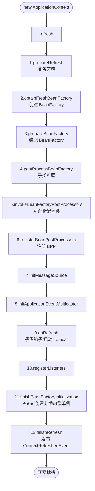

### 1.2 12 步逐项拆解 + 高频考点

| 步 | 方法 | 干了什么 | 高频考点 |
|---|------|---------|---------|
| 1 | `prepareRefresh()` | 启动时间、active 标志、加载并校验 Environment 中必要属性 | 几乎不考 |
| 2 | `obtainFreshBeanFactory()` | XML 流派:解析 XML 生成 BeanDefinition;注解流派:返回已注册的 `DefaultListableBeanFactory` | **BeanDefinition 何时进入容器** |
| 3 | `prepareBeanFactory()` | 设置 ClassLoader、SpEL 解析器、注册 `ApplicationContextAwareProcessor`、忽略一批 Aware 接口 | **ApplicationContextAware 为何能被回调** |
| 4 | `postProcessBeanFactory()` | 留给子类(Web 容器添加 servlet 相关 scope) | 一般不考 |
| 5 | `invokeBeanFactoryPostProcessors()` | **执行所有 BFPP**,其中 `ConfigurationClassPostProcessor` 解析 `@ComponentScan/@Bean/@Import` | **★ 自动装配的根** |
| 6 | `registerBeanPostProcessors()` | 把所有 BPP 提前实例化并注册到 BeanFactory(按 PriorityOrdered → Ordered → 普通) | **AOP/事务的开关** |
| 7 | `initMessageSource()` | 国际化 | 几乎不考 |
| 8 | `initApplicationEventMulticaster()` | 创建事件广播器 | 事件机制起点 |
| 9 | `onRefresh()` | 留给子类。SpringBoot Web 在这里**启动 Tomcat** | **★ Tomcat 何时启动** |
| 10 | `registerListeners()` | 注册 ApplicationListener | 事件机制 |
| 11 | `finishBeanFactoryInitialization()` | **遍历所有非懒加载单例,getBean() 创建** | **★★★ Bean 生命周期入口** |
| 12 | `finishRefresh()` | 发布 `ContextRefreshedEvent`,启动 `Lifecycle` | 一般不考 |

### 1.3 关键源码节选 (Spring 5.x)

```java
public void refresh() throws BeansException, IllegalStateException {
    synchronized (this.startupShutdownMonitor) {
        prepareRefresh();
        ConfigurableListableBeanFactory beanFactory = obtainFreshBeanFactory();
        prepareBeanFactory(beanFactory);
        try {
            postProcessBeanFactory(beanFactory);
            invokeBeanFactoryPostProcessors(beanFactory);  // 第5步
            registerBeanPostProcessors(beanFactory);       // 第6步
            initMessageSource();
            initApplicationEventMulticaster();
            onRefresh();                                   // 第9步:Web 启动 Tomcat
            registerListeners();
            finishBeanFactoryInitialization(beanFactory);  // 第11步:Bean 创建主战场
            finishRefresh();
        } catch (BeansException ex) {
            destroyBeans();
            cancelRefresh(ex);
            throw ex;
        } finally {
            resetCommonCaches();
        }
    }
}
```

### 1.4 BeanDefinition 注册路径

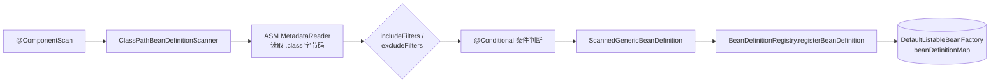

**为什么用 ASM 而不是反射?**
- 反射会触发类加载,大规模扫描时内存与启动时间双爆炸
- ASM 直接读字节码,**不进 JVM ClassLoader**,只读元注解元信息,极快
- 方便配合 `@Conditional` 在不加载类的情况下判断是否注册

### 1.5 面试官追问 Q&A

**Q1: refresh() 总共多少步?哪几步最关键?**
> 12 步。最关键的是第 5、6、11 步:第 5 步通过 `ConfigurationClassPostProcessor` 把所有 `@Configuration` 类解析成 BeanDefinition;第 6 步注册所有 BeanPostProcessor(AOP、事务、`@Autowired` 都是 BPP);第 11 步真正调用 `getBean()` 实例化所有非懒加载单例。

**Q2: BFPP 和 BPP 的区别?**
> BFPP(`BeanFactoryPostProcessor`)操作 **BeanDefinition**(还没创建 Bean),典型实现是 `ConfigurationClassPostProcessor`、`PropertySourcesPlaceholderConfigurer`;BPP(`BeanPostProcessor`)操作 **Bean 实例**,在初始化前后被回调,典型实现是 `AutowiredAnnotationBeanPostProcessor`、`AnnotationAwareAspectJAutoProxyCreator`。BFPP 早于 BPP 执行。

**Q3: SpringBoot 的 Tomcat 是什么时候启动的?**
> 在 `refresh()` 第 9 步 `onRefresh()` 中。`ServletWebServerApplicationContext#onRefresh()` 重写了该方法,调用 `createWebServer()`,内部 `getWebServer().start()` 启动内嵌 Tomcat。注意此时 Bean 还没全部创建,但 DispatcherServlet 是延迟到第一次请求时才初始化的。

---

## 2. Bean 生命周期完整链路

### 2.1 从一张图看清楚

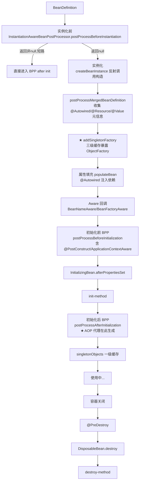

### 2.2 4 大阶段速记口诀

| 阶段 | 干什么 | 记忆点 |
|------|--------|-------|
| 实例化 | 反射调构造方法 | "出生" |
| 属性填充 | 依赖注入 | "穿衣服" |
| 初始化 | Aware → BPP前 → afterPropertiesSet → init-method → BPP后 | "成人礼" |
| 销毁 | @PreDestroy → DisposableBean → destroy-method | "送终" |

### 2.3 初始化阶段 5 个回调的精确顺序 (高频翻车点)

```
1. invokeAwareMethods()
   ├── BeanNameAware.setBeanName()
   ├── BeanClassLoaderAware.setBeanClassLoader()
   └── BeanFactoryAware.setBeanFactory()
            ↓
2. applyBeanPostProcessorsBeforeInitialization()
   ├── ApplicationContextAwareProcessor
   │     ├── EnvironmentAware
   │     ├── ResourceLoaderAware
   │     ├── ApplicationEventPublisherAware
   │     ├── MessageSourceAware
   │     └── ApplicationContextAware  ← 在这里!不在 invokeAwareMethods 里
   └── InitDestroyAnnotationBeanPostProcessor
         └── @PostConstruct 在这里执行
            ↓
3. InitializingBean.afterPropertiesSet()
            ↓
4. 自定义 init-method (XML 配置或 @Bean(initMethod="..."))
            ↓
5. applyBeanPostProcessorsAfterInitialization()
         └── AOP 代理在这里生成 (AbstractAutoProxyCreator)
```

### 2.4 关键源码片段

```java
// AbstractAutowireCapableBeanFactory#doCreateBean (主流程)
protected Object doCreateBean(String beanName, RootBeanDefinition mbd, Object[] args) {
    // 1. 实例化
    BeanWrapper instanceWrapper = createBeanInstance(beanName, mbd, args);
    Object bean = instanceWrapper.getWrappedInstance();

    // 2. 合并 BeanDefinition,缓存注解元信息
    applyMergedBeanDefinitionPostProcessors(mbd, beanType, beanName);

    // 3. ★ 三级缓存:提前暴露,解决循环依赖
    boolean earlySingletonExposure = mbd.isSingleton()
            && this.allowCircularReferences
            && isSingletonCurrentlyInCreation(beanName);
    if (earlySingletonExposure) {
        addSingletonFactory(beanName,
            () -> getEarlyBeanReference(beanName, mbd, bean));
    }

    // 4. 属性填充(依赖注入)
    populateBean(beanName, mbd, instanceWrapper);

    // 5. 初始化(Aware + BPP前 + afterPropertiesSet + init-method + BPP后)
    Object exposedObject = initializeBean(beanName, bean, mbd);

    return exposedObject;
}

// initializeBean
protected Object initializeBean(String beanName, Object bean, RootBeanDefinition mbd) {
    invokeAwareMethods(beanName, bean);                        // 仅 3 个 Aware
    Object wrappedBean = applyBeanPostProcessorsBeforeInitialization(bean, beanName);
    invokeInitMethods(beanName, wrappedBean, mbd);             // afterPropertiesSet + init-method
    wrappedBean = applyBeanPostProcessorsAfterInitialization(wrappedBean, beanName);
    return wrappedBean;
}
```

### 2.5 面试官追问 Q&A

**Q1: @PostConstruct 和 afterPropertiesSet 谁先执行?**
> `@PostConstruct` 先。它由 `InitDestroyAnnotationBeanPostProcessor` 在 `postProcessBeforeInitialization` 阶段处理,而 `afterPropertiesSet` 属于后面的 `invokeInitMethods` 阶段。

**Q2: 为什么 ApplicationContextAware 不在 invokeAwareMethods 里?**
> Spring 把"上下文相关的 Aware"统一交给 `ApplicationContextAwareProcessor`(一个 BPP)处理,因为这些 Aware 需要 ApplicationContext 而不是 BeanFactory,而 BeanFactory 本身不持有 ApplicationContext 引用,所以做成 BPP 在 ApplicationContext 启动时注入。

**Q3: 自定义 BPP 自身的依赖什么时候注入?**
> 在 `registerBeanPostProcessors` 阶段(第6步),它会**提前 getBean()** 把 BPP 创建出来,所以 BPP 的依赖会被立刻满足,但**普通 Bean 还没创建**。所以 BPP 不要依赖普通业务 Bean,否则会触发那些 Bean 的提前实例化,**绕过其它 BPP 的处理**(包括 AOP)。

**Q4: prototype 作用域的 Bean 生命周期由谁管理?**
> 容器只负责**创建**和**初始化**,不负责销毁。每次 `getBean()` 都创建新实例,使用方需要自己处理销毁。所以 `@PreDestroy` 在 prototype 上是无效的。

---

## 3. 依赖注入与 @Autowired 解析

### 3.1 三种注入方式对比

| 方式 | 写法 | 推荐度 | 说明 |
|------|------|-------|------|
| 字段注入 | `@Autowired private XxxService svc;` | ⭐⭐ | 简单但难测试,不推荐 |
| Setter 注入 | `@Autowired public void setSvc(XxxService s)` | ⭐⭐⭐ | 可选依赖适用 |
| **构造器注入** | `public XxxController(XxxService s)` | ⭐⭐⭐⭐⭐ | **官方推荐**,可终态化(`final`)、易测试、暴露循环依赖 |

### 3.2 @Autowired 解析流程

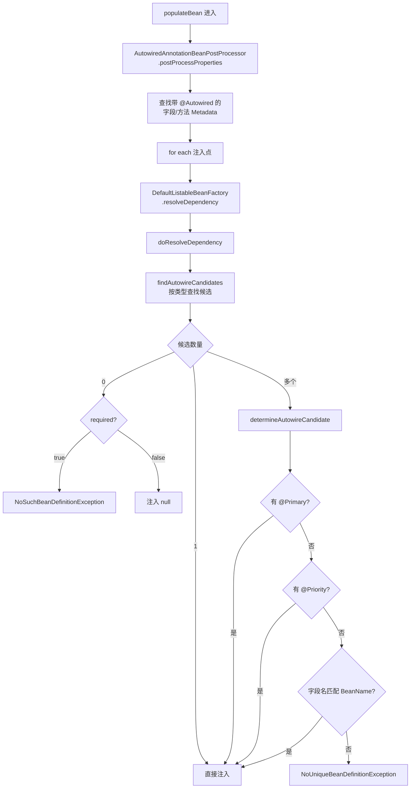

### 3.3 多候选 Bean 的解析顺序

```
按类型找到 N 个候选
    ↓
1. 是否有 @Primary?  → 选中
    ↓ 没有
2. 是否有 @Priority(数字小的优先)? → 选中
    ↓ 没有
3. 字段名 / 参数名 == BeanName? → 选中
    ↓ 都没有
NoUniqueBeanDefinitionException
```

### 3.4 关键源码

```java
// DefaultListableBeanFactory#determineAutowireCandidate
protected String determineAutowireCandidate(Map<String, Object> candidates,
                                            DependencyDescriptor descriptor) {
    Class<?> requiredType = descriptor.getDependencyType();
    String primaryCandidate = determinePrimaryCandidate(candidates, requiredType);
    if (primaryCandidate != null) return primaryCandidate;

    String priorityCandidate = determineHighestPriorityCandidate(candidates, requiredType);
    if (priorityCandidate != null) return priorityCandidate;

    // 字段/参数名匹配
    for (Map.Entry<String, Object> entry : candidates.entrySet()) {
        String candidateName = entry.getKey();
        if (matchesBeanName(candidateName, descriptor.getDependencyName())) {
            return candidateName;
        }
    }
    return null;  // 调用方抛 NoUniqueBeanDefinitionException
}
```

### 3.5 @Autowired vs @Resource vs @Inject

| 对比项 | `@Autowired` | `@Resource` | `@Inject` |
|--------|------------|-------------|-----------|
| 来源 | Spring | JSR-250 (Jakarta) | JSR-330 |
| 默认匹配 | byType | byName | byType |
| 指定名称 | `@Qualifier("x")` | `name="x"` | `@Named("x")` |
| 必需性 | `required=false` | 不支持 | 不支持 |
| 构造器支持 | ✅ | ❌ | ✅ |
| 处理器 | `AutowiredAnnotationBeanPostProcessor` | `CommonAnnotationBeanPostProcessor` | `AutowiredAnnotationBeanPostProcessor` |

### 3.6 面试官追问

**Q1: 为什么官方推荐构造器注入?**
> ① 字段可以 `final`,线程安全;② 强制声明必须依赖,避免空指针;③ 没 Spring 也能 new 出来,易于测试;④ **构造器循环依赖会立刻报错**,提前暴露设计问题(setter 注入会被三级缓存悄悄"解决")。

**Q2: @Autowired 标在 Map<String,XxxService> 上会发生什么?**
> Spring 会注入容器中**所有该类型的 Bean**,key 是 BeanName,value 是 Bean 实例。同样的还有 `List<XxxService>`(注入所有实例)、`Optional<XxxService>`(可选)、`ObjectProvider<XxxService>`(延迟取)。

---

## 4. 循环依赖与三级缓存

### 4.1 什么是循环依赖

```
A → B → A    (双方互相依赖,setter 注入)
A → B → C → A   (三角环)
A → A         (自引用)
```

### 4.2 三级缓存数据结构

```java
// DefaultSingletonBeanRegistry
/** 一级缓存:完整 Bean */
private final Map<String, Object> singletonObjects = new ConcurrentHashMap<>(256);

/** 二级缓存:早期 Bean (可能是代理) */
private final Map<String, Object> earlySingletonObjects = new ConcurrentHashMap<>(16);

/** 三级缓存:ObjectFactory 工厂 */
private final Map<String, ObjectFactory<?>> singletonFactories = new HashMap<>(16);

/** 正在创建中的 Bean 名称 */
private final Set<String> singletonsCurrentlyInCreation =
        Collections.newSetFromMap(new ConcurrentHashMap<>(16));
```

### 4.3 三级缓存协作流程

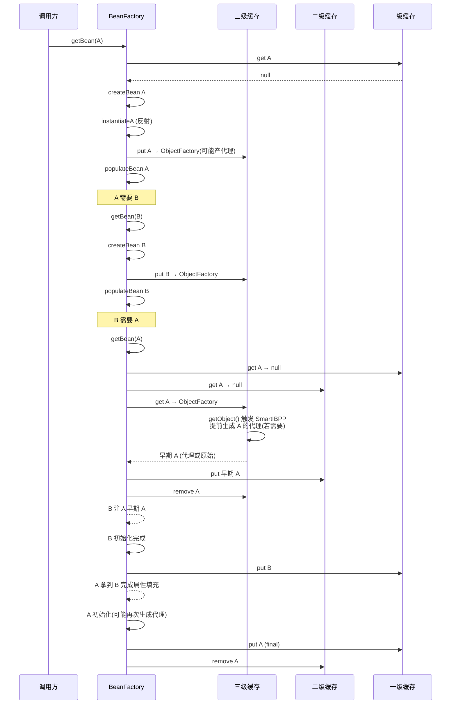

### 4.4 三级缓存的核心源码

```java
// 查询入口
protected Object getSingleton(String beanName, boolean allowEarlyReference) {
    Object singletonObject = this.singletonObjects.get(beanName);            // 一级
    if (singletonObject == null && isSingletonCurrentlyInCreation(beanName)) {
        singletonObject = this.earlySingletonObjects.get(beanName);          // 二级
        if (singletonObject == null && allowEarlyReference) {
            synchronized (this.singletonObjects) {
                singletonObject = this.singletonObjects.get(beanName);
                if (singletonObject == null) {
                    singletonObject = this.earlySingletonObjects.get(beanName);
                    if (singletonObject == null) {
                        ObjectFactory<?> singletonFactory =
                                this.singletonFactories.get(beanName);       // 三级
                        if (singletonFactory != null) {
                            singletonObject = singletonFactory.getObject();
                            this.earlySingletonObjects.put(beanName, singletonObject);
                            this.singletonFactories.remove(beanName);        // 三级降到二级
                        }
                    }
                }
            }
        }
    }
    return singletonObject;
}
```

### 4.5 灵魂追问:为什么需要三级而不是二级?

如果只有二级缓存,Spring 必须**在实例化之后立刻**决定要不要做 AOP 代理,然后把代理对象放进二级缓存。这违反了 Spring 的核心原则:**AOP 代理在初始化后(`postProcessAfterInitialization`)才创建**。

三级缓存的 `ObjectFactory` 是个**懒计算**:
- **没有循环依赖**:整个生命周期它都不会被触发,代理还是按正常顺序在初始化后创建
- **有循环依赖**:当别的 Bean 需要时,**才**调用 `getEarlyBeanReference`,提前生成代理(并标记 `earlyProxyReferences`),后续初始化阶段检测到已经有代理了,就跳过重复生成

```java
// AbstractAutoProxyCreator
@Override
public Object getEarlyBeanReference(Object bean, String beanName) {
    Object cacheKey = getCacheKey(bean.getClass(), beanName);
    this.earlyProxyReferences.put(cacheKey, bean);  // 标记
    return wrapIfNecessary(bean, beanName, cacheKey);
}

@Override
public Object postProcessAfterInitialization(Object bean, String beanName) {
    Object cacheKey = getCacheKey(bean.getClass(), beanName);
    if (this.earlyProxyReferences.remove(cacheKey) != bean) {
        return wrapIfNecessary(bean, beanName, cacheKey);  // 没循环依赖时走这里
    }
    return bean;  // 有循环依赖,代理已提前生成,直接返回
}
```

### 4.6 无法解决的循环依赖

| 场景 | 原因 | 解决 |
|------|------|------|
| 构造器循环依赖 | 实例化时就需要参数,无法 addSingletonFactory | 改 setter 注入 / `@Lazy` |
| prototype 循环依赖 | 不缓存,每次新建 | 改单例 |
| `@Async` 循环依赖 | `AsyncAnnotationBeanPostProcessor` 在初始化后**新建**代理,与早期暴露引用不一致,Spring 检测到不一致抛异常 | 注入接口 + `@Lazy` |
| 多例 + AOP | 同 prototype | 同上 |

### 4.7 面试官追问

**Q1: 不开 `allowCircularReferences` 会怎样?**
> Spring 6 / Boot 2.6+ 默认 `spring.main.allow-circular-references=false`,检测到循环依赖直接抛 `BeanCurrentlyInCreationException`。社区认为循环依赖是设计味,应该重构而不是依赖框架兜底。

**Q2: 为什么 @Async 会破坏循环依赖,但普通 AOP 不会?**
> 普通 AOP 由 `AbstractAutoProxyCreator` 处理,实现了 `SmartInstantiationAwareBeanPostProcessor#getEarlyBeanReference`,可以**提前**在三级缓存触发时生成代理。`@Async` 由 `AsyncAnnotationBeanPostProcessor` 处理(不是 SmartIBPP),只在 `postProcessAfterInitialization` 才生成代理,而那时早期引用已经被注入到别处了,Spring 检测不一致就抛异常。

---

## 5. 构造方法推断

### 5.1 推断规则全表

| 构造方法情形 | 是否有 @Autowired | 是否有无参 | 推断结果 |
|------------|------------------|----------|---------|
| 1 个无参 | - | ✅ | 用无参 |
| 1 个有参 | 否 | ❌ | **直接用有参**(参数从容器注入) |
| 1 个有参 | 是 | ❌ | 用该有参 |
| 多个,1 个 `@Autowired(required=true)` | ✅ | - | 用标注的 |
| 多个,多个 `@Autowired(required=true)` | ✅✅ | - | **抛异常** |
| 多个,多个 `@Autowired(required=false)` | 多 | - | 选参数最多且能全部解析的 |
| 多个,无 `@Autowired` | ❌ | ✅ | 用无参 |
| 多个,无 `@Autowired` | ❌ | ❌ | **抛异常**,无法决断 |

### 5.2 关键源码入口

```java
// AutowiredAnnotationBeanPostProcessor#determineCandidateConstructors
public Constructor<?>[] determineCandidateConstructors(Class<?> beanClass, String beanName) {
    Constructor<?>[] rawCandidates = beanClass.getDeclaredConstructors();
    List<Constructor<?>> candidates = new ArrayList<>(rawCandidates.length);
    Constructor<?> requiredConstructor = null;
    Constructor<?> defaultConstructor = null;

    for (Constructor<?> candidate : rawCandidates) {
        AnnotationAttributes ann = findAutowiredAnnotation(candidate);
        if (ann != null) {
            if (requiredConstructor != null) {
                throw new BeanCreationException("...多个 @Autowired 必需构造方法...");
            }
            boolean required = determineRequiredStatus(ann);
            if (required) {
                if (!candidates.isEmpty()) {
                    throw new BeanCreationException("...");
                }
                requiredConstructor = candidate;
            }
            candidates.add(candidate);
        } else if (candidate.getParameterCount() == 0) {
            defaultConstructor = candidate;
        }
    }
    // ...省略选择逻辑
}
```

### 5.3 面试官追问

**Q1: 一个类只有一个有参构造,没标 @Autowired,Spring 能注入吗?**
> 能。Spring 4.3 起对"唯一有参构造"做了默认推断,直接当作隐式 `@Autowired`,从容器解析参数注入。

**Q2: Lombok 的 `@RequiredArgsConstructor` 和构造器注入怎么配合?**
> Lombok 在编译期生成一个包含所有 `final` 字段的构造方法,Spring 看到唯一有参构造,自动按上面规则注入。这就是构造器注入的优雅写法。


---

# 第二部分 · Spring 切面与事务

## 6. Spring AOP 原理

### 6.1 核心概念速记

| 概念 | 通俗解释 | 代码体现 |
|------|---------|---------|
| Aspect 切面 | 一个横切关注点的整体封装 | `@Aspect class LogAspect{}` |
| JoinPoint 连接点 | 程序执行中的一个点(方法调用) | `ProceedingJoinPoint pjp` |
| Pointcut 切点 | 匹配规则,决定哪些 JoinPoint 被增强 | `@Pointcut("execution(* com..*Service.*(..))")` |
| Advice 通知 | 增强逻辑(Before/After/Around/...) | `@Around` 方法体 |
| Advisor | Pointcut + Advice 的组合 | `DefaultPointcutAdvisor` |
| Weaving 织入 | 把 Advice 应用到目标对象生成代理的过程 | runtime 代理 / AspectJ 编译期 |
| Target 目标对象 | 被代理的原始对象 | `target` |
| Proxy 代理对象 | 包装后的对象 | JDK Proxy / CGLIB Subclass |

### 6.2 5 种 Advice 执行顺序

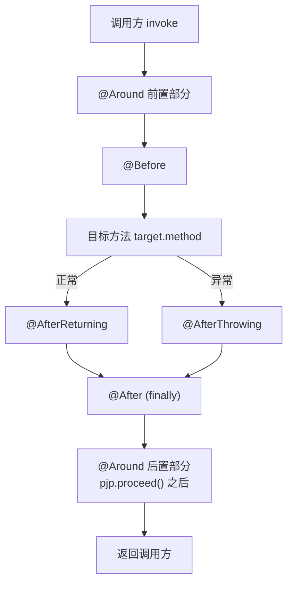

**记忆口诀**:`Around 包 Before 包 目标方法 包 AfterReturning/AfterThrowing 包 After 包 Around 收尾`。
等价于"洋葱模型":`@Around` 是最外层皮,`@After` 是 try-finally 必执行。

### 6.3 多个切面的执行顺序(洋葱模型)

```
切面 A @Order(1)
  ┌─────────────────────────┐
  │ A.@Before               │
  │   切面 B @Order(2)        │
  │   ┌───────────────────┐ │
  │   │ B.@Before         │ │
  │   │   target.method() │ │
  │   │ B.@AfterReturning │ │
  │   │ B.@After          │ │
  │   └───────────────────┘ │
  │ A.@AfterReturning       │
  │ A.@After                │
  └─────────────────────────┘
```

**口径**:`@Order` 数字**越小,优先级越高**,前置越靠外,后置越靠内(LIFO)。

### 6.4 JDK 代理 vs CGLIB

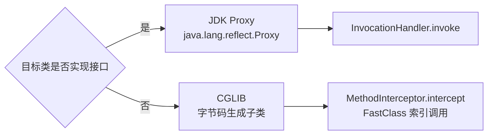

| 维度 | JDK 代理 | CGLIB 代理 |
|------|---------|-----------|
| 实现原理 | 实现接口 + 反射 | 继承类 + 字节码增强 |
| 要求 | 必须有接口 | 类不能 `final`,方法不能 `final` / `private` |
| 创建速度 | 快 | 较慢(字节码生成) |
| 调用速度 | 反射较慢 | FastClass 索引调用,接近原生 |
| Spring Boot 默认 | 否 | **是**(2.x 起) |
| 调试友好 | 一般 | 字节码可能干扰 |

**Spring Boot 为何默认 CGLIB?**
> 历史教训:JDK 代理只能注入接口类型,容易写出 `@Autowired UserServiceImpl` 而抛 `BeanNotOfRequiredTypeException`。CGLIB 兼容性更好,缺省以减少踩坑。可通过 `spring.aop.proxy-target-class=false` 切回 JDK。

### 6.5 AOP 启动到代理生成的全链路

```mermaid
flowchart TD
    A["@EnableAspectJAutoProxy"] --> B[AspectJAutoProxyRegistrar<br/>@Import]
    B --> C[注册 BeanDefinition:<br/>AnnotationAwareAspectJAutoProxyCreator]
    C --> D[refresh 第6步<br/>registerBeanPostProcessors]
    D --> E[每个 Bean 创建时触发]
    E --> F[postProcessAfterInitialization]
    F --> G[wrapIfNecessary]
    G --> H[getAdvicesAndAdvisorsForBean<br/>找匹配的 Advisor]
    H --> I{有 Advisor?}
    I -->|无| J[返回原 Bean]
    I -->|有| K[ProxyFactory.getProxy]
    K --> L{是否需 CGLIB?}
    L -->|是| M[ObjenesisCglibAopProxy]
    L -->|否| N[JdkDynamicAopProxy]
    M --> O[(代理对象)]
    N --> O
```

### 6.6 关键源码

```java
// AbstractAutoProxyCreator
@Override
public Object postProcessAfterInitialization(Object bean, String beanName) {
    if (bean != null) {
        Object cacheKey = getCacheKey(bean.getClass(), beanName);
        if (this.earlyProxyReferences.remove(cacheKey) != bean) {
            return wrapIfNecessary(bean, beanName, cacheKey);
        }
    }
    return bean;
}

protected Object wrapIfNecessary(Object bean, String beanName, Object cacheKey) {
    if (this.advisedBeans.containsKey(cacheKey) && Boolean.FALSE.equals(this.advisedBeans.get(cacheKey))) {
        return bean;
    }
    if (isInfrastructureClass(bean.getClass()) || shouldSkip(bean.getClass(), beanName)) {
        this.advisedBeans.put(cacheKey, Boolean.FALSE);
        return bean;
    }

    // 找匹配的 Advisor
    Object[] specificInterceptors = getAdvicesAndAdvisorsForBean(bean.getClass(), beanName, null);
    if (specificInterceptors != DO_NOT_PROXY) {
        this.advisedBeans.put(cacheKey, Boolean.TRUE);
        Object proxy = createProxy(bean.getClass(), beanName, specificInterceptors,
                new SingletonTargetSource(bean));
        this.proxyTypes.put(cacheKey, proxy.getClass());
        return proxy;
    }
    this.advisedBeans.put(cacheKey, Boolean.FALSE);
    return bean;
}

// ProxyFactory#createAopProxy
public AopProxy createAopProxy(AdvisedSupport config) {
    if (!NativeDetector.inNativeImage() &&
            (config.isOptimize() || config.isProxyTargetClass() || hasNoUserSuppliedProxyInterfaces(config))) {
        Class<?> targetClass = config.getTargetClass();
        if (targetClass.isInterface() || Proxy.isProxyClass(targetClass)) {
            return new JdkDynamicAopProxy(config);
        }
        return new ObjenesisCglibAopProxy(config);  // CGLIB
    }
    return new JdkDynamicAopProxy(config);          // JDK
}
```

### 6.7 责任链与 MethodInterceptor

Advisor 在执行时会被转成 `MethodInterceptor` 链,通过 `ReflectiveMethodInvocation#proceed()` 递归调用,这就是 `@Around` 中 `pjp.proceed()` 的本质:

```java
// ReflectiveMethodInvocation#proceed
public Object proceed() throws Throwable {
    if (this.currentInterceptorIndex == this.interceptorsAndDynamicMethodMatchers.size() - 1) {
        return invokeJoinpoint();  // 最后一环,调用目标方法
    }
    Object interceptorOrInterceptionAdvice =
            this.interceptorsAndDynamicMethodMatchers.get(++this.currentInterceptorIndex);
    return ((MethodInterceptor) interceptorOrInterceptionAdvice).invoke(this);
}
```

### 6.8 自调用失效的本质

```java
@Service
public class UserService {
    @Transactional
    public void a() { b(); }      // ❌ this.b(),走原对象,@Transactional 失效

    @Transactional(propagation = REQUIRES_NEW)
    public void b() { /*...*/ }
}
```

**原因**:`a()` 内部 `b()` 实际是 `this.b()`,而 `this` 是原始对象(target),不是代理。代理逻辑只在**外部入口**生效。

**解决方案**:
1. **注入自身**:`@Autowired UserService self; self.b();`(本质让调用走代理)
2. **暴露代理**:`@EnableAspectJAutoProxy(exposeProxy=true)` + `((UserService)AopContext.currentProxy()).b()`
3. **拆分到不同类**:把 `b()` 移到 `UserServiceB` 中互调

### 6.9 面试官追问

**Q1: AOP 用的是什么设计模式?**
> 代理模式 + 责任链模式。代理模式负责包装,责任链让多个 Advisor 串起来执行;`MethodInterceptor` 是 AOP Alliance 标准接口,Spring 复用了这套规范。

**Q2: AOP 切点表达式 `execution(* com.demo..*Service.*(..))` 都什么意思?**
> `execution` 是表达式类型;第一个 `*` 是返回值任意;`com.demo..` 表示 com.demo 包及其**子包**;`*Service` 是类名以 Service 结尾;`.*` 是任意方法;`(..)` 是参数任意。

**Q3: AspectJ 和 Spring AOP 的区别?**
> Spring AOP 是**运行时代理**(JDK/CGLIB),只能拦截 Spring 容器管理的 Bean 的 public 方法;AspectJ 是**编译期/类加载期**字节码织入,功能强、性能高、能拦截任意调用(包括 new、private),但接入复杂。Spring AOP 借用了 AspectJ 的注解和切点表达式语法,但实现是自己的。

---

## 7. Spring 事务原理

### 7.1 事务 4 大要素

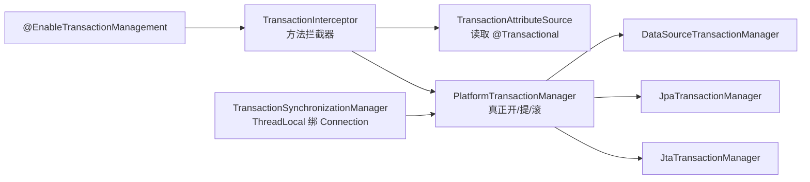

### 7.2 事务执行链路

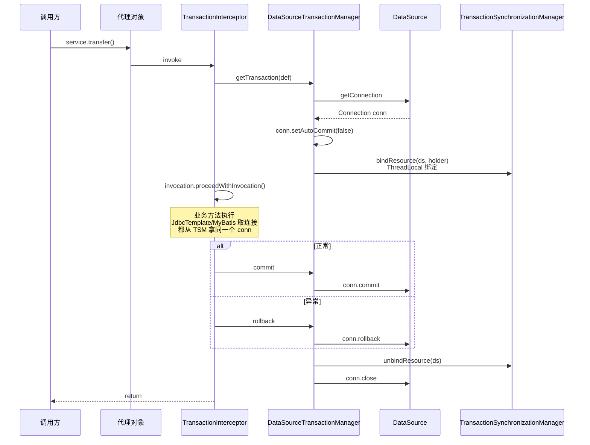

### 7.3 事务 7 种传播行为(完整版)

| 传播行为 | 当前**有**事务 | 当前**无**事务 | 典型用途 |
|---------|-------------|-------------|---------|
| `REQUIRED` (默认) | 加入 | 新建 | 99% 场景 |
| `REQUIRES_NEW` | 挂起当前,新建独立事务 | 新建 | 日志、独立审计 |
| `SUPPORTS` | 加入 | 非事务执行 | 只读查询 |
| `NOT_SUPPORTED` | 挂起,非事务执行 | 非事务执行 | 长耗时操作 |
| `MANDATORY` | 加入 | **抛异常** | 强制事务上下文 |
| `NEVER` | **抛异常** | 非事务执行 | 严格无事务 |
| `NESTED` | 创建 Savepoint | 新建 | 局部回滚 |

### 7.4 REQUIRED vs REQUIRES_NEW vs NESTED 实战对比

```
场景:外层 A 调内层 B,B 抛异常

REQUIRED (同一事务)
    A 开始 → B 加入 → B 异常标记 rollback-only → A 即使 catch 也无法提交,抛 UnexpectedRollbackException

REQUIRES_NEW (独立事务)
    A 开始 → B 挂起 A、开新事务 → B 异常 B 自己回滚 → A 可以 catch 后继续提交

NESTED (Savepoint)
    A 开始 → B 创建 Savepoint → B 异常 → 回滚到 Savepoint → A 可继续,但 A 回滚时 B 也跟着回
```

### 7.5 ThreadLocal 与连接绑定

```java
// TransactionSynchronizationManager
private static final ThreadLocal<Map<Object, Object>> resources =
        new NamedThreadLocal<>("Transactional resources");

public static Object getResource(Object key) {
    Map<Object, Object> map = resources.get();
    return (map != null) ? map.get(key) : null;
}

// DataSourceUtils#getConnection (MyBatis、JdbcTemplate 都通过它取连接)
public static Connection getConnection(DataSource dataSource) {
    ConnectionHolder conHolder = (ConnectionHolder)
            TransactionSynchronizationManager.getResource(dataSource);
    if (conHolder != null && (conHolder.hasConnection() || conHolder.isSynchronizedWithTransaction())) {
        conHolder.requested();
        return conHolder.getConnection();   // 复用同一连接
    }
    Connection con = fetchConnection(dataSource);
    // ...绑定到 TSM
    return con;
}
```

**结论**:同一线程内,所有 DAO 操作共享同一个 `Connection`,这是事务一致性的物理基础。**异步/手动新线程会丢失绑定**,事务自然失效。

### 7.6 隔离级别与脏读、不可重复读、幻读

| 隔离级别 | 脏读 | 不可重复读 | 幻读 |
|---------|------|---------|------|
| `READ_UNCOMMITTED` | ✓ | ✓ | ✓ |
| `READ_COMMITTED` (Oracle 默认) | ✗ | ✓ | ✓ |
| `REPEATABLE_READ` (MySQL 默认) | ✗ | ✗ | ✓(InnoDB MVCC + 间隙锁规避) |
| `SERIALIZABLE` | ✗ | ✗ | ✗ |
| `DEFAULT` | 跟随数据库 | - | - |

> Spring 的 `@Transactional(isolation = ...)` 仅向数据库下达隔离指令,真正实现靠数据库引擎。

### 7.7 `@Transactional` 关键属性

```java
@Transactional(
    propagation = Propagation.REQUIRED,
    isolation = Isolation.READ_COMMITTED,
    timeout = 30,                              // 秒
    readOnly = false,                          // 提示数据库走只读优化
    rollbackFor = Exception.class,             // 默认只回滚 RuntimeException + Error
    noRollbackFor = BusinessKnownException.class
)
```

**rollbackFor 经典坑**:`@Transactional` 默认**不**回滚 `Exception`(受检异常)。需要显式 `rollbackFor = Exception.class` 或抛 `RuntimeException`。

---

## 8. 事务失效场景大全

| # | 失效场景 | 根本原因 | 修复 |
|---|---------|---------|------|
| 1 | 方法是 `private` / `final` / `static` | 代理无法织入 | 改 `public` 非 final 实例方法 |
| 2 | 同类内自调用 | this 不是代理 | 注入自身 / `AopContext.currentProxy()` |
| 3 | 异常被 `catch` 吞掉 | 没抛出,事务感知不到 | 重新 throw 或 `setRollbackOnly()` |
| 4 | 抛了受检异常 | 默认只回滚 RE | `rollbackFor = Exception.class` |
| 5 | 类没被 Spring 管理 | 不是 Bean,没代理 | `@Service` / `@Component` |
| 6 | 多线程切换(`@Async`、新建线程) | ThreadLocal 不跨线程 | 各自独立事务 / 编程式 |
| 7 | 数据库引擎不支持 | 如 MyISAM 不支持事务 | 改 InnoDB |
| 8 | 传播行为错配 | NEVER/NOT_SUPPORTED | 检查传播配置 |
| 9 | `@Transactional` 写在接口上,代理是 CGLIB | CGLIB 看不到接口注解(早期) | 写在实现类上 |
| 10 | 事务方法执行前抛异常(参数校验等) | 还没进事务边界 | 校验放方法内 |

### 面试官追问

**Q: 为什么 try-catch 后事务还是回滚?**
> 一个事务内,只要任何一个方法 `setRollbackOnly()`,整个事务就标记回滚,即使外层 catch 也无法 commit,抛 `UnexpectedRollbackException`。这就是 `REQUIRED` 传播下"内层异常导致外层 catch 失败"的真正原因。

**Q: @Transactional 加在接口方法上有效吗?**
> 在 JDK 代理下有效;CGLIB 代理下,Spring 5 后也有效(实际上 Spring 在 4.1.7 之后已经支持识别接口注解)。但**最佳实践**仍是写在实现类上,既不依赖代理类型,也更直观。

**Q: readOnly=true 真的会让事务只读吗?**
> 不一定。它向数据库提示"这是只读事务",数据库可能优化(如 MySQL 跳过 redo log);但 Spring 自身不会强制阻止写操作。在主从架构下可以配合 `AbstractRoutingDataSource` 路由到从库。


---

# 第三部分 · SpringMVC

## 9. DispatcherServlet 请求处理流程

### 9.1 请求生命周期总览

```mermaid
flowchart TD
    A[HTTP 请求] --> B[DispatcherServlet.doService]
    B --> C[doDispatch]
    C --> D[1.getHandler<br/>遍历 HandlerMapping]
    D --> E[HandlerExecutionChain<br/>= Handler + Interceptor 链]
    E --> F[2.getHandlerAdapter<br/>找到能处理它的适配器]
    F --> G[3.preHandle 拦截器链]
    G -->|return false| Z[直接结束]
    G -->|return true| H[4.ha.handle<br/>执行 Controller]
    H --> H1[参数解析<br/>HandlerMethodArgumentResolver]
    H1 --> H2[反射调用 Controller 方法]
    H2 --> H3[返回值处理<br/>HandlerMethodReturnValueHandler]
    H3 --> I[5.postHandle 拦截器链 逆序]
    I --> J[6.processDispatchResult]
    J --> K{有 ModelAndView?}
    K -->|是| L[ViewResolver 解析视图]
    L --> M[View.render]
    K -->|否,@ResponseBody| N[已写入 response]
    M --> O[7.afterCompletion 拦截器链 逆序]
    N --> O
    O --> P[响应完成]
```

### 9.2 核心组件清单

| 组件 | 职责 | 默认实现 |
|------|------|---------|
| `DispatcherServlet` | 前端控制器,总入口 | - |
| `HandlerMapping` | URL → Handler 映射 | `RequestMappingHandlerMapping` |
| `HandlerAdapter` | 适配不同类型 Handler | `RequestMappingHandlerAdapter` |
| `HandlerInterceptor` | 拦截器 | 用户自定义 |
| `HandlerMethodArgumentResolver` | 参数解析 | `RequestParamMethodArgumentResolver` 等 26 个 |
| `HandlerMethodReturnValueHandler` | 返回值处理 | `RequestResponseBodyMethodProcessor` 等 15 个 |
| `HttpMessageConverter` | HTTP body ↔ 对象 | `MappingJackson2HttpMessageConverter` |
| `ViewResolver` | 视图名 → View | `InternalResourceViewResolver` |
| `HandlerExceptionResolver` | 异常处理 | `ExceptionHandlerExceptionResolver` |

### 9.3 doDispatch 关键源码

```java
protected void doDispatch(HttpServletRequest request, HttpServletResponse response) throws Exception {
    HttpServletRequest processedRequest = request;
    HandlerExecutionChain mappedHandler = null;
    ModelAndView mv = null;
    Exception dispatchException = null;

    try {
        // 1. 找 Handler
        mappedHandler = getHandler(processedRequest);
        if (mappedHandler == null) { noHandlerFound(processedRequest, response); return; }

        // 2. 找 HandlerAdapter
        HandlerAdapter ha = getHandlerAdapter(mappedHandler.getHandler());

        // 3. preHandle (返回 false 直接 return)
        if (!mappedHandler.applyPreHandle(processedRequest, response)) return;

        // 4. 执行 Handler (含参数解析 + 反射调用 + 返回值处理)
        mv = ha.handle(processedRequest, response, mappedHandler.getHandler());

        applyDefaultViewName(processedRequest, mv);

        // 5. postHandle
        mappedHandler.applyPostHandle(processedRequest, response, mv);
    } catch (Exception ex) {
        dispatchException = ex;
    }

    // 6. 处理结果(含异常解析 + 视图渲染 + afterCompletion)
    processDispatchResult(processedRequest, response, mappedHandler, mv, dispatchException);
}
```

### 9.4 HandlerMapping 实现

| 实现 | 用途 |
|------|------|
| `RequestMappingHandlerMapping` | 解析 `@RequestMapping` 注解,**最常用** |
| `BeanNameUrlHandlerMapping` | BeanName 以 `/` 开头作 URL |
| `SimpleUrlHandlerMapping` | 静态资源映射 |
| `RouterFunctionMapping` | WebFlux 函数式路由 |
| `WelcomePageHandlerMapping` | 首页 |

`RequestMappingHandlerMapping` 在容器启动时(`afterPropertiesSet` → `initHandlerMethods`)扫描所有 Bean,提取 `@RequestMapping` 方法,注册到 `MappingRegistry`(本质是 `Map<RequestMappingInfo, HandlerMethod>`)。

```java
// AbstractHandlerMethodMapping#processCandidateBean
protected void processCandidateBean(String beanName) {
    Class<?> beanType = obtainApplicationContext().getType(beanName);
    if (beanType != null && isHandler(beanType)) {     // @Controller / @RequestMapping
        detectHandlerMethods(beanName);                // 扫描方法注册映射
    }
}
```

---

## 10. 参数解析与返回值处理

### 10.1 参数解析器责任链

`HandlerMethodArgumentResolverComposite` 持有一个 `List<HandlerMethodArgumentResolver>`,对每个方法参数遍历询问 `supportsParameter`,第一个返回 true 的负责解析。

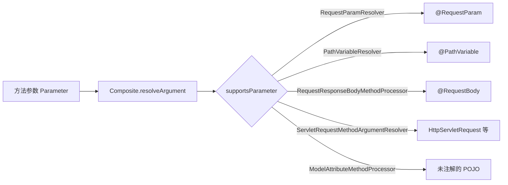

### 10.2 @RequestBody 反序列化链路

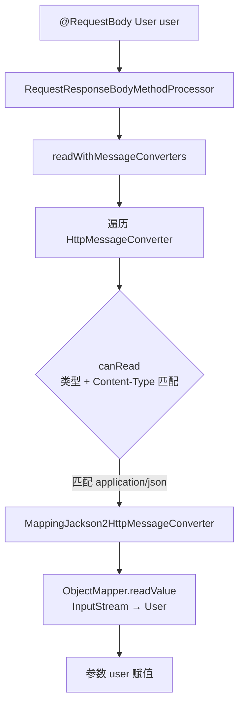

**支持的 Converter 顺序**(默认):
1. `ByteArrayHttpMessageConverter` — `byte[]`
2. `StringHttpMessageConverter` — `String`,默认 ISO-8859-1
3. `ResourceHttpMessageConverter` — `Resource`
4. `SourceHttpMessageConverter` — XML Source
5. `AllEncompassingFormHttpMessageConverter` — 表单
6. `MappingJackson2HttpMessageConverter` — JSON

### 10.3 返回值处理器

| 处理器 | 触发条件 |
|--------|---------|
| `RequestResponseBodyMethodProcessor` | `@ResponseBody` / `@RestController` |
| `ModelAndViewMethodReturnValueHandler` | 返回 `ModelAndView` |
| `ViewNameMethodReturnValueHandler` | 返回 String(视图名) |
| `HttpEntityMethodProcessor` | 返回 `ResponseEntity` |
| `DeferredResultMethodReturnValueHandler` | 异步 `DeferredResult` |
| `CallableMethodReturnValueHandler` | 异步 `Callable` |

### 10.4 自定义参数解析器示例

```java
// 1. 注解
@Target(PARAMETER) @Retention(RUNTIME)
public @interface CurrentUser {}

// 2. 解析器
public class CurrentUserResolver implements HandlerMethodArgumentResolver {
    @Override public boolean supportsParameter(MethodParameter p) {
        return p.hasParameterAnnotation(CurrentUser.class);
    }
    @Override public Object resolveArgument(MethodParameter p, ModelAndViewContainer mc,
                                            NativeWebRequest req, WebDataBinderFactory bf) {
        String token = req.getHeader("Authorization");
        return userService.parseFromToken(token);
    }
}

// 3. 注册
@Configuration
class WebConfig implements WebMvcConfigurer {
    @Override public void addArgumentResolvers(List<HandlerMethodArgumentResolver> resolvers) {
        resolvers.add(new CurrentUserResolver());
    }
}

// 4. 使用
@GetMapping("/me")
public User me(@CurrentUser User u) { return u; }
```

---

## 11. 拦截器、异常处理、跨域

### 11.1 拦截器执行顺序(三阶段)

```
拦截器列表 [I1, I2, I3]

preHandle:        I1 → I2 → I3              (顺序)
Controller:                  ↓
postHandle:        I3 ← I2 ← I1              (逆序,仅成功)
View 渲染:                  ↓
afterCompletion:   I3 ← I2 ← I1              (逆序,无论是否异常)
```

**关键规则**:
- `preHandle` 任一返回 `false`,**后续 preHandle 和 Controller 都不执行**,但**已执行成功**的 preHandle 对应的 `afterCompletion` 仍会被调用(逆序)
- `postHandle` 仅在 Controller **正常返回**且 `preHandle` 全部通过时执行
- `afterCompletion` 永远在最后执行(像 try-finally),适合资源清理

### 11.2 拦截器 vs 过滤器 vs AOP

| 维度 | Filter | Interceptor | AOP |
|------|--------|------------|-----|
| 规范 | Servlet | SpringMVC | Spring |
| 作用范围 | 所有请求(含静态) | 进入 DispatcherServlet 之后 | Spring 管理的 Bean 方法 |
| 能否拿到 Handler 信息 | ❌ | ✅ | ✅(精确到方法) |
| 能否操作 Request/Response | ✅ | ✅ | ❌(参数级) |
| 启用方式 | `@WebFilter` / `FilterRegistrationBean` | 实现 `HandlerInterceptor` 注册 | `@Aspect` |
| 顺序控制 | `@Order` | `addInterceptor().order(...)` | `@Order` |

```
请求 → Filter → DispatcherServlet → Interceptor.preHandle → AOP前置 →
       Controller → AOP后置 → Interceptor.postHandle → 渲染 →
       Interceptor.afterCompletion → Filter 收尾 → 响应
```

### 11.3 全局异常处理

```java
@RestControllerAdvice
public class GlobalExceptionHandler {

    @ExceptionHandler(BusinessException.class)
    public ResponseEntity<ApiError> handleBiz(BusinessException ex) {
        return ResponseEntity.status(400).body(ApiError.of(ex.getCode(), ex.getMessage()));
    }

    @ExceptionHandler(MethodArgumentNotValidException.class)
    public ApiError handleValidation(MethodArgumentNotValidException ex) {
        String msg = ex.getBindingResult().getFieldErrors().stream()
                .map(f -> f.getField() + ":" + f.getDefaultMessage())
                .collect(Collectors.joining(";"));
        return ApiError.of(400, msg);
    }

    @ExceptionHandler(Throwable.class)
    public ApiError handleAll(Throwable ex) {
        log.error("unhandled", ex);
        return ApiError.of(500, "服务器错误");
    }
}
```

**底层原理**:
- `RequestMappingHandlerAdapter` 内部有 `ExceptionHandlerExceptionResolver`
- 它扫描 `@ControllerAdvice` 类,缓存 `Map<Class<? extends Throwable>, ExceptionHandlerMethod>`
- 异常发生时按异常类型最近匹配查找处理方法

### 11.4 异常解析器优先级

`DispatcherServlet` 默认装载三个 `HandlerExceptionResolver`,按顺序询问:

```
1. ExceptionHandlerExceptionResolver  → @ExceptionHandler / @ControllerAdvice
2. ResponseStatusExceptionResolver    → @ResponseStatus 注解
3. DefaultHandlerExceptionResolver    → Spring 内置异常映射(MethodNotAllowed → 405 等)
```

### 11.5 跨域 CORS

```java
@Configuration
class CorsConfig implements WebMvcConfigurer {
    @Override public void addCorsMappings(CorsRegistry r) {
        r.addMapping("/api/**")
         .allowedOriginPatterns("https://*.example.com")
         .allowedMethods("*")
         .allowedHeaders("*")
         .allowCredentials(true)
         .maxAge(3600);
    }
}
```

底层是 `CorsFilter` / `CorsInterceptor` 自动追加 `Access-Control-Allow-*` 响应头,并对 `OPTIONS` 预检请求直接放行。

### 11.6 面试官追问

**Q1: SpringMVC 是单例的吗?线程安全吗?**
> Controller 默认单例。线程安全靠**无成员变量**或使用 `ThreadLocal`。HttpServletRequest 等参数是请求级,Spring 通过参数注入,不会共享。

**Q2: @RestController 和 @Controller 区别?**
> `@RestController = @Controller + @ResponseBody`,所有方法默认走消息转换器返回 JSON,而不是视图名。

**Q3: 文件上传的解析器是什么?**
> `MultipartResolver`。Spring Boot 自动注册 `StandardServletMultipartResolver`(基于 Servlet 3.0)。也可换 `CommonsMultipartResolver`(基于 commons-fileupload)。在 doDispatch 一开始就检查 `isMultipart`,把 request 包装成 `MultipartHttpServletRequest`。


---

# 第四部分 · MyBatis 源码

## 12. SqlSessionFactory 构建过程

### 12.1 启动两阶段

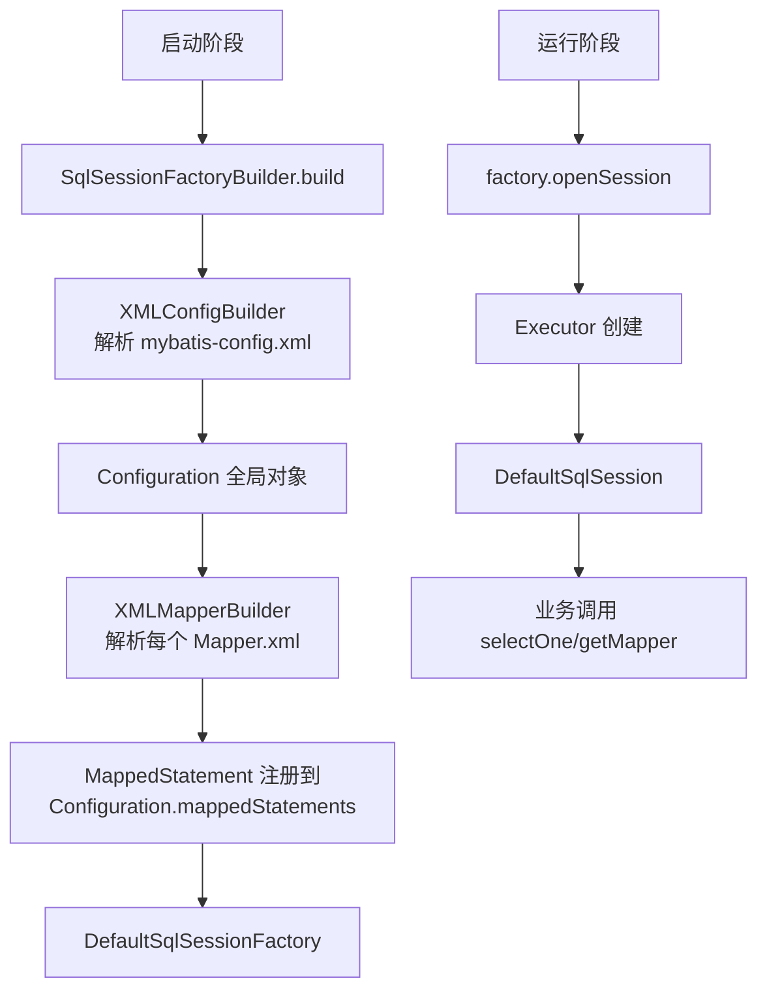

### 12.2 Configuration 是什么

`Configuration` 是 MyBatis 的**单例总配置中心**,在启动期被填满:

```java
public class Configuration {
    protected Environment environment;
    protected boolean cacheEnabled = true;            // 二级缓存全局开关
    protected boolean lazyLoadingEnabled;
    protected ExecutorType defaultExecutorType = ExecutorType.SIMPLE;
    protected LocalCacheScope localCacheScope = LocalCacheScope.SESSION;

    /** 所有 Mapper.xml 中的 SQL 语句 */
    protected final Map<String, MappedStatement> mappedStatements = new StrictMap<>();
    /** Mapper 接口注册中心 */
    protected final MapperRegistry mapperRegistry = new MapperRegistry(this);
    /** 类型处理器(JDBC ↔ Java) */
    protected final TypeHandlerRegistry typeHandlerRegistry = new TypeHandlerRegistry();
    /** 二级缓存对象 */
    protected final Map<String, Cache> caches = new StrictMap<>();
    /** 插件链 */
    protected final InterceptorChain interceptorChain = new InterceptorChain();
}
```

### 12.3 MappedStatement = SQL 元信息容器

每条 `<select>/<insert>/<update>/<delete>` 解析后变成一个 `MappedStatement`:

```java
public final class MappedStatement {
    private String id;                    // namespace.methodName
    private SqlSource sqlSource;          // 动态 SQL 解析后的 SQL 源
    private SqlCommandType sqlCommandType;// SELECT/INSERT/...
    private List<ResultMap> resultMaps;
    private boolean useCache;
    private Cache cache;                  // 二级缓存
    private KeyGenerator keyGenerator;    // 主键策略
    // ...
}
```

### 12.4 与 Spring 集成

`mybatis-spring` 提供:
- `SqlSessionFactoryBean`:在 Spring 容器中产出 `SqlSessionFactory`
- `MapperFactoryBean`:把每个 Mapper 接口注册成 Spring Bean
- `MapperScannerConfigurer` / `@MapperScan`:批量扫描接口生成 BeanDefinition
- `SqlSessionTemplate`:线程安全的 `SqlSession`,通过 Spring 事务同步管理 Session 生命周期


---

## 13. Executor 体系与缓存

### 13.1 Executor 类层次

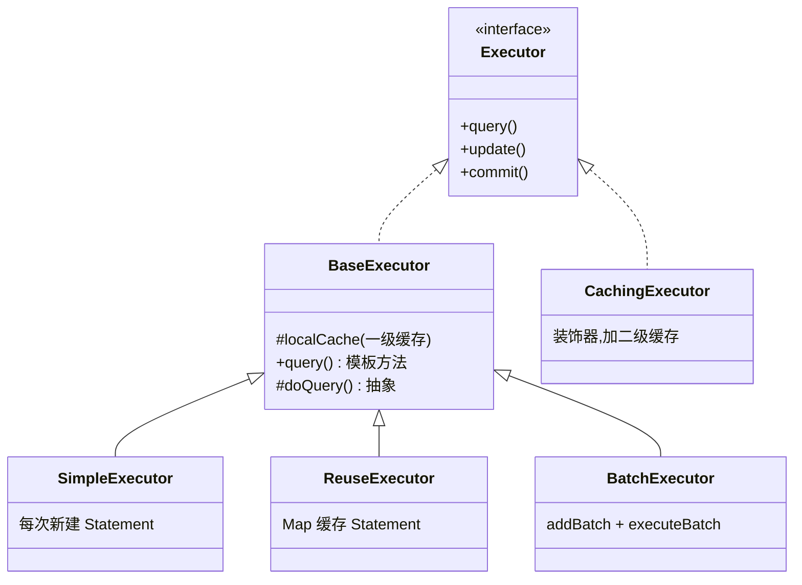

### 13.2 三种 Executor 对比

| Executor | 工作方式 | 适用 |
|----------|---------|-----|
| `SimpleExecutor` (默认) | 每次执行都新建 `PreparedStatement`,执行完关闭 | 普通查询 |
| `ReuseExecutor` | 用 `Map<sql, Statement>` 缓存已编译的 Statement | 同一 Session 内大量重复 SQL |
| `BatchExecutor` | `addBatch` 累积,`executeBatch` 统一执行 | 批量插入/更新 |

切换:`sqlSessionFactory.openSession(ExecutorType.BATCH)` 或全局 `<setting name="defaultExecutorType" value="BATCH"/>`。

### 13.3 一级缓存(LocalCache)

```java
// BaseExecutor#query
public <E> List<E> query(MappedStatement ms, Object parameter, RowBounds rowBounds,
                          ResultHandler resultHandler, CacheKey key, BoundSql boundSql) {
    if (closed) throw new ExecutorException("...");
    if (queryStack == 0 && ms.isFlushCacheRequired()) {
        clearLocalCache();
    }
    List<E> list;
    try {
        queryStack++;
        list = resultHandler == null ? (List<E>) localCache.getObject(key) : null;
        if (list != null) {
            handleLocallyCachedOutputParameters(ms, key, parameter, boundSql);
        } else {
            list = queryFromDatabase(ms, parameter, rowBounds, resultHandler, key, boundSql);
        }
    } finally {
        queryStack--;
    }
    if (queryStack == 0) {
        if (configuration.getLocalCacheScope() == LocalCacheScope.STATEMENT) {
            clearLocalCache();
        }
    }
    return list;
}
```

**特点**:
- 默认开启,`SqlSession` 级别(每个 Session 一份)
- 任何 update/insert/delete 都会 `clearLocalCache()`
- `localCacheScope=STATEMENT` 表示每条语句执行完就清空,等于关闭

### 13.4 CacheKey 构成

```java
CacheKey key = new CacheKey();
key.update(ms.getId());            // com.demo.UserMapper.findById
key.update(rowBounds.getOffset()); // 分页 offset
key.update(rowBounds.getLimit());  // 分页 limit
key.update(boundSql.getSql());     // 最终 SQL(替换 #{} 后)
for (ParameterMapping pm : parameterMappings) {
    key.update(parameterValue);    // 参数值
}
key.update(environment.getId());   // 环境 ID
```

**5 个字段全部一致才命中**,所以"看似一样的查询"只要分页或参数不同就是新查询。

### 13.5 一级缓存失效场景

| 场景 | 原因 |
|------|------|
| 执行了 INSERT/UPDATE/DELETE | `clearLocalCache()` |
| 显式 `sqlSession.clearCache()` | 主动清 |
| 不同 `SqlSession` | 各自独立 LocalCache |
| `flushCache="true"` | 该 Statement 每次清 |
| `localCacheScope=STATEMENT` | 等同关闭 |

### 13.6 二级缓存

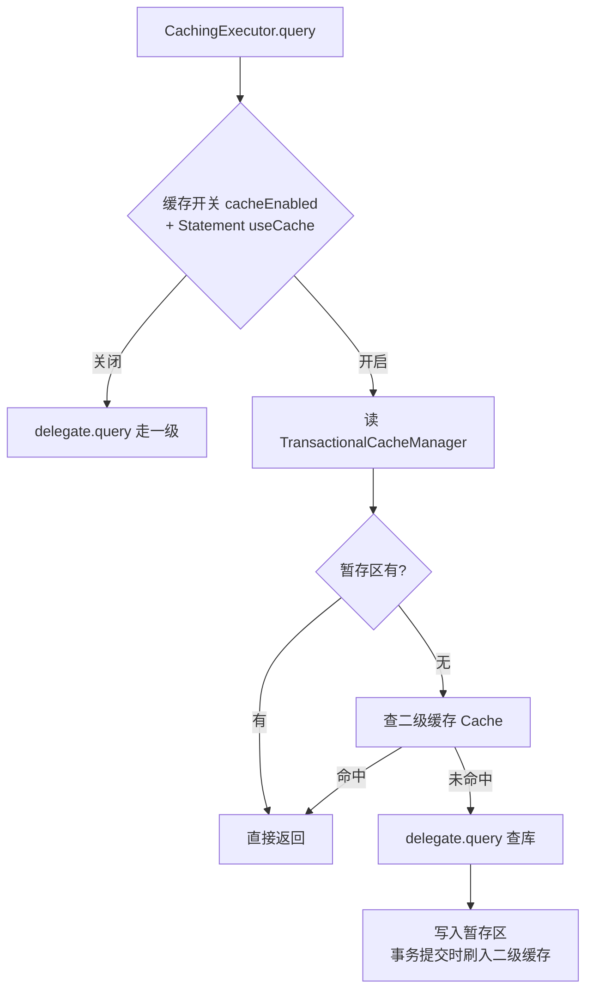

**作用域**:Mapper namespace 级,跨 SqlSession 共享。
**开启方式**:
1. 全局:`<setting name="cacheEnabled" value="true"/>`(默认 true)
2. Mapper:`<cache/>` 或 `@CacheNamespace`
3. Statement:`useCache="true"`(默认 true)

**注意点**:
- 二级缓存的对象**必须实现 `Serializable`**(可能序列化到磁盘/Redis)
- 跨 namespace 查询会有**脏数据**(A namespace 写,B namespace 不知道)
- 与事务结合:更新只有在 commit 后才 flush,避免回滚后缓存污染
- 实战中**少用 MyBatis 二级缓存**,通常用 Redis + Spring Cache 替代

### 13.7 一级 vs 二级 速记表

| 维度 | 一级缓存 | 二级缓存 |
|------|--------|---------|
| 范围 | SqlSession | Mapper Namespace |
| 默认 | 开启 | 开启(全局)+ 需声明 cache |
| 跨 Session | ❌ | ✅ |
| 数据结构 | `PerpetualCache`(HashMap) | 同上,可装饰 LRU/FIFO/Serializable |
| 失效粒度 | Session 内任意写操作 | namespace 内任意写操作 |
| 序列化要求 | 无 | 必须 Serializable |

---

## 14. Mapper 接口动态代理

### 14.1 接口为何能调用?

Mapper 接口**没有实现类**,MyBatis 通过 JDK 动态代理为它生成实现:

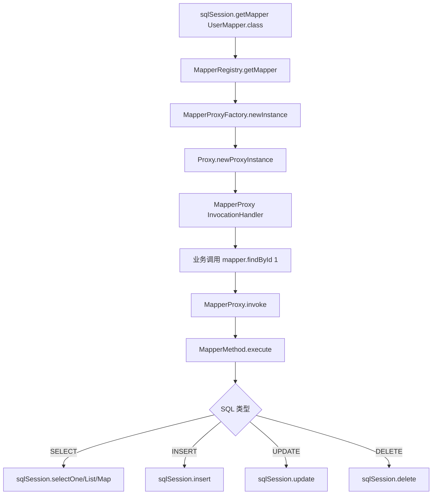

### 14.2 关键源码

```java
// MapperProxyFactory
public T newInstance(SqlSession sqlSession) {
    MapperProxy<T> mapperProxy = new MapperProxy<>(sqlSession, mapperInterface, methodCache);
    return (T) Proxy.newProxyInstance(
        mapperInterface.getClassLoader(),
        new Class[]{mapperInterface},
        mapperProxy);
}

// MapperProxy
public Object invoke(Object proxy, Method method, Object[] args) throws Throwable {
    if (Object.class.equals(method.getDeclaringClass())) {
        return method.invoke(this, args);              // toString/hashCode 等
    }
    return cachedInvoker(method).invoke(proxy, method, args, sqlSession);
}

// MapperMethod
public Object execute(SqlSession sqlSession, Object[] args) {
    Object result;
    switch (command.getType()) {
        case INSERT:
            result = rowCountResult(sqlSession.insert(command.getName(), wrapCollection(args[0])));
            break;
        case SELECT:
            if (method.returnsMany()) {
                result = executeForMany(sqlSession, args);
            } else {
                Object param = method.convertArgsToSqlCommandParam(args);
                result = sqlSession.selectOne(command.getName(), param);
            }
            break;
        // ...
    }
    return result;
}
```

### 14.3 Mapper 接口和 XML 的绑定

| 绑定要素 | 必须一致 |
|---------|---------|
| `<mapper namespace="...">` | = Mapper 接口全限定名 |
| `<select id="findById">` | = 接口方法名 |
| `parameterType` | 接口方法参数(可省略,MyBatis 根据反射推断) |
| `resultType` / `resultMap` | 接口方法返回类型 |

**默认通过反射 + 字节码读取参数名**(JDK8+ 编译时加 `-parameters`),否则需要 `@Param("xxx")`。

### 14.4 #{} vs ${}

| | `#{}` | `${}` |
|---|------|------|
| 占位 | `?` 占位符 | 字符串拼接 |
| 防注入 | ✅ | ❌ |
| 适用 | 参数值 | 表名、列名等动态片段 |
| 例子 | `where id = #{id}` | `order by ${field}` |

---

## 15. 插件机制 (Interceptor)

### 15.1 拦截范围

MyBatis 只允许拦截 4 个核心对象的方法:

| 对象 | 可拦截方法 | 典型用途 |
|------|---------|---------|
| `Executor` | `update/query/commit/rollback/createCacheKey/...` | 通用 AOP、二级缓存代理 |
| `StatementHandler` | `prepare/parameterize/batch/update/query` | SQL 改写、分页 |
| `ParameterHandler` | `setParameters/getParameterObject` | 参数加密 |
| `ResultSetHandler` | `handleResultSets/handleOutputParameters` | 结果脱敏 |

### 15.2 写法

```java
@Intercepts({
    @Signature(type = StatementHandler.class, method = "prepare",
               args = {Connection.class, Integer.class})
})
public class SqlLogInterceptor implements Interceptor {
    @Override public Object intercept(Invocation invocation) throws Throwable {
        StatementHandler handler = (StatementHandler) invocation.getTarget();
        BoundSql boundSql = handler.getBoundSql();
        log.info("SQL = {}", boundSql.getSql());
        return invocation.proceed();        // 放行
    }
    @Override public Object plugin(Object target) {
        return Plugin.wrap(target, this);   // 关键:产生代理
    }
    @Override public void setProperties(Properties p) {}
}
```

### 15.3 责任链怎么构成

每个核心对象在创建时(如 `Configuration#newExecutor`)都会经过插件链:

```java
// Configuration
public Executor newExecutor(Transaction transaction, ExecutorType executorType) {
    Executor executor = ...;  // 创建底层 Executor
    if (cacheEnabled) executor = new CachingExecutor(executor);
    executor = (Executor) interceptorChain.pluginAll(executor);  // 链式包装
    return executor;
}

// InterceptorChain
public Object pluginAll(Object target) {
    for (Interceptor i : interceptors) {
        target = i.plugin(target);   // 多个插件套娃代理
    }
    return target;
}

// Plugin#wrap (默认实现)
public static Object wrap(Object target, Interceptor interceptor) {
    Map<Class<?>, Set<Method>> signatureMap = getSignatureMap(interceptor);
    Class<?> type = target.getClass();
    Class<?>[] interfaces = getAllInterfaces(type, signatureMap);
    return Proxy.newProxyInstance(type.getClassLoader(), interfaces,
            new Plugin(target, interceptor, signatureMap));
}
```

**结论**:每注册一个插件就多一层 JDK 代理。

### 15.4 经典插件:PageHelper 分页原理

1. `@Intercepts` 拦截 `Executor.query`
2. 通过 `ThreadLocal` 读取分页参数(`PageHelper.startPage(1, 10)` 设置)
3. 用 SqlSourceParser 改写原 SQL,套上 `LIMIT` / `ROWNUM`
4. 同时执行一次 `count(*)` 拿总数
5. 把结果包装成 `Page<T>`(继承 `ArrayList`),透明注入

### 15.5 面试官追问

**Q1: MyBatis 插件能拦截 Mapper 接口方法吗?**
> 不能。Mapper 接口的代理是 `MapperProxy`,**不在 4 大对象之列**。要拦截 Mapper 方法只能用 Spring AOP。

**Q2: 多个插件谁先执行?**
> 后注册的先执行(套娃顺序)。`pluginAll` 是循环包装,**最后包的最外层**,所以最后注册的插件最先收到调用。

**Q3: 一级缓存为什么和事务挂钩?**
> 一级缓存是 Session 级,而 Spring 事务里 `SqlSessionTemplate` 在事务期间复用同一个底层 `SqlSession`,所以多次 DAO 调用走同一个 LocalCache。事务结束、Session 关闭,缓存随之清空。


---

# 第五部分 · SpringBoot

## 16. SpringApplication 启动流程

### 16.1 一行 main 背后

```java
public static void main(String[] args) {
    SpringApplication.run(MyApp.class, args);
}
```

这一行做了三件事:**初始化 SpringApplication 实例 → run 启动流程 → 返回 ApplicationContext**。

### 16.2 启动总流程图

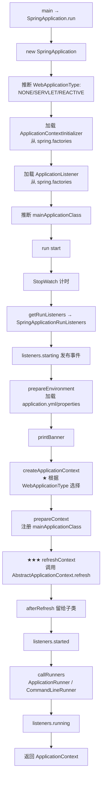

### 16.3 关键源码

```java
public ConfigurableApplicationContext run(String... args) {
    long startTime = System.nanoTime();
    DefaultBootstrapContext bootstrapContext = createBootstrapContext();
    ConfigurableApplicationContext context = null;

    SpringApplicationRunListeners listeners = getRunListeners(args);
    listeners.starting(bootstrapContext, this.mainApplicationClass);

    try {
        ApplicationArguments applicationArguments = new DefaultApplicationArguments(args);
        ConfigurableEnvironment environment = prepareEnvironment(listeners, bootstrapContext, applicationArguments);
        Banner printedBanner = printBanner(environment);

        context = createApplicationContext();             // 见下表
        prepareContext(bootstrapContext, context, environment, listeners, applicationArguments, printedBanner);
        refreshContext(context);                           // 调用 refresh()  ★
        afterRefresh(context, applicationArguments);

        listeners.started(context, timeTakenToStartup);
        callRunners(context, applicationArguments);       // 用户级钩子
    } catch (Throwable ex) {
        handleRunFailure(context, ex, listeners);
        throw new IllegalStateException(ex);
    }

    listeners.running(context);
    return context;
}
```

### 16.4 不同应用类型的 ApplicationContext

| WebApplicationType | ApplicationContext 实现 | 是否启动 Web 服务器 |
|--------------------|----------------------|--------------------|
| `NONE` | `AnnotationConfigApplicationContext` | 否 |
| `SERVLET` (默认) | `AnnotationConfigServletWebServerApplicationContext` | ✅ Tomcat/Jetty/Undertow |
| `REACTIVE` | `AnnotationConfigReactiveWebServerApplicationContext` | ✅ Netty |

**Tomcat 何时启动?**
> `ServletWebServerApplicationContext#onRefresh()`(refresh 第 9 步)中调用 `createWebServer()` → `factory.getWebServer(...)` → `webServer.start()`。**先于 Bean 全部创建完成**,但 DispatcherServlet 是延迟绑定到第一个 Servlet 请求的。

### 16.5 SpringApplication 的扩展点

| 扩展点 | 时机 | 用途 |
|-------|------|------|
| `ApplicationContextInitializer` | refresh 之前 | 改 Environment、注册 BeanDefinition |
| `ApplicationListener` | 全生命周期 | 监听 7 大事件 |
| `SpringApplicationRunListener` | 启动各阶段 | starting/started/running/failed 等 |
| `EnvironmentPostProcessor` | 加载配置后 | 修改 Environment(典型:Apollo、Nacos) |
| `ApplicationRunner` / `CommandLineRunner` | refresh 完成后 | 启动后初始化任务 |
| `BeanFactoryPostProcessor` | refresh 第5步 | 改 BeanDefinition |
| `BeanPostProcessor` | refresh 第6步 | 改 Bean 实例 |

### 16.6 Spring 7 大启动事件

```
ApplicationStartingEvent              → starting()
ApplicationEnvironmentPreparedEvent   → environmentPrepared()
ApplicationContextInitializedEvent    → contextPrepared()
ApplicationPreparedEvent              → contextLoaded()
ApplicationStartedEvent               → started()
ApplicationReadyEvent                 → running()  ← 应用对外可用
ApplicationFailedEvent                → failed()
```

---

## 17. 自动装配原理 (SPI)

### 17.1 一句话总结

**`@SpringBootApplication` 通过 `@EnableAutoConfiguration` 触发,经 `AutoConfigurationImportSelector` 用 SPI 机制加载所有 starter 中预定义的 `@Configuration` 类,经 `@Conditional` 过滤后注入容器。**

### 17.2 注解解构

```java
@Target(TYPE)
@SpringBootConfiguration  // = @Configuration
@EnableAutoConfiguration  // ★ 自动装配开关
@ComponentScan(...)       // 扫描当前包及子包
public @interface SpringBootApplication { }

@Import(AutoConfigurationImportSelector.class)  // ★ 真正干活的人
public @interface EnableAutoConfiguration { }
```

### 17.3 自动装配流程图

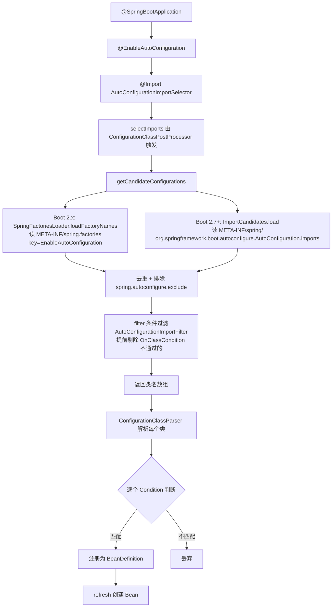

### 17.4 SpringFactoriesLoader 源码

```java
public final class SpringFactoriesLoader {
    public static final String FACTORIES_RESOURCE_LOCATION = "META-INF/spring.factories";

    public static List<String> loadFactoryNames(Class<?> factoryType, ClassLoader classLoader) {
        return loadSpringFactories(classLoader)
                .getOrDefault(factoryType.getName(), Collections.emptyList());
    }

    private static Map<String, List<String>> loadSpringFactories(ClassLoader cl) {
        Map<String, List<String>> result = cache.get(cl);
        if (result != null) return result;

        result = new HashMap<>();
        Enumeration<URL> urls = cl.getResources(FACTORIES_RESOURCE_LOCATION);
        while (urls.hasMoreElements()) {
            URL url = urls.nextElement();
            UrlResource resource = new UrlResource(url);
            Properties properties = PropertiesLoaderUtils.loadProperties(resource);
            // 解析 key=value1,value2 形式
            for (Map.Entry<?, ?> entry : properties.entrySet()) {
                String factoryTypeName = ((String) entry.getKey()).trim();
                String[] factoryImplementationNames =
                        StringUtils.commaDelimitedListToStringArray((String) entry.getValue());
                for (String name : factoryImplementationNames) {
                    result.computeIfAbsent(factoryTypeName, k -> new ArrayList<>())
                          .add(name.trim());
                }
            }
        }
        cache.put(cl, result);
        return result;
    }
}
```

### 17.5 spring.factories 文件示例 (Boot 2.x)

```properties
# spring-boot-autoconfigure-2.x.jar/META-INF/spring.factories
org.springframework.boot.autoconfigure.EnableAutoConfiguration=\
org.springframework.boot.autoconfigure.aop.AopAutoConfiguration,\
org.springframework.boot.autoconfigure.jdbc.DataSourceAutoConfiguration,\
org.springframework.boot.autoconfigure.web.servlet.WebMvcAutoConfiguration,\
org.springframework.boot.autoconfigure.jackson.JacksonAutoConfiguration,\
org.springframework.boot.autoconfigure.transaction.TransactionAutoConfiguration
```

### 17.6 Boot 2.7+ 新格式

为了让自动装配的元数据更轻量和可读,从 Boot 2.7 起新增 `AutoConfiguration.imports` 文件:

```
META-INF/spring/org.springframework.boot.autoconfigure.AutoConfiguration.imports
```

```text
org.springframework.boot.autoconfigure.aop.AopAutoConfiguration
org.springframework.boot.autoconfigure.jdbc.DataSourceAutoConfiguration
org.springframework.boot.autoconfigure.web.servlet.WebMvcAutoConfiguration
```

每行一个类名。**Boot 3.x 起 spring.factories 不再用于声明自动配置类**(其它扩展点仍可用)。

### 17.7 一个 AutoConfiguration 的标准长相

```java
@Configuration(proxyBeanMethods = false)             // 关闭代理,加快启动
@ConditionalOnClass({DataSource.class, EmbeddedDatabaseType.class})  // 类路径有 DataSource
@EnableConfigurationProperties(DataSourceProperties.class)            // 绑定 spring.datasource.*
@AutoConfigureBefore(SqlInitializationAutoConfiguration.class)
public class DataSourceAutoConfiguration {

    @Configuration(proxyBeanMethods = false)
    @Conditional(EmbeddedDatabaseCondition.class)
    @ConditionalOnMissingBean({DataSource.class, XADataSource.class})  // 用户没自定义 DataSource
    @Import(EmbeddedDataSourceConfiguration.class)
    static class EmbeddedDatabaseConfiguration {}

    @Configuration(proxyBeanMethods = false)
    @Conditional(PooledDataSourceCondition.class)
    @ConditionalOnMissingBean({DataSource.class, XADataSource.class})
    @Import({Hikari.class, Tomcat.class, Dbcp2.class, OracleUcp.class, Generic.class})
    static class PooledDataSourceConfiguration {}
}
```

### 17.8 @Conditional 全家桶

| 注解 | 触发条件 |
|------|--------|
| `@ConditionalOnClass` | 类路径**存在**指定类 |
| `@ConditionalOnMissingClass` | 类路径**不存在** |
| `@ConditionalOnBean` | 容器中**已有**指定 Bean |
| `@ConditionalOnMissingBean` | 容器中**没有**指定 Bean(用户自定义优先) |
| `@ConditionalOnProperty` | 配置文件中属性匹配 |
| `@ConditionalOnExpression` | SpEL 表达式为 true |
| `@ConditionalOnWebApplication` | 是 Web 应用 |
| `@ConditionalOnNotWebApplication` | 不是 Web 应用 |
| `@ConditionalOnResource` | 指定资源存在 |
| `@ConditionalOnSingleCandidate` | 容器中只有一个该类型 Bean |
| `@ConditionalOnJava` | JDK 版本匹配 |

**评估时机**:
- 标注 `@Configuration` 类上的 `@Conditional` 在**配置类解析阶段**评估(`ConfigurationClassParser`)
- 标注 `@Bean` 方法上的在**Bean 注册阶段**评估
- 评估失败的整体跳过,不会注册 BeanDefinition

### 17.9 OnClassCondition 怎么提前过滤?

`AutoConfigurationImportFilter` 在 `selectImports` 阶段就调用,用 ASM 读取每个 AutoConfiguration 的字节码注解,**避免类加载**判断 `@ConditionalOnClass`。这样不存在的 starter 直接跳过,不至于 ClassNotFound。

### 17.10 自动装配执行顺序

| 注解 | 作用 |
|------|------|
| `@AutoConfigureOrder(int)` | 全局顺序,数字小先 |
| `@AutoConfigureBefore(X.class)` | 在 X 之前 |
| `@AutoConfigureAfter(X.class)` | 在 X 之后 |

例如 `WebMvcAutoConfiguration` 必须在 `DispatcherServletAutoConfiguration` 之后,因为它依赖 servlet bean 已注册。

### 17.11 自定义 starter 模板

#### 步骤一:写 properties

```java
@ConfigurationProperties(prefix = "demo.greeter")
public class GreeterProperties {
    private String name = "world";
    private boolean enabled = true;
    // getter/setter
}
```

#### 步骤二:写 AutoConfiguration

```java
@AutoConfiguration
@ConditionalOnClass(GreeterService.class)
@ConditionalOnProperty(prefix = "demo.greeter", name = "enabled", havingValue = "true", matchIfMissing = true)
@EnableConfigurationProperties(GreeterProperties.class)
public class GreeterAutoConfiguration {

    @Bean
    @ConditionalOnMissingBean
    public GreeterService greeterService(GreeterProperties props) {
        return new GreeterService(props.getName());
    }
}
```

#### 步骤三:声明(Boot 2.7+)

```
src/main/resources/META-INF/spring/
   org.springframework.boot.autoconfigure.AutoConfiguration.imports
```

```text
com.demo.starter.GreeterAutoConfiguration
```

#### 命名约定

- 官方:`spring-boot-starter-xxx`
- 第三方:`xxx-spring-boot-starter`(避免与官方冲突)
- 习惯把 `-autoconfigure` 和 `-starter` 拆两个模块,前者放代码,后者只放传递依赖

---

## 18. 条件装配与启动器设计

### 18.1 经典案例:DataSource 多池选择

```mermaid
flowchart TD
    A[启动] --> B{有 hikari.HikariDataSource?}
    B -->|是| C[HikariDataSourceConfiguration]
    B -->|否| D{有 tomcat.jdbc.pool.DataSource?}
    D -->|是| E[TomcatDataSourceConfiguration]
    D -->|否| F{有 dbcp2.BasicDataSource?}
    F -->|是| G[Dbcp2DataSourceConfiguration]
    F -->|否| H[GenericDataSourceConfiguration]
    C --> Z[注入 DataSource Bean]
    E --> Z
    G --> Z
    H --> Z
```

通过 `@Conditional` 链路,**仅引入 hikari 依赖时使用 hikari**,**没有任何池依赖时回退到 simple-driver-manager**。这就是"无配置即可用"的本质。

### 18.2 @ConditionalOnMissingBean 的"用户优先"哲学

```java
@Bean
@ConditionalOnMissingBean        // ★
public RedisTemplate<Object, Object> redisTemplate(RedisConnectionFactory cf) {
    RedisTemplate<Object, Object> t = new RedisTemplate<>();
    t.setConnectionFactory(cf);
    return t;
}
```

如果用户自己写了 `@Bean RedisTemplate`,自动装配让位;否则 SpringBoot 提供默认值。**这是 Boot 的"约定优于配置"在源码层的实现方式**。

### 18.3 配置加载优先级

```
命令行 --server.port=8080
    ↓
SPRING_APPLICATION_JSON 环境变量
    ↓
ServletConfig init parameters
    ↓
ServletContext init parameters
    ↓
JNDI 属性
    ↓
java -Dxxx=xxx 系统属性
    ↓
OS 环境变量
    ↓
random.* 占位
    ↓
application-{profile}.yml (jar 外)
    ↓
application-{profile}.yml (jar 内)
    ↓
application.yml (jar 外)
    ↓
application.yml (jar 内)
    ↓
@PropertySource
    ↓
默认属性 SpringApplication.setDefaultProperties
```

**记忆口诀**:**外部覆盖内部、命令行最高、profile 高于无 profile**。

### 18.4 面试官追问

**Q1: SpringBoot 是怎么做到"无 web.xml"的?**
> `ServletWebServerApplicationContext#onRefresh` 启动内嵌 Tomcat;通过 `TomcatServletWebServerFactory` 编程式创建 `Tomcat` 实例,把 `DispatcherServlet` 作为 Servlet 注册;ServletContextInitializer 接口替代 web.xml 的 listener/filter/servlet 配置。

**Q2: `@SpringBootApplication` 上扫描包是从哪里开始的?**
> 从被注解类所在包**开始向下扫描**,这就是为什么主类要放在最顶层包。可以通过 `scanBasePackages` 显式指定。

**Q3: spring.factories 和 imports 文件什么关系?**
> Boot 2.7 之前所有 SPI 机制(包括自动装配类、Listener、Initializer 等)都用 `META-INF/spring.factories`;2.7 引入 `AutoConfiguration.imports` **只**承载自动装配类(更高效,只读一次),其它机制仍走 spring.factories。Boot 3.x 起自动装配**只**认 imports 文件。

**Q4: 为什么要 proxyBeanMethods=false?**
> `@Configuration` 默认会生成 CGLIB 代理(为保证 `@Bean` 方法间互调返回单例)。但 SpringBoot 自动装配类大多不需要互调,关闭代理可以节省启动时间和内存。

**Q5: SpringBoot Starter 怎么命名规范?**
> 官方 starter 命名为 `spring-boot-starter-<name>`(如 `spring-boot-starter-web`);三方 starter 必须命名为 `<name>-spring-boot-starter`,避免与官方混淆。


---

# 第六部分 · 面试官高频追问 Top 30 + 答题模板

## 19. 通用答题套路 (STAR-S)

> 面试源码题最容易翻车的不是不会,而是**答得没条理、像背书**。强烈建议套用 **STAR-S** 框架:

```
S — Scenario   开场用一句话锚定问题
T — Theory     给出原理/分类/结构化结论
A — Architecture  画或讲核心流程图(2-3 步)
R — Reference  讲一段关键源码或类名
S — So-what    引申到实战(踩坑/优化/对比)
```

**示例:被问"Bean 生命周期"**

> *S* 很核心的问题,Bean 从 BeanDefinition 到容器内可用、最后销毁,中间有 4 个阶段。
> *T* 阶段是:实例化 → 属性填充 → 初始化 → 销毁。
> *A* 实例化由 createBeanInstance 反射构造;属性填充 populateBean 处理 @Autowired;初始化先 Aware 再 BeanPostProcessor 前 → afterPropertiesSet → init-method → BPP 后,AOP 代理在 BPP 后生成;销毁是 @PreDestroy → DisposableBean → destroy-method。
> *R* 关键类是 AbstractAutowireCapableBeanFactory#doCreateBean。
> *S* 实战中要注意 prototype Bean 不走销毁、@PostConstruct 比 afterPropertiesSet 先、AOP 在 BPP 后生成所以构造器里拿到的 this 不是代理。

---

## 20. Spring 容器 Top 12

### Q1. 讲一下 Spring 的 IOC 和 DI

**核心答**:IOC 是控制反转,把对象的创建权交给容器;DI 是依赖注入,IOC 的实现方式。Spring 通过 `BeanDefinition` 描述 Bean,在 `refresh()` 第 11 步统一实例化和注入。
**加分**:扯到 J2SE 的 Service Locator → Spring 的 IOC 演化、与 Guice、Dagger 的对比。

### Q2. refresh() 12 步主线请说一下

**核心答**:见第 1 节表格。**关键 3 步**是第 5(BFPP 解析配置类)、第 6(注册 BPP)、第 11(创建非懒加载单例)。
**加分**:第 9 步 onRefresh 在 SpringBoot Web 里启动 Tomcat。

### Q3. BeanFactory 和 ApplicationContext 区别

**核心答**:
- `BeanFactory` 是底层接口,定义 `getBean` 等基础能力,**懒加载**
- `ApplicationContext` 继承 `BeanFactory`,扩展事件、国际化、资源加载、AOP 自动代理,默认**预加载所有非懒单例**
- 实际开发只接触 `ApplicationContext`,`BeanFactory` 是它内部的 `DefaultListableBeanFactory` 实例

### Q4. 三级缓存为什么需要 3 级?

模板答案见 4.5 节。**简短版**:三级缓存的 `ObjectFactory` 让 AOP 代理生成保持在初始化后,避免循环依赖时被迫提前生成代理污染流程。

### Q5. @Async 为什么会破坏循环依赖

**核心答**:`AsyncAnnotationBeanPostProcessor` 不是 `SmartInstantiationAwareBeanPostProcessor`,只在初始化后才生成代理,与早期暴露的引用不一致,Spring 检测到不一致抛 `BeanCurrentlyInCreationException`。
**修复**:注入侧加 `@Lazy` 或拆分成独立类。

### Q6. BeanPostProcessor 自身的依赖什么时候注入?

**核心答**:`refresh()` 第 6 步 `registerBeanPostProcessors` 内部会**提前 getBean** 把 BPP 创建出来,BPP 的依赖会立刻满足。所以 BPP 不要依赖业务 Bean,否则会让业务 Bean 提前创建,**绕过 AOP 等其它 BPP**。

### Q7. @Autowired 是怎么工作的?

**核心答**:`AutowiredAnnotationBeanPostProcessor`(SmartIBPP)在 `postProcessProperties` 阶段扫描注入点元数据,对每个注入点调用 `BeanFactory#resolveDependency`,内部按类型查找候选,经 `@Primary → @Priority → 名称匹配` 三层过滤选出唯一 Bean 注入。

### Q8. 构造方法推断的优先级?

见 5.1 节表格。**记忆三句话**:
- 单一构造直接用
- 多个里面有一个 `@Autowired(required=true)` 就用它
- 全无注解就找无参,无无参也无注解就抛异常

### Q9. BeanDefinition 是什么?

**核心答**:Bean 的配置元数据,包括 className、scope、lazyInit、constructor-args、property-values、init/destroy method 等。所有 BeanDefinition 注册到 `DefaultListableBeanFactory#beanDefinitionMap`,**先于 Bean 实例化**完成注册。

### Q10. ASM vs 反射读类元信息

见 1.4 节。简言之 **ASM 不触发类加载,极快,内存友好**。

### Q11. ApplicationContext 启动失败常见原因?

| 现象 | 原因 |
|------|------|
| `NoUniqueBeanDefinitionException` | 多个候选 Bean,缺少 `@Primary` 或 `@Qualifier` |
| `BeanCurrentlyInCreationException` | 循环依赖未解决(构造器循环或 Boot 2.6+ 默认禁用) |
| `BeanNotOfRequiredTypeException` | JDK 代理下注入了实现类 |
| `NoSuchBeanDefinitionException` | 没扫到包 / 条件装配未通过 |

### Q12. @Bean 方法之间互调,会创建多个实例吗?

**核心答**:不会,前提是配置类用了默认的 `@Configuration`(或 `@Configuration(proxyBeanMethods=true)`)。因为 Spring 会 CGLIB 代理配置类,拦截 `@Bean` 方法调用,确保返回单例。
**反例**:`@Configuration(proxyBeanMethods=false)` 或 `@Component` 上加 `@Bean`,互调会**真的执行**,产生多个实例。SpringBoot 自动装配类大量使用 `proxyBeanMethods=false` 提速。

---

## 21. AOP / 事务 Top 8

### Q13. AOP 的代理是什么时候生成的?

**核心答**:`AnnotationAwareAspectJAutoProxyCreator`(BPP)在 `postProcessAfterInitialization` 阶段调用 `wrapIfNecessary`,如果有匹配的 Advisor 就走 `ProxyFactory.getProxy()` 生成 JDK 或 CGLIB 代理。

### Q14. JDK 代理和 CGLIB 怎么选?

见 6.4 节。**Spring Boot 2.x 默认 CGLIB**;可通过 `spring.aop.proxy-target-class=false` 切回 JDK。

### Q15. AOP 通知的执行顺序

正常:`@Around 前 → @Before → 目标 → @AfterReturning → @After → @Around 后`。
异常:`@Around 前 → @Before → 目标(异常)→ @AfterThrowing → @After`(@Around 后不执行)。
多切面:洋葱模型,`@Order` 小的在外面,前置先执行,后置后执行。

### Q16. Spring 事务怎么实现的?

模板答:
> 1. `@EnableTransactionManagement` 开启,通过 `@Import(TransactionManagementConfigurationSelector)` 注册自动代理
> 2. `BeanFactoryTransactionAttributeSourceAdvisor` 是核心 Advisor,Pointcut 匹配 `@Transactional`
> 3. 拦截后 `TransactionInterceptor.invoke()` → `PlatformTransactionManager.getTransaction()` → 事务开启
> 4. `TransactionSynchronizationManager` 用 ThreadLocal 把 Connection 绑到当前线程
> 5. 业务执行完,正常 commit,异常按 `rollbackFor` 决定是否 rollback
> 6. 最终解绑 ThreadLocal,关闭连接

### Q17. 事务失效场景列举一下

见第 8 节十大失效。**最高频**:
1. 同类自调用(this 不是代理)
2. 异常被 catch 吞了
3. 抛了受检异常但没配 `rollbackFor`
4. 异步线程切换
5. 方法是 private/final/static

### Q18. REQUIRED 和 REQUIRES_NEW 的实战区别

模板答:
> REQUIRED 是同一个事务,内层失败外层 catch 也会拿到 `UnexpectedRollbackException`,因为整个事务被标记 rollback-only。
> REQUIRES_NEW 会**挂起当前事务**,新建一个独立的物理事务(实际上拿一个新的 Connection),内外层互不影响,典型用于审计日志、独立扣款等。

### Q19. 自调用为什么事务失效,怎么修?

模板答:
> 同类调用走的是 `this`,而 `this` 是原始 target 不是代理。代理逻辑(`TransactionInterceptor`)在外部入口拦截,内部调用绕开了。
> 修法三选一:
> - 注入自身 (`@Autowired XxxService self`)
> - `((XxxService) AopContext.currentProxy()).method()`(需 `exposeProxy=true`)
> - 拆分到不同类

### Q20. 为什么 readOnly 事务还能写?

**核心答**:`readOnly=true` 只是给数据库的**性能提示**(MySQL 跳过 redo、ORM 跳过脏检查),Spring 自身不做拦截。生产中常配合 `AbstractRoutingDataSource` 路由到从库,**真正阻止写**靠数据源切换。

---

## 22. SpringMVC Top 5

### Q21. 一次 HTTP 请求在 SpringMVC 里走了哪些步骤?

模板答:
> 1. 请求进入 Tomcat → DispatcherServlet.doDispatch
> 2. HandlerMapping 找到 HandlerExecutionChain
> 3. HandlerAdapter.handle 反射调用方法,期间 ArgumentResolver 解析参数 → ReturnValueHandler 处理返回值
> 4. 拦截器 preHandle → 业务 → postHandle → afterCompletion
> 5. 视图解析(JSON 直接由 HttpMessageConverter 写入 response)
> 6. 异常由 HandlerExceptionResolver 链处理

### Q22. @RequestBody 是怎么把 JSON 变成对象的?

**核心答**:`RequestResponseBodyMethodProcessor`(参数解析器)→ 遍历 `HttpMessageConverter` → 命中 `MappingJackson2HttpMessageConverter` → `ObjectMapper.readValue` 反序列化。

### Q23. Filter Interceptor AOP 的区别和顺序

见 11.2 节对比表 + 顺序示意。**口诀**:Filter 最外、Interceptor 次之、AOP 最内。

### Q24. @ControllerAdvice 怎么实现全局异常?

**核心答**:`ExceptionHandlerExceptionResolver` 启动时扫描所有 `@ControllerAdvice` 类,缓存 `Map<异常类型, ExceptionHandlerMethod>`。请求异常时按异常类型最近继承关系匹配处理方法。同样的机制还支持 `@ModelAttribute`、`@InitBinder` 全局生效。

### Q25. SpringMVC 怎么处理文件上传?

**核心答**:`MultipartResolver`(默认 `StandardServletMultipartResolver`)在 `doDispatch` 入口检查 `Content-Type: multipart/*`,把 request 包装成 `MultipartHttpServletRequest`,后续 `MultipartFile` 参数由 `RequestPartMethodArgumentResolver` 解析。

---

## 23. MyBatis Top 5

### Q26. SqlSession、Executor、StatementHandler、ParameterHandler、ResultSetHandler 各自的职责?

| 对象 | 职责 |
|------|------|
| `SqlSession` | 门面,对外暴露 selectOne / insert / getMapper |
| `Executor` | 实际的 SQL 执行器,管理一二级缓存、事务 |
| `StatementHandler` | 创建/参数化/执行 `Statement` |
| `ParameterHandler` | 把 Java 参数 setter 到 `PreparedStatement` |
| `ResultSetHandler` | 把 `ResultSet` 转成 Java 对象 |

### Q27. 一级缓存为什么会失效?

见 13.5。**最高频**:任何 update/insert/delete 都清缓存;不同 SqlSession 互不可见;`localCacheScope=STATEMENT` 等同关闭。

### Q28. Mapper 接口没有实现类,MyBatis 怎么执行?

**核心答**:JDK 动态代理。`getMapper()` → `MapperProxyFactory.newInstance()` 生成 `MapperProxy`(InvocationHandler) → `invoke()` 里取出 `MapperMethod` → 根据 SQL 类型调对应 `SqlSession` 方法。

### Q29. MyBatis 二级缓存的坑?

模板答:
> 1. 对象必须实现 `Serializable`
> 2. 跨 namespace 修改会脏读 → 用 `<cache-ref>` 共享 namespace
> 3. 与 Spring 事务结合,只有 commit 后才 flush
> 4. 实战不推荐,首选 Redis + Spring Cache

### Q30. PageHelper 分页插件的原理?

模板答:`@Intercepts` 拦截 `Executor.query` → 从 `ThreadLocal` 取分页参数 → 改写 SQL 加 `LIMIT` → 多执行一次 `count(*)` → 包装成 `Page<T>` 返回。`PageHelper.startPage(1,10)` 必须紧贴 DAO 调用,否则 ThreadLocal 会泄露给下一次查询。

---

## 24. SpringBoot Top 5

### Q31. SpringBoot 自动装配怎么做到的?

模板答 (STAR-S):
> *S* SpringBoot 的"约定优于配置"核心就是自动装配
> *T* 三个关键:`@SpringBootApplication` 内含 `@EnableAutoConfiguration`;`@Import(AutoConfigurationImportSelector)` 触发选择;SPI 文件 `META-INF/spring.factories`(2.7+ 改为 `AutoConfiguration.imports`)
> *A* 启动 → ConfigurationClassPostProcessor 处理 @Import → AutoConfigurationImportSelector.selectImports → SpringFactoriesLoader 读 SPI → 经 OnClassCondition 提前过滤 → 注册 BeanDefinition → refresh 创建
> *R* `AutoConfigurationImportSelector#selectImports` 是入口
> *S* 自定义 starter 步骤:写 Properties + AutoConfiguration + imports 文件,命名遵循 `xxx-spring-boot-starter`

### Q32. @ConditionalOnMissingBean 的原理?

**核心答**:`OnBeanCondition` 在 BeanDefinition 注册阶段执行,扫描 BeanFactory 中是否已有该类型的 Bean。**注意**这里检查 BeanDefinition 即可,不需要实际创建,所以无副作用。**用户优先**正是基于此:用户的 @Bean 先注册,自动装配再判断。

### Q33. SpringBoot 启动时 Tomcat 是什么时候启动的?

见 16.4 节。`refresh()` 第 9 步 `onRefresh()`,先于 finishBeanFactoryInitialization。

### Q34. application.yml 加载优先级

见 18.3。**核心**:外部 > 内部、命令行最高、profile 高于无 profile。

### Q35. Boot 2.7 / 3.x 自动装配文件变化

**核心答**:Boot 2.7 引入 `META-INF/spring/AutoConfiguration.imports`(每行一个类),与 spring.factories 共存(向后兼容)。Boot 3.x 移除了 spring.factories 中的自动装配条目,**只**认 imports 文件。其它 SPI 机制(Listener、Initializer 等)依然走 spring.factories。

---

## 25. 加分项弹药库

> 这些不是"必答",但能在 90% 的候选人之上拔尖。

### 25.1 Spring 6 新特性

- **AOT 编译**:`@AotProcessor` 提前生成 BeanDefinition 元数据,启动毫秒级
- **GraalVM 原生镜像**:配合 `spring-boot-starter-parent` 3.x,`native-image` 可直接生成可执行文件
- **Observability**:统一 Micrometer Tracing API,替换 Sleuth
- **HTTP Interface**:声明式 HTTP 客户端,语法类似 Feign

### 25.2 Spring 5 响应式 (WebFlux)

- 基于 Reactor (`Mono` / `Flux`)
- 用 `Netty` 默认服务器
- 调度器:`Schedulers.boundedElastic()`(IO)、`Schedulers.parallel()`(CPU)
- 与传统 MVC 不能共存于同一个 ApplicationContext

### 25.3 容器规范进化

| 规范 | 来源 | 用途 |
|------|------|------|
| JSR-250 | Java EE 5 | `@PostConstruct` `@PreDestroy` `@Resource` |
| JSR-330 | Java EE 6 | `@Inject` `@Named` |
| Servlet 3.0 | JCP | `ServletContainerInitializer`(SpringBoot 内嵌容器基础) |
| Reactive Streams | 反应式社区 | `Publisher/Subscriber/Subscription` |

### 25.4 性能优化建议

- `@Configuration(proxyBeanMethods=false)` 节省 CGLIB 代理开销
- `@Lazy` 延迟首屏不必要的 Bean
- `spring.main.lazy-initialization=true` 全局懒加载
- `spring.jmx.enabled=false` 关闭 JMX
- 使用 `@Indexed` + `META-INF/spring.components` 跳过 ASM 扫描
- AOT 提前编译 (Boot 3.x)

### 25.5 排查工具箱

| 工具 | 用途 |
|------|------|
| `--debug` 启动 | 输出自动装配匹配/未匹配报告 |
| Actuator `/actuator/conditions` | 在线查看 Conditional 评估结果 |
| Actuator `/actuator/beans` | 查看所有 Bean |
| Actuator `/actuator/configprops` | 查看配置绑定 |
| `Arthas trace` | 跟踪方法调用耗时 |
| `Arthas watch` | 观察方法入参/返回值 |

---

## 26. 终极记忆地图

```mermaid
mindmap
  root((Java 框架源码))
    Spring 容器
      refresh 12 步
      Bean 生命周期 4 阶段
      三级缓存
      构造方法推断
      @Autowired 解析
    Spring AOP
      JDK vs CGLIB
      5 种 Advice
      洋葱模型
      自调用失效
    Spring 事务
      7 种传播
      4 种隔离
      ThreadLocal 绑定
      10 大失效
    SpringMVC
      DispatcherServlet
      26 个参数解析器
      15 个返回值处理器
      3 阶段拦截器
    MyBatis
      Configuration
      4 种 Executor
      一二级缓存
      Mapper 代理
      Plugin 4 对象
    SpringBoot
      run 启动 12 步
      自动装配 SPI
      Conditional 全家桶
      starter 命名约定
```

---

## 结语

这份文档遵循一条主线:**先看图,再看流程,再读源码,最后记追问**。准备面试时建议这样用:
1. **第一遍**:浏览各章大纲和 mermaid 图,建立心智模型
2. **第二遍**:精读源码片段,理解关键类的协作
3. **第三遍**:用第六部分的题目做自我提问,练 STAR-S 套路
4. **临场**:把每章 1-2 张图记牢,讲解时手画或口述

> 祝面试顺利,Offer 满满。 — 整理者
