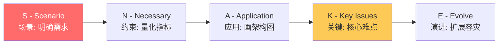
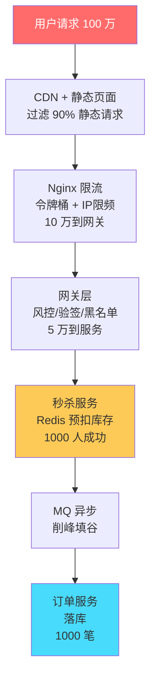
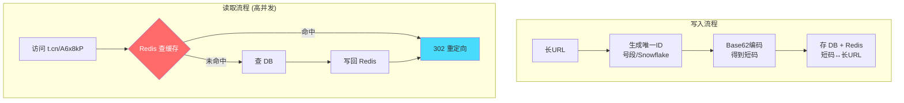
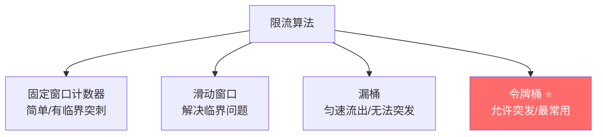
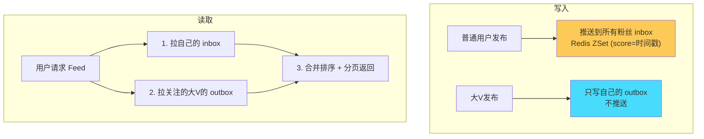
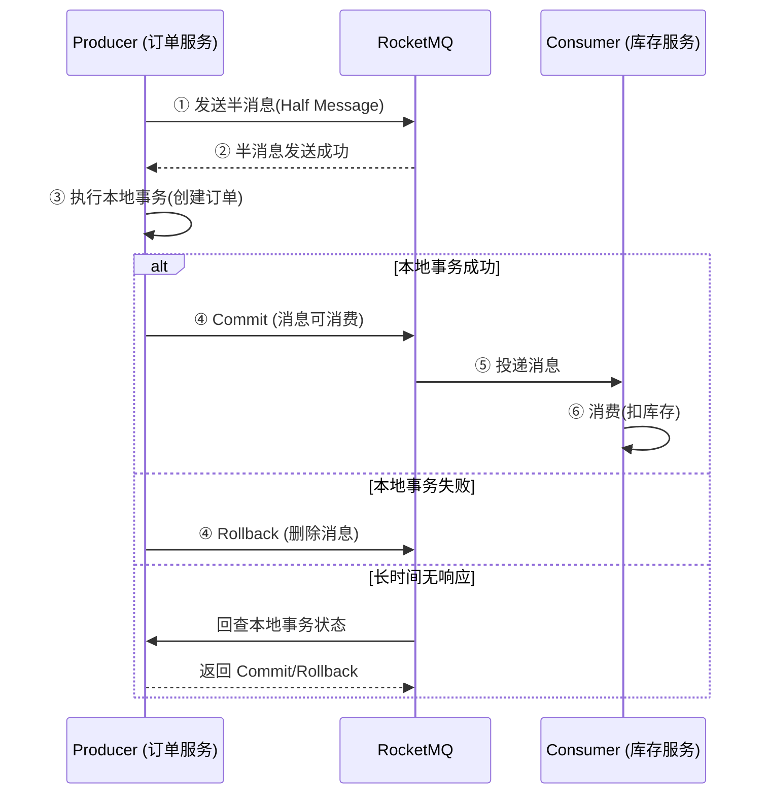

# 系统设计面试总结 · 深度增强版

> 整理基础：`系统设计面试总结.md`
> 风格：**大纲 → 细分知识点 → 图解 → 关键代码 → 面试官追问 + 答题模板**
> 适用：中高级 Java 后端 / 架构设计 / 系统设计面试

---

## 视觉规范说明

| 标记 | 含义 | 优先级 |
|------|------|--------|
| 🔴 **必背核心** | 面试必答，方案设计 | ⭐⭐⭐⭐⭐ |
| 🟠 **重点理解** | 高频考点，深度方案 | ⭐⭐⭐⭐ |
| 🟡 **加分项** | 拔高内容 | ⭐⭐⭐ |
| 🟢 **避坑提醒** | 实战陷阱 | ⭐⭐⭐ |
| `==高亮==` | 关键术语 / 数值 | 强化记忆 |

> 💡 **建议**：第一遍只看 🔴，把骨架建起来；第二遍看 🟠；第三遍 🟡🟢 拔高与避坑。

---

## 全文大纲

```
第一部分 · 系统设计答题框架
    1. SNAKE 答题法
    2. 容量估算模板

第二部分 · 秒杀系统 ⭐⭐⭐⭐⭐
    3. 架构分层设计
    4. 层层过滤漏斗模型
    5. Redis Lua 防超卖
    6. 异步下单与兜底

第三部分 · 短链接系统 ⭐⭐⭐⭐
    7. 短码生成方案
    8. 读写架构设计
    9. 高并发优化

第四部分 · 分布式 ID ⭐⭐⭐⭐
    10. 方案全面对比
    11. Snowflake 深度解析
    12. 时钟回拨解决方案

第五部分 · 限流方案 ⭐⭐⭐⭐
    13. 四种限流算法详解
    14. 分布式限流实现

第六部分 · Feed 流系统 ⭐⭐⭐
    15. 推拉结合方案

第七部分 · 其他高频设计题
    16. 分布式锁
    17. 分布式事务
    18. 延迟任务
    19. 接口幂等性

第八部分 · 面试官高频追问 Top 30
    STAR-S 答题模板 + 加分弹药库
```

---


# 第一部分 · 系统设计答题框架

## 1. SNAKE 答题法

### 1.1 🔴 SNAKE 五步框架



| 步骤 | 做什么 | 示例（秒杀系统） |
|------|--------|----------------|
| **S**cenario | 问清楚功能需求 | 抢购、库存扣减、防刷 |
| **N**ecessary | 量化 QPS/DAU/存储/RT | 100万QPS/1000万DAU/RT<200ms |
| **A**pplication | 画出分层架构 | CDN→Nginx→网关→秒杀服务→MQ→订单 |
| **K**ey Issues | 核心难点方案 | 防超卖(Lua)、削峰(MQ)、防刷(风控) |
| **E**volve | 扩展/容灾/降级 | 水平扩容、熔断降级、异地多活 |

### 1.2 🟠 面试中的关键动作

> 🟠 **加分操作**：
> 1. ==主动问约束==：不要上来就设计，先问"QPS 多少？数据量多大？"
> 2. ==画图==：一边说一边画架构图
> 3. ==先粗后细==：先给大方案，再深入关键点
> 4. ==权衡取舍==：说出方案 A 和 B 的 trade-off，为什么选 A

---

## 2. 容量估算

### 2.1 🔴 估算模板

```
DAU = 1000 万
高峰流量 = DAU × 系数 / 86400
  - 二八原则: 80%请求在20%时间 → × 5
  - 读写比 10:1

QPS 估算:
  日请求 = 1000万 × 10 次/人 = 1亿
  平均 QPS = 1亿 / 86400 ≈ 1200
  峰值 QPS = 1200 × 5 = 6000
  读 QPS = 6000 × 0.9 = 5400
  写 QPS = 6000 × 0.1 = 600

存储估算:
  每条数据 1KB
  日增 = 1000万条 × 1KB = 10GB
  年增 = 10GB × 365 = 3.6TB
  3年 = 10.8TB → 需要分库分表
```

### 2.2 🟠 常用数值速记

| 量级 | 数值 | 方案建议 |
|------|------|---------|
| QPS < 1000 | 低并发 | 单机 MySQL |
| QPS 1000~10000 | 中等 | MySQL 主从 + Redis 缓存 |
| QPS 10000~100000 | 高并发 | Redis 集群 + 读写分离 + MQ |
| QPS > 100000 | 超高并发 | 多级缓存 + 限流 + CDN + 分库分表 |

---

# 第二部分 · 秒杀系统

## 3. 架构分层设计

### 3.1 🔴 漏斗模型（层层过滤）



> 🔴 **核心思路**：==100万请求 → 10万到网关 → 1万到服务 → 1000到DB==
>
> 每一层都在过滤无效请求，保护后端。

### 3.2 🔴 各层削峰方案

| 层级 | 方案 | 具体实现 |
|------|------|---------|
| **前端** | 按钮置灰+验证码+答题 | 防止用户重复点击、机器人 |
| **CDN** | 静态资源缓存 | 商品详情页、图片全走 CDN |
| **Nginx** | 限流 + 负载均衡 | `limit_req_zone` 令牌桶 / 一致性hash |
| **网关** | 风控 + 令牌发放 | 黑名单/设备指纹/令牌桶 |
| **服务层** | Redis 预扣库存 | ==Lua 原子扣减==，扣成功才入 MQ |
| **MQ** | 异步削峰 | 扣库存成功 → 发消息 → 消费者创建订单 |
| **DB** | 最终落库 | 只有真正的有效订单才到 DB |

### 3.3 🔴 库存预热

```java
// 活动开始前：将库存从 DB 加载到 Redis
@Scheduled(cron = "0 55 19 * * ?")  // 活动前5分钟
public void preloadStock() {
    List<SeckillItem> items = seckillDao.listActiveItems();
    for (SeckillItem item : items) {
        String key = "seckill:stock:" + item.getId();
        redisTemplate.opsForValue().set(key, String.valueOf(item.getStock()));
        // 设置活动结束时间的过期
        redisTemplate.expire(key, Duration.ofHours(2));
    }
    log.info("库存预热完成, items={}", items.size());
}
```

---

## 4. Redis Lua 防超卖

### 4.1 🔴 Lua 脚本原子扣减

```lua
-- seckill_stock.lua
-- KEYS[1] = "seckill:stock:{itemId}"
-- KEYS[2] = "seckill:order:{itemId}"
-- ARGV[1] = userId

-- 1. 判断库存是否充足
local stock = tonumber(redis.call('GET', KEYS[1]))
if stock == nil or stock <= 0 then
    return -1  -- 库存不足
end

-- 2. 判断用户是否已抢购(防重复)
local ordered = redis.call('SISMEMBER', KEYS[2], ARGV[1])
if ordered == 1 then
    return -2  -- 重复抢购
end

-- 3. 扣减库存 + 记录用户
redis.call('DECR', KEYS[1])
redis.call('SADD', KEYS[2], ARGV[1])
return 1  -- 抢购成功
```

### 4.2 🔴 Java 调用 Lua

```java
@Service
public class SeckillService {
    private static final DefaultRedisScript<Long> SECKILL_SCRIPT;

    static {
        SECKILL_SCRIPT = new DefaultRedisScript<>();
        SECKILL_SCRIPT.setLocation(new ClassPathResource("lua/seckill_stock.lua"));
        SECKILL_SCRIPT.setResultType(Long.class);
    }

    public SeckillResult doSeckill(Long itemId, Long userId) {
        Long result = redisTemplate.execute(SECKILL_SCRIPT,
            List.of("seckill:stock:" + itemId, "seckill:order:" + itemId),
            userId.toString());

        switch (result.intValue()) {
            case 1:  return SeckillResult.SUCCESS;
            case -1: return SeckillResult.STOCK_EMPTY;
            case -2: return SeckillResult.DUPLICATE;
            default: return SeckillResult.FAIL;
        }
    }
}
```

### 4.3 🟠 扣减成功后的异步下单

```java
// 库存扣减成功 → 发送 MQ 消息
if (result == SeckillResult.SUCCESS) {
    SeckillMessage msg = new SeckillMessage(itemId, userId, System.currentTimeMillis());
    rocketMQTemplate.asyncSend("seckill-order-topic", msg, new SendCallback() {
        @Override
        public void onSuccess(SendResult sendResult) {
            log.info("秒杀消息发送成功: {}", sendResult.getMsgId());
        }
        @Override
        public void onException(Throwable e) {
            // 补偿: 回滚 Redis 库存
            redisTemplate.opsForValue().increment("seckill:stock:" + itemId);
            redisTemplate.opsForSet().remove("seckill:order:" + itemId, userId.toString());
            log.error("秒杀消息发送失败, 已回滚库存", e);
        }
    });
}
```

### 4.4 🟢 兜底方案

> 🟢 **容灾降级**：
> - **Redis 宕机**：Sentinel 限流降级，返回"系统繁忙"
> - **MQ 积压**：增加 Consumer 实例，紧急扩容
> - **DB 压力大**：关闭非核心功能（推荐、评论）
> - **超卖兜底**：DB 层 `UPDATE stock SET count=count-1 WHERE id=? AND count>0`

---

# 第三部分 · 短链接系统

## 5. 短码生成方案

### 5.1 🔴 方案对比

| 方案 | 原理 | 优点 | 缺点 |
|------|------|------|------|
| Hash(MurmurHash) | 长URL取hash→取前6位 | 简单 | ==有冲突== |
| ==自增ID + Base62== | 数据库自增ID→Base62编码 | ==无冲突==、简单 | ID 可预测 |
| Snowflake + Base62 | 分布式ID→Base62 | 无冲突、分布式 | ID 较长 |
| ==预生成号段== | 提前生成短码池 | 性能极好 | 需要维护 |

### 5.2 🔴 Base62 编码

```java
// Base62: 0-9(10) + a-z(26) + A-Z(26) = 62 个字符
// 6 位 Base62 = 62^6 ≈ 568 亿种组合，足够用
private static final String BASE62 = "0123456789abcdefghijklmnopqrstuvwxyzABCDEFGHIJKLMNOPQRSTUVWXYZ";

public String encode(long id) {
    StringBuilder sb = new StringBuilder();
    while (id > 0) {
        sb.append(BASE62.charAt((int)(id % 62)));
        id /= 62;
    }
    // 不足6位补0
    while (sb.length() < 6) sb.append('0');
    return sb.reverse().toString();
}

public long decode(String shortCode) {
    long id = 0;
    for (char c : shortCode.toCharArray()) {
        id = id * 62 + BASE62.indexOf(c);
    }
    return id;
}
```

### 5.3 🔴 读写架构



### 5.4 🔴 301 vs 302 选择

| 状态码 | 含义 | 短链选择 | 原因 |
|--------|------|---------|------|
| 301 | 永久重定向 | ❌ | 浏览器缓存后不再请求服务，==无法统计点击量== |
| 302 | 临时重定向 | ✅ | ==每次请求都经过服务==，可统计/分析/A/B 测试 |

### 5.5 🟠 防重复与冲突

```java
// Hash 方案的冲突解决
public String createShortUrl(String longUrl) {
    String hash = MurmurHash.hash(longUrl).substring(0, 6);

    // 检查是否冲突
    String existing = redis.get("short:" + hash);
    if (existing != null && existing.equals(longUrl)) {
        return hash;  // 同一个长URL，直接返回
    }
    if (existing != null) {
        // 冲突! 加盐重试
        hash = MurmurHash.hash(longUrl + System.nanoTime()).substring(0, 6);
    }

    redis.set("short:" + hash, longUrl);
    db.insert(hash, longUrl);
    return hash;
}
```

---

# 第四部分 · 分布式 ID

## 6. Snowflake 深度解析

### 6.1 🔴 结构图

```
┌──┬──────────────────────────────────────────┬───────────┬──────────────┐
│ 0│        41 bit 时间戳(ms)                  │ 10bit机器 │ 12bit 序列号 │
└──┴──────────────────────────────────────────┴───────────┴──────────────┘
 ↑                    ↑                           ↑             ↑
符号位          支持69年                       1024节点     4096/ms/节点

总计 64 bit = long 类型
每毫秒每节点可生成 4096 个 ID
整体 QPS 上限 = 4096 × 1000 = 409.6 万/s/节点
```

### 6.2 🔴 Java 实现

```java
public class SnowflakeIdGenerator {
    private final long epoch = 1609459200000L;  // 2021-01-01 起始
    private final long workerIdBits = 10L;
    private final long sequenceBits = 12L;
    private final long maxWorkerId = ~(-1L << workerIdBits);  // 1023
    private final long sequenceMask = ~(-1L << sequenceBits); // 4095

    private final long workerId;
    private long sequence = 0L;
    private long lastTimestamp = -1L;

    public SnowflakeIdGenerator(long workerId) {
        if (workerId > maxWorkerId || workerId < 0)
            throw new IllegalArgumentException("workerId 超范围");
        this.workerId = workerId;
    }

    public synchronized long nextId() {
        long timestamp = System.currentTimeMillis();

        // ★ 时钟回拨处理
        if (timestamp < lastTimestamp) {
            long offset = lastTimestamp - timestamp;
            if (offset <= 5) {
                Thread.sleep(offset << 1);  // 小回拨等待
                timestamp = System.currentTimeMillis();
            } else {
                throw new RuntimeException("时钟回拨过大: " + offset + "ms");
            }
        }

        if (timestamp == lastTimestamp) {
            sequence = (sequence + 1) & sequenceMask;
            if (sequence == 0) {
                timestamp = waitNextMillis(lastTimestamp);  // 序列号用完，等下一毫秒
            }
        } else {
            sequence = 0L;
        }

        lastTimestamp = timestamp;

        return ((timestamp - epoch) << (workerIdBits + sequenceBits))
             | (workerId << sequenceBits)
             | sequence;
    }

    private long waitNextMillis(long lastTimestamp) {
        long timestamp = System.currentTimeMillis();
        while (timestamp <= lastTimestamp) {
            timestamp = System.currentTimeMillis();
        }
        return timestamp;
    }
}
```

### 6.3 🔴 时钟回拨问题与解决

| 方案 | 原理 | 适用 |
|------|------|------|
| **等待** | 回拨 < 5ms 时 sleep | 小幅回拨 |
| **报错** | 直接抛异常 | 简单粗暴 |
| **备用位** | 预留 2~3 bit 作为回拨标记位 | 美团 Leaf |
| **本地缓存时间** | 只使用单调递增的内存时间 | 不依赖系统时钟 |

### 6.4 🟠 方案全面对比

| 方案 | 有序 | 性能 | 高可用 | 缺点 |
|------|:----:|:----:|:------:|------|
| UUID | ❌ | ⭐⭐⭐ | ✅ | 无序/太长/索引差 |
| DB 自增 | ✅ | ⭐⭐ | ❌ 单点 | 单机瓶颈 |
| ==DB 号段== | ✅ | ⭐⭐⭐⭐ | ✅ | 需要额外服务 |
| Redis INCR | ✅ | ⭐⭐⭐⭐ | 中 | 持久化问题 |
| ==Snowflake== | ✅ | ⭐⭐⭐⭐⭐ | ✅ | 时钟回拨 |
| Leaf (美团) | ✅ | ⭐⭐⭐⭐⭐ | ✅ | 部署复杂 |

---

# 第五部分 · 限流方案

## 7. 四种限流算法

### 7.1 🔴 算法对比图



### 7.2 🔴 固定窗口 vs 滑动窗口

```
固定窗口 (问题: 临界突刺):
  |←── 1s ──→|←── 1s ──→|
  |___________100|100___________|
              ↑ 临界点附近 200 QPS 突发!

滑动窗口 (解决):
  滑动 →  |←── 1s ──→|
  任意 1s 窗口内都不超过阈值
```

### 7.3 🔴 漏桶 vs 令牌桶

| 维度 | 漏桶 | 令牌桶 ⭐ |
|------|------|---------|
| 出口速率 | ==恒定速率流出== | 有令牌就处理 |
| 突发流量 | ❌ 无法应对 | ✅ ==桶中有积攒的令牌可应对突发== |
| 适用 | 需要严格匀速（如网络整形） | ==大部分场景==（Web API） |
| 实现 | Nginx `limit_req` leak | Guava RateLimiter |

```
令牌桶:
      [令牌生产者] → 固定速率放入令牌
           ↓
      ┌─────────────┐
      │ 令牌桶       │ ← 容量=突发量
      │ ⚪⚪⚪⚪⚪   │
      └──────┬──────┘
             ↓
      请求到来 → 取令牌 → 有→通过 / 无→拒绝

★ 桶中可以攒令牌 → 允许一定程度的突发
```

### 7.4 🔴 实现方案层级

| 层级 | 方案 | 工具 | 适用 |
|------|------|------|------|
| 网关层 | Nginx | `limit_req_zone` | 全局入口限流 |
| 应用层(单机) | Guava | `RateLimiter.create(100)` | 单实例限流 |
| ==分布式== | Redis + Lua | 分布式令牌桶/滑动窗口 | 集群统一限流 |
| 框架 | Sentinel / Resilience4j | 规则动态配置 | ⭐ 生产首选 |

### 7.5 🟠 Redis + Lua 分布式滑动窗口

```lua
-- 滑动窗口限流 Lua 脚本
-- KEYS[1] = 限流key
-- ARGV[1] = 窗口大小(ms)
-- ARGV[2] = 最大请求数
-- ARGV[3] = 当前时间(ms)

local key = KEYS[1]
local window = tonumber(ARGV[1])
local maxCount = tonumber(ARGV[2])
local now = tonumber(ARGV[3])

-- 移除窗口外的请求
redis.call('ZREMRANGEBYSCORE', key, 0, now - window)

-- 当前窗口请求数
local count = redis.call('ZCARD', key)

if count < maxCount then
    -- 允许请求，记录当前时间
    redis.call('ZADD', key, now, now .. math.random())
    redis.call('EXPIRE', key, math.ceil(window / 1000))
    return 1  -- 通过
else
    return 0  -- 限流
end
```

---


# 第六部分 · Feed 流系统

## 8. 推拉结合方案

### 8.1 🔴 三种模型对比

| 模型 | 原理 | 优点 | 缺点 | 适用 |
|------|------|------|------|------|
| **拉模型**(读扩散) | 读时聚合关注人动态 | 写简单，无冗余 | ==读慢==（关注多人时） | 关注少、写多读少 |
| **推模型**(写扩散) | 写时推送到粉丝收件箱 | ==读快== | ==大V写放大==（百万粉丝） | 粉丝少 |
| **推拉结合** ⭐ | 大V用拉，普通人用推 | 平衡 | 实现复杂 | ==生产方案== |

### 8.2 🔴 推拉结合架构



### 8.3 🟠 大V 判断阈值

> 🟠 **实践**：粉丝数 > ==10万== 的用户认定为大V，使用拉模型。
>
> **Redis 数据结构**：
> - inbox：`ZADD feed:inbox:{userId} {timestamp} {postId}`
> - outbox：`ZADD feed:outbox:{userId} {timestamp} {postId}`
> - 分页：`ZREVRANGEBYSCORE feed:inbox:{userId} +inf {lastScore} LIMIT 0 20`

---

# 第七部分 · 其他高频设计题

## 9. 分布式锁

### 9.1 🔴 方案对比

| 方案 | 实现 | 一致性 | 性能 | 适用 |
|------|------|--------|------|------|
| Redis SET NX | `SET key val NX PX 30000` | AP(可能丢锁) | ⭐⭐⭐⭐⭐ | 大部分场景 |
| ==Redisson== ⭐ | 看门狗自动续期 + Lua | AP | ⭐⭐⭐⭐ | ==生产推荐== |
| ZooKeeper | 临时顺序节点 | ==CP 强一致== | ⭐⭐⭐ | 强一致场景 |
| MySQL | FOR UPDATE / 唯一索引 | CP | ⭐⭐ | 低并发 |

### 9.2 🔴 Redis 分布式锁标准实现

```java
// 加锁 (SET NX PX)
String lockKey = "lock:order:" + orderId;
String lockValue = UUID.randomUUID().toString();  // ★ 唯一标识，防止误删
Boolean locked = redis.opsForValue()
    .setIfAbsent(lockKey, lockValue, 30, TimeUnit.SECONDS);

if (Boolean.TRUE.equals(locked)) {
    try {
        // 业务逻辑
    } finally {
        // ★ Lua 脚本原子释放（只删自己的锁）
        String luaScript = """
            if redis.call('GET', KEYS[1]) == ARGV[1] then
                return redis.call('DEL', KEYS[1])
            else
                return 0
            end
            """;
        redis.execute(new DefaultRedisScript<>(luaScript, Long.class),
            List.of(lockKey), lockValue);
    }
}
```

### 9.3 🟠 Redisson 看门狗

> 🟠 **核心**：Redisson 默认锁 30s，每 ==10s== 自动续期（看门狗线程），直到业务完成主动释放。
>
> **解决了什么问题**：业务处理时间不确定，防止锁过期但业务没完成。

```java
// Redisson 使用（极简）
RLock lock = redisson.getLock("lock:order:" + orderId);
try {
    lock.lock();  // 自动续期
    // 业务逻辑
} finally {
    lock.unlock();
}

// 或带超时
boolean locked = lock.tryLock(5, 30, TimeUnit.SECONDS);
// 5s 内尝试获取，最多持有 30s（不续期）
```

---

## 10. 分布式事务

### 10.1 🔴 方案全面对比

| 方案 | 一致性 | 性能 | 侵入性 | 适用 |
|------|--------|------|--------|------|
| 2PC/XA | ==强一致== | ⭐ 差 | 低 | 传统金融 |
| TCC | 强一致 | ⭐⭐⭐ | ==高==（3个接口） | 金融(Try-Confirm-Cancel) |
| SAGA | 最终一致 | ⭐⭐⭐⭐ | 中 | 长事务+补偿 |
| ==本地消息表== | 最终一致 | ⭐⭐⭐⭐ | 中 | 通用 |
| ==RocketMQ 事务消息== | 最终一致 | ⭐⭐⭐⭐ | 低 | ⭐ 推荐 |
| Seata AT | 强一致 | ⭐⭐⭐ | ==低== | ⭐ 低侵入 |

### 10.2 🔴 RocketMQ 事务消息流程



### 10.3 🟠 TCC 三阶段

```
Try:     冻结资源（冻结库存、冻结金额）
Confirm: 确认提交（扣减冻结的库存、金额）
Cancel:  取消回滚（释放冻结的库存、金额）

优点: 强一致性、实时
缺点: 侵入性高（每个服务需写3个接口）、实现复杂
```

---

## 11. 延迟任务

### 11.1 🔴 方案对比

| 方案 | 精度 | 可靠性 | 分布式 | 适用 |
|------|------|--------|:------:|------|
| `ScheduledThreadPool` | 毫秒 | ⭐ | ❌ | 单机简单定时 |
| `DelayQueue` | 毫秒 | ⭐ | ❌ | 单机延迟 |
| ==Redis ZSet== | 秒级 | ⭐⭐⭐ | ✅ | ==分布式延迟（推荐）== |
| RocketMQ 延迟 | 固定级别 | ⭐⭐⭐⭐ | ✅ | MQ 场景 |
| 时间轮(Netty/Kafka) | 毫秒 | ⭐⭐⭐ | ❌ | 高性能单机 |
| XXL-Job | 秒级 | ⭐⭐⭐⭐ | ✅ | 分布式调度 |

### 11.2 🔴 Redis ZSet 延迟队列

```java
// 写入: score = 执行时间戳
public void addDelayTask(String taskId, long delayMs) {
    long executeTime = System.currentTimeMillis() + delayMs;
    redisTemplate.opsForZSet().add("delay:queue:orderCancel",
        taskId, executeTime);
}

// 消费: 轮询取到期任务
@Scheduled(fixedDelay = 1000)  // 每秒轮询
public void consumeDelayTasks() {
    long now = System.currentTimeMillis();
    Set<String> tasks = redisTemplate.opsForZSet()
        .rangeByScore("delay:queue:orderCancel", 0, now, 0, 100);

    for (String taskId : tasks) {
        // ★ 原子移除防重复消费
        Long removed = redisTemplate.opsForZSet()
            .remove("delay:queue:orderCancel", taskId);
        if (removed != null && removed > 0) {
            processTask(taskId);  // 处理任务
        }
    }
}
```

### 11.3 🟠 时间轮（高性能）

```
时间轮 (HashedWheelTimer):

          0
       11    1
     10        2
     9          3
      8        4
        7    5
          6

- 类似钟表，指针每 tick 转动一格
- 每格是一个 bucket (链表)
- 任务放到对应格子中
- 指针到达时触发该格子的所有任务
- 多层时间轮: 秒轮→分轮→时轮（类似齿轮）

优点: O(1) 添加/取消任务
Netty 的 HashedWheelTimer / Kafka 的 TimingWheel
```

---

## 12. 接口幂等性

### 12.1 🔴 方案矩阵

| 场景 | 方案 | 实现 |
|------|------|------|
| **创建订单** | ==Token 机制== | 请求前获取 Token → 请求携带 → 服务端 Redis DEL 验证 |
| **支付扣款** | ==状态机== | 已支付状态不再处理 |
| **MQ 消费** | ==消息ID去重== | Redis SETNX(msgId, 1, 10min) |
| **数据更新** | ==乐观锁== | `UPDATE ... SET version=version+1 WHERE version=?` |
| **通用** | ==唯一索引== | DB 唯一约束(订单号) |

### 12.2 🔴 Token 机制实现

```java
// 1. 获取 Token (进入页面时)
@GetMapping("/token")
public String getToken() {
    String token = UUID.randomUUID().toString();
    redis.opsForValue().set("idempotent:" + token, "1", 10, TimeUnit.MINUTES);
    return token;
}

// 2. 提交请求时携带 Token
@PostMapping("/order")
public Result createOrder(@RequestHeader("X-Idempotent-Token") String token,
                          @RequestBody OrderDTO dto) {
    // ★ Lua 脚本原子校验+删除
    String lua = "if redis.call('GET',KEYS[1]) then return redis.call('DEL',KEYS[1]) else return 0 end";
    Long result = redis.execute(new DefaultRedisScript<>(lua, Long.class),
        List.of("idempotent:" + token));

    if (result == null || result == 0) {
        return Result.fail("请勿重复提交");
    }

    // 正常创建订单
    return orderService.create(dto);
}
```

---

# 第八部分 · 面试官高频追问 Top 30

## 🔴 STAR-S 答题模板

```
S - Situation: 背景（一句话）
T - Task: 任务/问题
A - Action: 你的方案（技术细节）
R - Result: 结果（量化数据）
S - Summary: 总结/延伸
```

## 面试追问清单

| # | 追问 | 答题关键词 |
|---|------|-----------|
| 1 | 设计一个秒杀系统 | 层层过滤漏斗+Redis Lua扣库存+MQ异步下单 |
| 2 | 秒杀如何防超卖 | Redis Lua原子扣减+DB兜底(count>0) |
| 3 | 秒杀如何防刷 | 验证码/设备指纹/IP限频/黑名单/风控 |
| 4 | 设计短链接系统 | 自增ID+Base62/302重定向/Redis缓存 |
| 5 | 短链如何防止热点 | 本地缓存+Redis集群+CDN |
| 6 | 分布式ID怎么生成 | Snowflake/号段/Leaf |
| 7 | Snowflake时钟回拨 | 等待/报错/备用位/Leaf改进 |
| 8 | 如何限流 | 令牌桶(Guava/Sentinel)/Redis+Lua分布式 |
| 9 | 令牌桶和漏桶区别 | 令牌桶允许突发/漏桶强制匀速 |
| 10 | 分布式锁怎么做 | Redis(Redisson看门狗)/ZK(临时顺序节点) |
| 11 | Redis锁可能丢锁怎么办 | Redisson续期/RedLock(争议)/业务兜底 |
| 12 | 分布式事务怎么做 | RocketMQ事务消息/TCC/Seata AT |
| 13 | 如何保证幂等 | Token/唯一索引/状态机/乐观锁/消息ID去重 |
| 14 | 缓存和DB一致性 | Cache Aside+延迟双删/Binlog异步删 |
| 15 | 延迟任务怎么实现 | Redis ZSet/RocketMQ延迟/时间轮 |
| 16 | 设计Feed流 | 推拉结合(大V拉、普通推)+Redis ZSet |
| 17 | 设计抢红包 | 预生成金额(二倍均值)+Redis List pop |
| 18 | 大流量如何扩容 | 水平扩展+无状态服务+一致性哈希 |
| 19 | 如何做容灾降级 | Sentinel熔断/开关降级/预案/同城双活 |
| 20 | 如何保证高可用 | 冗余(多副本)+故障检测+自动切换+限流降级 |
| 21 | 数据量大怎么分库分表 | 按用户ID哈希/Range/一致性Hash |
| 22 | 分库分表后如何查询 | 中间件路由/全局二级索引/ES |
| 23 | 如何设计对账系统 | T+1下载对账文件→逐笔比对→差异处理 |
| 24 | 如何做灰度发布 | 用户ID尾号/地域/Header标记/网关路由 |
| 25 | 消息积压怎么处理 | 扩容Consumer/临时Topic搬运/跳过非核心 |
| 26 | 系统设计时先问什么 | 功能需求→非功能约束(QPS/存储/RT/可用性) |
| 27 | QPS估算怎么做 | DAU×次数/86400×5倍峰值×读写比 |
| 28 | CAP 怎么选 | CP(金融/强一致) / AP(互联网/高可用) |
| 29 | 微服务拆分原则 | DDD限界上下文/高内聚低耦合/团队Conway |
| 30 | 如何做技术选型 | 功能满足→性能→社区→团队熟悉度→运维成本 |

---

## 🟡 加分弹药库

> **深度延伸方向**（面试官可能追问）：
> 1. **秒杀系统的库存一致性**：Redis 和 DB 之间如何保证最终一致（MQ 补偿 + 定时对账）
> 2. **Redisson 的 RedLock 为什么有争议**（Martin Kleppmann 和 Antirez 的论战）
> 3. **Seata AT 模式的原理**（一阶段拦截SQL生成 undo log，二阶段回滚或清理）
> 4. **一致性哈希与虚拟节点**（解决数据倾斜）
> 5. **热点 Key 的发现与处理**（本地缓存 + 多副本 + 随机后缀分散）
> 6. **异地多活架构**（数据同步、流量切换、CAP 取舍）

---

*整理完成，祝面试顺利！*
