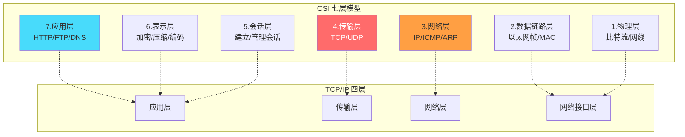
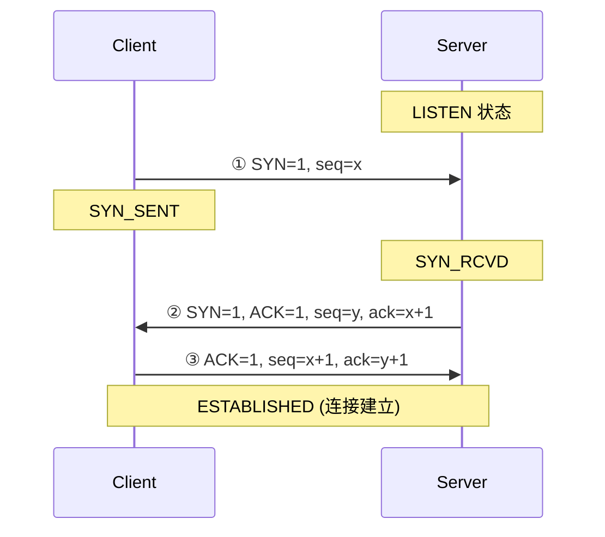
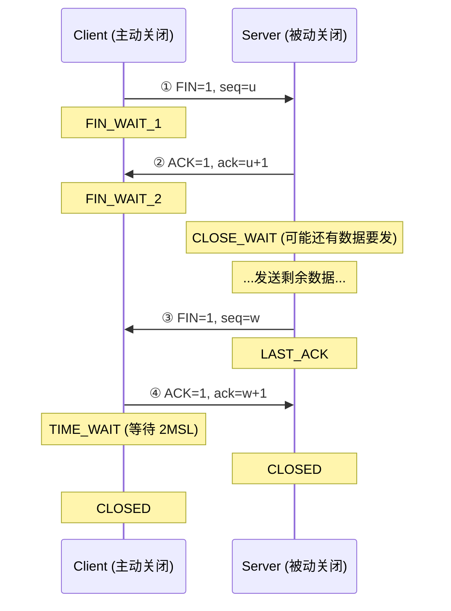
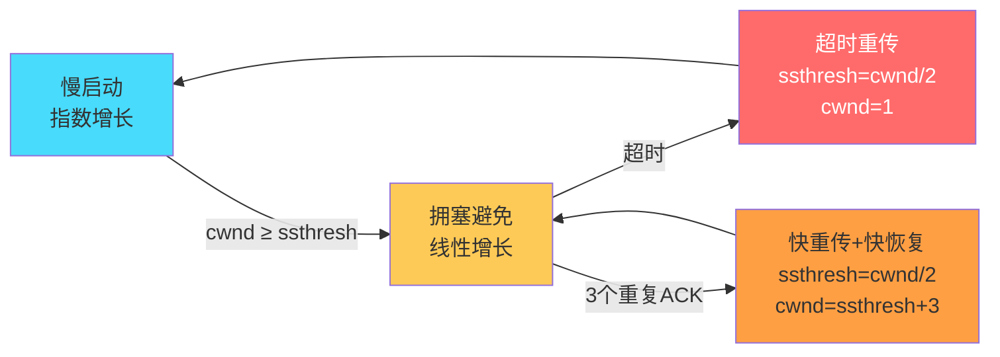
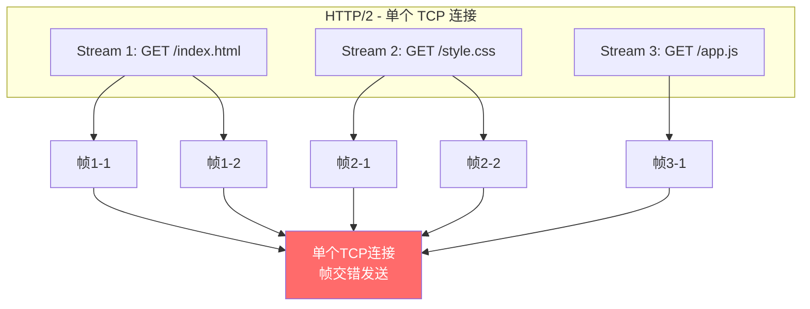
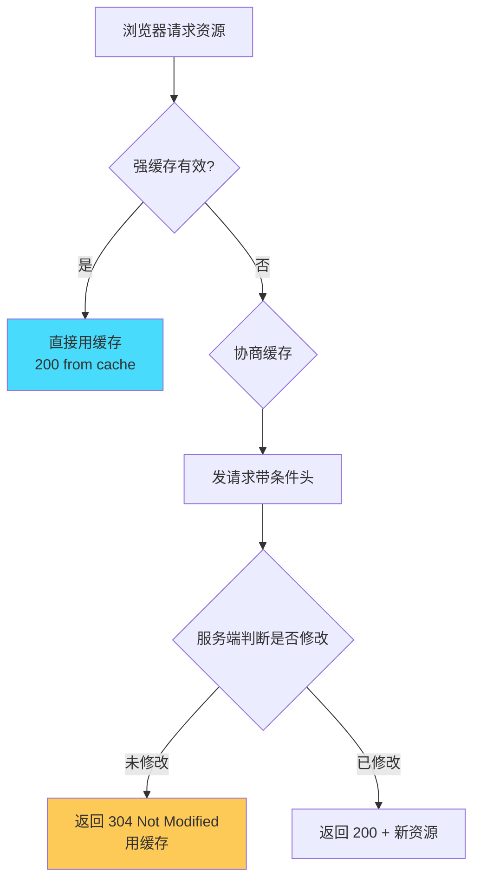
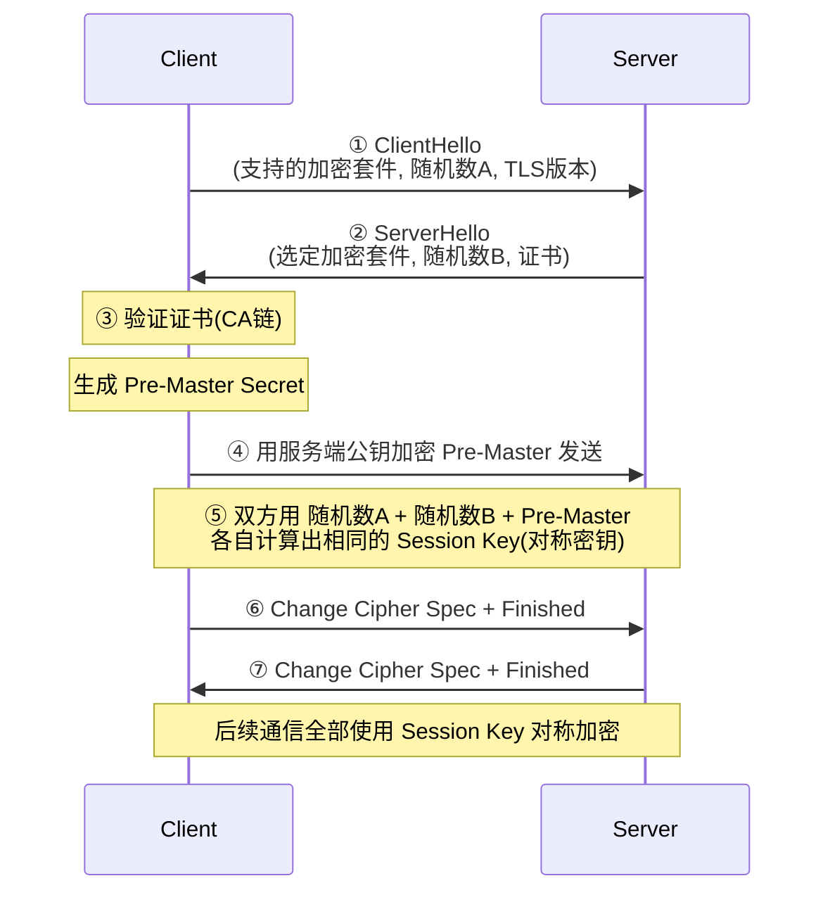
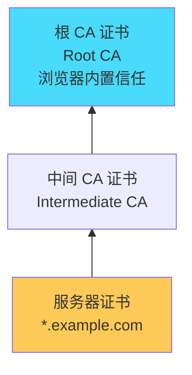
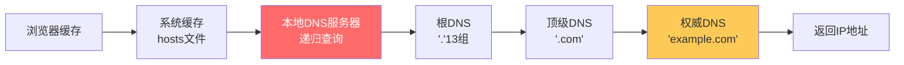
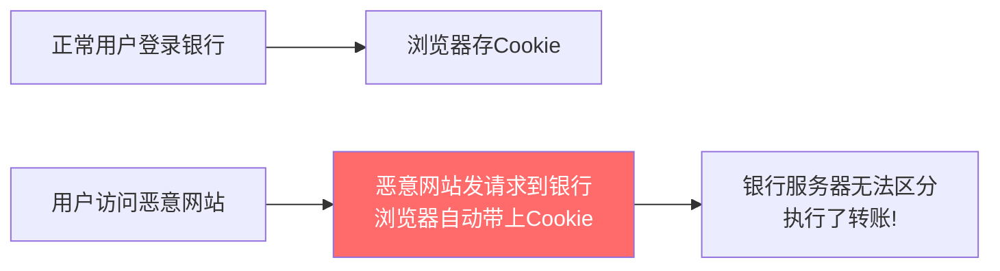

# 计算机网络面试总结 · 深度增强版

> 整理基础：`计算机网络面试总结.md`
> 风格：**大纲 → 细分知识点 → 图解 → 协议细节 → 面试官追问 + 答题模板**
> 适用：中高级 Java 后端 / 网络基础 / 面试

---

## 视觉规范说明

| 标记 | 含义 | 优先级 |
|------|------|--------|
| 🔴 **必背核心** | 面试必答，底层原理 | ⭐⭐⭐⭐⭐ |
| 🟠 **重点理解** | 高频考点，协议细节 | ⭐⭐⭐⭐ |
| 🟡 **加分项** | 拔高内容 | ⭐⭐⭐ |
| 🟢 **避坑提醒** | 实战陷阱 | ⭐⭐⭐ |
| `==高亮==` | 关键术语 / 数值 | 强化记忆 |

> 💡 **建议**：第一遍只看 🔴，把骨架建起来；第二遍看 🟠；第三遍 🟡🟢 拔高与避坑。

---

## 全文大纲

```
第一部分 · 网络分层模型
    1. OSI 七层 vs TCP/IP 四层
    2. 每层核心协议与设备

第二部分 · TCP 协议 ⭐⭐⭐⭐⭐
    3. 三次握手（深度）
    4. 四次挥手（深度）
    5. TCP 可靠传输机制
    6. 拥塞控制四阶段
    7. TCP vs UDP
    8. TCP 粘包/拆包

第三部分 · HTTP 协议 ⭐⭐⭐⭐⭐
    9. HTTP 报文结构
    10. 状态码详解
    11. HTTP 方法与幂等性
    12. HTTP 1.0 / 1.1 / 2.0 / 3.0 演进
    13. HTTP 缓存机制

第四部分 · HTTPS ⭐⭐⭐⭐
    14. TLS 握手过程
    15. 证书验证与 CA 链
    16. 对称 vs 非对称加密

第五部分 · DNS / WebSocket / 安全
    17. DNS 解析流程
    18. WebSocket 协议
    19. Cookie / Session / Token
    20. 常见网络攻击与防御

第六部分 · 面试官高频追问 Top 30
    STAR-S 答题模板 + 加分弹药库
```

---


# 第一部分 · 网络分层模型

## 1. OSI 七层 vs TCP/IP 四层

### 1.1 🔴 分层对照图



### 1.2 🔴 数据封装过程

```
应用层:    [HTTP 数据]
传输层:    [TCP头 | HTTP 数据]              → 段(Segment)
网络层:    [IP头 | TCP头 | HTTP 数据]       → 包(Packet)
链路层:    [帧头 | IP头 | TCP头 | 数据 | 帧尾] → 帧(Frame)
物理层:    01010110110...                    → 比特流(Bits)
```

### 1.3 🟠 每层关键设备与协议

| 层 | 关键协议 | 关键设备 | 寻址 |
|----|---------|---------|------|
| 应用层 | HTTP, HTTPS, DNS, FTP, SMTP | 无 | URL/域名 |
| 传输层 | ==TCP, UDP== | 无 | ==端口号== |
| 网络层 | ==IP, ICMP, ARP, OSPF== | ==路由器== | ==IP 地址== |
| 链路层 | Ethernet, WiFi (802.11) | ==交换机== | ==MAC 地址== |
| 物理层 | - | 集线器/网线/光纤 | - |

---

# 第二部分 · TCP 协议

## 2. 三次握手

### 2.1 🔴 完整握手过程



### 2.2 🔴 为什么是三次（不是两次/四次）

> 🔴 **核心原因**：==防止历史连接初始化==

| 次数 | 问题 |
|------|------|
| **两次** | 服务端无法确认客户端收到了 SYN+ACK → 可能是==历史过期的 SYN==到达服务端，服务端建立无效连接浪费资源 |
| **三次** | ✅ 双方都能确认对方的发送和接收能力正常 |
| **四次** | 没必要，三次已经足够确认双向通信能力 |

> 🟠 **三次握手的三重作用**：
> 1. ==确认双方收发能力==（Client 发收、Server 发收）
> 2. ==协商初始序列号 ISN==（防止历史报文干扰）
> 3. ==协商窗口大小==（Flow Control）

### 2.3 🟠 SYN Flood 攻击

> 🟠 **原理**：攻击者发送大量 SYN 但不回 ACK → 服务端 ==半连接队列== 被占满
>
> **防御**：
> - ==SYN Cookie==：不存半连接，在 SYN+ACK 中编码信息，收到第三次握手再验证
> - 增大半连接队列
> - 减小 SYN 超时重试次数

### 2.4 🟡 ISN 为什么随机

> 🟡 **原因**：
> 1. 防止==前一个连接的延迟报文==被新连接误认为有效数据
> 2. 防止==TCP 劫持攻击==（伪造序列号）
> 3. ISN 基于时钟 + 随机算法生成

---

## 3. 四次挥手

### 3.1 🔴 完整挥手过程



### 3.2 🔴 为什么是四次（不是三次）

> 🔴 **核心**：TCP 是==全双工==，每个方向需要独立关闭。
>
> - 客户端 FIN → 表示"我不再发数据了"
> - 服务端 ACK → "知道了"（但==我可能还有数据要发==）
> - 服务端 FIN → "我也发完了"
> - 客户端 ACK → "好的，关闭"
>
> 🟠 **能三次吗？** 如果服务端收到 FIN 时恰好也没数据要发，可以将 ACK 和 FIN 合并 → ==三次挥手==（延迟 ACK 机制）

### 3.3 🔴 TIME_WAIT 状态

> 🔴 **等待 2MSL（Maximum Segment Lifetime，通常 60s）的原因**：
> 1. ==确保最后一个 ACK 能到达==：如果丢了，对方会重发 FIN，这时还能收到并重发 ACK
> 2. ==让本连接的所有报文在网络中消失==：防止历史报文影响后续同端口新连接

> 🟢 **生产问题**：大量 TIME_WAIT 导致端口耗尽
> - `net.ipv4.tcp_tw_reuse = 1`（允许复用 TIME_WAIT 连接）
> - `net.ipv4.tcp_max_tw_buckets`（限制 TIME_WAIT 数量）
> - 使用连接池复用连接

### 3.4 🟠 CLOSE_WAIT 过多的问题

> 🟠 **CLOSE_WAIT 过多 = 服务端没有正确关闭连接**
>
> 原因：收到对端 FIN 后，自己没有调用 `close()`（代码 bug）
> - 排查：`netstat -anp | grep CLOSE_WAIT`
> - 修复：检查是否有 Socket/Connection 未正确关闭（try-with-resources）

---

## 4. TCP 可靠传输机制

### 4.1 🔴 六大保障机制

| 机制 | 说明 | 作用 |
|------|------|------|
| **序列号/确认号** | 每个字节编号，ACK 确认 | 检测丢失、去重、排序 |
| **超时重传** | RTO 内未收到 ACK 则重传 | 应对丢包 |
| **滑动窗口** | 允许发送多个未确认段 | 提高吞吐 |
| **流量控制** | 接收方通过 ==rwnd== 告知可接收量 | 防止接收方过载 |
| **拥塞控制** | 慢启动/拥塞避免/快重传/快恢复 | 防止网络过载 |
| **校验和** | 伪首部 + 头 + 数据校验 | 检测传输错误 |

### 4.2 🔴 滑动窗口

```
发送方窗口:
┌────┬────┬────┬────┬────┬────┬────┬────┬────┬────┐
│已发│已发│已发│可发│可发│可发│不可│不可│不可│不可│
│已确│已确│未确│未发│未发│未发│发  │发  │发  │发  │
└────┴────┴────┴────┴────┴────┴────┴────┴────┴────┘
      ↑                      ↑
   窗口左边界            窗口右边界
   (收到ACK右移)         (= 左边界 + 窗口大小)
```

> 🟠 **窗口大小 = min(rwnd, cwnd)**
> - `rwnd`：接收方通告的接收窗口（流量控制）
> - `cwnd`：发送方维护的拥塞窗口（拥塞控制）

---

## 5. 拥塞控制

### 5.1 🔴 四个阶段



| 阶段 | cwnd 变化 | 触发条件 |
|------|----------|---------|
| **慢启动** | 每 RTT ==翻倍==(1→2→4→8) | 初始/超时后 |
| **拥塞避免** | 每 RTT ==+1== | cwnd ≥ ssthresh |
| **快重传** | 收到 3 个重复 ACK → 立即重传 | 不等超时 |
| **快恢复** | ssthresh=cwnd/2, cwnd=ssthresh+3 → 线性增长 | 紧跟快重传 |

### 5.2 🟠 慢启动 vs 拥塞避免

```
cwnd
  │                    ╳ 超时丢包
  │                   ╱
  │   拥塞避免      ╱
  │   (线性+1)    ╱
  │             ╱ ← ssthresh (阈值)
  │           ╱
  │    慢启动╱ (指数翻倍)
  │        ╱
  │      ╱
  │    ╱
  │  ╱
  │╱
  └──────────────────────── RTT 轮次
```

### 5.3 🟡 BBR 拥塞控制（Google）

> 🟡 **加分**：传统拥塞控制（Reno/Cubic）基于==丢包==判断拥塞，BBR 基于==带宽和 RTT==：
> - 探测最大带宽（BtlBw）
> - 探测最小 RTT（RTprop）
> - 目标：让网络工作在最优点（带宽满、延迟低）
> - 适用：长肥网络（高带宽高延迟），比如跨国链路

---

## 6. TCP vs UDP

### 6.1 🔴 全面对比

| 维度 | TCP | UDP |
|------|-----|-----|
| 连接 | ==面向连接==（三次握手） | ==无连接== |
| 可靠性 | ✅ 可靠（重传/排序/去重） | ❌ 不可靠（尽力交付） |
| 有序 | ✅ 保证有序 | ❌ 不保证 |
| 流量控制 | ✅ 滑动窗口 | ❌ |
| 拥塞控制 | ✅ | ❌ |
| 头部大小 | ==20 字节==（最小） | ==8 字节== |
| 传输方式 | 字节流 | 数据报 |
| 一对多 | 点对点 | 支持广播/多播 |
| 速度 | 较慢 | ⭐ 快 |
| 场景 | HTTP/文件传输/邮件 | DNS/视频/游戏/直播/IoT |

### 6.2 🟠 UDP 头部结构（8 字节）

```
 0      7 8     15 16    23 24    31
+--------+--------+--------+--------+
|     源端口      |    目的端口      |
+--------+--------+--------+--------+
|     UDP长度     |    UDP校验和     |
+--------+--------+--------+--------+
|             数据部分               |
+--------+--------+--------+--------+
```

### 6.3 🟡 基于 UDP 实现可靠传输

> 🟡 **加分**：QUIC（HTTP/3 底层）基于 UDP 实现了：
> - 自定义序列号 + ACK 机制
> - 前向纠错（FEC）
> - 0-RTT 连接建立
> - 多路复用（无队头阻塞）
> - 连接迁移（Connection ID 而非四元组）

---

## 7. TCP 粘包/拆包

### 7.1 🔴 什么是粘包/拆包

> 🔴 **TCP 是字节流协议，没有消息边界**，所以：
> - **粘包**：发送方连续发两条消息，接收方一次收到合在一起
> - **拆包**：一条消息被拆成多次接收

```
发送方发了:    [消息A][消息B]
接收方收到:
  情况1(粘包): [消息A消息B]          ← 合在一起
  情况2(拆包): [消息A的前半] [A后半+消息B]  ← 消息被拆开
  情况3(正常): [消息A] [消息B]        ← 理想情况
```

### 7.2 🔴 解决方案

| 方案 | 实现 | 例子 |
|------|------|------|
| **固定长度** | 每条消息固定 N 字节 | 简单但浪费 |
| **分隔符** | 消息间用特殊字符分隔 | HTTP 用 `\r\n`，Redis 用 `\r\n` |
| **长度前缀** ⭐ | 消息头标明消息体长度 | ==最常用==，如 `[4字节长度][消息体]` |
| **自定义协议** | 魔数+版本+长度+类型+数据 | Dubbo/RocketMQ |

```java
// Netty 中的解决方案
// 1. 固定长度
pipeline.addLast(new FixedLengthFrameDecoder(64));

// 2. 分隔符
pipeline.addLast(new DelimiterBasedFrameDecoder(1024, delimiter));

// 3. 长度字段 (最常用)
pipeline.addLast(new LengthFieldBasedFrameDecoder(
    maxFrameLength, lengthFieldOffset, lengthFieldLength));
```

---


# 第三部分 · HTTP 协议

## 8. HTTP 报文结构

### 8.1 🔴 请求报文

```
┌──────────────────────────────────────────┐
│ 请求行: GET /api/users?page=1 HTTP/1.1   │
├──────────────────────────────────────────┤
│ 请求头:                                   │
│   Host: api.example.com                   │
│   Content-Type: application/json          │
│   Authorization: Bearer xxx               │
│   Accept: application/json                │
│   Connection: keep-alive                  │
├──────────────────────────────────────────┤
│ 空行 (\r\n)                               │
├──────────────────────────────────────────┤
│ 请求体: {"name":"Tom","age":25}           │
└──────────────────────────────────────────┘
```

### 8.2 🔴 响应报文

```
┌──────────────────────────────────────────┐
│ 状态行: HTTP/1.1 200 OK                  │
├──────────────────────────────────────────┤
│ 响应头:                                   │
│   Content-Type: application/json          │
│   Content-Length: 128                     │
│   Cache-Control: max-age=3600            │
│   Set-Cookie: sid=abc; HttpOnly           │
├──────────────────────────────────────────┤
│ 空行 (\r\n)                               │
├──────────────────────────────────────────┤
│ 响应体: {"id":1,"name":"Tom"}            │
└──────────────────────────────────────────┘
```

---

## 9. HTTP 状态码

### 9.1 🔴 五大分类 + 必记状态码

| 分类 | 含义 | 必记状态码 |
|------|------|-----------|
| **1xx** | 信息性 | `100 Continue`（大文件上传前确认） |
| **2xx** | ✅ 成功 | `200 OK` / `201 Created` / `204 No Content` |
| **3xx** | 重定向 | `301 永久` / `302 临时` / `304 Not Modified`(缓存) |
| **4xx** | 客户端错误 | `400 Bad Request` / `401 未认证` / `403 禁止` / `404 未找到` / `405 方法不允许` / `429 限流` |
| **5xx** | 服务端错误 | `500 内部错误` / `502 Bad Gateway` / `503 服务不可用` / `504 网关超时` |

### 9.2 🟠 301 vs 302 vs 307 vs 308

| 状态码 | 含义 | 方法变化 | 缓存 |
|--------|------|---------|------|
| 301 | 永久重定向 | POST 可能变 GET | ✅ 浏览器缓存 |
| 302 | 临时重定向 | POST 可能变 GET | ❌ |
| 307 | 临时重定向 | ==不允许改方法== | ❌ |
| 308 | 永久重定向 | ==不允许改方法== | ✅ |

### 9.3 🟠 502 vs 504

> 🟠 **后端开发常见错误**：
> - **502 Bad Gateway**：网关（Nginx）收到了上游的==无效响应==（上游挂了/返回异常）
> - **504 Gateway Timeout**：网关等上游==超时==了（上游处理太慢）

---

## 10. HTTP 方法与幂等性

### 10.1 🔴 方法对照表

| 方法 | 语义 | 幂等 | 安全 | 有请求体 | 用途 |
|------|------|:----:|:----:|:--------:|------|
| GET | 获取资源 | ✅ | ✅ | 通常无 | 查询 |
| POST | 创建资源 | ❌ | ❌ | ✅ | 创建/提交 |
| PUT | 全量替换 | ✅ | ❌ | ✅ | 全量更新 |
| PATCH | 部分更新 | ❌ | ❌ | ✅ | 局部修改 |
| DELETE | 删除资源 | ✅ | ❌ | 通常无 | 删除 |
| HEAD | 获取头信息 | ✅ | ✅ | 无 | 检查资源 |
| OPTIONS | 查询支持方法 | ✅ | ✅ | 无 | CORS 预检 |

### 10.2 🔴 幂等性的含义

> 🔴 **幂等**：==执行 1 次和执行 N 次效果相同==（不考虑并发）
>
> - GET 幂等：多次获取结果相同
> - PUT 幂等：多次全量替换结果相同
> - DELETE 幂等：删一次和删多次结果相同（已删除）
> - POST 不幂等：每次创建新资源
>
> 🟢 **实际开发**：要通过==业务手段==保证幂等（Token/唯一索引/状态机）

### 10.3 🟠 GET vs POST 深度对比

| 维度 | GET | POST |
|------|-----|------|
| 参数位置 | URL Query String | Request Body |
| 参数可见性 | 暴露在 URL 中 | Body 中（相对隐藏） |
| URL 长度限制 | 浏览器有限制（~2KB） | 无限制 |
| 缓存 | ✅ 可被缓存 | ❌ 默认不缓存 |
| 书签 | ✅ 可收藏 | ❌ |
| 幂等 | ✅ | ❌ |
| 编码 | application/x-www-form-urlencoded | 多种(form/json/multipart) |

> 🟢 **避坑**：从==协议层面== GET 也可以有 Body（但很多实现不支持），POST 也可以无 Body。区别主要在==语义==。

---

## 11. HTTP 版本演进

### 11.1 🔴 四代 HTTP 对比

| 版本 | 传输层 | 关键特性 | 痛点 |
|------|--------|---------|------|
| HTTP/1.0 | TCP | 短连接（每次请求新建 TCP） | 连接开销大 |
| HTTP/1.1 | TCP | ==长连接== / 管线化 / Host / 分块传输 | ==队头阻塞== |
| HTTP/2 | TCP | ==多路复用== / 头压缩 / 二进制帧 / 推送 | TCP 层队头阻塞 |
| HTTP/3 | ==UDP(QUIC)== | 0-RTT / 无队头阻塞 / 连接迁移 | 部署复杂 |

### 11.2 🔴 HTTP/1.1 的队头阻塞

```
HTTP/1.1 (管线化也有问题):
  请求1 ─→ 响应1(慢!) ─→ 请求2 ─→ 响应2 ─→ 请求3 ─→ 响应3
                    ↑
           响应必须按请求顺序返回，1慢了2、3都等着

解决:
  浏览器对同一域名开 6 个 TCP 连接（并发）
  但连接数有限，仍不够理想
```

### 11.3 🔴 HTTP/2 多路复用



> 🔴 **核心**：
> - 一个 TCP 连接内多个 ==Stream==（逻辑流）
> - 每个 Stream 由多个 ==Frame==（二进制帧）组成
> - 帧可以==交错发送==，接收端按 Stream ID 重组
> - 解决了 HTTP 层的队头阻塞，但 ==TCP 层丢包仍会阻塞所有 Stream==

### 11.4 🟠 HTTP/2 其他特性

| 特性 | 说明 |
|------|------|
| **头部压缩 (HPACK)** | 静态表 + 动态表 + 霍夫曼编码，减少重复 Header |
| **二进制帧** | 不再是文本协议，解析更高效 |
| **服务端推送** | 服务端主动推送资源（如推 CSS/JS） |
| **流优先级** | 可指定 Stream 优先级 |

### 11.5 🟡 HTTP/3 (QUIC)

> 🟡 **核心改进**：
> - 基于 ==UDP==，解决 TCP 层队头阻塞
> - ==0-RTT 连接建立==（之前连过的服务器）
> - ==连接迁移==：切换网络(WiFi→4G)不断连（基于 Connection ID）
> - 每个 Stream 独立，一个丢包不影响其他

---

## 12. HTTP 缓存机制

### 12.1 🔴 强缓存 vs 协商缓存



### 12.2 🔴 缓存控制字段

| 类型 | 请求/响应头 | 说明 |
|------|-----------|------|
| **强缓存** | `Cache-Control: max-age=3600` | ⭐ 优先级最高，秒数 |
| 强缓存 | `Expires: Wed, 21 Oct 2025 07:28:00 GMT` | 绝对时间（已过时） |
| **协商缓存** | `ETag / If-None-Match` | ⭐ 文件内容 hash |
| 协商缓存 | `Last-Modified / If-Modified-Since` | 修改时间（秒级精度） |

> 🟠 **优先级**：`Cache-Control` > `Expires`；`ETag` > `Last-Modified`

### 12.3 🟠 Cache-Control 指令

| 指令 | 含义 |
|------|------|
| `max-age=N` | 缓存 N 秒内有效 |
| `no-cache` | 有缓存但==每次需要协商验证== |
| `no-store` | ==完全不缓存== |
| `public` | CDN 等中间节点可缓存 |
| `private` | 只允许浏览器缓存 |
| `must-revalidate` | 过期后必须验证 |

---


# 第四部分 · HTTPS

## 13. TLS 握手过程

### 13.1 🔴 HTTPS = HTTP + TLS/SSL



### 13.2 🔴 为什么用混合加密

> 🔴 **设计思路**：
> - ==非对称加密==（RSA/ECDHE）：用于==交换对称密钥==（安全但慢）
> - ==对称加密==（AES）：用于==传输数据==（快但需要安全传递密钥）
> - 两者结合：既安全又高效

| 加密方式 | 速度 | 密钥管理 | HTTPS 用途 |
|---------|------|---------|-----------|
| 对称（AES） | ⭐⭐⭐⭐⭐ 快 | 一把密钥，分发困难 | 加密通信数据 |
| 非对称（RSA/ECC） | ⭐ 慢(100~1000倍) | 公钥公开，私钥自留 | 交换对称密钥 |

### 13.3 🟠 TLS 1.2 vs TLS 1.3

| 维度 | TLS 1.2 | TLS 1.3 |
|------|---------|---------|
| 握手 RTT | ==2-RTT== | ==1-RTT==（恢复 0-RTT） |
| 密钥交换 | RSA / ECDHE | ==仅 ECDHE==（前向安全） |
| 对称加密 | AES-CBC / AES-GCM | ==仅 AEAD==（AES-GCM/ChaCha20） |
| 安全性 | 支持不安全算法 | 移除 RSA 密钥交换/RC4/3DES 等 |

### 13.4 🟡 前向安全（Forward Secrecy）

> 🟡 **加分**：即使服务端私钥泄露，历史通信记录也无法被解密。
>
> - RSA 密钥交换：❌ 私钥泄露 → Pre-Master 可解密 → 所有历史通信暴露
> - ==ECDHE 密钥交换==：✅ 每次握手生成临时密钥对，私钥泄露也无法解密历史（TLS 1.3 强制）

---

## 14. 证书验证

### 14.1 🔴 CA 证书链验证



> 🔴 **验证流程**：
> 1. 服务端发送证书（含公钥 + 域名 + CA 数字签名）
> 2. 客户端用 ==CA 公钥== 验证签名（浏览器内置根 CA 证书）
> 3. 验证 ==域名== 是否匹配
> 4. 验证 ==有效期==
> 5. 检查 ==CRL/OCSP== 是否被吊销

### 14.2 🟠 数字签名原理

```
签名过程 (服务端/CA):
  原文 → SHA256 哈希 → 用私钥加密哈希值 → 数字签名

验证过程 (客户端):
  1. 用 CA 公钥解密签名 → 得到哈希值 H1
  2. 对证书原文做 SHA256 → 得到哈希值 H2
  3. H1 == H2 → 签名有效，证书未被篡改
```

---

# 第五部分 · DNS / WebSocket / 安全

## 15. DNS 解析

### 15.1 🔴 解析流程



> 🔴 **两种查询方式**：
> - **递归查询**：客户端 → 本地 DNS（本地 DNS 帮你查到底，返回最终结果）
> - **迭代查询**：本地 DNS → 根 → 顶级 → 权威（每次返回下一步地址）

### 15.2 🟠 DNS 记录类型

| 类型 | 含义 | 示例 |
|------|------|------|
| A | 域名 → IPv4 | `example.com → 1.2.3.4` |
| AAAA | 域名 → IPv6 | |
| CNAME | 别名 → 真实域名 | `www → example.com` |
| MX | 邮件服务器 | |
| NS | 域名服务器 | |
| TXT | 文本记录（SPF/DKIM） | |

### 15.3 🟡 DNS 优化

> 🟡 **前端优化手段**：
> - `dns-prefetch`：提前解析第三方域名
> - `preconnect`：提前建立 TCP + TLS 连接
> - HTTPDNS：绕过运营商 LocalDNS，防劫持（移动端常用）

---

## 16. WebSocket

### 16.1 🔴 WebSocket vs HTTP

| 维度 | HTTP | WebSocket |
|------|------|-----------|
| 连接类型 | 半双工（请求-响应） | ==全双工==（双向实时） |
| 通信方向 | 客户端发起 | 双方都可主动发 |
| 连接保持 | 短连接/长连接 | ==持久连接== |
| 头部开销 | 每次完整 Header | 握手后极小帧头（==2~14 字节==） |
| 协议标识 | `http://` / `https://` | `ws://` / `wss://` |
| 适用 | 请求-响应 | ==实时推送/聊天/协作/游戏== |

### 16.2 🔴 WebSocket 握手（协议升级）

```
客户端请求:
GET /chat HTTP/1.1
Host: example.com
Upgrade: websocket            ← 协议升级
Connection: Upgrade
Sec-WebSocket-Key: base64...  ← 验证密钥
Sec-WebSocket-Version: 13

服务端响应:
HTTP/1.1 101 Switching Protocols
Upgrade: websocket
Connection: Upgrade
Sec-WebSocket-Accept: base64...  ← Key + GUID → SHA1 → Base64

→ 后续使用 WebSocket 帧通信（二进制帧，不再是 HTTP）
```

### 16.3 🟠 心跳保活

> 🟠 **为什么需要心跳**：
> - 中间代理/防火墙可能关闭空闲连接
> - 检测连接是否断开
>
> **实现**：WebSocket 协议定义了 ==Ping/Pong== 帧
> - 客户端/服务端定期发 Ping
> - 对端收到后必须回 Pong
> - 超时未收到 → 判定连接断开，重连

---

## 17. Cookie / Session / Token

### 17.1 🔴 三者全面对比

| 维度 | Cookie | Session | JWT Token |
|------|--------|---------|-----------|
| 存储位置 | ==客户端浏览器== | ==服务端==（内存/Redis） | ==客户端== |
| 大小限制 | ≤ 4KB | 无限制 | 较大（头+载荷+签名） |
| 安全性 | 可被窃取(XSS) | 相对安全 | 签名防篡改 |
| 跨域 | ❌ 同源限制 | ❌ | ✅（放 Header） |
| 分布式支持 | ✅ 天然 | ❌ 需共享(==Redis==) | ✅ 天然(无状态) |
| 有效期 | 可设置 Expires | 服务端控制 | Token 内含 exp 字段 |
| 服务端存储 | 无 | 有（内存压力） | ==无==（无状态） |

### 17.2 🟠 JWT 结构

```
Header.Payload.Signature
  ↓       ↓        ↓
Base64  Base64   HMACSHA256(
                   base64(header) + "." + base64(payload),
                   secret
                 )

// Header: {"alg":"HS256","typ":"JWT"}
// Payload: {"sub":"1234","name":"Tom","iat":1516239022,"exp":...}
// Signature: 防篡改签名
```

> 🟢 **JWT 的坑**：
> - Token ==不能主动失效==（除非用黑名单/短有效期+Refresh Token）
> - Payload 只是 Base64 编码，==不是加密==（不要放敏感信息）
> - Token 过大会增加每次请求的网络开销

---

## 18. 网络安全

### 18.1 🔴 常见攻击与防御

| 攻击 | 原理 | 防御 |
|------|------|------|
| **XSS** | 注入恶意 JS 脚本到页面 | 输出转义 / CSP / ==HttpOnly Cookie== |
| **CSRF** | 伪造用户请求（借 Cookie） | ==CSRF Token== / SameSite Cookie / Referer 检查 |
| **SQL 注入** | 拼接恶意 SQL | ==PreparedStatement== / ORM / 参数校验 |
| **DDoS** | 大量请求耗尽资源 | CDN / 限流 / 黑名单 / 高防 IP |
| **中间人** | 劫持通信窃听篡改 | ==HTTPS== / 证书固定(HPKP) |

### 18.2 🔴 XSS 三种类型

| 类型 | 存储位置 | 触发方式 | 例子 |
|------|---------|---------|------|
| 反射型 | URL 参数 | 点击恶意链接 | `?q=<script>alert(1)</script>` |
| 存储型 | ==数据库== | 访问含恶意内容页面 | 评论区注入脚本 |
| DOM 型 | 前端 JS | 前端不安全操作 DOM | `innerHTML = userInput` |

### 18.3 🔴 CSRF 防御详解



> 🔴 **防御方案**：
> 1. ==CSRF Token==：表单中加随机 Token，服务端验证
> 2. ==SameSite Cookie==：`Set-Cookie: sid=xxx; SameSite=Strict`（跨站不带 Cookie）
> 3. ==Referer/Origin 检查==：验证请求来源
> 4. ==双重 Cookie==：Cookie 中的值放到请求参数中，对比一致

---

# 第六部分 · 面试官高频追问 Top 30

## 🔴 STAR-S 答题模板

```
S - Situation: 背景（一句话）
T - Task: 任务/问题
A - Action: 你的方案（技术细节）
R - Result: 结果（量化数据）
S - Summary: 总结/延伸
```

## 面试追问清单

| # | 追问 | 答题关键词 |
|---|------|-----------|
| 1 | TCP 三次握手过程 | SYN→SYN+ACK→ACK / 确认双方收发 / 防历史连接 |
| 2 | 为什么不是两次握手 | 服务端无法确认客户端可达 / 历史 SYN 导致脏连接 |
| 3 | 四次挥手过程 | FIN→ACK→FIN→ACK / 全双工独立关闭 |
| 4 | 为什么 TIME_WAIT | 确保 ACK 到达 / 让旧报文消失 / 2MSL |
| 5 | TIME_WAIT 过多怎么办 | tcp_tw_reuse / 连接池 / 短连接改长连接 |
| 6 | TCP 如何保证可靠 | 序列号+ACK / 重传 / 滑动窗口 / 拥塞控制 / 校验和 |
| 7 | 拥塞控制四个阶段 | 慢启动(指数) / 拥塞避免(线性) / 快重传 / 快恢复 |
| 8 | TCP vs UDP | 连接/可靠/有序/速度/头部/场景 |
| 9 | TCP 粘包怎么解决 | 长度前缀 / 分隔符 / 固定长度 |
| 10 | HTTP vs HTTPS | 明文vs加密 / 端口80vs443 / 证书 / 性能开销 |
| 11 | HTTPS 握手过程 | ClientHello→ServerHello→证书→Pre-Master→对称密钥 |
| 12 | 为什么用混合加密 | 非对称交换密钥(安全但慢) + 对称传数据(快) |
| 13 | HTTP/2 新特性 | 多路复用 / 头压缩HPACK / 二进制帧 / 推送 |
| 14 | HTTP/2 如何解决队头阻塞 | Stream 多路复用(但TCP层仍有) / HTTP/3 用QUIC彻底解决 |
| 15 | GET vs POST 区别 | 语义/幂等/参数位置/缓存/书签/安全 |
| 16 | 301 vs 302 | 永久vs临时 / 浏览器缓存vs不缓存 / SEO影响 |
| 17 | HTTP 缓存机制 | 强缓存(Cache-Control/Expires) / 协商缓存(ETag/Last-Modified) |
| 18 | Cookie vs Session vs Token | 存储位置 / 分布式 / 跨域 / 有状态vs无状态 |
| 19 | JWT 的优缺点 | 无状态/跨域/不能主动失效/Payload不加密 |
| 20 | DNS 解析流程 | 浏览器→系统→本地DNS→根→顶级→权威 |
| 21 | WebSocket 和 HTTP 区别 | 全双工/持久连接/主动推送/帧头小 |
| 22 | XSS 和 CSRF 区别 | XSS注入脚本 / CSRF借Cookie伪造请求 |
| 23 | 如何防 CSRF | Token / SameSite / Referer / 双重Cookie |
| 24 | 输入 URL 到页面显示全过程 | DNS→TCP→TLS→HTTP→服务端处理→响应→渲染 |
| 25 | 浏览器渲染过程 | DOM树→CSSOM→RenderTree→Layout→Paint→Composite |
| 26 | TCP 半连接队列与全连接队列 | SYN队列(半连接) / Accept队列(全连接) / SYN Flood |
| 27 | Keep-Alive 的作用 | 复用TCP连接 / 减少握手开销 / 超时关闭 |
| 28 | QUIC 相比 TCP 的优势 | 0-RTT / 无队头阻塞 / 连接迁移 / 用户态实现 |
| 29 | 正向代理和反向代理 | 正向代客户端 / 反向代服务端(Nginx) |
| 30 | CDN 工作原理 | DNS CNAME → 边缘节点缓存 → 就近返回 |

---

## 🟡 加分弹药库

> **深度延伸方向**（面试官可能追问）：
> 1. **TCP 的 Nagle 算法和延迟 ACK 的冲突**（小包合并 vs 等待合并 ACK → 增大延迟）
> 2. **epoll 的 LT 和 ET 模式区别**（Level Trigger vs Edge Trigger）
> 3. **HTTP/2 的 HPACK 头部压缩原理**（静态表 61 条 + 动态表 + 霍夫曼编码）
> 4. **TLS 1.3 的 0-RTT 安全问题**（重放攻击风险）
> 5. **TCP 的 Fast Open（TFO）**（在 SYN 中携带数据，减少 RTT）
> 6. **跨域问题和 CORS 预检请求的详细流程**（OPTIONS + Access-Control-* 头）

---

*整理完成，祝面试顺利！*
