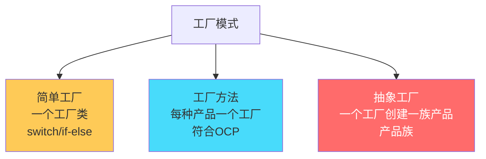
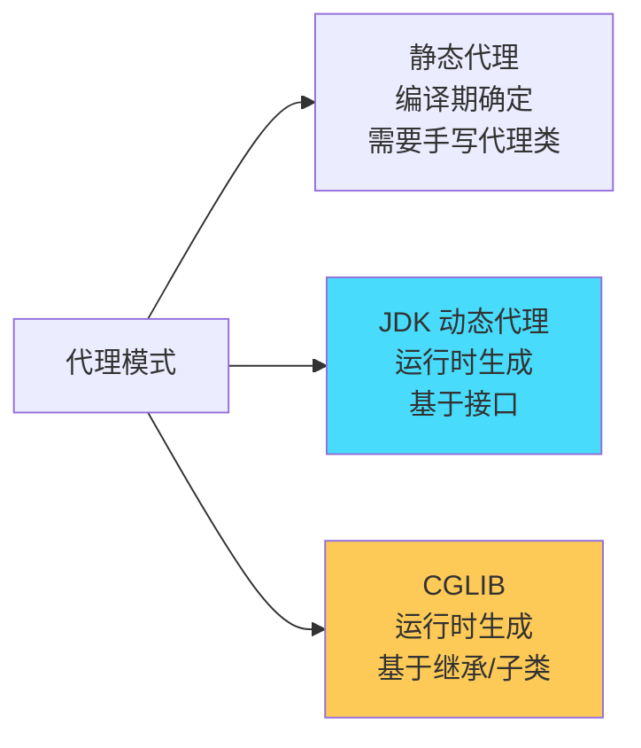
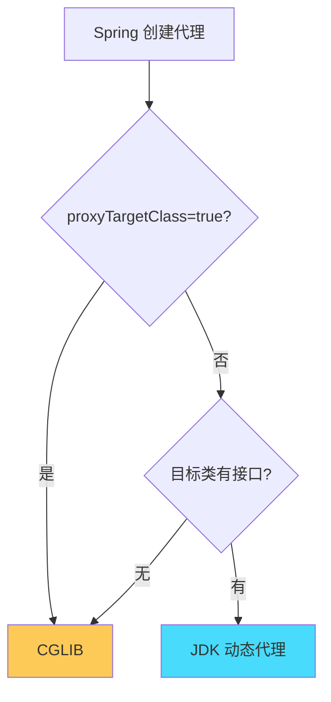
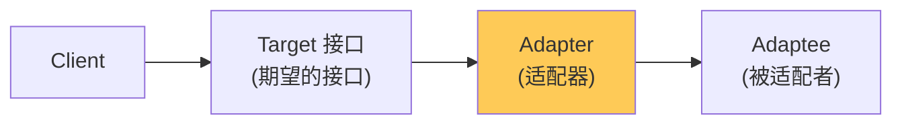
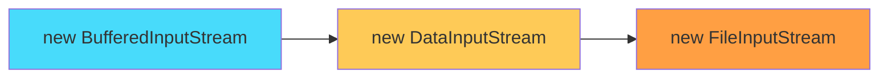
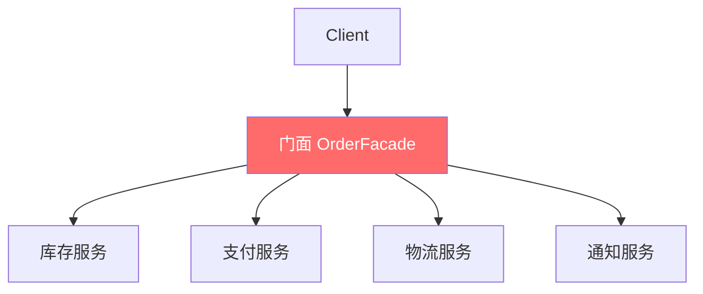
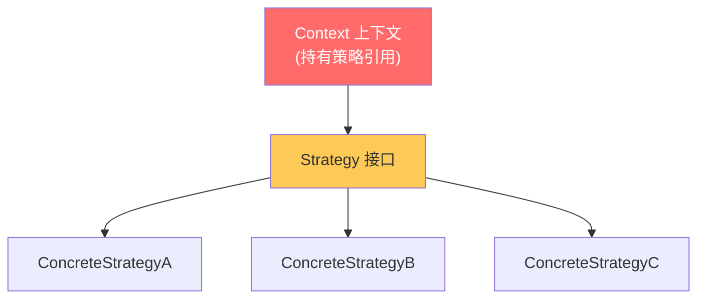
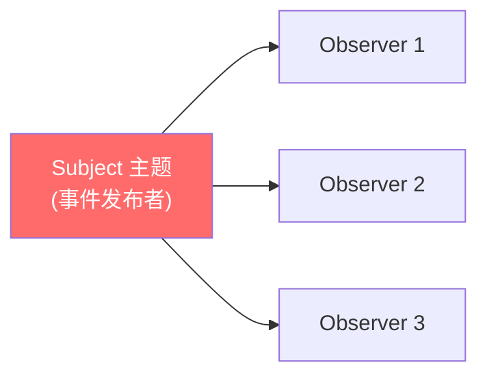
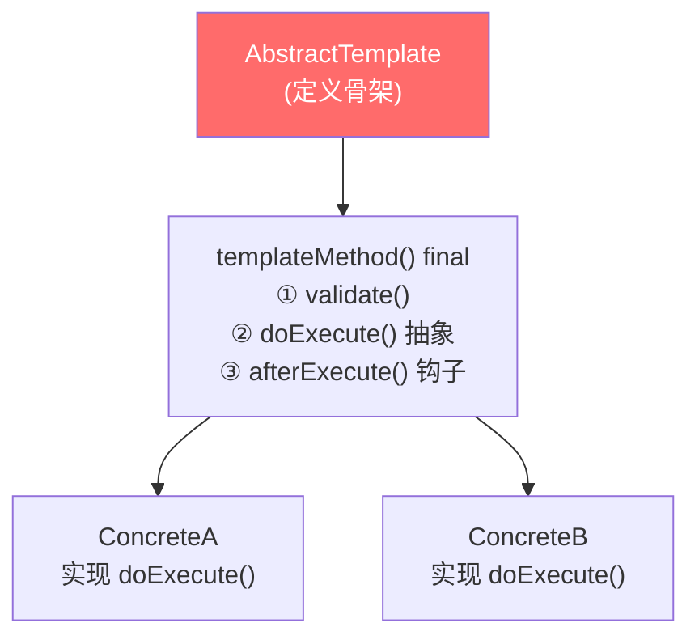
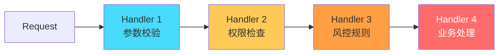

# 设计模式面试总结 · 深度增强版

> 整理基础：`设计模式面试总结.md`
> 风格：**大纲 → 细分知识点 → 图解 → 关键源码 → 面试官追问 + 答题模板**
> 适用：中高级 Java 后端 / 设计模式 / Spring 源码面试

---

## 视觉规范说明

| 标记 | 含义 | 优先级 |
|------|------|--------|
| 🔴 **必背核心** | 面试必答，底层原理 | ⭐⭐⭐⭐⭐ |
| 🟠 **重点理解** | 高频考点，源码级路径 | ⭐⭐⭐⭐ |
| 🟡 **加分项** | 拔高内容 | ⭐⭐⭐ |
| 🟢 **避坑提醒** | 实战陷阱 | ⭐⭐⭐ |
| `==高亮==` | 关键术语 / 数值 | 强化记忆 |

> 💡 **建议**：第一遍只看 🔴，把骨架建起来；第二遍看 🟠；第三遍 🟡🟢 拔高与避坑。

---

## 全文大纲

```
第一部分 · 设计原则 SOLID ⭐⭐⭐⭐
    1. 六大设计原则详解

第二部分 · 创建型模式 ⭐⭐⭐⭐⭐
    2. 单例模式（5种写法+破坏防御）
    3. 工厂模式（简单/方法/抽象）
    4. 建造者模式
    5. 原型模式

第三部分 · 结构型模式 ⭐⭐⭐⭐
    6. 代理模式（静态/JDK/CGLIB）
    7. 适配器模式
    8. 装饰器模式
    9. 门面/外观模式
    10. 组合模式

第四部分 · 行为型模式 ⭐⭐⭐⭐⭐
    11. 策略模式（消除 if-else）
    12. 观察者模式（事件驱动）
    13. 模板方法模式
    14. 责任链模式
    15. 状态模式

第五部分 · Spring 框架中的设计模式
    16. Spring 设计模式全景图

第六部分 · 面试官高频追问 Top 30
    STAR-S 答题模板 + 加分弹药库
```

---


# 第一部分 · 设计原则 SOLID

## 1. 六大设计原则

### 1.1 🔴 SOLID 原则速记表

| 原则 | 英文 | 一句话 | 反例 |
|------|------|--------|------|
| **S** 单一职责 | Single Responsibility | ==一个类只有一个变化的原因== | 一个类既管业务又管日志又管数据库 |
| **O** 开闭原则 | Open/Closed | ==对扩展开放，对修改关闭== | 加新功能要改原代码的 if-else |
| **L** 里氏替换 | Liskov Substitution | ==子类可以替换父类而不破坏程序== | 正方形继承矩形，setWidth 破坏了行为 |
| **I** 接口隔离 | Interface Segregation | ==接口要小而专，不强迫实现不需要的方法== | 一个万能接口有 20 个方法 |
| **D** 依赖倒置 | Dependency Inversion | ==依赖抽象，不依赖具体== | Service 直接 new Dao() |

### 1.2 🟠 额外常用原则

| 原则 | 说明 | 应用 |
|------|------|------|
| **迪米特法则**（最少知识） | 一个对象应该对其他对象知道得越少越好 | 只和直接朋友通信，不找朋友的朋友 |
| **组合优于继承** | 优先使用组合/聚合，而非继承 | 策略模式、装饰器模式 |
| **DRY** (Don't Repeat Yourself) | 避免重复代码 | 提取方法/模板方法 |

### 1.3 🔴 开闭原则实战

```java
// ❌ 违反开闭原则: 每加一种类型就要改代码
public double calculatePrice(String type, double price) {
    if ("vip".equals(type)) return price * 0.8;
    else if ("svip".equals(type)) return price * 0.6;
    else return price;
    // 新增类型 → 修改这里 → 违反OCP
}

// ✅ 遵循开闭原则: 新增类型只需新增类
public interface PriceStrategy {
    double calculate(double price);
}
public class VipStrategy implements PriceStrategy {
    public double calculate(double price) { return price * 0.8; }
}
// 新增 SvipStrategy、StudentStrategy... 无需修改原代码
```

---

# 第二部分 · 创建型模式

## 2. 单例模式

### 2.1 🔴 五种实现方式对比

| 写法 | 线程安全 | 懒加载 | 防反射 | 防序列化 | 推荐度 |
|------|:--------:|:------:|:------:|:--------:|:------:|
| 饿汉式 | ✅ | ❌ | ❌ | ❌ | ⭐⭐ |
| 懒汉式(synchronized) | ✅ | ✅ | ❌ | ❌ | ⭐ |
| **DCL 双重检查** | ✅ | ✅ | ❌ | ❌ | ⭐⭐⭐⭐ |
| **静态内部类** | ✅ | ✅ | ❌ | ❌ | ⭐⭐⭐⭐⭐ |
| **枚举** | ✅ | ❌ | ✅ | ✅ | ⭐⭐⭐⭐⭐ |

### 2.2 🔴 DCL 双重检查锁（必须会写）

```java
public class Singleton {
    // ★ volatile 防止指令重排
    private static volatile Singleton instance;

    private Singleton() {}

    public static Singleton getInstance() {
        if (instance == null) {                    // 第一次检查（无锁，快速返回）
            synchronized (Singleton.class) {
                if (instance == null) {            // 第二次检查（防重复创建）
                    instance = new Singleton();    // ⚠️ 非原子操作
                }
            }
        }
        return instance;
    }
}
```

> 🔴 **为什么需要 volatile？**
> `instance = new Singleton()` 分三步：
> 1. 分配内存空间
> 2. 调用构造函数初始化
> 3. 将引用指向内存地址
>
> 没有 volatile，JVM 可能重排为 ==1→3→2==，此时其他线程看到 instance != null，但拿到的是==半初始化对象==！

### 2.3 🔴 静态内部类（推荐）

```java
public class Singleton {
    private Singleton() {}

    private static class Holder {
        // 类加载时由 JVM 保证线程安全（类初始化锁 LC）
        static final Singleton INSTANCE = new Singleton();
    }

    public static Singleton getInstance() {
        return Holder.INSTANCE;  // 首次调用才触发 Holder 类加载
    }
}
```

> 🟠 **原理**：利用 ==JVM 类加载的线程安全性==（ClassLoader 的 LC 锁），且只有调用 `getInstance()` 时才触发内部类加载 → ==懒加载==。

### 2.4 🔴 枚举（最安全）

```java
public enum Singleton {
    INSTANCE;

    private Resource resource;

    Singleton() {
        resource = new Resource();
    }

    public void doSomething() {
        // 业务逻辑
    }
}

// 使用
Singleton.INSTANCE.doSomething();
```

> 🔴 **为什么枚举最安全**：
> - ✅ JVM 保证枚举实例只创建一次（==线程安全==）
> - ✅ ==防反射==：`Constructor.newInstance()` 对枚举类直接抛异常
> - ✅ ==防序列化==：枚举的序列化由 JVM 特殊处理，反序列化返回同一实例

### 2.5 🟠 单例的破坏与防御

| 破坏方式 | 原理 | 防御 |
|---------|------|------|
| **反射** | `Constructor.setAccessible(true)` | 构造函数中判断已有实例则抛异常 |
| **序列化** | 反序列化会创建新对象 | 实现 `readResolve()` 返回现有实例 |
| **克隆** | `clone()` 创建新对象 | 不实现 Cloneable / 重写返回自身 |

```java
// 防反射
private Singleton() {
    if (instance != null) {
        throw new RuntimeException("不允许反射创建！");
    }
}

// 防序列化
private Object readResolve() {
    return instance;  // 反序列化时返回已有实例
}
```

---

## 3. 工厂模式

### 3.1 🔴 三种工厂模式对比



### 3.2 🔴 简单工厂

```java
public class PayFactory {
    public static Pay create(String type) {
        switch (type) {
            case "alipay":  return new AliPay();
            case "wechat":  return new WechatPay();
            case "union":   return new UnionPay();
            default: throw new IllegalArgumentException("不支持的支付类型: " + type);
        }
    }
}

// 使用
Pay pay = PayFactory.create("alipay");
pay.doPay(order);
```

> 🟢 **缺点**：新增类型必须修改工厂代码 → ==违反 OCP==

### 3.3 🔴 工厂方法（符合 OCP）

```java
// 工厂接口
public interface PayFactory {
    Pay createPay();
}

// 具体工厂
public class AliPayFactory implements PayFactory {
    public Pay createPay() { return new AliPay(); }
}
public class WechatPayFactory implements PayFactory {
    public Pay createPay() { return new WechatPay(); }
}

// 新增支付方式: 只需新增 XxxPayFactory + XxxPay，无需改原代码 ✅
```

### 3.4 🟠 抽象工厂（产品族）

```java
// 抽象工厂: 创建一族相关产品
public interface PayFactory {
    Pay createPay();           // 支付
    Refund createRefund();     // 退款
    Transfer createTransfer(); // 转账
}

// 阿里系产品族
public class AliPayFactory implements PayFactory {
    public Pay createPay() { return new AliPay(); }
    public Refund createRefund() { return new AliRefund(); }
    public Transfer createTransfer() { return new AliTransfer(); }
}
```

> 🟠 **适用**：产品有"族"的概念（如 UI 主题：暗色按钮+暗色输入框+暗色背景）

### 3.5 🔴 Spring 中的工厂模式

| Spring 组件 | 工厂类型 | 说明 |
|-------------|---------|------|
| `BeanFactory` | 工厂方法 | IOC 容器的根接口，==getBean()== |
| `ApplicationContext` | 工厂方法 | BeanFactory 的增强版 |
| `FactoryBean` | 工厂方法 | 自定义复杂 Bean 的创建逻辑 |

```java
// FactoryBean 示例
public class SqlSessionFactoryBean implements FactoryBean<SqlSessionFactory> {
    @Override
    public SqlSessionFactory getObject() throws Exception {
        // 复杂的创建逻辑
        return new SqlSessionFactoryBuilder().build(configuration);
    }
    @Override
    public Class<?> getObjectType() { return SqlSessionFactory.class; }
}
```

---

## 4. 建造者模式

### 4.1 🔴 适用场景

> 🔴 **何时用建造者**：
> - 参数==多且部分可选==
> - 需要==不可变对象==（final 字段）
> - 创建过程复杂，需要分步骤

### 4.2 🔴 标准写法

```java
public class HttpRequest {
    private final String url;         // 必填
    private final String method;      // 必填
    private final Map<String, String> headers;  // 可选
    private final String body;        // 可选
    private final int timeout;        // 可选

    private HttpRequest(Builder builder) {
        this.url = builder.url;
        this.method = builder.method;
        this.headers = builder.headers;
        this.body = builder.body;
        this.timeout = builder.timeout;
    }

    public static class Builder {
        private final String url;     // 必填放构造器
        private final String method;
        private Map<String, String> headers = new HashMap<>();
        private String body;
        private int timeout = 30000;  // 默认值

        public Builder(String url, String method) {
            this.url = url;
            this.method = method;
        }

        public Builder header(String k, String v) { headers.put(k, v); return this; }
        public Builder body(String body) { this.body = body; return this; }
        public Builder timeout(int ms) { this.timeout = ms; return this; }

        public HttpRequest build() {
            // 可在此校验参数
            return new HttpRequest(this);
        }
    }
}

// 使用（链式调用）
HttpRequest req = new HttpRequest.Builder("http://api.com/users", "POST")
    .header("Content-Type", "application/json")
    .body("{\"name\":\"Tom\"}")
    .timeout(5000)
    .build();
```

### 4.3 🟡 Lombok @Builder

```java
@Builder
@Getter
public class User {
    private String name;
    private int age;
    @Builder.Default
    private String role = "user";  // 默认值
}

User user = User.builder().name("Tom").age(25).build();
```

---

## 5. 原型模式

### 5.1 🟠 浅拷贝 vs 深拷贝

| 维度 | 浅拷贝 | 深拷贝 |
|------|--------|--------|
| 基本类型 | ✅ 值复制 | ✅ 值复制 |
| 引用类型 | ❌ ==复制引用==(共享对象) | ✅ ==递归复制对象== |
| 实现 | `clone()` 默认 | 手动深拷贝 / 序列化 |

```java
// 浅拷贝
public class Prototype implements Cloneable {
    private List<String> list;

    @Override
    public Prototype clone() {
        try {
            return (Prototype) super.clone();  // 浅拷贝: list 共享引用!
        } catch (CloneNotSupportedException e) { throw new RuntimeException(e); }
    }
}

// 深拷贝方式1: 手动
@Override
public Prototype clone() {
    Prototype copy = (Prototype) super.clone();
    copy.list = new ArrayList<>(this.list);  // 手动复制引用字段
    return copy;
}

// 深拷贝方式2: 序列化(最简单但性能差)
public Prototype deepClone() {
    byte[] bytes = serialize(this);
    return deserialize(bytes);
}
```

---


# 第三部分 · 结构型模式

## 6. 代理模式

### 6.1 🔴 三种代理对比



| 维度 | 静态代理 | JDK 动态代理 | CGLIB |
|------|---------|-------------|-------|
| 代理类生成 | ==编译期手写== | ==运行时反射生成== | ==运行时 ASM 字节码生成== |
| 被代理要求 | 实现相同接口 | ==必须有接口== | ==不能是 final 类== |
| 性能 | 直接调用 | 反射调用（JDK8 优化后接近） | 直接调用父类方法 |
| 灵活性 | 差（每个类要写一个代理） | 好 | 好 |
| Spring 默认 | - | 有接口时 | ==SpringBoot 2.x 默认全用 CGLIB== |

### 6.2 🔴 JDK 动态代理实现

```java
public class LogHandler implements InvocationHandler {
    private final Object target;

    public LogHandler(Object target) {
        this.target = target;
    }

    @Override
    public Object invoke(Object proxy, Method method, Object[] args) throws Throwable {
        long start = System.currentTimeMillis();
        System.out.println("[Before] " + method.getName());

        Object result = method.invoke(target, args);  // ★ 反射调用真实方法

        long cost = System.currentTimeMillis() - start;
        System.out.println("[After] " + method.getName() + " cost=" + cost + "ms");
        return result;
    }
}

// 创建代理
UserService proxy = (UserService) Proxy.newProxyInstance(
    target.getClass().getClassLoader(),
    target.getClass().getInterfaces(),   // ★ 必须有接口
    new LogHandler(target)
);
proxy.createUser(user);  // 通过代理调用
```

### 6.3 🟠 CGLIB 动态代理

```java
public class LogInterceptor implements MethodInterceptor {
    @Override
    public Object intercept(Object obj, Method method, Object[] args,
                           MethodProxy proxy) throws Throwable {
        System.out.println("[Before] " + method.getName());
        Object result = proxy.invokeSuper(obj, args);  // ★ 调用父类(目标)方法
        System.out.println("[After] " + method.getName());
        return result;
    }
}

// 创建代理
Enhancer enhancer = new Enhancer();
enhancer.setSuperclass(UserServiceImpl.class);  // ★ 设置父类(被代理类)
enhancer.setCallback(new LogInterceptor());
UserServiceImpl proxy = (UserServiceImpl) enhancer.create();
```

### 6.4 🔴 Spring AOP 的代理选择



> 🟠 **注意**：SpringBoot 2.x 默认 `spring.aop.proxy-target-class=true`，即==默认全部使用 CGLIB==。

### 6.5 🟠 代理模式 vs 装饰器模式

| 维度 | 代理模式 | 装饰器模式 |
|------|---------|-----------|
| 目的 | ==控制访问==（权限/懒加载/远程） | ==增强功能==（动态叠加） |
| 关注点 | 代理自己决定是否调用目标 | 增强后一定调用目标 |
| 创建 | 代理自己创建/管理目标 | 外部传入被装饰对象 |
| 典型 | Spring AOP、RPC 远程代理 | Java IO 流、BufferedInputStream |

---

## 7. 适配器模式

### 7.1 🔴 核心思想

> 🔴 **将不兼容的接口转换为客户端期望的接口**，使原本不能一起工作的类可以协作。



### 7.2 🔴 类适配器 vs 对象适配器

```java
// 对象适配器（推荐，组合方式）
public class Log4jAdapter implements Logger {
    private Log4j log4j;  // 组合被适配者

    public Log4jAdapter(Log4j log4j) { this.log4j = log4j; }

    @Override
    public void info(String msg) {
        log4j.log(Level.INFO, msg);  // 转换调用
    }
}

// 类适配器（继承方式，Java 不支持多继承所以少用）
public class Log4jAdapter extends Log4j implements Logger {
    @Override
    public void info(String msg) {
        super.log(Level.INFO, msg);
    }
}
```

### 7.3 🔴 Spring MVC 中的适配器

```java
// HandlerAdapter 适配不同类型的 Controller
public interface HandlerAdapter {
    boolean supports(Object handler);  // 是否支持该 handler
    ModelAndView handle(HttpServletRequest request,
                       HttpServletResponse response,
                       Object handler) throws Exception;
}

// 不同适配器处理不同类型的 Controller:
// - RequestMappingHandlerAdapter → @RequestMapping 注解方法
// - SimpleControllerHandlerAdapter → 实现 Controller 接口
// - HttpRequestHandlerAdapter → 实现 HttpRequestHandler
```

---

## 8. 装饰器模式

### 8.1 🔴 核心思想

> 🔴 **动态为对象添加功能**，不修改原类，通过==包装==(层层套娃)实现。



### 8.2 🔴 Java IO 经典装饰器

```java
// 层层包装: 每层增加一个功能
InputStream is = new BufferedInputStream(      // 加缓冲
                    new DataInputStream(       // 加数据类型读取
                        new FileInputStream("data.txt")  // 原始流
                    ));

// 自定义装饰器
public abstract class FilterInputStream extends InputStream {
    protected volatile InputStream in;  // 持有被装饰的对象

    protected FilterInputStream(InputStream in) {
        this.in = in;
    }

    @Override
    public int read() throws IOException {
        return in.read();  // 委托给被装饰者
    }
}
```

### 8.3 🟠 装饰器 vs 继承

| 维度 | 装饰器 | 继承 |
|------|--------|------|
| 扩展方式 | ==运行时动态组合== | 编译时静态确定 |
| 灵活性 | ⭐⭐⭐⭐⭐ 可任意组合 | ⭐ 组合爆炸 |
| 类数量 | 少（通过组合） | 多（每种组合一个子类） |
| 透明性 | 对客户端透明（接口一致） | 需知道具体子类 |

---

## 9. 门面/外观模式

### 9.1 🔴 核心思想

> 🔴 **提供统一的高层接口，屏蔽子系统复杂性**。客户端只需和门面交互。



```java
// 门面类: 封装复杂的子系统调用
@Service
public class OrderFacade {
    @Autowired private InventoryService inventoryService;
    @Autowired private PaymentService paymentService;
    @Autowired private LogisticsService logisticsService;
    @Autowired private NotifyService notifyService;

    public OrderResult createOrder(OrderDTO dto) {
        inventoryService.deduct(dto.getSkuId(), dto.getQuantity());
        PayResult payResult = paymentService.pay(dto.getPayInfo());
        logisticsService.createShipment(dto.getAddress());
        notifyService.sendOrderConfirm(dto.getUserId());
        return new OrderResult(payResult.getOrderNo());
    }
}
```

### 9.2 🟠 Spring 中的门面

| 门面 | 封装了什么 |
|------|-----------|
| `JdbcTemplate` | Connection + Statement + ResultSet + 异常转换 |
| `RestTemplate` | HttpClient + 序列化 + 错误处理 |
| `SLF4J` | 统一日志门面（底层可切换 Logback/Log4j2） |
| `Spring Cache` | 统一缓存门面（底层可切换 Redis/Caffeine/EhCache） |

---

## 10. 组合模式

### 10.1 🟠 核心思想

> 🟠 **将对象组合成树形结构**，使客户端统一对待单个对象和组合对象。

```java
// 文件系统: 文件和目录统一接口
public interface FileComponent {
    String getName();
    long getSize();
    void display(String indent);
}

public class File implements FileComponent {
    private String name;
    private long size;
    public long getSize() { return size; }
    public void display(String indent) { System.out.println(indent + name); }
}

public class Directory implements FileComponent {
    private String name;
    private List<FileComponent> children = new ArrayList<>();

    public void add(FileComponent c) { children.add(c); }

    public long getSize() {
        return children.stream().mapToLong(FileComponent::getSize).sum();  // 递归
    }

    public void display(String indent) {
        System.out.println(indent + name + "/");
        children.forEach(c -> c.display(indent + "  "));
    }
}
```

---


# 第四部分 · 行为型模式

## 11. 策略模式

### 11.1 🔴 核心思想

> 🔴 **定义一系列算法，使它们可以互相替换**，消除 if-else。



### 11.2 🔴 策略 + Spring 注入消除 if-else

```java
// 策略接口
public interface PayStrategy {
    String getType();  // 标识
    PayResult pay(PayRequest request);
}

// 策略实现
@Component
public class AliPayStrategy implements PayStrategy {
    public String getType() { return "ALIPAY"; }
    public PayResult pay(PayRequest req) { /* 支付宝支付逻辑 */ }
}

@Component
public class WechatPayStrategy implements PayStrategy {
    public String getType() { return "WECHAT"; }
    public PayResult pay(PayRequest req) { /* 微信支付逻辑 */ }
}

// 策略工厂(Spring 自动注入所有实现)
@Component
public class PayStrategyFactory {
    private final Map<String, PayStrategy> strategyMap;

    // ★ Spring 会自动注入所有 PayStrategy 实现到 List 中
    public PayStrategyFactory(List<PayStrategy> strategies) {
        this.strategyMap = strategies.stream()
            .collect(Collectors.toMap(PayStrategy::getType, Function.identity()));
    }

    public PayStrategy getStrategy(String type) {
        PayStrategy strategy = strategyMap.get(type);
        if (strategy == null) throw new IllegalArgumentException("不支持的支付类型: " + type);
        return strategy;
    }
}

// 使用: 完全消除 if-else
@Service
public class PayService {
    @Autowired private PayStrategyFactory factory;

    public PayResult pay(String type, PayRequest request) {
        return factory.getStrategy(type).pay(request);  // ★ 一行搞定
    }
}
```

### 11.3 🟠 策略 vs 工厂

| 维度 | 策略模式 | 工厂模式 |
|------|---------|---------|
| 关注点 | ==行为/算法替换== | ==对象创建== |
| 使用方 | 客户端选择策略 | 客户端不关心如何创建 |
| 返回 | 调用策略的方法 | 返回创建的对象 |
| 场景 | 多种计算方式/规则 | 多种产品实例化 |

---

## 12. 观察者模式

### 12.1 🔴 核心思想

> 🔴 **一对多依赖**，当主题(Subject)状态变化时，所有观察者(Observer)自动收到通知。==解耦发布者与订阅者==。



### 12.2 🔴 Spring 事件机制（推荐方式）

```java
// 1. 定义事件
public class OrderCreatedEvent extends ApplicationEvent {
    private final Order order;
    public OrderCreatedEvent(Object source, Order order) {
        super(source);
        this.order = order;
    }
    public Order getOrder() { return order; }
}

// 2. 发布事件
@Service
public class OrderService {
    @Autowired private ApplicationEventPublisher publisher;

    public void createOrder(OrderDTO dto) {
        Order order = saveOrder(dto);
        // ★ 发布事件 (不需要知道谁来监听)
        publisher.publishEvent(new OrderCreatedEvent(this, order));
    }
}

// 3. 监听事件 (可以有多个监听器)
@Component
public class SmsListener {
    @EventListener
    public void onOrderCreated(OrderCreatedEvent event) {
        smsService.send(event.getOrder().getUserPhone(), "下单成功");
    }
}

@Component
public class PointsListener {
    @EventListener
    public void onOrderCreated(OrderCreatedEvent event) {
        pointsService.addPoints(event.getOrder().getUserId(), 100);
    }
}

// 4. 异步监听
@Component
public class LogListener {
    @Async  // ★ 异步执行,不阻塞主流程
    @EventListener
    public void onOrderCreated(OrderCreatedEvent event) {
        logService.record(event.getOrder());
    }
}
```

### 12.3 🟠 观察者模式的好处

> 🟠 **优势**：
> 1. ==解耦==：发布者不需要知道有哪些监听者
> 2. ==开闭原则==：新增监听者不需要修改发布者
> 3. ==广播==：一次发布，多方接收
> 4. ==异步==：监听器可以异步执行

---

## 13. 模板方法模式

### 13.1 🔴 核心思想

> 🔴 **父类定义算法骨架（final），子类实现具体步骤**。



### 13.2 🔴 标准实现

```java
public abstract class AbstractDataExporter {
    // ★ 模板方法 (final 防止子类篡改骨架)
    public final void export(List<Data> dataList) {
        validate(dataList);                    // 固定步骤1: 校验
        List<Row> rows = convert(dataList);    // 抽象步骤2: 子类实现转换
        byte[] file = write(rows);            // 抽象步骤3: 子类实现写入
        afterExport(file);                    // 钩子步骤4: 可选覆盖
    }

    // 固定步骤
    private void validate(List<Data> dataList) {
        if (dataList == null || dataList.isEmpty()) throw new IllegalArgumentException();
    }

    // 抽象步骤 (子类必须实现)
    protected abstract List<Row> convert(List<Data> dataList);
    protected abstract byte[] write(List<Row> rows);

    // 钩子方法 (子类可选覆盖)
    protected void afterExport(byte[] file) {
        // 默认什么都不做
    }
}

// Excel 导出
public class ExcelExporter extends AbstractDataExporter {
    protected List<Row> convert(List<Data> dataList) { /* Excel 行转换 */ }
    protected byte[] write(List<Row> rows) { /* EasyExcel 写入 */ }
    protected void afterExport(byte[] file) { uploadToOSS(file); }  // 覆盖钩子
}

// CSV 导出
public class CsvExporter extends AbstractDataExporter {
    protected List<Row> convert(List<Data> dataList) { /* CSV 行转换 */ }
    protected byte[] write(List<Row> rows) { /* CSV 写入 */ }
}
```

### 13.3 🔴 Spring 中的模板方法

| Spring 组件 | 模板方法 |
|-------------|---------|
| `JdbcTemplate` | execute() 管理连接生命周期，回调执行 SQL |
| `RestTemplate` | execute() 管理 HTTP 连接，回调处理请求/响应 |
| `AbstractApplicationContext.refresh()` | ==容器启动 13 步骤==，子类实现具体步骤 |
| `RedisTemplate` | execute() 管理连接，回调执行命令 |

### 13.4 🟠 模板方法 vs 策略模式

| 维度 | 模板方法 | 策略模式 |
|------|---------|---------|
| 关系 | ==继承==(is-a) | ==组合==(has-a) |
| 变化点 | 算法的某些步骤 | 整个算法 |
| 骨架 | ==固定骨架==，子类填空 | 没有固定骨架 |
| 粒度 | 步骤级别 | 算法级别 |
| 扩展方式 | 新增子类 | 新增策略实现 |

---

## 14. 责任链模式

### 14.1 🔴 核心思想

> 🔴 **请求沿链传递，每个节点决定处理或传递给下一个**。解耦发送者和接收者。



### 14.2 🔴 标准实现

```java
// 抽象处理器
public abstract class Handler {
    protected Handler next;

    public Handler setNext(Handler next) {
        this.next = next;
        return next;  // 链式设置
    }

    public final void handle(Request request) {
        if (doHandle(request)) {
            return;  // 处理完毕，不传递
        }
        if (next != null) {
            next.handle(request);  // 传递给下一个
        }
    }

    protected abstract boolean doHandle(Request request);
}

// 具体处理器
public class AuthHandler extends Handler {
    protected boolean doHandle(Request request) {
        if (!checkAuth(request)) {
            request.setResult("权限不足");
            return true;  // 拦截
        }
        return false;  // 放行
    }
}

public class RateLimitHandler extends Handler {
    protected boolean doHandle(Request request) {
        if (isRateLimited(request)) {
            request.setResult("请求过于频繁");
            return true;
        }
        return false;
    }
}

// 构建责任链
Handler chain = new AuthHandler();
chain.setNext(new RateLimitHandler())
     .setNext(new BusinessHandler());
chain.handle(request);
```

### 14.3 🔴 Spring 中的责任链

| 场景 | 实现 |
|------|------|
| **Servlet Filter** | `FilterChain.doFilter()` |
| **Spring Interceptor** | `HandlerInterceptor` + `HandlerExecutionChain` |
| **Spring Security** | `SecurityFilterChain` (15+ 个 Filter) |
| **Netty** | `ChannelPipeline` (Handler 链) |
| **MyBatis** | `Interceptor` 插件链 |

---

## 15. 状态模式

### 15.1 🟠 核心思想

> 🟠 **对象行为随内部状态改变而改变**，避免大量 if-else 判断状态。

```java
// 状态接口
public interface OrderState {
    void pay(OrderContext ctx);
    void ship(OrderContext ctx);
    void receive(OrderContext ctx);
}

// 待支付状态
public class PendingPayState implements OrderState {
    public void pay(OrderContext ctx) {
        System.out.println("支付成功");
        ctx.setState(new PaidState());      // ★ 状态流转
    }
    public void ship(OrderContext ctx) {
        throw new IllegalStateException("未支付不能发货");
    }
    public void receive(OrderContext ctx) {
        throw new IllegalStateException("未支付不能确认收货");
    }
}

// 已支付状态
public class PaidState implements OrderState {
    public void pay(OrderContext ctx) {
        throw new IllegalStateException("已支付,请勿重复支付");
    }
    public void ship(OrderContext ctx) {
        System.out.println("已发货");
        ctx.setState(new ShippedState());
    }
    public void receive(OrderContext ctx) {
        throw new IllegalStateException("未发货不能确认收货");
    }
}

// 上下文
public class OrderContext {
    private OrderState state = new PendingPayState();  // 初始状态
    public void setState(OrderState state) { this.state = state; }
    public void pay() { state.pay(this); }
    public void ship() { state.ship(this); }
    public void receive() { state.receive(this); }
}
```

### 15.2 🟠 状态模式 vs 策略模式

| 维度 | 状态模式 | 策略模式 |
|------|---------|---------|
| 目的 | ==状态驱动行为变化== | ==算法可替换== |
| 状态转换 | ==状态自己负责转换== | 客户端选择策略 |
| 关注点 | 对象生命周期内的状态流转 | 同一时刻选择不同算法 |
| 典型场景 | 订单状态机/工作流 | 支付方式/折扣策略 |

---

# 第五部分 · Spring 框架中的设计模式

## 16. Spring 设计模式全景图

### 16.1 🔴 必背总结表

| 设计模式 | Spring 应用 | 核心类/注解 |
|---------|------------|------------|
| **单例** | Bean 默认单例 | 三级缓存解决循环依赖 |
| **工厂** | IOC 容器创建 Bean | `BeanFactory` / `FactoryBean` |
| **代理** | AOP 切面编程 | `@Transactional` / `@Async` / `@Cacheable` |
| **模板方法** | 各种 Template | `JdbcTemplate` / `RestTemplate` / `refresh()` |
| **观察者** | 事件机制 | `ApplicationEvent` / `@EventListener` |
| **策略** | 多种实现按需选择 | `Resource` / `HandlerMapping` |
| **适配器** | 统一调用接口 | `HandlerAdapter` / `AdvisorAdapter` |
| **装饰器** | 增强 Bean 功能 | `BeanWrapper` / `HttpServletRequestWrapper` |
| **责任链** | 请求过滤 | `Filter` / `Interceptor` / `Security FilterChain` |
| **建造者** | 复杂对象构建 | `BeanDefinitionBuilder` / `UriComponentsBuilder` |
| **原型** | 多例 Bean | `@Scope("prototype")` |
| **组合** | 树形结构 | `CompositeCacheManager` / `CompositeFilter` |

### 16.2 🔴 Spring 三级缓存解决循环依赖

```mermaid
flowchart TD
    A[创建 Bean A] --> B[① 实例化 A (构造函数)]
    B --> C[② 放入三级缓存<br/>ObjectFactory → getEarlyBeanReference]
    C --> D[③ 属性注入: 发现依赖 B]
    D --> E[创建 Bean B]
    E --> F[① 实例化 B]
    F --> G[② 属性注入: 发现依赖 A]
    G --> H[③ 从三级缓存取 A 的早期引用<br/>放入二级缓存]
    H --> I[④ B 创建完成 → 放入一级缓存]
    I --> J[⑤ A 属性注入 B 完成]
    J --> K[⑥ A 创建完成 → 放入一级缓存]

    style C fill:#feca57
    style H fill:#48dbfb
    style K fill:#ff6b6b,color:#fff
```

| 缓存 | 名称 | 内容 |
|------|------|------|
| 一级 | `singletonObjects` | ==完整的 Bean==（已初始化） |
| 二级 | `earlySingletonObjects` | ==早期引用==（未完成属性注入） |
| 三级 | `singletonFactories` | ==ObjectFactory==（可能需要 AOP 代理） |

---

# 第六部分 · 面试官高频追问 Top 30

## 🔴 STAR-S 答题模板

```
S - Situation: 背景（一句话）
T - Task: 任务/问题
A - Action: 你的方案（技术细节）
R - Result: 结果（量化数据）
S - Summary: 总结/延伸
```

## 面试追问清单

| # | 追问 | 答题关键词 |
|---|------|-----------|
| 1 | 单例模式有几种写法 | DCL/静态内部类/枚举/饿汉/懒汉 |
| 2 | DCL 为什么需要 volatile | new 对象3步可能重排为1→3→2 / 半初始化 |
| 3 | 枚举单例为什么最安全 | 防反射+防序列化+JVM保证 |
| 4 | 如何破坏单例 | 反射/序列化/克隆 / 防御方式 |
| 5 | Spring AOP 用了什么模式 | 代理模式(JDK/CGLIB) |
| 6 | JDK 代理和 CGLIB 区别 | 接口vs继承 / 反射vs字节码 / Spring选择策略 |
| 7 | 策略模式怎么消除 if-else | Map<type,Strategy> + Spring自动注入List |
| 8 | 模板方法和策略的区别 | 继承vs组合 / 骨架固定vs算法替换 / 步骤vs整体 |
| 9 | Spring 用了哪些设计模式 | 至少说5个+具体在哪用 |
| 10 | 工厂和策略的区别 | 工厂关注创建 / 策略关注行为替换 |
| 11 | 装饰器和代理的区别 | 增强功能vs控制访问 / 外部传入vs自己创建 |
| 12 | 观察者模式的好处 | 解耦/广播/开闭原则/异步 |
| 13 | 责任链在项目中的应用 | 审批流/风控规则/参数校验/Filter链 |
| 14 | 状态模式和策略模式区别 | 状态自动流转vs客户端选择 |
| 15 | Spring 三级缓存解决循环依赖 | 一级完整Bean/二级早期引用/三级ObjectFactory |
| 16 | 为什么需要三级不是二级 | 三级缓存支持AOP代理的延迟创建 |
| 17 | 开闭原则怎么落地 | 策略模式/模板方法/抽象工厂 |
| 18 | SOLID 原则分别是什么 | 单一/开闭/里氏/接口隔离/依赖倒置 |
| 19 | 组合优于继承怎么理解 | 灵活/避免脆弱基类/减少耦合 |
| 20 | 建造者模式的适用场景 | 参数多且可选/不可变对象/分步创建 |
| 21 | BeanFactory vs FactoryBean | BeanFactory是容器/FactoryBean自定义创建Bean |
| 22 | 适配器在 Spring MVC 中的应用 | HandlerAdapter适配不同Controller类型 |
| 23 | 门面模式的好处 | 简化客户端调用/减少系统间耦合 |
| 24 | 如何用设计模式重构代码 | 识别坏味道→选择模式→重构→验证 |
| 25 | 设计模式的过度使用 | 简单场景不需要/YAGNI/增加复杂度 |
| 26 | 原型模式深拷贝怎么实现 | 手动复制/序列化/JSON转换 |
| 27 | Spring Event 是同步还是异步 | 默认同步/加@Async异步/自定义线程池 |
| 28 | Filter vs Interceptor | Servlet规范vs Spring规范 / 执行顺序不同 |
| 29 | 项目中用过什么设计模式 | 结合项目实际回答(策略消除if-else最常见) |
| 30 | 设计模式六大原则哪个最重要 | 开闭原则(其他原则都是为了实现OCP) |

---

## 🟡 加分弹药库

> **深度延伸方向**（面试官可能追问）：
> 1. **Spring AOP 中 JDK 代理生成的 $Proxy0 类长什么样**（继承 Proxy + 实现目标接口 + InvocationHandler 分发）
> 2. **为什么 SpringBoot 2.x 默认改用 CGLIB**（避免 Bean 注入时类型转换异常）
> 3. **Spring 三级缓存中 ObjectFactory 的 getEarlyBeanReference 做了什么**（判断是否需要 AOP 代理）
> 4. **Netty 的 ChannelPipeline 责任链和普通责任链的区别**（双向链表 + 入站出站分离）
> 5. **如何结合 SPI 机制实现策略模式**（ServiceLoader / Spring Factories）
> 6. **状态模式如何结合 Spring StateMachine 框架使用**

---

*整理完成，祝面试顺利！*
